# FITNESS_RESEARCH_REFERENCE

> **Zweck.** Diese Datei ist eine fachliche und technische Referenz für eine Fitness-, Trainings- und Übungsplattform. Sie ist kein Trainingsprogramm für eine konkrete Person, keine medizinische Diagnose und keine Rechtsberatung. Alle Übungsbeschreibungen wurden für dieses Dokument eigenständig formuliert. Quellen dienen der Faktenprüfung und Evidenzbewertung; fremde Texte, Tabellen, Grafiken oder Videos wurden nicht in die Übungsbibliothek übernommen.

> **Status.** Strukturierter Research-Draft. Anatomische Kerndaten, Sicherheitsfelder, Bewegungszuordnungen, Lizenzketten und automatisierte Alternativvorschläge müssen vor produktiver Veröffentlichung durch qualifizierte Fachpersonen sowie – bei rechtlichen Fragen – durch Rechtsberatung geprüft werden.

**Kennzahlen dieses Builds**

| Bereich | Anzahl |
| --- | --- |
| Übungsdatensätze | 488 |
| Muskeln / anatomische Einträge | 52 |
| alltagssprachliche Muskelgruppen | 36 |
| Gelenk-/Funktionskomplexe | 10 |
| Bewegungsmuster | 33 |
| Geräte/Umgebungsressourcen | 83 |
| Trainingsorte | 11 |
| Trainingsplan-Grundstrukturen | 16 |
| Quellen im Quellenkatalog | 35 |

**Normative Schlüsselwörter:** `MUSS` = verbindliche Daten-/Validierungsanforderung; `SOLL` = begründete Standardempfehlung; `KANN` = optionale Erweiterung. Diese Begriffe beziehen sich auf die technische Umsetzung, nicht auf individuelle Trainings- oder Medizinentscheidungen.

# 1. Executive Summary

Die Referenz trennt vier Ebenen, die in einer App nicht vermischt werden dürfen:

1. **Anatomische Fakten und Terminologie:** standardisierte Namen, Regionen, Gelenke und vereinfachte Funktionen. Diese Ebene beschreibt mögliche Funktionen, nicht die bei jeder Person gemessene Aktivierung.
2. **Wissenschaftliche Evidenz:** Leitlinien, Positionspapiere, systematische Reviews, Metaanalysen und Validierungsstudien. Aussagen werden mit Evidenzstufen versehen und in ihren Grenzen beschrieben.
3. **Praktische Trainingskonventionen:** übliche Satz-, Wiederholungs-, Pausen-, Technik- und Progressionsregeln. Diese sind oft nützlich, aber nicht immer als universelle Kausalregel belegt.
4. **Technische Modellierungsentscheidungen:** IDs, Normalisierung, Relationen, Prüfstatus und Importregeln. Sie sind bewusst deterministisch und dürfen nicht als wissenschaftliche Wahrheit ausgegeben werden.

Der Übungskatalog umfasst Kraft-, Maschinen-, Kabel-, Freihantel-, Eigengewichts-, Calisthenics-, Band-, Kettlebell-, Suspension-, Mobility-, Stretching-, Warm-up- und Ausdaueraktivitäten. Die Datensätze sind als Seed-Referenz geeignet, aber nicht unmittelbar als medizinisch freigegebener Produktinhalt. Insbesondere Kontraindikationen, Schmerzmodifikationen, Schwangerschaft, postoperative Situationen, Herz-Kreislauf-Risiken, Minderjährige und gebrechliche ältere Personen benötigen kontextabhängige Fachprüfung.

**Wichtigste technische Konsequenz:** Eine App SOLL Quellen, Lizenzen, Übersetzungen, Reviews und Relationen als eigene Entitäten führen. Der sichtbare Übungstext darf nicht die einzige Datenquelle sein. Automatische Alternativen müssen als heuristische Vorschläge mit Begründung, Unsicherheit und Ausschlussregeln behandelt werden.

# 2. Scope and Limitations

### 2.1 Enthalten
- Anatomische Grundtaxonomie für fitnessrelevante Muskeln und Muskelgruppen.
- Gelenk- und Bewegungsbegriffe, Bewegungsmuster, mechanische Klassifikation und Trackingtypen.
- Geräte- und Trainingsortkataloge sowie Filterregeln.
- Normalisiertes Übungsdatenmodell, Beziehungen und Validierungsregeln.
- 488 eigenständig formulierte Übungs- und Aktivitätsdatensätze.
- Trainingsparameter, RPE/RIR, Formeln, Warm-up, Mobility, Stretching, Ausdauer und Plan-Grundstrukturen.
- Quellen-, Lizenz-, Attribution- und Reviewkonzept.

### 2.2 Nicht enthalten
- Keine individuelle Diagnostik, Behandlung, Rehabilitation oder Freigabe zum Sport.
- Keine belastbare Aussage, dass eine bestimmte Übung bei einer bestimmten Erkrankung sicher oder wirksam ist.
- Keine vollständige klinische Kontraindikationsdatenbank und keine Medikamenteninteraktionslogik.
- Keine fremden Bilder, Videos, SVGs, Tabellen oder vollständigen Datensätze.
- Keine produktive App, API, Datenbankmigration oder ausführbarer Seed-Code.
- Keine Garantie, dass eine Bezeichnung in allen deutschsprachigen Regionen gleich verwendet wird.
- Keine individuelle Kalorien-, Herzfrequenz-, 1RM- oder Trainingslastmessung; alle entsprechenden Modelle sind Schätzungen.

### 2.3 Reviewpflicht
Vor Produktfreigabe MUSS mindestens ein Review durch Sport-/Trainingswissenschaft und Physiotherapie erfolgen. Anatomische Visualisierungen benötigen zusätzlich eine kontrollierte Zuordnung zwischen SVG-Regionen und Muskel-IDs. Rechtliche Aussagen und die konkrete Lizenzkette eines distribuierten Datenpakets benötigen eine juristische Prüfung. Die vorliegende Bewertung ist eine technische Risikoanalyse und keine Rechtsberatung.

# 3. Research Methodology

### 3.1 Quellentypen
Priorisiert wurden offizielle Leitlinien, Positionspapiere, systematische Reviews, Metaanalysen, peer-reviewte Primärstudien für Mess- oder Schätzmodelle, internationale anatomische Terminologie, offene Lehrwerke sowie offizielle Lizenztexte. Kommerzielle Trainingsseiten, Blogs und App-Inhalte wurden nicht als zentrale fachliche Grundlage verwendet. Ein offenes Fitnessprojekt wird ausschließlich als Lizenz- und Importfallstudie bewertet; seine Texte und Datensätze wurden nicht übernommen.

### 3.2 Such- und Auswahlprinzip
- **Relevanz:** direkte Beziehung zu Trainingssteuerung, Anatomie, Sicherheit, Messmodell oder Lizenzfrage.
- **Hierarchie:** Synthesen und offizielle Leitlinien vor einzelnen Studien; Primärstudien, wenn eine konkrete Formel oder Skala aus ihnen stammt.
- **Aktualität:** neuere Synthesen werden bevorzugt, ältere Positionspapiere bleiben als historische oder weiterhin relevante Grundlage gekennzeichnet.
- **Übertragbarkeit:** Population, Trainingsstatus, Intervention, Dauer und Ergebnisvariable werden bei Empfehlungen mitgedacht.
- **Nachprüfbarkeit:** keine Quelle ohne identifizierbaren Titel, Herausgeber/Autoren und stabilen Identifier oder offizielle URL.
- **Lizenz:** Lizenzseiten und konkrete Datensatzversion werden getrennt von wissenschaftlicher Zuverlässigkeit bewertet.

### 3.3 Umgang mit Widersprüchen
Widersprüche werden nicht durch eine scheinbar exakte Universalregel aufgelöst. Stattdessen wird unterschieden zwischen Zielgrößen (z. B. Kraft vs. Hypertrophie), Populationen, volumenäquivalenten vs. nicht volumenäquivalenten Vergleichen, kurzfristigen Laborergebnissen und langfristiger Umsetzbarkeit. Bereiche und bedingte Regeln werden bevorzugt. Bei fehlender oder heterogener Evidenz gilt `U` oder ein expliziter Expertenreview-Hinweis.

### 3.4 Anatomische Verifikation
Lateinische Namen und Begriffskonsistenz wurden gegen internationale Terminologie und ein anerkanntes offenes Anatomielehrwerk gespiegelt. Ursprung und Ansatz sind bewusst vereinfacht. Muskelrollen sind bewegungs- und aufgabenspezifisch; die Datenbank modelliert deshalb primäre, sekundäre und stabilisierende Rollen pro Übung statt eines globalen, unveränderlichen Labels.

### 3.5 Sicherheitsverifikation
Sicherheitsfelder basieren auf allgemeinen Warnzeichen, offiziellen Aktivitäts-Screening-Prinzipien und populationsbezogenen Leitlinien. Sie ersetzen keine klinische Entscheidung. Absolute Verbote wurden vermieden, sofern keine kontextunabhängige Grundlage besteht. Bei akuten Warnzeichen wird nicht weiter „modifiziert“, sondern gestoppt und eine angemessene Abklärung empfohlen.

### 3.6 Lizenzprüfung
Für jede potenzielle Quelle werden mindestens Rechteinhaber, konkrete Lizenzversion, kommerzielle Nutzung, Bearbeitung, Attribution, Share-Alike und medienbezogene Ausnahmen geprüft. Datenbankrecht, Urheberrecht an einzelnen Inhalten und Softwarelizenz werden als getrennte Schichten behandelt. Fehlt eine eindeutige Lizenz, wird keine Importfreigabe angenommen.

# 4. Evidence Classification

| Stufe | Definition | Zulässige Produktformulierung |
| --- | --- | --- |
| A | Starke Evidenz: konsistente offizielle Leitlinie/Position oder hochwertige Synthese mehrerer geeigneter Studien; Grenzen bleiben bestehen. | Als robuste allgemeine Orientierung formulieren, Population und Grenzen nennen. |
| B | Gute/moderate Evidenz: geeignete Reviews oder mehrere Studien, jedoch Heterogenität, indirekte Übertragbarkeit oder Messunsicherheit. | Als wahrscheinliche/geeignete Option, nicht als einzig richtige Regel. |
| C | Begrenzte Evidenz oder fachlicher Konsens: wenige Studien, indirekte Daten oder etablierte Praxis mit plausibler Begründung. | Als praktische Option mit Review- oder Kontextmarker. |
| D | Trainingskonvention: verbreitet und möglicherweise nützlich, aber schwach direkt belegt. | Nur als konfigurierbarer Default, nie als wissenschaftlich notwendige Vorgabe. |
| U | Unklar/umstritten: widersprüchlich, nicht ausreichend untersucht oder nicht seriös generalisierbar. | Unsicherheit sichtbar machen; keine automatische starke Empfehlung. |

Eine Evidenzstufe bewertet die Grundlage einer Aussage, nicht die Qualität ihrer konkreten Umsetzung. Eine technisch schlecht ausgeführte Anwendung kann trotz `A`-Quelle ungeeignet sein; umgekehrt kann eine `C`-Praxis im Einzelfall funktionieren, ohne universell belegt zu sein.

# 5. Source Policy

### 5.1 Akzeptierte Quellen
- Offizielle Gesundheits- und Sportleitlinien, Fachgesellschaften und Behörden.
- Peer-reviewte systematische Reviews, Metaanalysen und Positionspapiere.
- Primärstudien für klar abgrenzbare Formeln, Validierungen und Messmethoden.
- Internationale Terminologiestandards und anerkannte Anatomielehrwerke.
- Offizielle Lizenztexte und datensatzspezifische Lizenzseiten.

### 5.2 Nur eingeschränkt akzeptiert
- Kommerzielle Organisationen: nur ergänzend, wenn Methode und Interessenkonflikte nachvollziehbar sind.
- Offene Community-Datenbanken: nur nach Datensatz-, Feld- und Medienelementprüfung; kein pauschales Vertrauen in ein Repository-Label.
- Preprints: nur als vorläufige Evidenz, nie als alleinige Grundlage sicherheitsrelevanter Regeln.

### 5.3 Ausgeschlossen als fachliche Kernquelle
Social-Media-Posts, Influencer-Videos, anonyme Sammlungen, SEO-Fitnessblogs, Foren, Reddit, Produktwerbung, KI-generierte Artikel, unlizenzierte Bilder/Videos und Apps ohne nachvollziehbare Primärquellen.

# 6. Licensing and Copyright

### 6.1 Inhaltsarten und Risiko
| Inhalt | typischer Schutz-/Rechtestatus | Vorgehen |
| --- | --- | --- |
| Wissenschaftliche Fakten | Fakten selbst meist nicht urheberrechtlich monopolisiert; konkrete Darstellung kann geschützt sein. | Fakten eigenständig zusammenfassen und Quelle zitieren. |
| Übungsnamen | allgemeine beschreibende Namen meist schwach geschützt; Marken können betroffen sein. | Neutrale Namen und Synonyme; Marken nur zur Kompatibilität, Markenhinweis prüfen. |
| Übungsbeschreibungen | konkrete Formulierung regelmäßig geschützt. | Neu formulieren; keine Satz-für-Satz-Paraphrase einer Einzelquelle. |
| Bilder, Videos, SVG | regelmäßig geschützt; Persönlichkeits- und Markenrechte möglich. | Nur eigene oder eindeutig kompatibel lizenzierte Assets; Datei-Ebene dokumentieren. |
| Anatomische 3D-Daten | Datenbank-, Modell- und Assetrechte können gleichzeitig gelten. | Exakte Paketversion, Lizenz und Attribution speichern. |
| Tabellen/Datensammlungen | Auswahl/Anordnung und Datenbank können geschützt sein. | Keine vollständige Übernahme ohne Lizenz; Fakten einzeln verifizieren. |
| Formeln | mathematische Beziehung meist als Fakt nutzbar; Text, Tabelle und Softwareimplementierung separat geschützt. | Formel mit Quelle und Grenzen neu dokumentieren. |
| Trainingspläne | einzelne einfache Abläufe begrenzt schutzfähig; konkrete kreative Darstellung kann geschützt sein. | Eigene Planlogik und Texte erstellen. |
| Icons | Asset-Lizenz und Markenrecht. | Eigenes Iconset oder kompatible Lizenz samt NOTICE. |
| Softwaretools | Softwarelizenz, nicht automatisch Datenlizenz. | Code und Daten getrennt inventarisieren. |

### 6.2 Lizenzmatrix
| Lizenz | kommerziell | Bearbeitung | Namensnennung | Share-Alike | Eignung/Anmerkung |
| --- | --- | --- | --- | --- | --- |
| CC0 1.0 | ja | ja | rechtlich meist nein; Provenienz empfohlen | nein | Sehr gut für Daten/Assets; Rechte Dritter und Jurisdiktion bleiben zu prüfen. |
| CC BY 4.0 | ja | ja | ja | nein | Gut für App, Backend und APK, wenn Attribution praktisch erfüllt wird. |
| CC BY-SA 4.0 | ja | ja | ja | ja | Nutzbar, aber abgeleitete Inhalte müssen unter kompatiblen Bedingungen geteilt werden; Produktarchitektur prüfen. |
| CC BY-NC 4.0 | nein bzw. nur nichtkommerziell | ja | ja | nein | Für spätere kommerzielle App regelmäßig ungeeignet ohne Zusatzlizenz. |
| CC BY-ND 4.0 | ja | nein für Bearbeitung | ja | nein | Für übersetzte/angepasste Übungs- oder Grafikdaten ungeeignet. |
| PDDL 1.0 | ja | ja | nein als Lizenzbedingung | nein | Datenbank-Dedikation; Rechte an einzelnen Inhalten separat prüfen. |
| ODC-By 1.0 | ja | ja | ja | nein | Für Datenbanken geeignet; Inhaltebene separat lizenzieren. |
| ODbL 1.0 | ja | ja | ja | ja für abgeleitete Datenbanken | Möglich, aber Share-Alike und „Produced Work“/Datenbanktrennung sorgfältig planen. |
| MIT | ja | ja | Copyright- und Lizenzhinweis | nein | Gut für Software; nicht die bevorzugte Daten-/Medienlizenz. |
| Apache-2.0 | ja | ja | Lizenz/NOTICE | nein | Gut für Software, inklusive Patentklauseln; Daten separat behandeln. |
| GPL-3.0 | ja | ja | Hinweise | starkes Software-Copyleft | Für Tools möglich; nicht automatisch auf generierte Fakten/Daten übertragen. |
| AGPL-3.0 | ja | ja | Hinweise | Netzwerk-Copyleft | Bei serverseitiger Nutzung besonders prüfpflichtig. |
| Proprietär/unklar | nicht angenommen | nicht angenommen | oft ja | unbekannt | Nicht importieren, bis ausdrückliche Rechte geklärt sind. |
| Public Domain | grundsätzlich ja | grundsätzlich ja | nicht zwingend; Provenienz empfohlen | nein | Jurisdiktion, Drittinhalte, Marken- und Persönlichkeitsrechte prüfen. |

### 6.3 Verbindliche Importregeln
1. Kein Asset oder Datensatz ohne `source_id`, konkrete `license_id`, Abrufdatum, Version/Hash und Attribution importieren.
2. Eine Repository-Lizenz gilt nicht automatisch für Benutzeruploads, Bilder, eingebettete Medien oder initiale Seed-Daten.
3. `NC` wird für eine später kommerzielle App standardmäßig abgelehnt; `ND` wird für Übersetzung/Bearbeitung standardmäßig abgelehnt.
4. Share-Alike-Inhalte werden in einer separaten, austauschbaren Datenebene gehalten, bis die Vertriebsfolgen geprüft sind.
5. Eigenständig verfasste Übungstexte erhalten eine projektinterne Lizenzentscheidung; sie sind nicht automatisch CC-lizenziert.
6. Rechtsunsicherheit erzeugt `license_status = blocked_pending_legal_review`, nicht „wahrscheinlich frei“.

# 7. Anatomical Foundations

### 7.1 Körperregionen
| ID | Deutsch | Englisch | Abgrenzung für die App |
| --- | --- | --- | --- |
| head_neck | Kopf und Hals | head and neck | Halswirbelsäule, Nackenmuskulatur; sensible Region, keine aggressive Selbstmanipulation. |
| shoulder_girdle | Schultergürtel | shoulder girdle | Scapula, Clavicula und thorakale Kopplung. |
| shoulder | Schulter | shoulder | Glenohumeralgelenk plus funktionelle Schulterkomplexe. |
| upper_arm | Oberarm | upper arm | Humerusregion, Ellbogenbeuger/-strecker. |
| forearm | Unterarm | forearm | Flexoren/Extensoren, Pronation/Supination. |
| hand_wrist | Handgelenk und Hand | wrist and hand | Griff, Stütz und Feinpositionierung. |
| thorax | Brustkorb | thorax | Rippenkorb, Atmung, thorakale Beweglichkeit. |
| spine | Wirbelsäule | spine | HWS/BWS/LWS funktionell getrennt erfassbar. |
| abdomen | Bauch | abdomen | Bauchwand und Druck-/Rumpfkontrolle. |
| back | Rücken | back | oberer, mittlerer und unterer Rücken als UI-Regionen, nicht als einzelner Muskel. |
| pelvis | Becken | pelvis | Lumbopelvine Kontrolle und Hüftkopplung. |
| hip | Hüfte | hip | Hüftgelenk und periartikuläre Muskulatur. |
| thigh | Oberschenkel | thigh | vordere, hintere, mediale und laterale Funktionsgruppen. |
| knee | Knie | knee | tibiofemorale/patellofemorale Funktion im Training. |
| lower_leg | Unterschenkel | lower leg | Wade und dorsale/laterale Logen. |
| ankle | Sprunggelenk | ankle | oberes/unteres Sprunggelenk funktionell. |
| foot | Fuß | foot | Fußgewölbe, Zehen und Bodenkontakt. |

### 7.2 Modellierungsgrundsatz
Eine UI-Muskelkarte darf anatomische Komplexität vereinfachen, die Datenbank jedoch nicht. Beispielsweise sind „Brust“, „Rücken“, „Core“, „Adduktoren“, „Hamstrings“, „Quadrizeps“, „Wade“ und „Unterarme“ Gruppenkonzepte. Übungen referenzieren konkrete Muskeln **und/oder** explizit definierte Gruppen. Eine Prozentzahl zur „Muskelaktivierung“ wird ohne standardisierte Messquelle nicht gespeichert.

# 8. Muscle Taxonomy

Die folgende Tabelle ist kompakt; Rollen in konkreten Übungen stehen zusätzlich in den Übungsdatensätzen. Ursprung und Ansatz sind vereinfacht und für UI/Filter gedacht, nicht für anatomische Prüfungen oder operative Planung.

| ID | DE / EN / Latein | Region / Gruppe / Anteil | Ursprung → Ansatz (vereinfacht) | Haupt-/Nebenfunktionen | Gelenke | Rollen & Relevanz | Verwechslung | Evidenz/Quellen |
| --- | --- | --- | --- | --- | --- | --- | --- | --- |
| pectoralis_major | Großer Brustmuskel / Pectoralis major / Musculus pectoralis major | thorax / chest / clavicular_and_sternocostal | Clavicula, Sternum und obere Rippenknorpel → Crista tuberculi majoris des Humerus | horizontale Adduktion, Adduktion und Innenrotation der Schulter; Neben: Anteilabhängig Schulterflexion oder Extension aus Flexion | glenohumeral | Bewegungen: horizontal_push, adduction; Übungen: bench press, push-up, cable fly; Agonist: agonist; Synergist: synergist; Stabilisator: stabilizer; Praxis: Zentral für drückende Oberkörperbewegungen | Nicht mit Pectoralis minor gleichsetzen | A; SRC_OPENSTAX_A&P2, SRC_FIPAT_TA2 |
| pectoralis_major_clavicular | Oberer Anteil des großen Brustmuskels / Clavicular head of pectoralis major / Pars clavicularis musculi pectoralis majoris | thorax / chest / clavicular | mediale Clavicula → Humerus | Schulterflexion und horizontale Adduktion; Neben: Innenrotation | glenohumeral | Bewegungen: incline press; Übungen: incline bench press, low-to-high fly; Agonist: agonist; Synergist: synergist; Stabilisator: stabilizer; Praxis: Belastungsprofil ändert sich mit Oberarm- und Bankwinkel | Keine vollständig isolierbare eigene Muskelgruppe | B; SRC_OPENSTAX_A&P2, SRC_FIPAT_TA2 |
| pectoralis_major_sternocostal | Sternaler/rippenständiger Anteil des großen Brustmuskels / Sternocostal head of pectoralis major / Pars sternocostalis musculi pectoralis majoris | thorax / chest / sternocostal | Sternum und Rippenknorpel → Humerus | horizontale Adduktion und Adduktion; Neben: Extension aus erhobener Armposition | glenohumeral | Bewegungen: horizontal push; Übungen: flat/decline press, dip; Agonist: agonist; Synergist: synergist; Stabilisator: stabilizer; Praxis: Großer Anteil der Brustmuskulatur | Alltagssprache „untere Brust“ ist keine separate anatomische Einheit | B; SRC_OPENSTAX_A&P2, SRC_FIPAT_TA2 |
| pectoralis_minor | Kleiner Brustmuskel / Pectoralis minor / Musculus pectoralis minor | thorax / scapular_stabilizers / none | Rippen 3–5 → Processus coracoideus | Protraktion, Depression und anteriorer Tilt der Scapula je nach Kontext; Neben: Atemhilfsmuskel bei fixierter Scapula | scapulothoracic | Bewegungen: scapular control; Übungen: push-up plus, scapular movements; Agonist: synergist; Synergist: agonist; Stabilisator: stabilizer; Praxis: Relevant für Schulterblattmechanik | Nicht primärer Brustdrückmuskel | B; SRC_OPENSTAX_A&P2, SRC_FIPAT_TA2 |
| deltoid_anterior | Vorderer Deltamuskel / Anterior deltoid / Pars clavicularis musculi deltoidei | shoulder / deltoids / anterior | laterale Clavicula → Tuberositas deltoidea | Schulterflexion; Neben: horizontale Adduktion und Innenrotation | glenohumeral | Bewegungen: vertical_push, shoulder_flexion; Übungen: overhead press, front raise; Agonist: agonist; Synergist: synergist; Stabilisator: stabilizer; Praxis: Drückbewegungen und Armhebung | Nicht mit gesamtem Deltoideus gleichsetzen | A; SRC_OPENSTAX_A&P2, SRC_FIPAT_TA2 |
| deltoid_middle | Mittlerer Deltamuskel / Middle deltoid / Pars acromialis musculi deltoidei | shoulder / deltoids / middle | Acromion → Tuberositas deltoidea | Schulterabduktion; Neben: gelenkzentrierende Funktion | glenohumeral | Bewegungen: shoulder_abduction; Übungen: lateral raise; Agonist: agonist; Synergist: synergist; Stabilisator: stabilizer; Praxis: Hauptziel vieler Seithebevarianten | Supraspinatus beteiligt sich ebenfalls | A; SRC_OPENSTAX_A&P2, SRC_FIPAT_TA2 |
| deltoid_posterior | Hinterer Deltamuskel / Posterior deltoid / Pars spinalis musculi deltoidei | shoulder / deltoids / posterior | Spina scapulae → Tuberositas deltoidea | Schulterextension und horizontale Abduktion; Neben: Außenrotation | glenohumeral | Bewegungen: horizontal_pull, shoulder_horizontal_abduction; Übungen: reverse fly, rear-delt row; Agonist: agonist; Synergist: synergist; Stabilisator: stabilizer; Praxis: Zug- und Isolationsbewegungen | Nicht mit mittlerem Trapezius verwechseln | A; SRC_OPENSTAX_A&P2, SRC_FIPAT_TA2 |
| coracobrachialis | Rabenschnabel-Oberarmmuskel / Coracobrachialis / Musculus coracobrachialis | upper_arm / shoulder_flexors / none | Processus coracoideus → medialer Humerus | Schulterflexion und Adduktion; Neben: Stabilisierung des Humeruskopfes | glenohumeral | Bewegungen: shoulder flexion/adduction; Übungen: pressing and adduction tasks; Agonist: synergist; Synergist: agonist; Stabilisator: stabilizer; Praxis: Meist als Synergist modellieren | Selten sinnvoll als primäres App-Ziel | B; SRC_OPENSTAX_A&P2, SRC_FIPAT_TA2 |
| biceps_brachii | Zweiköpfiger Oberarmmuskel / Biceps brachii / Musculus biceps brachii | upper_arm / elbow_flexors / long_and_short_head | Scapula: Tuberculum supraglenoidale und Processus coracoideus → Tuberositas radii und Bizepsaponeurose | Ellbogenflexion und Supination; Neben: Schulterflexion; Stabilisierung je nach Position | elbow,radioulnar,glenohumeral | Bewegungen: elbow_flexion, supination; Übungen: curl, chin-up; Agonist: agonist; Synergist: synergist; Stabilisator: stabilizer; Praxis: Lastprofil abhängig von Schulter- und Unterarmposition | Nicht einziger Ellbogenbeuger | A; SRC_OPENSTAX_A&P2, SRC_FIPAT_TA2 |
| brachialis | Oberarmmuskel / Brachialis / Musculus brachialis | upper_arm / elbow_flexors / none | vorderer distaler Humerus → Ulna | Ellbogenflexion; Neben: keine relevante Supination | elbow | Bewegungen: elbow_flexion; Übungen: curl variations, pulling; Agonist: agonist; Synergist: synergist; Stabilisator: none; Praxis: Unterarmstellung beeinflusst ihn weniger als Bizeps | Nicht als „unterer Bizeps“ bezeichnen | A; SRC_OPENSTAX_A&P2, SRC_FIPAT_TA2 |
| brachioradialis | Oberarmspeichenmuskel / Brachioradialis / Musculus brachioradialis | forearm / elbow_flexors / none | lateraler distaler Humerus → distaler Radius | Ellbogenflexion besonders in Neutralstellung; Neben: führt Unterarm aus extremer Pro-/Supination Richtung neutral | elbow,radioulnar | Bewegungen: elbow_flexion; Übungen: hammer curl, neutral-grip pull; Agonist: agonist; Synergist: synergist; Stabilisator: stabilizer; Praxis: Relevant bei Neutralgriff | Anatomisch Unterarmmuskel trotz Ellbogenfunktion | A; SRC_OPENSTAX_A&P2, SRC_FIPAT_TA2 |
| triceps_brachii | Dreiköpfiger Oberarmmuskel / Triceps brachii / Musculus triceps brachii | upper_arm / elbow_extensors / long_lateral_medial_heads | Scapula und posteriorer Humerus → Olecranon | Ellbogenextension; Neben: langer Kopf unterstützt Schulterextension/Adduktion | elbow,glenohumeral | Bewegungen: elbow_extension, vertical_push; Übungen: press, dip, extension; Agonist: agonist; Synergist: synergist; Stabilisator: stabilizer; Praxis: Hauptstrecker des Ellbogens | Köpfe nicht vollständig isolierbar | A; SRC_OPENSTAX_A&P2, SRC_FIPAT_TA2 |
| forearm_flexors | Unterarmbeuger / Forearm flexor group / Musculi flexores antebrachii | forearm / forearm_flexors / group | medialer Epicondylus und Unterarmknochen → Hand- und Fingerknochen | Handgelenk-/Fingerflexion; Neben: Pronation und Griffstabilität je nach Muskel | wrist,hand,radioulnar | Bewegungen: grip, wrist_flexion; Übungen: carries, curls, wrist curls; Agonist: agonist; Synergist: synergist; Stabilisator: stabilizer; Praxis: Griff und Handgelenkskontrolle | Anatomisch heterogene Gruppe | B; SRC_OPENSTAX_A&P2, SRC_FIPAT_TA2 |
| forearm_extensors | Unterarmstrecker / Forearm extensor group / Musculi extensores antebrachii | forearm / forearm_extensors / group | lateraler Epicondylus und Unterarmknochen → Hand- und Fingerknochen | Handgelenk-/Fingerextension; Neben: Radial-/Ulnardeviation je nach Muskel | wrist,hand | Bewegungen: grip, wrist_extension; Übungen: reverse curl, carries, wrist extension; Agonist: agonist; Synergist: synergist; Stabilisator: stabilizer; Praxis: Stabilisiert Handgelenk beim Greifen | Anatomisch heterogene Gruppe | B; SRC_OPENSTAX_A&P2, SRC_FIPAT_TA2 |
| serratus_anterior | Vorderer Sägemuskel / Serratus anterior / Musculus serratus anterior | thorax / scapular_stabilizers / none | Rippen 1–8/9 → medialer Rand der Scapula | Protraktion und Aufwärtsrotation der Scapula; Neben: Fixierung der Scapula am Thorax | scapulothoracic | Bewegungen: scapular_protraction, upward_rotation; Übungen: push-up plus, overhead reach; Agonist: agonist; Synergist: synergist; Stabilisator: stabilizer; Praxis: Wichtig bei Armhebung und Push-up-Varianten | „Winged scapula“ hat verschiedene Ursachen; keine App-Diagnose | A; SRC_OPENSTAX_A&P2, SRC_FIPAT_TA2 |
| rectus_abdominis | Gerader Bauchmuskel / Rectus abdominis / Musculus rectus abdominis | trunk / abdominal_wall / none | Schambein → Processus xiphoideus und Rippenknorpel 5–7 | Rumpfflexion und posteriorer Beckenkippmoment; Neben: Rumpfspannung und Atemdruckmanagement | spine,pelvis | Bewegungen: trunk_flexion, anti_extension; Übungen: curl-up, rollout; Agonist: agonist; Synergist: synergist; Stabilisator: stabilizer; Praxis: Teil der Bauchwand; Kraftübertragung | Keine lokale Fettverbrennung | A; SRC_OPENSTAX_A&P2, SRC_FIPAT_TA2 |
| external_oblique | Äußerer schräger Bauchmuskel / External oblique / Musculus obliquus externus abdominis | trunk / abdominal_wall / none | Rippen 5–12 → Linea alba, Crista iliaca, Leistenband | kontralaterale Rumpfrotation und Lateralflexion; Neben: Rumpfkompression und Anti-Rotation | spine,pelvis | Bewegungen: rotation, anti_rotation, lateral_flexion; Übungen: wood chop, side plank; Agonist: agonist; Synergist: synergist; Stabilisator: stabilizer; Praxis: Rumpfkontrolle in mehreren Ebenen | Rotation ist koordiniertes Mehrsegmentmuster | A; SRC_OPENSTAX_A&P2, SRC_FIPAT_TA2 |
| internal_oblique | Innerer schräger Bauchmuskel / Internal oblique / Musculus obliquus internus abdominis | trunk / abdominal_wall / none | Thorakolumbalfaszie, Crista iliaca, Leistenband → untere Rippen und Linea alba | ipsilaterale Rumpfrotation und Lateralflexion; Neben: Rumpfkompression und Anti-Rotation | spine,pelvis | Bewegungen: rotation, anti_rotation; Übungen: wood chop, carry; Agonist: agonist; Synergist: synergist; Stabilisator: stabilizer; Praxis: Mit äußerem Obliquus gekoppelt | Nicht sinnvoll isoliert zu versprechen | A; SRC_OPENSTAX_A&P2, SRC_FIPAT_TA2 |
| transversus_abdominis | Querer Bauchmuskel / Transversus abdominis / Musculus transversus abdominis | trunk / abdominal_wall / deep | Rippenknorpel, Thorakolumbalfaszie, Crista iliaca → Linea alba und Pubis | Bauchwandkompression; Neben: Rumpf- und Druckregulation | spine,pelvis | Bewegungen: bracing, anti_extension; Übungen: loaded carries, dead bug; Agonist: synergist; Synergist: none; Stabilisator: stabilizer; Praxis: Tiefe Bauchwand; keine pauschale „Einzieh“-Heiltechnik | Aktivierungsmessung nicht gleich klinischer Nutzen | B; SRC_OPENSTAX_A&P2, SRC_FIPAT_TA2 |
| trapezius_upper | Oberer Trapezmuskelanteil / Upper trapezius / Pars descendens musculi trapezii | upper_back / trapezius / upper | Hinterhaupt und Halsband → laterale Clavicula | Scapulaelevation und Beitrag zur Aufwärtsrotation; Neben: Hals-/Schultergürtelstabilität | scapulothoracic,cervical_spine | Bewegungen: elevation, upward_rotation; Übungen: shrug, overhead tasks; Agonist: agonist; Synergist: synergist; Stabilisator: stabilizer; Praxis: Nicht pauschal „deaktivieren“ | Schulterhochziehen ist nur kontextabhängig ein Fehler | A; SRC_OPENSTAX_A&P2, SRC_FIPAT_TA2 |
| trapezius_middle | Mittlerer Trapezmuskelanteil / Middle trapezius / Pars transversa musculi trapezii | upper_back / trapezius / middle | obere Brustwirbelsäule → Acromion/Spina scapulae | Scapularetraktion; Neben: Stabilisierung bei Zugbewegungen | scapulothoracic | Bewegungen: retraction; Übungen: row, reverse fly; Agonist: agonist; Synergist: synergist; Stabilisator: stabilizer; Praxis: Schulterblattkontrolle bei horizontalem Zug | Nicht mit Rhomboiden gleichsetzen | A; SRC_OPENSTAX_A&P2, SRC_FIPAT_TA2 |
| trapezius_lower | Unterer Trapezmuskelanteil / Lower trapezius / Pars ascendens musculi trapezii | upper_back / trapezius / lower | untere Brustwirbelsäule → Spina scapulae | Depression und Aufwärtsrotation der Scapula; Neben: Stabilisierung bei Überkopfbewegung | scapulothoracic | Bewegungen: depression, upward_rotation; Übungen: Y-raise, overhead tasks; Agonist: agonist; Synergist: synergist; Stabilisator: stabilizer; Praxis: Schultergürtelkoordination | Nicht isoliert als Haltungskorrektur garantieren | A; SRC_OPENSTAX_A&P2, SRC_FIPAT_TA2 |
| latissimus_dorsi | Breiter Rückenmuskel / Latissimus dorsi / Musculus latissimus dorsi | back / back_pullers / none | untere Wirbelsäule, Thorakolumbalfaszie, Becken, Rippen → Humerus | Schulterextension, Adduktion und Innenrotation; Neben: Rumpf-/Beckenverbindung bei Zug und Klettern | glenohumeral | Bewegungen: vertical_pull, shoulder_extension; Übungen: pull-up, pulldown, row; Agonist: agonist; Synergist: synergist; Stabilisator: stabilizer; Praxis: Großer Zugmuskel | Keine eindeutige „Breiten“- versus „Dicken“-Isolation | A; SRC_OPENSTAX_A&P2, SRC_FIPAT_TA2 |
| rhomboids | Rautenmuskelgruppe / Rhomboids / Musculi rhomboidei major et minor | upper_back / scapular_retractors / major_and_minor | Hals-/obere Brustwirbelsäule → medialer Scapularand | Retraktion und Abwärtsrotation der Scapula; Neben: Scapulafixierung | scapulothoracic | Bewegungen: retraction, downward_rotation; Übungen: rows, scapular retraction; Agonist: agonist; Synergist: synergist; Stabilisator: stabilizer; Praxis: Funktionelle Gruppe aus zwei Muskeln | Oft mit mittlerem Trapez verwechselt | A; SRC_OPENSTAX_A&P2, SRC_FIPAT_TA2 |
| infraspinatus | Untergrätenmuskel / Infraspinatus / Musculus infraspinatus | shoulder / rotator_cuff / none | Fossa infraspinata → Tuberculum majus humeri | Schulteraußenrotation; Neben: glenohumerale Stabilisierung | glenohumeral | Bewegungen: external_rotation; Übungen: cable/band external rotation; Agonist: agonist; Synergist: synergist; Stabilisator: stabilizer; Praxis: Rotatorenmanschette | Nicht aus Schmerzsymptomen diagnostizieren | A; SRC_OPENSTAX_A&P2, SRC_FIPAT_TA2 |
| supraspinatus | Obergrätenmuskel / Supraspinatus / Musculus supraspinatus | shoulder / rotator_cuff / none | Fossa supraspinata → Tuberculum majus humeri | Beitrag zur Abduktion; Neben: glenohumerale Stabilisierung | glenohumeral | Bewegungen: abduction; Übungen: scaption raise; Agonist: synergist; Synergist: agonist; Stabilisator: stabilizer; Praxis: Teil der Rotatorenmanschette | Nicht als alleiniger „Starter“ der Abduktion vereinfachen | A; SRC_OPENSTAX_A&P2, SRC_FIPAT_TA2 |
| teres_minor | Kleiner Rundmuskel / Teres minor / Musculus teres minor | shoulder / rotator_cuff / none | lateraler Scapularand → Tuberculum majus humeri | Außenrotation; Neben: glenohumerale Stabilisierung | glenohumeral | Bewegungen: external_rotation; Übungen: external rotation, rear-delt work; Agonist: agonist; Synergist: synergist; Stabilisator: stabilizer; Praxis: Rotatorenmanschette | Nicht mit Teres major verwechseln | A; SRC_OPENSTAX_A&P2, SRC_FIPAT_TA2 |
| subscapularis | Unterschulterblattmuskel / Subscapularis / Musculus subscapularis | shoulder / rotator_cuff / none | Fossa subscapularis → Tuberculum minus humeri | Innenrotation; Neben: glenohumerale Stabilisierung | glenohumeral | Bewegungen: internal_rotation; Übungen: pressing, controlled internal rotation; Agonist: agonist; Synergist: synergist; Stabilisator: stabilizer; Praxis: Größter Muskel der Rotatorenmanschette | Nicht direkt als „vordere Schulter“ labeln | A; SRC_OPENSTAX_A&P2, SRC_FIPAT_TA2 |
| teres_major | Großer Rundmuskel / Teres major / Musculus teres major | shoulder / back_pullers / none | unterer Scapulawinkel → Humerus | Adduktion, Innenrotation und Extension der Schulter; Neben: Synergist des Latissimus | glenohumeral | Bewegungen: vertical_pull, shoulder_extension; Übungen: pulldown, row; Agonist: synergist; Synergist: agonist; Stabilisator: stabilizer; Praxis: Unterstützt Zugbewegungen | Nicht Teil der Rotatorenmanschette | A; SRC_OPENSTAX_A&P2, SRC_FIPAT_TA2 |
| erector_spinae | Rückenstreckergruppe / Erector spinae / Musculus erector spinae | back / spinal_extensors / group | Kreuzbein, Becken und Wirbel → Rippen, Wirbel, Schädel je nach Anteil | Wirbelsäulenextension und Lateralflexion; Neben: isometrische Rumpfstabilisierung | spine | Bewegungen: trunk_extension, anti_flexion; Übungen: deadlift, back extension, carry; Agonist: agonist; Synergist: synergist; Stabilisator: stabilizer; Praxis: Mehrteilige Muskelgruppe | Neutralität ist Bereich, nicht ein einziger Winkel | A; SRC_OPENSTAX_A&P2, SRC_FIPAT_TA2 |
| multifidus | Vielgefiederter Muskel / Multifidus / Musculus multifidus | back / deep_spinal_stabilizers / segmental | Kreuzbein und Querfortsätze → Dornfortsätze höherer Wirbel | segmentale Extension und Rotation; Neben: segmentale Stabilisierung | spine | Bewegungen: anti_rotation, trunk_extension; Übungen: bird dog, loaded movements; Agonist: synergist; Synergist: agonist; Stabilisator: stabilizer; Praxis: Tiefe segmentale Muskulatur | App darf Funktion nicht aus Oberflächen-EMG ableiten | B; SRC_OPENSTAX_A&P2, SRC_FIPAT_TA2 |
| quadratus_lumborum | Quadratischer Lendenmuskel / Quadratus lumborum / Musculus quadratus lumborum | back / lateral_trunk / none | Crista iliaca → 12. Rippe und Lendenquerfortsätze | Lateralflexion und Beckenhebung; Neben: Fixiert 12. Rippe; Anti-Lateralflexion | spine,pelvis | Bewegungen: lateral_flexion, anti_lateral_flexion; Übungen: suitcase carry, side bend; Agonist: agonist; Synergist: synergist; Stabilisator: stabilizer; Praxis: Rumpfkontrolle frontal | Nicht pauschal Ursache von Rückenschmerz | B; SRC_OPENSTAX_A&P2, SRC_FIPAT_TA2 |
| gluteus_maximus | Großer Gesäßmuskel / Gluteus maximus / Musculus gluteus maximus | hip / gluteals / none | Darmbein, Kreuzbein und Faszien → Femur und Tractus iliotibialis | Hüftextension und Außenrotation; Neben: Abduktion/Adduktion anteilabhängig; Beckenstabilität | hip | Bewegungen: hinge, squat, lunge; Übungen: squat, deadlift, hip thrust; Agonist: agonist; Synergist: synergist; Stabilisator: stabilizer; Praxis: Großer Hüftstrecker | Übungswinkel verändert Last, nicht vollständige Isolation | A; SRC_OPENSTAX_A&P2, SRC_FIPAT_TA2 |
| gluteus_medius | Mittlerer Gesäßmuskel / Gluteus medius / Musculus gluteus medius | hip / gluteals / none | Außenseite Darmbein → Trochanter major | Hüftabduktion; Neben: Beckenstabilität; Rotation anteilabhängig | hip | Bewegungen: hip_abduction, single_leg_stability; Übungen: side step, single-leg squat; Agonist: agonist; Synergist: synergist; Stabilisator: stabilizer; Praxis: Wichtig bei Einbeinstand | „Knee valgus“ ist multifaktoriell | A; SRC_OPENSTAX_A&P2, SRC_FIPAT_TA2 |
| gluteus_minimus | Kleiner Gesäßmuskel / Gluteus minimus / Musculus gluteus minimus | hip / gluteals / deep | Außenseite Darmbein → Trochanter major | Hüftabduktion; Neben: Innenrotation und Beckenstabilität anteilabhängig | hip | Bewegungen: hip_abduction; Übungen: band abduction, single-leg stance; Agonist: agonist; Synergist: synergist; Stabilisator: stabilizer; Praxis: Tiefe Hüftabduktorenfunktion | Nicht separat zuverlässig über Übungsauswahl isolierbar | B; SRC_OPENSTAX_A&P2, SRC_FIPAT_TA2 |
| tensor_fasciae_latae | Schenkelbindenspanner / Tensor fasciae latae / Musculus tensor fasciae latae | hip / hip_abductors / none | vorderer Darmbeinkamm → Tractus iliotibialis | Hüftflexion, Abduktion und Innenrotation; Neben: Kniestabilisierung über Tractus iliotibialis | hip,knee | Bewegungen: hip_abduction, hip_flexion; Übungen: band walks, hip flexion; Agonist: synergist; Synergist: agonist; Stabilisator: stabilizer; Praxis: Teil funktioneller Abduktorengruppe | IT-Band nicht als Muskel modellieren | A; SRC_OPENSTAX_A&P2, SRC_FIPAT_TA2 |
| iliopsoas | Darmbein-Lendenmuskel / Iliopsoas / Musculus iliopsoas | hip / hip_flexors / iliacus_and_psoas_major | Lendenwirbel und Fossa iliaca → Trochanter minor | Hüftflexion; Neben: Rumpf-/Beckenwirkung abhängig von Fixpunkt | hip,spine | Bewegungen: hip_flexion; Übungen: march, leg raise, running; Agonist: agonist; Synergist: synergist; Stabilisator: stabilizer; Praxis: Starker Hüftbeuger | Nicht pauschal „verkürzt“ diagnostizieren | A; SRC_OPENSTAX_A&P2, SRC_FIPAT_TA2 |
| adductors | Adduktorengruppe / Hip adductors / Musculi adductores | thigh / hip_adductors / group | Scham-/Sitzbein → medialer Femur | Hüftadduktion; Neben: Flexion/Extension und Rotation anteilabhängig | hip | Bewegungen: hip_adduction, squat; Übungen: adduction machine, squat, lunge; Agonist: agonist; Synergist: synergist; Stabilisator: stabilizer; Praxis: Heterogene Gruppe; Adductor magnus teils starker Extensor | Nicht nur „Innenschenkel“ kosmetisch definieren | A; SRC_OPENSTAX_A&P2, SRC_FIPAT_TA2 |
| gracilis | Schlanker Muskel / Gracilis / Musculus gracilis | thigh / hip_adductors / none | Schambein → mediale Tibia | Hüftadduktion; Neben: Knieflexion und Innenrotation | hip,knee | Bewegungen: hip_adduction, knee_flexion; Übungen: adduction, leg curl synergy; Agonist: synergist; Synergist: agonist; Stabilisator: stabilizer; Praxis: Zweigelenkig | Nicht Hauptmuskel jeder Adduktionsübung | A; SRC_OPENSTAX_A&P2, SRC_FIPAT_TA2 |
| sartorius | Schneidermuskel / Sartorius / Musculus sartorius | thigh / hip_flexors / none | Spina iliaca anterior superior → mediale Tibia | Hüftflexion, Abduktion und Außenrotation; Neben: Knieflexion | hip,knee | Bewegungen: multi_planar_hip, knee_flexion; Übungen: step and lunge tasks; Agonist: synergist; Synergist: agonist; Stabilisator: stabilizer; Praxis: Langer zweigelenkiger Muskel | Keine sinnvolle isolierte Hypertrophie-Zielkategorie nötig | B; SRC_OPENSTAX_A&P2, SRC_FIPAT_TA2 |
| rectus_femoris | Gerader Oberschenkelmuskel / Rectus femoris / Musculus rectus femoris | thigh / quadriceps / biarticular | vorderes Darmbein → Patella und Tuberositas tibiae über Patellarsehne | Knieextension; Neben: Hüftflexion | hip,knee | Bewegungen: knee_extension, squat; Übungen: leg extension, squat, sprint; Agonist: agonist; Synergist: synergist; Stabilisator: stabilizer; Praxis: Zweigelenkiger Quadrizepsanteil | Hüftposition beeinflusst Länge und Last | A; SRC_OPENSTAX_A&P2, SRC_FIPAT_TA2 |
| vastus_lateralis | Äußerer breiter Oberschenkelmuskel / Vastus lateralis / Musculus vastus lateralis | thigh / quadriceps / lateral | Femur → Patella/Tuberositas tibiae | Knieextension; Neben: Patellaführung als Teil des Quadrizepssystems | knee | Bewegungen: knee_extension, squat; Übungen: squat, leg press, leg extension; Agonist: agonist; Synergist: synergist; Stabilisator: stabilizer; Praxis: Großer Quadrizepsanteil | Nicht vollständig über Fußstellung isolierbar | A; SRC_OPENSTAX_A&P2, SRC_FIPAT_TA2 |
| vastus_medialis | Innerer breiter Oberschenkelmuskel / Vastus medialis / Musculus vastus medialis | thigh / quadriceps / medial | Femur → Patella/Tuberositas tibiae | Knieextension; Neben: Patellaführung als Teil des Quadrizepssystems | knee | Bewegungen: knee_extension, squat; Übungen: squat, leg press, leg extension; Agonist: agonist; Synergist: synergist; Stabilisator: stabilizer; Praxis: Medialer Quadrizepsanteil | VMO nicht als separat garantiert aktivierbar modellieren | A; SRC_OPENSTAX_A&P2, SRC_FIPAT_TA2 |
| vastus_intermedius | Mittlerer breiter Oberschenkelmuskel / Vastus intermedius / Musculus vastus intermedius | thigh / quadriceps / deep | vorderer Femur → Patella/Tuberositas tibiae | Knieextension; Neben: none | knee | Bewegungen: knee_extension; Übungen: squat, leg press, leg extension; Agonist: agonist; Synergist: synergist; Stabilisator: none; Praxis: Tiefer Quadrizepsanteil | Oberflächenmessung erfasst ihn schlecht | A; SRC_OPENSTAX_A&P2, SRC_FIPAT_TA2 |
| biceps_femoris | Zweiköpfiger Oberschenkelmuskel / Biceps femoris / Musculus biceps femoris | thigh / hamstrings / long_and_short_head | Sitzbein und Femur → Fibulakopf | Knieflexion und Außenrotation; Neben: langer Kopf unterstützt Hüftextension | hip,knee | Bewegungen: hinge, knee_flexion; Übungen: RDL, leg curl; Agonist: agonist; Synergist: synergist; Stabilisator: stabilizer; Praxis: Teil der Hamstrings | Kurzer Kopf überspannt die Hüfte nicht | A; SRC_OPENSTAX_A&P2, SRC_FIPAT_TA2 |
| semitendinosus | Halbsehnenmuskel / Semitendinosus / Musculus semitendinosus | thigh / hamstrings / none | Sitzbein → mediale Tibia | Knieflexion und Innenrotation; Neben: Hüftextension | hip,knee | Bewegungen: hinge, knee_flexion; Übungen: RDL, leg curl; Agonist: agonist; Synergist: synergist; Stabilisator: stabilizer; Praxis: Medialer Hamstring | Nicht allein anhand Fußstellung isolieren | A; SRC_OPENSTAX_A&P2, SRC_FIPAT_TA2 |
| semimembranosus | Plattsehnenmuskel / Semimembranosus / Musculus semimembranosus | thigh / hamstrings / none | Sitzbein → mediale Tibia | Knieflexion und Innenrotation; Neben: Hüftextension | hip,knee | Bewegungen: hinge, knee_flexion; Übungen: RDL, leg curl; Agonist: agonist; Synergist: synergist; Stabilisator: stabilizer; Praxis: Medialer Hamstring | Nicht mit Semitendinosus zusammenwerfen, aber Gruppe möglich | A; SRC_OPENSTAX_A&P2, SRC_FIPAT_TA2 |
| gastrocnemius | Zwillingswadenmuskel / Gastrocnemius / Musculus gastrocnemius | lower_leg / calf / medial_and_lateral_heads | Femurkondylen → Calcaneus über Achillessehne | Plantarflexion; Neben: Knieflexion | knee,ankle | Bewegungen: calf_raise, locomotion; Übungen: standing calf raise, jump, run; Agonist: agonist; Synergist: synergist; Stabilisator: stabilizer; Praxis: Zweigelenkiger Wadenmuskel | Kniestellung beeinflusst relative Beteiligung | A; SRC_OPENSTAX_A&P2, SRC_FIPAT_TA2 |
| soleus | Schollenmuskel / Soleus / Musculus soleus | lower_leg / calf / deep | Tibia und Fibula → Calcaneus über Achillessehne | Plantarflexion; Neben: Haltungs-/Standkontrolle | ankle | Bewegungen: calf_raise, locomotion; Übungen: seated calf raise, walking; Agonist: agonist; Synergist: synergist; Stabilisator: stabilizer; Praxis: Eingelenkig; bei gebeugtem Knie relativ stärker | Nicht „untere Wade“ nennen | A; SRC_OPENSTAX_A&P2, SRC_FIPAT_TA2 |
| tibialis_anterior | Vorderer Schienbeinmuskel / Tibialis anterior / Musculus tibialis anterior | lower_leg / ankle_dorsiflexors / none | laterale Tibia → medialer Fuß | Dorsalflexion; Neben: Inversion und Fußkontrolle | ankle,foot | Bewegungen: dorsiflexion, gait; Übungen: tibialis raise, walking; Agonist: agonist; Synergist: synergist; Stabilisator: stabilizer; Praxis: Fußhebung im Gang | „Shin splints“ nicht automatisch diesem Muskel zuordnen | A; SRC_OPENSTAX_A&P2, SRC_FIPAT_TA2 |
| fibularis_group | Wadenbeinmuskelgruppe / Fibularis group / Musculi fibulares | lower_leg / ankle_evertors / longus_brevis_tertius | Fibula → Fußknochen | Eversion; Neben: Plantarflexion/Dorsalflexion je nach Muskel; Fußstabilität | ankle,foot | Bewegungen: eversion, gait; Übungen: band eversion, balance; Agonist: agonist; Synergist: synergist; Stabilisator: stabilizer; Praxis: Technisch Fibularis statt Peroneus bevorzugt; Synonym speichern | Heterogene Gruppe | A; SRC_OPENSTAX_A&P2, SRC_FIPAT_TA2 |
| intrinsic_foot | Kurze Fußmuskulatur / Intrinsic foot muscles / Musculi plantae et dorsum pedis | foot / intrinsic_foot / group | Fußknochen und Faszien → Zehen/Fußknochen | Zehen- und Fußgewölbekontrolle; Neben: Balance und Lastverteilung | foot | Bewegungen: balance, gait; Übungen: short-foot drill, toe control; Agonist: synergist; Synergist: agonist; Stabilisator: stabilizer; Praxis: Funktionelle Gruppe | Keine Heilversprechen bei Fußbeschwerden | B; SRC_OPENSTAX_A&P2, SRC_FIPAT_TA2 |

### 8.1 Alltagssprachliche Muskelgruppen
| Gruppen-ID | Deutsch | Englisch | Mitglieder/Abgrenzung |
| --- | --- | --- | --- |
| chest | Brustmuskulatur | pectoralis_major,pectoralis_minor | funktionelle Gruppe; Anteile getrennt referenzierbar |
| deltoids | Deltamuskulatur | deltoid_anterior,deltoid_middle,deltoid_posterior | drei Anteile mit unterschiedlichen Momentarmen |
| rotator_cuff | Rotatorenmanschette | supraspinatus,infraspinatus,teres_minor,subscapularis | funktionelle Viermuskelgruppe |
| trapezius | Trapezmuskel | trapezius_upper,trapezius_middle,trapezius_lower | Anteile getrennt modellieren |
| scapular_stabilizers | Schulterblattmuskulatur | serratus_anterior,trapezius_upper,trapezius_middle,trapezius_lower,rhomboids,pectoralis_minor | Rolle bewegungs- und lastabhängig |
| back_pullers | Große Zugmuskeln | latissimus_dorsi,teres_major,deltoid_posterior | keine vollständige anatomische Einheit |
| elbow_flexors | Ellbogenbeuger | biceps_brachii,brachialis,brachioradialis | Unterarm- und Schulterposition beachten |
| elbow_extensors | Ellbogenstrecker | triceps_brachii | Anconeus kann bei Detailmodell ergänzt werden |
| forearm_flexors | Unterarmbeugergruppe | forearm_flexors | Sammel-ID |
| forearm_extensors | Unterarmstreckergruppe | forearm_extensors | Sammel-ID |
| abdominal_wall | Bauchwand | rectus_abdominis,external_oblique,internal_oblique,transversus_abdominis | keine pauschale Core-Gleichsetzung |
| spinal_extensors | Rückenstrecker | erector_spinae,multifidus | segment- und aufgabenabhängig |
| gluteals | Gesäßmuskulatur | gluteus_maximus,gluteus_medius,gluteus_minimus | TFL separat |
| hip_flexors | Hüftbeuger | iliopsoas,rectus_femoris,tensor_fasciae_latae,sartorius | funktionelle Gruppe |
| hip_adductors | Hüftadduktoren | adductors,gracilis | Adductor magnus kann später detailliert geteilt werden |
| quadriceps | Quadrizeps | rectus_femoris,vastus_lateralis,vastus_medialis,vastus_intermedius | vier Muskeln |
| vastus_group | Vasti | vastus_lateralis,vastus_medialis,vastus_intermedius | Teilgruppe Quadrizeps |
| hamstrings | Ischiocrurale Muskulatur | biceps_femoris,semitendinosus,semimembranosus | kurzer Bizepskopf überspannt Hüfte nicht |
| calf | Wadenmuskulatur | gastrocnemius,soleus | weitere Unterschenkelmuskeln separat |
| intrinsic_foot | Kurze Fußmuskulatur | intrinsic_foot | Sammel-ID |
| hand_intrinsics | Kurze Handmuskulatur | not_fully_modeled | später anatomisch erweitern |
| deep_hip_rotators | Tiefe Hüftrotatoren | not_fully_modeled | Expertenreview und spätere Granularisierung |
| hip_rotators | Hüftrotatoren | gluteals,deep_hip_rotators | funktionelle Sammelgruppe |
| cervical_muscles | Halsmuskulatur | not_fully_modeled | Nackenübungen besonders konservativ |
| cervical_rotators | Halsrotatoren | not_fully_modeled | spätere anatomische Erweiterung |
| deep_neck_stabilizers | Tiefe Halsstabilisatoren | not_fully_modeled | keine diagnostische Nutzung |
| thoracic_rotators | Brustwirbelsäulenrotatoren | multifidus,obliques,other_segmental_muscles | funktionelle Sammelgruppe |
| thoracic_extensors | Brustwirbelsäulenstrecker | erector_spinae,multifidus | funktionelle Sammelgruppe |
| spinal_muscles | Wirbelsäulenmuskulatur | erector_spinae,multifidus,abdominal_wall,quadratus_lumborum | sehr breite Sammelgruppe |
| finger_flexors | Fingerbeuger | part_of_forearm_flexors | später detaillieren |
| finger_extensors | Fingerstrecker | part_of_forearm_extensors | später detaillieren |
| toe_flexors | Zehenbeuger | intrinsic_and_extrinsic_foot | später detaillieren |
| toe_extensors | Zehenstrecker | intrinsic_and_extrinsic_foot | später detaillieren |
| multi_muscle | Ganzkörper/mehrere Muskelgruppen | context_dependent | nur für Ausdaueraktivitäten; nicht für anatomische Detailansicht |
| upper_body | Oberkörper gesamt | context_dependent | nur grobe Aktivitätsklassifikation |
| none | Keine relevante Sekundärangabe | none | technischer Nullwert; in relationaler DB besser NULL/leer statt Entity |

### 8.2 Offene Taxonomielücken
Die automatische Validierung fand die folgenden app-praktischen Gruppenbezeichnungen, die vor dem produktiven Seed entweder als eigene Gruppen modelliert oder auf konkrete Muskeln aufgeteilt werden müssen: `deep_neck_flexors`, `obliques`.

# 9. Joint Taxonomy

| ID | Gelenk/Funktionskomplex | Achsen/Freiheitsgrade | typische Bewegungen | ungefähre ROM-Hinweise | relevante Muskeln | Trainingsbewegungen | Belastungsfehler | Sicherheit | Evidenz/Quellen |
| --- | --- | --- | --- | --- | --- | --- | --- | --- | --- |
| glenohumeral | Schultergelenk | Glenohumeral joint | multiaxial ball-and-socket | 3 | Flexion/Extension, Abduktion/Adduktion, Innen-/Außenrotation, Horizontalbewegungen | ROM stark methoden- und personabhängig; keine harte App-Norm | deltoids, rotator_cuff, pectoralis_major, latissimus_dorsi | press, pull, raise, throw | erzwungene Endstellung, fehlende Lastkontrolle | Schmerz, Instabilitätsgefühl oder akute Kraftverluste professionell abklären | SRC_OPENSTAX_A&P2,SRC_FIPAT_TA2 |
| scapulothoracic | Schulterblatt-Thorax-Gleitlager | Scapulothoracic articulation | functional articulation | 3 functional | Elevation/Depression, Pro-/Retraktion, Auf-/Abwärtsrotation, Tilt | kein isoliertes Synovialgelenk; Bewegungen gekoppelt | trapezius, serratus_anterior, rhomboids, pectoralis_minor | overhead reach, row, push-up plus | Scapula künstlich in jeder Phase fixieren | Bewegungsvariabilität zulassen; Symptome nicht aus sichtbarer Position diagnostizieren | SRC_OPENSTAX_A&P2 |
| elbow | Ellbogengelenk | Elbow joint complex | hinge-dominant complex | 1 primary | Flexion/Extension | ungefähre klinische Werte variieren; nicht als Trainingsziel erzwingen | biceps_brachii, brachialis, brachioradialis, triceps_brachii | curl, press, pull | Lastsprung, hyperextension unter Impuls | Griff und ROM an individuelle Toleranz anpassen | SRC_OPENSTAX_A&P2 |
| radioulnar | Unterarm-Drehgelenke | Proximal and distal radioulnar joints | pivot pair | 1 | Pronation/Supination | Messwerte variieren nach Ellbogenposition und Methode | biceps_brachii, supinator, pronator_group | curl, grip rotation | erzwungene Rotation bei fixierter Hand | Bei Handgelenk-/Ellbogenschmerz Last und Griff prüfen | SRC_OPENSTAX_A&P2 |
| wrist | Handgelenkkomplex | Wrist complex | ellipsoid/compound | 2 primary | Flexion/Extension, Radial-/Ulnardeviation | ROM nicht als universelle Norm im Training verwenden | forearm_flexors, forearm_extensors | press, plank, carry, curl | hohe Last in nicht tolerierter Extension | Griffhilfen oder neutrale Griffe nur als Optionen, nicht als medizinische Lösung | SRC_OPENSTAX_A&P2 |
| spine | Wirbelsäule | Vertebral column | multi-segment system | multi | Flexion/Extension, Lateralflexion, Rotation; segmentabhängig | Gesamt-ROM ist keine einzelne Gelenknorm | erector_spinae, multifidus, abdominal_wall, quadratus_lumborum | hinge, carry, rotation, anti-movement | unkontrollierte Last, Ermüdung, erzwungene Endbereiche | Keine universelle „perfekte Neutralposition“; Aufgabe, Last und Person berücksichtigen | SRC_OPENSTAX_A&P2 |
| hip | Hüftgelenk | Hip joint | multiaxial ball-and-socket | 3 | Flexion/Extension, Ab-/Adduktion, Innen-/Außenrotation | individuell durch knöcherne Morphologie und Messung beeinflusst | gluteals, iliopsoas, adductors, hamstrings, quadriceps | squat, hinge, lunge, gait | Tiefe/Stand erzwingen, wenn Becken oder Symptome nicht tolerieren | ROM und Standbreite individualisieren; keine Form aus Foto diagnostizieren | SRC_OPENSTAX_A&P2 |
| knee | Kniegelenk | Knee joint | modified hinge | 2 functional | Flexion/Extension, geringe Rotation in Beugung | klinische ROM-Normen nicht als Pflichtziel | quadriceps, hamstrings, gastrocnemius | squat, lunge, step, run | Lastsprung, unkontrollierte Richtungswechsel | Knie dürfen je nach Aufgabe über Zehen wandern; Kontrolle und Toleranz zählen | SRC_OPENSTAX_A&P2 |
| ankle | Oberes und unteres Sprunggelenk | Ankle and subtalar complex | hinge plus multi-planar complex | multi | Dorsal-/Plantarflexion, Inversion/Eversion gekoppelt | Messung stark positionsabhängig | gastrocnemius, soleus, tibialis_anterior, fibularis_group | squat, calf raise, gait, jump | Landung ohne Progression, erzwungene Dorsalflexion | Schuhwerk, Untergrund und individuelle Vorgeschichte berücksichtigen | SRC_OPENSTAX_A&P2 |
| foot | Fuß- und Zehengelenke | Foot and toe joints | multi-joint complex | multi | Flexion/Extension, Ab-/Adduktion, Gewölbeverformung | keine einzelne ROM-Norm | intrinsic_foot, extrinsic lower-leg muscles | gait, balance, calf raise | zu schnelle Barfuß- oder Laufprogression | Belastung schrittweise steigern; akute Schwellung/Trauma prüfen lassen | SRC_OPENSTAX_A&P2 |

**ROM-Hinweis:** Bewegungsbereiche schwanken nach Messmethode, Alter, Anatomie und Aufgabe. ROM-Werte dürfen nicht als universelles Ziel oder diagnostischer Grenzwert verwendet werden. Für die App ist eine qualitative Angabe oder eine quellengebundene Referenz mit Messprotokoll vorzuziehen.

# 10. Movement Terminology

| ID | Deutsch | Englisch | Synonyme | Definition |
| --- | --- | --- | --- | --- |
| flexion | Flexion | Flexion | Verkleinerung des Gelenkwinkels in der benannten anatomischen Ebene | Beugung |
| extension | Extension | Extension | Vergrößerung des Gelenkwinkels; an manchen Gelenken Bewegung nach hinten | Streckung |
| abduction | Abduktion | Abduction | Bewegung von der Körpermittellinie weg | Abspreizen |
| adduction | Adduktion | Adduction | Bewegung zur Körpermittellinie hin | Heranführen |
| horizontal_abduction | Horizontale Abduktion | Horizontal abduction | Oberarm bewegt sich in ungefähr horizontaler Ebene nach hinten/außen | transverse abduction |
| horizontal_adduction | Horizontale Adduktion | Horizontal adduction | Oberarm bewegt sich in ungefähr horizontaler Ebene nach vorn/innen | transverse adduction |
| internal_rotation | Innenrotation | Internal rotation | Rotation eines Segments zur Körpermitte bzw. nach innen | medial rotation |
| external_rotation | Außenrotation | External rotation | Rotation eines Segments von der Körpermitte weg bzw. nach außen | lateral rotation |
| elevation | Elevation | Elevation | Anheben des Schultergürtels oder einer Struktur | Schulterheben |
| depression | Depression | Depression | Absenken des Schultergürtels oder einer Struktur | Schultersenken |
| protraction | Protraktion | Protraction | Schulterblatt bewegt sich um den Thorax nach vorn/seitlich | scapular abduction |
| retraction | Retraktion | Retraction | Schulterblatt bewegt sich zur Wirbelsäule | scapular adduction |
| scapular_upward_rotation | Aufwärtsrotation des Schulterblatts | Scapular upward rotation | Glenoid richtet sich bei Armhebung stärker nach oben | upward rotation |
| scapular_downward_rotation | Abwärtsrotation des Schulterblatts | Scapular downward rotation | Glenoid richtet sich stärker nach unten | downward rotation |
| pronation | Pronation | Pronation | Unterarmrotation, bei der die Handfläche aus anatomischer Position nach hinten/unten dreht | Einwärtsdrehung Unterarm |
| supination | Supination | Supination | Unterarmrotation, bei der die Handfläche nach vorn/oben dreht | Auswärtsdrehung Unterarm |
| dorsiflexion | Dorsalflexion | Dorsiflexion | Fußrücken nähert sich dem Unterschenkel | Fußhebung |
| plantarflexion | Plantarflexion | Plantarflexion | Fuß bewegt sich vom Unterschenkel weg | Fußstreckung |
| inversion | Inversion | Inversion | Fußsohle dreht sich relativ nach innen | Supination des Fußes, nicht identisch |
| eversion | Eversion | Eversion | Fußsohle dreht sich relativ nach außen | Pronation des Fußes, nicht identisch |
| lateral_flexion | Lateralflexion | Lateral flexion | Seitneigung der Wirbelsäule | Seitbeugung |
| rotation | Rotation | Rotation | Drehung um die Längsachse | Drehung |
| anteversion | Anteversion | Anterior tilt / anteversion | Kontextabhängig: Vorneigung eines Segments oder Beckens | Vorkippung |
| retroversion | Retroversion | Posterior tilt / retroversion | Kontextabhängig: Rückneigung eines Segments oder Beckens | Rückkippung |
| pelvic_tilt | Beckenkippung | Pelvic tilt | Rotation des Beckens relativ zu Rumpf/Femur | anterior/posterior pelvic tilt |
| shoulder_flexion | Schulterflexion | Shoulder flexion | Arm nach vorn/oben bewegen | Flexion im Glenohumeralgelenk |
| shoulder_abduction | Schulterabduktion | Shoulder abduction | Arm seitlich anheben | Abduktion im Glenohumeralgelenk |
| shoulder_extension | Schulterextension | Shoulder extension | Arm nach hinten/unten bewegen | Extension im Glenohumeralgelenk |
| shoulder_circumduction | Schulter-Zirkumduktion | Shoulder circumduction | Kombinierte Kreisbewegung | keine einzelne Achse |
| hip_flexion | Hüftflexion | Hip flexion | Oberschenkel und Rumpf nähern sich | Hüftbeugung |
| hip_extension | Hüftextension | Hip extension | Oberschenkel bewegt sich nach hinten oder Becken richtet sich auf | Hüftstreckung |
| foot_control | Fußkontrolle | Foot control | aktive Kontrolle von Zehen und Fußgewölbe | intrinsic foot control |
| isometric | Isometrisch | Isometric | Kraftentwicklung ohne beabsichtigte makroskopische Gelenkbewegung | Halten |
| power | Schnellkraft/Power | Power | Kraft mit hoher Bewegungsgeschwindigkeit erzeugen | Explosivkraft |
| transition | Boden-Aufsteh-Übergang | Ground transition | koordinierter Wechsel zwischen Körperpositionen | Get-up |
| gait | Gang | Gait | zyklisches Gehen oder Laufmuster | Fortbewegung |
| lateral_locomotion | Seitliche Fortbewegung | Lateral locomotion | Fortbewegung in seitlicher Richtung | side stepping |
| pull | Zugbewegung | Pull | allgemeines Ziehen ohne genauere Ebene | ziehen |

Technische IDs bleiben sprachunabhängig. Übersetzungen sind separate Datensätze; Synonyme dürfen die kanonische ID nicht ersetzen.

# 11. Movement Patterns

| ID | DE | EN | Beschreibung | Hauptgelenke | Hauptmuskeln/-gruppen | Beispiele | Zweck | häufige Fehler | Regression | Progression | Vorsicht | Evidenz/Quellen |
| --- | --- | --- | --- | --- | --- | --- | --- | --- | --- | --- | --- | --- |
| horizontal_push | Horizontales Drücken | Horizontal push | Widerstand wird überwiegend vor dem Oberkörper weggedrückt | glenohumeral,elbow,scapulothoracic | pectoralis_major,triceps_brachii,deltoid_anterior | bench press,push-up | Drückkraft und Brust-/Trizepsbelastung | Handgelenk-/Ellbogenposition erzwingen; Schulterblattbewegung pauschal blockieren | incline push-up,machine chest press | weighted push-up,barbell bench press | Akute Schulter-/Brustschmerzen: Belastung stoppen und prüfen | B | SRC_ACSM_RT_2026,SRC_OPENSTAX_A&P2 |
| horizontal_pull | Horizontales Ziehen | Horizontal pull | Widerstand wird horizontal zum Rumpf gezogen | glenohumeral,elbow,scapulothoracic | latissimus_dorsi,rhomboids,trapezius_middle,elbow_flexors | row | Zugkraft und Schulterblattkontrolle | Ruck, übermäßige Rumpfbewegung | supported row,band row | free-standing row,heavy row | Schulter- oder Ellbogensymptome nicht durch feste Griffregel übergehen | B | SRC_ACSM_RT_2026,SRC_OPENSTAX_A&P2 |
| vertical_push | Vertikales Drücken | Vertical push | Last wird über Kopf oder vertikal weggedrückt | glenohumeral,elbow,scapulothoracic | deltoids,triceps_brachii,serratus_anterior | overhead press | Überkopfdrückkraft | Rippenposition erzwingen oder ohne tolerierte Schulterbeweglichkeit pressen | landmine press,machine press | standing overhead press,handstand push-up | Überkopf-ROM individuell skalieren | B | SRC_ACSM_RT_2026,SRC_OPENSTAX_A&P2 |
| vertical_pull | Vertikales Ziehen | Vertical pull | Last oder Körper wird vertikal herangezogen | glenohumeral,elbow,scapulothoracic | latissimus_dorsi,biceps_brachii,teres_major | pull-up,lat pulldown | Zugkraft und Klettern | Nackenposition erzwingen; Schwung ohne Absicht | band pulldown,assisted pull-up | weighted pull-up | Bei Schulterbeschwerden Griff/ROM und Last individualisieren | B | SRC_ACSM_RT_2026 |
| squat | Kniebeuge | Squat | Mehrgelenkige Knie- und Hüftbeugung mit anschließendem Aufrichten | hip,knee,ankle,spine | quadriceps,gluteus_maximus,adductors | squat,leg press | Aufstehen, Beinkraft | universelle Fußstellung/Tiefe; Last außerhalb Kontrolle | box squat,goblet squat | front squat,back squat,jump squat | Tiefe nur im kontrollierten, tolerierten Bereich | B | SRC_ACSM_RT_2026,SRC_OPENSTAX_A&P2 |
| hinge | Hüftdominantes Beugen | Hip hinge | Hüftbeugung/-streckung bei relativ geringer Kniebewegung | hip,spine,knee | gluteus_maximus,hamstrings,erector_spinae | deadlift,RDL,hip hinge | Hüftstreckkraft und Lastheben | Last zu weit vom Körper; unkontrollierte Endposition | dowel hinge,kettlebell deadlift | barbell deadlift,good morning | Rumpf- und ROM-Strategie an Aufgabe und Person anpassen | B | SRC_ACSM_RT_2026,SRC_OPENSTAX_A&P2 |
| lunge | Ausfallschritt | Lunge | Einbeinbetonte Knie-/Hüftbewegung in versetztem Stand | hip,knee,ankle | quadriceps,gluteals,adductors | split squat,lunge | Einbeinkraft und Schrittaufgaben | zu enge Standlinie; instabile Lastprogression | supported split squat | walking lunge,loaded lunge | Balance und Schrittlänge skalieren | B | SRC_ACSM_RT_2026 |
| step | Steigen | Step | Auf- oder Absteigen auf eine Erhöhung | hip,knee,ankle | quadriceps,gluteals,calf | step-up,step-down | Treppen- und Einbeinleistung | zu hohe Box; Absprung vom hinteren Bein | low step-up | high step-up,loaded step-up | Sturzhöhe und Untergrund sichern | B | SRC_ACSM_RT_2026 |
| carry | Tragen | Loaded carry | Last wird beim Gehen oder Halten stabilisiert | spine,hip,shoulder,hand | forearm_flexors,abdominal_wall,quadratus_lumborum,trapezius | farmer carry,suitcase carry | Griff, Rumpf und Arbeitskapazität | zu schwere Last bei unsicherem Weg | static hold,light carry | unilateral/heavy/overhead carry | Freie Strecke, sichere Ablage und Ermüdung beachten | C | SRC_ACSM_RT_2026 |
| rotation | Rumpfrotation | Rotation | Rumpf/Becken erzeugt kontrollierte Rotation | spine,hip | obliques,multifidus | cable chop,throw | Rotationskraft | Rotation aus ungeeignetem Segment erzwingen | small-ROM cable rotation | medicine-ball throw | Bei akuten Rückenbeschwerden keine pauschale Empfehlung | C | SRC_OPENSTAX_A&P2 |
| anti_rotation | Anti-Rotation | Anti-rotation | Rumpf widersteht einem Rotationsmoment | spine,hip | abdominal_wall,obliques,multifidus | Pallof press,unilateral carry | Rumpfkontrolle | Atem anhalten; Last zu hoch | half-kneeling Pallof hold | Pallof walkout | Nicht als Therapiegarantie darstellen | B | SRC_ACSM_RT_2026 |
| anti_extension | Anti-Extension | Anti-extension | Rumpf widersteht einem Extensionsmoment | spine,pelvis | abdominal_wall,gluteals | plank,dead bug,rollout | Rumpfkontrolle | ROM über Kontrolle hinaus | short-lever plank | ab-wheel rollout | Lendenposition nicht zwanghaft standardisieren; symptomfrei kontrollieren | B | SRC_ACSM_RT_2026 |
| anti_lateral_flexion | Anti-Lateralflexion | Anti-lateral flexion | Rumpf widersteht seitlichem Beugemoment | spine,pelvis | obliques,quadratus_lumborum | side plank,suitcase carry | Frontalebenenkontrolle | Schulter/Griff limitiert, Last zu hoch | kneeling side plank | heavy suitcase carry | Schulterauflage bei Side Plank anpassen | B | SRC_ACSM_RT_2026 |
| trunk_flexion | Rumpfflexion | Trunk flexion | Brustkorb und Becken nähern sich kontrolliert | spine,pelvis | rectus_abdominis,obliques | curl-up,cable crunch | Rumpfflexionskraft | Nacken ziehen; Schwung | partial curl-up | loaded cable crunch | Individuelle Toleranz statt pauschaler Verbote | C | SRC_OPENSTAX_A&P2 |
| trunk_extension | Rumpfextension | Trunk extension | Rumpf richtet sich gegen Flexionsmoment auf | spine,hip | erector_spinae,gluteals,hamstrings | back extension | Rücken-/Hüftstreckkraft | Überstrecken unter Schwung | bird dog | loaded back extension | ROM und Last individuell dosieren | C | SRC_OPENSTAX_A&P2 |
| elbow_flexion | Ellbogenflexion | Elbow flexion | Widerstand wird durch Beugen des Ellbogens bewegt | elbow,radioulnar | biceps_brachii,brachialis,brachioradialis | curl | Armzugkraft | Schulter-/Rumpfschwung ohne Absicht | machine curl | strict curl,heavier curl | Sehnenbeschwerden: Last und Griff anpassen | B | SRC_ACSM_RT_2026 |
| elbow_extension | Ellbogenextension | Elbow extension | Widerstand wird durch Strecken des Ellbogens bewegt | elbow,glenohumeral | triceps_brachii | pushdown,extension | Drück-/Trizepskraft | Ellbogenposition zwangsfixieren | band pushdown | overhead extension,dip | Gelenktoleranz und Schulterposition beachten | B | SRC_ACSM_RT_2026 |
| shoulder_isolation | Schulterisolation | Shoulder isolation | Armbewegung mit begrenzter Ellbogen-/Rumpfbeteiligung | glenohumeral,scapulothoracic | deltoids,rotator_cuff | lateral raise,reverse fly,external rotation | gezielte Schulterbelastung/Koordination | Last zu hoch; Schulterblatt künstlich blockieren | short lever/light cable | long lever/heavier raise | Keine Übung als Impingement-Therapie bezeichnen | C | SRC_OPENSTAX_A&P2 |
| knee_extension | Knieextension | Knee extension | Streckung des Knies gegen Widerstand | knee | quadriceps | leg extension,sissy squat | Quadrizepskraft | Lastsprung, erzwungene schmerzhafte Endstellung | short ROM/light machine | single-leg/heavier extension | Offene Kette ist nicht pauschal gefährlich; individuell dosieren | B | SRC_ACSM_RT_2026 |
| knee_flexion | Knieflexion | Knee flexion | Beugung des Knies gegen Widerstand | knee,hip | hamstrings,gastrocnemius | leg curl,Nordic curl | Hamstringkraft | Hüfte hebt unkontrolliert; zu schnelle Exzentrik | machine curl | Nordic curl | Exzentrische Progression langsam aufbauen | B | SRC_ACSM_RT_2026 |
| hip_abduction | Hüftabduktion | Hip abduction | Bein bewegt sich seitlich weg oder Becken wird im Einbeinstand kontrolliert | hip,pelvis | gluteus_medius,gluteus_minimus,TFL | abduction machine,band walk | Frontalebenenkontrolle | Rumpfschwung, unpassende ROM | lying abduction | loaded standing abduction | Lateraler Hüftschmerz erfordert individuelle Abklärung | C | SRC_OPENSTAX_A&P2 |
| hip_adduction | Hüftadduktion | Hip adduction | Bein bewegt sich zur Mittellinie oder Adduktoren stabilisieren | hip,pelvis | adductors,gracilis | adduction machine,Copenhagen plank | Adduktorenkraft | zu schnelle Dehnung/Last | light machine squeeze | Copenhagen plank | Leistenbeschwerden nicht selbst diagnostizieren | C | SRC_OPENSTAX_A&P2 |
| calf_raise | Wadenheben | Calf raise | Plantarflexion gegen Widerstand | ankle,foot,knee | gastrocnemius,soleus | standing/seated calf raise | Wadenkraft und Sprunggelenksarbeit | federn ohne Kontrolle; instabile Kante | floor calf raise | single-leg/loaded calf raise | Achillessehnenlast schrittweise steigern | B | SRC_ACSM_RT_2026 |
| locomotion | Fortbewegung | Locomotion | zyklische Fortbewegung des Körpers | hip,knee,ankle,spine | multi-muscle | walk,run,swim,cycle | Ausdauer und Alltagsbewegung | zu schnelle Umfangs-/Intensitätssteigerung | walking | running/intervals | Symptome und Umgebung beachten | A | SRC_WHO_PA_2020,SRC_COMPENDIUM_2024 |
| jump | Springen | Jump | ballistische Abstoß- und Landeaufgabe | hip,knee,ankle | quadriceps,gluteals,calf | countermovement jump,box jump | Power und Landekontrolle | Höhe vor Kontrolle; ermüdete Landungen | ankle hop,low jump | loaded/depth jump | Stabile Fläche und progressive Sprungzahl | C | SRC_ACSM_RT_2026 |
| throw | Werfen | Throw | ballistische Kraftübertragung auf ein Objekt | shoulder,elbow,spine,hip | multi-muscle | medicine-ball throw | Power und Koordination | unkontrollierte Umgebung; zu hohe Ballmasse | light chest pass | rotational/overhead throw | Freier Wurfbereich und sichere Wand/Boden | C | SRC_ACSM_RT_2026 |
| crawl | Krabbeln | Crawl | quadrupedale Fortbewegung mit kontralateraler Koordination | shoulder,spine,hip | abdominal_wall,serratus,gluteals | bear crawl | Koordination und Arbeitskapazität | Handgelenk-/Schulterlast ignorieren | static quadruped | loaded/long crawl | Handgelenksposition und Boden anpassen | D | SRC_OPENSTAX_A&P2 |
| mobility | Mobilität | Mobility | aktive kontrollierte Bewegung zur verfügbaren Bewegungsweite | various | various | controlled articular motion | aktive Bewegungsoptionen | passiv in Schmerz drücken | smaller range/support | loaded mobility | Kein Ersatz für Diagnostik | C | SRC_STRETCH_2016 |
| static_stretch | Statisches Dehnen | Static stretch | Position wird bei tolerierbarer Dehnung gehalten | various | target muscle-tendon unit | held stretch | Flexibilität/ROM | Schmerz, Taubheit, aggressives Federn | shorter gentler hold | longer/contract-relax under suitable context | Akute Leistungseffekte und Verletzungsprävention nicht übertreiben | B | SRC_STRETCH_2016 |
| dynamic_stretch | Dynamisches Dehnen | Dynamic stretch | kontrollierte wiederholte Bewegung durch verfügbaren ROM | various | various | leg swing, arm circle | Warm-up und Bewegungsbereitschaft | ballistisch ohne Kontrolle | small range | sport-specific dynamic drill | Keine Endstellung erzwingen | B | SRC_STRETCH_2016,SRC_WARMUP_2010 |
| balance | Balance | Balance | Aufrechterhaltung oder Wiederherstellung der Stabilität | foot,ankle,hip,spine | intrinsic_foot,gluteals,trunk | single-leg stance | Stabilität und sensorimotorische Aufgabe | unnötig riskante Unterlage | support contact | eyes closed/perturbation | Sturzrisiko absichern | B | SRC_WHO_PA_2020 |
| aerobic_endurance | Aerobe Ausdauer | Aerobic endurance | länger andauernde zyklische Aktivität überwiegend aerob | cardiorespiratory plus locomotor joints | multi-muscle | walk,run,cycle,row,swim | kardiorespiratorische Fitness | zu schnelle Progression; Umgebung ignorieren | short easy bouts | longer/faster intervals | Warnsymptome beachten | A | SRC_WHO_PA_2020,SRC_US_PAG_2018 |
| anaerobic_endurance | Anaerobe Ausdauer | Anaerobic endurance | kurze bis mittlere hochintensive Intervalle mit hoher metabolischer Belastung | activity-specific | multi-muscle | sprint,air-bike interval | hochintensive Leistungsfähigkeit | ohne Basis/Warm-up maximal starten | moderate intervals | short maximal intervals | Screening und Progression wichtiger als pauschale Vorgabe | B | SRC_ACSM_RT_2026,SRC_EIM_SCREENING |

Bewegungsmuster sind Heuristiken für Planung und Suche, keine vollständige biomechanische Beschreibung. Eine Übung kann mehreren Mustern angehören und je nach Technik anders gewichtet werden.

# 12. Exercise Classification

### 12.1 Ziel-/Inhaltskategorien
| ID | Bedeutung | Hinweis |
| --- | --- | --- |
| strength | Kraft | Allgemeine Kraftentwicklung; Ziel kann Maximalkraft, Hypertrophie oder Kraftausdauer überlagern. |
| hypertrophy | Muskelaufbau | Zielklassifikation; kein eigener Übungstyp. |
| max_strength | Maximalkraft | Hohe Spezifität, Last und Technik; nicht für automatische Anfänger-Defaults. |
| strength_endurance | Kraftausdauer | Längere lokale Belastung; Übergänge zu konditionellen Aufgaben fließend. |
| power | Power/Explosivität | Kraft-Zeit-/Geschwindigkeitsbezug; technische Qualität und Ermüdungskontrolle wichtig. |
| mobility | Mobility | Aktiv kontrollierbare Bewegungsfähigkeit in einer Aufgabe. |
| stretching | Stretching | Akute oder chronische Dehnintervention; statisch, dynamisch oder PNF. |
| warmup | Warm-up | Allgemeine und spezifische Vorbereitung. |
| rehab_adjacent | rehabilitationsnahe allgemeine Bewegung | Keine Therapiebehauptung; nur nach fachlicher Produktprüfung. |
| balance | Balance | Gleichgewicht und posturale Kontrolle. |
| coordination | Koordination | Aufgabenlösung und Bewegungskontrolle. |
| endurance | Ausdauer | Zyklische oder kontinuierliche Aktivität. |
| interval | Intervall | Wechsel von Belastung und Erholung. |
| technique | Technik | Skill- und Bewegungslernen. |
| recovery | Regeneration | Niedrig belastende Aktivität; keine garantierte Erholungswirkung. |

### 12.2 Mechanische Klassifikation
| ID | Definition | Modellierungsnotiz |
| --- | --- | --- |
| open_chain | Distales Segment relativ frei beweglich. | Keine Wertung „besser/schlechter“. |
| closed_chain | Distales Segment relativ fixiert oder interagiert stark mit Untergrund/Gerät. | Viele Aufgaben sind gemischt. |
| unilateral | Eine Seite arbeitet primär oder wird separat getrackt. | Kann bilateral stabilisiert sein. |
| bilateral | Beide Seiten arbeiten gemeinsam. | Asymmetrische Lasten separat kennzeichnen. |
| isometric | Wesentliche Gelenkwinkel bleiben annähernd konstant. | Muskellänge und interne Kräfte können sich dennoch ändern. |
| concentric | Muskel-Sehnen-Einheit verkürzt sich unter Last im vereinfachten Modell. | Phasenbezogen speichern. |
| eccentric | Muskel-Sehnen-Einheit verlängert sich unter Last. | Nicht mit „negativ“ als Wertung verwechseln. |
| dynamic | Sichtbare Bewegung über einen Bereich. | Oberbegriff. |
| ballistic | Beschleunigte Bewegung mit Flug-/Loslassphase oder geringer Abbremsung. | Erhöhte Skill-/Umgebungsanforderung. |
| cyclic | Wiederkehrender Bewegungszyklus. | z. B. Laufen, Radfahren. |
| acyclic | Einzelne oder variierende Bewegung. | z. B. Wurf, Sprung. |
| compound | Mehrere Hauptgelenke tragen wesentlich bei. | Keine einheitliche wissenschaftliche Grenzlinie. |
| isolation | Fokus auf einen begrenzten Gelenk-/Muskelkomplex. | Vollständige Muskelisolation ist selten. |
| machine_guided | Gerät führt wesentliche Bahn. | Einstellung und Gerätekonstruktion beeinflussen Mechanik. |
| free_weight | Freie externe Last. | Stabilitätsanforderung aufgabenabhängig. |
| bodyweight | Körpermasse als wesentliche Last. | Hebel und unterstützte Körpermasse variieren. |
| cable | Seilzuglast. | Zugrichtung und Rollenposition speichern. |
| resistance_band | elastischer Widerstand. | Bandlänge, Vorspannung und Kennlinie beeinflussen Last. |

### 12.3 Trackingtypen
| ID | Eingaben | geeignet für | Hinweise |
| --- | --- | --- | --- |
| weight_repetitions | Last + Wiederholungen | Kraftübungen | Gerätegewicht ist nicht zwischen Maschinen vergleichbar. |
| repetitions | Wiederholungen | Eigengewicht/leichte Aufgaben | Optional Schwierigkeit/Assistance ergänzen. |
| time | Dauer | Holds, Mobility, Ausdauer | Einheit Sekunden/Minuten. |
| distance | Distanz | Laufen, Gehen, Schwimmen | GPS-/Bahnlängenfehler beachten. |
| time_distance | Dauer + Distanz | Ausdauer | Pace/Geschwindigkeit ableitbar. |
| speed | Geschwindigkeit | Sprint, VBT, Ergometer | Messgerät und Glättung speichern. |
| power | Leistung | Rad/Ergometer/VBT | Gerätequelle und Kalibrierung nötig. |
| resistance_level | Widerstandsstufe | Cardiogeräte/Maschinen | Nur geräteintern vergleichbar. |
| heart_rate | Herzfrequenz | Ausdauer | Quelle, Messqualität und Medikamente berücksichtigen. |
| rpe | subjektive Anstrengung | alle Modi | Skalentyp speichern. |
| rir | geschätzte Wiederholungen im Tank | Kraftsätze | Unsicherheit und Erfahrung berücksichtigen. |
| hold_duration | Haltedauer | Isometrie/Stretch | Position und Seite speichern. |
| side_separated | pro Seite getrennte Werte | unilateral | Seitenbezug explizit. |
| rounds | Runden + optionale Zeit | Zirkel/Intervalle | Übungsreihenfolge als Block. |
| calories_estimated | importiert oder geschätzt | Aktivitäten | Nie als direkt gemessene Wahrheit anzeigen. |


# 13. Equipment Catalog

| ID | Deutsch | Englisch | Synonyme | Kategorie | typischer Ort | Hauptverwendung | Bewegungsmuster | Sicherheit | Beispiele | Substitute | mobil/stationär | Einstellungen/Parameter | Quelle |
| --- | --- | --- | --- | --- | --- | --- | --- | --- | --- | --- | --- | --- | --- |
| none | Kein Gerät | None | bodyweight | home,outdoor,gym | Eigengewicht | all bodyweight patterns | Untergrund und Umgebung prüfen | push-up,squat,plank | mat,bench | portable | none |
| mat | Trainingsmatte | Exercise mat | accessory | home,gym,hotel | Bodenkomfort | mobility,core,stretch | Rutschfestigkeit | plank,stretch | towel | portable | thickness |
| resistance_band | Widerstandsband | Resistance band | portable_resistance | home,gym,hotel,outdoor | variable Zugspannung | pull,push,isolation,mobility | Band auf Schäden und sicheren Anker prüfen | band row,pallof press | cable | portable | band resistance,length,anchor |
| mini_band | Miniband | Mini band | portable_resistance | home,gym,hotel | kurze Bandschlinge | hip_abduction,warmup | Haut/Material und Verrutschen beachten | lateral walk,clamshell | resistance_band | portable | resistance,size |
| dumbbell | Kurzhantel | Dumbbell | free_weight | home,gym,hotel | ein- oder beidseitige freie Last | most strength patterns | sichere Ablage; Verschlüsse | press,row,squat,curl | adjustable_dumbbell,kettlebell | portable | mass,handle |
| adjustable_dumbbell | Verstellbare Kurzhantel | Adjustable dumbbell | free_weight | home,hotel | variable Last in kompaktem System | most strength patterns | Verriegelung prüfen | press,row,squat | dumbbell | portable | mass increments,lock |
| barbell | Langhantel | Barbell | free_weight | gym,home_gym | bilaterale oder asymmetrische Last | squat,hinge,push,pull | Verschlüsse, Raum und Spotter/Safeties | squat,deadlift,bench press | dumbbell,trap_bar | transportable | mass,diameter,knurl |
| plates | Gewichtsscheiben | Weight plates | load | gym,home_gym | Last für Stangen/Maschinen | strength | sicher stapeln; Verschlüsse | barbell lifts,plate raise | dumbbell | transportable | mass,hole diameter |
| ez_bar | EZ-Stange | EZ curl bar | free_weight | gym,home_gym | gekrümmter Griff | elbow_flexion,elbow_extension | Verschlüsse und Griff | curl,skull crusher | barbell,dumbbell | transportable | mass,grip angle |
| trap_bar | Trap Bar | Trap bar | free_weight | gym,home_gym | Last um den Körper | hinge,carry,squat | Griffhöhe und Raum | trap-bar deadlift,carry | barbell,dumbbell | transportable | mass,handle height |
| bench | Hantelbank | Weight bench | support | gym,home_gym | Liegen/Sitzen/Abstützen | push,pull,step | Standfestigkeit und Lastgrenze | bench press,row,step-up | floor,box | stationary | height,load rating |
| adjustable_bench | Verstellbare Bank | Adjustable bench | support | gym,home_gym | variable Rückenlehne | push,pull,isolation | Arretierung prüfen | incline press,chest-supported row | bench | stationary | back angle,seat angle |
| squat_rack | Kniebeugenständer | Squat rack | station | gym,home_gym | Ablage für Langhantel | squat,press | J-Hooks/Safeties passend einstellen | back squat,overhead press | power_rack | stationary | hook height,safety height |
| power_rack | Power Rack | Power rack | station | gym,home_gym | umschlossene Langhantelstation | squat,press,pull | Safety Pins/Straps verwenden | squat,bench,pull-up | squat_rack | stationary | safety height,attachments |
| smith_machine | Multipresse | Smith machine | machine | gym | geführte Stange | squat,push,hinge | Haken/Safeties verstehen | smith squat,bench press | barbell,machine | stationary | bar height,safety stops |
| cable_station | Kabelzug | Cable station | cable | gym | kontinuierlicher Seilzug | all planes | Pin, Karabiner, Kabelzustand | row,fly,pushdown | resistance_band | stationary | stack,handle,pulley height |
| functional_trainer | Seilzugturm | Functional trainer | cable | gym | zwei verstellbare Kabel | all planes | beide Türme und Weg sichern | cable press,row,chop | cable_station,bands | stationary | pulley height,stack,width |
| pullup_bar | Klimmzugstange | Pull-up bar | bodyweight_station | home,gym,outdoor | Hängen/Ziehen | vertical_pull,core | Befestigung und Griff prüfen | pull-up,hanging raise | lat_pulldown | stationary_or_portable | height,grip |
| dip_bars | Dip-Barren | Dip bars | bodyweight_station | home,gym,outdoor | Stütz/Drücken | vertical_push,core | Standfestigkeit | dip,L-sit | bench,assisted_dip | stationary_or_portable | width,height |
| kettlebell | Kettlebell | Kettlebell | free_weight | home,gym,outdoor,hotel | ballistische und langsame freie Last | hinge,carry,press,squat | Griff und freie Flugbahn | swing,goblet squat,press | dumbbell | portable | mass,handle |
| suspension_trainer | Suspension Trainer | Suspension trainer | suspension | home,gym,hotel,outdoor | Körperwinkel als Widerstand | push,pull,squat,core | Anker und Gurt prüfen | suspension row,push-up | rings,bodyweight | portable | strap length,anchor |
| medicine_ball | Medizinball | Medicine ball | ball | gym,home,outdoor | Wurf und Last | throw,rotation,squat | Wand/Boden und Rückprall prüfen | chest pass,slam | slam_ball | portable | mass,bounce |
| slam_ball | Slam Ball | Slam ball | ball | gym,outdoor | Wurf auf Boden ohne starken Rückprall | throw,hinge | Boden und Umgebung | slam | medicine_ball | portable | mass,bounce |
| plyo_box | Plyo-Box | Plyometric box | platform | gym,home,outdoor | Springen/Steigen | jump,step | rutschfest, angemessene Höhe | box jump,step-up | bench,stairs | stationary_or_portable | height,surface |
| sled | Trainingsschlitten | Training sled | conditioning | gym,outdoor | Schieben/Ziehen | locomotion,push,pull | Laufweg und Beladung | sled push,pull | treadmill | stationary_area | mass,friction |
| battle_rope | Battle Rope | Battle rope | conditioning | gym,outdoor | zyklische Seilwellen | conditioning,upper_body | Anker, Platz, Stolpern | rope waves | ergometer | portable_heavy | length,diameter |
| foam_roller | Faszienrolle | Foam roller | recovery_accessory | home,gym,hotel | Selbstmassage/Unterstützung | mobility,warmup | keinen starken Druck auf akute Verletzungen | rolling drills | massage_ball | portable | density,length |
| massage_ball | Massageball | Massage ball | recovery_accessory | home,gym,hotel | lokaler Druck | mobility,recovery | Nerven/Gefäße und akute Beschwerden meiden | self-myofascial release | foam_roller | portable | size,density |
| chest_press_machine | Brustpresse | Chest press machine | machine | gym | geführtes horizontales Drücken | horizontal_push | Sitz/Griff einstellen | machine chest press | dumbbell press,push-up | stationary | seat,handle,stack |
| shoulder_press_machine | Schulterpresse | Shoulder press machine | machine | gym | geführtes Überkopfdrücken | vertical_push | Sitz/ROM einstellen | machine shoulder press | dumbbell press,landmine | stationary | seat,grip,stack |
| lat_pulldown | Latzug | Lat pulldown machine | machine_cable | gym | vertikales Ziehen | vertical_pull | Polster und Griff prüfen | lat pulldown | pull-up,band pulldown | stationary | thigh pad,grip,stack |
| row_machine | Rudermaschine Kraft | Seated row machine | machine | gym | geführtes horizontales Ziehen | horizontal_pull | Sitz/Brustpolster einstellen | machine row | cable/dumbbell row | stationary | seat,handle,stack |
| reverse_fly_machine | Reverse-Fly-Maschine | Reverse fly machine | machine | gym | horizontale Abduktion | shoulder_isolation,horizontal_pull | Sitz/Griff einstellen | reverse fly | cable/dumbbell reverse fly | stationary | seat,arm angle,stack |
| pec_deck | Pec Deck | Pec deck | machine | gym | horizontale Adduktion | horizontal_push,isolation | ROM und Sitz einstellen | pec deck fly | cable/dumbbell fly | stationary | seat,arm pad,stack |
| leg_press | Beinpresse | Leg press | machine | gym | geführtes Beindrücken | squat | Schlitten verriegeln; Tiefe individuell | leg press | squat | stationary | seat,back angle,load |
| hack_squat | Hackenschmidt-Maschine | Hack squat machine | machine | gym | geführte Kniebeuge | squat | Schulterpolster/Safeties | hack squat | leg press,squat | stationary | platform,stop,load |
| leg_extension | Beinstrecker | Leg extension machine | machine | gym | isolierte Knieextension | knee_extension | Drehachse/Polster einstellen | leg extension | band extension,sissy squat | stationary | seat,pad,stack |
| seated_leg_curl | Beinbeuger sitzend | Seated leg curl | machine | gym | Knieflexion in Hüftbeugung | knee_flexion | Achse/Polster einstellen | seated curl | lying curl,band curl | stationary | seat,pad,stack |
| lying_leg_curl | Beinbeuger liegend | Lying leg curl | machine | gym | Knieflexion in Bauchlage | knee_flexion | Achse/Polster einstellen | lying curl | seated curl,band curl | stationary | pad,stack |
| calf_machine | Wadenmaschine | Calf raise machine | machine | gym | belastete Plantarflexion | calf_raise | Schulter-/Fußauflage und Safeties | standing/seated calf raise | dumbbell calf raise | stationary | pad,load,ROM |
| adductor_machine | Adduktorenmaschine | Hip adduction machine | machine | gym | geführte Hüftadduktion | hip_adduction | Startwinkel nicht erzwingen | machine adduction | cable/band adduction | stationary | seat,start angle,stack |
| abductor_machine | Abduktorenmaschine | Hip abduction machine | machine | gym | geführte Hüftabduktion | hip_abduction | Sitz/ROM einstellen | machine abduction | band/cable abduction | stationary | seat,start angle,stack |
| glute_machine | Gluteusmaschine | Glute machine | machine | gym | geführte Hüftextension | hinge,hip_extension | Polster/Achse einstellen | glute kickback | cable kickback,hip thrust | stationary | pad,stack |
| back_extension_bench | Hyperextensionbank | Back extension bench | station | gym,home_gym | Rumpf-/Hüftstreckung | hinge,trunk_extension | Polsterhöhe und Fußhalt | back extension | bird dog,RDL | stationary | pad height,angle |
| ghd | Glute-Ham Developer | Glute-ham developer | station | gym | Kniebeugung/Hüftstreckung/Core | knee_flexion,hinge,trunk_flexion | Fußplatte und Polster; hohe Anforderungen | GHD raise,GHD sit-up | Nordic bench,back extension | stationary | pad distance,foot plate |
| treadmill | Laufband | Treadmill | cardio_machine | gym,home | Gehen/Laufen | locomotion,aerobic_endurance | Notstopp, Geschwindigkeit, Auf-/Abstieg | walk,run,incline walk | outdoor walking/running | stationary | speed,incline |
| bike_ergometer | Ergometer | Cycle ergometer | cardio_machine | gym,home | Radfahren stationär | aerobic_endurance,anaerobic_endurance | Sitzhöhe und Widerstand | cycling | outdoor bike | stationary | resistance,power,cadence |
| air_bike | Air Bike | Air bike | cardio_machine | gym | Arm-/Beinzyklus luftgebremst | aerobic_endurance,anaerobic_endurance | Sitz, Pedale, Intensitätsprogression | air-bike intervals | bike,rower | stationary | resistance via speed |
| elliptical | Crosstrainer | Elliptical trainer | cardio_machine | gym,home | zyklische Ganzkörperbewegung | aerobic_endurance | Auf-/Abstieg, Schrittlänge | elliptical training | bike,treadmill | stationary | resistance,incline |
| rowing_ergometer | Ruderergometer | Rowing ergometer | cardio_machine | gym,home | zyklisches Rudern | aerobic_endurance,hinge,pull | Technik, Fußriemen, Dämpfer nicht mit Widerstand verwechseln | rowing | ski erg,bike | stationary | damper,pace,power |
| stair_climber | Stairmaster | Stair climber | cardio_machine | gym | kontinuierliches Steigen | step,aerobic_endurance | Auf-/Abstieg, Handlauf nicht als Gewichtsentlastung missverstehen | stair climbing | incline treadmill,stairs | stationary | speed,level |
| ski_erg | SkiErg | Ski ergometer | cardio_machine | gym | Doppelstockähnlicher Zug | aerobic_endurance,vertical_pull,hinge | Seilweg, Rumpfkontrolle | ski erg | rower,battle rope | stationary | damper,pace,power |
| open_floor | Freie Trainingsfläche | Open training area | space | gym,home,outdoor | Bewegungsraum | mobility,calisthenics,conditioning | Kollisionen und Boden | warm-up,bodyweight | none | stationary_space | area,surface |
| pool | Schwimmbad | Swimming pool | facility | pool | Schwimmen/Aquatraining | aerobic_endurance | Schwimmfähigkeit, Aufsicht, Wassertiefe | swimming,aqua jogging | rowing,bike | stationary_facility | length,depth,temperature |
| track | Laufbahn | Running track | facility | outdoor,university | Laufen/Gehen | locomotion,intervals | Richtung, Oberfläche, Wetter | running intervals | treadmill,field | stationary_facility | length,surface |
| stairs | Treppe | Stairs | environment | home,outdoor,office,hotel | Steigen | step,aerobic_endurance | Verkehr, Handlauf, rutschfrei | stair walking | step box,stair climber | stationary | height,number of steps |
| wall | Wand | Wall | environment | home,gym,hotel,office | Stütze/Anker/Referenz | mobility,isometric,push | Stabilität und freie Fläche | wall sit,wall slide | floor | stationary | surface |
| chair | Stuhl | Chair | support | home,office,hotel | Sitz/Abstützung | squat,step,mobility | stabil, nicht rollend | sit-to-stand,incline push-up | bench | portable | height,stability |
| landmine | Landmine-Halterung | Landmine attachment | barbell_accessory | gym,home_gym | fixiert ein Stangenende | push,pull,hinge | Befestigung und freie Bahn prüfen | landmine press,row | barbell,cable | stationary_or_portable | pivot,bar compatibility |
| t_bar_machine | T-Bar-Rudermaschine | T-bar row machine | machine | gym | brustgestütztes oder freies Rudern | horizontal_pull | Polster/Griff/Last prüfen | T-bar row | row machine | stationary | pad,grip,load |
| lateral_raise_machine | Seithebemaschine | Lateral raise machine | machine | gym | geführte Schulterabduktion | shoulder_isolation | Sitz/Achse einstellen | machine lateral raise | cable/dumbbell raise | stationary | seat,pad,stack |
| high_row_machine | High-Row-Maschine | High row machine | machine | gym | diagonaler Zug | horizontal_pull,vertical_pull | Sitz und Griff einstellen | high row | cable row | stationary | seat,grip,stack |
| pullover_machine | Pullover-Maschine | Pullover machine | machine | gym | geführte Schulterextension | vertical_pull | Sitz/Armauflage einstellen | machine pullover | cable pullover | stationary | seat,pad,stack |
| biceps_curl_machine | Bizepscurl-Maschine | Biceps curl machine | machine | gym | geführte Ellbogenflexion | elbow_flexion | Achse/Polster einstellen | machine curl | cable curl | stationary | seat,pad,stack |
| triceps_press_machine | Trizepsdrückmaschine | Triceps press machine | machine | gym | geführte Ellbogenextension | elbow_extension | Sitz/Griff einstellen | machine press | pushdown | stationary | seat,grip,stack |
| assisted_dip_pullup_machine | Assistierte Dip-/Klimmzugmaschine | Assisted dip/pull-up machine | machine | gym | Gegengewicht für Körpergewichtsübungen | vertical_push,vertical_pull | Knie-/Fußplattform und Pin sichern | assisted pull-up,dip | bands | stationary | assistance,grip |
| pendulum_squat_machine | Pendulum-Squat-Maschine | Pendulum squat machine | machine | gym | geführte Kniebeuge | squat | Safeties und Plattform | pendulum squat | hack squat | stationary | load,stop,platform |
| belt_squat_machine | Belt-Squat-Maschine | Belt squat machine | machine | gym | Beintraining über Hüftgurt | squat | Gurt/Plattform/Safeties | belt squat | leg press | stationary | belt,load,platform |
| standing_leg_curl_machine | Stehende Beinbeugermaschine | Standing leg curl machine | machine | gym | einseitige Knieflexion | knee_flexion | Achse/Polster einstellen | standing leg curl | seated curl | stationary | pad,stack |
| ab_crunch_machine | Bauchpressmaschine | Abdominal crunch machine | machine | gym | geführte Rumpfflexion | trunk_flexion | Sitz/Polster einstellen | machine crunch | cable crunch | stationary | seat,pad,stack |
| torso_rotation_machine | Rumpfrotationsmaschine | Torso rotation machine | machine | gym | geführte Rumpfrotation | rotation | Startwinkel konservativ | machine rotation | cable rotation | stationary | seat,start angle,stack |
| step_platform | Step-Plattform | Step platform | platform | gym,home | erhöhte Standfläche | step,calf_raise | Rutschfestigkeit | step-up,calf raise | stairs,box | portable | height,surface |
| preacher_bench | Scottbank | Preacher bench | support | gym,home_gym | Oberarmauflage | elbow_flexion | Polsterhöhe | preacher curl | bench | stationary | height,angle |
| ankle_strap | Fußschlaufe | Ankle strap | cable_accessory | gym,home | Kabel-/Bandbefestigung am Knöchel | hip and knee isolation | Karabiner und Sitz prüfen | kickback,abduction | band loop | portable | size,attachment |
| support | Stabile Stütze | Stable support | support | home,gym,hotel,outdoor | Balancehilfe | balance,lunge,calf_raise | Standfestigkeit | supported squat,stretch | wall,chair | varies | height,stability |
| low_bar | Niedrige Stange | Low bar | bodyweight_station | gym,outdoor,home_gym | horizontales Körpergewichtsrudern | horizontal_pull | Befestigung prüfen | inverted row | suspension trainer | stationary | height,grip |
| nordic_anchor | Nordic-Anker | Nordic curl anchor | bodyweight_station | gym,home | Fixierung der Unterschenkel | knee_flexion | stabil und gepolstert | Nordic curl | GHD | stationary_or_portable | height,padding |
| sliders | Gleitscheiben | Exercise sliders | portable_accessory | home,gym,hotel | gleitende Körpergewichtsbewegung | knee_flexion,core | Bodenkompatibilität | sliding curl,body saw | towel | portable | surface,diameter |
| dowel | Stab | Dowel | mobility_accessory | home,gym,therapy_room | leichter Führungsstab | mobility,technique | freie Bahn | shoulder pass-through,hinge drill | broomstick | portable | length |
| doorframe | Türrahmen | Door frame | environment | home,office,hotel | Stütze für Stretching | stretch | Stabilität und Durchgang | doorway stretch | wall | stationary | width |
| bolster | Polster | Bolster | mobility_accessory | home,gym,therapy_room | Unterstützung | stretch,mobility | stabil positionieren | supported stretch | pillow | portable | height,firmness |
| walking_poles | Nordic-Walking-Stöcke | Nordic walking poles | cardio_accessory | outdoor | Armunterstützung und Rhythmus | locomotion | Länge/Schlaufen | Nordic walking | none | portable | length,strap |
| jump_rope | Springseil | Jump rope | conditioning | home,gym,outdoor | zyklische Sprünge | jump,aerobic_endurance | Freiraum und Seillänge | jump rope | pogo jumps | portable | length,weight |

Geräte-IDs modellieren die Ressource, nicht eine Marke. Maschinen mit unterschiedlichen Hebeln, Sitzpositionen oder Gewichtskurven können zusätzliche Modell-/Herstellerfelder benötigen. Das angezeigte Stack-Gewicht ist nicht automatisch mit einer anderen Maschine vergleichbar.

# 14. Training Location Catalog

| ID | Ort | typische Geräte | Einschränkungen | geeignete Typen | Lärm | Platz/Boden | Sicherheit | Filterlogik |
| --- | --- | --- | --- | --- | --- | --- | --- | --- |
| gym | Fitnesscenter | breite Geräteauswahl, variable Auslastung | free weights,machines,cables,cardio | Kraft, Ausdauer, Mobility | mittel bis hoch | variabel | tragfähiger rutschfester Boden, freie Wege | Geräteeinweisung, Safeties, Hygiene | Filter nach tatsächlich verfügbarem Gerät statt Standortannahme |
| home | Zuhause | begrenzter Platz/Last, Nachbarn | none,mat,bands,dumbbells | bodyweight, bands, dumbbells, mobility | niedrig | klein bis mittel | rutschfest, Möbelabstand | Deckenhöhe, Kinder/Tiere, sichere Lagerung | Nur Nutzerinventar verwenden |
| outdoor | Outdoor | Wetter, Boden, öffentliche Nutzung | none,bands,park bars,track | walking,running,calisthenics,conditioning | variabel | mittel bis groß | Wetter-/Untergrundabhängig | Sichtbarkeit, Temperatur, Verkehr | Wetter ist externer Kontext, keine Stammdateneigenschaft |
| hotel | Hotel | sehr wenig Platz, wechselnde Geräte | none,band,dumbbell,treadmill | short workouts,mobility,cardio | niedrig | klein | Zimmerboden/Gym-Regeln | Lärm und Möbelsicherheit | portable/no-equipment priorisieren |
| university | Universität | Zugang und Öffnungszeiten | gym,track,open floor | strength,cardio,sport | variabel | mittel bis groß | lokale Regeln | Zutritts-/Aufsichtsregeln | als benutzerdefiniertes Inventar speichern |
| office | Büro | Arbeitskleidung, Privatsphäre, geringe Belastung | chair,wall,band | movement breaks,mobility,light strength | sehr niedrig | klein | sicherer Arbeitsplatz | keine Stolperfallen oder aggressive Übungen | kurze, geräuscharme Optionen |
| therapy_room | Reha-/Therapieraum | professioneller Kontext, individuelle Vorgaben | bands,light weights,tables | clinician-directed exercise | niedrig | mittel | klinischer Standard | App-Vorschläge nie über individuelle Therapie stellen | nur als Ort; keine Reha-Automatik |
| park | Park | öffentliche Infrastruktur und Wetter | bars,bench,open floor | walking,calisthenics | variabel | mittel bis groß | Boden prüfen | Gerätefestigkeit/Umgebung | Inventar explizit erfassen |
| track | Laufbahn | runde Strecke und Nutzungsregeln | track | running,walking,intervals | niedrig bis mittel | groß | definierte Oberfläche | Richtung, andere Nutzer, Wetter | Laufaktivitäten priorisieren |
| pool | Schwimmbad | Zugang, Bahnen, Schwimmfähigkeit | pool | swimming,aqua exercise | niedrig | facility | nass/rutschig | Aufsicht, Wassertiefe, Hygiene | nur schwimmspezifische Aktivitäten |
| custom | Benutzerdefiniert | durch Nutzer definiert | explicit inventory | all compatible | user-defined | user-defined | user-defined | user-defined | keine impliziten Geräte |

Ein Nutzerort ist eine Instanz mit Geräteinventar, nicht nur ein Enum. Die App SOLL pro Ort verfügbare Geräte, Platz, Lärmregeln, Öffnungszeiten und nutzerspezifische Ausschlüsse speichern können.

# 15. Exercise Data Model

### 15.1 Felddefinitionen
| Feld | Typ/Status | Bedeutung |
| --- | --- | --- |
| id | Pflicht | sprachneutraler stabiler Schlüssel; niemals aus sichtbarem Namen zur Laufzeit neu erzeugen |
| slug | Pflicht/abgeleitet | URL-/Suchschlüssel; bei Umbenennung Alias erhalten |
| name_de/name_en | sprachabhängig | sichtbare Namen; besser in ExerciseTranslation |
| latin_name_if_applicable | optional | für anatomische Einträge, selten für Übungen |
| alternative_names | Liste/sprachabhängig | Synonyme und regionale Namen |
| description_short | sprachabhängig | neutrale Kurzbeschreibung |
| description_long | sprachabhängig | Kontext und Grenzen |
| execution_steps/setup_steps | sprachabhängige geordnete Listen | separate Instruction-Entitäten mit Reihenfolge |
| breathing_guidance | sprachabhängig | allgemeiner Hinweis, keine starre Pflicht |
| primary_muscles/secondary_muscles/stabilizer_muscles | Relationen | ExerciseMuscle mit role, confidence, source und review |
| joints | Relationen | ExerciseJoint mit Bewegungen/Belastungsrolle |
| movement_patterns | Relationen | mehrere Muster mit Gewichtung möglich |
| equipment_required/optional | Relationen | Rolle, Menge, Konfiguration |
| training_locations | Relationen/abgeleitet | aus Geräte-/Umgebungsanforderungen ableitbar, Overrides erlaubt |
| difficulty | reviewpflichtiger Default | Anfänger/Intermediate/Advanced; nicht mit Last gleichsetzen |
| skill_level | reviewpflichtig | technische Lernanforderung |
| exercise_category | Liste | Kraft, Mobility, Ausdauer usw. |
| mechanical_type | Liste | compound, isolation, dynamic usw. |
| unilateral_or_bilateral | Enum | inkl. alternierend/asymmetrisch |
| open_or_closed_chain | Enum | mixed/task-dependent zulassen |
| tracking_type | Pflicht | steuert Satzschema und UI |
| default_unit | Pflicht | SI/imperial-konvertierbare Einheit oder geräteinterne Stufe |
| recommended_*_ranges | sprachneutrale strukturierte Relationen | Ziel, Erfahrung, Evidenz, Minimum/Maximum, Einheit |
| tempo_options | optional strukturiert | z. B. exzentrisch-pause-konzentrisch-pause; kein universeller Default |
| range_of_motion_notes | sprachabhängig | keine diagnostischen Grenzwerte |
| common_errors | Relationen | ErrorTaxonomy + übungsspezifischer Text |
| safety_notes | Relationen | Warnstufe und Reviewstatus |
| contraindications_general | nur allgemeine Hinweise | keine Patientendiagnose; klinische Logik getrennt |
| regressions/progressions/alternatives/similar_exercises | gerichtete Relationen | Typ, Grund, Scores, Quellen, Review |
| warmup/mobility/cardio_relevance | abgeleitet/kuratiert | nicht als Wirksamkeitsbeweis |
| calorie_estimation_supported | abgeleitet | nur Aktivität mit geeigneter Methode; Bereich statt exakter Wert |
| source_ids | Relationen | SourceClaim statt nur Dokumentliste bevorzugt |
| license_id/attribution_text | Pflicht für importierte Inhalte | Asset-/Text-/Datenebene separat |
| review_status/medical_review_status | Pflicht | Workflow und Freigabe |
| version/created_at/updated_at | Pflicht | semantische Version und Audit |

### 15.2 Normalisierte Entitäten
`Exercise`, `ExerciseTranslation`, `Muscle`, `MuscleGroup`, `ExerciseMuscle`, `Joint`, `ExerciseJoint`, `Movement`, `MovementPattern`, `ExerciseMovementPattern`, `Equipment`, `ExerciseEquipment`, `TrainingLocation`, `LocationEquipment`, `ExerciseLocationRule`, `ExerciseVariant`, `ExerciseRelation`, `ExerciseInstruction`, `ExerciseError`, `ExerciseSafetyNote`, `ExerciseRecommendation`, `TrackingSchema`, `Source`, `SourceClaim`, `License`, `Attribution`, `ReviewRecord`, `Asset`, `AssetLicense`, `ImportBatch`.

### 15.3 Mermaid-ER-Diagramm

```mermaid
erDiagram
  EXERCISE ||--o{ EXERCISE_TRANSLATION : has
  EXERCISE ||--o{ EXERCISE_MUSCLE : recruits
  MUSCLE ||--o{ EXERCISE_MUSCLE : referenced_by
  MUSCLE_GROUP ||--o{ MUSCLE_GROUP_MEMBER : contains
  MUSCLE ||--o{ MUSCLE_GROUP_MEMBER : member_of
  EXERCISE ||--o{ EXERCISE_JOINT : uses
  JOINT ||--o{ EXERCISE_JOINT : referenced_by
  EXERCISE ||--o{ EXERCISE_MOVEMENT_PATTERN : classified_as
  MOVEMENT_PATTERN ||--o{ EXERCISE_MOVEMENT_PATTERN : referenced_by
  EXERCISE ||--o{ EXERCISE_EQUIPMENT : needs
  EQUIPMENT ||--o{ EXERCISE_EQUIPMENT : referenced_by
  TRAINING_LOCATION ||--o{ LOCATION_EQUIPMENT : inventories
  EQUIPMENT ||--o{ LOCATION_EQUIPMENT : available_at
  EXERCISE ||--o{ EXERCISE_RELATION : source
  EXERCISE ||--o{ EXERCISE_RELATION : target
  EXERCISE ||--o{ EXERCISE_INSTRUCTION : instructs
  EXERCISE ||--o{ EXERCISE_ERROR : may_have
  EXERCISE ||--o{ EXERCISE_SAFETY_NOTE : constrained_by
  EXERCISE ||--o{ SOURCE_CLAIM : supported_by
  SOURCE ||--o{ SOURCE_CLAIM : documents
  SOURCE ||--o{ ATTRIBUTION : requires
  LICENSE ||--o{ SOURCE : governs
  EXERCISE ||--o{ REVIEW_RECORD : reviewed_by
  EXERCISE ||--o{ ASSET : illustrates
  ASSET ||--o{ ASSET_LICENSE : licensed_by
  LICENSE ||--o{ ASSET_LICENSE : governs
```


### 15.4 Beispiel eines kanonischen Importobjekts
```json
{
  "id": "barbell_back_squat",
  "slug": "barbell-back-squat",
  "name_de": "Langhantel-Kniebeuge hinten",
  "name_en": "Barbell Back Squat",
  "alternative_names": [],
  "description_short": "Langhantel-Kniebeuge hinten ist eine squat-Variante mit barbell, squat_rack und wird primär über squat klassifiziert.",
  "setup_steps": [
    "Standbreite und Fußwinkel individuell wählen; Last und Untergrund sichern; Druck über den ganzen Fuß organisieren.",
    "Variantenspezifisch: Langhantel-Kniebeuge hinten; erforderliche Ausrüstung (barbell, squat_rack) auf Zustand, Einstellung und sicheren Platz prüfen."
  ],
  "execution_steps": [
    "Hüfte und Knie kontrolliert beugen, bis die gewählte Tiefe stabil und tolerierbar ist; anschließend über Knie- und Hüftstreckung aufrichten.",
    "Die für diese Variante gewählte Last, Bewegungsweite und Geschwindigkeit über alle protokollierten Wiederholungen möglichst konsistent halten."
  ],
  "breathing_guidance": "Vor der Abwärtsphase einatmen und Rumpfspannung aufbauen; beim Aufrichten ausatmen oder bei schweren Wiederholungen das Atemmanöver kontrolliert lösen.",
  "primary_muscles": [
    "quadriceps",
    "gluteus_maximus",
    "adductors"
  ],
  "secondary_muscles": [
    "hamstrings",
    "erector_spinae"
  ],
  "stabilizer_muscles": [
    "abdominal_wall"
  ],
  "joints": [
    "hip",
    "knee",
    "ankle",
    "spine"
  ],
  "movement_patterns": [
    "squat"
  ],
  "equipment_required": [
    "barbell",
    "squat_rack"
  ],
  "training_locations": [
    "gym",
    "home"
  ],
  "difficulty": "intermediate",
  "exercise_category": [
    "strength",
    "compound"
  ],
  "tracking_type": "weight_repetitions",
  "recommended_rep_ranges": "zielabhängig etwa 3–20+; schwere Kraftarbeit meist niedriger, Hypertrophie über breiteren Bereich möglich",
  "recommended_set_ranges": "2–6 pro Übung innerhalb eines verträglichen Wochenvolumens",
  "recommended_rest_ranges": "1–5 min abhängig von Ziel, Übung und Last",
  "common_errors": [
    "Tiefe oder Fußstellung als universelle Pflicht erzwingen",
    "Fersen oder Fußkontakt ohne Absicht verlieren",
    "Last steigern, obwohl Tempo und Bewegungskontrolle deutlich zusammenbrechen"
  ],
  "safety_notes": [
    "Safeties oder Spotter bei schweren freien Varianten. Kniebewegung über die Zehen ist nicht automatisch ein Fehler; entscheidend sind Kontrolle, Belastbarkeit und Ziel.",
    "Akute Schmerzen, Schwindel, Brustschmerz, schwere Atemnot oder neue neurologische Symptome sind Stoppsignale."
  ],
  "regressions": [
    "chair_box_squat",
    "dumbbell_goblet_squat"
  ],
  "progressions": [
    "paused_back_squat",
    "barbell_front_squat"
  ],
  "alternatives": [
    "hack_squat_machine",
    "45_degree_leg_press",
    "dumbbell_goblet_squat"
  ],
  "source_ids": [
    "SRC_ACSM_RT_2026",
    "SRC_ACSM_RT_2009",
    "SRC_CURRIER_2023",
    "SRC_OPENSTAX_A&P2"
  ],
  "license_id": "LIC_PROJECT_AUTHORED_PENDING",
  "review_status": "structured_draft",
  "version": "1.0.0-research-draft"
}
```

# 16. Exercise Library

Dieser Abschnitt enthält **488** eindeutig identifizierte Datensätze. Varianten wurden nur getrennt, wenn Mechanik, Gerät, Griff/Stand, Belastungsprofil, Skill oder Tracking sinnvoll abweichen. Die Empfehlungen sind Bereiche und Standardmetadaten, keine individuelle Verschreibung.

| Familie | Datensätze |
| --- | --- |
| calf_raise | 8 |
| cardio | 39 |
| carry | 13 |
| core | 39 |
| elbow_extension | 17 |
| elbow_flexion | 21 |
| hinge | 42 |
| hip_abduction | 9 |
| hip_adduction | 6 |
| hip_flexion | 1 |
| horizontal_pull | 30 |
| horizontal_push | 41 |
| jump | 6 |
| knee_extension | 5 |
| knee_flexion | 12 |
| lunge | 21 |
| mobility | 32 |
| shoulder_isolation | 36 |
| squat | 40 |
| step | 7 |
| stretch | 18 |
| vertical_pull | 21 |
| vertical_push | 24 |

| Kategorie | Datensätze |
| --- | --- |
| balance | 2 |
| band | 37 |
| bodyweight | 46 |
| cable | 47 |
| calisthenics | 20 |
| carry | 11 |
| compound | 74 |
| conditioning | 11 |
| core | 40 |
| endurance | 28 |
| functional | 1 |
| interval | 9 |
| isolation | 83 |
| isometric | 14 |
| kettlebell | 30 |
| machine | 53 |
| mobility | 34 |
| plyometric | 6 |
| power | 17 |
| skill | 9 |
| strength | 378 |
| stretching | 18 |
| suspension | 20 |
| technique | 12 |
| warmup | 18 |

| Trackingtyp | Datensätze |
| --- | --- |
| distance | 7 |
| repetitions | 173 |
| time | 44 |
| time_calories_imported | 1 |
| time_distance | 16 |
| time_distance_elevation | 2 |
| time_distance_power | 2 |
| time_floors | 3 |
| time_power | 1 |
| time_resistance | 1 |
| weight_distance | 14 |
| weight_repetitions | 224 |

### 16.1 Datensätze

#### 16.1 `barbell_back_squat` — Langhantel-Kniebeuge hinten / Barbell Back Squat
- **Slug:** `barbell-back-squat`
- **Alternative Namen:** —
- **Kategorie:** `strength`, `compound`
- **Mechanik:** `dynamic`, `compound`
- **Bewegungsmuster:** `squat`
- **Primäre Muskeln:** `quadriceps`, `gluteus_maximus`, `adductors`
- **Sekundäre Muskeln:** `hamstrings`, `erector_spinae`
- **Stabilisatoren:** `abdominal_wall`
- **Gelenke:** `hip`, `knee`, `ankle`, `spine`
- **Geräte erforderlich:** `barbell`, `squat_rack`
- **Geräte optional:** —
- **Trainingsorte:** `gym`, `home`
- **Schwierigkeit / Skill:** `intermediate` / `intermediate`
- **Lateralität / Kette:** `bilateral_or_task_dependent` / `closed_or_mixed`
- **Tracking / Einheit:** `weight_repetitions` / `kg_reps`
- **Kurzbeschreibung:** Langhantel-Kniebeuge hinten ist eine squat-Variante mit barbell, squat_rack und wird primär über squat klassifiziert.
- **Kontext:** Der Datensatz beschreibt die Übung als allgemeine Fitness- und Trainingsbewegung. Die Muskelzuordnung ist eine funktionelle Modellierung und keine Aussage, dass einzelne Muskeln vollständig isoliert oder bei allen Personen identisch belastet werden. Last, Technik, Anthropometrie, Bewegungsweite, Tempo und Erfahrung verändern das Belastungsprofil.
- **Ausgangsposition / Setup:**
  1. Standbreite und Fußwinkel individuell wählen; Last und Untergrund sichern; Druck über den ganzen Fuß organisieren.
  2. Variantenspezifisch: Langhantel-Kniebeuge hinten; erforderliche Ausrüstung (barbell, squat_rack) auf Zustand, Einstellung und sicheren Platz prüfen.
- **Ausführung:**
  1. Hüfte und Knie kontrolliert beugen, bis die gewählte Tiefe stabil und tolerierbar ist; anschließend über Knie- und Hüftstreckung aufrichten.
  2. Die für diese Variante gewählte Last, Bewegungsweite und Geschwindigkeit über alle protokollierten Wiederholungen möglichst konsistent halten.
- **Atmung:** Vor der Abwärtsphase einatmen und Rumpfspannung aufbauen; beim Aufrichten ausatmen oder bei schweren Wiederholungen das Atemmanöver kontrolliert lösen.
- **Wiederholungen:** zielabhängig etwa 3–20+; schwere Kraftarbeit meist niedriger, Hypertrophie über breiteren Bereich möglich
- **Sätze:** 2–6 pro Übung innerhalb eines verträglichen Wochenvolumens
- **Dauer:** satzabhängig
- **Pause:** 1–5 min abhängig von Ziel, Übung und Last
- **Tempo:** kontrolliert; explosive konzentrische Absicht nur bei Power-/Skill-Varianten und sicherer Technik
- **ROM:** Nur die aktiv kontrollierte und individuell tolerierte Bewegungsweite verwenden; größere ROM ist nicht automatisch besser.
- **Typische Fehler:** `Tiefe oder Fußstellung als universelle Pflicht erzwingen`, `Fersen oder Fußkontakt ohne Absicht verlieren`, `Last steigern, obwohl Tempo und Bewegungskontrolle deutlich zusammenbrechen`
- **Sicherheit:** `Safeties oder Spotter bei schweren freien Varianten. Kniebewegung über die Zehen ist nicht automatisch ein Fehler; entscheidend sind Kontrolle, Belastbarkeit und Ziel.`, `Akute Schmerzen, Schwindel, Brustschmerz, schwere Atemnot oder neue neurologische Symptome sind Stoppsignale.`
- **Allgemeine Einschränkungen:** `keine individuelle Kontraindikationsentscheidung in Stammdaten`, `akute Verletzung/postoperativer Zustand nur nach individueller Freigabe`
- **Regressionen:** `chair_box_squat`, `dumbbell_goblet_squat`
- **Progressionen:** `paused_back_squat`, `barbell_front_squat`
- **Alternativen:** `hack_squat_machine`, `45_degree_leg_press`, `dumbbell_goblet_squat`
- **Ähnliche Übungen:** `high_bar_back_squat`, `low_bar_back_squat`, `barbell_front_squat`, `zercher_squat`
- **Relevanz Warm-up / Mobility / Cardio:** False / False / False
- **Kalorienschätzung unterstützt:** False
- **Evidenz / Quellen:** `B`; `SRC_ACSM_RT_2026`, `SRC_ACSM_RT_2009`, `SRC_CURRIER_2023`, `SRC_OPENSTAX_A&P2`
- **Herkunft / Lizenz:** `LIC_PROJECT_AUTHORED_PENDING` — Eigenständig formulierte Synthese; Quellen dienen der Faktenprüfung, nicht als kopierte Beschreibung.
- **Review:** `structured_draft` / `expert_review_required_for_safety_fields`; Version `1.0.0-research-draft`

#### 16.2 `high_bar_back_squat` — High-Bar-Kniebeuge / High-Bar Back Squat
- **Slug:** `high-bar-back-squat`
- **Alternative Namen:** —
- **Kategorie:** `strength`, `compound`
- **Mechanik:** `dynamic`, `compound`
- **Bewegungsmuster:** `squat`
- **Primäre Muskeln:** `quadriceps`, `gluteus_maximus`
- **Sekundäre Muskeln:** `adductors`, `hamstrings`
- **Stabilisatoren:** `erector_spinae`, `abdominal_wall`
- **Gelenke:** `hip`, `knee`, `ankle`, `spine`
- **Geräte erforderlich:** `barbell`, `squat_rack`
- **Geräte optional:** —
- **Trainingsorte:** `gym`, `home`
- **Schwierigkeit / Skill:** `intermediate` / `intermediate`
- **Lateralität / Kette:** `bilateral_or_task_dependent` / `closed_or_mixed`
- **Tracking / Einheit:** `weight_repetitions` / `kg_reps`
- **Kurzbeschreibung:** High-Bar-Kniebeuge ist eine squat-Variante mit barbell, squat_rack und wird primär über squat klassifiziert.
- **Kontext:** Der Datensatz beschreibt die Übung als allgemeine Fitness- und Trainingsbewegung. Die Muskelzuordnung ist eine funktionelle Modellierung und keine Aussage, dass einzelne Muskeln vollständig isoliert oder bei allen Personen identisch belastet werden. Last, Technik, Anthropometrie, Bewegungsweite, Tempo und Erfahrung verändern das Belastungsprofil.
- **Ausgangsposition / Setup:**
  1. Standbreite und Fußwinkel individuell wählen; Last und Untergrund sichern; Druck über den ganzen Fuß organisieren.
  2. Variantenspezifisch: High-Bar-Kniebeuge; erforderliche Ausrüstung (barbell, squat_rack) auf Zustand, Einstellung und sicheren Platz prüfen.
- **Ausführung:**
  1. Hüfte und Knie kontrolliert beugen, bis die gewählte Tiefe stabil und tolerierbar ist; anschließend über Knie- und Hüftstreckung aufrichten.
  2. Die für diese Variante gewählte Last, Bewegungsweite und Geschwindigkeit über alle protokollierten Wiederholungen möglichst konsistent halten.
- **Atmung:** Vor der Abwärtsphase einatmen und Rumpfspannung aufbauen; beim Aufrichten ausatmen oder bei schweren Wiederholungen das Atemmanöver kontrolliert lösen.
- **Wiederholungen:** zielabhängig etwa 3–20+; schwere Kraftarbeit meist niedriger, Hypertrophie über breiteren Bereich möglich
- **Sätze:** 2–6 pro Übung innerhalb eines verträglichen Wochenvolumens
- **Dauer:** satzabhängig
- **Pause:** 1–5 min abhängig von Ziel, Übung und Last
- **Tempo:** kontrolliert; explosive konzentrische Absicht nur bei Power-/Skill-Varianten und sicherer Technik
- **ROM:** Nur die aktiv kontrollierte und individuell tolerierte Bewegungsweite verwenden; größere ROM ist nicht automatisch besser.
- **Typische Fehler:** `Tiefe oder Fußstellung als universelle Pflicht erzwingen`, `Fersen oder Fußkontakt ohne Absicht verlieren`, `Last steigern, obwohl Tempo und Bewegungskontrolle deutlich zusammenbrechen`
- **Sicherheit:** `Safeties oder Spotter bei schweren freien Varianten. Kniebewegung über die Zehen ist nicht automatisch ein Fehler; entscheidend sind Kontrolle, Belastbarkeit und Ziel.`, `Akute Schmerzen, Schwindel, Brustschmerz, schwere Atemnot oder neue neurologische Symptome sind Stoppsignale.`
- **Allgemeine Einschränkungen:** `keine individuelle Kontraindikationsentscheidung in Stammdaten`, `akute Verletzung/postoperativer Zustand nur nach individueller Freigabe`
- **Regressionen:** `dumbbell_goblet_squat`, `dumbbell_squat`
- **Progressionen:** `low_bar_back_squat`, `zercher_squat`
- **Alternativen:** `overhead_squat`, `barbell_box_squat`, `anderson_squat`
- **Ähnliche Übungen:** `barbell_back_squat`, `low_bar_back_squat`, `barbell_front_squat`, `zercher_squat`
- **Relevanz Warm-up / Mobility / Cardio:** False / False / False
- **Kalorienschätzung unterstützt:** False
- **Evidenz / Quellen:** `B`; `SRC_ACSM_RT_2026`, `SRC_ACSM_RT_2009`, `SRC_CURRIER_2023`, `SRC_OPENSTAX_A&P2`
- **Herkunft / Lizenz:** `LIC_PROJECT_AUTHORED_PENDING` — Eigenständig formulierte Synthese; Quellen dienen der Faktenprüfung, nicht als kopierte Beschreibung.
- **Review:** `structured_draft` / `expert_review_required_for_safety_fields`; Version `1.0.0-research-draft`

#### 16.3 `low_bar_back_squat` — Low-Bar-Kniebeuge / Low-Bar Back Squat
- **Slug:** `low-bar-back-squat`
- **Alternative Namen:** —
- **Kategorie:** `strength`, `compound`
- **Mechanik:** `dynamic`, `compound`
- **Bewegungsmuster:** `squat`
- **Primäre Muskeln:** `gluteus_maximus`, `quadriceps`, `adductors`
- **Sekundäre Muskeln:** `hamstrings`
- **Stabilisatoren:** `erector_spinae`, `abdominal_wall`
- **Gelenke:** `hip`, `knee`, `ankle`, `spine`
- **Geräte erforderlich:** `barbell`, `squat_rack`
- **Geräte optional:** —
- **Trainingsorte:** `gym`, `home`
- **Schwierigkeit / Skill:** `advanced` / `advanced`
- **Lateralität / Kette:** `bilateral_or_task_dependent` / `closed_or_mixed`
- **Tracking / Einheit:** `weight_repetitions` / `kg_reps`
- **Kurzbeschreibung:** Low-Bar-Kniebeuge ist eine squat-Variante mit barbell, squat_rack und wird primär über squat klassifiziert.
- **Kontext:** Der Datensatz beschreibt die Übung als allgemeine Fitness- und Trainingsbewegung. Die Muskelzuordnung ist eine funktionelle Modellierung und keine Aussage, dass einzelne Muskeln vollständig isoliert oder bei allen Personen identisch belastet werden. Last, Technik, Anthropometrie, Bewegungsweite, Tempo und Erfahrung verändern das Belastungsprofil.
- **Ausgangsposition / Setup:**
  1. Standbreite und Fußwinkel individuell wählen; Last und Untergrund sichern; Druck über den ganzen Fuß organisieren.
  2. Variantenspezifisch: Low-Bar-Kniebeuge; erforderliche Ausrüstung (barbell, squat_rack) auf Zustand, Einstellung und sicheren Platz prüfen.
- **Ausführung:**
  1. Hüfte und Knie kontrolliert beugen, bis die gewählte Tiefe stabil und tolerierbar ist; anschließend über Knie- und Hüftstreckung aufrichten.
  2. Die für diese Variante gewählte Last, Bewegungsweite und Geschwindigkeit über alle protokollierten Wiederholungen möglichst konsistent halten.
- **Atmung:** Vor der Abwärtsphase einatmen und Rumpfspannung aufbauen; beim Aufrichten ausatmen oder bei schweren Wiederholungen das Atemmanöver kontrolliert lösen.
- **Wiederholungen:** zielabhängig etwa 3–20+; schwere Kraftarbeit meist niedriger, Hypertrophie über breiteren Bereich möglich
- **Sätze:** 2–6 pro Übung innerhalb eines verträglichen Wochenvolumens
- **Dauer:** satzabhängig
- **Pause:** 1–5 min abhängig von Ziel, Übung und Last
- **Tempo:** kontrolliert; explosive konzentrische Absicht nur bei Power-/Skill-Varianten und sicherer Technik
- **ROM:** Nur die aktiv kontrollierte und individuell tolerierte Bewegungsweite verwenden; größere ROM ist nicht automatisch besser.
- **Typische Fehler:** `Tiefe oder Fußstellung als universelle Pflicht erzwingen`, `Fersen oder Fußkontakt ohne Absicht verlieren`, `Last steigern, obwohl Tempo und Bewegungskontrolle deutlich zusammenbrechen`
- **Sicherheit:** `Safeties oder Spotter bei schweren freien Varianten. Kniebewegung über die Zehen ist nicht automatisch ein Fehler; entscheidend sind Kontrolle, Belastbarkeit und Ziel.`, `Akute Schmerzen, Schwindel, Brustschmerz, schwere Atemnot oder neue neurologische Symptome sind Stoppsignale.`
- **Allgemeine Einschränkungen:** `keine individuelle Kontraindikationsentscheidung in Stammdaten`, `akute Verletzung/postoperativer Zustand nur nach individueller Freigabe`
- **Regressionen:** `barbell_back_squat`, `high_bar_back_squat`
- **Progressionen:** —
- **Alternativen:** `overhead_squat`, `barbell_box_squat`, `anderson_squat`
- **Ähnliche Übungen:** `barbell_back_squat`, `high_bar_back_squat`, `barbell_front_squat`, `zercher_squat`
- **Relevanz Warm-up / Mobility / Cardio:** False / False / False
- **Kalorienschätzung unterstützt:** False
- **Evidenz / Quellen:** `B`; `SRC_ACSM_RT_2026`, `SRC_ACSM_RT_2009`, `SRC_CURRIER_2023`, `SRC_OPENSTAX_A&P2`
- **Herkunft / Lizenz:** `LIC_PROJECT_AUTHORED_PENDING` — Eigenständig formulierte Synthese; Quellen dienen der Faktenprüfung, nicht als kopierte Beschreibung.
- **Review:** `structured_draft` / `expert_review_required_for_safety_fields`; Version `1.0.0-research-draft`

#### 16.4 `barbell_front_squat` — Frontkniebeuge / Barbell Front Squat
- **Slug:** `barbell-front-squat`
- **Alternative Namen:** —
- **Kategorie:** `strength`, `compound`
- **Mechanik:** `dynamic`, `compound`
- **Bewegungsmuster:** `squat`
- **Primäre Muskeln:** `quadriceps`, `gluteus_maximus`
- **Sekundäre Muskeln:** `adductors`
- **Stabilisatoren:** `erector_spinae`, `abdominal_wall`
- **Gelenke:** `hip`, `knee`, `ankle`, `spine`
- **Geräte erforderlich:** `barbell`, `squat_rack`
- **Geräte optional:** —
- **Trainingsorte:** `gym`, `home`
- **Schwierigkeit / Skill:** `intermediate` / `intermediate`
- **Lateralität / Kette:** `bilateral_or_task_dependent` / `closed_or_mixed`
- **Tracking / Einheit:** `weight_repetitions` / `kg_reps`
- **Kurzbeschreibung:** Frontkniebeuge ist eine squat-Variante mit barbell, squat_rack und wird primär über squat klassifiziert.
- **Kontext:** Der Datensatz beschreibt die Übung als allgemeine Fitness- und Trainingsbewegung. Die Muskelzuordnung ist eine funktionelle Modellierung und keine Aussage, dass einzelne Muskeln vollständig isoliert oder bei allen Personen identisch belastet werden. Last, Technik, Anthropometrie, Bewegungsweite, Tempo und Erfahrung verändern das Belastungsprofil.
- **Ausgangsposition / Setup:**
  1. Standbreite und Fußwinkel individuell wählen; Last und Untergrund sichern; Druck über den ganzen Fuß organisieren.
  2. Variantenspezifisch: Frontkniebeuge; erforderliche Ausrüstung (barbell, squat_rack) auf Zustand, Einstellung und sicheren Platz prüfen.
- **Ausführung:**
  1. Hüfte und Knie kontrolliert beugen, bis die gewählte Tiefe stabil und tolerierbar ist; anschließend über Knie- und Hüftstreckung aufrichten.
  2. Die für diese Variante gewählte Last, Bewegungsweite und Geschwindigkeit über alle protokollierten Wiederholungen möglichst konsistent halten.
- **Atmung:** Vor der Abwärtsphase einatmen und Rumpfspannung aufbauen; beim Aufrichten ausatmen oder bei schweren Wiederholungen das Atemmanöver kontrolliert lösen.
- **Wiederholungen:** zielabhängig etwa 3–20+; schwere Kraftarbeit meist niedriger, Hypertrophie über breiteren Bereich möglich
- **Sätze:** 2–6 pro Übung innerhalb eines verträglichen Wochenvolumens
- **Dauer:** satzabhängig
- **Pause:** 1–5 min abhängig von Ziel, Übung und Last
- **Tempo:** kontrolliert; explosive konzentrische Absicht nur bei Power-/Skill-Varianten und sicherer Technik
- **ROM:** Nur die aktiv kontrollierte und individuell tolerierte Bewegungsweite verwenden; größere ROM ist nicht automatisch besser.
- **Typische Fehler:** `Tiefe oder Fußstellung als universelle Pflicht erzwingen`, `Fersen oder Fußkontakt ohne Absicht verlieren`, `Last steigern, obwohl Tempo und Bewegungskontrolle deutlich zusammenbrechen`
- **Sicherheit:** `Safeties oder Spotter bei schweren freien Varianten. Kniebewegung über die Zehen ist nicht automatisch ein Fehler; entscheidend sind Kontrolle, Belastbarkeit und Ziel.`, `Akute Schmerzen, Schwindel, Brustschmerz, schwere Atemnot oder neue neurologische Symptome sind Stoppsignale.`
- **Allgemeine Einschränkungen:** `keine individuelle Kontraindikationsentscheidung in Stammdaten`, `akute Verletzung/postoperativer Zustand nur nach individueller Freigabe`
- **Regressionen:** `dumbbell_goblet_squat`, `dumbbell_squat`
- **Progressionen:** `low_bar_back_squat`, `zercher_squat`
- **Alternativen:** `overhead_squat`, `barbell_box_squat`, `anderson_squat`
- **Ähnliche Übungen:** `barbell_back_squat`, `high_bar_back_squat`, `low_bar_back_squat`, `zercher_squat`
- **Relevanz Warm-up / Mobility / Cardio:** False / False / False
- **Kalorienschätzung unterstützt:** False
- **Evidenz / Quellen:** `B`; `SRC_ACSM_RT_2026`, `SRC_ACSM_RT_2009`, `SRC_CURRIER_2023`, `SRC_OPENSTAX_A&P2`
- **Herkunft / Lizenz:** `LIC_PROJECT_AUTHORED_PENDING` — Eigenständig formulierte Synthese; Quellen dienen der Faktenprüfung, nicht als kopierte Beschreibung.
- **Review:** `structured_draft` / `expert_review_required_for_safety_fields`; Version `1.0.0-research-draft`

#### 16.5 `zercher_squat` — Zercher-Kniebeuge / Zercher Squat
- **Slug:** `zercher-squat`
- **Alternative Namen:** —
- **Kategorie:** `strength`, `compound`
- **Mechanik:** `dynamic`, `compound`
- **Bewegungsmuster:** `squat`
- **Primäre Muskeln:** `quadriceps`, `gluteus_maximus`
- **Sekundäre Muskeln:** `adductors`, `biceps_brachii`
- **Stabilisatoren:** `erector_spinae`, `abdominal_wall`
- **Gelenke:** `hip`, `knee`, `ankle`, `spine`
- **Geräte erforderlich:** `barbell`, `squat_rack`
- **Geräte optional:** —
- **Trainingsorte:** `gym`, `home`
- **Schwierigkeit / Skill:** `advanced` / `advanced`
- **Lateralität / Kette:** `bilateral_or_task_dependent` / `closed_or_mixed`
- **Tracking / Einheit:** `weight_repetitions` / `kg_reps`
- **Kurzbeschreibung:** Zercher-Kniebeuge ist eine squat-Variante mit barbell, squat_rack und wird primär über squat klassifiziert.
- **Kontext:** Der Datensatz beschreibt die Übung als allgemeine Fitness- und Trainingsbewegung. Die Muskelzuordnung ist eine funktionelle Modellierung und keine Aussage, dass einzelne Muskeln vollständig isoliert oder bei allen Personen identisch belastet werden. Last, Technik, Anthropometrie, Bewegungsweite, Tempo und Erfahrung verändern das Belastungsprofil.
- **Ausgangsposition / Setup:**
  1. Standbreite und Fußwinkel individuell wählen; Last und Untergrund sichern; Druck über den ganzen Fuß organisieren.
  2. Variantenspezifisch: Zercher-Kniebeuge; erforderliche Ausrüstung (barbell, squat_rack) auf Zustand, Einstellung und sicheren Platz prüfen.
- **Ausführung:**
  1. Hüfte und Knie kontrolliert beugen, bis die gewählte Tiefe stabil und tolerierbar ist; anschließend über Knie- und Hüftstreckung aufrichten.
  2. Die für diese Variante gewählte Last, Bewegungsweite und Geschwindigkeit über alle protokollierten Wiederholungen möglichst konsistent halten.
- **Atmung:** Vor der Abwärtsphase einatmen und Rumpfspannung aufbauen; beim Aufrichten ausatmen oder bei schweren Wiederholungen das Atemmanöver kontrolliert lösen.
- **Wiederholungen:** zielabhängig etwa 3–20+; schwere Kraftarbeit meist niedriger, Hypertrophie über breiteren Bereich möglich
- **Sätze:** 2–6 pro Übung innerhalb eines verträglichen Wochenvolumens
- **Dauer:** satzabhängig
- **Pause:** 1–5 min abhängig von Ziel, Übung und Last
- **Tempo:** kontrolliert; explosive konzentrische Absicht nur bei Power-/Skill-Varianten und sicherer Technik
- **ROM:** Nur die aktiv kontrollierte und individuell tolerierte Bewegungsweite verwenden; größere ROM ist nicht automatisch besser.
- **Typische Fehler:** `Tiefe oder Fußstellung als universelle Pflicht erzwingen`, `Fersen oder Fußkontakt ohne Absicht verlieren`, `Last steigern, obwohl Tempo und Bewegungskontrolle deutlich zusammenbrechen`
- **Sicherheit:** `Safeties oder Spotter bei schweren freien Varianten. Kniebewegung über die Zehen ist nicht automatisch ein Fehler; entscheidend sind Kontrolle, Belastbarkeit und Ziel.`, `Akute Schmerzen, Schwindel, Brustschmerz, schwere Atemnot oder neue neurologische Symptome sind Stoppsignale.`
- **Allgemeine Einschränkungen:** `keine individuelle Kontraindikationsentscheidung in Stammdaten`, `akute Verletzung/postoperativer Zustand nur nach individueller Freigabe`
- **Regressionen:** `barbell_back_squat`, `high_bar_back_squat`
- **Progressionen:** —
- **Alternativen:** `overhead_squat`, `barbell_box_squat`, `anderson_squat`
- **Ähnliche Übungen:** `barbell_back_squat`, `high_bar_back_squat`, `low_bar_back_squat`, `barbell_front_squat`
- **Relevanz Warm-up / Mobility / Cardio:** False / False / False
- **Kalorienschätzung unterstützt:** False
- **Evidenz / Quellen:** `B`; `SRC_ACSM_RT_2026`, `SRC_ACSM_RT_2009`, `SRC_CURRIER_2023`, `SRC_OPENSTAX_A&P2`
- **Herkunft / Lizenz:** `LIC_PROJECT_AUTHORED_PENDING` — Eigenständig formulierte Synthese; Quellen dienen der Faktenprüfung, nicht als kopierte Beschreibung.
- **Review:** `structured_draft` / `expert_review_required_for_safety_fields`; Version `1.0.0-research-draft`

#### 16.6 `overhead_squat` — Überkopfkniebeuge / Overhead Squat
- **Slug:** `overhead-squat`
- **Alternative Namen:** —
- **Kategorie:** `strength`, `skill`
- **Mechanik:** `dynamic`
- **Bewegungsmuster:** `squat`, `vertical_push`
- **Primäre Muskeln:** `quadriceps`, `gluteus_maximus`
- **Sekundäre Muskeln:** `deltoids`, `triceps_brachii`
- **Stabilisatoren:** `abdominal_wall`, `rotator_cuff`, `erector_spinae`
- **Gelenke:** `hip`, `knee`, `ankle`, `spine`
- **Geräte erforderlich:** `barbell`, `plates`
- **Geräte optional:** —
- **Trainingsorte:** `gym`
- **Schwierigkeit / Skill:** `advanced` / `advanced`
- **Lateralität / Kette:** `bilateral_or_task_dependent` / `closed_or_mixed`
- **Tracking / Einheit:** `weight_repetitions` / `kg_reps`
- **Kurzbeschreibung:** Überkopfkniebeuge ist eine squat-Variante mit barbell, plates und wird primär über squat, vertical_push klassifiziert.
- **Kontext:** Der Datensatz beschreibt die Übung als allgemeine Fitness- und Trainingsbewegung. Die Muskelzuordnung ist eine funktionelle Modellierung und keine Aussage, dass einzelne Muskeln vollständig isoliert oder bei allen Personen identisch belastet werden. Last, Technik, Anthropometrie, Bewegungsweite, Tempo und Erfahrung verändern das Belastungsprofil.
- **Ausgangsposition / Setup:**
  1. Standbreite und Fußwinkel individuell wählen; Last und Untergrund sichern; Druck über den ganzen Fuß organisieren.
  2. Variantenspezifisch: Überkopfkniebeuge; erforderliche Ausrüstung (barbell, plates) auf Zustand, Einstellung und sicheren Platz prüfen.
- **Ausführung:**
  1. Hüfte und Knie kontrolliert beugen, bis die gewählte Tiefe stabil und tolerierbar ist; anschließend über Knie- und Hüftstreckung aufrichten.
  2. Die für diese Variante gewählte Last, Bewegungsweite und Geschwindigkeit über alle protokollierten Wiederholungen möglichst konsistent halten.
- **Atmung:** Vor der Abwärtsphase einatmen und Rumpfspannung aufbauen; beim Aufrichten ausatmen oder bei schweren Wiederholungen das Atemmanöver kontrolliert lösen.
- **Wiederholungen:** zielabhängig etwa 3–20+; schwere Kraftarbeit meist niedriger, Hypertrophie über breiteren Bereich möglich
- **Sätze:** 2–6 pro Übung innerhalb eines verträglichen Wochenvolumens
- **Dauer:** satzabhängig
- **Pause:** 1–5 min abhängig von Ziel, Übung und Last
- **Tempo:** kontrolliert; explosive konzentrische Absicht nur bei Power-/Skill-Varianten und sicherer Technik
- **ROM:** Nur die aktiv kontrollierte und individuell tolerierte Bewegungsweite verwenden; größere ROM ist nicht automatisch besser.
- **Typische Fehler:** `Tiefe oder Fußstellung als universelle Pflicht erzwingen`, `Fersen oder Fußkontakt ohne Absicht verlieren`, `Last steigern, obwohl Tempo und Bewegungskontrolle deutlich zusammenbrechen`
- **Sicherheit:** `Safeties oder Spotter bei schweren freien Varianten. Kniebewegung über die Zehen ist nicht automatisch ein Fehler; entscheidend sind Kontrolle, Belastbarkeit und Ziel.`, `Akute Schmerzen, Schwindel, Brustschmerz, schwere Atemnot oder neue neurologische Symptome sind Stoppsignale.`
- **Allgemeine Einschränkungen:** `keine individuelle Kontraindikationsentscheidung in Stammdaten`, `akute Verletzung/postoperativer Zustand nur nach individueller Freigabe`
- **Regressionen:** `barbell_back_squat`, `high_bar_back_squat`
- **Progressionen:** —
- **Alternativen:** `barbell_back_squat`, `high_bar_back_squat`, `low_bar_back_squat`
- **Ähnliche Übungen:** `barbell_back_squat`, `high_bar_back_squat`, `low_bar_back_squat`, `barbell_front_squat`
- **Relevanz Warm-up / Mobility / Cardio:** False / False / False
- **Kalorienschätzung unterstützt:** False
- **Evidenz / Quellen:** `B`; `SRC_ACSM_RT_2026`, `SRC_ACSM_RT_2009`, `SRC_CURRIER_2023`, `SRC_OPENSTAX_A&P2`
- **Herkunft / Lizenz:** `LIC_PROJECT_AUTHORED_PENDING` — Eigenständig formulierte Synthese; Quellen dienen der Faktenprüfung, nicht als kopierte Beschreibung.
- **Review:** `structured_draft` / `expert_review_required_for_safety_fields`; Version `1.0.0-research-draft`

#### 16.7 `paused_back_squat` — Pause-Kniebeuge / Paused Back Squat
- **Slug:** `paused-back-squat`
- **Alternative Namen:** —
- **Kategorie:** `strength`, `compound`
- **Mechanik:** `dynamic`, `compound`
- **Bewegungsmuster:** `squat`
- **Primäre Muskeln:** `quadriceps`, `gluteus_maximus`
- **Sekundäre Muskeln:** `adductors`
- **Stabilisatoren:** `erector_spinae`, `abdominal_wall`
- **Gelenke:** `hip`, `knee`, `ankle`, `spine`
- **Geräte erforderlich:** `barbell`, `squat_rack`
- **Geräte optional:** —
- **Trainingsorte:** `gym`, `home`
- **Schwierigkeit / Skill:** `advanced` / `advanced`
- **Lateralität / Kette:** `bilateral_or_task_dependent` / `closed_or_mixed`
- **Tracking / Einheit:** `weight_repetitions` / `kg_reps`
- **Kurzbeschreibung:** Pause-Kniebeuge ist eine squat-Variante mit barbell, squat_rack und wird primär über squat klassifiziert.
- **Kontext:** Der Datensatz beschreibt die Übung als allgemeine Fitness- und Trainingsbewegung. Die Muskelzuordnung ist eine funktionelle Modellierung und keine Aussage, dass einzelne Muskeln vollständig isoliert oder bei allen Personen identisch belastet werden. Last, Technik, Anthropometrie, Bewegungsweite, Tempo und Erfahrung verändern das Belastungsprofil.
- **Ausgangsposition / Setup:**
  1. Standbreite und Fußwinkel individuell wählen; Last und Untergrund sichern; Druck über den ganzen Fuß organisieren.
  2. Variantenspezifisch: Pause-Kniebeuge; erforderliche Ausrüstung (barbell, squat_rack) auf Zustand, Einstellung und sicheren Platz prüfen.
- **Ausführung:**
  1. Hüfte und Knie kontrolliert beugen, bis die gewählte Tiefe stabil und tolerierbar ist; anschließend über Knie- und Hüftstreckung aufrichten.
  2. Die für diese Variante gewählte Last, Bewegungsweite und Geschwindigkeit über alle protokollierten Wiederholungen möglichst konsistent halten.
- **Atmung:** Vor der Abwärtsphase einatmen und Rumpfspannung aufbauen; beim Aufrichten ausatmen oder bei schweren Wiederholungen das Atemmanöver kontrolliert lösen.
- **Wiederholungen:** zielabhängig etwa 3–20+; schwere Kraftarbeit meist niedriger, Hypertrophie über breiteren Bereich möglich
- **Sätze:** 2–6 pro Übung innerhalb eines verträglichen Wochenvolumens
- **Dauer:** satzabhängig
- **Pause:** 1–5 min abhängig von Ziel, Übung und Last
- **Tempo:** kontrolliert; explosive konzentrische Absicht nur bei Power-/Skill-Varianten und sicherer Technik
- **ROM:** Nur die aktiv kontrollierte und individuell tolerierte Bewegungsweite verwenden; größere ROM ist nicht automatisch besser.
- **Typische Fehler:** `Tiefe oder Fußstellung als universelle Pflicht erzwingen`, `Fersen oder Fußkontakt ohne Absicht verlieren`, `Last steigern, obwohl Tempo und Bewegungskontrolle deutlich zusammenbrechen`
- **Sicherheit:** `Safeties oder Spotter bei schweren freien Varianten. Kniebewegung über die Zehen ist nicht automatisch ein Fehler; entscheidend sind Kontrolle, Belastbarkeit und Ziel.`, `Akute Schmerzen, Schwindel, Brustschmerz, schwere Atemnot oder neue neurologische Symptome sind Stoppsignale.`
- **Allgemeine Einschränkungen:** `keine individuelle Kontraindikationsentscheidung in Stammdaten`, `akute Verletzung/postoperativer Zustand nur nach individueller Freigabe`
- **Regressionen:** `barbell_back_squat`, `high_bar_back_squat`
- **Progressionen:** —
- **Alternativen:** `overhead_squat`, `barbell_box_squat`, `anderson_squat`
- **Ähnliche Übungen:** `barbell_back_squat`, `high_bar_back_squat`, `low_bar_back_squat`, `barbell_front_squat`
- **Relevanz Warm-up / Mobility / Cardio:** False / False / False
- **Kalorienschätzung unterstützt:** False
- **Evidenz / Quellen:** `B`; `SRC_ACSM_RT_2026`, `SRC_ACSM_RT_2009`, `SRC_CURRIER_2023`, `SRC_OPENSTAX_A&P2`
- **Herkunft / Lizenz:** `LIC_PROJECT_AUTHORED_PENDING` — Eigenständig formulierte Synthese; Quellen dienen der Faktenprüfung, nicht als kopierte Beschreibung.
- **Review:** `structured_draft` / `expert_review_required_for_safety_fields`; Version `1.0.0-research-draft`

#### 16.8 `barbell_box_squat` — Box-Kniebeuge mit Langhantel / Barbell Box Squat
- **Slug:** `barbell-box-squat`
- **Alternative Namen:** —
- **Kategorie:** `strength`, `compound`
- **Mechanik:** `dynamic`, `compound`
- **Bewegungsmuster:** `squat`
- **Primäre Muskeln:** `gluteus_maximus`, `quadriceps`
- **Sekundäre Muskeln:** `adductors`, `hamstrings`
- **Stabilisatoren:** `erector_spinae`, `abdominal_wall`
- **Gelenke:** `hip`, `knee`, `ankle`, `spine`
- **Geräte erforderlich:** `barbell`, `squat_rack`, `plyo_box`
- **Geräte optional:** —
- **Trainingsorte:** `gym`, `home`
- **Schwierigkeit / Skill:** `intermediate` / `intermediate`
- **Lateralität / Kette:** `bilateral_or_task_dependent` / `closed_or_mixed`
- **Tracking / Einheit:** `weight_repetitions` / `kg_reps`
- **Kurzbeschreibung:** Box-Kniebeuge mit Langhantel ist eine squat-Variante mit barbell, squat_rack, plyo_box und wird primär über squat klassifiziert.
- **Kontext:** Der Datensatz beschreibt die Übung als allgemeine Fitness- und Trainingsbewegung. Die Muskelzuordnung ist eine funktionelle Modellierung und keine Aussage, dass einzelne Muskeln vollständig isoliert oder bei allen Personen identisch belastet werden. Last, Technik, Anthropometrie, Bewegungsweite, Tempo und Erfahrung verändern das Belastungsprofil.
- **Ausgangsposition / Setup:**
  1. Standbreite und Fußwinkel individuell wählen; Last und Untergrund sichern; Druck über den ganzen Fuß organisieren.
  2. Variantenspezifisch: Box-Kniebeuge mit Langhantel; erforderliche Ausrüstung (barbell, squat_rack, plyo_box) auf Zustand, Einstellung und sicheren Platz prüfen.
- **Ausführung:**
  1. Hüfte und Knie kontrolliert beugen, bis die gewählte Tiefe stabil und tolerierbar ist; anschließend über Knie- und Hüftstreckung aufrichten.
  2. Die für diese Variante gewählte Last, Bewegungsweite und Geschwindigkeit über alle protokollierten Wiederholungen möglichst konsistent halten.
- **Atmung:** Vor der Abwärtsphase einatmen und Rumpfspannung aufbauen; beim Aufrichten ausatmen oder bei schweren Wiederholungen das Atemmanöver kontrolliert lösen.
- **Wiederholungen:** zielabhängig etwa 3–20+; schwere Kraftarbeit meist niedriger, Hypertrophie über breiteren Bereich möglich
- **Sätze:** 2–6 pro Übung innerhalb eines verträglichen Wochenvolumens
- **Dauer:** satzabhängig
- **Pause:** 1–5 min abhängig von Ziel, Übung und Last
- **Tempo:** kontrolliert; explosive konzentrische Absicht nur bei Power-/Skill-Varianten und sicherer Technik
- **ROM:** Nur die aktiv kontrollierte und individuell tolerierte Bewegungsweite verwenden; größere ROM ist nicht automatisch besser.
- **Typische Fehler:** `Tiefe oder Fußstellung als universelle Pflicht erzwingen`, `Fersen oder Fußkontakt ohne Absicht verlieren`, `Last steigern, obwohl Tempo und Bewegungskontrolle deutlich zusammenbrechen`
- **Sicherheit:** `Safeties oder Spotter bei schweren freien Varianten. Kniebewegung über die Zehen ist nicht automatisch ein Fehler; entscheidend sind Kontrolle, Belastbarkeit und Ziel.`, `Akute Schmerzen, Schwindel, Brustschmerz, schwere Atemnot oder neue neurologische Symptome sind Stoppsignale.`
- **Allgemeine Einschränkungen:** `keine individuelle Kontraindikationsentscheidung in Stammdaten`, `akute Verletzung/postoperativer Zustand nur nach individueller Freigabe`
- **Regressionen:** `dumbbell_goblet_squat`, `dumbbell_squat`
- **Progressionen:** `low_bar_back_squat`, `zercher_squat`
- **Alternativen:** `barbell_back_squat`, `high_bar_back_squat`, `low_bar_back_squat`
- **Ähnliche Übungen:** `barbell_back_squat`, `high_bar_back_squat`, `low_bar_back_squat`, `barbell_front_squat`
- **Relevanz Warm-up / Mobility / Cardio:** False / False / False
- **Kalorienschätzung unterstützt:** False
- **Evidenz / Quellen:** `B`; `SRC_ACSM_RT_2026`, `SRC_ACSM_RT_2009`, `SRC_CURRIER_2023`, `SRC_OPENSTAX_A&P2`
- **Herkunft / Lizenz:** `LIC_PROJECT_AUTHORED_PENDING` — Eigenständig formulierte Synthese; Quellen dienen der Faktenprüfung, nicht als kopierte Beschreibung.
- **Review:** `structured_draft` / `expert_review_required_for_safety_fields`; Version `1.0.0-research-draft`

#### 16.9 `anderson_squat` — Anderson-Kniebeuge / Anderson Squat
- **Slug:** `anderson-squat`
- **Alternative Namen:** —
- **Kategorie:** `strength`, `compound`
- **Mechanik:** `dynamic`, `compound`
- **Bewegungsmuster:** `squat`
- **Primäre Muskeln:** `quadriceps`, `gluteus_maximus`
- **Sekundäre Muskeln:** `adductors`
- **Stabilisatoren:** `erector_spinae`, `abdominal_wall`
- **Gelenke:** `hip`, `knee`, `ankle`, `spine`
- **Geräte erforderlich:** `barbell`, `power_rack`
- **Geräte optional:** —
- **Trainingsorte:** `gym`
- **Schwierigkeit / Skill:** `advanced` / `advanced`
- **Lateralität / Kette:** `bilateral_or_task_dependent` / `closed_or_mixed`
- **Tracking / Einheit:** `weight_repetitions` / `kg_reps`
- **Kurzbeschreibung:** Anderson-Kniebeuge ist eine squat-Variante mit barbell, power_rack und wird primär über squat klassifiziert.
- **Kontext:** Der Datensatz beschreibt die Übung als allgemeine Fitness- und Trainingsbewegung. Die Muskelzuordnung ist eine funktionelle Modellierung und keine Aussage, dass einzelne Muskeln vollständig isoliert oder bei allen Personen identisch belastet werden. Last, Technik, Anthropometrie, Bewegungsweite, Tempo und Erfahrung verändern das Belastungsprofil.
- **Ausgangsposition / Setup:**
  1. Standbreite und Fußwinkel individuell wählen; Last und Untergrund sichern; Druck über den ganzen Fuß organisieren.
  2. Variantenspezifisch: Anderson-Kniebeuge; erforderliche Ausrüstung (barbell, power_rack) auf Zustand, Einstellung und sicheren Platz prüfen.
- **Ausführung:**
  1. Hüfte und Knie kontrolliert beugen, bis die gewählte Tiefe stabil und tolerierbar ist; anschließend über Knie- und Hüftstreckung aufrichten.
  2. Die für diese Variante gewählte Last, Bewegungsweite und Geschwindigkeit über alle protokollierten Wiederholungen möglichst konsistent halten.
- **Atmung:** Vor der Abwärtsphase einatmen und Rumpfspannung aufbauen; beim Aufrichten ausatmen oder bei schweren Wiederholungen das Atemmanöver kontrolliert lösen.
- **Wiederholungen:** zielabhängig etwa 3–20+; schwere Kraftarbeit meist niedriger, Hypertrophie über breiteren Bereich möglich
- **Sätze:** 2–6 pro Übung innerhalb eines verträglichen Wochenvolumens
- **Dauer:** satzabhängig
- **Pause:** 1–5 min abhängig von Ziel, Übung und Last
- **Tempo:** kontrolliert; explosive konzentrische Absicht nur bei Power-/Skill-Varianten und sicherer Technik
- **ROM:** Nur die aktiv kontrollierte und individuell tolerierte Bewegungsweite verwenden; größere ROM ist nicht automatisch besser.
- **Typische Fehler:** `Tiefe oder Fußstellung als universelle Pflicht erzwingen`, `Fersen oder Fußkontakt ohne Absicht verlieren`, `Last steigern, obwohl Tempo und Bewegungskontrolle deutlich zusammenbrechen`
- **Sicherheit:** `Safeties oder Spotter bei schweren freien Varianten. Kniebewegung über die Zehen ist nicht automatisch ein Fehler; entscheidend sind Kontrolle, Belastbarkeit und Ziel.`, `Akute Schmerzen, Schwindel, Brustschmerz, schwere Atemnot oder neue neurologische Symptome sind Stoppsignale.`
- **Allgemeine Einschränkungen:** `keine individuelle Kontraindikationsentscheidung in Stammdaten`, `akute Verletzung/postoperativer Zustand nur nach individueller Freigabe`
- **Regressionen:** `barbell_back_squat`, `high_bar_back_squat`
- **Progressionen:** —
- **Alternativen:** `barbell_back_squat`, `high_bar_back_squat`, `low_bar_back_squat`
- **Ähnliche Übungen:** `barbell_back_squat`, `high_bar_back_squat`, `low_bar_back_squat`, `barbell_front_squat`
- **Relevanz Warm-up / Mobility / Cardio:** False / False / False
- **Kalorienschätzung unterstützt:** False
- **Evidenz / Quellen:** `B`; `SRC_ACSM_RT_2026`, `SRC_ACSM_RT_2009`, `SRC_CURRIER_2023`, `SRC_OPENSTAX_A&P2`
- **Herkunft / Lizenz:** `LIC_PROJECT_AUTHORED_PENDING` — Eigenständig formulierte Synthese; Quellen dienen der Faktenprüfung, nicht als kopierte Beschreibung.
- **Review:** `structured_draft` / `expert_review_required_for_safety_fields`; Version `1.0.0-research-draft`

#### 16.10 `barbell_forward_lunge` — Langhantel-Ausfallschritt vorwärts / Barbell Forward Lunge
- **Slug:** `barbell-forward-lunge`
- **Alternative Namen:** —
- **Kategorie:** `strength`, `compound`
- **Mechanik:** `dynamic`, `compound`
- **Bewegungsmuster:** `lunge`
- **Primäre Muskeln:** `quadriceps`, `gluteus_maximus`
- **Sekundäre Muskeln:** `adductors`, `hamstrings`
- **Stabilisatoren:** `gluteus_medius`, `abdominal_wall`
- **Gelenke:** `hip`, `knee`, `ankle`, `spine`
- **Geräte erforderlich:** `barbell`, `squat_rack`
- **Geräte optional:** —
- **Trainingsorte:** `gym`, `home`
- **Schwierigkeit / Skill:** `intermediate` / `intermediate`
- **Lateralität / Kette:** `bilateral_or_task_dependent` / `closed_or_mixed`
- **Tracking / Einheit:** `weight_repetitions` / `kg_reps`
- **Kurzbeschreibung:** Langhantel-Ausfallschritt vorwärts ist eine lunge-Variante mit barbell, squat_rack und wird primär über lunge klassifiziert.
- **Kontext:** Der Datensatz beschreibt die Übung als allgemeine Fitness- und Trainingsbewegung. Die Muskelzuordnung ist eine funktionelle Modellierung und keine Aussage, dass einzelne Muskeln vollständig isoliert oder bei allen Personen identisch belastet werden. Last, Technik, Anthropometrie, Bewegungsweite, Tempo und Erfahrung verändern das Belastungsprofil.
- **Ausgangsposition / Setup:**
  1. Versetzten Stand mit ausreichender seitlicher Basis einnehmen; bei Bedarf an einer stabilen Stütze festhalten.
  2. Variantenspezifisch: Langhantel-Ausfallschritt vorwärts; erforderliche Ausrüstung (barbell, squat_rack) auf Zustand, Einstellung und sicheren Platz prüfen.
- **Ausführung:**
  1. Beide Beine kontrolliert beugen und über das vordere beziehungsweise arbeitende Bein aufrichten; Becken und Fußkontakt stabil halten.
  2. Die für diese Variante gewählte Last, Bewegungsweite und Geschwindigkeit über alle protokollierten Wiederholungen möglichst konsistent halten.
- **Atmung:** Beim Absenken einatmen, beim Aufrichten ausatmen.
- **Wiederholungen:** zielabhängig etwa 3–20+; schwere Kraftarbeit meist niedriger, Hypertrophie über breiteren Bereich möglich
- **Sätze:** 2–6 pro Übung innerhalb eines verträglichen Wochenvolumens
- **Dauer:** satzabhängig
- **Pause:** 1–5 min abhängig von Ziel, Übung und Last
- **Tempo:** kontrolliert; explosive konzentrische Absicht nur bei Power-/Skill-Varianten und sicherer Technik
- **ROM:** Nur die aktiv kontrollierte und individuell tolerierte Bewegungsweite verwenden; größere ROM ist nicht automatisch besser.
- **Typische Fehler:** `Zu enge Standlinie mit unnötigem Balanceverlust`, `Vorderes Knie oder Fuß künstlich in eine starre Schablone zwingen`, `Hinteres Bein unkontrolliert abstoßen`
- **Sicherheit:** `Schrittlänge und Tiefe an Beweglichkeit und Balance anpassen. Bei Sturzrisiko Unterstützung verwenden.`, `Akute Schmerzen, Schwindel, Brustschmerz, schwere Atemnot oder neue neurologische Symptome sind Stoppsignale.`
- **Allgemeine Einschränkungen:** `keine individuelle Kontraindikationsentscheidung in Stammdaten`, `akute Verletzung/postoperativer Zustand nur nach individueller Freigabe`
- **Regressionen:** `dumbbell_reverse_lunge`, `dumbbell_split_squat`
- **Progressionen:** `barbell_bulgarian_split_squat`
- **Alternativen:** `barbell_bulgarian_split_squat`, `dumbbell_forward_lunge`, `dumbbell_reverse_lunge`
- **Ähnliche Übungen:** `barbell_reverse_lunge`, `barbell_split_squat`, `barbell_bulgarian_split_squat`, `dumbbell_forward_lunge`
- **Relevanz Warm-up / Mobility / Cardio:** False / False / False
- **Kalorienschätzung unterstützt:** False
- **Evidenz / Quellen:** `B`; `SRC_ACSM_RT_2026`, `SRC_ACSM_RT_2009`, `SRC_CURRIER_2023`, `SRC_OPENSTAX_A&P2`
- **Herkunft / Lizenz:** `LIC_PROJECT_AUTHORED_PENDING` — Eigenständig formulierte Synthese; Quellen dienen der Faktenprüfung, nicht als kopierte Beschreibung.
- **Review:** `structured_draft` / `expert_review_required_for_safety_fields`; Version `1.0.0-research-draft`

#### 16.11 `barbell_reverse_lunge` — Langhantel-Ausfallschritt rückwärts / Barbell Reverse Lunge
- **Slug:** `barbell-reverse-lunge`
- **Alternative Namen:** —
- **Kategorie:** `strength`, `compound`
- **Mechanik:** `dynamic`, `compound`
- **Bewegungsmuster:** `lunge`
- **Primäre Muskeln:** `quadriceps`, `gluteus_maximus`
- **Sekundäre Muskeln:** `adductors`, `hamstrings`
- **Stabilisatoren:** `gluteus_medius`, `abdominal_wall`
- **Gelenke:** `hip`, `knee`, `ankle`, `spine`
- **Geräte erforderlich:** `barbell`, `squat_rack`
- **Geräte optional:** —
- **Trainingsorte:** `gym`, `home`
- **Schwierigkeit / Skill:** `intermediate` / `intermediate`
- **Lateralität / Kette:** `bilateral_or_task_dependent` / `closed_or_mixed`
- **Tracking / Einheit:** `weight_repetitions` / `kg_reps`
- **Kurzbeschreibung:** Langhantel-Ausfallschritt rückwärts ist eine lunge-Variante mit barbell, squat_rack und wird primär über lunge klassifiziert.
- **Kontext:** Der Datensatz beschreibt die Übung als allgemeine Fitness- und Trainingsbewegung. Die Muskelzuordnung ist eine funktionelle Modellierung und keine Aussage, dass einzelne Muskeln vollständig isoliert oder bei allen Personen identisch belastet werden. Last, Technik, Anthropometrie, Bewegungsweite, Tempo und Erfahrung verändern das Belastungsprofil.
- **Ausgangsposition / Setup:**
  1. Versetzten Stand mit ausreichender seitlicher Basis einnehmen; bei Bedarf an einer stabilen Stütze festhalten.
  2. Variantenspezifisch: Langhantel-Ausfallschritt rückwärts; erforderliche Ausrüstung (barbell, squat_rack) auf Zustand, Einstellung und sicheren Platz prüfen.
- **Ausführung:**
  1. Beide Beine kontrolliert beugen und über das vordere beziehungsweise arbeitende Bein aufrichten; Becken und Fußkontakt stabil halten.
  2. Die für diese Variante gewählte Last, Bewegungsweite und Geschwindigkeit über alle protokollierten Wiederholungen möglichst konsistent halten.
- **Atmung:** Beim Absenken einatmen, beim Aufrichten ausatmen.
- **Wiederholungen:** zielabhängig etwa 3–20+; schwere Kraftarbeit meist niedriger, Hypertrophie über breiteren Bereich möglich
- **Sätze:** 2–6 pro Übung innerhalb eines verträglichen Wochenvolumens
- **Dauer:** satzabhängig
- **Pause:** 1–5 min abhängig von Ziel, Übung und Last
- **Tempo:** kontrolliert; explosive konzentrische Absicht nur bei Power-/Skill-Varianten und sicherer Technik
- **ROM:** Nur die aktiv kontrollierte und individuell tolerierte Bewegungsweite verwenden; größere ROM ist nicht automatisch besser.
- **Typische Fehler:** `Zu enge Standlinie mit unnötigem Balanceverlust`, `Vorderes Knie oder Fuß künstlich in eine starre Schablone zwingen`, `Hinteres Bein unkontrolliert abstoßen`
- **Sicherheit:** `Schrittlänge und Tiefe an Beweglichkeit und Balance anpassen. Bei Sturzrisiko Unterstützung verwenden.`, `Akute Schmerzen, Schwindel, Brustschmerz, schwere Atemnot oder neue neurologische Symptome sind Stoppsignale.`
- **Allgemeine Einschränkungen:** `keine individuelle Kontraindikationsentscheidung in Stammdaten`, `akute Verletzung/postoperativer Zustand nur nach individueller Freigabe`
- **Regressionen:** `dumbbell_reverse_lunge`, `dumbbell_split_squat`
- **Progressionen:** `barbell_bulgarian_split_squat`
- **Alternativen:** `barbell_bulgarian_split_squat`, `dumbbell_forward_lunge`, `dumbbell_reverse_lunge`
- **Ähnliche Übungen:** `barbell_forward_lunge`, `barbell_split_squat`, `barbell_bulgarian_split_squat`, `dumbbell_forward_lunge`
- **Relevanz Warm-up / Mobility / Cardio:** False / False / False
- **Kalorienschätzung unterstützt:** False
- **Evidenz / Quellen:** `B`; `SRC_ACSM_RT_2026`, `SRC_ACSM_RT_2009`, `SRC_CURRIER_2023`, `SRC_OPENSTAX_A&P2`
- **Herkunft / Lizenz:** `LIC_PROJECT_AUTHORED_PENDING` — Eigenständig formulierte Synthese; Quellen dienen der Faktenprüfung, nicht als kopierte Beschreibung.
- **Review:** `structured_draft` / `expert_review_required_for_safety_fields`; Version `1.0.0-research-draft`

#### 16.12 `barbell_split_squat` — Langhantel-Split-Squat / Barbell Split Squat
- **Slug:** `barbell-split-squat`
- **Alternative Namen:** —
- **Kategorie:** `strength`, `compound`
- **Mechanik:** `dynamic`, `compound`
- **Bewegungsmuster:** `lunge`
- **Primäre Muskeln:** `quadriceps`, `gluteus_maximus`
- **Sekundäre Muskeln:** `adductors`, `hamstrings`
- **Stabilisatoren:** `gluteus_medius`, `abdominal_wall`
- **Gelenke:** `hip`, `knee`, `ankle`, `spine`
- **Geräte erforderlich:** `barbell`, `squat_rack`
- **Geräte optional:** —
- **Trainingsorte:** `gym`, `home`
- **Schwierigkeit / Skill:** `intermediate` / `intermediate`
- **Lateralität / Kette:** `bilateral_or_task_dependent` / `closed_or_mixed`
- **Tracking / Einheit:** `weight_repetitions` / `kg_reps`
- **Kurzbeschreibung:** Langhantel-Split-Squat ist eine lunge-Variante mit barbell, squat_rack und wird primär über lunge klassifiziert.
- **Kontext:** Der Datensatz beschreibt die Übung als allgemeine Fitness- und Trainingsbewegung. Die Muskelzuordnung ist eine funktionelle Modellierung und keine Aussage, dass einzelne Muskeln vollständig isoliert oder bei allen Personen identisch belastet werden. Last, Technik, Anthropometrie, Bewegungsweite, Tempo und Erfahrung verändern das Belastungsprofil.
- **Ausgangsposition / Setup:**
  1. Versetzten Stand mit ausreichender seitlicher Basis einnehmen; bei Bedarf an einer stabilen Stütze festhalten.
  2. Variantenspezifisch: Langhantel-Split-Squat; erforderliche Ausrüstung (barbell, squat_rack) auf Zustand, Einstellung und sicheren Platz prüfen.
- **Ausführung:**
  1. Beide Beine kontrolliert beugen und über das vordere beziehungsweise arbeitende Bein aufrichten; Becken und Fußkontakt stabil halten.
  2. Die für diese Variante gewählte Last, Bewegungsweite und Geschwindigkeit über alle protokollierten Wiederholungen möglichst konsistent halten.
- **Atmung:** Beim Absenken einatmen, beim Aufrichten ausatmen.
- **Wiederholungen:** zielabhängig etwa 3–20+; schwere Kraftarbeit meist niedriger, Hypertrophie über breiteren Bereich möglich
- **Sätze:** 2–6 pro Übung innerhalb eines verträglichen Wochenvolumens
- **Dauer:** satzabhängig
- **Pause:** 1–5 min abhängig von Ziel, Übung und Last
- **Tempo:** kontrolliert; explosive konzentrische Absicht nur bei Power-/Skill-Varianten und sicherer Technik
- **ROM:** Nur die aktiv kontrollierte und individuell tolerierte Bewegungsweite verwenden; größere ROM ist nicht automatisch besser.
- **Typische Fehler:** `Zu enge Standlinie mit unnötigem Balanceverlust`, `Vorderes Knie oder Fuß künstlich in eine starre Schablone zwingen`, `Hinteres Bein unkontrolliert abstoßen`
- **Sicherheit:** `Schrittlänge und Tiefe an Beweglichkeit und Balance anpassen. Bei Sturzrisiko Unterstützung verwenden.`, `Akute Schmerzen, Schwindel, Brustschmerz, schwere Atemnot oder neue neurologische Symptome sind Stoppsignale.`
- **Allgemeine Einschränkungen:** `keine individuelle Kontraindikationsentscheidung in Stammdaten`, `akute Verletzung/postoperativer Zustand nur nach individueller Freigabe`
- **Regressionen:** `dumbbell_reverse_lunge`, `dumbbell_split_squat`
- **Progressionen:** `barbell_bulgarian_split_squat`
- **Alternativen:** `barbell_bulgarian_split_squat`, `dumbbell_forward_lunge`, `dumbbell_reverse_lunge`
- **Ähnliche Übungen:** `barbell_forward_lunge`, `barbell_reverse_lunge`, `barbell_bulgarian_split_squat`, `dumbbell_forward_lunge`
- **Relevanz Warm-up / Mobility / Cardio:** False / False / False
- **Kalorienschätzung unterstützt:** False
- **Evidenz / Quellen:** `B`; `SRC_ACSM_RT_2026`, `SRC_ACSM_RT_2009`, `SRC_CURRIER_2023`, `SRC_OPENSTAX_A&P2`
- **Herkunft / Lizenz:** `LIC_PROJECT_AUTHORED_PENDING` — Eigenständig formulierte Synthese; Quellen dienen der Faktenprüfung, nicht als kopierte Beschreibung.
- **Review:** `structured_draft` / `expert_review_required_for_safety_fields`; Version `1.0.0-research-draft`

#### 16.13 `barbell_bulgarian_split_squat` — Bulgarischer Split-Squat mit Langhantel / Barbell Bulgarian Split Squat
- **Slug:** `barbell-bulgarian-split-squat`
- **Alternative Namen:** —
- **Kategorie:** `strength`, `compound`
- **Mechanik:** `dynamic`, `compound`
- **Bewegungsmuster:** `lunge`
- **Primäre Muskeln:** `quadriceps`, `gluteus_maximus`
- **Sekundäre Muskeln:** `adductors`, `hamstrings`
- **Stabilisatoren:** `gluteus_medius`, `abdominal_wall`
- **Gelenke:** `hip`, `knee`, `ankle`, `spine`
- **Geräte erforderlich:** `barbell`, `bench`
- **Geräte optional:** —
- **Trainingsorte:** `gym`, `home`
- **Schwierigkeit / Skill:** `advanced` / `advanced`
- **Lateralität / Kette:** `bilateral_or_task_dependent` / `closed_or_mixed`
- **Tracking / Einheit:** `weight_repetitions` / `kg_reps`
- **Kurzbeschreibung:** Bulgarischer Split-Squat mit Langhantel ist eine lunge-Variante mit barbell, bench und wird primär über lunge klassifiziert.
- **Kontext:** Der Datensatz beschreibt die Übung als allgemeine Fitness- und Trainingsbewegung. Die Muskelzuordnung ist eine funktionelle Modellierung und keine Aussage, dass einzelne Muskeln vollständig isoliert oder bei allen Personen identisch belastet werden. Last, Technik, Anthropometrie, Bewegungsweite, Tempo und Erfahrung verändern das Belastungsprofil.
- **Ausgangsposition / Setup:**
  1. Versetzten Stand mit ausreichender seitlicher Basis einnehmen; bei Bedarf an einer stabilen Stütze festhalten.
  2. Variantenspezifisch: Bulgarischer Split-Squat mit Langhantel; erforderliche Ausrüstung (barbell, bench) auf Zustand, Einstellung und sicheren Platz prüfen.
- **Ausführung:**
  1. Beide Beine kontrolliert beugen und über das vordere beziehungsweise arbeitende Bein aufrichten; Becken und Fußkontakt stabil halten.
  2. Die für diese Variante gewählte Last, Bewegungsweite und Geschwindigkeit über alle protokollierten Wiederholungen möglichst konsistent halten.
- **Atmung:** Beim Absenken einatmen, beim Aufrichten ausatmen.
- **Wiederholungen:** zielabhängig etwa 3–20+; schwere Kraftarbeit meist niedriger, Hypertrophie über breiteren Bereich möglich
- **Sätze:** 2–6 pro Übung innerhalb eines verträglichen Wochenvolumens
- **Dauer:** satzabhängig
- **Pause:** 1–5 min abhängig von Ziel, Übung und Last
- **Tempo:** kontrolliert; explosive konzentrische Absicht nur bei Power-/Skill-Varianten und sicherer Technik
- **ROM:** Nur die aktiv kontrollierte und individuell tolerierte Bewegungsweite verwenden; größere ROM ist nicht automatisch besser.
- **Typische Fehler:** `Zu enge Standlinie mit unnötigem Balanceverlust`, `Vorderes Knie oder Fuß künstlich in eine starre Schablone zwingen`, `Hinteres Bein unkontrolliert abstoßen`
- **Sicherheit:** `Schrittlänge und Tiefe an Beweglichkeit und Balance anpassen. Bei Sturzrisiko Unterstützung verwenden.`, `Akute Schmerzen, Schwindel, Brustschmerz, schwere Atemnot oder neue neurologische Symptome sind Stoppsignale.`
- **Allgemeine Einschränkungen:** `keine individuelle Kontraindikationsentscheidung in Stammdaten`, `akute Verletzung/postoperativer Zustand nur nach individueller Freigabe`
- **Regressionen:** `barbell_forward_lunge`, `barbell_reverse_lunge`
- **Progressionen:** —
- **Alternativen:** `barbell_forward_lunge`, `barbell_reverse_lunge`, `barbell_split_squat`
- **Ähnliche Übungen:** `barbell_forward_lunge`, `barbell_reverse_lunge`, `barbell_split_squat`, `dumbbell_forward_lunge`
- **Relevanz Warm-up / Mobility / Cardio:** False / False / False
- **Kalorienschätzung unterstützt:** False
- **Evidenz / Quellen:** `B`; `SRC_ACSM_RT_2026`, `SRC_ACSM_RT_2009`, `SRC_CURRIER_2023`, `SRC_OPENSTAX_A&P2`
- **Herkunft / Lizenz:** `LIC_PROJECT_AUTHORED_PENDING` — Eigenständig formulierte Synthese; Quellen dienen der Faktenprüfung, nicht als kopierte Beschreibung.
- **Review:** `structured_draft` / `expert_review_required_for_safety_fields`; Version `1.0.0-research-draft`

#### 16.14 `conventional_barbell_deadlift` — Konventionelles Kreuzheben / Conventional Barbell Deadlift
- **Slug:** `conventional-barbell-deadlift`
- **Alternative Namen:** —
- **Kategorie:** `strength`, `compound`
- **Mechanik:** `dynamic`, `compound`
- **Bewegungsmuster:** `hinge`
- **Primäre Muskeln:** `gluteus_maximus`, `hamstrings`, `erector_spinae`
- **Sekundäre Muskeln:** `quadriceps`, `adductors`, `latissimus_dorsi`
- **Stabilisatoren:** `abdominal_wall`, `forearm_flexors`
- **Gelenke:** `hip`, `spine`, `knee`
- **Geräte erforderlich:** `barbell`, `plates`
- **Geräte optional:** —
- **Trainingsorte:** `gym`, `home`
- **Schwierigkeit / Skill:** `intermediate` / `intermediate`
- **Lateralität / Kette:** `bilateral_or_task_dependent` / `open_or_mixed`
- **Tracking / Einheit:** `weight_repetitions` / `kg_reps`
- **Kurzbeschreibung:** Konventionelles Kreuzheben ist eine hinge-Variante mit barbell, plates und wird primär über hinge klassifiziert.
- **Kontext:** Der Datensatz beschreibt die Übung als allgemeine Fitness- und Trainingsbewegung. Die Muskelzuordnung ist eine funktionelle Modellierung und keine Aussage, dass einzelne Muskeln vollständig isoliert oder bei allen Personen identisch belastet werden. Last, Technik, Anthropometrie, Bewegungsweite, Tempo und Erfahrung verändern das Belastungsprofil.
- **Ausgangsposition / Setup:**
  1. Last nahe am Körper und Stand stabil positionieren; Hüfte nach hinten orientieren und Griff sicher herstellen.
  2. Variantenspezifisch: Konventionelles Kreuzheben; erforderliche Ausrüstung (barbell, plates) auf Zustand, Einstellung und sicheren Platz prüfen.
- **Ausführung:**
  1. Über Hüftbeugung absenken, ohne die Last vom Körper wegdriften zu lassen; durch Hüftstreckung kontrolliert aufrichten.
  2. Die für diese Variante gewählte Last, Bewegungsweite und Geschwindigkeit über alle protokollierten Wiederholungen möglichst konsistent halten.
- **Atmung:** Vor der Zugphase einatmen und bracen; nach dem schwierigsten Abschnitt kontrolliert ausatmen.
- **Wiederholungen:** zielabhängig etwa 3–20+; schwere Kraftarbeit meist niedriger, Hypertrophie über breiteren Bereich möglich
- **Sätze:** 2–6 pro Übung innerhalb eines verträglichen Wochenvolumens
- **Dauer:** satzabhängig
- **Pause:** 1–5 min abhängig von Ziel, Übung und Last
- **Tempo:** kontrolliert; explosive konzentrische Absicht nur bei Power-/Skill-Varianten und sicherer Technik
- **ROM:** Nur die aktiv kontrollierte und individuell tolerierte Bewegungsweite verwenden; größere ROM ist nicht automatisch besser.
- **Typische Fehler:** `Last weit vor dem Körper führen`, `ROM aus dem unteren Rücken erzwingen, wenn Hüfte oder Aufgabe nicht mehr kontrolliert werden`, `Vom Boden reißen oder oben überstrecken`
- **Sicherheit:** `Rumpfhaltung ist keine einzelne perfekte Linie. Last, Ermüdung, Geschwindigkeit und individuelle Toleranz bestimmen die sinnvolle Variante.`, `Akute Schmerzen, Schwindel, Brustschmerz, schwere Atemnot oder neue neurologische Symptome sind Stoppsignale.`
- **Allgemeine Einschränkungen:** `keine individuelle Kontraindikationsentscheidung in Stammdaten`, `akute Verletzung/postoperativer Zustand nur nach individueller Freigabe`
- **Regressionen:** `kettlebell_deadlift`, `dumbbell_deadlift`
- **Progressionen:** `deficit_deadlift`, `barbell_rack_pull`
- **Alternativen:** `dumbbell_romanian_deadlift`, `cable_pull_through`
- **Ähnliche Übungen:** `sumo_barbell_deadlift`, `barbell_romanian_deadlift`, `stiff_leg_barbell_deadlift`, `deficit_deadlift`
- **Relevanz Warm-up / Mobility / Cardio:** False / False / False
- **Kalorienschätzung unterstützt:** False
- **Evidenz / Quellen:** `B`; `SRC_ACSM_RT_2026`, `SRC_ACSM_RT_2009`, `SRC_CURRIER_2023`, `SRC_OPENSTAX_A&P2`
- **Herkunft / Lizenz:** `LIC_PROJECT_AUTHORED_PENDING` — Eigenständig formulierte Synthese; Quellen dienen der Faktenprüfung, nicht als kopierte Beschreibung.
- **Review:** `structured_draft` / `expert_review_required_for_safety_fields`; Version `1.0.0-research-draft`

#### 16.15 `sumo_barbell_deadlift` — Sumo-Kreuzheben / Sumo Barbell Deadlift
- **Slug:** `sumo-barbell-deadlift`
- **Alternative Namen:** —
- **Kategorie:** `strength`, `compound`
- **Mechanik:** `dynamic`, `compound`
- **Bewegungsmuster:** `hinge`
- **Primäre Muskeln:** `gluteus_maximus`, `adductors`, `quadriceps`
- **Sekundäre Muskeln:** `hamstrings`, `erector_spinae`
- **Stabilisatoren:** `abdominal_wall`, `forearm_flexors`
- **Gelenke:** `hip`, `spine`, `knee`
- **Geräte erforderlich:** `barbell`, `plates`
- **Geräte optional:** —
- **Trainingsorte:** `gym`, `home`
- **Schwierigkeit / Skill:** `intermediate` / `intermediate`
- **Lateralität / Kette:** `bilateral_or_task_dependent` / `open_or_mixed`
- **Tracking / Einheit:** `weight_repetitions` / `kg_reps`
- **Kurzbeschreibung:** Sumo-Kreuzheben ist eine hinge-Variante mit barbell, plates und wird primär über hinge klassifiziert.
- **Kontext:** Der Datensatz beschreibt die Übung als allgemeine Fitness- und Trainingsbewegung. Die Muskelzuordnung ist eine funktionelle Modellierung und keine Aussage, dass einzelne Muskeln vollständig isoliert oder bei allen Personen identisch belastet werden. Last, Technik, Anthropometrie, Bewegungsweite, Tempo und Erfahrung verändern das Belastungsprofil.
- **Ausgangsposition / Setup:**
  1. Last nahe am Körper und Stand stabil positionieren; Hüfte nach hinten orientieren und Griff sicher herstellen.
  2. Variantenspezifisch: Sumo-Kreuzheben; erforderliche Ausrüstung (barbell, plates) auf Zustand, Einstellung und sicheren Platz prüfen.
- **Ausführung:**
  1. Über Hüftbeugung absenken, ohne die Last vom Körper wegdriften zu lassen; durch Hüftstreckung kontrolliert aufrichten.
  2. Die für diese Variante gewählte Last, Bewegungsweite und Geschwindigkeit über alle protokollierten Wiederholungen möglichst konsistent halten.
- **Atmung:** Vor der Zugphase einatmen und bracen; nach dem schwierigsten Abschnitt kontrolliert ausatmen.
- **Wiederholungen:** zielabhängig etwa 3–20+; schwere Kraftarbeit meist niedriger, Hypertrophie über breiteren Bereich möglich
- **Sätze:** 2–6 pro Übung innerhalb eines verträglichen Wochenvolumens
- **Dauer:** satzabhängig
- **Pause:** 1–5 min abhängig von Ziel, Übung und Last
- **Tempo:** kontrolliert; explosive konzentrische Absicht nur bei Power-/Skill-Varianten und sicherer Technik
- **ROM:** Nur die aktiv kontrollierte und individuell tolerierte Bewegungsweite verwenden; größere ROM ist nicht automatisch besser.
- **Typische Fehler:** `Last weit vor dem Körper führen`, `ROM aus dem unteren Rücken erzwingen, wenn Hüfte oder Aufgabe nicht mehr kontrolliert werden`, `Vom Boden reißen oder oben überstrecken`
- **Sicherheit:** `Rumpfhaltung ist keine einzelne perfekte Linie. Last, Ermüdung, Geschwindigkeit und individuelle Toleranz bestimmen die sinnvolle Variante.`, `Akute Schmerzen, Schwindel, Brustschmerz, schwere Atemnot oder neue neurologische Symptome sind Stoppsignale.`
- **Allgemeine Einschränkungen:** `keine individuelle Kontraindikationsentscheidung in Stammdaten`, `akute Verletzung/postoperativer Zustand nur nach individueller Freigabe`
- **Regressionen:** `barbell_glute_bridge`, `dumbbell_deadlift`
- **Progressionen:** `stiff_leg_barbell_deadlift`, `deficit_deadlift`
- **Alternativen:** `barbell_rack_pull`, `barbell_good_morning`, `barbell_hip_thrust`
- **Ähnliche Übungen:** `conventional_barbell_deadlift`, `barbell_romanian_deadlift`, `stiff_leg_barbell_deadlift`, `deficit_deadlift`
- **Relevanz Warm-up / Mobility / Cardio:** False / False / False
- **Kalorienschätzung unterstützt:** False
- **Evidenz / Quellen:** `B`; `SRC_ACSM_RT_2026`, `SRC_ACSM_RT_2009`, `SRC_CURRIER_2023`, `SRC_OPENSTAX_A&P2`
- **Herkunft / Lizenz:** `LIC_PROJECT_AUTHORED_PENDING` — Eigenständig formulierte Synthese; Quellen dienen der Faktenprüfung, nicht als kopierte Beschreibung.
- **Review:** `structured_draft` / `expert_review_required_for_safety_fields`; Version `1.0.0-research-draft`

#### 16.16 `barbell_romanian_deadlift` — Rumänisches Kreuzheben mit Langhantel / Barbell Romanian Deadlift
- **Slug:** `barbell-romanian-deadlift`
- **Alternative Namen:** —
- **Kategorie:** `strength`, `compound`
- **Mechanik:** `dynamic`, `compound`
- **Bewegungsmuster:** `hinge`
- **Primäre Muskeln:** `hamstrings`, `gluteus_maximus`
- **Sekundäre Muskeln:** `adductors`, `erector_spinae`
- **Stabilisatoren:** `abdominal_wall`, `forearm_flexors`
- **Gelenke:** `hip`, `spine`, `knee`
- **Geräte erforderlich:** `barbell`, `plates`
- **Geräte optional:** —
- **Trainingsorte:** `gym`, `home`
- **Schwierigkeit / Skill:** `intermediate` / `intermediate`
- **Lateralität / Kette:** `bilateral_or_task_dependent` / `open_or_mixed`
- **Tracking / Einheit:** `weight_repetitions` / `kg_reps`
- **Kurzbeschreibung:** Rumänisches Kreuzheben mit Langhantel ist eine hinge-Variante mit barbell, plates und wird primär über hinge klassifiziert.
- **Kontext:** Der Datensatz beschreibt die Übung als allgemeine Fitness- und Trainingsbewegung. Die Muskelzuordnung ist eine funktionelle Modellierung und keine Aussage, dass einzelne Muskeln vollständig isoliert oder bei allen Personen identisch belastet werden. Last, Technik, Anthropometrie, Bewegungsweite, Tempo und Erfahrung verändern das Belastungsprofil.
- **Ausgangsposition / Setup:**
  1. Last nahe am Körper und Stand stabil positionieren; Hüfte nach hinten orientieren und Griff sicher herstellen.
  2. Variantenspezifisch: Rumänisches Kreuzheben mit Langhantel; erforderliche Ausrüstung (barbell, plates) auf Zustand, Einstellung und sicheren Platz prüfen.
- **Ausführung:**
  1. Über Hüftbeugung absenken, ohne die Last vom Körper wegdriften zu lassen; durch Hüftstreckung kontrolliert aufrichten.
  2. Die für diese Variante gewählte Last, Bewegungsweite und Geschwindigkeit über alle protokollierten Wiederholungen möglichst konsistent halten.
- **Atmung:** Vor der Zugphase einatmen und bracen; nach dem schwierigsten Abschnitt kontrolliert ausatmen.
- **Wiederholungen:** zielabhängig etwa 3–20+; schwere Kraftarbeit meist niedriger, Hypertrophie über breiteren Bereich möglich
- **Sätze:** 2–6 pro Übung innerhalb eines verträglichen Wochenvolumens
- **Dauer:** satzabhängig
- **Pause:** 1–5 min abhängig von Ziel, Übung und Last
- **Tempo:** kontrolliert; explosive konzentrische Absicht nur bei Power-/Skill-Varianten und sicherer Technik
- **ROM:** Nur die aktiv kontrollierte und individuell tolerierte Bewegungsweite verwenden; größere ROM ist nicht automatisch besser.
- **Typische Fehler:** `Last weit vor dem Körper führen`, `ROM aus dem unteren Rücken erzwingen, wenn Hüfte oder Aufgabe nicht mehr kontrolliert werden`, `Vom Boden reißen oder oben überstrecken`
- **Sicherheit:** `Rumpfhaltung ist keine einzelne perfekte Linie. Last, Ermüdung, Geschwindigkeit und individuelle Toleranz bestimmen die sinnvolle Variante.`, `Akute Schmerzen, Schwindel, Brustschmerz, schwere Atemnot oder neue neurologische Symptome sind Stoppsignale.`
- **Allgemeine Einschränkungen:** `keine individuelle Kontraindikationsentscheidung in Stammdaten`, `akute Verletzung/postoperativer Zustand nur nach individueller Freigabe`
- **Regressionen:** `barbell_glute_bridge`, `dumbbell_deadlift`
- **Progressionen:** `stiff_leg_barbell_deadlift`, `deficit_deadlift`
- **Alternativen:** `barbell_rack_pull`, `barbell_good_morning`, `barbell_hip_thrust`
- **Ähnliche Übungen:** `conventional_barbell_deadlift`, `sumo_barbell_deadlift`, `stiff_leg_barbell_deadlift`, `deficit_deadlift`
- **Relevanz Warm-up / Mobility / Cardio:** False / False / False
- **Kalorienschätzung unterstützt:** False
- **Evidenz / Quellen:** `B`; `SRC_ACSM_RT_2026`, `SRC_ACSM_RT_2009`, `SRC_CURRIER_2023`, `SRC_OPENSTAX_A&P2`
- **Herkunft / Lizenz:** `LIC_PROJECT_AUTHORED_PENDING` — Eigenständig formulierte Synthese; Quellen dienen der Faktenprüfung, nicht als kopierte Beschreibung.
- **Review:** `structured_draft` / `expert_review_required_for_safety_fields`; Version `1.0.0-research-draft`

#### 16.17 `stiff_leg_barbell_deadlift` — Kreuzheben mit gestreckteren Beinen / Stiff-Leg Barbell Deadlift
- **Slug:** `stiff-leg-barbell-deadlift`
- **Alternative Namen:** —
- **Kategorie:** `strength`, `compound`
- **Mechanik:** `dynamic`, `compound`
- **Bewegungsmuster:** `hinge`
- **Primäre Muskeln:** `hamstrings`, `gluteus_maximus`
- **Sekundäre Muskeln:** `erector_spinae`
- **Stabilisatoren:** `abdominal_wall`, `forearm_flexors`
- **Gelenke:** `hip`, `spine`, `knee`
- **Geräte erforderlich:** `barbell`, `plates`
- **Geräte optional:** —
- **Trainingsorte:** `gym`, `home`
- **Schwierigkeit / Skill:** `advanced` / `advanced`
- **Lateralität / Kette:** `bilateral_or_task_dependent` / `open_or_mixed`
- **Tracking / Einheit:** `weight_repetitions` / `kg_reps`
- **Kurzbeschreibung:** Kreuzheben mit gestreckteren Beinen ist eine hinge-Variante mit barbell, plates und wird primär über hinge klassifiziert.
- **Kontext:** Der Datensatz beschreibt die Übung als allgemeine Fitness- und Trainingsbewegung. Die Muskelzuordnung ist eine funktionelle Modellierung und keine Aussage, dass einzelne Muskeln vollständig isoliert oder bei allen Personen identisch belastet werden. Last, Technik, Anthropometrie, Bewegungsweite, Tempo und Erfahrung verändern das Belastungsprofil.
- **Ausgangsposition / Setup:**
  1. Last nahe am Körper und Stand stabil positionieren; Hüfte nach hinten orientieren und Griff sicher herstellen.
  2. Variantenspezifisch: Kreuzheben mit gestreckteren Beinen; erforderliche Ausrüstung (barbell, plates) auf Zustand, Einstellung und sicheren Platz prüfen.
- **Ausführung:**
  1. Über Hüftbeugung absenken, ohne die Last vom Körper wegdriften zu lassen; durch Hüftstreckung kontrolliert aufrichten.
  2. Die für diese Variante gewählte Last, Bewegungsweite und Geschwindigkeit über alle protokollierten Wiederholungen möglichst konsistent halten.
- **Atmung:** Vor der Zugphase einatmen und bracen; nach dem schwierigsten Abschnitt kontrolliert ausatmen.
- **Wiederholungen:** zielabhängig etwa 3–20+; schwere Kraftarbeit meist niedriger, Hypertrophie über breiteren Bereich möglich
- **Sätze:** 2–6 pro Übung innerhalb eines verträglichen Wochenvolumens
- **Dauer:** satzabhängig
- **Pause:** 1–5 min abhängig von Ziel, Übung und Last
- **Tempo:** kontrolliert; explosive konzentrische Absicht nur bei Power-/Skill-Varianten und sicherer Technik
- **ROM:** Nur die aktiv kontrollierte und individuell tolerierte Bewegungsweite verwenden; größere ROM ist nicht automatisch besser.
- **Typische Fehler:** `Last weit vor dem Körper führen`, `ROM aus dem unteren Rücken erzwingen, wenn Hüfte oder Aufgabe nicht mehr kontrolliert werden`, `Vom Boden reißen oder oben überstrecken`
- **Sicherheit:** `Rumpfhaltung ist keine einzelne perfekte Linie. Last, Ermüdung, Geschwindigkeit und individuelle Toleranz bestimmen die sinnvolle Variante.`, `Akute Schmerzen, Schwindel, Brustschmerz, schwere Atemnot oder neue neurologische Symptome sind Stoppsignale.`
- **Allgemeine Einschränkungen:** `keine individuelle Kontraindikationsentscheidung in Stammdaten`, `akute Verletzung/postoperativer Zustand nur nach individueller Freigabe`
- **Regressionen:** `conventional_barbell_deadlift`, `sumo_barbell_deadlift`
- **Progressionen:** —
- **Alternativen:** `barbell_rack_pull`, `barbell_good_morning`, `barbell_hip_thrust`
- **Ähnliche Übungen:** `conventional_barbell_deadlift`, `sumo_barbell_deadlift`, `barbell_romanian_deadlift`, `deficit_deadlift`
- **Relevanz Warm-up / Mobility / Cardio:** False / False / False
- **Kalorienschätzung unterstützt:** False
- **Evidenz / Quellen:** `B`; `SRC_ACSM_RT_2026`, `SRC_ACSM_RT_2009`, `SRC_CURRIER_2023`, `SRC_OPENSTAX_A&P2`
- **Herkunft / Lizenz:** `LIC_PROJECT_AUTHORED_PENDING` — Eigenständig formulierte Synthese; Quellen dienen der Faktenprüfung, nicht als kopierte Beschreibung.
- **Review:** `structured_draft` / `expert_review_required_for_safety_fields`; Version `1.0.0-research-draft`

#### 16.18 `deficit_deadlift` — Defizit-Kreuzheben / Deficit Deadlift
- **Slug:** `deficit-deadlift`
- **Alternative Namen:** —
- **Kategorie:** `strength`, `compound`
- **Mechanik:** `dynamic`, `compound`
- **Bewegungsmuster:** `hinge`
- **Primäre Muskeln:** `gluteus_maximus`, `quadriceps`, `hamstrings`
- **Sekundäre Muskeln:** `erector_spinae`, `adductors`
- **Stabilisatoren:** `abdominal_wall`, `forearm_flexors`
- **Gelenke:** `hip`, `spine`, `knee`
- **Geräte erforderlich:** `barbell`, `plates`
- **Geräte optional:** —
- **Trainingsorte:** `gym`
- **Schwierigkeit / Skill:** `advanced` / `advanced`
- **Lateralität / Kette:** `bilateral_or_task_dependent` / `open_or_mixed`
- **Tracking / Einheit:** `weight_repetitions` / `kg_reps`
- **Kurzbeschreibung:** Defizit-Kreuzheben ist eine hinge-Variante mit barbell, plates und wird primär über hinge klassifiziert.
- **Kontext:** Der Datensatz beschreibt die Übung als allgemeine Fitness- und Trainingsbewegung. Die Muskelzuordnung ist eine funktionelle Modellierung und keine Aussage, dass einzelne Muskeln vollständig isoliert oder bei allen Personen identisch belastet werden. Last, Technik, Anthropometrie, Bewegungsweite, Tempo und Erfahrung verändern das Belastungsprofil.
- **Ausgangsposition / Setup:**
  1. Last nahe am Körper und Stand stabil positionieren; Hüfte nach hinten orientieren und Griff sicher herstellen.
  2. Variantenspezifisch: Defizit-Kreuzheben; erforderliche Ausrüstung (barbell, plates) auf Zustand, Einstellung und sicheren Platz prüfen.
- **Ausführung:**
  1. Über Hüftbeugung absenken, ohne die Last vom Körper wegdriften zu lassen; durch Hüftstreckung kontrolliert aufrichten.
  2. Die für diese Variante gewählte Last, Bewegungsweite und Geschwindigkeit über alle protokollierten Wiederholungen möglichst konsistent halten.
- **Atmung:** Vor der Zugphase einatmen und bracen; nach dem schwierigsten Abschnitt kontrolliert ausatmen.
- **Wiederholungen:** zielabhängig etwa 3–20+; schwere Kraftarbeit meist niedriger, Hypertrophie über breiteren Bereich möglich
- **Sätze:** 2–6 pro Übung innerhalb eines verträglichen Wochenvolumens
- **Dauer:** satzabhängig
- **Pause:** 1–5 min abhängig von Ziel, Übung und Last
- **Tempo:** kontrolliert; explosive konzentrische Absicht nur bei Power-/Skill-Varianten und sicherer Technik
- **ROM:** Nur die aktiv kontrollierte und individuell tolerierte Bewegungsweite verwenden; größere ROM ist nicht automatisch besser.
- **Typische Fehler:** `Last weit vor dem Körper führen`, `ROM aus dem unteren Rücken erzwingen, wenn Hüfte oder Aufgabe nicht mehr kontrolliert werden`, `Vom Boden reißen oder oben überstrecken`
- **Sicherheit:** `Rumpfhaltung ist keine einzelne perfekte Linie. Last, Ermüdung, Geschwindigkeit und individuelle Toleranz bestimmen die sinnvolle Variante.`, `Akute Schmerzen, Schwindel, Brustschmerz, schwere Atemnot oder neue neurologische Symptome sind Stoppsignale.`
- **Allgemeine Einschränkungen:** `keine individuelle Kontraindikationsentscheidung in Stammdaten`, `akute Verletzung/postoperativer Zustand nur nach individueller Freigabe`
- **Regressionen:** `conventional_barbell_deadlift`, `sumo_barbell_deadlift`
- **Progressionen:** —
- **Alternativen:** `barbell_rack_pull`, `barbell_good_morning`, `barbell_hip_thrust`
- **Ähnliche Übungen:** `conventional_barbell_deadlift`, `sumo_barbell_deadlift`, `barbell_romanian_deadlift`, `stiff_leg_barbell_deadlift`
- **Relevanz Warm-up / Mobility / Cardio:** False / False / False
- **Kalorienschätzung unterstützt:** False
- **Evidenz / Quellen:** `B`; `SRC_ACSM_RT_2026`, `SRC_ACSM_RT_2009`, `SRC_CURRIER_2023`, `SRC_OPENSTAX_A&P2`
- **Herkunft / Lizenz:** `LIC_PROJECT_AUTHORED_PENDING` — Eigenständig formulierte Synthese; Quellen dienen der Faktenprüfung, nicht als kopierte Beschreibung.
- **Review:** `structured_draft` / `expert_review_required_for_safety_fields`; Version `1.0.0-research-draft`

#### 16.19 `barbell_rack_pull` — Rack Pull / Barbell Rack Pull
- **Slug:** `barbell-rack-pull`
- **Alternative Namen:** —
- **Kategorie:** `strength`, `compound`
- **Mechanik:** `dynamic`, `compound`
- **Bewegungsmuster:** `hinge`
- **Primäre Muskeln:** `gluteus_maximus`, `erector_spinae`
- **Sekundäre Muskeln:** `hamstrings`, `latissimus_dorsi`
- **Stabilisatoren:** `forearm_flexors`, `abdominal_wall`
- **Gelenke:** `hip`, `spine`, `knee`
- **Geräte erforderlich:** `barbell`, `power_rack`
- **Geräte optional:** —
- **Trainingsorte:** `gym`
- **Schwierigkeit / Skill:** `advanced` / `advanced`
- **Lateralität / Kette:** `bilateral_or_task_dependent` / `open_or_mixed`
- **Tracking / Einheit:** `weight_repetitions` / `kg_reps`
- **Kurzbeschreibung:** Rack Pull ist eine hinge-Variante mit barbell, power_rack und wird primär über hinge klassifiziert.
- **Kontext:** Der Datensatz beschreibt die Übung als allgemeine Fitness- und Trainingsbewegung. Die Muskelzuordnung ist eine funktionelle Modellierung und keine Aussage, dass einzelne Muskeln vollständig isoliert oder bei allen Personen identisch belastet werden. Last, Technik, Anthropometrie, Bewegungsweite, Tempo und Erfahrung verändern das Belastungsprofil.
- **Ausgangsposition / Setup:**
  1. Last nahe am Körper und Stand stabil positionieren; Hüfte nach hinten orientieren und Griff sicher herstellen.
  2. Variantenspezifisch: Rack Pull; erforderliche Ausrüstung (barbell, power_rack) auf Zustand, Einstellung und sicheren Platz prüfen.
- **Ausführung:**
  1. Über Hüftbeugung absenken, ohne die Last vom Körper wegdriften zu lassen; durch Hüftstreckung kontrolliert aufrichten.
  2. Die für diese Variante gewählte Last, Bewegungsweite und Geschwindigkeit über alle protokollierten Wiederholungen möglichst konsistent halten.
- **Atmung:** Vor der Zugphase einatmen und bracen; nach dem schwierigsten Abschnitt kontrolliert ausatmen.
- **Wiederholungen:** zielabhängig etwa 3–20+; schwere Kraftarbeit meist niedriger, Hypertrophie über breiteren Bereich möglich
- **Sätze:** 2–6 pro Übung innerhalb eines verträglichen Wochenvolumens
- **Dauer:** satzabhängig
- **Pause:** 1–5 min abhängig von Ziel, Übung und Last
- **Tempo:** kontrolliert; explosive konzentrische Absicht nur bei Power-/Skill-Varianten und sicherer Technik
- **ROM:** Nur die aktiv kontrollierte und individuell tolerierte Bewegungsweite verwenden; größere ROM ist nicht automatisch besser.
- **Typische Fehler:** `Last weit vor dem Körper führen`, `ROM aus dem unteren Rücken erzwingen, wenn Hüfte oder Aufgabe nicht mehr kontrolliert werden`, `Vom Boden reißen oder oben überstrecken`
- **Sicherheit:** `Rumpfhaltung ist keine einzelne perfekte Linie. Last, Ermüdung, Geschwindigkeit und individuelle Toleranz bestimmen die sinnvolle Variante.`, `Akute Schmerzen, Schwindel, Brustschmerz, schwere Atemnot oder neue neurologische Symptome sind Stoppsignale.`
- **Allgemeine Einschränkungen:** `keine individuelle Kontraindikationsentscheidung in Stammdaten`, `akute Verletzung/postoperativer Zustand nur nach individueller Freigabe`
- **Regressionen:** `conventional_barbell_deadlift`, `sumo_barbell_deadlift`
- **Progressionen:** —
- **Alternativen:** `conventional_barbell_deadlift`, `sumo_barbell_deadlift`, `barbell_romanian_deadlift`
- **Ähnliche Übungen:** `conventional_barbell_deadlift`, `sumo_barbell_deadlift`, `barbell_romanian_deadlift`, `stiff_leg_barbell_deadlift`
- **Relevanz Warm-up / Mobility / Cardio:** False / False / False
- **Kalorienschätzung unterstützt:** False
- **Evidenz / Quellen:** `B`; `SRC_ACSM_RT_2026`, `SRC_ACSM_RT_2009`, `SRC_CURRIER_2023`, `SRC_OPENSTAX_A&P2`
- **Herkunft / Lizenz:** `LIC_PROJECT_AUTHORED_PENDING` — Eigenständig formulierte Synthese; Quellen dienen der Faktenprüfung, nicht als kopierte Beschreibung.
- **Review:** `structured_draft` / `expert_review_required_for_safety_fields`; Version `1.0.0-research-draft`

#### 16.20 `barbell_good_morning` — Good Morning mit Langhantel / Barbell Good Morning
- **Slug:** `barbell-good-morning`
- **Alternative Namen:** —
- **Kategorie:** `strength`, `compound`
- **Mechanik:** `dynamic`, `compound`
- **Bewegungsmuster:** `hinge`
- **Primäre Muskeln:** `hamstrings`, `gluteus_maximus`, `erector_spinae`
- **Sekundäre Muskeln:** `adductors`
- **Stabilisatoren:** `abdominal_wall`
- **Gelenke:** `hip`, `spine`, `knee`
- **Geräte erforderlich:** `barbell`, `squat_rack`
- **Geräte optional:** —
- **Trainingsorte:** `gym`, `home`
- **Schwierigkeit / Skill:** `advanced` / `advanced`
- **Lateralität / Kette:** `bilateral_or_task_dependent` / `open_or_mixed`
- **Tracking / Einheit:** `weight_repetitions` / `kg_reps`
- **Kurzbeschreibung:** Good Morning mit Langhantel ist eine hinge-Variante mit barbell, squat_rack und wird primär über hinge klassifiziert.
- **Kontext:** Der Datensatz beschreibt die Übung als allgemeine Fitness- und Trainingsbewegung. Die Muskelzuordnung ist eine funktionelle Modellierung und keine Aussage, dass einzelne Muskeln vollständig isoliert oder bei allen Personen identisch belastet werden. Last, Technik, Anthropometrie, Bewegungsweite, Tempo und Erfahrung verändern das Belastungsprofil.
- **Ausgangsposition / Setup:**
  1. Last nahe am Körper und Stand stabil positionieren; Hüfte nach hinten orientieren und Griff sicher herstellen.
  2. Variantenspezifisch: Good Morning mit Langhantel; erforderliche Ausrüstung (barbell, squat_rack) auf Zustand, Einstellung und sicheren Platz prüfen.
- **Ausführung:**
  1. Über Hüftbeugung absenken, ohne die Last vom Körper wegdriften zu lassen; durch Hüftstreckung kontrolliert aufrichten.
  2. Die für diese Variante gewählte Last, Bewegungsweite und Geschwindigkeit über alle protokollierten Wiederholungen möglichst konsistent halten.
- **Atmung:** Vor der Zugphase einatmen und bracen; nach dem schwierigsten Abschnitt kontrolliert ausatmen.
- **Wiederholungen:** zielabhängig etwa 3–20+; schwere Kraftarbeit meist niedriger, Hypertrophie über breiteren Bereich möglich
- **Sätze:** 2–6 pro Übung innerhalb eines verträglichen Wochenvolumens
- **Dauer:** satzabhängig
- **Pause:** 1–5 min abhängig von Ziel, Übung und Last
- **Tempo:** kontrolliert; explosive konzentrische Absicht nur bei Power-/Skill-Varianten und sicherer Technik
- **ROM:** Nur die aktiv kontrollierte und individuell tolerierte Bewegungsweite verwenden; größere ROM ist nicht automatisch besser.
- **Typische Fehler:** `Last weit vor dem Körper führen`, `ROM aus dem unteren Rücken erzwingen, wenn Hüfte oder Aufgabe nicht mehr kontrolliert werden`, `Vom Boden reißen oder oben überstrecken`
- **Sicherheit:** `Rumpfhaltung ist keine einzelne perfekte Linie. Last, Ermüdung, Geschwindigkeit und individuelle Toleranz bestimmen die sinnvolle Variante.`, `Akute Schmerzen, Schwindel, Brustschmerz, schwere Atemnot oder neue neurologische Symptome sind Stoppsignale.`
- **Allgemeine Einschränkungen:** `keine individuelle Kontraindikationsentscheidung in Stammdaten`, `akute Verletzung/postoperativer Zustand nur nach individueller Freigabe`
- **Regressionen:** `conventional_barbell_deadlift`, `sumo_barbell_deadlift`
- **Progressionen:** —
- **Alternativen:** `conventional_barbell_deadlift`, `sumo_barbell_deadlift`, `barbell_romanian_deadlift`
- **Ähnliche Übungen:** `conventional_barbell_deadlift`, `sumo_barbell_deadlift`, `barbell_romanian_deadlift`, `stiff_leg_barbell_deadlift`
- **Relevanz Warm-up / Mobility / Cardio:** False / False / False
- **Kalorienschätzung unterstützt:** False
- **Evidenz / Quellen:** `B`; `SRC_ACSM_RT_2026`, `SRC_ACSM_RT_2009`, `SRC_CURRIER_2023`, `SRC_OPENSTAX_A&P2`
- **Herkunft / Lizenz:** `LIC_PROJECT_AUTHORED_PENDING` — Eigenständig formulierte Synthese; Quellen dienen der Faktenprüfung, nicht als kopierte Beschreibung.
- **Review:** `structured_draft` / `expert_review_required_for_safety_fields`; Version `1.0.0-research-draft`

#### 16.21 `barbell_hip_thrust` — Langhantel-Hip-Thrust / Barbell Hip Thrust
- **Slug:** `barbell-hip-thrust`
- **Alternative Namen:** —
- **Kategorie:** `strength`, `compound`
- **Mechanik:** `dynamic`, `compound`
- **Bewegungsmuster:** `hinge`, `hip_extension`
- **Primäre Muskeln:** `gluteus_maximus`
- **Sekundäre Muskeln:** `hamstrings`, `adductors`
- **Stabilisatoren:** `abdominal_wall`
- **Gelenke:** `hip`, `spine`, `knee`
- **Geräte erforderlich:** `barbell`, `bench`, `plates`
- **Geräte optional:** —
- **Trainingsorte:** `gym`, `home`
- **Schwierigkeit / Skill:** `intermediate` / `intermediate`
- **Lateralität / Kette:** `bilateral_or_task_dependent` / `open_or_mixed`
- **Tracking / Einheit:** `weight_repetitions` / `kg_reps`
- **Kurzbeschreibung:** Langhantel-Hip-Thrust ist eine hinge-Variante mit barbell, bench, plates und wird primär über hinge, hip_extension klassifiziert.
- **Kontext:** Der Datensatz beschreibt die Übung als allgemeine Fitness- und Trainingsbewegung. Die Muskelzuordnung ist eine funktionelle Modellierung und keine Aussage, dass einzelne Muskeln vollständig isoliert oder bei allen Personen identisch belastet werden. Last, Technik, Anthropometrie, Bewegungsweite, Tempo und Erfahrung verändern das Belastungsprofil.
- **Ausgangsposition / Setup:**
  1. Last nahe am Körper und Stand stabil positionieren; Hüfte nach hinten orientieren und Griff sicher herstellen.
  2. Variantenspezifisch: Langhantel-Hip-Thrust; erforderliche Ausrüstung (barbell, bench, plates) auf Zustand, Einstellung und sicheren Platz prüfen.
- **Ausführung:**
  1. Über Hüftbeugung absenken, ohne die Last vom Körper wegdriften zu lassen; durch Hüftstreckung kontrolliert aufrichten.
  2. Die für diese Variante gewählte Last, Bewegungsweite und Geschwindigkeit über alle protokollierten Wiederholungen möglichst konsistent halten.
- **Atmung:** Vor der Zugphase einatmen und bracen; nach dem schwierigsten Abschnitt kontrolliert ausatmen.
- **Wiederholungen:** zielabhängig etwa 3–20+; schwere Kraftarbeit meist niedriger, Hypertrophie über breiteren Bereich möglich
- **Sätze:** 2–6 pro Übung innerhalb eines verträglichen Wochenvolumens
- **Dauer:** satzabhängig
- **Pause:** 1–5 min abhängig von Ziel, Übung und Last
- **Tempo:** kontrolliert; explosive konzentrische Absicht nur bei Power-/Skill-Varianten und sicherer Technik
- **ROM:** Nur die aktiv kontrollierte und individuell tolerierte Bewegungsweite verwenden; größere ROM ist nicht automatisch besser.
- **Typische Fehler:** `Last weit vor dem Körper führen`, `ROM aus dem unteren Rücken erzwingen, wenn Hüfte oder Aufgabe nicht mehr kontrolliert werden`, `Vom Boden reißen oder oben überstrecken`
- **Sicherheit:** `Rumpfhaltung ist keine einzelne perfekte Linie. Last, Ermüdung, Geschwindigkeit und individuelle Toleranz bestimmen die sinnvolle Variante.`, `Akute Schmerzen, Schwindel, Brustschmerz, schwere Atemnot oder neue neurologische Symptome sind Stoppsignale.`
- **Allgemeine Einschränkungen:** `keine individuelle Kontraindikationsentscheidung in Stammdaten`, `akute Verletzung/postoperativer Zustand nur nach individueller Freigabe`
- **Regressionen:** `barbell_glute_bridge`, `dumbbell_deadlift`
- **Progressionen:** `stiff_leg_barbell_deadlift`, `deficit_deadlift`
- **Alternativen:** `conventional_barbell_deadlift`, `sumo_barbell_deadlift`, `barbell_romanian_deadlift`
- **Ähnliche Übungen:** `conventional_barbell_deadlift`, `sumo_barbell_deadlift`, `barbell_romanian_deadlift`, `stiff_leg_barbell_deadlift`
- **Relevanz Warm-up / Mobility / Cardio:** False / False / False
- **Kalorienschätzung unterstützt:** False
- **Evidenz / Quellen:** `B`; `SRC_ACSM_RT_2026`, `SRC_ACSM_RT_2009`, `SRC_CURRIER_2023`, `SRC_OPENSTAX_A&P2`
- **Herkunft / Lizenz:** `LIC_PROJECT_AUTHORED_PENDING` — Eigenständig formulierte Synthese; Quellen dienen der Faktenprüfung, nicht als kopierte Beschreibung.
- **Review:** `structured_draft` / `expert_review_required_for_safety_fields`; Version `1.0.0-research-draft`

#### 16.22 `barbell_glute_bridge` — Langhantel-Glute-Bridge / Barbell Glute Bridge
- **Slug:** `barbell-glute-bridge`
- **Alternative Namen:** —
- **Kategorie:** `strength`, `compound`
- **Mechanik:** `dynamic`, `compound`
- **Bewegungsmuster:** `hip_extension`
- **Primäre Muskeln:** `gluteus_maximus`
- **Sekundäre Muskeln:** `hamstrings`
- **Stabilisatoren:** `abdominal_wall`
- **Gelenke:** `hip`, `spine`, `knee`
- **Geräte erforderlich:** `barbell`, `plates`, `mat`
- **Geräte optional:** —
- **Trainingsorte:** `gym`, `home`
- **Schwierigkeit / Skill:** `beginner` / `beginner`
- **Lateralität / Kette:** `bilateral_or_task_dependent` / `open_or_mixed`
- **Tracking / Einheit:** `weight_repetitions` / `kg_reps`
- **Kurzbeschreibung:** Langhantel-Glute-Bridge ist eine hinge-Variante mit barbell, plates, mat und wird primär über hip_extension klassifiziert.
- **Kontext:** Der Datensatz beschreibt die Übung als allgemeine Fitness- und Trainingsbewegung. Die Muskelzuordnung ist eine funktionelle Modellierung und keine Aussage, dass einzelne Muskeln vollständig isoliert oder bei allen Personen identisch belastet werden. Last, Technik, Anthropometrie, Bewegungsweite, Tempo und Erfahrung verändern das Belastungsprofil.
- **Ausgangsposition / Setup:**
  1. Last nahe am Körper und Stand stabil positionieren; Hüfte nach hinten orientieren und Griff sicher herstellen.
  2. Variantenspezifisch: Langhantel-Glute-Bridge; erforderliche Ausrüstung (barbell, plates, mat) auf Zustand, Einstellung und sicheren Platz prüfen.
- **Ausführung:**
  1. Über Hüftbeugung absenken, ohne die Last vom Körper wegdriften zu lassen; durch Hüftstreckung kontrolliert aufrichten.
  2. Die für diese Variante gewählte Last, Bewegungsweite und Geschwindigkeit über alle protokollierten Wiederholungen möglichst konsistent halten.
- **Atmung:** Vor der Zugphase einatmen und bracen; nach dem schwierigsten Abschnitt kontrolliert ausatmen.
- **Wiederholungen:** typisch 6–15, bei leichten Körpergewichtsvarianten auch höher
- **Sätze:** 1–4
- **Dauer:** satzabhängig
- **Pause:** 60–180 s; bei schweren Mehrgelenksätzen länger
- **Tempo:** kontrolliert; explosive konzentrische Absicht nur bei Power-/Skill-Varianten und sicherer Technik
- **ROM:** Nur die aktiv kontrollierte und individuell tolerierte Bewegungsweite verwenden; größere ROM ist nicht automatisch besser.
- **Typische Fehler:** `Last weit vor dem Körper führen`, `ROM aus dem unteren Rücken erzwingen, wenn Hüfte oder Aufgabe nicht mehr kontrolliert werden`, `Vom Boden reißen oder oben überstrecken`
- **Sicherheit:** `Rumpfhaltung ist keine einzelne perfekte Linie. Last, Ermüdung, Geschwindigkeit und individuelle Toleranz bestimmen die sinnvolle Variante.`, `Akute Schmerzen, Schwindel, Brustschmerz, schwere Atemnot oder neue neurologische Symptome sind Stoppsignale.`
- **Allgemeine Einschränkungen:** `keine individuelle Kontraindikationsentscheidung in Stammdaten`, `akute Verletzung/postoperativer Zustand nur nach individueller Freigabe`
- **Regressionen:** `conventional_barbell_deadlift`
- **Progressionen:** `conventional_barbell_deadlift`, `sumo_barbell_deadlift`
- **Alternativen:** `conventional_barbell_deadlift`, `sumo_barbell_deadlift`, `barbell_romanian_deadlift`
- **Ähnliche Übungen:** `conventional_barbell_deadlift`, `sumo_barbell_deadlift`, `barbell_romanian_deadlift`, `stiff_leg_barbell_deadlift`
- **Relevanz Warm-up / Mobility / Cardio:** False / False / False
- **Kalorienschätzung unterstützt:** False
- **Evidenz / Quellen:** `B`; `SRC_ACSM_RT_2026`, `SRC_ACSM_RT_2009`, `SRC_CURRIER_2023`, `SRC_OPENSTAX_A&P2`
- **Herkunft / Lizenz:** `LIC_PROJECT_AUTHORED_PENDING` — Eigenständig formulierte Synthese; Quellen dienen der Faktenprüfung, nicht als kopierte Beschreibung.
- **Review:** `structured_draft` / `expert_review_required_for_safety_fields`; Version `1.0.0-research-draft`

#### 16.23 `barbell_bench_press` — Flachbankdrücken mit Langhantel / Barbell Bench Press
- **Slug:** `barbell-bench-press`
- **Alternative Namen:** —
- **Kategorie:** `strength`, `compound`
- **Mechanik:** `dynamic`, `compound`
- **Bewegungsmuster:** `horizontal_push`
- **Primäre Muskeln:** `pectoralis_major`, `triceps_brachii`
- **Sekundäre Muskeln:** `deltoid_anterior`
- **Stabilisatoren:** `rotator_cuff`, `serratus_anterior`
- **Gelenke:** `glenohumeral`, `elbow`, `scapulothoracic`
- **Geräte erforderlich:** `barbell`, `bench`, `power_rack`
- **Geräte optional:** —
- **Trainingsorte:** `gym`, `home`
- **Schwierigkeit / Skill:** `intermediate` / `intermediate`
- **Lateralität / Kette:** `bilateral_or_task_dependent` / `closed_or_mixed`
- **Tracking / Einheit:** `weight_repetitions` / `kg_reps`
- **Kurzbeschreibung:** Flachbankdrücken mit Langhantel ist eine horizontal push-Variante mit barbell, bench, power_rack und wird primär über horizontal_push klassifiziert.
- **Kontext:** Der Datensatz beschreibt die Übung als allgemeine Fitness- und Trainingsbewegung. Die Muskelzuordnung ist eine funktionelle Modellierung und keine Aussage, dass einzelne Muskeln vollständig isoliert oder bei allen Personen identisch belastet werden. Last, Technik, Anthropometrie, Bewegungsweite, Tempo und Erfahrung verändern das Belastungsprofil.
- **Ausgangsposition / Setup:**
  1. Stabile Ausgangsposition herstellen, Griff oder Handkontakt symmetrisch wählen und den Bewegungsweg freihalten.
  2. Variantenspezifisch: Flachbankdrücken mit Langhantel; erforderliche Ausrüstung (barbell, bench, power_rack) auf Zustand, Einstellung und sicheren Platz prüfen.
- **Ausführung:**
  1. Die Last kontrolliert vom Oberkörper wegdrücken und anschließend ohne Fallenlassen in die Ausgangsposition zurückführen.
  2. Die für diese Variante gewählte Last, Bewegungsweite und Geschwindigkeit über alle protokollierten Wiederholungen möglichst konsistent halten.
- **Atmung:** Während der anstrengenden Druckphase ausatmen; bei hohen Lasten kann ein bewusstes Atem-/Rumpfdruckmanöver sinnvoll sein, erfordert aber Erfahrung und individuelle Verträglichkeit.
- **Wiederholungen:** zielabhängig etwa 3–20+; schwere Kraftarbeit meist niedriger, Hypertrophie über breiteren Bereich möglich
- **Sätze:** 2–6 pro Übung innerhalb eines verträglichen Wochenvolumens
- **Dauer:** satzabhängig
- **Pause:** 1–5 min abhängig von Ziel, Übung und Last
- **Tempo:** kontrolliert; explosive konzentrische Absicht nur bei Power-/Skill-Varianten und sicherer Technik
- **ROM:** Nur die aktiv kontrollierte und individuell tolerierte Bewegungsweite verwenden; größere ROM ist nicht automatisch besser.
- **Typische Fehler:** `Last oder Körper mit Schwung beschleunigen`, `Handgelenk und Ellbogen ohne Rücksicht auf individuelle Toleranz in eine starre Position zwingen`, `Bewegungsamplitude über die kontrollierte, schmerzfreie Reichweite hinaus erzwingen`
- **Sicherheit:** `Sichere Ablage beziehungsweise Safeties nutzen. Bei akutem Brust-, Schulter- oder Ellbogenschmerz abbrechen und Ursache nicht durch die App diagnostizieren.`, `Akute Schmerzen, Schwindel, Brustschmerz, schwere Atemnot oder neue neurologische Symptome sind Stoppsignale.`
- **Allgemeine Einschränkungen:** `keine individuelle Kontraindikationsentscheidung in Stammdaten`, `akute Verletzung/postoperativer Zustand nur nach individueller Freigabe`
- **Regressionen:** `incline_push_up`, `machine_chest_press`
- **Progressionen:** `barbell_spoto_press`, `wide_grip_barbell_bench_press`
- **Alternativen:** `dumbbell_bench_press`, `machine_chest_press`, `standing_cable_chest_press`
- **Ähnliche Übungen:** `close_grip_barbell_bench_press`, `wide_grip_barbell_bench_press`, `incline_barbell_bench_press`, `decline_barbell_bench_press`
- **Relevanz Warm-up / Mobility / Cardio:** False / False / False
- **Kalorienschätzung unterstützt:** False
- **Evidenz / Quellen:** `B`; `SRC_ACSM_RT_2026`, `SRC_ACSM_RT_2009`, `SRC_CURRIER_2023`, `SRC_OPENSTAX_A&P2`
- **Herkunft / Lizenz:** `LIC_PROJECT_AUTHORED_PENDING` — Eigenständig formulierte Synthese; Quellen dienen der Faktenprüfung, nicht als kopierte Beschreibung.
- **Review:** `structured_draft` / `expert_review_required_for_safety_fields`; Version `1.0.0-research-draft`

#### 16.24 `close_grip_barbell_bench_press` — Enges Bankdrücken / Close-Grip Barbell Bench Press
- **Slug:** `close-grip-barbell-bench-press`
- **Alternative Namen:** —
- **Kategorie:** `strength`, `compound`
- **Mechanik:** `dynamic`, `compound`
- **Bewegungsmuster:** `horizontal_push`, `elbow_extension`
- **Primäre Muskeln:** `triceps_brachii`, `pectoralis_major`
- **Sekundäre Muskeln:** `deltoid_anterior`
- **Stabilisatoren:** `rotator_cuff`, `serratus_anterior`
- **Gelenke:** `glenohumeral`, `elbow`, `scapulothoracic`
- **Geräte erforderlich:** `barbell`, `bench`, `power_rack`
- **Geräte optional:** —
- **Trainingsorte:** `gym`, `home`
- **Schwierigkeit / Skill:** `intermediate` / `intermediate`
- **Lateralität / Kette:** `bilateral_or_task_dependent` / `closed_or_mixed`
- **Tracking / Einheit:** `weight_repetitions` / `kg_reps`
- **Kurzbeschreibung:** Enges Bankdrücken ist eine horizontal push-Variante mit barbell, bench, power_rack und wird primär über horizontal_push, elbow_extension klassifiziert.
- **Kontext:** Der Datensatz beschreibt die Übung als allgemeine Fitness- und Trainingsbewegung. Die Muskelzuordnung ist eine funktionelle Modellierung und keine Aussage, dass einzelne Muskeln vollständig isoliert oder bei allen Personen identisch belastet werden. Last, Technik, Anthropometrie, Bewegungsweite, Tempo und Erfahrung verändern das Belastungsprofil.
- **Ausgangsposition / Setup:**
  1. Stabile Ausgangsposition herstellen, Griff oder Handkontakt symmetrisch wählen und den Bewegungsweg freihalten.
  2. Variantenspezifisch: Enges Bankdrücken; erforderliche Ausrüstung (barbell, bench, power_rack) auf Zustand, Einstellung und sicheren Platz prüfen.
- **Ausführung:**
  1. Die Last kontrolliert vom Oberkörper wegdrücken und anschließend ohne Fallenlassen in die Ausgangsposition zurückführen.
  2. Die für diese Variante gewählte Last, Bewegungsweite und Geschwindigkeit über alle protokollierten Wiederholungen möglichst konsistent halten.
- **Atmung:** Während der anstrengenden Druckphase ausatmen; bei hohen Lasten kann ein bewusstes Atem-/Rumpfdruckmanöver sinnvoll sein, erfordert aber Erfahrung und individuelle Verträglichkeit.
- **Wiederholungen:** zielabhängig etwa 3–20+; schwere Kraftarbeit meist niedriger, Hypertrophie über breiteren Bereich möglich
- **Sätze:** 2–6 pro Übung innerhalb eines verträglichen Wochenvolumens
- **Dauer:** satzabhängig
- **Pause:** 1–5 min abhängig von Ziel, Übung und Last
- **Tempo:** kontrolliert; explosive konzentrische Absicht nur bei Power-/Skill-Varianten und sicherer Technik
- **ROM:** Nur die aktiv kontrollierte und individuell tolerierte Bewegungsweite verwenden; größere ROM ist nicht automatisch besser.
- **Typische Fehler:** `Last oder Körper mit Schwung beschleunigen`, `Handgelenk und Ellbogen ohne Rücksicht auf individuelle Toleranz in eine starre Position zwingen`, `Bewegungsamplitude über die kontrollierte, schmerzfreie Reichweite hinaus erzwingen`
- **Sicherheit:** `Sichere Ablage beziehungsweise Safeties nutzen. Bei akutem Brust-, Schulter- oder Ellbogenschmerz abbrechen und Ursache nicht durch die App diagnostizieren.`, `Akute Schmerzen, Schwindel, Brustschmerz, schwere Atemnot oder neue neurologische Symptome sind Stoppsignale.`
- **Allgemeine Einschränkungen:** `keine individuelle Kontraindikationsentscheidung in Stammdaten`, `akute Verletzung/postoperativer Zustand nur nach individueller Freigabe`
- **Regressionen:** `dumbbell_bench_press`, `neutral_grip_dumbbell_bench_press`
- **Progressionen:** `wide_grip_barbell_bench_press`, `decline_barbell_bench_press`
- **Alternativen:** `incline_barbell_bench_press`, `decline_barbell_bench_press`, `barbell_floor_press`
- **Ähnliche Übungen:** `barbell_bench_press`, `wide_grip_barbell_bench_press`, `incline_barbell_bench_press`, `decline_barbell_bench_press`
- **Relevanz Warm-up / Mobility / Cardio:** False / False / False
- **Kalorienschätzung unterstützt:** False
- **Evidenz / Quellen:** `B`; `SRC_ACSM_RT_2026`, `SRC_ACSM_RT_2009`, `SRC_CURRIER_2023`, `SRC_OPENSTAX_A&P2`
- **Herkunft / Lizenz:** `LIC_PROJECT_AUTHORED_PENDING` — Eigenständig formulierte Synthese; Quellen dienen der Faktenprüfung, nicht als kopierte Beschreibung.
- **Review:** `structured_draft` / `expert_review_required_for_safety_fields`; Version `1.0.0-research-draft`

#### 16.25 `wide_grip_barbell_bench_press` — Breites Bankdrücken / Wide-Grip Barbell Bench Press
- **Slug:** `wide-grip-barbell-bench-press`
- **Alternative Namen:** —
- **Kategorie:** `strength`, `compound`
- **Mechanik:** `dynamic`, `compound`
- **Bewegungsmuster:** `horizontal_push`
- **Primäre Muskeln:** `pectoralis_major`
- **Sekundäre Muskeln:** `triceps_brachii`, `deltoid_anterior`
- **Stabilisatoren:** `rotator_cuff`, `serratus_anterior`
- **Gelenke:** `glenohumeral`, `elbow`, `scapulothoracic`
- **Geräte erforderlich:** `barbell`, `bench`, `power_rack`
- **Geräte optional:** —
- **Trainingsorte:** `gym`
- **Schwierigkeit / Skill:** `advanced` / `advanced`
- **Lateralität / Kette:** `bilateral_or_task_dependent` / `closed_or_mixed`
- **Tracking / Einheit:** `weight_repetitions` / `kg_reps`
- **Kurzbeschreibung:** Breites Bankdrücken ist eine horizontal push-Variante mit barbell, bench, power_rack und wird primär über horizontal_push klassifiziert.
- **Kontext:** Der Datensatz beschreibt die Übung als allgemeine Fitness- und Trainingsbewegung. Die Muskelzuordnung ist eine funktionelle Modellierung und keine Aussage, dass einzelne Muskeln vollständig isoliert oder bei allen Personen identisch belastet werden. Last, Technik, Anthropometrie, Bewegungsweite, Tempo und Erfahrung verändern das Belastungsprofil.
- **Ausgangsposition / Setup:**
  1. Stabile Ausgangsposition herstellen, Griff oder Handkontakt symmetrisch wählen und den Bewegungsweg freihalten.
  2. Variantenspezifisch: Breites Bankdrücken; erforderliche Ausrüstung (barbell, bench, power_rack) auf Zustand, Einstellung und sicheren Platz prüfen.
- **Ausführung:**
  1. Die Last kontrolliert vom Oberkörper wegdrücken und anschließend ohne Fallenlassen in die Ausgangsposition zurückführen.
  2. Die für diese Variante gewählte Last, Bewegungsweite und Geschwindigkeit über alle protokollierten Wiederholungen möglichst konsistent halten.
- **Atmung:** Während der anstrengenden Druckphase ausatmen; bei hohen Lasten kann ein bewusstes Atem-/Rumpfdruckmanöver sinnvoll sein, erfordert aber Erfahrung und individuelle Verträglichkeit.
- **Wiederholungen:** zielabhängig etwa 3–20+; schwere Kraftarbeit meist niedriger, Hypertrophie über breiteren Bereich möglich
- **Sätze:** 2–6 pro Übung innerhalb eines verträglichen Wochenvolumens
- **Dauer:** satzabhängig
- **Pause:** 1–5 min abhängig von Ziel, Übung und Last
- **Tempo:** kontrolliert; explosive konzentrische Absicht nur bei Power-/Skill-Varianten und sicherer Technik
- **ROM:** Nur die aktiv kontrollierte und individuell tolerierte Bewegungsweite verwenden; größere ROM ist nicht automatisch besser.
- **Typische Fehler:** `Last oder Körper mit Schwung beschleunigen`, `Handgelenk und Ellbogen ohne Rücksicht auf individuelle Toleranz in eine starre Position zwingen`, `Bewegungsamplitude über die kontrollierte, schmerzfreie Reichweite hinaus erzwingen`
- **Sicherheit:** `Sichere Ablage beziehungsweise Safeties nutzen. Bei akutem Brust-, Schulter- oder Ellbogenschmerz abbrechen und Ursache nicht durch die App diagnostizieren.`, `Akute Schmerzen, Schwindel, Brustschmerz, schwere Atemnot oder neue neurologische Symptome sind Stoppsignale.`
- **Allgemeine Einschränkungen:** `keine individuelle Kontraindikationsentscheidung in Stammdaten`, `akute Verletzung/postoperativer Zustand nur nach individueller Freigabe`
- **Regressionen:** `barbell_bench_press`, `close_grip_barbell_bench_press`
- **Progressionen:** —
- **Alternativen:** `incline_barbell_bench_press`, `decline_barbell_bench_press`, `barbell_floor_press`
- **Ähnliche Übungen:** `barbell_bench_press`, `close_grip_barbell_bench_press`, `incline_barbell_bench_press`, `decline_barbell_bench_press`
- **Relevanz Warm-up / Mobility / Cardio:** False / False / False
- **Kalorienschätzung unterstützt:** False
- **Evidenz / Quellen:** `B`; `SRC_ACSM_RT_2026`, `SRC_ACSM_RT_2009`, `SRC_CURRIER_2023`, `SRC_OPENSTAX_A&P2`
- **Herkunft / Lizenz:** `LIC_PROJECT_AUTHORED_PENDING` — Eigenständig formulierte Synthese; Quellen dienen der Faktenprüfung, nicht als kopierte Beschreibung.
- **Review:** `structured_draft` / `expert_review_required_for_safety_fields`; Version `1.0.0-research-draft`

#### 16.26 `incline_barbell_bench_press` — Schrägbankdrücken mit Langhantel / Incline Barbell Bench Press
- **Slug:** `incline-barbell-bench-press`
- **Alternative Namen:** —
- **Kategorie:** `strength`, `compound`
- **Mechanik:** `dynamic`, `compound`
- **Bewegungsmuster:** `horizontal_push`
- **Primäre Muskeln:** `pectoralis_major_clavicular`, `deltoid_anterior`
- **Sekundäre Muskeln:** `triceps_brachii`, `pectoralis_major_sternocostal`
- **Stabilisatoren:** `rotator_cuff`, `serratus_anterior`
- **Gelenke:** `glenohumeral`, `elbow`, `scapulothoracic`
- **Geräte erforderlich:** `barbell`, `adjustable_bench`, `power_rack`
- **Geräte optional:** —
- **Trainingsorte:** `gym`, `home`
- **Schwierigkeit / Skill:** `intermediate` / `intermediate`
- **Lateralität / Kette:** `bilateral_or_task_dependent` / `closed_or_mixed`
- **Tracking / Einheit:** `weight_repetitions` / `kg_reps`
- **Kurzbeschreibung:** Schrägbankdrücken mit Langhantel ist eine horizontal push-Variante mit barbell, adjustable_bench, power_rack und wird primär über horizontal_push klassifiziert.
- **Kontext:** Der Datensatz beschreibt die Übung als allgemeine Fitness- und Trainingsbewegung. Die Muskelzuordnung ist eine funktionelle Modellierung und keine Aussage, dass einzelne Muskeln vollständig isoliert oder bei allen Personen identisch belastet werden. Last, Technik, Anthropometrie, Bewegungsweite, Tempo und Erfahrung verändern das Belastungsprofil.
- **Ausgangsposition / Setup:**
  1. Stabile Ausgangsposition herstellen, Griff oder Handkontakt symmetrisch wählen und den Bewegungsweg freihalten.
  2. Variantenspezifisch: Schrägbankdrücken mit Langhantel; erforderliche Ausrüstung (barbell, adjustable_bench, power_rack) auf Zustand, Einstellung und sicheren Platz prüfen.
- **Ausführung:**
  1. Die Last kontrolliert vom Oberkörper wegdrücken und anschließend ohne Fallenlassen in die Ausgangsposition zurückführen.
  2. Die für diese Variante gewählte Last, Bewegungsweite und Geschwindigkeit über alle protokollierten Wiederholungen möglichst konsistent halten.
- **Atmung:** Während der anstrengenden Druckphase ausatmen; bei hohen Lasten kann ein bewusstes Atem-/Rumpfdruckmanöver sinnvoll sein, erfordert aber Erfahrung und individuelle Verträglichkeit.
- **Wiederholungen:** zielabhängig etwa 3–20+; schwere Kraftarbeit meist niedriger, Hypertrophie über breiteren Bereich möglich
- **Sätze:** 2–6 pro Übung innerhalb eines verträglichen Wochenvolumens
- **Dauer:** satzabhängig
- **Pause:** 1–5 min abhängig von Ziel, Übung und Last
- **Tempo:** kontrolliert; explosive konzentrische Absicht nur bei Power-/Skill-Varianten und sicherer Technik
- **ROM:** Nur die aktiv kontrollierte und individuell tolerierte Bewegungsweite verwenden; größere ROM ist nicht automatisch besser.
- **Typische Fehler:** `Last oder Körper mit Schwung beschleunigen`, `Handgelenk und Ellbogen ohne Rücksicht auf individuelle Toleranz in eine starre Position zwingen`, `Bewegungsamplitude über die kontrollierte, schmerzfreie Reichweite hinaus erzwingen`
- **Sicherheit:** `Sichere Ablage beziehungsweise Safeties nutzen. Bei akutem Brust-, Schulter- oder Ellbogenschmerz abbrechen und Ursache nicht durch die App diagnostizieren.`, `Akute Schmerzen, Schwindel, Brustschmerz, schwere Atemnot oder neue neurologische Symptome sind Stoppsignale.`
- **Allgemeine Einschränkungen:** `keine individuelle Kontraindikationsentscheidung in Stammdaten`, `akute Verletzung/postoperativer Zustand nur nach individueller Freigabe`
- **Regressionen:** `dumbbell_bench_press`, `neutral_grip_dumbbell_bench_press`
- **Progressionen:** `wide_grip_barbell_bench_press`, `decline_barbell_bench_press`
- **Alternativen:** `barbell_bench_press`, `close_grip_barbell_bench_press`, `wide_grip_barbell_bench_press`
- **Ähnliche Übungen:** `barbell_bench_press`, `close_grip_barbell_bench_press`, `wide_grip_barbell_bench_press`, `decline_barbell_bench_press`
- **Relevanz Warm-up / Mobility / Cardio:** False / False / False
- **Kalorienschätzung unterstützt:** False
- **Evidenz / Quellen:** `B`; `SRC_ACSM_RT_2026`, `SRC_ACSM_RT_2009`, `SRC_CURRIER_2023`, `SRC_OPENSTAX_A&P2`
- **Herkunft / Lizenz:** `LIC_PROJECT_AUTHORED_PENDING` — Eigenständig formulierte Synthese; Quellen dienen der Faktenprüfung, nicht als kopierte Beschreibung.
- **Review:** `structured_draft` / `expert_review_required_for_safety_fields`; Version `1.0.0-research-draft`

#### 16.27 `decline_barbell_bench_press` — Negativbankdrücken mit Langhantel / Decline Barbell Bench Press
- **Slug:** `decline-barbell-bench-press`
- **Alternative Namen:** —
- **Kategorie:** `strength`, `compound`
- **Mechanik:** `dynamic`, `compound`
- **Bewegungsmuster:** `horizontal_push`
- **Primäre Muskeln:** `pectoralis_major_sternocostal`, `triceps_brachii`
- **Sekundäre Muskeln:** `deltoid_anterior`
- **Stabilisatoren:** `rotator_cuff`
- **Gelenke:** `glenohumeral`, `elbow`, `scapulothoracic`
- **Geräte erforderlich:** `barbell`, `adjustable_bench`, `power_rack`
- **Geräte optional:** —
- **Trainingsorte:** `gym`
- **Schwierigkeit / Skill:** `advanced` / `advanced`
- **Lateralität / Kette:** `bilateral_or_task_dependent` / `closed_or_mixed`
- **Tracking / Einheit:** `weight_repetitions` / `kg_reps`
- **Kurzbeschreibung:** Negativbankdrücken mit Langhantel ist eine horizontal push-Variante mit barbell, adjustable_bench, power_rack und wird primär über horizontal_push klassifiziert.
- **Kontext:** Der Datensatz beschreibt die Übung als allgemeine Fitness- und Trainingsbewegung. Die Muskelzuordnung ist eine funktionelle Modellierung und keine Aussage, dass einzelne Muskeln vollständig isoliert oder bei allen Personen identisch belastet werden. Last, Technik, Anthropometrie, Bewegungsweite, Tempo und Erfahrung verändern das Belastungsprofil.
- **Ausgangsposition / Setup:**
  1. Stabile Ausgangsposition herstellen, Griff oder Handkontakt symmetrisch wählen und den Bewegungsweg freihalten.
  2. Variantenspezifisch: Negativbankdrücken mit Langhantel; erforderliche Ausrüstung (barbell, adjustable_bench, power_rack) auf Zustand, Einstellung und sicheren Platz prüfen.
- **Ausführung:**
  1. Die Last kontrolliert vom Oberkörper wegdrücken und anschließend ohne Fallenlassen in die Ausgangsposition zurückführen.
  2. Die für diese Variante gewählte Last, Bewegungsweite und Geschwindigkeit über alle protokollierten Wiederholungen möglichst konsistent halten.
- **Atmung:** Während der anstrengenden Druckphase ausatmen; bei hohen Lasten kann ein bewusstes Atem-/Rumpfdruckmanöver sinnvoll sein, erfordert aber Erfahrung und individuelle Verträglichkeit.
- **Wiederholungen:** zielabhängig etwa 3–20+; schwere Kraftarbeit meist niedriger, Hypertrophie über breiteren Bereich möglich
- **Sätze:** 2–6 pro Übung innerhalb eines verträglichen Wochenvolumens
- **Dauer:** satzabhängig
- **Pause:** 1–5 min abhängig von Ziel, Übung und Last
- **Tempo:** kontrolliert; explosive konzentrische Absicht nur bei Power-/Skill-Varianten und sicherer Technik
- **ROM:** Nur die aktiv kontrollierte und individuell tolerierte Bewegungsweite verwenden; größere ROM ist nicht automatisch besser.
- **Typische Fehler:** `Last oder Körper mit Schwung beschleunigen`, `Handgelenk und Ellbogen ohne Rücksicht auf individuelle Toleranz in eine starre Position zwingen`, `Bewegungsamplitude über die kontrollierte, schmerzfreie Reichweite hinaus erzwingen`
- **Sicherheit:** `Sichere Ablage beziehungsweise Safeties nutzen. Bei akutem Brust-, Schulter- oder Ellbogenschmerz abbrechen und Ursache nicht durch die App diagnostizieren.`, `Akute Schmerzen, Schwindel, Brustschmerz, schwere Atemnot oder neue neurologische Symptome sind Stoppsignale.`
- **Allgemeine Einschränkungen:** `keine individuelle Kontraindikationsentscheidung in Stammdaten`, `akute Verletzung/postoperativer Zustand nur nach individueller Freigabe`
- **Regressionen:** `barbell_bench_press`, `close_grip_barbell_bench_press`
- **Progressionen:** —
- **Alternativen:** `barbell_bench_press`, `close_grip_barbell_bench_press`, `wide_grip_barbell_bench_press`
- **Ähnliche Übungen:** `barbell_bench_press`, `close_grip_barbell_bench_press`, `wide_grip_barbell_bench_press`, `incline_barbell_bench_press`
- **Relevanz Warm-up / Mobility / Cardio:** False / False / False
- **Kalorienschätzung unterstützt:** False
- **Evidenz / Quellen:** `B`; `SRC_ACSM_RT_2026`, `SRC_ACSM_RT_2009`, `SRC_CURRIER_2023`, `SRC_OPENSTAX_A&P2`
- **Herkunft / Lizenz:** `LIC_PROJECT_AUTHORED_PENDING` — Eigenständig formulierte Synthese; Quellen dienen der Faktenprüfung, nicht als kopierte Beschreibung.
- **Review:** `structured_draft` / `expert_review_required_for_safety_fields`; Version `1.0.0-research-draft`

#### 16.28 `barbell_spoto_press` — Spoto Press / Barbell Spoto Press
- **Slug:** `barbell-spoto-press`
- **Alternative Namen:** —
- **Kategorie:** `strength`, `skill`
- **Mechanik:** `dynamic`
- **Bewegungsmuster:** `horizontal_push`
- **Primäre Muskeln:** `pectoralis_major`, `triceps_brachii`
- **Sekundäre Muskeln:** `deltoid_anterior`
- **Stabilisatoren:** `rotator_cuff`, `serratus_anterior`
- **Gelenke:** `glenohumeral`, `elbow`, `scapulothoracic`
- **Geräte erforderlich:** `barbell`, `bench`, `power_rack`
- **Geräte optional:** —
- **Trainingsorte:** `gym`
- **Schwierigkeit / Skill:** `advanced` / `advanced`
- **Lateralität / Kette:** `bilateral_or_task_dependent` / `closed_or_mixed`
- **Tracking / Einheit:** `weight_repetitions` / `kg_reps`
- **Kurzbeschreibung:** Spoto Press ist eine horizontal push-Variante mit barbell, bench, power_rack und wird primär über horizontal_push klassifiziert.
- **Kontext:** Der Datensatz beschreibt die Übung als allgemeine Fitness- und Trainingsbewegung. Die Muskelzuordnung ist eine funktionelle Modellierung und keine Aussage, dass einzelne Muskeln vollständig isoliert oder bei allen Personen identisch belastet werden. Last, Technik, Anthropometrie, Bewegungsweite, Tempo und Erfahrung verändern das Belastungsprofil.
- **Ausgangsposition / Setup:**
  1. Stabile Ausgangsposition herstellen, Griff oder Handkontakt symmetrisch wählen und den Bewegungsweg freihalten.
  2. Variantenspezifisch: Spoto Press; erforderliche Ausrüstung (barbell, bench, power_rack) auf Zustand, Einstellung und sicheren Platz prüfen.
- **Ausführung:**
  1. Die Last kontrolliert vom Oberkörper wegdrücken und anschließend ohne Fallenlassen in die Ausgangsposition zurückführen.
  2. Die für diese Variante gewählte Last, Bewegungsweite und Geschwindigkeit über alle protokollierten Wiederholungen möglichst konsistent halten.
- **Atmung:** Während der anstrengenden Druckphase ausatmen; bei hohen Lasten kann ein bewusstes Atem-/Rumpfdruckmanöver sinnvoll sein, erfordert aber Erfahrung und individuelle Verträglichkeit.
- **Wiederholungen:** zielabhängig etwa 3–20+; schwere Kraftarbeit meist niedriger, Hypertrophie über breiteren Bereich möglich
- **Sätze:** 2–6 pro Übung innerhalb eines verträglichen Wochenvolumens
- **Dauer:** satzabhängig
- **Pause:** 1–5 min abhängig von Ziel, Übung und Last
- **Tempo:** kontrolliert; explosive konzentrische Absicht nur bei Power-/Skill-Varianten und sicherer Technik
- **ROM:** Nur die aktiv kontrollierte und individuell tolerierte Bewegungsweite verwenden; größere ROM ist nicht automatisch besser.
- **Typische Fehler:** `Last oder Körper mit Schwung beschleunigen`, `Handgelenk und Ellbogen ohne Rücksicht auf individuelle Toleranz in eine starre Position zwingen`, `Bewegungsamplitude über die kontrollierte, schmerzfreie Reichweite hinaus erzwingen`
- **Sicherheit:** `Sichere Ablage beziehungsweise Safeties nutzen. Bei akutem Brust-, Schulter- oder Ellbogenschmerz abbrechen und Ursache nicht durch die App diagnostizieren.`, `Akute Schmerzen, Schwindel, Brustschmerz, schwere Atemnot oder neue neurologische Symptome sind Stoppsignale.`
- **Allgemeine Einschränkungen:** `keine individuelle Kontraindikationsentscheidung in Stammdaten`, `akute Verletzung/postoperativer Zustand nur nach individueller Freigabe`
- **Regressionen:** `barbell_bench_press`, `close_grip_barbell_bench_press`
- **Progressionen:** —
- **Alternativen:** `incline_barbell_bench_press`, `decline_barbell_bench_press`, `barbell_floor_press`
- **Ähnliche Übungen:** `barbell_bench_press`, `close_grip_barbell_bench_press`, `wide_grip_barbell_bench_press`, `incline_barbell_bench_press`
- **Relevanz Warm-up / Mobility / Cardio:** False / False / False
- **Kalorienschätzung unterstützt:** False
- **Evidenz / Quellen:** `B`; `SRC_ACSM_RT_2026`, `SRC_ACSM_RT_2009`, `SRC_CURRIER_2023`, `SRC_OPENSTAX_A&P2`
- **Herkunft / Lizenz:** `LIC_PROJECT_AUTHORED_PENDING` — Eigenständig formulierte Synthese; Quellen dienen der Faktenprüfung, nicht als kopierte Beschreibung.
- **Review:** `structured_draft` / `expert_review_required_for_safety_fields`; Version `1.0.0-research-draft`

#### 16.29 `barbell_floor_press` — Floor Press mit Langhantel / Barbell Floor Press
- **Slug:** `barbell-floor-press`
- **Alternative Namen:** —
- **Kategorie:** `strength`, `compound`
- **Mechanik:** `dynamic`, `compound`
- **Bewegungsmuster:** `horizontal_push`
- **Primäre Muskeln:** `triceps_brachii`, `pectoralis_major`
- **Sekundäre Muskeln:** `deltoid_anterior`
- **Stabilisatoren:** `rotator_cuff`
- **Gelenke:** `glenohumeral`, `elbow`, `scapulothoracic`
- **Geräte erforderlich:** `barbell`, `plates`, `open_floor`
- **Geräte optional:** —
- **Trainingsorte:** `gym`, `home`
- **Schwierigkeit / Skill:** `intermediate` / `intermediate`
- **Lateralität / Kette:** `bilateral_or_task_dependent` / `closed_or_mixed`
- **Tracking / Einheit:** `weight_repetitions` / `kg_reps`
- **Kurzbeschreibung:** Floor Press mit Langhantel ist eine horizontal push-Variante mit barbell, plates, open_floor und wird primär über horizontal_push klassifiziert.
- **Kontext:** Der Datensatz beschreibt die Übung als allgemeine Fitness- und Trainingsbewegung. Die Muskelzuordnung ist eine funktionelle Modellierung und keine Aussage, dass einzelne Muskeln vollständig isoliert oder bei allen Personen identisch belastet werden. Last, Technik, Anthropometrie, Bewegungsweite, Tempo und Erfahrung verändern das Belastungsprofil.
- **Ausgangsposition / Setup:**
  1. Stabile Ausgangsposition herstellen, Griff oder Handkontakt symmetrisch wählen und den Bewegungsweg freihalten.
  2. Variantenspezifisch: Floor Press mit Langhantel; erforderliche Ausrüstung (barbell, plates, open_floor) auf Zustand, Einstellung und sicheren Platz prüfen.
- **Ausführung:**
  1. Die Last kontrolliert vom Oberkörper wegdrücken und anschließend ohne Fallenlassen in die Ausgangsposition zurückführen.
  2. Die für diese Variante gewählte Last, Bewegungsweite und Geschwindigkeit über alle protokollierten Wiederholungen möglichst konsistent halten.
- **Atmung:** Während der anstrengenden Druckphase ausatmen; bei hohen Lasten kann ein bewusstes Atem-/Rumpfdruckmanöver sinnvoll sein, erfordert aber Erfahrung und individuelle Verträglichkeit.
- **Wiederholungen:** zielabhängig etwa 3–20+; schwere Kraftarbeit meist niedriger, Hypertrophie über breiteren Bereich möglich
- **Sätze:** 2–6 pro Übung innerhalb eines verträglichen Wochenvolumens
- **Dauer:** satzabhängig
- **Pause:** 1–5 min abhängig von Ziel, Übung und Last
- **Tempo:** kontrolliert; explosive konzentrische Absicht nur bei Power-/Skill-Varianten und sicherer Technik
- **ROM:** Nur die aktiv kontrollierte und individuell tolerierte Bewegungsweite verwenden; größere ROM ist nicht automatisch besser.
- **Typische Fehler:** `Last oder Körper mit Schwung beschleunigen`, `Handgelenk und Ellbogen ohne Rücksicht auf individuelle Toleranz in eine starre Position zwingen`, `Bewegungsamplitude über die kontrollierte, schmerzfreie Reichweite hinaus erzwingen`
- **Sicherheit:** `Sichere Ablage beziehungsweise Safeties nutzen. Bei akutem Brust-, Schulter- oder Ellbogenschmerz abbrechen und Ursache nicht durch die App diagnostizieren.`, `Akute Schmerzen, Schwindel, Brustschmerz, schwere Atemnot oder neue neurologische Symptome sind Stoppsignale.`
- **Allgemeine Einschränkungen:** `keine individuelle Kontraindikationsentscheidung in Stammdaten`, `akute Verletzung/postoperativer Zustand nur nach individueller Freigabe`
- **Regressionen:** `dumbbell_bench_press`, `neutral_grip_dumbbell_bench_press`
- **Progressionen:** `wide_grip_barbell_bench_press`, `decline_barbell_bench_press`
- **Alternativen:** `barbell_bench_press`, `close_grip_barbell_bench_press`, `wide_grip_barbell_bench_press`
- **Ähnliche Übungen:** `barbell_bench_press`, `close_grip_barbell_bench_press`, `wide_grip_barbell_bench_press`, `incline_barbell_bench_press`
- **Relevanz Warm-up / Mobility / Cardio:** False / False / False
- **Kalorienschätzung unterstützt:** False
- **Evidenz / Quellen:** `B`; `SRC_ACSM_RT_2026`, `SRC_ACSM_RT_2009`, `SRC_CURRIER_2023`, `SRC_OPENSTAX_A&P2`
- **Herkunft / Lizenz:** `LIC_PROJECT_AUTHORED_PENDING` — Eigenständig formulierte Synthese; Quellen dienen der Faktenprüfung, nicht als kopierte Beschreibung.
- **Review:** `structured_draft` / `expert_review_required_for_safety_fields`; Version `1.0.0-research-draft`

#### 16.30 `standing_barbell_overhead_press` — Stehendes Schulterdrücken mit Langhantel / Standing Barbell Overhead Press
- **Slug:** `standing-barbell-overhead-press`
- **Alternative Namen:** —
- **Kategorie:** `strength`, `compound`
- **Mechanik:** `dynamic`, `compound`
- **Bewegungsmuster:** `vertical_push`
- **Primäre Muskeln:** `deltoid_anterior`, `triceps_brachii`
- **Sekundäre Muskeln:** `deltoid_middle`, `pectoralis_major_clavicular`
- **Stabilisatoren:** `serratus_anterior`, `trapezius`, `abdominal_wall`
- **Gelenke:** `glenohumeral`, `elbow`, `scapulothoracic`
- **Geräte erforderlich:** `barbell`, `squat_rack`
- **Geräte optional:** —
- **Trainingsorte:** `gym`, `home`
- **Schwierigkeit / Skill:** `intermediate` / `intermediate`
- **Lateralität / Kette:** `bilateral_or_task_dependent` / `closed_or_mixed`
- **Tracking / Einheit:** `weight_repetitions` / `kg_reps`
- **Kurzbeschreibung:** Stehendes Schulterdrücken mit Langhantel ist eine vertical push-Variante mit barbell, squat_rack und wird primär über vertical_push klassifiziert.
- **Kontext:** Der Datensatz beschreibt die Übung als allgemeine Fitness- und Trainingsbewegung. Die Muskelzuordnung ist eine funktionelle Modellierung und keine Aussage, dass einzelne Muskeln vollständig isoliert oder bei allen Personen identisch belastet werden. Last, Technik, Anthropometrie, Bewegungsweite, Tempo und Erfahrung verändern das Belastungsprofil.
- **Ausgangsposition / Setup:**
  1. Last auf Schulterhöhe oder in der vorgesehenen Maschine sicher positionieren; Stand oder Sitz und freie Überkopfzone prüfen.
  2. Variantenspezifisch: Stehendes Schulterdrücken mit Langhantel; erforderliche Ausrüstung (barbell, squat_rack) auf Zustand, Einstellung und sicheren Platz prüfen.
- **Ausführung:**
  1. Last kontrolliert nach oben drücken, während Schulterblatt und Oberarm zusammenarbeiten; in die tolerierte Startposition zurückkehren.
  2. Die für diese Variante gewählte Last, Bewegungsweite und Geschwindigkeit über alle protokollierten Wiederholungen möglichst konsistent halten.
- **Atmung:** In der Druckphase ausatmen; schwere Sätze können ein kurzes Bracing erfordern.
- **Wiederholungen:** zielabhängig etwa 3–20+; schwere Kraftarbeit meist niedriger, Hypertrophie über breiteren Bereich möglich
- **Sätze:** 2–6 pro Übung innerhalb eines verträglichen Wochenvolumens
- **Dauer:** satzabhängig
- **Pause:** 1–5 min abhängig von Ziel, Übung und Last
- **Tempo:** kontrolliert; explosive konzentrische Absicht nur bei Power-/Skill-Varianten und sicherer Technik
- **ROM:** Nur die aktiv kontrollierte und individuell tolerierte Bewegungsweite verwenden; größere ROM ist nicht automatisch besser.
- **Typische Fehler:** `Überkopfweg trotz fehlender Kontrolle erzwingen`, `Rumpfextension als unbeabsichtigten Ausweichweg stark vergrößern`, `Last ohne sichere Rückführung absenken`
- **Sicherheit:** `Deckenhöhe, Rack und Ablage prüfen. Überkopf-ROM skalieren; keine pauschale medizinische Empfehlung bei Schulterbeschwerden.`, `Akute Schmerzen, Schwindel, Brustschmerz, schwere Atemnot oder neue neurologische Symptome sind Stoppsignale.`
- **Allgemeine Einschränkungen:** `keine individuelle Kontraindikationsentscheidung in Stammdaten`, `akute Verletzung/postoperativer Zustand nur nach individueller Freigabe`
- **Regressionen:** `seated_dumbbell_shoulder_press`, `machine_shoulder_press`
- **Progressionen:** `barbell_push_press`, `dumbbell_push_press`
- **Alternativen:** `seated_barbell_overhead_press`, `seated_dumbbell_shoulder_press`, `standing_dumbbell_shoulder_press`
- **Ähnliche Übungen:** `seated_barbell_overhead_press`, `barbell_push_press`, `seated_dumbbell_shoulder_press`, `standing_dumbbell_shoulder_press`
- **Relevanz Warm-up / Mobility / Cardio:** False / False / False
- **Kalorienschätzung unterstützt:** False
- **Evidenz / Quellen:** `B`; `SRC_ACSM_RT_2026`, `SRC_ACSM_RT_2009`, `SRC_CURRIER_2023`, `SRC_OPENSTAX_A&P2`
- **Herkunft / Lizenz:** `LIC_PROJECT_AUTHORED_PENDING` — Eigenständig formulierte Synthese; Quellen dienen der Faktenprüfung, nicht als kopierte Beschreibung.
- **Review:** `structured_draft` / `expert_review_required_for_safety_fields`; Version `1.0.0-research-draft`

#### 16.31 `seated_barbell_overhead_press` — Sitzendes Schulterdrücken mit Langhantel / Seated Barbell Overhead Press
- **Slug:** `seated-barbell-overhead-press`
- **Alternative Namen:** —
- **Kategorie:** `strength`, `compound`
- **Mechanik:** `dynamic`, `compound`
- **Bewegungsmuster:** `vertical_push`
- **Primäre Muskeln:** `deltoid_anterior`, `triceps_brachii`
- **Sekundäre Muskeln:** `deltoid_middle`
- **Stabilisatoren:** `serratus_anterior`, `trapezius`
- **Gelenke:** `glenohumeral`, `elbow`, `scapulothoracic`
- **Geräte erforderlich:** `barbell`, `adjustable_bench`, `power_rack`
- **Geräte optional:** —
- **Trainingsorte:** `gym`
- **Schwierigkeit / Skill:** `intermediate` / `intermediate`
- **Lateralität / Kette:** `bilateral_or_task_dependent` / `closed_or_mixed`
- **Tracking / Einheit:** `weight_repetitions` / `kg_reps`
- **Kurzbeschreibung:** Sitzendes Schulterdrücken mit Langhantel ist eine vertical push-Variante mit barbell, adjustable_bench, power_rack und wird primär über vertical_push klassifiziert.
- **Kontext:** Der Datensatz beschreibt die Übung als allgemeine Fitness- und Trainingsbewegung. Die Muskelzuordnung ist eine funktionelle Modellierung und keine Aussage, dass einzelne Muskeln vollständig isoliert oder bei allen Personen identisch belastet werden. Last, Technik, Anthropometrie, Bewegungsweite, Tempo und Erfahrung verändern das Belastungsprofil.
- **Ausgangsposition / Setup:**
  1. Last auf Schulterhöhe oder in der vorgesehenen Maschine sicher positionieren; Stand oder Sitz und freie Überkopfzone prüfen.
  2. Variantenspezifisch: Sitzendes Schulterdrücken mit Langhantel; erforderliche Ausrüstung (barbell, adjustable_bench, power_rack) auf Zustand, Einstellung und sicheren Platz prüfen.
- **Ausführung:**
  1. Last kontrolliert nach oben drücken, während Schulterblatt und Oberarm zusammenarbeiten; in die tolerierte Startposition zurückkehren.
  2. Die für diese Variante gewählte Last, Bewegungsweite und Geschwindigkeit über alle protokollierten Wiederholungen möglichst konsistent halten.
- **Atmung:** In der Druckphase ausatmen; schwere Sätze können ein kurzes Bracing erfordern.
- **Wiederholungen:** zielabhängig etwa 3–20+; schwere Kraftarbeit meist niedriger, Hypertrophie über breiteren Bereich möglich
- **Sätze:** 2–6 pro Übung innerhalb eines verträglichen Wochenvolumens
- **Dauer:** satzabhängig
- **Pause:** 1–5 min abhängig von Ziel, Übung und Last
- **Tempo:** kontrolliert; explosive konzentrische Absicht nur bei Power-/Skill-Varianten und sicherer Technik
- **ROM:** Nur die aktiv kontrollierte und individuell tolerierte Bewegungsweite verwenden; größere ROM ist nicht automatisch besser.
- **Typische Fehler:** `Überkopfweg trotz fehlender Kontrolle erzwingen`, `Rumpfextension als unbeabsichtigten Ausweichweg stark vergrößern`, `Last ohne sichere Rückführung absenken`
- **Sicherheit:** `Deckenhöhe, Rack und Ablage prüfen. Überkopf-ROM skalieren; keine pauschale medizinische Empfehlung bei Schulterbeschwerden.`, `Akute Schmerzen, Schwindel, Brustschmerz, schwere Atemnot oder neue neurologische Symptome sind Stoppsignale.`
- **Allgemeine Einschränkungen:** `keine individuelle Kontraindikationsentscheidung in Stammdaten`, `akute Verletzung/postoperativer Zustand nur nach individueller Freigabe`
- **Regressionen:** `seated_dumbbell_shoulder_press`, `machine_shoulder_press`
- **Progressionen:** `barbell_push_press`, `dumbbell_push_press`
- **Alternativen:** `standing_barbell_overhead_press`, `barbell_push_press`, `seated_dumbbell_shoulder_press`
- **Ähnliche Übungen:** `standing_barbell_overhead_press`, `barbell_push_press`, `seated_dumbbell_shoulder_press`, `standing_dumbbell_shoulder_press`
- **Relevanz Warm-up / Mobility / Cardio:** False / False / False
- **Kalorienschätzung unterstützt:** False
- **Evidenz / Quellen:** `B`; `SRC_ACSM_RT_2026`, `SRC_ACSM_RT_2009`, `SRC_CURRIER_2023`, `SRC_OPENSTAX_A&P2`
- **Herkunft / Lizenz:** `LIC_PROJECT_AUTHORED_PENDING` — Eigenständig formulierte Synthese; Quellen dienen der Faktenprüfung, nicht als kopierte Beschreibung.
- **Review:** `structured_draft` / `expert_review_required_for_safety_fields`; Version `1.0.0-research-draft`

#### 16.32 `barbell_push_press` — Push Press mit Langhantel / Barbell Push Press
- **Slug:** `barbell-push-press`
- **Alternative Namen:** —
- **Kategorie:** `power`, `compound`
- **Mechanik:** `dynamic`, `compound`
- **Bewegungsmuster:** `vertical_push`, `power`
- **Primäre Muskeln:** `deltoid_anterior`, `triceps_brachii`, `quadriceps`
- **Sekundäre Muskeln:** `gluteus_maximus`, `calf`
- **Stabilisatoren:** `abdominal_wall`, `serratus_anterior`
- **Gelenke:** `glenohumeral`, `elbow`, `scapulothoracic`
- **Geräte erforderlich:** `barbell`, `squat_rack`
- **Geräte optional:** —
- **Trainingsorte:** `gym`
- **Schwierigkeit / Skill:** `advanced` / `advanced`
- **Lateralität / Kette:** `bilateral_or_task_dependent` / `closed_or_mixed`
- **Tracking / Einheit:** `weight_repetitions` / `kg_reps`
- **Kurzbeschreibung:** Push Press mit Langhantel ist eine vertical push-Variante mit barbell, squat_rack und wird primär über vertical_push, power klassifiziert.
- **Kontext:** Der Datensatz beschreibt die Übung als allgemeine Fitness- und Trainingsbewegung. Die Muskelzuordnung ist eine funktionelle Modellierung und keine Aussage, dass einzelne Muskeln vollständig isoliert oder bei allen Personen identisch belastet werden. Last, Technik, Anthropometrie, Bewegungsweite, Tempo und Erfahrung verändern das Belastungsprofil.
- **Ausgangsposition / Setup:**
  1. Last auf Schulterhöhe oder in der vorgesehenen Maschine sicher positionieren; Stand oder Sitz und freie Überkopfzone prüfen.
  2. Variantenspezifisch: Push Press mit Langhantel; erforderliche Ausrüstung (barbell, squat_rack) auf Zustand, Einstellung und sicheren Platz prüfen.
- **Ausführung:**
  1. Last kontrolliert nach oben drücken, während Schulterblatt und Oberarm zusammenarbeiten; in die tolerierte Startposition zurückkehren.
  2. Die für diese Variante gewählte Last, Bewegungsweite und Geschwindigkeit über alle protokollierten Wiederholungen möglichst konsistent halten.
- **Atmung:** In der Druckphase ausatmen; schwere Sätze können ein kurzes Bracing erfordern.
- **Wiederholungen:** 1–6 qualitativ schnelle Wiederholungen
- **Sätze:** 2–6
- **Dauer:** kurze Sätze, vollständige technische Erholung
- **Pause:** 2–5 min bei hoher Power-Anforderung
- **Tempo:** kontrolliert; explosive konzentrische Absicht nur bei Power-/Skill-Varianten und sicherer Technik
- **ROM:** Nur die aktiv kontrollierte und individuell tolerierte Bewegungsweite verwenden; größere ROM ist nicht automatisch besser.
- **Typische Fehler:** `Überkopfweg trotz fehlender Kontrolle erzwingen`, `Rumpfextension als unbeabsichtigten Ausweichweg stark vergrößern`, `Last ohne sichere Rückführung absenken`
- **Sicherheit:** `Deckenhöhe, Rack und Ablage prüfen. Überkopf-ROM skalieren; keine pauschale medizinische Empfehlung bei Schulterbeschwerden.`, `Akute Schmerzen, Schwindel, Brustschmerz, schwere Atemnot oder neue neurologische Symptome sind Stoppsignale.`
- **Allgemeine Einschränkungen:** `keine individuelle Kontraindikationsentscheidung in Stammdaten`, `akute Verletzung/postoperativer Zustand nur nach individueller Freigabe`
- **Regressionen:** `standing_barbell_overhead_press`, `seated_barbell_overhead_press`
- **Progressionen:** —
- **Alternativen:** `seated_barbell_overhead_press`, `seated_dumbbell_shoulder_press`, `standing_dumbbell_shoulder_press`
- **Ähnliche Übungen:** `standing_barbell_overhead_press`, `seated_barbell_overhead_press`, `seated_dumbbell_shoulder_press`, `standing_dumbbell_shoulder_press`
- **Relevanz Warm-up / Mobility / Cardio:** False / False / False
- **Kalorienschätzung unterstützt:** False
- **Evidenz / Quellen:** `B`; `SRC_ACSM_RT_2026`, `SRC_ACSM_RT_2009`, `SRC_OPENSTAX_A&P2`
- **Herkunft / Lizenz:** `LIC_PROJECT_AUTHORED_PENDING` — Eigenständig formulierte Synthese; Quellen dienen der Faktenprüfung, nicht als kopierte Beschreibung.
- **Review:** `structured_draft` / `expert_review_required_for_safety_fields`; Version `1.0.0-research-draft`

#### 16.33 `bent_over_barbell_row` — Langhantel-Rudern vorgebeugt / Bent-Over Barbell Row
- **Slug:** `bent-over-barbell-row`
- **Alternative Namen:** —
- **Kategorie:** `strength`, `compound`
- **Mechanik:** `dynamic`, `compound`
- **Bewegungsmuster:** `horizontal_pull`, `hinge`
- **Primäre Muskeln:** `latissimus_dorsi`, `trapezius_middle`, `rhomboids`
- **Sekundäre Muskeln:** `biceps_brachii`, `deltoid_posterior`
- **Stabilisatoren:** `erector_spinae`, `abdominal_wall`, `forearm_flexors`
- **Gelenke:** `glenohumeral`, `elbow`, `scapulothoracic`
- **Geräte erforderlich:** `barbell`, `plates`
- **Geräte optional:** —
- **Trainingsorte:** `gym`, `home`
- **Schwierigkeit / Skill:** `intermediate` / `intermediate`
- **Lateralität / Kette:** `bilateral_or_task_dependent` / `open_or_mixed`
- **Tracking / Einheit:** `weight_repetitions` / `kg_reps`
- **Kurzbeschreibung:** Langhantel-Rudern vorgebeugt ist eine horizontal pull-Variante mit barbell, plates und wird primär über horizontal_pull, hinge klassifiziert.
- **Kontext:** Der Datensatz beschreibt die Übung als allgemeine Fitness- und Trainingsbewegung. Die Muskelzuordnung ist eine funktionelle Modellierung und keine Aussage, dass einzelne Muskeln vollständig isoliert oder bei allen Personen identisch belastet werden. Last, Technik, Anthropometrie, Bewegungsweite, Tempo und Erfahrung verändern das Belastungsprofil.
- **Ausgangsposition / Setup:**
  1. Rumpf und Becken stabil positionieren, Griff sicher fassen und Schulterblätter nicht künstlich in einer Endstellung fixieren.
  2. Variantenspezifisch: Langhantel-Rudern vorgebeugt; erforderliche Ausrüstung (barbell, plates) auf Zustand, Einstellung und sicheren Platz prüfen.
- **Ausführung:**
  1. Griff oder Last kontrolliert zum Rumpf ziehen; Ellbogenweg und Griffbreite an Variante und Toleranz anpassen; langsam zurückführen.
  2. Die für diese Variante gewählte Last, Bewegungsweite und Geschwindigkeit über alle protokollierten Wiederholungen möglichst konsistent halten.
- **Atmung:** Beim Heranziehen ausatmen, beim kontrollierten Rückweg einatmen.
- **Wiederholungen:** zielabhängig etwa 3–20+; schwere Kraftarbeit meist niedriger, Hypertrophie über breiteren Bereich möglich
- **Sätze:** 2–6 pro Übung innerhalb eines verträglichen Wochenvolumens
- **Dauer:** satzabhängig
- **Pause:** 1–5 min abhängig von Ziel, Übung und Last
- **Tempo:** kontrolliert; explosive konzentrische Absicht nur bei Power-/Skill-Varianten und sicherer Technik
- **ROM:** Nur die aktiv kontrollierte und individuell tolerierte Bewegungsweite verwenden; größere ROM ist nicht automatisch besser.
- **Typische Fehler:** `Ruckartiger Start aus Rücken oder Hüfte`, `Übermäßiges Hochziehen der Schultern ohne beabsichtigten Trainingszweck`, `Zu kurze Rückführung, sodass die Last nur bewegt, aber nicht kontrolliert wird`
- **Sicherheit:** `Kabel, Karabiner, Bank oder freie Last prüfen. Bei Taubheit, stechendem Schmerz oder deutlichem Kraftverlust abbrechen.`, `Akute Schmerzen, Schwindel, Brustschmerz, schwere Atemnot oder neue neurologische Symptome sind Stoppsignale.`
- **Allgemeine Einschränkungen:** `keine individuelle Kontraindikationsentscheidung in Stammdaten`, `akute Verletzung/postoperativer Zustand nur nach individueller Freigabe`
- **Regressionen:** `chest_supported_t_bar_row`, `one_arm_dumbbell_row`
- **Progressionen:** `pendlay_row`, `yates_row`
- **Alternativen:** `two_arm_landmine_row`, `chest_supported_t_bar_row`, `one_arm_dumbbell_row`
- **Ähnliche Übungen:** `pendlay_row`, `yates_row`, `two_arm_landmine_row`, `chest_supported_t_bar_row`
- **Relevanz Warm-up / Mobility / Cardio:** False / False / False
- **Kalorienschätzung unterstützt:** False
- **Evidenz / Quellen:** `B`; `SRC_ACSM_RT_2026`, `SRC_ACSM_RT_2009`, `SRC_CURRIER_2023`, `SRC_OPENSTAX_A&P2`
- **Herkunft / Lizenz:** `LIC_PROJECT_AUTHORED_PENDING` — Eigenständig formulierte Synthese; Quellen dienen der Faktenprüfung, nicht als kopierte Beschreibung.
- **Review:** `structured_draft` / `expert_review_required_for_safety_fields`; Version `1.0.0-research-draft`

#### 16.34 `pendlay_row` — Pendlay Row / Pendlay Row
- **Slug:** `pendlay-row`
- **Alternative Namen:** —
- **Kategorie:** `strength`, `power`
- **Mechanik:** `dynamic`
- **Bewegungsmuster:** `horizontal_pull`, `hinge`
- **Primäre Muskeln:** `latissimus_dorsi`, `trapezius_middle`, `rhomboids`
- **Sekundäre Muskeln:** `biceps_brachii`, `deltoid_posterior`
- **Stabilisatoren:** `erector_spinae`, `abdominal_wall`, `forearm_flexors`
- **Gelenke:** `glenohumeral`, `elbow`, `scapulothoracic`
- **Geräte erforderlich:** `barbell`, `plates`
- **Geräte optional:** —
- **Trainingsorte:** `gym`
- **Schwierigkeit / Skill:** `advanced` / `advanced`
- **Lateralität / Kette:** `bilateral_or_task_dependent` / `open_or_mixed`
- **Tracking / Einheit:** `weight_repetitions` / `kg_reps`
- **Kurzbeschreibung:** Pendlay Row ist eine horizontal pull-Variante mit barbell, plates und wird primär über horizontal_pull, hinge klassifiziert.
- **Kontext:** Der Datensatz beschreibt die Übung als allgemeine Fitness- und Trainingsbewegung. Die Muskelzuordnung ist eine funktionelle Modellierung und keine Aussage, dass einzelne Muskeln vollständig isoliert oder bei allen Personen identisch belastet werden. Last, Technik, Anthropometrie, Bewegungsweite, Tempo und Erfahrung verändern das Belastungsprofil.
- **Ausgangsposition / Setup:**
  1. Rumpf und Becken stabil positionieren, Griff sicher fassen und Schulterblätter nicht künstlich in einer Endstellung fixieren.
  2. Variantenspezifisch: Pendlay Row; erforderliche Ausrüstung (barbell, plates) auf Zustand, Einstellung und sicheren Platz prüfen.
- **Ausführung:**
  1. Griff oder Last kontrolliert zum Rumpf ziehen; Ellbogenweg und Griffbreite an Variante und Toleranz anpassen; langsam zurückführen.
  2. Die für diese Variante gewählte Last, Bewegungsweite und Geschwindigkeit über alle protokollierten Wiederholungen möglichst konsistent halten.
- **Atmung:** Beim Heranziehen ausatmen, beim kontrollierten Rückweg einatmen.
- **Wiederholungen:** 1–6 qualitativ schnelle Wiederholungen
- **Sätze:** 2–6
- **Dauer:** kurze Sätze, vollständige technische Erholung
- **Pause:** 2–5 min bei hoher Power-Anforderung
- **Tempo:** kontrolliert; explosive konzentrische Absicht nur bei Power-/Skill-Varianten und sicherer Technik
- **ROM:** Nur die aktiv kontrollierte und individuell tolerierte Bewegungsweite verwenden; größere ROM ist nicht automatisch besser.
- **Typische Fehler:** `Ruckartiger Start aus Rücken oder Hüfte`, `Übermäßiges Hochziehen der Schultern ohne beabsichtigten Trainingszweck`, `Zu kurze Rückführung, sodass die Last nur bewegt, aber nicht kontrolliert wird`
- **Sicherheit:** `Kabel, Karabiner, Bank oder freie Last prüfen. Bei Taubheit, stechendem Schmerz oder deutlichem Kraftverlust abbrechen.`, `Akute Schmerzen, Schwindel, Brustschmerz, schwere Atemnot oder neue neurologische Symptome sind Stoppsignale.`
- **Allgemeine Einschränkungen:** `keine individuelle Kontraindikationsentscheidung in Stammdaten`, `akute Verletzung/postoperativer Zustand nur nach individueller Freigabe`
- **Regressionen:** `bent_over_barbell_row`, `two_arm_landmine_row`
- **Progressionen:** —
- **Alternativen:** `two_arm_landmine_row`, `chest_supported_t_bar_row`, `one_arm_dumbbell_row`
- **Ähnliche Übungen:** `bent_over_barbell_row`, `yates_row`, `two_arm_landmine_row`, `chest_supported_t_bar_row`
- **Relevanz Warm-up / Mobility / Cardio:** False / False / False
- **Kalorienschätzung unterstützt:** False
- **Evidenz / Quellen:** `B`; `SRC_ACSM_RT_2026`, `SRC_ACSM_RT_2009`, `SRC_OPENSTAX_A&P2`
- **Herkunft / Lizenz:** `LIC_PROJECT_AUTHORED_PENDING` — Eigenständig formulierte Synthese; Quellen dienen der Faktenprüfung, nicht als kopierte Beschreibung.
- **Review:** `structured_draft` / `expert_review_required_for_safety_fields`; Version `1.0.0-research-draft`

#### 16.35 `yates_row` — Yates Row / Yates Row
- **Slug:** `yates-row`
- **Alternative Namen:** —
- **Kategorie:** `strength`, `compound`
- **Mechanik:** `dynamic`, `compound`
- **Bewegungsmuster:** `horizontal_pull`
- **Primäre Muskeln:** `latissimus_dorsi`, `biceps_brachii`
- **Sekundäre Muskeln:** `trapezius_middle`, `rhomboids`
- **Stabilisatoren:** `erector_spinae`, `forearm_flexors`
- **Gelenke:** `glenohumeral`, `elbow`, `scapulothoracic`
- **Geräte erforderlich:** `barbell`, `plates`
- **Geräte optional:** —
- **Trainingsorte:** `gym`
- **Schwierigkeit / Skill:** `advanced` / `advanced`
- **Lateralität / Kette:** `bilateral_or_task_dependent` / `open_or_mixed`
- **Tracking / Einheit:** `weight_repetitions` / `kg_reps`
- **Kurzbeschreibung:** Yates Row ist eine horizontal pull-Variante mit barbell, plates und wird primär über horizontal_pull klassifiziert.
- **Kontext:** Der Datensatz beschreibt die Übung als allgemeine Fitness- und Trainingsbewegung. Die Muskelzuordnung ist eine funktionelle Modellierung und keine Aussage, dass einzelne Muskeln vollständig isoliert oder bei allen Personen identisch belastet werden. Last, Technik, Anthropometrie, Bewegungsweite, Tempo und Erfahrung verändern das Belastungsprofil.
- **Ausgangsposition / Setup:**
  1. Rumpf und Becken stabil positionieren, Griff sicher fassen und Schulterblätter nicht künstlich in einer Endstellung fixieren.
  2. Variantenspezifisch: Yates Row; erforderliche Ausrüstung (barbell, plates) auf Zustand, Einstellung und sicheren Platz prüfen.
- **Ausführung:**
  1. Griff oder Last kontrolliert zum Rumpf ziehen; Ellbogenweg und Griffbreite an Variante und Toleranz anpassen; langsam zurückführen.
  2. Die für diese Variante gewählte Last, Bewegungsweite und Geschwindigkeit über alle protokollierten Wiederholungen möglichst konsistent halten.
- **Atmung:** Beim Heranziehen ausatmen, beim kontrollierten Rückweg einatmen.
- **Wiederholungen:** zielabhängig etwa 3–20+; schwere Kraftarbeit meist niedriger, Hypertrophie über breiteren Bereich möglich
- **Sätze:** 2–6 pro Übung innerhalb eines verträglichen Wochenvolumens
- **Dauer:** satzabhängig
- **Pause:** 1–5 min abhängig von Ziel, Übung und Last
- **Tempo:** kontrolliert; explosive konzentrische Absicht nur bei Power-/Skill-Varianten und sicherer Technik
- **ROM:** Nur die aktiv kontrollierte und individuell tolerierte Bewegungsweite verwenden; größere ROM ist nicht automatisch besser.
- **Typische Fehler:** `Ruckartiger Start aus Rücken oder Hüfte`, `Übermäßiges Hochziehen der Schultern ohne beabsichtigten Trainingszweck`, `Zu kurze Rückführung, sodass die Last nur bewegt, aber nicht kontrolliert wird`
- **Sicherheit:** `Kabel, Karabiner, Bank oder freie Last prüfen. Bei Taubheit, stechendem Schmerz oder deutlichem Kraftverlust abbrechen.`, `Akute Schmerzen, Schwindel, Brustschmerz, schwere Atemnot oder neue neurologische Symptome sind Stoppsignale.`
- **Allgemeine Einschränkungen:** `keine individuelle Kontraindikationsentscheidung in Stammdaten`, `akute Verletzung/postoperativer Zustand nur nach individueller Freigabe`
- **Regressionen:** `bent_over_barbell_row`, `two_arm_landmine_row`
- **Progressionen:** —
- **Alternativen:** `two_arm_landmine_row`, `chest_supported_t_bar_row`, `one_arm_dumbbell_row`
- **Ähnliche Übungen:** `bent_over_barbell_row`, `pendlay_row`, `two_arm_landmine_row`, `chest_supported_t_bar_row`
- **Relevanz Warm-up / Mobility / Cardio:** False / False / False
- **Kalorienschätzung unterstützt:** False
- **Evidenz / Quellen:** `B`; `SRC_ACSM_RT_2026`, `SRC_ACSM_RT_2009`, `SRC_CURRIER_2023`, `SRC_OPENSTAX_A&P2`
- **Herkunft / Lizenz:** `LIC_PROJECT_AUTHORED_PENDING` — Eigenständig formulierte Synthese; Quellen dienen der Faktenprüfung, nicht als kopierte Beschreibung.
- **Review:** `structured_draft` / `expert_review_required_for_safety_fields`; Version `1.0.0-research-draft`

#### 16.36 `two_arm_landmine_row` — Landmine Row beidarmig / Two-Arm Landmine Row
- **Slug:** `two-arm-landmine-row`
- **Alternative Namen:** —
- **Kategorie:** `strength`, `compound`
- **Mechanik:** `dynamic`, `compound`
- **Bewegungsmuster:** `horizontal_pull`, `hinge`
- **Primäre Muskeln:** `latissimus_dorsi`, `trapezius_middle`
- **Sekundäre Muskeln:** `biceps_brachii`, `rhomboids`
- **Stabilisatoren:** `erector_spinae`, `abdominal_wall`
- **Gelenke:** `glenohumeral`, `elbow`, `scapulothoracic`
- **Geräte erforderlich:** `barbell`, `plates`, `landmine`
- **Geräte optional:** —
- **Trainingsorte:** `gym`, `home`
- **Schwierigkeit / Skill:** `intermediate` / `intermediate`
- **Lateralität / Kette:** `bilateral_or_task_dependent` / `open_or_mixed`
- **Tracking / Einheit:** `weight_repetitions` / `kg_reps`
- **Kurzbeschreibung:** Landmine Row beidarmig ist eine horizontal pull-Variante mit barbell, plates, landmine und wird primär über horizontal_pull, hinge klassifiziert.
- **Kontext:** Der Datensatz beschreibt die Übung als allgemeine Fitness- und Trainingsbewegung. Die Muskelzuordnung ist eine funktionelle Modellierung und keine Aussage, dass einzelne Muskeln vollständig isoliert oder bei allen Personen identisch belastet werden. Last, Technik, Anthropometrie, Bewegungsweite, Tempo und Erfahrung verändern das Belastungsprofil.
- **Ausgangsposition / Setup:**
  1. Rumpf und Becken stabil positionieren, Griff sicher fassen und Schulterblätter nicht künstlich in einer Endstellung fixieren.
  2. Variantenspezifisch: Landmine Row beidarmig; erforderliche Ausrüstung (barbell, plates, landmine) auf Zustand, Einstellung und sicheren Platz prüfen.
- **Ausführung:**
  1. Griff oder Last kontrolliert zum Rumpf ziehen; Ellbogenweg und Griffbreite an Variante und Toleranz anpassen; langsam zurückführen.
  2. Die für diese Variante gewählte Last, Bewegungsweite und Geschwindigkeit über alle protokollierten Wiederholungen möglichst konsistent halten.
- **Atmung:** Beim Heranziehen ausatmen, beim kontrollierten Rückweg einatmen.
- **Wiederholungen:** zielabhängig etwa 3–20+; schwere Kraftarbeit meist niedriger, Hypertrophie über breiteren Bereich möglich
- **Sätze:** 2–6 pro Übung innerhalb eines verträglichen Wochenvolumens
- **Dauer:** satzabhängig
- **Pause:** 1–5 min abhängig von Ziel, Übung und Last
- **Tempo:** kontrolliert; explosive konzentrische Absicht nur bei Power-/Skill-Varianten und sicherer Technik
- **ROM:** Nur die aktiv kontrollierte und individuell tolerierte Bewegungsweite verwenden; größere ROM ist nicht automatisch besser.
- **Typische Fehler:** `Ruckartiger Start aus Rücken oder Hüfte`, `Übermäßiges Hochziehen der Schultern ohne beabsichtigten Trainingszweck`, `Zu kurze Rückführung, sodass die Last nur bewegt, aber nicht kontrolliert wird`
- **Sicherheit:** `Kabel, Karabiner, Bank oder freie Last prüfen. Bei Taubheit, stechendem Schmerz oder deutlichem Kraftverlust abbrechen.`, `Akute Schmerzen, Schwindel, Brustschmerz, schwere Atemnot oder neue neurologische Symptome sind Stoppsignale.`
- **Allgemeine Einschränkungen:** `keine individuelle Kontraindikationsentscheidung in Stammdaten`, `akute Verletzung/postoperativer Zustand nur nach individueller Freigabe`
- **Regressionen:** `chest_supported_t_bar_row`, `one_arm_dumbbell_row`
- **Progressionen:** `pendlay_row`, `yates_row`
- **Alternativen:** `bent_over_barbell_row`, `pendlay_row`, `yates_row`
- **Ähnliche Übungen:** `bent_over_barbell_row`, `pendlay_row`, `yates_row`, `chest_supported_t_bar_row`
- **Relevanz Warm-up / Mobility / Cardio:** False / False / False
- **Kalorienschätzung unterstützt:** False
- **Evidenz / Quellen:** `B`; `SRC_ACSM_RT_2026`, `SRC_ACSM_RT_2009`, `SRC_CURRIER_2023`, `SRC_OPENSTAX_A&P2`
- **Herkunft / Lizenz:** `LIC_PROJECT_AUTHORED_PENDING` — Eigenständig formulierte Synthese; Quellen dienen der Faktenprüfung, nicht als kopierte Beschreibung.
- **Review:** `structured_draft` / `expert_review_required_for_safety_fields`; Version `1.0.0-research-draft`

#### 16.37 `chest_supported_t_bar_row` — T-Bar Row brustgestützt / Chest-Supported T-Bar Row
- **Slug:** `chest-supported-t-bar-row`
- **Alternative Namen:** —
- **Kategorie:** `strength`, `compound`
- **Mechanik:** `dynamic`, `compound`
- **Bewegungsmuster:** `horizontal_pull`
- **Primäre Muskeln:** `latissimus_dorsi`, `trapezius_middle`, `rhomboids`
- **Sekundäre Muskeln:** `biceps_brachii`, `deltoid_posterior`
- **Stabilisatoren:** `forearm_flexors`
- **Gelenke:** `glenohumeral`, `elbow`, `scapulothoracic`
- **Geräte erforderlich:** `barbell`, `t_bar_machine`
- **Geräte optional:** —
- **Trainingsorte:** `gym`
- **Schwierigkeit / Skill:** `beginner` / `beginner`
- **Lateralität / Kette:** `bilateral_or_task_dependent` / `open_or_mixed`
- **Tracking / Einheit:** `weight_repetitions` / `kg_reps`
- **Kurzbeschreibung:** T-Bar Row brustgestützt ist eine horizontal pull-Variante mit barbell, t_bar_machine und wird primär über horizontal_pull klassifiziert.
- **Kontext:** Der Datensatz beschreibt die Übung als allgemeine Fitness- und Trainingsbewegung. Die Muskelzuordnung ist eine funktionelle Modellierung und keine Aussage, dass einzelne Muskeln vollständig isoliert oder bei allen Personen identisch belastet werden. Last, Technik, Anthropometrie, Bewegungsweite, Tempo und Erfahrung verändern das Belastungsprofil.
- **Ausgangsposition / Setup:**
  1. Rumpf und Becken stabil positionieren, Griff sicher fassen und Schulterblätter nicht künstlich in einer Endstellung fixieren.
  2. Variantenspezifisch: T-Bar Row brustgestützt; erforderliche Ausrüstung (barbell, t_bar_machine) auf Zustand, Einstellung und sicheren Platz prüfen.
- **Ausführung:**
  1. Griff oder Last kontrolliert zum Rumpf ziehen; Ellbogenweg und Griffbreite an Variante und Toleranz anpassen; langsam zurückführen.
  2. Die für diese Variante gewählte Last, Bewegungsweite und Geschwindigkeit über alle protokollierten Wiederholungen möglichst konsistent halten.
- **Atmung:** Beim Heranziehen ausatmen, beim kontrollierten Rückweg einatmen.
- **Wiederholungen:** typisch 6–15, bei leichten Körpergewichtsvarianten auch höher
- **Sätze:** 1–4
- **Dauer:** satzabhängig
- **Pause:** 60–180 s; bei schweren Mehrgelenksätzen länger
- **Tempo:** kontrolliert; explosive konzentrische Absicht nur bei Power-/Skill-Varianten und sicherer Technik
- **ROM:** Nur die aktiv kontrollierte und individuell tolerierte Bewegungsweite verwenden; größere ROM ist nicht automatisch besser.
- **Typische Fehler:** `Ruckartiger Start aus Rücken oder Hüfte`, `Übermäßiges Hochziehen der Schultern ohne beabsichtigten Trainingszweck`, `Zu kurze Rückführung, sodass die Last nur bewegt, aber nicht kontrolliert wird`
- **Sicherheit:** `Kabel, Karabiner, Bank oder freie Last prüfen. Bei Taubheit, stechendem Schmerz oder deutlichem Kraftverlust abbrechen.`, `Akute Schmerzen, Schwindel, Brustschmerz, schwere Atemnot oder neue neurologische Symptome sind Stoppsignale.`
- **Allgemeine Einschränkungen:** `keine individuelle Kontraindikationsentscheidung in Stammdaten`, `akute Verletzung/postoperativer Zustand nur nach individueller Freigabe`
- **Regressionen:** `bent_over_barbell_row`
- **Progressionen:** `bent_over_barbell_row`, `pendlay_row`
- **Alternativen:** `bent_over_barbell_row`, `pendlay_row`, `yates_row`
- **Ähnliche Übungen:** `bent_over_barbell_row`, `pendlay_row`, `yates_row`, `two_arm_landmine_row`
- **Relevanz Warm-up / Mobility / Cardio:** False / False / False
- **Kalorienschätzung unterstützt:** False
- **Evidenz / Quellen:** `B`; `SRC_ACSM_RT_2026`, `SRC_ACSM_RT_2009`, `SRC_CURRIER_2023`, `SRC_OPENSTAX_A&P2`
- **Herkunft / Lizenz:** `LIC_PROJECT_AUTHORED_PENDING` — Eigenständig formulierte Synthese; Quellen dienen der Faktenprüfung, nicht als kopierte Beschreibung.
- **Review:** `structured_draft` / `expert_review_required_for_safety_fields`; Version `1.0.0-research-draft`

#### 16.38 `barbell_curl` — Langhantel-Curl / Barbell Curl
- **Slug:** `barbell-curl`
- **Alternative Namen:** —
- **Kategorie:** `strength`, `isolation`
- **Mechanik:** `dynamic`, `isolation`
- **Bewegungsmuster:** `elbow_flexion`
- **Primäre Muskeln:** `biceps_brachii`, `brachialis`
- **Sekundäre Muskeln:** `brachioradialis`
- **Stabilisatoren:** `forearm_flexors`
- **Gelenke:** `elbow`, `radioulnar`, `wrist`
- **Geräte erforderlich:** `barbell`, `plates`
- **Geräte optional:** —
- **Trainingsorte:** `gym`, `home`
- **Schwierigkeit / Skill:** `beginner` / `beginner`
- **Lateralität / Kette:** `bilateral_or_task_dependent` / `open_or_mixed`
- **Tracking / Einheit:** `weight_repetitions` / `kg_reps`
- **Kurzbeschreibung:** Langhantel-Curl ist eine elbow flexion-Variante mit barbell, plates und wird primär über elbow_flexion klassifiziert.
- **Kontext:** Der Datensatz beschreibt die Übung als allgemeine Fitness- und Trainingsbewegung. Die Muskelzuordnung ist eine funktionelle Modellierung und keine Aussage, dass einzelne Muskeln vollständig isoliert oder bei allen Personen identisch belastet werden. Last, Technik, Anthropometrie, Bewegungsweite, Tempo und Erfahrung verändern das Belastungsprofil.
- **Ausgangsposition / Setup:**
  1. Oberarm und Rumpf entsprechend der Variante stabilisieren; Handgelenk neutral oder bewusst variantenspezifisch ausrichten.
  2. Variantenspezifisch: Langhantel-Curl; erforderliche Ausrüstung (barbell, plates) auf Zustand, Einstellung und sicheren Platz prüfen.
- **Ausführung:**
  1. Ellbogen kontrolliert beugen, ohne die Last aus Hüfte oder Rücken zu beschleunigen; vollständig kontrolliert absenken.
  2. Die für diese Variante gewählte Last, Bewegungsweite und Geschwindigkeit über alle protokollierten Wiederholungen möglichst konsistent halten.
- **Atmung:** Beim Beugen ausatmen, beim Absenken einatmen.
- **Wiederholungen:** typisch 6–15, bei leichten Körpergewichtsvarianten auch höher
- **Sätze:** 1–4
- **Dauer:** satzabhängig
- **Pause:** 60–180 s; bei schweren Mehrgelenksätzen länger
- **Tempo:** kontrolliert; explosive konzentrische Absicht nur bei Power-/Skill-Varianten und sicherer Technik
- **ROM:** Nur die aktiv kontrollierte und individuell tolerierte Bewegungsweite verwenden; größere ROM ist nicht automatisch besser.
- **Typische Fehler:** `Rumpfschwung ohne Trainingsabsicht`, `Handgelenk unter Last unkontrolliert abknicken`, `Ellbogenposition zwangsfixieren, obwohl die Variante leichte Bewegung vorsieht`
- **Sicherheit:** `Last und Griff bei Unterarm-/Ellbogensymptomen reduzieren oder wechseln; keine Sehnendiagnose durch die App.`, `Akute Schmerzen, Schwindel, Brustschmerz, schwere Atemnot oder neue neurologische Symptome sind Stoppsignale.`
- **Allgemeine Einschränkungen:** `keine individuelle Kontraindikationsentscheidung in Stammdaten`, `akute Verletzung/postoperativer Zustand nur nach individueller Freigabe`
- **Regressionen:** `barbell_reverse_curl`
- **Progressionen:** `incline_dumbbell_curl`, `dumbbell_spider_curl`
- **Alternativen:** `alternating_dumbbell_curl`, `dumbbell_curl`, `dumbbell_hammer_curl`
- **Ähnliche Übungen:** `barbell_reverse_curl`, `alternating_dumbbell_curl`, `dumbbell_curl`, `dumbbell_hammer_curl`
- **Relevanz Warm-up / Mobility / Cardio:** False / False / False
- **Kalorienschätzung unterstützt:** False
- **Evidenz / Quellen:** `B`; `SRC_ACSM_RT_2026`, `SRC_ACSM_RT_2009`, `SRC_CURRIER_2023`, `SRC_OPENSTAX_A&P2`
- **Herkunft / Lizenz:** `LIC_PROJECT_AUTHORED_PENDING` — Eigenständig formulierte Synthese; Quellen dienen der Faktenprüfung, nicht als kopierte Beschreibung.
- **Review:** `structured_draft` / `expert_review_required_for_safety_fields`; Version `1.0.0-research-draft`

#### 16.39 `barbell_reverse_curl` — Reverse-Curl mit Langhantel / Barbell Reverse Curl
- **Slug:** `barbell-reverse-curl`
- **Alternative Namen:** —
- **Kategorie:** `strength`, `isolation`
- **Mechanik:** `dynamic`, `isolation`
- **Bewegungsmuster:** `elbow_flexion`
- **Primäre Muskeln:** `brachioradialis`, `brachialis`
- **Sekundäre Muskeln:** `biceps_brachii`, `forearm_extensors`
- **Stabilisatoren:** `forearm_flexors`
- **Gelenke:** `elbow`, `radioulnar`, `wrist`
- **Geräte erforderlich:** `barbell`, `plates`
- **Geräte optional:** —
- **Trainingsorte:** `gym`, `home`
- **Schwierigkeit / Skill:** `beginner` / `beginner`
- **Lateralität / Kette:** `bilateral_or_task_dependent` / `open_or_mixed`
- **Tracking / Einheit:** `weight_repetitions` / `kg_reps`
- **Kurzbeschreibung:** Reverse-Curl mit Langhantel ist eine elbow flexion-Variante mit barbell, plates und wird primär über elbow_flexion klassifiziert.
- **Kontext:** Der Datensatz beschreibt die Übung als allgemeine Fitness- und Trainingsbewegung. Die Muskelzuordnung ist eine funktionelle Modellierung und keine Aussage, dass einzelne Muskeln vollständig isoliert oder bei allen Personen identisch belastet werden. Last, Technik, Anthropometrie, Bewegungsweite, Tempo und Erfahrung verändern das Belastungsprofil.
- **Ausgangsposition / Setup:**
  1. Oberarm und Rumpf entsprechend der Variante stabilisieren; Handgelenk neutral oder bewusst variantenspezifisch ausrichten.
  2. Variantenspezifisch: Reverse-Curl mit Langhantel; erforderliche Ausrüstung (barbell, plates) auf Zustand, Einstellung und sicheren Platz prüfen.
- **Ausführung:**
  1. Ellbogen kontrolliert beugen, ohne die Last aus Hüfte oder Rücken zu beschleunigen; vollständig kontrolliert absenken.
  2. Die für diese Variante gewählte Last, Bewegungsweite und Geschwindigkeit über alle protokollierten Wiederholungen möglichst konsistent halten.
- **Atmung:** Beim Beugen ausatmen, beim Absenken einatmen.
- **Wiederholungen:** typisch 6–15, bei leichten Körpergewichtsvarianten auch höher
- **Sätze:** 1–4
- **Dauer:** satzabhängig
- **Pause:** 60–180 s; bei schweren Mehrgelenksätzen länger
- **Tempo:** kontrolliert; explosive konzentrische Absicht nur bei Power-/Skill-Varianten und sicherer Technik
- **ROM:** Nur die aktiv kontrollierte und individuell tolerierte Bewegungsweite verwenden; größere ROM ist nicht automatisch besser.
- **Typische Fehler:** `Rumpfschwung ohne Trainingsabsicht`, `Handgelenk unter Last unkontrolliert abknicken`, `Ellbogenposition zwangsfixieren, obwohl die Variante leichte Bewegung vorsieht`
- **Sicherheit:** `Last und Griff bei Unterarm-/Ellbogensymptomen reduzieren oder wechseln; keine Sehnendiagnose durch die App.`, `Akute Schmerzen, Schwindel, Brustschmerz, schwere Atemnot oder neue neurologische Symptome sind Stoppsignale.`
- **Allgemeine Einschränkungen:** `keine individuelle Kontraindikationsentscheidung in Stammdaten`, `akute Verletzung/postoperativer Zustand nur nach individueller Freigabe`
- **Regressionen:** `barbell_curl`
- **Progressionen:** `incline_dumbbell_curl`, `dumbbell_spider_curl`
- **Alternativen:** `alternating_dumbbell_curl`, `dumbbell_curl`, `dumbbell_hammer_curl`
- **Ähnliche Übungen:** `barbell_curl`, `alternating_dumbbell_curl`, `dumbbell_curl`, `dumbbell_hammer_curl`
- **Relevanz Warm-up / Mobility / Cardio:** False / False / False
- **Kalorienschätzung unterstützt:** False
- **Evidenz / Quellen:** `B`; `SRC_ACSM_RT_2026`, `SRC_ACSM_RT_2009`, `SRC_CURRIER_2023`, `SRC_OPENSTAX_A&P2`
- **Herkunft / Lizenz:** `LIC_PROJECT_AUTHORED_PENDING` — Eigenständig formulierte Synthese; Quellen dienen der Faktenprüfung, nicht als kopierte Beschreibung.
- **Review:** `structured_draft` / `expert_review_required_for_safety_fields`; Version `1.0.0-research-draft`

#### 16.40 `barbell_lying_triceps_extension` — Langhantel-Trizepsstrecken liegend / Barbell Lying Triceps Extension
- **Slug:** `barbell-lying-triceps-extension`
- **Alternative Namen:** —
- **Kategorie:** `strength`, `isolation`
- **Mechanik:** `dynamic`, `isolation`
- **Bewegungsmuster:** `elbow_extension`
- **Primäre Muskeln:** `triceps_brachii`
- **Sekundäre Muskeln:** `deltoid_anterior`
- **Stabilisatoren:** `forearm_flexors`
- **Gelenke:** `elbow`, `glenohumeral`
- **Geräte erforderlich:** `barbell`, `bench`
- **Geräte optional:** —
- **Trainingsorte:** `gym`, `home`
- **Schwierigkeit / Skill:** `intermediate` / `intermediate`
- **Lateralität / Kette:** `bilateral_or_task_dependent` / `open_or_mixed`
- **Tracking / Einheit:** `weight_repetitions` / `kg_reps`
- **Kurzbeschreibung:** Langhantel-Trizepsstrecken liegend ist eine elbow extension-Variante mit barbell, bench und wird primär über elbow_extension klassifiziert.
- **Kontext:** Der Datensatz beschreibt die Übung als allgemeine Fitness- und Trainingsbewegung. Die Muskelzuordnung ist eine funktionelle Modellierung und keine Aussage, dass einzelne Muskeln vollständig isoliert oder bei allen Personen identisch belastet werden. Last, Technik, Anthropometrie, Bewegungsweite, Tempo und Erfahrung verändern das Belastungsprofil.
- **Ausgangsposition / Setup:**
  1. Schulter und Ellbogen in eine stabile, tolerierbare Position bringen; Kabel oder freie Last sicher fassen.
  2. Variantenspezifisch: Langhantel-Trizepsstrecken liegend; erforderliche Ausrüstung (barbell, bench) auf Zustand, Einstellung und sicheren Platz prüfen.
- **Ausführung:**
  1. Ellbogen gegen Widerstand strecken und kontrolliert wieder beugen; Oberarmbewegung nur entsprechend der Variante zulassen.
  2. Die für diese Variante gewählte Last, Bewegungsweite und Geschwindigkeit über alle protokollierten Wiederholungen möglichst konsistent halten.
- **Atmung:** Beim Strecken ausatmen, beim Rückweg einatmen.
- **Wiederholungen:** zielabhängig etwa 3–20+; schwere Kraftarbeit meist niedriger, Hypertrophie über breiteren Bereich möglich
- **Sätze:** 2–6 pro Übung innerhalb eines verträglichen Wochenvolumens
- **Dauer:** satzabhängig
- **Pause:** 1–5 min abhängig von Ziel, Übung und Last
- **Tempo:** kontrolliert; explosive konzentrische Absicht nur bei Power-/Skill-Varianten und sicherer Technik
- **ROM:** Nur die aktiv kontrollierte und individuell tolerierte Bewegungsweite verwenden; größere ROM ist nicht automatisch besser.
- **Typische Fehler:** `Schwung aus Rumpf oder Schulter`, `Zu tiefe Endstellung mit Kontrollverlust`, `Ellbogen künstlich auf eine identische Breite zwingen`
- **Sicherheit:** `Bei Überkopfvarianten Last konservativ wählen und sichere Übergabe/Ablage gewährleisten.`, `Akute Schmerzen, Schwindel, Brustschmerz, schwere Atemnot oder neue neurologische Symptome sind Stoppsignale.`
- **Allgemeine Einschränkungen:** `keine individuelle Kontraindikationsentscheidung in Stammdaten`, `akute Verletzung/postoperativer Zustand nur nach individueller Freigabe`
- **Regressionen:** `two_hand_dumbbell_overhead_triceps_extension`, `single_arm_dumbbell_overhead_triceps_extension`
- **Progressionen:** —
- **Alternativen:** `barbell_overhead_triceps_extension`, `two_hand_dumbbell_overhead_triceps_extension`, `single_arm_dumbbell_overhead_triceps_extension`
- **Ähnliche Übungen:** `barbell_overhead_triceps_extension`, `two_hand_dumbbell_overhead_triceps_extension`, `single_arm_dumbbell_overhead_triceps_extension`, `dumbbell_lying_triceps_extension`
- **Relevanz Warm-up / Mobility / Cardio:** False / False / False
- **Kalorienschätzung unterstützt:** False
- **Evidenz / Quellen:** `B`; `SRC_ACSM_RT_2026`, `SRC_ACSM_RT_2009`, `SRC_CURRIER_2023`, `SRC_OPENSTAX_A&P2`
- **Herkunft / Lizenz:** `LIC_PROJECT_AUTHORED_PENDING` — Eigenständig formulierte Synthese; Quellen dienen der Faktenprüfung, nicht als kopierte Beschreibung.
- **Review:** `structured_draft` / `expert_review_required_for_safety_fields`; Version `1.0.0-research-draft`

#### 16.41 `barbell_overhead_triceps_extension` — Langhantel-Überkopf-Trizepsstrecken / Barbell Overhead Triceps Extension
- **Slug:** `barbell-overhead-triceps-extension`
- **Alternative Namen:** —
- **Kategorie:** `strength`, `isolation`
- **Mechanik:** `dynamic`, `isolation`
- **Bewegungsmuster:** `elbow_extension`
- **Primäre Muskeln:** `triceps_brachii`
- **Sekundäre Muskeln:** `deltoids`
- **Stabilisatoren:** `abdominal_wall`
- **Gelenke:** `elbow`, `glenohumeral`
- **Geräte erforderlich:** `barbell`, `plates`
- **Geräte optional:** —
- **Trainingsorte:** `gym`, `home`
- **Schwierigkeit / Skill:** `intermediate` / `intermediate`
- **Lateralität / Kette:** `bilateral_or_task_dependent` / `open_or_mixed`
- **Tracking / Einheit:** `weight_repetitions` / `kg_reps`
- **Kurzbeschreibung:** Langhantel-Überkopf-Trizepsstrecken ist eine elbow extension-Variante mit barbell, plates und wird primär über elbow_extension klassifiziert.
- **Kontext:** Der Datensatz beschreibt die Übung als allgemeine Fitness- und Trainingsbewegung. Die Muskelzuordnung ist eine funktionelle Modellierung und keine Aussage, dass einzelne Muskeln vollständig isoliert oder bei allen Personen identisch belastet werden. Last, Technik, Anthropometrie, Bewegungsweite, Tempo und Erfahrung verändern das Belastungsprofil.
- **Ausgangsposition / Setup:**
  1. Schulter und Ellbogen in eine stabile, tolerierbare Position bringen; Kabel oder freie Last sicher fassen.
  2. Variantenspezifisch: Langhantel-Überkopf-Trizepsstrecken; erforderliche Ausrüstung (barbell, plates) auf Zustand, Einstellung und sicheren Platz prüfen.
- **Ausführung:**
  1. Ellbogen gegen Widerstand strecken und kontrolliert wieder beugen; Oberarmbewegung nur entsprechend der Variante zulassen.
  2. Die für diese Variante gewählte Last, Bewegungsweite und Geschwindigkeit über alle protokollierten Wiederholungen möglichst konsistent halten.
- **Atmung:** Beim Strecken ausatmen, beim Rückweg einatmen.
- **Wiederholungen:** zielabhängig etwa 3–20+; schwere Kraftarbeit meist niedriger, Hypertrophie über breiteren Bereich möglich
- **Sätze:** 2–6 pro Übung innerhalb eines verträglichen Wochenvolumens
- **Dauer:** satzabhängig
- **Pause:** 1–5 min abhängig von Ziel, Übung und Last
- **Tempo:** kontrolliert; explosive konzentrische Absicht nur bei Power-/Skill-Varianten und sicherer Technik
- **ROM:** Nur die aktiv kontrollierte und individuell tolerierte Bewegungsweite verwenden; größere ROM ist nicht automatisch besser.
- **Typische Fehler:** `Schwung aus Rumpf oder Schulter`, `Zu tiefe Endstellung mit Kontrollverlust`, `Ellbogen künstlich auf eine identische Breite zwingen`
- **Sicherheit:** `Bei Überkopfvarianten Last konservativ wählen und sichere Übergabe/Ablage gewährleisten.`, `Akute Schmerzen, Schwindel, Brustschmerz, schwere Atemnot oder neue neurologische Symptome sind Stoppsignale.`
- **Allgemeine Einschränkungen:** `keine individuelle Kontraindikationsentscheidung in Stammdaten`, `akute Verletzung/postoperativer Zustand nur nach individueller Freigabe`
- **Regressionen:** `two_hand_dumbbell_overhead_triceps_extension`, `single_arm_dumbbell_overhead_triceps_extension`
- **Progressionen:** —
- **Alternativen:** `barbell_lying_triceps_extension`, `two_hand_dumbbell_overhead_triceps_extension`, `single_arm_dumbbell_overhead_triceps_extension`
- **Ähnliche Übungen:** `barbell_lying_triceps_extension`, `two_hand_dumbbell_overhead_triceps_extension`, `single_arm_dumbbell_overhead_triceps_extension`, `dumbbell_lying_triceps_extension`
- **Relevanz Warm-up / Mobility / Cardio:** False / False / False
- **Kalorienschätzung unterstützt:** False
- **Evidenz / Quellen:** `B`; `SRC_ACSM_RT_2026`, `SRC_ACSM_RT_2009`, `SRC_CURRIER_2023`, `SRC_OPENSTAX_A&P2`
- **Herkunft / Lizenz:** `LIC_PROJECT_AUTHORED_PENDING` — Eigenständig formulierte Synthese; Quellen dienen der Faktenprüfung, nicht als kopierte Beschreibung.
- **Review:** `structured_draft` / `expert_review_required_for_safety_fields`; Version `1.0.0-research-draft`

#### 16.42 `barbell_shrug` — Langhantel-Shrug / Barbell Shrug
- **Slug:** `barbell-shrug`
- **Alternative Namen:** —
- **Kategorie:** `strength`, `isolation`
- **Mechanik:** `dynamic`, `isolation`
- **Bewegungsmuster:** `elevation`
- **Primäre Muskeln:** `trapezius_upper`
- **Sekundäre Muskeln:** `forearm_flexors`
- **Stabilisatoren:** `abdominal_wall`
- **Gelenke:** `spine`, `hip`, `shoulder`, `wrist`
- **Geräte erforderlich:** `barbell`, `plates`
- **Geräte optional:** —
- **Trainingsorte:** `gym`, `home`
- **Schwierigkeit / Skill:** `beginner` / `beginner`
- **Lateralität / Kette:** `bilateral_or_task_dependent` / `closed_or_mixed`
- **Tracking / Einheit:** `weight_repetitions` / `kg_reps`
- **Kurzbeschreibung:** Langhantel-Shrug ist eine carry-Variante mit barbell, plates und wird primär über elevation klassifiziert.
- **Kontext:** Der Datensatz beschreibt die Übung als allgemeine Fitness- und Trainingsbewegung. Die Muskelzuordnung ist eine funktionelle Modellierung und keine Aussage, dass einzelne Muskeln vollständig isoliert oder bei allen Personen identisch belastet werden. Last, Technik, Anthropometrie, Bewegungsweite, Tempo und Erfahrung verändern das Belastungsprofil.
- **Ausgangsposition / Setup:**
  1. Last so aufnehmen, dass Weg und Ablage frei sind; Griff schließen und aufrechte, aber nicht starre Haltung finden.
  2. Variantenspezifisch: Langhantel-Shrug; erforderliche Ausrüstung (barbell, plates) auf Zustand, Einstellung und sicheren Platz prüfen.
- **Ausführung:**
  1. Mit kontrollierten Schritten tragen oder halten; seitliche oder rotatorische Ausweichbewegung entsprechend der Variante begrenzen.
  2. Die für diese Variante gewählte Last, Bewegungsweite und Geschwindigkeit über alle protokollierten Wiederholungen möglichst konsistent halten.
- **Atmung:** Weiteratmen und Rumpfspannung rhythmisch erneuern; kein unnötig langes Pressatmungsmanöver.
- **Wiederholungen:** typisch 6–15, bei leichten Körpergewichtsvarianten auch höher
- **Sätze:** 1–4
- **Dauer:** satzabhängig
- **Pause:** 60–180 s; bei schweren Mehrgelenksätzen länger
- **Tempo:** kontrolliert; explosive konzentrische Absicht nur bei Power-/Skill-Varianten und sicherer Technik
- **ROM:** Nur die aktiv kontrollierte und individuell tolerierte Bewegungsweite verwenden; größere ROM ist nicht automatisch besser.
- **Typische Fehler:** `Zu schwere Last bei unsicherem Gang`, `Schultern oder Handgelenke in schmerzhafte Position zwingen`, `Last ohne sichere Ablage bis zum Griffversagen tragen`
- **Sicherheit:** `Freie Strecke, Schuhe, Boden und Ablagefläche prüfen. Einseitige Varianten erfordern weniger Last als beidseitige.`, `Akute Schmerzen, Schwindel, Brustschmerz, schwere Atemnot oder neue neurologische Symptome sind Stoppsignale.`
- **Allgemeine Einschränkungen:** `keine individuelle Kontraindikationsentscheidung in Stammdaten`, `akute Verletzung/postoperativer Zustand nur nach individueller Freigabe`
- **Regressionen:** `zercher_carry`
- **Progressionen:** `zercher_carry`, `barbell_overhead_carry`
- **Alternativen:** `zercher_carry`, `barbell_overhead_carry`, `dumbbell_shrug`
- **Ähnliche Übungen:** `zercher_carry`, `barbell_overhead_carry`, `dumbbell_shrug`, `dumbbell_farmer_carry`
- **Relevanz Warm-up / Mobility / Cardio:** False / False / False
- **Kalorienschätzung unterstützt:** False
- **Evidenz / Quellen:** `B`; `SRC_ACSM_RT_2026`, `SRC_ACSM_RT_2009`, `SRC_CURRIER_2023`, `SRC_OPENSTAX_A&P2`
- **Herkunft / Lizenz:** `LIC_PROJECT_AUTHORED_PENDING` — Eigenständig formulierte Synthese; Quellen dienen der Faktenprüfung, nicht als kopierte Beschreibung.
- **Review:** `structured_draft` / `expert_review_required_for_safety_fields`; Version `1.0.0-research-draft`

#### 16.43 `barbell_rollout` — Langhantel-Rollout / Barbell Rollout
- **Slug:** `barbell-rollout`
- **Alternative Namen:** —
- **Kategorie:** `strength`, `core`
- **Mechanik:** `dynamic`
- **Bewegungsmuster:** `anti_extension`
- **Primäre Muskeln:** `rectus_abdominis`, `transversus_abdominis`
- **Sekundäre Muskeln:** `latissimus_dorsi`, `serratus_anterior`
- **Stabilisatoren:** `gluteus_maximus`, `obliques`
- **Gelenke:** `spine`, `pelvis`
- **Geräte erforderlich:** `barbell`, `plates`, `mat`
- **Geräte optional:** —
- **Trainingsorte:** `gym`, `home`
- **Schwierigkeit / Skill:** `advanced` / `advanced`
- **Lateralität / Kette:** `bilateral_or_task_dependent` / `open_or_mixed`
- **Tracking / Einheit:** `repetitions` / `repetitions`
- **Kurzbeschreibung:** Langhantel-Rollout ist eine core-Variante mit barbell, plates, mat und wird primär über anti_extension klassifiziert.
- **Kontext:** Der Datensatz beschreibt die Übung als allgemeine Fitness- und Trainingsbewegung. Die Muskelzuordnung ist eine funktionelle Modellierung und keine Aussage, dass einzelne Muskeln vollständig isoliert oder bei allen Personen identisch belastet werden. Last, Technik, Anthropometrie, Bewegungsweite, Tempo und Erfahrung verändern das Belastungsprofil.
- **Ausgangsposition / Setup:**
  1. Ausgangsposition so wählen, dass Atmung und Rumpfkontrolle möglich bleiben; Kontaktflächen sichern.
  2. Variantenspezifisch: Langhantel-Rollout; erforderliche Ausrüstung (barbell, plates, mat) auf Zustand, Einstellung und sicheren Platz prüfen.
- **Ausführung:**
  1. Die vorgegebene Rumpfaufgabe kontrolliert halten oder bewegen, ohne die Zielposition über Ermüdung hinaus zu erzwingen.
  2. Die für diese Variante gewählte Last, Bewegungsweite und Geschwindigkeit über alle protokollierten Wiederholungen möglichst konsistent halten.
- **Atmung:** Weiteratmen; Spannung beim Ausatmen erneuern. Langes Luftanhalten ist für allgemeine Core-Sätze meist unnötig.
- **Wiederholungen:** zielabhängig etwa 3–20+; schwere Kraftarbeit meist niedriger, Hypertrophie über breiteren Bereich möglich
- **Sätze:** 2–6 pro Übung innerhalb eines verträglichen Wochenvolumens
- **Dauer:** satzabhängig
- **Pause:** 1–5 min abhängig von Ziel, Übung und Last
- **Tempo:** kontrolliert; explosive konzentrische Absicht nur bei Power-/Skill-Varianten und sicherer Technik
- **ROM:** Nur die aktiv kontrollierte und individuell tolerierte Bewegungsweite verwenden; größere ROM ist nicht automatisch besser.
- **Typische Fehler:** `Haltedauer über technische Kontrolle stellen`, `Nacken oder Schultergürtel unnötig verspannen`, `Schmerz als Zeichen effektiver Arbeit interpretieren`
- **Sicherheit:** `Rumpfübungen sind keine allgemeine Rückenschmerztherapie. Varianten an Handgelenk, Schulter und Wirbelsäulentoleranz anpassen.`, `Akute Schmerzen, Schwindel, Brustschmerz, schwere Atemnot oder neue neurologische Symptome sind Stoppsignale.`
- **Allgemeine Einschränkungen:** `keine individuelle Kontraindikationsentscheidung in Stammdaten`, `akute Verletzung/postoperativer Zustand nur nach individueller Freigabe`
- **Regressionen:** `machine_abdominal_crunch`, `machine_torso_rotation`
- **Progressionen:** —
- **Alternativen:** `partial_range_ghd_sit_up`, `machine_abdominal_crunch`, `machine_torso_rotation`
- **Ähnliche Übungen:** `partial_range_ghd_sit_up`, `machine_abdominal_crunch`, `machine_torso_rotation`, `kneeling_cable_crunch`
- **Relevanz Warm-up / Mobility / Cardio:** False / False / False
- **Kalorienschätzung unterstützt:** False
- **Evidenz / Quellen:** `C`; `SRC_ACSM_RT_2026`, `SRC_ACSM_RT_2009`, `SRC_CURRIER_2023`, `SRC_OPENSTAX_A&P2`
- **Herkunft / Lizenz:** `LIC_PROJECT_AUTHORED_PENDING` — Eigenständig formulierte Synthese; Quellen dienen der Faktenprüfung, nicht als kopierte Beschreibung.
- **Review:** `structured_draft` / `expert_review_required_for_safety_fields`; Version `1.0.0-research-draft`

#### 16.44 `zercher_carry` — Zercher Carry / Zercher Carry
- **Slug:** `zercher-carry`
- **Alternative Namen:** —
- **Kategorie:** `strength`, `carry`
- **Mechanik:** `dynamic`
- **Bewegungsmuster:** `carry`, `anti_extension`
- **Primäre Muskeln:** `abdominal_wall`, `erector_spinae`
- **Sekundäre Muskeln:** `biceps_brachii`, `gluteus_maximus`
- **Stabilisatoren:** `forearm_flexors`
- **Gelenke:** `spine`, `hip`, `shoulder`, `wrist`
- **Geräte erforderlich:** `barbell`, `open_floor`
- **Geräte optional:** —
- **Trainingsorte:** `gym`
- **Schwierigkeit / Skill:** `advanced` / `advanced`
- **Lateralität / Kette:** `bilateral_or_task_dependent` / `closed_or_mixed`
- **Tracking / Einheit:** `weight_distance` / `weight_distance`
- **Kurzbeschreibung:** Zercher Carry ist eine carry-Variante mit barbell, open_floor und wird primär über carry, anti_extension klassifiziert.
- **Kontext:** Der Datensatz beschreibt die Übung als allgemeine Fitness- und Trainingsbewegung. Die Muskelzuordnung ist eine funktionelle Modellierung und keine Aussage, dass einzelne Muskeln vollständig isoliert oder bei allen Personen identisch belastet werden. Last, Technik, Anthropometrie, Bewegungsweite, Tempo und Erfahrung verändern das Belastungsprofil.
- **Ausgangsposition / Setup:**
  1. Last so aufnehmen, dass Weg und Ablage frei sind; Griff schließen und aufrechte, aber nicht starre Haltung finden.
  2. Variantenspezifisch: Zercher Carry; erforderliche Ausrüstung (barbell, open_floor) auf Zustand, Einstellung und sicheren Platz prüfen.
- **Ausführung:**
  1. Mit kontrollierten Schritten tragen oder halten; seitliche oder rotatorische Ausweichbewegung entsprechend der Variante begrenzen.
  2. Die für diese Variante gewählte Last, Bewegungsweite und Geschwindigkeit über alle protokollierten Wiederholungen möglichst konsistent halten.
- **Atmung:** Weiteratmen und Rumpfspannung rhythmisch erneuern; kein unnötig langes Pressatmungsmanöver.
- **Wiederholungen:** nicht primär wiederholungsbasiert
- **Sätze:** 2–5 Arbeitsdurchgänge
- **Dauer:** 10–60 s oder 10–50 m pro Durchgang als Startbereich
- **Pause:** 45–180 s abhängig von Ziel und Last
- **Tempo:** kontrolliert; explosive konzentrische Absicht nur bei Power-/Skill-Varianten und sicherer Technik
- **ROM:** Nur die aktiv kontrollierte und individuell tolerierte Bewegungsweite verwenden; größere ROM ist nicht automatisch besser.
- **Typische Fehler:** `Zu schwere Last bei unsicherem Gang`, `Schultern oder Handgelenke in schmerzhafte Position zwingen`, `Last ohne sichere Ablage bis zum Griffversagen tragen`
- **Sicherheit:** `Freie Strecke, Schuhe, Boden und Ablagefläche prüfen. Einseitige Varianten erfordern weniger Last als beidseitige.`, `Akute Schmerzen, Schwindel, Brustschmerz, schwere Atemnot oder neue neurologische Symptome sind Stoppsignale.`
- **Allgemeine Einschränkungen:** `keine individuelle Kontraindikationsentscheidung in Stammdaten`, `akute Verletzung/postoperativer Zustand nur nach individueller Freigabe`
- **Regressionen:** `barbell_shrug`, `dumbbell_shrug`
- **Progressionen:** —
- **Alternativen:** `barbell_shrug`, `dumbbell_shrug`, `dumbbell_farmer_carry`
- **Ähnliche Übungen:** `barbell_shrug`, `barbell_overhead_carry`, `dumbbell_shrug`, `dumbbell_farmer_carry`
- **Relevanz Warm-up / Mobility / Cardio:** False / False / False
- **Kalorienschätzung unterstützt:** False
- **Evidenz / Quellen:** `B`; `SRC_ACSM_RT_2026`, `SRC_ACSM_RT_2009`, `SRC_CURRIER_2023`, `SRC_OPENSTAX_A&P2`
- **Herkunft / Lizenz:** `LIC_PROJECT_AUTHORED_PENDING` — Eigenständig formulierte Synthese; Quellen dienen der Faktenprüfung, nicht als kopierte Beschreibung.
- **Review:** `structured_draft` / `expert_review_required_for_safety_fields`; Version `1.0.0-research-draft`

#### 16.45 `barbell_overhead_carry` — Überkopftragen mit Langhantel / Barbell Overhead Carry
- **Slug:** `barbell-overhead-carry`
- **Alternative Namen:** —
- **Kategorie:** `strength`, `carry`
- **Mechanik:** `dynamic`
- **Bewegungsmuster:** `carry`, `vertical_push`
- **Primäre Muskeln:** `deltoids`, `triceps_brachii`
- **Sekundäre Muskeln:** `trapezius`, `serratus_anterior`
- **Stabilisatoren:** `abdominal_wall`, `forearm_flexors`
- **Gelenke:** `spine`, `hip`, `shoulder`, `wrist`
- **Geräte erforderlich:** `barbell`, `open_floor`
- **Geräte optional:** —
- **Trainingsorte:** `gym`
- **Schwierigkeit / Skill:** `advanced` / `advanced`
- **Lateralität / Kette:** `bilateral_or_task_dependent` / `closed_or_mixed`
- **Tracking / Einheit:** `weight_distance` / `weight_distance`
- **Kurzbeschreibung:** Überkopftragen mit Langhantel ist eine carry-Variante mit barbell, open_floor und wird primär über carry, vertical_push klassifiziert.
- **Kontext:** Der Datensatz beschreibt die Übung als allgemeine Fitness- und Trainingsbewegung. Die Muskelzuordnung ist eine funktionelle Modellierung und keine Aussage, dass einzelne Muskeln vollständig isoliert oder bei allen Personen identisch belastet werden. Last, Technik, Anthropometrie, Bewegungsweite, Tempo und Erfahrung verändern das Belastungsprofil.
- **Ausgangsposition / Setup:**
  1. Last so aufnehmen, dass Weg und Ablage frei sind; Griff schließen und aufrechte, aber nicht starre Haltung finden.
  2. Variantenspezifisch: Überkopftragen mit Langhantel; erforderliche Ausrüstung (barbell, open_floor) auf Zustand, Einstellung und sicheren Platz prüfen.
- **Ausführung:**
  1. Mit kontrollierten Schritten tragen oder halten; seitliche oder rotatorische Ausweichbewegung entsprechend der Variante begrenzen.
  2. Die für diese Variante gewählte Last, Bewegungsweite und Geschwindigkeit über alle protokollierten Wiederholungen möglichst konsistent halten.
- **Atmung:** Weiteratmen und Rumpfspannung rhythmisch erneuern; kein unnötig langes Pressatmungsmanöver.
- **Wiederholungen:** nicht primär wiederholungsbasiert
- **Sätze:** 2–5 Arbeitsdurchgänge
- **Dauer:** 10–60 s oder 10–50 m pro Durchgang als Startbereich
- **Pause:** 45–180 s abhängig von Ziel und Last
- **Tempo:** kontrolliert; explosive konzentrische Absicht nur bei Power-/Skill-Varianten und sicherer Technik
- **ROM:** Nur die aktiv kontrollierte und individuell tolerierte Bewegungsweite verwenden; größere ROM ist nicht automatisch besser.
- **Typische Fehler:** `Zu schwere Last bei unsicherem Gang`, `Schultern oder Handgelenke in schmerzhafte Position zwingen`, `Last ohne sichere Ablage bis zum Griffversagen tragen`
- **Sicherheit:** `Freie Strecke, Schuhe, Boden und Ablagefläche prüfen. Einseitige Varianten erfordern weniger Last als beidseitige.`, `Akute Schmerzen, Schwindel, Brustschmerz, schwere Atemnot oder neue neurologische Symptome sind Stoppsignale.`
- **Allgemeine Einschränkungen:** `keine individuelle Kontraindikationsentscheidung in Stammdaten`, `akute Verletzung/postoperativer Zustand nur nach individueller Freigabe`
- **Regressionen:** `barbell_shrug`, `dumbbell_shrug`
- **Progressionen:** —
- **Alternativen:** `barbell_shrug`, `dumbbell_shrug`, `dumbbell_farmer_carry`
- **Ähnliche Übungen:** `barbell_shrug`, `zercher_carry`, `dumbbell_shrug`, `dumbbell_farmer_carry`
- **Relevanz Warm-up / Mobility / Cardio:** False / False / False
- **Kalorienschätzung unterstützt:** False
- **Evidenz / Quellen:** `B`; `SRC_ACSM_RT_2026`, `SRC_ACSM_RT_2009`, `SRC_CURRIER_2023`, `SRC_OPENSTAX_A&P2`
- **Herkunft / Lizenz:** `LIC_PROJECT_AUTHORED_PENDING` — Eigenständig formulierte Synthese; Quellen dienen der Faktenprüfung, nicht als kopierte Beschreibung.
- **Review:** `structured_draft` / `expert_review_required_for_safety_fields`; Version `1.0.0-research-draft`

#### 16.46 `dumbbell_goblet_squat` — Goblet-Kniebeuge mit Kurzhantel / Dumbbell Goblet Squat
- **Slug:** `dumbbell-goblet-squat`
- **Alternative Namen:** —
- **Kategorie:** `strength`, `compound`
- **Mechanik:** `dynamic`, `compound`
- **Bewegungsmuster:** `squat`
- **Primäre Muskeln:** `quadriceps`, `gluteus_maximus`
- **Sekundäre Muskeln:** `adductors`
- **Stabilisatoren:** `abdominal_wall`, `erector_spinae`
- **Gelenke:** `hip`, `knee`, `ankle`, `spine`
- **Geräte erforderlich:** `dumbbell`
- **Geräte optional:** —
- **Trainingsorte:** `home`, `gym`, `hotel`
- **Schwierigkeit / Skill:** `beginner` / `beginner`
- **Lateralität / Kette:** `bilateral_or_task_dependent` / `closed_or_mixed`
- **Tracking / Einheit:** `weight_repetitions` / `kg_reps`
- **Kurzbeschreibung:** Goblet-Kniebeuge mit Kurzhantel ist eine squat-Variante mit dumbbell und wird primär über squat klassifiziert.
- **Kontext:** Der Datensatz beschreibt die Übung als allgemeine Fitness- und Trainingsbewegung. Die Muskelzuordnung ist eine funktionelle Modellierung und keine Aussage, dass einzelne Muskeln vollständig isoliert oder bei allen Personen identisch belastet werden. Last, Technik, Anthropometrie, Bewegungsweite, Tempo und Erfahrung verändern das Belastungsprofil.
- **Ausgangsposition / Setup:**
  1. Standbreite und Fußwinkel individuell wählen; Last und Untergrund sichern; Druck über den ganzen Fuß organisieren.
  2. Variantenspezifisch: Goblet-Kniebeuge mit Kurzhantel; erforderliche Ausrüstung (dumbbell) auf Zustand, Einstellung und sicheren Platz prüfen.
- **Ausführung:**
  1. Hüfte und Knie kontrolliert beugen, bis die gewählte Tiefe stabil und tolerierbar ist; anschließend über Knie- und Hüftstreckung aufrichten.
  2. Die für diese Variante gewählte Last, Bewegungsweite und Geschwindigkeit über alle protokollierten Wiederholungen möglichst konsistent halten.
- **Atmung:** Vor der Abwärtsphase einatmen und Rumpfspannung aufbauen; beim Aufrichten ausatmen oder bei schweren Wiederholungen das Atemmanöver kontrolliert lösen.
- **Wiederholungen:** typisch 6–15, bei leichten Körpergewichtsvarianten auch höher
- **Sätze:** 1–4
- **Dauer:** satzabhängig
- **Pause:** 60–180 s; bei schweren Mehrgelenksätzen länger
- **Tempo:** kontrolliert; explosive konzentrische Absicht nur bei Power-/Skill-Varianten und sicherer Technik
- **ROM:** Nur die aktiv kontrollierte und individuell tolerierte Bewegungsweite verwenden; größere ROM ist nicht automatisch besser.
- **Typische Fehler:** `Tiefe oder Fußstellung als universelle Pflicht erzwingen`, `Fersen oder Fußkontakt ohne Absicht verlieren`, `Last steigern, obwohl Tempo und Bewegungskontrolle deutlich zusammenbrechen`
- **Sicherheit:** `Safeties oder Spotter bei schweren freien Varianten. Kniebewegung über die Zehen ist nicht automatisch ein Fehler; entscheidend sind Kontrolle, Belastbarkeit und Ziel.`, `Akute Schmerzen, Schwindel, Brustschmerz, schwere Atemnot oder neue neurologische Symptome sind Stoppsignale.`
- **Allgemeine Einschränkungen:** `keine individuelle Kontraindikationsentscheidung in Stammdaten`, `akute Verletzung/postoperativer Zustand nur nach individueller Freigabe`
- **Regressionen:** `barbell_back_squat`
- **Progressionen:** `barbell_back_squat`, `high_bar_back_squat`
- **Alternativen:** `barbell_back_squat`, `high_bar_back_squat`, `low_bar_back_squat`
- **Ähnliche Übungen:** `barbell_back_squat`, `high_bar_back_squat`, `low_bar_back_squat`, `barbell_front_squat`
- **Relevanz Warm-up / Mobility / Cardio:** False / False / False
- **Kalorienschätzung unterstützt:** False
- **Evidenz / Quellen:** `B`; `SRC_ACSM_RT_2026`, `SRC_ACSM_RT_2009`, `SRC_CURRIER_2023`, `SRC_OPENSTAX_A&P2`
- **Herkunft / Lizenz:** `LIC_PROJECT_AUTHORED_PENDING` — Eigenständig formulierte Synthese; Quellen dienen der Faktenprüfung, nicht als kopierte Beschreibung.
- **Review:** `structured_draft` / `expert_review_required_for_safety_fields`; Version `1.0.0-research-draft`

#### 16.47 `dumbbell_squat` — Kurzhantel-Kniebeuge beidseitig / Dumbbell Squat
- **Slug:** `dumbbell-squat`
- **Alternative Namen:** —
- **Kategorie:** `strength`, `compound`
- **Mechanik:** `dynamic`, `compound`
- **Bewegungsmuster:** `squat`
- **Primäre Muskeln:** `quadriceps`, `gluteus_maximus`
- **Sekundäre Muskeln:** `adductors`, `forearm_flexors`
- **Stabilisatoren:** `abdominal_wall`
- **Gelenke:** `hip`, `knee`, `ankle`, `spine`
- **Geräte erforderlich:** `dumbbell`
- **Geräte optional:** —
- **Trainingsorte:** `home`, `gym`, `hotel`
- **Schwierigkeit / Skill:** `beginner` / `beginner`
- **Lateralität / Kette:** `bilateral_or_task_dependent` / `closed_or_mixed`
- **Tracking / Einheit:** `weight_repetitions` / `kg_reps`
- **Kurzbeschreibung:** Kurzhantel-Kniebeuge beidseitig ist eine squat-Variante mit dumbbell und wird primär über squat klassifiziert.
- **Kontext:** Der Datensatz beschreibt die Übung als allgemeine Fitness- und Trainingsbewegung. Die Muskelzuordnung ist eine funktionelle Modellierung und keine Aussage, dass einzelne Muskeln vollständig isoliert oder bei allen Personen identisch belastet werden. Last, Technik, Anthropometrie, Bewegungsweite, Tempo und Erfahrung verändern das Belastungsprofil.
- **Ausgangsposition / Setup:**
  1. Standbreite und Fußwinkel individuell wählen; Last und Untergrund sichern; Druck über den ganzen Fuß organisieren.
  2. Variantenspezifisch: Kurzhantel-Kniebeuge beidseitig; erforderliche Ausrüstung (dumbbell) auf Zustand, Einstellung und sicheren Platz prüfen.
- **Ausführung:**
  1. Hüfte und Knie kontrolliert beugen, bis die gewählte Tiefe stabil und tolerierbar ist; anschließend über Knie- und Hüftstreckung aufrichten.
  2. Die für diese Variante gewählte Last, Bewegungsweite und Geschwindigkeit über alle protokollierten Wiederholungen möglichst konsistent halten.
- **Atmung:** Vor der Abwärtsphase einatmen und Rumpfspannung aufbauen; beim Aufrichten ausatmen oder bei schweren Wiederholungen das Atemmanöver kontrolliert lösen.
- **Wiederholungen:** typisch 6–15, bei leichten Körpergewichtsvarianten auch höher
- **Sätze:** 1–4
- **Dauer:** satzabhängig
- **Pause:** 60–180 s; bei schweren Mehrgelenksätzen länger
- **Tempo:** kontrolliert; explosive konzentrische Absicht nur bei Power-/Skill-Varianten und sicherer Technik
- **ROM:** Nur die aktiv kontrollierte und individuell tolerierte Bewegungsweite verwenden; größere ROM ist nicht automatisch besser.
- **Typische Fehler:** `Tiefe oder Fußstellung als universelle Pflicht erzwingen`, `Fersen oder Fußkontakt ohne Absicht verlieren`, `Last steigern, obwohl Tempo und Bewegungskontrolle deutlich zusammenbrechen`
- **Sicherheit:** `Safeties oder Spotter bei schweren freien Varianten. Kniebewegung über die Zehen ist nicht automatisch ein Fehler; entscheidend sind Kontrolle, Belastbarkeit und Ziel.`, `Akute Schmerzen, Schwindel, Brustschmerz, schwere Atemnot oder neue neurologische Symptome sind Stoppsignale.`
- **Allgemeine Einschränkungen:** `keine individuelle Kontraindikationsentscheidung in Stammdaten`, `akute Verletzung/postoperativer Zustand nur nach individueller Freigabe`
- **Regressionen:** `barbell_back_squat`
- **Progressionen:** `barbell_back_squat`, `high_bar_back_squat`
- **Alternativen:** `barbell_back_squat`, `high_bar_back_squat`, `low_bar_back_squat`
- **Ähnliche Übungen:** `barbell_back_squat`, `high_bar_back_squat`, `low_bar_back_squat`, `barbell_front_squat`
- **Relevanz Warm-up / Mobility / Cardio:** False / False / False
- **Kalorienschätzung unterstützt:** False
- **Evidenz / Quellen:** `B`; `SRC_ACSM_RT_2026`, `SRC_ACSM_RT_2009`, `SRC_CURRIER_2023`, `SRC_OPENSTAX_A&P2`
- **Herkunft / Lizenz:** `LIC_PROJECT_AUTHORED_PENDING` — Eigenständig formulierte Synthese; Quellen dienen der Faktenprüfung, nicht als kopierte Beschreibung.
- **Review:** `structured_draft` / `expert_review_required_for_safety_fields`; Version `1.0.0-research-draft`

#### 16.48 `dumbbell_front_squat` — Kurzhantel-Frontkniebeuge / Dumbbell Front Squat
- **Slug:** `dumbbell-front-squat`
- **Alternative Namen:** —
- **Kategorie:** `strength`, `compound`
- **Mechanik:** `dynamic`, `compound`
- **Bewegungsmuster:** `squat`
- **Primäre Muskeln:** `quadriceps`, `gluteus_maximus`
- **Sekundäre Muskeln:** `adductors`, `deltoid_anterior`
- **Stabilisatoren:** `abdominal_wall`
- **Gelenke:** `hip`, `knee`, `ankle`, `spine`
- **Geräte erforderlich:** `dumbbell`
- **Geräte optional:** —
- **Trainingsorte:** `home`, `gym`
- **Schwierigkeit / Skill:** `intermediate` / `intermediate`
- **Lateralität / Kette:** `bilateral_or_task_dependent` / `closed_or_mixed`
- **Tracking / Einheit:** `weight_repetitions` / `kg_reps`
- **Kurzbeschreibung:** Kurzhantel-Frontkniebeuge ist eine squat-Variante mit dumbbell und wird primär über squat klassifiziert.
- **Kontext:** Der Datensatz beschreibt die Übung als allgemeine Fitness- und Trainingsbewegung. Die Muskelzuordnung ist eine funktionelle Modellierung und keine Aussage, dass einzelne Muskeln vollständig isoliert oder bei allen Personen identisch belastet werden. Last, Technik, Anthropometrie, Bewegungsweite, Tempo und Erfahrung verändern das Belastungsprofil.
- **Ausgangsposition / Setup:**
  1. Standbreite und Fußwinkel individuell wählen; Last und Untergrund sichern; Druck über den ganzen Fuß organisieren.
  2. Variantenspezifisch: Kurzhantel-Frontkniebeuge; erforderliche Ausrüstung (dumbbell) auf Zustand, Einstellung und sicheren Platz prüfen.
- **Ausführung:**
  1. Hüfte und Knie kontrolliert beugen, bis die gewählte Tiefe stabil und tolerierbar ist; anschließend über Knie- und Hüftstreckung aufrichten.
  2. Die für diese Variante gewählte Last, Bewegungsweite und Geschwindigkeit über alle protokollierten Wiederholungen möglichst konsistent halten.
- **Atmung:** Vor der Abwärtsphase einatmen und Rumpfspannung aufbauen; beim Aufrichten ausatmen oder bei schweren Wiederholungen das Atemmanöver kontrolliert lösen.
- **Wiederholungen:** zielabhängig etwa 3–20+; schwere Kraftarbeit meist niedriger, Hypertrophie über breiteren Bereich möglich
- **Sätze:** 2–6 pro Übung innerhalb eines verträglichen Wochenvolumens
- **Dauer:** satzabhängig
- **Pause:** 1–5 min abhängig von Ziel, Übung und Last
- **Tempo:** kontrolliert; explosive konzentrische Absicht nur bei Power-/Skill-Varianten und sicherer Technik
- **ROM:** Nur die aktiv kontrollierte und individuell tolerierte Bewegungsweite verwenden; größere ROM ist nicht automatisch besser.
- **Typische Fehler:** `Tiefe oder Fußstellung als universelle Pflicht erzwingen`, `Fersen oder Fußkontakt ohne Absicht verlieren`, `Last steigern, obwohl Tempo und Bewegungskontrolle deutlich zusammenbrechen`
- **Sicherheit:** `Safeties oder Spotter bei schweren freien Varianten. Kniebewegung über die Zehen ist nicht automatisch ein Fehler; entscheidend sind Kontrolle, Belastbarkeit und Ziel.`, `Akute Schmerzen, Schwindel, Brustschmerz, schwere Atemnot oder neue neurologische Symptome sind Stoppsignale.`
- **Allgemeine Einschränkungen:** `keine individuelle Kontraindikationsentscheidung in Stammdaten`, `akute Verletzung/postoperativer Zustand nur nach individueller Freigabe`
- **Regressionen:** `dumbbell_goblet_squat`, `dumbbell_squat`
- **Progressionen:** `low_bar_back_squat`, `zercher_squat`
- **Alternativen:** `barbell_back_squat`, `high_bar_back_squat`, `low_bar_back_squat`
- **Ähnliche Übungen:** `barbell_back_squat`, `high_bar_back_squat`, `low_bar_back_squat`, `barbell_front_squat`
- **Relevanz Warm-up / Mobility / Cardio:** False / False / False
- **Kalorienschätzung unterstützt:** False
- **Evidenz / Quellen:** `B`; `SRC_ACSM_RT_2026`, `SRC_ACSM_RT_2009`, `SRC_CURRIER_2023`, `SRC_OPENSTAX_A&P2`
- **Herkunft / Lizenz:** `LIC_PROJECT_AUTHORED_PENDING` — Eigenständig formulierte Synthese; Quellen dienen der Faktenprüfung, nicht als kopierte Beschreibung.
- **Review:** `structured_draft` / `expert_review_required_for_safety_fields`; Version `1.0.0-research-draft`

#### 16.49 `dumbbell_sumo_squat` — Kurzhantel-Sumo-Kniebeuge / Dumbbell Sumo Squat
- **Slug:** `dumbbell-sumo-squat`
- **Alternative Namen:** —
- **Kategorie:** `strength`, `compound`
- **Mechanik:** `dynamic`, `compound`
- **Bewegungsmuster:** `squat`
- **Primäre Muskeln:** `gluteus_maximus`, `quadriceps`, `adductors`
- **Sekundäre Muskeln:** `hamstrings`
- **Stabilisatoren:** `abdominal_wall`
- **Gelenke:** `hip`, `knee`, `ankle`, `spine`
- **Geräte erforderlich:** `dumbbell`
- **Geräte optional:** —
- **Trainingsorte:** `home`, `gym`, `hotel`
- **Schwierigkeit / Skill:** `beginner` / `beginner`
- **Lateralität / Kette:** `bilateral_or_task_dependent` / `closed_or_mixed`
- **Tracking / Einheit:** `weight_repetitions` / `kg_reps`
- **Kurzbeschreibung:** Kurzhantel-Sumo-Kniebeuge ist eine squat-Variante mit dumbbell und wird primär über squat klassifiziert.
- **Kontext:** Der Datensatz beschreibt die Übung als allgemeine Fitness- und Trainingsbewegung. Die Muskelzuordnung ist eine funktionelle Modellierung und keine Aussage, dass einzelne Muskeln vollständig isoliert oder bei allen Personen identisch belastet werden. Last, Technik, Anthropometrie, Bewegungsweite, Tempo und Erfahrung verändern das Belastungsprofil.
- **Ausgangsposition / Setup:**
  1. Standbreite und Fußwinkel individuell wählen; Last und Untergrund sichern; Druck über den ganzen Fuß organisieren.
  2. Variantenspezifisch: Kurzhantel-Sumo-Kniebeuge; erforderliche Ausrüstung (dumbbell) auf Zustand, Einstellung und sicheren Platz prüfen.
- **Ausführung:**
  1. Hüfte und Knie kontrolliert beugen, bis die gewählte Tiefe stabil und tolerierbar ist; anschließend über Knie- und Hüftstreckung aufrichten.
  2. Die für diese Variante gewählte Last, Bewegungsweite und Geschwindigkeit über alle protokollierten Wiederholungen möglichst konsistent halten.
- **Atmung:** Vor der Abwärtsphase einatmen und Rumpfspannung aufbauen; beim Aufrichten ausatmen oder bei schweren Wiederholungen das Atemmanöver kontrolliert lösen.
- **Wiederholungen:** typisch 6–15, bei leichten Körpergewichtsvarianten auch höher
- **Sätze:** 1–4
- **Dauer:** satzabhängig
- **Pause:** 60–180 s; bei schweren Mehrgelenksätzen länger
- **Tempo:** kontrolliert; explosive konzentrische Absicht nur bei Power-/Skill-Varianten und sicherer Technik
- **ROM:** Nur die aktiv kontrollierte und individuell tolerierte Bewegungsweite verwenden; größere ROM ist nicht automatisch besser.
- **Typische Fehler:** `Tiefe oder Fußstellung als universelle Pflicht erzwingen`, `Fersen oder Fußkontakt ohne Absicht verlieren`, `Last steigern, obwohl Tempo und Bewegungskontrolle deutlich zusammenbrechen`
- **Sicherheit:** `Safeties oder Spotter bei schweren freien Varianten. Kniebewegung über die Zehen ist nicht automatisch ein Fehler; entscheidend sind Kontrolle, Belastbarkeit und Ziel.`, `Akute Schmerzen, Schwindel, Brustschmerz, schwere Atemnot oder neue neurologische Symptome sind Stoppsignale.`
- **Allgemeine Einschränkungen:** `keine individuelle Kontraindikationsentscheidung in Stammdaten`, `akute Verletzung/postoperativer Zustand nur nach individueller Freigabe`
- **Regressionen:** `barbell_back_squat`
- **Progressionen:** `barbell_back_squat`, `high_bar_back_squat`
- **Alternativen:** `barbell_back_squat`, `high_bar_back_squat`, `low_bar_back_squat`
- **Ähnliche Übungen:** `barbell_back_squat`, `high_bar_back_squat`, `low_bar_back_squat`, `barbell_front_squat`
- **Relevanz Warm-up / Mobility / Cardio:** False / False / False
- **Kalorienschätzung unterstützt:** False
- **Evidenz / Quellen:** `B`; `SRC_ACSM_RT_2026`, `SRC_ACSM_RT_2009`, `SRC_CURRIER_2023`, `SRC_OPENSTAX_A&P2`
- **Herkunft / Lizenz:** `LIC_PROJECT_AUTHORED_PENDING` — Eigenständig formulierte Synthese; Quellen dienen der Faktenprüfung, nicht als kopierte Beschreibung.
- **Review:** `structured_draft` / `expert_review_required_for_safety_fields`; Version `1.0.0-research-draft`

#### 16.50 `dumbbell_box_squat` — Kurzhantel-Box-Kniebeuge / Dumbbell Box Squat
- **Slug:** `dumbbell-box-squat`
- **Alternative Namen:** —
- **Kategorie:** `strength`, `compound`
- **Mechanik:** `dynamic`, `compound`
- **Bewegungsmuster:** `squat`
- **Primäre Muskeln:** `quadriceps`, `gluteus_maximus`
- **Sekundäre Muskeln:** `adductors`
- **Stabilisatoren:** `abdominal_wall`
- **Gelenke:** `hip`, `knee`, `ankle`, `spine`
- **Geräte erforderlich:** `dumbbell`, `plyo_box`
- **Geräte optional:** —
- **Trainingsorte:** `home`, `gym`
- **Schwierigkeit / Skill:** `beginner` / `beginner`
- **Lateralität / Kette:** `bilateral_or_task_dependent` / `closed_or_mixed`
- **Tracking / Einheit:** `weight_repetitions` / `kg_reps`
- **Kurzbeschreibung:** Kurzhantel-Box-Kniebeuge ist eine squat-Variante mit dumbbell, plyo_box und wird primär über squat klassifiziert.
- **Kontext:** Der Datensatz beschreibt die Übung als allgemeine Fitness- und Trainingsbewegung. Die Muskelzuordnung ist eine funktionelle Modellierung und keine Aussage, dass einzelne Muskeln vollständig isoliert oder bei allen Personen identisch belastet werden. Last, Technik, Anthropometrie, Bewegungsweite, Tempo und Erfahrung verändern das Belastungsprofil.
- **Ausgangsposition / Setup:**
  1. Standbreite und Fußwinkel individuell wählen; Last und Untergrund sichern; Druck über den ganzen Fuß organisieren.
  2. Variantenspezifisch: Kurzhantel-Box-Kniebeuge; erforderliche Ausrüstung (dumbbell, plyo_box) auf Zustand, Einstellung und sicheren Platz prüfen.
- **Ausführung:**
  1. Hüfte und Knie kontrolliert beugen, bis die gewählte Tiefe stabil und tolerierbar ist; anschließend über Knie- und Hüftstreckung aufrichten.
  2. Die für diese Variante gewählte Last, Bewegungsweite und Geschwindigkeit über alle protokollierten Wiederholungen möglichst konsistent halten.
- **Atmung:** Vor der Abwärtsphase einatmen und Rumpfspannung aufbauen; beim Aufrichten ausatmen oder bei schweren Wiederholungen das Atemmanöver kontrolliert lösen.
- **Wiederholungen:** typisch 6–15, bei leichten Körpergewichtsvarianten auch höher
- **Sätze:** 1–4
- **Dauer:** satzabhängig
- **Pause:** 60–180 s; bei schweren Mehrgelenksätzen länger
- **Tempo:** kontrolliert; explosive konzentrische Absicht nur bei Power-/Skill-Varianten und sicherer Technik
- **ROM:** Nur die aktiv kontrollierte und individuell tolerierte Bewegungsweite verwenden; größere ROM ist nicht automatisch besser.
- **Typische Fehler:** `Tiefe oder Fußstellung als universelle Pflicht erzwingen`, `Fersen oder Fußkontakt ohne Absicht verlieren`, `Last steigern, obwohl Tempo und Bewegungskontrolle deutlich zusammenbrechen`
- **Sicherheit:** `Safeties oder Spotter bei schweren freien Varianten. Kniebewegung über die Zehen ist nicht automatisch ein Fehler; entscheidend sind Kontrolle, Belastbarkeit und Ziel.`, `Akute Schmerzen, Schwindel, Brustschmerz, schwere Atemnot oder neue neurologische Symptome sind Stoppsignale.`
- **Allgemeine Einschränkungen:** `keine individuelle Kontraindikationsentscheidung in Stammdaten`, `akute Verletzung/postoperativer Zustand nur nach individueller Freigabe`
- **Regressionen:** `barbell_back_squat`
- **Progressionen:** `barbell_back_squat`, `high_bar_back_squat`
- **Alternativen:** `barbell_back_squat`, `high_bar_back_squat`, `low_bar_back_squat`
- **Ähnliche Übungen:** `barbell_back_squat`, `high_bar_back_squat`, `low_bar_back_squat`, `barbell_front_squat`
- **Relevanz Warm-up / Mobility / Cardio:** False / False / False
- **Kalorienschätzung unterstützt:** False
- **Evidenz / Quellen:** `B`; `SRC_ACSM_RT_2026`, `SRC_ACSM_RT_2009`, `SRC_CURRIER_2023`, `SRC_OPENSTAX_A&P2`
- **Herkunft / Lizenz:** `LIC_PROJECT_AUTHORED_PENDING` — Eigenständig formulierte Synthese; Quellen dienen der Faktenprüfung, nicht als kopierte Beschreibung.
- **Review:** `structured_draft` / `expert_review_required_for_safety_fields`; Version `1.0.0-research-draft`

#### 16.51 `dumbbell_forward_lunge` — Kurzhantel-Ausfallschritt vorwärts / Dumbbell Forward Lunge
- **Slug:** `dumbbell-forward-lunge`
- **Alternative Namen:** —
- **Kategorie:** `strength`, `compound`
- **Mechanik:** `dynamic`, `compound`
- **Bewegungsmuster:** `lunge`
- **Primäre Muskeln:** `quadriceps`, `gluteus_maximus`
- **Sekundäre Muskeln:** `adductors`, `hamstrings`
- **Stabilisatoren:** `gluteus_medius`, `abdominal_wall`
- **Gelenke:** `hip`, `knee`, `ankle`, `spine`
- **Geräte erforderlich:** `dumbbell`
- **Geräte optional:** —
- **Trainingsorte:** `home`, `gym`, `outdoor`
- **Schwierigkeit / Skill:** `intermediate` / `intermediate`
- **Lateralität / Kette:** `bilateral_or_task_dependent` / `closed_or_mixed`
- **Tracking / Einheit:** `weight_repetitions` / `kg_reps`
- **Kurzbeschreibung:** Kurzhantel-Ausfallschritt vorwärts ist eine lunge-Variante mit dumbbell und wird primär über lunge klassifiziert.
- **Kontext:** Der Datensatz beschreibt die Übung als allgemeine Fitness- und Trainingsbewegung. Die Muskelzuordnung ist eine funktionelle Modellierung und keine Aussage, dass einzelne Muskeln vollständig isoliert oder bei allen Personen identisch belastet werden. Last, Technik, Anthropometrie, Bewegungsweite, Tempo und Erfahrung verändern das Belastungsprofil.
- **Ausgangsposition / Setup:**
  1. Versetzten Stand mit ausreichender seitlicher Basis einnehmen; bei Bedarf an einer stabilen Stütze festhalten.
  2. Variantenspezifisch: Kurzhantel-Ausfallschritt vorwärts; erforderliche Ausrüstung (dumbbell) auf Zustand, Einstellung und sicheren Platz prüfen.
- **Ausführung:**
  1. Beide Beine kontrolliert beugen und über das vordere beziehungsweise arbeitende Bein aufrichten; Becken und Fußkontakt stabil halten.
  2. Die für diese Variante gewählte Last, Bewegungsweite und Geschwindigkeit über alle protokollierten Wiederholungen möglichst konsistent halten.
- **Atmung:** Beim Absenken einatmen, beim Aufrichten ausatmen.
- **Wiederholungen:** zielabhängig etwa 3–20+; schwere Kraftarbeit meist niedriger, Hypertrophie über breiteren Bereich möglich
- **Sätze:** 2–6 pro Übung innerhalb eines verträglichen Wochenvolumens
- **Dauer:** satzabhängig
- **Pause:** 1–5 min abhängig von Ziel, Übung und Last
- **Tempo:** kontrolliert; explosive konzentrische Absicht nur bei Power-/Skill-Varianten und sicherer Technik
- **ROM:** Nur die aktiv kontrollierte und individuell tolerierte Bewegungsweite verwenden; größere ROM ist nicht automatisch besser.
- **Typische Fehler:** `Zu enge Standlinie mit unnötigem Balanceverlust`, `Vorderes Knie oder Fuß künstlich in eine starre Schablone zwingen`, `Hinteres Bein unkontrolliert abstoßen`
- **Sicherheit:** `Schrittlänge und Tiefe an Beweglichkeit und Balance anpassen. Bei Sturzrisiko Unterstützung verwenden.`, `Akute Schmerzen, Schwindel, Brustschmerz, schwere Atemnot oder neue neurologische Symptome sind Stoppsignale.`
- **Allgemeine Einschränkungen:** `keine individuelle Kontraindikationsentscheidung in Stammdaten`, `akute Verletzung/postoperativer Zustand nur nach individueller Freigabe`
- **Regressionen:** `dumbbell_reverse_lunge`, `dumbbell_split_squat`
- **Progressionen:** `barbell_bulgarian_split_squat`
- **Alternativen:** `barbell_forward_lunge`, `barbell_reverse_lunge`, `barbell_split_squat`
- **Ähnliche Übungen:** `barbell_forward_lunge`, `barbell_reverse_lunge`, `barbell_split_squat`, `barbell_bulgarian_split_squat`
- **Relevanz Warm-up / Mobility / Cardio:** False / False / False
- **Kalorienschätzung unterstützt:** False
- **Evidenz / Quellen:** `B`; `SRC_ACSM_RT_2026`, `SRC_ACSM_RT_2009`, `SRC_CURRIER_2023`, `SRC_OPENSTAX_A&P2`
- **Herkunft / Lizenz:** `LIC_PROJECT_AUTHORED_PENDING` — Eigenständig formulierte Synthese; Quellen dienen der Faktenprüfung, nicht als kopierte Beschreibung.
- **Review:** `structured_draft` / `expert_review_required_for_safety_fields`; Version `1.0.0-research-draft`

#### 16.52 `dumbbell_reverse_lunge` — Kurzhantel-Ausfallschritt rückwärts / Dumbbell Reverse Lunge
- **Slug:** `dumbbell-reverse-lunge`
- **Alternative Namen:** —
- **Kategorie:** `strength`, `compound`
- **Mechanik:** `dynamic`, `compound`
- **Bewegungsmuster:** `lunge`
- **Primäre Muskeln:** `quadriceps`, `gluteus_maximus`
- **Sekundäre Muskeln:** `adductors`, `hamstrings`
- **Stabilisatoren:** `gluteus_medius`, `abdominal_wall`
- **Gelenke:** `hip`, `knee`, `ankle`, `spine`
- **Geräte erforderlich:** `dumbbell`
- **Geräte optional:** —
- **Trainingsorte:** `home`, `gym`, `hotel`
- **Schwierigkeit / Skill:** `beginner` / `beginner`
- **Lateralität / Kette:** `bilateral_or_task_dependent` / `closed_or_mixed`
- **Tracking / Einheit:** `weight_repetitions` / `kg_reps`
- **Kurzbeschreibung:** Kurzhantel-Ausfallschritt rückwärts ist eine lunge-Variante mit dumbbell und wird primär über lunge klassifiziert.
- **Kontext:** Der Datensatz beschreibt die Übung als allgemeine Fitness- und Trainingsbewegung. Die Muskelzuordnung ist eine funktionelle Modellierung und keine Aussage, dass einzelne Muskeln vollständig isoliert oder bei allen Personen identisch belastet werden. Last, Technik, Anthropometrie, Bewegungsweite, Tempo und Erfahrung verändern das Belastungsprofil.
- **Ausgangsposition / Setup:**
  1. Versetzten Stand mit ausreichender seitlicher Basis einnehmen; bei Bedarf an einer stabilen Stütze festhalten.
  2. Variantenspezifisch: Kurzhantel-Ausfallschritt rückwärts; erforderliche Ausrüstung (dumbbell) auf Zustand, Einstellung und sicheren Platz prüfen.
- **Ausführung:**
  1. Beide Beine kontrolliert beugen und über das vordere beziehungsweise arbeitende Bein aufrichten; Becken und Fußkontakt stabil halten.
  2. Die für diese Variante gewählte Last, Bewegungsweite und Geschwindigkeit über alle protokollierten Wiederholungen möglichst konsistent halten.
- **Atmung:** Beim Absenken einatmen, beim Aufrichten ausatmen.
- **Wiederholungen:** typisch 6–15, bei leichten Körpergewichtsvarianten auch höher
- **Sätze:** 1–4
- **Dauer:** satzabhängig
- **Pause:** 60–180 s; bei schweren Mehrgelenksätzen länger
- **Tempo:** kontrolliert; explosive konzentrische Absicht nur bei Power-/Skill-Varianten und sicherer Technik
- **ROM:** Nur die aktiv kontrollierte und individuell tolerierte Bewegungsweite verwenden; größere ROM ist nicht automatisch besser.
- **Typische Fehler:** `Zu enge Standlinie mit unnötigem Balanceverlust`, `Vorderes Knie oder Fuß künstlich in eine starre Schablone zwingen`, `Hinteres Bein unkontrolliert abstoßen`
- **Sicherheit:** `Schrittlänge und Tiefe an Beweglichkeit und Balance anpassen. Bei Sturzrisiko Unterstützung verwenden.`, `Akute Schmerzen, Schwindel, Brustschmerz, schwere Atemnot oder neue neurologische Symptome sind Stoppsignale.`
- **Allgemeine Einschränkungen:** `keine individuelle Kontraindikationsentscheidung in Stammdaten`, `akute Verletzung/postoperativer Zustand nur nach individueller Freigabe`
- **Regressionen:** `barbell_forward_lunge`
- **Progressionen:** `barbell_forward_lunge`, `barbell_reverse_lunge`
- **Alternativen:** `barbell_forward_lunge`, `barbell_reverse_lunge`, `barbell_split_squat`
- **Ähnliche Übungen:** `barbell_forward_lunge`, `barbell_reverse_lunge`, `barbell_split_squat`, `barbell_bulgarian_split_squat`
- **Relevanz Warm-up / Mobility / Cardio:** False / False / False
- **Kalorienschätzung unterstützt:** False
- **Evidenz / Quellen:** `B`; `SRC_ACSM_RT_2026`, `SRC_ACSM_RT_2009`, `SRC_CURRIER_2023`, `SRC_OPENSTAX_A&P2`
- **Herkunft / Lizenz:** `LIC_PROJECT_AUTHORED_PENDING` — Eigenständig formulierte Synthese; Quellen dienen der Faktenprüfung, nicht als kopierte Beschreibung.
- **Review:** `structured_draft` / `expert_review_required_for_safety_fields`; Version `1.0.0-research-draft`

#### 16.53 `dumbbell_walking_lunge` — Gehender Ausfallschritt mit Kurzhanteln / Dumbbell Walking Lunge
- **Slug:** `dumbbell-walking-lunge`
- **Alternative Namen:** —
- **Kategorie:** `strength`, `compound`
- **Mechanik:** `dynamic`, `compound`
- **Bewegungsmuster:** `lunge`, `locomotion`
- **Primäre Muskeln:** `quadriceps`, `gluteus_maximus`
- **Sekundäre Muskeln:** `adductors`, `hamstrings`
- **Stabilisatoren:** `gluteus_medius`, `abdominal_wall`
- **Gelenke:** `hip`, `knee`, `ankle`, `spine`
- **Geräte erforderlich:** `dumbbell`, `open_floor`
- **Geräte optional:** —
- **Trainingsorte:** `gym`, `outdoor`
- **Schwierigkeit / Skill:** `intermediate` / `intermediate`
- **Lateralität / Kette:** `bilateral_or_task_dependent` / `closed_or_mixed`
- **Tracking / Einheit:** `weight_repetitions` / `kg_reps`
- **Kurzbeschreibung:** Gehender Ausfallschritt mit Kurzhanteln ist eine lunge-Variante mit dumbbell, open_floor und wird primär über lunge, locomotion klassifiziert.
- **Kontext:** Der Datensatz beschreibt die Übung als allgemeine Fitness- und Trainingsbewegung. Die Muskelzuordnung ist eine funktionelle Modellierung und keine Aussage, dass einzelne Muskeln vollständig isoliert oder bei allen Personen identisch belastet werden. Last, Technik, Anthropometrie, Bewegungsweite, Tempo und Erfahrung verändern das Belastungsprofil.
- **Ausgangsposition / Setup:**
  1. Versetzten Stand mit ausreichender seitlicher Basis einnehmen; bei Bedarf an einer stabilen Stütze festhalten.
  2. Variantenspezifisch: Gehender Ausfallschritt mit Kurzhanteln; erforderliche Ausrüstung (dumbbell, open_floor) auf Zustand, Einstellung und sicheren Platz prüfen.
- **Ausführung:**
  1. Beide Beine kontrolliert beugen und über das vordere beziehungsweise arbeitende Bein aufrichten; Becken und Fußkontakt stabil halten.
  2. Die für diese Variante gewählte Last, Bewegungsweite und Geschwindigkeit über alle protokollierten Wiederholungen möglichst konsistent halten.
- **Atmung:** Beim Absenken einatmen, beim Aufrichten ausatmen.
- **Wiederholungen:** zielabhängig etwa 3–20+; schwere Kraftarbeit meist niedriger, Hypertrophie über breiteren Bereich möglich
- **Sätze:** 2–6 pro Übung innerhalb eines verträglichen Wochenvolumens
- **Dauer:** satzabhängig
- **Pause:** 1–5 min abhängig von Ziel, Übung und Last
- **Tempo:** kontrolliert; explosive konzentrische Absicht nur bei Power-/Skill-Varianten und sicherer Technik
- **ROM:** Nur die aktiv kontrollierte und individuell tolerierte Bewegungsweite verwenden; größere ROM ist nicht automatisch besser.
- **Typische Fehler:** `Zu enge Standlinie mit unnötigem Balanceverlust`, `Vorderes Knie oder Fuß künstlich in eine starre Schablone zwingen`, `Hinteres Bein unkontrolliert abstoßen`
- **Sicherheit:** `Schrittlänge und Tiefe an Beweglichkeit und Balance anpassen. Bei Sturzrisiko Unterstützung verwenden.`, `Akute Schmerzen, Schwindel, Brustschmerz, schwere Atemnot oder neue neurologische Symptome sind Stoppsignale.`
- **Allgemeine Einschränkungen:** `keine individuelle Kontraindikationsentscheidung in Stammdaten`, `akute Verletzung/postoperativer Zustand nur nach individueller Freigabe`
- **Regressionen:** `dumbbell_reverse_lunge`, `dumbbell_split_squat`
- **Progressionen:** `barbell_bulgarian_split_squat`
- **Alternativen:** `barbell_forward_lunge`, `barbell_reverse_lunge`, `barbell_split_squat`
- **Ähnliche Übungen:** `barbell_forward_lunge`, `barbell_reverse_lunge`, `barbell_split_squat`, `barbell_bulgarian_split_squat`
- **Relevanz Warm-up / Mobility / Cardio:** False / False / False
- **Kalorienschätzung unterstützt:** False
- **Evidenz / Quellen:** `B`; `SRC_ACSM_RT_2026`, `SRC_ACSM_RT_2009`, `SRC_CURRIER_2023`, `SRC_OPENSTAX_A&P2`
- **Herkunft / Lizenz:** `LIC_PROJECT_AUTHORED_PENDING` — Eigenständig formulierte Synthese; Quellen dienen der Faktenprüfung, nicht als kopierte Beschreibung.
- **Review:** `structured_draft` / `expert_review_required_for_safety_fields`; Version `1.0.0-research-draft`

#### 16.54 `dumbbell_split_squat` — Kurzhantel-Split-Squat / Dumbbell Split Squat
- **Slug:** `dumbbell-split-squat`
- **Alternative Namen:** —
- **Kategorie:** `strength`, `compound`
- **Mechanik:** `dynamic`, `compound`
- **Bewegungsmuster:** `lunge`
- **Primäre Muskeln:** `quadriceps`, `gluteus_maximus`
- **Sekundäre Muskeln:** `adductors`, `hamstrings`
- **Stabilisatoren:** `gluteus_medius`, `abdominal_wall`
- **Gelenke:** `hip`, `knee`, `ankle`, `spine`
- **Geräte erforderlich:** `dumbbell`
- **Geräte optional:** —
- **Trainingsorte:** `home`, `gym`, `hotel`
- **Schwierigkeit / Skill:** `beginner` / `beginner`
- **Lateralität / Kette:** `bilateral_or_task_dependent` / `closed_or_mixed`
- **Tracking / Einheit:** `weight_repetitions` / `kg_reps`
- **Kurzbeschreibung:** Kurzhantel-Split-Squat ist eine lunge-Variante mit dumbbell und wird primär über lunge klassifiziert.
- **Kontext:** Der Datensatz beschreibt die Übung als allgemeine Fitness- und Trainingsbewegung. Die Muskelzuordnung ist eine funktionelle Modellierung und keine Aussage, dass einzelne Muskeln vollständig isoliert oder bei allen Personen identisch belastet werden. Last, Technik, Anthropometrie, Bewegungsweite, Tempo und Erfahrung verändern das Belastungsprofil.
- **Ausgangsposition / Setup:**
  1. Versetzten Stand mit ausreichender seitlicher Basis einnehmen; bei Bedarf an einer stabilen Stütze festhalten.
  2. Variantenspezifisch: Kurzhantel-Split-Squat; erforderliche Ausrüstung (dumbbell) auf Zustand, Einstellung und sicheren Platz prüfen.
- **Ausführung:**
  1. Beide Beine kontrolliert beugen und über das vordere beziehungsweise arbeitende Bein aufrichten; Becken und Fußkontakt stabil halten.
  2. Die für diese Variante gewählte Last, Bewegungsweite und Geschwindigkeit über alle protokollierten Wiederholungen möglichst konsistent halten.
- **Atmung:** Beim Absenken einatmen, beim Aufrichten ausatmen.
- **Wiederholungen:** typisch 6–15, bei leichten Körpergewichtsvarianten auch höher
- **Sätze:** 1–4
- **Dauer:** satzabhängig
- **Pause:** 60–180 s; bei schweren Mehrgelenksätzen länger
- **Tempo:** kontrolliert; explosive konzentrische Absicht nur bei Power-/Skill-Varianten und sicherer Technik
- **ROM:** Nur die aktiv kontrollierte und individuell tolerierte Bewegungsweite verwenden; größere ROM ist nicht automatisch besser.
- **Typische Fehler:** `Zu enge Standlinie mit unnötigem Balanceverlust`, `Vorderes Knie oder Fuß künstlich in eine starre Schablone zwingen`, `Hinteres Bein unkontrolliert abstoßen`
- **Sicherheit:** `Schrittlänge und Tiefe an Beweglichkeit und Balance anpassen. Bei Sturzrisiko Unterstützung verwenden.`, `Akute Schmerzen, Schwindel, Brustschmerz, schwere Atemnot oder neue neurologische Symptome sind Stoppsignale.`
- **Allgemeine Einschränkungen:** `keine individuelle Kontraindikationsentscheidung in Stammdaten`, `akute Verletzung/postoperativer Zustand nur nach individueller Freigabe`
- **Regressionen:** `barbell_forward_lunge`
- **Progressionen:** `barbell_forward_lunge`, `barbell_reverse_lunge`
- **Alternativen:** `barbell_forward_lunge`, `barbell_reverse_lunge`, `barbell_split_squat`
- **Ähnliche Übungen:** `barbell_forward_lunge`, `barbell_reverse_lunge`, `barbell_split_squat`, `barbell_bulgarian_split_squat`
- **Relevanz Warm-up / Mobility / Cardio:** False / False / False
- **Kalorienschätzung unterstützt:** False
- **Evidenz / Quellen:** `B`; `SRC_ACSM_RT_2026`, `SRC_ACSM_RT_2009`, `SRC_CURRIER_2023`, `SRC_OPENSTAX_A&P2`
- **Herkunft / Lizenz:** `LIC_PROJECT_AUTHORED_PENDING` — Eigenständig formulierte Synthese; Quellen dienen der Faktenprüfung, nicht als kopierte Beschreibung.
- **Review:** `structured_draft` / `expert_review_required_for_safety_fields`; Version `1.0.0-research-draft`

#### 16.55 `dumbbell_bulgarian_split_squat` — Bulgarischer Split-Squat mit Kurzhanteln / Dumbbell Bulgarian Split Squat
- **Slug:** `dumbbell-bulgarian-split-squat`
- **Alternative Namen:** —
- **Kategorie:** `strength`, `compound`
- **Mechanik:** `dynamic`, `compound`
- **Bewegungsmuster:** `lunge`
- **Primäre Muskeln:** `quadriceps`, `gluteus_maximus`
- **Sekundäre Muskeln:** `adductors`, `hamstrings`
- **Stabilisatoren:** `gluteus_medius`, `abdominal_wall`
- **Gelenke:** `hip`, `knee`, `ankle`, `spine`
- **Geräte erforderlich:** `dumbbell`, `bench`
- **Geräte optional:** —
- **Trainingsorte:** `home`, `gym`
- **Schwierigkeit / Skill:** `intermediate` / `intermediate`
- **Lateralität / Kette:** `bilateral_or_task_dependent` / `closed_or_mixed`
- **Tracking / Einheit:** `weight_repetitions` / `kg_reps`
- **Kurzbeschreibung:** Bulgarischer Split-Squat mit Kurzhanteln ist eine lunge-Variante mit dumbbell, bench und wird primär über lunge klassifiziert.
- **Kontext:** Der Datensatz beschreibt die Übung als allgemeine Fitness- und Trainingsbewegung. Die Muskelzuordnung ist eine funktionelle Modellierung und keine Aussage, dass einzelne Muskeln vollständig isoliert oder bei allen Personen identisch belastet werden. Last, Technik, Anthropometrie, Bewegungsweite, Tempo und Erfahrung verändern das Belastungsprofil.
- **Ausgangsposition / Setup:**
  1. Versetzten Stand mit ausreichender seitlicher Basis einnehmen; bei Bedarf an einer stabilen Stütze festhalten.
  2. Variantenspezifisch: Bulgarischer Split-Squat mit Kurzhanteln; erforderliche Ausrüstung (dumbbell, bench) auf Zustand, Einstellung und sicheren Platz prüfen.
- **Ausführung:**
  1. Beide Beine kontrolliert beugen und über das vordere beziehungsweise arbeitende Bein aufrichten; Becken und Fußkontakt stabil halten.
  2. Die für diese Variante gewählte Last, Bewegungsweite und Geschwindigkeit über alle protokollierten Wiederholungen möglichst konsistent halten.
- **Atmung:** Beim Absenken einatmen, beim Aufrichten ausatmen.
- **Wiederholungen:** zielabhängig etwa 3–20+; schwere Kraftarbeit meist niedriger, Hypertrophie über breiteren Bereich möglich
- **Sätze:** 2–6 pro Übung innerhalb eines verträglichen Wochenvolumens
- **Dauer:** satzabhängig
- **Pause:** 1–5 min abhängig von Ziel, Übung und Last
- **Tempo:** kontrolliert; explosive konzentrische Absicht nur bei Power-/Skill-Varianten und sicherer Technik
- **ROM:** Nur die aktiv kontrollierte und individuell tolerierte Bewegungsweite verwenden; größere ROM ist nicht automatisch besser.
- **Typische Fehler:** `Zu enge Standlinie mit unnötigem Balanceverlust`, `Vorderes Knie oder Fuß künstlich in eine starre Schablone zwingen`, `Hinteres Bein unkontrolliert abstoßen`
- **Sicherheit:** `Schrittlänge und Tiefe an Beweglichkeit und Balance anpassen. Bei Sturzrisiko Unterstützung verwenden.`, `Akute Schmerzen, Schwindel, Brustschmerz, schwere Atemnot oder neue neurologische Symptome sind Stoppsignale.`
- **Allgemeine Einschränkungen:** `keine individuelle Kontraindikationsentscheidung in Stammdaten`, `akute Verletzung/postoperativer Zustand nur nach individueller Freigabe`
- **Regressionen:** `dumbbell_reverse_lunge`, `dumbbell_split_squat`
- **Progressionen:** `barbell_bulgarian_split_squat`
- **Alternativen:** `barbell_forward_lunge`, `barbell_reverse_lunge`, `barbell_split_squat`
- **Ähnliche Übungen:** `barbell_forward_lunge`, `barbell_reverse_lunge`, `barbell_split_squat`, `barbell_bulgarian_split_squat`
- **Relevanz Warm-up / Mobility / Cardio:** False / False / False
- **Kalorienschätzung unterstützt:** False
- **Evidenz / Quellen:** `B`; `SRC_ACSM_RT_2026`, `SRC_ACSM_RT_2009`, `SRC_CURRIER_2023`, `SRC_OPENSTAX_A&P2`
- **Herkunft / Lizenz:** `LIC_PROJECT_AUTHORED_PENDING` — Eigenständig formulierte Synthese; Quellen dienen der Faktenprüfung, nicht als kopierte Beschreibung.
- **Review:** `structured_draft` / `expert_review_required_for_safety_fields`; Version `1.0.0-research-draft`

#### 16.56 `dumbbell_step_up` — Kurzhantel-Step-up / Dumbbell Step-Up
- **Slug:** `dumbbell-step-up`
- **Alternative Namen:** —
- **Kategorie:** `strength`, `compound`
- **Mechanik:** `dynamic`, `compound`
- **Bewegungsmuster:** `step`
- **Primäre Muskeln:** `quadriceps`, `gluteus_maximus`
- **Sekundäre Muskeln:** `hamstrings`, `calf`
- **Stabilisatoren:** `gluteus_medius`, `abdominal_wall`
- **Gelenke:** `hip`, `knee`, `ankle`
- **Geräte erforderlich:** `dumbbell`, `plyo_box`
- **Geräte optional:** —
- **Trainingsorte:** `home`, `gym`
- **Schwierigkeit / Skill:** `intermediate` / `intermediate`
- **Lateralität / Kette:** `bilateral_or_task_dependent` / `closed_or_mixed`
- **Tracking / Einheit:** `weight_repetitions` / `kg_reps`
- **Kurzbeschreibung:** Kurzhantel-Step-up ist eine step-Variante mit dumbbell, plyo_box und wird primär über step klassifiziert.
- **Kontext:** Der Datensatz beschreibt die Übung als allgemeine Fitness- und Trainingsbewegung. Die Muskelzuordnung ist eine funktionelle Modellierung und keine Aussage, dass einzelne Muskeln vollständig isoliert oder bei allen Personen identisch belastet werden. Last, Technik, Anthropometrie, Bewegungsweite, Tempo und Erfahrung verändern das Belastungsprofil.
- **Ausgangsposition / Setup:**
  1. Stabile, rutschfeste Erhöhung in passender Höhe wählen; gesamten Fuß sicher aufsetzen.
  2. Variantenspezifisch: Kurzhantel-Step-up; erforderliche Ausrüstung (dumbbell, plyo_box) auf Zustand, Einstellung und sicheren Platz prüfen.
- **Ausführung:**
  1. Über das aufgesetzte Bein aufsteigen und kontrolliert absteigen; das freie Bein nur so stark einsetzen, wie die Variante vorsieht.
  2. Die für diese Variante gewählte Last, Bewegungsweite und Geschwindigkeit über alle protokollierten Wiederholungen möglichst konsistent halten.
- **Atmung:** Beim Aufsteigen ausatmen, beim Absteigen einatmen.
- **Wiederholungen:** zielabhängig etwa 3–20+; schwere Kraftarbeit meist niedriger, Hypertrophie über breiteren Bereich möglich
- **Sätze:** 2–6 pro Übung innerhalb eines verträglichen Wochenvolumens
- **Dauer:** satzabhängig
- **Pause:** 1–5 min abhängig von Ziel, Übung und Last
- **Tempo:** kontrolliert; explosive konzentrische Absicht nur bei Power-/Skill-Varianten und sicherer Technik
- **ROM:** Nur die aktiv kontrollierte und individuell tolerierte Bewegungsweite verwenden; größere ROM ist nicht automatisch besser.
- **Typische Fehler:** `Boxhöhe über der kontrollierbaren Reichweite`, `Absprung vom Boden statt Lastübernahme durch das Arbeitsbein`, `Unkontrolliertes Herabfallen`
- **Sicherheit:** `Box gegen Kippen sichern; bei Balanceproblemen Handkontakt erlauben.`, `Akute Schmerzen, Schwindel, Brustschmerz, schwere Atemnot oder neue neurologische Symptome sind Stoppsignale.`
- **Allgemeine Einschränkungen:** `keine individuelle Kontraindikationsentscheidung in Stammdaten`, `akute Verletzung/postoperativer Zustand nur nach individueller Freigabe`
- **Regressionen:** `bodyweight_step_up`, `bodyweight_lateral_step_up`
- **Progressionen:** —
- **Alternativen:** `bodyweight_step_up`, `bodyweight_lateral_step_up`, `bodyweight_step_down`
- **Ähnliche Übungen:** `dumbbell_lateral_step_up`, `dumbbell_step_down`, `bodyweight_step_up`, `bodyweight_lateral_step_up`
- **Relevanz Warm-up / Mobility / Cardio:** False / False / False
- **Kalorienschätzung unterstützt:** False
- **Evidenz / Quellen:** `B`; `SRC_ACSM_RT_2026`, `SRC_ACSM_RT_2009`, `SRC_CURRIER_2023`, `SRC_OPENSTAX_A&P2`
- **Herkunft / Lizenz:** `LIC_PROJECT_AUTHORED_PENDING` — Eigenständig formulierte Synthese; Quellen dienen der Faktenprüfung, nicht als kopierte Beschreibung.
- **Review:** `structured_draft` / `expert_review_required_for_safety_fields`; Version `1.0.0-research-draft`

#### 16.57 `dumbbell_lateral_step_up` — Kurzhantel-Lateral-Step-up / Dumbbell Lateral Step-Up
- **Slug:** `dumbbell-lateral-step-up`
- **Alternative Namen:** —
- **Kategorie:** `strength`, `compound`
- **Mechanik:** `dynamic`, `compound`
- **Bewegungsmuster:** `step`, `hip_abduction`
- **Primäre Muskeln:** `gluteus_medius`, `quadriceps`, `gluteus_maximus`
- **Sekundäre Muskeln:** `adductors`
- **Stabilisatoren:** `abdominal_wall`
- **Gelenke:** `hip`, `knee`, `ankle`
- **Geräte erforderlich:** `dumbbell`, `plyo_box`
- **Geräte optional:** —
- **Trainingsorte:** `gym`, `home`
- **Schwierigkeit / Skill:** `intermediate` / `intermediate`
- **Lateralität / Kette:** `bilateral_or_task_dependent` / `closed_or_mixed`
- **Tracking / Einheit:** `weight_repetitions` / `kg_reps`
- **Kurzbeschreibung:** Kurzhantel-Lateral-Step-up ist eine step-Variante mit dumbbell, plyo_box und wird primär über step, hip_abduction klassifiziert.
- **Kontext:** Der Datensatz beschreibt die Übung als allgemeine Fitness- und Trainingsbewegung. Die Muskelzuordnung ist eine funktionelle Modellierung und keine Aussage, dass einzelne Muskeln vollständig isoliert oder bei allen Personen identisch belastet werden. Last, Technik, Anthropometrie, Bewegungsweite, Tempo und Erfahrung verändern das Belastungsprofil.
- **Ausgangsposition / Setup:**
  1. Stabile, rutschfeste Erhöhung in passender Höhe wählen; gesamten Fuß sicher aufsetzen.
  2. Variantenspezifisch: Kurzhantel-Lateral-Step-up; erforderliche Ausrüstung (dumbbell, plyo_box) auf Zustand, Einstellung und sicheren Platz prüfen.
- **Ausführung:**
  1. Über das aufgesetzte Bein aufsteigen und kontrolliert absteigen; das freie Bein nur so stark einsetzen, wie die Variante vorsieht.
  2. Die für diese Variante gewählte Last, Bewegungsweite und Geschwindigkeit über alle protokollierten Wiederholungen möglichst konsistent halten.
- **Atmung:** Beim Aufsteigen ausatmen, beim Absteigen einatmen.
- **Wiederholungen:** zielabhängig etwa 3–20+; schwere Kraftarbeit meist niedriger, Hypertrophie über breiteren Bereich möglich
- **Sätze:** 2–6 pro Übung innerhalb eines verträglichen Wochenvolumens
- **Dauer:** satzabhängig
- **Pause:** 1–5 min abhängig von Ziel, Übung und Last
- **Tempo:** kontrolliert; explosive konzentrische Absicht nur bei Power-/Skill-Varianten und sicherer Technik
- **ROM:** Nur die aktiv kontrollierte und individuell tolerierte Bewegungsweite verwenden; größere ROM ist nicht automatisch besser.
- **Typische Fehler:** `Boxhöhe über der kontrollierbaren Reichweite`, `Absprung vom Boden statt Lastübernahme durch das Arbeitsbein`, `Unkontrolliertes Herabfallen`
- **Sicherheit:** `Box gegen Kippen sichern; bei Balanceproblemen Handkontakt erlauben.`, `Akute Schmerzen, Schwindel, Brustschmerz, schwere Atemnot oder neue neurologische Symptome sind Stoppsignale.`
- **Allgemeine Einschränkungen:** `keine individuelle Kontraindikationsentscheidung in Stammdaten`, `akute Verletzung/postoperativer Zustand nur nach individueller Freigabe`
- **Regressionen:** `bodyweight_step_up`, `bodyweight_lateral_step_up`
- **Progressionen:** —
- **Alternativen:** `bodyweight_step_up`, `bodyweight_lateral_step_up`, `bodyweight_step_down`
- **Ähnliche Übungen:** `dumbbell_step_up`, `dumbbell_step_down`, `bodyweight_step_up`, `bodyweight_lateral_step_up`
- **Relevanz Warm-up / Mobility / Cardio:** False / False / False
- **Kalorienschätzung unterstützt:** False
- **Evidenz / Quellen:** `B`; `SRC_ACSM_RT_2026`, `SRC_ACSM_RT_2009`, `SRC_CURRIER_2023`, `SRC_OPENSTAX_A&P2`
- **Herkunft / Lizenz:** `LIC_PROJECT_AUTHORED_PENDING` — Eigenständig formulierte Synthese; Quellen dienen der Faktenprüfung, nicht als kopierte Beschreibung.
- **Review:** `structured_draft` / `expert_review_required_for_safety_fields`; Version `1.0.0-research-draft`

#### 16.58 `dumbbell_step_down` — Kurzhantel-Step-down / Dumbbell Step-Down
- **Slug:** `dumbbell-step-down`
- **Alternative Namen:** —
- **Kategorie:** `strength`, `compound`
- **Mechanik:** `dynamic`, `compound`
- **Bewegungsmuster:** `step`
- **Primäre Muskeln:** `quadriceps`, `gluteus_maximus`
- **Sekundäre Muskeln:** `calf`
- **Stabilisatoren:** `gluteus_medius`, `abdominal_wall`
- **Gelenke:** `hip`, `knee`, `ankle`
- **Geräte erforderlich:** `dumbbell`, `plyo_box`
- **Geräte optional:** —
- **Trainingsorte:** `gym`, `home`
- **Schwierigkeit / Skill:** `intermediate` / `intermediate`
- **Lateralität / Kette:** `bilateral_or_task_dependent` / `closed_or_mixed`
- **Tracking / Einheit:** `weight_repetitions` / `kg_reps`
- **Kurzbeschreibung:** Kurzhantel-Step-down ist eine step-Variante mit dumbbell, plyo_box und wird primär über step klassifiziert.
- **Kontext:** Der Datensatz beschreibt die Übung als allgemeine Fitness- und Trainingsbewegung. Die Muskelzuordnung ist eine funktionelle Modellierung und keine Aussage, dass einzelne Muskeln vollständig isoliert oder bei allen Personen identisch belastet werden. Last, Technik, Anthropometrie, Bewegungsweite, Tempo und Erfahrung verändern das Belastungsprofil.
- **Ausgangsposition / Setup:**
  1. Stabile, rutschfeste Erhöhung in passender Höhe wählen; gesamten Fuß sicher aufsetzen.
  2. Variantenspezifisch: Kurzhantel-Step-down; erforderliche Ausrüstung (dumbbell, plyo_box) auf Zustand, Einstellung und sicheren Platz prüfen.
- **Ausführung:**
  1. Über das aufgesetzte Bein aufsteigen und kontrolliert absteigen; das freie Bein nur so stark einsetzen, wie die Variante vorsieht.
  2. Die für diese Variante gewählte Last, Bewegungsweite und Geschwindigkeit über alle protokollierten Wiederholungen möglichst konsistent halten.
- **Atmung:** Beim Aufsteigen ausatmen, beim Absteigen einatmen.
- **Wiederholungen:** zielabhängig etwa 3–20+; schwere Kraftarbeit meist niedriger, Hypertrophie über breiteren Bereich möglich
- **Sätze:** 2–6 pro Übung innerhalb eines verträglichen Wochenvolumens
- **Dauer:** satzabhängig
- **Pause:** 1–5 min abhängig von Ziel, Übung und Last
- **Tempo:** kontrolliert; explosive konzentrische Absicht nur bei Power-/Skill-Varianten und sicherer Technik
- **ROM:** Nur die aktiv kontrollierte und individuell tolerierte Bewegungsweite verwenden; größere ROM ist nicht automatisch besser.
- **Typische Fehler:** `Boxhöhe über der kontrollierbaren Reichweite`, `Absprung vom Boden statt Lastübernahme durch das Arbeitsbein`, `Unkontrolliertes Herabfallen`
- **Sicherheit:** `Box gegen Kippen sichern; bei Balanceproblemen Handkontakt erlauben.`, `Akute Schmerzen, Schwindel, Brustschmerz, schwere Atemnot oder neue neurologische Symptome sind Stoppsignale.`
- **Allgemeine Einschränkungen:** `keine individuelle Kontraindikationsentscheidung in Stammdaten`, `akute Verletzung/postoperativer Zustand nur nach individueller Freigabe`
- **Regressionen:** `bodyweight_step_up`, `bodyweight_lateral_step_up`
- **Progressionen:** —
- **Alternativen:** `bodyweight_step_up`, `bodyweight_lateral_step_up`, `bodyweight_step_down`
- **Ähnliche Übungen:** `dumbbell_step_up`, `dumbbell_lateral_step_up`, `bodyweight_step_up`, `bodyweight_lateral_step_up`
- **Relevanz Warm-up / Mobility / Cardio:** False / False / False
- **Kalorienschätzung unterstützt:** False
- **Evidenz / Quellen:** `B`; `SRC_ACSM_RT_2026`, `SRC_ACSM_RT_2009`, `SRC_CURRIER_2023`, `SRC_OPENSTAX_A&P2`
- **Herkunft / Lizenz:** `LIC_PROJECT_AUTHORED_PENDING` — Eigenständig formulierte Synthese; Quellen dienen der Faktenprüfung, nicht als kopierte Beschreibung.
- **Review:** `structured_draft` / `expert_review_required_for_safety_fields`; Version `1.0.0-research-draft`

#### 16.59 `dumbbell_deadlift` — Kurzhantel-Kreuzheben / Dumbbell Deadlift
- **Slug:** `dumbbell-deadlift`
- **Alternative Namen:** —
- **Kategorie:** `strength`, `compound`
- **Mechanik:** `dynamic`, `compound`
- **Bewegungsmuster:** `hinge`
- **Primäre Muskeln:** `gluteus_maximus`, `hamstrings`
- **Sekundäre Muskeln:** `quadriceps`, `erector_spinae`
- **Stabilisatoren:** `abdominal_wall`, `forearm_flexors`
- **Gelenke:** `hip`, `spine`, `knee`
- **Geräte erforderlich:** `dumbbell`
- **Geräte optional:** —
- **Trainingsorte:** `home`, `gym`, `hotel`
- **Schwierigkeit / Skill:** `beginner` / `beginner`
- **Lateralität / Kette:** `bilateral_or_task_dependent` / `open_or_mixed`
- **Tracking / Einheit:** `weight_repetitions` / `kg_reps`
- **Kurzbeschreibung:** Kurzhantel-Kreuzheben ist eine hinge-Variante mit dumbbell und wird primär über hinge klassifiziert.
- **Kontext:** Der Datensatz beschreibt die Übung als allgemeine Fitness- und Trainingsbewegung. Die Muskelzuordnung ist eine funktionelle Modellierung und keine Aussage, dass einzelne Muskeln vollständig isoliert oder bei allen Personen identisch belastet werden. Last, Technik, Anthropometrie, Bewegungsweite, Tempo und Erfahrung verändern das Belastungsprofil.
- **Ausgangsposition / Setup:**
  1. Last nahe am Körper und Stand stabil positionieren; Hüfte nach hinten orientieren und Griff sicher herstellen.
  2. Variantenspezifisch: Kurzhantel-Kreuzheben; erforderliche Ausrüstung (dumbbell) auf Zustand, Einstellung und sicheren Platz prüfen.
- **Ausführung:**
  1. Über Hüftbeugung absenken, ohne die Last vom Körper wegdriften zu lassen; durch Hüftstreckung kontrolliert aufrichten.
  2. Die für diese Variante gewählte Last, Bewegungsweite und Geschwindigkeit über alle protokollierten Wiederholungen möglichst konsistent halten.
- **Atmung:** Vor der Zugphase einatmen und bracen; nach dem schwierigsten Abschnitt kontrolliert ausatmen.
- **Wiederholungen:** typisch 6–15, bei leichten Körpergewichtsvarianten auch höher
- **Sätze:** 1–4
- **Dauer:** satzabhängig
- **Pause:** 60–180 s; bei schweren Mehrgelenksätzen länger
- **Tempo:** kontrolliert; explosive konzentrische Absicht nur bei Power-/Skill-Varianten und sicherer Technik
- **ROM:** Nur die aktiv kontrollierte und individuell tolerierte Bewegungsweite verwenden; größere ROM ist nicht automatisch besser.
- **Typische Fehler:** `Last weit vor dem Körper führen`, `ROM aus dem unteren Rücken erzwingen, wenn Hüfte oder Aufgabe nicht mehr kontrolliert werden`, `Vom Boden reißen oder oben überstrecken`
- **Sicherheit:** `Rumpfhaltung ist keine einzelne perfekte Linie. Last, Ermüdung, Geschwindigkeit und individuelle Toleranz bestimmen die sinnvolle Variante.`, `Akute Schmerzen, Schwindel, Brustschmerz, schwere Atemnot oder neue neurologische Symptome sind Stoppsignale.`
- **Allgemeine Einschränkungen:** `keine individuelle Kontraindikationsentscheidung in Stammdaten`, `akute Verletzung/postoperativer Zustand nur nach individueller Freigabe`
- **Regressionen:** `conventional_barbell_deadlift`
- **Progressionen:** `conventional_barbell_deadlift`, `sumo_barbell_deadlift`
- **Alternativen:** `conventional_barbell_deadlift`, `sumo_barbell_deadlift`, `barbell_romanian_deadlift`
- **Ähnliche Übungen:** `conventional_barbell_deadlift`, `sumo_barbell_deadlift`, `barbell_romanian_deadlift`, `stiff_leg_barbell_deadlift`
- **Relevanz Warm-up / Mobility / Cardio:** False / False / False
- **Kalorienschätzung unterstützt:** False
- **Evidenz / Quellen:** `B`; `SRC_ACSM_RT_2026`, `SRC_ACSM_RT_2009`, `SRC_CURRIER_2023`, `SRC_OPENSTAX_A&P2`
- **Herkunft / Lizenz:** `LIC_PROJECT_AUTHORED_PENDING` — Eigenständig formulierte Synthese; Quellen dienen der Faktenprüfung, nicht als kopierte Beschreibung.
- **Review:** `structured_draft` / `expert_review_required_for_safety_fields`; Version `1.0.0-research-draft`

#### 16.60 `dumbbell_romanian_deadlift` — Rumänisches Kreuzheben mit Kurzhanteln / Dumbbell Romanian Deadlift
- **Slug:** `dumbbell-romanian-deadlift`
- **Alternative Namen:** —
- **Kategorie:** `strength`, `compound`
- **Mechanik:** `dynamic`, `compound`
- **Bewegungsmuster:** `hinge`
- **Primäre Muskeln:** `hamstrings`, `gluteus_maximus`
- **Sekundäre Muskeln:** `erector_spinae`, `adductors`
- **Stabilisatoren:** `abdominal_wall`, `forearm_flexors`
- **Gelenke:** `hip`, `spine`, `knee`
- **Geräte erforderlich:** `dumbbell`
- **Geräte optional:** —
- **Trainingsorte:** `home`, `gym`, `hotel`
- **Schwierigkeit / Skill:** `beginner` / `beginner`
- **Lateralität / Kette:** `bilateral_or_task_dependent` / `open_or_mixed`
- **Tracking / Einheit:** `weight_repetitions` / `kg_reps`
- **Kurzbeschreibung:** Rumänisches Kreuzheben mit Kurzhanteln ist eine hinge-Variante mit dumbbell und wird primär über hinge klassifiziert.
- **Kontext:** Der Datensatz beschreibt die Übung als allgemeine Fitness- und Trainingsbewegung. Die Muskelzuordnung ist eine funktionelle Modellierung und keine Aussage, dass einzelne Muskeln vollständig isoliert oder bei allen Personen identisch belastet werden. Last, Technik, Anthropometrie, Bewegungsweite, Tempo und Erfahrung verändern das Belastungsprofil.
- **Ausgangsposition / Setup:**
  1. Last nahe am Körper und Stand stabil positionieren; Hüfte nach hinten orientieren und Griff sicher herstellen.
  2. Variantenspezifisch: Rumänisches Kreuzheben mit Kurzhanteln; erforderliche Ausrüstung (dumbbell) auf Zustand, Einstellung und sicheren Platz prüfen.
- **Ausführung:**
  1. Über Hüftbeugung absenken, ohne die Last vom Körper wegdriften zu lassen; durch Hüftstreckung kontrolliert aufrichten.
  2. Die für diese Variante gewählte Last, Bewegungsweite und Geschwindigkeit über alle protokollierten Wiederholungen möglichst konsistent halten.
- **Atmung:** Vor der Zugphase einatmen und bracen; nach dem schwierigsten Abschnitt kontrolliert ausatmen.
- **Wiederholungen:** typisch 6–15, bei leichten Körpergewichtsvarianten auch höher
- **Sätze:** 1–4
- **Dauer:** satzabhängig
- **Pause:** 60–180 s; bei schweren Mehrgelenksätzen länger
- **Tempo:** kontrolliert; explosive konzentrische Absicht nur bei Power-/Skill-Varianten und sicherer Technik
- **ROM:** Nur die aktiv kontrollierte und individuell tolerierte Bewegungsweite verwenden; größere ROM ist nicht automatisch besser.
- **Typische Fehler:** `Last weit vor dem Körper führen`, `ROM aus dem unteren Rücken erzwingen, wenn Hüfte oder Aufgabe nicht mehr kontrolliert werden`, `Vom Boden reißen oder oben überstrecken`
- **Sicherheit:** `Rumpfhaltung ist keine einzelne perfekte Linie. Last, Ermüdung, Geschwindigkeit und individuelle Toleranz bestimmen die sinnvolle Variante.`, `Akute Schmerzen, Schwindel, Brustschmerz, schwere Atemnot oder neue neurologische Symptome sind Stoppsignale.`
- **Allgemeine Einschränkungen:** `keine individuelle Kontraindikationsentscheidung in Stammdaten`, `akute Verletzung/postoperativer Zustand nur nach individueller Freigabe`
- **Regressionen:** `conventional_barbell_deadlift`
- **Progressionen:** `conventional_barbell_deadlift`, `sumo_barbell_deadlift`
- **Alternativen:** `conventional_barbell_deadlift`, `sumo_barbell_deadlift`, `barbell_romanian_deadlift`
- **Ähnliche Übungen:** `conventional_barbell_deadlift`, `sumo_barbell_deadlift`, `barbell_romanian_deadlift`, `stiff_leg_barbell_deadlift`
- **Relevanz Warm-up / Mobility / Cardio:** False / False / False
- **Kalorienschätzung unterstützt:** False
- **Evidenz / Quellen:** `B`; `SRC_ACSM_RT_2026`, `SRC_ACSM_RT_2009`, `SRC_CURRIER_2023`, `SRC_OPENSTAX_A&P2`
- **Herkunft / Lizenz:** `LIC_PROJECT_AUTHORED_PENDING` — Eigenständig formulierte Synthese; Quellen dienen der Faktenprüfung, nicht als kopierte Beschreibung.
- **Review:** `structured_draft` / `expert_review_required_for_safety_fields`; Version `1.0.0-research-draft`

#### 16.61 `single_leg_dumbbell_romanian_deadlift` — Einbeiniges rumänisches Kreuzheben mit Kurzhantel / Single-Leg Dumbbell Romanian Deadlift
- **Slug:** `single-leg-dumbbell-romanian-deadlift`
- **Alternative Namen:** —
- **Kategorie:** `strength`, `compound`
- **Mechanik:** `dynamic`, `compound`
- **Bewegungsmuster:** `hinge`, `balance`
- **Primäre Muskeln:** `hamstrings`, `gluteus_maximus`
- **Sekundäre Muskeln:** `adductors`
- **Stabilisatoren:** `gluteus_medius`, `abdominal_wall`, `forearm_flexors`
- **Gelenke:** `hip`, `spine`, `knee`
- **Geräte erforderlich:** `dumbbell`
- **Geräte optional:** —
- **Trainingsorte:** `home`, `gym`, `hotel`
- **Schwierigkeit / Skill:** `intermediate` / `intermediate`
- **Lateralität / Kette:** `unilateral` / `open_or_mixed`
- **Tracking / Einheit:** `weight_repetitions` / `kg_reps`
- **Kurzbeschreibung:** Einbeiniges rumänisches Kreuzheben mit Kurzhantel ist eine hinge-Variante mit dumbbell und wird primär über hinge, balance klassifiziert.
- **Kontext:** Der Datensatz beschreibt die Übung als allgemeine Fitness- und Trainingsbewegung. Die Muskelzuordnung ist eine funktionelle Modellierung und keine Aussage, dass einzelne Muskeln vollständig isoliert oder bei allen Personen identisch belastet werden. Last, Technik, Anthropometrie, Bewegungsweite, Tempo und Erfahrung verändern das Belastungsprofil.
- **Ausgangsposition / Setup:**
  1. Last nahe am Körper und Stand stabil positionieren; Hüfte nach hinten orientieren und Griff sicher herstellen.
  2. Variantenspezifisch: Einbeiniges rumänisches Kreuzheben mit Kurzhantel; erforderliche Ausrüstung (dumbbell) auf Zustand, Einstellung und sicheren Platz prüfen.
- **Ausführung:**
  1. Über Hüftbeugung absenken, ohne die Last vom Körper wegdriften zu lassen; durch Hüftstreckung kontrolliert aufrichten.
  2. Die für diese Variante gewählte Last, Bewegungsweite und Geschwindigkeit über alle protokollierten Wiederholungen möglichst konsistent halten.
- **Atmung:** Vor der Zugphase einatmen und bracen; nach dem schwierigsten Abschnitt kontrolliert ausatmen.
- **Wiederholungen:** zielabhängig etwa 3–20+; schwere Kraftarbeit meist niedriger, Hypertrophie über breiteren Bereich möglich
- **Sätze:** 2–6 pro Übung innerhalb eines verträglichen Wochenvolumens
- **Dauer:** satzabhängig
- **Pause:** 1–5 min abhängig von Ziel, Übung und Last
- **Tempo:** kontrolliert; explosive konzentrische Absicht nur bei Power-/Skill-Varianten und sicherer Technik
- **ROM:** Nur die aktiv kontrollierte und individuell tolerierte Bewegungsweite verwenden; größere ROM ist nicht automatisch besser.
- **Typische Fehler:** `Last weit vor dem Körper führen`, `ROM aus dem unteren Rücken erzwingen, wenn Hüfte oder Aufgabe nicht mehr kontrolliert werden`, `Vom Boden reißen oder oben überstrecken`
- **Sicherheit:** `Rumpfhaltung ist keine einzelne perfekte Linie. Last, Ermüdung, Geschwindigkeit und individuelle Toleranz bestimmen die sinnvolle Variante.`, `Akute Schmerzen, Schwindel, Brustschmerz, schwere Atemnot oder neue neurologische Symptome sind Stoppsignale.`
- **Allgemeine Einschränkungen:** `keine individuelle Kontraindikationsentscheidung in Stammdaten`, `akute Verletzung/postoperativer Zustand nur nach individueller Freigabe`
- **Regressionen:** `barbell_glute_bridge`, `dumbbell_deadlift`
- **Progressionen:** `stiff_leg_barbell_deadlift`, `deficit_deadlift`
- **Alternativen:** `conventional_barbell_deadlift`, `sumo_barbell_deadlift`, `barbell_romanian_deadlift`
- **Ähnliche Übungen:** `conventional_barbell_deadlift`, `sumo_barbell_deadlift`, `barbell_romanian_deadlift`, `stiff_leg_barbell_deadlift`
- **Relevanz Warm-up / Mobility / Cardio:** False / False / False
- **Kalorienschätzung unterstützt:** False
- **Evidenz / Quellen:** `B`; `SRC_ACSM_RT_2026`, `SRC_ACSM_RT_2009`, `SRC_CURRIER_2023`, `SRC_OPENSTAX_A&P2`
- **Herkunft / Lizenz:** `LIC_PROJECT_AUTHORED_PENDING` — Eigenständig formulierte Synthese; Quellen dienen der Faktenprüfung, nicht als kopierte Beschreibung.
- **Review:** `structured_draft` / `expert_review_required_for_safety_fields`; Version `1.0.0-research-draft`

#### 16.62 `dumbbell_suitcase_deadlift` — Kurzhantel-Suitcase-Deadlift / Dumbbell Suitcase Deadlift
- **Slug:** `dumbbell-suitcase-deadlift`
- **Alternative Namen:** —
- **Kategorie:** `strength`, `compound`
- **Mechanik:** `dynamic`, `compound`
- **Bewegungsmuster:** `hinge`, `anti_lateral_flexion`
- **Primäre Muskeln:** `gluteus_maximus`, `quadriceps`
- **Sekundäre Muskeln:** `hamstrings`, `erector_spinae`
- **Stabilisatoren:** `obliques`, `forearm_flexors`
- **Gelenke:** `hip`, `spine`, `knee`
- **Geräte erforderlich:** `dumbbell`
- **Geräte optional:** —
- **Trainingsorte:** `home`, `gym`, `hotel`
- **Schwierigkeit / Skill:** `beginner` / `beginner`
- **Lateralität / Kette:** `bilateral_or_task_dependent` / `open_or_mixed`
- **Tracking / Einheit:** `weight_repetitions` / `kg_reps`
- **Kurzbeschreibung:** Kurzhantel-Suitcase-Deadlift ist eine hinge-Variante mit dumbbell und wird primär über hinge, anti_lateral_flexion klassifiziert.
- **Kontext:** Der Datensatz beschreibt die Übung als allgemeine Fitness- und Trainingsbewegung. Die Muskelzuordnung ist eine funktionelle Modellierung und keine Aussage, dass einzelne Muskeln vollständig isoliert oder bei allen Personen identisch belastet werden. Last, Technik, Anthropometrie, Bewegungsweite, Tempo und Erfahrung verändern das Belastungsprofil.
- **Ausgangsposition / Setup:**
  1. Last nahe am Körper und Stand stabil positionieren; Hüfte nach hinten orientieren und Griff sicher herstellen.
  2. Variantenspezifisch: Kurzhantel-Suitcase-Deadlift; erforderliche Ausrüstung (dumbbell) auf Zustand, Einstellung und sicheren Platz prüfen.
- **Ausführung:**
  1. Über Hüftbeugung absenken, ohne die Last vom Körper wegdriften zu lassen; durch Hüftstreckung kontrolliert aufrichten.
  2. Die für diese Variante gewählte Last, Bewegungsweite und Geschwindigkeit über alle protokollierten Wiederholungen möglichst konsistent halten.
- **Atmung:** Vor der Zugphase einatmen und bracen; nach dem schwierigsten Abschnitt kontrolliert ausatmen.
- **Wiederholungen:** typisch 6–15, bei leichten Körpergewichtsvarianten auch höher
- **Sätze:** 1–4
- **Dauer:** satzabhängig
- **Pause:** 60–180 s; bei schweren Mehrgelenksätzen länger
- **Tempo:** kontrolliert; explosive konzentrische Absicht nur bei Power-/Skill-Varianten und sicherer Technik
- **ROM:** Nur die aktiv kontrollierte und individuell tolerierte Bewegungsweite verwenden; größere ROM ist nicht automatisch besser.
- **Typische Fehler:** `Last weit vor dem Körper führen`, `ROM aus dem unteren Rücken erzwingen, wenn Hüfte oder Aufgabe nicht mehr kontrolliert werden`, `Vom Boden reißen oder oben überstrecken`
- **Sicherheit:** `Rumpfhaltung ist keine einzelne perfekte Linie. Last, Ermüdung, Geschwindigkeit und individuelle Toleranz bestimmen die sinnvolle Variante.`, `Akute Schmerzen, Schwindel, Brustschmerz, schwere Atemnot oder neue neurologische Symptome sind Stoppsignale.`
- **Allgemeine Einschränkungen:** `keine individuelle Kontraindikationsentscheidung in Stammdaten`, `akute Verletzung/postoperativer Zustand nur nach individueller Freigabe`
- **Regressionen:** `conventional_barbell_deadlift`
- **Progressionen:** `conventional_barbell_deadlift`, `sumo_barbell_deadlift`
- **Alternativen:** `conventional_barbell_deadlift`, `sumo_barbell_deadlift`, `barbell_romanian_deadlift`
- **Ähnliche Übungen:** `conventional_barbell_deadlift`, `sumo_barbell_deadlift`, `barbell_romanian_deadlift`, `stiff_leg_barbell_deadlift`
- **Relevanz Warm-up / Mobility / Cardio:** False / False / False
- **Kalorienschätzung unterstützt:** False
- **Evidenz / Quellen:** `B`; `SRC_ACSM_RT_2026`, `SRC_ACSM_RT_2009`, `SRC_CURRIER_2023`, `SRC_OPENSTAX_A&P2`
- **Herkunft / Lizenz:** `LIC_PROJECT_AUTHORED_PENDING` — Eigenständig formulierte Synthese; Quellen dienen der Faktenprüfung, nicht als kopierte Beschreibung.
- **Review:** `structured_draft` / `expert_review_required_for_safety_fields`; Version `1.0.0-research-draft`

#### 16.63 `dumbbell_hip_thrust` — Kurzhantel-Hip-Thrust / Dumbbell Hip Thrust
- **Slug:** `dumbbell-hip-thrust`
- **Alternative Namen:** —
- **Kategorie:** `strength`, `compound`
- **Mechanik:** `dynamic`, `compound`
- **Bewegungsmuster:** `hinge`, `hip_extension`
- **Primäre Muskeln:** `gluteus_maximus`
- **Sekundäre Muskeln:** `hamstrings`
- **Stabilisatoren:** `abdominal_wall`
- **Gelenke:** `hip`, `spine`, `knee`
- **Geräte erforderlich:** `dumbbell`, `bench`
- **Geräte optional:** —
- **Trainingsorte:** `home`, `gym`
- **Schwierigkeit / Skill:** `beginner` / `beginner`
- **Lateralität / Kette:** `bilateral_or_task_dependent` / `open_or_mixed`
- **Tracking / Einheit:** `weight_repetitions` / `kg_reps`
- **Kurzbeschreibung:** Kurzhantel-Hip-Thrust ist eine hinge-Variante mit dumbbell, bench und wird primär über hinge, hip_extension klassifiziert.
- **Kontext:** Der Datensatz beschreibt die Übung als allgemeine Fitness- und Trainingsbewegung. Die Muskelzuordnung ist eine funktionelle Modellierung und keine Aussage, dass einzelne Muskeln vollständig isoliert oder bei allen Personen identisch belastet werden. Last, Technik, Anthropometrie, Bewegungsweite, Tempo und Erfahrung verändern das Belastungsprofil.
- **Ausgangsposition / Setup:**
  1. Last nahe am Körper und Stand stabil positionieren; Hüfte nach hinten orientieren und Griff sicher herstellen.
  2. Variantenspezifisch: Kurzhantel-Hip-Thrust; erforderliche Ausrüstung (dumbbell, bench) auf Zustand, Einstellung und sicheren Platz prüfen.
- **Ausführung:**
  1. Über Hüftbeugung absenken, ohne die Last vom Körper wegdriften zu lassen; durch Hüftstreckung kontrolliert aufrichten.
  2. Die für diese Variante gewählte Last, Bewegungsweite und Geschwindigkeit über alle protokollierten Wiederholungen möglichst konsistent halten.
- **Atmung:** Vor der Zugphase einatmen und bracen; nach dem schwierigsten Abschnitt kontrolliert ausatmen.
- **Wiederholungen:** typisch 6–15, bei leichten Körpergewichtsvarianten auch höher
- **Sätze:** 1–4
- **Dauer:** satzabhängig
- **Pause:** 60–180 s; bei schweren Mehrgelenksätzen länger
- **Tempo:** kontrolliert; explosive konzentrische Absicht nur bei Power-/Skill-Varianten und sicherer Technik
- **ROM:** Nur die aktiv kontrollierte und individuell tolerierte Bewegungsweite verwenden; größere ROM ist nicht automatisch besser.
- **Typische Fehler:** `Last weit vor dem Körper führen`, `ROM aus dem unteren Rücken erzwingen, wenn Hüfte oder Aufgabe nicht mehr kontrolliert werden`, `Vom Boden reißen oder oben überstrecken`
- **Sicherheit:** `Rumpfhaltung ist keine einzelne perfekte Linie. Last, Ermüdung, Geschwindigkeit und individuelle Toleranz bestimmen die sinnvolle Variante.`, `Akute Schmerzen, Schwindel, Brustschmerz, schwere Atemnot oder neue neurologische Symptome sind Stoppsignale.`
- **Allgemeine Einschränkungen:** `keine individuelle Kontraindikationsentscheidung in Stammdaten`, `akute Verletzung/postoperativer Zustand nur nach individueller Freigabe`
- **Regressionen:** `conventional_barbell_deadlift`
- **Progressionen:** `conventional_barbell_deadlift`, `sumo_barbell_deadlift`
- **Alternativen:** `conventional_barbell_deadlift`, `sumo_barbell_deadlift`, `barbell_romanian_deadlift`
- **Ähnliche Übungen:** `conventional_barbell_deadlift`, `sumo_barbell_deadlift`, `barbell_romanian_deadlift`, `stiff_leg_barbell_deadlift`
- **Relevanz Warm-up / Mobility / Cardio:** False / False / False
- **Kalorienschätzung unterstützt:** False
- **Evidenz / Quellen:** `B`; `SRC_ACSM_RT_2026`, `SRC_ACSM_RT_2009`, `SRC_CURRIER_2023`, `SRC_OPENSTAX_A&P2`
- **Herkunft / Lizenz:** `LIC_PROJECT_AUTHORED_PENDING` — Eigenständig formulierte Synthese; Quellen dienen der Faktenprüfung, nicht als kopierte Beschreibung.
- **Review:** `structured_draft` / `expert_review_required_for_safety_fields`; Version `1.0.0-research-draft`

#### 16.64 `dumbbell_glute_bridge` — Kurzhantel-Glute-Bridge / Dumbbell Glute Bridge
- **Slug:** `dumbbell-glute-bridge`
- **Alternative Namen:** —
- **Kategorie:** `strength`, `compound`
- **Mechanik:** `dynamic`, `compound`
- **Bewegungsmuster:** `hip_extension`
- **Primäre Muskeln:** `gluteus_maximus`
- **Sekundäre Muskeln:** `hamstrings`
- **Stabilisatoren:** `abdominal_wall`
- **Gelenke:** `hip`, `spine`, `knee`
- **Geräte erforderlich:** `dumbbell`, `mat`
- **Geräte optional:** —
- **Trainingsorte:** `home`, `gym`, `hotel`
- **Schwierigkeit / Skill:** `beginner` / `beginner`
- **Lateralität / Kette:** `bilateral_or_task_dependent` / `open_or_mixed`
- **Tracking / Einheit:** `weight_repetitions` / `kg_reps`
- **Kurzbeschreibung:** Kurzhantel-Glute-Bridge ist eine hinge-Variante mit dumbbell, mat und wird primär über hip_extension klassifiziert.
- **Kontext:** Der Datensatz beschreibt die Übung als allgemeine Fitness- und Trainingsbewegung. Die Muskelzuordnung ist eine funktionelle Modellierung und keine Aussage, dass einzelne Muskeln vollständig isoliert oder bei allen Personen identisch belastet werden. Last, Technik, Anthropometrie, Bewegungsweite, Tempo und Erfahrung verändern das Belastungsprofil.
- **Ausgangsposition / Setup:**
  1. Last nahe am Körper und Stand stabil positionieren; Hüfte nach hinten orientieren und Griff sicher herstellen.
  2. Variantenspezifisch: Kurzhantel-Glute-Bridge; erforderliche Ausrüstung (dumbbell, mat) auf Zustand, Einstellung und sicheren Platz prüfen.
- **Ausführung:**
  1. Über Hüftbeugung absenken, ohne die Last vom Körper wegdriften zu lassen; durch Hüftstreckung kontrolliert aufrichten.
  2. Die für diese Variante gewählte Last, Bewegungsweite und Geschwindigkeit über alle protokollierten Wiederholungen möglichst konsistent halten.
- **Atmung:** Vor der Zugphase einatmen und bracen; nach dem schwierigsten Abschnitt kontrolliert ausatmen.
- **Wiederholungen:** typisch 6–15, bei leichten Körpergewichtsvarianten auch höher
- **Sätze:** 1–4
- **Dauer:** satzabhängig
- **Pause:** 60–180 s; bei schweren Mehrgelenksätzen länger
- **Tempo:** kontrolliert; explosive konzentrische Absicht nur bei Power-/Skill-Varianten und sicherer Technik
- **ROM:** Nur die aktiv kontrollierte und individuell tolerierte Bewegungsweite verwenden; größere ROM ist nicht automatisch besser.
- **Typische Fehler:** `Last weit vor dem Körper führen`, `ROM aus dem unteren Rücken erzwingen, wenn Hüfte oder Aufgabe nicht mehr kontrolliert werden`, `Vom Boden reißen oder oben überstrecken`
- **Sicherheit:** `Rumpfhaltung ist keine einzelne perfekte Linie. Last, Ermüdung, Geschwindigkeit und individuelle Toleranz bestimmen die sinnvolle Variante.`, `Akute Schmerzen, Schwindel, Brustschmerz, schwere Atemnot oder neue neurologische Symptome sind Stoppsignale.`
- **Allgemeine Einschränkungen:** `keine individuelle Kontraindikationsentscheidung in Stammdaten`, `akute Verletzung/postoperativer Zustand nur nach individueller Freigabe`
- **Regressionen:** `conventional_barbell_deadlift`
- **Progressionen:** `conventional_barbell_deadlift`, `sumo_barbell_deadlift`
- **Alternativen:** `conventional_barbell_deadlift`, `sumo_barbell_deadlift`, `barbell_romanian_deadlift`
- **Ähnliche Übungen:** `conventional_barbell_deadlift`, `sumo_barbell_deadlift`, `barbell_romanian_deadlift`, `stiff_leg_barbell_deadlift`
- **Relevanz Warm-up / Mobility / Cardio:** False / False / False
- **Kalorienschätzung unterstützt:** False
- **Evidenz / Quellen:** `B`; `SRC_ACSM_RT_2026`, `SRC_ACSM_RT_2009`, `SRC_CURRIER_2023`, `SRC_OPENSTAX_A&P2`
- **Herkunft / Lizenz:** `LIC_PROJECT_AUTHORED_PENDING` — Eigenständig formulierte Synthese; Quellen dienen der Faktenprüfung, nicht als kopierte Beschreibung.
- **Review:** `structured_draft` / `expert_review_required_for_safety_fields`; Version `1.0.0-research-draft`

#### 16.65 `dumbbell_bench_press` — Kurzhantel-Bankdrücken / Dumbbell Bench Press
- **Slug:** `dumbbell-bench-press`
- **Alternative Namen:** —
- **Kategorie:** `strength`, `compound`
- **Mechanik:** `dynamic`, `compound`
- **Bewegungsmuster:** `horizontal_push`
- **Primäre Muskeln:** `pectoralis_major`, `triceps_brachii`
- **Sekundäre Muskeln:** `deltoid_anterior`
- **Stabilisatoren:** `rotator_cuff`, `serratus_anterior`
- **Gelenke:** `glenohumeral`, `elbow`, `scapulothoracic`
- **Geräte erforderlich:** `dumbbell`, `bench`
- **Geräte optional:** —
- **Trainingsorte:** `home`, `gym`
- **Schwierigkeit / Skill:** `beginner` / `beginner`
- **Lateralität / Kette:** `bilateral_or_task_dependent` / `closed_or_mixed`
- **Tracking / Einheit:** `weight_repetitions` / `kg_reps`
- **Kurzbeschreibung:** Kurzhantel-Bankdrücken ist eine horizontal push-Variante mit dumbbell, bench und wird primär über horizontal_push klassifiziert.
- **Kontext:** Der Datensatz beschreibt die Übung als allgemeine Fitness- und Trainingsbewegung. Die Muskelzuordnung ist eine funktionelle Modellierung und keine Aussage, dass einzelne Muskeln vollständig isoliert oder bei allen Personen identisch belastet werden. Last, Technik, Anthropometrie, Bewegungsweite, Tempo und Erfahrung verändern das Belastungsprofil.
- **Ausgangsposition / Setup:**
  1. Stabile Ausgangsposition herstellen, Griff oder Handkontakt symmetrisch wählen und den Bewegungsweg freihalten.
  2. Variantenspezifisch: Kurzhantel-Bankdrücken; erforderliche Ausrüstung (dumbbell, bench) auf Zustand, Einstellung und sicheren Platz prüfen.
- **Ausführung:**
  1. Die Last kontrolliert vom Oberkörper wegdrücken und anschließend ohne Fallenlassen in die Ausgangsposition zurückführen.
  2. Die für diese Variante gewählte Last, Bewegungsweite und Geschwindigkeit über alle protokollierten Wiederholungen möglichst konsistent halten.
- **Atmung:** Während der anstrengenden Druckphase ausatmen; bei hohen Lasten kann ein bewusstes Atem-/Rumpfdruckmanöver sinnvoll sein, erfordert aber Erfahrung und individuelle Verträglichkeit.
- **Wiederholungen:** typisch 6–15, bei leichten Körpergewichtsvarianten auch höher
- **Sätze:** 1–4
- **Dauer:** satzabhängig
- **Pause:** 60–180 s; bei schweren Mehrgelenksätzen länger
- **Tempo:** kontrolliert; explosive konzentrische Absicht nur bei Power-/Skill-Varianten und sicherer Technik
- **ROM:** Nur die aktiv kontrollierte und individuell tolerierte Bewegungsweite verwenden; größere ROM ist nicht automatisch besser.
- **Typische Fehler:** `Last oder Körper mit Schwung beschleunigen`, `Handgelenk und Ellbogen ohne Rücksicht auf individuelle Toleranz in eine starre Position zwingen`, `Bewegungsamplitude über die kontrollierte, schmerzfreie Reichweite hinaus erzwingen`
- **Sicherheit:** `Sichere Ablage beziehungsweise Safeties nutzen. Bei akutem Brust-, Schulter- oder Ellbogenschmerz abbrechen und Ursache nicht durch die App diagnostizieren.`, `Akute Schmerzen, Schwindel, Brustschmerz, schwere Atemnot oder neue neurologische Symptome sind Stoppsignale.`
- **Allgemeine Einschränkungen:** `keine individuelle Kontraindikationsentscheidung in Stammdaten`, `akute Verletzung/postoperativer Zustand nur nach individueller Freigabe`
- **Regressionen:** `barbell_bench_press`
- **Progressionen:** `barbell_bench_press`, `close_grip_barbell_bench_press`
- **Alternativen:** `barbell_bench_press`, `close_grip_barbell_bench_press`, `wide_grip_barbell_bench_press`
- **Ähnliche Übungen:** `barbell_bench_press`, `close_grip_barbell_bench_press`, `wide_grip_barbell_bench_press`, `incline_barbell_bench_press`
- **Relevanz Warm-up / Mobility / Cardio:** False / False / False
- **Kalorienschätzung unterstützt:** False
- **Evidenz / Quellen:** `B`; `SRC_ACSM_RT_2026`, `SRC_ACSM_RT_2009`, `SRC_CURRIER_2023`, `SRC_OPENSTAX_A&P2`
- **Herkunft / Lizenz:** `LIC_PROJECT_AUTHORED_PENDING` — Eigenständig formulierte Synthese; Quellen dienen der Faktenprüfung, nicht als kopierte Beschreibung.
- **Review:** `structured_draft` / `expert_review_required_for_safety_fields`; Version `1.0.0-research-draft`

#### 16.66 `neutral_grip_dumbbell_bench_press` — Neutralgriff-Bankdrücken mit Kurzhanteln / Neutral-Grip Dumbbell Bench Press
- **Slug:** `neutral-grip-dumbbell-bench-press`
- **Alternative Namen:** —
- **Kategorie:** `strength`, `compound`
- **Mechanik:** `dynamic`, `compound`
- **Bewegungsmuster:** `horizontal_push`
- **Primäre Muskeln:** `pectoralis_major`, `triceps_brachii`
- **Sekundäre Muskeln:** `deltoid_anterior`
- **Stabilisatoren:** `rotator_cuff`, `serratus_anterior`
- **Gelenke:** `glenohumeral`, `elbow`, `scapulothoracic`
- **Geräte erforderlich:** `dumbbell`, `bench`
- **Geräte optional:** —
- **Trainingsorte:** `home`, `gym`
- **Schwierigkeit / Skill:** `beginner` / `beginner`
- **Lateralität / Kette:** `bilateral_or_task_dependent` / `closed_or_mixed`
- **Tracking / Einheit:** `weight_repetitions` / `kg_reps`
- **Kurzbeschreibung:** Neutralgriff-Bankdrücken mit Kurzhanteln ist eine horizontal push-Variante mit dumbbell, bench und wird primär über horizontal_push klassifiziert.
- **Kontext:** Der Datensatz beschreibt die Übung als allgemeine Fitness- und Trainingsbewegung. Die Muskelzuordnung ist eine funktionelle Modellierung und keine Aussage, dass einzelne Muskeln vollständig isoliert oder bei allen Personen identisch belastet werden. Last, Technik, Anthropometrie, Bewegungsweite, Tempo und Erfahrung verändern das Belastungsprofil.
- **Ausgangsposition / Setup:**
  1. Stabile Ausgangsposition herstellen, Griff oder Handkontakt symmetrisch wählen und den Bewegungsweg freihalten.
  2. Variantenspezifisch: Neutralgriff-Bankdrücken mit Kurzhanteln; erforderliche Ausrüstung (dumbbell, bench) auf Zustand, Einstellung und sicheren Platz prüfen.
- **Ausführung:**
  1. Die Last kontrolliert vom Oberkörper wegdrücken und anschließend ohne Fallenlassen in die Ausgangsposition zurückführen.
  2. Die für diese Variante gewählte Last, Bewegungsweite und Geschwindigkeit über alle protokollierten Wiederholungen möglichst konsistent halten.
- **Atmung:** Während der anstrengenden Druckphase ausatmen; bei hohen Lasten kann ein bewusstes Atem-/Rumpfdruckmanöver sinnvoll sein, erfordert aber Erfahrung und individuelle Verträglichkeit.
- **Wiederholungen:** typisch 6–15, bei leichten Körpergewichtsvarianten auch höher
- **Sätze:** 1–4
- **Dauer:** satzabhängig
- **Pause:** 60–180 s; bei schweren Mehrgelenksätzen länger
- **Tempo:** kontrolliert; explosive konzentrische Absicht nur bei Power-/Skill-Varianten und sicherer Technik
- **ROM:** Nur die aktiv kontrollierte und individuell tolerierte Bewegungsweite verwenden; größere ROM ist nicht automatisch besser.
- **Typische Fehler:** `Last oder Körper mit Schwung beschleunigen`, `Handgelenk und Ellbogen ohne Rücksicht auf individuelle Toleranz in eine starre Position zwingen`, `Bewegungsamplitude über die kontrollierte, schmerzfreie Reichweite hinaus erzwingen`
- **Sicherheit:** `Sichere Ablage beziehungsweise Safeties nutzen. Bei akutem Brust-, Schulter- oder Ellbogenschmerz abbrechen und Ursache nicht durch die App diagnostizieren.`, `Akute Schmerzen, Schwindel, Brustschmerz, schwere Atemnot oder neue neurologische Symptome sind Stoppsignale.`
- **Allgemeine Einschränkungen:** `keine individuelle Kontraindikationsentscheidung in Stammdaten`, `akute Verletzung/postoperativer Zustand nur nach individueller Freigabe`
- **Regressionen:** `barbell_bench_press`
- **Progressionen:** `barbell_bench_press`, `close_grip_barbell_bench_press`
- **Alternativen:** `barbell_bench_press`, `close_grip_barbell_bench_press`, `wide_grip_barbell_bench_press`
- **Ähnliche Übungen:** `barbell_bench_press`, `close_grip_barbell_bench_press`, `wide_grip_barbell_bench_press`, `incline_barbell_bench_press`
- **Relevanz Warm-up / Mobility / Cardio:** False / False / False
- **Kalorienschätzung unterstützt:** False
- **Evidenz / Quellen:** `B`; `SRC_ACSM_RT_2026`, `SRC_ACSM_RT_2009`, `SRC_CURRIER_2023`, `SRC_OPENSTAX_A&P2`
- **Herkunft / Lizenz:** `LIC_PROJECT_AUTHORED_PENDING` — Eigenständig formulierte Synthese; Quellen dienen der Faktenprüfung, nicht als kopierte Beschreibung.
- **Review:** `structured_draft` / `expert_review_required_for_safety_fields`; Version `1.0.0-research-draft`

#### 16.67 `single_arm_dumbbell_bench_press` — Einarmiges Kurzhantel-Bankdrücken / Single-Arm Dumbbell Bench Press
- **Slug:** `single-arm-dumbbell-bench-press`
- **Alternative Namen:** —
- **Kategorie:** `strength`, `compound`
- **Mechanik:** `dynamic`, `compound`
- **Bewegungsmuster:** `horizontal_push`, `anti_rotation`
- **Primäre Muskeln:** `pectoralis_major`, `triceps_brachii`
- **Sekundäre Muskeln:** `deltoid_anterior`
- **Stabilisatoren:** `obliques`, `rotator_cuff`
- **Gelenke:** `glenohumeral`, `elbow`, `scapulothoracic`
- **Geräte erforderlich:** `dumbbell`, `bench`
- **Geräte optional:** —
- **Trainingsorte:** `home`, `gym`
- **Schwierigkeit / Skill:** `intermediate` / `intermediate`
- **Lateralität / Kette:** `unilateral` / `closed_or_mixed`
- **Tracking / Einheit:** `weight_repetitions` / `kg_reps`
- **Kurzbeschreibung:** Einarmiges Kurzhantel-Bankdrücken ist eine horizontal push-Variante mit dumbbell, bench und wird primär über horizontal_push, anti_rotation klassifiziert.
- **Kontext:** Der Datensatz beschreibt die Übung als allgemeine Fitness- und Trainingsbewegung. Die Muskelzuordnung ist eine funktionelle Modellierung und keine Aussage, dass einzelne Muskeln vollständig isoliert oder bei allen Personen identisch belastet werden. Last, Technik, Anthropometrie, Bewegungsweite, Tempo und Erfahrung verändern das Belastungsprofil.
- **Ausgangsposition / Setup:**
  1. Stabile Ausgangsposition herstellen, Griff oder Handkontakt symmetrisch wählen und den Bewegungsweg freihalten.
  2. Variantenspezifisch: Einarmiges Kurzhantel-Bankdrücken; erforderliche Ausrüstung (dumbbell, bench) auf Zustand, Einstellung und sicheren Platz prüfen.
- **Ausführung:**
  1. Die Last kontrolliert vom Oberkörper wegdrücken und anschließend ohne Fallenlassen in die Ausgangsposition zurückführen.
  2. Die für diese Variante gewählte Last, Bewegungsweite und Geschwindigkeit über alle protokollierten Wiederholungen möglichst konsistent halten.
- **Atmung:** Während der anstrengenden Druckphase ausatmen; bei hohen Lasten kann ein bewusstes Atem-/Rumpfdruckmanöver sinnvoll sein, erfordert aber Erfahrung und individuelle Verträglichkeit.
- **Wiederholungen:** zielabhängig etwa 3–20+; schwere Kraftarbeit meist niedriger, Hypertrophie über breiteren Bereich möglich
- **Sätze:** 2–6 pro Übung innerhalb eines verträglichen Wochenvolumens
- **Dauer:** satzabhängig
- **Pause:** 1–5 min abhängig von Ziel, Übung und Last
- **Tempo:** kontrolliert; explosive konzentrische Absicht nur bei Power-/Skill-Varianten und sicherer Technik
- **ROM:** Nur die aktiv kontrollierte und individuell tolerierte Bewegungsweite verwenden; größere ROM ist nicht automatisch besser.
- **Typische Fehler:** `Last oder Körper mit Schwung beschleunigen`, `Handgelenk und Ellbogen ohne Rücksicht auf individuelle Toleranz in eine starre Position zwingen`, `Bewegungsamplitude über die kontrollierte, schmerzfreie Reichweite hinaus erzwingen`
- **Sicherheit:** `Sichere Ablage beziehungsweise Safeties nutzen. Bei akutem Brust-, Schulter- oder Ellbogenschmerz abbrechen und Ursache nicht durch die App diagnostizieren.`, `Akute Schmerzen, Schwindel, Brustschmerz, schwere Atemnot oder neue neurologische Symptome sind Stoppsignale.`
- **Allgemeine Einschränkungen:** `keine individuelle Kontraindikationsentscheidung in Stammdaten`, `akute Verletzung/postoperativer Zustand nur nach individueller Freigabe`
- **Regressionen:** `dumbbell_bench_press`, `neutral_grip_dumbbell_bench_press`
- **Progressionen:** `wide_grip_barbell_bench_press`, `decline_barbell_bench_press`
- **Alternativen:** `barbell_bench_press`, `close_grip_barbell_bench_press`, `wide_grip_barbell_bench_press`
- **Ähnliche Übungen:** `barbell_bench_press`, `close_grip_barbell_bench_press`, `wide_grip_barbell_bench_press`, `incline_barbell_bench_press`
- **Relevanz Warm-up / Mobility / Cardio:** False / False / False
- **Kalorienschätzung unterstützt:** False
- **Evidenz / Quellen:** `B`; `SRC_ACSM_RT_2026`, `SRC_ACSM_RT_2009`, `SRC_CURRIER_2023`, `SRC_OPENSTAX_A&P2`
- **Herkunft / Lizenz:** `LIC_PROJECT_AUTHORED_PENDING` — Eigenständig formulierte Synthese; Quellen dienen der Faktenprüfung, nicht als kopierte Beschreibung.
- **Review:** `structured_draft` / `expert_review_required_for_safety_fields`; Version `1.0.0-research-draft`

#### 16.68 `dumbbell_floor_press` — Kurzhantel-Floor-Press / Dumbbell Floor Press
- **Slug:** `dumbbell-floor-press`
- **Alternative Namen:** —
- **Kategorie:** `strength`, `compound`
- **Mechanik:** `dynamic`, `compound`
- **Bewegungsmuster:** `horizontal_push`
- **Primäre Muskeln:** `triceps_brachii`, `pectoralis_major`
- **Sekundäre Muskeln:** `deltoid_anterior`
- **Stabilisatoren:** `rotator_cuff`
- **Gelenke:** `glenohumeral`, `elbow`, `scapulothoracic`
- **Geräte erforderlich:** `dumbbell`, `mat`
- **Geräte optional:** —
- **Trainingsorte:** `home`, `gym`, `hotel`
- **Schwierigkeit / Skill:** `beginner` / `beginner`
- **Lateralität / Kette:** `bilateral_or_task_dependent` / `closed_or_mixed`
- **Tracking / Einheit:** `weight_repetitions` / `kg_reps`
- **Kurzbeschreibung:** Kurzhantel-Floor-Press ist eine horizontal push-Variante mit dumbbell, mat und wird primär über horizontal_push klassifiziert.
- **Kontext:** Der Datensatz beschreibt die Übung als allgemeine Fitness- und Trainingsbewegung. Die Muskelzuordnung ist eine funktionelle Modellierung und keine Aussage, dass einzelne Muskeln vollständig isoliert oder bei allen Personen identisch belastet werden. Last, Technik, Anthropometrie, Bewegungsweite, Tempo und Erfahrung verändern das Belastungsprofil.
- **Ausgangsposition / Setup:**
  1. Stabile Ausgangsposition herstellen, Griff oder Handkontakt symmetrisch wählen und den Bewegungsweg freihalten.
  2. Variantenspezifisch: Kurzhantel-Floor-Press; erforderliche Ausrüstung (dumbbell, mat) auf Zustand, Einstellung und sicheren Platz prüfen.
- **Ausführung:**
  1. Die Last kontrolliert vom Oberkörper wegdrücken und anschließend ohne Fallenlassen in die Ausgangsposition zurückführen.
  2. Die für diese Variante gewählte Last, Bewegungsweite und Geschwindigkeit über alle protokollierten Wiederholungen möglichst konsistent halten.
- **Atmung:** Während der anstrengenden Druckphase ausatmen; bei hohen Lasten kann ein bewusstes Atem-/Rumpfdruckmanöver sinnvoll sein, erfordert aber Erfahrung und individuelle Verträglichkeit.
- **Wiederholungen:** typisch 6–15, bei leichten Körpergewichtsvarianten auch höher
- **Sätze:** 1–4
- **Dauer:** satzabhängig
- **Pause:** 60–180 s; bei schweren Mehrgelenksätzen länger
- **Tempo:** kontrolliert; explosive konzentrische Absicht nur bei Power-/Skill-Varianten und sicherer Technik
- **ROM:** Nur die aktiv kontrollierte und individuell tolerierte Bewegungsweite verwenden; größere ROM ist nicht automatisch besser.
- **Typische Fehler:** `Last oder Körper mit Schwung beschleunigen`, `Handgelenk und Ellbogen ohne Rücksicht auf individuelle Toleranz in eine starre Position zwingen`, `Bewegungsamplitude über die kontrollierte, schmerzfreie Reichweite hinaus erzwingen`
- **Sicherheit:** `Sichere Ablage beziehungsweise Safeties nutzen. Bei akutem Brust-, Schulter- oder Ellbogenschmerz abbrechen und Ursache nicht durch die App diagnostizieren.`, `Akute Schmerzen, Schwindel, Brustschmerz, schwere Atemnot oder neue neurologische Symptome sind Stoppsignale.`
- **Allgemeine Einschränkungen:** `keine individuelle Kontraindikationsentscheidung in Stammdaten`, `akute Verletzung/postoperativer Zustand nur nach individueller Freigabe`
- **Regressionen:** `barbell_bench_press`
- **Progressionen:** `barbell_bench_press`, `close_grip_barbell_bench_press`
- **Alternativen:** `barbell_bench_press`, `close_grip_barbell_bench_press`, `wide_grip_barbell_bench_press`
- **Ähnliche Übungen:** `barbell_bench_press`, `close_grip_barbell_bench_press`, `wide_grip_barbell_bench_press`, `incline_barbell_bench_press`
- **Relevanz Warm-up / Mobility / Cardio:** False / False / False
- **Kalorienschätzung unterstützt:** False
- **Evidenz / Quellen:** `B`; `SRC_ACSM_RT_2026`, `SRC_ACSM_RT_2009`, `SRC_CURRIER_2023`, `SRC_OPENSTAX_A&P2`
- **Herkunft / Lizenz:** `LIC_PROJECT_AUTHORED_PENDING` — Eigenständig formulierte Synthese; Quellen dienen der Faktenprüfung, nicht als kopierte Beschreibung.
- **Review:** `structured_draft` / `expert_review_required_for_safety_fields`; Version `1.0.0-research-draft`

#### 16.69 `single_arm_dumbbell_floor_press` — Einarmiger Kurzhantel-Floor-Press / Single-Arm Dumbbell Floor Press
- **Slug:** `single-arm-dumbbell-floor-press`
- **Alternative Namen:** —
- **Kategorie:** `strength`, `compound`
- **Mechanik:** `dynamic`, `compound`
- **Bewegungsmuster:** `horizontal_push`, `anti_rotation`
- **Primäre Muskeln:** `pectoralis_major`, `triceps_brachii`
- **Sekundäre Muskeln:** `deltoid_anterior`
- **Stabilisatoren:** `obliques`, `rotator_cuff`
- **Gelenke:** `glenohumeral`, `elbow`, `scapulothoracic`
- **Geräte erforderlich:** `dumbbell`, `mat`
- **Geräte optional:** —
- **Trainingsorte:** `home`, `gym`
- **Schwierigkeit / Skill:** `intermediate` / `intermediate`
- **Lateralität / Kette:** `unilateral` / `closed_or_mixed`
- **Tracking / Einheit:** `weight_repetitions` / `kg_reps`
- **Kurzbeschreibung:** Einarmiger Kurzhantel-Floor-Press ist eine horizontal push-Variante mit dumbbell, mat und wird primär über horizontal_push, anti_rotation klassifiziert.
- **Kontext:** Der Datensatz beschreibt die Übung als allgemeine Fitness- und Trainingsbewegung. Die Muskelzuordnung ist eine funktionelle Modellierung und keine Aussage, dass einzelne Muskeln vollständig isoliert oder bei allen Personen identisch belastet werden. Last, Technik, Anthropometrie, Bewegungsweite, Tempo und Erfahrung verändern das Belastungsprofil.
- **Ausgangsposition / Setup:**
  1. Stabile Ausgangsposition herstellen, Griff oder Handkontakt symmetrisch wählen und den Bewegungsweg freihalten.
  2. Variantenspezifisch: Einarmiger Kurzhantel-Floor-Press; erforderliche Ausrüstung (dumbbell, mat) auf Zustand, Einstellung und sicheren Platz prüfen.
- **Ausführung:**
  1. Die Last kontrolliert vom Oberkörper wegdrücken und anschließend ohne Fallenlassen in die Ausgangsposition zurückführen.
  2. Die für diese Variante gewählte Last, Bewegungsweite und Geschwindigkeit über alle protokollierten Wiederholungen möglichst konsistent halten.
- **Atmung:** Während der anstrengenden Druckphase ausatmen; bei hohen Lasten kann ein bewusstes Atem-/Rumpfdruckmanöver sinnvoll sein, erfordert aber Erfahrung und individuelle Verträglichkeit.
- **Wiederholungen:** zielabhängig etwa 3–20+; schwere Kraftarbeit meist niedriger, Hypertrophie über breiteren Bereich möglich
- **Sätze:** 2–6 pro Übung innerhalb eines verträglichen Wochenvolumens
- **Dauer:** satzabhängig
- **Pause:** 1–5 min abhängig von Ziel, Übung und Last
- **Tempo:** kontrolliert; explosive konzentrische Absicht nur bei Power-/Skill-Varianten und sicherer Technik
- **ROM:** Nur die aktiv kontrollierte und individuell tolerierte Bewegungsweite verwenden; größere ROM ist nicht automatisch besser.
- **Typische Fehler:** `Last oder Körper mit Schwung beschleunigen`, `Handgelenk und Ellbogen ohne Rücksicht auf individuelle Toleranz in eine starre Position zwingen`, `Bewegungsamplitude über die kontrollierte, schmerzfreie Reichweite hinaus erzwingen`
- **Sicherheit:** `Sichere Ablage beziehungsweise Safeties nutzen. Bei akutem Brust-, Schulter- oder Ellbogenschmerz abbrechen und Ursache nicht durch die App diagnostizieren.`, `Akute Schmerzen, Schwindel, Brustschmerz, schwere Atemnot oder neue neurologische Symptome sind Stoppsignale.`
- **Allgemeine Einschränkungen:** `keine individuelle Kontraindikationsentscheidung in Stammdaten`, `akute Verletzung/postoperativer Zustand nur nach individueller Freigabe`
- **Regressionen:** `dumbbell_bench_press`, `neutral_grip_dumbbell_bench_press`
- **Progressionen:** `wide_grip_barbell_bench_press`, `decline_barbell_bench_press`
- **Alternativen:** `barbell_bench_press`, `close_grip_barbell_bench_press`, `wide_grip_barbell_bench_press`
- **Ähnliche Übungen:** `barbell_bench_press`, `close_grip_barbell_bench_press`, `wide_grip_barbell_bench_press`, `incline_barbell_bench_press`
- **Relevanz Warm-up / Mobility / Cardio:** False / False / False
- **Kalorienschätzung unterstützt:** False
- **Evidenz / Quellen:** `B`; `SRC_ACSM_RT_2026`, `SRC_ACSM_RT_2009`, `SRC_CURRIER_2023`, `SRC_OPENSTAX_A&P2`
- **Herkunft / Lizenz:** `LIC_PROJECT_AUTHORED_PENDING` — Eigenständig formulierte Synthese; Quellen dienen der Faktenprüfung, nicht als kopierte Beschreibung.
- **Review:** `structured_draft` / `expert_review_required_for_safety_fields`; Version `1.0.0-research-draft`

#### 16.70 `incline_dumbbell_bench_press` — Schrägbankdrücken mit Kurzhanteln / Incline Dumbbell Bench Press
- **Slug:** `incline-dumbbell-bench-press`
- **Alternative Namen:** —
- **Kategorie:** `strength`, `compound`
- **Mechanik:** `dynamic`, `compound`
- **Bewegungsmuster:** `horizontal_push`
- **Primäre Muskeln:** `pectoralis_major_clavicular`, `deltoid_anterior`
- **Sekundäre Muskeln:** `triceps_brachii`, `pectoralis_major_sternocostal`
- **Stabilisatoren:** `rotator_cuff`, `serratus_anterior`
- **Gelenke:** `glenohumeral`, `elbow`, `scapulothoracic`
- **Geräte erforderlich:** `dumbbell`, `adjustable_bench`
- **Geräte optional:** —
- **Trainingsorte:** `home`, `gym`
- **Schwierigkeit / Skill:** `beginner` / `beginner`
- **Lateralität / Kette:** `bilateral_or_task_dependent` / `closed_or_mixed`
- **Tracking / Einheit:** `weight_repetitions` / `kg_reps`
- **Kurzbeschreibung:** Schrägbankdrücken mit Kurzhanteln ist eine horizontal push-Variante mit dumbbell, adjustable_bench und wird primär über horizontal_push klassifiziert.
- **Kontext:** Der Datensatz beschreibt die Übung als allgemeine Fitness- und Trainingsbewegung. Die Muskelzuordnung ist eine funktionelle Modellierung und keine Aussage, dass einzelne Muskeln vollständig isoliert oder bei allen Personen identisch belastet werden. Last, Technik, Anthropometrie, Bewegungsweite, Tempo und Erfahrung verändern das Belastungsprofil.
- **Ausgangsposition / Setup:**
  1. Stabile Ausgangsposition herstellen, Griff oder Handkontakt symmetrisch wählen und den Bewegungsweg freihalten.
  2. Variantenspezifisch: Schrägbankdrücken mit Kurzhanteln; erforderliche Ausrüstung (dumbbell, adjustable_bench) auf Zustand, Einstellung und sicheren Platz prüfen.
- **Ausführung:**
  1. Die Last kontrolliert vom Oberkörper wegdrücken und anschließend ohne Fallenlassen in die Ausgangsposition zurückführen.
  2. Die für diese Variante gewählte Last, Bewegungsweite und Geschwindigkeit über alle protokollierten Wiederholungen möglichst konsistent halten.
- **Atmung:** Während der anstrengenden Druckphase ausatmen; bei hohen Lasten kann ein bewusstes Atem-/Rumpfdruckmanöver sinnvoll sein, erfordert aber Erfahrung und individuelle Verträglichkeit.
- **Wiederholungen:** typisch 6–15, bei leichten Körpergewichtsvarianten auch höher
- **Sätze:** 1–4
- **Dauer:** satzabhängig
- **Pause:** 60–180 s; bei schweren Mehrgelenksätzen länger
- **Tempo:** kontrolliert; explosive konzentrische Absicht nur bei Power-/Skill-Varianten und sicherer Technik
- **ROM:** Nur die aktiv kontrollierte und individuell tolerierte Bewegungsweite verwenden; größere ROM ist nicht automatisch besser.
- **Typische Fehler:** `Last oder Körper mit Schwung beschleunigen`, `Handgelenk und Ellbogen ohne Rücksicht auf individuelle Toleranz in eine starre Position zwingen`, `Bewegungsamplitude über die kontrollierte, schmerzfreie Reichweite hinaus erzwingen`
- **Sicherheit:** `Sichere Ablage beziehungsweise Safeties nutzen. Bei akutem Brust-, Schulter- oder Ellbogenschmerz abbrechen und Ursache nicht durch die App diagnostizieren.`, `Akute Schmerzen, Schwindel, Brustschmerz, schwere Atemnot oder neue neurologische Symptome sind Stoppsignale.`
- **Allgemeine Einschränkungen:** `keine individuelle Kontraindikationsentscheidung in Stammdaten`, `akute Verletzung/postoperativer Zustand nur nach individueller Freigabe`
- **Regressionen:** `barbell_bench_press`
- **Progressionen:** `barbell_bench_press`, `close_grip_barbell_bench_press`
- **Alternativen:** `barbell_bench_press`, `close_grip_barbell_bench_press`, `wide_grip_barbell_bench_press`
- **Ähnliche Übungen:** `barbell_bench_press`, `close_grip_barbell_bench_press`, `wide_grip_barbell_bench_press`, `incline_barbell_bench_press`
- **Relevanz Warm-up / Mobility / Cardio:** False / False / False
- **Kalorienschätzung unterstützt:** False
- **Evidenz / Quellen:** `B`; `SRC_ACSM_RT_2026`, `SRC_ACSM_RT_2009`, `SRC_CURRIER_2023`, `SRC_OPENSTAX_A&P2`
- **Herkunft / Lizenz:** `LIC_PROJECT_AUTHORED_PENDING` — Eigenständig formulierte Synthese; Quellen dienen der Faktenprüfung, nicht als kopierte Beschreibung.
- **Review:** `structured_draft` / `expert_review_required_for_safety_fields`; Version `1.0.0-research-draft`

#### 16.71 `decline_dumbbell_bench_press` — Negativbankdrücken mit Kurzhanteln / Decline Dumbbell Bench Press
- **Slug:** `decline-dumbbell-bench-press`
- **Alternative Namen:** —
- **Kategorie:** `strength`, `compound`
- **Mechanik:** `dynamic`, `compound`
- **Bewegungsmuster:** `horizontal_push`
- **Primäre Muskeln:** `pectoralis_major_sternocostal`, `triceps_brachii`
- **Sekundäre Muskeln:** `deltoid_anterior`
- **Stabilisatoren:** `rotator_cuff`
- **Gelenke:** `glenohumeral`, `elbow`, `scapulothoracic`
- **Geräte erforderlich:** `dumbbell`, `adjustable_bench`
- **Geräte optional:** —
- **Trainingsorte:** `gym`
- **Schwierigkeit / Skill:** `intermediate` / `intermediate`
- **Lateralität / Kette:** `bilateral_or_task_dependent` / `closed_or_mixed`
- **Tracking / Einheit:** `weight_repetitions` / `kg_reps`
- **Kurzbeschreibung:** Negativbankdrücken mit Kurzhanteln ist eine horizontal push-Variante mit dumbbell, adjustable_bench und wird primär über horizontal_push klassifiziert.
- **Kontext:** Der Datensatz beschreibt die Übung als allgemeine Fitness- und Trainingsbewegung. Die Muskelzuordnung ist eine funktionelle Modellierung und keine Aussage, dass einzelne Muskeln vollständig isoliert oder bei allen Personen identisch belastet werden. Last, Technik, Anthropometrie, Bewegungsweite, Tempo und Erfahrung verändern das Belastungsprofil.
- **Ausgangsposition / Setup:**
  1. Stabile Ausgangsposition herstellen, Griff oder Handkontakt symmetrisch wählen und den Bewegungsweg freihalten.
  2. Variantenspezifisch: Negativbankdrücken mit Kurzhanteln; erforderliche Ausrüstung (dumbbell, adjustable_bench) auf Zustand, Einstellung und sicheren Platz prüfen.
- **Ausführung:**
  1. Die Last kontrolliert vom Oberkörper wegdrücken und anschließend ohne Fallenlassen in die Ausgangsposition zurückführen.
  2. Die für diese Variante gewählte Last, Bewegungsweite und Geschwindigkeit über alle protokollierten Wiederholungen möglichst konsistent halten.
- **Atmung:** Während der anstrengenden Druckphase ausatmen; bei hohen Lasten kann ein bewusstes Atem-/Rumpfdruckmanöver sinnvoll sein, erfordert aber Erfahrung und individuelle Verträglichkeit.
- **Wiederholungen:** zielabhängig etwa 3–20+; schwere Kraftarbeit meist niedriger, Hypertrophie über breiteren Bereich möglich
- **Sätze:** 2–6 pro Übung innerhalb eines verträglichen Wochenvolumens
- **Dauer:** satzabhängig
- **Pause:** 1–5 min abhängig von Ziel, Übung und Last
- **Tempo:** kontrolliert; explosive konzentrische Absicht nur bei Power-/Skill-Varianten und sicherer Technik
- **ROM:** Nur die aktiv kontrollierte und individuell tolerierte Bewegungsweite verwenden; größere ROM ist nicht automatisch besser.
- **Typische Fehler:** `Last oder Körper mit Schwung beschleunigen`, `Handgelenk und Ellbogen ohne Rücksicht auf individuelle Toleranz in eine starre Position zwingen`, `Bewegungsamplitude über die kontrollierte, schmerzfreie Reichweite hinaus erzwingen`
- **Sicherheit:** `Sichere Ablage beziehungsweise Safeties nutzen. Bei akutem Brust-, Schulter- oder Ellbogenschmerz abbrechen und Ursache nicht durch die App diagnostizieren.`, `Akute Schmerzen, Schwindel, Brustschmerz, schwere Atemnot oder neue neurologische Symptome sind Stoppsignale.`
- **Allgemeine Einschränkungen:** `keine individuelle Kontraindikationsentscheidung in Stammdaten`, `akute Verletzung/postoperativer Zustand nur nach individueller Freigabe`
- **Regressionen:** `dumbbell_bench_press`, `neutral_grip_dumbbell_bench_press`
- **Progressionen:** `wide_grip_barbell_bench_press`, `decline_barbell_bench_press`
- **Alternativen:** `barbell_bench_press`, `close_grip_barbell_bench_press`, `wide_grip_barbell_bench_press`
- **Ähnliche Übungen:** `barbell_bench_press`, `close_grip_barbell_bench_press`, `wide_grip_barbell_bench_press`, `incline_barbell_bench_press`
- **Relevanz Warm-up / Mobility / Cardio:** False / False / False
- **Kalorienschätzung unterstützt:** False
- **Evidenz / Quellen:** `B`; `SRC_ACSM_RT_2026`, `SRC_ACSM_RT_2009`, `SRC_CURRIER_2023`, `SRC_OPENSTAX_A&P2`
- **Herkunft / Lizenz:** `LIC_PROJECT_AUTHORED_PENDING` — Eigenständig formulierte Synthese; Quellen dienen der Faktenprüfung, nicht als kopierte Beschreibung.
- **Review:** `structured_draft` / `expert_review_required_for_safety_fields`; Version `1.0.0-research-draft`

#### 16.72 `dumbbell_squeeze_press` — Kurzhantel-Squeeze-Press / Dumbbell Squeeze Press
- **Slug:** `dumbbell-squeeze-press`
- **Alternative Namen:** —
- **Kategorie:** `strength`, `compound`
- **Mechanik:** `dynamic`, `compound`
- **Bewegungsmuster:** `horizontal_push`
- **Primäre Muskeln:** `pectoralis_major`, `triceps_brachii`
- **Sekundäre Muskeln:** `deltoid_anterior`
- **Stabilisatoren:** `rotator_cuff`
- **Gelenke:** `glenohumeral`, `elbow`, `scapulothoracic`
- **Geräte erforderlich:** `dumbbell`, `bench`
- **Geräte optional:** —
- **Trainingsorte:** `home`, `gym`
- **Schwierigkeit / Skill:** `beginner` / `beginner`
- **Lateralität / Kette:** `bilateral_or_task_dependent` / `closed_or_mixed`
- **Tracking / Einheit:** `weight_repetitions` / `kg_reps`
- **Kurzbeschreibung:** Kurzhantel-Squeeze-Press ist eine horizontal push-Variante mit dumbbell, bench und wird primär über horizontal_push klassifiziert.
- **Kontext:** Der Datensatz beschreibt die Übung als allgemeine Fitness- und Trainingsbewegung. Die Muskelzuordnung ist eine funktionelle Modellierung und keine Aussage, dass einzelne Muskeln vollständig isoliert oder bei allen Personen identisch belastet werden. Last, Technik, Anthropometrie, Bewegungsweite, Tempo und Erfahrung verändern das Belastungsprofil.
- **Ausgangsposition / Setup:**
  1. Stabile Ausgangsposition herstellen, Griff oder Handkontakt symmetrisch wählen und den Bewegungsweg freihalten.
  2. Variantenspezifisch: Kurzhantel-Squeeze-Press; erforderliche Ausrüstung (dumbbell, bench) auf Zustand, Einstellung und sicheren Platz prüfen.
- **Ausführung:**
  1. Die Last kontrolliert vom Oberkörper wegdrücken und anschließend ohne Fallenlassen in die Ausgangsposition zurückführen.
  2. Die für diese Variante gewählte Last, Bewegungsweite und Geschwindigkeit über alle protokollierten Wiederholungen möglichst konsistent halten.
- **Atmung:** Während der anstrengenden Druckphase ausatmen; bei hohen Lasten kann ein bewusstes Atem-/Rumpfdruckmanöver sinnvoll sein, erfordert aber Erfahrung und individuelle Verträglichkeit.
- **Wiederholungen:** typisch 6–15, bei leichten Körpergewichtsvarianten auch höher
- **Sätze:** 1–4
- **Dauer:** satzabhängig
- **Pause:** 60–180 s; bei schweren Mehrgelenksätzen länger
- **Tempo:** kontrolliert; explosive konzentrische Absicht nur bei Power-/Skill-Varianten und sicherer Technik
- **ROM:** Nur die aktiv kontrollierte und individuell tolerierte Bewegungsweite verwenden; größere ROM ist nicht automatisch besser.
- **Typische Fehler:** `Last oder Körper mit Schwung beschleunigen`, `Handgelenk und Ellbogen ohne Rücksicht auf individuelle Toleranz in eine starre Position zwingen`, `Bewegungsamplitude über die kontrollierte, schmerzfreie Reichweite hinaus erzwingen`
- **Sicherheit:** `Sichere Ablage beziehungsweise Safeties nutzen. Bei akutem Brust-, Schulter- oder Ellbogenschmerz abbrechen und Ursache nicht durch die App diagnostizieren.`, `Akute Schmerzen, Schwindel, Brustschmerz, schwere Atemnot oder neue neurologische Symptome sind Stoppsignale.`
- **Allgemeine Einschränkungen:** `keine individuelle Kontraindikationsentscheidung in Stammdaten`, `akute Verletzung/postoperativer Zustand nur nach individueller Freigabe`
- **Regressionen:** `barbell_bench_press`
- **Progressionen:** `barbell_bench_press`, `close_grip_barbell_bench_press`
- **Alternativen:** `barbell_bench_press`, `close_grip_barbell_bench_press`, `wide_grip_barbell_bench_press`
- **Ähnliche Übungen:** `barbell_bench_press`, `close_grip_barbell_bench_press`, `wide_grip_barbell_bench_press`, `incline_barbell_bench_press`
- **Relevanz Warm-up / Mobility / Cardio:** False / False / False
- **Kalorienschätzung unterstützt:** False
- **Evidenz / Quellen:** `B`; `SRC_ACSM_RT_2026`, `SRC_ACSM_RT_2009`, `SRC_CURRIER_2023`, `SRC_OPENSTAX_A&P2`
- **Herkunft / Lizenz:** `LIC_PROJECT_AUTHORED_PENDING` — Eigenständig formulierte Synthese; Quellen dienen der Faktenprüfung, nicht als kopierte Beschreibung.
- **Review:** `structured_draft` / `expert_review_required_for_safety_fields`; Version `1.0.0-research-draft`

#### 16.73 `flat_dumbbell_fly` — Kurzhantel-Fly flach / Flat Dumbbell Fly
- **Slug:** `flat-dumbbell-fly`
- **Alternative Namen:** —
- **Kategorie:** `strength`, `isolation`
- **Mechanik:** `dynamic`, `isolation`
- **Bewegungsmuster:** `horizontal_adduction`
- **Primäre Muskeln:** `pectoralis_major`
- **Sekundäre Muskeln:** `deltoid_anterior`
- **Stabilisatoren:** `rotator_cuff`
- **Gelenke:** `glenohumeral`, `scapulothoracic`
- **Geräte erforderlich:** `dumbbell`, `bench`
- **Geräte optional:** —
- **Trainingsorte:** `home`, `gym`
- **Schwierigkeit / Skill:** `intermediate` / `intermediate`
- **Lateralität / Kette:** `bilateral_or_task_dependent` / `open_or_mixed`
- **Tracking / Einheit:** `weight_repetitions` / `kg_reps`
- **Kurzbeschreibung:** Kurzhantel-Fly flach ist eine shoulder isolation-Variante mit dumbbell, bench und wird primär über horizontal_adduction klassifiziert.
- **Kontext:** Der Datensatz beschreibt die Übung als allgemeine Fitness- und Trainingsbewegung. Die Muskelzuordnung ist eine funktionelle Modellierung und keine Aussage, dass einzelne Muskeln vollständig isoliert oder bei allen Personen identisch belastet werden. Last, Technik, Anthropometrie, Bewegungsweite, Tempo und Erfahrung verändern das Belastungsprofil.
- **Ausgangsposition / Setup:**
  1. Leichte bis moderate Last wählen; Schulterblatt und Rumpf kontrolliert, aber nicht starr positionieren.
  2. Variantenspezifisch: Kurzhantel-Fly flach; erforderliche Ausrüstung (dumbbell, bench) auf Zustand, Einstellung und sicheren Platz prüfen.
- **Ausführung:**
  1. Arm in der vorgesehenen Ebene kontrolliert bewegen und die Exzentrik bremsen; ROM auf die kontrollierte Reichweite begrenzen.
  2. Die für diese Variante gewählte Last, Bewegungsweite und Geschwindigkeit über alle protokollierten Wiederholungen möglichst konsistent halten.
- **Atmung:** In der Hebephase ausatmen, beim Senken einatmen.
- **Wiederholungen:** zielabhängig etwa 3–20+; schwere Kraftarbeit meist niedriger, Hypertrophie über breiteren Bereich möglich
- **Sätze:** 2–6 pro Übung innerhalb eines verträglichen Wochenvolumens
- **Dauer:** satzabhängig
- **Pause:** 1–5 min abhängig von Ziel, Übung und Last
- **Tempo:** kontrolliert; explosive konzentrische Absicht nur bei Power-/Skill-Varianten und sicherer Technik
- **ROM:** Nur die aktiv kontrollierte und individuell tolerierte Bewegungsweite verwenden; größere ROM ist nicht automatisch besser.
- **Typische Fehler:** `Schwung und Hochziehen durch zu hohe Last`, `Daumen-/Armstellung als universell korrekt darstellen`, `Schulterblatt vollständig blockieren`
- **Sicherheit:** `Isolationsübungen sind keine Diagnose oder Behandlung. Bei schmerzhaftem Bogen oder Kraftverlust professionell prüfen lassen.`, `Akute Schmerzen, Schwindel, Brustschmerz, schwere Atemnot oder neue neurologische Symptome sind Stoppsignale.`
- **Allgemeine Einschränkungen:** `keine individuelle Kontraindikationsentscheidung in Stammdaten`, `akute Verletzung/postoperativer Zustand nur nach individueller Freigabe`
- **Regressionen:** `dumbbell_lateral_raise`, `seated_dumbbell_lateral_raise`
- **Progressionen:** —
- **Alternativen:** `incline_dumbbell_fly`, `dumbbell_lateral_raise`, `bent_over_dumbbell_reverse_fly`
- **Ähnliche Übungen:** `incline_dumbbell_fly`, `dumbbell_lateral_raise`, `seated_dumbbell_lateral_raise`, `bent_over_dumbbell_reverse_fly`
- **Relevanz Warm-up / Mobility / Cardio:** False / False / False
- **Kalorienschätzung unterstützt:** False
- **Evidenz / Quellen:** `C`; `SRC_ACSM_RT_2026`, `SRC_ACSM_RT_2009`, `SRC_CURRIER_2023`, `SRC_OPENSTAX_A&P2`
- **Herkunft / Lizenz:** `LIC_PROJECT_AUTHORED_PENDING` — Eigenständig formulierte Synthese; Quellen dienen der Faktenprüfung, nicht als kopierte Beschreibung.
- **Review:** `structured_draft` / `expert_review_required_for_safety_fields`; Version `1.0.0-research-draft`

#### 16.74 `incline_dumbbell_fly` — Kurzhantel-Fly schräg / Incline Dumbbell Fly
- **Slug:** `incline-dumbbell-fly`
- **Alternative Namen:** —
- **Kategorie:** `strength`, `isolation`
- **Mechanik:** `dynamic`, `isolation`
- **Bewegungsmuster:** `horizontal_adduction`
- **Primäre Muskeln:** `pectoralis_major_clavicular`, `pectoralis_major`
- **Sekundäre Muskeln:** `deltoid_anterior`
- **Stabilisatoren:** `rotator_cuff`
- **Gelenke:** `glenohumeral`, `scapulothoracic`
- **Geräte erforderlich:** `dumbbell`, `adjustable_bench`
- **Geräte optional:** —
- **Trainingsorte:** `home`, `gym`
- **Schwierigkeit / Skill:** `intermediate` / `intermediate`
- **Lateralität / Kette:** `bilateral_or_task_dependent` / `open_or_mixed`
- **Tracking / Einheit:** `weight_repetitions` / `kg_reps`
- **Kurzbeschreibung:** Kurzhantel-Fly schräg ist eine shoulder isolation-Variante mit dumbbell, adjustable_bench und wird primär über horizontal_adduction klassifiziert.
- **Kontext:** Der Datensatz beschreibt die Übung als allgemeine Fitness- und Trainingsbewegung. Die Muskelzuordnung ist eine funktionelle Modellierung und keine Aussage, dass einzelne Muskeln vollständig isoliert oder bei allen Personen identisch belastet werden. Last, Technik, Anthropometrie, Bewegungsweite, Tempo und Erfahrung verändern das Belastungsprofil.
- **Ausgangsposition / Setup:**
  1. Leichte bis moderate Last wählen; Schulterblatt und Rumpf kontrolliert, aber nicht starr positionieren.
  2. Variantenspezifisch: Kurzhantel-Fly schräg; erforderliche Ausrüstung (dumbbell, adjustable_bench) auf Zustand, Einstellung und sicheren Platz prüfen.
- **Ausführung:**
  1. Arm in der vorgesehenen Ebene kontrolliert bewegen und die Exzentrik bremsen; ROM auf die kontrollierte Reichweite begrenzen.
  2. Die für diese Variante gewählte Last, Bewegungsweite und Geschwindigkeit über alle protokollierten Wiederholungen möglichst konsistent halten.
- **Atmung:** In der Hebephase ausatmen, beim Senken einatmen.
- **Wiederholungen:** zielabhängig etwa 3–20+; schwere Kraftarbeit meist niedriger, Hypertrophie über breiteren Bereich möglich
- **Sätze:** 2–6 pro Übung innerhalb eines verträglichen Wochenvolumens
- **Dauer:** satzabhängig
- **Pause:** 1–5 min abhängig von Ziel, Übung und Last
- **Tempo:** kontrolliert; explosive konzentrische Absicht nur bei Power-/Skill-Varianten und sicherer Technik
- **ROM:** Nur die aktiv kontrollierte und individuell tolerierte Bewegungsweite verwenden; größere ROM ist nicht automatisch besser.
- **Typische Fehler:** `Schwung und Hochziehen durch zu hohe Last`, `Daumen-/Armstellung als universell korrekt darstellen`, `Schulterblatt vollständig blockieren`
- **Sicherheit:** `Isolationsübungen sind keine Diagnose oder Behandlung. Bei schmerzhaftem Bogen oder Kraftverlust professionell prüfen lassen.`, `Akute Schmerzen, Schwindel, Brustschmerz, schwere Atemnot oder neue neurologische Symptome sind Stoppsignale.`
- **Allgemeine Einschränkungen:** `keine individuelle Kontraindikationsentscheidung in Stammdaten`, `akute Verletzung/postoperativer Zustand nur nach individueller Freigabe`
- **Regressionen:** `dumbbell_lateral_raise`, `seated_dumbbell_lateral_raise`
- **Progressionen:** —
- **Alternativen:** `flat_dumbbell_fly`, `dumbbell_lateral_raise`, `seated_dumbbell_lateral_raise`
- **Ähnliche Übungen:** `flat_dumbbell_fly`, `dumbbell_lateral_raise`, `seated_dumbbell_lateral_raise`, `bent_over_dumbbell_reverse_fly`
- **Relevanz Warm-up / Mobility / Cardio:** False / False / False
- **Kalorienschätzung unterstützt:** False
- **Evidenz / Quellen:** `C`; `SRC_ACSM_RT_2026`, `SRC_ACSM_RT_2009`, `SRC_CURRIER_2023`, `SRC_OPENSTAX_A&P2`
- **Herkunft / Lizenz:** `LIC_PROJECT_AUTHORED_PENDING` — Eigenständig formulierte Synthese; Quellen dienen der Faktenprüfung, nicht als kopierte Beschreibung.
- **Review:** `structured_draft` / `expert_review_required_for_safety_fields`; Version `1.0.0-research-draft`

#### 16.75 `seated_dumbbell_shoulder_press` — Sitzendes Kurzhantel-Schulterdrücken / Seated Dumbbell Shoulder Press
- **Slug:** `seated-dumbbell-shoulder-press`
- **Alternative Namen:** —
- **Kategorie:** `strength`, `compound`
- **Mechanik:** `dynamic`, `compound`
- **Bewegungsmuster:** `vertical_push`
- **Primäre Muskeln:** `deltoid_anterior`, `triceps_brachii`
- **Sekundäre Muskeln:** `deltoid_middle`
- **Stabilisatoren:** `serratus_anterior`, `trapezius`
- **Gelenke:** `glenohumeral`, `elbow`, `scapulothoracic`
- **Geräte erforderlich:** `dumbbell`, `adjustable_bench`
- **Geräte optional:** —
- **Trainingsorte:** `home`, `gym`
- **Schwierigkeit / Skill:** `beginner` / `beginner`
- **Lateralität / Kette:** `bilateral_or_task_dependent` / `closed_or_mixed`
- **Tracking / Einheit:** `weight_repetitions` / `kg_reps`
- **Kurzbeschreibung:** Sitzendes Kurzhantel-Schulterdrücken ist eine vertical push-Variante mit dumbbell, adjustable_bench und wird primär über vertical_push klassifiziert.
- **Kontext:** Der Datensatz beschreibt die Übung als allgemeine Fitness- und Trainingsbewegung. Die Muskelzuordnung ist eine funktionelle Modellierung und keine Aussage, dass einzelne Muskeln vollständig isoliert oder bei allen Personen identisch belastet werden. Last, Technik, Anthropometrie, Bewegungsweite, Tempo und Erfahrung verändern das Belastungsprofil.
- **Ausgangsposition / Setup:**
  1. Last auf Schulterhöhe oder in der vorgesehenen Maschine sicher positionieren; Stand oder Sitz und freie Überkopfzone prüfen.
  2. Variantenspezifisch: Sitzendes Kurzhantel-Schulterdrücken; erforderliche Ausrüstung (dumbbell, adjustable_bench) auf Zustand, Einstellung und sicheren Platz prüfen.
- **Ausführung:**
  1. Last kontrolliert nach oben drücken, während Schulterblatt und Oberarm zusammenarbeiten; in die tolerierte Startposition zurückkehren.
  2. Die für diese Variante gewählte Last, Bewegungsweite und Geschwindigkeit über alle protokollierten Wiederholungen möglichst konsistent halten.
- **Atmung:** In der Druckphase ausatmen; schwere Sätze können ein kurzes Bracing erfordern.
- **Wiederholungen:** typisch 6–15, bei leichten Körpergewichtsvarianten auch höher
- **Sätze:** 1–4
- **Dauer:** satzabhängig
- **Pause:** 60–180 s; bei schweren Mehrgelenksätzen länger
- **Tempo:** kontrolliert; explosive konzentrische Absicht nur bei Power-/Skill-Varianten und sicherer Technik
- **ROM:** Nur die aktiv kontrollierte und individuell tolerierte Bewegungsweite verwenden; größere ROM ist nicht automatisch besser.
- **Typische Fehler:** `Überkopfweg trotz fehlender Kontrolle erzwingen`, `Rumpfextension als unbeabsichtigten Ausweichweg stark vergrößern`, `Last ohne sichere Rückführung absenken`
- **Sicherheit:** `Deckenhöhe, Rack und Ablage prüfen. Überkopf-ROM skalieren; keine pauschale medizinische Empfehlung bei Schulterbeschwerden.`, `Akute Schmerzen, Schwindel, Brustschmerz, schwere Atemnot oder neue neurologische Symptome sind Stoppsignale.`
- **Allgemeine Einschränkungen:** `keine individuelle Kontraindikationsentscheidung in Stammdaten`, `akute Verletzung/postoperativer Zustand nur nach individueller Freigabe`
- **Regressionen:** `standing_barbell_overhead_press`
- **Progressionen:** `standing_barbell_overhead_press`, `seated_barbell_overhead_press`
- **Alternativen:** `standing_barbell_overhead_press`, `seated_barbell_overhead_press`, `barbell_push_press`
- **Ähnliche Übungen:** `standing_barbell_overhead_press`, `seated_barbell_overhead_press`, `barbell_push_press`, `standing_dumbbell_shoulder_press`
- **Relevanz Warm-up / Mobility / Cardio:** False / False / False
- **Kalorienschätzung unterstützt:** False
- **Evidenz / Quellen:** `B`; `SRC_ACSM_RT_2026`, `SRC_ACSM_RT_2009`, `SRC_CURRIER_2023`, `SRC_OPENSTAX_A&P2`
- **Herkunft / Lizenz:** `LIC_PROJECT_AUTHORED_PENDING` — Eigenständig formulierte Synthese; Quellen dienen der Faktenprüfung, nicht als kopierte Beschreibung.
- **Review:** `structured_draft` / `expert_review_required_for_safety_fields`; Version `1.0.0-research-draft`

#### 16.76 `standing_dumbbell_shoulder_press` — Stehendes Kurzhantel-Schulterdrücken / Standing Dumbbell Shoulder Press
- **Slug:** `standing-dumbbell-shoulder-press`
- **Alternative Namen:** —
- **Kategorie:** `strength`, `compound`
- **Mechanik:** `dynamic`, `compound`
- **Bewegungsmuster:** `vertical_push`
- **Primäre Muskeln:** `deltoid_anterior`, `triceps_brachii`
- **Sekundäre Muskeln:** `deltoid_middle`
- **Stabilisatoren:** `serratus_anterior`, `trapezius`, `abdominal_wall`
- **Gelenke:** `glenohumeral`, `elbow`, `scapulothoracic`
- **Geräte erforderlich:** `dumbbell`
- **Geräte optional:** —
- **Trainingsorte:** `home`, `gym`, `hotel`
- **Schwierigkeit / Skill:** `intermediate` / `intermediate`
- **Lateralität / Kette:** `bilateral_or_task_dependent` / `closed_or_mixed`
- **Tracking / Einheit:** `weight_repetitions` / `kg_reps`
- **Kurzbeschreibung:** Stehendes Kurzhantel-Schulterdrücken ist eine vertical push-Variante mit dumbbell und wird primär über vertical_push klassifiziert.
- **Kontext:** Der Datensatz beschreibt die Übung als allgemeine Fitness- und Trainingsbewegung. Die Muskelzuordnung ist eine funktionelle Modellierung und keine Aussage, dass einzelne Muskeln vollständig isoliert oder bei allen Personen identisch belastet werden. Last, Technik, Anthropometrie, Bewegungsweite, Tempo und Erfahrung verändern das Belastungsprofil.
- **Ausgangsposition / Setup:**
  1. Last auf Schulterhöhe oder in der vorgesehenen Maschine sicher positionieren; Stand oder Sitz und freie Überkopfzone prüfen.
  2. Variantenspezifisch: Stehendes Kurzhantel-Schulterdrücken; erforderliche Ausrüstung (dumbbell) auf Zustand, Einstellung und sicheren Platz prüfen.
- **Ausführung:**
  1. Last kontrolliert nach oben drücken, während Schulterblatt und Oberarm zusammenarbeiten; in die tolerierte Startposition zurückkehren.
  2. Die für diese Variante gewählte Last, Bewegungsweite und Geschwindigkeit über alle protokollierten Wiederholungen möglichst konsistent halten.
- **Atmung:** In der Druckphase ausatmen; schwere Sätze können ein kurzes Bracing erfordern.
- **Wiederholungen:** zielabhängig etwa 3–20+; schwere Kraftarbeit meist niedriger, Hypertrophie über breiteren Bereich möglich
- **Sätze:** 2–6 pro Übung innerhalb eines verträglichen Wochenvolumens
- **Dauer:** satzabhängig
- **Pause:** 1–5 min abhängig von Ziel, Übung und Last
- **Tempo:** kontrolliert; explosive konzentrische Absicht nur bei Power-/Skill-Varianten und sicherer Technik
- **ROM:** Nur die aktiv kontrollierte und individuell tolerierte Bewegungsweite verwenden; größere ROM ist nicht automatisch besser.
- **Typische Fehler:** `Überkopfweg trotz fehlender Kontrolle erzwingen`, `Rumpfextension als unbeabsichtigten Ausweichweg stark vergrößern`, `Last ohne sichere Rückführung absenken`
- **Sicherheit:** `Deckenhöhe, Rack und Ablage prüfen. Überkopf-ROM skalieren; keine pauschale medizinische Empfehlung bei Schulterbeschwerden.`, `Akute Schmerzen, Schwindel, Brustschmerz, schwere Atemnot oder neue neurologische Symptome sind Stoppsignale.`
- **Allgemeine Einschränkungen:** `keine individuelle Kontraindikationsentscheidung in Stammdaten`, `akute Verletzung/postoperativer Zustand nur nach individueller Freigabe`
- **Regressionen:** `seated_dumbbell_shoulder_press`, `machine_shoulder_press`
- **Progressionen:** `barbell_push_press`, `dumbbell_push_press`
- **Alternativen:** `standing_barbell_overhead_press`, `seated_barbell_overhead_press`, `barbell_push_press`
- **Ähnliche Übungen:** `standing_barbell_overhead_press`, `seated_barbell_overhead_press`, `barbell_push_press`, `seated_dumbbell_shoulder_press`
- **Relevanz Warm-up / Mobility / Cardio:** False / False / False
- **Kalorienschätzung unterstützt:** False
- **Evidenz / Quellen:** `B`; `SRC_ACSM_RT_2026`, `SRC_ACSM_RT_2009`, `SRC_CURRIER_2023`, `SRC_OPENSTAX_A&P2`
- **Herkunft / Lizenz:** `LIC_PROJECT_AUTHORED_PENDING` — Eigenständig formulierte Synthese; Quellen dienen der Faktenprüfung, nicht als kopierte Beschreibung.
- **Review:** `structured_draft` / `expert_review_required_for_safety_fields`; Version `1.0.0-research-draft`

#### 16.77 `single_arm_dumbbell_overhead_press` — Einarmiges Kurzhantel-Schulterdrücken / Single-Arm Dumbbell Overhead Press
- **Slug:** `single-arm-dumbbell-overhead-press`
- **Alternative Namen:** —
- **Kategorie:** `strength`, `compound`
- **Mechanik:** `dynamic`, `compound`
- **Bewegungsmuster:** `vertical_push`, `anti_lateral_flexion`
- **Primäre Muskeln:** `deltoid_anterior`, `triceps_brachii`
- **Sekundäre Muskeln:** `deltoid_middle`
- **Stabilisatoren:** `obliques`, `serratus_anterior`
- **Gelenke:** `glenohumeral`, `elbow`, `scapulothoracic`
- **Geräte erforderlich:** `dumbbell`
- **Geräte optional:** —
- **Trainingsorte:** `home`, `gym`, `hotel`
- **Schwierigkeit / Skill:** `intermediate` / `intermediate`
- **Lateralität / Kette:** `unilateral` / `closed_or_mixed`
- **Tracking / Einheit:** `weight_repetitions` / `kg_reps`
- **Kurzbeschreibung:** Einarmiges Kurzhantel-Schulterdrücken ist eine vertical push-Variante mit dumbbell und wird primär über vertical_push, anti_lateral_flexion klassifiziert.
- **Kontext:** Der Datensatz beschreibt die Übung als allgemeine Fitness- und Trainingsbewegung. Die Muskelzuordnung ist eine funktionelle Modellierung und keine Aussage, dass einzelne Muskeln vollständig isoliert oder bei allen Personen identisch belastet werden. Last, Technik, Anthropometrie, Bewegungsweite, Tempo und Erfahrung verändern das Belastungsprofil.
- **Ausgangsposition / Setup:**
  1. Last auf Schulterhöhe oder in der vorgesehenen Maschine sicher positionieren; Stand oder Sitz und freie Überkopfzone prüfen.
  2. Variantenspezifisch: Einarmiges Kurzhantel-Schulterdrücken; erforderliche Ausrüstung (dumbbell) auf Zustand, Einstellung und sicheren Platz prüfen.
- **Ausführung:**
  1. Last kontrolliert nach oben drücken, während Schulterblatt und Oberarm zusammenarbeiten; in die tolerierte Startposition zurückkehren.
  2. Die für diese Variante gewählte Last, Bewegungsweite und Geschwindigkeit über alle protokollierten Wiederholungen möglichst konsistent halten.
- **Atmung:** In der Druckphase ausatmen; schwere Sätze können ein kurzes Bracing erfordern.
- **Wiederholungen:** zielabhängig etwa 3–20+; schwere Kraftarbeit meist niedriger, Hypertrophie über breiteren Bereich möglich
- **Sätze:** 2–6 pro Übung innerhalb eines verträglichen Wochenvolumens
- **Dauer:** satzabhängig
- **Pause:** 1–5 min abhängig von Ziel, Übung und Last
- **Tempo:** kontrolliert; explosive konzentrische Absicht nur bei Power-/Skill-Varianten und sicherer Technik
- **ROM:** Nur die aktiv kontrollierte und individuell tolerierte Bewegungsweite verwenden; größere ROM ist nicht automatisch besser.
- **Typische Fehler:** `Überkopfweg trotz fehlender Kontrolle erzwingen`, `Rumpfextension als unbeabsichtigten Ausweichweg stark vergrößern`, `Last ohne sichere Rückführung absenken`
- **Sicherheit:** `Deckenhöhe, Rack und Ablage prüfen. Überkopf-ROM skalieren; keine pauschale medizinische Empfehlung bei Schulterbeschwerden.`, `Akute Schmerzen, Schwindel, Brustschmerz, schwere Atemnot oder neue neurologische Symptome sind Stoppsignale.`
- **Allgemeine Einschränkungen:** `keine individuelle Kontraindikationsentscheidung in Stammdaten`, `akute Verletzung/postoperativer Zustand nur nach individueller Freigabe`
- **Regressionen:** `seated_dumbbell_shoulder_press`, `machine_shoulder_press`
- **Progressionen:** `barbell_push_press`, `dumbbell_push_press`
- **Alternativen:** `standing_barbell_overhead_press`, `seated_barbell_overhead_press`, `barbell_push_press`
- **Ähnliche Übungen:** `standing_barbell_overhead_press`, `seated_barbell_overhead_press`, `barbell_push_press`, `seated_dumbbell_shoulder_press`
- **Relevanz Warm-up / Mobility / Cardio:** False / False / False
- **Kalorienschätzung unterstützt:** False
- **Evidenz / Quellen:** `B`; `SRC_ACSM_RT_2026`, `SRC_ACSM_RT_2009`, `SRC_CURRIER_2023`, `SRC_OPENSTAX_A&P2`
- **Herkunft / Lizenz:** `LIC_PROJECT_AUTHORED_PENDING` — Eigenständig formulierte Synthese; Quellen dienen der Faktenprüfung, nicht als kopierte Beschreibung.
- **Review:** `structured_draft` / `expert_review_required_for_safety_fields`; Version `1.0.0-research-draft`

#### 16.78 `dumbbell_arnold_press` — Arnold Press / Dumbbell Arnold Press
- **Slug:** `dumbbell-arnold-press`
- **Alternative Namen:** —
- **Kategorie:** `strength`, `compound`
- **Mechanik:** `dynamic`, `compound`
- **Bewegungsmuster:** `vertical_push`
- **Primäre Muskeln:** `deltoid_anterior`, `triceps_brachii`
- **Sekundäre Muskeln:** `deltoid_middle`, `pectoralis_major_clavicular`
- **Stabilisatoren:** `serratus_anterior`, `rotator_cuff`
- **Gelenke:** `glenohumeral`, `elbow`, `scapulothoracic`
- **Geräte erforderlich:** `dumbbell`, `adjustable_bench`
- **Geräte optional:** —
- **Trainingsorte:** `home`, `gym`
- **Schwierigkeit / Skill:** `intermediate` / `intermediate`
- **Lateralität / Kette:** `bilateral_or_task_dependent` / `closed_or_mixed`
- **Tracking / Einheit:** `weight_repetitions` / `kg_reps`
- **Kurzbeschreibung:** Arnold Press ist eine vertical push-Variante mit dumbbell, adjustable_bench und wird primär über vertical_push klassifiziert.
- **Kontext:** Der Datensatz beschreibt die Übung als allgemeine Fitness- und Trainingsbewegung. Die Muskelzuordnung ist eine funktionelle Modellierung und keine Aussage, dass einzelne Muskeln vollständig isoliert oder bei allen Personen identisch belastet werden. Last, Technik, Anthropometrie, Bewegungsweite, Tempo und Erfahrung verändern das Belastungsprofil.
- **Ausgangsposition / Setup:**
  1. Last auf Schulterhöhe oder in der vorgesehenen Maschine sicher positionieren; Stand oder Sitz und freie Überkopfzone prüfen.
  2. Variantenspezifisch: Arnold Press; erforderliche Ausrüstung (dumbbell, adjustable_bench) auf Zustand, Einstellung und sicheren Platz prüfen.
- **Ausführung:**
  1. Last kontrolliert nach oben drücken, während Schulterblatt und Oberarm zusammenarbeiten; in die tolerierte Startposition zurückkehren.
  2. Die für diese Variante gewählte Last, Bewegungsweite und Geschwindigkeit über alle protokollierten Wiederholungen möglichst konsistent halten.
- **Atmung:** In der Druckphase ausatmen; schwere Sätze können ein kurzes Bracing erfordern.
- **Wiederholungen:** zielabhängig etwa 3–20+; schwere Kraftarbeit meist niedriger, Hypertrophie über breiteren Bereich möglich
- **Sätze:** 2–6 pro Übung innerhalb eines verträglichen Wochenvolumens
- **Dauer:** satzabhängig
- **Pause:** 1–5 min abhängig von Ziel, Übung und Last
- **Tempo:** kontrolliert; explosive konzentrische Absicht nur bei Power-/Skill-Varianten und sicherer Technik
- **ROM:** Nur die aktiv kontrollierte und individuell tolerierte Bewegungsweite verwenden; größere ROM ist nicht automatisch besser.
- **Typische Fehler:** `Überkopfweg trotz fehlender Kontrolle erzwingen`, `Rumpfextension als unbeabsichtigten Ausweichweg stark vergrößern`, `Last ohne sichere Rückführung absenken`
- **Sicherheit:** `Deckenhöhe, Rack und Ablage prüfen. Überkopf-ROM skalieren; keine pauschale medizinische Empfehlung bei Schulterbeschwerden.`, `Akute Schmerzen, Schwindel, Brustschmerz, schwere Atemnot oder neue neurologische Symptome sind Stoppsignale.`
- **Allgemeine Einschränkungen:** `keine individuelle Kontraindikationsentscheidung in Stammdaten`, `akute Verletzung/postoperativer Zustand nur nach individueller Freigabe`
- **Regressionen:** `seated_dumbbell_shoulder_press`, `machine_shoulder_press`
- **Progressionen:** `barbell_push_press`, `dumbbell_push_press`
- **Alternativen:** `standing_barbell_overhead_press`, `seated_barbell_overhead_press`, `barbell_push_press`
- **Ähnliche Übungen:** `standing_barbell_overhead_press`, `seated_barbell_overhead_press`, `barbell_push_press`, `seated_dumbbell_shoulder_press`
- **Relevanz Warm-up / Mobility / Cardio:** False / False / False
- **Kalorienschätzung unterstützt:** False
- **Evidenz / Quellen:** `B`; `SRC_ACSM_RT_2026`, `SRC_ACSM_RT_2009`, `SRC_CURRIER_2023`, `SRC_OPENSTAX_A&P2`
- **Herkunft / Lizenz:** `LIC_PROJECT_AUTHORED_PENDING` — Eigenständig formulierte Synthese; Quellen dienen der Faktenprüfung, nicht als kopierte Beschreibung.
- **Review:** `structured_draft` / `expert_review_required_for_safety_fields`; Version `1.0.0-research-draft`

#### 16.79 `dumbbell_push_press` — Kurzhantel-Push-Press / Dumbbell Push Press
- **Slug:** `dumbbell-push-press`
- **Alternative Namen:** —
- **Kategorie:** `power`, `compound`
- **Mechanik:** `dynamic`, `compound`
- **Bewegungsmuster:** `vertical_push`, `power`
- **Primäre Muskeln:** `deltoid_anterior`, `triceps_brachii`, `quadriceps`
- **Sekundäre Muskeln:** `gluteus_maximus`, `calf`
- **Stabilisatoren:** `abdominal_wall`, `serratus_anterior`
- **Gelenke:** `glenohumeral`, `elbow`, `scapulothoracic`
- **Geräte erforderlich:** `dumbbell`
- **Geräte optional:** —
- **Trainingsorte:** `home`, `gym`, `outdoor`
- **Schwierigkeit / Skill:** `advanced` / `advanced`
- **Lateralität / Kette:** `bilateral_or_task_dependent` / `closed_or_mixed`
- **Tracking / Einheit:** `weight_repetitions` / `kg_reps`
- **Kurzbeschreibung:** Kurzhantel-Push-Press ist eine vertical push-Variante mit dumbbell und wird primär über vertical_push, power klassifiziert.
- **Kontext:** Der Datensatz beschreibt die Übung als allgemeine Fitness- und Trainingsbewegung. Die Muskelzuordnung ist eine funktionelle Modellierung und keine Aussage, dass einzelne Muskeln vollständig isoliert oder bei allen Personen identisch belastet werden. Last, Technik, Anthropometrie, Bewegungsweite, Tempo und Erfahrung verändern das Belastungsprofil.
- **Ausgangsposition / Setup:**
  1. Last auf Schulterhöhe oder in der vorgesehenen Maschine sicher positionieren; Stand oder Sitz und freie Überkopfzone prüfen.
  2. Variantenspezifisch: Kurzhantel-Push-Press; erforderliche Ausrüstung (dumbbell) auf Zustand, Einstellung und sicheren Platz prüfen.
- **Ausführung:**
  1. Last kontrolliert nach oben drücken, während Schulterblatt und Oberarm zusammenarbeiten; in die tolerierte Startposition zurückkehren.
  2. Die für diese Variante gewählte Last, Bewegungsweite und Geschwindigkeit über alle protokollierten Wiederholungen möglichst konsistent halten.
- **Atmung:** In der Druckphase ausatmen; schwere Sätze können ein kurzes Bracing erfordern.
- **Wiederholungen:** 1–6 qualitativ schnelle Wiederholungen
- **Sätze:** 2–6
- **Dauer:** kurze Sätze, vollständige technische Erholung
- **Pause:** 2–5 min bei hoher Power-Anforderung
- **Tempo:** kontrolliert; explosive konzentrische Absicht nur bei Power-/Skill-Varianten und sicherer Technik
- **ROM:** Nur die aktiv kontrollierte und individuell tolerierte Bewegungsweite verwenden; größere ROM ist nicht automatisch besser.
- **Typische Fehler:** `Überkopfweg trotz fehlender Kontrolle erzwingen`, `Rumpfextension als unbeabsichtigten Ausweichweg stark vergrößern`, `Last ohne sichere Rückführung absenken`
- **Sicherheit:** `Deckenhöhe, Rack und Ablage prüfen. Überkopf-ROM skalieren; keine pauschale medizinische Empfehlung bei Schulterbeschwerden.`, `Akute Schmerzen, Schwindel, Brustschmerz, schwere Atemnot oder neue neurologische Symptome sind Stoppsignale.`
- **Allgemeine Einschränkungen:** `keine individuelle Kontraindikationsentscheidung in Stammdaten`, `akute Verletzung/postoperativer Zustand nur nach individueller Freigabe`
- **Regressionen:** `standing_barbell_overhead_press`, `seated_barbell_overhead_press`
- **Progressionen:** —
- **Alternativen:** `standing_barbell_overhead_press`, `seated_barbell_overhead_press`, `barbell_push_press`
- **Ähnliche Übungen:** `standing_barbell_overhead_press`, `seated_barbell_overhead_press`, `barbell_push_press`, `seated_dumbbell_shoulder_press`
- **Relevanz Warm-up / Mobility / Cardio:** False / False / False
- **Kalorienschätzung unterstützt:** False
- **Evidenz / Quellen:** `B`; `SRC_ACSM_RT_2026`, `SRC_ACSM_RT_2009`, `SRC_OPENSTAX_A&P2`
- **Herkunft / Lizenz:** `LIC_PROJECT_AUTHORED_PENDING` — Eigenständig formulierte Synthese; Quellen dienen der Faktenprüfung, nicht als kopierte Beschreibung.
- **Review:** `structured_draft` / `expert_review_required_for_safety_fields`; Version `1.0.0-research-draft`

#### 16.80 `dumbbell_lateral_raise` — Kurzhantel-Seitheben / Dumbbell Lateral Raise
- **Slug:** `dumbbell-lateral-raise`
- **Alternative Namen:** —
- **Kategorie:** `strength`, `isolation`
- **Mechanik:** `dynamic`, `isolation`
- **Bewegungsmuster:** `shoulder_abduction`
- **Primäre Muskeln:** `deltoid_middle`
- **Sekundäre Muskeln:** `supraspinatus`
- **Stabilisatoren:** `trapezius`, `rotator_cuff`
- **Gelenke:** `glenohumeral`, `scapulothoracic`
- **Geräte erforderlich:** `dumbbell`
- **Geräte optional:** —
- **Trainingsorte:** `home`, `gym`, `hotel`
- **Schwierigkeit / Skill:** `beginner` / `beginner`
- **Lateralität / Kette:** `bilateral_or_task_dependent` / `open_or_mixed`
- **Tracking / Einheit:** `weight_repetitions` / `kg_reps`
- **Kurzbeschreibung:** Kurzhantel-Seitheben ist eine shoulder isolation-Variante mit dumbbell und wird primär über shoulder_abduction klassifiziert.
- **Kontext:** Der Datensatz beschreibt die Übung als allgemeine Fitness- und Trainingsbewegung. Die Muskelzuordnung ist eine funktionelle Modellierung und keine Aussage, dass einzelne Muskeln vollständig isoliert oder bei allen Personen identisch belastet werden. Last, Technik, Anthropometrie, Bewegungsweite, Tempo und Erfahrung verändern das Belastungsprofil.
- **Ausgangsposition / Setup:**
  1. Leichte bis moderate Last wählen; Schulterblatt und Rumpf kontrolliert, aber nicht starr positionieren.
  2. Variantenspezifisch: Kurzhantel-Seitheben; erforderliche Ausrüstung (dumbbell) auf Zustand, Einstellung und sicheren Platz prüfen.
- **Ausführung:**
  1. Arm in der vorgesehenen Ebene kontrolliert bewegen und die Exzentrik bremsen; ROM auf die kontrollierte Reichweite begrenzen.
  2. Die für diese Variante gewählte Last, Bewegungsweite und Geschwindigkeit über alle protokollierten Wiederholungen möglichst konsistent halten.
- **Atmung:** In der Hebephase ausatmen, beim Senken einatmen.
- **Wiederholungen:** typisch 6–15, bei leichten Körpergewichtsvarianten auch höher
- **Sätze:** 1–4
- **Dauer:** satzabhängig
- **Pause:** 60–180 s; bei schweren Mehrgelenksätzen länger
- **Tempo:** kontrolliert; explosive konzentrische Absicht nur bei Power-/Skill-Varianten und sicherer Technik
- **ROM:** Nur die aktiv kontrollierte und individuell tolerierte Bewegungsweite verwenden; größere ROM ist nicht automatisch besser.
- **Typische Fehler:** `Schwung und Hochziehen durch zu hohe Last`, `Daumen-/Armstellung als universell korrekt darstellen`, `Schulterblatt vollständig blockieren`
- **Sicherheit:** `Isolationsübungen sind keine Diagnose oder Behandlung. Bei schmerzhaftem Bogen oder Kraftverlust professionell prüfen lassen.`, `Akute Schmerzen, Schwindel, Brustschmerz, schwere Atemnot oder neue neurologische Symptome sind Stoppsignale.`
- **Allgemeine Einschränkungen:** `keine individuelle Kontraindikationsentscheidung in Stammdaten`, `akute Verletzung/postoperativer Zustand nur nach individueller Freigabe`
- **Regressionen:** `flat_dumbbell_fly`
- **Progressionen:** `flat_dumbbell_fly`, `incline_dumbbell_fly`
- **Alternativen:** `flat_dumbbell_fly`, `incline_dumbbell_fly`, `seated_dumbbell_lateral_raise`
- **Ähnliche Übungen:** `flat_dumbbell_fly`, `incline_dumbbell_fly`, `seated_dumbbell_lateral_raise`, `bent_over_dumbbell_reverse_fly`
- **Relevanz Warm-up / Mobility / Cardio:** False / False / False
- **Kalorienschätzung unterstützt:** False
- **Evidenz / Quellen:** `C`; `SRC_ACSM_RT_2026`, `SRC_ACSM_RT_2009`, `SRC_CURRIER_2023`, `SRC_OPENSTAX_A&P2`
- **Herkunft / Lizenz:** `LIC_PROJECT_AUTHORED_PENDING` — Eigenständig formulierte Synthese; Quellen dienen der Faktenprüfung, nicht als kopierte Beschreibung.
- **Review:** `structured_draft` / `expert_review_required_for_safety_fields`; Version `1.0.0-research-draft`

#### 16.81 `seated_dumbbell_lateral_raise` — Kurzhantel-Seitheben sitzend / Seated Dumbbell Lateral Raise
- **Slug:** `seated-dumbbell-lateral-raise`
- **Alternative Namen:** —
- **Kategorie:** `strength`, `isolation`
- **Mechanik:** `dynamic`, `isolation`
- **Bewegungsmuster:** `shoulder_abduction`
- **Primäre Muskeln:** `deltoid_middle`
- **Sekundäre Muskeln:** `supraspinatus`
- **Stabilisatoren:** `trapezius`, `rotator_cuff`
- **Gelenke:** `glenohumeral`, `scapulothoracic`
- **Geräte erforderlich:** `dumbbell`, `bench`
- **Geräte optional:** —
- **Trainingsorte:** `home`, `gym`
- **Schwierigkeit / Skill:** `beginner` / `beginner`
- **Lateralität / Kette:** `bilateral_or_task_dependent` / `open_or_mixed`
- **Tracking / Einheit:** `weight_repetitions` / `kg_reps`
- **Kurzbeschreibung:** Kurzhantel-Seitheben sitzend ist eine shoulder isolation-Variante mit dumbbell, bench und wird primär über shoulder_abduction klassifiziert.
- **Kontext:** Der Datensatz beschreibt die Übung als allgemeine Fitness- und Trainingsbewegung. Die Muskelzuordnung ist eine funktionelle Modellierung und keine Aussage, dass einzelne Muskeln vollständig isoliert oder bei allen Personen identisch belastet werden. Last, Technik, Anthropometrie, Bewegungsweite, Tempo und Erfahrung verändern das Belastungsprofil.
- **Ausgangsposition / Setup:**
  1. Leichte bis moderate Last wählen; Schulterblatt und Rumpf kontrolliert, aber nicht starr positionieren.
  2. Variantenspezifisch: Kurzhantel-Seitheben sitzend; erforderliche Ausrüstung (dumbbell, bench) auf Zustand, Einstellung und sicheren Platz prüfen.
- **Ausführung:**
  1. Arm in der vorgesehenen Ebene kontrolliert bewegen und die Exzentrik bremsen; ROM auf die kontrollierte Reichweite begrenzen.
  2. Die für diese Variante gewählte Last, Bewegungsweite und Geschwindigkeit über alle protokollierten Wiederholungen möglichst konsistent halten.
- **Atmung:** In der Hebephase ausatmen, beim Senken einatmen.
- **Wiederholungen:** typisch 6–15, bei leichten Körpergewichtsvarianten auch höher
- **Sätze:** 1–4
- **Dauer:** satzabhängig
- **Pause:** 60–180 s; bei schweren Mehrgelenksätzen länger
- **Tempo:** kontrolliert; explosive konzentrische Absicht nur bei Power-/Skill-Varianten und sicherer Technik
- **ROM:** Nur die aktiv kontrollierte und individuell tolerierte Bewegungsweite verwenden; größere ROM ist nicht automatisch besser.
- **Typische Fehler:** `Schwung und Hochziehen durch zu hohe Last`, `Daumen-/Armstellung als universell korrekt darstellen`, `Schulterblatt vollständig blockieren`
- **Sicherheit:** `Isolationsübungen sind keine Diagnose oder Behandlung. Bei schmerzhaftem Bogen oder Kraftverlust professionell prüfen lassen.`, `Akute Schmerzen, Schwindel, Brustschmerz, schwere Atemnot oder neue neurologische Symptome sind Stoppsignale.`
- **Allgemeine Einschränkungen:** `keine individuelle Kontraindikationsentscheidung in Stammdaten`, `akute Verletzung/postoperativer Zustand nur nach individueller Freigabe`
- **Regressionen:** `flat_dumbbell_fly`
- **Progressionen:** `flat_dumbbell_fly`, `incline_dumbbell_fly`
- **Alternativen:** `incline_dumbbell_fly`, `dumbbell_lateral_raise`, `bent_over_dumbbell_reverse_fly`
- **Ähnliche Übungen:** `flat_dumbbell_fly`, `incline_dumbbell_fly`, `dumbbell_lateral_raise`, `bent_over_dumbbell_reverse_fly`
- **Relevanz Warm-up / Mobility / Cardio:** False / False / False
- **Kalorienschätzung unterstützt:** False
- **Evidenz / Quellen:** `C`; `SRC_ACSM_RT_2026`, `SRC_ACSM_RT_2009`, `SRC_CURRIER_2023`, `SRC_OPENSTAX_A&P2`
- **Herkunft / Lizenz:** `LIC_PROJECT_AUTHORED_PENDING` — Eigenständig formulierte Synthese; Quellen dienen der Faktenprüfung, nicht als kopierte Beschreibung.
- **Review:** `structured_draft` / `expert_review_required_for_safety_fields`; Version `1.0.0-research-draft`

#### 16.82 `bent_over_dumbbell_reverse_fly` — Kurzhantel-Seitheben vorgebeugt / Bent-Over Dumbbell Reverse Fly
- **Slug:** `bent-over-dumbbell-reverse-fly`
- **Alternative Namen:** —
- **Kategorie:** `strength`, `isolation`
- **Mechanik:** `dynamic`, `isolation`
- **Bewegungsmuster:** `horizontal_abduction`
- **Primäre Muskeln:** `deltoid_posterior`
- **Sekundäre Muskeln:** `trapezius_middle`, `rhomboids`
- **Stabilisatoren:** `rotator_cuff`, `erector_spinae`
- **Gelenke:** `glenohumeral`, `scapulothoracic`
- **Geräte erforderlich:** `dumbbell`
- **Geräte optional:** —
- **Trainingsorte:** `home`, `gym`, `hotel`
- **Schwierigkeit / Skill:** `beginner` / `beginner`
- **Lateralität / Kette:** `bilateral_or_task_dependent` / `open_or_mixed`
- **Tracking / Einheit:** `weight_repetitions` / `kg_reps`
- **Kurzbeschreibung:** Kurzhantel-Seitheben vorgebeugt ist eine shoulder isolation-Variante mit dumbbell und wird primär über horizontal_abduction klassifiziert.
- **Kontext:** Der Datensatz beschreibt die Übung als allgemeine Fitness- und Trainingsbewegung. Die Muskelzuordnung ist eine funktionelle Modellierung und keine Aussage, dass einzelne Muskeln vollständig isoliert oder bei allen Personen identisch belastet werden. Last, Technik, Anthropometrie, Bewegungsweite, Tempo und Erfahrung verändern das Belastungsprofil.
- **Ausgangsposition / Setup:**
  1. Leichte bis moderate Last wählen; Schulterblatt und Rumpf kontrolliert, aber nicht starr positionieren.
  2. Variantenspezifisch: Kurzhantel-Seitheben vorgebeugt; erforderliche Ausrüstung (dumbbell) auf Zustand, Einstellung und sicheren Platz prüfen.
- **Ausführung:**
  1. Arm in der vorgesehenen Ebene kontrolliert bewegen und die Exzentrik bremsen; ROM auf die kontrollierte Reichweite begrenzen.
  2. Die für diese Variante gewählte Last, Bewegungsweite und Geschwindigkeit über alle protokollierten Wiederholungen möglichst konsistent halten.
- **Atmung:** In der Hebephase ausatmen, beim Senken einatmen.
- **Wiederholungen:** typisch 6–15, bei leichten Körpergewichtsvarianten auch höher
- **Sätze:** 1–4
- **Dauer:** satzabhängig
- **Pause:** 60–180 s; bei schweren Mehrgelenksätzen länger
- **Tempo:** kontrolliert; explosive konzentrische Absicht nur bei Power-/Skill-Varianten und sicherer Technik
- **ROM:** Nur die aktiv kontrollierte und individuell tolerierte Bewegungsweite verwenden; größere ROM ist nicht automatisch besser.
- **Typische Fehler:** `Schwung und Hochziehen durch zu hohe Last`, `Daumen-/Armstellung als universell korrekt darstellen`, `Schulterblatt vollständig blockieren`
- **Sicherheit:** `Isolationsübungen sind keine Diagnose oder Behandlung. Bei schmerzhaftem Bogen oder Kraftverlust professionell prüfen lassen.`, `Akute Schmerzen, Schwindel, Brustschmerz, schwere Atemnot oder neue neurologische Symptome sind Stoppsignale.`
- **Allgemeine Einschränkungen:** `keine individuelle Kontraindikationsentscheidung in Stammdaten`, `akute Verletzung/postoperativer Zustand nur nach individueller Freigabe`
- **Regressionen:** `flat_dumbbell_fly`
- **Progressionen:** `flat_dumbbell_fly`, `incline_dumbbell_fly`
- **Alternativen:** `flat_dumbbell_fly`, `incline_dumbbell_fly`, `seated_dumbbell_lateral_raise`
- **Ähnliche Übungen:** `flat_dumbbell_fly`, `incline_dumbbell_fly`, `dumbbell_lateral_raise`, `seated_dumbbell_lateral_raise`
- **Relevanz Warm-up / Mobility / Cardio:** False / False / False
- **Kalorienschätzung unterstützt:** False
- **Evidenz / Quellen:** `C`; `SRC_ACSM_RT_2026`, `SRC_ACSM_RT_2009`, `SRC_CURRIER_2023`, `SRC_OPENSTAX_A&P2`
- **Herkunft / Lizenz:** `LIC_PROJECT_AUTHORED_PENDING` — Eigenständig formulierte Synthese; Quellen dienen der Faktenprüfung, nicht als kopierte Beschreibung.
- **Review:** `structured_draft` / `expert_review_required_for_safety_fields`; Version `1.0.0-research-draft`

#### 16.83 `chest_supported_dumbbell_reverse_fly` — Brustgestützter Reverse Fly mit Kurzhanteln / Chest-Supported Dumbbell Reverse Fly
- **Slug:** `chest-supported-dumbbell-reverse-fly`
- **Alternative Namen:** —
- **Kategorie:** `strength`, `isolation`
- **Mechanik:** `dynamic`, `isolation`
- **Bewegungsmuster:** `horizontal_abduction`
- **Primäre Muskeln:** `deltoid_posterior`
- **Sekundäre Muskeln:** `trapezius_middle`, `rhomboids`
- **Stabilisatoren:** `rotator_cuff`
- **Gelenke:** `glenohumeral`, `scapulothoracic`
- **Geräte erforderlich:** `dumbbell`, `adjustable_bench`
- **Geräte optional:** —
- **Trainingsorte:** `home`, `gym`
- **Schwierigkeit / Skill:** `beginner` / `beginner`
- **Lateralität / Kette:** `bilateral_or_task_dependent` / `open_or_mixed`
- **Tracking / Einheit:** `weight_repetitions` / `kg_reps`
- **Kurzbeschreibung:** Brustgestützter Reverse Fly mit Kurzhanteln ist eine shoulder isolation-Variante mit dumbbell, adjustable_bench und wird primär über horizontal_abduction klassifiziert.
- **Kontext:** Der Datensatz beschreibt die Übung als allgemeine Fitness- und Trainingsbewegung. Die Muskelzuordnung ist eine funktionelle Modellierung und keine Aussage, dass einzelne Muskeln vollständig isoliert oder bei allen Personen identisch belastet werden. Last, Technik, Anthropometrie, Bewegungsweite, Tempo und Erfahrung verändern das Belastungsprofil.
- **Ausgangsposition / Setup:**
  1. Leichte bis moderate Last wählen; Schulterblatt und Rumpf kontrolliert, aber nicht starr positionieren.
  2. Variantenspezifisch: Brustgestützter Reverse Fly mit Kurzhanteln; erforderliche Ausrüstung (dumbbell, adjustable_bench) auf Zustand, Einstellung und sicheren Platz prüfen.
- **Ausführung:**
  1. Arm in der vorgesehenen Ebene kontrolliert bewegen und die Exzentrik bremsen; ROM auf die kontrollierte Reichweite begrenzen.
  2. Die für diese Variante gewählte Last, Bewegungsweite und Geschwindigkeit über alle protokollierten Wiederholungen möglichst konsistent halten.
- **Atmung:** In der Hebephase ausatmen, beim Senken einatmen.
- **Wiederholungen:** typisch 6–15, bei leichten Körpergewichtsvarianten auch höher
- **Sätze:** 1–4
- **Dauer:** satzabhängig
- **Pause:** 60–180 s; bei schweren Mehrgelenksätzen länger
- **Tempo:** kontrolliert; explosive konzentrische Absicht nur bei Power-/Skill-Varianten und sicherer Technik
- **ROM:** Nur die aktiv kontrollierte und individuell tolerierte Bewegungsweite verwenden; größere ROM ist nicht automatisch besser.
- **Typische Fehler:** `Schwung und Hochziehen durch zu hohe Last`, `Daumen-/Armstellung als universell korrekt darstellen`, `Schulterblatt vollständig blockieren`
- **Sicherheit:** `Isolationsübungen sind keine Diagnose oder Behandlung. Bei schmerzhaftem Bogen oder Kraftverlust professionell prüfen lassen.`, `Akute Schmerzen, Schwindel, Brustschmerz, schwere Atemnot oder neue neurologische Symptome sind Stoppsignale.`
- **Allgemeine Einschränkungen:** `keine individuelle Kontraindikationsentscheidung in Stammdaten`, `akute Verletzung/postoperativer Zustand nur nach individueller Freigabe`
- **Regressionen:** `flat_dumbbell_fly`
- **Progressionen:** `flat_dumbbell_fly`, `incline_dumbbell_fly`
- **Alternativen:** `flat_dumbbell_fly`, `dumbbell_lateral_raise`, `seated_dumbbell_lateral_raise`
- **Ähnliche Übungen:** `flat_dumbbell_fly`, `incline_dumbbell_fly`, `dumbbell_lateral_raise`, `seated_dumbbell_lateral_raise`
- **Relevanz Warm-up / Mobility / Cardio:** False / False / False
- **Kalorienschätzung unterstützt:** False
- **Evidenz / Quellen:** `C`; `SRC_ACSM_RT_2026`, `SRC_ACSM_RT_2009`, `SRC_CURRIER_2023`, `SRC_OPENSTAX_A&P2`
- **Herkunft / Lizenz:** `LIC_PROJECT_AUTHORED_PENDING` — Eigenständig formulierte Synthese; Quellen dienen der Faktenprüfung, nicht als kopierte Beschreibung.
- **Review:** `structured_draft` / `expert_review_required_for_safety_fields`; Version `1.0.0-research-draft`

#### 16.84 `dumbbell_front_raise` — Kurzhantel-Frontheben / Dumbbell Front Raise
- **Slug:** `dumbbell-front-raise`
- **Alternative Namen:** —
- **Kategorie:** `strength`, `isolation`
- **Mechanik:** `dynamic`, `isolation`
- **Bewegungsmuster:** `shoulder_flexion`
- **Primäre Muskeln:** `deltoid_anterior`
- **Sekundäre Muskeln:** `pectoralis_major_clavicular`
- **Stabilisatoren:** `serratus_anterior`, `rotator_cuff`
- **Gelenke:** `glenohumeral`, `scapulothoracic`
- **Geräte erforderlich:** `dumbbell`
- **Geräte optional:** —
- **Trainingsorte:** `home`, `gym`, `hotel`
- **Schwierigkeit / Skill:** `beginner` / `beginner`
- **Lateralität / Kette:** `bilateral_or_task_dependent` / `open_or_mixed`
- **Tracking / Einheit:** `weight_repetitions` / `kg_reps`
- **Kurzbeschreibung:** Kurzhantel-Frontheben ist eine shoulder isolation-Variante mit dumbbell und wird primär über shoulder_flexion klassifiziert.
- **Kontext:** Der Datensatz beschreibt die Übung als allgemeine Fitness- und Trainingsbewegung. Die Muskelzuordnung ist eine funktionelle Modellierung und keine Aussage, dass einzelne Muskeln vollständig isoliert oder bei allen Personen identisch belastet werden. Last, Technik, Anthropometrie, Bewegungsweite, Tempo und Erfahrung verändern das Belastungsprofil.
- **Ausgangsposition / Setup:**
  1. Leichte bis moderate Last wählen; Schulterblatt und Rumpf kontrolliert, aber nicht starr positionieren.
  2. Variantenspezifisch: Kurzhantel-Frontheben; erforderliche Ausrüstung (dumbbell) auf Zustand, Einstellung und sicheren Platz prüfen.
- **Ausführung:**
  1. Arm in der vorgesehenen Ebene kontrolliert bewegen und die Exzentrik bremsen; ROM auf die kontrollierte Reichweite begrenzen.
  2. Die für diese Variante gewählte Last, Bewegungsweite und Geschwindigkeit über alle protokollierten Wiederholungen möglichst konsistent halten.
- **Atmung:** In der Hebephase ausatmen, beim Senken einatmen.
- **Wiederholungen:** typisch 6–15, bei leichten Körpergewichtsvarianten auch höher
- **Sätze:** 1–4
- **Dauer:** satzabhängig
- **Pause:** 60–180 s; bei schweren Mehrgelenksätzen länger
- **Tempo:** kontrolliert; explosive konzentrische Absicht nur bei Power-/Skill-Varianten und sicherer Technik
- **ROM:** Nur die aktiv kontrollierte und individuell tolerierte Bewegungsweite verwenden; größere ROM ist nicht automatisch besser.
- **Typische Fehler:** `Schwung und Hochziehen durch zu hohe Last`, `Daumen-/Armstellung als universell korrekt darstellen`, `Schulterblatt vollständig blockieren`
- **Sicherheit:** `Isolationsübungen sind keine Diagnose oder Behandlung. Bei schmerzhaftem Bogen oder Kraftverlust professionell prüfen lassen.`, `Akute Schmerzen, Schwindel, Brustschmerz, schwere Atemnot oder neue neurologische Symptome sind Stoppsignale.`
- **Allgemeine Einschränkungen:** `keine individuelle Kontraindikationsentscheidung in Stammdaten`, `akute Verletzung/postoperativer Zustand nur nach individueller Freigabe`
- **Regressionen:** `flat_dumbbell_fly`
- **Progressionen:** `flat_dumbbell_fly`, `incline_dumbbell_fly`
- **Alternativen:** `flat_dumbbell_fly`, `incline_dumbbell_fly`, `seated_dumbbell_lateral_raise`
- **Ähnliche Übungen:** `flat_dumbbell_fly`, `incline_dumbbell_fly`, `dumbbell_lateral_raise`, `seated_dumbbell_lateral_raise`
- **Relevanz Warm-up / Mobility / Cardio:** False / False / False
- **Kalorienschätzung unterstützt:** False
- **Evidenz / Quellen:** `C`; `SRC_ACSM_RT_2026`, `SRC_ACSM_RT_2009`, `SRC_CURRIER_2023`, `SRC_OPENSTAX_A&P2`
- **Herkunft / Lizenz:** `LIC_PROJECT_AUTHORED_PENDING` — Eigenständig formulierte Synthese; Quellen dienen der Faktenprüfung, nicht als kopierte Beschreibung.
- **Review:** `structured_draft` / `expert_review_required_for_safety_fields`; Version `1.0.0-research-draft`

#### 16.85 `dumbbell_scaption_raise` — Kurzhantel-Scaption / Dumbbell Scaption Raise
- **Slug:** `dumbbell-scaption-raise`
- **Alternative Namen:** —
- **Kategorie:** `strength`, `isolation`
- **Mechanik:** `dynamic`, `isolation`
- **Bewegungsmuster:** `shoulder_abduction`, `scapular_upward_rotation`
- **Primäre Muskeln:** `deltoid_middle`, `supraspinatus`
- **Sekundäre Muskeln:** `deltoid_anterior`
- **Stabilisatoren:** `serratus_anterior`, `trapezius`
- **Gelenke:** `glenohumeral`, `scapulothoracic`
- **Geräte erforderlich:** `dumbbell`
- **Geräte optional:** —
- **Trainingsorte:** `home`, `gym`, `hotel`
- **Schwierigkeit / Skill:** `beginner` / `beginner`
- **Lateralität / Kette:** `bilateral_or_task_dependent` / `open_or_mixed`
- **Tracking / Einheit:** `weight_repetitions` / `kg_reps`
- **Kurzbeschreibung:** Kurzhantel-Scaption ist eine shoulder isolation-Variante mit dumbbell und wird primär über shoulder_abduction, scapular_upward_rotation klassifiziert.
- **Kontext:** Der Datensatz beschreibt die Übung als allgemeine Fitness- und Trainingsbewegung. Die Muskelzuordnung ist eine funktionelle Modellierung und keine Aussage, dass einzelne Muskeln vollständig isoliert oder bei allen Personen identisch belastet werden. Last, Technik, Anthropometrie, Bewegungsweite, Tempo und Erfahrung verändern das Belastungsprofil.
- **Ausgangsposition / Setup:**
  1. Leichte bis moderate Last wählen; Schulterblatt und Rumpf kontrolliert, aber nicht starr positionieren.
  2. Variantenspezifisch: Kurzhantel-Scaption; erforderliche Ausrüstung (dumbbell) auf Zustand, Einstellung und sicheren Platz prüfen.
- **Ausführung:**
  1. Arm in der vorgesehenen Ebene kontrolliert bewegen und die Exzentrik bremsen; ROM auf die kontrollierte Reichweite begrenzen.
  2. Die für diese Variante gewählte Last, Bewegungsweite und Geschwindigkeit über alle protokollierten Wiederholungen möglichst konsistent halten.
- **Atmung:** In der Hebephase ausatmen, beim Senken einatmen.
- **Wiederholungen:** typisch 6–15, bei leichten Körpergewichtsvarianten auch höher
- **Sätze:** 1–4
- **Dauer:** satzabhängig
- **Pause:** 60–180 s; bei schweren Mehrgelenksätzen länger
- **Tempo:** kontrolliert; explosive konzentrische Absicht nur bei Power-/Skill-Varianten und sicherer Technik
- **ROM:** Nur die aktiv kontrollierte und individuell tolerierte Bewegungsweite verwenden; größere ROM ist nicht automatisch besser.
- **Typische Fehler:** `Schwung und Hochziehen durch zu hohe Last`, `Daumen-/Armstellung als universell korrekt darstellen`, `Schulterblatt vollständig blockieren`
- **Sicherheit:** `Isolationsübungen sind keine Diagnose oder Behandlung. Bei schmerzhaftem Bogen oder Kraftverlust professionell prüfen lassen.`, `Akute Schmerzen, Schwindel, Brustschmerz, schwere Atemnot oder neue neurologische Symptome sind Stoppsignale.`
- **Allgemeine Einschränkungen:** `keine individuelle Kontraindikationsentscheidung in Stammdaten`, `akute Verletzung/postoperativer Zustand nur nach individueller Freigabe`
- **Regressionen:** `flat_dumbbell_fly`
- **Progressionen:** `flat_dumbbell_fly`, `incline_dumbbell_fly`
- **Alternativen:** `flat_dumbbell_fly`, `incline_dumbbell_fly`, `seated_dumbbell_lateral_raise`
- **Ähnliche Übungen:** `flat_dumbbell_fly`, `incline_dumbbell_fly`, `dumbbell_lateral_raise`, `seated_dumbbell_lateral_raise`
- **Relevanz Warm-up / Mobility / Cardio:** False / False / False
- **Kalorienschätzung unterstützt:** False
- **Evidenz / Quellen:** `C`; `SRC_ACSM_RT_2026`, `SRC_ACSM_RT_2009`, `SRC_CURRIER_2023`, `SRC_OPENSTAX_A&P2`
- **Herkunft / Lizenz:** `LIC_PROJECT_AUTHORED_PENDING` — Eigenständig formulierte Synthese; Quellen dienen der Faktenprüfung, nicht als kopierte Beschreibung.
- **Review:** `structured_draft` / `expert_review_required_for_safety_fields`; Version `1.0.0-research-draft`

#### 16.86 `one_arm_dumbbell_row` — Einarmiges Kurzhantel-Rudern / One-Arm Dumbbell Row
- **Slug:** `one-arm-dumbbell-row`
- **Alternative Namen:** —
- **Kategorie:** `strength`, `compound`
- **Mechanik:** `dynamic`, `compound`
- **Bewegungsmuster:** `horizontal_pull`
- **Primäre Muskeln:** `latissimus_dorsi`, `trapezius_middle`
- **Sekundäre Muskeln:** `biceps_brachii`, `rhomboids`, `deltoid_posterior`
- **Stabilisatoren:** `forearm_flexors`, `abdominal_wall`
- **Gelenke:** `glenohumeral`, `elbow`, `scapulothoracic`
- **Geräte erforderlich:** `dumbbell`, `bench`
- **Geräte optional:** —
- **Trainingsorte:** `home`, `gym`, `hotel`
- **Schwierigkeit / Skill:** `beginner` / `beginner`
- **Lateralität / Kette:** `unilateral` / `open_or_mixed`
- **Tracking / Einheit:** `weight_repetitions` / `kg_reps`
- **Kurzbeschreibung:** Einarmiges Kurzhantel-Rudern ist eine horizontal pull-Variante mit dumbbell, bench und wird primär über horizontal_pull klassifiziert.
- **Kontext:** Der Datensatz beschreibt die Übung als allgemeine Fitness- und Trainingsbewegung. Die Muskelzuordnung ist eine funktionelle Modellierung und keine Aussage, dass einzelne Muskeln vollständig isoliert oder bei allen Personen identisch belastet werden. Last, Technik, Anthropometrie, Bewegungsweite, Tempo und Erfahrung verändern das Belastungsprofil.
- **Ausgangsposition / Setup:**
  1. Rumpf und Becken stabil positionieren, Griff sicher fassen und Schulterblätter nicht künstlich in einer Endstellung fixieren.
  2. Variantenspezifisch: Einarmiges Kurzhantel-Rudern; erforderliche Ausrüstung (dumbbell, bench) auf Zustand, Einstellung und sicheren Platz prüfen.
- **Ausführung:**
  1. Griff oder Last kontrolliert zum Rumpf ziehen; Ellbogenweg und Griffbreite an Variante und Toleranz anpassen; langsam zurückführen.
  2. Die für diese Variante gewählte Last, Bewegungsweite und Geschwindigkeit über alle protokollierten Wiederholungen möglichst konsistent halten.
- **Atmung:** Beim Heranziehen ausatmen, beim kontrollierten Rückweg einatmen.
- **Wiederholungen:** typisch 6–15, bei leichten Körpergewichtsvarianten auch höher
- **Sätze:** 1–4
- **Dauer:** satzabhängig
- **Pause:** 60–180 s; bei schweren Mehrgelenksätzen länger
- **Tempo:** kontrolliert; explosive konzentrische Absicht nur bei Power-/Skill-Varianten und sicherer Technik
- **ROM:** Nur die aktiv kontrollierte und individuell tolerierte Bewegungsweite verwenden; größere ROM ist nicht automatisch besser.
- **Typische Fehler:** `Ruckartiger Start aus Rücken oder Hüfte`, `Übermäßiges Hochziehen der Schultern ohne beabsichtigten Trainingszweck`, `Zu kurze Rückführung, sodass die Last nur bewegt, aber nicht kontrolliert wird`
- **Sicherheit:** `Kabel, Karabiner, Bank oder freie Last prüfen. Bei Taubheit, stechendem Schmerz oder deutlichem Kraftverlust abbrechen.`, `Akute Schmerzen, Schwindel, Brustschmerz, schwere Atemnot oder neue neurologische Symptome sind Stoppsignale.`
- **Allgemeine Einschränkungen:** `keine individuelle Kontraindikationsentscheidung in Stammdaten`, `akute Verletzung/postoperativer Zustand nur nach individueller Freigabe`
- **Regressionen:** `bent_over_barbell_row`
- **Progressionen:** `bent_over_barbell_row`, `pendlay_row`
- **Alternativen:** `bent_over_barbell_row`, `pendlay_row`, `yates_row`
- **Ähnliche Übungen:** `bent_over_barbell_row`, `pendlay_row`, `yates_row`, `two_arm_landmine_row`
- **Relevanz Warm-up / Mobility / Cardio:** False / False / False
- **Kalorienschätzung unterstützt:** False
- **Evidenz / Quellen:** `B`; `SRC_ACSM_RT_2026`, `SRC_ACSM_RT_2009`, `SRC_CURRIER_2023`, `SRC_OPENSTAX_A&P2`
- **Herkunft / Lizenz:** `LIC_PROJECT_AUTHORED_PENDING` — Eigenständig formulierte Synthese; Quellen dienen der Faktenprüfung, nicht als kopierte Beschreibung.
- **Review:** `structured_draft` / `expert_review_required_for_safety_fields`; Version `1.0.0-research-draft`

#### 16.87 `chest_supported_dumbbell_row` — Brustgestütztes Kurzhantel-Rudern / Chest-Supported Dumbbell Row
- **Slug:** `chest-supported-dumbbell-row`
- **Alternative Namen:** —
- **Kategorie:** `strength`, `compound`
- **Mechanik:** `dynamic`, `compound`
- **Bewegungsmuster:** `horizontal_pull`
- **Primäre Muskeln:** `latissimus_dorsi`, `trapezius_middle`, `rhomboids`
- **Sekundäre Muskeln:** `biceps_brachii`, `deltoid_posterior`
- **Stabilisatoren:** `forearm_flexors`
- **Gelenke:** `glenohumeral`, `elbow`, `scapulothoracic`
- **Geräte erforderlich:** `dumbbell`, `adjustable_bench`
- **Geräte optional:** —
- **Trainingsorte:** `home`, `gym`
- **Schwierigkeit / Skill:** `beginner` / `beginner`
- **Lateralität / Kette:** `bilateral_or_task_dependent` / `open_or_mixed`
- **Tracking / Einheit:** `weight_repetitions` / `kg_reps`
- **Kurzbeschreibung:** Brustgestütztes Kurzhantel-Rudern ist eine horizontal pull-Variante mit dumbbell, adjustable_bench und wird primär über horizontal_pull klassifiziert.
- **Kontext:** Der Datensatz beschreibt die Übung als allgemeine Fitness- und Trainingsbewegung. Die Muskelzuordnung ist eine funktionelle Modellierung und keine Aussage, dass einzelne Muskeln vollständig isoliert oder bei allen Personen identisch belastet werden. Last, Technik, Anthropometrie, Bewegungsweite, Tempo und Erfahrung verändern das Belastungsprofil.
- **Ausgangsposition / Setup:**
  1. Rumpf und Becken stabil positionieren, Griff sicher fassen und Schulterblätter nicht künstlich in einer Endstellung fixieren.
  2. Variantenspezifisch: Brustgestütztes Kurzhantel-Rudern; erforderliche Ausrüstung (dumbbell, adjustable_bench) auf Zustand, Einstellung und sicheren Platz prüfen.
- **Ausführung:**
  1. Griff oder Last kontrolliert zum Rumpf ziehen; Ellbogenweg und Griffbreite an Variante und Toleranz anpassen; langsam zurückführen.
  2. Die für diese Variante gewählte Last, Bewegungsweite und Geschwindigkeit über alle protokollierten Wiederholungen möglichst konsistent halten.
- **Atmung:** Beim Heranziehen ausatmen, beim kontrollierten Rückweg einatmen.
- **Wiederholungen:** typisch 6–15, bei leichten Körpergewichtsvarianten auch höher
- **Sätze:** 1–4
- **Dauer:** satzabhängig
- **Pause:** 60–180 s; bei schweren Mehrgelenksätzen länger
- **Tempo:** kontrolliert; explosive konzentrische Absicht nur bei Power-/Skill-Varianten und sicherer Technik
- **ROM:** Nur die aktiv kontrollierte und individuell tolerierte Bewegungsweite verwenden; größere ROM ist nicht automatisch besser.
- **Typische Fehler:** `Ruckartiger Start aus Rücken oder Hüfte`, `Übermäßiges Hochziehen der Schultern ohne beabsichtigten Trainingszweck`, `Zu kurze Rückführung, sodass die Last nur bewegt, aber nicht kontrolliert wird`
- **Sicherheit:** `Kabel, Karabiner, Bank oder freie Last prüfen. Bei Taubheit, stechendem Schmerz oder deutlichem Kraftverlust abbrechen.`, `Akute Schmerzen, Schwindel, Brustschmerz, schwere Atemnot oder neue neurologische Symptome sind Stoppsignale.`
- **Allgemeine Einschränkungen:** `keine individuelle Kontraindikationsentscheidung in Stammdaten`, `akute Verletzung/postoperativer Zustand nur nach individueller Freigabe`
- **Regressionen:** `bent_over_barbell_row`
- **Progressionen:** `bent_over_barbell_row`, `pendlay_row`
- **Alternativen:** `bent_over_barbell_row`, `pendlay_row`, `yates_row`
- **Ähnliche Übungen:** `bent_over_barbell_row`, `pendlay_row`, `yates_row`, `two_arm_landmine_row`
- **Relevanz Warm-up / Mobility / Cardio:** False / False / False
- **Kalorienschätzung unterstützt:** False
- **Evidenz / Quellen:** `B`; `SRC_ACSM_RT_2026`, `SRC_ACSM_RT_2009`, `SRC_CURRIER_2023`, `SRC_OPENSTAX_A&P2`
- **Herkunft / Lizenz:** `LIC_PROJECT_AUTHORED_PENDING` — Eigenständig formulierte Synthese; Quellen dienen der Faktenprüfung, nicht als kopierte Beschreibung.
- **Review:** `structured_draft` / `expert_review_required_for_safety_fields`; Version `1.0.0-research-draft`

#### 16.88 `bent_over_dumbbell_row` — Kurzhantel-Rudern beidarmig vorgebeugt / Bent-Over Dumbbell Row
- **Slug:** `bent-over-dumbbell-row`
- **Alternative Namen:** —
- **Kategorie:** `strength`, `compound`
- **Mechanik:** `dynamic`, `compound`
- **Bewegungsmuster:** `horizontal_pull`, `hinge`
- **Primäre Muskeln:** `latissimus_dorsi`, `trapezius_middle`
- **Sekundäre Muskeln:** `biceps_brachii`, `rhomboids`
- **Stabilisatoren:** `erector_spinae`, `abdominal_wall`, `forearm_flexors`
- **Gelenke:** `glenohumeral`, `elbow`, `scapulothoracic`
- **Geräte erforderlich:** `dumbbell`
- **Geräte optional:** —
- **Trainingsorte:** `home`, `gym`, `hotel`
- **Schwierigkeit / Skill:** `intermediate` / `intermediate`
- **Lateralität / Kette:** `bilateral_or_task_dependent` / `open_or_mixed`
- **Tracking / Einheit:** `weight_repetitions` / `kg_reps`
- **Kurzbeschreibung:** Kurzhantel-Rudern beidarmig vorgebeugt ist eine horizontal pull-Variante mit dumbbell und wird primär über horizontal_pull, hinge klassifiziert.
- **Kontext:** Der Datensatz beschreibt die Übung als allgemeine Fitness- und Trainingsbewegung. Die Muskelzuordnung ist eine funktionelle Modellierung und keine Aussage, dass einzelne Muskeln vollständig isoliert oder bei allen Personen identisch belastet werden. Last, Technik, Anthropometrie, Bewegungsweite, Tempo und Erfahrung verändern das Belastungsprofil.
- **Ausgangsposition / Setup:**
  1. Rumpf und Becken stabil positionieren, Griff sicher fassen und Schulterblätter nicht künstlich in einer Endstellung fixieren.
  2. Variantenspezifisch: Kurzhantel-Rudern beidarmig vorgebeugt; erforderliche Ausrüstung (dumbbell) auf Zustand, Einstellung und sicheren Platz prüfen.
- **Ausführung:**
  1. Griff oder Last kontrolliert zum Rumpf ziehen; Ellbogenweg und Griffbreite an Variante und Toleranz anpassen; langsam zurückführen.
  2. Die für diese Variante gewählte Last, Bewegungsweite und Geschwindigkeit über alle protokollierten Wiederholungen möglichst konsistent halten.
- **Atmung:** Beim Heranziehen ausatmen, beim kontrollierten Rückweg einatmen.
- **Wiederholungen:** zielabhängig etwa 3–20+; schwere Kraftarbeit meist niedriger, Hypertrophie über breiteren Bereich möglich
- **Sätze:** 2–6 pro Übung innerhalb eines verträglichen Wochenvolumens
- **Dauer:** satzabhängig
- **Pause:** 1–5 min abhängig von Ziel, Übung und Last
- **Tempo:** kontrolliert; explosive konzentrische Absicht nur bei Power-/Skill-Varianten und sicherer Technik
- **ROM:** Nur die aktiv kontrollierte und individuell tolerierte Bewegungsweite verwenden; größere ROM ist nicht automatisch besser.
- **Typische Fehler:** `Ruckartiger Start aus Rücken oder Hüfte`, `Übermäßiges Hochziehen der Schultern ohne beabsichtigten Trainingszweck`, `Zu kurze Rückführung, sodass die Last nur bewegt, aber nicht kontrolliert wird`
- **Sicherheit:** `Kabel, Karabiner, Bank oder freie Last prüfen. Bei Taubheit, stechendem Schmerz oder deutlichem Kraftverlust abbrechen.`, `Akute Schmerzen, Schwindel, Brustschmerz, schwere Atemnot oder neue neurologische Symptome sind Stoppsignale.`
- **Allgemeine Einschränkungen:** `keine individuelle Kontraindikationsentscheidung in Stammdaten`, `akute Verletzung/postoperativer Zustand nur nach individueller Freigabe`
- **Regressionen:** `chest_supported_t_bar_row`, `one_arm_dumbbell_row`
- **Progressionen:** `pendlay_row`, `yates_row`
- **Alternativen:** `bent_over_barbell_row`, `pendlay_row`, `yates_row`
- **Ähnliche Übungen:** `bent_over_barbell_row`, `pendlay_row`, `yates_row`, `two_arm_landmine_row`
- **Relevanz Warm-up / Mobility / Cardio:** False / False / False
- **Kalorienschätzung unterstützt:** False
- **Evidenz / Quellen:** `B`; `SRC_ACSM_RT_2026`, `SRC_ACSM_RT_2009`, `SRC_CURRIER_2023`, `SRC_OPENSTAX_A&P2`
- **Herkunft / Lizenz:** `LIC_PROJECT_AUTHORED_PENDING` — Eigenständig formulierte Synthese; Quellen dienen der Faktenprüfung, nicht als kopierte Beschreibung.
- **Review:** `structured_draft` / `expert_review_required_for_safety_fields`; Version `1.0.0-research-draft`

#### 16.89 `dumbbell_renegade_row` — Renegade Row / Dumbbell Renegade Row
- **Slug:** `dumbbell-renegade-row`
- **Alternative Namen:** —
- **Kategorie:** `strength`, `compound`, `core`
- **Mechanik:** `dynamic`, `compound`
- **Bewegungsmuster:** `horizontal_pull`, `anti_rotation`, `anti_extension`
- **Primäre Muskeln:** `latissimus_dorsi`, `trapezius_middle`
- **Sekundäre Muskeln:** `biceps_brachii`, `deltoid_posterior`
- **Stabilisatoren:** `abdominal_wall`, `serratus_anterior`, `gluteals`
- **Gelenke:** `glenohumeral`, `elbow`, `scapulothoracic`
- **Geräte erforderlich:** `dumbbell`, `mat`
- **Geräte optional:** —
- **Trainingsorte:** `home`, `gym`
- **Schwierigkeit / Skill:** `advanced` / `advanced`
- **Lateralität / Kette:** `bilateral_or_task_dependent` / `open_or_mixed`
- **Tracking / Einheit:** `weight_repetitions` / `kg_reps`
- **Kurzbeschreibung:** Renegade Row ist eine horizontal pull-Variante mit dumbbell, mat und wird primär über horizontal_pull, anti_rotation, anti_extension klassifiziert.
- **Kontext:** Der Datensatz beschreibt die Übung als allgemeine Fitness- und Trainingsbewegung. Die Muskelzuordnung ist eine funktionelle Modellierung und keine Aussage, dass einzelne Muskeln vollständig isoliert oder bei allen Personen identisch belastet werden. Last, Technik, Anthropometrie, Bewegungsweite, Tempo und Erfahrung verändern das Belastungsprofil.
- **Ausgangsposition / Setup:**
  1. Rumpf und Becken stabil positionieren, Griff sicher fassen und Schulterblätter nicht künstlich in einer Endstellung fixieren.
  2. Variantenspezifisch: Renegade Row; erforderliche Ausrüstung (dumbbell, mat) auf Zustand, Einstellung und sicheren Platz prüfen.
- **Ausführung:**
  1. Griff oder Last kontrolliert zum Rumpf ziehen; Ellbogenweg und Griffbreite an Variante und Toleranz anpassen; langsam zurückführen.
  2. Die für diese Variante gewählte Last, Bewegungsweite und Geschwindigkeit über alle protokollierten Wiederholungen möglichst konsistent halten.
- **Atmung:** Beim Heranziehen ausatmen, beim kontrollierten Rückweg einatmen.
- **Wiederholungen:** zielabhängig etwa 3–20+; schwere Kraftarbeit meist niedriger, Hypertrophie über breiteren Bereich möglich
- **Sätze:** 2–6 pro Übung innerhalb eines verträglichen Wochenvolumens
- **Dauer:** satzabhängig
- **Pause:** 1–5 min abhängig von Ziel, Übung und Last
- **Tempo:** kontrolliert; explosive konzentrische Absicht nur bei Power-/Skill-Varianten und sicherer Technik
- **ROM:** Nur die aktiv kontrollierte und individuell tolerierte Bewegungsweite verwenden; größere ROM ist nicht automatisch besser.
- **Typische Fehler:** `Ruckartiger Start aus Rücken oder Hüfte`, `Übermäßiges Hochziehen der Schultern ohne beabsichtigten Trainingszweck`, `Zu kurze Rückführung, sodass die Last nur bewegt, aber nicht kontrolliert wird`
- **Sicherheit:** `Kabel, Karabiner, Bank oder freie Last prüfen. Bei Taubheit, stechendem Schmerz oder deutlichem Kraftverlust abbrechen.`, `Akute Schmerzen, Schwindel, Brustschmerz, schwere Atemnot oder neue neurologische Symptome sind Stoppsignale.`
- **Allgemeine Einschränkungen:** `keine individuelle Kontraindikationsentscheidung in Stammdaten`, `akute Verletzung/postoperativer Zustand nur nach individueller Freigabe`
- **Regressionen:** `bent_over_barbell_row`, `two_arm_landmine_row`
- **Progressionen:** —
- **Alternativen:** `bent_over_barbell_row`, `pendlay_row`, `yates_row`
- **Ähnliche Übungen:** `bent_over_barbell_row`, `pendlay_row`, `yates_row`, `two_arm_landmine_row`
- **Relevanz Warm-up / Mobility / Cardio:** False / False / False
- **Kalorienschätzung unterstützt:** False
- **Evidenz / Quellen:** `B`; `SRC_ACSM_RT_2026`, `SRC_ACSM_RT_2009`, `SRC_CURRIER_2023`, `SRC_OPENSTAX_A&P2`
- **Herkunft / Lizenz:** `LIC_PROJECT_AUTHORED_PENDING` — Eigenständig formulierte Synthese; Quellen dienen der Faktenprüfung, nicht als kopierte Beschreibung.
- **Review:** `structured_draft` / `expert_review_required_for_safety_fields`; Version `1.0.0-research-draft`

#### 16.90 `dumbbell_pullover` — Kurzhantel-Pullover / Dumbbell Pullover
- **Slug:** `dumbbell-pullover`
- **Alternative Namen:** —
- **Kategorie:** `strength`, `compound`
- **Mechanik:** `dynamic`, `compound`
- **Bewegungsmuster:** `shoulder_extension`
- **Primäre Muskeln:** `latissimus_dorsi`, `pectoralis_major`
- **Sekundäre Muskeln:** `triceps_brachii`, `teres_major`
- **Stabilisatoren:** `abdominal_wall`, `rotator_cuff`
- **Gelenke:** `glenohumeral`, `elbow`, `scapulothoracic`
- **Geräte erforderlich:** `dumbbell`, `bench`
- **Geräte optional:** —
- **Trainingsorte:** `home`, `gym`
- **Schwierigkeit / Skill:** `intermediate` / `intermediate`
- **Lateralität / Kette:** `bilateral_or_task_dependent` / `open_or_mixed`
- **Tracking / Einheit:** `weight_repetitions` / `kg_reps`
- **Kurzbeschreibung:** Kurzhantel-Pullover ist eine vertical pull-Variante mit dumbbell, bench und wird primär über shoulder_extension klassifiziert.
- **Kontext:** Der Datensatz beschreibt die Übung als allgemeine Fitness- und Trainingsbewegung. Die Muskelzuordnung ist eine funktionelle Modellierung und keine Aussage, dass einzelne Muskeln vollständig isoliert oder bei allen Personen identisch belastet werden. Last, Technik, Anthropometrie, Bewegungsweite, Tempo und Erfahrung verändern das Belastungsprofil.
- **Ausgangsposition / Setup:**
  1. Griff und Körperposition sicher wählen; bei Maschinen Polster einstellen, bei Hängevarianten Stange und Umgebung prüfen.
  2. Variantenspezifisch: Kurzhantel-Pullover; erforderliche Ausrüstung (dumbbell, bench) auf Zustand, Einstellung und sicheren Platz prüfen.
- **Ausführung:**
  1. Körper oder Griff kontrolliert vertikal annähern; Schulterblattbewegung zulassen und die Exzentrik kontrollieren.
  2. Die für diese Variante gewählte Last, Bewegungsweite und Geschwindigkeit über alle protokollierten Wiederholungen möglichst konsistent halten.
- **Atmung:** Beim Ziehen ausatmen, beim Absenken einatmen.
- **Wiederholungen:** zielabhängig etwa 3–20+; schwere Kraftarbeit meist niedriger, Hypertrophie über breiteren Bereich möglich
- **Sätze:** 2–6 pro Übung innerhalb eines verträglichen Wochenvolumens
- **Dauer:** satzabhängig
- **Pause:** 1–5 min abhängig von Ziel, Übung und Last
- **Tempo:** kontrolliert; explosive konzentrische Absicht nur bei Power-/Skill-Varianten und sicherer Technik
- **ROM:** Nur die aktiv kontrollierte und individuell tolerierte Bewegungsweite verwenden; größere ROM ist nicht automatisch besser.
- **Typische Fehler:** `Schwung ohne beabsichtigte Kipping-Technik`, `Griff hinter den Kopf zwingen`, `Unkontrolliertes Fallen in die Schulterendposition`
- **Sicherheit:** `Hängefähigkeit und Griff berücksichtigen; Assistance verwenden, wenn keine kontrollierten Wiederholungen möglich sind.`, `Akute Schmerzen, Schwindel, Brustschmerz, schwere Atemnot oder neue neurologische Symptome sind Stoppsignale.`
- **Allgemeine Einschränkungen:** `keine individuelle Kontraindikationsentscheidung in Stammdaten`, `akute Verletzung/postoperativer Zustand nur nach individueller Freigabe`
- **Regressionen:** `wide_grip_lat_pulldown`, `shoulder_width_lat_pulldown`
- **Progressionen:** `pull_up`, `chin_up`
- **Alternativen:** `wide_grip_lat_pulldown`, `shoulder_width_lat_pulldown`, `neutral_grip_lat_pulldown`
- **Ähnliche Übungen:** `wide_grip_lat_pulldown`, `shoulder_width_lat_pulldown`, `neutral_grip_lat_pulldown`, `supinated_grip_lat_pulldown`
- **Relevanz Warm-up / Mobility / Cardio:** False / False / False
- **Kalorienschätzung unterstützt:** False
- **Evidenz / Quellen:** `B`; `SRC_ACSM_RT_2026`, `SRC_ACSM_RT_2009`, `SRC_CURRIER_2023`, `SRC_OPENSTAX_A&P2`
- **Herkunft / Lizenz:** `LIC_PROJECT_AUTHORED_PENDING` — Eigenständig formulierte Synthese; Quellen dienen der Faktenprüfung, nicht als kopierte Beschreibung.
- **Review:** `structured_draft` / `expert_review_required_for_safety_fields`; Version `1.0.0-research-draft`

#### 16.91 `alternating_dumbbell_curl` — Alternierender Kurzhantel-Curl / Alternating Dumbbell Curl
- **Slug:** `alternating-dumbbell-curl`
- **Alternative Namen:** —
- **Kategorie:** `strength`, `isolation`
- **Mechanik:** `dynamic`, `isolation`
- **Bewegungsmuster:** `elbow_flexion`, `supination`
- **Primäre Muskeln:** `biceps_brachii`, `brachialis`
- **Sekundäre Muskeln:** `brachioradialis`
- **Stabilisatoren:** `forearm_flexors`
- **Gelenke:** `elbow`, `radioulnar`, `wrist`
- **Geräte erforderlich:** `dumbbell`
- **Geräte optional:** —
- **Trainingsorte:** `home`, `gym`, `hotel`
- **Schwierigkeit / Skill:** `beginner` / `beginner`
- **Lateralität / Kette:** `bilateral_or_task_dependent` / `open_or_mixed`
- **Tracking / Einheit:** `weight_repetitions` / `kg_reps`
- **Kurzbeschreibung:** Alternierender Kurzhantel-Curl ist eine elbow flexion-Variante mit dumbbell und wird primär über elbow_flexion, supination klassifiziert.
- **Kontext:** Der Datensatz beschreibt die Übung als allgemeine Fitness- und Trainingsbewegung. Die Muskelzuordnung ist eine funktionelle Modellierung und keine Aussage, dass einzelne Muskeln vollständig isoliert oder bei allen Personen identisch belastet werden. Last, Technik, Anthropometrie, Bewegungsweite, Tempo und Erfahrung verändern das Belastungsprofil.
- **Ausgangsposition / Setup:**
  1. Oberarm und Rumpf entsprechend der Variante stabilisieren; Handgelenk neutral oder bewusst variantenspezifisch ausrichten.
  2. Variantenspezifisch: Alternierender Kurzhantel-Curl; erforderliche Ausrüstung (dumbbell) auf Zustand, Einstellung und sicheren Platz prüfen.
- **Ausführung:**
  1. Ellbogen kontrolliert beugen, ohne die Last aus Hüfte oder Rücken zu beschleunigen; vollständig kontrolliert absenken.
  2. Die für diese Variante gewählte Last, Bewegungsweite und Geschwindigkeit über alle protokollierten Wiederholungen möglichst konsistent halten.
- **Atmung:** Beim Beugen ausatmen, beim Absenken einatmen.
- **Wiederholungen:** typisch 6–15, bei leichten Körpergewichtsvarianten auch höher
- **Sätze:** 1–4
- **Dauer:** satzabhängig
- **Pause:** 60–180 s; bei schweren Mehrgelenksätzen länger
- **Tempo:** kontrolliert; explosive konzentrische Absicht nur bei Power-/Skill-Varianten und sicherer Technik
- **ROM:** Nur die aktiv kontrollierte und individuell tolerierte Bewegungsweite verwenden; größere ROM ist nicht automatisch besser.
- **Typische Fehler:** `Rumpfschwung ohne Trainingsabsicht`, `Handgelenk unter Last unkontrolliert abknicken`, `Ellbogenposition zwangsfixieren, obwohl die Variante leichte Bewegung vorsieht`
- **Sicherheit:** `Last und Griff bei Unterarm-/Ellbogensymptomen reduzieren oder wechseln; keine Sehnendiagnose durch die App.`, `Akute Schmerzen, Schwindel, Brustschmerz, schwere Atemnot oder neue neurologische Symptome sind Stoppsignale.`
- **Allgemeine Einschränkungen:** `keine individuelle Kontraindikationsentscheidung in Stammdaten`, `akute Verletzung/postoperativer Zustand nur nach individueller Freigabe`
- **Regressionen:** `barbell_curl`
- **Progressionen:** `incline_dumbbell_curl`, `dumbbell_spider_curl`
- **Alternativen:** `barbell_curl`, `barbell_reverse_curl`, `incline_dumbbell_curl`
- **Ähnliche Übungen:** `barbell_curl`, `barbell_reverse_curl`, `dumbbell_curl`, `dumbbell_hammer_curl`
- **Relevanz Warm-up / Mobility / Cardio:** False / False / False
- **Kalorienschätzung unterstützt:** False
- **Evidenz / Quellen:** `B`; `SRC_ACSM_RT_2026`, `SRC_ACSM_RT_2009`, `SRC_CURRIER_2023`, `SRC_OPENSTAX_A&P2`
- **Herkunft / Lizenz:** `LIC_PROJECT_AUTHORED_PENDING` — Eigenständig formulierte Synthese; Quellen dienen der Faktenprüfung, nicht als kopierte Beschreibung.
- **Review:** `structured_draft` / `expert_review_required_for_safety_fields`; Version `1.0.0-research-draft`

#### 16.92 `dumbbell_curl` — Kurzhantel-Curl beidarmig / Dumbbell Curl
- **Slug:** `dumbbell-curl`
- **Alternative Namen:** —
- **Kategorie:** `strength`, `isolation`
- **Mechanik:** `dynamic`, `isolation`
- **Bewegungsmuster:** `elbow_flexion`, `supination`
- **Primäre Muskeln:** `biceps_brachii`, `brachialis`
- **Sekundäre Muskeln:** `brachioradialis`
- **Stabilisatoren:** `forearm_flexors`
- **Gelenke:** `elbow`, `radioulnar`, `wrist`
- **Geräte erforderlich:** `dumbbell`
- **Geräte optional:** —
- **Trainingsorte:** `home`, `gym`, `hotel`
- **Schwierigkeit / Skill:** `beginner` / `beginner`
- **Lateralität / Kette:** `bilateral_or_task_dependent` / `open_or_mixed`
- **Tracking / Einheit:** `weight_repetitions` / `kg_reps`
- **Kurzbeschreibung:** Kurzhantel-Curl beidarmig ist eine elbow flexion-Variante mit dumbbell und wird primär über elbow_flexion, supination klassifiziert.
- **Kontext:** Der Datensatz beschreibt die Übung als allgemeine Fitness- und Trainingsbewegung. Die Muskelzuordnung ist eine funktionelle Modellierung und keine Aussage, dass einzelne Muskeln vollständig isoliert oder bei allen Personen identisch belastet werden. Last, Technik, Anthropometrie, Bewegungsweite, Tempo und Erfahrung verändern das Belastungsprofil.
- **Ausgangsposition / Setup:**
  1. Oberarm und Rumpf entsprechend der Variante stabilisieren; Handgelenk neutral oder bewusst variantenspezifisch ausrichten.
  2. Variantenspezifisch: Kurzhantel-Curl beidarmig; erforderliche Ausrüstung (dumbbell) auf Zustand, Einstellung und sicheren Platz prüfen.
- **Ausführung:**
  1. Ellbogen kontrolliert beugen, ohne die Last aus Hüfte oder Rücken zu beschleunigen; vollständig kontrolliert absenken.
  2. Die für diese Variante gewählte Last, Bewegungsweite und Geschwindigkeit über alle protokollierten Wiederholungen möglichst konsistent halten.
- **Atmung:** Beim Beugen ausatmen, beim Absenken einatmen.
- **Wiederholungen:** typisch 6–15, bei leichten Körpergewichtsvarianten auch höher
- **Sätze:** 1–4
- **Dauer:** satzabhängig
- **Pause:** 60–180 s; bei schweren Mehrgelenksätzen länger
- **Tempo:** kontrolliert; explosive konzentrische Absicht nur bei Power-/Skill-Varianten und sicherer Technik
- **ROM:** Nur die aktiv kontrollierte und individuell tolerierte Bewegungsweite verwenden; größere ROM ist nicht automatisch besser.
- **Typische Fehler:** `Rumpfschwung ohne Trainingsabsicht`, `Handgelenk unter Last unkontrolliert abknicken`, `Ellbogenposition zwangsfixieren, obwohl die Variante leichte Bewegung vorsieht`
- **Sicherheit:** `Last und Griff bei Unterarm-/Ellbogensymptomen reduzieren oder wechseln; keine Sehnendiagnose durch die App.`, `Akute Schmerzen, Schwindel, Brustschmerz, schwere Atemnot oder neue neurologische Symptome sind Stoppsignale.`
- **Allgemeine Einschränkungen:** `keine individuelle Kontraindikationsentscheidung in Stammdaten`, `akute Verletzung/postoperativer Zustand nur nach individueller Freigabe`
- **Regressionen:** `barbell_curl`
- **Progressionen:** `incline_dumbbell_curl`, `dumbbell_spider_curl`
- **Alternativen:** `barbell_curl`, `barbell_reverse_curl`, `incline_dumbbell_curl`
- **Ähnliche Übungen:** `barbell_curl`, `barbell_reverse_curl`, `alternating_dumbbell_curl`, `dumbbell_hammer_curl`
- **Relevanz Warm-up / Mobility / Cardio:** False / False / False
- **Kalorienschätzung unterstützt:** False
- **Evidenz / Quellen:** `B`; `SRC_ACSM_RT_2026`, `SRC_ACSM_RT_2009`, `SRC_CURRIER_2023`, `SRC_OPENSTAX_A&P2`
- **Herkunft / Lizenz:** `LIC_PROJECT_AUTHORED_PENDING` — Eigenständig formulierte Synthese; Quellen dienen der Faktenprüfung, nicht als kopierte Beschreibung.
- **Review:** `structured_draft` / `expert_review_required_for_safety_fields`; Version `1.0.0-research-draft`

#### 16.93 `dumbbell_hammer_curl` — Hammer-Curl / Dumbbell Hammer Curl
- **Slug:** `dumbbell-hammer-curl`
- **Alternative Namen:** —
- **Kategorie:** `strength`, `isolation`
- **Mechanik:** `dynamic`, `isolation`
- **Bewegungsmuster:** `elbow_flexion`
- **Primäre Muskeln:** `brachioradialis`, `brachialis`
- **Sekundäre Muskeln:** `biceps_brachii`
- **Stabilisatoren:** `forearm_flexors`
- **Gelenke:** `elbow`, `radioulnar`, `wrist`
- **Geräte erforderlich:** `dumbbell`
- **Geräte optional:** —
- **Trainingsorte:** `home`, `gym`, `hotel`
- **Schwierigkeit / Skill:** `beginner` / `beginner`
- **Lateralität / Kette:** `bilateral_or_task_dependent` / `open_or_mixed`
- **Tracking / Einheit:** `weight_repetitions` / `kg_reps`
- **Kurzbeschreibung:** Hammer-Curl ist eine elbow flexion-Variante mit dumbbell und wird primär über elbow_flexion klassifiziert.
- **Kontext:** Der Datensatz beschreibt die Übung als allgemeine Fitness- und Trainingsbewegung. Die Muskelzuordnung ist eine funktionelle Modellierung und keine Aussage, dass einzelne Muskeln vollständig isoliert oder bei allen Personen identisch belastet werden. Last, Technik, Anthropometrie, Bewegungsweite, Tempo und Erfahrung verändern das Belastungsprofil.
- **Ausgangsposition / Setup:**
  1. Oberarm und Rumpf entsprechend der Variante stabilisieren; Handgelenk neutral oder bewusst variantenspezifisch ausrichten.
  2. Variantenspezifisch: Hammer-Curl; erforderliche Ausrüstung (dumbbell) auf Zustand, Einstellung und sicheren Platz prüfen.
- **Ausführung:**
  1. Ellbogen kontrolliert beugen, ohne die Last aus Hüfte oder Rücken zu beschleunigen; vollständig kontrolliert absenken.
  2. Die für diese Variante gewählte Last, Bewegungsweite und Geschwindigkeit über alle protokollierten Wiederholungen möglichst konsistent halten.
- **Atmung:** Beim Beugen ausatmen, beim Absenken einatmen.
- **Wiederholungen:** typisch 6–15, bei leichten Körpergewichtsvarianten auch höher
- **Sätze:** 1–4
- **Dauer:** satzabhängig
- **Pause:** 60–180 s; bei schweren Mehrgelenksätzen länger
- **Tempo:** kontrolliert; explosive konzentrische Absicht nur bei Power-/Skill-Varianten und sicherer Technik
- **ROM:** Nur die aktiv kontrollierte und individuell tolerierte Bewegungsweite verwenden; größere ROM ist nicht automatisch besser.
- **Typische Fehler:** `Rumpfschwung ohne Trainingsabsicht`, `Handgelenk unter Last unkontrolliert abknicken`, `Ellbogenposition zwangsfixieren, obwohl die Variante leichte Bewegung vorsieht`
- **Sicherheit:** `Last und Griff bei Unterarm-/Ellbogensymptomen reduzieren oder wechseln; keine Sehnendiagnose durch die App.`, `Akute Schmerzen, Schwindel, Brustschmerz, schwere Atemnot oder neue neurologische Symptome sind Stoppsignale.`
- **Allgemeine Einschränkungen:** `keine individuelle Kontraindikationsentscheidung in Stammdaten`, `akute Verletzung/postoperativer Zustand nur nach individueller Freigabe`
- **Regressionen:** `barbell_curl`
- **Progressionen:** `incline_dumbbell_curl`, `dumbbell_spider_curl`
- **Alternativen:** `barbell_curl`, `barbell_reverse_curl`, `incline_dumbbell_curl`
- **Ähnliche Übungen:** `barbell_curl`, `barbell_reverse_curl`, `alternating_dumbbell_curl`, `dumbbell_curl`
- **Relevanz Warm-up / Mobility / Cardio:** False / False / False
- **Kalorienschätzung unterstützt:** False
- **Evidenz / Quellen:** `B`; `SRC_ACSM_RT_2026`, `SRC_ACSM_RT_2009`, `SRC_CURRIER_2023`, `SRC_OPENSTAX_A&P2`
- **Herkunft / Lizenz:** `LIC_PROJECT_AUTHORED_PENDING` — Eigenständig formulierte Synthese; Quellen dienen der Faktenprüfung, nicht als kopierte Beschreibung.
- **Review:** `structured_draft` / `expert_review_required_for_safety_fields`; Version `1.0.0-research-draft`

#### 16.94 `cross_body_hammer_curl` — Cross-Body-Hammer-Curl / Cross-Body Hammer Curl
- **Slug:** `cross-body-hammer-curl`
- **Alternative Namen:** —
- **Kategorie:** `strength`, `isolation`
- **Mechanik:** `dynamic`, `isolation`
- **Bewegungsmuster:** `elbow_flexion`
- **Primäre Muskeln:** `brachioradialis`, `brachialis`
- **Sekundäre Muskeln:** `biceps_brachii`
- **Stabilisatoren:** `forearm_flexors`
- **Gelenke:** `elbow`, `radioulnar`, `wrist`
- **Geräte erforderlich:** `dumbbell`
- **Geräte optional:** —
- **Trainingsorte:** `home`, `gym`, `hotel`
- **Schwierigkeit / Skill:** `beginner` / `beginner`
- **Lateralität / Kette:** `bilateral_or_task_dependent` / `open_or_mixed`
- **Tracking / Einheit:** `weight_repetitions` / `kg_reps`
- **Kurzbeschreibung:** Cross-Body-Hammer-Curl ist eine elbow flexion-Variante mit dumbbell und wird primär über elbow_flexion klassifiziert.
- **Kontext:** Der Datensatz beschreibt die Übung als allgemeine Fitness- und Trainingsbewegung. Die Muskelzuordnung ist eine funktionelle Modellierung und keine Aussage, dass einzelne Muskeln vollständig isoliert oder bei allen Personen identisch belastet werden. Last, Technik, Anthropometrie, Bewegungsweite, Tempo und Erfahrung verändern das Belastungsprofil.
- **Ausgangsposition / Setup:**
  1. Oberarm und Rumpf entsprechend der Variante stabilisieren; Handgelenk neutral oder bewusst variantenspezifisch ausrichten.
  2. Variantenspezifisch: Cross-Body-Hammer-Curl; erforderliche Ausrüstung (dumbbell) auf Zustand, Einstellung und sicheren Platz prüfen.
- **Ausführung:**
  1. Ellbogen kontrolliert beugen, ohne die Last aus Hüfte oder Rücken zu beschleunigen; vollständig kontrolliert absenken.
  2. Die für diese Variante gewählte Last, Bewegungsweite und Geschwindigkeit über alle protokollierten Wiederholungen möglichst konsistent halten.
- **Atmung:** Beim Beugen ausatmen, beim Absenken einatmen.
- **Wiederholungen:** typisch 6–15, bei leichten Körpergewichtsvarianten auch höher
- **Sätze:** 1–4
- **Dauer:** satzabhängig
- **Pause:** 60–180 s; bei schweren Mehrgelenksätzen länger
- **Tempo:** kontrolliert; explosive konzentrische Absicht nur bei Power-/Skill-Varianten und sicherer Technik
- **ROM:** Nur die aktiv kontrollierte und individuell tolerierte Bewegungsweite verwenden; größere ROM ist nicht automatisch besser.
- **Typische Fehler:** `Rumpfschwung ohne Trainingsabsicht`, `Handgelenk unter Last unkontrolliert abknicken`, `Ellbogenposition zwangsfixieren, obwohl die Variante leichte Bewegung vorsieht`
- **Sicherheit:** `Last und Griff bei Unterarm-/Ellbogensymptomen reduzieren oder wechseln; keine Sehnendiagnose durch die App.`, `Akute Schmerzen, Schwindel, Brustschmerz, schwere Atemnot oder neue neurologische Symptome sind Stoppsignale.`
- **Allgemeine Einschränkungen:** `keine individuelle Kontraindikationsentscheidung in Stammdaten`, `akute Verletzung/postoperativer Zustand nur nach individueller Freigabe`
- **Regressionen:** `barbell_curl`
- **Progressionen:** `incline_dumbbell_curl`, `dumbbell_spider_curl`
- **Alternativen:** `barbell_curl`, `barbell_reverse_curl`, `incline_dumbbell_curl`
- **Ähnliche Übungen:** `barbell_curl`, `barbell_reverse_curl`, `alternating_dumbbell_curl`, `dumbbell_curl`
- **Relevanz Warm-up / Mobility / Cardio:** False / False / False
- **Kalorienschätzung unterstützt:** False
- **Evidenz / Quellen:** `B`; `SRC_ACSM_RT_2026`, `SRC_ACSM_RT_2009`, `SRC_CURRIER_2023`, `SRC_OPENSTAX_A&P2`
- **Herkunft / Lizenz:** `LIC_PROJECT_AUTHORED_PENDING` — Eigenständig formulierte Synthese; Quellen dienen der Faktenprüfung, nicht als kopierte Beschreibung.
- **Review:** `structured_draft` / `expert_review_required_for_safety_fields`; Version `1.0.0-research-draft`

#### 16.95 `incline_dumbbell_curl` — Schrägbank-Curl mit Kurzhanteln / Incline Dumbbell Curl
- **Slug:** `incline-dumbbell-curl`
- **Alternative Namen:** —
- **Kategorie:** `strength`, `isolation`
- **Mechanik:** `dynamic`, `isolation`
- **Bewegungsmuster:** `elbow_flexion`
- **Primäre Muskeln:** `biceps_brachii`
- **Sekundäre Muskeln:** `brachialis`, `brachioradialis`
- **Stabilisatoren:** `forearm_flexors`
- **Gelenke:** `elbow`, `radioulnar`, `wrist`
- **Geräte erforderlich:** `dumbbell`, `adjustable_bench`
- **Geräte optional:** —
- **Trainingsorte:** `home`, `gym`
- **Schwierigkeit / Skill:** `intermediate` / `intermediate`
- **Lateralität / Kette:** `bilateral_or_task_dependent` / `open_or_mixed`
- **Tracking / Einheit:** `weight_repetitions` / `kg_reps`
- **Kurzbeschreibung:** Schrägbank-Curl mit Kurzhanteln ist eine elbow flexion-Variante mit dumbbell, adjustable_bench und wird primär über elbow_flexion klassifiziert.
- **Kontext:** Der Datensatz beschreibt die Übung als allgemeine Fitness- und Trainingsbewegung. Die Muskelzuordnung ist eine funktionelle Modellierung und keine Aussage, dass einzelne Muskeln vollständig isoliert oder bei allen Personen identisch belastet werden. Last, Technik, Anthropometrie, Bewegungsweite, Tempo und Erfahrung verändern das Belastungsprofil.
- **Ausgangsposition / Setup:**
  1. Oberarm und Rumpf entsprechend der Variante stabilisieren; Handgelenk neutral oder bewusst variantenspezifisch ausrichten.
  2. Variantenspezifisch: Schrägbank-Curl mit Kurzhanteln; erforderliche Ausrüstung (dumbbell, adjustable_bench) auf Zustand, Einstellung und sicheren Platz prüfen.
- **Ausführung:**
  1. Ellbogen kontrolliert beugen, ohne die Last aus Hüfte oder Rücken zu beschleunigen; vollständig kontrolliert absenken.
  2. Die für diese Variante gewählte Last, Bewegungsweite und Geschwindigkeit über alle protokollierten Wiederholungen möglichst konsistent halten.
- **Atmung:** Beim Beugen ausatmen, beim Absenken einatmen.
- **Wiederholungen:** zielabhängig etwa 3–20+; schwere Kraftarbeit meist niedriger, Hypertrophie über breiteren Bereich möglich
- **Sätze:** 2–6 pro Übung innerhalb eines verträglichen Wochenvolumens
- **Dauer:** satzabhängig
- **Pause:** 1–5 min abhängig von Ziel, Übung und Last
- **Tempo:** kontrolliert; explosive konzentrische Absicht nur bei Power-/Skill-Varianten und sicherer Technik
- **ROM:** Nur die aktiv kontrollierte und individuell tolerierte Bewegungsweite verwenden; größere ROM ist nicht automatisch besser.
- **Typische Fehler:** `Rumpfschwung ohne Trainingsabsicht`, `Handgelenk unter Last unkontrolliert abknicken`, `Ellbogenposition zwangsfixieren, obwohl die Variante leichte Bewegung vorsieht`
- **Sicherheit:** `Last und Griff bei Unterarm-/Ellbogensymptomen reduzieren oder wechseln; keine Sehnendiagnose durch die App.`, `Akute Schmerzen, Schwindel, Brustschmerz, schwere Atemnot oder neue neurologische Symptome sind Stoppsignale.`
- **Allgemeine Einschränkungen:** `keine individuelle Kontraindikationsentscheidung in Stammdaten`, `akute Verletzung/postoperativer Zustand nur nach individueller Freigabe`
- **Regressionen:** `barbell_curl`, `barbell_reverse_curl`
- **Progressionen:** —
- **Alternativen:** `barbell_curl`, `barbell_reverse_curl`, `alternating_dumbbell_curl`
- **Ähnliche Übungen:** `barbell_curl`, `barbell_reverse_curl`, `alternating_dumbbell_curl`, `dumbbell_curl`
- **Relevanz Warm-up / Mobility / Cardio:** False / False / False
- **Kalorienschätzung unterstützt:** False
- **Evidenz / Quellen:** `B`; `SRC_ACSM_RT_2026`, `SRC_ACSM_RT_2009`, `SRC_CURRIER_2023`, `SRC_OPENSTAX_A&P2`
- **Herkunft / Lizenz:** `LIC_PROJECT_AUTHORED_PENDING` — Eigenständig formulierte Synthese; Quellen dienen der Faktenprüfung, nicht als kopierte Beschreibung.
- **Review:** `structured_draft` / `expert_review_required_for_safety_fields`; Version `1.0.0-research-draft`

#### 16.96 `dumbbell_concentration_curl` — Konzentrationscurl / Dumbbell Concentration Curl
- **Slug:** `dumbbell-concentration-curl`
- **Alternative Namen:** —
- **Kategorie:** `strength`, `isolation`
- **Mechanik:** `dynamic`, `isolation`
- **Bewegungsmuster:** `elbow_flexion`
- **Primäre Muskeln:** `biceps_brachii`, `brachialis`
- **Sekundäre Muskeln:** `brachioradialis`
- **Stabilisatoren:** `forearm_flexors`
- **Gelenke:** `elbow`, `radioulnar`, `wrist`
- **Geräte erforderlich:** `dumbbell`, `bench`
- **Geräte optional:** —
- **Trainingsorte:** `home`, `gym`, `hotel`
- **Schwierigkeit / Skill:** `beginner` / `beginner`
- **Lateralität / Kette:** `bilateral_or_task_dependent` / `open_or_mixed`
- **Tracking / Einheit:** `weight_repetitions` / `kg_reps`
- **Kurzbeschreibung:** Konzentrationscurl ist eine elbow flexion-Variante mit dumbbell, bench und wird primär über elbow_flexion klassifiziert.
- **Kontext:** Der Datensatz beschreibt die Übung als allgemeine Fitness- und Trainingsbewegung. Die Muskelzuordnung ist eine funktionelle Modellierung und keine Aussage, dass einzelne Muskeln vollständig isoliert oder bei allen Personen identisch belastet werden. Last, Technik, Anthropometrie, Bewegungsweite, Tempo und Erfahrung verändern das Belastungsprofil.
- **Ausgangsposition / Setup:**
  1. Oberarm und Rumpf entsprechend der Variante stabilisieren; Handgelenk neutral oder bewusst variantenspezifisch ausrichten.
  2. Variantenspezifisch: Konzentrationscurl; erforderliche Ausrüstung (dumbbell, bench) auf Zustand, Einstellung und sicheren Platz prüfen.
- **Ausführung:**
  1. Ellbogen kontrolliert beugen, ohne die Last aus Hüfte oder Rücken zu beschleunigen; vollständig kontrolliert absenken.
  2. Die für diese Variante gewählte Last, Bewegungsweite und Geschwindigkeit über alle protokollierten Wiederholungen möglichst konsistent halten.
- **Atmung:** Beim Beugen ausatmen, beim Absenken einatmen.
- **Wiederholungen:** typisch 6–15, bei leichten Körpergewichtsvarianten auch höher
- **Sätze:** 1–4
- **Dauer:** satzabhängig
- **Pause:** 60–180 s; bei schweren Mehrgelenksätzen länger
- **Tempo:** kontrolliert; explosive konzentrische Absicht nur bei Power-/Skill-Varianten und sicherer Technik
- **ROM:** Nur die aktiv kontrollierte und individuell tolerierte Bewegungsweite verwenden; größere ROM ist nicht automatisch besser.
- **Typische Fehler:** `Rumpfschwung ohne Trainingsabsicht`, `Handgelenk unter Last unkontrolliert abknicken`, `Ellbogenposition zwangsfixieren, obwohl die Variante leichte Bewegung vorsieht`
- **Sicherheit:** `Last und Griff bei Unterarm-/Ellbogensymptomen reduzieren oder wechseln; keine Sehnendiagnose durch die App.`, `Akute Schmerzen, Schwindel, Brustschmerz, schwere Atemnot oder neue neurologische Symptome sind Stoppsignale.`
- **Allgemeine Einschränkungen:** `keine individuelle Kontraindikationsentscheidung in Stammdaten`, `akute Verletzung/postoperativer Zustand nur nach individueller Freigabe`
- **Regressionen:** `barbell_curl`
- **Progressionen:** `incline_dumbbell_curl`, `dumbbell_spider_curl`
- **Alternativen:** `barbell_curl`, `barbell_reverse_curl`, `alternating_dumbbell_curl`
- **Ähnliche Übungen:** `barbell_curl`, `barbell_reverse_curl`, `alternating_dumbbell_curl`, `dumbbell_curl`
- **Relevanz Warm-up / Mobility / Cardio:** False / False / False
- **Kalorienschätzung unterstützt:** False
- **Evidenz / Quellen:** `B`; `SRC_ACSM_RT_2026`, `SRC_ACSM_RT_2009`, `SRC_CURRIER_2023`, `SRC_OPENSTAX_A&P2`
- **Herkunft / Lizenz:** `LIC_PROJECT_AUTHORED_PENDING` — Eigenständig formulierte Synthese; Quellen dienen der Faktenprüfung, nicht als kopierte Beschreibung.
- **Review:** `structured_draft` / `expert_review_required_for_safety_fields`; Version `1.0.0-research-draft`

#### 16.97 `dumbbell_spider_curl` — Spider-Curl mit Kurzhanteln / Dumbbell Spider Curl
- **Slug:** `dumbbell-spider-curl`
- **Alternative Namen:** —
- **Kategorie:** `strength`, `isolation`
- **Mechanik:** `dynamic`, `isolation`
- **Bewegungsmuster:** `elbow_flexion`
- **Primäre Muskeln:** `biceps_brachii`, `brachialis`
- **Sekundäre Muskeln:** `brachioradialis`
- **Stabilisatoren:** `forearm_flexors`
- **Gelenke:** `elbow`, `radioulnar`, `wrist`
- **Geräte erforderlich:** `dumbbell`, `adjustable_bench`
- **Geräte optional:** —
- **Trainingsorte:** `gym`, `home`
- **Schwierigkeit / Skill:** `intermediate` / `intermediate`
- **Lateralität / Kette:** `bilateral_or_task_dependent` / `open_or_mixed`
- **Tracking / Einheit:** `weight_repetitions` / `kg_reps`
- **Kurzbeschreibung:** Spider-Curl mit Kurzhanteln ist eine elbow flexion-Variante mit dumbbell, adjustable_bench und wird primär über elbow_flexion klassifiziert.
- **Kontext:** Der Datensatz beschreibt die Übung als allgemeine Fitness- und Trainingsbewegung. Die Muskelzuordnung ist eine funktionelle Modellierung und keine Aussage, dass einzelne Muskeln vollständig isoliert oder bei allen Personen identisch belastet werden. Last, Technik, Anthropometrie, Bewegungsweite, Tempo und Erfahrung verändern das Belastungsprofil.
- **Ausgangsposition / Setup:**
  1. Oberarm und Rumpf entsprechend der Variante stabilisieren; Handgelenk neutral oder bewusst variantenspezifisch ausrichten.
  2. Variantenspezifisch: Spider-Curl mit Kurzhanteln; erforderliche Ausrüstung (dumbbell, adjustable_bench) auf Zustand, Einstellung und sicheren Platz prüfen.
- **Ausführung:**
  1. Ellbogen kontrolliert beugen, ohne die Last aus Hüfte oder Rücken zu beschleunigen; vollständig kontrolliert absenken.
  2. Die für diese Variante gewählte Last, Bewegungsweite und Geschwindigkeit über alle protokollierten Wiederholungen möglichst konsistent halten.
- **Atmung:** Beim Beugen ausatmen, beim Absenken einatmen.
- **Wiederholungen:** zielabhängig etwa 3–20+; schwere Kraftarbeit meist niedriger, Hypertrophie über breiteren Bereich möglich
- **Sätze:** 2–6 pro Übung innerhalb eines verträglichen Wochenvolumens
- **Dauer:** satzabhängig
- **Pause:** 1–5 min abhängig von Ziel, Übung und Last
- **Tempo:** kontrolliert; explosive konzentrische Absicht nur bei Power-/Skill-Varianten und sicherer Technik
- **ROM:** Nur die aktiv kontrollierte und individuell tolerierte Bewegungsweite verwenden; größere ROM ist nicht automatisch besser.
- **Typische Fehler:** `Rumpfschwung ohne Trainingsabsicht`, `Handgelenk unter Last unkontrolliert abknicken`, `Ellbogenposition zwangsfixieren, obwohl die Variante leichte Bewegung vorsieht`
- **Sicherheit:** `Last und Griff bei Unterarm-/Ellbogensymptomen reduzieren oder wechseln; keine Sehnendiagnose durch die App.`, `Akute Schmerzen, Schwindel, Brustschmerz, schwere Atemnot oder neue neurologische Symptome sind Stoppsignale.`
- **Allgemeine Einschränkungen:** `keine individuelle Kontraindikationsentscheidung in Stammdaten`, `akute Verletzung/postoperativer Zustand nur nach individueller Freigabe`
- **Regressionen:** `barbell_curl`, `barbell_reverse_curl`
- **Progressionen:** —
- **Alternativen:** `barbell_curl`, `barbell_reverse_curl`, `alternating_dumbbell_curl`
- **Ähnliche Übungen:** `barbell_curl`, `barbell_reverse_curl`, `alternating_dumbbell_curl`, `dumbbell_curl`
- **Relevanz Warm-up / Mobility / Cardio:** False / False / False
- **Kalorienschätzung unterstützt:** False
- **Evidenz / Quellen:** `B`; `SRC_ACSM_RT_2026`, `SRC_ACSM_RT_2009`, `SRC_CURRIER_2023`, `SRC_OPENSTAX_A&P2`
- **Herkunft / Lizenz:** `LIC_PROJECT_AUTHORED_PENDING` — Eigenständig formulierte Synthese; Quellen dienen der Faktenprüfung, nicht als kopierte Beschreibung.
- **Review:** `structured_draft` / `expert_review_required_for_safety_fields`; Version `1.0.0-research-draft`

#### 16.98 `dumbbell_zottman_curl` — Zottman-Curl / Dumbbell Zottman Curl
- **Slug:** `dumbbell-zottman-curl`
- **Alternative Namen:** —
- **Kategorie:** `strength`, `isolation`
- **Mechanik:** `dynamic`, `isolation`
- **Bewegungsmuster:** `elbow_flexion`, `pronation`, `supination`
- **Primäre Muskeln:** `biceps_brachii`, `brachialis`, `brachioradialis`
- **Sekundäre Muskeln:** `forearm_extensors`
- **Stabilisatoren:** `forearm_flexors`
- **Gelenke:** `elbow`, `radioulnar`, `wrist`
- **Geräte erforderlich:** `dumbbell`
- **Geräte optional:** —
- **Trainingsorte:** `home`, `gym`, `hotel`
- **Schwierigkeit / Skill:** `intermediate` / `intermediate`
- **Lateralität / Kette:** `bilateral_or_task_dependent` / `open_or_mixed`
- **Tracking / Einheit:** `weight_repetitions` / `kg_reps`
- **Kurzbeschreibung:** Zottman-Curl ist eine elbow flexion-Variante mit dumbbell und wird primär über elbow_flexion, pronation, supination klassifiziert.
- **Kontext:** Der Datensatz beschreibt die Übung als allgemeine Fitness- und Trainingsbewegung. Die Muskelzuordnung ist eine funktionelle Modellierung und keine Aussage, dass einzelne Muskeln vollständig isoliert oder bei allen Personen identisch belastet werden. Last, Technik, Anthropometrie, Bewegungsweite, Tempo und Erfahrung verändern das Belastungsprofil.
- **Ausgangsposition / Setup:**
  1. Oberarm und Rumpf entsprechend der Variante stabilisieren; Handgelenk neutral oder bewusst variantenspezifisch ausrichten.
  2. Variantenspezifisch: Zottman-Curl; erforderliche Ausrüstung (dumbbell) auf Zustand, Einstellung und sicheren Platz prüfen.
- **Ausführung:**
  1. Ellbogen kontrolliert beugen, ohne die Last aus Hüfte oder Rücken zu beschleunigen; vollständig kontrolliert absenken.
  2. Die für diese Variante gewählte Last, Bewegungsweite und Geschwindigkeit über alle protokollierten Wiederholungen möglichst konsistent halten.
- **Atmung:** Beim Beugen ausatmen, beim Absenken einatmen.
- **Wiederholungen:** zielabhängig etwa 3–20+; schwere Kraftarbeit meist niedriger, Hypertrophie über breiteren Bereich möglich
- **Sätze:** 2–6 pro Übung innerhalb eines verträglichen Wochenvolumens
- **Dauer:** satzabhängig
- **Pause:** 1–5 min abhängig von Ziel, Übung und Last
- **Tempo:** kontrolliert; explosive konzentrische Absicht nur bei Power-/Skill-Varianten und sicherer Technik
- **ROM:** Nur die aktiv kontrollierte und individuell tolerierte Bewegungsweite verwenden; größere ROM ist nicht automatisch besser.
- **Typische Fehler:** `Rumpfschwung ohne Trainingsabsicht`, `Handgelenk unter Last unkontrolliert abknicken`, `Ellbogenposition zwangsfixieren, obwohl die Variante leichte Bewegung vorsieht`
- **Sicherheit:** `Last und Griff bei Unterarm-/Ellbogensymptomen reduzieren oder wechseln; keine Sehnendiagnose durch die App.`, `Akute Schmerzen, Schwindel, Brustschmerz, schwere Atemnot oder neue neurologische Symptome sind Stoppsignale.`
- **Allgemeine Einschränkungen:** `keine individuelle Kontraindikationsentscheidung in Stammdaten`, `akute Verletzung/postoperativer Zustand nur nach individueller Freigabe`
- **Regressionen:** `barbell_curl`, `barbell_reverse_curl`
- **Progressionen:** —
- **Alternativen:** `barbell_curl`, `barbell_reverse_curl`, `incline_dumbbell_curl`
- **Ähnliche Übungen:** `barbell_curl`, `barbell_reverse_curl`, `alternating_dumbbell_curl`, `dumbbell_curl`
- **Relevanz Warm-up / Mobility / Cardio:** False / False / False
- **Kalorienschätzung unterstützt:** False
- **Evidenz / Quellen:** `B`; `SRC_ACSM_RT_2026`, `SRC_ACSM_RT_2009`, `SRC_CURRIER_2023`, `SRC_OPENSTAX_A&P2`
- **Herkunft / Lizenz:** `LIC_PROJECT_AUTHORED_PENDING` — Eigenständig formulierte Synthese; Quellen dienen der Faktenprüfung, nicht als kopierte Beschreibung.
- **Review:** `structured_draft` / `expert_review_required_for_safety_fields`; Version `1.0.0-research-draft`

#### 16.99 `two_hand_dumbbell_overhead_triceps_extension` — Kurzhantel-Trizepsstrecken über Kopf beidarmig / Two-Hand Dumbbell Overhead Triceps Extension
- **Slug:** `two-hand-dumbbell-overhead-triceps-extension`
- **Alternative Namen:** —
- **Kategorie:** `strength`, `isolation`
- **Mechanik:** `dynamic`, `isolation`
- **Bewegungsmuster:** `elbow_extension`
- **Primäre Muskeln:** `triceps_brachii`
- **Sekundäre Muskeln:** `deltoids`
- **Stabilisatoren:** `abdominal_wall`
- **Gelenke:** `elbow`, `glenohumeral`
- **Geräte erforderlich:** `dumbbell`
- **Geräte optional:** —
- **Trainingsorte:** `home`, `gym`, `hotel`
- **Schwierigkeit / Skill:** `beginner` / `beginner`
- **Lateralität / Kette:** `bilateral_or_task_dependent` / `open_or_mixed`
- **Tracking / Einheit:** `weight_repetitions` / `kg_reps`
- **Kurzbeschreibung:** Kurzhantel-Trizepsstrecken über Kopf beidarmig ist eine elbow extension-Variante mit dumbbell und wird primär über elbow_extension klassifiziert.
- **Kontext:** Der Datensatz beschreibt die Übung als allgemeine Fitness- und Trainingsbewegung. Die Muskelzuordnung ist eine funktionelle Modellierung und keine Aussage, dass einzelne Muskeln vollständig isoliert oder bei allen Personen identisch belastet werden. Last, Technik, Anthropometrie, Bewegungsweite, Tempo und Erfahrung verändern das Belastungsprofil.
- **Ausgangsposition / Setup:**
  1. Schulter und Ellbogen in eine stabile, tolerierbare Position bringen; Kabel oder freie Last sicher fassen.
  2. Variantenspezifisch: Kurzhantel-Trizepsstrecken über Kopf beidarmig; erforderliche Ausrüstung (dumbbell) auf Zustand, Einstellung und sicheren Platz prüfen.
- **Ausführung:**
  1. Ellbogen gegen Widerstand strecken und kontrolliert wieder beugen; Oberarmbewegung nur entsprechend der Variante zulassen.
  2. Die für diese Variante gewählte Last, Bewegungsweite und Geschwindigkeit über alle protokollierten Wiederholungen möglichst konsistent halten.
- **Atmung:** Beim Strecken ausatmen, beim Rückweg einatmen.
- **Wiederholungen:** typisch 6–15, bei leichten Körpergewichtsvarianten auch höher
- **Sätze:** 1–4
- **Dauer:** satzabhängig
- **Pause:** 60–180 s; bei schweren Mehrgelenksätzen länger
- **Tempo:** kontrolliert; explosive konzentrische Absicht nur bei Power-/Skill-Varianten und sicherer Technik
- **ROM:** Nur die aktiv kontrollierte und individuell tolerierte Bewegungsweite verwenden; größere ROM ist nicht automatisch besser.
- **Typische Fehler:** `Schwung aus Rumpf oder Schulter`, `Zu tiefe Endstellung mit Kontrollverlust`, `Ellbogen künstlich auf eine identische Breite zwingen`
- **Sicherheit:** `Bei Überkopfvarianten Last konservativ wählen und sichere Übergabe/Ablage gewährleisten.`, `Akute Schmerzen, Schwindel, Brustschmerz, schwere Atemnot oder neue neurologische Symptome sind Stoppsignale.`
- **Allgemeine Einschränkungen:** `keine individuelle Kontraindikationsentscheidung in Stammdaten`, `akute Verletzung/postoperativer Zustand nur nach individueller Freigabe`
- **Regressionen:** `barbell_lying_triceps_extension`
- **Progressionen:** `barbell_lying_triceps_extension`, `barbell_overhead_triceps_extension`
- **Alternativen:** `barbell_lying_triceps_extension`, `barbell_overhead_triceps_extension`, `dumbbell_lying_triceps_extension`
- **Ähnliche Übungen:** `barbell_lying_triceps_extension`, `barbell_overhead_triceps_extension`, `single_arm_dumbbell_overhead_triceps_extension`, `dumbbell_lying_triceps_extension`
- **Relevanz Warm-up / Mobility / Cardio:** False / False / False
- **Kalorienschätzung unterstützt:** False
- **Evidenz / Quellen:** `B`; `SRC_ACSM_RT_2026`, `SRC_ACSM_RT_2009`, `SRC_CURRIER_2023`, `SRC_OPENSTAX_A&P2`
- **Herkunft / Lizenz:** `LIC_PROJECT_AUTHORED_PENDING` — Eigenständig formulierte Synthese; Quellen dienen der Faktenprüfung, nicht als kopierte Beschreibung.
- **Review:** `structured_draft` / `expert_review_required_for_safety_fields`; Version `1.0.0-research-draft`

#### 16.100 `single_arm_dumbbell_overhead_triceps_extension` — Einarmiges Kurzhantel-Trizepsstrecken über Kopf / Single-Arm Dumbbell Overhead Triceps Extension
- **Slug:** `single-arm-dumbbell-overhead-triceps-extension`
- **Alternative Namen:** —
- **Kategorie:** `strength`, `isolation`
- **Mechanik:** `dynamic`, `isolation`
- **Bewegungsmuster:** `elbow_extension`
- **Primäre Muskeln:** `triceps_brachii`
- **Sekundäre Muskeln:** `deltoids`
- **Stabilisatoren:** `abdominal_wall`
- **Gelenke:** `elbow`, `glenohumeral`
- **Geräte erforderlich:** `dumbbell`
- **Geräte optional:** —
- **Trainingsorte:** `home`, `gym`, `hotel`
- **Schwierigkeit / Skill:** `beginner` / `beginner`
- **Lateralität / Kette:** `unilateral` / `open_or_mixed`
- **Tracking / Einheit:** `weight_repetitions` / `kg_reps`
- **Kurzbeschreibung:** Einarmiges Kurzhantel-Trizepsstrecken über Kopf ist eine elbow extension-Variante mit dumbbell und wird primär über elbow_extension klassifiziert.
- **Kontext:** Der Datensatz beschreibt die Übung als allgemeine Fitness- und Trainingsbewegung. Die Muskelzuordnung ist eine funktionelle Modellierung und keine Aussage, dass einzelne Muskeln vollständig isoliert oder bei allen Personen identisch belastet werden. Last, Technik, Anthropometrie, Bewegungsweite, Tempo und Erfahrung verändern das Belastungsprofil.
- **Ausgangsposition / Setup:**
  1. Schulter und Ellbogen in eine stabile, tolerierbare Position bringen; Kabel oder freie Last sicher fassen.
  2. Variantenspezifisch: Einarmiges Kurzhantel-Trizepsstrecken über Kopf; erforderliche Ausrüstung (dumbbell) auf Zustand, Einstellung und sicheren Platz prüfen.
- **Ausführung:**
  1. Ellbogen gegen Widerstand strecken und kontrolliert wieder beugen; Oberarmbewegung nur entsprechend der Variante zulassen.
  2. Die für diese Variante gewählte Last, Bewegungsweite und Geschwindigkeit über alle protokollierten Wiederholungen möglichst konsistent halten.
- **Atmung:** Beim Strecken ausatmen, beim Rückweg einatmen.
- **Wiederholungen:** typisch 6–15, bei leichten Körpergewichtsvarianten auch höher
- **Sätze:** 1–4
- **Dauer:** satzabhängig
- **Pause:** 60–180 s; bei schweren Mehrgelenksätzen länger
- **Tempo:** kontrolliert; explosive konzentrische Absicht nur bei Power-/Skill-Varianten und sicherer Technik
- **ROM:** Nur die aktiv kontrollierte und individuell tolerierte Bewegungsweite verwenden; größere ROM ist nicht automatisch besser.
- **Typische Fehler:** `Schwung aus Rumpf oder Schulter`, `Zu tiefe Endstellung mit Kontrollverlust`, `Ellbogen künstlich auf eine identische Breite zwingen`
- **Sicherheit:** `Bei Überkopfvarianten Last konservativ wählen und sichere Übergabe/Ablage gewährleisten.`, `Akute Schmerzen, Schwindel, Brustschmerz, schwere Atemnot oder neue neurologische Symptome sind Stoppsignale.`
- **Allgemeine Einschränkungen:** `keine individuelle Kontraindikationsentscheidung in Stammdaten`, `akute Verletzung/postoperativer Zustand nur nach individueller Freigabe`
- **Regressionen:** `barbell_lying_triceps_extension`
- **Progressionen:** `barbell_lying_triceps_extension`, `barbell_overhead_triceps_extension`
- **Alternativen:** `barbell_lying_triceps_extension`, `barbell_overhead_triceps_extension`, `dumbbell_lying_triceps_extension`
- **Ähnliche Übungen:** `barbell_lying_triceps_extension`, `barbell_overhead_triceps_extension`, `two_hand_dumbbell_overhead_triceps_extension`, `dumbbell_lying_triceps_extension`
- **Relevanz Warm-up / Mobility / Cardio:** False / False / False
- **Kalorienschätzung unterstützt:** False
- **Evidenz / Quellen:** `B`; `SRC_ACSM_RT_2026`, `SRC_ACSM_RT_2009`, `SRC_CURRIER_2023`, `SRC_OPENSTAX_A&P2`
- **Herkunft / Lizenz:** `LIC_PROJECT_AUTHORED_PENDING` — Eigenständig formulierte Synthese; Quellen dienen der Faktenprüfung, nicht als kopierte Beschreibung.
- **Review:** `structured_draft` / `expert_review_required_for_safety_fields`; Version `1.0.0-research-draft`

#### 16.101 `dumbbell_lying_triceps_extension` — Kurzhantel-Skull-Crusher / Dumbbell Lying Triceps Extension
- **Slug:** `dumbbell-lying-triceps-extension`
- **Alternative Namen:** —
- **Kategorie:** `strength`, `isolation`
- **Mechanik:** `dynamic`, `isolation`
- **Bewegungsmuster:** `elbow_extension`
- **Primäre Muskeln:** `triceps_brachii`
- **Sekundäre Muskeln:** `deltoid_anterior`
- **Stabilisatoren:** `forearm_flexors`
- **Gelenke:** `elbow`, `glenohumeral`
- **Geräte erforderlich:** `dumbbell`, `bench`
- **Geräte optional:** —
- **Trainingsorte:** `home`, `gym`
- **Schwierigkeit / Skill:** `intermediate` / `intermediate`
- **Lateralität / Kette:** `bilateral_or_task_dependent` / `open_or_mixed`
- **Tracking / Einheit:** `weight_repetitions` / `kg_reps`
- **Kurzbeschreibung:** Kurzhantel-Skull-Crusher ist eine elbow extension-Variante mit dumbbell, bench und wird primär über elbow_extension klassifiziert.
- **Kontext:** Der Datensatz beschreibt die Übung als allgemeine Fitness- und Trainingsbewegung. Die Muskelzuordnung ist eine funktionelle Modellierung und keine Aussage, dass einzelne Muskeln vollständig isoliert oder bei allen Personen identisch belastet werden. Last, Technik, Anthropometrie, Bewegungsweite, Tempo und Erfahrung verändern das Belastungsprofil.
- **Ausgangsposition / Setup:**
  1. Schulter und Ellbogen in eine stabile, tolerierbare Position bringen; Kabel oder freie Last sicher fassen.
  2. Variantenspezifisch: Kurzhantel-Skull-Crusher; erforderliche Ausrüstung (dumbbell, bench) auf Zustand, Einstellung und sicheren Platz prüfen.
- **Ausführung:**
  1. Ellbogen gegen Widerstand strecken und kontrolliert wieder beugen; Oberarmbewegung nur entsprechend der Variante zulassen.
  2. Die für diese Variante gewählte Last, Bewegungsweite und Geschwindigkeit über alle protokollierten Wiederholungen möglichst konsistent halten.
- **Atmung:** Beim Strecken ausatmen, beim Rückweg einatmen.
- **Wiederholungen:** zielabhängig etwa 3–20+; schwere Kraftarbeit meist niedriger, Hypertrophie über breiteren Bereich möglich
- **Sätze:** 2–6 pro Übung innerhalb eines verträglichen Wochenvolumens
- **Dauer:** satzabhängig
- **Pause:** 1–5 min abhängig von Ziel, Übung und Last
- **Tempo:** kontrolliert; explosive konzentrische Absicht nur bei Power-/Skill-Varianten und sicherer Technik
- **ROM:** Nur die aktiv kontrollierte und individuell tolerierte Bewegungsweite verwenden; größere ROM ist nicht automatisch besser.
- **Typische Fehler:** `Schwung aus Rumpf oder Schulter`, `Zu tiefe Endstellung mit Kontrollverlust`, `Ellbogen künstlich auf eine identische Breite zwingen`
- **Sicherheit:** `Bei Überkopfvarianten Last konservativ wählen und sichere Übergabe/Ablage gewährleisten.`, `Akute Schmerzen, Schwindel, Brustschmerz, schwere Atemnot oder neue neurologische Symptome sind Stoppsignale.`
- **Allgemeine Einschränkungen:** `keine individuelle Kontraindikationsentscheidung in Stammdaten`, `akute Verletzung/postoperativer Zustand nur nach individueller Freigabe`
- **Regressionen:** `two_hand_dumbbell_overhead_triceps_extension`, `single_arm_dumbbell_overhead_triceps_extension`
- **Progressionen:** —
- **Alternativen:** `barbell_lying_triceps_extension`, `barbell_overhead_triceps_extension`, `two_hand_dumbbell_overhead_triceps_extension`
- **Ähnliche Übungen:** `barbell_lying_triceps_extension`, `barbell_overhead_triceps_extension`, `two_hand_dumbbell_overhead_triceps_extension`, `single_arm_dumbbell_overhead_triceps_extension`
- **Relevanz Warm-up / Mobility / Cardio:** False / False / False
- **Kalorienschätzung unterstützt:** False
- **Evidenz / Quellen:** `B`; `SRC_ACSM_RT_2026`, `SRC_ACSM_RT_2009`, `SRC_CURRIER_2023`, `SRC_OPENSTAX_A&P2`
- **Herkunft / Lizenz:** `LIC_PROJECT_AUTHORED_PENDING` — Eigenständig formulierte Synthese; Quellen dienen der Faktenprüfung, nicht als kopierte Beschreibung.
- **Review:** `structured_draft` / `expert_review_required_for_safety_fields`; Version `1.0.0-research-draft`

#### 16.102 `dumbbell_triceps_kickback` — Kurzhantel-Trizeps-Kickback / Dumbbell Triceps Kickback
- **Slug:** `dumbbell-triceps-kickback`
- **Alternative Namen:** —
- **Kategorie:** `strength`, `isolation`
- **Mechanik:** `dynamic`, `isolation`
- **Bewegungsmuster:** `elbow_extension`
- **Primäre Muskeln:** `triceps_brachii`
- **Sekundäre Muskeln:** `deltoid_posterior`
- **Stabilisatoren:** `erector_spinae`
- **Gelenke:** `elbow`, `glenohumeral`
- **Geräte erforderlich:** `dumbbell`
- **Geräte optional:** —
- **Trainingsorte:** `home`, `gym`, `hotel`
- **Schwierigkeit / Skill:** `beginner` / `beginner`
- **Lateralität / Kette:** `bilateral_or_task_dependent` / `open_or_mixed`
- **Tracking / Einheit:** `weight_repetitions` / `kg_reps`
- **Kurzbeschreibung:** Kurzhantel-Trizeps-Kickback ist eine elbow extension-Variante mit dumbbell und wird primär über elbow_extension klassifiziert.
- **Kontext:** Der Datensatz beschreibt die Übung als allgemeine Fitness- und Trainingsbewegung. Die Muskelzuordnung ist eine funktionelle Modellierung und keine Aussage, dass einzelne Muskeln vollständig isoliert oder bei allen Personen identisch belastet werden. Last, Technik, Anthropometrie, Bewegungsweite, Tempo und Erfahrung verändern das Belastungsprofil.
- **Ausgangsposition / Setup:**
  1. Schulter und Ellbogen in eine stabile, tolerierbare Position bringen; Kabel oder freie Last sicher fassen.
  2. Variantenspezifisch: Kurzhantel-Trizeps-Kickback; erforderliche Ausrüstung (dumbbell) auf Zustand, Einstellung und sicheren Platz prüfen.
- **Ausführung:**
  1. Ellbogen gegen Widerstand strecken und kontrolliert wieder beugen; Oberarmbewegung nur entsprechend der Variante zulassen.
  2. Die für diese Variante gewählte Last, Bewegungsweite und Geschwindigkeit über alle protokollierten Wiederholungen möglichst konsistent halten.
- **Atmung:** Beim Strecken ausatmen, beim Rückweg einatmen.
- **Wiederholungen:** typisch 6–15, bei leichten Körpergewichtsvarianten auch höher
- **Sätze:** 1–4
- **Dauer:** satzabhängig
- **Pause:** 60–180 s; bei schweren Mehrgelenksätzen länger
- **Tempo:** kontrolliert; explosive konzentrische Absicht nur bei Power-/Skill-Varianten und sicherer Technik
- **ROM:** Nur die aktiv kontrollierte und individuell tolerierte Bewegungsweite verwenden; größere ROM ist nicht automatisch besser.
- **Typische Fehler:** `Schwung aus Rumpf oder Schulter`, `Zu tiefe Endstellung mit Kontrollverlust`, `Ellbogen künstlich auf eine identische Breite zwingen`
- **Sicherheit:** `Bei Überkopfvarianten Last konservativ wählen und sichere Übergabe/Ablage gewährleisten.`, `Akute Schmerzen, Schwindel, Brustschmerz, schwere Atemnot oder neue neurologische Symptome sind Stoppsignale.`
- **Allgemeine Einschränkungen:** `keine individuelle Kontraindikationsentscheidung in Stammdaten`, `akute Verletzung/postoperativer Zustand nur nach individueller Freigabe`
- **Regressionen:** `barbell_lying_triceps_extension`
- **Progressionen:** `barbell_lying_triceps_extension`, `barbell_overhead_triceps_extension`
- **Alternativen:** `barbell_lying_triceps_extension`, `barbell_overhead_triceps_extension`, `dumbbell_lying_triceps_extension`
- **Ähnliche Übungen:** `barbell_lying_triceps_extension`, `barbell_overhead_triceps_extension`, `two_hand_dumbbell_overhead_triceps_extension`, `single_arm_dumbbell_overhead_triceps_extension`
- **Relevanz Warm-up / Mobility / Cardio:** False / False / False
- **Kalorienschätzung unterstützt:** False
- **Evidenz / Quellen:** `B`; `SRC_ACSM_RT_2026`, `SRC_ACSM_RT_2009`, `SRC_CURRIER_2023`, `SRC_OPENSTAX_A&P2`
- **Herkunft / Lizenz:** `LIC_PROJECT_AUTHORED_PENDING` — Eigenständig formulierte Synthese; Quellen dienen der Faktenprüfung, nicht als kopierte Beschreibung.
- **Review:** `structured_draft` / `expert_review_required_for_safety_fields`; Version `1.0.0-research-draft`

#### 16.103 `dumbbell_shrug` — Kurzhantel-Shrug / Dumbbell Shrug
- **Slug:** `dumbbell-shrug`
- **Alternative Namen:** —
- **Kategorie:** `strength`, `isolation`
- **Mechanik:** `dynamic`, `isolation`
- **Bewegungsmuster:** `elevation`
- **Primäre Muskeln:** `trapezius_upper`
- **Sekundäre Muskeln:** `forearm_flexors`
- **Stabilisatoren:** `abdominal_wall`
- **Gelenke:** `spine`, `hip`, `shoulder`, `wrist`
- **Geräte erforderlich:** `dumbbell`
- **Geräte optional:** —
- **Trainingsorte:** `home`, `gym`, `hotel`
- **Schwierigkeit / Skill:** `beginner` / `beginner`
- **Lateralität / Kette:** `bilateral_or_task_dependent` / `closed_or_mixed`
- **Tracking / Einheit:** `weight_repetitions` / `kg_reps`
- **Kurzbeschreibung:** Kurzhantel-Shrug ist eine carry-Variante mit dumbbell und wird primär über elevation klassifiziert.
- **Kontext:** Der Datensatz beschreibt die Übung als allgemeine Fitness- und Trainingsbewegung. Die Muskelzuordnung ist eine funktionelle Modellierung und keine Aussage, dass einzelne Muskeln vollständig isoliert oder bei allen Personen identisch belastet werden. Last, Technik, Anthropometrie, Bewegungsweite, Tempo und Erfahrung verändern das Belastungsprofil.
- **Ausgangsposition / Setup:**
  1. Last so aufnehmen, dass Weg und Ablage frei sind; Griff schließen und aufrechte, aber nicht starre Haltung finden.
  2. Variantenspezifisch: Kurzhantel-Shrug; erforderliche Ausrüstung (dumbbell) auf Zustand, Einstellung und sicheren Platz prüfen.
- **Ausführung:**
  1. Mit kontrollierten Schritten tragen oder halten; seitliche oder rotatorische Ausweichbewegung entsprechend der Variante begrenzen.
  2. Die für diese Variante gewählte Last, Bewegungsweite und Geschwindigkeit über alle protokollierten Wiederholungen möglichst konsistent halten.
- **Atmung:** Weiteratmen und Rumpfspannung rhythmisch erneuern; kein unnötig langes Pressatmungsmanöver.
- **Wiederholungen:** typisch 6–15, bei leichten Körpergewichtsvarianten auch höher
- **Sätze:** 1–4
- **Dauer:** satzabhängig
- **Pause:** 60–180 s; bei schweren Mehrgelenksätzen länger
- **Tempo:** kontrolliert; explosive konzentrische Absicht nur bei Power-/Skill-Varianten und sicherer Technik
- **ROM:** Nur die aktiv kontrollierte und individuell tolerierte Bewegungsweite verwenden; größere ROM ist nicht automatisch besser.
- **Typische Fehler:** `Zu schwere Last bei unsicherem Gang`, `Schultern oder Handgelenke in schmerzhafte Position zwingen`, `Last ohne sichere Ablage bis zum Griffversagen tragen`
- **Sicherheit:** `Freie Strecke, Schuhe, Boden und Ablagefläche prüfen. Einseitige Varianten erfordern weniger Last als beidseitige.`, `Akute Schmerzen, Schwindel, Brustschmerz, schwere Atemnot oder neue neurologische Symptome sind Stoppsignale.`
- **Allgemeine Einschränkungen:** `keine individuelle Kontraindikationsentscheidung in Stammdaten`, `akute Verletzung/postoperativer Zustand nur nach individueller Freigabe`
- **Regressionen:** `barbell_shrug`
- **Progressionen:** `zercher_carry`, `barbell_overhead_carry`
- **Alternativen:** `barbell_shrug`, `zercher_carry`, `barbell_overhead_carry`
- **Ähnliche Übungen:** `barbell_shrug`, `zercher_carry`, `barbell_overhead_carry`, `dumbbell_farmer_carry`
- **Relevanz Warm-up / Mobility / Cardio:** False / False / False
- **Kalorienschätzung unterstützt:** False
- **Evidenz / Quellen:** `B`; `SRC_ACSM_RT_2026`, `SRC_ACSM_RT_2009`, `SRC_CURRIER_2023`, `SRC_OPENSTAX_A&P2`
- **Herkunft / Lizenz:** `LIC_PROJECT_AUTHORED_PENDING` — Eigenständig formulierte Synthese; Quellen dienen der Faktenprüfung, nicht als kopierte Beschreibung.
- **Review:** `structured_draft` / `expert_review_required_for_safety_fields`; Version `1.0.0-research-draft`

#### 16.104 `dumbbell_farmer_carry` — Farmer's Walk mit Kurzhanteln / Dumbbell Farmer Carry
- **Slug:** `dumbbell-farmer-carry`
- **Alternative Namen:** —
- **Kategorie:** `strength`, `carry`
- **Mechanik:** `dynamic`
- **Bewegungsmuster:** `carry`
- **Primäre Muskeln:** `forearm_flexors`, `trapezius_upper`
- **Sekundäre Muskeln:** `gluteals`, `calf`
- **Stabilisatoren:** `abdominal_wall`, `erector_spinae`
- **Gelenke:** `spine`, `hip`, `shoulder`, `wrist`
- **Geräte erforderlich:** `dumbbell`, `open_floor`
- **Geräte optional:** —
- **Trainingsorte:** `home`, `gym`, `outdoor`
- **Schwierigkeit / Skill:** `beginner` / `beginner`
- **Lateralität / Kette:** `bilateral_or_task_dependent` / `closed_or_mixed`
- **Tracking / Einheit:** `weight_distance` / `weight_distance`
- **Kurzbeschreibung:** Farmer's Walk mit Kurzhanteln ist eine carry-Variante mit dumbbell, open_floor und wird primär über carry klassifiziert.
- **Kontext:** Der Datensatz beschreibt die Übung als allgemeine Fitness- und Trainingsbewegung. Die Muskelzuordnung ist eine funktionelle Modellierung und keine Aussage, dass einzelne Muskeln vollständig isoliert oder bei allen Personen identisch belastet werden. Last, Technik, Anthropometrie, Bewegungsweite, Tempo und Erfahrung verändern das Belastungsprofil.
- **Ausgangsposition / Setup:**
  1. Last so aufnehmen, dass Weg und Ablage frei sind; Griff schließen und aufrechte, aber nicht starre Haltung finden.
  2. Variantenspezifisch: Farmer's Walk mit Kurzhanteln; erforderliche Ausrüstung (dumbbell, open_floor) auf Zustand, Einstellung und sicheren Platz prüfen.
- **Ausführung:**
  1. Mit kontrollierten Schritten tragen oder halten; seitliche oder rotatorische Ausweichbewegung entsprechend der Variante begrenzen.
  2. Die für diese Variante gewählte Last, Bewegungsweite und Geschwindigkeit über alle protokollierten Wiederholungen möglichst konsistent halten.
- **Atmung:** Weiteratmen und Rumpfspannung rhythmisch erneuern; kein unnötig langes Pressatmungsmanöver.
- **Wiederholungen:** nicht primär wiederholungsbasiert
- **Sätze:** 2–5 Arbeitsdurchgänge
- **Dauer:** 10–60 s oder 10–50 m pro Durchgang als Startbereich
- **Pause:** 45–180 s abhängig von Ziel und Last
- **Tempo:** kontrolliert; explosive konzentrische Absicht nur bei Power-/Skill-Varianten und sicherer Technik
- **ROM:** Nur die aktiv kontrollierte und individuell tolerierte Bewegungsweite verwenden; größere ROM ist nicht automatisch besser.
- **Typische Fehler:** `Zu schwere Last bei unsicherem Gang`, `Schultern oder Handgelenke in schmerzhafte Position zwingen`, `Last ohne sichere Ablage bis zum Griffversagen tragen`
- **Sicherheit:** `Freie Strecke, Schuhe, Boden und Ablagefläche prüfen. Einseitige Varianten erfordern weniger Last als beidseitige.`, `Akute Schmerzen, Schwindel, Brustschmerz, schwere Atemnot oder neue neurologische Symptome sind Stoppsignale.`
- **Allgemeine Einschränkungen:** `keine individuelle Kontraindikationsentscheidung in Stammdaten`, `akute Verletzung/postoperativer Zustand nur nach individueller Freigabe`
- **Regressionen:** `barbell_shrug`
- **Progressionen:** `zercher_carry`, `barbell_overhead_carry`
- **Alternativen:** `barbell_shrug`, `zercher_carry`, `barbell_overhead_carry`
- **Ähnliche Übungen:** `barbell_shrug`, `zercher_carry`, `barbell_overhead_carry`, `dumbbell_shrug`
- **Relevanz Warm-up / Mobility / Cardio:** False / False / False
- **Kalorienschätzung unterstützt:** False
- **Evidenz / Quellen:** `B`; `SRC_ACSM_RT_2026`, `SRC_ACSM_RT_2009`, `SRC_CURRIER_2023`, `SRC_OPENSTAX_A&P2`
- **Herkunft / Lizenz:** `LIC_PROJECT_AUTHORED_PENDING` — Eigenständig formulierte Synthese; Quellen dienen der Faktenprüfung, nicht als kopierte Beschreibung.
- **Review:** `structured_draft` / `expert_review_required_for_safety_fields`; Version `1.0.0-research-draft`

#### 16.105 `dumbbell_suitcase_carry` — Suitcase Carry mit Kurzhantel / Dumbbell Suitcase Carry
- **Slug:** `dumbbell-suitcase-carry`
- **Alternative Namen:** —
- **Kategorie:** `strength`, `carry`
- **Mechanik:** `dynamic`
- **Bewegungsmuster:** `carry`, `anti_lateral_flexion`
- **Primäre Muskeln:** `obliques`, `quadratus_lumborum`, `forearm_flexors`
- **Sekundäre Muskeln:** `trapezius_upper`, `gluteals`
- **Stabilisatoren:** `abdominal_wall`
- **Gelenke:** `spine`, `hip`, `shoulder`, `wrist`
- **Geräte erforderlich:** `dumbbell`, `open_floor`
- **Geräte optional:** —
- **Trainingsorte:** `home`, `gym`, `outdoor`
- **Schwierigkeit / Skill:** `beginner` / `beginner`
- **Lateralität / Kette:** `bilateral_or_task_dependent` / `closed_or_mixed`
- **Tracking / Einheit:** `weight_distance` / `weight_distance`
- **Kurzbeschreibung:** Suitcase Carry mit Kurzhantel ist eine carry-Variante mit dumbbell, open_floor und wird primär über carry, anti_lateral_flexion klassifiziert.
- **Kontext:** Der Datensatz beschreibt die Übung als allgemeine Fitness- und Trainingsbewegung. Die Muskelzuordnung ist eine funktionelle Modellierung und keine Aussage, dass einzelne Muskeln vollständig isoliert oder bei allen Personen identisch belastet werden. Last, Technik, Anthropometrie, Bewegungsweite, Tempo und Erfahrung verändern das Belastungsprofil.
- **Ausgangsposition / Setup:**
  1. Last so aufnehmen, dass Weg und Ablage frei sind; Griff schließen und aufrechte, aber nicht starre Haltung finden.
  2. Variantenspezifisch: Suitcase Carry mit Kurzhantel; erforderliche Ausrüstung (dumbbell, open_floor) auf Zustand, Einstellung und sicheren Platz prüfen.
- **Ausführung:**
  1. Mit kontrollierten Schritten tragen oder halten; seitliche oder rotatorische Ausweichbewegung entsprechend der Variante begrenzen.
  2. Die für diese Variante gewählte Last, Bewegungsweite und Geschwindigkeit über alle protokollierten Wiederholungen möglichst konsistent halten.
- **Atmung:** Weiteratmen und Rumpfspannung rhythmisch erneuern; kein unnötig langes Pressatmungsmanöver.
- **Wiederholungen:** nicht primär wiederholungsbasiert
- **Sätze:** 2–5 Arbeitsdurchgänge
- **Dauer:** 10–60 s oder 10–50 m pro Durchgang als Startbereich
- **Pause:** 45–180 s abhängig von Ziel und Last
- **Tempo:** kontrolliert; explosive konzentrische Absicht nur bei Power-/Skill-Varianten und sicherer Technik
- **ROM:** Nur die aktiv kontrollierte und individuell tolerierte Bewegungsweite verwenden; größere ROM ist nicht automatisch besser.
- **Typische Fehler:** `Zu schwere Last bei unsicherem Gang`, `Schultern oder Handgelenke in schmerzhafte Position zwingen`, `Last ohne sichere Ablage bis zum Griffversagen tragen`
- **Sicherheit:** `Freie Strecke, Schuhe, Boden und Ablagefläche prüfen. Einseitige Varianten erfordern weniger Last als beidseitige.`, `Akute Schmerzen, Schwindel, Brustschmerz, schwere Atemnot oder neue neurologische Symptome sind Stoppsignale.`
- **Allgemeine Einschränkungen:** `keine individuelle Kontraindikationsentscheidung in Stammdaten`, `akute Verletzung/postoperativer Zustand nur nach individueller Freigabe`
- **Regressionen:** `barbell_shrug`
- **Progressionen:** `zercher_carry`, `barbell_overhead_carry`
- **Alternativen:** `barbell_shrug`, `zercher_carry`, `barbell_overhead_carry`
- **Ähnliche Übungen:** `barbell_shrug`, `zercher_carry`, `barbell_overhead_carry`, `dumbbell_shrug`
- **Relevanz Warm-up / Mobility / Cardio:** False / False / False
- **Kalorienschätzung unterstützt:** False
- **Evidenz / Quellen:** `B`; `SRC_ACSM_RT_2026`, `SRC_ACSM_RT_2009`, `SRC_CURRIER_2023`, `SRC_OPENSTAX_A&P2`
- **Herkunft / Lizenz:** `LIC_PROJECT_AUTHORED_PENDING` — Eigenständig formulierte Synthese; Quellen dienen der Faktenprüfung, nicht als kopierte Beschreibung.
- **Review:** `structured_draft` / `expert_review_required_for_safety_fields`; Version `1.0.0-research-draft`

#### 16.106 `dumbbell_front_rack_carry` — Front-Rack Carry mit Kurzhanteln / Dumbbell Front Rack Carry
- **Slug:** `dumbbell-front-rack-carry`
- **Alternative Namen:** —
- **Kategorie:** `strength`, `carry`
- **Mechanik:** `dynamic`
- **Bewegungsmuster:** `carry`, `anti_extension`
- **Primäre Muskeln:** `abdominal_wall`, `erector_spinae`
- **Sekundäre Muskeln:** `deltoids`, `biceps_brachii`
- **Stabilisatoren:** `gluteals`, `forearm_flexors`
- **Gelenke:** `spine`, `hip`, `shoulder`, `wrist`
- **Geräte erforderlich:** `dumbbell`, `open_floor`
- **Geräte optional:** —
- **Trainingsorte:** `home`, `gym`, `outdoor`
- **Schwierigkeit / Skill:** `intermediate` / `intermediate`
- **Lateralität / Kette:** `bilateral_or_task_dependent` / `closed_or_mixed`
- **Tracking / Einheit:** `weight_distance` / `weight_distance`
- **Kurzbeschreibung:** Front-Rack Carry mit Kurzhanteln ist eine carry-Variante mit dumbbell, open_floor und wird primär über carry, anti_extension klassifiziert.
- **Kontext:** Der Datensatz beschreibt die Übung als allgemeine Fitness- und Trainingsbewegung. Die Muskelzuordnung ist eine funktionelle Modellierung und keine Aussage, dass einzelne Muskeln vollständig isoliert oder bei allen Personen identisch belastet werden. Last, Technik, Anthropometrie, Bewegungsweite, Tempo und Erfahrung verändern das Belastungsprofil.
- **Ausgangsposition / Setup:**
  1. Last so aufnehmen, dass Weg und Ablage frei sind; Griff schließen und aufrechte, aber nicht starre Haltung finden.
  2. Variantenspezifisch: Front-Rack Carry mit Kurzhanteln; erforderliche Ausrüstung (dumbbell, open_floor) auf Zustand, Einstellung und sicheren Platz prüfen.
- **Ausführung:**
  1. Mit kontrollierten Schritten tragen oder halten; seitliche oder rotatorische Ausweichbewegung entsprechend der Variante begrenzen.
  2. Die für diese Variante gewählte Last, Bewegungsweite und Geschwindigkeit über alle protokollierten Wiederholungen möglichst konsistent halten.
- **Atmung:** Weiteratmen und Rumpfspannung rhythmisch erneuern; kein unnötig langes Pressatmungsmanöver.
- **Wiederholungen:** nicht primär wiederholungsbasiert
- **Sätze:** 2–5 Arbeitsdurchgänge
- **Dauer:** 10–60 s oder 10–50 m pro Durchgang als Startbereich
- **Pause:** 45–180 s abhängig von Ziel und Last
- **Tempo:** kontrolliert; explosive konzentrische Absicht nur bei Power-/Skill-Varianten und sicherer Technik
- **ROM:** Nur die aktiv kontrollierte und individuell tolerierte Bewegungsweite verwenden; größere ROM ist nicht automatisch besser.
- **Typische Fehler:** `Zu schwere Last bei unsicherem Gang`, `Schultern oder Handgelenke in schmerzhafte Position zwingen`, `Last ohne sichere Ablage bis zum Griffversagen tragen`
- **Sicherheit:** `Freie Strecke, Schuhe, Boden und Ablagefläche prüfen. Einseitige Varianten erfordern weniger Last als beidseitige.`, `Akute Schmerzen, Schwindel, Brustschmerz, schwere Atemnot oder neue neurologische Symptome sind Stoppsignale.`
- **Allgemeine Einschränkungen:** `keine individuelle Kontraindikationsentscheidung in Stammdaten`, `akute Verletzung/postoperativer Zustand nur nach individueller Freigabe`
- **Regressionen:** `barbell_shrug`, `dumbbell_shrug`
- **Progressionen:** `zercher_carry`, `barbell_overhead_carry`
- **Alternativen:** `barbell_shrug`, `zercher_carry`, `barbell_overhead_carry`
- **Ähnliche Übungen:** `barbell_shrug`, `zercher_carry`, `barbell_overhead_carry`, `dumbbell_shrug`
- **Relevanz Warm-up / Mobility / Cardio:** False / False / False
- **Kalorienschätzung unterstützt:** False
- **Evidenz / Quellen:** `B`; `SRC_ACSM_RT_2026`, `SRC_ACSM_RT_2009`, `SRC_CURRIER_2023`, `SRC_OPENSTAX_A&P2`
- **Herkunft / Lizenz:** `LIC_PROJECT_AUTHORED_PENDING` — Eigenständig formulierte Synthese; Quellen dienen der Faktenprüfung, nicht als kopierte Beschreibung.
- **Review:** `structured_draft` / `expert_review_required_for_safety_fields`; Version `1.0.0-research-draft`

#### 16.107 `dumbbell_overhead_carry` — Überkopftragen mit Kurzhanteln / Dumbbell Overhead Carry
- **Slug:** `dumbbell-overhead-carry`
- **Alternative Namen:** —
- **Kategorie:** `strength`, `carry`
- **Mechanik:** `dynamic`
- **Bewegungsmuster:** `carry`, `vertical_push`
- **Primäre Muskeln:** `deltoids`, `triceps_brachii`
- **Sekundäre Muskeln:** `trapezius`, `serratus_anterior`
- **Stabilisatoren:** `abdominal_wall`, `forearm_flexors`
- **Gelenke:** `spine`, `hip`, `shoulder`, `wrist`
- **Geräte erforderlich:** `dumbbell`, `open_floor`
- **Geräte optional:** —
- **Trainingsorte:** `home`, `gym`, `outdoor`
- **Schwierigkeit / Skill:** `advanced` / `advanced`
- **Lateralität / Kette:** `bilateral_or_task_dependent` / `closed_or_mixed`
- **Tracking / Einheit:** `weight_distance` / `weight_distance`
- **Kurzbeschreibung:** Überkopftragen mit Kurzhanteln ist eine carry-Variante mit dumbbell, open_floor und wird primär über carry, vertical_push klassifiziert.
- **Kontext:** Der Datensatz beschreibt die Übung als allgemeine Fitness- und Trainingsbewegung. Die Muskelzuordnung ist eine funktionelle Modellierung und keine Aussage, dass einzelne Muskeln vollständig isoliert oder bei allen Personen identisch belastet werden. Last, Technik, Anthropometrie, Bewegungsweite, Tempo und Erfahrung verändern das Belastungsprofil.
- **Ausgangsposition / Setup:**
  1. Last so aufnehmen, dass Weg und Ablage frei sind; Griff schließen und aufrechte, aber nicht starre Haltung finden.
  2. Variantenspezifisch: Überkopftragen mit Kurzhanteln; erforderliche Ausrüstung (dumbbell, open_floor) auf Zustand, Einstellung und sicheren Platz prüfen.
- **Ausführung:**
  1. Mit kontrollierten Schritten tragen oder halten; seitliche oder rotatorische Ausweichbewegung entsprechend der Variante begrenzen.
  2. Die für diese Variante gewählte Last, Bewegungsweite und Geschwindigkeit über alle protokollierten Wiederholungen möglichst konsistent halten.
- **Atmung:** Weiteratmen und Rumpfspannung rhythmisch erneuern; kein unnötig langes Pressatmungsmanöver.
- **Wiederholungen:** nicht primär wiederholungsbasiert
- **Sätze:** 2–5 Arbeitsdurchgänge
- **Dauer:** 10–60 s oder 10–50 m pro Durchgang als Startbereich
- **Pause:** 45–180 s abhängig von Ziel und Last
- **Tempo:** kontrolliert; explosive konzentrische Absicht nur bei Power-/Skill-Varianten und sicherer Technik
- **ROM:** Nur die aktiv kontrollierte und individuell tolerierte Bewegungsweite verwenden; größere ROM ist nicht automatisch besser.
- **Typische Fehler:** `Zu schwere Last bei unsicherem Gang`, `Schultern oder Handgelenke in schmerzhafte Position zwingen`, `Last ohne sichere Ablage bis zum Griffversagen tragen`
- **Sicherheit:** `Freie Strecke, Schuhe, Boden und Ablagefläche prüfen. Einseitige Varianten erfordern weniger Last als beidseitige.`, `Akute Schmerzen, Schwindel, Brustschmerz, schwere Atemnot oder neue neurologische Symptome sind Stoppsignale.`
- **Allgemeine Einschränkungen:** `keine individuelle Kontraindikationsentscheidung in Stammdaten`, `akute Verletzung/postoperativer Zustand nur nach individueller Freigabe`
- **Regressionen:** `barbell_shrug`, `dumbbell_shrug`
- **Progressionen:** —
- **Alternativen:** `barbell_shrug`, `zercher_carry`, `barbell_overhead_carry`
- **Ähnliche Übungen:** `barbell_shrug`, `zercher_carry`, `barbell_overhead_carry`, `dumbbell_shrug`
- **Relevanz Warm-up / Mobility / Cardio:** False / False / False
- **Kalorienschätzung unterstützt:** False
- **Evidenz / Quellen:** `B`; `SRC_ACSM_RT_2026`, `SRC_ACSM_RT_2009`, `SRC_CURRIER_2023`, `SRC_OPENSTAX_A&P2`
- **Herkunft / Lizenz:** `LIC_PROJECT_AUTHORED_PENDING` — Eigenständig formulierte Synthese; Quellen dienen der Faktenprüfung, nicht als kopierte Beschreibung.
- **Review:** `structured_draft` / `expert_review_required_for_safety_fields`; Version `1.0.0-research-draft`

#### 16.108 `dumbbell_wrist_curl` — Kurzhantel-Handgelenkcurl / Dumbbell Wrist Curl
- **Slug:** `dumbbell-wrist-curl`
- **Alternative Namen:** —
- **Kategorie:** `strength`, `isolation`
- **Mechanik:** `dynamic`, `isolation`
- **Bewegungsmuster:** `wrist_flexion`
- **Primäre Muskeln:** `forearm_flexors`
- **Sekundäre Muskeln:** `none`
- **Stabilisatoren:** `hand_intrinsics`
- **Gelenke:** `elbow`, `radioulnar`, `wrist`
- **Geräte erforderlich:** `dumbbell`, `bench`
- **Geräte optional:** —
- **Trainingsorte:** `home`, `gym`, `hotel`
- **Schwierigkeit / Skill:** `beginner` / `beginner`
- **Lateralität / Kette:** `bilateral_or_task_dependent` / `open_or_mixed`
- **Tracking / Einheit:** `weight_repetitions` / `kg_reps`
- **Kurzbeschreibung:** Kurzhantel-Handgelenkcurl ist eine elbow flexion-Variante mit dumbbell, bench und wird primär über wrist_flexion klassifiziert.
- **Kontext:** Der Datensatz beschreibt die Übung als allgemeine Fitness- und Trainingsbewegung. Die Muskelzuordnung ist eine funktionelle Modellierung und keine Aussage, dass einzelne Muskeln vollständig isoliert oder bei allen Personen identisch belastet werden. Last, Technik, Anthropometrie, Bewegungsweite, Tempo und Erfahrung verändern das Belastungsprofil.
- **Ausgangsposition / Setup:**
  1. Oberarm und Rumpf entsprechend der Variante stabilisieren; Handgelenk neutral oder bewusst variantenspezifisch ausrichten.
  2. Variantenspezifisch: Kurzhantel-Handgelenkcurl; erforderliche Ausrüstung (dumbbell, bench) auf Zustand, Einstellung und sicheren Platz prüfen.
- **Ausführung:**
  1. Ellbogen kontrolliert beugen, ohne die Last aus Hüfte oder Rücken zu beschleunigen; vollständig kontrolliert absenken.
  2. Die für diese Variante gewählte Last, Bewegungsweite und Geschwindigkeit über alle protokollierten Wiederholungen möglichst konsistent halten.
- **Atmung:** Beim Beugen ausatmen, beim Absenken einatmen.
- **Wiederholungen:** typisch 6–15, bei leichten Körpergewichtsvarianten auch höher
- **Sätze:** 1–4
- **Dauer:** satzabhängig
- **Pause:** 60–180 s; bei schweren Mehrgelenksätzen länger
- **Tempo:** kontrolliert; explosive konzentrische Absicht nur bei Power-/Skill-Varianten und sicherer Technik
- **ROM:** Nur die aktiv kontrollierte und individuell tolerierte Bewegungsweite verwenden; größere ROM ist nicht automatisch besser.
- **Typische Fehler:** `Rumpfschwung ohne Trainingsabsicht`, `Handgelenk unter Last unkontrolliert abknicken`, `Ellbogenposition zwangsfixieren, obwohl die Variante leichte Bewegung vorsieht`
- **Sicherheit:** `Last und Griff bei Unterarm-/Ellbogensymptomen reduzieren oder wechseln; keine Sehnendiagnose durch die App.`, `Akute Schmerzen, Schwindel, Brustschmerz, schwere Atemnot oder neue neurologische Symptome sind Stoppsignale.`
- **Allgemeine Einschränkungen:** `keine individuelle Kontraindikationsentscheidung in Stammdaten`, `akute Verletzung/postoperativer Zustand nur nach individueller Freigabe`
- **Regressionen:** `barbell_curl`
- **Progressionen:** `incline_dumbbell_curl`, `dumbbell_spider_curl`
- **Alternativen:** `barbell_curl`, `barbell_reverse_curl`, `alternating_dumbbell_curl`
- **Ähnliche Übungen:** `barbell_curl`, `barbell_reverse_curl`, `alternating_dumbbell_curl`, `dumbbell_curl`
- **Relevanz Warm-up / Mobility / Cardio:** False / False / False
- **Kalorienschätzung unterstützt:** False
- **Evidenz / Quellen:** `B`; `SRC_ACSM_RT_2026`, `SRC_ACSM_RT_2009`, `SRC_CURRIER_2023`, `SRC_OPENSTAX_A&P2`
- **Herkunft / Lizenz:** `LIC_PROJECT_AUTHORED_PENDING` — Eigenständig formulierte Synthese; Quellen dienen der Faktenprüfung, nicht als kopierte Beschreibung.
- **Review:** `structured_draft` / `expert_review_required_for_safety_fields`; Version `1.0.0-research-draft`

#### 16.109 `dumbbell_wrist_extension` — Kurzhantel-Handgelenkstrecken / Dumbbell Wrist Extension
- **Slug:** `dumbbell-wrist-extension`
- **Alternative Namen:** —
- **Kategorie:** `strength`, `isolation`
- **Mechanik:** `dynamic`, `isolation`
- **Bewegungsmuster:** `wrist_extension`
- **Primäre Muskeln:** `forearm_extensors`
- **Sekundäre Muskeln:** `none`
- **Stabilisatoren:** `hand_intrinsics`
- **Gelenke:** `elbow`, `radioulnar`, `wrist`
- **Geräte erforderlich:** `dumbbell`, `bench`
- **Geräte optional:** —
- **Trainingsorte:** `home`, `gym`, `hotel`
- **Schwierigkeit / Skill:** `beginner` / `beginner`
- **Lateralität / Kette:** `bilateral_or_task_dependent` / `open_or_mixed`
- **Tracking / Einheit:** `weight_repetitions` / `kg_reps`
- **Kurzbeschreibung:** Kurzhantel-Handgelenkstrecken ist eine elbow flexion-Variante mit dumbbell, bench und wird primär über wrist_extension klassifiziert.
- **Kontext:** Der Datensatz beschreibt die Übung als allgemeine Fitness- und Trainingsbewegung. Die Muskelzuordnung ist eine funktionelle Modellierung und keine Aussage, dass einzelne Muskeln vollständig isoliert oder bei allen Personen identisch belastet werden. Last, Technik, Anthropometrie, Bewegungsweite, Tempo und Erfahrung verändern das Belastungsprofil.
- **Ausgangsposition / Setup:**
  1. Oberarm und Rumpf entsprechend der Variante stabilisieren; Handgelenk neutral oder bewusst variantenspezifisch ausrichten.
  2. Variantenspezifisch: Kurzhantel-Handgelenkstrecken; erforderliche Ausrüstung (dumbbell, bench) auf Zustand, Einstellung und sicheren Platz prüfen.
- **Ausführung:**
  1. Ellbogen kontrolliert beugen, ohne die Last aus Hüfte oder Rücken zu beschleunigen; vollständig kontrolliert absenken.
  2. Die für diese Variante gewählte Last, Bewegungsweite und Geschwindigkeit über alle protokollierten Wiederholungen möglichst konsistent halten.
- **Atmung:** Beim Beugen ausatmen, beim Absenken einatmen.
- **Wiederholungen:** typisch 6–15, bei leichten Körpergewichtsvarianten auch höher
- **Sätze:** 1–4
- **Dauer:** satzabhängig
- **Pause:** 60–180 s; bei schweren Mehrgelenksätzen länger
- **Tempo:** kontrolliert; explosive konzentrische Absicht nur bei Power-/Skill-Varianten und sicherer Technik
- **ROM:** Nur die aktiv kontrollierte und individuell tolerierte Bewegungsweite verwenden; größere ROM ist nicht automatisch besser.
- **Typische Fehler:** `Rumpfschwung ohne Trainingsabsicht`, `Handgelenk unter Last unkontrolliert abknicken`, `Ellbogenposition zwangsfixieren, obwohl die Variante leichte Bewegung vorsieht`
- **Sicherheit:** `Last und Griff bei Unterarm-/Ellbogensymptomen reduzieren oder wechseln; keine Sehnendiagnose durch die App.`, `Akute Schmerzen, Schwindel, Brustschmerz, schwere Atemnot oder neue neurologische Symptome sind Stoppsignale.`
- **Allgemeine Einschränkungen:** `keine individuelle Kontraindikationsentscheidung in Stammdaten`, `akute Verletzung/postoperativer Zustand nur nach individueller Freigabe`
- **Regressionen:** `barbell_curl`
- **Progressionen:** `incline_dumbbell_curl`, `dumbbell_spider_curl`
- **Alternativen:** `barbell_curl`, `barbell_reverse_curl`, `alternating_dumbbell_curl`
- **Ähnliche Übungen:** `barbell_curl`, `barbell_reverse_curl`, `alternating_dumbbell_curl`, `dumbbell_curl`
- **Relevanz Warm-up / Mobility / Cardio:** False / False / False
- **Kalorienschätzung unterstützt:** False
- **Evidenz / Quellen:** `B`; `SRC_ACSM_RT_2026`, `SRC_ACSM_RT_2009`, `SRC_CURRIER_2023`, `SRC_OPENSTAX_A&P2`
- **Herkunft / Lizenz:** `LIC_PROJECT_AUTHORED_PENDING` — Eigenständig formulierte Synthese; Quellen dienen der Faktenprüfung, nicht als kopierte Beschreibung.
- **Review:** `structured_draft` / `expert_review_required_for_safety_fields`; Version `1.0.0-research-draft`

#### 16.110 `machine_chest_press` — Brustpresse horizontal / Machine Chest Press
- **Slug:** `machine-chest-press`
- **Alternative Namen:** —
- **Kategorie:** `strength`, `machine`
- **Mechanik:** `dynamic`
- **Bewegungsmuster:** `horizontal_push`
- **Primäre Muskeln:** `pectoralis_major`, `triceps_brachii`
- **Sekundäre Muskeln:** `deltoid_anterior`
- **Stabilisatoren:** `rotator_cuff`, `serratus_anterior`
- **Gelenke:** `glenohumeral`, `elbow`, `scapulothoracic`
- **Geräte erforderlich:** `chest_press_machine`
- **Geräte optional:** —
- **Trainingsorte:** `gym`
- **Schwierigkeit / Skill:** `beginner` / `beginner`
- **Lateralität / Kette:** `bilateral_or_task_dependent` / `open_or_mixed`
- **Tracking / Einheit:** `weight_repetitions` / `kg_reps`
- **Kurzbeschreibung:** Brustpresse horizontal ist eine horizontal push-Variante mit chest_press_machine und wird primär über horizontal_push klassifiziert.
- **Kontext:** Der Datensatz beschreibt die Übung als allgemeine Fitness- und Trainingsbewegung. Die Muskelzuordnung ist eine funktionelle Modellierung und keine Aussage, dass einzelne Muskeln vollständig isoliert oder bei allen Personen identisch belastet werden. Last, Technik, Anthropometrie, Bewegungsweite, Tempo und Erfahrung verändern das Belastungsprofil.
- **Ausgangsposition / Setup:**
  1. Stabile Ausgangsposition herstellen, Griff oder Handkontakt symmetrisch wählen und den Bewegungsweg freihalten.
  2. Variantenspezifisch: Brustpresse horizontal; erforderliche Ausrüstung (chest_press_machine) auf Zustand, Einstellung und sicheren Platz prüfen.
- **Ausführung:**
  1. Die Last kontrolliert vom Oberkörper wegdrücken und anschließend ohne Fallenlassen in die Ausgangsposition zurückführen.
  2. Die für diese Variante gewählte Last, Bewegungsweite und Geschwindigkeit über alle protokollierten Wiederholungen möglichst konsistent halten.
- **Atmung:** Während der anstrengenden Druckphase ausatmen; bei hohen Lasten kann ein bewusstes Atem-/Rumpfdruckmanöver sinnvoll sein, erfordert aber Erfahrung und individuelle Verträglichkeit.
- **Wiederholungen:** typisch 6–15, bei leichten Körpergewichtsvarianten auch höher
- **Sätze:** 1–4
- **Dauer:** satzabhängig
- **Pause:** 60–180 s; bei schweren Mehrgelenksätzen länger
- **Tempo:** kontrolliert; explosive konzentrische Absicht nur bei Power-/Skill-Varianten und sicherer Technik
- **ROM:** Nur die aktiv kontrollierte und individuell tolerierte Bewegungsweite verwenden; größere ROM ist nicht automatisch besser.
- **Typische Fehler:** `Last oder Körper mit Schwung beschleunigen`, `Handgelenk und Ellbogen ohne Rücksicht auf individuelle Toleranz in eine starre Position zwingen`, `Bewegungsamplitude über die kontrollierte, schmerzfreie Reichweite hinaus erzwingen`
- **Sicherheit:** `Sichere Ablage beziehungsweise Safeties nutzen. Bei akutem Brust-, Schulter- oder Ellbogenschmerz abbrechen und Ursache nicht durch die App diagnostizieren.`, `Akute Schmerzen, Schwindel, Brustschmerz, schwere Atemnot oder neue neurologische Symptome sind Stoppsignale.`
- **Allgemeine Einschränkungen:** `keine individuelle Kontraindikationsentscheidung in Stammdaten`, `akute Verletzung/postoperativer Zustand nur nach individueller Freigabe`
- **Regressionen:** `barbell_bench_press`
- **Progressionen:** `barbell_bench_press`, `close_grip_barbell_bench_press`
- **Alternativen:** `barbell_bench_press`, `close_grip_barbell_bench_press`, `wide_grip_barbell_bench_press`
- **Ähnliche Übungen:** `barbell_bench_press`, `close_grip_barbell_bench_press`, `wide_grip_barbell_bench_press`, `incline_barbell_bench_press`
- **Relevanz Warm-up / Mobility / Cardio:** False / False / False
- **Kalorienschätzung unterstützt:** False
- **Evidenz / Quellen:** `B`; `SRC_ACSM_RT_2026`, `SRC_ACSM_RT_2009`, `SRC_CURRIER_2023`, `SRC_OPENSTAX_A&P2`
- **Herkunft / Lizenz:** `LIC_PROJECT_AUTHORED_PENDING` — Eigenständig formulierte Synthese; Quellen dienen der Faktenprüfung, nicht als kopierte Beschreibung.
- **Review:** `structured_draft` / `expert_review_required_for_safety_fields`; Version `1.0.0-research-draft`

#### 16.111 `single_arm_machine_chest_press` — Brustpresse einarmig / Single-Arm Machine Chest Press
- **Slug:** `single-arm-machine-chest-press`
- **Alternative Namen:** —
- **Kategorie:** `strength`, `machine`
- **Mechanik:** `dynamic`
- **Bewegungsmuster:** `horizontal_push`, `anti_rotation`
- **Primäre Muskeln:** `pectoralis_major`, `triceps_brachii`
- **Sekundäre Muskeln:** `deltoid_anterior`
- **Stabilisatoren:** `obliques`, `rotator_cuff`
- **Gelenke:** `glenohumeral`, `elbow`, `scapulothoracic`
- **Geräte erforderlich:** `chest_press_machine`
- **Geräte optional:** —
- **Trainingsorte:** `gym`
- **Schwierigkeit / Skill:** `beginner` / `beginner`
- **Lateralität / Kette:** `unilateral` / `open_or_mixed`
- **Tracking / Einheit:** `weight_repetitions` / `kg_reps`
- **Kurzbeschreibung:** Brustpresse einarmig ist eine horizontal push-Variante mit chest_press_machine und wird primär über horizontal_push, anti_rotation klassifiziert.
- **Kontext:** Der Datensatz beschreibt die Übung als allgemeine Fitness- und Trainingsbewegung. Die Muskelzuordnung ist eine funktionelle Modellierung und keine Aussage, dass einzelne Muskeln vollständig isoliert oder bei allen Personen identisch belastet werden. Last, Technik, Anthropometrie, Bewegungsweite, Tempo und Erfahrung verändern das Belastungsprofil.
- **Ausgangsposition / Setup:**
  1. Stabile Ausgangsposition herstellen, Griff oder Handkontakt symmetrisch wählen und den Bewegungsweg freihalten.
  2. Variantenspezifisch: Brustpresse einarmig; erforderliche Ausrüstung (chest_press_machine) auf Zustand, Einstellung und sicheren Platz prüfen.
- **Ausführung:**
  1. Die Last kontrolliert vom Oberkörper wegdrücken und anschließend ohne Fallenlassen in die Ausgangsposition zurückführen.
  2. Die für diese Variante gewählte Last, Bewegungsweite und Geschwindigkeit über alle protokollierten Wiederholungen möglichst konsistent halten.
- **Atmung:** Während der anstrengenden Druckphase ausatmen; bei hohen Lasten kann ein bewusstes Atem-/Rumpfdruckmanöver sinnvoll sein, erfordert aber Erfahrung und individuelle Verträglichkeit.
- **Wiederholungen:** typisch 6–15, bei leichten Körpergewichtsvarianten auch höher
- **Sätze:** 1–4
- **Dauer:** satzabhängig
- **Pause:** 60–180 s; bei schweren Mehrgelenksätzen länger
- **Tempo:** kontrolliert; explosive konzentrische Absicht nur bei Power-/Skill-Varianten und sicherer Technik
- **ROM:** Nur die aktiv kontrollierte und individuell tolerierte Bewegungsweite verwenden; größere ROM ist nicht automatisch besser.
- **Typische Fehler:** `Last oder Körper mit Schwung beschleunigen`, `Handgelenk und Ellbogen ohne Rücksicht auf individuelle Toleranz in eine starre Position zwingen`, `Bewegungsamplitude über die kontrollierte, schmerzfreie Reichweite hinaus erzwingen`
- **Sicherheit:** `Sichere Ablage beziehungsweise Safeties nutzen. Bei akutem Brust-, Schulter- oder Ellbogenschmerz abbrechen und Ursache nicht durch die App diagnostizieren.`, `Akute Schmerzen, Schwindel, Brustschmerz, schwere Atemnot oder neue neurologische Symptome sind Stoppsignale.`
- **Allgemeine Einschränkungen:** `keine individuelle Kontraindikationsentscheidung in Stammdaten`, `akute Verletzung/postoperativer Zustand nur nach individueller Freigabe`
- **Regressionen:** `barbell_bench_press`
- **Progressionen:** `barbell_bench_press`, `close_grip_barbell_bench_press`
- **Alternativen:** `barbell_bench_press`, `close_grip_barbell_bench_press`, `wide_grip_barbell_bench_press`
- **Ähnliche Übungen:** `barbell_bench_press`, `close_grip_barbell_bench_press`, `wide_grip_barbell_bench_press`, `incline_barbell_bench_press`
- **Relevanz Warm-up / Mobility / Cardio:** False / False / False
- **Kalorienschätzung unterstützt:** False
- **Evidenz / Quellen:** `B`; `SRC_ACSM_RT_2026`, `SRC_ACSM_RT_2009`, `SRC_CURRIER_2023`, `SRC_OPENSTAX_A&P2`
- **Herkunft / Lizenz:** `LIC_PROJECT_AUTHORED_PENDING` — Eigenständig formulierte Synthese; Quellen dienen der Faktenprüfung, nicht als kopierte Beschreibung.
- **Review:** `structured_draft` / `expert_review_required_for_safety_fields`; Version `1.0.0-research-draft`

#### 16.112 `incline_chest_press_machine` — Schräg-Brustpresse Maschine / Incline Chest Press Machine
- **Slug:** `incline-chest-press-machine`
- **Alternative Namen:** —
- **Kategorie:** `strength`, `machine`
- **Mechanik:** `dynamic`
- **Bewegungsmuster:** `horizontal_push`
- **Primäre Muskeln:** `pectoralis_major_clavicular`, `deltoid_anterior`
- **Sekundäre Muskeln:** `triceps_brachii`
- **Stabilisatoren:** `rotator_cuff`, `serratus_anterior`
- **Gelenke:** `glenohumeral`, `elbow`, `scapulothoracic`
- **Geräte erforderlich:** `chest_press_machine`
- **Geräte optional:** —
- **Trainingsorte:** `gym`
- **Schwierigkeit / Skill:** `beginner` / `beginner`
- **Lateralität / Kette:** `bilateral_or_task_dependent` / `open_or_mixed`
- **Tracking / Einheit:** `weight_repetitions` / `kg_reps`
- **Kurzbeschreibung:** Schräg-Brustpresse Maschine ist eine horizontal push-Variante mit chest_press_machine und wird primär über horizontal_push klassifiziert.
- **Kontext:** Der Datensatz beschreibt die Übung als allgemeine Fitness- und Trainingsbewegung. Die Muskelzuordnung ist eine funktionelle Modellierung und keine Aussage, dass einzelne Muskeln vollständig isoliert oder bei allen Personen identisch belastet werden. Last, Technik, Anthropometrie, Bewegungsweite, Tempo und Erfahrung verändern das Belastungsprofil.
- **Ausgangsposition / Setup:**
  1. Stabile Ausgangsposition herstellen, Griff oder Handkontakt symmetrisch wählen und den Bewegungsweg freihalten.
  2. Variantenspezifisch: Schräg-Brustpresse Maschine; erforderliche Ausrüstung (chest_press_machine) auf Zustand, Einstellung und sicheren Platz prüfen.
- **Ausführung:**
  1. Die Last kontrolliert vom Oberkörper wegdrücken und anschließend ohne Fallenlassen in die Ausgangsposition zurückführen.
  2. Die für diese Variante gewählte Last, Bewegungsweite und Geschwindigkeit über alle protokollierten Wiederholungen möglichst konsistent halten.
- **Atmung:** Während der anstrengenden Druckphase ausatmen; bei hohen Lasten kann ein bewusstes Atem-/Rumpfdruckmanöver sinnvoll sein, erfordert aber Erfahrung und individuelle Verträglichkeit.
- **Wiederholungen:** typisch 6–15, bei leichten Körpergewichtsvarianten auch höher
- **Sätze:** 1–4
- **Dauer:** satzabhängig
- **Pause:** 60–180 s; bei schweren Mehrgelenksätzen länger
- **Tempo:** kontrolliert; explosive konzentrische Absicht nur bei Power-/Skill-Varianten und sicherer Technik
- **ROM:** Nur die aktiv kontrollierte und individuell tolerierte Bewegungsweite verwenden; größere ROM ist nicht automatisch besser.
- **Typische Fehler:** `Last oder Körper mit Schwung beschleunigen`, `Handgelenk und Ellbogen ohne Rücksicht auf individuelle Toleranz in eine starre Position zwingen`, `Bewegungsamplitude über die kontrollierte, schmerzfreie Reichweite hinaus erzwingen`
- **Sicherheit:** `Sichere Ablage beziehungsweise Safeties nutzen. Bei akutem Brust-, Schulter- oder Ellbogenschmerz abbrechen und Ursache nicht durch die App diagnostizieren.`, `Akute Schmerzen, Schwindel, Brustschmerz, schwere Atemnot oder neue neurologische Symptome sind Stoppsignale.`
- **Allgemeine Einschränkungen:** `keine individuelle Kontraindikationsentscheidung in Stammdaten`, `akute Verletzung/postoperativer Zustand nur nach individueller Freigabe`
- **Regressionen:** `barbell_bench_press`
- **Progressionen:** `barbell_bench_press`, `close_grip_barbell_bench_press`
- **Alternativen:** `barbell_bench_press`, `close_grip_barbell_bench_press`, `wide_grip_barbell_bench_press`
- **Ähnliche Übungen:** `barbell_bench_press`, `close_grip_barbell_bench_press`, `wide_grip_barbell_bench_press`, `incline_barbell_bench_press`
- **Relevanz Warm-up / Mobility / Cardio:** False / False / False
- **Kalorienschätzung unterstützt:** False
- **Evidenz / Quellen:** `B`; `SRC_ACSM_RT_2026`, `SRC_ACSM_RT_2009`, `SRC_CURRIER_2023`, `SRC_OPENSTAX_A&P2`
- **Herkunft / Lizenz:** `LIC_PROJECT_AUTHORED_PENDING` — Eigenständig formulierte Synthese; Quellen dienen der Faktenprüfung, nicht als kopierte Beschreibung.
- **Review:** `structured_draft` / `expert_review_required_for_safety_fields`; Version `1.0.0-research-draft`

#### 16.113 `pec_deck_fly` — Pec-Deck-Fly / Pec Deck Fly
- **Slug:** `pec-deck-fly`
- **Alternative Namen:** —
- **Kategorie:** `strength`, `machine`, `isolation`
- **Mechanik:** `dynamic`, `isolation`
- **Bewegungsmuster:** `horizontal_adduction`
- **Primäre Muskeln:** `pectoralis_major`
- **Sekundäre Muskeln:** `deltoid_anterior`
- **Stabilisatoren:** `rotator_cuff`
- **Gelenke:** `glenohumeral`, `scapulothoracic`
- **Geräte erforderlich:** `pec_deck`
- **Geräte optional:** —
- **Trainingsorte:** `gym`
- **Schwierigkeit / Skill:** `beginner` / `beginner`
- **Lateralität / Kette:** `bilateral_or_task_dependent` / `open_or_mixed`
- **Tracking / Einheit:** `weight_repetitions` / `kg_reps`
- **Kurzbeschreibung:** Pec-Deck-Fly ist eine shoulder isolation-Variante mit pec_deck und wird primär über horizontal_adduction klassifiziert.
- **Kontext:** Der Datensatz beschreibt die Übung als allgemeine Fitness- und Trainingsbewegung. Die Muskelzuordnung ist eine funktionelle Modellierung und keine Aussage, dass einzelne Muskeln vollständig isoliert oder bei allen Personen identisch belastet werden. Last, Technik, Anthropometrie, Bewegungsweite, Tempo und Erfahrung verändern das Belastungsprofil.
- **Ausgangsposition / Setup:**
  1. Leichte bis moderate Last wählen; Schulterblatt und Rumpf kontrolliert, aber nicht starr positionieren.
  2. Variantenspezifisch: Pec-Deck-Fly; erforderliche Ausrüstung (pec_deck) auf Zustand, Einstellung und sicheren Platz prüfen.
- **Ausführung:**
  1. Arm in der vorgesehenen Ebene kontrolliert bewegen und die Exzentrik bremsen; ROM auf die kontrollierte Reichweite begrenzen.
  2. Die für diese Variante gewählte Last, Bewegungsweite und Geschwindigkeit über alle protokollierten Wiederholungen möglichst konsistent halten.
- **Atmung:** In der Hebephase ausatmen, beim Senken einatmen.
- **Wiederholungen:** typisch 6–15, bei leichten Körpergewichtsvarianten auch höher
- **Sätze:** 1–4
- **Dauer:** satzabhängig
- **Pause:** 60–180 s; bei schweren Mehrgelenksätzen länger
- **Tempo:** kontrolliert; explosive konzentrische Absicht nur bei Power-/Skill-Varianten und sicherer Technik
- **ROM:** Nur die aktiv kontrollierte und individuell tolerierte Bewegungsweite verwenden; größere ROM ist nicht automatisch besser.
- **Typische Fehler:** `Schwung und Hochziehen durch zu hohe Last`, `Daumen-/Armstellung als universell korrekt darstellen`, `Schulterblatt vollständig blockieren`
- **Sicherheit:** `Isolationsübungen sind keine Diagnose oder Behandlung. Bei schmerzhaftem Bogen oder Kraftverlust professionell prüfen lassen.`, `Akute Schmerzen, Schwindel, Brustschmerz, schwere Atemnot oder neue neurologische Symptome sind Stoppsignale.`
- **Allgemeine Einschränkungen:** `keine individuelle Kontraindikationsentscheidung in Stammdaten`, `akute Verletzung/postoperativer Zustand nur nach individueller Freigabe`
- **Regressionen:** `flat_dumbbell_fly`
- **Progressionen:** `flat_dumbbell_fly`, `incline_dumbbell_fly`
- **Alternativen:** `flat_dumbbell_fly`, `incline_dumbbell_fly`, `dumbbell_lateral_raise`
- **Ähnliche Übungen:** `flat_dumbbell_fly`, `incline_dumbbell_fly`, `dumbbell_lateral_raise`, `seated_dumbbell_lateral_raise`
- **Relevanz Warm-up / Mobility / Cardio:** False / False / False
- **Kalorienschätzung unterstützt:** False
- **Evidenz / Quellen:** `C`; `SRC_ACSM_RT_2026`, `SRC_ACSM_RT_2009`, `SRC_CURRIER_2023`, `SRC_OPENSTAX_A&P2`
- **Herkunft / Lizenz:** `LIC_PROJECT_AUTHORED_PENDING` — Eigenständig formulierte Synthese; Quellen dienen der Faktenprüfung, nicht als kopierte Beschreibung.
- **Review:** `structured_draft` / `expert_review_required_for_safety_fields`; Version `1.0.0-research-draft`

#### 16.114 `machine_shoulder_press` — Schulterpresse Maschine / Machine Shoulder Press
- **Slug:** `machine-shoulder-press`
- **Alternative Namen:** —
- **Kategorie:** `strength`, `machine`
- **Mechanik:** `dynamic`
- **Bewegungsmuster:** `vertical_push`
- **Primäre Muskeln:** `deltoid_anterior`, `triceps_brachii`
- **Sekundäre Muskeln:** `deltoid_middle`
- **Stabilisatoren:** `serratus_anterior`, `trapezius`
- **Gelenke:** `glenohumeral`, `elbow`, `scapulothoracic`
- **Geräte erforderlich:** `shoulder_press_machine`
- **Geräte optional:** —
- **Trainingsorte:** `gym`
- **Schwierigkeit / Skill:** `beginner` / `beginner`
- **Lateralität / Kette:** `bilateral_or_task_dependent` / `open_or_mixed`
- **Tracking / Einheit:** `weight_repetitions` / `kg_reps`
- **Kurzbeschreibung:** Schulterpresse Maschine ist eine vertical push-Variante mit shoulder_press_machine und wird primär über vertical_push klassifiziert.
- **Kontext:** Der Datensatz beschreibt die Übung als allgemeine Fitness- und Trainingsbewegung. Die Muskelzuordnung ist eine funktionelle Modellierung und keine Aussage, dass einzelne Muskeln vollständig isoliert oder bei allen Personen identisch belastet werden. Last, Technik, Anthropometrie, Bewegungsweite, Tempo und Erfahrung verändern das Belastungsprofil.
- **Ausgangsposition / Setup:**
  1. Last auf Schulterhöhe oder in der vorgesehenen Maschine sicher positionieren; Stand oder Sitz und freie Überkopfzone prüfen.
  2. Variantenspezifisch: Schulterpresse Maschine; erforderliche Ausrüstung (shoulder_press_machine) auf Zustand, Einstellung und sicheren Platz prüfen.
- **Ausführung:**
  1. Last kontrolliert nach oben drücken, während Schulterblatt und Oberarm zusammenarbeiten; in die tolerierte Startposition zurückkehren.
  2. Die für diese Variante gewählte Last, Bewegungsweite und Geschwindigkeit über alle protokollierten Wiederholungen möglichst konsistent halten.
- **Atmung:** In der Druckphase ausatmen; schwere Sätze können ein kurzes Bracing erfordern.
- **Wiederholungen:** typisch 6–15, bei leichten Körpergewichtsvarianten auch höher
- **Sätze:** 1–4
- **Dauer:** satzabhängig
- **Pause:** 60–180 s; bei schweren Mehrgelenksätzen länger
- **Tempo:** kontrolliert; explosive konzentrische Absicht nur bei Power-/Skill-Varianten und sicherer Technik
- **ROM:** Nur die aktiv kontrollierte und individuell tolerierte Bewegungsweite verwenden; größere ROM ist nicht automatisch besser.
- **Typische Fehler:** `Überkopfweg trotz fehlender Kontrolle erzwingen`, `Rumpfextension als unbeabsichtigten Ausweichweg stark vergrößern`, `Last ohne sichere Rückführung absenken`
- **Sicherheit:** `Deckenhöhe, Rack und Ablage prüfen. Überkopf-ROM skalieren; keine pauschale medizinische Empfehlung bei Schulterbeschwerden.`, `Akute Schmerzen, Schwindel, Brustschmerz, schwere Atemnot oder neue neurologische Symptome sind Stoppsignale.`
- **Allgemeine Einschränkungen:** `keine individuelle Kontraindikationsentscheidung in Stammdaten`, `akute Verletzung/postoperativer Zustand nur nach individueller Freigabe`
- **Regressionen:** `standing_barbell_overhead_press`
- **Progressionen:** `standing_barbell_overhead_press`, `seated_barbell_overhead_press`
- **Alternativen:** `standing_barbell_overhead_press`, `seated_barbell_overhead_press`, `barbell_push_press`
- **Ähnliche Übungen:** `standing_barbell_overhead_press`, `seated_barbell_overhead_press`, `barbell_push_press`, `seated_dumbbell_shoulder_press`
- **Relevanz Warm-up / Mobility / Cardio:** False / False / False
- **Kalorienschätzung unterstützt:** False
- **Evidenz / Quellen:** `B`; `SRC_ACSM_RT_2026`, `SRC_ACSM_RT_2009`, `SRC_CURRIER_2023`, `SRC_OPENSTAX_A&P2`
- **Herkunft / Lizenz:** `LIC_PROJECT_AUTHORED_PENDING` — Eigenständig formulierte Synthese; Quellen dienen der Faktenprüfung, nicht als kopierte Beschreibung.
- **Review:** `structured_draft` / `expert_review_required_for_safety_fields`; Version `1.0.0-research-draft`

#### 16.115 `neutral_grip_machine_shoulder_press` — Schulterpresse Maschine neutraler Griff / Neutral-Grip Machine Shoulder Press
- **Slug:** `neutral-grip-machine-shoulder-press`
- **Alternative Namen:** —
- **Kategorie:** `strength`, `machine`
- **Mechanik:** `dynamic`
- **Bewegungsmuster:** `vertical_push`
- **Primäre Muskeln:** `deltoid_anterior`, `triceps_brachii`
- **Sekundäre Muskeln:** `deltoid_middle`
- **Stabilisatoren:** `serratus_anterior`, `trapezius`
- **Gelenke:** `glenohumeral`, `elbow`, `scapulothoracic`
- **Geräte erforderlich:** `shoulder_press_machine`
- **Geräte optional:** —
- **Trainingsorte:** `gym`
- **Schwierigkeit / Skill:** `beginner` / `beginner`
- **Lateralität / Kette:** `bilateral_or_task_dependent` / `open_or_mixed`
- **Tracking / Einheit:** `weight_repetitions` / `kg_reps`
- **Kurzbeschreibung:** Schulterpresse Maschine neutraler Griff ist eine vertical push-Variante mit shoulder_press_machine und wird primär über vertical_push klassifiziert.
- **Kontext:** Der Datensatz beschreibt die Übung als allgemeine Fitness- und Trainingsbewegung. Die Muskelzuordnung ist eine funktionelle Modellierung und keine Aussage, dass einzelne Muskeln vollständig isoliert oder bei allen Personen identisch belastet werden. Last, Technik, Anthropometrie, Bewegungsweite, Tempo und Erfahrung verändern das Belastungsprofil.
- **Ausgangsposition / Setup:**
  1. Last auf Schulterhöhe oder in der vorgesehenen Maschine sicher positionieren; Stand oder Sitz und freie Überkopfzone prüfen.
  2. Variantenspezifisch: Schulterpresse Maschine neutraler Griff; erforderliche Ausrüstung (shoulder_press_machine) auf Zustand, Einstellung und sicheren Platz prüfen.
- **Ausführung:**
  1. Last kontrolliert nach oben drücken, während Schulterblatt und Oberarm zusammenarbeiten; in die tolerierte Startposition zurückkehren.
  2. Die für diese Variante gewählte Last, Bewegungsweite und Geschwindigkeit über alle protokollierten Wiederholungen möglichst konsistent halten.
- **Atmung:** In der Druckphase ausatmen; schwere Sätze können ein kurzes Bracing erfordern.
- **Wiederholungen:** typisch 6–15, bei leichten Körpergewichtsvarianten auch höher
- **Sätze:** 1–4
- **Dauer:** satzabhängig
- **Pause:** 60–180 s; bei schweren Mehrgelenksätzen länger
- **Tempo:** kontrolliert; explosive konzentrische Absicht nur bei Power-/Skill-Varianten und sicherer Technik
- **ROM:** Nur die aktiv kontrollierte und individuell tolerierte Bewegungsweite verwenden; größere ROM ist nicht automatisch besser.
- **Typische Fehler:** `Überkopfweg trotz fehlender Kontrolle erzwingen`, `Rumpfextension als unbeabsichtigten Ausweichweg stark vergrößern`, `Last ohne sichere Rückführung absenken`
- **Sicherheit:** `Deckenhöhe, Rack und Ablage prüfen. Überkopf-ROM skalieren; keine pauschale medizinische Empfehlung bei Schulterbeschwerden.`, `Akute Schmerzen, Schwindel, Brustschmerz, schwere Atemnot oder neue neurologische Symptome sind Stoppsignale.`
- **Allgemeine Einschränkungen:** `keine individuelle Kontraindikationsentscheidung in Stammdaten`, `akute Verletzung/postoperativer Zustand nur nach individueller Freigabe`
- **Regressionen:** `standing_barbell_overhead_press`
- **Progressionen:** `standing_barbell_overhead_press`, `seated_barbell_overhead_press`
- **Alternativen:** `standing_barbell_overhead_press`, `seated_barbell_overhead_press`, `barbell_push_press`
- **Ähnliche Übungen:** `standing_barbell_overhead_press`, `seated_barbell_overhead_press`, `barbell_push_press`, `seated_dumbbell_shoulder_press`
- **Relevanz Warm-up / Mobility / Cardio:** False / False / False
- **Kalorienschätzung unterstützt:** False
- **Evidenz / Quellen:** `B`; `SRC_ACSM_RT_2026`, `SRC_ACSM_RT_2009`, `SRC_CURRIER_2023`, `SRC_OPENSTAX_A&P2`
- **Herkunft / Lizenz:** `LIC_PROJECT_AUTHORED_PENDING` — Eigenständig formulierte Synthese; Quellen dienen der Faktenprüfung, nicht als kopierte Beschreibung.
- **Review:** `structured_draft` / `expert_review_required_for_safety_fields`; Version `1.0.0-research-draft`

#### 16.116 `machine_reverse_fly` — Reverse Fly Maschine / Machine Reverse Fly
- **Slug:** `machine-reverse-fly`
- **Alternative Namen:** —
- **Kategorie:** `strength`, `machine`, `isolation`
- **Mechanik:** `dynamic`, `isolation`
- **Bewegungsmuster:** `horizontal_abduction`
- **Primäre Muskeln:** `deltoid_posterior`
- **Sekundäre Muskeln:** `trapezius_middle`, `rhomboids`
- **Stabilisatoren:** `rotator_cuff`
- **Gelenke:** `glenohumeral`, `scapulothoracic`
- **Geräte erforderlich:** `reverse_fly_machine`
- **Geräte optional:** —
- **Trainingsorte:** `gym`
- **Schwierigkeit / Skill:** `beginner` / `beginner`
- **Lateralität / Kette:** `bilateral_or_task_dependent` / `open_or_mixed`
- **Tracking / Einheit:** `weight_repetitions` / `kg_reps`
- **Kurzbeschreibung:** Reverse Fly Maschine ist eine shoulder isolation-Variante mit reverse_fly_machine und wird primär über horizontal_abduction klassifiziert.
- **Kontext:** Der Datensatz beschreibt die Übung als allgemeine Fitness- und Trainingsbewegung. Die Muskelzuordnung ist eine funktionelle Modellierung und keine Aussage, dass einzelne Muskeln vollständig isoliert oder bei allen Personen identisch belastet werden. Last, Technik, Anthropometrie, Bewegungsweite, Tempo und Erfahrung verändern das Belastungsprofil.
- **Ausgangsposition / Setup:**
  1. Leichte bis moderate Last wählen; Schulterblatt und Rumpf kontrolliert, aber nicht starr positionieren.
  2. Variantenspezifisch: Reverse Fly Maschine; erforderliche Ausrüstung (reverse_fly_machine) auf Zustand, Einstellung und sicheren Platz prüfen.
- **Ausführung:**
  1. Arm in der vorgesehenen Ebene kontrolliert bewegen und die Exzentrik bremsen; ROM auf die kontrollierte Reichweite begrenzen.
  2. Die für diese Variante gewählte Last, Bewegungsweite und Geschwindigkeit über alle protokollierten Wiederholungen möglichst konsistent halten.
- **Atmung:** In der Hebephase ausatmen, beim Senken einatmen.
- **Wiederholungen:** typisch 6–15, bei leichten Körpergewichtsvarianten auch höher
- **Sätze:** 1–4
- **Dauer:** satzabhängig
- **Pause:** 60–180 s; bei schweren Mehrgelenksätzen länger
- **Tempo:** kontrolliert; explosive konzentrische Absicht nur bei Power-/Skill-Varianten und sicherer Technik
- **ROM:** Nur die aktiv kontrollierte und individuell tolerierte Bewegungsweite verwenden; größere ROM ist nicht automatisch besser.
- **Typische Fehler:** `Schwung und Hochziehen durch zu hohe Last`, `Daumen-/Armstellung als universell korrekt darstellen`, `Schulterblatt vollständig blockieren`
- **Sicherheit:** `Isolationsübungen sind keine Diagnose oder Behandlung. Bei schmerzhaftem Bogen oder Kraftverlust professionell prüfen lassen.`, `Akute Schmerzen, Schwindel, Brustschmerz, schwere Atemnot oder neue neurologische Symptome sind Stoppsignale.`
- **Allgemeine Einschränkungen:** `keine individuelle Kontraindikationsentscheidung in Stammdaten`, `akute Verletzung/postoperativer Zustand nur nach individueller Freigabe`
- **Regressionen:** `flat_dumbbell_fly`
- **Progressionen:** `flat_dumbbell_fly`, `incline_dumbbell_fly`
- **Alternativen:** `flat_dumbbell_fly`, `incline_dumbbell_fly`, `dumbbell_lateral_raise`
- **Ähnliche Übungen:** `flat_dumbbell_fly`, `incline_dumbbell_fly`, `dumbbell_lateral_raise`, `seated_dumbbell_lateral_raise`
- **Relevanz Warm-up / Mobility / Cardio:** False / False / False
- **Kalorienschätzung unterstützt:** False
- **Evidenz / Quellen:** `C`; `SRC_ACSM_RT_2026`, `SRC_ACSM_RT_2009`, `SRC_CURRIER_2023`, `SRC_OPENSTAX_A&P2`
- **Herkunft / Lizenz:** `LIC_PROJECT_AUTHORED_PENDING` — Eigenständig formulierte Synthese; Quellen dienen der Faktenprüfung, nicht als kopierte Beschreibung.
- **Review:** `structured_draft` / `expert_review_required_for_safety_fields`; Version `1.0.0-research-draft`

#### 16.117 `machine_lateral_raise` — Seitheben Maschine / Machine Lateral Raise
- **Slug:** `machine-lateral-raise`
- **Alternative Namen:** —
- **Kategorie:** `strength`, `machine`, `isolation`
- **Mechanik:** `dynamic`, `isolation`
- **Bewegungsmuster:** `shoulder_abduction`
- **Primäre Muskeln:** `deltoid_middle`
- **Sekundäre Muskeln:** `supraspinatus`
- **Stabilisatoren:** `trapezius`, `rotator_cuff`
- **Gelenke:** `glenohumeral`, `scapulothoracic`
- **Geräte erforderlich:** `lateral_raise_machine`
- **Geräte optional:** —
- **Trainingsorte:** `gym`
- **Schwierigkeit / Skill:** `beginner` / `beginner`
- **Lateralität / Kette:** `bilateral_or_task_dependent` / `open_or_mixed`
- **Tracking / Einheit:** `weight_repetitions` / `kg_reps`
- **Kurzbeschreibung:** Seitheben Maschine ist eine shoulder isolation-Variante mit lateral_raise_machine und wird primär über shoulder_abduction klassifiziert.
- **Kontext:** Der Datensatz beschreibt die Übung als allgemeine Fitness- und Trainingsbewegung. Die Muskelzuordnung ist eine funktionelle Modellierung und keine Aussage, dass einzelne Muskeln vollständig isoliert oder bei allen Personen identisch belastet werden. Last, Technik, Anthropometrie, Bewegungsweite, Tempo und Erfahrung verändern das Belastungsprofil.
- **Ausgangsposition / Setup:**
  1. Leichte bis moderate Last wählen; Schulterblatt und Rumpf kontrolliert, aber nicht starr positionieren.
  2. Variantenspezifisch: Seitheben Maschine; erforderliche Ausrüstung (lateral_raise_machine) auf Zustand, Einstellung und sicheren Platz prüfen.
- **Ausführung:**
  1. Arm in der vorgesehenen Ebene kontrolliert bewegen und die Exzentrik bremsen; ROM auf die kontrollierte Reichweite begrenzen.
  2. Die für diese Variante gewählte Last, Bewegungsweite und Geschwindigkeit über alle protokollierten Wiederholungen möglichst konsistent halten.
- **Atmung:** In der Hebephase ausatmen, beim Senken einatmen.
- **Wiederholungen:** typisch 6–15, bei leichten Körpergewichtsvarianten auch höher
- **Sätze:** 1–4
- **Dauer:** satzabhängig
- **Pause:** 60–180 s; bei schweren Mehrgelenksätzen länger
- **Tempo:** kontrolliert; explosive konzentrische Absicht nur bei Power-/Skill-Varianten und sicherer Technik
- **ROM:** Nur die aktiv kontrollierte und individuell tolerierte Bewegungsweite verwenden; größere ROM ist nicht automatisch besser.
- **Typische Fehler:** `Schwung und Hochziehen durch zu hohe Last`, `Daumen-/Armstellung als universell korrekt darstellen`, `Schulterblatt vollständig blockieren`
- **Sicherheit:** `Isolationsübungen sind keine Diagnose oder Behandlung. Bei schmerzhaftem Bogen oder Kraftverlust professionell prüfen lassen.`, `Akute Schmerzen, Schwindel, Brustschmerz, schwere Atemnot oder neue neurologische Symptome sind Stoppsignale.`
- **Allgemeine Einschränkungen:** `keine individuelle Kontraindikationsentscheidung in Stammdaten`, `akute Verletzung/postoperativer Zustand nur nach individueller Freigabe`
- **Regressionen:** `flat_dumbbell_fly`
- **Progressionen:** `flat_dumbbell_fly`, `incline_dumbbell_fly`
- **Alternativen:** `flat_dumbbell_fly`, `incline_dumbbell_fly`, `dumbbell_lateral_raise`
- **Ähnliche Übungen:** `flat_dumbbell_fly`, `incline_dumbbell_fly`, `dumbbell_lateral_raise`, `seated_dumbbell_lateral_raise`
- **Relevanz Warm-up / Mobility / Cardio:** False / False / False
- **Kalorienschätzung unterstützt:** False
- **Evidenz / Quellen:** `C`; `SRC_ACSM_RT_2026`, `SRC_ACSM_RT_2009`, `SRC_CURRIER_2023`, `SRC_OPENSTAX_A&P2`
- **Herkunft / Lizenz:** `LIC_PROJECT_AUTHORED_PENDING` — Eigenständig formulierte Synthese; Quellen dienen der Faktenprüfung, nicht als kopierte Beschreibung.
- **Review:** `structured_draft` / `expert_review_required_for_safety_fields`; Version `1.0.0-research-draft`

#### 16.118 `wide_grip_lat_pulldown` — Latzug weiter Obergriff / Wide-Grip Lat Pulldown
- **Slug:** `wide-grip-lat-pulldown`
- **Alternative Namen:** —
- **Kategorie:** `strength`, `machine`
- **Mechanik:** `dynamic`
- **Bewegungsmuster:** `vertical_pull`
- **Primäre Muskeln:** `latissimus_dorsi`, `teres_major`
- **Sekundäre Muskeln:** `biceps_brachii`, `brachialis`
- **Stabilisatoren:** `rhomboids`, `trapezius_lower`, `forearm_flexors`
- **Gelenke:** `glenohumeral`, `elbow`, `scapulothoracic`
- **Geräte erforderlich:** `lat_pulldown`
- **Geräte optional:** —
- **Trainingsorte:** `gym`
- **Schwierigkeit / Skill:** `beginner` / `beginner`
- **Lateralität / Kette:** `bilateral_or_task_dependent` / `open_or_mixed`
- **Tracking / Einheit:** `weight_repetitions` / `kg_reps`
- **Kurzbeschreibung:** Latzug weiter Obergriff ist eine vertical pull-Variante mit lat_pulldown und wird primär über vertical_pull klassifiziert.
- **Kontext:** Der Datensatz beschreibt die Übung als allgemeine Fitness- und Trainingsbewegung. Die Muskelzuordnung ist eine funktionelle Modellierung und keine Aussage, dass einzelne Muskeln vollständig isoliert oder bei allen Personen identisch belastet werden. Last, Technik, Anthropometrie, Bewegungsweite, Tempo und Erfahrung verändern das Belastungsprofil.
- **Ausgangsposition / Setup:**
  1. Griff und Körperposition sicher wählen; bei Maschinen Polster einstellen, bei Hängevarianten Stange und Umgebung prüfen.
  2. Variantenspezifisch: Latzug weiter Obergriff; erforderliche Ausrüstung (lat_pulldown) auf Zustand, Einstellung und sicheren Platz prüfen.
- **Ausführung:**
  1. Körper oder Griff kontrolliert vertikal annähern; Schulterblattbewegung zulassen und die Exzentrik kontrollieren.
  2. Die für diese Variante gewählte Last, Bewegungsweite und Geschwindigkeit über alle protokollierten Wiederholungen möglichst konsistent halten.
- **Atmung:** Beim Ziehen ausatmen, beim Absenken einatmen.
- **Wiederholungen:** typisch 6–15, bei leichten Körpergewichtsvarianten auch höher
- **Sätze:** 1–4
- **Dauer:** satzabhängig
- **Pause:** 60–180 s; bei schweren Mehrgelenksätzen länger
- **Tempo:** kontrolliert; explosive konzentrische Absicht nur bei Power-/Skill-Varianten und sicherer Technik
- **ROM:** Nur die aktiv kontrollierte und individuell tolerierte Bewegungsweite verwenden; größere ROM ist nicht automatisch besser.
- **Typische Fehler:** `Schwung ohne beabsichtigte Kipping-Technik`, `Griff hinter den Kopf zwingen`, `Unkontrolliertes Fallen in die Schulterendposition`
- **Sicherheit:** `Hängefähigkeit und Griff berücksichtigen; Assistance verwenden, wenn keine kontrollierten Wiederholungen möglich sind.`, `Akute Schmerzen, Schwindel, Brustschmerz, schwere Atemnot oder neue neurologische Symptome sind Stoppsignale.`
- **Allgemeine Einschränkungen:** `keine individuelle Kontraindikationsentscheidung in Stammdaten`, `akute Verletzung/postoperativer Zustand nur nach individueller Freigabe`
- **Regressionen:** `dumbbell_pullover`
- **Progressionen:** `dumbbell_pullover`, `kneeling_cable_pullover`
- **Alternativen:** `dumbbell_pullover`, `machine_pullover`, `assisted_pull_up_machine`
- **Ähnliche Übungen:** `dumbbell_pullover`, `shoulder_width_lat_pulldown`, `neutral_grip_lat_pulldown`, `supinated_grip_lat_pulldown`
- **Relevanz Warm-up / Mobility / Cardio:** False / False / False
- **Kalorienschätzung unterstützt:** False
- **Evidenz / Quellen:** `B`; `SRC_ACSM_RT_2026`, `SRC_ACSM_RT_2009`, `SRC_CURRIER_2023`, `SRC_OPENSTAX_A&P2`
- **Herkunft / Lizenz:** `LIC_PROJECT_AUTHORED_PENDING` — Eigenständig formulierte Synthese; Quellen dienen der Faktenprüfung, nicht als kopierte Beschreibung.
- **Review:** `structured_draft` / `expert_review_required_for_safety_fields`; Version `1.0.0-research-draft`

#### 16.119 `shoulder_width_lat_pulldown` — Latzug schulterbreiter Obergriff / Shoulder-Width Lat Pulldown
- **Slug:** `shoulder-width-lat-pulldown`
- **Alternative Namen:** —
- **Kategorie:** `strength`, `machine`
- **Mechanik:** `dynamic`
- **Bewegungsmuster:** `vertical_pull`
- **Primäre Muskeln:** `latissimus_dorsi`, `teres_major`
- **Sekundäre Muskeln:** `biceps_brachii`, `brachialis`
- **Stabilisatoren:** `rhomboids`, `trapezius_lower`, `forearm_flexors`
- **Gelenke:** `glenohumeral`, `elbow`, `scapulothoracic`
- **Geräte erforderlich:** `lat_pulldown`
- **Geräte optional:** —
- **Trainingsorte:** `gym`
- **Schwierigkeit / Skill:** `beginner` / `beginner`
- **Lateralität / Kette:** `bilateral_or_task_dependent` / `open_or_mixed`
- **Tracking / Einheit:** `weight_repetitions` / `kg_reps`
- **Kurzbeschreibung:** Latzug schulterbreiter Obergriff ist eine vertical pull-Variante mit lat_pulldown und wird primär über vertical_pull klassifiziert.
- **Kontext:** Der Datensatz beschreibt die Übung als allgemeine Fitness- und Trainingsbewegung. Die Muskelzuordnung ist eine funktionelle Modellierung und keine Aussage, dass einzelne Muskeln vollständig isoliert oder bei allen Personen identisch belastet werden. Last, Technik, Anthropometrie, Bewegungsweite, Tempo und Erfahrung verändern das Belastungsprofil.
- **Ausgangsposition / Setup:**
  1. Griff und Körperposition sicher wählen; bei Maschinen Polster einstellen, bei Hängevarianten Stange und Umgebung prüfen.
  2. Variantenspezifisch: Latzug schulterbreiter Obergriff; erforderliche Ausrüstung (lat_pulldown) auf Zustand, Einstellung und sicheren Platz prüfen.
- **Ausführung:**
  1. Körper oder Griff kontrolliert vertikal annähern; Schulterblattbewegung zulassen und die Exzentrik kontrollieren.
  2. Die für diese Variante gewählte Last, Bewegungsweite und Geschwindigkeit über alle protokollierten Wiederholungen möglichst konsistent halten.
- **Atmung:** Beim Ziehen ausatmen, beim Absenken einatmen.
- **Wiederholungen:** typisch 6–15, bei leichten Körpergewichtsvarianten auch höher
- **Sätze:** 1–4
- **Dauer:** satzabhängig
- **Pause:** 60–180 s; bei schweren Mehrgelenksätzen länger
- **Tempo:** kontrolliert; explosive konzentrische Absicht nur bei Power-/Skill-Varianten und sicherer Technik
- **ROM:** Nur die aktiv kontrollierte und individuell tolerierte Bewegungsweite verwenden; größere ROM ist nicht automatisch besser.
- **Typische Fehler:** `Schwung ohne beabsichtigte Kipping-Technik`, `Griff hinter den Kopf zwingen`, `Unkontrolliertes Fallen in die Schulterendposition`
- **Sicherheit:** `Hängefähigkeit und Griff berücksichtigen; Assistance verwenden, wenn keine kontrollierten Wiederholungen möglich sind.`, `Akute Schmerzen, Schwindel, Brustschmerz, schwere Atemnot oder neue neurologische Symptome sind Stoppsignale.`
- **Allgemeine Einschränkungen:** `keine individuelle Kontraindikationsentscheidung in Stammdaten`, `akute Verletzung/postoperativer Zustand nur nach individueller Freigabe`
- **Regressionen:** `dumbbell_pullover`
- **Progressionen:** `dumbbell_pullover`, `kneeling_cable_pullover`
- **Alternativen:** `dumbbell_pullover`, `machine_pullover`, `assisted_pull_up_machine`
- **Ähnliche Übungen:** `dumbbell_pullover`, `wide_grip_lat_pulldown`, `neutral_grip_lat_pulldown`, `supinated_grip_lat_pulldown`
- **Relevanz Warm-up / Mobility / Cardio:** False / False / False
- **Kalorienschätzung unterstützt:** False
- **Evidenz / Quellen:** `B`; `SRC_ACSM_RT_2026`, `SRC_ACSM_RT_2009`, `SRC_CURRIER_2023`, `SRC_OPENSTAX_A&P2`
- **Herkunft / Lizenz:** `LIC_PROJECT_AUTHORED_PENDING` — Eigenständig formulierte Synthese; Quellen dienen der Faktenprüfung, nicht als kopierte Beschreibung.
- **Review:** `structured_draft` / `expert_review_required_for_safety_fields`; Version `1.0.0-research-draft`

#### 16.120 `neutral_grip_lat_pulldown` — Latzug neutraler Griff / Neutral-Grip Lat Pulldown
- **Slug:** `neutral-grip-lat-pulldown`
- **Alternative Namen:** —
- **Kategorie:** `strength`, `machine`
- **Mechanik:** `dynamic`
- **Bewegungsmuster:** `vertical_pull`
- **Primäre Muskeln:** `latissimus_dorsi`, `biceps_brachii`
- **Sekundäre Muskeln:** `teres_major`, `brachialis`
- **Stabilisatoren:** `rhomboids`, `trapezius_lower`, `forearm_flexors`
- **Gelenke:** `glenohumeral`, `elbow`, `scapulothoracic`
- **Geräte erforderlich:** `lat_pulldown`
- **Geräte optional:** —
- **Trainingsorte:** `gym`
- **Schwierigkeit / Skill:** `beginner` / `beginner`
- **Lateralität / Kette:** `bilateral_or_task_dependent` / `open_or_mixed`
- **Tracking / Einheit:** `weight_repetitions` / `kg_reps`
- **Kurzbeschreibung:** Latzug neutraler Griff ist eine vertical pull-Variante mit lat_pulldown und wird primär über vertical_pull klassifiziert.
- **Kontext:** Der Datensatz beschreibt die Übung als allgemeine Fitness- und Trainingsbewegung. Die Muskelzuordnung ist eine funktionelle Modellierung und keine Aussage, dass einzelne Muskeln vollständig isoliert oder bei allen Personen identisch belastet werden. Last, Technik, Anthropometrie, Bewegungsweite, Tempo und Erfahrung verändern das Belastungsprofil.
- **Ausgangsposition / Setup:**
  1. Griff und Körperposition sicher wählen; bei Maschinen Polster einstellen, bei Hängevarianten Stange und Umgebung prüfen.
  2. Variantenspezifisch: Latzug neutraler Griff; erforderliche Ausrüstung (lat_pulldown) auf Zustand, Einstellung und sicheren Platz prüfen.
- **Ausführung:**
  1. Körper oder Griff kontrolliert vertikal annähern; Schulterblattbewegung zulassen und die Exzentrik kontrollieren.
  2. Die für diese Variante gewählte Last, Bewegungsweite und Geschwindigkeit über alle protokollierten Wiederholungen möglichst konsistent halten.
- **Atmung:** Beim Ziehen ausatmen, beim Absenken einatmen.
- **Wiederholungen:** typisch 6–15, bei leichten Körpergewichtsvarianten auch höher
- **Sätze:** 1–4
- **Dauer:** satzabhängig
- **Pause:** 60–180 s; bei schweren Mehrgelenksätzen länger
- **Tempo:** kontrolliert; explosive konzentrische Absicht nur bei Power-/Skill-Varianten und sicherer Technik
- **ROM:** Nur die aktiv kontrollierte und individuell tolerierte Bewegungsweite verwenden; größere ROM ist nicht automatisch besser.
- **Typische Fehler:** `Schwung ohne beabsichtigte Kipping-Technik`, `Griff hinter den Kopf zwingen`, `Unkontrolliertes Fallen in die Schulterendposition`
- **Sicherheit:** `Hängefähigkeit und Griff berücksichtigen; Assistance verwenden, wenn keine kontrollierten Wiederholungen möglich sind.`, `Akute Schmerzen, Schwindel, Brustschmerz, schwere Atemnot oder neue neurologische Symptome sind Stoppsignale.`
- **Allgemeine Einschränkungen:** `keine individuelle Kontraindikationsentscheidung in Stammdaten`, `akute Verletzung/postoperativer Zustand nur nach individueller Freigabe`
- **Regressionen:** `dumbbell_pullover`
- **Progressionen:** `dumbbell_pullover`, `kneeling_cable_pullover`
- **Alternativen:** `dumbbell_pullover`, `machine_pullover`, `assisted_pull_up_machine`
- **Ähnliche Übungen:** `dumbbell_pullover`, `wide_grip_lat_pulldown`, `shoulder_width_lat_pulldown`, `supinated_grip_lat_pulldown`
- **Relevanz Warm-up / Mobility / Cardio:** False / False / False
- **Kalorienschätzung unterstützt:** False
- **Evidenz / Quellen:** `B`; `SRC_ACSM_RT_2026`, `SRC_ACSM_RT_2009`, `SRC_CURRIER_2023`, `SRC_OPENSTAX_A&P2`
- **Herkunft / Lizenz:** `LIC_PROJECT_AUTHORED_PENDING` — Eigenständig formulierte Synthese; Quellen dienen der Faktenprüfung, nicht als kopierte Beschreibung.
- **Review:** `structured_draft` / `expert_review_required_for_safety_fields`; Version `1.0.0-research-draft`

#### 16.121 `supinated_grip_lat_pulldown` — Latzug Untergriff / Supinated-Grip Lat Pulldown
- **Slug:** `supinated-grip-lat-pulldown`
- **Alternative Namen:** —
- **Kategorie:** `strength`, `machine`
- **Mechanik:** `dynamic`
- **Bewegungsmuster:** `vertical_pull`, `elbow_flexion`
- **Primäre Muskeln:** `latissimus_dorsi`, `biceps_brachii`
- **Sekundäre Muskeln:** `teres_major`, `brachialis`
- **Stabilisatoren:** `rhomboids`, `trapezius_lower`, `forearm_flexors`
- **Gelenke:** `glenohumeral`, `elbow`, `scapulothoracic`
- **Geräte erforderlich:** `lat_pulldown`
- **Geräte optional:** —
- **Trainingsorte:** `gym`
- **Schwierigkeit / Skill:** `beginner` / `beginner`
- **Lateralität / Kette:** `bilateral_or_task_dependent` / `open_or_mixed`
- **Tracking / Einheit:** `weight_repetitions` / `kg_reps`
- **Kurzbeschreibung:** Latzug Untergriff ist eine vertical pull-Variante mit lat_pulldown und wird primär über vertical_pull, elbow_flexion klassifiziert.
- **Kontext:** Der Datensatz beschreibt die Übung als allgemeine Fitness- und Trainingsbewegung. Die Muskelzuordnung ist eine funktionelle Modellierung und keine Aussage, dass einzelne Muskeln vollständig isoliert oder bei allen Personen identisch belastet werden. Last, Technik, Anthropometrie, Bewegungsweite, Tempo und Erfahrung verändern das Belastungsprofil.
- **Ausgangsposition / Setup:**
  1. Griff und Körperposition sicher wählen; bei Maschinen Polster einstellen, bei Hängevarianten Stange und Umgebung prüfen.
  2. Variantenspezifisch: Latzug Untergriff; erforderliche Ausrüstung (lat_pulldown) auf Zustand, Einstellung und sicheren Platz prüfen.
- **Ausführung:**
  1. Körper oder Griff kontrolliert vertikal annähern; Schulterblattbewegung zulassen und die Exzentrik kontrollieren.
  2. Die für diese Variante gewählte Last, Bewegungsweite und Geschwindigkeit über alle protokollierten Wiederholungen möglichst konsistent halten.
- **Atmung:** Beim Ziehen ausatmen, beim Absenken einatmen.
- **Wiederholungen:** typisch 6–15, bei leichten Körpergewichtsvarianten auch höher
- **Sätze:** 1–4
- **Dauer:** satzabhängig
- **Pause:** 60–180 s; bei schweren Mehrgelenksätzen länger
- **Tempo:** kontrolliert; explosive konzentrische Absicht nur bei Power-/Skill-Varianten und sicherer Technik
- **ROM:** Nur die aktiv kontrollierte und individuell tolerierte Bewegungsweite verwenden; größere ROM ist nicht automatisch besser.
- **Typische Fehler:** `Schwung ohne beabsichtigte Kipping-Technik`, `Griff hinter den Kopf zwingen`, `Unkontrolliertes Fallen in die Schulterendposition`
- **Sicherheit:** `Hängefähigkeit und Griff berücksichtigen; Assistance verwenden, wenn keine kontrollierten Wiederholungen möglich sind.`, `Akute Schmerzen, Schwindel, Brustschmerz, schwere Atemnot oder neue neurologische Symptome sind Stoppsignale.`
- **Allgemeine Einschränkungen:** `keine individuelle Kontraindikationsentscheidung in Stammdaten`, `akute Verletzung/postoperativer Zustand nur nach individueller Freigabe`
- **Regressionen:** `dumbbell_pullover`
- **Progressionen:** `dumbbell_pullover`, `kneeling_cable_pullover`
- **Alternativen:** `dumbbell_pullover`, `machine_pullover`, `assisted_pull_up_machine`
- **Ähnliche Übungen:** `dumbbell_pullover`, `wide_grip_lat_pulldown`, `shoulder_width_lat_pulldown`, `neutral_grip_lat_pulldown`
- **Relevanz Warm-up / Mobility / Cardio:** False / False / False
- **Kalorienschätzung unterstützt:** False
- **Evidenz / Quellen:** `B`; `SRC_ACSM_RT_2026`, `SRC_ACSM_RT_2009`, `SRC_CURRIER_2023`, `SRC_OPENSTAX_A&P2`
- **Herkunft / Lizenz:** `LIC_PROJECT_AUTHORED_PENDING` — Eigenständig formulierte Synthese; Quellen dienen der Faktenprüfung, nicht als kopierte Beschreibung.
- **Review:** `structured_draft` / `expert_review_required_for_safety_fields`; Version `1.0.0-research-draft`

#### 16.122 `single_arm_lat_pulldown` — Einarmiger Latzug Maschine / Single-Arm Lat Pulldown
- **Slug:** `single-arm-lat-pulldown`
- **Alternative Namen:** —
- **Kategorie:** `strength`, `machine`
- **Mechanik:** `dynamic`
- **Bewegungsmuster:** `vertical_pull`
- **Primäre Muskeln:** `latissimus_dorsi`, `teres_major`
- **Sekundäre Muskeln:** `biceps_brachii`, `brachialis`
- **Stabilisatoren:** `obliques`, `forearm_flexors`
- **Gelenke:** `glenohumeral`, `elbow`, `scapulothoracic`
- **Geräte erforderlich:** `lat_pulldown`
- **Geräte optional:** —
- **Trainingsorte:** `gym`
- **Schwierigkeit / Skill:** `beginner` / `beginner`
- **Lateralität / Kette:** `unilateral` / `open_or_mixed`
- **Tracking / Einheit:** `weight_repetitions` / `kg_reps`
- **Kurzbeschreibung:** Einarmiger Latzug Maschine ist eine vertical pull-Variante mit lat_pulldown und wird primär über vertical_pull klassifiziert.
- **Kontext:** Der Datensatz beschreibt die Übung als allgemeine Fitness- und Trainingsbewegung. Die Muskelzuordnung ist eine funktionelle Modellierung und keine Aussage, dass einzelne Muskeln vollständig isoliert oder bei allen Personen identisch belastet werden. Last, Technik, Anthropometrie, Bewegungsweite, Tempo und Erfahrung verändern das Belastungsprofil.
- **Ausgangsposition / Setup:**
  1. Griff und Körperposition sicher wählen; bei Maschinen Polster einstellen, bei Hängevarianten Stange und Umgebung prüfen.
  2. Variantenspezifisch: Einarmiger Latzug Maschine; erforderliche Ausrüstung (lat_pulldown) auf Zustand, Einstellung und sicheren Platz prüfen.
- **Ausführung:**
  1. Körper oder Griff kontrolliert vertikal annähern; Schulterblattbewegung zulassen und die Exzentrik kontrollieren.
  2. Die für diese Variante gewählte Last, Bewegungsweite und Geschwindigkeit über alle protokollierten Wiederholungen möglichst konsistent halten.
- **Atmung:** Beim Ziehen ausatmen, beim Absenken einatmen.
- **Wiederholungen:** typisch 6–15, bei leichten Körpergewichtsvarianten auch höher
- **Sätze:** 1–4
- **Dauer:** satzabhängig
- **Pause:** 60–180 s; bei schweren Mehrgelenksätzen länger
- **Tempo:** kontrolliert; explosive konzentrische Absicht nur bei Power-/Skill-Varianten und sicherer Technik
- **ROM:** Nur die aktiv kontrollierte und individuell tolerierte Bewegungsweite verwenden; größere ROM ist nicht automatisch besser.
- **Typische Fehler:** `Schwung ohne beabsichtigte Kipping-Technik`, `Griff hinter den Kopf zwingen`, `Unkontrolliertes Fallen in die Schulterendposition`
- **Sicherheit:** `Hängefähigkeit und Griff berücksichtigen; Assistance verwenden, wenn keine kontrollierten Wiederholungen möglich sind.`, `Akute Schmerzen, Schwindel, Brustschmerz, schwere Atemnot oder neue neurologische Symptome sind Stoppsignale.`
- **Allgemeine Einschränkungen:** `keine individuelle Kontraindikationsentscheidung in Stammdaten`, `akute Verletzung/postoperativer Zustand nur nach individueller Freigabe`
- **Regressionen:** `dumbbell_pullover`
- **Progressionen:** `dumbbell_pullover`, `kneeling_cable_pullover`
- **Alternativen:** `dumbbell_pullover`, `machine_pullover`, `assisted_pull_up_machine`
- **Ähnliche Übungen:** `dumbbell_pullover`, `wide_grip_lat_pulldown`, `shoulder_width_lat_pulldown`, `neutral_grip_lat_pulldown`
- **Relevanz Warm-up / Mobility / Cardio:** False / False / False
- **Kalorienschätzung unterstützt:** False
- **Evidenz / Quellen:** `B`; `SRC_ACSM_RT_2026`, `SRC_ACSM_RT_2009`, `SRC_CURRIER_2023`, `SRC_OPENSTAX_A&P2`
- **Herkunft / Lizenz:** `LIC_PROJECT_AUTHORED_PENDING` — Eigenständig formulierte Synthese; Quellen dienen der Faktenprüfung, nicht als kopierte Beschreibung.
- **Review:** `structured_draft` / `expert_review_required_for_safety_fields`; Version `1.0.0-research-draft`

#### 16.123 `neutral_grip_seated_row_machine` — Sitzendes Rudern Maschine neutral / Neutral-Grip Seated Row Machine
- **Slug:** `neutral-grip-seated-row-machine`
- **Alternative Namen:** —
- **Kategorie:** `strength`, `machine`
- **Mechanik:** `dynamic`
- **Bewegungsmuster:** `horizontal_pull`
- **Primäre Muskeln:** `latissimus_dorsi`, `trapezius_middle`, `rhomboids`
- **Sekundäre Muskeln:** `biceps_brachii`, `deltoid_posterior`
- **Stabilisatoren:** `forearm_flexors`
- **Gelenke:** `glenohumeral`, `elbow`, `scapulothoracic`
- **Geräte erforderlich:** `row_machine`
- **Geräte optional:** —
- **Trainingsorte:** `gym`
- **Schwierigkeit / Skill:** `beginner` / `beginner`
- **Lateralität / Kette:** `bilateral_or_task_dependent` / `open_or_mixed`
- **Tracking / Einheit:** `weight_repetitions` / `kg_reps`
- **Kurzbeschreibung:** Sitzendes Rudern Maschine neutral ist eine horizontal pull-Variante mit row_machine und wird primär über horizontal_pull klassifiziert.
- **Kontext:** Der Datensatz beschreibt die Übung als allgemeine Fitness- und Trainingsbewegung. Die Muskelzuordnung ist eine funktionelle Modellierung und keine Aussage, dass einzelne Muskeln vollständig isoliert oder bei allen Personen identisch belastet werden. Last, Technik, Anthropometrie, Bewegungsweite, Tempo und Erfahrung verändern das Belastungsprofil.
- **Ausgangsposition / Setup:**
  1. Rumpf und Becken stabil positionieren, Griff sicher fassen und Schulterblätter nicht künstlich in einer Endstellung fixieren.
  2. Variantenspezifisch: Sitzendes Rudern Maschine neutral; erforderliche Ausrüstung (row_machine) auf Zustand, Einstellung und sicheren Platz prüfen.
- **Ausführung:**
  1. Griff oder Last kontrolliert zum Rumpf ziehen; Ellbogenweg und Griffbreite an Variante und Toleranz anpassen; langsam zurückführen.
  2. Die für diese Variante gewählte Last, Bewegungsweite und Geschwindigkeit über alle protokollierten Wiederholungen möglichst konsistent halten.
- **Atmung:** Beim Heranziehen ausatmen, beim kontrollierten Rückweg einatmen.
- **Wiederholungen:** typisch 6–15, bei leichten Körpergewichtsvarianten auch höher
- **Sätze:** 1–4
- **Dauer:** satzabhängig
- **Pause:** 60–180 s; bei schweren Mehrgelenksätzen länger
- **Tempo:** kontrolliert; explosive konzentrische Absicht nur bei Power-/Skill-Varianten und sicherer Technik
- **ROM:** Nur die aktiv kontrollierte und individuell tolerierte Bewegungsweite verwenden; größere ROM ist nicht automatisch besser.
- **Typische Fehler:** `Ruckartiger Start aus Rücken oder Hüfte`, `Übermäßiges Hochziehen der Schultern ohne beabsichtigten Trainingszweck`, `Zu kurze Rückführung, sodass die Last nur bewegt, aber nicht kontrolliert wird`
- **Sicherheit:** `Kabel, Karabiner, Bank oder freie Last prüfen. Bei Taubheit, stechendem Schmerz oder deutlichem Kraftverlust abbrechen.`, `Akute Schmerzen, Schwindel, Brustschmerz, schwere Atemnot oder neue neurologische Symptome sind Stoppsignale.`
- **Allgemeine Einschränkungen:** `keine individuelle Kontraindikationsentscheidung in Stammdaten`, `akute Verletzung/postoperativer Zustand nur nach individueller Freigabe`
- **Regressionen:** `bent_over_barbell_row`
- **Progressionen:** `bent_over_barbell_row`, `pendlay_row`
- **Alternativen:** `bent_over_barbell_row`, `pendlay_row`, `yates_row`
- **Ähnliche Übungen:** `bent_over_barbell_row`, `pendlay_row`, `yates_row`, `two_arm_landmine_row`
- **Relevanz Warm-up / Mobility / Cardio:** False / False / False
- **Kalorienschätzung unterstützt:** False
- **Evidenz / Quellen:** `B`; `SRC_ACSM_RT_2026`, `SRC_ACSM_RT_2009`, `SRC_CURRIER_2023`, `SRC_OPENSTAX_A&P2`
- **Herkunft / Lizenz:** `LIC_PROJECT_AUTHORED_PENDING` — Eigenständig formulierte Synthese; Quellen dienen der Faktenprüfung, nicht als kopierte Beschreibung.
- **Review:** `structured_draft` / `expert_review_required_for_safety_fields`; Version `1.0.0-research-draft`

#### 16.124 `wide_grip_seated_row_machine` — Sitzendes Rudern Maschine breit / Wide-Grip Seated Row Machine
- **Slug:** `wide-grip-seated-row-machine`
- **Alternative Namen:** —
- **Kategorie:** `strength`, `machine`
- **Mechanik:** `dynamic`
- **Bewegungsmuster:** `horizontal_pull`
- **Primäre Muskeln:** `trapezius_middle`, `rhomboids`, `deltoid_posterior`
- **Sekundäre Muskeln:** `latissimus_dorsi`, `biceps_brachii`
- **Stabilisatoren:** `forearm_flexors`
- **Gelenke:** `glenohumeral`, `elbow`, `scapulothoracic`
- **Geräte erforderlich:** `row_machine`
- **Geräte optional:** —
- **Trainingsorte:** `gym`
- **Schwierigkeit / Skill:** `beginner` / `beginner`
- **Lateralität / Kette:** `bilateral_or_task_dependent` / `open_or_mixed`
- **Tracking / Einheit:** `weight_repetitions` / `kg_reps`
- **Kurzbeschreibung:** Sitzendes Rudern Maschine breit ist eine horizontal pull-Variante mit row_machine und wird primär über horizontal_pull klassifiziert.
- **Kontext:** Der Datensatz beschreibt die Übung als allgemeine Fitness- und Trainingsbewegung. Die Muskelzuordnung ist eine funktionelle Modellierung und keine Aussage, dass einzelne Muskeln vollständig isoliert oder bei allen Personen identisch belastet werden. Last, Technik, Anthropometrie, Bewegungsweite, Tempo und Erfahrung verändern das Belastungsprofil.
- **Ausgangsposition / Setup:**
  1. Rumpf und Becken stabil positionieren, Griff sicher fassen und Schulterblätter nicht künstlich in einer Endstellung fixieren.
  2. Variantenspezifisch: Sitzendes Rudern Maschine breit; erforderliche Ausrüstung (row_machine) auf Zustand, Einstellung und sicheren Platz prüfen.
- **Ausführung:**
  1. Griff oder Last kontrolliert zum Rumpf ziehen; Ellbogenweg und Griffbreite an Variante und Toleranz anpassen; langsam zurückführen.
  2. Die für diese Variante gewählte Last, Bewegungsweite und Geschwindigkeit über alle protokollierten Wiederholungen möglichst konsistent halten.
- **Atmung:** Beim Heranziehen ausatmen, beim kontrollierten Rückweg einatmen.
- **Wiederholungen:** typisch 6–15, bei leichten Körpergewichtsvarianten auch höher
- **Sätze:** 1–4
- **Dauer:** satzabhängig
- **Pause:** 60–180 s; bei schweren Mehrgelenksätzen länger
- **Tempo:** kontrolliert; explosive konzentrische Absicht nur bei Power-/Skill-Varianten und sicherer Technik
- **ROM:** Nur die aktiv kontrollierte und individuell tolerierte Bewegungsweite verwenden; größere ROM ist nicht automatisch besser.
- **Typische Fehler:** `Ruckartiger Start aus Rücken oder Hüfte`, `Übermäßiges Hochziehen der Schultern ohne beabsichtigten Trainingszweck`, `Zu kurze Rückführung, sodass die Last nur bewegt, aber nicht kontrolliert wird`
- **Sicherheit:** `Kabel, Karabiner, Bank oder freie Last prüfen. Bei Taubheit, stechendem Schmerz oder deutlichem Kraftverlust abbrechen.`, `Akute Schmerzen, Schwindel, Brustschmerz, schwere Atemnot oder neue neurologische Symptome sind Stoppsignale.`
- **Allgemeine Einschränkungen:** `keine individuelle Kontraindikationsentscheidung in Stammdaten`, `akute Verletzung/postoperativer Zustand nur nach individueller Freigabe`
- **Regressionen:** `bent_over_barbell_row`
- **Progressionen:** `bent_over_barbell_row`, `pendlay_row`
- **Alternativen:** `bent_over_barbell_row`, `pendlay_row`, `yates_row`
- **Ähnliche Übungen:** `bent_over_barbell_row`, `pendlay_row`, `yates_row`, `two_arm_landmine_row`
- **Relevanz Warm-up / Mobility / Cardio:** False / False / False
- **Kalorienschätzung unterstützt:** False
- **Evidenz / Quellen:** `B`; `SRC_ACSM_RT_2026`, `SRC_ACSM_RT_2009`, `SRC_CURRIER_2023`, `SRC_OPENSTAX_A&P2`
- **Herkunft / Lizenz:** `LIC_PROJECT_AUTHORED_PENDING` — Eigenständig formulierte Synthese; Quellen dienen der Faktenprüfung, nicht als kopierte Beschreibung.
- **Review:** `structured_draft` / `expert_review_required_for_safety_fields`; Version `1.0.0-research-draft`

#### 16.125 `single_arm_row_machine` — Einarmiges Rudern Maschine / Single-Arm Row Machine
- **Slug:** `single-arm-row-machine`
- **Alternative Namen:** —
- **Kategorie:** `strength`, `machine`
- **Mechanik:** `dynamic`
- **Bewegungsmuster:** `horizontal_pull`
- **Primäre Muskeln:** `latissimus_dorsi`, `trapezius_middle`
- **Sekundäre Muskeln:** `biceps_brachii`, `rhomboids`
- **Stabilisatoren:** `obliques`, `forearm_flexors`
- **Gelenke:** `glenohumeral`, `elbow`, `scapulothoracic`
- **Geräte erforderlich:** `row_machine`
- **Geräte optional:** —
- **Trainingsorte:** `gym`
- **Schwierigkeit / Skill:** `beginner` / `beginner`
- **Lateralität / Kette:** `unilateral` / `open_or_mixed`
- **Tracking / Einheit:** `weight_repetitions` / `kg_reps`
- **Kurzbeschreibung:** Einarmiges Rudern Maschine ist eine horizontal pull-Variante mit row_machine und wird primär über horizontal_pull klassifiziert.
- **Kontext:** Der Datensatz beschreibt die Übung als allgemeine Fitness- und Trainingsbewegung. Die Muskelzuordnung ist eine funktionelle Modellierung und keine Aussage, dass einzelne Muskeln vollständig isoliert oder bei allen Personen identisch belastet werden. Last, Technik, Anthropometrie, Bewegungsweite, Tempo und Erfahrung verändern das Belastungsprofil.
- **Ausgangsposition / Setup:**
  1. Rumpf und Becken stabil positionieren, Griff sicher fassen und Schulterblätter nicht künstlich in einer Endstellung fixieren.
  2. Variantenspezifisch: Einarmiges Rudern Maschine; erforderliche Ausrüstung (row_machine) auf Zustand, Einstellung und sicheren Platz prüfen.
- **Ausführung:**
  1. Griff oder Last kontrolliert zum Rumpf ziehen; Ellbogenweg und Griffbreite an Variante und Toleranz anpassen; langsam zurückführen.
  2. Die für diese Variante gewählte Last, Bewegungsweite und Geschwindigkeit über alle protokollierten Wiederholungen möglichst konsistent halten.
- **Atmung:** Beim Heranziehen ausatmen, beim kontrollierten Rückweg einatmen.
- **Wiederholungen:** typisch 6–15, bei leichten Körpergewichtsvarianten auch höher
- **Sätze:** 1–4
- **Dauer:** satzabhängig
- **Pause:** 60–180 s; bei schweren Mehrgelenksätzen länger
- **Tempo:** kontrolliert; explosive konzentrische Absicht nur bei Power-/Skill-Varianten und sicherer Technik
- **ROM:** Nur die aktiv kontrollierte und individuell tolerierte Bewegungsweite verwenden; größere ROM ist nicht automatisch besser.
- **Typische Fehler:** `Ruckartiger Start aus Rücken oder Hüfte`, `Übermäßiges Hochziehen der Schultern ohne beabsichtigten Trainingszweck`, `Zu kurze Rückführung, sodass die Last nur bewegt, aber nicht kontrolliert wird`
- **Sicherheit:** `Kabel, Karabiner, Bank oder freie Last prüfen. Bei Taubheit, stechendem Schmerz oder deutlichem Kraftverlust abbrechen.`, `Akute Schmerzen, Schwindel, Brustschmerz, schwere Atemnot oder neue neurologische Symptome sind Stoppsignale.`
- **Allgemeine Einschränkungen:** `keine individuelle Kontraindikationsentscheidung in Stammdaten`, `akute Verletzung/postoperativer Zustand nur nach individueller Freigabe`
- **Regressionen:** `bent_over_barbell_row`
- **Progressionen:** `bent_over_barbell_row`, `pendlay_row`
- **Alternativen:** `bent_over_barbell_row`, `pendlay_row`, `yates_row`
- **Ähnliche Übungen:** `bent_over_barbell_row`, `pendlay_row`, `yates_row`, `two_arm_landmine_row`
- **Relevanz Warm-up / Mobility / Cardio:** False / False / False
- **Kalorienschätzung unterstützt:** False
- **Evidenz / Quellen:** `B`; `SRC_ACSM_RT_2026`, `SRC_ACSM_RT_2009`, `SRC_CURRIER_2023`, `SRC_OPENSTAX_A&P2`
- **Herkunft / Lizenz:** `LIC_PROJECT_AUTHORED_PENDING` — Eigenständig formulierte Synthese; Quellen dienen der Faktenprüfung, nicht als kopierte Beschreibung.
- **Review:** `structured_draft` / `expert_review_required_for_safety_fields`; Version `1.0.0-research-draft`

#### 16.126 `high_row_machine` — High Row Maschine / High Row Machine
- **Slug:** `high-row-machine`
- **Alternative Namen:** —
- **Kategorie:** `strength`, `machine`
- **Mechanik:** `dynamic`
- **Bewegungsmuster:** `horizontal_pull`, `vertical_pull`
- **Primäre Muskeln:** `latissimus_dorsi`, `teres_major`
- **Sekundäre Muskeln:** `biceps_brachii`, `trapezius_middle`
- **Stabilisatoren:** `rhomboids`, `forearm_flexors`
- **Gelenke:** `glenohumeral`, `elbow`, `scapulothoracic`
- **Geräte erforderlich:** `high_row_machine`
- **Geräte optional:** —
- **Trainingsorte:** `gym`
- **Schwierigkeit / Skill:** `beginner` / `beginner`
- **Lateralität / Kette:** `bilateral_or_task_dependent` / `open_or_mixed`
- **Tracking / Einheit:** `weight_repetitions` / `kg_reps`
- **Kurzbeschreibung:** High Row Maschine ist eine horizontal pull-Variante mit high_row_machine und wird primär über horizontal_pull, vertical_pull klassifiziert.
- **Kontext:** Der Datensatz beschreibt die Übung als allgemeine Fitness- und Trainingsbewegung. Die Muskelzuordnung ist eine funktionelle Modellierung und keine Aussage, dass einzelne Muskeln vollständig isoliert oder bei allen Personen identisch belastet werden. Last, Technik, Anthropometrie, Bewegungsweite, Tempo und Erfahrung verändern das Belastungsprofil.
- **Ausgangsposition / Setup:**
  1. Rumpf und Becken stabil positionieren, Griff sicher fassen und Schulterblätter nicht künstlich in einer Endstellung fixieren.
  2. Variantenspezifisch: High Row Maschine; erforderliche Ausrüstung (high_row_machine) auf Zustand, Einstellung und sicheren Platz prüfen.
- **Ausführung:**
  1. Griff oder Last kontrolliert zum Rumpf ziehen; Ellbogenweg und Griffbreite an Variante und Toleranz anpassen; langsam zurückführen.
  2. Die für diese Variante gewählte Last, Bewegungsweite und Geschwindigkeit über alle protokollierten Wiederholungen möglichst konsistent halten.
- **Atmung:** Beim Heranziehen ausatmen, beim kontrollierten Rückweg einatmen.
- **Wiederholungen:** typisch 6–15, bei leichten Körpergewichtsvarianten auch höher
- **Sätze:** 1–4
- **Dauer:** satzabhängig
- **Pause:** 60–180 s; bei schweren Mehrgelenksätzen länger
- **Tempo:** kontrolliert; explosive konzentrische Absicht nur bei Power-/Skill-Varianten und sicherer Technik
- **ROM:** Nur die aktiv kontrollierte und individuell tolerierte Bewegungsweite verwenden; größere ROM ist nicht automatisch besser.
- **Typische Fehler:** `Ruckartiger Start aus Rücken oder Hüfte`, `Übermäßiges Hochziehen der Schultern ohne beabsichtigten Trainingszweck`, `Zu kurze Rückführung, sodass die Last nur bewegt, aber nicht kontrolliert wird`
- **Sicherheit:** `Kabel, Karabiner, Bank oder freie Last prüfen. Bei Taubheit, stechendem Schmerz oder deutlichem Kraftverlust abbrechen.`, `Akute Schmerzen, Schwindel, Brustschmerz, schwere Atemnot oder neue neurologische Symptome sind Stoppsignale.`
- **Allgemeine Einschränkungen:** `keine individuelle Kontraindikationsentscheidung in Stammdaten`, `akute Verletzung/postoperativer Zustand nur nach individueller Freigabe`
- **Regressionen:** `bent_over_barbell_row`
- **Progressionen:** `bent_over_barbell_row`, `pendlay_row`
- **Alternativen:** `bent_over_barbell_row`, `pendlay_row`, `yates_row`
- **Ähnliche Übungen:** `bent_over_barbell_row`, `pendlay_row`, `yates_row`, `two_arm_landmine_row`
- **Relevanz Warm-up / Mobility / Cardio:** False / False / False
- **Kalorienschätzung unterstützt:** False
- **Evidenz / Quellen:** `B`; `SRC_ACSM_RT_2026`, `SRC_ACSM_RT_2009`, `SRC_CURRIER_2023`, `SRC_OPENSTAX_A&P2`
- **Herkunft / Lizenz:** `LIC_PROJECT_AUTHORED_PENDING` — Eigenständig formulierte Synthese; Quellen dienen der Faktenprüfung, nicht als kopierte Beschreibung.
- **Review:** `structured_draft` / `expert_review_required_for_safety_fields`; Version `1.0.0-research-draft`

#### 16.127 `machine_pullover` — Pullover Maschine / Machine Pullover
- **Slug:** `machine-pullover`
- **Alternative Namen:** —
- **Kategorie:** `strength`, `machine`
- **Mechanik:** `dynamic`
- **Bewegungsmuster:** `shoulder_extension`
- **Primäre Muskeln:** `latissimus_dorsi`, `teres_major`
- **Sekundäre Muskeln:** `pectoralis_major`, `triceps_brachii`
- **Stabilisatoren:** `abdominal_wall`
- **Gelenke:** `glenohumeral`, `elbow`, `scapulothoracic`
- **Geräte erforderlich:** `pullover_machine`
- **Geräte optional:** —
- **Trainingsorte:** `gym`
- **Schwierigkeit / Skill:** `beginner` / `beginner`
- **Lateralität / Kette:** `bilateral_or_task_dependent` / `open_or_mixed`
- **Tracking / Einheit:** `weight_repetitions` / `kg_reps`
- **Kurzbeschreibung:** Pullover Maschine ist eine vertical pull-Variante mit pullover_machine und wird primär über shoulder_extension klassifiziert.
- **Kontext:** Der Datensatz beschreibt die Übung als allgemeine Fitness- und Trainingsbewegung. Die Muskelzuordnung ist eine funktionelle Modellierung und keine Aussage, dass einzelne Muskeln vollständig isoliert oder bei allen Personen identisch belastet werden. Last, Technik, Anthropometrie, Bewegungsweite, Tempo und Erfahrung verändern das Belastungsprofil.
- **Ausgangsposition / Setup:**
  1. Griff und Körperposition sicher wählen; bei Maschinen Polster einstellen, bei Hängevarianten Stange und Umgebung prüfen.
  2. Variantenspezifisch: Pullover Maschine; erforderliche Ausrüstung (pullover_machine) auf Zustand, Einstellung und sicheren Platz prüfen.
- **Ausführung:**
  1. Körper oder Griff kontrolliert vertikal annähern; Schulterblattbewegung zulassen und die Exzentrik kontrollieren.
  2. Die für diese Variante gewählte Last, Bewegungsweite und Geschwindigkeit über alle protokollierten Wiederholungen möglichst konsistent halten.
- **Atmung:** Beim Ziehen ausatmen, beim Absenken einatmen.
- **Wiederholungen:** typisch 6–15, bei leichten Körpergewichtsvarianten auch höher
- **Sätze:** 1–4
- **Dauer:** satzabhängig
- **Pause:** 60–180 s; bei schweren Mehrgelenksätzen länger
- **Tempo:** kontrolliert; explosive konzentrische Absicht nur bei Power-/Skill-Varianten und sicherer Technik
- **ROM:** Nur die aktiv kontrollierte und individuell tolerierte Bewegungsweite verwenden; größere ROM ist nicht automatisch besser.
- **Typische Fehler:** `Schwung ohne beabsichtigte Kipping-Technik`, `Griff hinter den Kopf zwingen`, `Unkontrolliertes Fallen in die Schulterendposition`
- **Sicherheit:** `Hängefähigkeit und Griff berücksichtigen; Assistance verwenden, wenn keine kontrollierten Wiederholungen möglich sind.`, `Akute Schmerzen, Schwindel, Brustschmerz, schwere Atemnot oder neue neurologische Symptome sind Stoppsignale.`
- **Allgemeine Einschränkungen:** `keine individuelle Kontraindikationsentscheidung in Stammdaten`, `akute Verletzung/postoperativer Zustand nur nach individueller Freigabe`
- **Regressionen:** `dumbbell_pullover`
- **Progressionen:** `dumbbell_pullover`, `kneeling_cable_pullover`
- **Alternativen:** `dumbbell_pullover`, `wide_grip_lat_pulldown`, `shoulder_width_lat_pulldown`
- **Ähnliche Übungen:** `dumbbell_pullover`, `wide_grip_lat_pulldown`, `shoulder_width_lat_pulldown`, `neutral_grip_lat_pulldown`
- **Relevanz Warm-up / Mobility / Cardio:** False / False / False
- **Kalorienschätzung unterstützt:** False
- **Evidenz / Quellen:** `B`; `SRC_ACSM_RT_2026`, `SRC_ACSM_RT_2009`, `SRC_CURRIER_2023`, `SRC_OPENSTAX_A&P2`
- **Herkunft / Lizenz:** `LIC_PROJECT_AUTHORED_PENDING` — Eigenständig formulierte Synthese; Quellen dienen der Faktenprüfung, nicht als kopierte Beschreibung.
- **Review:** `structured_draft` / `expert_review_required_for_safety_fields`; Version `1.0.0-research-draft`

#### 16.128 `machine_biceps_curl` — Bizepscurl Maschine / Machine Biceps Curl
- **Slug:** `machine-biceps-curl`
- **Alternative Namen:** —
- **Kategorie:** `strength`, `machine`, `isolation`
- **Mechanik:** `dynamic`, `isolation`
- **Bewegungsmuster:** `elbow_flexion`
- **Primäre Muskeln:** `biceps_brachii`, `brachialis`
- **Sekundäre Muskeln:** `brachioradialis`
- **Stabilisatoren:** `forearm_flexors`
- **Gelenke:** `elbow`, `radioulnar`, `wrist`
- **Geräte erforderlich:** `biceps_curl_machine`
- **Geräte optional:** —
- **Trainingsorte:** `gym`
- **Schwierigkeit / Skill:** `beginner` / `beginner`
- **Lateralität / Kette:** `bilateral_or_task_dependent` / `open_or_mixed`
- **Tracking / Einheit:** `weight_repetitions` / `kg_reps`
- **Kurzbeschreibung:** Bizepscurl Maschine ist eine elbow flexion-Variante mit biceps_curl_machine und wird primär über elbow_flexion klassifiziert.
- **Kontext:** Der Datensatz beschreibt die Übung als allgemeine Fitness- und Trainingsbewegung. Die Muskelzuordnung ist eine funktionelle Modellierung und keine Aussage, dass einzelne Muskeln vollständig isoliert oder bei allen Personen identisch belastet werden. Last, Technik, Anthropometrie, Bewegungsweite, Tempo und Erfahrung verändern das Belastungsprofil.
- **Ausgangsposition / Setup:**
  1. Oberarm und Rumpf entsprechend der Variante stabilisieren; Handgelenk neutral oder bewusst variantenspezifisch ausrichten.
  2. Variantenspezifisch: Bizepscurl Maschine; erforderliche Ausrüstung (biceps_curl_machine) auf Zustand, Einstellung und sicheren Platz prüfen.
- **Ausführung:**
  1. Ellbogen kontrolliert beugen, ohne die Last aus Hüfte oder Rücken zu beschleunigen; vollständig kontrolliert absenken.
  2. Die für diese Variante gewählte Last, Bewegungsweite und Geschwindigkeit über alle protokollierten Wiederholungen möglichst konsistent halten.
- **Atmung:** Beim Beugen ausatmen, beim Absenken einatmen.
- **Wiederholungen:** typisch 6–15, bei leichten Körpergewichtsvarianten auch höher
- **Sätze:** 1–4
- **Dauer:** satzabhängig
- **Pause:** 60–180 s; bei schweren Mehrgelenksätzen länger
- **Tempo:** kontrolliert; explosive konzentrische Absicht nur bei Power-/Skill-Varianten und sicherer Technik
- **ROM:** Nur die aktiv kontrollierte und individuell tolerierte Bewegungsweite verwenden; größere ROM ist nicht automatisch besser.
- **Typische Fehler:** `Rumpfschwung ohne Trainingsabsicht`, `Handgelenk unter Last unkontrolliert abknicken`, `Ellbogenposition zwangsfixieren, obwohl die Variante leichte Bewegung vorsieht`
- **Sicherheit:** `Last und Griff bei Unterarm-/Ellbogensymptomen reduzieren oder wechseln; keine Sehnendiagnose durch die App.`, `Akute Schmerzen, Schwindel, Brustschmerz, schwere Atemnot oder neue neurologische Symptome sind Stoppsignale.`
- **Allgemeine Einschränkungen:** `keine individuelle Kontraindikationsentscheidung in Stammdaten`, `akute Verletzung/postoperativer Zustand nur nach individueller Freigabe`
- **Regressionen:** `barbell_curl`
- **Progressionen:** `incline_dumbbell_curl`, `dumbbell_spider_curl`
- **Alternativen:** `barbell_curl`, `barbell_reverse_curl`, `alternating_dumbbell_curl`
- **Ähnliche Übungen:** `barbell_curl`, `barbell_reverse_curl`, `alternating_dumbbell_curl`, `dumbbell_curl`
- **Relevanz Warm-up / Mobility / Cardio:** False / False / False
- **Kalorienschätzung unterstützt:** False
- **Evidenz / Quellen:** `B`; `SRC_ACSM_RT_2026`, `SRC_ACSM_RT_2009`, `SRC_CURRIER_2023`, `SRC_OPENSTAX_A&P2`
- **Herkunft / Lizenz:** `LIC_PROJECT_AUTHORED_PENDING` — Eigenständig formulierte Synthese; Quellen dienen der Faktenprüfung, nicht als kopierte Beschreibung.
- **Review:** `structured_draft` / `expert_review_required_for_safety_fields`; Version `1.0.0-research-draft`

#### 16.129 `machine_triceps_press` — Trizepsdrücken Maschine / Machine Triceps Press
- **Slug:** `machine-triceps-press`
- **Alternative Namen:** —
- **Kategorie:** `strength`, `machine`, `isolation`
- **Mechanik:** `dynamic`, `isolation`
- **Bewegungsmuster:** `elbow_extension`
- **Primäre Muskeln:** `triceps_brachii`
- **Sekundäre Muskeln:** `pectoralis_major`, `deltoid_anterior`
- **Stabilisatoren:** `abdominal_wall`
- **Gelenke:** `elbow`, `glenohumeral`
- **Geräte erforderlich:** `triceps_press_machine`
- **Geräte optional:** —
- **Trainingsorte:** `gym`
- **Schwierigkeit / Skill:** `beginner` / `beginner`
- **Lateralität / Kette:** `bilateral_or_task_dependent` / `open_or_mixed`
- **Tracking / Einheit:** `weight_repetitions` / `kg_reps`
- **Kurzbeschreibung:** Trizepsdrücken Maschine ist eine elbow extension-Variante mit triceps_press_machine und wird primär über elbow_extension klassifiziert.
- **Kontext:** Der Datensatz beschreibt die Übung als allgemeine Fitness- und Trainingsbewegung. Die Muskelzuordnung ist eine funktionelle Modellierung und keine Aussage, dass einzelne Muskeln vollständig isoliert oder bei allen Personen identisch belastet werden. Last, Technik, Anthropometrie, Bewegungsweite, Tempo und Erfahrung verändern das Belastungsprofil.
- **Ausgangsposition / Setup:**
  1. Schulter und Ellbogen in eine stabile, tolerierbare Position bringen; Kabel oder freie Last sicher fassen.
  2. Variantenspezifisch: Trizepsdrücken Maschine; erforderliche Ausrüstung (triceps_press_machine) auf Zustand, Einstellung und sicheren Platz prüfen.
- **Ausführung:**
  1. Ellbogen gegen Widerstand strecken und kontrolliert wieder beugen; Oberarmbewegung nur entsprechend der Variante zulassen.
  2. Die für diese Variante gewählte Last, Bewegungsweite und Geschwindigkeit über alle protokollierten Wiederholungen möglichst konsistent halten.
- **Atmung:** Beim Strecken ausatmen, beim Rückweg einatmen.
- **Wiederholungen:** typisch 6–15, bei leichten Körpergewichtsvarianten auch höher
- **Sätze:** 1–4
- **Dauer:** satzabhängig
- **Pause:** 60–180 s; bei schweren Mehrgelenksätzen länger
- **Tempo:** kontrolliert; explosive konzentrische Absicht nur bei Power-/Skill-Varianten und sicherer Technik
- **ROM:** Nur die aktiv kontrollierte und individuell tolerierte Bewegungsweite verwenden; größere ROM ist nicht automatisch besser.
- **Typische Fehler:** `Schwung aus Rumpf oder Schulter`, `Zu tiefe Endstellung mit Kontrollverlust`, `Ellbogen künstlich auf eine identische Breite zwingen`
- **Sicherheit:** `Bei Überkopfvarianten Last konservativ wählen und sichere Übergabe/Ablage gewährleisten.`, `Akute Schmerzen, Schwindel, Brustschmerz, schwere Atemnot oder neue neurologische Symptome sind Stoppsignale.`
- **Allgemeine Einschränkungen:** `keine individuelle Kontraindikationsentscheidung in Stammdaten`, `akute Verletzung/postoperativer Zustand nur nach individueller Freigabe`
- **Regressionen:** `barbell_lying_triceps_extension`
- **Progressionen:** `barbell_lying_triceps_extension`, `barbell_overhead_triceps_extension`
- **Alternativen:** `barbell_lying_triceps_extension`, `barbell_overhead_triceps_extension`, `two_hand_dumbbell_overhead_triceps_extension`
- **Ähnliche Übungen:** `barbell_lying_triceps_extension`, `barbell_overhead_triceps_extension`, `two_hand_dumbbell_overhead_triceps_extension`, `single_arm_dumbbell_overhead_triceps_extension`
- **Relevanz Warm-up / Mobility / Cardio:** False / False / False
- **Kalorienschätzung unterstützt:** False
- **Evidenz / Quellen:** `B`; `SRC_ACSM_RT_2026`, `SRC_ACSM_RT_2009`, `SRC_CURRIER_2023`, `SRC_OPENSTAX_A&P2`
- **Herkunft / Lizenz:** `LIC_PROJECT_AUTHORED_PENDING` — Eigenständig formulierte Synthese; Quellen dienen der Faktenprüfung, nicht als kopierte Beschreibung.
- **Review:** `structured_draft` / `expert_review_required_for_safety_fields`; Version `1.0.0-research-draft`

#### 16.130 `assisted_dip_machine` — Dip-Maschine unterstützt / Assisted Dip Machine
- **Slug:** `assisted-dip-machine`
- **Alternative Namen:** —
- **Kategorie:** `strength`, `machine`
- **Mechanik:** `dynamic`
- **Bewegungsmuster:** `vertical_push`, `elbow_extension`
- **Primäre Muskeln:** `triceps_brachii`, `pectoralis_major_sternocostal`
- **Sekundäre Muskeln:** `deltoid_anterior`
- **Stabilisatoren:** `serratus_anterior`
- **Gelenke:** `glenohumeral`, `elbow`, `scapulothoracic`
- **Geräte erforderlich:** `assisted_dip_pullup_machine`
- **Geräte optional:** —
- **Trainingsorte:** `gym`
- **Schwierigkeit / Skill:** `beginner` / `beginner`
- **Lateralität / Kette:** `bilateral_or_task_dependent` / `open_or_mixed`
- **Tracking / Einheit:** `weight_repetitions` / `kg_reps`
- **Kurzbeschreibung:** Dip-Maschine unterstützt ist eine vertical push-Variante mit assisted_dip_pullup_machine und wird primär über vertical_push, elbow_extension klassifiziert.
- **Kontext:** Der Datensatz beschreibt die Übung als allgemeine Fitness- und Trainingsbewegung. Die Muskelzuordnung ist eine funktionelle Modellierung und keine Aussage, dass einzelne Muskeln vollständig isoliert oder bei allen Personen identisch belastet werden. Last, Technik, Anthropometrie, Bewegungsweite, Tempo und Erfahrung verändern das Belastungsprofil.
- **Ausgangsposition / Setup:**
  1. Last auf Schulterhöhe oder in der vorgesehenen Maschine sicher positionieren; Stand oder Sitz und freie Überkopfzone prüfen.
  2. Variantenspezifisch: Dip-Maschine unterstützt; erforderliche Ausrüstung (assisted_dip_pullup_machine) auf Zustand, Einstellung und sicheren Platz prüfen.
- **Ausführung:**
  1. Last kontrolliert nach oben drücken, während Schulterblatt und Oberarm zusammenarbeiten; in die tolerierte Startposition zurückkehren.
  2. Die für diese Variante gewählte Last, Bewegungsweite und Geschwindigkeit über alle protokollierten Wiederholungen möglichst konsistent halten.
- **Atmung:** In der Druckphase ausatmen; schwere Sätze können ein kurzes Bracing erfordern.
- **Wiederholungen:** typisch 6–15, bei leichten Körpergewichtsvarianten auch höher
- **Sätze:** 1–4
- **Dauer:** satzabhängig
- **Pause:** 60–180 s; bei schweren Mehrgelenksätzen länger
- **Tempo:** kontrolliert; explosive konzentrische Absicht nur bei Power-/Skill-Varianten und sicherer Technik
- **ROM:** Nur die aktiv kontrollierte und individuell tolerierte Bewegungsweite verwenden; größere ROM ist nicht automatisch besser.
- **Typische Fehler:** `Überkopfweg trotz fehlender Kontrolle erzwingen`, `Rumpfextension als unbeabsichtigten Ausweichweg stark vergrößern`, `Last ohne sichere Rückführung absenken`
- **Sicherheit:** `Deckenhöhe, Rack und Ablage prüfen. Überkopf-ROM skalieren; keine pauschale medizinische Empfehlung bei Schulterbeschwerden.`, `Akute Schmerzen, Schwindel, Brustschmerz, schwere Atemnot oder neue neurologische Symptome sind Stoppsignale.`
- **Allgemeine Einschränkungen:** `keine individuelle Kontraindikationsentscheidung in Stammdaten`, `akute Verletzung/postoperativer Zustand nur nach individueller Freigabe`
- **Regressionen:** `standing_barbell_overhead_press`
- **Progressionen:** `standing_barbell_overhead_press`, `seated_barbell_overhead_press`
- **Alternativen:** `standing_barbell_overhead_press`, `seated_barbell_overhead_press`, `barbell_push_press`
- **Ähnliche Übungen:** `standing_barbell_overhead_press`, `seated_barbell_overhead_press`, `barbell_push_press`, `seated_dumbbell_shoulder_press`
- **Relevanz Warm-up / Mobility / Cardio:** False / False / False
- **Kalorienschätzung unterstützt:** False
- **Evidenz / Quellen:** `B`; `SRC_ACSM_RT_2026`, `SRC_ACSM_RT_2009`, `SRC_CURRIER_2023`, `SRC_OPENSTAX_A&P2`
- **Herkunft / Lizenz:** `LIC_PROJECT_AUTHORED_PENDING` — Eigenständig formulierte Synthese; Quellen dienen der Faktenprüfung, nicht als kopierte Beschreibung.
- **Review:** `structured_draft` / `expert_review_required_for_safety_fields`; Version `1.0.0-research-draft`

#### 16.131 `assisted_pull_up_machine` — Klimmzugmaschine unterstützt / Assisted Pull-Up Machine
- **Slug:** `assisted-pull-up-machine`
- **Alternative Namen:** —
- **Kategorie:** `strength`, `machine`
- **Mechanik:** `dynamic`
- **Bewegungsmuster:** `vertical_pull`
- **Primäre Muskeln:** `latissimus_dorsi`, `biceps_brachii`
- **Sekundäre Muskeln:** `teres_major`, `brachialis`
- **Stabilisatoren:** `rhomboids`, `trapezius_lower`, `forearm_flexors`
- **Gelenke:** `glenohumeral`, `elbow`, `scapulothoracic`
- **Geräte erforderlich:** `assisted_dip_pullup_machine`
- **Geräte optional:** —
- **Trainingsorte:** `gym`
- **Schwierigkeit / Skill:** `beginner` / `beginner`
- **Lateralität / Kette:** `bilateral_or_task_dependent` / `open_or_mixed`
- **Tracking / Einheit:** `weight_repetitions` / `kg_reps`
- **Kurzbeschreibung:** Klimmzugmaschine unterstützt ist eine vertical pull-Variante mit assisted_dip_pullup_machine und wird primär über vertical_pull klassifiziert.
- **Kontext:** Der Datensatz beschreibt die Übung als allgemeine Fitness- und Trainingsbewegung. Die Muskelzuordnung ist eine funktionelle Modellierung und keine Aussage, dass einzelne Muskeln vollständig isoliert oder bei allen Personen identisch belastet werden. Last, Technik, Anthropometrie, Bewegungsweite, Tempo und Erfahrung verändern das Belastungsprofil.
- **Ausgangsposition / Setup:**
  1. Griff und Körperposition sicher wählen; bei Maschinen Polster einstellen, bei Hängevarianten Stange und Umgebung prüfen.
  2. Variantenspezifisch: Klimmzugmaschine unterstützt; erforderliche Ausrüstung (assisted_dip_pullup_machine) auf Zustand, Einstellung und sicheren Platz prüfen.
- **Ausführung:**
  1. Körper oder Griff kontrolliert vertikal annähern; Schulterblattbewegung zulassen und die Exzentrik kontrollieren.
  2. Die für diese Variante gewählte Last, Bewegungsweite und Geschwindigkeit über alle protokollierten Wiederholungen möglichst konsistent halten.
- **Atmung:** Beim Ziehen ausatmen, beim Absenken einatmen.
- **Wiederholungen:** typisch 6–15, bei leichten Körpergewichtsvarianten auch höher
- **Sätze:** 1–4
- **Dauer:** satzabhängig
- **Pause:** 60–180 s; bei schweren Mehrgelenksätzen länger
- **Tempo:** kontrolliert; explosive konzentrische Absicht nur bei Power-/Skill-Varianten und sicherer Technik
- **ROM:** Nur die aktiv kontrollierte und individuell tolerierte Bewegungsweite verwenden; größere ROM ist nicht automatisch besser.
- **Typische Fehler:** `Schwung ohne beabsichtigte Kipping-Technik`, `Griff hinter den Kopf zwingen`, `Unkontrolliertes Fallen in die Schulterendposition`
- **Sicherheit:** `Hängefähigkeit und Griff berücksichtigen; Assistance verwenden, wenn keine kontrollierten Wiederholungen möglich sind.`, `Akute Schmerzen, Schwindel, Brustschmerz, schwere Atemnot oder neue neurologische Symptome sind Stoppsignale.`
- **Allgemeine Einschränkungen:** `keine individuelle Kontraindikationsentscheidung in Stammdaten`, `akute Verletzung/postoperativer Zustand nur nach individueller Freigabe`
- **Regressionen:** `dumbbell_pullover`
- **Progressionen:** `dumbbell_pullover`, `kneeling_cable_pullover`
- **Alternativen:** `dumbbell_pullover`, `wide_grip_lat_pulldown`, `shoulder_width_lat_pulldown`
- **Ähnliche Übungen:** `dumbbell_pullover`, `wide_grip_lat_pulldown`, `shoulder_width_lat_pulldown`, `neutral_grip_lat_pulldown`
- **Relevanz Warm-up / Mobility / Cardio:** False / False / False
- **Kalorienschätzung unterstützt:** False
- **Evidenz / Quellen:** `B`; `SRC_ACSM_RT_2026`, `SRC_ACSM_RT_2009`, `SRC_CURRIER_2023`, `SRC_OPENSTAX_A&P2`
- **Herkunft / Lizenz:** `LIC_PROJECT_AUTHORED_PENDING` — Eigenständig formulierte Synthese; Quellen dienen der Faktenprüfung, nicht als kopierte Beschreibung.
- **Review:** `structured_draft` / `expert_review_required_for_safety_fields`; Version `1.0.0-research-draft`

#### 16.132 `45_degree_leg_press` — 45-Grad-Beinpresse / 45-Degree Leg Press
- **Slug:** `45-degree-leg-press`
- **Alternative Namen:** —
- **Kategorie:** `strength`, `machine`
- **Mechanik:** `dynamic`
- **Bewegungsmuster:** `squat`
- **Primäre Muskeln:** `quadriceps`, `gluteus_maximus`
- **Sekundäre Muskeln:** `adductors`, `hamstrings`
- **Stabilisatoren:** `abdominal_wall`
- **Gelenke:** `hip`, `knee`, `ankle`, `spine`
- **Geräte erforderlich:** `leg_press`
- **Geräte optional:** —
- **Trainingsorte:** `gym`
- **Schwierigkeit / Skill:** `beginner` / `beginner`
- **Lateralität / Kette:** `bilateral_or_task_dependent` / `open_or_mixed`
- **Tracking / Einheit:** `weight_repetitions` / `kg_reps`
- **Kurzbeschreibung:** 45-Grad-Beinpresse ist eine squat-Variante mit leg_press und wird primär über squat klassifiziert.
- **Kontext:** Der Datensatz beschreibt die Übung als allgemeine Fitness- und Trainingsbewegung. Die Muskelzuordnung ist eine funktionelle Modellierung und keine Aussage, dass einzelne Muskeln vollständig isoliert oder bei allen Personen identisch belastet werden. Last, Technik, Anthropometrie, Bewegungsweite, Tempo und Erfahrung verändern das Belastungsprofil.
- **Ausgangsposition / Setup:**
  1. Standbreite und Fußwinkel individuell wählen; Last und Untergrund sichern; Druck über den ganzen Fuß organisieren.
  2. Variantenspezifisch: 45-Grad-Beinpresse; erforderliche Ausrüstung (leg_press) auf Zustand, Einstellung und sicheren Platz prüfen.
- **Ausführung:**
  1. Hüfte und Knie kontrolliert beugen, bis die gewählte Tiefe stabil und tolerierbar ist; anschließend über Knie- und Hüftstreckung aufrichten.
  2. Die für diese Variante gewählte Last, Bewegungsweite und Geschwindigkeit über alle protokollierten Wiederholungen möglichst konsistent halten.
- **Atmung:** Vor der Abwärtsphase einatmen und Rumpfspannung aufbauen; beim Aufrichten ausatmen oder bei schweren Wiederholungen das Atemmanöver kontrolliert lösen.
- **Wiederholungen:** typisch 6–15, bei leichten Körpergewichtsvarianten auch höher
- **Sätze:** 1–4
- **Dauer:** satzabhängig
- **Pause:** 60–180 s; bei schweren Mehrgelenksätzen länger
- **Tempo:** kontrolliert; explosive konzentrische Absicht nur bei Power-/Skill-Varianten und sicherer Technik
- **ROM:** Nur die aktiv kontrollierte und individuell tolerierte Bewegungsweite verwenden; größere ROM ist nicht automatisch besser.
- **Typische Fehler:** `Tiefe oder Fußstellung als universelle Pflicht erzwingen`, `Fersen oder Fußkontakt ohne Absicht verlieren`, `Last steigern, obwohl Tempo und Bewegungskontrolle deutlich zusammenbrechen`
- **Sicherheit:** `Safeties oder Spotter bei schweren freien Varianten. Kniebewegung über die Zehen ist nicht automatisch ein Fehler; entscheidend sind Kontrolle, Belastbarkeit und Ziel.`, `Akute Schmerzen, Schwindel, Brustschmerz, schwere Atemnot oder neue neurologische Symptome sind Stoppsignale.`
- **Allgemeine Einschränkungen:** `keine individuelle Kontraindikationsentscheidung in Stammdaten`, `akute Verletzung/postoperativer Zustand nur nach individueller Freigabe`
- **Regressionen:** `barbell_back_squat`
- **Progressionen:** `barbell_back_squat`, `high_bar_back_squat`
- **Alternativen:** `barbell_back_squat`, `high_bar_back_squat`, `low_bar_back_squat`
- **Ähnliche Übungen:** `barbell_back_squat`, `high_bar_back_squat`, `low_bar_back_squat`, `barbell_front_squat`
- **Relevanz Warm-up / Mobility / Cardio:** False / False / False
- **Kalorienschätzung unterstützt:** False
- **Evidenz / Quellen:** `B`; `SRC_ACSM_RT_2026`, `SRC_ACSM_RT_2009`, `SRC_CURRIER_2023`, `SRC_OPENSTAX_A&P2`
- **Herkunft / Lizenz:** `LIC_PROJECT_AUTHORED_PENDING` — Eigenständig formulierte Synthese; Quellen dienen der Faktenprüfung, nicht als kopierte Beschreibung.
- **Review:** `structured_draft` / `expert_review_required_for_safety_fields`; Version `1.0.0-research-draft`

#### 16.133 `horizontal_leg_press` — Horizontale Beinpresse / Horizontal Leg Press
- **Slug:** `horizontal-leg-press`
- **Alternative Namen:** —
- **Kategorie:** `strength`, `machine`
- **Mechanik:** `dynamic`
- **Bewegungsmuster:** `squat`
- **Primäre Muskeln:** `quadriceps`, `gluteus_maximus`
- **Sekundäre Muskeln:** `adductors`, `hamstrings`
- **Stabilisatoren:** `abdominal_wall`
- **Gelenke:** `hip`, `knee`, `ankle`, `spine`
- **Geräte erforderlich:** `leg_press`
- **Geräte optional:** —
- **Trainingsorte:** `gym`
- **Schwierigkeit / Skill:** `beginner` / `beginner`
- **Lateralität / Kette:** `bilateral_or_task_dependent` / `open_or_mixed`
- **Tracking / Einheit:** `weight_repetitions` / `kg_reps`
- **Kurzbeschreibung:** Horizontale Beinpresse ist eine squat-Variante mit leg_press und wird primär über squat klassifiziert.
- **Kontext:** Der Datensatz beschreibt die Übung als allgemeine Fitness- und Trainingsbewegung. Die Muskelzuordnung ist eine funktionelle Modellierung und keine Aussage, dass einzelne Muskeln vollständig isoliert oder bei allen Personen identisch belastet werden. Last, Technik, Anthropometrie, Bewegungsweite, Tempo und Erfahrung verändern das Belastungsprofil.
- **Ausgangsposition / Setup:**
  1. Standbreite und Fußwinkel individuell wählen; Last und Untergrund sichern; Druck über den ganzen Fuß organisieren.
  2. Variantenspezifisch: Horizontale Beinpresse; erforderliche Ausrüstung (leg_press) auf Zustand, Einstellung und sicheren Platz prüfen.
- **Ausführung:**
  1. Hüfte und Knie kontrolliert beugen, bis die gewählte Tiefe stabil und tolerierbar ist; anschließend über Knie- und Hüftstreckung aufrichten.
  2. Die für diese Variante gewählte Last, Bewegungsweite und Geschwindigkeit über alle protokollierten Wiederholungen möglichst konsistent halten.
- **Atmung:** Vor der Abwärtsphase einatmen und Rumpfspannung aufbauen; beim Aufrichten ausatmen oder bei schweren Wiederholungen das Atemmanöver kontrolliert lösen.
- **Wiederholungen:** typisch 6–15, bei leichten Körpergewichtsvarianten auch höher
- **Sätze:** 1–4
- **Dauer:** satzabhängig
- **Pause:** 60–180 s; bei schweren Mehrgelenksätzen länger
- **Tempo:** kontrolliert; explosive konzentrische Absicht nur bei Power-/Skill-Varianten und sicherer Technik
- **ROM:** Nur die aktiv kontrollierte und individuell tolerierte Bewegungsweite verwenden; größere ROM ist nicht automatisch besser.
- **Typische Fehler:** `Tiefe oder Fußstellung als universelle Pflicht erzwingen`, `Fersen oder Fußkontakt ohne Absicht verlieren`, `Last steigern, obwohl Tempo und Bewegungskontrolle deutlich zusammenbrechen`
- **Sicherheit:** `Safeties oder Spotter bei schweren freien Varianten. Kniebewegung über die Zehen ist nicht automatisch ein Fehler; entscheidend sind Kontrolle, Belastbarkeit und Ziel.`, `Akute Schmerzen, Schwindel, Brustschmerz, schwere Atemnot oder neue neurologische Symptome sind Stoppsignale.`
- **Allgemeine Einschränkungen:** `keine individuelle Kontraindikationsentscheidung in Stammdaten`, `akute Verletzung/postoperativer Zustand nur nach individueller Freigabe`
- **Regressionen:** `barbell_back_squat`
- **Progressionen:** `barbell_back_squat`, `high_bar_back_squat`
- **Alternativen:** `barbell_back_squat`, `high_bar_back_squat`, `low_bar_back_squat`
- **Ähnliche Übungen:** `barbell_back_squat`, `high_bar_back_squat`, `low_bar_back_squat`, `barbell_front_squat`
- **Relevanz Warm-up / Mobility / Cardio:** False / False / False
- **Kalorienschätzung unterstützt:** False
- **Evidenz / Quellen:** `B`; `SRC_ACSM_RT_2026`, `SRC_ACSM_RT_2009`, `SRC_CURRIER_2023`, `SRC_OPENSTAX_A&P2`
- **Herkunft / Lizenz:** `LIC_PROJECT_AUTHORED_PENDING` — Eigenständig formulierte Synthese; Quellen dienen der Faktenprüfung, nicht als kopierte Beschreibung.
- **Review:** `structured_draft` / `expert_review_required_for_safety_fields`; Version `1.0.0-research-draft`

#### 16.134 `single_leg_leg_press` — Einbeinige Beinpresse / Single-Leg Leg Press
- **Slug:** `single-leg-leg-press`
- **Alternative Namen:** —
- **Kategorie:** `strength`, `machine`
- **Mechanik:** `dynamic`
- **Bewegungsmuster:** `squat`
- **Primäre Muskeln:** `quadriceps`, `gluteus_maximus`
- **Sekundäre Muskeln:** `adductors`, `hamstrings`
- **Stabilisatoren:** `gluteus_medius`, `abdominal_wall`
- **Gelenke:** `hip`, `knee`, `ankle`, `spine`
- **Geräte erforderlich:** `leg_press`
- **Geräte optional:** —
- **Trainingsorte:** `gym`
- **Schwierigkeit / Skill:** `intermediate` / `intermediate`
- **Lateralität / Kette:** `unilateral` / `open_or_mixed`
- **Tracking / Einheit:** `weight_repetitions` / `kg_reps`
- **Kurzbeschreibung:** Einbeinige Beinpresse ist eine squat-Variante mit leg_press und wird primär über squat klassifiziert.
- **Kontext:** Der Datensatz beschreibt die Übung als allgemeine Fitness- und Trainingsbewegung. Die Muskelzuordnung ist eine funktionelle Modellierung und keine Aussage, dass einzelne Muskeln vollständig isoliert oder bei allen Personen identisch belastet werden. Last, Technik, Anthropometrie, Bewegungsweite, Tempo und Erfahrung verändern das Belastungsprofil.
- **Ausgangsposition / Setup:**
  1. Standbreite und Fußwinkel individuell wählen; Last und Untergrund sichern; Druck über den ganzen Fuß organisieren.
  2. Variantenspezifisch: Einbeinige Beinpresse; erforderliche Ausrüstung (leg_press) auf Zustand, Einstellung und sicheren Platz prüfen.
- **Ausführung:**
  1. Hüfte und Knie kontrolliert beugen, bis die gewählte Tiefe stabil und tolerierbar ist; anschließend über Knie- und Hüftstreckung aufrichten.
  2. Die für diese Variante gewählte Last, Bewegungsweite und Geschwindigkeit über alle protokollierten Wiederholungen möglichst konsistent halten.
- **Atmung:** Vor der Abwärtsphase einatmen und Rumpfspannung aufbauen; beim Aufrichten ausatmen oder bei schweren Wiederholungen das Atemmanöver kontrolliert lösen.
- **Wiederholungen:** zielabhängig etwa 3–20+; schwere Kraftarbeit meist niedriger, Hypertrophie über breiteren Bereich möglich
- **Sätze:** 2–6 pro Übung innerhalb eines verträglichen Wochenvolumens
- **Dauer:** satzabhängig
- **Pause:** 1–5 min abhängig von Ziel, Übung und Last
- **Tempo:** kontrolliert; explosive konzentrische Absicht nur bei Power-/Skill-Varianten und sicherer Technik
- **ROM:** Nur die aktiv kontrollierte und individuell tolerierte Bewegungsweite verwenden; größere ROM ist nicht automatisch besser.
- **Typische Fehler:** `Tiefe oder Fußstellung als universelle Pflicht erzwingen`, `Fersen oder Fußkontakt ohne Absicht verlieren`, `Last steigern, obwohl Tempo und Bewegungskontrolle deutlich zusammenbrechen`
- **Sicherheit:** `Safeties oder Spotter bei schweren freien Varianten. Kniebewegung über die Zehen ist nicht automatisch ein Fehler; entscheidend sind Kontrolle, Belastbarkeit und Ziel.`, `Akute Schmerzen, Schwindel, Brustschmerz, schwere Atemnot oder neue neurologische Symptome sind Stoppsignale.`
- **Allgemeine Einschränkungen:** `keine individuelle Kontraindikationsentscheidung in Stammdaten`, `akute Verletzung/postoperativer Zustand nur nach individueller Freigabe`
- **Regressionen:** `dumbbell_goblet_squat`, `dumbbell_squat`
- **Progressionen:** `low_bar_back_squat`, `zercher_squat`
- **Alternativen:** `barbell_back_squat`, `high_bar_back_squat`, `low_bar_back_squat`
- **Ähnliche Übungen:** `barbell_back_squat`, `high_bar_back_squat`, `low_bar_back_squat`, `barbell_front_squat`
- **Relevanz Warm-up / Mobility / Cardio:** False / False / False
- **Kalorienschätzung unterstützt:** False
- **Evidenz / Quellen:** `B`; `SRC_ACSM_RT_2026`, `SRC_ACSM_RT_2009`, `SRC_CURRIER_2023`, `SRC_OPENSTAX_A&P2`
- **Herkunft / Lizenz:** `LIC_PROJECT_AUTHORED_PENDING` — Eigenständig formulierte Synthese; Quellen dienen der Faktenprüfung, nicht als kopierte Beschreibung.
- **Review:** `structured_draft` / `expert_review_required_for_safety_fields`; Version `1.0.0-research-draft`

#### 16.135 `hack_squat_machine` — Hackenschmidt-Kniebeuge / Hack Squat Machine
- **Slug:** `hack-squat-machine`
- **Alternative Namen:** —
- **Kategorie:** `strength`, `machine`
- **Mechanik:** `dynamic`
- **Bewegungsmuster:** `squat`
- **Primäre Muskeln:** `quadriceps`, `gluteus_maximus`
- **Sekundäre Muskeln:** `adductors`
- **Stabilisatoren:** `abdominal_wall`
- **Gelenke:** `hip`, `knee`, `ankle`, `spine`
- **Geräte erforderlich:** `hack_squat`
- **Geräte optional:** —
- **Trainingsorte:** `gym`
- **Schwierigkeit / Skill:** `beginner` / `beginner`
- **Lateralität / Kette:** `bilateral_or_task_dependent` / `open_or_mixed`
- **Tracking / Einheit:** `weight_repetitions` / `kg_reps`
- **Kurzbeschreibung:** Hackenschmidt-Kniebeuge ist eine squat-Variante mit hack_squat und wird primär über squat klassifiziert.
- **Kontext:** Der Datensatz beschreibt die Übung als allgemeine Fitness- und Trainingsbewegung. Die Muskelzuordnung ist eine funktionelle Modellierung und keine Aussage, dass einzelne Muskeln vollständig isoliert oder bei allen Personen identisch belastet werden. Last, Technik, Anthropometrie, Bewegungsweite, Tempo und Erfahrung verändern das Belastungsprofil.
- **Ausgangsposition / Setup:**
  1. Standbreite und Fußwinkel individuell wählen; Last und Untergrund sichern; Druck über den ganzen Fuß organisieren.
  2. Variantenspezifisch: Hackenschmidt-Kniebeuge; erforderliche Ausrüstung (hack_squat) auf Zustand, Einstellung und sicheren Platz prüfen.
- **Ausführung:**
  1. Hüfte und Knie kontrolliert beugen, bis die gewählte Tiefe stabil und tolerierbar ist; anschließend über Knie- und Hüftstreckung aufrichten.
  2. Die für diese Variante gewählte Last, Bewegungsweite und Geschwindigkeit über alle protokollierten Wiederholungen möglichst konsistent halten.
- **Atmung:** Vor der Abwärtsphase einatmen und Rumpfspannung aufbauen; beim Aufrichten ausatmen oder bei schweren Wiederholungen das Atemmanöver kontrolliert lösen.
- **Wiederholungen:** typisch 6–15, bei leichten Körpergewichtsvarianten auch höher
- **Sätze:** 1–4
- **Dauer:** satzabhängig
- **Pause:** 60–180 s; bei schweren Mehrgelenksätzen länger
- **Tempo:** kontrolliert; explosive konzentrische Absicht nur bei Power-/Skill-Varianten und sicherer Technik
- **ROM:** Nur die aktiv kontrollierte und individuell tolerierte Bewegungsweite verwenden; größere ROM ist nicht automatisch besser.
- **Typische Fehler:** `Tiefe oder Fußstellung als universelle Pflicht erzwingen`, `Fersen oder Fußkontakt ohne Absicht verlieren`, `Last steigern, obwohl Tempo und Bewegungskontrolle deutlich zusammenbrechen`
- **Sicherheit:** `Safeties oder Spotter bei schweren freien Varianten. Kniebewegung über die Zehen ist nicht automatisch ein Fehler; entscheidend sind Kontrolle, Belastbarkeit und Ziel.`, `Akute Schmerzen, Schwindel, Brustschmerz, schwere Atemnot oder neue neurologische Symptome sind Stoppsignale.`
- **Allgemeine Einschränkungen:** `keine individuelle Kontraindikationsentscheidung in Stammdaten`, `akute Verletzung/postoperativer Zustand nur nach individueller Freigabe`
- **Regressionen:** `barbell_back_squat`
- **Progressionen:** `barbell_back_squat`, `high_bar_back_squat`
- **Alternativen:** `barbell_back_squat`, `high_bar_back_squat`, `low_bar_back_squat`
- **Ähnliche Übungen:** `barbell_back_squat`, `high_bar_back_squat`, `low_bar_back_squat`, `barbell_front_squat`
- **Relevanz Warm-up / Mobility / Cardio:** False / False / False
- **Kalorienschätzung unterstützt:** False
- **Evidenz / Quellen:** `B`; `SRC_ACSM_RT_2026`, `SRC_ACSM_RT_2009`, `SRC_CURRIER_2023`, `SRC_OPENSTAX_A&P2`
- **Herkunft / Lizenz:** `LIC_PROJECT_AUTHORED_PENDING` — Eigenständig formulierte Synthese; Quellen dienen der Faktenprüfung, nicht als kopierte Beschreibung.
- **Review:** `structured_draft` / `expert_review_required_for_safety_fields`; Version `1.0.0-research-draft`

#### 16.136 `reverse_hack_squat_machine` — Reverse Hack Squat / Reverse Hack Squat Machine
- **Slug:** `reverse-hack-squat-machine`
- **Alternative Namen:** —
- **Kategorie:** `strength`, `machine`
- **Mechanik:** `dynamic`
- **Bewegungsmuster:** `hinge`, `squat`
- **Primäre Muskeln:** `gluteus_maximus`, `quadriceps`
- **Sekundäre Muskeln:** `hamstrings`, `adductors`
- **Stabilisatoren:** `erector_spinae`, `abdominal_wall`
- **Gelenke:** `hip`, `spine`, `knee`
- **Geräte erforderlich:** `hack_squat`
- **Geräte optional:** —
- **Trainingsorte:** `gym`
- **Schwierigkeit / Skill:** `intermediate` / `intermediate`
- **Lateralität / Kette:** `bilateral_or_task_dependent` / `open_or_mixed`
- **Tracking / Einheit:** `weight_repetitions` / `kg_reps`
- **Kurzbeschreibung:** Reverse Hack Squat ist eine hinge-Variante mit hack_squat und wird primär über hinge, squat klassifiziert.
- **Kontext:** Der Datensatz beschreibt die Übung als allgemeine Fitness- und Trainingsbewegung. Die Muskelzuordnung ist eine funktionelle Modellierung und keine Aussage, dass einzelne Muskeln vollständig isoliert oder bei allen Personen identisch belastet werden. Last, Technik, Anthropometrie, Bewegungsweite, Tempo und Erfahrung verändern das Belastungsprofil.
- **Ausgangsposition / Setup:**
  1. Last nahe am Körper und Stand stabil positionieren; Hüfte nach hinten orientieren und Griff sicher herstellen.
  2. Variantenspezifisch: Reverse Hack Squat; erforderliche Ausrüstung (hack_squat) auf Zustand, Einstellung und sicheren Platz prüfen.
- **Ausführung:**
  1. Über Hüftbeugung absenken, ohne die Last vom Körper wegdriften zu lassen; durch Hüftstreckung kontrolliert aufrichten.
  2. Die für diese Variante gewählte Last, Bewegungsweite und Geschwindigkeit über alle protokollierten Wiederholungen möglichst konsistent halten.
- **Atmung:** Vor der Zugphase einatmen und bracen; nach dem schwierigsten Abschnitt kontrolliert ausatmen.
- **Wiederholungen:** zielabhängig etwa 3–20+; schwere Kraftarbeit meist niedriger, Hypertrophie über breiteren Bereich möglich
- **Sätze:** 2–6 pro Übung innerhalb eines verträglichen Wochenvolumens
- **Dauer:** satzabhängig
- **Pause:** 1–5 min abhängig von Ziel, Übung und Last
- **Tempo:** kontrolliert; explosive konzentrische Absicht nur bei Power-/Skill-Varianten und sicherer Technik
- **ROM:** Nur die aktiv kontrollierte und individuell tolerierte Bewegungsweite verwenden; größere ROM ist nicht automatisch besser.
- **Typische Fehler:** `Last weit vor dem Körper führen`, `ROM aus dem unteren Rücken erzwingen, wenn Hüfte oder Aufgabe nicht mehr kontrolliert werden`, `Vom Boden reißen oder oben überstrecken`
- **Sicherheit:** `Rumpfhaltung ist keine einzelne perfekte Linie. Last, Ermüdung, Geschwindigkeit und individuelle Toleranz bestimmen die sinnvolle Variante.`, `Akute Schmerzen, Schwindel, Brustschmerz, schwere Atemnot oder neue neurologische Symptome sind Stoppsignale.`
- **Allgemeine Einschränkungen:** `keine individuelle Kontraindikationsentscheidung in Stammdaten`, `akute Verletzung/postoperativer Zustand nur nach individueller Freigabe`
- **Regressionen:** `barbell_glute_bridge`, `dumbbell_deadlift`
- **Progressionen:** `stiff_leg_barbell_deadlift`, `deficit_deadlift`
- **Alternativen:** `conventional_barbell_deadlift`, `sumo_barbell_deadlift`, `barbell_romanian_deadlift`
- **Ähnliche Übungen:** `conventional_barbell_deadlift`, `sumo_barbell_deadlift`, `barbell_romanian_deadlift`, `stiff_leg_barbell_deadlift`
- **Relevanz Warm-up / Mobility / Cardio:** False / False / False
- **Kalorienschätzung unterstützt:** False
- **Evidenz / Quellen:** `B`; `SRC_ACSM_RT_2026`, `SRC_ACSM_RT_2009`, `SRC_CURRIER_2023`, `SRC_OPENSTAX_A&P2`
- **Herkunft / Lizenz:** `LIC_PROJECT_AUTHORED_PENDING` — Eigenständig formulierte Synthese; Quellen dienen der Faktenprüfung, nicht als kopierte Beschreibung.
- **Review:** `structured_draft` / `expert_review_required_for_safety_fields`; Version `1.0.0-research-draft`

#### 16.137 `pendulum_squat_machine` — Pendulum Squat / Pendulum Squat Machine
- **Slug:** `pendulum-squat-machine`
- **Alternative Namen:** —
- **Kategorie:** `strength`, `machine`
- **Mechanik:** `dynamic`
- **Bewegungsmuster:** `squat`
- **Primäre Muskeln:** `quadriceps`, `gluteus_maximus`
- **Sekundäre Muskeln:** `adductors`
- **Stabilisatoren:** `abdominal_wall`
- **Gelenke:** `hip`, `knee`, `ankle`, `spine`
- **Geräte erforderlich:** `pendulum_squat_machine`
- **Geräte optional:** —
- **Trainingsorte:** `gym`
- **Schwierigkeit / Skill:** `beginner` / `beginner`
- **Lateralität / Kette:** `bilateral_or_task_dependent` / `open_or_mixed`
- **Tracking / Einheit:** `weight_repetitions` / `kg_reps`
- **Kurzbeschreibung:** Pendulum Squat ist eine squat-Variante mit pendulum_squat_machine und wird primär über squat klassifiziert.
- **Kontext:** Der Datensatz beschreibt die Übung als allgemeine Fitness- und Trainingsbewegung. Die Muskelzuordnung ist eine funktionelle Modellierung und keine Aussage, dass einzelne Muskeln vollständig isoliert oder bei allen Personen identisch belastet werden. Last, Technik, Anthropometrie, Bewegungsweite, Tempo und Erfahrung verändern das Belastungsprofil.
- **Ausgangsposition / Setup:**
  1. Standbreite und Fußwinkel individuell wählen; Last und Untergrund sichern; Druck über den ganzen Fuß organisieren.
  2. Variantenspezifisch: Pendulum Squat; erforderliche Ausrüstung (pendulum_squat_machine) auf Zustand, Einstellung und sicheren Platz prüfen.
- **Ausführung:**
  1. Hüfte und Knie kontrolliert beugen, bis die gewählte Tiefe stabil und tolerierbar ist; anschließend über Knie- und Hüftstreckung aufrichten.
  2. Die für diese Variante gewählte Last, Bewegungsweite und Geschwindigkeit über alle protokollierten Wiederholungen möglichst konsistent halten.
- **Atmung:** Vor der Abwärtsphase einatmen und Rumpfspannung aufbauen; beim Aufrichten ausatmen oder bei schweren Wiederholungen das Atemmanöver kontrolliert lösen.
- **Wiederholungen:** typisch 6–15, bei leichten Körpergewichtsvarianten auch höher
- **Sätze:** 1–4
- **Dauer:** satzabhängig
- **Pause:** 60–180 s; bei schweren Mehrgelenksätzen länger
- **Tempo:** kontrolliert; explosive konzentrische Absicht nur bei Power-/Skill-Varianten und sicherer Technik
- **ROM:** Nur die aktiv kontrollierte und individuell tolerierte Bewegungsweite verwenden; größere ROM ist nicht automatisch besser.
- **Typische Fehler:** `Tiefe oder Fußstellung als universelle Pflicht erzwingen`, `Fersen oder Fußkontakt ohne Absicht verlieren`, `Last steigern, obwohl Tempo und Bewegungskontrolle deutlich zusammenbrechen`
- **Sicherheit:** `Safeties oder Spotter bei schweren freien Varianten. Kniebewegung über die Zehen ist nicht automatisch ein Fehler; entscheidend sind Kontrolle, Belastbarkeit und Ziel.`, `Akute Schmerzen, Schwindel, Brustschmerz, schwere Atemnot oder neue neurologische Symptome sind Stoppsignale.`
- **Allgemeine Einschränkungen:** `keine individuelle Kontraindikationsentscheidung in Stammdaten`, `akute Verletzung/postoperativer Zustand nur nach individueller Freigabe`
- **Regressionen:** `barbell_back_squat`
- **Progressionen:** `barbell_back_squat`, `high_bar_back_squat`
- **Alternativen:** `barbell_back_squat`, `high_bar_back_squat`, `low_bar_back_squat`
- **Ähnliche Übungen:** `barbell_back_squat`, `high_bar_back_squat`, `low_bar_back_squat`, `barbell_front_squat`
- **Relevanz Warm-up / Mobility / Cardio:** False / False / False
- **Kalorienschätzung unterstützt:** False
- **Evidenz / Quellen:** `B`; `SRC_ACSM_RT_2026`, `SRC_ACSM_RT_2009`, `SRC_CURRIER_2023`, `SRC_OPENSTAX_A&P2`
- **Herkunft / Lizenz:** `LIC_PROJECT_AUTHORED_PENDING` — Eigenständig formulierte Synthese; Quellen dienen der Faktenprüfung, nicht als kopierte Beschreibung.
- **Review:** `structured_draft` / `expert_review_required_for_safety_fields`; Version `1.0.0-research-draft`

#### 16.138 `belt_squat_machine` — Belt Squat Maschine / Belt Squat Machine
- **Slug:** `belt-squat-machine`
- **Alternative Namen:** —
- **Kategorie:** `strength`, `machine`
- **Mechanik:** `dynamic`
- **Bewegungsmuster:** `squat`
- **Primäre Muskeln:** `quadriceps`, `gluteus_maximus`
- **Sekundäre Muskeln:** `adductors`, `hamstrings`
- **Stabilisatoren:** `abdominal_wall`
- **Gelenke:** `hip`, `knee`, `ankle`, `spine`
- **Geräte erforderlich:** `belt_squat_machine`
- **Geräte optional:** —
- **Trainingsorte:** `gym`
- **Schwierigkeit / Skill:** `beginner` / `beginner`
- **Lateralität / Kette:** `bilateral_or_task_dependent` / `open_or_mixed`
- **Tracking / Einheit:** `weight_repetitions` / `kg_reps`
- **Kurzbeschreibung:** Belt Squat Maschine ist eine squat-Variante mit belt_squat_machine und wird primär über squat klassifiziert.
- **Kontext:** Der Datensatz beschreibt die Übung als allgemeine Fitness- und Trainingsbewegung. Die Muskelzuordnung ist eine funktionelle Modellierung und keine Aussage, dass einzelne Muskeln vollständig isoliert oder bei allen Personen identisch belastet werden. Last, Technik, Anthropometrie, Bewegungsweite, Tempo und Erfahrung verändern das Belastungsprofil.
- **Ausgangsposition / Setup:**
  1. Standbreite und Fußwinkel individuell wählen; Last und Untergrund sichern; Druck über den ganzen Fuß organisieren.
  2. Variantenspezifisch: Belt Squat Maschine; erforderliche Ausrüstung (belt_squat_machine) auf Zustand, Einstellung und sicheren Platz prüfen.
- **Ausführung:**
  1. Hüfte und Knie kontrolliert beugen, bis die gewählte Tiefe stabil und tolerierbar ist; anschließend über Knie- und Hüftstreckung aufrichten.
  2. Die für diese Variante gewählte Last, Bewegungsweite und Geschwindigkeit über alle protokollierten Wiederholungen möglichst konsistent halten.
- **Atmung:** Vor der Abwärtsphase einatmen und Rumpfspannung aufbauen; beim Aufrichten ausatmen oder bei schweren Wiederholungen das Atemmanöver kontrolliert lösen.
- **Wiederholungen:** typisch 6–15, bei leichten Körpergewichtsvarianten auch höher
- **Sätze:** 1–4
- **Dauer:** satzabhängig
- **Pause:** 60–180 s; bei schweren Mehrgelenksätzen länger
- **Tempo:** kontrolliert; explosive konzentrische Absicht nur bei Power-/Skill-Varianten und sicherer Technik
- **ROM:** Nur die aktiv kontrollierte und individuell tolerierte Bewegungsweite verwenden; größere ROM ist nicht automatisch besser.
- **Typische Fehler:** `Tiefe oder Fußstellung als universelle Pflicht erzwingen`, `Fersen oder Fußkontakt ohne Absicht verlieren`, `Last steigern, obwohl Tempo und Bewegungskontrolle deutlich zusammenbrechen`
- **Sicherheit:** `Safeties oder Spotter bei schweren freien Varianten. Kniebewegung über die Zehen ist nicht automatisch ein Fehler; entscheidend sind Kontrolle, Belastbarkeit und Ziel.`, `Akute Schmerzen, Schwindel, Brustschmerz, schwere Atemnot oder neue neurologische Symptome sind Stoppsignale.`
- **Allgemeine Einschränkungen:** `keine individuelle Kontraindikationsentscheidung in Stammdaten`, `akute Verletzung/postoperativer Zustand nur nach individueller Freigabe`
- **Regressionen:** `barbell_back_squat`
- **Progressionen:** `barbell_back_squat`, `high_bar_back_squat`
- **Alternativen:** `barbell_back_squat`, `high_bar_back_squat`, `low_bar_back_squat`
- **Ähnliche Übungen:** `barbell_back_squat`, `high_bar_back_squat`, `low_bar_back_squat`, `barbell_front_squat`
- **Relevanz Warm-up / Mobility / Cardio:** False / False / False
- **Kalorienschätzung unterstützt:** False
- **Evidenz / Quellen:** `B`; `SRC_ACSM_RT_2026`, `SRC_ACSM_RT_2009`, `SRC_CURRIER_2023`, `SRC_OPENSTAX_A&P2`
- **Herkunft / Lizenz:** `LIC_PROJECT_AUTHORED_PENDING` — Eigenständig formulierte Synthese; Quellen dienen der Faktenprüfung, nicht als kopierte Beschreibung.
- **Review:** `structured_draft` / `expert_review_required_for_safety_fields`; Version `1.0.0-research-draft`

#### 16.139 `bilateral_leg_extension` — Beinstrecker beidbeinig / Bilateral Leg Extension
- **Slug:** `bilateral-leg-extension`
- **Alternative Namen:** —
- **Kategorie:** `strength`, `machine`, `isolation`
- **Mechanik:** `dynamic`, `isolation`
- **Bewegungsmuster:** `knee_extension`
- **Primäre Muskeln:** `quadriceps`
- **Sekundäre Muskeln:** `none`
- **Stabilisatoren:** `abdominal_wall`
- **Gelenke:** `knee`
- **Geräte erforderlich:** `leg_extension`
- **Geräte optional:** —
- **Trainingsorte:** `gym`
- **Schwierigkeit / Skill:** `beginner` / `beginner`
- **Lateralität / Kette:** `bilateral_or_task_dependent` / `open_or_mixed`
- **Tracking / Einheit:** `weight_repetitions` / `kg_reps`
- **Kurzbeschreibung:** Beinstrecker beidbeinig ist eine knee extension-Variante mit leg_extension und wird primär über knee_extension klassifiziert.
- **Kontext:** Der Datensatz beschreibt die Übung als allgemeine Fitness- und Trainingsbewegung. Die Muskelzuordnung ist eine funktionelle Modellierung und keine Aussage, dass einzelne Muskeln vollständig isoliert oder bei allen Personen identisch belastet werden. Last, Technik, Anthropometrie, Bewegungsweite, Tempo und Erfahrung verändern das Belastungsprofil.
- **Ausgangsposition / Setup:**
  1. Maschinenachse, Polster oder Band so einstellen, dass Knie und Gerät sinnvoll ausgerichtet sind.
  2. Variantenspezifisch: Beinstrecker beidbeinig; erforderliche Ausrüstung (leg_extension) auf Zustand, Einstellung und sicheren Platz prüfen.
- **Ausführung:**
  1. Knie kontrolliert strecken und ohne Aufschlagen zurückbeugen; gewünschte ROM und Last konsistent halten.
  2. Die für diese Variante gewählte Last, Bewegungsweite und Geschwindigkeit über alle protokollierten Wiederholungen möglichst konsistent halten.
- **Atmung:** Beim Strecken ausatmen, beim Rückweg einatmen.
- **Wiederholungen:** typisch 6–15, bei leichten Körpergewichtsvarianten auch höher
- **Sätze:** 1–4
- **Dauer:** satzabhängig
- **Pause:** 60–180 s; bei schweren Mehrgelenksätzen länger
- **Tempo:** kontrolliert; explosive konzentrische Absicht nur bei Power-/Skill-Varianten und sicherer Technik
- **ROM:** Nur die aktiv kontrollierte und individuell tolerierte Bewegungsweite verwenden; größere ROM ist nicht automatisch besser.
- **Typische Fehler:** `Gewichtsstapel aufschlagen lassen`, `Schmerzhafte Endstellung erzwingen`, `Hüfte oder Oberkörper stark zur Lastbewegung einsetzen`
- **Sicherheit:** `Offene kinetische Kette ist nicht pauschal gefährlich. Nach Operationen oder bei akuten Knieproblemen gelten individuelle Fachvorgaben.`, `Akute Schmerzen, Schwindel, Brustschmerz, schwere Atemnot oder neue neurologische Symptome sind Stoppsignale.`
- **Allgemeine Einschränkungen:** `keine individuelle Kontraindikationsentscheidung in Stammdaten`, `akute Verletzung/postoperativer Zustand nur nach individueller Freigabe`
- **Regressionen:** `single_leg_leg_extension`
- **Progressionen:** `supported_sissy_squat`
- **Alternativen:** `supported_sissy_squat`, `wall_tibialis_raise`, `seated_resistance_band_leg_extension`
- **Ähnliche Übungen:** `single_leg_leg_extension`, `supported_sissy_squat`, `wall_tibialis_raise`, `seated_resistance_band_leg_extension`
- **Relevanz Warm-up / Mobility / Cardio:** False / False / False
- **Kalorienschätzung unterstützt:** False
- **Evidenz / Quellen:** `B`; `SRC_ACSM_RT_2026`, `SRC_ACSM_RT_2009`, `SRC_CURRIER_2023`, `SRC_OPENSTAX_A&P2`
- **Herkunft / Lizenz:** `LIC_PROJECT_AUTHORED_PENDING` — Eigenständig formulierte Synthese; Quellen dienen der Faktenprüfung, nicht als kopierte Beschreibung.
- **Review:** `structured_draft` / `expert_review_required_for_safety_fields`; Version `1.0.0-research-draft`

#### 16.140 `single_leg_leg_extension` — Beinstrecker einbeinig / Single-Leg Leg Extension
- **Slug:** `single-leg-leg-extension`
- **Alternative Namen:** —
- **Kategorie:** `strength`, `machine`, `isolation`
- **Mechanik:** `dynamic`, `isolation`
- **Bewegungsmuster:** `knee_extension`
- **Primäre Muskeln:** `quadriceps`
- **Sekundäre Muskeln:** `none`
- **Stabilisatoren:** `abdominal_wall`
- **Gelenke:** `knee`
- **Geräte erforderlich:** `leg_extension`
- **Geräte optional:** —
- **Trainingsorte:** `gym`
- **Schwierigkeit / Skill:** `beginner` / `beginner`
- **Lateralität / Kette:** `unilateral` / `open_or_mixed`
- **Tracking / Einheit:** `weight_repetitions` / `kg_reps`
- **Kurzbeschreibung:** Beinstrecker einbeinig ist eine knee extension-Variante mit leg_extension und wird primär über knee_extension klassifiziert.
- **Kontext:** Der Datensatz beschreibt die Übung als allgemeine Fitness- und Trainingsbewegung. Die Muskelzuordnung ist eine funktionelle Modellierung und keine Aussage, dass einzelne Muskeln vollständig isoliert oder bei allen Personen identisch belastet werden. Last, Technik, Anthropometrie, Bewegungsweite, Tempo und Erfahrung verändern das Belastungsprofil.
- **Ausgangsposition / Setup:**
  1. Maschinenachse, Polster oder Band so einstellen, dass Knie und Gerät sinnvoll ausgerichtet sind.
  2. Variantenspezifisch: Beinstrecker einbeinig; erforderliche Ausrüstung (leg_extension) auf Zustand, Einstellung und sicheren Platz prüfen.
- **Ausführung:**
  1. Knie kontrolliert strecken und ohne Aufschlagen zurückbeugen; gewünschte ROM und Last konsistent halten.
  2. Die für diese Variante gewählte Last, Bewegungsweite und Geschwindigkeit über alle protokollierten Wiederholungen möglichst konsistent halten.
- **Atmung:** Beim Strecken ausatmen, beim Rückweg einatmen.
- **Wiederholungen:** typisch 6–15, bei leichten Körpergewichtsvarianten auch höher
- **Sätze:** 1–4
- **Dauer:** satzabhängig
- **Pause:** 60–180 s; bei schweren Mehrgelenksätzen länger
- **Tempo:** kontrolliert; explosive konzentrische Absicht nur bei Power-/Skill-Varianten und sicherer Technik
- **ROM:** Nur die aktiv kontrollierte und individuell tolerierte Bewegungsweite verwenden; größere ROM ist nicht automatisch besser.
- **Typische Fehler:** `Gewichtsstapel aufschlagen lassen`, `Schmerzhafte Endstellung erzwingen`, `Hüfte oder Oberkörper stark zur Lastbewegung einsetzen`
- **Sicherheit:** `Offene kinetische Kette ist nicht pauschal gefährlich. Nach Operationen oder bei akuten Knieproblemen gelten individuelle Fachvorgaben.`, `Akute Schmerzen, Schwindel, Brustschmerz, schwere Atemnot oder neue neurologische Symptome sind Stoppsignale.`
- **Allgemeine Einschränkungen:** `keine individuelle Kontraindikationsentscheidung in Stammdaten`, `akute Verletzung/postoperativer Zustand nur nach individueller Freigabe`
- **Regressionen:** `bilateral_leg_extension`
- **Progressionen:** `supported_sissy_squat`
- **Alternativen:** `supported_sissy_squat`, `wall_tibialis_raise`, `seated_resistance_band_leg_extension`
- **Ähnliche Übungen:** `bilateral_leg_extension`, `supported_sissy_squat`, `wall_tibialis_raise`, `seated_resistance_band_leg_extension`
- **Relevanz Warm-up / Mobility / Cardio:** False / False / False
- **Kalorienschätzung unterstützt:** False
- **Evidenz / Quellen:** `B`; `SRC_ACSM_RT_2026`, `SRC_ACSM_RT_2009`, `SRC_CURRIER_2023`, `SRC_OPENSTAX_A&P2`
- **Herkunft / Lizenz:** `LIC_PROJECT_AUTHORED_PENDING` — Eigenständig formulierte Synthese; Quellen dienen der Faktenprüfung, nicht als kopierte Beschreibung.
- **Review:** `structured_draft` / `expert_review_required_for_safety_fields`; Version `1.0.0-research-draft`

#### 16.141 `seated_leg_curl` — Beinbeuger sitzend beidbeinig / Seated Leg Curl
- **Slug:** `seated-leg-curl`
- **Alternative Namen:** —
- **Kategorie:** `strength`, `machine`, `isolation`
- **Mechanik:** `dynamic`, `isolation`
- **Bewegungsmuster:** `knee_flexion`
- **Primäre Muskeln:** `hamstrings`
- **Sekundäre Muskeln:** `gastrocnemius`
- **Stabilisatoren:** `abdominal_wall`
- **Gelenke:** `knee`, `hip`
- **Geräte erforderlich:** `seated_leg_curl`
- **Geräte optional:** —
- **Trainingsorte:** `gym`
- **Schwierigkeit / Skill:** `beginner` / `beginner`
- **Lateralität / Kette:** `bilateral_or_task_dependent` / `open_or_mixed`
- **Tracking / Einheit:** `weight_repetitions` / `kg_reps`
- **Kurzbeschreibung:** Beinbeuger sitzend beidbeinig ist eine knee flexion-Variante mit seated_leg_curl und wird primär über knee_flexion klassifiziert.
- **Kontext:** Der Datensatz beschreibt die Übung als allgemeine Fitness- und Trainingsbewegung. Die Muskelzuordnung ist eine funktionelle Modellierung und keine Aussage, dass einzelne Muskeln vollständig isoliert oder bei allen Personen identisch belastet werden. Last, Technik, Anthropometrie, Bewegungsweite, Tempo und Erfahrung verändern das Belastungsprofil.
- **Ausgangsposition / Setup:**
  1. Knieachse und Polster einstellen beziehungsweise Band sicher befestigen; Becken stabilisieren.
  2. Variantenspezifisch: Beinbeuger sitzend beidbeinig; erforderliche Ausrüstung (seated_leg_curl) auf Zustand, Einstellung und sicheren Platz prüfen.
- **Ausführung:**
  1. Ferse kontrolliert Richtung Gesäß ziehen und die Last langsam zurückführen; Hüftposition entsprechend der Variante halten.
  2. Die für diese Variante gewählte Last, Bewegungsweite und Geschwindigkeit über alle protokollierten Wiederholungen möglichst konsistent halten.
- **Atmung:** Beim Beugen ausatmen, beim Strecken einatmen.
- **Wiederholungen:** typisch 6–15, bei leichten Körpergewichtsvarianten auch höher
- **Sätze:** 1–4
- **Dauer:** satzabhängig
- **Pause:** 60–180 s; bei schweren Mehrgelenksätzen länger
- **Tempo:** kontrolliert; explosive konzentrische Absicht nur bei Power-/Skill-Varianten und sicherer Technik
- **ROM:** Nur die aktiv kontrollierte und individuell tolerierte Bewegungsweite verwenden; größere ROM ist nicht automatisch besser.
- **Typische Fehler:** `Becken hebt stark ab`, `Exzentrik wird fallen gelassen`, `Zu großer Lastsprung bei Nordic-Varianten`
- **Sicherheit:** `Exzentrisch anspruchsvolle Varianten über Teil-ROM oder Assistance progressieren.`, `Akute Schmerzen, Schwindel, Brustschmerz, schwere Atemnot oder neue neurologische Symptome sind Stoppsignale.`
- **Allgemeine Einschränkungen:** `keine individuelle Kontraindikationsentscheidung in Stammdaten`, `akute Verletzung/postoperativer Zustand nur nach individueller Freigabe`
- **Regressionen:** `single_leg_seated_leg_curl`
- **Progressionen:** `glute_ham_raise`, `assisted_nordic_hamstring_curl`
- **Alternativen:** `lying_leg_curl`, `standing_single_leg_curl_machine`, `glute_ham_raise`
- **Ähnliche Übungen:** `single_leg_seated_leg_curl`, `lying_leg_curl`, `standing_single_leg_curl_machine`, `glute_ham_raise`
- **Relevanz Warm-up / Mobility / Cardio:** False / False / False
- **Kalorienschätzung unterstützt:** False
- **Evidenz / Quellen:** `B`; `SRC_ACSM_RT_2026`, `SRC_ACSM_RT_2009`, `SRC_CURRIER_2023`, `SRC_OPENSTAX_A&P2`
- **Herkunft / Lizenz:** `LIC_PROJECT_AUTHORED_PENDING` — Eigenständig formulierte Synthese; Quellen dienen der Faktenprüfung, nicht als kopierte Beschreibung.
- **Review:** `structured_draft` / `expert_review_required_for_safety_fields`; Version `1.0.0-research-draft`

#### 16.142 `single_leg_seated_leg_curl` — Beinbeuger sitzend einbeinig / Single-Leg Seated Leg Curl
- **Slug:** `single-leg-seated-leg-curl`
- **Alternative Namen:** —
- **Kategorie:** `strength`, `machine`, `isolation`
- **Mechanik:** `dynamic`, `isolation`
- **Bewegungsmuster:** `knee_flexion`
- **Primäre Muskeln:** `hamstrings`
- **Sekundäre Muskeln:** `gastrocnemius`
- **Stabilisatoren:** `abdominal_wall`
- **Gelenke:** `knee`, `hip`
- **Geräte erforderlich:** `seated_leg_curl`
- **Geräte optional:** —
- **Trainingsorte:** `gym`
- **Schwierigkeit / Skill:** `beginner` / `beginner`
- **Lateralität / Kette:** `unilateral` / `open_or_mixed`
- **Tracking / Einheit:** `weight_repetitions` / `kg_reps`
- **Kurzbeschreibung:** Beinbeuger sitzend einbeinig ist eine knee flexion-Variante mit seated_leg_curl und wird primär über knee_flexion klassifiziert.
- **Kontext:** Der Datensatz beschreibt die Übung als allgemeine Fitness- und Trainingsbewegung. Die Muskelzuordnung ist eine funktionelle Modellierung und keine Aussage, dass einzelne Muskeln vollständig isoliert oder bei allen Personen identisch belastet werden. Last, Technik, Anthropometrie, Bewegungsweite, Tempo und Erfahrung verändern das Belastungsprofil.
- **Ausgangsposition / Setup:**
  1. Knieachse und Polster einstellen beziehungsweise Band sicher befestigen; Becken stabilisieren.
  2. Variantenspezifisch: Beinbeuger sitzend einbeinig; erforderliche Ausrüstung (seated_leg_curl) auf Zustand, Einstellung und sicheren Platz prüfen.
- **Ausführung:**
  1. Ferse kontrolliert Richtung Gesäß ziehen und die Last langsam zurückführen; Hüftposition entsprechend der Variante halten.
  2. Die für diese Variante gewählte Last, Bewegungsweite und Geschwindigkeit über alle protokollierten Wiederholungen möglichst konsistent halten.
- **Atmung:** Beim Beugen ausatmen, beim Strecken einatmen.
- **Wiederholungen:** typisch 6–15, bei leichten Körpergewichtsvarianten auch höher
- **Sätze:** 1–4
- **Dauer:** satzabhängig
- **Pause:** 60–180 s; bei schweren Mehrgelenksätzen länger
- **Tempo:** kontrolliert; explosive konzentrische Absicht nur bei Power-/Skill-Varianten und sicherer Technik
- **ROM:** Nur die aktiv kontrollierte und individuell tolerierte Bewegungsweite verwenden; größere ROM ist nicht automatisch besser.
- **Typische Fehler:** `Becken hebt stark ab`, `Exzentrik wird fallen gelassen`, `Zu großer Lastsprung bei Nordic-Varianten`
- **Sicherheit:** `Exzentrisch anspruchsvolle Varianten über Teil-ROM oder Assistance progressieren.`, `Akute Schmerzen, Schwindel, Brustschmerz, schwere Atemnot oder neue neurologische Symptome sind Stoppsignale.`
- **Allgemeine Einschränkungen:** `keine individuelle Kontraindikationsentscheidung in Stammdaten`, `akute Verletzung/postoperativer Zustand nur nach individueller Freigabe`
- **Regressionen:** `seated_leg_curl`
- **Progressionen:** `glute_ham_raise`, `assisted_nordic_hamstring_curl`
- **Alternativen:** `lying_leg_curl`, `standing_single_leg_curl_machine`, `glute_ham_raise`
- **Ähnliche Übungen:** `seated_leg_curl`, `lying_leg_curl`, `standing_single_leg_curl_machine`, `glute_ham_raise`
- **Relevanz Warm-up / Mobility / Cardio:** False / False / False
- **Kalorienschätzung unterstützt:** False
- **Evidenz / Quellen:** `B`; `SRC_ACSM_RT_2026`, `SRC_ACSM_RT_2009`, `SRC_CURRIER_2023`, `SRC_OPENSTAX_A&P2`
- **Herkunft / Lizenz:** `LIC_PROJECT_AUTHORED_PENDING` — Eigenständig formulierte Synthese; Quellen dienen der Faktenprüfung, nicht als kopierte Beschreibung.
- **Review:** `structured_draft` / `expert_review_required_for_safety_fields`; Version `1.0.0-research-draft`

#### 16.143 `lying_leg_curl` — Beinbeuger liegend / Lying Leg Curl
- **Slug:** `lying-leg-curl`
- **Alternative Namen:** —
- **Kategorie:** `strength`, `machine`, `isolation`
- **Mechanik:** `dynamic`, `isolation`
- **Bewegungsmuster:** `knee_flexion`
- **Primäre Muskeln:** `hamstrings`
- **Sekundäre Muskeln:** `gastrocnemius`
- **Stabilisatoren:** `gluteals`
- **Gelenke:** `knee`, `hip`
- **Geräte erforderlich:** `lying_leg_curl`
- **Geräte optional:** —
- **Trainingsorte:** `gym`
- **Schwierigkeit / Skill:** `beginner` / `beginner`
- **Lateralität / Kette:** `bilateral_or_task_dependent` / `open_or_mixed`
- **Tracking / Einheit:** `weight_repetitions` / `kg_reps`
- **Kurzbeschreibung:** Beinbeuger liegend ist eine knee flexion-Variante mit lying_leg_curl und wird primär über knee_flexion klassifiziert.
- **Kontext:** Der Datensatz beschreibt die Übung als allgemeine Fitness- und Trainingsbewegung. Die Muskelzuordnung ist eine funktionelle Modellierung und keine Aussage, dass einzelne Muskeln vollständig isoliert oder bei allen Personen identisch belastet werden. Last, Technik, Anthropometrie, Bewegungsweite, Tempo und Erfahrung verändern das Belastungsprofil.
- **Ausgangsposition / Setup:**
  1. Knieachse und Polster einstellen beziehungsweise Band sicher befestigen; Becken stabilisieren.
  2. Variantenspezifisch: Beinbeuger liegend; erforderliche Ausrüstung (lying_leg_curl) auf Zustand, Einstellung und sicheren Platz prüfen.
- **Ausführung:**
  1. Ferse kontrolliert Richtung Gesäß ziehen und die Last langsam zurückführen; Hüftposition entsprechend der Variante halten.
  2. Die für diese Variante gewählte Last, Bewegungsweite und Geschwindigkeit über alle protokollierten Wiederholungen möglichst konsistent halten.
- **Atmung:** Beim Beugen ausatmen, beim Strecken einatmen.
- **Wiederholungen:** typisch 6–15, bei leichten Körpergewichtsvarianten auch höher
- **Sätze:** 1–4
- **Dauer:** satzabhängig
- **Pause:** 60–180 s; bei schweren Mehrgelenksätzen länger
- **Tempo:** kontrolliert; explosive konzentrische Absicht nur bei Power-/Skill-Varianten und sicherer Technik
- **ROM:** Nur die aktiv kontrollierte und individuell tolerierte Bewegungsweite verwenden; größere ROM ist nicht automatisch besser.
- **Typische Fehler:** `Becken hebt stark ab`, `Exzentrik wird fallen gelassen`, `Zu großer Lastsprung bei Nordic-Varianten`
- **Sicherheit:** `Exzentrisch anspruchsvolle Varianten über Teil-ROM oder Assistance progressieren.`, `Akute Schmerzen, Schwindel, Brustschmerz, schwere Atemnot oder neue neurologische Symptome sind Stoppsignale.`
- **Allgemeine Einschränkungen:** `keine individuelle Kontraindikationsentscheidung in Stammdaten`, `akute Verletzung/postoperativer Zustand nur nach individueller Freigabe`
- **Regressionen:** `seated_leg_curl`
- **Progressionen:** `glute_ham_raise`, `assisted_nordic_hamstring_curl`
- **Alternativen:** `seated_leg_curl`, `single_leg_seated_leg_curl`, `standing_single_leg_curl_machine`
- **Ähnliche Übungen:** `seated_leg_curl`, `single_leg_seated_leg_curl`, `standing_single_leg_curl_machine`, `glute_ham_raise`
- **Relevanz Warm-up / Mobility / Cardio:** False / False / False
- **Kalorienschätzung unterstützt:** False
- **Evidenz / Quellen:** `B`; `SRC_ACSM_RT_2026`, `SRC_ACSM_RT_2009`, `SRC_CURRIER_2023`, `SRC_OPENSTAX_A&P2`
- **Herkunft / Lizenz:** `LIC_PROJECT_AUTHORED_PENDING` — Eigenständig formulierte Synthese; Quellen dienen der Faktenprüfung, nicht als kopierte Beschreibung.
- **Review:** `structured_draft` / `expert_review_required_for_safety_fields`; Version `1.0.0-research-draft`

#### 16.144 `standing_single_leg_curl_machine` — Beinbeuger stehend einbeinig / Standing Single-Leg Curl Machine
- **Slug:** `standing-single-leg-curl-machine`
- **Alternative Namen:** —
- **Kategorie:** `strength`, `machine`, `isolation`
- **Mechanik:** `dynamic`, `isolation`
- **Bewegungsmuster:** `knee_flexion`
- **Primäre Muskeln:** `hamstrings`
- **Sekundäre Muskeln:** `gastrocnemius`
- **Stabilisatoren:** `gluteus_medius`
- **Gelenke:** `knee`, `hip`
- **Geräte erforderlich:** `standing_leg_curl_machine`
- **Geräte optional:** —
- **Trainingsorte:** `gym`
- **Schwierigkeit / Skill:** `beginner` / `beginner`
- **Lateralität / Kette:** `unilateral` / `open_or_mixed`
- **Tracking / Einheit:** `weight_repetitions` / `kg_reps`
- **Kurzbeschreibung:** Beinbeuger stehend einbeinig ist eine knee flexion-Variante mit standing_leg_curl_machine und wird primär über knee_flexion klassifiziert.
- **Kontext:** Der Datensatz beschreibt die Übung als allgemeine Fitness- und Trainingsbewegung. Die Muskelzuordnung ist eine funktionelle Modellierung und keine Aussage, dass einzelne Muskeln vollständig isoliert oder bei allen Personen identisch belastet werden. Last, Technik, Anthropometrie, Bewegungsweite, Tempo und Erfahrung verändern das Belastungsprofil.
- **Ausgangsposition / Setup:**
  1. Knieachse und Polster einstellen beziehungsweise Band sicher befestigen; Becken stabilisieren.
  2. Variantenspezifisch: Beinbeuger stehend einbeinig; erforderliche Ausrüstung (standing_leg_curl_machine) auf Zustand, Einstellung und sicheren Platz prüfen.
- **Ausführung:**
  1. Ferse kontrolliert Richtung Gesäß ziehen und die Last langsam zurückführen; Hüftposition entsprechend der Variante halten.
  2. Die für diese Variante gewählte Last, Bewegungsweite und Geschwindigkeit über alle protokollierten Wiederholungen möglichst konsistent halten.
- **Atmung:** Beim Beugen ausatmen, beim Strecken einatmen.
- **Wiederholungen:** typisch 6–15, bei leichten Körpergewichtsvarianten auch höher
- **Sätze:** 1–4
- **Dauer:** satzabhängig
- **Pause:** 60–180 s; bei schweren Mehrgelenksätzen länger
- **Tempo:** kontrolliert; explosive konzentrische Absicht nur bei Power-/Skill-Varianten und sicherer Technik
- **ROM:** Nur die aktiv kontrollierte und individuell tolerierte Bewegungsweite verwenden; größere ROM ist nicht automatisch besser.
- **Typische Fehler:** `Becken hebt stark ab`, `Exzentrik wird fallen gelassen`, `Zu großer Lastsprung bei Nordic-Varianten`
- **Sicherheit:** `Exzentrisch anspruchsvolle Varianten über Teil-ROM oder Assistance progressieren.`, `Akute Schmerzen, Schwindel, Brustschmerz, schwere Atemnot oder neue neurologische Symptome sind Stoppsignale.`
- **Allgemeine Einschränkungen:** `keine individuelle Kontraindikationsentscheidung in Stammdaten`, `akute Verletzung/postoperativer Zustand nur nach individueller Freigabe`
- **Regressionen:** `seated_leg_curl`
- **Progressionen:** `glute_ham_raise`, `assisted_nordic_hamstring_curl`
- **Alternativen:** `seated_leg_curl`, `single_leg_seated_leg_curl`, `lying_leg_curl`
- **Ähnliche Übungen:** `seated_leg_curl`, `single_leg_seated_leg_curl`, `lying_leg_curl`, `glute_ham_raise`
- **Relevanz Warm-up / Mobility / Cardio:** False / False / False
- **Kalorienschätzung unterstützt:** False
- **Evidenz / Quellen:** `B`; `SRC_ACSM_RT_2026`, `SRC_ACSM_RT_2009`, `SRC_CURRIER_2023`, `SRC_OPENSTAX_A&P2`
- **Herkunft / Lizenz:** `LIC_PROJECT_AUTHORED_PENDING` — Eigenständig formulierte Synthese; Quellen dienen der Faktenprüfung, nicht als kopierte Beschreibung.
- **Review:** `structured_draft` / `expert_review_required_for_safety_fields`; Version `1.0.0-research-draft`

#### 16.145 `machine_glute_kickback` — Glute-Kickback-Maschine / Machine Glute Kickback
- **Slug:** `machine-glute-kickback`
- **Alternative Namen:** —
- **Kategorie:** `strength`, `machine`, `isolation`
- **Mechanik:** `dynamic`, `isolation`
- **Bewegungsmuster:** `hip_extension`
- **Primäre Muskeln:** `gluteus_maximus`
- **Sekundäre Muskeln:** `hamstrings`
- **Stabilisatoren:** `abdominal_wall`
- **Gelenke:** `hip`, `spine`, `knee`
- **Geräte erforderlich:** `glute_machine`
- **Geräte optional:** —
- **Trainingsorte:** `gym`
- **Schwierigkeit / Skill:** `beginner` / `beginner`
- **Lateralität / Kette:** `bilateral_or_task_dependent` / `open_or_mixed`
- **Tracking / Einheit:** `weight_repetitions` / `kg_reps`
- **Kurzbeschreibung:** Glute-Kickback-Maschine ist eine hinge-Variante mit glute_machine und wird primär über hip_extension klassifiziert.
- **Kontext:** Der Datensatz beschreibt die Übung als allgemeine Fitness- und Trainingsbewegung. Die Muskelzuordnung ist eine funktionelle Modellierung und keine Aussage, dass einzelne Muskeln vollständig isoliert oder bei allen Personen identisch belastet werden. Last, Technik, Anthropometrie, Bewegungsweite, Tempo und Erfahrung verändern das Belastungsprofil.
- **Ausgangsposition / Setup:**
  1. Last nahe am Körper und Stand stabil positionieren; Hüfte nach hinten orientieren und Griff sicher herstellen.
  2. Variantenspezifisch: Glute-Kickback-Maschine; erforderliche Ausrüstung (glute_machine) auf Zustand, Einstellung und sicheren Platz prüfen.
- **Ausführung:**
  1. Über Hüftbeugung absenken, ohne die Last vom Körper wegdriften zu lassen; durch Hüftstreckung kontrolliert aufrichten.
  2. Die für diese Variante gewählte Last, Bewegungsweite und Geschwindigkeit über alle protokollierten Wiederholungen möglichst konsistent halten.
- **Atmung:** Vor der Zugphase einatmen und bracen; nach dem schwierigsten Abschnitt kontrolliert ausatmen.
- **Wiederholungen:** typisch 6–15, bei leichten Körpergewichtsvarianten auch höher
- **Sätze:** 1–4
- **Dauer:** satzabhängig
- **Pause:** 60–180 s; bei schweren Mehrgelenksätzen länger
- **Tempo:** kontrolliert; explosive konzentrische Absicht nur bei Power-/Skill-Varianten und sicherer Technik
- **ROM:** Nur die aktiv kontrollierte und individuell tolerierte Bewegungsweite verwenden; größere ROM ist nicht automatisch besser.
- **Typische Fehler:** `Last weit vor dem Körper führen`, `ROM aus dem unteren Rücken erzwingen, wenn Hüfte oder Aufgabe nicht mehr kontrolliert werden`, `Vom Boden reißen oder oben überstrecken`
- **Sicherheit:** `Rumpfhaltung ist keine einzelne perfekte Linie. Last, Ermüdung, Geschwindigkeit und individuelle Toleranz bestimmen die sinnvolle Variante.`, `Akute Schmerzen, Schwindel, Brustschmerz, schwere Atemnot oder neue neurologische Symptome sind Stoppsignale.`
- **Allgemeine Einschränkungen:** `keine individuelle Kontraindikationsentscheidung in Stammdaten`, `akute Verletzung/postoperativer Zustand nur nach individueller Freigabe`
- **Regressionen:** `conventional_barbell_deadlift`
- **Progressionen:** `conventional_barbell_deadlift`, `sumo_barbell_deadlift`
- **Alternativen:** `conventional_barbell_deadlift`, `sumo_barbell_deadlift`, `barbell_romanian_deadlift`
- **Ähnliche Übungen:** `conventional_barbell_deadlift`, `sumo_barbell_deadlift`, `barbell_romanian_deadlift`, `stiff_leg_barbell_deadlift`
- **Relevanz Warm-up / Mobility / Cardio:** False / False / False
- **Kalorienschätzung unterstützt:** False
- **Evidenz / Quellen:** `B`; `SRC_ACSM_RT_2026`, `SRC_ACSM_RT_2009`, `SRC_CURRIER_2023`, `SRC_OPENSTAX_A&P2`
- **Herkunft / Lizenz:** `LIC_PROJECT_AUTHORED_PENDING` — Eigenständig formulierte Synthese; Quellen dienen der Faktenprüfung, nicht als kopierte Beschreibung.
- **Review:** `structured_draft` / `expert_review_required_for_safety_fields`; Version `1.0.0-research-draft`

#### 16.146 `seated_hip_abduction_machine` — Hüftabduktion Maschine sitzend / Seated Hip Abduction Machine
- **Slug:** `seated-hip-abduction-machine`
- **Alternative Namen:** —
- **Kategorie:** `strength`, `machine`, `isolation`
- **Mechanik:** `dynamic`, `isolation`
- **Bewegungsmuster:** `hip_abduction`
- **Primäre Muskeln:** `gluteus_medius`, `gluteus_minimus`
- **Sekundäre Muskeln:** `tensor_fasciae_latae`
- **Stabilisatoren:** `abdominal_wall`
- **Gelenke:** `hip`
- **Geräte erforderlich:** `abductor_machine`
- **Geräte optional:** —
- **Trainingsorte:** `gym`
- **Schwierigkeit / Skill:** `beginner` / `beginner`
- **Lateralität / Kette:** `bilateral_or_task_dependent` / `open_or_mixed`
- **Tracking / Einheit:** `weight_repetitions` / `kg_reps`
- **Kurzbeschreibung:** Hüftabduktion Maschine sitzend ist eine hip abduction-Variante mit abductor_machine und wird primär über hip_abduction klassifiziert.
- **Kontext:** Der Datensatz beschreibt die Übung als allgemeine Fitness- und Trainingsbewegung. Die Muskelzuordnung ist eine funktionelle Modellierung und keine Aussage, dass einzelne Muskeln vollständig isoliert oder bei allen Personen identisch belastet werden. Last, Technik, Anthropometrie, Bewegungsweite, Tempo und Erfahrung verändern das Belastungsprofil.
- **Ausgangsposition / Setup:**
  1. Becken stabil positionieren und Widerstand so wählen, dass keine große Rumpfbewegung nötig ist.
  2. Variantenspezifisch: Hüftabduktion Maschine sitzend; erforderliche Ausrüstung (abductor_machine) auf Zustand, Einstellung und sicheren Platz prüfen.
- **Ausführung:**
  1. Bein oder Knie kontrolliert seitlich bewegen beziehungsweise Becken im Einbeinstand stabil halten; langsam zurückführen.
  2. Die für diese Variante gewählte Last, Bewegungsweite und Geschwindigkeit über alle protokollierten Wiederholungen möglichst konsistent halten.
- **Atmung:** Während der Kraftphase ausatmen.
- **Wiederholungen:** typisch 6–15, bei leichten Körpergewichtsvarianten auch höher
- **Sätze:** 1–4
- **Dauer:** satzabhängig
- **Pause:** 60–180 s; bei schweren Mehrgelenksätzen länger
- **Tempo:** kontrolliert; explosive konzentrische Absicht nur bei Power-/Skill-Varianten und sicherer Technik
- **ROM:** Nur die aktiv kontrollierte und individuell tolerierte Bewegungsweite verwenden; größere ROM ist nicht automatisch besser.
- **Typische Fehler:** `Rumpf kippt als Hauptbewegung`, `Widerstand erzwingt unkontrollierte Innen-/Außenrotation`, `ROM wird über die Beckenstabilität hinaus vergrößert`
- **Sicherheit:** `Lateraler Hüftschmerz oder neurologische Symptome erfordern individuelle Prüfung; keine „Gluteus medius heilt Knie“-Versprechen.`, `Akute Schmerzen, Schwindel, Brustschmerz, schwere Atemnot oder neue neurologische Symptome sind Stoppsignale.`
- **Allgemeine Einschränkungen:** `keine individuelle Kontraindikationsentscheidung in Stammdaten`, `akute Verletzung/postoperativer Zustand nur nach individueller Freigabe`
- **Regressionen:** `standing_cable_hip_abduction`
- **Progressionen:** —
- **Alternativen:** `standing_cable_hip_abduction`, `quadruped_hip_abduction`, `side_lying_hip_abduction`
- **Ähnliche Übungen:** `standing_cable_hip_abduction`, `quadruped_hip_abduction`, `side_lying_hip_abduction`, `bodyweight_clamshell`
- **Relevanz Warm-up / Mobility / Cardio:** False / False / False
- **Kalorienschätzung unterstützt:** False
- **Evidenz / Quellen:** `C`; `SRC_ACSM_RT_2026`, `SRC_ACSM_RT_2009`, `SRC_CURRIER_2023`, `SRC_OPENSTAX_A&P2`
- **Herkunft / Lizenz:** `LIC_PROJECT_AUTHORED_PENDING` — Eigenständig formulierte Synthese; Quellen dienen der Faktenprüfung, nicht als kopierte Beschreibung.
- **Review:** `structured_draft` / `expert_review_required_for_safety_fields`; Version `1.0.0-research-draft`

#### 16.147 `seated_hip_adduction_machine` — Hüftadduktion Maschine sitzend / Seated Hip Adduction Machine
- **Slug:** `seated-hip-adduction-machine`
- **Alternative Namen:** —
- **Kategorie:** `strength`, `machine`, `isolation`
- **Mechanik:** `dynamic`, `isolation`
- **Bewegungsmuster:** `hip_adduction`
- **Primäre Muskeln:** `adductors`, `gracilis`
- **Sekundäre Muskeln:** `none`
- **Stabilisatoren:** `abdominal_wall`
- **Gelenke:** `hip`
- **Geräte erforderlich:** `adductor_machine`
- **Geräte optional:** —
- **Trainingsorte:** `gym`
- **Schwierigkeit / Skill:** `beginner` / `beginner`
- **Lateralität / Kette:** `bilateral_or_task_dependent` / `open_or_mixed`
- **Tracking / Einheit:** `weight_repetitions` / `kg_reps`
- **Kurzbeschreibung:** Hüftadduktion Maschine sitzend ist eine hip adduction-Variante mit adductor_machine und wird primär über hip_adduction klassifiziert.
- **Kontext:** Der Datensatz beschreibt die Übung als allgemeine Fitness- und Trainingsbewegung. Die Muskelzuordnung ist eine funktionelle Modellierung und keine Aussage, dass einzelne Muskeln vollständig isoliert oder bei allen Personen identisch belastet werden. Last, Technik, Anthropometrie, Bewegungsweite, Tempo und Erfahrung verändern das Belastungsprofil.
- **Ausgangsposition / Setup:**
  1. Startwinkel konservativ wählen; Becken stabil positionieren und Kontaktflächen prüfen.
  2. Variantenspezifisch: Hüftadduktion Maschine sitzend; erforderliche Ausrüstung (adductor_machine) auf Zustand, Einstellung und sicheren Platz prüfen.
- **Ausführung:**
  1. Bein kontrolliert zur Mittellinie führen oder isometrisch stabilisieren; langsam in die Startposition zurückkehren.
  2. Die für diese Variante gewählte Last, Bewegungsweite und Geschwindigkeit über alle protokollierten Wiederholungen möglichst konsistent halten.
- **Atmung:** Während der Adduktion ausatmen.
- **Wiederholungen:** typisch 6–15, bei leichten Körpergewichtsvarianten auch höher
- **Sätze:** 1–4
- **Dauer:** satzabhängig
- **Pause:** 60–180 s; bei schweren Mehrgelenksätzen länger
- **Tempo:** kontrolliert; explosive konzentrische Absicht nur bei Power-/Skill-Varianten und sicherer Technik
- **ROM:** Nur die aktiv kontrollierte und individuell tolerierte Bewegungsweite verwenden; größere ROM ist nicht automatisch besser.
- **Typische Fehler:** `Zu großer Startwinkel`, `Schnelles Nachgeben in gedehnter Position`, `Rumpf kompensiert die Bewegung`
- **Sicherheit:** `Leistenbelastung graduell aufbauen; akuten Leistenschmerz nicht durch Dehnen übergehen.`, `Akute Schmerzen, Schwindel, Brustschmerz, schwere Atemnot oder neue neurologische Symptome sind Stoppsignale.`
- **Allgemeine Einschränkungen:** `keine individuelle Kontraindikationsentscheidung in Stammdaten`, `akute Verletzung/postoperativer Zustand nur nach individueller Freigabe`
- **Regressionen:** `standing_cable_hip_adduction`
- **Progressionen:** `short_lever_copenhagen_plank`, `long_lever_copenhagen_plank`
- **Alternativen:** `standing_cable_hip_adduction`, `side_lying_hip_adduction`, `short_lever_copenhagen_plank`
- **Ähnliche Übungen:** `standing_cable_hip_adduction`, `side_lying_hip_adduction`, `short_lever_copenhagen_plank`, `long_lever_copenhagen_plank`
- **Relevanz Warm-up / Mobility / Cardio:** False / False / False
- **Kalorienschätzung unterstützt:** False
- **Evidenz / Quellen:** `C`; `SRC_ACSM_RT_2026`, `SRC_ACSM_RT_2009`, `SRC_CURRIER_2023`, `SRC_OPENSTAX_A&P2`
- **Herkunft / Lizenz:** `LIC_PROJECT_AUTHORED_PENDING` — Eigenständig formulierte Synthese; Quellen dienen der Faktenprüfung, nicht als kopierte Beschreibung.
- **Review:** `structured_draft` / `expert_review_required_for_safety_fields`; Version `1.0.0-research-draft`

#### 16.148 `standing_calf_raise_machine` — Stehendes Wadenheben Maschine / Standing Calf Raise Machine
- **Slug:** `standing-calf-raise-machine`
- **Alternative Namen:** —
- **Kategorie:** `strength`, `machine`, `isolation`
- **Mechanik:** `dynamic`, `isolation`
- **Bewegungsmuster:** `calf_raise`
- **Primäre Muskeln:** `gastrocnemius`, `soleus`
- **Sekundäre Muskeln:** `intrinsic_foot`
- **Stabilisatoren:** `abdominal_wall`
- **Gelenke:** `ankle`, `foot`, `knee`
- **Geräte erforderlich:** `calf_machine`
- **Geräte optional:** —
- **Trainingsorte:** `gym`
- **Schwierigkeit / Skill:** `beginner` / `beginner`
- **Lateralität / Kette:** `bilateral_or_task_dependent` / `open_or_mixed`
- **Tracking / Einheit:** `weight_repetitions` / `kg_reps`
- **Kurzbeschreibung:** Stehendes Wadenheben Maschine ist eine calf raise-Variante mit calf_machine und wird primär über calf_raise klassifiziert.
- **Kontext:** Der Datensatz beschreibt die Übung als allgemeine Fitness- und Trainingsbewegung. Die Muskelzuordnung ist eine funktionelle Modellierung und keine Aussage, dass einzelne Muskeln vollständig isoliert oder bei allen Personen identisch belastet werden. Last, Technik, Anthropometrie, Bewegungsweite, Tempo und Erfahrung verändern das Belastungsprofil.
- **Ausgangsposition / Setup:**
  1. Vorfuß sicher aufsetzen; bei erhöhter Kante eine stabile Handstütze und begrenzte, kontrollierte Tiefe wählen.
  2. Variantenspezifisch: Stehendes Wadenheben Maschine; erforderliche Ausrüstung (calf_machine) auf Zustand, Einstellung und sicheren Platz prüfen.
- **Ausführung:**
  1. Ferse über Plantarflexion anheben, kurz kontrollieren und langsam absenken; Knieposition variantenspezifisch halten.
  2. Die für diese Variante gewählte Last, Bewegungsweite und Geschwindigkeit über alle protokollierten Wiederholungen möglichst konsistent halten.
- **Atmung:** Beim Anheben ausatmen, beim Senken einatmen.
- **Wiederholungen:** typisch 6–15, bei leichten Körpergewichtsvarianten auch höher
- **Sätze:** 1–4
- **Dauer:** satzabhängig
- **Pause:** 60–180 s; bei schweren Mehrgelenksätzen länger
- **Tempo:** kontrolliert; explosive konzentrische Absicht nur bei Power-/Skill-Varianten und sicherer Technik
- **ROM:** Nur die aktiv kontrollierte und individuell tolerierte Bewegungsweite verwenden; größere ROM ist nicht automatisch besser.
- **Typische Fehler:** `Federn aus der unteren Position`, `Fuß kippt unkontrolliert`, `ROM oder Zusatzlast zu schnell steigern`
- **Sicherheit:** `Achillessehnen- und Fußbelastung schrittweise erhöhen; bei akuter Schwellung oder Trauma pausieren.`, `Akute Schmerzen, Schwindel, Brustschmerz, schwere Atemnot oder neue neurologische Symptome sind Stoppsignale.`
- **Allgemeine Einschränkungen:** `keine individuelle Kontraindikationsentscheidung in Stammdaten`, `akute Verletzung/postoperativer Zustand nur nach individueller Freigabe`
- **Regressionen:** `seated_calf_raise_machine`
- **Progressionen:** `single_leg_calf_raise`
- **Alternativen:** `leg_press_calf_raise`, `smith_machine_calf_raise`, `bodyweight_calf_raise`
- **Ähnliche Übungen:** `seated_calf_raise_machine`, `leg_press_calf_raise`, `smith_machine_calf_raise`, `bodyweight_calf_raise`
- **Relevanz Warm-up / Mobility / Cardio:** False / False / False
- **Kalorienschätzung unterstützt:** False
- **Evidenz / Quellen:** `C`; `SRC_ACSM_RT_2026`, `SRC_ACSM_RT_2009`, `SRC_CURRIER_2023`, `SRC_OPENSTAX_A&P2`
- **Herkunft / Lizenz:** `LIC_PROJECT_AUTHORED_PENDING` — Eigenständig formulierte Synthese; Quellen dienen der Faktenprüfung, nicht als kopierte Beschreibung.
- **Review:** `structured_draft` / `expert_review_required_for_safety_fields`; Version `1.0.0-research-draft`

#### 16.149 `seated_calf_raise_machine` — Sitzendes Wadenheben Maschine / Seated Calf Raise Machine
- **Slug:** `seated-calf-raise-machine`
- **Alternative Namen:** —
- **Kategorie:** `strength`, `machine`, `isolation`
- **Mechanik:** `dynamic`, `isolation`
- **Bewegungsmuster:** `calf_raise`
- **Primäre Muskeln:** `soleus`
- **Sekundäre Muskeln:** `gastrocnemius`, `intrinsic_foot`
- **Stabilisatoren:** `abdominal_wall`
- **Gelenke:** `ankle`, `foot`, `knee`
- **Geräte erforderlich:** `calf_machine`
- **Geräte optional:** —
- **Trainingsorte:** `gym`
- **Schwierigkeit / Skill:** `beginner` / `beginner`
- **Lateralität / Kette:** `bilateral_or_task_dependent` / `open_or_mixed`
- **Tracking / Einheit:** `weight_repetitions` / `kg_reps`
- **Kurzbeschreibung:** Sitzendes Wadenheben Maschine ist eine calf raise-Variante mit calf_machine und wird primär über calf_raise klassifiziert.
- **Kontext:** Der Datensatz beschreibt die Übung als allgemeine Fitness- und Trainingsbewegung. Die Muskelzuordnung ist eine funktionelle Modellierung und keine Aussage, dass einzelne Muskeln vollständig isoliert oder bei allen Personen identisch belastet werden. Last, Technik, Anthropometrie, Bewegungsweite, Tempo und Erfahrung verändern das Belastungsprofil.
- **Ausgangsposition / Setup:**
  1. Vorfuß sicher aufsetzen; bei erhöhter Kante eine stabile Handstütze und begrenzte, kontrollierte Tiefe wählen.
  2. Variantenspezifisch: Sitzendes Wadenheben Maschine; erforderliche Ausrüstung (calf_machine) auf Zustand, Einstellung und sicheren Platz prüfen.
- **Ausführung:**
  1. Ferse über Plantarflexion anheben, kurz kontrollieren und langsam absenken; Knieposition variantenspezifisch halten.
  2. Die für diese Variante gewählte Last, Bewegungsweite und Geschwindigkeit über alle protokollierten Wiederholungen möglichst konsistent halten.
- **Atmung:** Beim Anheben ausatmen, beim Senken einatmen.
- **Wiederholungen:** typisch 6–15, bei leichten Körpergewichtsvarianten auch höher
- **Sätze:** 1–4
- **Dauer:** satzabhängig
- **Pause:** 60–180 s; bei schweren Mehrgelenksätzen länger
- **Tempo:** kontrolliert; explosive konzentrische Absicht nur bei Power-/Skill-Varianten und sicherer Technik
- **ROM:** Nur die aktiv kontrollierte und individuell tolerierte Bewegungsweite verwenden; größere ROM ist nicht automatisch besser.
- **Typische Fehler:** `Federn aus der unteren Position`, `Fuß kippt unkontrolliert`, `ROM oder Zusatzlast zu schnell steigern`
- **Sicherheit:** `Achillessehnen- und Fußbelastung schrittweise erhöhen; bei akuter Schwellung oder Trauma pausieren.`, `Akute Schmerzen, Schwindel, Brustschmerz, schwere Atemnot oder neue neurologische Symptome sind Stoppsignale.`
- **Allgemeine Einschränkungen:** `keine individuelle Kontraindikationsentscheidung in Stammdaten`, `akute Verletzung/postoperativer Zustand nur nach individueller Freigabe`
- **Regressionen:** `standing_calf_raise_machine`
- **Progressionen:** `single_leg_calf_raise`
- **Alternativen:** `leg_press_calf_raise`, `smith_machine_calf_raise`, `bodyweight_calf_raise`
- **Ähnliche Übungen:** `standing_calf_raise_machine`, `leg_press_calf_raise`, `smith_machine_calf_raise`, `bodyweight_calf_raise`
- **Relevanz Warm-up / Mobility / Cardio:** False / False / False
- **Kalorienschätzung unterstützt:** False
- **Evidenz / Quellen:** `C`; `SRC_ACSM_RT_2026`, `SRC_ACSM_RT_2009`, `SRC_CURRIER_2023`, `SRC_OPENSTAX_A&P2`
- **Herkunft / Lizenz:** `LIC_PROJECT_AUTHORED_PENDING` — Eigenständig formulierte Synthese; Quellen dienen der Faktenprüfung, nicht als kopierte Beschreibung.
- **Review:** `structured_draft` / `expert_review_required_for_safety_fields`; Version `1.0.0-research-draft`

#### 16.150 `leg_press_calf_raise` — Wadenheben an der Beinpresse / Leg Press Calf Raise
- **Slug:** `leg-press-calf-raise`
- **Alternative Namen:** —
- **Kategorie:** `strength`, `machine`, `isolation`
- **Mechanik:** `dynamic`, `isolation`
- **Bewegungsmuster:** `calf_raise`
- **Primäre Muskeln:** `gastrocnemius`, `soleus`
- **Sekundäre Muskeln:** `intrinsic_foot`
- **Stabilisatoren:** `abdominal_wall`
- **Gelenke:** `ankle`, `foot`, `knee`
- **Geräte erforderlich:** `leg_press`
- **Geräte optional:** —
- **Trainingsorte:** `gym`
- **Schwierigkeit / Skill:** `beginner` / `beginner`
- **Lateralität / Kette:** `bilateral_or_task_dependent` / `open_or_mixed`
- **Tracking / Einheit:** `weight_repetitions` / `kg_reps`
- **Kurzbeschreibung:** Wadenheben an der Beinpresse ist eine calf raise-Variante mit leg_press und wird primär über calf_raise klassifiziert.
- **Kontext:** Der Datensatz beschreibt die Übung als allgemeine Fitness- und Trainingsbewegung. Die Muskelzuordnung ist eine funktionelle Modellierung und keine Aussage, dass einzelne Muskeln vollständig isoliert oder bei allen Personen identisch belastet werden. Last, Technik, Anthropometrie, Bewegungsweite, Tempo und Erfahrung verändern das Belastungsprofil.
- **Ausgangsposition / Setup:**
  1. Vorfuß sicher aufsetzen; bei erhöhter Kante eine stabile Handstütze und begrenzte, kontrollierte Tiefe wählen.
  2. Variantenspezifisch: Wadenheben an der Beinpresse; erforderliche Ausrüstung (leg_press) auf Zustand, Einstellung und sicheren Platz prüfen.
- **Ausführung:**
  1. Ferse über Plantarflexion anheben, kurz kontrollieren und langsam absenken; Knieposition variantenspezifisch halten.
  2. Die für diese Variante gewählte Last, Bewegungsweite und Geschwindigkeit über alle protokollierten Wiederholungen möglichst konsistent halten.
- **Atmung:** Beim Anheben ausatmen, beim Senken einatmen.
- **Wiederholungen:** typisch 6–15, bei leichten Körpergewichtsvarianten auch höher
- **Sätze:** 1–4
- **Dauer:** satzabhängig
- **Pause:** 60–180 s; bei schweren Mehrgelenksätzen länger
- **Tempo:** kontrolliert; explosive konzentrische Absicht nur bei Power-/Skill-Varianten und sicherer Technik
- **ROM:** Nur die aktiv kontrollierte und individuell tolerierte Bewegungsweite verwenden; größere ROM ist nicht automatisch besser.
- **Typische Fehler:** `Federn aus der unteren Position`, `Fuß kippt unkontrolliert`, `ROM oder Zusatzlast zu schnell steigern`
- **Sicherheit:** `Achillessehnen- und Fußbelastung schrittweise erhöhen; bei akuter Schwellung oder Trauma pausieren.`, `Akute Schmerzen, Schwindel, Brustschmerz, schwere Atemnot oder neue neurologische Symptome sind Stoppsignale.`
- **Allgemeine Einschränkungen:** `keine individuelle Kontraindikationsentscheidung in Stammdaten`, `akute Verletzung/postoperativer Zustand nur nach individueller Freigabe`
- **Regressionen:** `standing_calf_raise_machine`
- **Progressionen:** `single_leg_calf_raise`
- **Alternativen:** `standing_calf_raise_machine`, `seated_calf_raise_machine`, `smith_machine_calf_raise`
- **Ähnliche Übungen:** `standing_calf_raise_machine`, `seated_calf_raise_machine`, `smith_machine_calf_raise`, `bodyweight_calf_raise`
- **Relevanz Warm-up / Mobility / Cardio:** False / False / False
- **Kalorienschätzung unterstützt:** False
- **Evidenz / Quellen:** `C`; `SRC_ACSM_RT_2026`, `SRC_ACSM_RT_2009`, `SRC_CURRIER_2023`, `SRC_OPENSTAX_A&P2`
- **Herkunft / Lizenz:** `LIC_PROJECT_AUTHORED_PENDING` — Eigenständig formulierte Synthese; Quellen dienen der Faktenprüfung, nicht als kopierte Beschreibung.
- **Review:** `structured_draft` / `expert_review_required_for_safety_fields`; Version `1.0.0-research-draft`

#### 16.151 `45_degree_back_extension` — Rückenstrecken 45 Grad / 45-Degree Back Extension
- **Slug:** `45-degree-back-extension`
- **Alternative Namen:** —
- **Kategorie:** `strength`, `compound`
- **Mechanik:** `dynamic`, `compound`
- **Bewegungsmuster:** `hinge`, `trunk_extension`
- **Primäre Muskeln:** `gluteus_maximus`, `hamstrings`, `erector_spinae`
- **Sekundäre Muskeln:** `adductors`
- **Stabilisatoren:** `abdominal_wall`
- **Gelenke:** `hip`, `spine`, `knee`
- **Geräte erforderlich:** `back_extension_bench`
- **Geräte optional:** —
- **Trainingsorte:** `gym`, `home`
- **Schwierigkeit / Skill:** `beginner` / `beginner`
- **Lateralität / Kette:** `bilateral_or_task_dependent` / `open_or_mixed`
- **Tracking / Einheit:** `repetitions` / `repetitions`
- **Kurzbeschreibung:** Rückenstrecken 45 Grad ist eine hinge-Variante mit back_extension_bench und wird primär über hinge, trunk_extension klassifiziert.
- **Kontext:** Der Datensatz beschreibt die Übung als allgemeine Fitness- und Trainingsbewegung. Die Muskelzuordnung ist eine funktionelle Modellierung und keine Aussage, dass einzelne Muskeln vollständig isoliert oder bei allen Personen identisch belastet werden. Last, Technik, Anthropometrie, Bewegungsweite, Tempo und Erfahrung verändern das Belastungsprofil.
- **Ausgangsposition / Setup:**
  1. Last nahe am Körper und Stand stabil positionieren; Hüfte nach hinten orientieren und Griff sicher herstellen.
  2. Variantenspezifisch: Rückenstrecken 45 Grad; erforderliche Ausrüstung (back_extension_bench) auf Zustand, Einstellung und sicheren Platz prüfen.
- **Ausführung:**
  1. Über Hüftbeugung absenken, ohne die Last vom Körper wegdriften zu lassen; durch Hüftstreckung kontrolliert aufrichten.
  2. Die für diese Variante gewählte Last, Bewegungsweite und Geschwindigkeit über alle protokollierten Wiederholungen möglichst konsistent halten.
- **Atmung:** Vor der Zugphase einatmen und bracen; nach dem schwierigsten Abschnitt kontrolliert ausatmen.
- **Wiederholungen:** typisch 6–15, bei leichten Körpergewichtsvarianten auch höher
- **Sätze:** 1–4
- **Dauer:** satzabhängig
- **Pause:** 60–180 s; bei schweren Mehrgelenksätzen länger
- **Tempo:** kontrolliert; explosive konzentrische Absicht nur bei Power-/Skill-Varianten und sicherer Technik
- **ROM:** Nur die aktiv kontrollierte und individuell tolerierte Bewegungsweite verwenden; größere ROM ist nicht automatisch besser.
- **Typische Fehler:** `Last weit vor dem Körper führen`, `ROM aus dem unteren Rücken erzwingen, wenn Hüfte oder Aufgabe nicht mehr kontrolliert werden`, `Vom Boden reißen oder oben überstrecken`
- **Sicherheit:** `Rumpfhaltung ist keine einzelne perfekte Linie. Last, Ermüdung, Geschwindigkeit und individuelle Toleranz bestimmen die sinnvolle Variante.`, `Akute Schmerzen, Schwindel, Brustschmerz, schwere Atemnot oder neue neurologische Symptome sind Stoppsignale.`
- **Allgemeine Einschränkungen:** `keine individuelle Kontraindikationsentscheidung in Stammdaten`, `akute Verletzung/postoperativer Zustand nur nach individueller Freigabe`
- **Regressionen:** `conventional_barbell_deadlift`
- **Progressionen:** `conventional_barbell_deadlift`, `sumo_barbell_deadlift`
- **Alternativen:** `conventional_barbell_deadlift`, `sumo_barbell_deadlift`, `barbell_romanian_deadlift`
- **Ähnliche Übungen:** `conventional_barbell_deadlift`, `sumo_barbell_deadlift`, `barbell_romanian_deadlift`, `stiff_leg_barbell_deadlift`
- **Relevanz Warm-up / Mobility / Cardio:** False / False / False
- **Kalorienschätzung unterstützt:** False
- **Evidenz / Quellen:** `B`; `SRC_ACSM_RT_2026`, `SRC_ACSM_RT_2009`, `SRC_CURRIER_2023`, `SRC_OPENSTAX_A&P2`
- **Herkunft / Lizenz:** `LIC_PROJECT_AUTHORED_PENDING` — Eigenständig formulierte Synthese; Quellen dienen der Faktenprüfung, nicht als kopierte Beschreibung.
- **Review:** `structured_draft` / `expert_review_required_for_safety_fields`; Version `1.0.0-research-draft`

#### 16.152 `horizontal_back_extension` — Rückenstrecken horizontal / Horizontal Back Extension
- **Slug:** `horizontal-back-extension`
- **Alternative Namen:** —
- **Kategorie:** `strength`, `compound`
- **Mechanik:** `dynamic`, `compound`
- **Bewegungsmuster:** `hinge`, `trunk_extension`
- **Primäre Muskeln:** `erector_spinae`, `gluteus_maximus`
- **Sekundäre Muskeln:** `hamstrings`
- **Stabilisatoren:** `abdominal_wall`
- **Gelenke:** `hip`, `spine`, `knee`
- **Geräte erforderlich:** `back_extension_bench`
- **Geräte optional:** —
- **Trainingsorte:** `gym`
- **Schwierigkeit / Skill:** `intermediate` / `intermediate`
- **Lateralität / Kette:** `bilateral_or_task_dependent` / `open_or_mixed`
- **Tracking / Einheit:** `repetitions` / `repetitions`
- **Kurzbeschreibung:** Rückenstrecken horizontal ist eine hinge-Variante mit back_extension_bench und wird primär über hinge, trunk_extension klassifiziert.
- **Kontext:** Der Datensatz beschreibt die Übung als allgemeine Fitness- und Trainingsbewegung. Die Muskelzuordnung ist eine funktionelle Modellierung und keine Aussage, dass einzelne Muskeln vollständig isoliert oder bei allen Personen identisch belastet werden. Last, Technik, Anthropometrie, Bewegungsweite, Tempo und Erfahrung verändern das Belastungsprofil.
- **Ausgangsposition / Setup:**
  1. Last nahe am Körper und Stand stabil positionieren; Hüfte nach hinten orientieren und Griff sicher herstellen.
  2. Variantenspezifisch: Rückenstrecken horizontal; erforderliche Ausrüstung (back_extension_bench) auf Zustand, Einstellung und sicheren Platz prüfen.
- **Ausführung:**
  1. Über Hüftbeugung absenken, ohne die Last vom Körper wegdriften zu lassen; durch Hüftstreckung kontrolliert aufrichten.
  2. Die für diese Variante gewählte Last, Bewegungsweite und Geschwindigkeit über alle protokollierten Wiederholungen möglichst konsistent halten.
- **Atmung:** Vor der Zugphase einatmen und bracen; nach dem schwierigsten Abschnitt kontrolliert ausatmen.
- **Wiederholungen:** zielabhängig etwa 3–20+; schwere Kraftarbeit meist niedriger, Hypertrophie über breiteren Bereich möglich
- **Sätze:** 2–6 pro Übung innerhalb eines verträglichen Wochenvolumens
- **Dauer:** satzabhängig
- **Pause:** 1–5 min abhängig von Ziel, Übung und Last
- **Tempo:** kontrolliert; explosive konzentrische Absicht nur bei Power-/Skill-Varianten und sicherer Technik
- **ROM:** Nur die aktiv kontrollierte und individuell tolerierte Bewegungsweite verwenden; größere ROM ist nicht automatisch besser.
- **Typische Fehler:** `Last weit vor dem Körper führen`, `ROM aus dem unteren Rücken erzwingen, wenn Hüfte oder Aufgabe nicht mehr kontrolliert werden`, `Vom Boden reißen oder oben überstrecken`
- **Sicherheit:** `Rumpfhaltung ist keine einzelne perfekte Linie. Last, Ermüdung, Geschwindigkeit und individuelle Toleranz bestimmen die sinnvolle Variante.`, `Akute Schmerzen, Schwindel, Brustschmerz, schwere Atemnot oder neue neurologische Symptome sind Stoppsignale.`
- **Allgemeine Einschränkungen:** `keine individuelle Kontraindikationsentscheidung in Stammdaten`, `akute Verletzung/postoperativer Zustand nur nach individueller Freigabe`
- **Regressionen:** `barbell_glute_bridge`, `dumbbell_deadlift`
- **Progressionen:** `stiff_leg_barbell_deadlift`, `deficit_deadlift`
- **Alternativen:** `conventional_barbell_deadlift`, `sumo_barbell_deadlift`, `barbell_romanian_deadlift`
- **Ähnliche Übungen:** `conventional_barbell_deadlift`, `sumo_barbell_deadlift`, `barbell_romanian_deadlift`, `stiff_leg_barbell_deadlift`
- **Relevanz Warm-up / Mobility / Cardio:** False / False / False
- **Kalorienschätzung unterstützt:** False
- **Evidenz / Quellen:** `B`; `SRC_ACSM_RT_2026`, `SRC_ACSM_RT_2009`, `SRC_CURRIER_2023`, `SRC_OPENSTAX_A&P2`
- **Herkunft / Lizenz:** `LIC_PROJECT_AUTHORED_PENDING` — Eigenständig formulierte Synthese; Quellen dienen der Faktenprüfung, nicht als kopierte Beschreibung.
- **Review:** `structured_draft` / `expert_review_required_for_safety_fields`; Version `1.0.0-research-draft`

#### 16.153 `glute_ham_raise` — Glute-Ham Raise / Glute-Ham Raise
- **Slug:** `glute-ham-raise`
- **Alternative Namen:** —
- **Kategorie:** `strength`, `compound`
- **Mechanik:** `dynamic`, `compound`
- **Bewegungsmuster:** `knee_flexion`, `hinge`
- **Primäre Muskeln:** `hamstrings`, `gluteus_maximus`
- **Sekundäre Muskeln:** `gastrocnemius`, `erector_spinae`
- **Stabilisatoren:** `abdominal_wall`
- **Gelenke:** `knee`, `hip`
- **Geräte erforderlich:** `ghd`
- **Geräte optional:** —
- **Trainingsorte:** `gym`
- **Schwierigkeit / Skill:** `advanced` / `advanced`
- **Lateralität / Kette:** `bilateral_or_task_dependent` / `open_or_mixed`
- **Tracking / Einheit:** `repetitions` / `repetitions`
- **Kurzbeschreibung:** Glute-Ham Raise ist eine knee flexion-Variante mit ghd und wird primär über knee_flexion, hinge klassifiziert.
- **Kontext:** Der Datensatz beschreibt die Übung als allgemeine Fitness- und Trainingsbewegung. Die Muskelzuordnung ist eine funktionelle Modellierung und keine Aussage, dass einzelne Muskeln vollständig isoliert oder bei allen Personen identisch belastet werden. Last, Technik, Anthropometrie, Bewegungsweite, Tempo und Erfahrung verändern das Belastungsprofil.
- **Ausgangsposition / Setup:**
  1. Knieachse und Polster einstellen beziehungsweise Band sicher befestigen; Becken stabilisieren.
  2. Variantenspezifisch: Glute-Ham Raise; erforderliche Ausrüstung (ghd) auf Zustand, Einstellung und sicheren Platz prüfen.
- **Ausführung:**
  1. Ferse kontrolliert Richtung Gesäß ziehen und die Last langsam zurückführen; Hüftposition entsprechend der Variante halten.
  2. Die für diese Variante gewählte Last, Bewegungsweite und Geschwindigkeit über alle protokollierten Wiederholungen möglichst konsistent halten.
- **Atmung:** Beim Beugen ausatmen, beim Strecken einatmen.
- **Wiederholungen:** zielabhängig etwa 3–20+; schwere Kraftarbeit meist niedriger, Hypertrophie über breiteren Bereich möglich
- **Sätze:** 2–6 pro Übung innerhalb eines verträglichen Wochenvolumens
- **Dauer:** satzabhängig
- **Pause:** 1–5 min abhängig von Ziel, Übung und Last
- **Tempo:** kontrolliert; explosive konzentrische Absicht nur bei Power-/Skill-Varianten und sicherer Technik
- **ROM:** Nur die aktiv kontrollierte und individuell tolerierte Bewegungsweite verwenden; größere ROM ist nicht automatisch besser.
- **Typische Fehler:** `Becken hebt stark ab`, `Exzentrik wird fallen gelassen`, `Zu großer Lastsprung bei Nordic-Varianten`
- **Sicherheit:** `Exzentrisch anspruchsvolle Varianten über Teil-ROM oder Assistance progressieren.`, `Akute Schmerzen, Schwindel, Brustschmerz, schwere Atemnot oder neue neurologische Symptome sind Stoppsignale.`
- **Allgemeine Einschränkungen:** `keine individuelle Kontraindikationsentscheidung in Stammdaten`, `akute Verletzung/postoperativer Zustand nur nach individueller Freigabe`
- **Regressionen:** `seated_leg_curl`, `single_leg_seated_leg_curl`
- **Progressionen:** —
- **Alternativen:** `seated_leg_curl`, `single_leg_seated_leg_curl`, `lying_leg_curl`
- **Ähnliche Übungen:** `seated_leg_curl`, `single_leg_seated_leg_curl`, `lying_leg_curl`, `standing_single_leg_curl_machine`
- **Relevanz Warm-up / Mobility / Cardio:** False / False / False
- **Kalorienschätzung unterstützt:** False
- **Evidenz / Quellen:** `B`; `SRC_ACSM_RT_2026`, `SRC_ACSM_RT_2009`, `SRC_CURRIER_2023`, `SRC_OPENSTAX_A&P2`
- **Herkunft / Lizenz:** `LIC_PROJECT_AUTHORED_PENDING` — Eigenständig formulierte Synthese; Quellen dienen der Faktenprüfung, nicht als kopierte Beschreibung.
- **Review:** `structured_draft` / `expert_review_required_for_safety_fields`; Version `1.0.0-research-draft`

#### 16.154 `partial_range_ghd_sit_up` — GHD Sit-up verkürzt / Partial-Range GHD Sit-Up
- **Slug:** `partial-range-ghd-sit-up`
- **Alternative Namen:** —
- **Kategorie:** `strength`, `core`
- **Mechanik:** `dynamic`
- **Bewegungsmuster:** `trunk_flexion`
- **Primäre Muskeln:** `rectus_abdominis`, `iliopsoas`
- **Sekundäre Muskeln:** `obliques`
- **Stabilisatoren:** `erector_spinae`
- **Gelenke:** `spine`, `pelvis`
- **Geräte erforderlich:** `ghd`
- **Geräte optional:** —
- **Trainingsorte:** `gym`
- **Schwierigkeit / Skill:** `advanced` / `advanced`
- **Lateralität / Kette:** `bilateral_or_task_dependent` / `open_or_mixed`
- **Tracking / Einheit:** `repetitions` / `repetitions`
- **Kurzbeschreibung:** GHD Sit-up verkürzt ist eine core-Variante mit ghd und wird primär über trunk_flexion klassifiziert.
- **Kontext:** Der Datensatz beschreibt die Übung als allgemeine Fitness- und Trainingsbewegung. Die Muskelzuordnung ist eine funktionelle Modellierung und keine Aussage, dass einzelne Muskeln vollständig isoliert oder bei allen Personen identisch belastet werden. Last, Technik, Anthropometrie, Bewegungsweite, Tempo und Erfahrung verändern das Belastungsprofil.
- **Ausgangsposition / Setup:**
  1. Ausgangsposition so wählen, dass Atmung und Rumpfkontrolle möglich bleiben; Kontaktflächen sichern.
  2. Variantenspezifisch: GHD Sit-up verkürzt; erforderliche Ausrüstung (ghd) auf Zustand, Einstellung und sicheren Platz prüfen.
- **Ausführung:**
  1. Die vorgegebene Rumpfaufgabe kontrolliert halten oder bewegen, ohne die Zielposition über Ermüdung hinaus zu erzwingen.
  2. Die für diese Variante gewählte Last, Bewegungsweite und Geschwindigkeit über alle protokollierten Wiederholungen möglichst konsistent halten.
- **Atmung:** Weiteratmen; Spannung beim Ausatmen erneuern. Langes Luftanhalten ist für allgemeine Core-Sätze meist unnötig.
- **Wiederholungen:** zielabhängig etwa 3–20+; schwere Kraftarbeit meist niedriger, Hypertrophie über breiteren Bereich möglich
- **Sätze:** 2–6 pro Übung innerhalb eines verträglichen Wochenvolumens
- **Dauer:** satzabhängig
- **Pause:** 1–5 min abhängig von Ziel, Übung und Last
- **Tempo:** kontrolliert; explosive konzentrische Absicht nur bei Power-/Skill-Varianten und sicherer Technik
- **ROM:** Nur die aktiv kontrollierte und individuell tolerierte Bewegungsweite verwenden; größere ROM ist nicht automatisch besser.
- **Typische Fehler:** `Haltedauer über technische Kontrolle stellen`, `Nacken oder Schultergürtel unnötig verspannen`, `Schmerz als Zeichen effektiver Arbeit interpretieren`
- **Sicherheit:** `Rumpfübungen sind keine allgemeine Rückenschmerztherapie. Varianten an Handgelenk, Schulter und Wirbelsäulentoleranz anpassen.`, `Akute Schmerzen, Schwindel, Brustschmerz, schwere Atemnot oder neue neurologische Symptome sind Stoppsignale.`
- **Allgemeine Einschränkungen:** `keine individuelle Kontraindikationsentscheidung in Stammdaten`, `akute Verletzung/postoperativer Zustand nur nach individueller Freigabe`
- **Regressionen:** `machine_abdominal_crunch`, `machine_torso_rotation`
- **Progressionen:** —
- **Alternativen:** `barbell_rollout`, `machine_abdominal_crunch`, `machine_torso_rotation`
- **Ähnliche Übungen:** `barbell_rollout`, `machine_abdominal_crunch`, `machine_torso_rotation`, `kneeling_cable_crunch`
- **Relevanz Warm-up / Mobility / Cardio:** False / False / False
- **Kalorienschätzung unterstützt:** False
- **Evidenz / Quellen:** `C`; `SRC_ACSM_RT_2026`, `SRC_ACSM_RT_2009`, `SRC_CURRIER_2023`, `SRC_OPENSTAX_A&P2`
- **Herkunft / Lizenz:** `LIC_PROJECT_AUTHORED_PENDING` — Eigenständig formulierte Synthese; Quellen dienen der Faktenprüfung, nicht als kopierte Beschreibung.
- **Review:** `structured_draft` / `expert_review_required_for_safety_fields`; Version `1.0.0-research-draft`

#### 16.155 `machine_abdominal_crunch` — Bauchpresse Maschine / Machine Abdominal Crunch
- **Slug:** `machine-abdominal-crunch`
- **Alternative Namen:** —
- **Kategorie:** `strength`, `machine`, `core`
- **Mechanik:** `dynamic`
- **Bewegungsmuster:** `trunk_flexion`
- **Primäre Muskeln:** `rectus_abdominis`, `obliques`
- **Sekundäre Muskeln:** `none`
- **Stabilisatoren:** `transversus_abdominis`
- **Gelenke:** `spine`, `pelvis`
- **Geräte erforderlich:** `ab_crunch_machine`
- **Geräte optional:** —
- **Trainingsorte:** `gym`
- **Schwierigkeit / Skill:** `beginner` / `beginner`
- **Lateralität / Kette:** `bilateral_or_task_dependent` / `open_or_mixed`
- **Tracking / Einheit:** `weight_repetitions` / `kg_reps`
- **Kurzbeschreibung:** Bauchpresse Maschine ist eine core-Variante mit ab_crunch_machine und wird primär über trunk_flexion klassifiziert.
- **Kontext:** Der Datensatz beschreibt die Übung als allgemeine Fitness- und Trainingsbewegung. Die Muskelzuordnung ist eine funktionelle Modellierung und keine Aussage, dass einzelne Muskeln vollständig isoliert oder bei allen Personen identisch belastet werden. Last, Technik, Anthropometrie, Bewegungsweite, Tempo und Erfahrung verändern das Belastungsprofil.
- **Ausgangsposition / Setup:**
  1. Ausgangsposition so wählen, dass Atmung und Rumpfkontrolle möglich bleiben; Kontaktflächen sichern.
  2. Variantenspezifisch: Bauchpresse Maschine; erforderliche Ausrüstung (ab_crunch_machine) auf Zustand, Einstellung und sicheren Platz prüfen.
- **Ausführung:**
  1. Die vorgegebene Rumpfaufgabe kontrolliert halten oder bewegen, ohne die Zielposition über Ermüdung hinaus zu erzwingen.
  2. Die für diese Variante gewählte Last, Bewegungsweite und Geschwindigkeit über alle protokollierten Wiederholungen möglichst konsistent halten.
- **Atmung:** Weiteratmen; Spannung beim Ausatmen erneuern. Langes Luftanhalten ist für allgemeine Core-Sätze meist unnötig.
- **Wiederholungen:** typisch 6–15, bei leichten Körpergewichtsvarianten auch höher
- **Sätze:** 1–4
- **Dauer:** satzabhängig
- **Pause:** 60–180 s; bei schweren Mehrgelenksätzen länger
- **Tempo:** kontrolliert; explosive konzentrische Absicht nur bei Power-/Skill-Varianten und sicherer Technik
- **ROM:** Nur die aktiv kontrollierte und individuell tolerierte Bewegungsweite verwenden; größere ROM ist nicht automatisch besser.
- **Typische Fehler:** `Haltedauer über technische Kontrolle stellen`, `Nacken oder Schultergürtel unnötig verspannen`, `Schmerz als Zeichen effektiver Arbeit interpretieren`
- **Sicherheit:** `Rumpfübungen sind keine allgemeine Rückenschmerztherapie. Varianten an Handgelenk, Schulter und Wirbelsäulentoleranz anpassen.`, `Akute Schmerzen, Schwindel, Brustschmerz, schwere Atemnot oder neue neurologische Symptome sind Stoppsignale.`
- **Allgemeine Einschränkungen:** `keine individuelle Kontraindikationsentscheidung in Stammdaten`, `akute Verletzung/postoperativer Zustand nur nach individueller Freigabe`
- **Regressionen:** `barbell_rollout`
- **Progressionen:** `barbell_rollout`, `partial_range_ghd_sit_up`
- **Alternativen:** `barbell_rollout`, `partial_range_ghd_sit_up`, `machine_torso_rotation`
- **Ähnliche Übungen:** `barbell_rollout`, `partial_range_ghd_sit_up`, `machine_torso_rotation`, `kneeling_cable_crunch`
- **Relevanz Warm-up / Mobility / Cardio:** False / False / False
- **Kalorienschätzung unterstützt:** False
- **Evidenz / Quellen:** `C`; `SRC_ACSM_RT_2026`, `SRC_ACSM_RT_2009`, `SRC_CURRIER_2023`, `SRC_OPENSTAX_A&P2`
- **Herkunft / Lizenz:** `LIC_PROJECT_AUTHORED_PENDING` — Eigenständig formulierte Synthese; Quellen dienen der Faktenprüfung, nicht als kopierte Beschreibung.
- **Review:** `structured_draft` / `expert_review_required_for_safety_fields`; Version `1.0.0-research-draft`

#### 16.156 `machine_torso_rotation` — Rumpfrotation Maschine / Machine Torso Rotation
- **Slug:** `machine-torso-rotation`
- **Alternative Namen:** —
- **Kategorie:** `strength`, `machine`, `core`
- **Mechanik:** `dynamic`
- **Bewegungsmuster:** `rotation`
- **Primäre Muskeln:** `obliques`
- **Sekundäre Muskeln:** `multifidus`
- **Stabilisatoren:** `abdominal_wall`
- **Gelenke:** `spine`, `pelvis`
- **Geräte erforderlich:** `torso_rotation_machine`
- **Geräte optional:** —
- **Trainingsorte:** `gym`
- **Schwierigkeit / Skill:** `intermediate` / `intermediate`
- **Lateralität / Kette:** `bilateral_or_task_dependent` / `open_or_mixed`
- **Tracking / Einheit:** `weight_repetitions` / `kg_reps`
- **Kurzbeschreibung:** Rumpfrotation Maschine ist eine core-Variante mit torso_rotation_machine und wird primär über rotation klassifiziert.
- **Kontext:** Der Datensatz beschreibt die Übung als allgemeine Fitness- und Trainingsbewegung. Die Muskelzuordnung ist eine funktionelle Modellierung und keine Aussage, dass einzelne Muskeln vollständig isoliert oder bei allen Personen identisch belastet werden. Last, Technik, Anthropometrie, Bewegungsweite, Tempo und Erfahrung verändern das Belastungsprofil.
- **Ausgangsposition / Setup:**
  1. Ausgangsposition so wählen, dass Atmung und Rumpfkontrolle möglich bleiben; Kontaktflächen sichern.
  2. Variantenspezifisch: Rumpfrotation Maschine; erforderliche Ausrüstung (torso_rotation_machine) auf Zustand, Einstellung und sicheren Platz prüfen.
- **Ausführung:**
  1. Die vorgegebene Rumpfaufgabe kontrolliert halten oder bewegen, ohne die Zielposition über Ermüdung hinaus zu erzwingen.
  2. Die für diese Variante gewählte Last, Bewegungsweite und Geschwindigkeit über alle protokollierten Wiederholungen möglichst konsistent halten.
- **Atmung:** Weiteratmen; Spannung beim Ausatmen erneuern. Langes Luftanhalten ist für allgemeine Core-Sätze meist unnötig.
- **Wiederholungen:** zielabhängig etwa 3–20+; schwere Kraftarbeit meist niedriger, Hypertrophie über breiteren Bereich möglich
- **Sätze:** 2–6 pro Übung innerhalb eines verträglichen Wochenvolumens
- **Dauer:** satzabhängig
- **Pause:** 1–5 min abhängig von Ziel, Übung und Last
- **Tempo:** kontrolliert; explosive konzentrische Absicht nur bei Power-/Skill-Varianten und sicherer Technik
- **ROM:** Nur die aktiv kontrollierte und individuell tolerierte Bewegungsweite verwenden; größere ROM ist nicht automatisch besser.
- **Typische Fehler:** `Haltedauer über technische Kontrolle stellen`, `Nacken oder Schultergürtel unnötig verspannen`, `Schmerz als Zeichen effektiver Arbeit interpretieren`
- **Sicherheit:** `Rumpfübungen sind keine allgemeine Rückenschmerztherapie. Varianten an Handgelenk, Schulter und Wirbelsäulentoleranz anpassen.`, `Akute Schmerzen, Schwindel, Brustschmerz, schwere Atemnot oder neue neurologische Symptome sind Stoppsignale.`
- **Allgemeine Einschränkungen:** `keine individuelle Kontraindikationsentscheidung in Stammdaten`, `akute Verletzung/postoperativer Zustand nur nach individueller Freigabe`
- **Regressionen:** `machine_abdominal_crunch`, `kneeling_cable_crunch`
- **Progressionen:** `barbell_rollout`, `partial_range_ghd_sit_up`
- **Alternativen:** `barbell_rollout`, `partial_range_ghd_sit_up`, `machine_abdominal_crunch`
- **Ähnliche Übungen:** `barbell_rollout`, `partial_range_ghd_sit_up`, `machine_abdominal_crunch`, `kneeling_cable_crunch`
- **Relevanz Warm-up / Mobility / Cardio:** False / False / False
- **Kalorienschätzung unterstützt:** False
- **Evidenz / Quellen:** `C`; `SRC_ACSM_RT_2026`, `SRC_ACSM_RT_2009`, `SRC_CURRIER_2023`, `SRC_OPENSTAX_A&P2`
- **Herkunft / Lizenz:** `LIC_PROJECT_AUTHORED_PENDING` — Eigenständig formulierte Synthese; Quellen dienen der Faktenprüfung, nicht als kopierte Beschreibung.
- **Review:** `structured_draft` / `expert_review_required_for_safety_fields`; Version `1.0.0-research-draft`

#### 16.157 `smith_machine_squat` — Smith-Kniebeuge / Smith Machine Squat
- **Slug:** `smith-machine-squat`
- **Alternative Namen:** —
- **Kategorie:** `strength`, `machine`
- **Mechanik:** `dynamic`
- **Bewegungsmuster:** `squat`
- **Primäre Muskeln:** `quadriceps`, `gluteus_maximus`
- **Sekundäre Muskeln:** `adductors`
- **Stabilisatoren:** `abdominal_wall`
- **Gelenke:** `hip`, `knee`, `ankle`, `spine`
- **Geräte erforderlich:** `smith_machine`
- **Geräte optional:** —
- **Trainingsorte:** `gym`
- **Schwierigkeit / Skill:** `beginner` / `beginner`
- **Lateralität / Kette:** `bilateral_or_task_dependent` / `open_or_mixed`
- **Tracking / Einheit:** `weight_repetitions` / `kg_reps`
- **Kurzbeschreibung:** Smith-Kniebeuge ist eine squat-Variante mit smith_machine und wird primär über squat klassifiziert.
- **Kontext:** Der Datensatz beschreibt die Übung als allgemeine Fitness- und Trainingsbewegung. Die Muskelzuordnung ist eine funktionelle Modellierung und keine Aussage, dass einzelne Muskeln vollständig isoliert oder bei allen Personen identisch belastet werden. Last, Technik, Anthropometrie, Bewegungsweite, Tempo und Erfahrung verändern das Belastungsprofil.
- **Ausgangsposition / Setup:**
  1. Standbreite und Fußwinkel individuell wählen; Last und Untergrund sichern; Druck über den ganzen Fuß organisieren.
  2. Variantenspezifisch: Smith-Kniebeuge; erforderliche Ausrüstung (smith_machine) auf Zustand, Einstellung und sicheren Platz prüfen.
- **Ausführung:**
  1. Hüfte und Knie kontrolliert beugen, bis die gewählte Tiefe stabil und tolerierbar ist; anschließend über Knie- und Hüftstreckung aufrichten.
  2. Die für diese Variante gewählte Last, Bewegungsweite und Geschwindigkeit über alle protokollierten Wiederholungen möglichst konsistent halten.
- **Atmung:** Vor der Abwärtsphase einatmen und Rumpfspannung aufbauen; beim Aufrichten ausatmen oder bei schweren Wiederholungen das Atemmanöver kontrolliert lösen.
- **Wiederholungen:** typisch 6–15, bei leichten Körpergewichtsvarianten auch höher
- **Sätze:** 1–4
- **Dauer:** satzabhängig
- **Pause:** 60–180 s; bei schweren Mehrgelenksätzen länger
- **Tempo:** kontrolliert; explosive konzentrische Absicht nur bei Power-/Skill-Varianten und sicherer Technik
- **ROM:** Nur die aktiv kontrollierte und individuell tolerierte Bewegungsweite verwenden; größere ROM ist nicht automatisch besser.
- **Typische Fehler:** `Tiefe oder Fußstellung als universelle Pflicht erzwingen`, `Fersen oder Fußkontakt ohne Absicht verlieren`, `Last steigern, obwohl Tempo und Bewegungskontrolle deutlich zusammenbrechen`
- **Sicherheit:** `Safeties oder Spotter bei schweren freien Varianten. Kniebewegung über die Zehen ist nicht automatisch ein Fehler; entscheidend sind Kontrolle, Belastbarkeit und Ziel.`, `Akute Schmerzen, Schwindel, Brustschmerz, schwere Atemnot oder neue neurologische Symptome sind Stoppsignale.`
- **Allgemeine Einschränkungen:** `keine individuelle Kontraindikationsentscheidung in Stammdaten`, `akute Verletzung/postoperativer Zustand nur nach individueller Freigabe`
- **Regressionen:** `barbell_back_squat`
- **Progressionen:** `barbell_back_squat`, `high_bar_back_squat`
- **Alternativen:** `barbell_back_squat`, `high_bar_back_squat`, `low_bar_back_squat`
- **Ähnliche Übungen:** `barbell_back_squat`, `high_bar_back_squat`, `low_bar_back_squat`, `barbell_front_squat`
- **Relevanz Warm-up / Mobility / Cardio:** False / False / False
- **Kalorienschätzung unterstützt:** False
- **Evidenz / Quellen:** `B`; `SRC_ACSM_RT_2026`, `SRC_ACSM_RT_2009`, `SRC_CURRIER_2023`, `SRC_OPENSTAX_A&P2`
- **Herkunft / Lizenz:** `LIC_PROJECT_AUTHORED_PENDING` — Eigenständig formulierte Synthese; Quellen dienen der Faktenprüfung, nicht als kopierte Beschreibung.
- **Review:** `structured_draft` / `expert_review_required_for_safety_fields`; Version `1.0.0-research-draft`

#### 16.158 `smith_machine_front_squat` — Smith-Frontkniebeuge / Smith Machine Front Squat
- **Slug:** `smith-machine-front-squat`
- **Alternative Namen:** —
- **Kategorie:** `strength`, `machine`
- **Mechanik:** `dynamic`
- **Bewegungsmuster:** `squat`
- **Primäre Muskeln:** `quadriceps`, `gluteus_maximus`
- **Sekundäre Muskeln:** `adductors`
- **Stabilisatoren:** `abdominal_wall`
- **Gelenke:** `hip`, `knee`, `ankle`, `spine`
- **Geräte erforderlich:** `smith_machine`
- **Geräte optional:** —
- **Trainingsorte:** `gym`
- **Schwierigkeit / Skill:** `intermediate` / `intermediate`
- **Lateralität / Kette:** `bilateral_or_task_dependent` / `open_or_mixed`
- **Tracking / Einheit:** `weight_repetitions` / `kg_reps`
- **Kurzbeschreibung:** Smith-Frontkniebeuge ist eine squat-Variante mit smith_machine und wird primär über squat klassifiziert.
- **Kontext:** Der Datensatz beschreibt die Übung als allgemeine Fitness- und Trainingsbewegung. Die Muskelzuordnung ist eine funktionelle Modellierung und keine Aussage, dass einzelne Muskeln vollständig isoliert oder bei allen Personen identisch belastet werden. Last, Technik, Anthropometrie, Bewegungsweite, Tempo und Erfahrung verändern das Belastungsprofil.
- **Ausgangsposition / Setup:**
  1. Standbreite und Fußwinkel individuell wählen; Last und Untergrund sichern; Druck über den ganzen Fuß organisieren.
  2. Variantenspezifisch: Smith-Frontkniebeuge; erforderliche Ausrüstung (smith_machine) auf Zustand, Einstellung und sicheren Platz prüfen.
- **Ausführung:**
  1. Hüfte und Knie kontrolliert beugen, bis die gewählte Tiefe stabil und tolerierbar ist; anschließend über Knie- und Hüftstreckung aufrichten.
  2. Die für diese Variante gewählte Last, Bewegungsweite und Geschwindigkeit über alle protokollierten Wiederholungen möglichst konsistent halten.
- **Atmung:** Vor der Abwärtsphase einatmen und Rumpfspannung aufbauen; beim Aufrichten ausatmen oder bei schweren Wiederholungen das Atemmanöver kontrolliert lösen.
- **Wiederholungen:** zielabhängig etwa 3–20+; schwere Kraftarbeit meist niedriger, Hypertrophie über breiteren Bereich möglich
- **Sätze:** 2–6 pro Übung innerhalb eines verträglichen Wochenvolumens
- **Dauer:** satzabhängig
- **Pause:** 1–5 min abhängig von Ziel, Übung und Last
- **Tempo:** kontrolliert; explosive konzentrische Absicht nur bei Power-/Skill-Varianten und sicherer Technik
- **ROM:** Nur die aktiv kontrollierte und individuell tolerierte Bewegungsweite verwenden; größere ROM ist nicht automatisch besser.
- **Typische Fehler:** `Tiefe oder Fußstellung als universelle Pflicht erzwingen`, `Fersen oder Fußkontakt ohne Absicht verlieren`, `Last steigern, obwohl Tempo und Bewegungskontrolle deutlich zusammenbrechen`
- **Sicherheit:** `Safeties oder Spotter bei schweren freien Varianten. Kniebewegung über die Zehen ist nicht automatisch ein Fehler; entscheidend sind Kontrolle, Belastbarkeit und Ziel.`, `Akute Schmerzen, Schwindel, Brustschmerz, schwere Atemnot oder neue neurologische Symptome sind Stoppsignale.`
- **Allgemeine Einschränkungen:** `keine individuelle Kontraindikationsentscheidung in Stammdaten`, `akute Verletzung/postoperativer Zustand nur nach individueller Freigabe`
- **Regressionen:** `dumbbell_goblet_squat`, `dumbbell_squat`
- **Progressionen:** `low_bar_back_squat`, `zercher_squat`
- **Alternativen:** `barbell_back_squat`, `high_bar_back_squat`, `low_bar_back_squat`
- **Ähnliche Übungen:** `barbell_back_squat`, `high_bar_back_squat`, `low_bar_back_squat`, `barbell_front_squat`
- **Relevanz Warm-up / Mobility / Cardio:** False / False / False
- **Kalorienschätzung unterstützt:** False
- **Evidenz / Quellen:** `B`; `SRC_ACSM_RT_2026`, `SRC_ACSM_RT_2009`, `SRC_CURRIER_2023`, `SRC_OPENSTAX_A&P2`
- **Herkunft / Lizenz:** `LIC_PROJECT_AUTHORED_PENDING` — Eigenständig formulierte Synthese; Quellen dienen der Faktenprüfung, nicht als kopierte Beschreibung.
- **Review:** `structured_draft` / `expert_review_required_for_safety_fields`; Version `1.0.0-research-draft`

#### 16.159 `smith_machine_split_squat` — Smith-Split-Squat / Smith Machine Split Squat
- **Slug:** `smith-machine-split-squat`
- **Alternative Namen:** —
- **Kategorie:** `strength`, `machine`
- **Mechanik:** `dynamic`
- **Bewegungsmuster:** `lunge`
- **Primäre Muskeln:** `quadriceps`, `gluteus_maximus`
- **Sekundäre Muskeln:** `adductors`, `hamstrings`
- **Stabilisatoren:** `gluteus_medius`, `abdominal_wall`
- **Gelenke:** `hip`, `knee`, `ankle`, `spine`
- **Geräte erforderlich:** `smith_machine`
- **Geräte optional:** —
- **Trainingsorte:** `gym`
- **Schwierigkeit / Skill:** `beginner` / `beginner`
- **Lateralität / Kette:** `bilateral_or_task_dependent` / `open_or_mixed`
- **Tracking / Einheit:** `weight_repetitions` / `kg_reps`
- **Kurzbeschreibung:** Smith-Split-Squat ist eine lunge-Variante mit smith_machine und wird primär über lunge klassifiziert.
- **Kontext:** Der Datensatz beschreibt die Übung als allgemeine Fitness- und Trainingsbewegung. Die Muskelzuordnung ist eine funktionelle Modellierung und keine Aussage, dass einzelne Muskeln vollständig isoliert oder bei allen Personen identisch belastet werden. Last, Technik, Anthropometrie, Bewegungsweite, Tempo und Erfahrung verändern das Belastungsprofil.
- **Ausgangsposition / Setup:**
  1. Versetzten Stand mit ausreichender seitlicher Basis einnehmen; bei Bedarf an einer stabilen Stütze festhalten.
  2. Variantenspezifisch: Smith-Split-Squat; erforderliche Ausrüstung (smith_machine) auf Zustand, Einstellung und sicheren Platz prüfen.
- **Ausführung:**
  1. Beide Beine kontrolliert beugen und über das vordere beziehungsweise arbeitende Bein aufrichten; Becken und Fußkontakt stabil halten.
  2. Die für diese Variante gewählte Last, Bewegungsweite und Geschwindigkeit über alle protokollierten Wiederholungen möglichst konsistent halten.
- **Atmung:** Beim Absenken einatmen, beim Aufrichten ausatmen.
- **Wiederholungen:** typisch 6–15, bei leichten Körpergewichtsvarianten auch höher
- **Sätze:** 1–4
- **Dauer:** satzabhängig
- **Pause:** 60–180 s; bei schweren Mehrgelenksätzen länger
- **Tempo:** kontrolliert; explosive konzentrische Absicht nur bei Power-/Skill-Varianten und sicherer Technik
- **ROM:** Nur die aktiv kontrollierte und individuell tolerierte Bewegungsweite verwenden; größere ROM ist nicht automatisch besser.
- **Typische Fehler:** `Zu enge Standlinie mit unnötigem Balanceverlust`, `Vorderes Knie oder Fuß künstlich in eine starre Schablone zwingen`, `Hinteres Bein unkontrolliert abstoßen`
- **Sicherheit:** `Schrittlänge und Tiefe an Beweglichkeit und Balance anpassen. Bei Sturzrisiko Unterstützung verwenden.`, `Akute Schmerzen, Schwindel, Brustschmerz, schwere Atemnot oder neue neurologische Symptome sind Stoppsignale.`
- **Allgemeine Einschränkungen:** `keine individuelle Kontraindikationsentscheidung in Stammdaten`, `akute Verletzung/postoperativer Zustand nur nach individueller Freigabe`
- **Regressionen:** `barbell_forward_lunge`
- **Progressionen:** `barbell_forward_lunge`, `barbell_reverse_lunge`
- **Alternativen:** `barbell_forward_lunge`, `barbell_reverse_lunge`, `barbell_split_squat`
- **Ähnliche Übungen:** `barbell_forward_lunge`, `barbell_reverse_lunge`, `barbell_split_squat`, `barbell_bulgarian_split_squat`
- **Relevanz Warm-up / Mobility / Cardio:** False / False / False
- **Kalorienschätzung unterstützt:** False
- **Evidenz / Quellen:** `B`; `SRC_ACSM_RT_2026`, `SRC_ACSM_RT_2009`, `SRC_CURRIER_2023`, `SRC_OPENSTAX_A&P2`
- **Herkunft / Lizenz:** `LIC_PROJECT_AUTHORED_PENDING` — Eigenständig formulierte Synthese; Quellen dienen der Faktenprüfung, nicht als kopierte Beschreibung.
- **Review:** `structured_draft` / `expert_review_required_for_safety_fields`; Version `1.0.0-research-draft`

#### 16.160 `smith_machine_bulgarian_split_squat` — Smith-Bulgarian-Split-Squat / Smith Machine Bulgarian Split Squat
- **Slug:** `smith-machine-bulgarian-split-squat`
- **Alternative Namen:** —
- **Kategorie:** `strength`, `machine`
- **Mechanik:** `dynamic`
- **Bewegungsmuster:** `lunge`
- **Primäre Muskeln:** `quadriceps`, `gluteus_maximus`
- **Sekundäre Muskeln:** `adductors`, `hamstrings`
- **Stabilisatoren:** `gluteus_medius`, `abdominal_wall`
- **Gelenke:** `hip`, `knee`, `ankle`, `spine`
- **Geräte erforderlich:** `smith_machine`, `bench`
- **Geräte optional:** —
- **Trainingsorte:** `gym`
- **Schwierigkeit / Skill:** `intermediate` / `intermediate`
- **Lateralität / Kette:** `bilateral_or_task_dependent` / `open_or_mixed`
- **Tracking / Einheit:** `weight_repetitions` / `kg_reps`
- **Kurzbeschreibung:** Smith-Bulgarian-Split-Squat ist eine lunge-Variante mit smith_machine, bench und wird primär über lunge klassifiziert.
- **Kontext:** Der Datensatz beschreibt die Übung als allgemeine Fitness- und Trainingsbewegung. Die Muskelzuordnung ist eine funktionelle Modellierung und keine Aussage, dass einzelne Muskeln vollständig isoliert oder bei allen Personen identisch belastet werden. Last, Technik, Anthropometrie, Bewegungsweite, Tempo und Erfahrung verändern das Belastungsprofil.
- **Ausgangsposition / Setup:**
  1. Versetzten Stand mit ausreichender seitlicher Basis einnehmen; bei Bedarf an einer stabilen Stütze festhalten.
  2. Variantenspezifisch: Smith-Bulgarian-Split-Squat; erforderliche Ausrüstung (smith_machine, bench) auf Zustand, Einstellung und sicheren Platz prüfen.
- **Ausführung:**
  1. Beide Beine kontrolliert beugen und über das vordere beziehungsweise arbeitende Bein aufrichten; Becken und Fußkontakt stabil halten.
  2. Die für diese Variante gewählte Last, Bewegungsweite und Geschwindigkeit über alle protokollierten Wiederholungen möglichst konsistent halten.
- **Atmung:** Beim Absenken einatmen, beim Aufrichten ausatmen.
- **Wiederholungen:** zielabhängig etwa 3–20+; schwere Kraftarbeit meist niedriger, Hypertrophie über breiteren Bereich möglich
- **Sätze:** 2–6 pro Übung innerhalb eines verträglichen Wochenvolumens
- **Dauer:** satzabhängig
- **Pause:** 1–5 min abhängig von Ziel, Übung und Last
- **Tempo:** kontrolliert; explosive konzentrische Absicht nur bei Power-/Skill-Varianten und sicherer Technik
- **ROM:** Nur die aktiv kontrollierte und individuell tolerierte Bewegungsweite verwenden; größere ROM ist nicht automatisch besser.
- **Typische Fehler:** `Zu enge Standlinie mit unnötigem Balanceverlust`, `Vorderes Knie oder Fuß künstlich in eine starre Schablone zwingen`, `Hinteres Bein unkontrolliert abstoßen`
- **Sicherheit:** `Schrittlänge und Tiefe an Beweglichkeit und Balance anpassen. Bei Sturzrisiko Unterstützung verwenden.`, `Akute Schmerzen, Schwindel, Brustschmerz, schwere Atemnot oder neue neurologische Symptome sind Stoppsignale.`
- **Allgemeine Einschränkungen:** `keine individuelle Kontraindikationsentscheidung in Stammdaten`, `akute Verletzung/postoperativer Zustand nur nach individueller Freigabe`
- **Regressionen:** `dumbbell_reverse_lunge`, `dumbbell_split_squat`
- **Progressionen:** `barbell_bulgarian_split_squat`
- **Alternativen:** `barbell_forward_lunge`, `barbell_reverse_lunge`, `barbell_split_squat`
- **Ähnliche Übungen:** `barbell_forward_lunge`, `barbell_reverse_lunge`, `barbell_split_squat`, `barbell_bulgarian_split_squat`
- **Relevanz Warm-up / Mobility / Cardio:** False / False / False
- **Kalorienschätzung unterstützt:** False
- **Evidenz / Quellen:** `B`; `SRC_ACSM_RT_2026`, `SRC_ACSM_RT_2009`, `SRC_CURRIER_2023`, `SRC_OPENSTAX_A&P2`
- **Herkunft / Lizenz:** `LIC_PROJECT_AUTHORED_PENDING` — Eigenständig formulierte Synthese; Quellen dienen der Faktenprüfung, nicht als kopierte Beschreibung.
- **Review:** `structured_draft` / `expert_review_required_for_safety_fields`; Version `1.0.0-research-draft`

#### 16.161 `smith_machine_bench_press` — Smith-Bankdrücken / Smith Machine Bench Press
- **Slug:** `smith-machine-bench-press`
- **Alternative Namen:** —
- **Kategorie:** `strength`, `machine`
- **Mechanik:** `dynamic`
- **Bewegungsmuster:** `horizontal_push`
- **Primäre Muskeln:** `pectoralis_major`, `triceps_brachii`
- **Sekundäre Muskeln:** `deltoid_anterior`
- **Stabilisatoren:** `rotator_cuff`
- **Gelenke:** `glenohumeral`, `elbow`, `scapulothoracic`
- **Geräte erforderlich:** `smith_machine`, `bench`
- **Geräte optional:** —
- **Trainingsorte:** `gym`
- **Schwierigkeit / Skill:** `beginner` / `beginner`
- **Lateralität / Kette:** `bilateral_or_task_dependent` / `open_or_mixed`
- **Tracking / Einheit:** `weight_repetitions` / `kg_reps`
- **Kurzbeschreibung:** Smith-Bankdrücken ist eine horizontal push-Variante mit smith_machine, bench und wird primär über horizontal_push klassifiziert.
- **Kontext:** Der Datensatz beschreibt die Übung als allgemeine Fitness- und Trainingsbewegung. Die Muskelzuordnung ist eine funktionelle Modellierung und keine Aussage, dass einzelne Muskeln vollständig isoliert oder bei allen Personen identisch belastet werden. Last, Technik, Anthropometrie, Bewegungsweite, Tempo und Erfahrung verändern das Belastungsprofil.
- **Ausgangsposition / Setup:**
  1. Stabile Ausgangsposition herstellen, Griff oder Handkontakt symmetrisch wählen und den Bewegungsweg freihalten.
  2. Variantenspezifisch: Smith-Bankdrücken; erforderliche Ausrüstung (smith_machine, bench) auf Zustand, Einstellung und sicheren Platz prüfen.
- **Ausführung:**
  1. Die Last kontrolliert vom Oberkörper wegdrücken und anschließend ohne Fallenlassen in die Ausgangsposition zurückführen.
  2. Die für diese Variante gewählte Last, Bewegungsweite und Geschwindigkeit über alle protokollierten Wiederholungen möglichst konsistent halten.
- **Atmung:** Während der anstrengenden Druckphase ausatmen; bei hohen Lasten kann ein bewusstes Atem-/Rumpfdruckmanöver sinnvoll sein, erfordert aber Erfahrung und individuelle Verträglichkeit.
- **Wiederholungen:** typisch 6–15, bei leichten Körpergewichtsvarianten auch höher
- **Sätze:** 1–4
- **Dauer:** satzabhängig
- **Pause:** 60–180 s; bei schweren Mehrgelenksätzen länger
- **Tempo:** kontrolliert; explosive konzentrische Absicht nur bei Power-/Skill-Varianten und sicherer Technik
- **ROM:** Nur die aktiv kontrollierte und individuell tolerierte Bewegungsweite verwenden; größere ROM ist nicht automatisch besser.
- **Typische Fehler:** `Last oder Körper mit Schwung beschleunigen`, `Handgelenk und Ellbogen ohne Rücksicht auf individuelle Toleranz in eine starre Position zwingen`, `Bewegungsamplitude über die kontrollierte, schmerzfreie Reichweite hinaus erzwingen`
- **Sicherheit:** `Sichere Ablage beziehungsweise Safeties nutzen. Bei akutem Brust-, Schulter- oder Ellbogenschmerz abbrechen und Ursache nicht durch die App diagnostizieren.`, `Akute Schmerzen, Schwindel, Brustschmerz, schwere Atemnot oder neue neurologische Symptome sind Stoppsignale.`
- **Allgemeine Einschränkungen:** `keine individuelle Kontraindikationsentscheidung in Stammdaten`, `akute Verletzung/postoperativer Zustand nur nach individueller Freigabe`
- **Regressionen:** `barbell_bench_press`
- **Progressionen:** `barbell_bench_press`, `close_grip_barbell_bench_press`
- **Alternativen:** `barbell_bench_press`, `close_grip_barbell_bench_press`, `wide_grip_barbell_bench_press`
- **Ähnliche Übungen:** `barbell_bench_press`, `close_grip_barbell_bench_press`, `wide_grip_barbell_bench_press`, `incline_barbell_bench_press`
- **Relevanz Warm-up / Mobility / Cardio:** False / False / False
- **Kalorienschätzung unterstützt:** False
- **Evidenz / Quellen:** `B`; `SRC_ACSM_RT_2026`, `SRC_ACSM_RT_2009`, `SRC_CURRIER_2023`, `SRC_OPENSTAX_A&P2`
- **Herkunft / Lizenz:** `LIC_PROJECT_AUTHORED_PENDING` — Eigenständig formulierte Synthese; Quellen dienen der Faktenprüfung, nicht als kopierte Beschreibung.
- **Review:** `structured_draft` / `expert_review_required_for_safety_fields`; Version `1.0.0-research-draft`

#### 16.162 `smith_machine_incline_press` — Smith-Schrägbankdrücken / Smith Machine Incline Press
- **Slug:** `smith-machine-incline-press`
- **Alternative Namen:** —
- **Kategorie:** `strength`, `machine`
- **Mechanik:** `dynamic`
- **Bewegungsmuster:** `horizontal_push`
- **Primäre Muskeln:** `pectoralis_major_clavicular`, `deltoid_anterior`
- **Sekundäre Muskeln:** `triceps_brachii`
- **Stabilisatoren:** `rotator_cuff`
- **Gelenke:** `glenohumeral`, `elbow`, `scapulothoracic`
- **Geräte erforderlich:** `smith_machine`, `adjustable_bench`
- **Geräte optional:** —
- **Trainingsorte:** `gym`
- **Schwierigkeit / Skill:** `beginner` / `beginner`
- **Lateralität / Kette:** `bilateral_or_task_dependent` / `open_or_mixed`
- **Tracking / Einheit:** `weight_repetitions` / `kg_reps`
- **Kurzbeschreibung:** Smith-Schrägbankdrücken ist eine horizontal push-Variante mit smith_machine, adjustable_bench und wird primär über horizontal_push klassifiziert.
- **Kontext:** Der Datensatz beschreibt die Übung als allgemeine Fitness- und Trainingsbewegung. Die Muskelzuordnung ist eine funktionelle Modellierung und keine Aussage, dass einzelne Muskeln vollständig isoliert oder bei allen Personen identisch belastet werden. Last, Technik, Anthropometrie, Bewegungsweite, Tempo und Erfahrung verändern das Belastungsprofil.
- **Ausgangsposition / Setup:**
  1. Stabile Ausgangsposition herstellen, Griff oder Handkontakt symmetrisch wählen und den Bewegungsweg freihalten.
  2. Variantenspezifisch: Smith-Schrägbankdrücken; erforderliche Ausrüstung (smith_machine, adjustable_bench) auf Zustand, Einstellung und sicheren Platz prüfen.
- **Ausführung:**
  1. Die Last kontrolliert vom Oberkörper wegdrücken und anschließend ohne Fallenlassen in die Ausgangsposition zurückführen.
  2. Die für diese Variante gewählte Last, Bewegungsweite und Geschwindigkeit über alle protokollierten Wiederholungen möglichst konsistent halten.
- **Atmung:** Während der anstrengenden Druckphase ausatmen; bei hohen Lasten kann ein bewusstes Atem-/Rumpfdruckmanöver sinnvoll sein, erfordert aber Erfahrung und individuelle Verträglichkeit.
- **Wiederholungen:** typisch 6–15, bei leichten Körpergewichtsvarianten auch höher
- **Sätze:** 1–4
- **Dauer:** satzabhängig
- **Pause:** 60–180 s; bei schweren Mehrgelenksätzen länger
- **Tempo:** kontrolliert; explosive konzentrische Absicht nur bei Power-/Skill-Varianten und sicherer Technik
- **ROM:** Nur die aktiv kontrollierte und individuell tolerierte Bewegungsweite verwenden; größere ROM ist nicht automatisch besser.
- **Typische Fehler:** `Last oder Körper mit Schwung beschleunigen`, `Handgelenk und Ellbogen ohne Rücksicht auf individuelle Toleranz in eine starre Position zwingen`, `Bewegungsamplitude über die kontrollierte, schmerzfreie Reichweite hinaus erzwingen`
- **Sicherheit:** `Sichere Ablage beziehungsweise Safeties nutzen. Bei akutem Brust-, Schulter- oder Ellbogenschmerz abbrechen und Ursache nicht durch die App diagnostizieren.`, `Akute Schmerzen, Schwindel, Brustschmerz, schwere Atemnot oder neue neurologische Symptome sind Stoppsignale.`
- **Allgemeine Einschränkungen:** `keine individuelle Kontraindikationsentscheidung in Stammdaten`, `akute Verletzung/postoperativer Zustand nur nach individueller Freigabe`
- **Regressionen:** `barbell_bench_press`
- **Progressionen:** `barbell_bench_press`, `close_grip_barbell_bench_press`
- **Alternativen:** `barbell_bench_press`, `close_grip_barbell_bench_press`, `wide_grip_barbell_bench_press`
- **Ähnliche Übungen:** `barbell_bench_press`, `close_grip_barbell_bench_press`, `wide_grip_barbell_bench_press`, `incline_barbell_bench_press`
- **Relevanz Warm-up / Mobility / Cardio:** False / False / False
- **Kalorienschätzung unterstützt:** False
- **Evidenz / Quellen:** `B`; `SRC_ACSM_RT_2026`, `SRC_ACSM_RT_2009`, `SRC_CURRIER_2023`, `SRC_OPENSTAX_A&P2`
- **Herkunft / Lizenz:** `LIC_PROJECT_AUTHORED_PENDING` — Eigenständig formulierte Synthese; Quellen dienen der Faktenprüfung, nicht als kopierte Beschreibung.
- **Review:** `structured_draft` / `expert_review_required_for_safety_fields`; Version `1.0.0-research-draft`

#### 16.163 `smith_machine_shoulder_press` — Smith-Schulterdrücken / Smith Machine Shoulder Press
- **Slug:** `smith-machine-shoulder-press`
- **Alternative Namen:** —
- **Kategorie:** `strength`, `machine`
- **Mechanik:** `dynamic`
- **Bewegungsmuster:** `vertical_push`
- **Primäre Muskeln:** `deltoid_anterior`, `triceps_brachii`
- **Sekundäre Muskeln:** `deltoid_middle`
- **Stabilisatoren:** `serratus_anterior`
- **Gelenke:** `glenohumeral`, `elbow`, `scapulothoracic`
- **Geräte erforderlich:** `smith_machine`, `adjustable_bench`
- **Geräte optional:** —
- **Trainingsorte:** `gym`
- **Schwierigkeit / Skill:** `intermediate` / `intermediate`
- **Lateralität / Kette:** `bilateral_or_task_dependent` / `open_or_mixed`
- **Tracking / Einheit:** `weight_repetitions` / `kg_reps`
- **Kurzbeschreibung:** Smith-Schulterdrücken ist eine vertical push-Variante mit smith_machine, adjustable_bench und wird primär über vertical_push klassifiziert.
- **Kontext:** Der Datensatz beschreibt die Übung als allgemeine Fitness- und Trainingsbewegung. Die Muskelzuordnung ist eine funktionelle Modellierung und keine Aussage, dass einzelne Muskeln vollständig isoliert oder bei allen Personen identisch belastet werden. Last, Technik, Anthropometrie, Bewegungsweite, Tempo und Erfahrung verändern das Belastungsprofil.
- **Ausgangsposition / Setup:**
  1. Last auf Schulterhöhe oder in der vorgesehenen Maschine sicher positionieren; Stand oder Sitz und freie Überkopfzone prüfen.
  2. Variantenspezifisch: Smith-Schulterdrücken; erforderliche Ausrüstung (smith_machine, adjustable_bench) auf Zustand, Einstellung und sicheren Platz prüfen.
- **Ausführung:**
  1. Last kontrolliert nach oben drücken, während Schulterblatt und Oberarm zusammenarbeiten; in die tolerierte Startposition zurückkehren.
  2. Die für diese Variante gewählte Last, Bewegungsweite und Geschwindigkeit über alle protokollierten Wiederholungen möglichst konsistent halten.
- **Atmung:** In der Druckphase ausatmen; schwere Sätze können ein kurzes Bracing erfordern.
- **Wiederholungen:** zielabhängig etwa 3–20+; schwere Kraftarbeit meist niedriger, Hypertrophie über breiteren Bereich möglich
- **Sätze:** 2–6 pro Übung innerhalb eines verträglichen Wochenvolumens
- **Dauer:** satzabhängig
- **Pause:** 1–5 min abhängig von Ziel, Übung und Last
- **Tempo:** kontrolliert; explosive konzentrische Absicht nur bei Power-/Skill-Varianten und sicherer Technik
- **ROM:** Nur die aktiv kontrollierte und individuell tolerierte Bewegungsweite verwenden; größere ROM ist nicht automatisch besser.
- **Typische Fehler:** `Überkopfweg trotz fehlender Kontrolle erzwingen`, `Rumpfextension als unbeabsichtigten Ausweichweg stark vergrößern`, `Last ohne sichere Rückführung absenken`
- **Sicherheit:** `Deckenhöhe, Rack und Ablage prüfen. Überkopf-ROM skalieren; keine pauschale medizinische Empfehlung bei Schulterbeschwerden.`, `Akute Schmerzen, Schwindel, Brustschmerz, schwere Atemnot oder neue neurologische Symptome sind Stoppsignale.`
- **Allgemeine Einschränkungen:** `keine individuelle Kontraindikationsentscheidung in Stammdaten`, `akute Verletzung/postoperativer Zustand nur nach individueller Freigabe`
- **Regressionen:** `seated_dumbbell_shoulder_press`, `machine_shoulder_press`
- **Progressionen:** `barbell_push_press`, `dumbbell_push_press`
- **Alternativen:** `standing_barbell_overhead_press`, `seated_barbell_overhead_press`, `barbell_push_press`
- **Ähnliche Übungen:** `standing_barbell_overhead_press`, `seated_barbell_overhead_press`, `barbell_push_press`, `seated_dumbbell_shoulder_press`
- **Relevanz Warm-up / Mobility / Cardio:** False / False / False
- **Kalorienschätzung unterstützt:** False
- **Evidenz / Quellen:** `B`; `SRC_ACSM_RT_2026`, `SRC_ACSM_RT_2009`, `SRC_CURRIER_2023`, `SRC_OPENSTAX_A&P2`
- **Herkunft / Lizenz:** `LIC_PROJECT_AUTHORED_PENDING` — Eigenständig formulierte Synthese; Quellen dienen der Faktenprüfung, nicht als kopierte Beschreibung.
- **Review:** `structured_draft` / `expert_review_required_for_safety_fields`; Version `1.0.0-research-draft`

#### 16.164 `smith_machine_romanian_deadlift` — Smith-Rumänisches Kreuzheben / Smith Machine Romanian Deadlift
- **Slug:** `smith-machine-romanian-deadlift`
- **Alternative Namen:** —
- **Kategorie:** `strength`, `machine`
- **Mechanik:** `dynamic`
- **Bewegungsmuster:** `hinge`
- **Primäre Muskeln:** `hamstrings`, `gluteus_maximus`
- **Sekundäre Muskeln:** `erector_spinae`
- **Stabilisatoren:** `abdominal_wall`
- **Gelenke:** `hip`, `spine`, `knee`
- **Geräte erforderlich:** `smith_machine`
- **Geräte optional:** —
- **Trainingsorte:** `gym`
- **Schwierigkeit / Skill:** `beginner` / `beginner`
- **Lateralität / Kette:** `bilateral_or_task_dependent` / `open_or_mixed`
- **Tracking / Einheit:** `weight_repetitions` / `kg_reps`
- **Kurzbeschreibung:** Smith-Rumänisches Kreuzheben ist eine hinge-Variante mit smith_machine und wird primär über hinge klassifiziert.
- **Kontext:** Der Datensatz beschreibt die Übung als allgemeine Fitness- und Trainingsbewegung. Die Muskelzuordnung ist eine funktionelle Modellierung und keine Aussage, dass einzelne Muskeln vollständig isoliert oder bei allen Personen identisch belastet werden. Last, Technik, Anthropometrie, Bewegungsweite, Tempo und Erfahrung verändern das Belastungsprofil.
- **Ausgangsposition / Setup:**
  1. Last nahe am Körper und Stand stabil positionieren; Hüfte nach hinten orientieren und Griff sicher herstellen.
  2. Variantenspezifisch: Smith-Rumänisches Kreuzheben; erforderliche Ausrüstung (smith_machine) auf Zustand, Einstellung und sicheren Platz prüfen.
- **Ausführung:**
  1. Über Hüftbeugung absenken, ohne die Last vom Körper wegdriften zu lassen; durch Hüftstreckung kontrolliert aufrichten.
  2. Die für diese Variante gewählte Last, Bewegungsweite und Geschwindigkeit über alle protokollierten Wiederholungen möglichst konsistent halten.
- **Atmung:** Vor der Zugphase einatmen und bracen; nach dem schwierigsten Abschnitt kontrolliert ausatmen.
- **Wiederholungen:** typisch 6–15, bei leichten Körpergewichtsvarianten auch höher
- **Sätze:** 1–4
- **Dauer:** satzabhängig
- **Pause:** 60–180 s; bei schweren Mehrgelenksätzen länger
- **Tempo:** kontrolliert; explosive konzentrische Absicht nur bei Power-/Skill-Varianten und sicherer Technik
- **ROM:** Nur die aktiv kontrollierte und individuell tolerierte Bewegungsweite verwenden; größere ROM ist nicht automatisch besser.
- **Typische Fehler:** `Last weit vor dem Körper führen`, `ROM aus dem unteren Rücken erzwingen, wenn Hüfte oder Aufgabe nicht mehr kontrolliert werden`, `Vom Boden reißen oder oben überstrecken`
- **Sicherheit:** `Rumpfhaltung ist keine einzelne perfekte Linie. Last, Ermüdung, Geschwindigkeit und individuelle Toleranz bestimmen die sinnvolle Variante.`, `Akute Schmerzen, Schwindel, Brustschmerz, schwere Atemnot oder neue neurologische Symptome sind Stoppsignale.`
- **Allgemeine Einschränkungen:** `keine individuelle Kontraindikationsentscheidung in Stammdaten`, `akute Verletzung/postoperativer Zustand nur nach individueller Freigabe`
- **Regressionen:** `conventional_barbell_deadlift`
- **Progressionen:** `conventional_barbell_deadlift`, `sumo_barbell_deadlift`
- **Alternativen:** `conventional_barbell_deadlift`, `sumo_barbell_deadlift`, `barbell_romanian_deadlift`
- **Ähnliche Übungen:** `conventional_barbell_deadlift`, `sumo_barbell_deadlift`, `barbell_romanian_deadlift`, `stiff_leg_barbell_deadlift`
- **Relevanz Warm-up / Mobility / Cardio:** False / False / False
- **Kalorienschätzung unterstützt:** False
- **Evidenz / Quellen:** `B`; `SRC_ACSM_RT_2026`, `SRC_ACSM_RT_2009`, `SRC_CURRIER_2023`, `SRC_OPENSTAX_A&P2`
- **Herkunft / Lizenz:** `LIC_PROJECT_AUTHORED_PENDING` — Eigenständig formulierte Synthese; Quellen dienen der Faktenprüfung, nicht als kopierte Beschreibung.
- **Review:** `structured_draft` / `expert_review_required_for_safety_fields`; Version `1.0.0-research-draft`

#### 16.165 `smith_machine_hip_thrust` — Smith-Hip-Thrust / Smith Machine Hip Thrust
- **Slug:** `smith-machine-hip-thrust`
- **Alternative Namen:** —
- **Kategorie:** `strength`, `machine`
- **Mechanik:** `dynamic`
- **Bewegungsmuster:** `hip_extension`
- **Primäre Muskeln:** `gluteus_maximus`
- **Sekundäre Muskeln:** `hamstrings`
- **Stabilisatoren:** `abdominal_wall`
- **Gelenke:** `hip`, `spine`, `knee`
- **Geräte erforderlich:** `smith_machine`, `bench`
- **Geräte optional:** —
- **Trainingsorte:** `gym`
- **Schwierigkeit / Skill:** `beginner` / `beginner`
- **Lateralität / Kette:** `bilateral_or_task_dependent` / `open_or_mixed`
- **Tracking / Einheit:** `weight_repetitions` / `kg_reps`
- **Kurzbeschreibung:** Smith-Hip-Thrust ist eine hinge-Variante mit smith_machine, bench und wird primär über hip_extension klassifiziert.
- **Kontext:** Der Datensatz beschreibt die Übung als allgemeine Fitness- und Trainingsbewegung. Die Muskelzuordnung ist eine funktionelle Modellierung und keine Aussage, dass einzelne Muskeln vollständig isoliert oder bei allen Personen identisch belastet werden. Last, Technik, Anthropometrie, Bewegungsweite, Tempo und Erfahrung verändern das Belastungsprofil.
- **Ausgangsposition / Setup:**
  1. Last nahe am Körper und Stand stabil positionieren; Hüfte nach hinten orientieren und Griff sicher herstellen.
  2. Variantenspezifisch: Smith-Hip-Thrust; erforderliche Ausrüstung (smith_machine, bench) auf Zustand, Einstellung und sicheren Platz prüfen.
- **Ausführung:**
  1. Über Hüftbeugung absenken, ohne die Last vom Körper wegdriften zu lassen; durch Hüftstreckung kontrolliert aufrichten.
  2. Die für diese Variante gewählte Last, Bewegungsweite und Geschwindigkeit über alle protokollierten Wiederholungen möglichst konsistent halten.
- **Atmung:** Vor der Zugphase einatmen und bracen; nach dem schwierigsten Abschnitt kontrolliert ausatmen.
- **Wiederholungen:** typisch 6–15, bei leichten Körpergewichtsvarianten auch höher
- **Sätze:** 1–4
- **Dauer:** satzabhängig
- **Pause:** 60–180 s; bei schweren Mehrgelenksätzen länger
- **Tempo:** kontrolliert; explosive konzentrische Absicht nur bei Power-/Skill-Varianten und sicherer Technik
- **ROM:** Nur die aktiv kontrollierte und individuell tolerierte Bewegungsweite verwenden; größere ROM ist nicht automatisch besser.
- **Typische Fehler:** `Last weit vor dem Körper führen`, `ROM aus dem unteren Rücken erzwingen, wenn Hüfte oder Aufgabe nicht mehr kontrolliert werden`, `Vom Boden reißen oder oben überstrecken`
- **Sicherheit:** `Rumpfhaltung ist keine einzelne perfekte Linie. Last, Ermüdung, Geschwindigkeit und individuelle Toleranz bestimmen die sinnvolle Variante.`, `Akute Schmerzen, Schwindel, Brustschmerz, schwere Atemnot oder neue neurologische Symptome sind Stoppsignale.`
- **Allgemeine Einschränkungen:** `keine individuelle Kontraindikationsentscheidung in Stammdaten`, `akute Verletzung/postoperativer Zustand nur nach individueller Freigabe`
- **Regressionen:** `conventional_barbell_deadlift`
- **Progressionen:** `conventional_barbell_deadlift`, `sumo_barbell_deadlift`
- **Alternativen:** `conventional_barbell_deadlift`, `sumo_barbell_deadlift`, `barbell_romanian_deadlift`
- **Ähnliche Übungen:** `conventional_barbell_deadlift`, `sumo_barbell_deadlift`, `barbell_romanian_deadlift`, `stiff_leg_barbell_deadlift`
- **Relevanz Warm-up / Mobility / Cardio:** False / False / False
- **Kalorienschätzung unterstützt:** False
- **Evidenz / Quellen:** `B`; `SRC_ACSM_RT_2026`, `SRC_ACSM_RT_2009`, `SRC_CURRIER_2023`, `SRC_OPENSTAX_A&P2`
- **Herkunft / Lizenz:** `LIC_PROJECT_AUTHORED_PENDING` — Eigenständig formulierte Synthese; Quellen dienen der Faktenprüfung, nicht als kopierte Beschreibung.
- **Review:** `structured_draft` / `expert_review_required_for_safety_fields`; Version `1.0.0-research-draft`

#### 16.166 `smith_machine_calf_raise` — Smith-Wadenheben / Smith Machine Calf Raise
- **Slug:** `smith-machine-calf-raise`
- **Alternative Namen:** —
- **Kategorie:** `strength`, `machine`, `isolation`
- **Mechanik:** `dynamic`, `isolation`
- **Bewegungsmuster:** `calf_raise`
- **Primäre Muskeln:** `gastrocnemius`, `soleus`
- **Sekundäre Muskeln:** `intrinsic_foot`
- **Stabilisatoren:** `abdominal_wall`
- **Gelenke:** `ankle`, `foot`, `knee`
- **Geräte erforderlich:** `smith_machine`, `step_platform`
- **Geräte optional:** —
- **Trainingsorte:** `gym`
- **Schwierigkeit / Skill:** `beginner` / `beginner`
- **Lateralität / Kette:** `bilateral_or_task_dependent` / `open_or_mixed`
- **Tracking / Einheit:** `weight_repetitions` / `kg_reps`
- **Kurzbeschreibung:** Smith-Wadenheben ist eine calf raise-Variante mit smith_machine, step_platform und wird primär über calf_raise klassifiziert.
- **Kontext:** Der Datensatz beschreibt die Übung als allgemeine Fitness- und Trainingsbewegung. Die Muskelzuordnung ist eine funktionelle Modellierung und keine Aussage, dass einzelne Muskeln vollständig isoliert oder bei allen Personen identisch belastet werden. Last, Technik, Anthropometrie, Bewegungsweite, Tempo und Erfahrung verändern das Belastungsprofil.
- **Ausgangsposition / Setup:**
  1. Vorfuß sicher aufsetzen; bei erhöhter Kante eine stabile Handstütze und begrenzte, kontrollierte Tiefe wählen.
  2. Variantenspezifisch: Smith-Wadenheben; erforderliche Ausrüstung (smith_machine, step_platform) auf Zustand, Einstellung und sicheren Platz prüfen.
- **Ausführung:**
  1. Ferse über Plantarflexion anheben, kurz kontrollieren und langsam absenken; Knieposition variantenspezifisch halten.
  2. Die für diese Variante gewählte Last, Bewegungsweite und Geschwindigkeit über alle protokollierten Wiederholungen möglichst konsistent halten.
- **Atmung:** Beim Anheben ausatmen, beim Senken einatmen.
- **Wiederholungen:** typisch 6–15, bei leichten Körpergewichtsvarianten auch höher
- **Sätze:** 1–4
- **Dauer:** satzabhängig
- **Pause:** 60–180 s; bei schweren Mehrgelenksätzen länger
- **Tempo:** kontrolliert; explosive konzentrische Absicht nur bei Power-/Skill-Varianten und sicherer Technik
- **ROM:** Nur die aktiv kontrollierte und individuell tolerierte Bewegungsweite verwenden; größere ROM ist nicht automatisch besser.
- **Typische Fehler:** `Federn aus der unteren Position`, `Fuß kippt unkontrolliert`, `ROM oder Zusatzlast zu schnell steigern`
- **Sicherheit:** `Achillessehnen- und Fußbelastung schrittweise erhöhen; bei akuter Schwellung oder Trauma pausieren.`, `Akute Schmerzen, Schwindel, Brustschmerz, schwere Atemnot oder neue neurologische Symptome sind Stoppsignale.`
- **Allgemeine Einschränkungen:** `keine individuelle Kontraindikationsentscheidung in Stammdaten`, `akute Verletzung/postoperativer Zustand nur nach individueller Freigabe`
- **Regressionen:** `standing_calf_raise_machine`
- **Progressionen:** `single_leg_calf_raise`
- **Alternativen:** `standing_calf_raise_machine`, `seated_calf_raise_machine`, `leg_press_calf_raise`
- **Ähnliche Übungen:** `standing_calf_raise_machine`, `seated_calf_raise_machine`, `leg_press_calf_raise`, `bodyweight_calf_raise`
- **Relevanz Warm-up / Mobility / Cardio:** False / False / False
- **Kalorienschätzung unterstützt:** False
- **Evidenz / Quellen:** `C`; `SRC_ACSM_RT_2026`, `SRC_ACSM_RT_2009`, `SRC_CURRIER_2023`, `SRC_OPENSTAX_A&P2`
- **Herkunft / Lizenz:** `LIC_PROJECT_AUTHORED_PENDING` — Eigenständig formulierte Synthese; Quellen dienen der Faktenprüfung, nicht als kopierte Beschreibung.
- **Review:** `structured_draft` / `expert_review_required_for_safety_fields`; Version `1.0.0-research-draft`

#### 16.167 `standing_cable_chest_press` — Kabel-Brustdrücken stehend / Standing Cable Chest Press
- **Slug:** `standing-cable-chest-press`
- **Alternative Namen:** —
- **Kategorie:** `strength`, `cable`
- **Mechanik:** `dynamic`
- **Bewegungsmuster:** `horizontal_push`, `anti_extension`
- **Primäre Muskeln:** `pectoralis_major`, `triceps_brachii`
- **Sekundäre Muskeln:** `deltoid_anterior`
- **Stabilisatoren:** `abdominal_wall`, `serratus_anterior`
- **Gelenke:** `glenohumeral`, `elbow`, `scapulothoracic`
- **Geräte erforderlich:** `functional_trainer`
- **Geräte optional:** —
- **Trainingsorte:** `gym`
- **Schwierigkeit / Skill:** `beginner` / `beginner`
- **Lateralität / Kette:** `bilateral_or_task_dependent` / `open_or_mixed`
- **Tracking / Einheit:** `weight_repetitions` / `kg_reps`
- **Kurzbeschreibung:** Kabel-Brustdrücken stehend ist eine horizontal push-Variante mit functional_trainer und wird primär über horizontal_push, anti_extension klassifiziert.
- **Kontext:** Der Datensatz beschreibt die Übung als allgemeine Fitness- und Trainingsbewegung. Die Muskelzuordnung ist eine funktionelle Modellierung und keine Aussage, dass einzelne Muskeln vollständig isoliert oder bei allen Personen identisch belastet werden. Last, Technik, Anthropometrie, Bewegungsweite, Tempo und Erfahrung verändern das Belastungsprofil.
- **Ausgangsposition / Setup:**
  1. Stabile Ausgangsposition herstellen, Griff oder Handkontakt symmetrisch wählen und den Bewegungsweg freihalten.
  2. Variantenspezifisch: Kabel-Brustdrücken stehend; erforderliche Ausrüstung (functional_trainer) auf Zustand, Einstellung und sicheren Platz prüfen.
- **Ausführung:**
  1. Die Last kontrolliert vom Oberkörper wegdrücken und anschließend ohne Fallenlassen in die Ausgangsposition zurückführen.
  2. Die für diese Variante gewählte Last, Bewegungsweite und Geschwindigkeit über alle protokollierten Wiederholungen möglichst konsistent halten.
- **Atmung:** Während der anstrengenden Druckphase ausatmen; bei hohen Lasten kann ein bewusstes Atem-/Rumpfdruckmanöver sinnvoll sein, erfordert aber Erfahrung und individuelle Verträglichkeit.
- **Wiederholungen:** typisch 6–15, bei leichten Körpergewichtsvarianten auch höher
- **Sätze:** 1–4
- **Dauer:** satzabhängig
- **Pause:** 60–180 s; bei schweren Mehrgelenksätzen länger
- **Tempo:** kontrolliert; explosive konzentrische Absicht nur bei Power-/Skill-Varianten und sicherer Technik
- **ROM:** Nur die aktiv kontrollierte und individuell tolerierte Bewegungsweite verwenden; größere ROM ist nicht automatisch besser.
- **Typische Fehler:** `Last oder Körper mit Schwung beschleunigen`, `Handgelenk und Ellbogen ohne Rücksicht auf individuelle Toleranz in eine starre Position zwingen`, `Bewegungsamplitude über die kontrollierte, schmerzfreie Reichweite hinaus erzwingen`
- **Sicherheit:** `Sichere Ablage beziehungsweise Safeties nutzen. Bei akutem Brust-, Schulter- oder Ellbogenschmerz abbrechen und Ursache nicht durch die App diagnostizieren.`, `Akute Schmerzen, Schwindel, Brustschmerz, schwere Atemnot oder neue neurologische Symptome sind Stoppsignale.`
- **Allgemeine Einschränkungen:** `keine individuelle Kontraindikationsentscheidung in Stammdaten`, `akute Verletzung/postoperativer Zustand nur nach individueller Freigabe`
- **Regressionen:** `barbell_bench_press`
- **Progressionen:** `barbell_bench_press`, `close_grip_barbell_bench_press`
- **Alternativen:** `barbell_bench_press`, `close_grip_barbell_bench_press`, `wide_grip_barbell_bench_press`
- **Ähnliche Übungen:** `barbell_bench_press`, `close_grip_barbell_bench_press`, `wide_grip_barbell_bench_press`, `incline_barbell_bench_press`
- **Relevanz Warm-up / Mobility / Cardio:** False / False / False
- **Kalorienschätzung unterstützt:** False
- **Evidenz / Quellen:** `B`; `SRC_ACSM_RT_2026`, `SRC_ACSM_RT_2009`, `SRC_CURRIER_2023`, `SRC_OPENSTAX_A&P2`
- **Herkunft / Lizenz:** `LIC_PROJECT_AUTHORED_PENDING` — Eigenständig formulierte Synthese; Quellen dienen der Faktenprüfung, nicht als kopierte Beschreibung.
- **Review:** `structured_draft` / `expert_review_required_for_safety_fields`; Version `1.0.0-research-draft`

#### 16.168 `single_arm_cable_chest_press` — Einarmiges Kabel-Brustdrücken / Single-Arm Cable Chest Press
- **Slug:** `single-arm-cable-chest-press`
- **Alternative Namen:** —
- **Kategorie:** `strength`, `cable`
- **Mechanik:** `dynamic`
- **Bewegungsmuster:** `horizontal_push`, `anti_rotation`
- **Primäre Muskeln:** `pectoralis_major`, `triceps_brachii`
- **Sekundäre Muskeln:** `deltoid_anterior`
- **Stabilisatoren:** `obliques`, `serratus_anterior`
- **Gelenke:** `glenohumeral`, `elbow`, `scapulothoracic`
- **Geräte erforderlich:** `functional_trainer`
- **Geräte optional:** —
- **Trainingsorte:** `gym`
- **Schwierigkeit / Skill:** `intermediate` / `intermediate`
- **Lateralität / Kette:** `unilateral` / `open_or_mixed`
- **Tracking / Einheit:** `weight_repetitions` / `kg_reps`
- **Kurzbeschreibung:** Einarmiges Kabel-Brustdrücken ist eine horizontal push-Variante mit functional_trainer und wird primär über horizontal_push, anti_rotation klassifiziert.
- **Kontext:** Der Datensatz beschreibt die Übung als allgemeine Fitness- und Trainingsbewegung. Die Muskelzuordnung ist eine funktionelle Modellierung und keine Aussage, dass einzelne Muskeln vollständig isoliert oder bei allen Personen identisch belastet werden. Last, Technik, Anthropometrie, Bewegungsweite, Tempo und Erfahrung verändern das Belastungsprofil.
- **Ausgangsposition / Setup:**
  1. Stabile Ausgangsposition herstellen, Griff oder Handkontakt symmetrisch wählen und den Bewegungsweg freihalten.
  2. Variantenspezifisch: Einarmiges Kabel-Brustdrücken; erforderliche Ausrüstung (functional_trainer) auf Zustand, Einstellung und sicheren Platz prüfen.
- **Ausführung:**
  1. Die Last kontrolliert vom Oberkörper wegdrücken und anschließend ohne Fallenlassen in die Ausgangsposition zurückführen.
  2. Die für diese Variante gewählte Last, Bewegungsweite und Geschwindigkeit über alle protokollierten Wiederholungen möglichst konsistent halten.
- **Atmung:** Während der anstrengenden Druckphase ausatmen; bei hohen Lasten kann ein bewusstes Atem-/Rumpfdruckmanöver sinnvoll sein, erfordert aber Erfahrung und individuelle Verträglichkeit.
- **Wiederholungen:** zielabhängig etwa 3–20+; schwere Kraftarbeit meist niedriger, Hypertrophie über breiteren Bereich möglich
- **Sätze:** 2–6 pro Übung innerhalb eines verträglichen Wochenvolumens
- **Dauer:** satzabhängig
- **Pause:** 1–5 min abhängig von Ziel, Übung und Last
- **Tempo:** kontrolliert; explosive konzentrische Absicht nur bei Power-/Skill-Varianten und sicherer Technik
- **ROM:** Nur die aktiv kontrollierte und individuell tolerierte Bewegungsweite verwenden; größere ROM ist nicht automatisch besser.
- **Typische Fehler:** `Last oder Körper mit Schwung beschleunigen`, `Handgelenk und Ellbogen ohne Rücksicht auf individuelle Toleranz in eine starre Position zwingen`, `Bewegungsamplitude über die kontrollierte, schmerzfreie Reichweite hinaus erzwingen`
- **Sicherheit:** `Sichere Ablage beziehungsweise Safeties nutzen. Bei akutem Brust-, Schulter- oder Ellbogenschmerz abbrechen und Ursache nicht durch die App diagnostizieren.`, `Akute Schmerzen, Schwindel, Brustschmerz, schwere Atemnot oder neue neurologische Symptome sind Stoppsignale.`
- **Allgemeine Einschränkungen:** `keine individuelle Kontraindikationsentscheidung in Stammdaten`, `akute Verletzung/postoperativer Zustand nur nach individueller Freigabe`
- **Regressionen:** `dumbbell_bench_press`, `neutral_grip_dumbbell_bench_press`
- **Progressionen:** `wide_grip_barbell_bench_press`, `decline_barbell_bench_press`
- **Alternativen:** `barbell_bench_press`, `close_grip_barbell_bench_press`, `wide_grip_barbell_bench_press`
- **Ähnliche Übungen:** `barbell_bench_press`, `close_grip_barbell_bench_press`, `wide_grip_barbell_bench_press`, `incline_barbell_bench_press`
- **Relevanz Warm-up / Mobility / Cardio:** False / False / False
- **Kalorienschätzung unterstützt:** False
- **Evidenz / Quellen:** `B`; `SRC_ACSM_RT_2026`, `SRC_ACSM_RT_2009`, `SRC_CURRIER_2023`, `SRC_OPENSTAX_A&P2`
- **Herkunft / Lizenz:** `LIC_PROJECT_AUTHORED_PENDING` — Eigenständig formulierte Synthese; Quellen dienen der Faktenprüfung, nicht als kopierte Beschreibung.
- **Review:** `structured_draft` / `expert_review_required_for_safety_fields`; Version `1.0.0-research-draft`

#### 16.169 `mid_cable_fly` — Kabel-Fly auf Brusthöhe / Mid Cable Fly
- **Slug:** `mid-cable-fly`
- **Alternative Namen:** —
- **Kategorie:** `strength`, `cable`, `isolation`
- **Mechanik:** `dynamic`, `isolation`
- **Bewegungsmuster:** `horizontal_adduction`
- **Primäre Muskeln:** `pectoralis_major`
- **Sekundäre Muskeln:** `deltoid_anterior`
- **Stabilisatoren:** `rotator_cuff`
- **Gelenke:** `glenohumeral`, `scapulothoracic`
- **Geräte erforderlich:** `functional_trainer`
- **Geräte optional:** —
- **Trainingsorte:** `gym`
- **Schwierigkeit / Skill:** `beginner` / `beginner`
- **Lateralität / Kette:** `bilateral_or_task_dependent` / `open_or_mixed`
- **Tracking / Einheit:** `weight_repetitions` / `kg_reps`
- **Kurzbeschreibung:** Kabel-Fly auf Brusthöhe ist eine shoulder isolation-Variante mit functional_trainer und wird primär über horizontal_adduction klassifiziert.
- **Kontext:** Der Datensatz beschreibt die Übung als allgemeine Fitness- und Trainingsbewegung. Die Muskelzuordnung ist eine funktionelle Modellierung und keine Aussage, dass einzelne Muskeln vollständig isoliert oder bei allen Personen identisch belastet werden. Last, Technik, Anthropometrie, Bewegungsweite, Tempo und Erfahrung verändern das Belastungsprofil.
- **Ausgangsposition / Setup:**
  1. Leichte bis moderate Last wählen; Schulterblatt und Rumpf kontrolliert, aber nicht starr positionieren.
  2. Variantenspezifisch: Kabel-Fly auf Brusthöhe; erforderliche Ausrüstung (functional_trainer) auf Zustand, Einstellung und sicheren Platz prüfen.
- **Ausführung:**
  1. Arm in der vorgesehenen Ebene kontrolliert bewegen und die Exzentrik bremsen; ROM auf die kontrollierte Reichweite begrenzen.
  2. Die für diese Variante gewählte Last, Bewegungsweite und Geschwindigkeit über alle protokollierten Wiederholungen möglichst konsistent halten.
- **Atmung:** In der Hebephase ausatmen, beim Senken einatmen.
- **Wiederholungen:** typisch 6–15, bei leichten Körpergewichtsvarianten auch höher
- **Sätze:** 1–4
- **Dauer:** satzabhängig
- **Pause:** 60–180 s; bei schweren Mehrgelenksätzen länger
- **Tempo:** kontrolliert; explosive konzentrische Absicht nur bei Power-/Skill-Varianten und sicherer Technik
- **ROM:** Nur die aktiv kontrollierte und individuell tolerierte Bewegungsweite verwenden; größere ROM ist nicht automatisch besser.
- **Typische Fehler:** `Schwung und Hochziehen durch zu hohe Last`, `Daumen-/Armstellung als universell korrekt darstellen`, `Schulterblatt vollständig blockieren`
- **Sicherheit:** `Isolationsübungen sind keine Diagnose oder Behandlung. Bei schmerzhaftem Bogen oder Kraftverlust professionell prüfen lassen.`, `Akute Schmerzen, Schwindel, Brustschmerz, schwere Atemnot oder neue neurologische Symptome sind Stoppsignale.`
- **Allgemeine Einschränkungen:** `keine individuelle Kontraindikationsentscheidung in Stammdaten`, `akute Verletzung/postoperativer Zustand nur nach individueller Freigabe`
- **Regressionen:** `flat_dumbbell_fly`
- **Progressionen:** `flat_dumbbell_fly`, `incline_dumbbell_fly`
- **Alternativen:** `flat_dumbbell_fly`, `incline_dumbbell_fly`, `dumbbell_lateral_raise`
- **Ähnliche Übungen:** `flat_dumbbell_fly`, `incline_dumbbell_fly`, `dumbbell_lateral_raise`, `seated_dumbbell_lateral_raise`
- **Relevanz Warm-up / Mobility / Cardio:** False / False / False
- **Kalorienschätzung unterstützt:** False
- **Evidenz / Quellen:** `C`; `SRC_ACSM_RT_2026`, `SRC_ACSM_RT_2009`, `SRC_CURRIER_2023`, `SRC_OPENSTAX_A&P2`
- **Herkunft / Lizenz:** `LIC_PROJECT_AUTHORED_PENDING` — Eigenständig formulierte Synthese; Quellen dienen der Faktenprüfung, nicht als kopierte Beschreibung.
- **Review:** `structured_draft` / `expert_review_required_for_safety_fields`; Version `1.0.0-research-draft`

#### 16.170 `low_to_high_cable_fly` — Kabel-Fly von unten nach oben / Low-to-High Cable Fly
- **Slug:** `low-to-high-cable-fly`
- **Alternative Namen:** —
- **Kategorie:** `strength`, `cable`, `isolation`
- **Mechanik:** `dynamic`, `isolation`
- **Bewegungsmuster:** `horizontal_adduction`, `shoulder_flexion`
- **Primäre Muskeln:** `pectoralis_major_clavicular`
- **Sekundäre Muskeln:** `pectoralis_major`, `deltoid_anterior`
- **Stabilisatoren:** `rotator_cuff`
- **Gelenke:** `glenohumeral`, `scapulothoracic`
- **Geräte erforderlich:** `functional_trainer`
- **Geräte optional:** —
- **Trainingsorte:** `gym`
- **Schwierigkeit / Skill:** `beginner` / `beginner`
- **Lateralität / Kette:** `bilateral_or_task_dependent` / `open_or_mixed`
- **Tracking / Einheit:** `weight_repetitions` / `kg_reps`
- **Kurzbeschreibung:** Kabel-Fly von unten nach oben ist eine shoulder isolation-Variante mit functional_trainer und wird primär über horizontal_adduction, shoulder_flexion klassifiziert.
- **Kontext:** Der Datensatz beschreibt die Übung als allgemeine Fitness- und Trainingsbewegung. Die Muskelzuordnung ist eine funktionelle Modellierung und keine Aussage, dass einzelne Muskeln vollständig isoliert oder bei allen Personen identisch belastet werden. Last, Technik, Anthropometrie, Bewegungsweite, Tempo und Erfahrung verändern das Belastungsprofil.
- **Ausgangsposition / Setup:**
  1. Leichte bis moderate Last wählen; Schulterblatt und Rumpf kontrolliert, aber nicht starr positionieren.
  2. Variantenspezifisch: Kabel-Fly von unten nach oben; erforderliche Ausrüstung (functional_trainer) auf Zustand, Einstellung und sicheren Platz prüfen.
- **Ausführung:**
  1. Arm in der vorgesehenen Ebene kontrolliert bewegen und die Exzentrik bremsen; ROM auf die kontrollierte Reichweite begrenzen.
  2. Die für diese Variante gewählte Last, Bewegungsweite und Geschwindigkeit über alle protokollierten Wiederholungen möglichst konsistent halten.
- **Atmung:** In der Hebephase ausatmen, beim Senken einatmen.
- **Wiederholungen:** typisch 6–15, bei leichten Körpergewichtsvarianten auch höher
- **Sätze:** 1–4
- **Dauer:** satzabhängig
- **Pause:** 60–180 s; bei schweren Mehrgelenksätzen länger
- **Tempo:** kontrolliert; explosive konzentrische Absicht nur bei Power-/Skill-Varianten und sicherer Technik
- **ROM:** Nur die aktiv kontrollierte und individuell tolerierte Bewegungsweite verwenden; größere ROM ist nicht automatisch besser.
- **Typische Fehler:** `Schwung und Hochziehen durch zu hohe Last`, `Daumen-/Armstellung als universell korrekt darstellen`, `Schulterblatt vollständig blockieren`
- **Sicherheit:** `Isolationsübungen sind keine Diagnose oder Behandlung. Bei schmerzhaftem Bogen oder Kraftverlust professionell prüfen lassen.`, `Akute Schmerzen, Schwindel, Brustschmerz, schwere Atemnot oder neue neurologische Symptome sind Stoppsignale.`
- **Allgemeine Einschränkungen:** `keine individuelle Kontraindikationsentscheidung in Stammdaten`, `akute Verletzung/postoperativer Zustand nur nach individueller Freigabe`
- **Regressionen:** `flat_dumbbell_fly`
- **Progressionen:** `flat_dumbbell_fly`, `incline_dumbbell_fly`
- **Alternativen:** `flat_dumbbell_fly`, `incline_dumbbell_fly`, `dumbbell_lateral_raise`
- **Ähnliche Übungen:** `flat_dumbbell_fly`, `incline_dumbbell_fly`, `dumbbell_lateral_raise`, `seated_dumbbell_lateral_raise`
- **Relevanz Warm-up / Mobility / Cardio:** False / False / False
- **Kalorienschätzung unterstützt:** False
- **Evidenz / Quellen:** `C`; `SRC_ACSM_RT_2026`, `SRC_ACSM_RT_2009`, `SRC_CURRIER_2023`, `SRC_OPENSTAX_A&P2`
- **Herkunft / Lizenz:** `LIC_PROJECT_AUTHORED_PENDING` — Eigenständig formulierte Synthese; Quellen dienen der Faktenprüfung, nicht als kopierte Beschreibung.
- **Review:** `structured_draft` / `expert_review_required_for_safety_fields`; Version `1.0.0-research-draft`

#### 16.171 `high_to_low_cable_fly` — Kabel-Fly von oben nach unten / High-to-Low Cable Fly
- **Slug:** `high-to-low-cable-fly`
- **Alternative Namen:** —
- **Kategorie:** `strength`, `cable`, `isolation`
- **Mechanik:** `dynamic`, `isolation`
- **Bewegungsmuster:** `horizontal_adduction`, `adduction`
- **Primäre Muskeln:** `pectoralis_major_sternocostal`
- **Sekundäre Muskeln:** `pectoralis_major`
- **Stabilisatoren:** `rotator_cuff`
- **Gelenke:** `glenohumeral`, `scapulothoracic`
- **Geräte erforderlich:** `functional_trainer`
- **Geräte optional:** —
- **Trainingsorte:** `gym`
- **Schwierigkeit / Skill:** `beginner` / `beginner`
- **Lateralität / Kette:** `bilateral_or_task_dependent` / `open_or_mixed`
- **Tracking / Einheit:** `weight_repetitions` / `kg_reps`
- **Kurzbeschreibung:** Kabel-Fly von oben nach unten ist eine shoulder isolation-Variante mit functional_trainer und wird primär über horizontal_adduction, adduction klassifiziert.
- **Kontext:** Der Datensatz beschreibt die Übung als allgemeine Fitness- und Trainingsbewegung. Die Muskelzuordnung ist eine funktionelle Modellierung und keine Aussage, dass einzelne Muskeln vollständig isoliert oder bei allen Personen identisch belastet werden. Last, Technik, Anthropometrie, Bewegungsweite, Tempo und Erfahrung verändern das Belastungsprofil.
- **Ausgangsposition / Setup:**
  1. Leichte bis moderate Last wählen; Schulterblatt und Rumpf kontrolliert, aber nicht starr positionieren.
  2. Variantenspezifisch: Kabel-Fly von oben nach unten; erforderliche Ausrüstung (functional_trainer) auf Zustand, Einstellung und sicheren Platz prüfen.
- **Ausführung:**
  1. Arm in der vorgesehenen Ebene kontrolliert bewegen und die Exzentrik bremsen; ROM auf die kontrollierte Reichweite begrenzen.
  2. Die für diese Variante gewählte Last, Bewegungsweite und Geschwindigkeit über alle protokollierten Wiederholungen möglichst konsistent halten.
- **Atmung:** In der Hebephase ausatmen, beim Senken einatmen.
- **Wiederholungen:** typisch 6–15, bei leichten Körpergewichtsvarianten auch höher
- **Sätze:** 1–4
- **Dauer:** satzabhängig
- **Pause:** 60–180 s; bei schweren Mehrgelenksätzen länger
- **Tempo:** kontrolliert; explosive konzentrische Absicht nur bei Power-/Skill-Varianten und sicherer Technik
- **ROM:** Nur die aktiv kontrollierte und individuell tolerierte Bewegungsweite verwenden; größere ROM ist nicht automatisch besser.
- **Typische Fehler:** `Schwung und Hochziehen durch zu hohe Last`, `Daumen-/Armstellung als universell korrekt darstellen`, `Schulterblatt vollständig blockieren`
- **Sicherheit:** `Isolationsübungen sind keine Diagnose oder Behandlung. Bei schmerzhaftem Bogen oder Kraftverlust professionell prüfen lassen.`, `Akute Schmerzen, Schwindel, Brustschmerz, schwere Atemnot oder neue neurologische Symptome sind Stoppsignale.`
- **Allgemeine Einschränkungen:** `keine individuelle Kontraindikationsentscheidung in Stammdaten`, `akute Verletzung/postoperativer Zustand nur nach individueller Freigabe`
- **Regressionen:** `flat_dumbbell_fly`
- **Progressionen:** `flat_dumbbell_fly`, `incline_dumbbell_fly`
- **Alternativen:** `flat_dumbbell_fly`, `incline_dumbbell_fly`, `dumbbell_lateral_raise`
- **Ähnliche Übungen:** `flat_dumbbell_fly`, `incline_dumbbell_fly`, `dumbbell_lateral_raise`, `seated_dumbbell_lateral_raise`
- **Relevanz Warm-up / Mobility / Cardio:** False / False / False
- **Kalorienschätzung unterstützt:** False
- **Evidenz / Quellen:** `C`; `SRC_ACSM_RT_2026`, `SRC_ACSM_RT_2009`, `SRC_CURRIER_2023`, `SRC_OPENSTAX_A&P2`
- **Herkunft / Lizenz:** `LIC_PROJECT_AUTHORED_PENDING` — Eigenständig formulierte Synthese; Quellen dienen der Faktenprüfung, nicht als kopierte Beschreibung.
- **Review:** `structured_draft` / `expert_review_required_for_safety_fields`; Version `1.0.0-research-draft`

#### 16.172 `single_arm_cable_fly` — Einarmiger Kabel-Fly / Single-Arm Cable Fly
- **Slug:** `single-arm-cable-fly`
- **Alternative Namen:** —
- **Kategorie:** `strength`, `cable`, `isolation`
- **Mechanik:** `dynamic`, `isolation`
- **Bewegungsmuster:** `horizontal_adduction`, `anti_rotation`
- **Primäre Muskeln:** `pectoralis_major`
- **Sekundäre Muskeln:** `deltoid_anterior`
- **Stabilisatoren:** `obliques`, `rotator_cuff`
- **Gelenke:** `glenohumeral`, `scapulothoracic`
- **Geräte erforderlich:** `cable_station`
- **Geräte optional:** —
- **Trainingsorte:** `gym`
- **Schwierigkeit / Skill:** `intermediate` / `intermediate`
- **Lateralität / Kette:** `unilateral` / `open_or_mixed`
- **Tracking / Einheit:** `weight_repetitions` / `kg_reps`
- **Kurzbeschreibung:** Einarmiger Kabel-Fly ist eine shoulder isolation-Variante mit cable_station und wird primär über horizontal_adduction, anti_rotation klassifiziert.
- **Kontext:** Der Datensatz beschreibt die Übung als allgemeine Fitness- und Trainingsbewegung. Die Muskelzuordnung ist eine funktionelle Modellierung und keine Aussage, dass einzelne Muskeln vollständig isoliert oder bei allen Personen identisch belastet werden. Last, Technik, Anthropometrie, Bewegungsweite, Tempo und Erfahrung verändern das Belastungsprofil.
- **Ausgangsposition / Setup:**
  1. Leichte bis moderate Last wählen; Schulterblatt und Rumpf kontrolliert, aber nicht starr positionieren.
  2. Variantenspezifisch: Einarmiger Kabel-Fly; erforderliche Ausrüstung (cable_station) auf Zustand, Einstellung und sicheren Platz prüfen.
- **Ausführung:**
  1. Arm in der vorgesehenen Ebene kontrolliert bewegen und die Exzentrik bremsen; ROM auf die kontrollierte Reichweite begrenzen.
  2. Die für diese Variante gewählte Last, Bewegungsweite und Geschwindigkeit über alle protokollierten Wiederholungen möglichst konsistent halten.
- **Atmung:** In der Hebephase ausatmen, beim Senken einatmen.
- **Wiederholungen:** zielabhängig etwa 3–20+; schwere Kraftarbeit meist niedriger, Hypertrophie über breiteren Bereich möglich
- **Sätze:** 2–6 pro Übung innerhalb eines verträglichen Wochenvolumens
- **Dauer:** satzabhängig
- **Pause:** 1–5 min abhängig von Ziel, Übung und Last
- **Tempo:** kontrolliert; explosive konzentrische Absicht nur bei Power-/Skill-Varianten und sicherer Technik
- **ROM:** Nur die aktiv kontrollierte und individuell tolerierte Bewegungsweite verwenden; größere ROM ist nicht automatisch besser.
- **Typische Fehler:** `Schwung und Hochziehen durch zu hohe Last`, `Daumen-/Armstellung als universell korrekt darstellen`, `Schulterblatt vollständig blockieren`
- **Sicherheit:** `Isolationsübungen sind keine Diagnose oder Behandlung. Bei schmerzhaftem Bogen oder Kraftverlust professionell prüfen lassen.`, `Akute Schmerzen, Schwindel, Brustschmerz, schwere Atemnot oder neue neurologische Symptome sind Stoppsignale.`
- **Allgemeine Einschränkungen:** `keine individuelle Kontraindikationsentscheidung in Stammdaten`, `akute Verletzung/postoperativer Zustand nur nach individueller Freigabe`
- **Regressionen:** `dumbbell_lateral_raise`, `seated_dumbbell_lateral_raise`
- **Progressionen:** —
- **Alternativen:** `flat_dumbbell_fly`, `incline_dumbbell_fly`, `dumbbell_lateral_raise`
- **Ähnliche Übungen:** `flat_dumbbell_fly`, `incline_dumbbell_fly`, `dumbbell_lateral_raise`, `seated_dumbbell_lateral_raise`
- **Relevanz Warm-up / Mobility / Cardio:** False / False / False
- **Kalorienschätzung unterstützt:** False
- **Evidenz / Quellen:** `C`; `SRC_ACSM_RT_2026`, `SRC_ACSM_RT_2009`, `SRC_CURRIER_2023`, `SRC_OPENSTAX_A&P2`
- **Herkunft / Lizenz:** `LIC_PROJECT_AUTHORED_PENDING` — Eigenständig formulierte Synthese; Quellen dienen der Faktenprüfung, nicht als kopierte Beschreibung.
- **Review:** `structured_draft` / `expert_review_required_for_safety_fields`; Version `1.0.0-research-draft`

#### 16.173 `seated_cable_row_neutral_grip` — Kabel-Rudern sitzend neutral / Seated Cable Row Neutral Grip
- **Slug:** `seated-cable-row-neutral-grip`
- **Alternative Namen:** —
- **Kategorie:** `strength`, `cable`
- **Mechanik:** `dynamic`
- **Bewegungsmuster:** `horizontal_pull`
- **Primäre Muskeln:** `latissimus_dorsi`, `trapezius_middle`, `rhomboids`
- **Sekundäre Muskeln:** `biceps_brachii`, `deltoid_posterior`
- **Stabilisatoren:** `forearm_flexors`
- **Gelenke:** `glenohumeral`, `elbow`, `scapulothoracic`
- **Geräte erforderlich:** `cable_station`
- **Geräte optional:** —
- **Trainingsorte:** `gym`
- **Schwierigkeit / Skill:** `beginner` / `beginner`
- **Lateralität / Kette:** `bilateral_or_task_dependent` / `open_or_mixed`
- **Tracking / Einheit:** `weight_repetitions` / `kg_reps`
- **Kurzbeschreibung:** Kabel-Rudern sitzend neutral ist eine horizontal pull-Variante mit cable_station und wird primär über horizontal_pull klassifiziert.
- **Kontext:** Der Datensatz beschreibt die Übung als allgemeine Fitness- und Trainingsbewegung. Die Muskelzuordnung ist eine funktionelle Modellierung und keine Aussage, dass einzelne Muskeln vollständig isoliert oder bei allen Personen identisch belastet werden. Last, Technik, Anthropometrie, Bewegungsweite, Tempo und Erfahrung verändern das Belastungsprofil.
- **Ausgangsposition / Setup:**
  1. Rumpf und Becken stabil positionieren, Griff sicher fassen und Schulterblätter nicht künstlich in einer Endstellung fixieren.
  2. Variantenspezifisch: Kabel-Rudern sitzend neutral; erforderliche Ausrüstung (cable_station) auf Zustand, Einstellung und sicheren Platz prüfen.
- **Ausführung:**
  1. Griff oder Last kontrolliert zum Rumpf ziehen; Ellbogenweg und Griffbreite an Variante und Toleranz anpassen; langsam zurückführen.
  2. Die für diese Variante gewählte Last, Bewegungsweite und Geschwindigkeit über alle protokollierten Wiederholungen möglichst konsistent halten.
- **Atmung:** Beim Heranziehen ausatmen, beim kontrollierten Rückweg einatmen.
- **Wiederholungen:** typisch 6–15, bei leichten Körpergewichtsvarianten auch höher
- **Sätze:** 1–4
- **Dauer:** satzabhängig
- **Pause:** 60–180 s; bei schweren Mehrgelenksätzen länger
- **Tempo:** kontrolliert; explosive konzentrische Absicht nur bei Power-/Skill-Varianten und sicherer Technik
- **ROM:** Nur die aktiv kontrollierte und individuell tolerierte Bewegungsweite verwenden; größere ROM ist nicht automatisch besser.
- **Typische Fehler:** `Ruckartiger Start aus Rücken oder Hüfte`, `Übermäßiges Hochziehen der Schultern ohne beabsichtigten Trainingszweck`, `Zu kurze Rückführung, sodass die Last nur bewegt, aber nicht kontrolliert wird`
- **Sicherheit:** `Kabel, Karabiner, Bank oder freie Last prüfen. Bei Taubheit, stechendem Schmerz oder deutlichem Kraftverlust abbrechen.`, `Akute Schmerzen, Schwindel, Brustschmerz, schwere Atemnot oder neue neurologische Symptome sind Stoppsignale.`
- **Allgemeine Einschränkungen:** `keine individuelle Kontraindikationsentscheidung in Stammdaten`, `akute Verletzung/postoperativer Zustand nur nach individueller Freigabe`
- **Regressionen:** `bent_over_barbell_row`
- **Progressionen:** `bent_over_barbell_row`, `pendlay_row`
- **Alternativen:** `bent_over_barbell_row`, `pendlay_row`, `yates_row`
- **Ähnliche Übungen:** `bent_over_barbell_row`, `pendlay_row`, `yates_row`, `two_arm_landmine_row`
- **Relevanz Warm-up / Mobility / Cardio:** False / False / False
- **Kalorienschätzung unterstützt:** False
- **Evidenz / Quellen:** `B`; `SRC_ACSM_RT_2026`, `SRC_ACSM_RT_2009`, `SRC_CURRIER_2023`, `SRC_OPENSTAX_A&P2`
- **Herkunft / Lizenz:** `LIC_PROJECT_AUTHORED_PENDING` — Eigenständig formulierte Synthese; Quellen dienen der Faktenprüfung, nicht als kopierte Beschreibung.
- **Review:** `structured_draft` / `expert_review_required_for_safety_fields`; Version `1.0.0-research-draft`

#### 16.174 `seated_cable_row_wide_grip` — Kabel-Rudern sitzend breit / Seated Cable Row Wide Grip
- **Slug:** `seated-cable-row-wide-grip`
- **Alternative Namen:** —
- **Kategorie:** `strength`, `cable`
- **Mechanik:** `dynamic`
- **Bewegungsmuster:** `horizontal_pull`
- **Primäre Muskeln:** `trapezius_middle`, `rhomboids`, `deltoid_posterior`
- **Sekundäre Muskeln:** `latissimus_dorsi`, `biceps_brachii`
- **Stabilisatoren:** `forearm_flexors`
- **Gelenke:** `glenohumeral`, `elbow`, `scapulothoracic`
- **Geräte erforderlich:** `cable_station`
- **Geräte optional:** —
- **Trainingsorte:** `gym`
- **Schwierigkeit / Skill:** `beginner` / `beginner`
- **Lateralität / Kette:** `bilateral_or_task_dependent` / `open_or_mixed`
- **Tracking / Einheit:** `weight_repetitions` / `kg_reps`
- **Kurzbeschreibung:** Kabel-Rudern sitzend breit ist eine horizontal pull-Variante mit cable_station und wird primär über horizontal_pull klassifiziert.
- **Kontext:** Der Datensatz beschreibt die Übung als allgemeine Fitness- und Trainingsbewegung. Die Muskelzuordnung ist eine funktionelle Modellierung und keine Aussage, dass einzelne Muskeln vollständig isoliert oder bei allen Personen identisch belastet werden. Last, Technik, Anthropometrie, Bewegungsweite, Tempo und Erfahrung verändern das Belastungsprofil.
- **Ausgangsposition / Setup:**
  1. Rumpf und Becken stabil positionieren, Griff sicher fassen und Schulterblätter nicht künstlich in einer Endstellung fixieren.
  2. Variantenspezifisch: Kabel-Rudern sitzend breit; erforderliche Ausrüstung (cable_station) auf Zustand, Einstellung und sicheren Platz prüfen.
- **Ausführung:**
  1. Griff oder Last kontrolliert zum Rumpf ziehen; Ellbogenweg und Griffbreite an Variante und Toleranz anpassen; langsam zurückführen.
  2. Die für diese Variante gewählte Last, Bewegungsweite und Geschwindigkeit über alle protokollierten Wiederholungen möglichst konsistent halten.
- **Atmung:** Beim Heranziehen ausatmen, beim kontrollierten Rückweg einatmen.
- **Wiederholungen:** typisch 6–15, bei leichten Körpergewichtsvarianten auch höher
- **Sätze:** 1–4
- **Dauer:** satzabhängig
- **Pause:** 60–180 s; bei schweren Mehrgelenksätzen länger
- **Tempo:** kontrolliert; explosive konzentrische Absicht nur bei Power-/Skill-Varianten und sicherer Technik
- **ROM:** Nur die aktiv kontrollierte und individuell tolerierte Bewegungsweite verwenden; größere ROM ist nicht automatisch besser.
- **Typische Fehler:** `Ruckartiger Start aus Rücken oder Hüfte`, `Übermäßiges Hochziehen der Schultern ohne beabsichtigten Trainingszweck`, `Zu kurze Rückführung, sodass die Last nur bewegt, aber nicht kontrolliert wird`
- **Sicherheit:** `Kabel, Karabiner, Bank oder freie Last prüfen. Bei Taubheit, stechendem Schmerz oder deutlichem Kraftverlust abbrechen.`, `Akute Schmerzen, Schwindel, Brustschmerz, schwere Atemnot oder neue neurologische Symptome sind Stoppsignale.`
- **Allgemeine Einschränkungen:** `keine individuelle Kontraindikationsentscheidung in Stammdaten`, `akute Verletzung/postoperativer Zustand nur nach individueller Freigabe`
- **Regressionen:** `bent_over_barbell_row`
- **Progressionen:** `bent_over_barbell_row`, `pendlay_row`
- **Alternativen:** `bent_over_barbell_row`, `pendlay_row`, `yates_row`
- **Ähnliche Übungen:** `bent_over_barbell_row`, `pendlay_row`, `yates_row`, `two_arm_landmine_row`
- **Relevanz Warm-up / Mobility / Cardio:** False / False / False
- **Kalorienschätzung unterstützt:** False
- **Evidenz / Quellen:** `B`; `SRC_ACSM_RT_2026`, `SRC_ACSM_RT_2009`, `SRC_CURRIER_2023`, `SRC_OPENSTAX_A&P2`
- **Herkunft / Lizenz:** `LIC_PROJECT_AUTHORED_PENDING` — Eigenständig formulierte Synthese; Quellen dienen der Faktenprüfung, nicht als kopierte Beschreibung.
- **Review:** `structured_draft` / `expert_review_required_for_safety_fields`; Version `1.0.0-research-draft`

#### 16.175 `standing_single_arm_cable_row` — Einarmiges Kabelrudern stehend / Standing Single-Arm Cable Row
- **Slug:** `standing-single-arm-cable-row`
- **Alternative Namen:** —
- **Kategorie:** `strength`, `cable`
- **Mechanik:** `dynamic`
- **Bewegungsmuster:** `horizontal_pull`, `anti_rotation`
- **Primäre Muskeln:** `latissimus_dorsi`, `trapezius_middle`
- **Sekundäre Muskeln:** `biceps_brachii`, `rhomboids`
- **Stabilisatoren:** `obliques`, `forearm_flexors`
- **Gelenke:** `glenohumeral`, `elbow`, `scapulothoracic`
- **Geräte erforderlich:** `cable_station`
- **Geräte optional:** —
- **Trainingsorte:** `gym`
- **Schwierigkeit / Skill:** `intermediate` / `intermediate`
- **Lateralität / Kette:** `unilateral` / `open_or_mixed`
- **Tracking / Einheit:** `weight_repetitions` / `kg_reps`
- **Kurzbeschreibung:** Einarmiges Kabelrudern stehend ist eine horizontal pull-Variante mit cable_station und wird primär über horizontal_pull, anti_rotation klassifiziert.
- **Kontext:** Der Datensatz beschreibt die Übung als allgemeine Fitness- und Trainingsbewegung. Die Muskelzuordnung ist eine funktionelle Modellierung und keine Aussage, dass einzelne Muskeln vollständig isoliert oder bei allen Personen identisch belastet werden. Last, Technik, Anthropometrie, Bewegungsweite, Tempo und Erfahrung verändern das Belastungsprofil.
- **Ausgangsposition / Setup:**
  1. Rumpf und Becken stabil positionieren, Griff sicher fassen und Schulterblätter nicht künstlich in einer Endstellung fixieren.
  2. Variantenspezifisch: Einarmiges Kabelrudern stehend; erforderliche Ausrüstung (cable_station) auf Zustand, Einstellung und sicheren Platz prüfen.
- **Ausführung:**
  1. Griff oder Last kontrolliert zum Rumpf ziehen; Ellbogenweg und Griffbreite an Variante und Toleranz anpassen; langsam zurückführen.
  2. Die für diese Variante gewählte Last, Bewegungsweite und Geschwindigkeit über alle protokollierten Wiederholungen möglichst konsistent halten.
- **Atmung:** Beim Heranziehen ausatmen, beim kontrollierten Rückweg einatmen.
- **Wiederholungen:** zielabhängig etwa 3–20+; schwere Kraftarbeit meist niedriger, Hypertrophie über breiteren Bereich möglich
- **Sätze:** 2–6 pro Übung innerhalb eines verträglichen Wochenvolumens
- **Dauer:** satzabhängig
- **Pause:** 1–5 min abhängig von Ziel, Übung und Last
- **Tempo:** kontrolliert; explosive konzentrische Absicht nur bei Power-/Skill-Varianten und sicherer Technik
- **ROM:** Nur die aktiv kontrollierte und individuell tolerierte Bewegungsweite verwenden; größere ROM ist nicht automatisch besser.
- **Typische Fehler:** `Ruckartiger Start aus Rücken oder Hüfte`, `Übermäßiges Hochziehen der Schultern ohne beabsichtigten Trainingszweck`, `Zu kurze Rückführung, sodass die Last nur bewegt, aber nicht kontrolliert wird`
- **Sicherheit:** `Kabel, Karabiner, Bank oder freie Last prüfen. Bei Taubheit, stechendem Schmerz oder deutlichem Kraftverlust abbrechen.`, `Akute Schmerzen, Schwindel, Brustschmerz, schwere Atemnot oder neue neurologische Symptome sind Stoppsignale.`
- **Allgemeine Einschränkungen:** `keine individuelle Kontraindikationsentscheidung in Stammdaten`, `akute Verletzung/postoperativer Zustand nur nach individueller Freigabe`
- **Regressionen:** `chest_supported_t_bar_row`, `one_arm_dumbbell_row`
- **Progressionen:** `pendlay_row`, `yates_row`
- **Alternativen:** `bent_over_barbell_row`, `pendlay_row`, `yates_row`
- **Ähnliche Übungen:** `bent_over_barbell_row`, `pendlay_row`, `yates_row`, `two_arm_landmine_row`
- **Relevanz Warm-up / Mobility / Cardio:** False / False / False
- **Kalorienschätzung unterstützt:** False
- **Evidenz / Quellen:** `B`; `SRC_ACSM_RT_2026`, `SRC_ACSM_RT_2009`, `SRC_CURRIER_2023`, `SRC_OPENSTAX_A&P2`
- **Herkunft / Lizenz:** `LIC_PROJECT_AUTHORED_PENDING` — Eigenständig formulierte Synthese; Quellen dienen der Faktenprüfung, nicht als kopierte Beschreibung.
- **Review:** `structured_draft` / `expert_review_required_for_safety_fields`; Version `1.0.0-research-draft`

#### 16.176 `half_kneeling_single_arm_cable_row` — Einarmiges Kabelrudern halb kniend / Half-Kneeling Single-Arm Cable Row
- **Slug:** `half-kneeling-single-arm-cable-row`
- **Alternative Namen:** —
- **Kategorie:** `strength`, `cable`
- **Mechanik:** `dynamic`
- **Bewegungsmuster:** `horizontal_pull`, `anti_rotation`
- **Primäre Muskeln:** `latissimus_dorsi`, `trapezius_middle`
- **Sekundäre Muskeln:** `biceps_brachii`, `rhomboids`
- **Stabilisatoren:** `obliques`, `gluteals`
- **Gelenke:** `glenohumeral`, `elbow`, `scapulothoracic`
- **Geräte erforderlich:** `cable_station`, `mat`
- **Geräte optional:** —
- **Trainingsorte:** `gym`
- **Schwierigkeit / Skill:** `intermediate` / `intermediate`
- **Lateralität / Kette:** `unilateral` / `open_or_mixed`
- **Tracking / Einheit:** `weight_repetitions` / `kg_reps`
- **Kurzbeschreibung:** Einarmiges Kabelrudern halb kniend ist eine horizontal pull-Variante mit cable_station, mat und wird primär über horizontal_pull, anti_rotation klassifiziert.
- **Kontext:** Der Datensatz beschreibt die Übung als allgemeine Fitness- und Trainingsbewegung. Die Muskelzuordnung ist eine funktionelle Modellierung und keine Aussage, dass einzelne Muskeln vollständig isoliert oder bei allen Personen identisch belastet werden. Last, Technik, Anthropometrie, Bewegungsweite, Tempo und Erfahrung verändern das Belastungsprofil.
- **Ausgangsposition / Setup:**
  1. Rumpf und Becken stabil positionieren, Griff sicher fassen und Schulterblätter nicht künstlich in einer Endstellung fixieren.
  2. Variantenspezifisch: Einarmiges Kabelrudern halb kniend; erforderliche Ausrüstung (cable_station, mat) auf Zustand, Einstellung und sicheren Platz prüfen.
- **Ausführung:**
  1. Griff oder Last kontrolliert zum Rumpf ziehen; Ellbogenweg und Griffbreite an Variante und Toleranz anpassen; langsam zurückführen.
  2. Die für diese Variante gewählte Last, Bewegungsweite und Geschwindigkeit über alle protokollierten Wiederholungen möglichst konsistent halten.
- **Atmung:** Beim Heranziehen ausatmen, beim kontrollierten Rückweg einatmen.
- **Wiederholungen:** zielabhängig etwa 3–20+; schwere Kraftarbeit meist niedriger, Hypertrophie über breiteren Bereich möglich
- **Sätze:** 2–6 pro Übung innerhalb eines verträglichen Wochenvolumens
- **Dauer:** satzabhängig
- **Pause:** 1–5 min abhängig von Ziel, Übung und Last
- **Tempo:** kontrolliert; explosive konzentrische Absicht nur bei Power-/Skill-Varianten und sicherer Technik
- **ROM:** Nur die aktiv kontrollierte und individuell tolerierte Bewegungsweite verwenden; größere ROM ist nicht automatisch besser.
- **Typische Fehler:** `Ruckartiger Start aus Rücken oder Hüfte`, `Übermäßiges Hochziehen der Schultern ohne beabsichtigten Trainingszweck`, `Zu kurze Rückführung, sodass die Last nur bewegt, aber nicht kontrolliert wird`
- **Sicherheit:** `Kabel, Karabiner, Bank oder freie Last prüfen. Bei Taubheit, stechendem Schmerz oder deutlichem Kraftverlust abbrechen.`, `Akute Schmerzen, Schwindel, Brustschmerz, schwere Atemnot oder neue neurologische Symptome sind Stoppsignale.`
- **Allgemeine Einschränkungen:** `keine individuelle Kontraindikationsentscheidung in Stammdaten`, `akute Verletzung/postoperativer Zustand nur nach individueller Freigabe`
- **Regressionen:** `chest_supported_t_bar_row`, `one_arm_dumbbell_row`
- **Progressionen:** `pendlay_row`, `yates_row`
- **Alternativen:** `bent_over_barbell_row`, `pendlay_row`, `yates_row`
- **Ähnliche Übungen:** `bent_over_barbell_row`, `pendlay_row`, `yates_row`, `two_arm_landmine_row`
- **Relevanz Warm-up / Mobility / Cardio:** False / False / False
- **Kalorienschätzung unterstützt:** False
- **Evidenz / Quellen:** `B`; `SRC_ACSM_RT_2026`, `SRC_ACSM_RT_2009`, `SRC_CURRIER_2023`, `SRC_OPENSTAX_A&P2`
- **Herkunft / Lizenz:** `LIC_PROJECT_AUTHORED_PENDING` — Eigenständig formulierte Synthese; Quellen dienen der Faktenprüfung, nicht als kopierte Beschreibung.
- **Review:** `structured_draft` / `expert_review_required_for_safety_fields`; Version `1.0.0-research-draft`

#### 16.177 `cable_high_row` — Kabel-High-Row / Cable High Row
- **Slug:** `cable-high-row`
- **Alternative Namen:** —
- **Kategorie:** `strength`, `cable`
- **Mechanik:** `dynamic`
- **Bewegungsmuster:** `horizontal_pull`, `vertical_pull`
- **Primäre Muskeln:** `latissimus_dorsi`, `teres_major`
- **Sekundäre Muskeln:** `trapezius_middle`, `biceps_brachii`
- **Stabilisatoren:** `rhomboids`, `forearm_flexors`
- **Gelenke:** `glenohumeral`, `elbow`, `scapulothoracic`
- **Geräte erforderlich:** `cable_station`
- **Geräte optional:** —
- **Trainingsorte:** `gym`
- **Schwierigkeit / Skill:** `beginner` / `beginner`
- **Lateralität / Kette:** `bilateral_or_task_dependent` / `open_or_mixed`
- **Tracking / Einheit:** `weight_repetitions` / `kg_reps`
- **Kurzbeschreibung:** Kabel-High-Row ist eine horizontal pull-Variante mit cable_station und wird primär über horizontal_pull, vertical_pull klassifiziert.
- **Kontext:** Der Datensatz beschreibt die Übung als allgemeine Fitness- und Trainingsbewegung. Die Muskelzuordnung ist eine funktionelle Modellierung und keine Aussage, dass einzelne Muskeln vollständig isoliert oder bei allen Personen identisch belastet werden. Last, Technik, Anthropometrie, Bewegungsweite, Tempo und Erfahrung verändern das Belastungsprofil.
- **Ausgangsposition / Setup:**
  1. Rumpf und Becken stabil positionieren, Griff sicher fassen und Schulterblätter nicht künstlich in einer Endstellung fixieren.
  2. Variantenspezifisch: Kabel-High-Row; erforderliche Ausrüstung (cable_station) auf Zustand, Einstellung und sicheren Platz prüfen.
- **Ausführung:**
  1. Griff oder Last kontrolliert zum Rumpf ziehen; Ellbogenweg und Griffbreite an Variante und Toleranz anpassen; langsam zurückführen.
  2. Die für diese Variante gewählte Last, Bewegungsweite und Geschwindigkeit über alle protokollierten Wiederholungen möglichst konsistent halten.
- **Atmung:** Beim Heranziehen ausatmen, beim kontrollierten Rückweg einatmen.
- **Wiederholungen:** typisch 6–15, bei leichten Körpergewichtsvarianten auch höher
- **Sätze:** 1–4
- **Dauer:** satzabhängig
- **Pause:** 60–180 s; bei schweren Mehrgelenksätzen länger
- **Tempo:** kontrolliert; explosive konzentrische Absicht nur bei Power-/Skill-Varianten und sicherer Technik
- **ROM:** Nur die aktiv kontrollierte und individuell tolerierte Bewegungsweite verwenden; größere ROM ist nicht automatisch besser.
- **Typische Fehler:** `Ruckartiger Start aus Rücken oder Hüfte`, `Übermäßiges Hochziehen der Schultern ohne beabsichtigten Trainingszweck`, `Zu kurze Rückführung, sodass die Last nur bewegt, aber nicht kontrolliert wird`
- **Sicherheit:** `Kabel, Karabiner, Bank oder freie Last prüfen. Bei Taubheit, stechendem Schmerz oder deutlichem Kraftverlust abbrechen.`, `Akute Schmerzen, Schwindel, Brustschmerz, schwere Atemnot oder neue neurologische Symptome sind Stoppsignale.`
- **Allgemeine Einschränkungen:** `keine individuelle Kontraindikationsentscheidung in Stammdaten`, `akute Verletzung/postoperativer Zustand nur nach individueller Freigabe`
- **Regressionen:** `bent_over_barbell_row`
- **Progressionen:** `bent_over_barbell_row`, `pendlay_row`
- **Alternativen:** `bent_over_barbell_row`, `pendlay_row`, `yates_row`
- **Ähnliche Übungen:** `bent_over_barbell_row`, `pendlay_row`, `yates_row`, `two_arm_landmine_row`
- **Relevanz Warm-up / Mobility / Cardio:** False / False / False
- **Kalorienschätzung unterstützt:** False
- **Evidenz / Quellen:** `B`; `SRC_ACSM_RT_2026`, `SRC_ACSM_RT_2009`, `SRC_CURRIER_2023`, `SRC_OPENSTAX_A&P2`
- **Herkunft / Lizenz:** `LIC_PROJECT_AUTHORED_PENDING` — Eigenständig formulierte Synthese; Quellen dienen der Faktenprüfung, nicht als kopierte Beschreibung.
- **Review:** `structured_draft` / `expert_review_required_for_safety_fields`; Version `1.0.0-research-draft`

#### 16.178 `straight_arm_cable_pulldown` — Gerader Armzug am Kabel / Straight-Arm Cable Pulldown
- **Slug:** `straight-arm-cable-pulldown`
- **Alternative Namen:** —
- **Kategorie:** `strength`, `cable`, `isolation`
- **Mechanik:** `dynamic`, `isolation`
- **Bewegungsmuster:** `shoulder_extension`
- **Primäre Muskeln:** `latissimus_dorsi`, `teres_major`
- **Sekundäre Muskeln:** `triceps_brachii`
- **Stabilisatoren:** `abdominal_wall`
- **Gelenke:** `glenohumeral`, `elbow`, `scapulothoracic`
- **Geräte erforderlich:** `cable_station`
- **Geräte optional:** —
- **Trainingsorte:** `gym`
- **Schwierigkeit / Skill:** `beginner` / `beginner`
- **Lateralität / Kette:** `bilateral_or_task_dependent` / `open_or_mixed`
- **Tracking / Einheit:** `weight_repetitions` / `kg_reps`
- **Kurzbeschreibung:** Gerader Armzug am Kabel ist eine vertical pull-Variante mit cable_station und wird primär über shoulder_extension klassifiziert.
- **Kontext:** Der Datensatz beschreibt die Übung als allgemeine Fitness- und Trainingsbewegung. Die Muskelzuordnung ist eine funktionelle Modellierung und keine Aussage, dass einzelne Muskeln vollständig isoliert oder bei allen Personen identisch belastet werden. Last, Technik, Anthropometrie, Bewegungsweite, Tempo und Erfahrung verändern das Belastungsprofil.
- **Ausgangsposition / Setup:**
  1. Griff und Körperposition sicher wählen; bei Maschinen Polster einstellen, bei Hängevarianten Stange und Umgebung prüfen.
  2. Variantenspezifisch: Gerader Armzug am Kabel; erforderliche Ausrüstung (cable_station) auf Zustand, Einstellung und sicheren Platz prüfen.
- **Ausführung:**
  1. Körper oder Griff kontrolliert vertikal annähern; Schulterblattbewegung zulassen und die Exzentrik kontrollieren.
  2. Die für diese Variante gewählte Last, Bewegungsweite und Geschwindigkeit über alle protokollierten Wiederholungen möglichst konsistent halten.
- **Atmung:** Beim Ziehen ausatmen, beim Absenken einatmen.
- **Wiederholungen:** typisch 6–15, bei leichten Körpergewichtsvarianten auch höher
- **Sätze:** 1–4
- **Dauer:** satzabhängig
- **Pause:** 60–180 s; bei schweren Mehrgelenksätzen länger
- **Tempo:** kontrolliert; explosive konzentrische Absicht nur bei Power-/Skill-Varianten und sicherer Technik
- **ROM:** Nur die aktiv kontrollierte und individuell tolerierte Bewegungsweite verwenden; größere ROM ist nicht automatisch besser.
- **Typische Fehler:** `Schwung ohne beabsichtigte Kipping-Technik`, `Griff hinter den Kopf zwingen`, `Unkontrolliertes Fallen in die Schulterendposition`
- **Sicherheit:** `Hängefähigkeit und Griff berücksichtigen; Assistance verwenden, wenn keine kontrollierten Wiederholungen möglich sind.`, `Akute Schmerzen, Schwindel, Brustschmerz, schwere Atemnot oder neue neurologische Symptome sind Stoppsignale.`
- **Allgemeine Einschränkungen:** `keine individuelle Kontraindikationsentscheidung in Stammdaten`, `akute Verletzung/postoperativer Zustand nur nach individueller Freigabe`
- **Regressionen:** `dumbbell_pullover`
- **Progressionen:** `dumbbell_pullover`, `kneeling_cable_pullover`
- **Alternativen:** `dumbbell_pullover`, `wide_grip_lat_pulldown`, `shoulder_width_lat_pulldown`
- **Ähnliche Übungen:** `dumbbell_pullover`, `wide_grip_lat_pulldown`, `shoulder_width_lat_pulldown`, `neutral_grip_lat_pulldown`
- **Relevanz Warm-up / Mobility / Cardio:** False / False / False
- **Kalorienschätzung unterstützt:** False
- **Evidenz / Quellen:** `B`; `SRC_ACSM_RT_2026`, `SRC_ACSM_RT_2009`, `SRC_CURRIER_2023`, `SRC_OPENSTAX_A&P2`
- **Herkunft / Lizenz:** `LIC_PROJECT_AUTHORED_PENDING` — Eigenständig formulierte Synthese; Quellen dienen der Faktenprüfung, nicht als kopierte Beschreibung.
- **Review:** `structured_draft` / `expert_review_required_for_safety_fields`; Version `1.0.0-research-draft`

#### 16.179 `single_arm_cable_lat_pulldown` — Einarmiger Kabel-Latzug / Single-Arm Cable Lat Pulldown
- **Slug:** `single-arm-cable-lat-pulldown`
- **Alternative Namen:** —
- **Kategorie:** `strength`, `cable`
- **Mechanik:** `dynamic`
- **Bewegungsmuster:** `vertical_pull`
- **Primäre Muskeln:** `latissimus_dorsi`, `teres_major`
- **Sekundäre Muskeln:** `biceps_brachii`, `brachialis`
- **Stabilisatoren:** `obliques`, `forearm_flexors`
- **Gelenke:** `glenohumeral`, `elbow`, `scapulothoracic`
- **Geräte erforderlich:** `cable_station`
- **Geräte optional:** —
- **Trainingsorte:** `gym`
- **Schwierigkeit / Skill:** `beginner` / `beginner`
- **Lateralität / Kette:** `unilateral` / `open_or_mixed`
- **Tracking / Einheit:** `weight_repetitions` / `kg_reps`
- **Kurzbeschreibung:** Einarmiger Kabel-Latzug ist eine vertical pull-Variante mit cable_station und wird primär über vertical_pull klassifiziert.
- **Kontext:** Der Datensatz beschreibt die Übung als allgemeine Fitness- und Trainingsbewegung. Die Muskelzuordnung ist eine funktionelle Modellierung und keine Aussage, dass einzelne Muskeln vollständig isoliert oder bei allen Personen identisch belastet werden. Last, Technik, Anthropometrie, Bewegungsweite, Tempo und Erfahrung verändern das Belastungsprofil.
- **Ausgangsposition / Setup:**
  1. Griff und Körperposition sicher wählen; bei Maschinen Polster einstellen, bei Hängevarianten Stange und Umgebung prüfen.
  2. Variantenspezifisch: Einarmiger Kabel-Latzug; erforderliche Ausrüstung (cable_station) auf Zustand, Einstellung und sicheren Platz prüfen.
- **Ausführung:**
  1. Körper oder Griff kontrolliert vertikal annähern; Schulterblattbewegung zulassen und die Exzentrik kontrollieren.
  2. Die für diese Variante gewählte Last, Bewegungsweite und Geschwindigkeit über alle protokollierten Wiederholungen möglichst konsistent halten.
- **Atmung:** Beim Ziehen ausatmen, beim Absenken einatmen.
- **Wiederholungen:** typisch 6–15, bei leichten Körpergewichtsvarianten auch höher
- **Sätze:** 1–4
- **Dauer:** satzabhängig
- **Pause:** 60–180 s; bei schweren Mehrgelenksätzen länger
- **Tempo:** kontrolliert; explosive konzentrische Absicht nur bei Power-/Skill-Varianten und sicherer Technik
- **ROM:** Nur die aktiv kontrollierte und individuell tolerierte Bewegungsweite verwenden; größere ROM ist nicht automatisch besser.
- **Typische Fehler:** `Schwung ohne beabsichtigte Kipping-Technik`, `Griff hinter den Kopf zwingen`, `Unkontrolliertes Fallen in die Schulterendposition`
- **Sicherheit:** `Hängefähigkeit und Griff berücksichtigen; Assistance verwenden, wenn keine kontrollierten Wiederholungen möglich sind.`, `Akute Schmerzen, Schwindel, Brustschmerz, schwere Atemnot oder neue neurologische Symptome sind Stoppsignale.`
- **Allgemeine Einschränkungen:** `keine individuelle Kontraindikationsentscheidung in Stammdaten`, `akute Verletzung/postoperativer Zustand nur nach individueller Freigabe`
- **Regressionen:** `dumbbell_pullover`
- **Progressionen:** `dumbbell_pullover`, `kneeling_cable_pullover`
- **Alternativen:** `dumbbell_pullover`, `wide_grip_lat_pulldown`, `shoulder_width_lat_pulldown`
- **Ähnliche Übungen:** `dumbbell_pullover`, `wide_grip_lat_pulldown`, `shoulder_width_lat_pulldown`, `neutral_grip_lat_pulldown`
- **Relevanz Warm-up / Mobility / Cardio:** False / False / False
- **Kalorienschätzung unterstützt:** False
- **Evidenz / Quellen:** `B`; `SRC_ACSM_RT_2026`, `SRC_ACSM_RT_2009`, `SRC_CURRIER_2023`, `SRC_OPENSTAX_A&P2`
- **Herkunft / Lizenz:** `LIC_PROJECT_AUTHORED_PENDING` — Eigenständig formulierte Synthese; Quellen dienen der Faktenprüfung, nicht als kopierte Beschreibung.
- **Review:** `structured_draft` / `expert_review_required_for_safety_fields`; Version `1.0.0-research-draft`

#### 16.180 `kneeling_cable_pullover` — Kabel-Pullover kniend / Kneeling Cable Pullover
- **Slug:** `kneeling-cable-pullover`
- **Alternative Namen:** —
- **Kategorie:** `strength`, `cable`
- **Mechanik:** `dynamic`
- **Bewegungsmuster:** `shoulder_extension`, `anti_extension`
- **Primäre Muskeln:** `latissimus_dorsi`, `teres_major`
- **Sekundäre Muskeln:** `triceps_brachii`
- **Stabilisatoren:** `abdominal_wall`
- **Gelenke:** `glenohumeral`, `elbow`, `scapulothoracic`
- **Geräte erforderlich:** `cable_station`, `mat`
- **Geräte optional:** —
- **Trainingsorte:** `gym`
- **Schwierigkeit / Skill:** `intermediate` / `intermediate`
- **Lateralität / Kette:** `bilateral_or_task_dependent` / `open_or_mixed`
- **Tracking / Einheit:** `weight_repetitions` / `kg_reps`
- **Kurzbeschreibung:** Kabel-Pullover kniend ist eine vertical pull-Variante mit cable_station, mat und wird primär über shoulder_extension, anti_extension klassifiziert.
- **Kontext:** Der Datensatz beschreibt die Übung als allgemeine Fitness- und Trainingsbewegung. Die Muskelzuordnung ist eine funktionelle Modellierung und keine Aussage, dass einzelne Muskeln vollständig isoliert oder bei allen Personen identisch belastet werden. Last, Technik, Anthropometrie, Bewegungsweite, Tempo und Erfahrung verändern das Belastungsprofil.
- **Ausgangsposition / Setup:**
  1. Griff und Körperposition sicher wählen; bei Maschinen Polster einstellen, bei Hängevarianten Stange und Umgebung prüfen.
  2. Variantenspezifisch: Kabel-Pullover kniend; erforderliche Ausrüstung (cable_station, mat) auf Zustand, Einstellung und sicheren Platz prüfen.
- **Ausführung:**
  1. Körper oder Griff kontrolliert vertikal annähern; Schulterblattbewegung zulassen und die Exzentrik kontrollieren.
  2. Die für diese Variante gewählte Last, Bewegungsweite und Geschwindigkeit über alle protokollierten Wiederholungen möglichst konsistent halten.
- **Atmung:** Beim Ziehen ausatmen, beim Absenken einatmen.
- **Wiederholungen:** zielabhängig etwa 3–20+; schwere Kraftarbeit meist niedriger, Hypertrophie über breiteren Bereich möglich
- **Sätze:** 2–6 pro Übung innerhalb eines verträglichen Wochenvolumens
- **Dauer:** satzabhängig
- **Pause:** 1–5 min abhängig von Ziel, Übung und Last
- **Tempo:** kontrolliert; explosive konzentrische Absicht nur bei Power-/Skill-Varianten und sicherer Technik
- **ROM:** Nur die aktiv kontrollierte und individuell tolerierte Bewegungsweite verwenden; größere ROM ist nicht automatisch besser.
- **Typische Fehler:** `Schwung ohne beabsichtigte Kipping-Technik`, `Griff hinter den Kopf zwingen`, `Unkontrolliertes Fallen in die Schulterendposition`
- **Sicherheit:** `Hängefähigkeit und Griff berücksichtigen; Assistance verwenden, wenn keine kontrollierten Wiederholungen möglich sind.`, `Akute Schmerzen, Schwindel, Brustschmerz, schwere Atemnot oder neue neurologische Symptome sind Stoppsignale.`
- **Allgemeine Einschränkungen:** `keine individuelle Kontraindikationsentscheidung in Stammdaten`, `akute Verletzung/postoperativer Zustand nur nach individueller Freigabe`
- **Regressionen:** `wide_grip_lat_pulldown`, `shoulder_width_lat_pulldown`
- **Progressionen:** `pull_up`, `chin_up`
- **Alternativen:** `dumbbell_pullover`, `wide_grip_lat_pulldown`, `shoulder_width_lat_pulldown`
- **Ähnliche Übungen:** `dumbbell_pullover`, `wide_grip_lat_pulldown`, `shoulder_width_lat_pulldown`, `neutral_grip_lat_pulldown`
- **Relevanz Warm-up / Mobility / Cardio:** False / False / False
- **Kalorienschätzung unterstützt:** False
- **Evidenz / Quellen:** `B`; `SRC_ACSM_RT_2026`, `SRC_ACSM_RT_2009`, `SRC_CURRIER_2023`, `SRC_OPENSTAX_A&P2`
- **Herkunft / Lizenz:** `LIC_PROJECT_AUTHORED_PENDING` — Eigenständig formulierte Synthese; Quellen dienen der Faktenprüfung, nicht als kopierte Beschreibung.
- **Review:** `structured_draft` / `expert_review_required_for_safety_fields`; Version `1.0.0-research-draft`

#### 16.181 `cable_face_pull` — Face Pull / Cable Face Pull
- **Slug:** `cable-face-pull`
- **Alternative Namen:** —
- **Kategorie:** `strength`, `cable`, `isolation`
- **Mechanik:** `dynamic`, `isolation`
- **Bewegungsmuster:** `horizontal_pull`, `horizontal_abduction`, `external_rotation`
- **Primäre Muskeln:** `deltoid_posterior`, `trapezius_middle`
- **Sekundäre Muskeln:** `infraspinatus`, `teres_minor`, `rhomboids`
- **Stabilisatoren:** `rotator_cuff`
- **Gelenke:** `glenohumeral`, `scapulothoracic`
- **Geräte erforderlich:** `cable_station`
- **Geräte optional:** —
- **Trainingsorte:** `gym`
- **Schwierigkeit / Skill:** `beginner` / `beginner`
- **Lateralität / Kette:** `bilateral_or_task_dependent` / `open_or_mixed`
- **Tracking / Einheit:** `weight_repetitions` / `kg_reps`
- **Kurzbeschreibung:** Face Pull ist eine shoulder isolation-Variante mit cable_station und wird primär über horizontal_pull, horizontal_abduction, external_rotation klassifiziert.
- **Kontext:** Der Datensatz beschreibt die Übung als allgemeine Fitness- und Trainingsbewegung. Die Muskelzuordnung ist eine funktionelle Modellierung und keine Aussage, dass einzelne Muskeln vollständig isoliert oder bei allen Personen identisch belastet werden. Last, Technik, Anthropometrie, Bewegungsweite, Tempo und Erfahrung verändern das Belastungsprofil.
- **Ausgangsposition / Setup:**
  1. Leichte bis moderate Last wählen; Schulterblatt und Rumpf kontrolliert, aber nicht starr positionieren.
  2. Variantenspezifisch: Face Pull; erforderliche Ausrüstung (cable_station) auf Zustand, Einstellung und sicheren Platz prüfen.
- **Ausführung:**
  1. Arm in der vorgesehenen Ebene kontrolliert bewegen und die Exzentrik bremsen; ROM auf die kontrollierte Reichweite begrenzen.
  2. Die für diese Variante gewählte Last, Bewegungsweite und Geschwindigkeit über alle protokollierten Wiederholungen möglichst konsistent halten.
- **Atmung:** In der Hebephase ausatmen, beim Senken einatmen.
- **Wiederholungen:** typisch 6–15, bei leichten Körpergewichtsvarianten auch höher
- **Sätze:** 1–4
- **Dauer:** satzabhängig
- **Pause:** 60–180 s; bei schweren Mehrgelenksätzen länger
- **Tempo:** kontrolliert; explosive konzentrische Absicht nur bei Power-/Skill-Varianten und sicherer Technik
- **ROM:** Nur die aktiv kontrollierte und individuell tolerierte Bewegungsweite verwenden; größere ROM ist nicht automatisch besser.
- **Typische Fehler:** `Schwung und Hochziehen durch zu hohe Last`, `Daumen-/Armstellung als universell korrekt darstellen`, `Schulterblatt vollständig blockieren`
- **Sicherheit:** `Isolationsübungen sind keine Diagnose oder Behandlung. Bei schmerzhaftem Bogen oder Kraftverlust professionell prüfen lassen.`, `Akute Schmerzen, Schwindel, Brustschmerz, schwere Atemnot oder neue neurologische Symptome sind Stoppsignale.`
- **Allgemeine Einschränkungen:** `keine individuelle Kontraindikationsentscheidung in Stammdaten`, `akute Verletzung/postoperativer Zustand nur nach individueller Freigabe`
- **Regressionen:** `flat_dumbbell_fly`
- **Progressionen:** `flat_dumbbell_fly`, `incline_dumbbell_fly`
- **Alternativen:** `flat_dumbbell_fly`, `incline_dumbbell_fly`, `dumbbell_lateral_raise`
- **Ähnliche Übungen:** `flat_dumbbell_fly`, `incline_dumbbell_fly`, `dumbbell_lateral_raise`, `seated_dumbbell_lateral_raise`
- **Relevanz Warm-up / Mobility / Cardio:** False / False / False
- **Kalorienschätzung unterstützt:** False
- **Evidenz / Quellen:** `C`; `SRC_ACSM_RT_2026`, `SRC_ACSM_RT_2009`, `SRC_CURRIER_2023`, `SRC_OPENSTAX_A&P2`
- **Herkunft / Lizenz:** `LIC_PROJECT_AUTHORED_PENDING` — Eigenständig formulierte Synthese; Quellen dienen der Faktenprüfung, nicht als kopierte Beschreibung.
- **Review:** `structured_draft` / `expert_review_required_for_safety_fields`; Version `1.0.0-research-draft`

#### 16.182 `cable_reverse_fly` — Kabel-Reverse-Fly / Cable Reverse Fly
- **Slug:** `cable-reverse-fly`
- **Alternative Namen:** —
- **Kategorie:** `strength`, `cable`, `isolation`
- **Mechanik:** `dynamic`, `isolation`
- **Bewegungsmuster:** `horizontal_abduction`
- **Primäre Muskeln:** `deltoid_posterior`
- **Sekundäre Muskeln:** `trapezius_middle`, `rhomboids`
- **Stabilisatoren:** `rotator_cuff`
- **Gelenke:** `glenohumeral`, `scapulothoracic`
- **Geräte erforderlich:** `functional_trainer`
- **Geräte optional:** —
- **Trainingsorte:** `gym`
- **Schwierigkeit / Skill:** `beginner` / `beginner`
- **Lateralität / Kette:** `bilateral_or_task_dependent` / `open_or_mixed`
- **Tracking / Einheit:** `weight_repetitions` / `kg_reps`
- **Kurzbeschreibung:** Kabel-Reverse-Fly ist eine shoulder isolation-Variante mit functional_trainer und wird primär über horizontal_abduction klassifiziert.
- **Kontext:** Der Datensatz beschreibt die Übung als allgemeine Fitness- und Trainingsbewegung. Die Muskelzuordnung ist eine funktionelle Modellierung und keine Aussage, dass einzelne Muskeln vollständig isoliert oder bei allen Personen identisch belastet werden. Last, Technik, Anthropometrie, Bewegungsweite, Tempo und Erfahrung verändern das Belastungsprofil.
- **Ausgangsposition / Setup:**
  1. Leichte bis moderate Last wählen; Schulterblatt und Rumpf kontrolliert, aber nicht starr positionieren.
  2. Variantenspezifisch: Kabel-Reverse-Fly; erforderliche Ausrüstung (functional_trainer) auf Zustand, Einstellung und sicheren Platz prüfen.
- **Ausführung:**
  1. Arm in der vorgesehenen Ebene kontrolliert bewegen und die Exzentrik bremsen; ROM auf die kontrollierte Reichweite begrenzen.
  2. Die für diese Variante gewählte Last, Bewegungsweite und Geschwindigkeit über alle protokollierten Wiederholungen möglichst konsistent halten.
- **Atmung:** In der Hebephase ausatmen, beim Senken einatmen.
- **Wiederholungen:** typisch 6–15, bei leichten Körpergewichtsvarianten auch höher
- **Sätze:** 1–4
- **Dauer:** satzabhängig
- **Pause:** 60–180 s; bei schweren Mehrgelenksätzen länger
- **Tempo:** kontrolliert; explosive konzentrische Absicht nur bei Power-/Skill-Varianten und sicherer Technik
- **ROM:** Nur die aktiv kontrollierte und individuell tolerierte Bewegungsweite verwenden; größere ROM ist nicht automatisch besser.
- **Typische Fehler:** `Schwung und Hochziehen durch zu hohe Last`, `Daumen-/Armstellung als universell korrekt darstellen`, `Schulterblatt vollständig blockieren`
- **Sicherheit:** `Isolationsübungen sind keine Diagnose oder Behandlung. Bei schmerzhaftem Bogen oder Kraftverlust professionell prüfen lassen.`, `Akute Schmerzen, Schwindel, Brustschmerz, schwere Atemnot oder neue neurologische Symptome sind Stoppsignale.`
- **Allgemeine Einschränkungen:** `keine individuelle Kontraindikationsentscheidung in Stammdaten`, `akute Verletzung/postoperativer Zustand nur nach individueller Freigabe`
- **Regressionen:** `flat_dumbbell_fly`
- **Progressionen:** `flat_dumbbell_fly`, `incline_dumbbell_fly`
- **Alternativen:** `flat_dumbbell_fly`, `incline_dumbbell_fly`, `dumbbell_lateral_raise`
- **Ähnliche Übungen:** `flat_dumbbell_fly`, `incline_dumbbell_fly`, `dumbbell_lateral_raise`, `seated_dumbbell_lateral_raise`
- **Relevanz Warm-up / Mobility / Cardio:** False / False / False
- **Kalorienschätzung unterstützt:** False
- **Evidenz / Quellen:** `C`; `SRC_ACSM_RT_2026`, `SRC_ACSM_RT_2009`, `SRC_CURRIER_2023`, `SRC_OPENSTAX_A&P2`
- **Herkunft / Lizenz:** `LIC_PROJECT_AUTHORED_PENDING` — Eigenständig formulierte Synthese; Quellen dienen der Faktenprüfung, nicht als kopierte Beschreibung.
- **Review:** `structured_draft` / `expert_review_required_for_safety_fields`; Version `1.0.0-research-draft`

#### 16.183 `single_arm_cable_lateral_raise` — Einarmiges Kabel-Seitheben / Single-Arm Cable Lateral Raise
- **Slug:** `single-arm-cable-lateral-raise`
- **Alternative Namen:** —
- **Kategorie:** `strength`, `cable`, `isolation`
- **Mechanik:** `dynamic`, `isolation`
- **Bewegungsmuster:** `shoulder_abduction`
- **Primäre Muskeln:** `deltoid_middle`
- **Sekundäre Muskeln:** `supraspinatus`
- **Stabilisatoren:** `trapezius`, `rotator_cuff`
- **Gelenke:** `glenohumeral`, `scapulothoracic`
- **Geräte erforderlich:** `cable_station`
- **Geräte optional:** —
- **Trainingsorte:** `gym`
- **Schwierigkeit / Skill:** `beginner` / `beginner`
- **Lateralität / Kette:** `unilateral` / `open_or_mixed`
- **Tracking / Einheit:** `weight_repetitions` / `kg_reps`
- **Kurzbeschreibung:** Einarmiges Kabel-Seitheben ist eine shoulder isolation-Variante mit cable_station und wird primär über shoulder_abduction klassifiziert.
- **Kontext:** Der Datensatz beschreibt die Übung als allgemeine Fitness- und Trainingsbewegung. Die Muskelzuordnung ist eine funktionelle Modellierung und keine Aussage, dass einzelne Muskeln vollständig isoliert oder bei allen Personen identisch belastet werden. Last, Technik, Anthropometrie, Bewegungsweite, Tempo und Erfahrung verändern das Belastungsprofil.
- **Ausgangsposition / Setup:**
  1. Leichte bis moderate Last wählen; Schulterblatt und Rumpf kontrolliert, aber nicht starr positionieren.
  2. Variantenspezifisch: Einarmiges Kabel-Seitheben; erforderliche Ausrüstung (cable_station) auf Zustand, Einstellung und sicheren Platz prüfen.
- **Ausführung:**
  1. Arm in der vorgesehenen Ebene kontrolliert bewegen und die Exzentrik bremsen; ROM auf die kontrollierte Reichweite begrenzen.
  2. Die für diese Variante gewählte Last, Bewegungsweite und Geschwindigkeit über alle protokollierten Wiederholungen möglichst konsistent halten.
- **Atmung:** In der Hebephase ausatmen, beim Senken einatmen.
- **Wiederholungen:** typisch 6–15, bei leichten Körpergewichtsvarianten auch höher
- **Sätze:** 1–4
- **Dauer:** satzabhängig
- **Pause:** 60–180 s; bei schweren Mehrgelenksätzen länger
- **Tempo:** kontrolliert; explosive konzentrische Absicht nur bei Power-/Skill-Varianten und sicherer Technik
- **ROM:** Nur die aktiv kontrollierte und individuell tolerierte Bewegungsweite verwenden; größere ROM ist nicht automatisch besser.
- **Typische Fehler:** `Schwung und Hochziehen durch zu hohe Last`, `Daumen-/Armstellung als universell korrekt darstellen`, `Schulterblatt vollständig blockieren`
- **Sicherheit:** `Isolationsübungen sind keine Diagnose oder Behandlung. Bei schmerzhaftem Bogen oder Kraftverlust professionell prüfen lassen.`, `Akute Schmerzen, Schwindel, Brustschmerz, schwere Atemnot oder neue neurologische Symptome sind Stoppsignale.`
- **Allgemeine Einschränkungen:** `keine individuelle Kontraindikationsentscheidung in Stammdaten`, `akute Verletzung/postoperativer Zustand nur nach individueller Freigabe`
- **Regressionen:** `flat_dumbbell_fly`
- **Progressionen:** `flat_dumbbell_fly`, `incline_dumbbell_fly`
- **Alternativen:** `flat_dumbbell_fly`, `incline_dumbbell_fly`, `dumbbell_lateral_raise`
- **Ähnliche Übungen:** `flat_dumbbell_fly`, `incline_dumbbell_fly`, `dumbbell_lateral_raise`, `seated_dumbbell_lateral_raise`
- **Relevanz Warm-up / Mobility / Cardio:** False / False / False
- **Kalorienschätzung unterstützt:** False
- **Evidenz / Quellen:** `C`; `SRC_ACSM_RT_2026`, `SRC_ACSM_RT_2009`, `SRC_CURRIER_2023`, `SRC_OPENSTAX_A&P2`
- **Herkunft / Lizenz:** `LIC_PROJECT_AUTHORED_PENDING` — Eigenständig formulierte Synthese; Quellen dienen der Faktenprüfung, nicht als kopierte Beschreibung.
- **Review:** `structured_draft` / `expert_review_required_for_safety_fields`; Version `1.0.0-research-draft`

#### 16.184 `behind_body_cable_lateral_raise` — Kabel-Seitheben hinter dem Körper / Behind-Body Cable Lateral Raise
- **Slug:** `behind-body-cable-lateral-raise`
- **Alternative Namen:** —
- **Kategorie:** `strength`, `cable`, `isolation`
- **Mechanik:** `dynamic`, `isolation`
- **Bewegungsmuster:** `shoulder_abduction`
- **Primäre Muskeln:** `deltoid_middle`
- **Sekundäre Muskeln:** `supraspinatus`
- **Stabilisatoren:** `trapezius`, `rotator_cuff`
- **Gelenke:** `glenohumeral`, `scapulothoracic`
- **Geräte erforderlich:** `cable_station`
- **Geräte optional:** —
- **Trainingsorte:** `gym`
- **Schwierigkeit / Skill:** `intermediate` / `intermediate`
- **Lateralität / Kette:** `bilateral_or_task_dependent` / `open_or_mixed`
- **Tracking / Einheit:** `weight_repetitions` / `kg_reps`
- **Kurzbeschreibung:** Kabel-Seitheben hinter dem Körper ist eine shoulder isolation-Variante mit cable_station und wird primär über shoulder_abduction klassifiziert.
- **Kontext:** Der Datensatz beschreibt die Übung als allgemeine Fitness- und Trainingsbewegung. Die Muskelzuordnung ist eine funktionelle Modellierung und keine Aussage, dass einzelne Muskeln vollständig isoliert oder bei allen Personen identisch belastet werden. Last, Technik, Anthropometrie, Bewegungsweite, Tempo und Erfahrung verändern das Belastungsprofil.
- **Ausgangsposition / Setup:**
  1. Leichte bis moderate Last wählen; Schulterblatt und Rumpf kontrolliert, aber nicht starr positionieren.
  2. Variantenspezifisch: Kabel-Seitheben hinter dem Körper; erforderliche Ausrüstung (cable_station) auf Zustand, Einstellung und sicheren Platz prüfen.
- **Ausführung:**
  1. Arm in der vorgesehenen Ebene kontrolliert bewegen und die Exzentrik bremsen; ROM auf die kontrollierte Reichweite begrenzen.
  2. Die für diese Variante gewählte Last, Bewegungsweite und Geschwindigkeit über alle protokollierten Wiederholungen möglichst konsistent halten.
- **Atmung:** In der Hebephase ausatmen, beim Senken einatmen.
- **Wiederholungen:** zielabhängig etwa 3–20+; schwere Kraftarbeit meist niedriger, Hypertrophie über breiteren Bereich möglich
- **Sätze:** 2–6 pro Übung innerhalb eines verträglichen Wochenvolumens
- **Dauer:** satzabhängig
- **Pause:** 1–5 min abhängig von Ziel, Übung und Last
- **Tempo:** kontrolliert; explosive konzentrische Absicht nur bei Power-/Skill-Varianten und sicherer Technik
- **ROM:** Nur die aktiv kontrollierte und individuell tolerierte Bewegungsweite verwenden; größere ROM ist nicht automatisch besser.
- **Typische Fehler:** `Schwung und Hochziehen durch zu hohe Last`, `Daumen-/Armstellung als universell korrekt darstellen`, `Schulterblatt vollständig blockieren`
- **Sicherheit:** `Isolationsübungen sind keine Diagnose oder Behandlung. Bei schmerzhaftem Bogen oder Kraftverlust professionell prüfen lassen.`, `Akute Schmerzen, Schwindel, Brustschmerz, schwere Atemnot oder neue neurologische Symptome sind Stoppsignale.`
- **Allgemeine Einschränkungen:** `keine individuelle Kontraindikationsentscheidung in Stammdaten`, `akute Verletzung/postoperativer Zustand nur nach individueller Freigabe`
- **Regressionen:** `dumbbell_lateral_raise`, `seated_dumbbell_lateral_raise`
- **Progressionen:** —
- **Alternativen:** `flat_dumbbell_fly`, `incline_dumbbell_fly`, `dumbbell_lateral_raise`
- **Ähnliche Übungen:** `flat_dumbbell_fly`, `incline_dumbbell_fly`, `dumbbell_lateral_raise`, `seated_dumbbell_lateral_raise`
- **Relevanz Warm-up / Mobility / Cardio:** False / False / False
- **Kalorienschätzung unterstützt:** False
- **Evidenz / Quellen:** `C`; `SRC_ACSM_RT_2026`, `SRC_ACSM_RT_2009`, `SRC_CURRIER_2023`, `SRC_OPENSTAX_A&P2`
- **Herkunft / Lizenz:** `LIC_PROJECT_AUTHORED_PENDING` — Eigenständig formulierte Synthese; Quellen dienen der Faktenprüfung, nicht als kopierte Beschreibung.
- **Review:** `structured_draft` / `expert_review_required_for_safety_fields`; Version `1.0.0-research-draft`

#### 16.185 `single_arm_cable_front_raise` — Einarmiges Kabel-Frontheben / Single-Arm Cable Front Raise
- **Slug:** `single-arm-cable-front-raise`
- **Alternative Namen:** —
- **Kategorie:** `strength`, `cable`, `isolation`
- **Mechanik:** `dynamic`, `isolation`
- **Bewegungsmuster:** `shoulder_flexion`
- **Primäre Muskeln:** `deltoid_anterior`
- **Sekundäre Muskeln:** `pectoralis_major_clavicular`
- **Stabilisatoren:** `serratus_anterior`
- **Gelenke:** `glenohumeral`, `scapulothoracic`
- **Geräte erforderlich:** `cable_station`
- **Geräte optional:** —
- **Trainingsorte:** `gym`
- **Schwierigkeit / Skill:** `beginner` / `beginner`
- **Lateralität / Kette:** `unilateral` / `open_or_mixed`
- **Tracking / Einheit:** `weight_repetitions` / `kg_reps`
- **Kurzbeschreibung:** Einarmiges Kabel-Frontheben ist eine shoulder isolation-Variante mit cable_station und wird primär über shoulder_flexion klassifiziert.
- **Kontext:** Der Datensatz beschreibt die Übung als allgemeine Fitness- und Trainingsbewegung. Die Muskelzuordnung ist eine funktionelle Modellierung und keine Aussage, dass einzelne Muskeln vollständig isoliert oder bei allen Personen identisch belastet werden. Last, Technik, Anthropometrie, Bewegungsweite, Tempo und Erfahrung verändern das Belastungsprofil.
- **Ausgangsposition / Setup:**
  1. Leichte bis moderate Last wählen; Schulterblatt und Rumpf kontrolliert, aber nicht starr positionieren.
  2. Variantenspezifisch: Einarmiges Kabel-Frontheben; erforderliche Ausrüstung (cable_station) auf Zustand, Einstellung und sicheren Platz prüfen.
- **Ausführung:**
  1. Arm in der vorgesehenen Ebene kontrolliert bewegen und die Exzentrik bremsen; ROM auf die kontrollierte Reichweite begrenzen.
  2. Die für diese Variante gewählte Last, Bewegungsweite und Geschwindigkeit über alle protokollierten Wiederholungen möglichst konsistent halten.
- **Atmung:** In der Hebephase ausatmen, beim Senken einatmen.
- **Wiederholungen:** typisch 6–15, bei leichten Körpergewichtsvarianten auch höher
- **Sätze:** 1–4
- **Dauer:** satzabhängig
- **Pause:** 60–180 s; bei schweren Mehrgelenksätzen länger
- **Tempo:** kontrolliert; explosive konzentrische Absicht nur bei Power-/Skill-Varianten und sicherer Technik
- **ROM:** Nur die aktiv kontrollierte und individuell tolerierte Bewegungsweite verwenden; größere ROM ist nicht automatisch besser.
- **Typische Fehler:** `Schwung und Hochziehen durch zu hohe Last`, `Daumen-/Armstellung als universell korrekt darstellen`, `Schulterblatt vollständig blockieren`
- **Sicherheit:** `Isolationsübungen sind keine Diagnose oder Behandlung. Bei schmerzhaftem Bogen oder Kraftverlust professionell prüfen lassen.`, `Akute Schmerzen, Schwindel, Brustschmerz, schwere Atemnot oder neue neurologische Symptome sind Stoppsignale.`
- **Allgemeine Einschränkungen:** `keine individuelle Kontraindikationsentscheidung in Stammdaten`, `akute Verletzung/postoperativer Zustand nur nach individueller Freigabe`
- **Regressionen:** `flat_dumbbell_fly`
- **Progressionen:** `flat_dumbbell_fly`, `incline_dumbbell_fly`
- **Alternativen:** `flat_dumbbell_fly`, `incline_dumbbell_fly`, `dumbbell_lateral_raise`
- **Ähnliche Übungen:** `flat_dumbbell_fly`, `incline_dumbbell_fly`, `dumbbell_lateral_raise`, `seated_dumbbell_lateral_raise`
- **Relevanz Warm-up / Mobility / Cardio:** False / False / False
- **Kalorienschätzung unterstützt:** False
- **Evidenz / Quellen:** `C`; `SRC_ACSM_RT_2026`, `SRC_ACSM_RT_2009`, `SRC_CURRIER_2023`, `SRC_OPENSTAX_A&P2`
- **Herkunft / Lizenz:** `LIC_PROJECT_AUTHORED_PENDING` — Eigenständig formulierte Synthese; Quellen dienen der Faktenprüfung, nicht als kopierte Beschreibung.
- **Review:** `structured_draft` / `expert_review_required_for_safety_fields`; Version `1.0.0-research-draft`

#### 16.186 `cable_external_rotation_at_side` — Kabel-Außenrotation Ellbogen am Körper / Cable External Rotation at Side
- **Slug:** `cable-external-rotation-at-side`
- **Alternative Namen:** —
- **Kategorie:** `strength`, `cable`, `technique`
- **Mechanik:** `dynamic`
- **Bewegungsmuster:** `external_rotation`
- **Primäre Muskeln:** `infraspinatus`, `teres_minor`
- **Sekundäre Muskeln:** `deltoid_posterior`
- **Stabilisatoren:** `rotator_cuff`
- **Gelenke:** `glenohumeral`, `scapulothoracic`
- **Geräte erforderlich:** `cable_station`
- **Geräte optional:** —
- **Trainingsorte:** `gym`
- **Schwierigkeit / Skill:** `beginner` / `beginner`
- **Lateralität / Kette:** `bilateral_or_task_dependent` / `open_or_mixed`
- **Tracking / Einheit:** `weight_repetitions` / `kg_reps`
- **Kurzbeschreibung:** Kabel-Außenrotation Ellbogen am Körper ist eine shoulder isolation-Variante mit cable_station und wird primär über external_rotation klassifiziert.
- **Kontext:** Der Datensatz beschreibt die Übung als allgemeine Fitness- und Trainingsbewegung. Die Muskelzuordnung ist eine funktionelle Modellierung und keine Aussage, dass einzelne Muskeln vollständig isoliert oder bei allen Personen identisch belastet werden. Last, Technik, Anthropometrie, Bewegungsweite, Tempo und Erfahrung verändern das Belastungsprofil.
- **Ausgangsposition / Setup:**
  1. Leichte bis moderate Last wählen; Schulterblatt und Rumpf kontrolliert, aber nicht starr positionieren.
  2. Variantenspezifisch: Kabel-Außenrotation Ellbogen am Körper; erforderliche Ausrüstung (cable_station) auf Zustand, Einstellung und sicheren Platz prüfen.
- **Ausführung:**
  1. Arm in der vorgesehenen Ebene kontrolliert bewegen und die Exzentrik bremsen; ROM auf die kontrollierte Reichweite begrenzen.
  2. Die für diese Variante gewählte Last, Bewegungsweite und Geschwindigkeit über alle protokollierten Wiederholungen möglichst konsistent halten.
- **Atmung:** In der Hebephase ausatmen, beim Senken einatmen.
- **Wiederholungen:** typisch 6–15, bei leichten Körpergewichtsvarianten auch höher
- **Sätze:** 1–4
- **Dauer:** satzabhängig
- **Pause:** 60–180 s; bei schweren Mehrgelenksätzen länger
- **Tempo:** kontrolliert; explosive konzentrische Absicht nur bei Power-/Skill-Varianten und sicherer Technik
- **ROM:** Nur die aktiv kontrollierte und individuell tolerierte Bewegungsweite verwenden; größere ROM ist nicht automatisch besser.
- **Typische Fehler:** `Schwung und Hochziehen durch zu hohe Last`, `Daumen-/Armstellung als universell korrekt darstellen`, `Schulterblatt vollständig blockieren`
- **Sicherheit:** `Isolationsübungen sind keine Diagnose oder Behandlung. Bei schmerzhaftem Bogen oder Kraftverlust professionell prüfen lassen.`, `Akute Schmerzen, Schwindel, Brustschmerz, schwere Atemnot oder neue neurologische Symptome sind Stoppsignale.`
- **Allgemeine Einschränkungen:** `keine individuelle Kontraindikationsentscheidung in Stammdaten`, `akute Verletzung/postoperativer Zustand nur nach individueller Freigabe`
- **Regressionen:** `flat_dumbbell_fly`
- **Progressionen:** `flat_dumbbell_fly`, `incline_dumbbell_fly`
- **Alternativen:** `flat_dumbbell_fly`, `incline_dumbbell_fly`, `dumbbell_lateral_raise`
- **Ähnliche Übungen:** `flat_dumbbell_fly`, `incline_dumbbell_fly`, `dumbbell_lateral_raise`, `seated_dumbbell_lateral_raise`
- **Relevanz Warm-up / Mobility / Cardio:** False / False / False
- **Kalorienschätzung unterstützt:** False
- **Evidenz / Quellen:** `C`; `SRC_ACSM_RT_2026`, `SRC_ACSM_RT_2009`, `SRC_CURRIER_2023`, `SRC_OPENSTAX_A&P2`
- **Herkunft / Lizenz:** `LIC_PROJECT_AUTHORED_PENDING` — Eigenständig formulierte Synthese; Quellen dienen der Faktenprüfung, nicht als kopierte Beschreibung.
- **Review:** `structured_draft` / `expert_review_required_for_safety_fields`; Version `1.0.0-research-draft`

#### 16.187 `cable_external_rotation_at_90_degrees` — Kabel-Außenrotation bei 90 Grad Abduktion / Cable External Rotation at 90 Degrees
- **Slug:** `cable-external-rotation-at-90-degrees`
- **Alternative Namen:** —
- **Kategorie:** `strength`, `cable`, `technique`
- **Mechanik:** `dynamic`
- **Bewegungsmuster:** `external_rotation`
- **Primäre Muskeln:** `infraspinatus`, `teres_minor`
- **Sekundäre Muskeln:** `deltoid_posterior`
- **Stabilisatoren:** `rotator_cuff`, `trapezius`
- **Gelenke:** `glenohumeral`, `scapulothoracic`
- **Geräte erforderlich:** `cable_station`
- **Geräte optional:** —
- **Trainingsorte:** `gym`
- **Schwierigkeit / Skill:** `intermediate` / `intermediate`
- **Lateralität / Kette:** `bilateral_or_task_dependent` / `open_or_mixed`
- **Tracking / Einheit:** `weight_repetitions` / `kg_reps`
- **Kurzbeschreibung:** Kabel-Außenrotation bei 90 Grad Abduktion ist eine shoulder isolation-Variante mit cable_station und wird primär über external_rotation klassifiziert.
- **Kontext:** Der Datensatz beschreibt die Übung als allgemeine Fitness- und Trainingsbewegung. Die Muskelzuordnung ist eine funktionelle Modellierung und keine Aussage, dass einzelne Muskeln vollständig isoliert oder bei allen Personen identisch belastet werden. Last, Technik, Anthropometrie, Bewegungsweite, Tempo und Erfahrung verändern das Belastungsprofil.
- **Ausgangsposition / Setup:**
  1. Leichte bis moderate Last wählen; Schulterblatt und Rumpf kontrolliert, aber nicht starr positionieren.
  2. Variantenspezifisch: Kabel-Außenrotation bei 90 Grad Abduktion; erforderliche Ausrüstung (cable_station) auf Zustand, Einstellung und sicheren Platz prüfen.
- **Ausführung:**
  1. Arm in der vorgesehenen Ebene kontrolliert bewegen und die Exzentrik bremsen; ROM auf die kontrollierte Reichweite begrenzen.
  2. Die für diese Variante gewählte Last, Bewegungsweite und Geschwindigkeit über alle protokollierten Wiederholungen möglichst konsistent halten.
- **Atmung:** In der Hebephase ausatmen, beim Senken einatmen.
- **Wiederholungen:** zielabhängig etwa 3–20+; schwere Kraftarbeit meist niedriger, Hypertrophie über breiteren Bereich möglich
- **Sätze:** 2–6 pro Übung innerhalb eines verträglichen Wochenvolumens
- **Dauer:** satzabhängig
- **Pause:** 1–5 min abhängig von Ziel, Übung und Last
- **Tempo:** kontrolliert; explosive konzentrische Absicht nur bei Power-/Skill-Varianten und sicherer Technik
- **ROM:** Nur die aktiv kontrollierte und individuell tolerierte Bewegungsweite verwenden; größere ROM ist nicht automatisch besser.
- **Typische Fehler:** `Schwung und Hochziehen durch zu hohe Last`, `Daumen-/Armstellung als universell korrekt darstellen`, `Schulterblatt vollständig blockieren`
- **Sicherheit:** `Isolationsübungen sind keine Diagnose oder Behandlung. Bei schmerzhaftem Bogen oder Kraftverlust professionell prüfen lassen.`, `Akute Schmerzen, Schwindel, Brustschmerz, schwere Atemnot oder neue neurologische Symptome sind Stoppsignale.`
- **Allgemeine Einschränkungen:** `keine individuelle Kontraindikationsentscheidung in Stammdaten`, `akute Verletzung/postoperativer Zustand nur nach individueller Freigabe`
- **Regressionen:** `dumbbell_lateral_raise`, `seated_dumbbell_lateral_raise`
- **Progressionen:** —
- **Alternativen:** `flat_dumbbell_fly`, `incline_dumbbell_fly`, `dumbbell_lateral_raise`
- **Ähnliche Übungen:** `flat_dumbbell_fly`, `incline_dumbbell_fly`, `dumbbell_lateral_raise`, `seated_dumbbell_lateral_raise`
- **Relevanz Warm-up / Mobility / Cardio:** False / False / False
- **Kalorienschätzung unterstützt:** False
- **Evidenz / Quellen:** `C`; `SRC_ACSM_RT_2026`, `SRC_ACSM_RT_2009`, `SRC_CURRIER_2023`, `SRC_OPENSTAX_A&P2`
- **Herkunft / Lizenz:** `LIC_PROJECT_AUTHORED_PENDING` — Eigenständig formulierte Synthese; Quellen dienen der Faktenprüfung, nicht als kopierte Beschreibung.
- **Review:** `structured_draft` / `expert_review_required_for_safety_fields`; Version `1.0.0-research-draft`

#### 16.188 `cable_internal_rotation` — Kabel-Innenrotation / Cable Internal Rotation
- **Slug:** `cable-internal-rotation`
- **Alternative Namen:** —
- **Kategorie:** `strength`, `cable`, `technique`
- **Mechanik:** `dynamic`
- **Bewegungsmuster:** `internal_rotation`
- **Primäre Muskeln:** `subscapularis`, `pectoralis_major`
- **Sekundäre Muskeln:** `latissimus_dorsi`, `teres_major`
- **Stabilisatoren:** `rotator_cuff`
- **Gelenke:** `glenohumeral`, `scapulothoracic`
- **Geräte erforderlich:** `cable_station`
- **Geräte optional:** —
- **Trainingsorte:** `gym`
- **Schwierigkeit / Skill:** `beginner` / `beginner`
- **Lateralität / Kette:** `bilateral_or_task_dependent` / `open_or_mixed`
- **Tracking / Einheit:** `weight_repetitions` / `kg_reps`
- **Kurzbeschreibung:** Kabel-Innenrotation ist eine shoulder isolation-Variante mit cable_station und wird primär über internal_rotation klassifiziert.
- **Kontext:** Der Datensatz beschreibt die Übung als allgemeine Fitness- und Trainingsbewegung. Die Muskelzuordnung ist eine funktionelle Modellierung und keine Aussage, dass einzelne Muskeln vollständig isoliert oder bei allen Personen identisch belastet werden. Last, Technik, Anthropometrie, Bewegungsweite, Tempo und Erfahrung verändern das Belastungsprofil.
- **Ausgangsposition / Setup:**
  1. Leichte bis moderate Last wählen; Schulterblatt und Rumpf kontrolliert, aber nicht starr positionieren.
  2. Variantenspezifisch: Kabel-Innenrotation; erforderliche Ausrüstung (cable_station) auf Zustand, Einstellung und sicheren Platz prüfen.
- **Ausführung:**
  1. Arm in der vorgesehenen Ebene kontrolliert bewegen und die Exzentrik bremsen; ROM auf die kontrollierte Reichweite begrenzen.
  2. Die für diese Variante gewählte Last, Bewegungsweite und Geschwindigkeit über alle protokollierten Wiederholungen möglichst konsistent halten.
- **Atmung:** In der Hebephase ausatmen, beim Senken einatmen.
- **Wiederholungen:** typisch 6–15, bei leichten Körpergewichtsvarianten auch höher
- **Sätze:** 1–4
- **Dauer:** satzabhängig
- **Pause:** 60–180 s; bei schweren Mehrgelenksätzen länger
- **Tempo:** kontrolliert; explosive konzentrische Absicht nur bei Power-/Skill-Varianten und sicherer Technik
- **ROM:** Nur die aktiv kontrollierte und individuell tolerierte Bewegungsweite verwenden; größere ROM ist nicht automatisch besser.
- **Typische Fehler:** `Schwung und Hochziehen durch zu hohe Last`, `Daumen-/Armstellung als universell korrekt darstellen`, `Schulterblatt vollständig blockieren`
- **Sicherheit:** `Isolationsübungen sind keine Diagnose oder Behandlung. Bei schmerzhaftem Bogen oder Kraftverlust professionell prüfen lassen.`, `Akute Schmerzen, Schwindel, Brustschmerz, schwere Atemnot oder neue neurologische Symptome sind Stoppsignale.`
- **Allgemeine Einschränkungen:** `keine individuelle Kontraindikationsentscheidung in Stammdaten`, `akute Verletzung/postoperativer Zustand nur nach individueller Freigabe`
- **Regressionen:** `flat_dumbbell_fly`
- **Progressionen:** `flat_dumbbell_fly`, `incline_dumbbell_fly`
- **Alternativen:** `flat_dumbbell_fly`, `incline_dumbbell_fly`, `dumbbell_lateral_raise`
- **Ähnliche Übungen:** `flat_dumbbell_fly`, `incline_dumbbell_fly`, `dumbbell_lateral_raise`, `seated_dumbbell_lateral_raise`
- **Relevanz Warm-up / Mobility / Cardio:** False / False / False
- **Kalorienschätzung unterstützt:** False
- **Evidenz / Quellen:** `C`; `SRC_ACSM_RT_2026`, `SRC_ACSM_RT_2009`, `SRC_CURRIER_2023`, `SRC_OPENSTAX_A&P2`
- **Herkunft / Lizenz:** `LIC_PROJECT_AUTHORED_PENDING` — Eigenständig formulierte Synthese; Quellen dienen der Faktenprüfung, nicht als kopierte Beschreibung.
- **Review:** `structured_draft` / `expert_review_required_for_safety_fields`; Version `1.0.0-research-draft`

#### 16.189 `cable_bar_curl` — Kabel-Bizepscurl gerade Stange / Cable Bar Curl
- **Slug:** `cable-bar-curl`
- **Alternative Namen:** —
- **Kategorie:** `strength`, `cable`, `isolation`
- **Mechanik:** `dynamic`, `isolation`
- **Bewegungsmuster:** `elbow_flexion`
- **Primäre Muskeln:** `biceps_brachii`, `brachialis`
- **Sekundäre Muskeln:** `brachioradialis`
- **Stabilisatoren:** `forearm_flexors`
- **Gelenke:** `elbow`, `radioulnar`, `wrist`
- **Geräte erforderlich:** `cable_station`
- **Geräte optional:** —
- **Trainingsorte:** `gym`
- **Schwierigkeit / Skill:** `beginner` / `beginner`
- **Lateralität / Kette:** `bilateral_or_task_dependent` / `open_or_mixed`
- **Tracking / Einheit:** `weight_repetitions` / `kg_reps`
- **Kurzbeschreibung:** Kabel-Bizepscurl gerade Stange ist eine elbow flexion-Variante mit cable_station und wird primär über elbow_flexion klassifiziert.
- **Kontext:** Der Datensatz beschreibt die Übung als allgemeine Fitness- und Trainingsbewegung. Die Muskelzuordnung ist eine funktionelle Modellierung und keine Aussage, dass einzelne Muskeln vollständig isoliert oder bei allen Personen identisch belastet werden. Last, Technik, Anthropometrie, Bewegungsweite, Tempo und Erfahrung verändern das Belastungsprofil.
- **Ausgangsposition / Setup:**
  1. Oberarm und Rumpf entsprechend der Variante stabilisieren; Handgelenk neutral oder bewusst variantenspezifisch ausrichten.
  2. Variantenspezifisch: Kabel-Bizepscurl gerade Stange; erforderliche Ausrüstung (cable_station) auf Zustand, Einstellung und sicheren Platz prüfen.
- **Ausführung:**
  1. Ellbogen kontrolliert beugen, ohne die Last aus Hüfte oder Rücken zu beschleunigen; vollständig kontrolliert absenken.
  2. Die für diese Variante gewählte Last, Bewegungsweite und Geschwindigkeit über alle protokollierten Wiederholungen möglichst konsistent halten.
- **Atmung:** Beim Beugen ausatmen, beim Absenken einatmen.
- **Wiederholungen:** typisch 6–15, bei leichten Körpergewichtsvarianten auch höher
- **Sätze:** 1–4
- **Dauer:** satzabhängig
- **Pause:** 60–180 s; bei schweren Mehrgelenksätzen länger
- **Tempo:** kontrolliert; explosive konzentrische Absicht nur bei Power-/Skill-Varianten und sicherer Technik
- **ROM:** Nur die aktiv kontrollierte und individuell tolerierte Bewegungsweite verwenden; größere ROM ist nicht automatisch besser.
- **Typische Fehler:** `Rumpfschwung ohne Trainingsabsicht`, `Handgelenk unter Last unkontrolliert abknicken`, `Ellbogenposition zwangsfixieren, obwohl die Variante leichte Bewegung vorsieht`
- **Sicherheit:** `Last und Griff bei Unterarm-/Ellbogensymptomen reduzieren oder wechseln; keine Sehnendiagnose durch die App.`, `Akute Schmerzen, Schwindel, Brustschmerz, schwere Atemnot oder neue neurologische Symptome sind Stoppsignale.`
- **Allgemeine Einschränkungen:** `keine individuelle Kontraindikationsentscheidung in Stammdaten`, `akute Verletzung/postoperativer Zustand nur nach individueller Freigabe`
- **Regressionen:** `barbell_curl`
- **Progressionen:** `incline_dumbbell_curl`, `dumbbell_spider_curl`
- **Alternativen:** `barbell_curl`, `barbell_reverse_curl`, `alternating_dumbbell_curl`
- **Ähnliche Übungen:** `barbell_curl`, `barbell_reverse_curl`, `alternating_dumbbell_curl`, `dumbbell_curl`
- **Relevanz Warm-up / Mobility / Cardio:** False / False / False
- **Kalorienschätzung unterstützt:** False
- **Evidenz / Quellen:** `B`; `SRC_ACSM_RT_2026`, `SRC_ACSM_RT_2009`, `SRC_CURRIER_2023`, `SRC_OPENSTAX_A&P2`
- **Herkunft / Lizenz:** `LIC_PROJECT_AUTHORED_PENDING` — Eigenständig formulierte Synthese; Quellen dienen der Faktenprüfung, nicht als kopierte Beschreibung.
- **Review:** `structured_draft` / `expert_review_required_for_safety_fields`; Version `1.0.0-research-draft`

#### 16.190 `rope_cable_curl` — Kabel-Bizepscurl Seil / Rope Cable Curl
- **Slug:** `rope-cable-curl`
- **Alternative Namen:** —
- **Kategorie:** `strength`, `cable`, `isolation`
- **Mechanik:** `dynamic`, `isolation`
- **Bewegungsmuster:** `elbow_flexion`
- **Primäre Muskeln:** `brachialis`, `brachioradialis`
- **Sekundäre Muskeln:** `biceps_brachii`
- **Stabilisatoren:** `forearm_flexors`
- **Gelenke:** `elbow`, `radioulnar`, `wrist`
- **Geräte erforderlich:** `cable_station`
- **Geräte optional:** —
- **Trainingsorte:** `gym`
- **Schwierigkeit / Skill:** `beginner` / `beginner`
- **Lateralität / Kette:** `bilateral_or_task_dependent` / `open_or_mixed`
- **Tracking / Einheit:** `weight_repetitions` / `kg_reps`
- **Kurzbeschreibung:** Kabel-Bizepscurl Seil ist eine elbow flexion-Variante mit cable_station und wird primär über elbow_flexion klassifiziert.
- **Kontext:** Der Datensatz beschreibt die Übung als allgemeine Fitness- und Trainingsbewegung. Die Muskelzuordnung ist eine funktionelle Modellierung und keine Aussage, dass einzelne Muskeln vollständig isoliert oder bei allen Personen identisch belastet werden. Last, Technik, Anthropometrie, Bewegungsweite, Tempo und Erfahrung verändern das Belastungsprofil.
- **Ausgangsposition / Setup:**
  1. Oberarm und Rumpf entsprechend der Variante stabilisieren; Handgelenk neutral oder bewusst variantenspezifisch ausrichten.
  2. Variantenspezifisch: Kabel-Bizepscurl Seil; erforderliche Ausrüstung (cable_station) auf Zustand, Einstellung und sicheren Platz prüfen.
- **Ausführung:**
  1. Ellbogen kontrolliert beugen, ohne die Last aus Hüfte oder Rücken zu beschleunigen; vollständig kontrolliert absenken.
  2. Die für diese Variante gewählte Last, Bewegungsweite und Geschwindigkeit über alle protokollierten Wiederholungen möglichst konsistent halten.
- **Atmung:** Beim Beugen ausatmen, beim Absenken einatmen.
- **Wiederholungen:** typisch 6–15, bei leichten Körpergewichtsvarianten auch höher
- **Sätze:** 1–4
- **Dauer:** satzabhängig
- **Pause:** 60–180 s; bei schweren Mehrgelenksätzen länger
- **Tempo:** kontrolliert; explosive konzentrische Absicht nur bei Power-/Skill-Varianten und sicherer Technik
- **ROM:** Nur die aktiv kontrollierte und individuell tolerierte Bewegungsweite verwenden; größere ROM ist nicht automatisch besser.
- **Typische Fehler:** `Rumpfschwung ohne Trainingsabsicht`, `Handgelenk unter Last unkontrolliert abknicken`, `Ellbogenposition zwangsfixieren, obwohl die Variante leichte Bewegung vorsieht`
- **Sicherheit:** `Last und Griff bei Unterarm-/Ellbogensymptomen reduzieren oder wechseln; keine Sehnendiagnose durch die App.`, `Akute Schmerzen, Schwindel, Brustschmerz, schwere Atemnot oder neue neurologische Symptome sind Stoppsignale.`
- **Allgemeine Einschränkungen:** `keine individuelle Kontraindikationsentscheidung in Stammdaten`, `akute Verletzung/postoperativer Zustand nur nach individueller Freigabe`
- **Regressionen:** `barbell_curl`
- **Progressionen:** `incline_dumbbell_curl`, `dumbbell_spider_curl`
- **Alternativen:** `barbell_curl`, `barbell_reverse_curl`, `alternating_dumbbell_curl`
- **Ähnliche Übungen:** `barbell_curl`, `barbell_reverse_curl`, `alternating_dumbbell_curl`, `dumbbell_curl`
- **Relevanz Warm-up / Mobility / Cardio:** False / False / False
- **Kalorienschätzung unterstützt:** False
- **Evidenz / Quellen:** `B`; `SRC_ACSM_RT_2026`, `SRC_ACSM_RT_2009`, `SRC_CURRIER_2023`, `SRC_OPENSTAX_A&P2`
- **Herkunft / Lizenz:** `LIC_PROJECT_AUTHORED_PENDING` — Eigenständig formulierte Synthese; Quellen dienen der Faktenprüfung, nicht als kopierte Beschreibung.
- **Review:** `structured_draft` / `expert_review_required_for_safety_fields`; Version `1.0.0-research-draft`

#### 16.191 `single_arm_cable_curl` — Einarmiger Kabelcurl / Single-Arm Cable Curl
- **Slug:** `single-arm-cable-curl`
- **Alternative Namen:** —
- **Kategorie:** `strength`, `cable`, `isolation`
- **Mechanik:** `dynamic`, `isolation`
- **Bewegungsmuster:** `elbow_flexion`
- **Primäre Muskeln:** `biceps_brachii`, `brachialis`
- **Sekundäre Muskeln:** `brachioradialis`
- **Stabilisatoren:** `forearm_flexors`
- **Gelenke:** `elbow`, `radioulnar`, `wrist`
- **Geräte erforderlich:** `cable_station`
- **Geräte optional:** —
- **Trainingsorte:** `gym`
- **Schwierigkeit / Skill:** `beginner` / `beginner`
- **Lateralität / Kette:** `unilateral` / `open_or_mixed`
- **Tracking / Einheit:** `weight_repetitions` / `kg_reps`
- **Kurzbeschreibung:** Einarmiger Kabelcurl ist eine elbow flexion-Variante mit cable_station und wird primär über elbow_flexion klassifiziert.
- **Kontext:** Der Datensatz beschreibt die Übung als allgemeine Fitness- und Trainingsbewegung. Die Muskelzuordnung ist eine funktionelle Modellierung und keine Aussage, dass einzelne Muskeln vollständig isoliert oder bei allen Personen identisch belastet werden. Last, Technik, Anthropometrie, Bewegungsweite, Tempo und Erfahrung verändern das Belastungsprofil.
- **Ausgangsposition / Setup:**
  1. Oberarm und Rumpf entsprechend der Variante stabilisieren; Handgelenk neutral oder bewusst variantenspezifisch ausrichten.
  2. Variantenspezifisch: Einarmiger Kabelcurl; erforderliche Ausrüstung (cable_station) auf Zustand, Einstellung und sicheren Platz prüfen.
- **Ausführung:**
  1. Ellbogen kontrolliert beugen, ohne die Last aus Hüfte oder Rücken zu beschleunigen; vollständig kontrolliert absenken.
  2. Die für diese Variante gewählte Last, Bewegungsweite und Geschwindigkeit über alle protokollierten Wiederholungen möglichst konsistent halten.
- **Atmung:** Beim Beugen ausatmen, beim Absenken einatmen.
- **Wiederholungen:** typisch 6–15, bei leichten Körpergewichtsvarianten auch höher
- **Sätze:** 1–4
- **Dauer:** satzabhängig
- **Pause:** 60–180 s; bei schweren Mehrgelenksätzen länger
- **Tempo:** kontrolliert; explosive konzentrische Absicht nur bei Power-/Skill-Varianten und sicherer Technik
- **ROM:** Nur die aktiv kontrollierte und individuell tolerierte Bewegungsweite verwenden; größere ROM ist nicht automatisch besser.
- **Typische Fehler:** `Rumpfschwung ohne Trainingsabsicht`, `Handgelenk unter Last unkontrolliert abknicken`, `Ellbogenposition zwangsfixieren, obwohl die Variante leichte Bewegung vorsieht`
- **Sicherheit:** `Last und Griff bei Unterarm-/Ellbogensymptomen reduzieren oder wechseln; keine Sehnendiagnose durch die App.`, `Akute Schmerzen, Schwindel, Brustschmerz, schwere Atemnot oder neue neurologische Symptome sind Stoppsignale.`
- **Allgemeine Einschränkungen:** `keine individuelle Kontraindikationsentscheidung in Stammdaten`, `akute Verletzung/postoperativer Zustand nur nach individueller Freigabe`
- **Regressionen:** `barbell_curl`
- **Progressionen:** `incline_dumbbell_curl`, `dumbbell_spider_curl`
- **Alternativen:** `barbell_curl`, `barbell_reverse_curl`, `alternating_dumbbell_curl`
- **Ähnliche Übungen:** `barbell_curl`, `barbell_reverse_curl`, `alternating_dumbbell_curl`, `dumbbell_curl`
- **Relevanz Warm-up / Mobility / Cardio:** False / False / False
- **Kalorienschätzung unterstützt:** False
- **Evidenz / Quellen:** `B`; `SRC_ACSM_RT_2026`, `SRC_ACSM_RT_2009`, `SRC_CURRIER_2023`, `SRC_OPENSTAX_A&P2`
- **Herkunft / Lizenz:** `LIC_PROJECT_AUTHORED_PENDING` — Eigenständig formulierte Synthese; Quellen dienen der Faktenprüfung, nicht als kopierte Beschreibung.
- **Review:** `structured_draft` / `expert_review_required_for_safety_fields`; Version `1.0.0-research-draft`

#### 16.192 `cable_preacher_curl` — Kabel-Preacher-Curl / Cable Preacher Curl
- **Slug:** `cable-preacher-curl`
- **Alternative Namen:** —
- **Kategorie:** `strength`, `cable`, `isolation`
- **Mechanik:** `dynamic`, `isolation`
- **Bewegungsmuster:** `elbow_flexion`
- **Primäre Muskeln:** `biceps_brachii`, `brachialis`
- **Sekundäre Muskeln:** `brachioradialis`
- **Stabilisatoren:** `forearm_flexors`
- **Gelenke:** `elbow`, `radioulnar`, `wrist`
- **Geräte erforderlich:** `cable_station`, `preacher_bench`
- **Geräte optional:** —
- **Trainingsorte:** `gym`
- **Schwierigkeit / Skill:** `intermediate` / `intermediate`
- **Lateralität / Kette:** `bilateral_or_task_dependent` / `open_or_mixed`
- **Tracking / Einheit:** `weight_repetitions` / `kg_reps`
- **Kurzbeschreibung:** Kabel-Preacher-Curl ist eine elbow flexion-Variante mit cable_station, preacher_bench und wird primär über elbow_flexion klassifiziert.
- **Kontext:** Der Datensatz beschreibt die Übung als allgemeine Fitness- und Trainingsbewegung. Die Muskelzuordnung ist eine funktionelle Modellierung und keine Aussage, dass einzelne Muskeln vollständig isoliert oder bei allen Personen identisch belastet werden. Last, Technik, Anthropometrie, Bewegungsweite, Tempo und Erfahrung verändern das Belastungsprofil.
- **Ausgangsposition / Setup:**
  1. Oberarm und Rumpf entsprechend der Variante stabilisieren; Handgelenk neutral oder bewusst variantenspezifisch ausrichten.
  2. Variantenspezifisch: Kabel-Preacher-Curl; erforderliche Ausrüstung (cable_station, preacher_bench) auf Zustand, Einstellung und sicheren Platz prüfen.
- **Ausführung:**
  1. Ellbogen kontrolliert beugen, ohne die Last aus Hüfte oder Rücken zu beschleunigen; vollständig kontrolliert absenken.
  2. Die für diese Variante gewählte Last, Bewegungsweite und Geschwindigkeit über alle protokollierten Wiederholungen möglichst konsistent halten.
- **Atmung:** Beim Beugen ausatmen, beim Absenken einatmen.
- **Wiederholungen:** zielabhängig etwa 3–20+; schwere Kraftarbeit meist niedriger, Hypertrophie über breiteren Bereich möglich
- **Sätze:** 2–6 pro Übung innerhalb eines verträglichen Wochenvolumens
- **Dauer:** satzabhängig
- **Pause:** 1–5 min abhängig von Ziel, Übung und Last
- **Tempo:** kontrolliert; explosive konzentrische Absicht nur bei Power-/Skill-Varianten und sicherer Technik
- **ROM:** Nur die aktiv kontrollierte und individuell tolerierte Bewegungsweite verwenden; größere ROM ist nicht automatisch besser.
- **Typische Fehler:** `Rumpfschwung ohne Trainingsabsicht`, `Handgelenk unter Last unkontrolliert abknicken`, `Ellbogenposition zwangsfixieren, obwohl die Variante leichte Bewegung vorsieht`
- **Sicherheit:** `Last und Griff bei Unterarm-/Ellbogensymptomen reduzieren oder wechseln; keine Sehnendiagnose durch die App.`, `Akute Schmerzen, Schwindel, Brustschmerz, schwere Atemnot oder neue neurologische Symptome sind Stoppsignale.`
- **Allgemeine Einschränkungen:** `keine individuelle Kontraindikationsentscheidung in Stammdaten`, `akute Verletzung/postoperativer Zustand nur nach individueller Freigabe`
- **Regressionen:** `barbell_curl`, `barbell_reverse_curl`
- **Progressionen:** —
- **Alternativen:** `barbell_curl`, `barbell_reverse_curl`, `alternating_dumbbell_curl`
- **Ähnliche Übungen:** `barbell_curl`, `barbell_reverse_curl`, `alternating_dumbbell_curl`, `dumbbell_curl`
- **Relevanz Warm-up / Mobility / Cardio:** False / False / False
- **Kalorienschätzung unterstützt:** False
- **Evidenz / Quellen:** `B`; `SRC_ACSM_RT_2026`, `SRC_ACSM_RT_2009`, `SRC_CURRIER_2023`, `SRC_OPENSTAX_A&P2`
- **Herkunft / Lizenz:** `LIC_PROJECT_AUTHORED_PENDING` — Eigenständig formulierte Synthese; Quellen dienen der Faktenprüfung, nicht als kopierte Beschreibung.
- **Review:** `structured_draft` / `expert_review_required_for_safety_fields`; Version `1.0.0-research-draft`

#### 16.193 `overhead_cable_curl` — Overhead-Kabelcurl / Overhead Cable Curl
- **Slug:** `overhead-cable-curl`
- **Alternative Namen:** —
- **Kategorie:** `strength`, `cable`, `isolation`
- **Mechanik:** `dynamic`, `isolation`
- **Bewegungsmuster:** `elbow_flexion`
- **Primäre Muskeln:** `biceps_brachii`
- **Sekundäre Muskeln:** `brachialis`
- **Stabilisatoren:** `rotator_cuff`
- **Gelenke:** `elbow`, `radioulnar`, `wrist`
- **Geräte erforderlich:** `functional_trainer`
- **Geräte optional:** —
- **Trainingsorte:** `gym`
- **Schwierigkeit / Skill:** `intermediate` / `intermediate`
- **Lateralität / Kette:** `bilateral_or_task_dependent` / `open_or_mixed`
- **Tracking / Einheit:** `weight_repetitions` / `kg_reps`
- **Kurzbeschreibung:** Overhead-Kabelcurl ist eine elbow flexion-Variante mit functional_trainer und wird primär über elbow_flexion klassifiziert.
- **Kontext:** Der Datensatz beschreibt die Übung als allgemeine Fitness- und Trainingsbewegung. Die Muskelzuordnung ist eine funktionelle Modellierung und keine Aussage, dass einzelne Muskeln vollständig isoliert oder bei allen Personen identisch belastet werden. Last, Technik, Anthropometrie, Bewegungsweite, Tempo und Erfahrung verändern das Belastungsprofil.
- **Ausgangsposition / Setup:**
  1. Oberarm und Rumpf entsprechend der Variante stabilisieren; Handgelenk neutral oder bewusst variantenspezifisch ausrichten.
  2. Variantenspezifisch: Overhead-Kabelcurl; erforderliche Ausrüstung (functional_trainer) auf Zustand, Einstellung und sicheren Platz prüfen.
- **Ausführung:**
  1. Ellbogen kontrolliert beugen, ohne die Last aus Hüfte oder Rücken zu beschleunigen; vollständig kontrolliert absenken.
  2. Die für diese Variante gewählte Last, Bewegungsweite und Geschwindigkeit über alle protokollierten Wiederholungen möglichst konsistent halten.
- **Atmung:** Beim Beugen ausatmen, beim Absenken einatmen.
- **Wiederholungen:** zielabhängig etwa 3–20+; schwere Kraftarbeit meist niedriger, Hypertrophie über breiteren Bereich möglich
- **Sätze:** 2–6 pro Übung innerhalb eines verträglichen Wochenvolumens
- **Dauer:** satzabhängig
- **Pause:** 1–5 min abhängig von Ziel, Übung und Last
- **Tempo:** kontrolliert; explosive konzentrische Absicht nur bei Power-/Skill-Varianten und sicherer Technik
- **ROM:** Nur die aktiv kontrollierte und individuell tolerierte Bewegungsweite verwenden; größere ROM ist nicht automatisch besser.
- **Typische Fehler:** `Rumpfschwung ohne Trainingsabsicht`, `Handgelenk unter Last unkontrolliert abknicken`, `Ellbogenposition zwangsfixieren, obwohl die Variante leichte Bewegung vorsieht`
- **Sicherheit:** `Last und Griff bei Unterarm-/Ellbogensymptomen reduzieren oder wechseln; keine Sehnendiagnose durch die App.`, `Akute Schmerzen, Schwindel, Brustschmerz, schwere Atemnot oder neue neurologische Symptome sind Stoppsignale.`
- **Allgemeine Einschränkungen:** `keine individuelle Kontraindikationsentscheidung in Stammdaten`, `akute Verletzung/postoperativer Zustand nur nach individueller Freigabe`
- **Regressionen:** `barbell_curl`, `barbell_reverse_curl`
- **Progressionen:** —
- **Alternativen:** `barbell_curl`, `barbell_reverse_curl`, `alternating_dumbbell_curl`
- **Ähnliche Übungen:** `barbell_curl`, `barbell_reverse_curl`, `alternating_dumbbell_curl`, `dumbbell_curl`
- **Relevanz Warm-up / Mobility / Cardio:** False / False / False
- **Kalorienschätzung unterstützt:** False
- **Evidenz / Quellen:** `B`; `SRC_ACSM_RT_2026`, `SRC_ACSM_RT_2009`, `SRC_CURRIER_2023`, `SRC_OPENSTAX_A&P2`
- **Herkunft / Lizenz:** `LIC_PROJECT_AUTHORED_PENDING` — Eigenständig formulierte Synthese; Quellen dienen der Faktenprüfung, nicht als kopierte Beschreibung.
- **Review:** `structured_draft` / `expert_review_required_for_safety_fields`; Version `1.0.0-research-draft`

#### 16.194 `cable_bar_pushdown` — Trizepsdrücken am Kabel mit Stange / Cable Bar Pushdown
- **Slug:** `cable-bar-pushdown`
- **Alternative Namen:** —
- **Kategorie:** `strength`, `cable`, `isolation`
- **Mechanik:** `dynamic`, `isolation`
- **Bewegungsmuster:** `elbow_extension`
- **Primäre Muskeln:** `triceps_brachii`
- **Sekundäre Muskeln:** `none`
- **Stabilisatoren:** `abdominal_wall`
- **Gelenke:** `elbow`, `glenohumeral`
- **Geräte erforderlich:** `cable_station`
- **Geräte optional:** —
- **Trainingsorte:** `gym`
- **Schwierigkeit / Skill:** `beginner` / `beginner`
- **Lateralität / Kette:** `bilateral_or_task_dependent` / `open_or_mixed`
- **Tracking / Einheit:** `weight_repetitions` / `kg_reps`
- **Kurzbeschreibung:** Trizepsdrücken am Kabel mit Stange ist eine elbow extension-Variante mit cable_station und wird primär über elbow_extension klassifiziert.
- **Kontext:** Der Datensatz beschreibt die Übung als allgemeine Fitness- und Trainingsbewegung. Die Muskelzuordnung ist eine funktionelle Modellierung und keine Aussage, dass einzelne Muskeln vollständig isoliert oder bei allen Personen identisch belastet werden. Last, Technik, Anthropometrie, Bewegungsweite, Tempo und Erfahrung verändern das Belastungsprofil.
- **Ausgangsposition / Setup:**
  1. Schulter und Ellbogen in eine stabile, tolerierbare Position bringen; Kabel oder freie Last sicher fassen.
  2. Variantenspezifisch: Trizepsdrücken am Kabel mit Stange; erforderliche Ausrüstung (cable_station) auf Zustand, Einstellung und sicheren Platz prüfen.
- **Ausführung:**
  1. Ellbogen gegen Widerstand strecken und kontrolliert wieder beugen; Oberarmbewegung nur entsprechend der Variante zulassen.
  2. Die für diese Variante gewählte Last, Bewegungsweite und Geschwindigkeit über alle protokollierten Wiederholungen möglichst konsistent halten.
- **Atmung:** Beim Strecken ausatmen, beim Rückweg einatmen.
- **Wiederholungen:** typisch 6–15, bei leichten Körpergewichtsvarianten auch höher
- **Sätze:** 1–4
- **Dauer:** satzabhängig
- **Pause:** 60–180 s; bei schweren Mehrgelenksätzen länger
- **Tempo:** kontrolliert; explosive konzentrische Absicht nur bei Power-/Skill-Varianten und sicherer Technik
- **ROM:** Nur die aktiv kontrollierte und individuell tolerierte Bewegungsweite verwenden; größere ROM ist nicht automatisch besser.
- **Typische Fehler:** `Schwung aus Rumpf oder Schulter`, `Zu tiefe Endstellung mit Kontrollverlust`, `Ellbogen künstlich auf eine identische Breite zwingen`
- **Sicherheit:** `Bei Überkopfvarianten Last konservativ wählen und sichere Übergabe/Ablage gewährleisten.`, `Akute Schmerzen, Schwindel, Brustschmerz, schwere Atemnot oder neue neurologische Symptome sind Stoppsignale.`
- **Allgemeine Einschränkungen:** `keine individuelle Kontraindikationsentscheidung in Stammdaten`, `akute Verletzung/postoperativer Zustand nur nach individueller Freigabe`
- **Regressionen:** `barbell_lying_triceps_extension`
- **Progressionen:** `barbell_lying_triceps_extension`, `barbell_overhead_triceps_extension`
- **Alternativen:** `barbell_lying_triceps_extension`, `barbell_overhead_triceps_extension`, `two_hand_dumbbell_overhead_triceps_extension`
- **Ähnliche Übungen:** `barbell_lying_triceps_extension`, `barbell_overhead_triceps_extension`, `two_hand_dumbbell_overhead_triceps_extension`, `single_arm_dumbbell_overhead_triceps_extension`
- **Relevanz Warm-up / Mobility / Cardio:** False / False / False
- **Kalorienschätzung unterstützt:** False
- **Evidenz / Quellen:** `B`; `SRC_ACSM_RT_2026`, `SRC_ACSM_RT_2009`, `SRC_CURRIER_2023`, `SRC_OPENSTAX_A&P2`
- **Herkunft / Lizenz:** `LIC_PROJECT_AUTHORED_PENDING` — Eigenständig formulierte Synthese; Quellen dienen der Faktenprüfung, nicht als kopierte Beschreibung.
- **Review:** `structured_draft` / `expert_review_required_for_safety_fields`; Version `1.0.0-research-draft`

#### 16.195 `rope_triceps_pushdown` — Trizepsdrücken am Kabel mit Seil / Rope Triceps Pushdown
- **Slug:** `rope-triceps-pushdown`
- **Alternative Namen:** —
- **Kategorie:** `strength`, `cable`, `isolation`
- **Mechanik:** `dynamic`, `isolation`
- **Bewegungsmuster:** `elbow_extension`
- **Primäre Muskeln:** `triceps_brachii`
- **Sekundäre Muskeln:** `none`
- **Stabilisatoren:** `abdominal_wall`
- **Gelenke:** `elbow`, `glenohumeral`
- **Geräte erforderlich:** `cable_station`
- **Geräte optional:** —
- **Trainingsorte:** `gym`
- **Schwierigkeit / Skill:** `beginner` / `beginner`
- **Lateralität / Kette:** `bilateral_or_task_dependent` / `open_or_mixed`
- **Tracking / Einheit:** `weight_repetitions` / `kg_reps`
- **Kurzbeschreibung:** Trizepsdrücken am Kabel mit Seil ist eine elbow extension-Variante mit cable_station und wird primär über elbow_extension klassifiziert.
- **Kontext:** Der Datensatz beschreibt die Übung als allgemeine Fitness- und Trainingsbewegung. Die Muskelzuordnung ist eine funktionelle Modellierung und keine Aussage, dass einzelne Muskeln vollständig isoliert oder bei allen Personen identisch belastet werden. Last, Technik, Anthropometrie, Bewegungsweite, Tempo und Erfahrung verändern das Belastungsprofil.
- **Ausgangsposition / Setup:**
  1. Schulter und Ellbogen in eine stabile, tolerierbare Position bringen; Kabel oder freie Last sicher fassen.
  2. Variantenspezifisch: Trizepsdrücken am Kabel mit Seil; erforderliche Ausrüstung (cable_station) auf Zustand, Einstellung und sicheren Platz prüfen.
- **Ausführung:**
  1. Ellbogen gegen Widerstand strecken und kontrolliert wieder beugen; Oberarmbewegung nur entsprechend der Variante zulassen.
  2. Die für diese Variante gewählte Last, Bewegungsweite und Geschwindigkeit über alle protokollierten Wiederholungen möglichst konsistent halten.
- **Atmung:** Beim Strecken ausatmen, beim Rückweg einatmen.
- **Wiederholungen:** typisch 6–15, bei leichten Körpergewichtsvarianten auch höher
- **Sätze:** 1–4
- **Dauer:** satzabhängig
- **Pause:** 60–180 s; bei schweren Mehrgelenksätzen länger
- **Tempo:** kontrolliert; explosive konzentrische Absicht nur bei Power-/Skill-Varianten und sicherer Technik
- **ROM:** Nur die aktiv kontrollierte und individuell tolerierte Bewegungsweite verwenden; größere ROM ist nicht automatisch besser.
- **Typische Fehler:** `Schwung aus Rumpf oder Schulter`, `Zu tiefe Endstellung mit Kontrollverlust`, `Ellbogen künstlich auf eine identische Breite zwingen`
- **Sicherheit:** `Bei Überkopfvarianten Last konservativ wählen und sichere Übergabe/Ablage gewährleisten.`, `Akute Schmerzen, Schwindel, Brustschmerz, schwere Atemnot oder neue neurologische Symptome sind Stoppsignale.`
- **Allgemeine Einschränkungen:** `keine individuelle Kontraindikationsentscheidung in Stammdaten`, `akute Verletzung/postoperativer Zustand nur nach individueller Freigabe`
- **Regressionen:** `barbell_lying_triceps_extension`
- **Progressionen:** `barbell_lying_triceps_extension`, `barbell_overhead_triceps_extension`
- **Alternativen:** `barbell_lying_triceps_extension`, `barbell_overhead_triceps_extension`, `two_hand_dumbbell_overhead_triceps_extension`
- **Ähnliche Übungen:** `barbell_lying_triceps_extension`, `barbell_overhead_triceps_extension`, `two_hand_dumbbell_overhead_triceps_extension`, `single_arm_dumbbell_overhead_triceps_extension`
- **Relevanz Warm-up / Mobility / Cardio:** False / False / False
- **Kalorienschätzung unterstützt:** False
- **Evidenz / Quellen:** `B`; `SRC_ACSM_RT_2026`, `SRC_ACSM_RT_2009`, `SRC_CURRIER_2023`, `SRC_OPENSTAX_A&P2`
- **Herkunft / Lizenz:** `LIC_PROJECT_AUTHORED_PENDING` — Eigenständig formulierte Synthese; Quellen dienen der Faktenprüfung, nicht als kopierte Beschreibung.
- **Review:** `structured_draft` / `expert_review_required_for_safety_fields`; Version `1.0.0-research-draft`

#### 16.196 `single_arm_cable_pushdown` — Einarmiges Trizepsdrücken am Kabel / Single-Arm Cable Pushdown
- **Slug:** `single-arm-cable-pushdown`
- **Alternative Namen:** —
- **Kategorie:** `strength`, `cable`, `isolation`
- **Mechanik:** `dynamic`, `isolation`
- **Bewegungsmuster:** `elbow_extension`
- **Primäre Muskeln:** `triceps_brachii`
- **Sekundäre Muskeln:** `none`
- **Stabilisatoren:** `abdominal_wall`
- **Gelenke:** `elbow`, `glenohumeral`
- **Geräte erforderlich:** `cable_station`
- **Geräte optional:** —
- **Trainingsorte:** `gym`
- **Schwierigkeit / Skill:** `beginner` / `beginner`
- **Lateralität / Kette:** `unilateral` / `open_or_mixed`
- **Tracking / Einheit:** `weight_repetitions` / `kg_reps`
- **Kurzbeschreibung:** Einarmiges Trizepsdrücken am Kabel ist eine elbow extension-Variante mit cable_station und wird primär über elbow_extension klassifiziert.
- **Kontext:** Der Datensatz beschreibt die Übung als allgemeine Fitness- und Trainingsbewegung. Die Muskelzuordnung ist eine funktionelle Modellierung und keine Aussage, dass einzelne Muskeln vollständig isoliert oder bei allen Personen identisch belastet werden. Last, Technik, Anthropometrie, Bewegungsweite, Tempo und Erfahrung verändern das Belastungsprofil.
- **Ausgangsposition / Setup:**
  1. Schulter und Ellbogen in eine stabile, tolerierbare Position bringen; Kabel oder freie Last sicher fassen.
  2. Variantenspezifisch: Einarmiges Trizepsdrücken am Kabel; erforderliche Ausrüstung (cable_station) auf Zustand, Einstellung und sicheren Platz prüfen.
- **Ausführung:**
  1. Ellbogen gegen Widerstand strecken und kontrolliert wieder beugen; Oberarmbewegung nur entsprechend der Variante zulassen.
  2. Die für diese Variante gewählte Last, Bewegungsweite und Geschwindigkeit über alle protokollierten Wiederholungen möglichst konsistent halten.
- **Atmung:** Beim Strecken ausatmen, beim Rückweg einatmen.
- **Wiederholungen:** typisch 6–15, bei leichten Körpergewichtsvarianten auch höher
- **Sätze:** 1–4
- **Dauer:** satzabhängig
- **Pause:** 60–180 s; bei schweren Mehrgelenksätzen länger
- **Tempo:** kontrolliert; explosive konzentrische Absicht nur bei Power-/Skill-Varianten und sicherer Technik
- **ROM:** Nur die aktiv kontrollierte und individuell tolerierte Bewegungsweite verwenden; größere ROM ist nicht automatisch besser.
- **Typische Fehler:** `Schwung aus Rumpf oder Schulter`, `Zu tiefe Endstellung mit Kontrollverlust`, `Ellbogen künstlich auf eine identische Breite zwingen`
- **Sicherheit:** `Bei Überkopfvarianten Last konservativ wählen und sichere Übergabe/Ablage gewährleisten.`, `Akute Schmerzen, Schwindel, Brustschmerz, schwere Atemnot oder neue neurologische Symptome sind Stoppsignale.`
- **Allgemeine Einschränkungen:** `keine individuelle Kontraindikationsentscheidung in Stammdaten`, `akute Verletzung/postoperativer Zustand nur nach individueller Freigabe`
- **Regressionen:** `barbell_lying_triceps_extension`
- **Progressionen:** `barbell_lying_triceps_extension`, `barbell_overhead_triceps_extension`
- **Alternativen:** `barbell_lying_triceps_extension`, `barbell_overhead_triceps_extension`, `two_hand_dumbbell_overhead_triceps_extension`
- **Ähnliche Übungen:** `barbell_lying_triceps_extension`, `barbell_overhead_triceps_extension`, `two_hand_dumbbell_overhead_triceps_extension`, `single_arm_dumbbell_overhead_triceps_extension`
- **Relevanz Warm-up / Mobility / Cardio:** False / False / False
- **Kalorienschätzung unterstützt:** False
- **Evidenz / Quellen:** `B`; `SRC_ACSM_RT_2026`, `SRC_ACSM_RT_2009`, `SRC_CURRIER_2023`, `SRC_OPENSTAX_A&P2`
- **Herkunft / Lizenz:** `LIC_PROJECT_AUTHORED_PENDING` — Eigenständig formulierte Synthese; Quellen dienen der Faktenprüfung, nicht als kopierte Beschreibung.
- **Review:** `structured_draft` / `expert_review_required_for_safety_fields`; Version `1.0.0-research-draft`

#### 16.197 `cable_overhead_triceps_extension` — Überkopf-Trizepsstrecken am Kabel / Cable Overhead Triceps Extension
- **Slug:** `cable-overhead-triceps-extension`
- **Alternative Namen:** —
- **Kategorie:** `strength`, `cable`, `isolation`
- **Mechanik:** `dynamic`, `isolation`
- **Bewegungsmuster:** `elbow_extension`
- **Primäre Muskeln:** `triceps_brachii`
- **Sekundäre Muskeln:** `deltoids`
- **Stabilisatoren:** `abdominal_wall`
- **Gelenke:** `elbow`, `glenohumeral`
- **Geräte erforderlich:** `cable_station`
- **Geräte optional:** —
- **Trainingsorte:** `gym`
- **Schwierigkeit / Skill:** `beginner` / `beginner`
- **Lateralität / Kette:** `bilateral_or_task_dependent` / `open_or_mixed`
- **Tracking / Einheit:** `weight_repetitions` / `kg_reps`
- **Kurzbeschreibung:** Überkopf-Trizepsstrecken am Kabel ist eine elbow extension-Variante mit cable_station und wird primär über elbow_extension klassifiziert.
- **Kontext:** Der Datensatz beschreibt die Übung als allgemeine Fitness- und Trainingsbewegung. Die Muskelzuordnung ist eine funktionelle Modellierung und keine Aussage, dass einzelne Muskeln vollständig isoliert oder bei allen Personen identisch belastet werden. Last, Technik, Anthropometrie, Bewegungsweite, Tempo und Erfahrung verändern das Belastungsprofil.
- **Ausgangsposition / Setup:**
  1. Schulter und Ellbogen in eine stabile, tolerierbare Position bringen; Kabel oder freie Last sicher fassen.
  2. Variantenspezifisch: Überkopf-Trizepsstrecken am Kabel; erforderliche Ausrüstung (cable_station) auf Zustand, Einstellung und sicheren Platz prüfen.
- **Ausführung:**
  1. Ellbogen gegen Widerstand strecken und kontrolliert wieder beugen; Oberarmbewegung nur entsprechend der Variante zulassen.
  2. Die für diese Variante gewählte Last, Bewegungsweite und Geschwindigkeit über alle protokollierten Wiederholungen möglichst konsistent halten.
- **Atmung:** Beim Strecken ausatmen, beim Rückweg einatmen.
- **Wiederholungen:** typisch 6–15, bei leichten Körpergewichtsvarianten auch höher
- **Sätze:** 1–4
- **Dauer:** satzabhängig
- **Pause:** 60–180 s; bei schweren Mehrgelenksätzen länger
- **Tempo:** kontrolliert; explosive konzentrische Absicht nur bei Power-/Skill-Varianten und sicherer Technik
- **ROM:** Nur die aktiv kontrollierte und individuell tolerierte Bewegungsweite verwenden; größere ROM ist nicht automatisch besser.
- **Typische Fehler:** `Schwung aus Rumpf oder Schulter`, `Zu tiefe Endstellung mit Kontrollverlust`, `Ellbogen künstlich auf eine identische Breite zwingen`
- **Sicherheit:** `Bei Überkopfvarianten Last konservativ wählen und sichere Übergabe/Ablage gewährleisten.`, `Akute Schmerzen, Schwindel, Brustschmerz, schwere Atemnot oder neue neurologische Symptome sind Stoppsignale.`
- **Allgemeine Einschränkungen:** `keine individuelle Kontraindikationsentscheidung in Stammdaten`, `akute Verletzung/postoperativer Zustand nur nach individueller Freigabe`
- **Regressionen:** `barbell_lying_triceps_extension`
- **Progressionen:** `barbell_lying_triceps_extension`, `barbell_overhead_triceps_extension`
- **Alternativen:** `barbell_lying_triceps_extension`, `barbell_overhead_triceps_extension`, `two_hand_dumbbell_overhead_triceps_extension`
- **Ähnliche Übungen:** `barbell_lying_triceps_extension`, `barbell_overhead_triceps_extension`, `two_hand_dumbbell_overhead_triceps_extension`, `single_arm_dumbbell_overhead_triceps_extension`
- **Relevanz Warm-up / Mobility / Cardio:** False / False / False
- **Kalorienschätzung unterstützt:** False
- **Evidenz / Quellen:** `B`; `SRC_ACSM_RT_2026`, `SRC_ACSM_RT_2009`, `SRC_CURRIER_2023`, `SRC_OPENSTAX_A&P2`
- **Herkunft / Lizenz:** `LIC_PROJECT_AUTHORED_PENDING` — Eigenständig formulierte Synthese; Quellen dienen der Faktenprüfung, nicht als kopierte Beschreibung.
- **Review:** `structured_draft` / `expert_review_required_for_safety_fields`; Version `1.0.0-research-draft`

#### 16.198 `single_arm_cable_overhead_triceps_extension` — Einarmiges Überkopf-Trizepsstrecken am Kabel / Single-Arm Cable Overhead Triceps Extension
- **Slug:** `single-arm-cable-overhead-triceps-extension`
- **Alternative Namen:** —
- **Kategorie:** `strength`, `cable`, `isolation`
- **Mechanik:** `dynamic`, `isolation`
- **Bewegungsmuster:** `elbow_extension`
- **Primäre Muskeln:** `triceps_brachii`
- **Sekundäre Muskeln:** `deltoids`
- **Stabilisatoren:** `obliques`
- **Gelenke:** `elbow`, `glenohumeral`
- **Geräte erforderlich:** `cable_station`
- **Geräte optional:** —
- **Trainingsorte:** `gym`
- **Schwierigkeit / Skill:** `beginner` / `beginner`
- **Lateralität / Kette:** `unilateral` / `open_or_mixed`
- **Tracking / Einheit:** `weight_repetitions` / `kg_reps`
- **Kurzbeschreibung:** Einarmiges Überkopf-Trizepsstrecken am Kabel ist eine elbow extension-Variante mit cable_station und wird primär über elbow_extension klassifiziert.
- **Kontext:** Der Datensatz beschreibt die Übung als allgemeine Fitness- und Trainingsbewegung. Die Muskelzuordnung ist eine funktionelle Modellierung und keine Aussage, dass einzelne Muskeln vollständig isoliert oder bei allen Personen identisch belastet werden. Last, Technik, Anthropometrie, Bewegungsweite, Tempo und Erfahrung verändern das Belastungsprofil.
- **Ausgangsposition / Setup:**
  1. Schulter und Ellbogen in eine stabile, tolerierbare Position bringen; Kabel oder freie Last sicher fassen.
  2. Variantenspezifisch: Einarmiges Überkopf-Trizepsstrecken am Kabel; erforderliche Ausrüstung (cable_station) auf Zustand, Einstellung und sicheren Platz prüfen.
- **Ausführung:**
  1. Ellbogen gegen Widerstand strecken und kontrolliert wieder beugen; Oberarmbewegung nur entsprechend der Variante zulassen.
  2. Die für diese Variante gewählte Last, Bewegungsweite und Geschwindigkeit über alle protokollierten Wiederholungen möglichst konsistent halten.
- **Atmung:** Beim Strecken ausatmen, beim Rückweg einatmen.
- **Wiederholungen:** typisch 6–15, bei leichten Körpergewichtsvarianten auch höher
- **Sätze:** 1–4
- **Dauer:** satzabhängig
- **Pause:** 60–180 s; bei schweren Mehrgelenksätzen länger
- **Tempo:** kontrolliert; explosive konzentrische Absicht nur bei Power-/Skill-Varianten und sicherer Technik
- **ROM:** Nur die aktiv kontrollierte und individuell tolerierte Bewegungsweite verwenden; größere ROM ist nicht automatisch besser.
- **Typische Fehler:** `Schwung aus Rumpf oder Schulter`, `Zu tiefe Endstellung mit Kontrollverlust`, `Ellbogen künstlich auf eine identische Breite zwingen`
- **Sicherheit:** `Bei Überkopfvarianten Last konservativ wählen und sichere Übergabe/Ablage gewährleisten.`, `Akute Schmerzen, Schwindel, Brustschmerz, schwere Atemnot oder neue neurologische Symptome sind Stoppsignale.`
- **Allgemeine Einschränkungen:** `keine individuelle Kontraindikationsentscheidung in Stammdaten`, `akute Verletzung/postoperativer Zustand nur nach individueller Freigabe`
- **Regressionen:** `barbell_lying_triceps_extension`
- **Progressionen:** `barbell_lying_triceps_extension`, `barbell_overhead_triceps_extension`
- **Alternativen:** `barbell_lying_triceps_extension`, `barbell_overhead_triceps_extension`, `two_hand_dumbbell_overhead_triceps_extension`
- **Ähnliche Übungen:** `barbell_lying_triceps_extension`, `barbell_overhead_triceps_extension`, `two_hand_dumbbell_overhead_triceps_extension`, `single_arm_dumbbell_overhead_triceps_extension`
- **Relevanz Warm-up / Mobility / Cardio:** False / False / False
- **Kalorienschätzung unterstützt:** False
- **Evidenz / Quellen:** `B`; `SRC_ACSM_RT_2026`, `SRC_ACSM_RT_2009`, `SRC_CURRIER_2023`, `SRC_OPENSTAX_A&P2`
- **Herkunft / Lizenz:** `LIC_PROJECT_AUTHORED_PENDING` — Eigenständig formulierte Synthese; Quellen dienen der Faktenprüfung, nicht als kopierte Beschreibung.
- **Review:** `structured_draft` / `expert_review_required_for_safety_fields`; Version `1.0.0-research-draft`

#### 16.199 `cable_triceps_kickback` — Kabel-Kickback / Cable Triceps Kickback
- **Slug:** `cable-triceps-kickback`
- **Alternative Namen:** —
- **Kategorie:** `strength`, `cable`, `isolation`
- **Mechanik:** `dynamic`, `isolation`
- **Bewegungsmuster:** `elbow_extension`
- **Primäre Muskeln:** `triceps_brachii`
- **Sekundäre Muskeln:** `deltoid_posterior`
- **Stabilisatoren:** `erector_spinae`
- **Gelenke:** `elbow`, `glenohumeral`
- **Geräte erforderlich:** `cable_station`
- **Geräte optional:** —
- **Trainingsorte:** `gym`
- **Schwierigkeit / Skill:** `beginner` / `beginner`
- **Lateralität / Kette:** `bilateral_or_task_dependent` / `open_or_mixed`
- **Tracking / Einheit:** `weight_repetitions` / `kg_reps`
- **Kurzbeschreibung:** Kabel-Kickback ist eine elbow extension-Variante mit cable_station und wird primär über elbow_extension klassifiziert.
- **Kontext:** Der Datensatz beschreibt die Übung als allgemeine Fitness- und Trainingsbewegung. Die Muskelzuordnung ist eine funktionelle Modellierung und keine Aussage, dass einzelne Muskeln vollständig isoliert oder bei allen Personen identisch belastet werden. Last, Technik, Anthropometrie, Bewegungsweite, Tempo und Erfahrung verändern das Belastungsprofil.
- **Ausgangsposition / Setup:**
  1. Schulter und Ellbogen in eine stabile, tolerierbare Position bringen; Kabel oder freie Last sicher fassen.
  2. Variantenspezifisch: Kabel-Kickback; erforderliche Ausrüstung (cable_station) auf Zustand, Einstellung und sicheren Platz prüfen.
- **Ausführung:**
  1. Ellbogen gegen Widerstand strecken und kontrolliert wieder beugen; Oberarmbewegung nur entsprechend der Variante zulassen.
  2. Die für diese Variante gewählte Last, Bewegungsweite und Geschwindigkeit über alle protokollierten Wiederholungen möglichst konsistent halten.
- **Atmung:** Beim Strecken ausatmen, beim Rückweg einatmen.
- **Wiederholungen:** typisch 6–15, bei leichten Körpergewichtsvarianten auch höher
- **Sätze:** 1–4
- **Dauer:** satzabhängig
- **Pause:** 60–180 s; bei schweren Mehrgelenksätzen länger
- **Tempo:** kontrolliert; explosive konzentrische Absicht nur bei Power-/Skill-Varianten und sicherer Technik
- **ROM:** Nur die aktiv kontrollierte und individuell tolerierte Bewegungsweite verwenden; größere ROM ist nicht automatisch besser.
- **Typische Fehler:** `Schwung aus Rumpf oder Schulter`, `Zu tiefe Endstellung mit Kontrollverlust`, `Ellbogen künstlich auf eine identische Breite zwingen`
- **Sicherheit:** `Bei Überkopfvarianten Last konservativ wählen und sichere Übergabe/Ablage gewährleisten.`, `Akute Schmerzen, Schwindel, Brustschmerz, schwere Atemnot oder neue neurologische Symptome sind Stoppsignale.`
- **Allgemeine Einschränkungen:** `keine individuelle Kontraindikationsentscheidung in Stammdaten`, `akute Verletzung/postoperativer Zustand nur nach individueller Freigabe`
- **Regressionen:** `barbell_lying_triceps_extension`
- **Progressionen:** `barbell_lying_triceps_extension`, `barbell_overhead_triceps_extension`
- **Alternativen:** `barbell_lying_triceps_extension`, `barbell_overhead_triceps_extension`, `two_hand_dumbbell_overhead_triceps_extension`
- **Ähnliche Übungen:** `barbell_lying_triceps_extension`, `barbell_overhead_triceps_extension`, `two_hand_dumbbell_overhead_triceps_extension`, `single_arm_dumbbell_overhead_triceps_extension`
- **Relevanz Warm-up / Mobility / Cardio:** False / False / False
- **Kalorienschätzung unterstützt:** False
- **Evidenz / Quellen:** `B`; `SRC_ACSM_RT_2026`, `SRC_ACSM_RT_2009`, `SRC_CURRIER_2023`, `SRC_OPENSTAX_A&P2`
- **Herkunft / Lizenz:** `LIC_PROJECT_AUTHORED_PENDING` — Eigenständig formulierte Synthese; Quellen dienen der Faktenprüfung, nicht als kopierte Beschreibung.
- **Review:** `structured_draft` / `expert_review_required_for_safety_fields`; Version `1.0.0-research-draft`

#### 16.200 `cable_squat` — Kabel-Kniebeuge / Cable Squat
- **Slug:** `cable-squat`
- **Alternative Namen:** —
- **Kategorie:** `strength`, `cable`
- **Mechanik:** `dynamic`
- **Bewegungsmuster:** `squat`
- **Primäre Muskeln:** `quadriceps`, `gluteus_maximus`
- **Sekundäre Muskeln:** `adductors`
- **Stabilisatoren:** `abdominal_wall`
- **Gelenke:** `hip`, `knee`, `ankle`, `spine`
- **Geräte erforderlich:** `cable_station`
- **Geräte optional:** —
- **Trainingsorte:** `gym`
- **Schwierigkeit / Skill:** `beginner` / `beginner`
- **Lateralität / Kette:** `bilateral_or_task_dependent` / `open_or_mixed`
- **Tracking / Einheit:** `weight_repetitions` / `kg_reps`
- **Kurzbeschreibung:** Kabel-Kniebeuge ist eine squat-Variante mit cable_station und wird primär über squat klassifiziert.
- **Kontext:** Der Datensatz beschreibt die Übung als allgemeine Fitness- und Trainingsbewegung. Die Muskelzuordnung ist eine funktionelle Modellierung und keine Aussage, dass einzelne Muskeln vollständig isoliert oder bei allen Personen identisch belastet werden. Last, Technik, Anthropometrie, Bewegungsweite, Tempo und Erfahrung verändern das Belastungsprofil.
- **Ausgangsposition / Setup:**
  1. Standbreite und Fußwinkel individuell wählen; Last und Untergrund sichern; Druck über den ganzen Fuß organisieren.
  2. Variantenspezifisch: Kabel-Kniebeuge; erforderliche Ausrüstung (cable_station) auf Zustand, Einstellung und sicheren Platz prüfen.
- **Ausführung:**
  1. Hüfte und Knie kontrolliert beugen, bis die gewählte Tiefe stabil und tolerierbar ist; anschließend über Knie- und Hüftstreckung aufrichten.
  2. Die für diese Variante gewählte Last, Bewegungsweite und Geschwindigkeit über alle protokollierten Wiederholungen möglichst konsistent halten.
- **Atmung:** Vor der Abwärtsphase einatmen und Rumpfspannung aufbauen; beim Aufrichten ausatmen oder bei schweren Wiederholungen das Atemmanöver kontrolliert lösen.
- **Wiederholungen:** typisch 6–15, bei leichten Körpergewichtsvarianten auch höher
- **Sätze:** 1–4
- **Dauer:** satzabhängig
- **Pause:** 60–180 s; bei schweren Mehrgelenksätzen länger
- **Tempo:** kontrolliert; explosive konzentrische Absicht nur bei Power-/Skill-Varianten und sicherer Technik
- **ROM:** Nur die aktiv kontrollierte und individuell tolerierte Bewegungsweite verwenden; größere ROM ist nicht automatisch besser.
- **Typische Fehler:** `Tiefe oder Fußstellung als universelle Pflicht erzwingen`, `Fersen oder Fußkontakt ohne Absicht verlieren`, `Last steigern, obwohl Tempo und Bewegungskontrolle deutlich zusammenbrechen`
- **Sicherheit:** `Safeties oder Spotter bei schweren freien Varianten. Kniebewegung über die Zehen ist nicht automatisch ein Fehler; entscheidend sind Kontrolle, Belastbarkeit und Ziel.`, `Akute Schmerzen, Schwindel, Brustschmerz, schwere Atemnot oder neue neurologische Symptome sind Stoppsignale.`
- **Allgemeine Einschränkungen:** `keine individuelle Kontraindikationsentscheidung in Stammdaten`, `akute Verletzung/postoperativer Zustand nur nach individueller Freigabe`
- **Regressionen:** `barbell_back_squat`
- **Progressionen:** `barbell_back_squat`, `high_bar_back_squat`
- **Alternativen:** `barbell_back_squat`, `high_bar_back_squat`, `low_bar_back_squat`
- **Ähnliche Übungen:** `barbell_back_squat`, `high_bar_back_squat`, `low_bar_back_squat`, `barbell_front_squat`
- **Relevanz Warm-up / Mobility / Cardio:** False / False / False
- **Kalorienschätzung unterstützt:** False
- **Evidenz / Quellen:** `B`; `SRC_ACSM_RT_2026`, `SRC_ACSM_RT_2009`, `SRC_CURRIER_2023`, `SRC_OPENSTAX_A&P2`
- **Herkunft / Lizenz:** `LIC_PROJECT_AUTHORED_PENDING` — Eigenständig formulierte Synthese; Quellen dienen der Faktenprüfung, nicht als kopierte Beschreibung.
- **Review:** `structured_draft` / `expert_review_required_for_safety_fields`; Version `1.0.0-research-draft`

#### 16.201 `cable_pull_through` — Kabel-Pull-Through / Cable Pull-Through
- **Slug:** `cable-pull-through`
- **Alternative Namen:** —
- **Kategorie:** `strength`, `cable`
- **Mechanik:** `dynamic`
- **Bewegungsmuster:** `hinge`
- **Primäre Muskeln:** `gluteus_maximus`, `hamstrings`
- **Sekundäre Muskeln:** `adductors`, `erector_spinae`
- **Stabilisatoren:** `abdominal_wall`
- **Gelenke:** `hip`, `spine`, `knee`
- **Geräte erforderlich:** `cable_station`
- **Geräte optional:** —
- **Trainingsorte:** `gym`
- **Schwierigkeit / Skill:** `beginner` / `beginner`
- **Lateralität / Kette:** `bilateral_or_task_dependent` / `open_or_mixed`
- **Tracking / Einheit:** `weight_repetitions` / `kg_reps`
- **Kurzbeschreibung:** Kabel-Pull-Through ist eine hinge-Variante mit cable_station und wird primär über hinge klassifiziert.
- **Kontext:** Der Datensatz beschreibt die Übung als allgemeine Fitness- und Trainingsbewegung. Die Muskelzuordnung ist eine funktionelle Modellierung und keine Aussage, dass einzelne Muskeln vollständig isoliert oder bei allen Personen identisch belastet werden. Last, Technik, Anthropometrie, Bewegungsweite, Tempo und Erfahrung verändern das Belastungsprofil.
- **Ausgangsposition / Setup:**
  1. Last nahe am Körper und Stand stabil positionieren; Hüfte nach hinten orientieren und Griff sicher herstellen.
  2. Variantenspezifisch: Kabel-Pull-Through; erforderliche Ausrüstung (cable_station) auf Zustand, Einstellung und sicheren Platz prüfen.
- **Ausführung:**
  1. Über Hüftbeugung absenken, ohne die Last vom Körper wegdriften zu lassen; durch Hüftstreckung kontrolliert aufrichten.
  2. Die für diese Variante gewählte Last, Bewegungsweite und Geschwindigkeit über alle protokollierten Wiederholungen möglichst konsistent halten.
- **Atmung:** Vor der Zugphase einatmen und bracen; nach dem schwierigsten Abschnitt kontrolliert ausatmen.
- **Wiederholungen:** typisch 6–15, bei leichten Körpergewichtsvarianten auch höher
- **Sätze:** 1–4
- **Dauer:** satzabhängig
- **Pause:** 60–180 s; bei schweren Mehrgelenksätzen länger
- **Tempo:** kontrolliert; explosive konzentrische Absicht nur bei Power-/Skill-Varianten und sicherer Technik
- **ROM:** Nur die aktiv kontrollierte und individuell tolerierte Bewegungsweite verwenden; größere ROM ist nicht automatisch besser.
- **Typische Fehler:** `Last weit vor dem Körper führen`, `ROM aus dem unteren Rücken erzwingen, wenn Hüfte oder Aufgabe nicht mehr kontrolliert werden`, `Vom Boden reißen oder oben überstrecken`
- **Sicherheit:** `Rumpfhaltung ist keine einzelne perfekte Linie. Last, Ermüdung, Geschwindigkeit und individuelle Toleranz bestimmen die sinnvolle Variante.`, `Akute Schmerzen, Schwindel, Brustschmerz, schwere Atemnot oder neue neurologische Symptome sind Stoppsignale.`
- **Allgemeine Einschränkungen:** `keine individuelle Kontraindikationsentscheidung in Stammdaten`, `akute Verletzung/postoperativer Zustand nur nach individueller Freigabe`
- **Regressionen:** `conventional_barbell_deadlift`
- **Progressionen:** `conventional_barbell_deadlift`, `sumo_barbell_deadlift`
- **Alternativen:** `conventional_barbell_deadlift`, `sumo_barbell_deadlift`, `barbell_romanian_deadlift`
- **Ähnliche Übungen:** `conventional_barbell_deadlift`, `sumo_barbell_deadlift`, `barbell_romanian_deadlift`, `stiff_leg_barbell_deadlift`
- **Relevanz Warm-up / Mobility / Cardio:** False / False / False
- **Kalorienschätzung unterstützt:** False
- **Evidenz / Quellen:** `B`; `SRC_ACSM_RT_2026`, `SRC_ACSM_RT_2009`, `SRC_CURRIER_2023`, `SRC_OPENSTAX_A&P2`
- **Herkunft / Lizenz:** `LIC_PROJECT_AUTHORED_PENDING` — Eigenständig formulierte Synthese; Quellen dienen der Faktenprüfung, nicht als kopierte Beschreibung.
- **Review:** `structured_draft` / `expert_review_required_for_safety_fields`; Version `1.0.0-research-draft`

#### 16.202 `cable_glute_kickback` — Kabel-Glute-Kickback / Cable Glute Kickback
- **Slug:** `cable-glute-kickback`
- **Alternative Namen:** —
- **Kategorie:** `strength`, `cable`, `isolation`
- **Mechanik:** `dynamic`, `isolation`
- **Bewegungsmuster:** `hip_extension`
- **Primäre Muskeln:** `gluteus_maximus`
- **Sekundäre Muskeln:** `hamstrings`
- **Stabilisatoren:** `abdominal_wall`, `gluteus_medius`
- **Gelenke:** `hip`, `spine`, `knee`
- **Geräte erforderlich:** `cable_station`, `ankle_strap`
- **Geräte optional:** —
- **Trainingsorte:** `gym`
- **Schwierigkeit / Skill:** `beginner` / `beginner`
- **Lateralität / Kette:** `bilateral_or_task_dependent` / `open_or_mixed`
- **Tracking / Einheit:** `weight_repetitions` / `kg_reps`
- **Kurzbeschreibung:** Kabel-Glute-Kickback ist eine hinge-Variante mit cable_station, ankle_strap und wird primär über hip_extension klassifiziert.
- **Kontext:** Der Datensatz beschreibt die Übung als allgemeine Fitness- und Trainingsbewegung. Die Muskelzuordnung ist eine funktionelle Modellierung und keine Aussage, dass einzelne Muskeln vollständig isoliert oder bei allen Personen identisch belastet werden. Last, Technik, Anthropometrie, Bewegungsweite, Tempo und Erfahrung verändern das Belastungsprofil.
- **Ausgangsposition / Setup:**
  1. Last nahe am Körper und Stand stabil positionieren; Hüfte nach hinten orientieren und Griff sicher herstellen.
  2. Variantenspezifisch: Kabel-Glute-Kickback; erforderliche Ausrüstung (cable_station, ankle_strap) auf Zustand, Einstellung und sicheren Platz prüfen.
- **Ausführung:**
  1. Über Hüftbeugung absenken, ohne die Last vom Körper wegdriften zu lassen; durch Hüftstreckung kontrolliert aufrichten.
  2. Die für diese Variante gewählte Last, Bewegungsweite und Geschwindigkeit über alle protokollierten Wiederholungen möglichst konsistent halten.
- **Atmung:** Vor der Zugphase einatmen und bracen; nach dem schwierigsten Abschnitt kontrolliert ausatmen.
- **Wiederholungen:** typisch 6–15, bei leichten Körpergewichtsvarianten auch höher
- **Sätze:** 1–4
- **Dauer:** satzabhängig
- **Pause:** 60–180 s; bei schweren Mehrgelenksätzen länger
- **Tempo:** kontrolliert; explosive konzentrische Absicht nur bei Power-/Skill-Varianten und sicherer Technik
- **ROM:** Nur die aktiv kontrollierte und individuell tolerierte Bewegungsweite verwenden; größere ROM ist nicht automatisch besser.
- **Typische Fehler:** `Last weit vor dem Körper führen`, `ROM aus dem unteren Rücken erzwingen, wenn Hüfte oder Aufgabe nicht mehr kontrolliert werden`, `Vom Boden reißen oder oben überstrecken`
- **Sicherheit:** `Rumpfhaltung ist keine einzelne perfekte Linie. Last, Ermüdung, Geschwindigkeit und individuelle Toleranz bestimmen die sinnvolle Variante.`, `Akute Schmerzen, Schwindel, Brustschmerz, schwere Atemnot oder neue neurologische Symptome sind Stoppsignale.`
- **Allgemeine Einschränkungen:** `keine individuelle Kontraindikationsentscheidung in Stammdaten`, `akute Verletzung/postoperativer Zustand nur nach individueller Freigabe`
- **Regressionen:** `conventional_barbell_deadlift`
- **Progressionen:** `conventional_barbell_deadlift`, `sumo_barbell_deadlift`
- **Alternativen:** `conventional_barbell_deadlift`, `sumo_barbell_deadlift`, `barbell_romanian_deadlift`
- **Ähnliche Übungen:** `conventional_barbell_deadlift`, `sumo_barbell_deadlift`, `barbell_romanian_deadlift`, `stiff_leg_barbell_deadlift`
- **Relevanz Warm-up / Mobility / Cardio:** False / False / False
- **Kalorienschätzung unterstützt:** False
- **Evidenz / Quellen:** `B`; `SRC_ACSM_RT_2026`, `SRC_ACSM_RT_2009`, `SRC_CURRIER_2023`, `SRC_OPENSTAX_A&P2`
- **Herkunft / Lizenz:** `LIC_PROJECT_AUTHORED_PENDING` — Eigenständig formulierte Synthese; Quellen dienen der Faktenprüfung, nicht als kopierte Beschreibung.
- **Review:** `structured_draft` / `expert_review_required_for_safety_fields`; Version `1.0.0-research-draft`

#### 16.203 `standing_cable_hip_abduction` — Stehende Kabel-Hüftabduktion / Standing Cable Hip Abduction
- **Slug:** `standing-cable-hip-abduction`
- **Alternative Namen:** —
- **Kategorie:** `strength`, `cable`, `isolation`
- **Mechanik:** `dynamic`, `isolation`
- **Bewegungsmuster:** `hip_abduction`
- **Primäre Muskeln:** `gluteus_medius`, `gluteus_minimus`
- **Sekundäre Muskeln:** `tensor_fasciae_latae`
- **Stabilisatoren:** `abdominal_wall`
- **Gelenke:** `hip`
- **Geräte erforderlich:** `cable_station`, `ankle_strap`
- **Geräte optional:** —
- **Trainingsorte:** `gym`
- **Schwierigkeit / Skill:** `beginner` / `beginner`
- **Lateralität / Kette:** `bilateral_or_task_dependent` / `open_or_mixed`
- **Tracking / Einheit:** `weight_repetitions` / `kg_reps`
- **Kurzbeschreibung:** Stehende Kabel-Hüftabduktion ist eine hip abduction-Variante mit cable_station, ankle_strap und wird primär über hip_abduction klassifiziert.
- **Kontext:** Der Datensatz beschreibt die Übung als allgemeine Fitness- und Trainingsbewegung. Die Muskelzuordnung ist eine funktionelle Modellierung und keine Aussage, dass einzelne Muskeln vollständig isoliert oder bei allen Personen identisch belastet werden. Last, Technik, Anthropometrie, Bewegungsweite, Tempo und Erfahrung verändern das Belastungsprofil.
- **Ausgangsposition / Setup:**
  1. Becken stabil positionieren und Widerstand so wählen, dass keine große Rumpfbewegung nötig ist.
  2. Variantenspezifisch: Stehende Kabel-Hüftabduktion; erforderliche Ausrüstung (cable_station, ankle_strap) auf Zustand, Einstellung und sicheren Platz prüfen.
- **Ausführung:**
  1. Bein oder Knie kontrolliert seitlich bewegen beziehungsweise Becken im Einbeinstand stabil halten; langsam zurückführen.
  2. Die für diese Variante gewählte Last, Bewegungsweite und Geschwindigkeit über alle protokollierten Wiederholungen möglichst konsistent halten.
- **Atmung:** Während der Kraftphase ausatmen.
- **Wiederholungen:** typisch 6–15, bei leichten Körpergewichtsvarianten auch höher
- **Sätze:** 1–4
- **Dauer:** satzabhängig
- **Pause:** 60–180 s; bei schweren Mehrgelenksätzen länger
- **Tempo:** kontrolliert; explosive konzentrische Absicht nur bei Power-/Skill-Varianten und sicherer Technik
- **ROM:** Nur die aktiv kontrollierte und individuell tolerierte Bewegungsweite verwenden; größere ROM ist nicht automatisch besser.
- **Typische Fehler:** `Rumpf kippt als Hauptbewegung`, `Widerstand erzwingt unkontrollierte Innen-/Außenrotation`, `ROM wird über die Beckenstabilität hinaus vergrößert`
- **Sicherheit:** `Lateraler Hüftschmerz oder neurologische Symptome erfordern individuelle Prüfung; keine „Gluteus medius heilt Knie“-Versprechen.`, `Akute Schmerzen, Schwindel, Brustschmerz, schwere Atemnot oder neue neurologische Symptome sind Stoppsignale.`
- **Allgemeine Einschränkungen:** `keine individuelle Kontraindikationsentscheidung in Stammdaten`, `akute Verletzung/postoperativer Zustand nur nach individueller Freigabe`
- **Regressionen:** `seated_hip_abduction_machine`
- **Progressionen:** —
- **Alternativen:** `seated_hip_abduction_machine`, `quadruped_hip_abduction`, `side_lying_hip_abduction`
- **Ähnliche Übungen:** `seated_hip_abduction_machine`, `quadruped_hip_abduction`, `side_lying_hip_abduction`, `bodyweight_clamshell`
- **Relevanz Warm-up / Mobility / Cardio:** False / False / False
- **Kalorienschätzung unterstützt:** False
- **Evidenz / Quellen:** `C`; `SRC_ACSM_RT_2026`, `SRC_ACSM_RT_2009`, `SRC_CURRIER_2023`, `SRC_OPENSTAX_A&P2`
- **Herkunft / Lizenz:** `LIC_PROJECT_AUTHORED_PENDING` — Eigenständig formulierte Synthese; Quellen dienen der Faktenprüfung, nicht als kopierte Beschreibung.
- **Review:** `structured_draft` / `expert_review_required_for_safety_fields`; Version `1.0.0-research-draft`

#### 16.204 `standing_cable_hip_adduction` — Stehende Kabel-Hüftadduktion / Standing Cable Hip Adduction
- **Slug:** `standing-cable-hip-adduction`
- **Alternative Namen:** —
- **Kategorie:** `strength`, `cable`, `isolation`
- **Mechanik:** `dynamic`, `isolation`
- **Bewegungsmuster:** `hip_adduction`
- **Primäre Muskeln:** `adductors`, `gracilis`
- **Sekundäre Muskeln:** `none`
- **Stabilisatoren:** `abdominal_wall`
- **Gelenke:** `hip`
- **Geräte erforderlich:** `cable_station`, `ankle_strap`
- **Geräte optional:** —
- **Trainingsorte:** `gym`
- **Schwierigkeit / Skill:** `beginner` / `beginner`
- **Lateralität / Kette:** `bilateral_or_task_dependent` / `open_or_mixed`
- **Tracking / Einheit:** `weight_repetitions` / `kg_reps`
- **Kurzbeschreibung:** Stehende Kabel-Hüftadduktion ist eine hip adduction-Variante mit cable_station, ankle_strap und wird primär über hip_adduction klassifiziert.
- **Kontext:** Der Datensatz beschreibt die Übung als allgemeine Fitness- und Trainingsbewegung. Die Muskelzuordnung ist eine funktionelle Modellierung und keine Aussage, dass einzelne Muskeln vollständig isoliert oder bei allen Personen identisch belastet werden. Last, Technik, Anthropometrie, Bewegungsweite, Tempo und Erfahrung verändern das Belastungsprofil.
- **Ausgangsposition / Setup:**
  1. Startwinkel konservativ wählen; Becken stabil positionieren und Kontaktflächen prüfen.
  2. Variantenspezifisch: Stehende Kabel-Hüftadduktion; erforderliche Ausrüstung (cable_station, ankle_strap) auf Zustand, Einstellung und sicheren Platz prüfen.
- **Ausführung:**
  1. Bein kontrolliert zur Mittellinie führen oder isometrisch stabilisieren; langsam in die Startposition zurückkehren.
  2. Die für diese Variante gewählte Last, Bewegungsweite und Geschwindigkeit über alle protokollierten Wiederholungen möglichst konsistent halten.
- **Atmung:** Während der Adduktion ausatmen.
- **Wiederholungen:** typisch 6–15, bei leichten Körpergewichtsvarianten auch höher
- **Sätze:** 1–4
- **Dauer:** satzabhängig
- **Pause:** 60–180 s; bei schweren Mehrgelenksätzen länger
- **Tempo:** kontrolliert; explosive konzentrische Absicht nur bei Power-/Skill-Varianten und sicherer Technik
- **ROM:** Nur die aktiv kontrollierte und individuell tolerierte Bewegungsweite verwenden; größere ROM ist nicht automatisch besser.
- **Typische Fehler:** `Zu großer Startwinkel`, `Schnelles Nachgeben in gedehnter Position`, `Rumpf kompensiert die Bewegung`
- **Sicherheit:** `Leistenbelastung graduell aufbauen; akuten Leistenschmerz nicht durch Dehnen übergehen.`, `Akute Schmerzen, Schwindel, Brustschmerz, schwere Atemnot oder neue neurologische Symptome sind Stoppsignale.`
- **Allgemeine Einschränkungen:** `keine individuelle Kontraindikationsentscheidung in Stammdaten`, `akute Verletzung/postoperativer Zustand nur nach individueller Freigabe`
- **Regressionen:** `seated_hip_adduction_machine`
- **Progressionen:** `short_lever_copenhagen_plank`, `long_lever_copenhagen_plank`
- **Alternativen:** `seated_hip_adduction_machine`, `side_lying_hip_adduction`, `short_lever_copenhagen_plank`
- **Ähnliche Übungen:** `seated_hip_adduction_machine`, `side_lying_hip_adduction`, `short_lever_copenhagen_plank`, `long_lever_copenhagen_plank`
- **Relevanz Warm-up / Mobility / Cardio:** False / False / False
- **Kalorienschätzung unterstützt:** False
- **Evidenz / Quellen:** `C`; `SRC_ACSM_RT_2026`, `SRC_ACSM_RT_2009`, `SRC_CURRIER_2023`, `SRC_OPENSTAX_A&P2`
- **Herkunft / Lizenz:** `LIC_PROJECT_AUTHORED_PENDING` — Eigenständig formulierte Synthese; Quellen dienen der Faktenprüfung, nicht als kopierte Beschreibung.
- **Review:** `structured_draft` / `expert_review_required_for_safety_fields`; Version `1.0.0-research-draft`

#### 16.205 `standing_cable_hip_flexion` — Stehende Kabel-Hüftflexion / Standing Cable Hip Flexion
- **Slug:** `standing-cable-hip-flexion`
- **Alternative Namen:** —
- **Kategorie:** `strength`, `cable`, `isolation`
- **Mechanik:** `dynamic`, `isolation`
- **Bewegungsmuster:** `hip_flexion`
- **Primäre Muskeln:** `iliopsoas`, `rectus_femoris`
- **Sekundäre Muskeln:** `tensor_fasciae_latae`, `sartorius`
- **Stabilisatoren:** `abdominal_wall`
- **Gelenke:** `hip`
- **Geräte erforderlich:** `cable_station`, `ankle_strap`
- **Geräte optional:** —
- **Trainingsorte:** `gym`
- **Schwierigkeit / Skill:** `beginner` / `beginner`
- **Lateralität / Kette:** `bilateral_or_task_dependent` / `open_or_mixed`
- **Tracking / Einheit:** `weight_repetitions` / `kg_reps`
- **Kurzbeschreibung:** Stehende Kabel-Hüftflexion ist eine hip flexion-Variante mit cable_station, ankle_strap und wird primär über hip_flexion klassifiziert.
- **Kontext:** Der Datensatz beschreibt die Übung als allgemeine Fitness- und Trainingsbewegung. Die Muskelzuordnung ist eine funktionelle Modellierung und keine Aussage, dass einzelne Muskeln vollständig isoliert oder bei allen Personen identisch belastet werden. Last, Technik, Anthropometrie, Bewegungsweite, Tempo und Erfahrung verändern das Belastungsprofil.
- **Ausgangsposition / Setup:**
  1. Becken und Rumpf stabil positionieren; Band oder Kabel sicher am Fuß/Knöchel befestigen.
  2. Variantenspezifisch: Stehende Kabel-Hüftflexion; erforderliche Ausrüstung (cable_station, ankle_strap) auf Zustand, Einstellung und sicheren Platz prüfen.
- **Ausführung:**
  1. Oberschenkel kontrolliert anheben und ohne Rumpfschwung zurückführen.
  2. Die für diese Variante gewählte Last, Bewegungsweite und Geschwindigkeit über alle protokollierten Wiederholungen möglichst konsistent halten.
- **Atmung:** Beim Anheben ausatmen, beim Absenken einatmen.
- **Wiederholungen:** typisch 6–15, bei leichten Körpergewichtsvarianten auch höher
- **Sätze:** 1–4
- **Dauer:** satzabhängig
- **Pause:** 60–180 s; bei schweren Mehrgelenksätzen länger
- **Tempo:** kontrolliert; explosive konzentrische Absicht nur bei Power-/Skill-Varianten und sicherer Technik
- **ROM:** Nur die aktiv kontrollierte und individuell tolerierte Bewegungsweite verwenden; größere ROM ist nicht automatisch besser.
- **Typische Fehler:** `Rumpfbeugung ersetzt die Hüftbewegung`, `zu hoher Widerstand`, `unkontrollierte Rückführung`
- **Sicherheit:** `Leisten- oder Hüftschmerz nicht durch größere ROM erzwingen; keine Diagnose aus Bewegungsmuster ableiten.`, `Akute Schmerzen, Schwindel, Brustschmerz, schwere Atemnot oder neue neurologische Symptome sind Stoppsignale.`
- **Allgemeine Einschränkungen:** `keine individuelle Kontraindikationsentscheidung in Stammdaten`, `akute Verletzung/postoperativer Zustand nur nach individueller Freigabe`
- **Regressionen:** —
- **Progressionen:** —
- **Alternativen:** —
- **Ähnliche Übungen:** —
- **Relevanz Warm-up / Mobility / Cardio:** False / False / False
- **Kalorienschätzung unterstützt:** False
- **Evidenz / Quellen:** `C`; `SRC_ACSM_RT_2026`, `SRC_ACSM_RT_2009`, `SRC_CURRIER_2023`, `SRC_OPENSTAX_A&P2`
- **Herkunft / Lizenz:** `LIC_PROJECT_AUTHORED_PENDING` — Eigenständig formulierte Synthese; Quellen dienen der Faktenprüfung, nicht als kopierte Beschreibung.
- **Review:** `structured_draft` / `expert_review_required_for_safety_fields`; Version `1.0.0-research-draft`

#### 16.206 `standing_cable_leg_curl` — Kabel-Beinbeuger stehend / Standing Cable Leg Curl
- **Slug:** `standing-cable-leg-curl`
- **Alternative Namen:** —
- **Kategorie:** `strength`, `cable`, `isolation`
- **Mechanik:** `dynamic`, `isolation`
- **Bewegungsmuster:** `knee_flexion`
- **Primäre Muskeln:** `hamstrings`
- **Sekundäre Muskeln:** `gastrocnemius`
- **Stabilisatoren:** `gluteus_medius`
- **Gelenke:** `knee`, `hip`
- **Geräte erforderlich:** `cable_station`, `ankle_strap`
- **Geräte optional:** —
- **Trainingsorte:** `gym`
- **Schwierigkeit / Skill:** `beginner` / `beginner`
- **Lateralität / Kette:** `bilateral_or_task_dependent` / `open_or_mixed`
- **Tracking / Einheit:** `weight_repetitions` / `kg_reps`
- **Kurzbeschreibung:** Kabel-Beinbeuger stehend ist eine knee flexion-Variante mit cable_station, ankle_strap und wird primär über knee_flexion klassifiziert.
- **Kontext:** Der Datensatz beschreibt die Übung als allgemeine Fitness- und Trainingsbewegung. Die Muskelzuordnung ist eine funktionelle Modellierung und keine Aussage, dass einzelne Muskeln vollständig isoliert oder bei allen Personen identisch belastet werden. Last, Technik, Anthropometrie, Bewegungsweite, Tempo und Erfahrung verändern das Belastungsprofil.
- **Ausgangsposition / Setup:**
  1. Knieachse und Polster einstellen beziehungsweise Band sicher befestigen; Becken stabilisieren.
  2. Variantenspezifisch: Kabel-Beinbeuger stehend; erforderliche Ausrüstung (cable_station, ankle_strap) auf Zustand, Einstellung und sicheren Platz prüfen.
- **Ausführung:**
  1. Ferse kontrolliert Richtung Gesäß ziehen und die Last langsam zurückführen; Hüftposition entsprechend der Variante halten.
  2. Die für diese Variante gewählte Last, Bewegungsweite und Geschwindigkeit über alle protokollierten Wiederholungen möglichst konsistent halten.
- **Atmung:** Beim Beugen ausatmen, beim Strecken einatmen.
- **Wiederholungen:** typisch 6–15, bei leichten Körpergewichtsvarianten auch höher
- **Sätze:** 1–4
- **Dauer:** satzabhängig
- **Pause:** 60–180 s; bei schweren Mehrgelenksätzen länger
- **Tempo:** kontrolliert; explosive konzentrische Absicht nur bei Power-/Skill-Varianten und sicherer Technik
- **ROM:** Nur die aktiv kontrollierte und individuell tolerierte Bewegungsweite verwenden; größere ROM ist nicht automatisch besser.
- **Typische Fehler:** `Becken hebt stark ab`, `Exzentrik wird fallen gelassen`, `Zu großer Lastsprung bei Nordic-Varianten`
- **Sicherheit:** `Exzentrisch anspruchsvolle Varianten über Teil-ROM oder Assistance progressieren.`, `Akute Schmerzen, Schwindel, Brustschmerz, schwere Atemnot oder neue neurologische Symptome sind Stoppsignale.`
- **Allgemeine Einschränkungen:** `keine individuelle Kontraindikationsentscheidung in Stammdaten`, `akute Verletzung/postoperativer Zustand nur nach individueller Freigabe`
- **Regressionen:** `seated_leg_curl`
- **Progressionen:** `glute_ham_raise`, `assisted_nordic_hamstring_curl`
- **Alternativen:** `seated_leg_curl`, `single_leg_seated_leg_curl`, `lying_leg_curl`
- **Ähnliche Übungen:** `seated_leg_curl`, `single_leg_seated_leg_curl`, `lying_leg_curl`, `standing_single_leg_curl_machine`
- **Relevanz Warm-up / Mobility / Cardio:** False / False / False
- **Kalorienschätzung unterstützt:** False
- **Evidenz / Quellen:** `B`; `SRC_ACSM_RT_2026`, `SRC_ACSM_RT_2009`, `SRC_CURRIER_2023`, `SRC_OPENSTAX_A&P2`
- **Herkunft / Lizenz:** `LIC_PROJECT_AUTHORED_PENDING` — Eigenständig formulierte Synthese; Quellen dienen der Faktenprüfung, nicht als kopierte Beschreibung.
- **Review:** `structured_draft` / `expert_review_required_for_safety_fields`; Version `1.0.0-research-draft`

#### 16.207 `kneeling_cable_crunch` — Kabel-Crunch kniend / Kneeling Cable Crunch
- **Slug:** `kneeling-cable-crunch`
- **Alternative Namen:** —
- **Kategorie:** `strength`, `cable`, `core`
- **Mechanik:** `dynamic`
- **Bewegungsmuster:** `trunk_flexion`
- **Primäre Muskeln:** `rectus_abdominis`, `obliques`
- **Sekundäre Muskeln:** `none`
- **Stabilisatoren:** `transversus_abdominis`
- **Gelenke:** `spine`, `pelvis`
- **Geräte erforderlich:** `cable_station`, `mat`
- **Geräte optional:** —
- **Trainingsorte:** `gym`
- **Schwierigkeit / Skill:** `beginner` / `beginner`
- **Lateralität / Kette:** `bilateral_or_task_dependent` / `open_or_mixed`
- **Tracking / Einheit:** `weight_repetitions` / `kg_reps`
- **Kurzbeschreibung:** Kabel-Crunch kniend ist eine core-Variante mit cable_station, mat und wird primär über trunk_flexion klassifiziert.
- **Kontext:** Der Datensatz beschreibt die Übung als allgemeine Fitness- und Trainingsbewegung. Die Muskelzuordnung ist eine funktionelle Modellierung und keine Aussage, dass einzelne Muskeln vollständig isoliert oder bei allen Personen identisch belastet werden. Last, Technik, Anthropometrie, Bewegungsweite, Tempo und Erfahrung verändern das Belastungsprofil.
- **Ausgangsposition / Setup:**
  1. Ausgangsposition so wählen, dass Atmung und Rumpfkontrolle möglich bleiben; Kontaktflächen sichern.
  2. Variantenspezifisch: Kabel-Crunch kniend; erforderliche Ausrüstung (cable_station, mat) auf Zustand, Einstellung und sicheren Platz prüfen.
- **Ausführung:**
  1. Die vorgegebene Rumpfaufgabe kontrolliert halten oder bewegen, ohne die Zielposition über Ermüdung hinaus zu erzwingen.
  2. Die für diese Variante gewählte Last, Bewegungsweite und Geschwindigkeit über alle protokollierten Wiederholungen möglichst konsistent halten.
- **Atmung:** Weiteratmen; Spannung beim Ausatmen erneuern. Langes Luftanhalten ist für allgemeine Core-Sätze meist unnötig.
- **Wiederholungen:** typisch 6–15, bei leichten Körpergewichtsvarianten auch höher
- **Sätze:** 1–4
- **Dauer:** satzabhängig
- **Pause:** 60–180 s; bei schweren Mehrgelenksätzen länger
- **Tempo:** kontrolliert; explosive konzentrische Absicht nur bei Power-/Skill-Varianten und sicherer Technik
- **ROM:** Nur die aktiv kontrollierte und individuell tolerierte Bewegungsweite verwenden; größere ROM ist nicht automatisch besser.
- **Typische Fehler:** `Haltedauer über technische Kontrolle stellen`, `Nacken oder Schultergürtel unnötig verspannen`, `Schmerz als Zeichen effektiver Arbeit interpretieren`
- **Sicherheit:** `Rumpfübungen sind keine allgemeine Rückenschmerztherapie. Varianten an Handgelenk, Schulter und Wirbelsäulentoleranz anpassen.`, `Akute Schmerzen, Schwindel, Brustschmerz, schwere Atemnot oder neue neurologische Symptome sind Stoppsignale.`
- **Allgemeine Einschränkungen:** `keine individuelle Kontraindikationsentscheidung in Stammdaten`, `akute Verletzung/postoperativer Zustand nur nach individueller Freigabe`
- **Regressionen:** `barbell_rollout`
- **Progressionen:** `barbell_rollout`, `partial_range_ghd_sit_up`
- **Alternativen:** `barbell_rollout`, `partial_range_ghd_sit_up`, `machine_abdominal_crunch`
- **Ähnliche Übungen:** `barbell_rollout`, `partial_range_ghd_sit_up`, `machine_abdominal_crunch`, `machine_torso_rotation`
- **Relevanz Warm-up / Mobility / Cardio:** False / False / False
- **Kalorienschätzung unterstützt:** False
- **Evidenz / Quellen:** `C`; `SRC_ACSM_RT_2026`, `SRC_ACSM_RT_2009`, `SRC_CURRIER_2023`, `SRC_OPENSTAX_A&P2`
- **Herkunft / Lizenz:** `LIC_PROJECT_AUTHORED_PENDING` — Eigenständig formulierte Synthese; Quellen dienen der Faktenprüfung, nicht als kopierte Beschreibung.
- **Review:** `structured_draft` / `expert_review_required_for_safety_fields`; Version `1.0.0-research-draft`

#### 16.208 `standing_pallof_press` — Pallof Press stehend / Standing Pallof Press
- **Slug:** `standing-pallof-press`
- **Alternative Namen:** —
- **Kategorie:** `strength`, `cable`, `core`
- **Mechanik:** `dynamic`
- **Bewegungsmuster:** `anti_rotation`
- **Primäre Muskeln:** `obliques`, `transversus_abdominis`
- **Sekundäre Muskeln:** `rectus_abdominis`, `gluteals`
- **Stabilisatoren:** `multifidus`
- **Gelenke:** `spine`, `pelvis`
- **Geräte erforderlich:** `cable_station`
- **Geräte optional:** —
- **Trainingsorte:** `gym`
- **Schwierigkeit / Skill:** `beginner` / `beginner`
- **Lateralität / Kette:** `bilateral_or_task_dependent` / `open_or_mixed`
- **Tracking / Einheit:** `weight_repetitions` / `kg_reps`
- **Kurzbeschreibung:** Pallof Press stehend ist eine core-Variante mit cable_station und wird primär über anti_rotation klassifiziert.
- **Kontext:** Der Datensatz beschreibt die Übung als allgemeine Fitness- und Trainingsbewegung. Die Muskelzuordnung ist eine funktionelle Modellierung und keine Aussage, dass einzelne Muskeln vollständig isoliert oder bei allen Personen identisch belastet werden. Last, Technik, Anthropometrie, Bewegungsweite, Tempo und Erfahrung verändern das Belastungsprofil.
- **Ausgangsposition / Setup:**
  1. Ausgangsposition so wählen, dass Atmung und Rumpfkontrolle möglich bleiben; Kontaktflächen sichern.
  2. Variantenspezifisch: Pallof Press stehend; erforderliche Ausrüstung (cable_station) auf Zustand, Einstellung und sicheren Platz prüfen.
- **Ausführung:**
  1. Die vorgegebene Rumpfaufgabe kontrolliert halten oder bewegen, ohne die Zielposition über Ermüdung hinaus zu erzwingen.
  2. Die für diese Variante gewählte Last, Bewegungsweite und Geschwindigkeit über alle protokollierten Wiederholungen möglichst konsistent halten.
- **Atmung:** Weiteratmen; Spannung beim Ausatmen erneuern. Langes Luftanhalten ist für allgemeine Core-Sätze meist unnötig.
- **Wiederholungen:** typisch 6–15, bei leichten Körpergewichtsvarianten auch höher
- **Sätze:** 1–4
- **Dauer:** satzabhängig
- **Pause:** 60–180 s; bei schweren Mehrgelenksätzen länger
- **Tempo:** kontrolliert; explosive konzentrische Absicht nur bei Power-/Skill-Varianten und sicherer Technik
- **ROM:** Nur die aktiv kontrollierte und individuell tolerierte Bewegungsweite verwenden; größere ROM ist nicht automatisch besser.
- **Typische Fehler:** `Haltedauer über technische Kontrolle stellen`, `Nacken oder Schultergürtel unnötig verspannen`, `Schmerz als Zeichen effektiver Arbeit interpretieren`
- **Sicherheit:** `Rumpfübungen sind keine allgemeine Rückenschmerztherapie. Varianten an Handgelenk, Schulter und Wirbelsäulentoleranz anpassen.`, `Akute Schmerzen, Schwindel, Brustschmerz, schwere Atemnot oder neue neurologische Symptome sind Stoppsignale.`
- **Allgemeine Einschränkungen:** `keine individuelle Kontraindikationsentscheidung in Stammdaten`, `akute Verletzung/postoperativer Zustand nur nach individueller Freigabe`
- **Regressionen:** `barbell_rollout`
- **Progressionen:** `barbell_rollout`, `partial_range_ghd_sit_up`
- **Alternativen:** `barbell_rollout`, `partial_range_ghd_sit_up`, `machine_abdominal_crunch`
- **Ähnliche Übungen:** `barbell_rollout`, `partial_range_ghd_sit_up`, `machine_abdominal_crunch`, `machine_torso_rotation`
- **Relevanz Warm-up / Mobility / Cardio:** False / False / False
- **Kalorienschätzung unterstützt:** False
- **Evidenz / Quellen:** `C`; `SRC_ACSM_RT_2026`, `SRC_ACSM_RT_2009`, `SRC_CURRIER_2023`, `SRC_OPENSTAX_A&P2`
- **Herkunft / Lizenz:** `LIC_PROJECT_AUTHORED_PENDING` — Eigenständig formulierte Synthese; Quellen dienen der Faktenprüfung, nicht als kopierte Beschreibung.
- **Review:** `structured_draft` / `expert_review_required_for_safety_fields`; Version `1.0.0-research-draft`

#### 16.209 `half_kneeling_pallof_press` — Pallof Press halb kniend / Half-Kneeling Pallof Press
- **Slug:** `half-kneeling-pallof-press`
- **Alternative Namen:** —
- **Kategorie:** `strength`, `cable`, `core`
- **Mechanik:** `dynamic`
- **Bewegungsmuster:** `anti_rotation`
- **Primäre Muskeln:** `obliques`, `transversus_abdominis`
- **Sekundäre Muskeln:** `rectus_abdominis`, `gluteals`
- **Stabilisatoren:** `multifidus`
- **Gelenke:** `spine`, `pelvis`
- **Geräte erforderlich:** `cable_station`, `mat`
- **Geräte optional:** —
- **Trainingsorte:** `gym`
- **Schwierigkeit / Skill:** `beginner` / `beginner`
- **Lateralität / Kette:** `bilateral_or_task_dependent` / `open_or_mixed`
- **Tracking / Einheit:** `weight_repetitions` / `kg_reps`
- **Kurzbeschreibung:** Pallof Press halb kniend ist eine core-Variante mit cable_station, mat und wird primär über anti_rotation klassifiziert.
- **Kontext:** Der Datensatz beschreibt die Übung als allgemeine Fitness- und Trainingsbewegung. Die Muskelzuordnung ist eine funktionelle Modellierung und keine Aussage, dass einzelne Muskeln vollständig isoliert oder bei allen Personen identisch belastet werden. Last, Technik, Anthropometrie, Bewegungsweite, Tempo und Erfahrung verändern das Belastungsprofil.
- **Ausgangsposition / Setup:**
  1. Ausgangsposition so wählen, dass Atmung und Rumpfkontrolle möglich bleiben; Kontaktflächen sichern.
  2. Variantenspezifisch: Pallof Press halb kniend; erforderliche Ausrüstung (cable_station, mat) auf Zustand, Einstellung und sicheren Platz prüfen.
- **Ausführung:**
  1. Die vorgegebene Rumpfaufgabe kontrolliert halten oder bewegen, ohne die Zielposition über Ermüdung hinaus zu erzwingen.
  2. Die für diese Variante gewählte Last, Bewegungsweite und Geschwindigkeit über alle protokollierten Wiederholungen möglichst konsistent halten.
- **Atmung:** Weiteratmen; Spannung beim Ausatmen erneuern. Langes Luftanhalten ist für allgemeine Core-Sätze meist unnötig.
- **Wiederholungen:** typisch 6–15, bei leichten Körpergewichtsvarianten auch höher
- **Sätze:** 1–4
- **Dauer:** satzabhängig
- **Pause:** 60–180 s; bei schweren Mehrgelenksätzen länger
- **Tempo:** kontrolliert; explosive konzentrische Absicht nur bei Power-/Skill-Varianten und sicherer Technik
- **ROM:** Nur die aktiv kontrollierte und individuell tolerierte Bewegungsweite verwenden; größere ROM ist nicht automatisch besser.
- **Typische Fehler:** `Haltedauer über technische Kontrolle stellen`, `Nacken oder Schultergürtel unnötig verspannen`, `Schmerz als Zeichen effektiver Arbeit interpretieren`
- **Sicherheit:** `Rumpfübungen sind keine allgemeine Rückenschmerztherapie. Varianten an Handgelenk, Schulter und Wirbelsäulentoleranz anpassen.`, `Akute Schmerzen, Schwindel, Brustschmerz, schwere Atemnot oder neue neurologische Symptome sind Stoppsignale.`
- **Allgemeine Einschränkungen:** `keine individuelle Kontraindikationsentscheidung in Stammdaten`, `akute Verletzung/postoperativer Zustand nur nach individueller Freigabe`
- **Regressionen:** `barbell_rollout`
- **Progressionen:** `barbell_rollout`, `partial_range_ghd_sit_up`
- **Alternativen:** `barbell_rollout`, `partial_range_ghd_sit_up`, `machine_abdominal_crunch`
- **Ähnliche Übungen:** `barbell_rollout`, `partial_range_ghd_sit_up`, `machine_abdominal_crunch`, `machine_torso_rotation`
- **Relevanz Warm-up / Mobility / Cardio:** False / False / False
- **Kalorienschätzung unterstützt:** False
- **Evidenz / Quellen:** `C`; `SRC_ACSM_RT_2026`, `SRC_ACSM_RT_2009`, `SRC_CURRIER_2023`, `SRC_OPENSTAX_A&P2`
- **Herkunft / Lizenz:** `LIC_PROJECT_AUTHORED_PENDING` — Eigenständig formulierte Synthese; Quellen dienen der Faktenprüfung, nicht als kopierte Beschreibung.
- **Review:** `structured_draft` / `expert_review_required_for_safety_fields`; Version `1.0.0-research-draft`

#### 16.210 `pallof_press_walkout` — Pallof Walkout / Pallof Press Walkout
- **Slug:** `pallof-press-walkout`
- **Alternative Namen:** —
- **Kategorie:** `strength`, `cable`, `core`
- **Mechanik:** `dynamic`
- **Bewegungsmuster:** `anti_rotation`, `locomotion`
- **Primäre Muskeln:** `obliques`, `transversus_abdominis`
- **Sekundäre Muskeln:** `gluteals`
- **Stabilisatoren:** `multifidus`
- **Gelenke:** `spine`, `pelvis`
- **Geräte erforderlich:** `cable_station`, `open_floor`
- **Geräte optional:** —
- **Trainingsorte:** `gym`
- **Schwierigkeit / Skill:** `intermediate` / `intermediate`
- **Lateralität / Kette:** `bilateral_or_task_dependent` / `open_or_mixed`
- **Tracking / Einheit:** `weight_distance` / `weight_distance`
- **Kurzbeschreibung:** Pallof Walkout ist eine core-Variante mit cable_station, open_floor und wird primär über anti_rotation, locomotion klassifiziert.
- **Kontext:** Der Datensatz beschreibt die Übung als allgemeine Fitness- und Trainingsbewegung. Die Muskelzuordnung ist eine funktionelle Modellierung und keine Aussage, dass einzelne Muskeln vollständig isoliert oder bei allen Personen identisch belastet werden. Last, Technik, Anthropometrie, Bewegungsweite, Tempo und Erfahrung verändern das Belastungsprofil.
- **Ausgangsposition / Setup:**
  1. Ausgangsposition so wählen, dass Atmung und Rumpfkontrolle möglich bleiben; Kontaktflächen sichern.
  2. Variantenspezifisch: Pallof Walkout; erforderliche Ausrüstung (cable_station, open_floor) auf Zustand, Einstellung und sicheren Platz prüfen.
- **Ausführung:**
  1. Die vorgegebene Rumpfaufgabe kontrolliert halten oder bewegen, ohne die Zielposition über Ermüdung hinaus zu erzwingen.
  2. Die für diese Variante gewählte Last, Bewegungsweite und Geschwindigkeit über alle protokollierten Wiederholungen möglichst konsistent halten.
- **Atmung:** Weiteratmen; Spannung beim Ausatmen erneuern. Langes Luftanhalten ist für allgemeine Core-Sätze meist unnötig.
- **Wiederholungen:** nicht primär wiederholungsbasiert
- **Sätze:** 2–5 Arbeitsdurchgänge
- **Dauer:** 10–60 s oder 10–50 m pro Durchgang als Startbereich
- **Pause:** 45–180 s abhängig von Ziel und Last
- **Tempo:** kontrolliert; explosive konzentrische Absicht nur bei Power-/Skill-Varianten und sicherer Technik
- **ROM:** Nur die aktiv kontrollierte und individuell tolerierte Bewegungsweite verwenden; größere ROM ist nicht automatisch besser.
- **Typische Fehler:** `Haltedauer über technische Kontrolle stellen`, `Nacken oder Schultergürtel unnötig verspannen`, `Schmerz als Zeichen effektiver Arbeit interpretieren`
- **Sicherheit:** `Rumpfübungen sind keine allgemeine Rückenschmerztherapie. Varianten an Handgelenk, Schulter und Wirbelsäulentoleranz anpassen.`, `Akute Schmerzen, Schwindel, Brustschmerz, schwere Atemnot oder neue neurologische Symptome sind Stoppsignale.`
- **Allgemeine Einschränkungen:** `keine individuelle Kontraindikationsentscheidung in Stammdaten`, `akute Verletzung/postoperativer Zustand nur nach individueller Freigabe`
- **Regressionen:** `machine_abdominal_crunch`, `kneeling_cable_crunch`
- **Progressionen:** `barbell_rollout`, `partial_range_ghd_sit_up`
- **Alternativen:** `barbell_rollout`, `partial_range_ghd_sit_up`, `machine_abdominal_crunch`
- **Ähnliche Übungen:** `barbell_rollout`, `partial_range_ghd_sit_up`, `machine_abdominal_crunch`, `machine_torso_rotation`
- **Relevanz Warm-up / Mobility / Cardio:** False / False / False
- **Kalorienschätzung unterstützt:** False
- **Evidenz / Quellen:** `C`; `SRC_ACSM_RT_2026`, `SRC_ACSM_RT_2009`, `SRC_CURRIER_2023`, `SRC_OPENSTAX_A&P2`
- **Herkunft / Lizenz:** `LIC_PROJECT_AUTHORED_PENDING` — Eigenständig formulierte Synthese; Quellen dienen der Faktenprüfung, nicht als kopierte Beschreibung.
- **Review:** `structured_draft` / `expert_review_required_for_safety_fields`; Version `1.0.0-research-draft`

#### 16.211 `high_to_low_cable_chop` — Kabel-Holzhacker hoch nach tief / High-to-Low Cable Chop
- **Slug:** `high-to-low-cable-chop`
- **Alternative Namen:** —
- **Kategorie:** `strength`, `cable`, `core`
- **Mechanik:** `dynamic`
- **Bewegungsmuster:** `rotation`
- **Primäre Muskeln:** `obliques`
- **Sekundäre Muskeln:** `rectus_abdominis`, `latissimus_dorsi`
- **Stabilisatoren:** `gluteals`, `multifidus`
- **Gelenke:** `spine`, `pelvis`
- **Geräte erforderlich:** `cable_station`
- **Geräte optional:** —
- **Trainingsorte:** `gym`
- **Schwierigkeit / Skill:** `intermediate` / `intermediate`
- **Lateralität / Kette:** `bilateral_or_task_dependent` / `open_or_mixed`
- **Tracking / Einheit:** `weight_repetitions` / `kg_reps`
- **Kurzbeschreibung:** Kabel-Holzhacker hoch nach tief ist eine core-Variante mit cable_station und wird primär über rotation klassifiziert.
- **Kontext:** Der Datensatz beschreibt die Übung als allgemeine Fitness- und Trainingsbewegung. Die Muskelzuordnung ist eine funktionelle Modellierung und keine Aussage, dass einzelne Muskeln vollständig isoliert oder bei allen Personen identisch belastet werden. Last, Technik, Anthropometrie, Bewegungsweite, Tempo und Erfahrung verändern das Belastungsprofil.
- **Ausgangsposition / Setup:**
  1. Ausgangsposition so wählen, dass Atmung und Rumpfkontrolle möglich bleiben; Kontaktflächen sichern.
  2. Variantenspezifisch: Kabel-Holzhacker hoch nach tief; erforderliche Ausrüstung (cable_station) auf Zustand, Einstellung und sicheren Platz prüfen.
- **Ausführung:**
  1. Die vorgegebene Rumpfaufgabe kontrolliert halten oder bewegen, ohne die Zielposition über Ermüdung hinaus zu erzwingen.
  2. Die für diese Variante gewählte Last, Bewegungsweite und Geschwindigkeit über alle protokollierten Wiederholungen möglichst konsistent halten.
- **Atmung:** Weiteratmen; Spannung beim Ausatmen erneuern. Langes Luftanhalten ist für allgemeine Core-Sätze meist unnötig.
- **Wiederholungen:** zielabhängig etwa 3–20+; schwere Kraftarbeit meist niedriger, Hypertrophie über breiteren Bereich möglich
- **Sätze:** 2–6 pro Übung innerhalb eines verträglichen Wochenvolumens
- **Dauer:** satzabhängig
- **Pause:** 1–5 min abhängig von Ziel, Übung und Last
- **Tempo:** kontrolliert; explosive konzentrische Absicht nur bei Power-/Skill-Varianten und sicherer Technik
- **ROM:** Nur die aktiv kontrollierte und individuell tolerierte Bewegungsweite verwenden; größere ROM ist nicht automatisch besser.
- **Typische Fehler:** `Haltedauer über technische Kontrolle stellen`, `Nacken oder Schultergürtel unnötig verspannen`, `Schmerz als Zeichen effektiver Arbeit interpretieren`
- **Sicherheit:** `Rumpfübungen sind keine allgemeine Rückenschmerztherapie. Varianten an Handgelenk, Schulter und Wirbelsäulentoleranz anpassen.`, `Akute Schmerzen, Schwindel, Brustschmerz, schwere Atemnot oder neue neurologische Symptome sind Stoppsignale.`
- **Allgemeine Einschränkungen:** `keine individuelle Kontraindikationsentscheidung in Stammdaten`, `akute Verletzung/postoperativer Zustand nur nach individueller Freigabe`
- **Regressionen:** `machine_abdominal_crunch`, `kneeling_cable_crunch`
- **Progressionen:** `barbell_rollout`, `partial_range_ghd_sit_up`
- **Alternativen:** `barbell_rollout`, `partial_range_ghd_sit_up`, `machine_abdominal_crunch`
- **Ähnliche Übungen:** `barbell_rollout`, `partial_range_ghd_sit_up`, `machine_abdominal_crunch`, `machine_torso_rotation`
- **Relevanz Warm-up / Mobility / Cardio:** False / False / False
- **Kalorienschätzung unterstützt:** False
- **Evidenz / Quellen:** `C`; `SRC_ACSM_RT_2026`, `SRC_ACSM_RT_2009`, `SRC_CURRIER_2023`, `SRC_OPENSTAX_A&P2`
- **Herkunft / Lizenz:** `LIC_PROJECT_AUTHORED_PENDING` — Eigenständig formulierte Synthese; Quellen dienen der Faktenprüfung, nicht als kopierte Beschreibung.
- **Review:** `structured_draft` / `expert_review_required_for_safety_fields`; Version `1.0.0-research-draft`

#### 16.212 `low_to_high_cable_lift` — Kabel-Holzhacker tief nach hoch / Low-to-High Cable Lift
- **Slug:** `low-to-high-cable-lift`
- **Alternative Namen:** —
- **Kategorie:** `strength`, `cable`, `core`
- **Mechanik:** `dynamic`
- **Bewegungsmuster:** `rotation`
- **Primäre Muskeln:** `obliques`
- **Sekundäre Muskeln:** `deltoids`, `serratus_anterior`
- **Stabilisatoren:** `gluteals`, `multifidus`
- **Gelenke:** `spine`, `pelvis`
- **Geräte erforderlich:** `cable_station`
- **Geräte optional:** —
- **Trainingsorte:** `gym`
- **Schwierigkeit / Skill:** `intermediate` / `intermediate`
- **Lateralität / Kette:** `bilateral_or_task_dependent` / `open_or_mixed`
- **Tracking / Einheit:** `weight_repetitions` / `kg_reps`
- **Kurzbeschreibung:** Kabel-Holzhacker tief nach hoch ist eine core-Variante mit cable_station und wird primär über rotation klassifiziert.
- **Kontext:** Der Datensatz beschreibt die Übung als allgemeine Fitness- und Trainingsbewegung. Die Muskelzuordnung ist eine funktionelle Modellierung und keine Aussage, dass einzelne Muskeln vollständig isoliert oder bei allen Personen identisch belastet werden. Last, Technik, Anthropometrie, Bewegungsweite, Tempo und Erfahrung verändern das Belastungsprofil.
- **Ausgangsposition / Setup:**
  1. Ausgangsposition so wählen, dass Atmung und Rumpfkontrolle möglich bleiben; Kontaktflächen sichern.
  2. Variantenspezifisch: Kabel-Holzhacker tief nach hoch; erforderliche Ausrüstung (cable_station) auf Zustand, Einstellung und sicheren Platz prüfen.
- **Ausführung:**
  1. Die vorgegebene Rumpfaufgabe kontrolliert halten oder bewegen, ohne die Zielposition über Ermüdung hinaus zu erzwingen.
  2. Die für diese Variante gewählte Last, Bewegungsweite und Geschwindigkeit über alle protokollierten Wiederholungen möglichst konsistent halten.
- **Atmung:** Weiteratmen; Spannung beim Ausatmen erneuern. Langes Luftanhalten ist für allgemeine Core-Sätze meist unnötig.
- **Wiederholungen:** zielabhängig etwa 3–20+; schwere Kraftarbeit meist niedriger, Hypertrophie über breiteren Bereich möglich
- **Sätze:** 2–6 pro Übung innerhalb eines verträglichen Wochenvolumens
- **Dauer:** satzabhängig
- **Pause:** 1–5 min abhängig von Ziel, Übung und Last
- **Tempo:** kontrolliert; explosive konzentrische Absicht nur bei Power-/Skill-Varianten und sicherer Technik
- **ROM:** Nur die aktiv kontrollierte und individuell tolerierte Bewegungsweite verwenden; größere ROM ist nicht automatisch besser.
- **Typische Fehler:** `Haltedauer über technische Kontrolle stellen`, `Nacken oder Schultergürtel unnötig verspannen`, `Schmerz als Zeichen effektiver Arbeit interpretieren`
- **Sicherheit:** `Rumpfübungen sind keine allgemeine Rückenschmerztherapie. Varianten an Handgelenk, Schulter und Wirbelsäulentoleranz anpassen.`, `Akute Schmerzen, Schwindel, Brustschmerz, schwere Atemnot oder neue neurologische Symptome sind Stoppsignale.`
- **Allgemeine Einschränkungen:** `keine individuelle Kontraindikationsentscheidung in Stammdaten`, `akute Verletzung/postoperativer Zustand nur nach individueller Freigabe`
- **Regressionen:** `machine_abdominal_crunch`, `kneeling_cable_crunch`
- **Progressionen:** `barbell_rollout`, `partial_range_ghd_sit_up`
- **Alternativen:** `barbell_rollout`, `partial_range_ghd_sit_up`, `machine_abdominal_crunch`
- **Ähnliche Übungen:** `barbell_rollout`, `partial_range_ghd_sit_up`, `machine_abdominal_crunch`, `machine_torso_rotation`
- **Relevanz Warm-up / Mobility / Cardio:** False / False / False
- **Kalorienschätzung unterstützt:** False
- **Evidenz / Quellen:** `C`; `SRC_ACSM_RT_2026`, `SRC_ACSM_RT_2009`, `SRC_CURRIER_2023`, `SRC_OPENSTAX_A&P2`
- **Herkunft / Lizenz:** `LIC_PROJECT_AUTHORED_PENDING` — Eigenständig formulierte Synthese; Quellen dienen der Faktenprüfung, nicht als kopierte Beschreibung.
- **Review:** `structured_draft` / `expert_review_required_for_safety_fields`; Version `1.0.0-research-draft`

#### 16.213 `cable_side_bend` — Kabel-Seitbeuge / Cable Side Bend
- **Slug:** `cable-side-bend`
- **Alternative Namen:** —
- **Kategorie:** `strength`, `cable`, `core`
- **Mechanik:** `dynamic`
- **Bewegungsmuster:** `lateral_flexion`
- **Primäre Muskeln:** `quadratus_lumborum`, `obliques`
- **Sekundäre Muskeln:** `erector_spinae`
- **Stabilisatoren:** `abdominal_wall`
- **Gelenke:** `spine`, `pelvis`
- **Geräte erforderlich:** `cable_station`
- **Geräte optional:** —
- **Trainingsorte:** `gym`
- **Schwierigkeit / Skill:** `beginner` / `beginner`
- **Lateralität / Kette:** `bilateral_or_task_dependent` / `open_or_mixed`
- **Tracking / Einheit:** `weight_repetitions` / `kg_reps`
- **Kurzbeschreibung:** Kabel-Seitbeuge ist eine core-Variante mit cable_station und wird primär über lateral_flexion klassifiziert.
- **Kontext:** Der Datensatz beschreibt die Übung als allgemeine Fitness- und Trainingsbewegung. Die Muskelzuordnung ist eine funktionelle Modellierung und keine Aussage, dass einzelne Muskeln vollständig isoliert oder bei allen Personen identisch belastet werden. Last, Technik, Anthropometrie, Bewegungsweite, Tempo und Erfahrung verändern das Belastungsprofil.
- **Ausgangsposition / Setup:**
  1. Ausgangsposition so wählen, dass Atmung und Rumpfkontrolle möglich bleiben; Kontaktflächen sichern.
  2. Variantenspezifisch: Kabel-Seitbeuge; erforderliche Ausrüstung (cable_station) auf Zustand, Einstellung und sicheren Platz prüfen.
- **Ausführung:**
  1. Die vorgegebene Rumpfaufgabe kontrolliert halten oder bewegen, ohne die Zielposition über Ermüdung hinaus zu erzwingen.
  2. Die für diese Variante gewählte Last, Bewegungsweite und Geschwindigkeit über alle protokollierten Wiederholungen möglichst konsistent halten.
- **Atmung:** Weiteratmen; Spannung beim Ausatmen erneuern. Langes Luftanhalten ist für allgemeine Core-Sätze meist unnötig.
- **Wiederholungen:** typisch 6–15, bei leichten Körpergewichtsvarianten auch höher
- **Sätze:** 1–4
- **Dauer:** satzabhängig
- **Pause:** 60–180 s; bei schweren Mehrgelenksätzen länger
- **Tempo:** kontrolliert; explosive konzentrische Absicht nur bei Power-/Skill-Varianten und sicherer Technik
- **ROM:** Nur die aktiv kontrollierte und individuell tolerierte Bewegungsweite verwenden; größere ROM ist nicht automatisch besser.
- **Typische Fehler:** `Haltedauer über technische Kontrolle stellen`, `Nacken oder Schultergürtel unnötig verspannen`, `Schmerz als Zeichen effektiver Arbeit interpretieren`
- **Sicherheit:** `Rumpfübungen sind keine allgemeine Rückenschmerztherapie. Varianten an Handgelenk, Schulter und Wirbelsäulentoleranz anpassen.`, `Akute Schmerzen, Schwindel, Brustschmerz, schwere Atemnot oder neue neurologische Symptome sind Stoppsignale.`
- **Allgemeine Einschränkungen:** `keine individuelle Kontraindikationsentscheidung in Stammdaten`, `akute Verletzung/postoperativer Zustand nur nach individueller Freigabe`
- **Regressionen:** `barbell_rollout`
- **Progressionen:** `barbell_rollout`, `partial_range_ghd_sit_up`
- **Alternativen:** `barbell_rollout`, `partial_range_ghd_sit_up`, `machine_abdominal_crunch`
- **Ähnliche Übungen:** `barbell_rollout`, `partial_range_ghd_sit_up`, `machine_abdominal_crunch`, `machine_torso_rotation`
- **Relevanz Warm-up / Mobility / Cardio:** False / False / False
- **Kalorienschätzung unterstützt:** False
- **Evidenz / Quellen:** `C`; `SRC_ACSM_RT_2026`, `SRC_ACSM_RT_2009`, `SRC_CURRIER_2023`, `SRC_OPENSTAX_A&P2`
- **Herkunft / Lizenz:** `LIC_PROJECT_AUTHORED_PENDING` — Eigenständig formulierte Synthese; Quellen dienen der Faktenprüfung, nicht als kopierte Beschreibung.
- **Review:** `structured_draft` / `expert_review_required_for_safety_fields`; Version `1.0.0-research-draft`

#### 16.214 `bodyweight_squat` — Kniebeuge mit Eigengewicht / Bodyweight Squat
- **Slug:** `bodyweight-squat`
- **Alternative Namen:** —
- **Kategorie:** `strength`, `bodyweight`
- **Mechanik:** `dynamic`
- **Bewegungsmuster:** `squat`
- **Primäre Muskeln:** `quadriceps`, `gluteus_maximus`
- **Sekundäre Muskeln:** `adductors`
- **Stabilisatoren:** `abdominal_wall`
- **Gelenke:** `hip`, `knee`, `ankle`, `spine`
- **Geräte erforderlich:** `none`
- **Geräte optional:** —
- **Trainingsorte:** `home`, `gym`, `hotel`, `outdoor`
- **Schwierigkeit / Skill:** `beginner` / `beginner`
- **Lateralität / Kette:** `bilateral_or_task_dependent` / `closed_or_mixed`
- **Tracking / Einheit:** `repetitions` / `repetitions`
- **Kurzbeschreibung:** Kniebeuge mit Eigengewicht ist eine squat-Variante mit none und wird primär über squat klassifiziert.
- **Kontext:** Der Datensatz beschreibt die Übung als allgemeine Fitness- und Trainingsbewegung. Die Muskelzuordnung ist eine funktionelle Modellierung und keine Aussage, dass einzelne Muskeln vollständig isoliert oder bei allen Personen identisch belastet werden. Last, Technik, Anthropometrie, Bewegungsweite, Tempo und Erfahrung verändern das Belastungsprofil.
- **Ausgangsposition / Setup:**
  1. Standbreite und Fußwinkel individuell wählen; Last und Untergrund sichern; Druck über den ganzen Fuß organisieren.
  2. Variantenspezifisch: Kniebeuge mit Eigengewicht; erforderliche Ausrüstung (none) auf Zustand, Einstellung und sicheren Platz prüfen.
- **Ausführung:**
  1. Hüfte und Knie kontrolliert beugen, bis die gewählte Tiefe stabil und tolerierbar ist; anschließend über Knie- und Hüftstreckung aufrichten.
  2. Die für diese Variante gewählte Last, Bewegungsweite und Geschwindigkeit über alle protokollierten Wiederholungen möglichst konsistent halten.
- **Atmung:** Vor der Abwärtsphase einatmen und Rumpfspannung aufbauen; beim Aufrichten ausatmen oder bei schweren Wiederholungen das Atemmanöver kontrolliert lösen.
- **Wiederholungen:** typisch 6–15, bei leichten Körpergewichtsvarianten auch höher
- **Sätze:** 1–4
- **Dauer:** satzabhängig
- **Pause:** 60–180 s; bei schweren Mehrgelenksätzen länger
- **Tempo:** kontrolliert; explosive konzentrische Absicht nur bei Power-/Skill-Varianten und sicherer Technik
- **ROM:** Nur die aktiv kontrollierte und individuell tolerierte Bewegungsweite verwenden; größere ROM ist nicht automatisch besser.
- **Typische Fehler:** `Tiefe oder Fußstellung als universelle Pflicht erzwingen`, `Fersen oder Fußkontakt ohne Absicht verlieren`, `Last steigern, obwohl Tempo und Bewegungskontrolle deutlich zusammenbrechen`
- **Sicherheit:** `Safeties oder Spotter bei schweren freien Varianten. Kniebewegung über die Zehen ist nicht automatisch ein Fehler; entscheidend sind Kontrolle, Belastbarkeit und Ziel.`, `Akute Schmerzen, Schwindel, Brustschmerz, schwere Atemnot oder neue neurologische Symptome sind Stoppsignale.`
- **Allgemeine Einschränkungen:** `keine individuelle Kontraindikationsentscheidung in Stammdaten`, `akute Verletzung/postoperativer Zustand nur nach individueller Freigabe`
- **Regressionen:** `barbell_back_squat`
- **Progressionen:** `barbell_back_squat`, `high_bar_back_squat`
- **Alternativen:** `barbell_back_squat`, `high_bar_back_squat`, `low_bar_back_squat`
- **Ähnliche Übungen:** `barbell_back_squat`, `high_bar_back_squat`, `low_bar_back_squat`, `barbell_front_squat`
- **Relevanz Warm-up / Mobility / Cardio:** False / False / False
- **Kalorienschätzung unterstützt:** False
- **Evidenz / Quellen:** `B`; `SRC_ACSM_RT_2026`, `SRC_ACSM_RT_2009`, `SRC_CURRIER_2023`, `SRC_OPENSTAX_A&P2`
- **Herkunft / Lizenz:** `LIC_PROJECT_AUTHORED_PENDING` — Eigenständig formulierte Synthese; Quellen dienen der Faktenprüfung, nicht als kopierte Beschreibung.
- **Review:** `structured_draft` / `expert_review_required_for_safety_fields`; Version `1.0.0-research-draft`

#### 16.215 `chair_box_squat` — Box-Kniebeuge zum Stuhl / Chair Box Squat
- **Slug:** `chair-box-squat`
- **Alternative Namen:** —
- **Kategorie:** `strength`, `bodyweight`
- **Mechanik:** `dynamic`
- **Bewegungsmuster:** `squat`
- **Primäre Muskeln:** `quadriceps`, `gluteus_maximus`
- **Sekundäre Muskeln:** `adductors`
- **Stabilisatoren:** `abdominal_wall`
- **Gelenke:** `hip`, `knee`, `ankle`, `spine`
- **Geräte erforderlich:** `chair`
- **Geräte optional:** —
- **Trainingsorte:** `home`, `office`, `hotel`
- **Schwierigkeit / Skill:** `beginner` / `beginner`
- **Lateralität / Kette:** `bilateral_or_task_dependent` / `closed_or_mixed`
- **Tracking / Einheit:** `repetitions` / `repetitions`
- **Kurzbeschreibung:** Box-Kniebeuge zum Stuhl ist eine squat-Variante mit chair und wird primär über squat klassifiziert.
- **Kontext:** Der Datensatz beschreibt die Übung als allgemeine Fitness- und Trainingsbewegung. Die Muskelzuordnung ist eine funktionelle Modellierung und keine Aussage, dass einzelne Muskeln vollständig isoliert oder bei allen Personen identisch belastet werden. Last, Technik, Anthropometrie, Bewegungsweite, Tempo und Erfahrung verändern das Belastungsprofil.
- **Ausgangsposition / Setup:**
  1. Standbreite und Fußwinkel individuell wählen; Last und Untergrund sichern; Druck über den ganzen Fuß organisieren.
  2. Variantenspezifisch: Box-Kniebeuge zum Stuhl; erforderliche Ausrüstung (chair) auf Zustand, Einstellung und sicheren Platz prüfen.
- **Ausführung:**
  1. Hüfte und Knie kontrolliert beugen, bis die gewählte Tiefe stabil und tolerierbar ist; anschließend über Knie- und Hüftstreckung aufrichten.
  2. Die für diese Variante gewählte Last, Bewegungsweite und Geschwindigkeit über alle protokollierten Wiederholungen möglichst konsistent halten.
- **Atmung:** Vor der Abwärtsphase einatmen und Rumpfspannung aufbauen; beim Aufrichten ausatmen oder bei schweren Wiederholungen das Atemmanöver kontrolliert lösen.
- **Wiederholungen:** typisch 6–15, bei leichten Körpergewichtsvarianten auch höher
- **Sätze:** 1–4
- **Dauer:** satzabhängig
- **Pause:** 60–180 s; bei schweren Mehrgelenksätzen länger
- **Tempo:** kontrolliert; explosive konzentrische Absicht nur bei Power-/Skill-Varianten und sicherer Technik
- **ROM:** Nur die aktiv kontrollierte und individuell tolerierte Bewegungsweite verwenden; größere ROM ist nicht automatisch besser.
- **Typische Fehler:** `Tiefe oder Fußstellung als universelle Pflicht erzwingen`, `Fersen oder Fußkontakt ohne Absicht verlieren`, `Last steigern, obwohl Tempo und Bewegungskontrolle deutlich zusammenbrechen`
- **Sicherheit:** `Safeties oder Spotter bei schweren freien Varianten. Kniebewegung über die Zehen ist nicht automatisch ein Fehler; entscheidend sind Kontrolle, Belastbarkeit und Ziel.`, `Akute Schmerzen, Schwindel, Brustschmerz, schwere Atemnot oder neue neurologische Symptome sind Stoppsignale.`
- **Allgemeine Einschränkungen:** `keine individuelle Kontraindikationsentscheidung in Stammdaten`, `akute Verletzung/postoperativer Zustand nur nach individueller Freigabe`
- **Regressionen:** `barbell_back_squat`
- **Progressionen:** `barbell_back_squat`, `high_bar_back_squat`
- **Alternativen:** `barbell_back_squat`, `high_bar_back_squat`, `low_bar_back_squat`
- **Ähnliche Übungen:** `barbell_back_squat`, `high_bar_back_squat`, `low_bar_back_squat`, `barbell_front_squat`
- **Relevanz Warm-up / Mobility / Cardio:** False / False / False
- **Kalorienschätzung unterstützt:** False
- **Evidenz / Quellen:** `B`; `SRC_ACSM_RT_2026`, `SRC_ACSM_RT_2009`, `SRC_CURRIER_2023`, `SRC_OPENSTAX_A&P2`
- **Herkunft / Lizenz:** `LIC_PROJECT_AUTHORED_PENDING` — Eigenständig formulierte Synthese; Quellen dienen der Faktenprüfung, nicht als kopierte Beschreibung.
- **Review:** `structured_draft` / `expert_review_required_for_safety_fields`; Version `1.0.0-research-draft`

#### 16.216 `sit_to_stand` — Aufstehen vom Stuhl / Sit-to-Stand
- **Slug:** `sit-to-stand`
- **Alternative Namen:** —
- **Kategorie:** `strength`, `functional`
- **Mechanik:** `dynamic`
- **Bewegungsmuster:** `squat`
- **Primäre Muskeln:** `quadriceps`, `gluteus_maximus`
- **Sekundäre Muskeln:** `adductors`
- **Stabilisatoren:** `abdominal_wall`
- **Gelenke:** `hip`, `knee`, `ankle`, `spine`
- **Geräte erforderlich:** `chair`
- **Geräte optional:** —
- **Trainingsorte:** `home`, `office`, `therapy_room`
- **Schwierigkeit / Skill:** `beginner` / `beginner`
- **Lateralität / Kette:** `bilateral_or_task_dependent` / `closed_or_mixed`
- **Tracking / Einheit:** `repetitions` / `repetitions`
- **Kurzbeschreibung:** Aufstehen vom Stuhl ist eine squat-Variante mit chair und wird primär über squat klassifiziert.
- **Kontext:** Der Datensatz beschreibt die Übung als allgemeine Fitness- und Trainingsbewegung. Die Muskelzuordnung ist eine funktionelle Modellierung und keine Aussage, dass einzelne Muskeln vollständig isoliert oder bei allen Personen identisch belastet werden. Last, Technik, Anthropometrie, Bewegungsweite, Tempo und Erfahrung verändern das Belastungsprofil.
- **Ausgangsposition / Setup:**
  1. Standbreite und Fußwinkel individuell wählen; Last und Untergrund sichern; Druck über den ganzen Fuß organisieren.
  2. Variantenspezifisch: Aufstehen vom Stuhl; erforderliche Ausrüstung (chair) auf Zustand, Einstellung und sicheren Platz prüfen.
- **Ausführung:**
  1. Hüfte und Knie kontrolliert beugen, bis die gewählte Tiefe stabil und tolerierbar ist; anschließend über Knie- und Hüftstreckung aufrichten.
  2. Die für diese Variante gewählte Last, Bewegungsweite und Geschwindigkeit über alle protokollierten Wiederholungen möglichst konsistent halten.
- **Atmung:** Vor der Abwärtsphase einatmen und Rumpfspannung aufbauen; beim Aufrichten ausatmen oder bei schweren Wiederholungen das Atemmanöver kontrolliert lösen.
- **Wiederholungen:** typisch 6–15, bei leichten Körpergewichtsvarianten auch höher
- **Sätze:** 1–4
- **Dauer:** satzabhängig
- **Pause:** 60–180 s; bei schweren Mehrgelenksätzen länger
- **Tempo:** kontrolliert; explosive konzentrische Absicht nur bei Power-/Skill-Varianten und sicherer Technik
- **ROM:** Nur die aktiv kontrollierte und individuell tolerierte Bewegungsweite verwenden; größere ROM ist nicht automatisch besser.
- **Typische Fehler:** `Tiefe oder Fußstellung als universelle Pflicht erzwingen`, `Fersen oder Fußkontakt ohne Absicht verlieren`, `Last steigern, obwohl Tempo und Bewegungskontrolle deutlich zusammenbrechen`
- **Sicherheit:** `Safeties oder Spotter bei schweren freien Varianten. Kniebewegung über die Zehen ist nicht automatisch ein Fehler; entscheidend sind Kontrolle, Belastbarkeit und Ziel.`, `Akute Schmerzen, Schwindel, Brustschmerz, schwere Atemnot oder neue neurologische Symptome sind Stoppsignale.`
- **Allgemeine Einschränkungen:** `keine individuelle Kontraindikationsentscheidung in Stammdaten`, `akute Verletzung/postoperativer Zustand nur nach individueller Freigabe`
- **Regressionen:** `barbell_back_squat`
- **Progressionen:** `barbell_back_squat`, `high_bar_back_squat`
- **Alternativen:** `barbell_back_squat`, `high_bar_back_squat`, `low_bar_back_squat`
- **Ähnliche Übungen:** `barbell_back_squat`, `high_bar_back_squat`, `low_bar_back_squat`, `barbell_front_squat`
- **Relevanz Warm-up / Mobility / Cardio:** False / False / False
- **Kalorienschätzung unterstützt:** False
- **Evidenz / Quellen:** `B`; `SRC_ACSM_RT_2026`, `SRC_ACSM_RT_2009`, `SRC_CURRIER_2023`, `SRC_OPENSTAX_A&P2`
- **Herkunft / Lizenz:** `LIC_PROJECT_AUTHORED_PENDING` — Eigenständig formulierte Synthese; Quellen dienen der Faktenprüfung, nicht als kopierte Beschreibung.
- **Review:** `structured_draft` / `expert_review_required_for_safety_fields`; Version `1.0.0-research-draft`

#### 16.217 `tempo_bodyweight_squat` — Tempo-Kniebeuge mit Eigengewicht / Tempo Bodyweight Squat
- **Slug:** `tempo-bodyweight-squat`
- **Alternative Namen:** —
- **Kategorie:** `strength`, `bodyweight`
- **Mechanik:** `dynamic`
- **Bewegungsmuster:** `squat`
- **Primäre Muskeln:** `quadriceps`, `gluteus_maximus`
- **Sekundäre Muskeln:** `adductors`
- **Stabilisatoren:** `abdominal_wall`
- **Gelenke:** `hip`, `knee`, `ankle`, `spine`
- **Geräte erforderlich:** `none`
- **Geräte optional:** —
- **Trainingsorte:** `home`, `gym`, `hotel`, `outdoor`
- **Schwierigkeit / Skill:** `beginner` / `beginner`
- **Lateralität / Kette:** `bilateral_or_task_dependent` / `closed_or_mixed`
- **Tracking / Einheit:** `repetitions` / `repetitions`
- **Kurzbeschreibung:** Tempo-Kniebeuge mit Eigengewicht ist eine squat-Variante mit none und wird primär über squat klassifiziert.
- **Kontext:** Der Datensatz beschreibt die Übung als allgemeine Fitness- und Trainingsbewegung. Die Muskelzuordnung ist eine funktionelle Modellierung und keine Aussage, dass einzelne Muskeln vollständig isoliert oder bei allen Personen identisch belastet werden. Last, Technik, Anthropometrie, Bewegungsweite, Tempo und Erfahrung verändern das Belastungsprofil.
- **Ausgangsposition / Setup:**
  1. Standbreite und Fußwinkel individuell wählen; Last und Untergrund sichern; Druck über den ganzen Fuß organisieren.
  2. Variantenspezifisch: Tempo-Kniebeuge mit Eigengewicht; erforderliche Ausrüstung (none) auf Zustand, Einstellung und sicheren Platz prüfen.
- **Ausführung:**
  1. Hüfte und Knie kontrolliert beugen, bis die gewählte Tiefe stabil und tolerierbar ist; anschließend über Knie- und Hüftstreckung aufrichten.
  2. Die für diese Variante gewählte Last, Bewegungsweite und Geschwindigkeit über alle protokollierten Wiederholungen möglichst konsistent halten.
- **Atmung:** Vor der Abwärtsphase einatmen und Rumpfspannung aufbauen; beim Aufrichten ausatmen oder bei schweren Wiederholungen das Atemmanöver kontrolliert lösen.
- **Wiederholungen:** typisch 6–15, bei leichten Körpergewichtsvarianten auch höher
- **Sätze:** 1–4
- **Dauer:** satzabhängig
- **Pause:** 60–180 s; bei schweren Mehrgelenksätzen länger
- **Tempo:** kontrolliert; explosive konzentrische Absicht nur bei Power-/Skill-Varianten und sicherer Technik
- **ROM:** Nur die aktiv kontrollierte und individuell tolerierte Bewegungsweite verwenden; größere ROM ist nicht automatisch besser.
- **Typische Fehler:** `Tiefe oder Fußstellung als universelle Pflicht erzwingen`, `Fersen oder Fußkontakt ohne Absicht verlieren`, `Last steigern, obwohl Tempo und Bewegungskontrolle deutlich zusammenbrechen`
- **Sicherheit:** `Safeties oder Spotter bei schweren freien Varianten. Kniebewegung über die Zehen ist nicht automatisch ein Fehler; entscheidend sind Kontrolle, Belastbarkeit und Ziel.`, `Akute Schmerzen, Schwindel, Brustschmerz, schwere Atemnot oder neue neurologische Symptome sind Stoppsignale.`
- **Allgemeine Einschränkungen:** `keine individuelle Kontraindikationsentscheidung in Stammdaten`, `akute Verletzung/postoperativer Zustand nur nach individueller Freigabe`
- **Regressionen:** `barbell_back_squat`
- **Progressionen:** `barbell_back_squat`, `high_bar_back_squat`
- **Alternativen:** `barbell_back_squat`, `high_bar_back_squat`, `low_bar_back_squat`
- **Ähnliche Übungen:** `barbell_back_squat`, `high_bar_back_squat`, `low_bar_back_squat`, `barbell_front_squat`
- **Relevanz Warm-up / Mobility / Cardio:** False / False / False
- **Kalorienschätzung unterstützt:** False
- **Evidenz / Quellen:** `B`; `SRC_ACSM_RT_2026`, `SRC_ACSM_RT_2009`, `SRC_CURRIER_2023`, `SRC_OPENSTAX_A&P2`
- **Herkunft / Lizenz:** `LIC_PROJECT_AUTHORED_PENDING` — Eigenständig formulierte Synthese; Quellen dienen der Faktenprüfung, nicht als kopierte Beschreibung.
- **Review:** `structured_draft` / `expert_review_required_for_safety_fields`; Version `1.0.0-research-draft`

#### 16.218 `paused_bodyweight_squat` — Pause-Kniebeuge mit Eigengewicht / Paused Bodyweight Squat
- **Slug:** `paused-bodyweight-squat`
- **Alternative Namen:** —
- **Kategorie:** `strength`, `bodyweight`
- **Mechanik:** `dynamic`
- **Bewegungsmuster:** `squat`
- **Primäre Muskeln:** `quadriceps`, `gluteus_maximus`
- **Sekundäre Muskeln:** `adductors`
- **Stabilisatoren:** `abdominal_wall`
- **Gelenke:** `hip`, `knee`, `ankle`, `spine`
- **Geräte erforderlich:** `none`
- **Geräte optional:** —
- **Trainingsorte:** `home`, `gym`, `hotel`, `outdoor`
- **Schwierigkeit / Skill:** `beginner` / `beginner`
- **Lateralität / Kette:** `bilateral_or_task_dependent` / `closed_or_mixed`
- **Tracking / Einheit:** `repetitions` / `repetitions`
- **Kurzbeschreibung:** Pause-Kniebeuge mit Eigengewicht ist eine squat-Variante mit none und wird primär über squat klassifiziert.
- **Kontext:** Der Datensatz beschreibt die Übung als allgemeine Fitness- und Trainingsbewegung. Die Muskelzuordnung ist eine funktionelle Modellierung und keine Aussage, dass einzelne Muskeln vollständig isoliert oder bei allen Personen identisch belastet werden. Last, Technik, Anthropometrie, Bewegungsweite, Tempo und Erfahrung verändern das Belastungsprofil.
- **Ausgangsposition / Setup:**
  1. Standbreite und Fußwinkel individuell wählen; Last und Untergrund sichern; Druck über den ganzen Fuß organisieren.
  2. Variantenspezifisch: Pause-Kniebeuge mit Eigengewicht; erforderliche Ausrüstung (none) auf Zustand, Einstellung und sicheren Platz prüfen.
- **Ausführung:**
  1. Hüfte und Knie kontrolliert beugen, bis die gewählte Tiefe stabil und tolerierbar ist; anschließend über Knie- und Hüftstreckung aufrichten.
  2. Die für diese Variante gewählte Last, Bewegungsweite und Geschwindigkeit über alle protokollierten Wiederholungen möglichst konsistent halten.
- **Atmung:** Vor der Abwärtsphase einatmen und Rumpfspannung aufbauen; beim Aufrichten ausatmen oder bei schweren Wiederholungen das Atemmanöver kontrolliert lösen.
- **Wiederholungen:** typisch 6–15, bei leichten Körpergewichtsvarianten auch höher
- **Sätze:** 1–4
- **Dauer:** satzabhängig
- **Pause:** 60–180 s; bei schweren Mehrgelenksätzen länger
- **Tempo:** kontrolliert; explosive konzentrische Absicht nur bei Power-/Skill-Varianten und sicherer Technik
- **ROM:** Nur die aktiv kontrollierte und individuell tolerierte Bewegungsweite verwenden; größere ROM ist nicht automatisch besser.
- **Typische Fehler:** `Tiefe oder Fußstellung als universelle Pflicht erzwingen`, `Fersen oder Fußkontakt ohne Absicht verlieren`, `Last steigern, obwohl Tempo und Bewegungskontrolle deutlich zusammenbrechen`
- **Sicherheit:** `Safeties oder Spotter bei schweren freien Varianten. Kniebewegung über die Zehen ist nicht automatisch ein Fehler; entscheidend sind Kontrolle, Belastbarkeit und Ziel.`, `Akute Schmerzen, Schwindel, Brustschmerz, schwere Atemnot oder neue neurologische Symptome sind Stoppsignale.`
- **Allgemeine Einschränkungen:** `keine individuelle Kontraindikationsentscheidung in Stammdaten`, `akute Verletzung/postoperativer Zustand nur nach individueller Freigabe`
- **Regressionen:** `barbell_back_squat`
- **Progressionen:** `barbell_back_squat`, `high_bar_back_squat`
- **Alternativen:** `barbell_back_squat`, `high_bar_back_squat`, `low_bar_back_squat`
- **Ähnliche Übungen:** `barbell_back_squat`, `high_bar_back_squat`, `low_bar_back_squat`, `barbell_front_squat`
- **Relevanz Warm-up / Mobility / Cardio:** False / False / False
- **Kalorienschätzung unterstützt:** False
- **Evidenz / Quellen:** `B`; `SRC_ACSM_RT_2026`, `SRC_ACSM_RT_2009`, `SRC_CURRIER_2023`, `SRC_OPENSTAX_A&P2`
- **Herkunft / Lizenz:** `LIC_PROJECT_AUTHORED_PENDING` — Eigenständig formulierte Synthese; Quellen dienen der Faktenprüfung, nicht als kopierte Beschreibung.
- **Review:** `structured_draft` / `expert_review_required_for_safety_fields`; Version `1.0.0-research-draft`

#### 16.219 `hindu_squat` — Hindu-Kniebeuge / Hindu Squat
- **Slug:** `hindu-squat`
- **Alternative Namen:** —
- **Kategorie:** `strength`, `bodyweight`
- **Mechanik:** `dynamic`
- **Bewegungsmuster:** `squat`, `calf_raise`
- **Primäre Muskeln:** `quadriceps`, `gluteus_maximus`
- **Sekundäre Muskeln:** `calf`, `adductors`
- **Stabilisatoren:** `abdominal_wall`
- **Gelenke:** `hip`, `knee`, `ankle`, `spine`
- **Geräte erforderlich:** `none`
- **Geräte optional:** —
- **Trainingsorte:** `home`, `gym`, `outdoor`
- **Schwierigkeit / Skill:** `intermediate` / `intermediate`
- **Lateralität / Kette:** `bilateral_or_task_dependent` / `closed_or_mixed`
- **Tracking / Einheit:** `repetitions` / `repetitions`
- **Kurzbeschreibung:** Hindu-Kniebeuge ist eine squat-Variante mit none und wird primär über squat, calf_raise klassifiziert.
- **Kontext:** Der Datensatz beschreibt die Übung als allgemeine Fitness- und Trainingsbewegung. Die Muskelzuordnung ist eine funktionelle Modellierung und keine Aussage, dass einzelne Muskeln vollständig isoliert oder bei allen Personen identisch belastet werden. Last, Technik, Anthropometrie, Bewegungsweite, Tempo und Erfahrung verändern das Belastungsprofil.
- **Ausgangsposition / Setup:**
  1. Standbreite und Fußwinkel individuell wählen; Last und Untergrund sichern; Druck über den ganzen Fuß organisieren.
  2. Variantenspezifisch: Hindu-Kniebeuge; erforderliche Ausrüstung (none) auf Zustand, Einstellung und sicheren Platz prüfen.
- **Ausführung:**
  1. Hüfte und Knie kontrolliert beugen, bis die gewählte Tiefe stabil und tolerierbar ist; anschließend über Knie- und Hüftstreckung aufrichten.
  2. Die für diese Variante gewählte Last, Bewegungsweite und Geschwindigkeit über alle protokollierten Wiederholungen möglichst konsistent halten.
- **Atmung:** Vor der Abwärtsphase einatmen und Rumpfspannung aufbauen; beim Aufrichten ausatmen oder bei schweren Wiederholungen das Atemmanöver kontrolliert lösen.
- **Wiederholungen:** zielabhängig etwa 3–20+; schwere Kraftarbeit meist niedriger, Hypertrophie über breiteren Bereich möglich
- **Sätze:** 2–6 pro Übung innerhalb eines verträglichen Wochenvolumens
- **Dauer:** satzabhängig
- **Pause:** 1–5 min abhängig von Ziel, Übung und Last
- **Tempo:** kontrolliert; explosive konzentrische Absicht nur bei Power-/Skill-Varianten und sicherer Technik
- **ROM:** Nur die aktiv kontrollierte und individuell tolerierte Bewegungsweite verwenden; größere ROM ist nicht automatisch besser.
- **Typische Fehler:** `Tiefe oder Fußstellung als universelle Pflicht erzwingen`, `Fersen oder Fußkontakt ohne Absicht verlieren`, `Last steigern, obwohl Tempo und Bewegungskontrolle deutlich zusammenbrechen`
- **Sicherheit:** `Safeties oder Spotter bei schweren freien Varianten. Kniebewegung über die Zehen ist nicht automatisch ein Fehler; entscheidend sind Kontrolle, Belastbarkeit und Ziel.`, `Akute Schmerzen, Schwindel, Brustschmerz, schwere Atemnot oder neue neurologische Symptome sind Stoppsignale.`
- **Allgemeine Einschränkungen:** `keine individuelle Kontraindikationsentscheidung in Stammdaten`, `akute Verletzung/postoperativer Zustand nur nach individueller Freigabe`
- **Regressionen:** `dumbbell_goblet_squat`, `dumbbell_squat`
- **Progressionen:** `low_bar_back_squat`, `zercher_squat`
- **Alternativen:** `barbell_back_squat`, `high_bar_back_squat`, `low_bar_back_squat`
- **Ähnliche Übungen:** `barbell_back_squat`, `high_bar_back_squat`, `low_bar_back_squat`, `barbell_front_squat`
- **Relevanz Warm-up / Mobility / Cardio:** False / False / False
- **Kalorienschätzung unterstützt:** False
- **Evidenz / Quellen:** `B`; `SRC_ACSM_RT_2026`, `SRC_ACSM_RT_2009`, `SRC_CURRIER_2023`, `SRC_OPENSTAX_A&P2`
- **Herkunft / Lizenz:** `LIC_PROJECT_AUTHORED_PENDING` — Eigenständig formulierte Synthese; Quellen dienen der Faktenprüfung, nicht als kopierte Beschreibung.
- **Review:** `structured_draft` / `expert_review_required_for_safety_fields`; Version `1.0.0-research-draft`

#### 16.220 `wall_sit` — Wandsitz / Wall Sit
- **Slug:** `wall-sit`
- **Alternative Namen:** —
- **Kategorie:** `strength`, `isometric`
- **Mechanik:** `dynamic`
- **Bewegungsmuster:** `squat`, `isometric`
- **Primäre Muskeln:** `quadriceps`
- **Sekundäre Muskeln:** `gluteus_maximus`
- **Stabilisatoren:** `abdominal_wall`
- **Gelenke:** `hip`, `knee`, `ankle`, `spine`
- **Geräte erforderlich:** `wall`
- **Geräte optional:** —
- **Trainingsorte:** `home`, `gym`, `office`, `hotel`
- **Schwierigkeit / Skill:** `beginner` / `beginner`
- **Lateralität / Kette:** `bilateral_or_task_dependent` / `closed_or_mixed`
- **Tracking / Einheit:** `time` / `time`
- **Kurzbeschreibung:** Wandsitz ist eine squat-Variante mit wall und wird primär über squat, isometric klassifiziert.
- **Kontext:** Der Datensatz beschreibt die Übung als allgemeine Fitness- und Trainingsbewegung. Die Muskelzuordnung ist eine funktionelle Modellierung und keine Aussage, dass einzelne Muskeln vollständig isoliert oder bei allen Personen identisch belastet werden. Last, Technik, Anthropometrie, Bewegungsweite, Tempo und Erfahrung verändern das Belastungsprofil.
- **Ausgangsposition / Setup:**
  1. Standbreite und Fußwinkel individuell wählen; Last und Untergrund sichern; Druck über den ganzen Fuß organisieren.
  2. Variantenspezifisch: Wandsitz; erforderliche Ausrüstung (wall) auf Zustand, Einstellung und sicheren Platz prüfen.
- **Ausführung:**
  1. Hüfte und Knie kontrolliert beugen, bis die gewählte Tiefe stabil und tolerierbar ist; anschließend über Knie- und Hüftstreckung aufrichten.
  2. Die für diese Variante gewählte Last, Bewegungsweite und Geschwindigkeit über alle protokollierten Wiederholungen möglichst konsistent halten.
- **Atmung:** Vor der Abwärtsphase einatmen und Rumpfspannung aufbauen; beim Aufrichten ausatmen oder bei schweren Wiederholungen das Atemmanöver kontrolliert lösen.
- **Wiederholungen:** nicht primär wiederholungsbasiert
- **Sätze:** 2–5 Arbeitsdurchgänge
- **Dauer:** 10–60 s oder 10–50 m pro Durchgang als Startbereich
- **Pause:** 45–180 s abhängig von Ziel und Last
- **Tempo:** kontrolliert; explosive konzentrische Absicht nur bei Power-/Skill-Varianten und sicherer Technik
- **ROM:** Nur die aktiv kontrollierte und individuell tolerierte Bewegungsweite verwenden; größere ROM ist nicht automatisch besser.
- **Typische Fehler:** `Tiefe oder Fußstellung als universelle Pflicht erzwingen`, `Fersen oder Fußkontakt ohne Absicht verlieren`, `Last steigern, obwohl Tempo und Bewegungskontrolle deutlich zusammenbrechen`
- **Sicherheit:** `Safeties oder Spotter bei schweren freien Varianten. Kniebewegung über die Zehen ist nicht automatisch ein Fehler; entscheidend sind Kontrolle, Belastbarkeit und Ziel.`, `Akute Schmerzen, Schwindel, Brustschmerz, schwere Atemnot oder neue neurologische Symptome sind Stoppsignale.`
- **Allgemeine Einschränkungen:** `keine individuelle Kontraindikationsentscheidung in Stammdaten`, `akute Verletzung/postoperativer Zustand nur nach individueller Freigabe`
- **Regressionen:** `barbell_back_squat`
- **Progressionen:** `barbell_back_squat`, `high_bar_back_squat`
- **Alternativen:** `barbell_back_squat`, `high_bar_back_squat`, `low_bar_back_squat`
- **Ähnliche Übungen:** `barbell_back_squat`, `high_bar_back_squat`, `low_bar_back_squat`, `barbell_front_squat`
- **Relevanz Warm-up / Mobility / Cardio:** False / False / False
- **Kalorienschätzung unterstützt:** False
- **Evidenz / Quellen:** `B`; `SRC_ACSM_RT_2026`, `SRC_ACSM_RT_2009`, `SRC_CURRIER_2023`, `SRC_OPENSTAX_A&P2`
- **Herkunft / Lizenz:** `LIC_PROJECT_AUTHORED_PENDING` — Eigenständig formulierte Synthese; Quellen dienen der Faktenprüfung, nicht als kopierte Beschreibung.
- **Review:** `structured_draft` / `expert_review_required_for_safety_fields`; Version `1.0.0-research-draft`

#### 16.221 `supported_sissy_squat` — Sissy Squat unterstützt / Supported Sissy Squat
- **Slug:** `supported-sissy-squat`
- **Alternative Namen:** —
- **Kategorie:** `strength`, `bodyweight`
- **Mechanik:** `dynamic`
- **Bewegungsmuster:** `knee_extension`, `squat`
- **Primäre Muskeln:** `quadriceps`
- **Sekundäre Muskeln:** `iliopsoas`
- **Stabilisatoren:** `abdominal_wall`
- **Gelenke:** `knee`
- **Geräte erforderlich:** `support`
- **Geräte optional:** —
- **Trainingsorte:** `home`, `gym`
- **Schwierigkeit / Skill:** `intermediate` / `intermediate`
- **Lateralität / Kette:** `bilateral_or_task_dependent` / `open_or_mixed`
- **Tracking / Einheit:** `repetitions` / `repetitions`
- **Kurzbeschreibung:** Sissy Squat unterstützt ist eine knee extension-Variante mit support und wird primär über knee_extension, squat klassifiziert.
- **Kontext:** Der Datensatz beschreibt die Übung als allgemeine Fitness- und Trainingsbewegung. Die Muskelzuordnung ist eine funktionelle Modellierung und keine Aussage, dass einzelne Muskeln vollständig isoliert oder bei allen Personen identisch belastet werden. Last, Technik, Anthropometrie, Bewegungsweite, Tempo und Erfahrung verändern das Belastungsprofil.
- **Ausgangsposition / Setup:**
  1. Maschinenachse, Polster oder Band so einstellen, dass Knie und Gerät sinnvoll ausgerichtet sind.
  2. Variantenspezifisch: Sissy Squat unterstützt; erforderliche Ausrüstung (support) auf Zustand, Einstellung und sicheren Platz prüfen.
- **Ausführung:**
  1. Knie kontrolliert strecken und ohne Aufschlagen zurückbeugen; gewünschte ROM und Last konsistent halten.
  2. Die für diese Variante gewählte Last, Bewegungsweite und Geschwindigkeit über alle protokollierten Wiederholungen möglichst konsistent halten.
- **Atmung:** Beim Strecken ausatmen, beim Rückweg einatmen.
- **Wiederholungen:** zielabhängig etwa 3–20+; schwere Kraftarbeit meist niedriger, Hypertrophie über breiteren Bereich möglich
- **Sätze:** 2–6 pro Übung innerhalb eines verträglichen Wochenvolumens
- **Dauer:** satzabhängig
- **Pause:** 1–5 min abhängig von Ziel, Übung und Last
- **Tempo:** kontrolliert; explosive konzentrische Absicht nur bei Power-/Skill-Varianten und sicherer Technik
- **ROM:** Nur die aktiv kontrollierte und individuell tolerierte Bewegungsweite verwenden; größere ROM ist nicht automatisch besser.
- **Typische Fehler:** `Gewichtsstapel aufschlagen lassen`, `Schmerzhafte Endstellung erzwingen`, `Hüfte oder Oberkörper stark zur Lastbewegung einsetzen`
- **Sicherheit:** `Offene kinetische Kette ist nicht pauschal gefährlich. Nach Operationen oder bei akuten Knieproblemen gelten individuelle Fachvorgaben.`, `Akute Schmerzen, Schwindel, Brustschmerz, schwere Atemnot oder neue neurologische Symptome sind Stoppsignale.`
- **Allgemeine Einschränkungen:** `keine individuelle Kontraindikationsentscheidung in Stammdaten`, `akute Verletzung/postoperativer Zustand nur nach individueller Freigabe`
- **Regressionen:** `bilateral_leg_extension`, `single_leg_leg_extension`
- **Progressionen:** —
- **Alternativen:** `bilateral_leg_extension`, `single_leg_leg_extension`, `wall_tibialis_raise`
- **Ähnliche Übungen:** `bilateral_leg_extension`, `single_leg_leg_extension`, `wall_tibialis_raise`, `seated_resistance_band_leg_extension`
- **Relevanz Warm-up / Mobility / Cardio:** False / False / False
- **Kalorienschätzung unterstützt:** False
- **Evidenz / Quellen:** `B`; `SRC_ACSM_RT_2026`, `SRC_ACSM_RT_2009`, `SRC_CURRIER_2023`, `SRC_OPENSTAX_A&P2`
- **Herkunft / Lizenz:** `LIC_PROJECT_AUTHORED_PENDING` — Eigenständig formulierte Synthese; Quellen dienen der Faktenprüfung, nicht als kopierte Beschreibung.
- **Review:** `structured_draft` / `expert_review_required_for_safety_fields`; Version `1.0.0-research-draft`

#### 16.222 `bodyweight_forward_lunge` — Ausfallschritt vorwärts ohne Last / Bodyweight Forward Lunge
- **Slug:** `bodyweight-forward-lunge`
- **Alternative Namen:** —
- **Kategorie:** `strength`, `bodyweight`
- **Mechanik:** `dynamic`
- **Bewegungsmuster:** `lunge`
- **Primäre Muskeln:** `quadriceps`, `gluteus_maximus`
- **Sekundäre Muskeln:** `adductors`, `hamstrings`
- **Stabilisatoren:** `gluteus_medius`, `abdominal_wall`
- **Gelenke:** `hip`, `knee`, `ankle`, `spine`
- **Geräte erforderlich:** `none`
- **Geräte optional:** —
- **Trainingsorte:** `home`, `gym`, `outdoor`
- **Schwierigkeit / Skill:** `beginner` / `beginner`
- **Lateralität / Kette:** `bilateral_or_task_dependent` / `closed_or_mixed`
- **Tracking / Einheit:** `repetitions` / `repetitions`
- **Kurzbeschreibung:** Ausfallschritt vorwärts ohne Last ist eine lunge-Variante mit none und wird primär über lunge klassifiziert.
- **Kontext:** Der Datensatz beschreibt die Übung als allgemeine Fitness- und Trainingsbewegung. Die Muskelzuordnung ist eine funktionelle Modellierung und keine Aussage, dass einzelne Muskeln vollständig isoliert oder bei allen Personen identisch belastet werden. Last, Technik, Anthropometrie, Bewegungsweite, Tempo und Erfahrung verändern das Belastungsprofil.
- **Ausgangsposition / Setup:**
  1. Versetzten Stand mit ausreichender seitlicher Basis einnehmen; bei Bedarf an einer stabilen Stütze festhalten.
  2. Variantenspezifisch: Ausfallschritt vorwärts ohne Last; erforderliche Ausrüstung (none) auf Zustand, Einstellung und sicheren Platz prüfen.
- **Ausführung:**
  1. Beide Beine kontrolliert beugen und über das vordere beziehungsweise arbeitende Bein aufrichten; Becken und Fußkontakt stabil halten.
  2. Die für diese Variante gewählte Last, Bewegungsweite und Geschwindigkeit über alle protokollierten Wiederholungen möglichst konsistent halten.
- **Atmung:** Beim Absenken einatmen, beim Aufrichten ausatmen.
- **Wiederholungen:** typisch 6–15, bei leichten Körpergewichtsvarianten auch höher
- **Sätze:** 1–4
- **Dauer:** satzabhängig
- **Pause:** 60–180 s; bei schweren Mehrgelenksätzen länger
- **Tempo:** kontrolliert; explosive konzentrische Absicht nur bei Power-/Skill-Varianten und sicherer Technik
- **ROM:** Nur die aktiv kontrollierte und individuell tolerierte Bewegungsweite verwenden; größere ROM ist nicht automatisch besser.
- **Typische Fehler:** `Zu enge Standlinie mit unnötigem Balanceverlust`, `Vorderes Knie oder Fuß künstlich in eine starre Schablone zwingen`, `Hinteres Bein unkontrolliert abstoßen`
- **Sicherheit:** `Schrittlänge und Tiefe an Beweglichkeit und Balance anpassen. Bei Sturzrisiko Unterstützung verwenden.`, `Akute Schmerzen, Schwindel, Brustschmerz, schwere Atemnot oder neue neurologische Symptome sind Stoppsignale.`
- **Allgemeine Einschränkungen:** `keine individuelle Kontraindikationsentscheidung in Stammdaten`, `akute Verletzung/postoperativer Zustand nur nach individueller Freigabe`
- **Regressionen:** `barbell_forward_lunge`
- **Progressionen:** `barbell_forward_lunge`, `barbell_reverse_lunge`
- **Alternativen:** `barbell_forward_lunge`, `barbell_reverse_lunge`, `barbell_split_squat`
- **Ähnliche Übungen:** `barbell_forward_lunge`, `barbell_reverse_lunge`, `barbell_split_squat`, `barbell_bulgarian_split_squat`
- **Relevanz Warm-up / Mobility / Cardio:** False / False / False
- **Kalorienschätzung unterstützt:** False
- **Evidenz / Quellen:** `B`; `SRC_ACSM_RT_2026`, `SRC_ACSM_RT_2009`, `SRC_CURRIER_2023`, `SRC_OPENSTAX_A&P2`
- **Herkunft / Lizenz:** `LIC_PROJECT_AUTHORED_PENDING` — Eigenständig formulierte Synthese; Quellen dienen der Faktenprüfung, nicht als kopierte Beschreibung.
- **Review:** `structured_draft` / `expert_review_required_for_safety_fields`; Version `1.0.0-research-draft`

#### 16.223 `bodyweight_reverse_lunge` — Ausfallschritt rückwärts ohne Last / Bodyweight Reverse Lunge
- **Slug:** `bodyweight-reverse-lunge`
- **Alternative Namen:** —
- **Kategorie:** `strength`, `bodyweight`
- **Mechanik:** `dynamic`
- **Bewegungsmuster:** `lunge`
- **Primäre Muskeln:** `quadriceps`, `gluteus_maximus`
- **Sekundäre Muskeln:** `adductors`, `hamstrings`
- **Stabilisatoren:** `gluteus_medius`, `abdominal_wall`
- **Gelenke:** `hip`, `knee`, `ankle`, `spine`
- **Geräte erforderlich:** `none`
- **Geräte optional:** —
- **Trainingsorte:** `home`, `gym`, `hotel`, `outdoor`
- **Schwierigkeit / Skill:** `beginner` / `beginner`
- **Lateralität / Kette:** `bilateral_or_task_dependent` / `closed_or_mixed`
- **Tracking / Einheit:** `repetitions` / `repetitions`
- **Kurzbeschreibung:** Ausfallschritt rückwärts ohne Last ist eine lunge-Variante mit none und wird primär über lunge klassifiziert.
- **Kontext:** Der Datensatz beschreibt die Übung als allgemeine Fitness- und Trainingsbewegung. Die Muskelzuordnung ist eine funktionelle Modellierung und keine Aussage, dass einzelne Muskeln vollständig isoliert oder bei allen Personen identisch belastet werden. Last, Technik, Anthropometrie, Bewegungsweite, Tempo und Erfahrung verändern das Belastungsprofil.
- **Ausgangsposition / Setup:**
  1. Versetzten Stand mit ausreichender seitlicher Basis einnehmen; bei Bedarf an einer stabilen Stütze festhalten.
  2. Variantenspezifisch: Ausfallschritt rückwärts ohne Last; erforderliche Ausrüstung (none) auf Zustand, Einstellung und sicheren Platz prüfen.
- **Ausführung:**
  1. Beide Beine kontrolliert beugen und über das vordere beziehungsweise arbeitende Bein aufrichten; Becken und Fußkontakt stabil halten.
  2. Die für diese Variante gewählte Last, Bewegungsweite und Geschwindigkeit über alle protokollierten Wiederholungen möglichst konsistent halten.
- **Atmung:** Beim Absenken einatmen, beim Aufrichten ausatmen.
- **Wiederholungen:** typisch 6–15, bei leichten Körpergewichtsvarianten auch höher
- **Sätze:** 1–4
- **Dauer:** satzabhängig
- **Pause:** 60–180 s; bei schweren Mehrgelenksätzen länger
- **Tempo:** kontrolliert; explosive konzentrische Absicht nur bei Power-/Skill-Varianten und sicherer Technik
- **ROM:** Nur die aktiv kontrollierte und individuell tolerierte Bewegungsweite verwenden; größere ROM ist nicht automatisch besser.
- **Typische Fehler:** `Zu enge Standlinie mit unnötigem Balanceverlust`, `Vorderes Knie oder Fuß künstlich in eine starre Schablone zwingen`, `Hinteres Bein unkontrolliert abstoßen`
- **Sicherheit:** `Schrittlänge und Tiefe an Beweglichkeit und Balance anpassen. Bei Sturzrisiko Unterstützung verwenden.`, `Akute Schmerzen, Schwindel, Brustschmerz, schwere Atemnot oder neue neurologische Symptome sind Stoppsignale.`
- **Allgemeine Einschränkungen:** `keine individuelle Kontraindikationsentscheidung in Stammdaten`, `akute Verletzung/postoperativer Zustand nur nach individueller Freigabe`
- **Regressionen:** `barbell_forward_lunge`
- **Progressionen:** `barbell_forward_lunge`, `barbell_reverse_lunge`
- **Alternativen:** `barbell_forward_lunge`, `barbell_reverse_lunge`, `barbell_split_squat`
- **Ähnliche Übungen:** `barbell_forward_lunge`, `barbell_reverse_lunge`, `barbell_split_squat`, `barbell_bulgarian_split_squat`
- **Relevanz Warm-up / Mobility / Cardio:** False / False / False
- **Kalorienschätzung unterstützt:** False
- **Evidenz / Quellen:** `B`; `SRC_ACSM_RT_2026`, `SRC_ACSM_RT_2009`, `SRC_CURRIER_2023`, `SRC_OPENSTAX_A&P2`
- **Herkunft / Lizenz:** `LIC_PROJECT_AUTHORED_PENDING` — Eigenständig formulierte Synthese; Quellen dienen der Faktenprüfung, nicht als kopierte Beschreibung.
- **Review:** `structured_draft` / `expert_review_required_for_safety_fields`; Version `1.0.0-research-draft`

#### 16.224 `lateral_lunge` — Seitlicher Ausfallschritt / Lateral Lunge
- **Slug:** `lateral-lunge`
- **Alternative Namen:** —
- **Kategorie:** `strength`, `bodyweight`
- **Mechanik:** `dynamic`
- **Bewegungsmuster:** `lunge`, `hip_adduction`
- **Primäre Muskeln:** `adductors`, `gluteus_maximus`, `quadriceps`
- **Sekundäre Muskeln:** `hamstrings`
- **Stabilisatoren:** `gluteus_medius`, `abdominal_wall`
- **Gelenke:** `hip`, `knee`, `ankle`, `spine`
- **Geräte erforderlich:** `none`
- **Geräte optional:** —
- **Trainingsorte:** `home`, `gym`, `outdoor`
- **Schwierigkeit / Skill:** `intermediate` / `intermediate`
- **Lateralität / Kette:** `bilateral_or_task_dependent` / `closed_or_mixed`
- **Tracking / Einheit:** `repetitions` / `repetitions`
- **Kurzbeschreibung:** Seitlicher Ausfallschritt ist eine lunge-Variante mit none und wird primär über lunge, hip_adduction klassifiziert.
- **Kontext:** Der Datensatz beschreibt die Übung als allgemeine Fitness- und Trainingsbewegung. Die Muskelzuordnung ist eine funktionelle Modellierung und keine Aussage, dass einzelne Muskeln vollständig isoliert oder bei allen Personen identisch belastet werden. Last, Technik, Anthropometrie, Bewegungsweite, Tempo und Erfahrung verändern das Belastungsprofil.
- **Ausgangsposition / Setup:**
  1. Versetzten Stand mit ausreichender seitlicher Basis einnehmen; bei Bedarf an einer stabilen Stütze festhalten.
  2. Variantenspezifisch: Seitlicher Ausfallschritt; erforderliche Ausrüstung (none) auf Zustand, Einstellung und sicheren Platz prüfen.
- **Ausführung:**
  1. Beide Beine kontrolliert beugen und über das vordere beziehungsweise arbeitende Bein aufrichten; Becken und Fußkontakt stabil halten.
  2. Die für diese Variante gewählte Last, Bewegungsweite und Geschwindigkeit über alle protokollierten Wiederholungen möglichst konsistent halten.
- **Atmung:** Beim Absenken einatmen, beim Aufrichten ausatmen.
- **Wiederholungen:** zielabhängig etwa 3–20+; schwere Kraftarbeit meist niedriger, Hypertrophie über breiteren Bereich möglich
- **Sätze:** 2–6 pro Übung innerhalb eines verträglichen Wochenvolumens
- **Dauer:** satzabhängig
- **Pause:** 1–5 min abhängig von Ziel, Übung und Last
- **Tempo:** kontrolliert; explosive konzentrische Absicht nur bei Power-/Skill-Varianten und sicherer Technik
- **ROM:** Nur die aktiv kontrollierte und individuell tolerierte Bewegungsweite verwenden; größere ROM ist nicht automatisch besser.
- **Typische Fehler:** `Zu enge Standlinie mit unnötigem Balanceverlust`, `Vorderes Knie oder Fuß künstlich in eine starre Schablone zwingen`, `Hinteres Bein unkontrolliert abstoßen`
- **Sicherheit:** `Schrittlänge und Tiefe an Beweglichkeit und Balance anpassen. Bei Sturzrisiko Unterstützung verwenden.`, `Akute Schmerzen, Schwindel, Brustschmerz, schwere Atemnot oder neue neurologische Symptome sind Stoppsignale.`
- **Allgemeine Einschränkungen:** `keine individuelle Kontraindikationsentscheidung in Stammdaten`, `akute Verletzung/postoperativer Zustand nur nach individueller Freigabe`
- **Regressionen:** `dumbbell_reverse_lunge`, `dumbbell_split_squat`
- **Progressionen:** `barbell_bulgarian_split_squat`
- **Alternativen:** `barbell_forward_lunge`, `barbell_reverse_lunge`, `barbell_split_squat`
- **Ähnliche Übungen:** `barbell_forward_lunge`, `barbell_reverse_lunge`, `barbell_split_squat`, `barbell_bulgarian_split_squat`
- **Relevanz Warm-up / Mobility / Cardio:** False / False / False
- **Kalorienschätzung unterstützt:** False
- **Evidenz / Quellen:** `B`; `SRC_ACSM_RT_2026`, `SRC_ACSM_RT_2009`, `SRC_CURRIER_2023`, `SRC_OPENSTAX_A&P2`
- **Herkunft / Lizenz:** `LIC_PROJECT_AUTHORED_PENDING` — Eigenständig formulierte Synthese; Quellen dienen der Faktenprüfung, nicht als kopierte Beschreibung.
- **Review:** `structured_draft` / `expert_review_required_for_safety_fields`; Version `1.0.0-research-draft`

#### 16.225 `supported_cossack_squat` — Cossack Squat unterstützt / Supported Cossack Squat
- **Slug:** `supported-cossack-squat`
- **Alternative Namen:** —
- **Kategorie:** `strength`, `mobility`
- **Mechanik:** `dynamic`
- **Bewegungsmuster:** `lunge`, `hip_adduction`, `mobility`
- **Primäre Muskeln:** `adductors`, `quadriceps`, `gluteus_maximus`
- **Sekundäre Muskeln:** `hamstrings`
- **Stabilisatoren:** `abdominal_wall`
- **Gelenke:** `hip`, `knee`, `ankle`, `spine`
- **Geräte erforderlich:** `support`
- **Geräte optional:** —
- **Trainingsorte:** `home`, `gym`
- **Schwierigkeit / Skill:** `intermediate` / `intermediate`
- **Lateralität / Kette:** `bilateral_or_task_dependent` / `closed_or_mixed`
- **Tracking / Einheit:** `repetitions` / `repetitions`
- **Kurzbeschreibung:** Cossack Squat unterstützt ist eine lunge-Variante mit support und wird primär über lunge, hip_adduction, mobility klassifiziert.
- **Kontext:** Der Datensatz beschreibt die Übung als allgemeine Fitness- und Trainingsbewegung. Die Muskelzuordnung ist eine funktionelle Modellierung und keine Aussage, dass einzelne Muskeln vollständig isoliert oder bei allen Personen identisch belastet werden. Last, Technik, Anthropometrie, Bewegungsweite, Tempo und Erfahrung verändern das Belastungsprofil.
- **Ausgangsposition / Setup:**
  1. Versetzten Stand mit ausreichender seitlicher Basis einnehmen; bei Bedarf an einer stabilen Stütze festhalten.
  2. Variantenspezifisch: Cossack Squat unterstützt; erforderliche Ausrüstung (support) auf Zustand, Einstellung und sicheren Platz prüfen.
- **Ausführung:**
  1. Beide Beine kontrolliert beugen und über das vordere beziehungsweise arbeitende Bein aufrichten; Becken und Fußkontakt stabil halten.
  2. Die für diese Variante gewählte Last, Bewegungsweite und Geschwindigkeit über alle protokollierten Wiederholungen möglichst konsistent halten.
- **Atmung:** Beim Absenken einatmen, beim Aufrichten ausatmen.
- **Wiederholungen:** 4–12 kontrollierte Wiederholungen je Seite
- **Sätze:** 1–3
- **Dauer:** ca. 20–90 s pro Übung
- **Pause:** kurz, nach Bedarf
- **Tempo:** kontrolliert; explosive konzentrische Absicht nur bei Power-/Skill-Varianten und sicherer Technik
- **ROM:** Nur die aktiv kontrollierte und individuell tolerierte Bewegungsweite verwenden; größere ROM ist nicht automatisch besser.
- **Typische Fehler:** `Zu enge Standlinie mit unnötigem Balanceverlust`, `Vorderes Knie oder Fuß künstlich in eine starre Schablone zwingen`, `Hinteres Bein unkontrolliert abstoßen`
- **Sicherheit:** `Schrittlänge und Tiefe an Beweglichkeit und Balance anpassen. Bei Sturzrisiko Unterstützung verwenden.`, `Akute Schmerzen, Schwindel, Brustschmerz, schwere Atemnot oder neue neurologische Symptome sind Stoppsignale.`
- **Allgemeine Einschränkungen:** `keine individuelle Kontraindikationsentscheidung in Stammdaten`, `akute Verletzung/postoperativer Zustand nur nach individueller Freigabe`
- **Regressionen:** `dumbbell_reverse_lunge`, `dumbbell_split_squat`
- **Progressionen:** `barbell_bulgarian_split_squat`
- **Alternativen:** `barbell_forward_lunge`, `barbell_reverse_lunge`, `barbell_split_squat`
- **Ähnliche Übungen:** `barbell_forward_lunge`, `barbell_reverse_lunge`, `barbell_split_squat`, `barbell_bulgarian_split_squat`
- **Relevanz Warm-up / Mobility / Cardio:** False / True / False
- **Kalorienschätzung unterstützt:** False
- **Evidenz / Quellen:** `B`; `SRC_STRETCH_2016`, `SRC_WARMUP_2010`, `SRC_OPENSTAX_A&P2`
- **Herkunft / Lizenz:** `LIC_PROJECT_AUTHORED_PENDING` — Eigenständig formulierte Synthese; Quellen dienen der Faktenprüfung, nicht als kopierte Beschreibung.
- **Review:** `structured_draft` / `expert_review_required_for_safety_fields`; Version `1.0.0-research-draft`

#### 16.226 `bodyweight_split_squat` — Split-Squat ohne Last / Bodyweight Split Squat
- **Slug:** `bodyweight-split-squat`
- **Alternative Namen:** —
- **Kategorie:** `strength`, `bodyweight`
- **Mechanik:** `dynamic`
- **Bewegungsmuster:** `lunge`
- **Primäre Muskeln:** `quadriceps`, `gluteus_maximus`
- **Sekundäre Muskeln:** `adductors`, `hamstrings`
- **Stabilisatoren:** `gluteus_medius`, `abdominal_wall`
- **Gelenke:** `hip`, `knee`, `ankle`, `spine`
- **Geräte erforderlich:** `none`
- **Geräte optional:** —
- **Trainingsorte:** `home`, `gym`, `hotel`
- **Schwierigkeit / Skill:** `beginner` / `beginner`
- **Lateralität / Kette:** `bilateral_or_task_dependent` / `closed_or_mixed`
- **Tracking / Einheit:** `repetitions` / `repetitions`
- **Kurzbeschreibung:** Split-Squat ohne Last ist eine lunge-Variante mit none und wird primär über lunge klassifiziert.
- **Kontext:** Der Datensatz beschreibt die Übung als allgemeine Fitness- und Trainingsbewegung. Die Muskelzuordnung ist eine funktionelle Modellierung und keine Aussage, dass einzelne Muskeln vollständig isoliert oder bei allen Personen identisch belastet werden. Last, Technik, Anthropometrie, Bewegungsweite, Tempo und Erfahrung verändern das Belastungsprofil.
- **Ausgangsposition / Setup:**
  1. Versetzten Stand mit ausreichender seitlicher Basis einnehmen; bei Bedarf an einer stabilen Stütze festhalten.
  2. Variantenspezifisch: Split-Squat ohne Last; erforderliche Ausrüstung (none) auf Zustand, Einstellung und sicheren Platz prüfen.
- **Ausführung:**
  1. Beide Beine kontrolliert beugen und über das vordere beziehungsweise arbeitende Bein aufrichten; Becken und Fußkontakt stabil halten.
  2. Die für diese Variante gewählte Last, Bewegungsweite und Geschwindigkeit über alle protokollierten Wiederholungen möglichst konsistent halten.
- **Atmung:** Beim Absenken einatmen, beim Aufrichten ausatmen.
- **Wiederholungen:** typisch 6–15, bei leichten Körpergewichtsvarianten auch höher
- **Sätze:** 1–4
- **Dauer:** satzabhängig
- **Pause:** 60–180 s; bei schweren Mehrgelenksätzen länger
- **Tempo:** kontrolliert; explosive konzentrische Absicht nur bei Power-/Skill-Varianten und sicherer Technik
- **ROM:** Nur die aktiv kontrollierte und individuell tolerierte Bewegungsweite verwenden; größere ROM ist nicht automatisch besser.
- **Typische Fehler:** `Zu enge Standlinie mit unnötigem Balanceverlust`, `Vorderes Knie oder Fuß künstlich in eine starre Schablone zwingen`, `Hinteres Bein unkontrolliert abstoßen`
- **Sicherheit:** `Schrittlänge und Tiefe an Beweglichkeit und Balance anpassen. Bei Sturzrisiko Unterstützung verwenden.`, `Akute Schmerzen, Schwindel, Brustschmerz, schwere Atemnot oder neue neurologische Symptome sind Stoppsignale.`
- **Allgemeine Einschränkungen:** `keine individuelle Kontraindikationsentscheidung in Stammdaten`, `akute Verletzung/postoperativer Zustand nur nach individueller Freigabe`
- **Regressionen:** `barbell_forward_lunge`
- **Progressionen:** `barbell_forward_lunge`, `barbell_reverse_lunge`
- **Alternativen:** `barbell_forward_lunge`, `barbell_reverse_lunge`, `barbell_split_squat`
- **Ähnliche Übungen:** `barbell_forward_lunge`, `barbell_reverse_lunge`, `barbell_split_squat`, `barbell_bulgarian_split_squat`
- **Relevanz Warm-up / Mobility / Cardio:** False / False / False
- **Kalorienschätzung unterstützt:** False
- **Evidenz / Quellen:** `B`; `SRC_ACSM_RT_2026`, `SRC_ACSM_RT_2009`, `SRC_CURRIER_2023`, `SRC_OPENSTAX_A&P2`
- **Herkunft / Lizenz:** `LIC_PROJECT_AUTHORED_PENDING` — Eigenständig formulierte Synthese; Quellen dienen der Faktenprüfung, nicht als kopierte Beschreibung.
- **Review:** `structured_draft` / `expert_review_required_for_safety_fields`; Version `1.0.0-research-draft`

#### 16.227 `bodyweight_bulgarian_split_squat` — Bulgarischer Split-Squat ohne Last / Bodyweight Bulgarian Split Squat
- **Slug:** `bodyweight-bulgarian-split-squat`
- **Alternative Namen:** —
- **Kategorie:** `strength`, `bodyweight`
- **Mechanik:** `dynamic`
- **Bewegungsmuster:** `lunge`
- **Primäre Muskeln:** `quadriceps`, `gluteus_maximus`
- **Sekundäre Muskeln:** `adductors`, `hamstrings`
- **Stabilisatoren:** `gluteus_medius`, `abdominal_wall`
- **Gelenke:** `hip`, `knee`, `ankle`, `spine`
- **Geräte erforderlich:** `bench`
- **Geräte optional:** —
- **Trainingsorte:** `home`, `gym`, `hotel`
- **Schwierigkeit / Skill:** `intermediate` / `intermediate`
- **Lateralität / Kette:** `bilateral_or_task_dependent` / `closed_or_mixed`
- **Tracking / Einheit:** `repetitions` / `repetitions`
- **Kurzbeschreibung:** Bulgarischer Split-Squat ohne Last ist eine lunge-Variante mit bench und wird primär über lunge klassifiziert.
- **Kontext:** Der Datensatz beschreibt die Übung als allgemeine Fitness- und Trainingsbewegung. Die Muskelzuordnung ist eine funktionelle Modellierung und keine Aussage, dass einzelne Muskeln vollständig isoliert oder bei allen Personen identisch belastet werden. Last, Technik, Anthropometrie, Bewegungsweite, Tempo und Erfahrung verändern das Belastungsprofil.
- **Ausgangsposition / Setup:**
  1. Versetzten Stand mit ausreichender seitlicher Basis einnehmen; bei Bedarf an einer stabilen Stütze festhalten.
  2. Variantenspezifisch: Bulgarischer Split-Squat ohne Last; erforderliche Ausrüstung (bench) auf Zustand, Einstellung und sicheren Platz prüfen.
- **Ausführung:**
  1. Beide Beine kontrolliert beugen und über das vordere beziehungsweise arbeitende Bein aufrichten; Becken und Fußkontakt stabil halten.
  2. Die für diese Variante gewählte Last, Bewegungsweite und Geschwindigkeit über alle protokollierten Wiederholungen möglichst konsistent halten.
- **Atmung:** Beim Absenken einatmen, beim Aufrichten ausatmen.
- **Wiederholungen:** zielabhängig etwa 3–20+; schwere Kraftarbeit meist niedriger, Hypertrophie über breiteren Bereich möglich
- **Sätze:** 2–6 pro Übung innerhalb eines verträglichen Wochenvolumens
- **Dauer:** satzabhängig
- **Pause:** 1–5 min abhängig von Ziel, Übung und Last
- **Tempo:** kontrolliert; explosive konzentrische Absicht nur bei Power-/Skill-Varianten und sicherer Technik
- **ROM:** Nur die aktiv kontrollierte und individuell tolerierte Bewegungsweite verwenden; größere ROM ist nicht automatisch besser.
- **Typische Fehler:** `Zu enge Standlinie mit unnötigem Balanceverlust`, `Vorderes Knie oder Fuß künstlich in eine starre Schablone zwingen`, `Hinteres Bein unkontrolliert abstoßen`
- **Sicherheit:** `Schrittlänge und Tiefe an Beweglichkeit und Balance anpassen. Bei Sturzrisiko Unterstützung verwenden.`, `Akute Schmerzen, Schwindel, Brustschmerz, schwere Atemnot oder neue neurologische Symptome sind Stoppsignale.`
- **Allgemeine Einschränkungen:** `keine individuelle Kontraindikationsentscheidung in Stammdaten`, `akute Verletzung/postoperativer Zustand nur nach individueller Freigabe`
- **Regressionen:** `dumbbell_reverse_lunge`, `dumbbell_split_squat`
- **Progressionen:** `barbell_bulgarian_split_squat`
- **Alternativen:** `barbell_forward_lunge`, `barbell_reverse_lunge`, `barbell_split_squat`
- **Ähnliche Übungen:** `barbell_forward_lunge`, `barbell_reverse_lunge`, `barbell_split_squat`, `barbell_bulgarian_split_squat`
- **Relevanz Warm-up / Mobility / Cardio:** False / False / False
- **Kalorienschätzung unterstützt:** False
- **Evidenz / Quellen:** `B`; `SRC_ACSM_RT_2026`, `SRC_ACSM_RT_2009`, `SRC_CURRIER_2023`, `SRC_OPENSTAX_A&P2`
- **Herkunft / Lizenz:** `LIC_PROJECT_AUTHORED_PENDING` — Eigenständig formulierte Synthese; Quellen dienen der Faktenprüfung, nicht als kopierte Beschreibung.
- **Review:** `structured_draft` / `expert_review_required_for_safety_fields`; Version `1.0.0-research-draft`

#### 16.228 `supported_skater_squat` — Skater Squat unterstützt / Supported Skater Squat
- **Slug:** `supported-skater-squat`
- **Alternative Namen:** —
- **Kategorie:** `strength`, `bodyweight`
- **Mechanik:** `dynamic`
- **Bewegungsmuster:** `squat`, `balance`
- **Primäre Muskeln:** `quadriceps`, `gluteus_maximus`
- **Sekundäre Muskeln:** `hamstrings`
- **Stabilisatoren:** `gluteus_medius`, `abdominal_wall`
- **Gelenke:** `hip`, `knee`, `ankle`, `spine`
- **Geräte erforderlich:** `support`
- **Geräte optional:** —
- **Trainingsorte:** `home`, `gym`
- **Schwierigkeit / Skill:** `intermediate` / `intermediate`
- **Lateralität / Kette:** `bilateral_or_task_dependent` / `closed_or_mixed`
- **Tracking / Einheit:** `repetitions` / `repetitions`
- **Kurzbeschreibung:** Skater Squat unterstützt ist eine squat-Variante mit support und wird primär über squat, balance klassifiziert.
- **Kontext:** Der Datensatz beschreibt die Übung als allgemeine Fitness- und Trainingsbewegung. Die Muskelzuordnung ist eine funktionelle Modellierung und keine Aussage, dass einzelne Muskeln vollständig isoliert oder bei allen Personen identisch belastet werden. Last, Technik, Anthropometrie, Bewegungsweite, Tempo und Erfahrung verändern das Belastungsprofil.
- **Ausgangsposition / Setup:**
  1. Standbreite und Fußwinkel individuell wählen; Last und Untergrund sichern; Druck über den ganzen Fuß organisieren.
  2. Variantenspezifisch: Skater Squat unterstützt; erforderliche Ausrüstung (support) auf Zustand, Einstellung und sicheren Platz prüfen.
- **Ausführung:**
  1. Hüfte und Knie kontrolliert beugen, bis die gewählte Tiefe stabil und tolerierbar ist; anschließend über Knie- und Hüftstreckung aufrichten.
  2. Die für diese Variante gewählte Last, Bewegungsweite und Geschwindigkeit über alle protokollierten Wiederholungen möglichst konsistent halten.
- **Atmung:** Vor der Abwärtsphase einatmen und Rumpfspannung aufbauen; beim Aufrichten ausatmen oder bei schweren Wiederholungen das Atemmanöver kontrolliert lösen.
- **Wiederholungen:** zielabhängig etwa 3–20+; schwere Kraftarbeit meist niedriger, Hypertrophie über breiteren Bereich möglich
- **Sätze:** 2–6 pro Übung innerhalb eines verträglichen Wochenvolumens
- **Dauer:** satzabhängig
- **Pause:** 1–5 min abhängig von Ziel, Übung und Last
- **Tempo:** kontrolliert; explosive konzentrische Absicht nur bei Power-/Skill-Varianten und sicherer Technik
- **ROM:** Nur die aktiv kontrollierte und individuell tolerierte Bewegungsweite verwenden; größere ROM ist nicht automatisch besser.
- **Typische Fehler:** `Tiefe oder Fußstellung als universelle Pflicht erzwingen`, `Fersen oder Fußkontakt ohne Absicht verlieren`, `Last steigern, obwohl Tempo und Bewegungskontrolle deutlich zusammenbrechen`
- **Sicherheit:** `Safeties oder Spotter bei schweren freien Varianten. Kniebewegung über die Zehen ist nicht automatisch ein Fehler; entscheidend sind Kontrolle, Belastbarkeit und Ziel.`, `Akute Schmerzen, Schwindel, Brustschmerz, schwere Atemnot oder neue neurologische Symptome sind Stoppsignale.`
- **Allgemeine Einschränkungen:** `keine individuelle Kontraindikationsentscheidung in Stammdaten`, `akute Verletzung/postoperativer Zustand nur nach individueller Freigabe`
- **Regressionen:** `dumbbell_goblet_squat`, `dumbbell_squat`
- **Progressionen:** `low_bar_back_squat`, `zercher_squat`
- **Alternativen:** `barbell_back_squat`, `high_bar_back_squat`, `low_bar_back_squat`
- **Ähnliche Übungen:** `barbell_back_squat`, `high_bar_back_squat`, `low_bar_back_squat`, `barbell_front_squat`
- **Relevanz Warm-up / Mobility / Cardio:** False / False / False
- **Kalorienschätzung unterstützt:** False
- **Evidenz / Quellen:** `B`; `SRC_ACSM_RT_2026`, `SRC_ACSM_RT_2009`, `SRC_CURRIER_2023`, `SRC_OPENSTAX_A&P2`
- **Herkunft / Lizenz:** `LIC_PROJECT_AUTHORED_PENDING` — Eigenständig formulierte Synthese; Quellen dienen der Faktenprüfung, nicht als kopierte Beschreibung.
- **Review:** `structured_draft` / `expert_review_required_for_safety_fields`; Version `1.0.0-research-draft`

#### 16.229 `box_pistol_squat` — Pistol Squat zur Box / Box Pistol Squat
- **Slug:** `box-pistol-squat`
- **Alternative Namen:** —
- **Kategorie:** `strength`, `calisthenics`
- **Mechanik:** `dynamic`
- **Bewegungsmuster:** `squat`, `balance`
- **Primäre Muskeln:** `quadriceps`, `gluteus_maximus`
- **Sekundäre Muskeln:** `hamstrings`
- **Stabilisatoren:** `gluteus_medius`, `abdominal_wall`
- **Gelenke:** `hip`, `knee`, `ankle`, `spine`
- **Geräte erforderlich:** `plyo_box`
- **Geräte optional:** —
- **Trainingsorte:** `home`, `gym`
- **Schwierigkeit / Skill:** `advanced` / `advanced`
- **Lateralität / Kette:** `bilateral_or_task_dependent` / `closed_or_mixed`
- **Tracking / Einheit:** `repetitions` / `repetitions`
- **Kurzbeschreibung:** Pistol Squat zur Box ist eine squat-Variante mit plyo_box und wird primär über squat, balance klassifiziert.
- **Kontext:** Der Datensatz beschreibt die Übung als allgemeine Fitness- und Trainingsbewegung. Die Muskelzuordnung ist eine funktionelle Modellierung und keine Aussage, dass einzelne Muskeln vollständig isoliert oder bei allen Personen identisch belastet werden. Last, Technik, Anthropometrie, Bewegungsweite, Tempo und Erfahrung verändern das Belastungsprofil.
- **Ausgangsposition / Setup:**
  1. Standbreite und Fußwinkel individuell wählen; Last und Untergrund sichern; Druck über den ganzen Fuß organisieren.
  2. Variantenspezifisch: Pistol Squat zur Box; erforderliche Ausrüstung (plyo_box) auf Zustand, Einstellung und sicheren Platz prüfen.
- **Ausführung:**
  1. Hüfte und Knie kontrolliert beugen, bis die gewählte Tiefe stabil und tolerierbar ist; anschließend über Knie- und Hüftstreckung aufrichten.
  2. Die für diese Variante gewählte Last, Bewegungsweite und Geschwindigkeit über alle protokollierten Wiederholungen möglichst konsistent halten.
- **Atmung:** Vor der Abwärtsphase einatmen und Rumpfspannung aufbauen; beim Aufrichten ausatmen oder bei schweren Wiederholungen das Atemmanöver kontrolliert lösen.
- **Wiederholungen:** zielabhängig etwa 3–20+; schwere Kraftarbeit meist niedriger, Hypertrophie über breiteren Bereich möglich
- **Sätze:** 2–6 pro Übung innerhalb eines verträglichen Wochenvolumens
- **Dauer:** satzabhängig
- **Pause:** 1–5 min abhängig von Ziel, Übung und Last
- **Tempo:** kontrolliert; explosive konzentrische Absicht nur bei Power-/Skill-Varianten und sicherer Technik
- **ROM:** Nur die aktiv kontrollierte und individuell tolerierte Bewegungsweite verwenden; größere ROM ist nicht automatisch besser.
- **Typische Fehler:** `Tiefe oder Fußstellung als universelle Pflicht erzwingen`, `Fersen oder Fußkontakt ohne Absicht verlieren`, `Last steigern, obwohl Tempo und Bewegungskontrolle deutlich zusammenbrechen`
- **Sicherheit:** `Safeties oder Spotter bei schweren freien Varianten. Kniebewegung über die Zehen ist nicht automatisch ein Fehler; entscheidend sind Kontrolle, Belastbarkeit und Ziel.`, `Akute Schmerzen, Schwindel, Brustschmerz, schwere Atemnot oder neue neurologische Symptome sind Stoppsignale.`
- **Allgemeine Einschränkungen:** `keine individuelle Kontraindikationsentscheidung in Stammdaten`, `akute Verletzung/postoperativer Zustand nur nach individueller Freigabe`
- **Regressionen:** `barbell_back_squat`, `high_bar_back_squat`
- **Progressionen:** —
- **Alternativen:** `barbell_back_squat`, `high_bar_back_squat`, `low_bar_back_squat`
- **Ähnliche Übungen:** `barbell_back_squat`, `high_bar_back_squat`, `low_bar_back_squat`, `barbell_front_squat`
- **Relevanz Warm-up / Mobility / Cardio:** False / False / False
- **Kalorienschätzung unterstützt:** False
- **Evidenz / Quellen:** `B`; `SRC_ACSM_RT_2026`, `SRC_ACSM_RT_2009`, `SRC_CURRIER_2023`, `SRC_OPENSTAX_A&P2`
- **Herkunft / Lizenz:** `LIC_PROJECT_AUTHORED_PENDING` — Eigenständig formulierte Synthese; Quellen dienen der Faktenprüfung, nicht als kopierte Beschreibung.
- **Review:** `structured_draft` / `expert_review_required_for_safety_fields`; Version `1.0.0-research-draft`

#### 16.230 `pistol_squat` — Pistol Squat / Pistol Squat
- **Slug:** `pistol-squat`
- **Alternative Namen:** —
- **Kategorie:** `strength`, `calisthenics`
- **Mechanik:** `dynamic`
- **Bewegungsmuster:** `squat`, `balance`
- **Primäre Muskeln:** `quadriceps`, `gluteus_maximus`
- **Sekundäre Muskeln:** `hamstrings`, `calf`
- **Stabilisatoren:** `gluteus_medius`, `abdominal_wall`
- **Gelenke:** `hip`, `knee`, `ankle`, `spine`
- **Geräte erforderlich:** `none`
- **Geräte optional:** —
- **Trainingsorte:** `home`, `gym`, `outdoor`
- **Schwierigkeit / Skill:** `advanced` / `advanced`
- **Lateralität / Kette:** `bilateral_or_task_dependent` / `closed_or_mixed`
- **Tracking / Einheit:** `repetitions` / `repetitions`
- **Kurzbeschreibung:** Pistol Squat ist eine squat-Variante mit none und wird primär über squat, balance klassifiziert.
- **Kontext:** Der Datensatz beschreibt die Übung als allgemeine Fitness- und Trainingsbewegung. Die Muskelzuordnung ist eine funktionelle Modellierung und keine Aussage, dass einzelne Muskeln vollständig isoliert oder bei allen Personen identisch belastet werden. Last, Technik, Anthropometrie, Bewegungsweite, Tempo und Erfahrung verändern das Belastungsprofil.
- **Ausgangsposition / Setup:**
  1. Standbreite und Fußwinkel individuell wählen; Last und Untergrund sichern; Druck über den ganzen Fuß organisieren.
  2. Variantenspezifisch: Pistol Squat; erforderliche Ausrüstung (none) auf Zustand, Einstellung und sicheren Platz prüfen.
- **Ausführung:**
  1. Hüfte und Knie kontrolliert beugen, bis die gewählte Tiefe stabil und tolerierbar ist; anschließend über Knie- und Hüftstreckung aufrichten.
  2. Die für diese Variante gewählte Last, Bewegungsweite und Geschwindigkeit über alle protokollierten Wiederholungen möglichst konsistent halten.
- **Atmung:** Vor der Abwärtsphase einatmen und Rumpfspannung aufbauen; beim Aufrichten ausatmen oder bei schweren Wiederholungen das Atemmanöver kontrolliert lösen.
- **Wiederholungen:** zielabhängig etwa 3–20+; schwere Kraftarbeit meist niedriger, Hypertrophie über breiteren Bereich möglich
- **Sätze:** 2–6 pro Übung innerhalb eines verträglichen Wochenvolumens
- **Dauer:** satzabhängig
- **Pause:** 1–5 min abhängig von Ziel, Übung und Last
- **Tempo:** kontrolliert; explosive konzentrische Absicht nur bei Power-/Skill-Varianten und sicherer Technik
- **ROM:** Nur die aktiv kontrollierte und individuell tolerierte Bewegungsweite verwenden; größere ROM ist nicht automatisch besser.
- **Typische Fehler:** `Tiefe oder Fußstellung als universelle Pflicht erzwingen`, `Fersen oder Fußkontakt ohne Absicht verlieren`, `Last steigern, obwohl Tempo und Bewegungskontrolle deutlich zusammenbrechen`
- **Sicherheit:** `Safeties oder Spotter bei schweren freien Varianten. Kniebewegung über die Zehen ist nicht automatisch ein Fehler; entscheidend sind Kontrolle, Belastbarkeit und Ziel.`, `Akute Schmerzen, Schwindel, Brustschmerz, schwere Atemnot oder neue neurologische Symptome sind Stoppsignale.`
- **Allgemeine Einschränkungen:** `keine individuelle Kontraindikationsentscheidung in Stammdaten`, `akute Verletzung/postoperativer Zustand nur nach individueller Freigabe`
- **Regressionen:** `barbell_back_squat`, `high_bar_back_squat`
- **Progressionen:** —
- **Alternativen:** `barbell_back_squat`, `high_bar_back_squat`, `low_bar_back_squat`
- **Ähnliche Übungen:** `barbell_back_squat`, `high_bar_back_squat`, `low_bar_back_squat`, `barbell_front_squat`
- **Relevanz Warm-up / Mobility / Cardio:** False / False / False
- **Kalorienschätzung unterstützt:** False
- **Evidenz / Quellen:** `B`; `SRC_ACSM_RT_2026`, `SRC_ACSM_RT_2009`, `SRC_CURRIER_2023`, `SRC_OPENSTAX_A&P2`
- **Herkunft / Lizenz:** `LIC_PROJECT_AUTHORED_PENDING` — Eigenständig formulierte Synthese; Quellen dienen der Faktenprüfung, nicht als kopierte Beschreibung.
- **Review:** `structured_draft` / `expert_review_required_for_safety_fields`; Version `1.0.0-research-draft`

#### 16.231 `bodyweight_step_up` — Step-up ohne Last / Bodyweight Step-Up
- **Slug:** `bodyweight-step-up`
- **Alternative Namen:** —
- **Kategorie:** `strength`, `bodyweight`
- **Mechanik:** `dynamic`
- **Bewegungsmuster:** `step`
- **Primäre Muskeln:** `quadriceps`, `gluteus_maximus`
- **Sekundäre Muskeln:** `hamstrings`, `calf`
- **Stabilisatoren:** `gluteus_medius`
- **Gelenke:** `hip`, `knee`, `ankle`
- **Geräte erforderlich:** `plyo_box`
- **Geräte optional:** —
- **Trainingsorte:** `home`, `gym`, `outdoor`
- **Schwierigkeit / Skill:** `beginner` / `beginner`
- **Lateralität / Kette:** `bilateral_or_task_dependent` / `closed_or_mixed`
- **Tracking / Einheit:** `repetitions` / `repetitions`
- **Kurzbeschreibung:** Step-up ohne Last ist eine step-Variante mit plyo_box und wird primär über step klassifiziert.
- **Kontext:** Der Datensatz beschreibt die Übung als allgemeine Fitness- und Trainingsbewegung. Die Muskelzuordnung ist eine funktionelle Modellierung und keine Aussage, dass einzelne Muskeln vollständig isoliert oder bei allen Personen identisch belastet werden. Last, Technik, Anthropometrie, Bewegungsweite, Tempo und Erfahrung verändern das Belastungsprofil.
- **Ausgangsposition / Setup:**
  1. Stabile, rutschfeste Erhöhung in passender Höhe wählen; gesamten Fuß sicher aufsetzen.
  2. Variantenspezifisch: Step-up ohne Last; erforderliche Ausrüstung (plyo_box) auf Zustand, Einstellung und sicheren Platz prüfen.
- **Ausführung:**
  1. Über das aufgesetzte Bein aufsteigen und kontrolliert absteigen; das freie Bein nur so stark einsetzen, wie die Variante vorsieht.
  2. Die für diese Variante gewählte Last, Bewegungsweite und Geschwindigkeit über alle protokollierten Wiederholungen möglichst konsistent halten.
- **Atmung:** Beim Aufsteigen ausatmen, beim Absteigen einatmen.
- **Wiederholungen:** typisch 6–15, bei leichten Körpergewichtsvarianten auch höher
- **Sätze:** 1–4
- **Dauer:** satzabhängig
- **Pause:** 60–180 s; bei schweren Mehrgelenksätzen länger
- **Tempo:** kontrolliert; explosive konzentrische Absicht nur bei Power-/Skill-Varianten und sicherer Technik
- **ROM:** Nur die aktiv kontrollierte und individuell tolerierte Bewegungsweite verwenden; größere ROM ist nicht automatisch besser.
- **Typische Fehler:** `Boxhöhe über der kontrollierbaren Reichweite`, `Absprung vom Boden statt Lastübernahme durch das Arbeitsbein`, `Unkontrolliertes Herabfallen`
- **Sicherheit:** `Box gegen Kippen sichern; bei Balanceproblemen Handkontakt erlauben.`, `Akute Schmerzen, Schwindel, Brustschmerz, schwere Atemnot oder neue neurologische Symptome sind Stoppsignale.`
- **Allgemeine Einschränkungen:** `keine individuelle Kontraindikationsentscheidung in Stammdaten`, `akute Verletzung/postoperativer Zustand nur nach individueller Freigabe`
- **Regressionen:** `dumbbell_step_up`
- **Progressionen:** `dumbbell_step_up`, `dumbbell_lateral_step_up`
- **Alternativen:** `dumbbell_step_up`, `dumbbell_lateral_step_up`, `dumbbell_step_down`
- **Ähnliche Übungen:** `dumbbell_step_up`, `dumbbell_lateral_step_up`, `dumbbell_step_down`, `bodyweight_lateral_step_up`
- **Relevanz Warm-up / Mobility / Cardio:** False / False / False
- **Kalorienschätzung unterstützt:** False
- **Evidenz / Quellen:** `B`; `SRC_ACSM_RT_2026`, `SRC_ACSM_RT_2009`, `SRC_CURRIER_2023`, `SRC_OPENSTAX_A&P2`
- **Herkunft / Lizenz:** `LIC_PROJECT_AUTHORED_PENDING` — Eigenständig formulierte Synthese; Quellen dienen der Faktenprüfung, nicht als kopierte Beschreibung.
- **Review:** `structured_draft` / `expert_review_required_for_safety_fields`; Version `1.0.0-research-draft`

#### 16.232 `bodyweight_lateral_step_up` — Seitlicher Step-up ohne Last / Bodyweight Lateral Step-Up
- **Slug:** `bodyweight-lateral-step-up`
- **Alternative Namen:** —
- **Kategorie:** `strength`, `bodyweight`
- **Mechanik:** `dynamic`
- **Bewegungsmuster:** `step`, `hip_abduction`
- **Primäre Muskeln:** `gluteus_medius`, `quadriceps`, `gluteus_maximus`
- **Sekundäre Muskeln:** `adductors`
- **Stabilisatoren:** `abdominal_wall`
- **Gelenke:** `hip`, `knee`, `ankle`
- **Geräte erforderlich:** `plyo_box`
- **Geräte optional:** —
- **Trainingsorte:** `home`, `gym`
- **Schwierigkeit / Skill:** `beginner` / `beginner`
- **Lateralität / Kette:** `bilateral_or_task_dependent` / `closed_or_mixed`
- **Tracking / Einheit:** `repetitions` / `repetitions`
- **Kurzbeschreibung:** Seitlicher Step-up ohne Last ist eine step-Variante mit plyo_box und wird primär über step, hip_abduction klassifiziert.
- **Kontext:** Der Datensatz beschreibt die Übung als allgemeine Fitness- und Trainingsbewegung. Die Muskelzuordnung ist eine funktionelle Modellierung und keine Aussage, dass einzelne Muskeln vollständig isoliert oder bei allen Personen identisch belastet werden. Last, Technik, Anthropometrie, Bewegungsweite, Tempo und Erfahrung verändern das Belastungsprofil.
- **Ausgangsposition / Setup:**
  1. Stabile, rutschfeste Erhöhung in passender Höhe wählen; gesamten Fuß sicher aufsetzen.
  2. Variantenspezifisch: Seitlicher Step-up ohne Last; erforderliche Ausrüstung (plyo_box) auf Zustand, Einstellung und sicheren Platz prüfen.
- **Ausführung:**
  1. Über das aufgesetzte Bein aufsteigen und kontrolliert absteigen; das freie Bein nur so stark einsetzen, wie die Variante vorsieht.
  2. Die für diese Variante gewählte Last, Bewegungsweite und Geschwindigkeit über alle protokollierten Wiederholungen möglichst konsistent halten.
- **Atmung:** Beim Aufsteigen ausatmen, beim Absteigen einatmen.
- **Wiederholungen:** typisch 6–15, bei leichten Körpergewichtsvarianten auch höher
- **Sätze:** 1–4
- **Dauer:** satzabhängig
- **Pause:** 60–180 s; bei schweren Mehrgelenksätzen länger
- **Tempo:** kontrolliert; explosive konzentrische Absicht nur bei Power-/Skill-Varianten und sicherer Technik
- **ROM:** Nur die aktiv kontrollierte und individuell tolerierte Bewegungsweite verwenden; größere ROM ist nicht automatisch besser.
- **Typische Fehler:** `Boxhöhe über der kontrollierbaren Reichweite`, `Absprung vom Boden statt Lastübernahme durch das Arbeitsbein`, `Unkontrolliertes Herabfallen`
- **Sicherheit:** `Box gegen Kippen sichern; bei Balanceproblemen Handkontakt erlauben.`, `Akute Schmerzen, Schwindel, Brustschmerz, schwere Atemnot oder neue neurologische Symptome sind Stoppsignale.`
- **Allgemeine Einschränkungen:** `keine individuelle Kontraindikationsentscheidung in Stammdaten`, `akute Verletzung/postoperativer Zustand nur nach individueller Freigabe`
- **Regressionen:** `dumbbell_step_up`
- **Progressionen:** `dumbbell_step_up`, `dumbbell_lateral_step_up`
- **Alternativen:** `dumbbell_step_up`, `dumbbell_lateral_step_up`, `dumbbell_step_down`
- **Ähnliche Übungen:** `dumbbell_step_up`, `dumbbell_lateral_step_up`, `dumbbell_step_down`, `bodyweight_step_up`
- **Relevanz Warm-up / Mobility / Cardio:** False / False / False
- **Kalorienschätzung unterstützt:** False
- **Evidenz / Quellen:** `B`; `SRC_ACSM_RT_2026`, `SRC_ACSM_RT_2009`, `SRC_CURRIER_2023`, `SRC_OPENSTAX_A&P2`
- **Herkunft / Lizenz:** `LIC_PROJECT_AUTHORED_PENDING` — Eigenständig formulierte Synthese; Quellen dienen der Faktenprüfung, nicht als kopierte Beschreibung.
- **Review:** `structured_draft` / `expert_review_required_for_safety_fields`; Version `1.0.0-research-draft`

#### 16.233 `bodyweight_step_down` — Step-down ohne Last / Bodyweight Step-Down
- **Slug:** `bodyweight-step-down`
- **Alternative Namen:** —
- **Kategorie:** `strength`, `bodyweight`
- **Mechanik:** `dynamic`
- **Bewegungsmuster:** `step`
- **Primäre Muskeln:** `quadriceps`, `gluteus_maximus`
- **Sekundäre Muskeln:** `calf`
- **Stabilisatoren:** `gluteus_medius`
- **Gelenke:** `hip`, `knee`, `ankle`
- **Geräte erforderlich:** `plyo_box`
- **Geräte optional:** —
- **Trainingsorte:** `home`, `gym`
- **Schwierigkeit / Skill:** `beginner` / `beginner`
- **Lateralität / Kette:** `bilateral_or_task_dependent` / `closed_or_mixed`
- **Tracking / Einheit:** `repetitions` / `repetitions`
- **Kurzbeschreibung:** Step-down ohne Last ist eine step-Variante mit plyo_box und wird primär über step klassifiziert.
- **Kontext:** Der Datensatz beschreibt die Übung als allgemeine Fitness- und Trainingsbewegung. Die Muskelzuordnung ist eine funktionelle Modellierung und keine Aussage, dass einzelne Muskeln vollständig isoliert oder bei allen Personen identisch belastet werden. Last, Technik, Anthropometrie, Bewegungsweite, Tempo und Erfahrung verändern das Belastungsprofil.
- **Ausgangsposition / Setup:**
  1. Stabile, rutschfeste Erhöhung in passender Höhe wählen; gesamten Fuß sicher aufsetzen.
  2. Variantenspezifisch: Step-down ohne Last; erforderliche Ausrüstung (plyo_box) auf Zustand, Einstellung und sicheren Platz prüfen.
- **Ausführung:**
  1. Über das aufgesetzte Bein aufsteigen und kontrolliert absteigen; das freie Bein nur so stark einsetzen, wie die Variante vorsieht.
  2. Die für diese Variante gewählte Last, Bewegungsweite und Geschwindigkeit über alle protokollierten Wiederholungen möglichst konsistent halten.
- **Atmung:** Beim Aufsteigen ausatmen, beim Absteigen einatmen.
- **Wiederholungen:** typisch 6–15, bei leichten Körpergewichtsvarianten auch höher
- **Sätze:** 1–4
- **Dauer:** satzabhängig
- **Pause:** 60–180 s; bei schweren Mehrgelenksätzen länger
- **Tempo:** kontrolliert; explosive konzentrische Absicht nur bei Power-/Skill-Varianten und sicherer Technik
- **ROM:** Nur die aktiv kontrollierte und individuell tolerierte Bewegungsweite verwenden; größere ROM ist nicht automatisch besser.
- **Typische Fehler:** `Boxhöhe über der kontrollierbaren Reichweite`, `Absprung vom Boden statt Lastübernahme durch das Arbeitsbein`, `Unkontrolliertes Herabfallen`
- **Sicherheit:** `Box gegen Kippen sichern; bei Balanceproblemen Handkontakt erlauben.`, `Akute Schmerzen, Schwindel, Brustschmerz, schwere Atemnot oder neue neurologische Symptome sind Stoppsignale.`
- **Allgemeine Einschränkungen:** `keine individuelle Kontraindikationsentscheidung in Stammdaten`, `akute Verletzung/postoperativer Zustand nur nach individueller Freigabe`
- **Regressionen:** `dumbbell_step_up`
- **Progressionen:** `dumbbell_step_up`, `dumbbell_lateral_step_up`
- **Alternativen:** `dumbbell_step_up`, `dumbbell_lateral_step_up`, `dumbbell_step_down`
- **Ähnliche Übungen:** `dumbbell_step_up`, `dumbbell_lateral_step_up`, `dumbbell_step_down`, `bodyweight_step_up`
- **Relevanz Warm-up / Mobility / Cardio:** False / False / False
- **Kalorienschätzung unterstützt:** False
- **Evidenz / Quellen:** `B`; `SRC_ACSM_RT_2026`, `SRC_ACSM_RT_2009`, `SRC_CURRIER_2023`, `SRC_OPENSTAX_A&P2`
- **Herkunft / Lizenz:** `LIC_PROJECT_AUTHORED_PENDING` — Eigenständig formulierte Synthese; Quellen dienen der Faktenprüfung, nicht als kopierte Beschreibung.
- **Review:** `structured_draft` / `expert_review_required_for_safety_fields`; Version `1.0.0-research-draft`

#### 16.234 `bodyweight_glute_bridge` — Glute Bridge / Bodyweight Glute Bridge
- **Slug:** `bodyweight-glute-bridge`
- **Alternative Namen:** —
- **Kategorie:** `strength`, `bodyweight`
- **Mechanik:** `dynamic`
- **Bewegungsmuster:** `hip_extension`
- **Primäre Muskeln:** `gluteus_maximus`
- **Sekundäre Muskeln:** `hamstrings`
- **Stabilisatoren:** `abdominal_wall`
- **Gelenke:** `hip`, `spine`, `knee`
- **Geräte erforderlich:** `mat`
- **Geräte optional:** —
- **Trainingsorte:** `home`, `gym`, `hotel`
- **Schwierigkeit / Skill:** `beginner` / `beginner`
- **Lateralität / Kette:** `bilateral_or_task_dependent` / `open_or_mixed`
- **Tracking / Einheit:** `repetitions` / `repetitions`
- **Kurzbeschreibung:** Glute Bridge ist eine hinge-Variante mit mat und wird primär über hip_extension klassifiziert.
- **Kontext:** Der Datensatz beschreibt die Übung als allgemeine Fitness- und Trainingsbewegung. Die Muskelzuordnung ist eine funktionelle Modellierung und keine Aussage, dass einzelne Muskeln vollständig isoliert oder bei allen Personen identisch belastet werden. Last, Technik, Anthropometrie, Bewegungsweite, Tempo und Erfahrung verändern das Belastungsprofil.
- **Ausgangsposition / Setup:**
  1. Last nahe am Körper und Stand stabil positionieren; Hüfte nach hinten orientieren und Griff sicher herstellen.
  2. Variantenspezifisch: Glute Bridge; erforderliche Ausrüstung (mat) auf Zustand, Einstellung und sicheren Platz prüfen.
- **Ausführung:**
  1. Über Hüftbeugung absenken, ohne die Last vom Körper wegdriften zu lassen; durch Hüftstreckung kontrolliert aufrichten.
  2. Die für diese Variante gewählte Last, Bewegungsweite und Geschwindigkeit über alle protokollierten Wiederholungen möglichst konsistent halten.
- **Atmung:** Vor der Zugphase einatmen und bracen; nach dem schwierigsten Abschnitt kontrolliert ausatmen.
- **Wiederholungen:** typisch 6–15, bei leichten Körpergewichtsvarianten auch höher
- **Sätze:** 1–4
- **Dauer:** satzabhängig
- **Pause:** 60–180 s; bei schweren Mehrgelenksätzen länger
- **Tempo:** kontrolliert; explosive konzentrische Absicht nur bei Power-/Skill-Varianten und sicherer Technik
- **ROM:** Nur die aktiv kontrollierte und individuell tolerierte Bewegungsweite verwenden; größere ROM ist nicht automatisch besser.
- **Typische Fehler:** `Last weit vor dem Körper führen`, `ROM aus dem unteren Rücken erzwingen, wenn Hüfte oder Aufgabe nicht mehr kontrolliert werden`, `Vom Boden reißen oder oben überstrecken`
- **Sicherheit:** `Rumpfhaltung ist keine einzelne perfekte Linie. Last, Ermüdung, Geschwindigkeit und individuelle Toleranz bestimmen die sinnvolle Variante.`, `Akute Schmerzen, Schwindel, Brustschmerz, schwere Atemnot oder neue neurologische Symptome sind Stoppsignale.`
- **Allgemeine Einschränkungen:** `keine individuelle Kontraindikationsentscheidung in Stammdaten`, `akute Verletzung/postoperativer Zustand nur nach individueller Freigabe`
- **Regressionen:** `conventional_barbell_deadlift`
- **Progressionen:** `conventional_barbell_deadlift`, `sumo_barbell_deadlift`
- **Alternativen:** `conventional_barbell_deadlift`, `sumo_barbell_deadlift`, `barbell_romanian_deadlift`
- **Ähnliche Übungen:** `conventional_barbell_deadlift`, `sumo_barbell_deadlift`, `barbell_romanian_deadlift`, `stiff_leg_barbell_deadlift`
- **Relevanz Warm-up / Mobility / Cardio:** False / False / False
- **Kalorienschätzung unterstützt:** False
- **Evidenz / Quellen:** `B`; `SRC_ACSM_RT_2026`, `SRC_ACSM_RT_2009`, `SRC_CURRIER_2023`, `SRC_OPENSTAX_A&P2`
- **Herkunft / Lizenz:** `LIC_PROJECT_AUTHORED_PENDING` — Eigenständig formulierte Synthese; Quellen dienen der Faktenprüfung, nicht als kopierte Beschreibung.
- **Review:** `structured_draft` / `expert_review_required_for_safety_fields`; Version `1.0.0-research-draft`

#### 16.235 `single_leg_glute_bridge` — Einbeinige Glute Bridge / Single-Leg Glute Bridge
- **Slug:** `single-leg-glute-bridge`
- **Alternative Namen:** —
- **Kategorie:** `strength`, `bodyweight`
- **Mechanik:** `dynamic`
- **Bewegungsmuster:** `hip_extension`
- **Primäre Muskeln:** `gluteus_maximus`
- **Sekundäre Muskeln:** `hamstrings`
- **Stabilisatoren:** `gluteus_medius`, `abdominal_wall`
- **Gelenke:** `hip`, `spine`, `knee`
- **Geräte erforderlich:** `mat`
- **Geräte optional:** —
- **Trainingsorte:** `home`, `gym`, `hotel`
- **Schwierigkeit / Skill:** `intermediate` / `intermediate`
- **Lateralität / Kette:** `unilateral` / `open_or_mixed`
- **Tracking / Einheit:** `repetitions` / `repetitions`
- **Kurzbeschreibung:** Einbeinige Glute Bridge ist eine hinge-Variante mit mat und wird primär über hip_extension klassifiziert.
- **Kontext:** Der Datensatz beschreibt die Übung als allgemeine Fitness- und Trainingsbewegung. Die Muskelzuordnung ist eine funktionelle Modellierung und keine Aussage, dass einzelne Muskeln vollständig isoliert oder bei allen Personen identisch belastet werden. Last, Technik, Anthropometrie, Bewegungsweite, Tempo und Erfahrung verändern das Belastungsprofil.
- **Ausgangsposition / Setup:**
  1. Last nahe am Körper und Stand stabil positionieren; Hüfte nach hinten orientieren und Griff sicher herstellen.
  2. Variantenspezifisch: Einbeinige Glute Bridge; erforderliche Ausrüstung (mat) auf Zustand, Einstellung und sicheren Platz prüfen.
- **Ausführung:**
  1. Über Hüftbeugung absenken, ohne die Last vom Körper wegdriften zu lassen; durch Hüftstreckung kontrolliert aufrichten.
  2. Die für diese Variante gewählte Last, Bewegungsweite und Geschwindigkeit über alle protokollierten Wiederholungen möglichst konsistent halten.
- **Atmung:** Vor der Zugphase einatmen und bracen; nach dem schwierigsten Abschnitt kontrolliert ausatmen.
- **Wiederholungen:** zielabhängig etwa 3–20+; schwere Kraftarbeit meist niedriger, Hypertrophie über breiteren Bereich möglich
- **Sätze:** 2–6 pro Übung innerhalb eines verträglichen Wochenvolumens
- **Dauer:** satzabhängig
- **Pause:** 1–5 min abhängig von Ziel, Übung und Last
- **Tempo:** kontrolliert; explosive konzentrische Absicht nur bei Power-/Skill-Varianten und sicherer Technik
- **ROM:** Nur die aktiv kontrollierte und individuell tolerierte Bewegungsweite verwenden; größere ROM ist nicht automatisch besser.
- **Typische Fehler:** `Last weit vor dem Körper führen`, `ROM aus dem unteren Rücken erzwingen, wenn Hüfte oder Aufgabe nicht mehr kontrolliert werden`, `Vom Boden reißen oder oben überstrecken`
- **Sicherheit:** `Rumpfhaltung ist keine einzelne perfekte Linie. Last, Ermüdung, Geschwindigkeit und individuelle Toleranz bestimmen die sinnvolle Variante.`, `Akute Schmerzen, Schwindel, Brustschmerz, schwere Atemnot oder neue neurologische Symptome sind Stoppsignale.`
- **Allgemeine Einschränkungen:** `keine individuelle Kontraindikationsentscheidung in Stammdaten`, `akute Verletzung/postoperativer Zustand nur nach individueller Freigabe`
- **Regressionen:** `barbell_glute_bridge`, `dumbbell_deadlift`
- **Progressionen:** `stiff_leg_barbell_deadlift`, `deficit_deadlift`
- **Alternativen:** `conventional_barbell_deadlift`, `sumo_barbell_deadlift`, `barbell_romanian_deadlift`
- **Ähnliche Übungen:** `conventional_barbell_deadlift`, `sumo_barbell_deadlift`, `barbell_romanian_deadlift`, `stiff_leg_barbell_deadlift`
- **Relevanz Warm-up / Mobility / Cardio:** False / False / False
- **Kalorienschätzung unterstützt:** False
- **Evidenz / Quellen:** `B`; `SRC_ACSM_RT_2026`, `SRC_ACSM_RT_2009`, `SRC_CURRIER_2023`, `SRC_OPENSTAX_A&P2`
- **Herkunft / Lizenz:** `LIC_PROJECT_AUTHORED_PENDING` — Eigenständig formulierte Synthese; Quellen dienen der Faktenprüfung, nicht als kopierte Beschreibung.
- **Review:** `structured_draft` / `expert_review_required_for_safety_fields`; Version `1.0.0-research-draft`

#### 16.236 `bodyweight_hip_thrust` — Hip Thrust ohne Last / Bodyweight Hip Thrust
- **Slug:** `bodyweight-hip-thrust`
- **Alternative Namen:** —
- **Kategorie:** `strength`, `bodyweight`
- **Mechanik:** `dynamic`
- **Bewegungsmuster:** `hip_extension`
- **Primäre Muskeln:** `gluteus_maximus`
- **Sekundäre Muskeln:** `hamstrings`
- **Stabilisatoren:** `abdominal_wall`
- **Gelenke:** `hip`, `spine`, `knee`
- **Geräte erforderlich:** `bench`
- **Geräte optional:** —
- **Trainingsorte:** `home`, `gym`
- **Schwierigkeit / Skill:** `beginner` / `beginner`
- **Lateralität / Kette:** `bilateral_or_task_dependent` / `open_or_mixed`
- **Tracking / Einheit:** `repetitions` / `repetitions`
- **Kurzbeschreibung:** Hip Thrust ohne Last ist eine hinge-Variante mit bench und wird primär über hip_extension klassifiziert.
- **Kontext:** Der Datensatz beschreibt die Übung als allgemeine Fitness- und Trainingsbewegung. Die Muskelzuordnung ist eine funktionelle Modellierung und keine Aussage, dass einzelne Muskeln vollständig isoliert oder bei allen Personen identisch belastet werden. Last, Technik, Anthropometrie, Bewegungsweite, Tempo und Erfahrung verändern das Belastungsprofil.
- **Ausgangsposition / Setup:**
  1. Last nahe am Körper und Stand stabil positionieren; Hüfte nach hinten orientieren und Griff sicher herstellen.
  2. Variantenspezifisch: Hip Thrust ohne Last; erforderliche Ausrüstung (bench) auf Zustand, Einstellung und sicheren Platz prüfen.
- **Ausführung:**
  1. Über Hüftbeugung absenken, ohne die Last vom Körper wegdriften zu lassen; durch Hüftstreckung kontrolliert aufrichten.
  2. Die für diese Variante gewählte Last, Bewegungsweite und Geschwindigkeit über alle protokollierten Wiederholungen möglichst konsistent halten.
- **Atmung:** Vor der Zugphase einatmen und bracen; nach dem schwierigsten Abschnitt kontrolliert ausatmen.
- **Wiederholungen:** typisch 6–15, bei leichten Körpergewichtsvarianten auch höher
- **Sätze:** 1–4
- **Dauer:** satzabhängig
- **Pause:** 60–180 s; bei schweren Mehrgelenksätzen länger
- **Tempo:** kontrolliert; explosive konzentrische Absicht nur bei Power-/Skill-Varianten und sicherer Technik
- **ROM:** Nur die aktiv kontrollierte und individuell tolerierte Bewegungsweite verwenden; größere ROM ist nicht automatisch besser.
- **Typische Fehler:** `Last weit vor dem Körper führen`, `ROM aus dem unteren Rücken erzwingen, wenn Hüfte oder Aufgabe nicht mehr kontrolliert werden`, `Vom Boden reißen oder oben überstrecken`
- **Sicherheit:** `Rumpfhaltung ist keine einzelne perfekte Linie. Last, Ermüdung, Geschwindigkeit und individuelle Toleranz bestimmen die sinnvolle Variante.`, `Akute Schmerzen, Schwindel, Brustschmerz, schwere Atemnot oder neue neurologische Symptome sind Stoppsignale.`
- **Allgemeine Einschränkungen:** `keine individuelle Kontraindikationsentscheidung in Stammdaten`, `akute Verletzung/postoperativer Zustand nur nach individueller Freigabe`
- **Regressionen:** `conventional_barbell_deadlift`
- **Progressionen:** `conventional_barbell_deadlift`, `sumo_barbell_deadlift`
- **Alternativen:** `conventional_barbell_deadlift`, `sumo_barbell_deadlift`, `barbell_romanian_deadlift`
- **Ähnliche Übungen:** `conventional_barbell_deadlift`, `sumo_barbell_deadlift`, `barbell_romanian_deadlift`, `stiff_leg_barbell_deadlift`
- **Relevanz Warm-up / Mobility / Cardio:** False / False / False
- **Kalorienschätzung unterstützt:** False
- **Evidenz / Quellen:** `B`; `SRC_ACSM_RT_2026`, `SRC_ACSM_RT_2009`, `SRC_CURRIER_2023`, `SRC_OPENSTAX_A&P2`
- **Herkunft / Lizenz:** `LIC_PROJECT_AUTHORED_PENDING` — Eigenständig formulierte Synthese; Quellen dienen der Faktenprüfung, nicht als kopierte Beschreibung.
- **Review:** `structured_draft` / `expert_review_required_for_safety_fields`; Version `1.0.0-research-draft`

#### 16.237 `single_leg_bodyweight_hip_thrust` — Einbeiniger Hip Thrust ohne Last / Single-Leg Bodyweight Hip Thrust
- **Slug:** `single-leg-bodyweight-hip-thrust`
- **Alternative Namen:** —
- **Kategorie:** `strength`, `bodyweight`
- **Mechanik:** `dynamic`
- **Bewegungsmuster:** `hip_extension`
- **Primäre Muskeln:** `gluteus_maximus`
- **Sekundäre Muskeln:** `hamstrings`
- **Stabilisatoren:** `gluteus_medius`, `abdominal_wall`
- **Gelenke:** `hip`, `spine`, `knee`
- **Geräte erforderlich:** `bench`
- **Geräte optional:** —
- **Trainingsorte:** `home`, `gym`
- **Schwierigkeit / Skill:** `intermediate` / `intermediate`
- **Lateralität / Kette:** `unilateral` / `open_or_mixed`
- **Tracking / Einheit:** `repetitions` / `repetitions`
- **Kurzbeschreibung:** Einbeiniger Hip Thrust ohne Last ist eine hinge-Variante mit bench und wird primär über hip_extension klassifiziert.
- **Kontext:** Der Datensatz beschreibt die Übung als allgemeine Fitness- und Trainingsbewegung. Die Muskelzuordnung ist eine funktionelle Modellierung und keine Aussage, dass einzelne Muskeln vollständig isoliert oder bei allen Personen identisch belastet werden. Last, Technik, Anthropometrie, Bewegungsweite, Tempo und Erfahrung verändern das Belastungsprofil.
- **Ausgangsposition / Setup:**
  1. Last nahe am Körper und Stand stabil positionieren; Hüfte nach hinten orientieren und Griff sicher herstellen.
  2. Variantenspezifisch: Einbeiniger Hip Thrust ohne Last; erforderliche Ausrüstung (bench) auf Zustand, Einstellung und sicheren Platz prüfen.
- **Ausführung:**
  1. Über Hüftbeugung absenken, ohne die Last vom Körper wegdriften zu lassen; durch Hüftstreckung kontrolliert aufrichten.
  2. Die für diese Variante gewählte Last, Bewegungsweite und Geschwindigkeit über alle protokollierten Wiederholungen möglichst konsistent halten.
- **Atmung:** Vor der Zugphase einatmen und bracen; nach dem schwierigsten Abschnitt kontrolliert ausatmen.
- **Wiederholungen:** zielabhängig etwa 3–20+; schwere Kraftarbeit meist niedriger, Hypertrophie über breiteren Bereich möglich
- **Sätze:** 2–6 pro Übung innerhalb eines verträglichen Wochenvolumens
- **Dauer:** satzabhängig
- **Pause:** 1–5 min abhängig von Ziel, Übung und Last
- **Tempo:** kontrolliert; explosive konzentrische Absicht nur bei Power-/Skill-Varianten und sicherer Technik
- **ROM:** Nur die aktiv kontrollierte und individuell tolerierte Bewegungsweite verwenden; größere ROM ist nicht automatisch besser.
- **Typische Fehler:** `Last weit vor dem Körper führen`, `ROM aus dem unteren Rücken erzwingen, wenn Hüfte oder Aufgabe nicht mehr kontrolliert werden`, `Vom Boden reißen oder oben überstrecken`
- **Sicherheit:** `Rumpfhaltung ist keine einzelne perfekte Linie. Last, Ermüdung, Geschwindigkeit und individuelle Toleranz bestimmen die sinnvolle Variante.`, `Akute Schmerzen, Schwindel, Brustschmerz, schwere Atemnot oder neue neurologische Symptome sind Stoppsignale.`
- **Allgemeine Einschränkungen:** `keine individuelle Kontraindikationsentscheidung in Stammdaten`, `akute Verletzung/postoperativer Zustand nur nach individueller Freigabe`
- **Regressionen:** `barbell_glute_bridge`, `dumbbell_deadlift`
- **Progressionen:** `stiff_leg_barbell_deadlift`, `deficit_deadlift`
- **Alternativen:** `conventional_barbell_deadlift`, `sumo_barbell_deadlift`, `barbell_romanian_deadlift`
- **Ähnliche Übungen:** `conventional_barbell_deadlift`, `sumo_barbell_deadlift`, `barbell_romanian_deadlift`, `stiff_leg_barbell_deadlift`
- **Relevanz Warm-up / Mobility / Cardio:** False / False / False
- **Kalorienschätzung unterstützt:** False
- **Evidenz / Quellen:** `B`; `SRC_ACSM_RT_2026`, `SRC_ACSM_RT_2009`, `SRC_CURRIER_2023`, `SRC_OPENSTAX_A&P2`
- **Herkunft / Lizenz:** `LIC_PROJECT_AUTHORED_PENDING` — Eigenständig formulierte Synthese; Quellen dienen der Faktenprüfung, nicht als kopierte Beschreibung.
- **Review:** `structured_draft` / `expert_review_required_for_safety_fields`; Version `1.0.0-research-draft`

#### 16.238 `frog_pump` — Frog Pump / Frog Pump
- **Slug:** `frog-pump`
- **Alternative Namen:** —
- **Kategorie:** `strength`, `bodyweight`
- **Mechanik:** `dynamic`
- **Bewegungsmuster:** `hip_extension`
- **Primäre Muskeln:** `gluteus_maximus`
- **Sekundäre Muskeln:** `adductors`
- **Stabilisatoren:** `abdominal_wall`
- **Gelenke:** `hip`, `spine`, `knee`
- **Geräte erforderlich:** `mat`
- **Geräte optional:** —
- **Trainingsorte:** `home`, `gym`, `hotel`
- **Schwierigkeit / Skill:** `beginner` / `beginner`
- **Lateralität / Kette:** `bilateral_or_task_dependent` / `open_or_mixed`
- **Tracking / Einheit:** `repetitions` / `repetitions`
- **Kurzbeschreibung:** Frog Pump ist eine hinge-Variante mit mat und wird primär über hip_extension klassifiziert.
- **Kontext:** Der Datensatz beschreibt die Übung als allgemeine Fitness- und Trainingsbewegung. Die Muskelzuordnung ist eine funktionelle Modellierung und keine Aussage, dass einzelne Muskeln vollständig isoliert oder bei allen Personen identisch belastet werden. Last, Technik, Anthropometrie, Bewegungsweite, Tempo und Erfahrung verändern das Belastungsprofil.
- **Ausgangsposition / Setup:**
  1. Last nahe am Körper und Stand stabil positionieren; Hüfte nach hinten orientieren und Griff sicher herstellen.
  2. Variantenspezifisch: Frog Pump; erforderliche Ausrüstung (mat) auf Zustand, Einstellung und sicheren Platz prüfen.
- **Ausführung:**
  1. Über Hüftbeugung absenken, ohne die Last vom Körper wegdriften zu lassen; durch Hüftstreckung kontrolliert aufrichten.
  2. Die für diese Variante gewählte Last, Bewegungsweite und Geschwindigkeit über alle protokollierten Wiederholungen möglichst konsistent halten.
- **Atmung:** Vor der Zugphase einatmen und bracen; nach dem schwierigsten Abschnitt kontrolliert ausatmen.
- **Wiederholungen:** typisch 6–15, bei leichten Körpergewichtsvarianten auch höher
- **Sätze:** 1–4
- **Dauer:** satzabhängig
- **Pause:** 60–180 s; bei schweren Mehrgelenksätzen länger
- **Tempo:** kontrolliert; explosive konzentrische Absicht nur bei Power-/Skill-Varianten und sicherer Technik
- **ROM:** Nur die aktiv kontrollierte und individuell tolerierte Bewegungsweite verwenden; größere ROM ist nicht automatisch besser.
- **Typische Fehler:** `Last weit vor dem Körper führen`, `ROM aus dem unteren Rücken erzwingen, wenn Hüfte oder Aufgabe nicht mehr kontrolliert werden`, `Vom Boden reißen oder oben überstrecken`
- **Sicherheit:** `Rumpfhaltung ist keine einzelne perfekte Linie. Last, Ermüdung, Geschwindigkeit und individuelle Toleranz bestimmen die sinnvolle Variante.`, `Akute Schmerzen, Schwindel, Brustschmerz, schwere Atemnot oder neue neurologische Symptome sind Stoppsignale.`
- **Allgemeine Einschränkungen:** `keine individuelle Kontraindikationsentscheidung in Stammdaten`, `akute Verletzung/postoperativer Zustand nur nach individueller Freigabe`
- **Regressionen:** `conventional_barbell_deadlift`
- **Progressionen:** `conventional_barbell_deadlift`, `sumo_barbell_deadlift`
- **Alternativen:** `conventional_barbell_deadlift`, `sumo_barbell_deadlift`, `barbell_romanian_deadlift`
- **Ähnliche Übungen:** `conventional_barbell_deadlift`, `sumo_barbell_deadlift`, `barbell_romanian_deadlift`, `stiff_leg_barbell_deadlift`
- **Relevanz Warm-up / Mobility / Cardio:** False / False / False
- **Kalorienschätzung unterstützt:** False
- **Evidenz / Quellen:** `B`; `SRC_ACSM_RT_2026`, `SRC_ACSM_RT_2009`, `SRC_CURRIER_2023`, `SRC_OPENSTAX_A&P2`
- **Herkunft / Lizenz:** `LIC_PROJECT_AUTHORED_PENDING` — Eigenständig formulierte Synthese; Quellen dienen der Faktenprüfung, nicht als kopierte Beschreibung.
- **Review:** `structured_draft` / `expert_review_required_for_safety_fields`; Version `1.0.0-research-draft`

#### 16.239 `quadruped_hip_extension` — Donkey Kick / Quadruped Hip Extension
- **Slug:** `quadruped-hip-extension`
- **Alternative Namen:** —
- **Kategorie:** `strength`, `bodyweight`
- **Mechanik:** `dynamic`
- **Bewegungsmuster:** `hip_extension`
- **Primäre Muskeln:** `gluteus_maximus`
- **Sekundäre Muskeln:** `hamstrings`
- **Stabilisatoren:** `abdominal_wall`, `serratus_anterior`
- **Gelenke:** `hip`, `spine`, `knee`
- **Geräte erforderlich:** `mat`
- **Geräte optional:** —
- **Trainingsorte:** `home`, `gym`, `hotel`
- **Schwierigkeit / Skill:** `beginner` / `beginner`
- **Lateralität / Kette:** `bilateral_or_task_dependent` / `open_or_mixed`
- **Tracking / Einheit:** `repetitions` / `repetitions`
- **Kurzbeschreibung:** Donkey Kick ist eine hinge-Variante mit mat und wird primär über hip_extension klassifiziert.
- **Kontext:** Der Datensatz beschreibt die Übung als allgemeine Fitness- und Trainingsbewegung. Die Muskelzuordnung ist eine funktionelle Modellierung und keine Aussage, dass einzelne Muskeln vollständig isoliert oder bei allen Personen identisch belastet werden. Last, Technik, Anthropometrie, Bewegungsweite, Tempo und Erfahrung verändern das Belastungsprofil.
- **Ausgangsposition / Setup:**
  1. Last nahe am Körper und Stand stabil positionieren; Hüfte nach hinten orientieren und Griff sicher herstellen.
  2. Variantenspezifisch: Donkey Kick; erforderliche Ausrüstung (mat) auf Zustand, Einstellung und sicheren Platz prüfen.
- **Ausführung:**
  1. Über Hüftbeugung absenken, ohne die Last vom Körper wegdriften zu lassen; durch Hüftstreckung kontrolliert aufrichten.
  2. Die für diese Variante gewählte Last, Bewegungsweite und Geschwindigkeit über alle protokollierten Wiederholungen möglichst konsistent halten.
- **Atmung:** Vor der Zugphase einatmen und bracen; nach dem schwierigsten Abschnitt kontrolliert ausatmen.
- **Wiederholungen:** typisch 6–15, bei leichten Körpergewichtsvarianten auch höher
- **Sätze:** 1–4
- **Dauer:** satzabhängig
- **Pause:** 60–180 s; bei schweren Mehrgelenksätzen länger
- **Tempo:** kontrolliert; explosive konzentrische Absicht nur bei Power-/Skill-Varianten und sicherer Technik
- **ROM:** Nur die aktiv kontrollierte und individuell tolerierte Bewegungsweite verwenden; größere ROM ist nicht automatisch besser.
- **Typische Fehler:** `Last weit vor dem Körper führen`, `ROM aus dem unteren Rücken erzwingen, wenn Hüfte oder Aufgabe nicht mehr kontrolliert werden`, `Vom Boden reißen oder oben überstrecken`
- **Sicherheit:** `Rumpfhaltung ist keine einzelne perfekte Linie. Last, Ermüdung, Geschwindigkeit und individuelle Toleranz bestimmen die sinnvolle Variante.`, `Akute Schmerzen, Schwindel, Brustschmerz, schwere Atemnot oder neue neurologische Symptome sind Stoppsignale.`
- **Allgemeine Einschränkungen:** `keine individuelle Kontraindikationsentscheidung in Stammdaten`, `akute Verletzung/postoperativer Zustand nur nach individueller Freigabe`
- **Regressionen:** `conventional_barbell_deadlift`
- **Progressionen:** `conventional_barbell_deadlift`, `sumo_barbell_deadlift`
- **Alternativen:** `conventional_barbell_deadlift`, `sumo_barbell_deadlift`, `barbell_romanian_deadlift`
- **Ähnliche Übungen:** `conventional_barbell_deadlift`, `sumo_barbell_deadlift`, `barbell_romanian_deadlift`, `stiff_leg_barbell_deadlift`
- **Relevanz Warm-up / Mobility / Cardio:** False / False / False
- **Kalorienschätzung unterstützt:** False
- **Evidenz / Quellen:** `B`; `SRC_ACSM_RT_2026`, `SRC_ACSM_RT_2009`, `SRC_CURRIER_2023`, `SRC_OPENSTAX_A&P2`
- **Herkunft / Lizenz:** `LIC_PROJECT_AUTHORED_PENDING` — Eigenständig formulierte Synthese; Quellen dienen der Faktenprüfung, nicht als kopierte Beschreibung.
- **Review:** `structured_draft` / `expert_review_required_for_safety_fields`; Version `1.0.0-research-draft`

#### 16.240 `quadruped_hip_abduction` — Fire Hydrant / Quadruped Hip Abduction
- **Slug:** `quadruped-hip-abduction`
- **Alternative Namen:** —
- **Kategorie:** `strength`, `bodyweight`
- **Mechanik:** `dynamic`
- **Bewegungsmuster:** `hip_abduction`
- **Primäre Muskeln:** `gluteus_medius`, `gluteus_minimus`
- **Sekundäre Muskeln:** `tensor_fasciae_latae`
- **Stabilisatoren:** `abdominal_wall`, `serratus_anterior`
- **Gelenke:** `hip`
- **Geräte erforderlich:** `mat`
- **Geräte optional:** —
- **Trainingsorte:** `home`, `gym`, `hotel`
- **Schwierigkeit / Skill:** `beginner` / `beginner`
- **Lateralität / Kette:** `bilateral_or_task_dependent` / `open_or_mixed`
- **Tracking / Einheit:** `repetitions` / `repetitions`
- **Kurzbeschreibung:** Fire Hydrant ist eine hip abduction-Variante mit mat und wird primär über hip_abduction klassifiziert.
- **Kontext:** Der Datensatz beschreibt die Übung als allgemeine Fitness- und Trainingsbewegung. Die Muskelzuordnung ist eine funktionelle Modellierung und keine Aussage, dass einzelne Muskeln vollständig isoliert oder bei allen Personen identisch belastet werden. Last, Technik, Anthropometrie, Bewegungsweite, Tempo und Erfahrung verändern das Belastungsprofil.
- **Ausgangsposition / Setup:**
  1. Becken stabil positionieren und Widerstand so wählen, dass keine große Rumpfbewegung nötig ist.
  2. Variantenspezifisch: Fire Hydrant; erforderliche Ausrüstung (mat) auf Zustand, Einstellung und sicheren Platz prüfen.
- **Ausführung:**
  1. Bein oder Knie kontrolliert seitlich bewegen beziehungsweise Becken im Einbeinstand stabil halten; langsam zurückführen.
  2. Die für diese Variante gewählte Last, Bewegungsweite und Geschwindigkeit über alle protokollierten Wiederholungen möglichst konsistent halten.
- **Atmung:** Während der Kraftphase ausatmen.
- **Wiederholungen:** typisch 6–15, bei leichten Körpergewichtsvarianten auch höher
- **Sätze:** 1–4
- **Dauer:** satzabhängig
- **Pause:** 60–180 s; bei schweren Mehrgelenksätzen länger
- **Tempo:** kontrolliert; explosive konzentrische Absicht nur bei Power-/Skill-Varianten und sicherer Technik
- **ROM:** Nur die aktiv kontrollierte und individuell tolerierte Bewegungsweite verwenden; größere ROM ist nicht automatisch besser.
- **Typische Fehler:** `Rumpf kippt als Hauptbewegung`, `Widerstand erzwingt unkontrollierte Innen-/Außenrotation`, `ROM wird über die Beckenstabilität hinaus vergrößert`
- **Sicherheit:** `Lateraler Hüftschmerz oder neurologische Symptome erfordern individuelle Prüfung; keine „Gluteus medius heilt Knie“-Versprechen.`, `Akute Schmerzen, Schwindel, Brustschmerz, schwere Atemnot oder neue neurologische Symptome sind Stoppsignale.`
- **Allgemeine Einschränkungen:** `keine individuelle Kontraindikationsentscheidung in Stammdaten`, `akute Verletzung/postoperativer Zustand nur nach individueller Freigabe`
- **Regressionen:** `seated_hip_abduction_machine`
- **Progressionen:** —
- **Alternativen:** `seated_hip_abduction_machine`, `standing_cable_hip_abduction`, `mini_band_lateral_walk`
- **Ähnliche Übungen:** `seated_hip_abduction_machine`, `standing_cable_hip_abduction`, `side_lying_hip_abduction`, `bodyweight_clamshell`
- **Relevanz Warm-up / Mobility / Cardio:** False / False / False
- **Kalorienschätzung unterstützt:** False
- **Evidenz / Quellen:** `C`; `SRC_ACSM_RT_2026`, `SRC_ACSM_RT_2009`, `SRC_CURRIER_2023`, `SRC_OPENSTAX_A&P2`
- **Herkunft / Lizenz:** `LIC_PROJECT_AUTHORED_PENDING` — Eigenständig formulierte Synthese; Quellen dienen der Faktenprüfung, nicht als kopierte Beschreibung.
- **Review:** `structured_draft` / `expert_review_required_for_safety_fields`; Version `1.0.0-research-draft`

#### 16.241 `side_lying_hip_abduction` — Seitliches Beinheben liegend / Side-Lying Hip Abduction
- **Slug:** `side-lying-hip-abduction`
- **Alternative Namen:** —
- **Kategorie:** `strength`, `bodyweight`
- **Mechanik:** `dynamic`
- **Bewegungsmuster:** `hip_abduction`
- **Primäre Muskeln:** `gluteus_medius`, `gluteus_minimus`
- **Sekundäre Muskeln:** `tensor_fasciae_latae`
- **Stabilisatoren:** `abdominal_wall`
- **Gelenke:** `hip`
- **Geräte erforderlich:** `mat`
- **Geräte optional:** —
- **Trainingsorte:** `home`, `gym`, `hotel`
- **Schwierigkeit / Skill:** `beginner` / `beginner`
- **Lateralität / Kette:** `bilateral_or_task_dependent` / `open_or_mixed`
- **Tracking / Einheit:** `repetitions` / `repetitions`
- **Kurzbeschreibung:** Seitliches Beinheben liegend ist eine hip abduction-Variante mit mat und wird primär über hip_abduction klassifiziert.
- **Kontext:** Der Datensatz beschreibt die Übung als allgemeine Fitness- und Trainingsbewegung. Die Muskelzuordnung ist eine funktionelle Modellierung und keine Aussage, dass einzelne Muskeln vollständig isoliert oder bei allen Personen identisch belastet werden. Last, Technik, Anthropometrie, Bewegungsweite, Tempo und Erfahrung verändern das Belastungsprofil.
- **Ausgangsposition / Setup:**
  1. Becken stabil positionieren und Widerstand so wählen, dass keine große Rumpfbewegung nötig ist.
  2. Variantenspezifisch: Seitliches Beinheben liegend; erforderliche Ausrüstung (mat) auf Zustand, Einstellung und sicheren Platz prüfen.
- **Ausführung:**
  1. Bein oder Knie kontrolliert seitlich bewegen beziehungsweise Becken im Einbeinstand stabil halten; langsam zurückführen.
  2. Die für diese Variante gewählte Last, Bewegungsweite und Geschwindigkeit über alle protokollierten Wiederholungen möglichst konsistent halten.
- **Atmung:** Während der Kraftphase ausatmen.
- **Wiederholungen:** typisch 6–15, bei leichten Körpergewichtsvarianten auch höher
- **Sätze:** 1–4
- **Dauer:** satzabhängig
- **Pause:** 60–180 s; bei schweren Mehrgelenksätzen länger
- **Tempo:** kontrolliert; explosive konzentrische Absicht nur bei Power-/Skill-Varianten und sicherer Technik
- **ROM:** Nur die aktiv kontrollierte und individuell tolerierte Bewegungsweite verwenden; größere ROM ist nicht automatisch besser.
- **Typische Fehler:** `Rumpf kippt als Hauptbewegung`, `Widerstand erzwingt unkontrollierte Innen-/Außenrotation`, `ROM wird über die Beckenstabilität hinaus vergrößert`
- **Sicherheit:** `Lateraler Hüftschmerz oder neurologische Symptome erfordern individuelle Prüfung; keine „Gluteus medius heilt Knie“-Versprechen.`, `Akute Schmerzen, Schwindel, Brustschmerz, schwere Atemnot oder neue neurologische Symptome sind Stoppsignale.`
- **Allgemeine Einschränkungen:** `keine individuelle Kontraindikationsentscheidung in Stammdaten`, `akute Verletzung/postoperativer Zustand nur nach individueller Freigabe`
- **Regressionen:** `seated_hip_abduction_machine`
- **Progressionen:** —
- **Alternativen:** `seated_hip_abduction_machine`, `standing_cable_hip_abduction`, `mini_band_lateral_walk`
- **Ähnliche Übungen:** `seated_hip_abduction_machine`, `standing_cable_hip_abduction`, `quadruped_hip_abduction`, `bodyweight_clamshell`
- **Relevanz Warm-up / Mobility / Cardio:** False / False / False
- **Kalorienschätzung unterstützt:** False
- **Evidenz / Quellen:** `C`; `SRC_ACSM_RT_2026`, `SRC_ACSM_RT_2009`, `SRC_CURRIER_2023`, `SRC_OPENSTAX_A&P2`
- **Herkunft / Lizenz:** `LIC_PROJECT_AUTHORED_PENDING` — Eigenständig formulierte Synthese; Quellen dienen der Faktenprüfung, nicht als kopierte Beschreibung.
- **Review:** `structured_draft` / `expert_review_required_for_safety_fields`; Version `1.0.0-research-draft`

#### 16.242 `bodyweight_clamshell` — Clamshell ohne Band / Bodyweight Clamshell
- **Slug:** `bodyweight-clamshell`
- **Alternative Namen:** —
- **Kategorie:** `strength`, `bodyweight`
- **Mechanik:** `dynamic`
- **Bewegungsmuster:** `hip_abduction`, `external_rotation`
- **Primäre Muskeln:** `gluteus_medius`, `gluteus_minimus`
- **Sekundäre Muskeln:** `deep_hip_rotators`
- **Stabilisatoren:** `abdominal_wall`
- **Gelenke:** `hip`
- **Geräte erforderlich:** `mat`
- **Geräte optional:** —
- **Trainingsorte:** `home`, `gym`, `hotel`
- **Schwierigkeit / Skill:** `beginner` / `beginner`
- **Lateralität / Kette:** `bilateral_or_task_dependent` / `open_or_mixed`
- **Tracking / Einheit:** `repetitions` / `repetitions`
- **Kurzbeschreibung:** Clamshell ohne Band ist eine hip abduction-Variante mit mat und wird primär über hip_abduction, external_rotation klassifiziert.
- **Kontext:** Der Datensatz beschreibt die Übung als allgemeine Fitness- und Trainingsbewegung. Die Muskelzuordnung ist eine funktionelle Modellierung und keine Aussage, dass einzelne Muskeln vollständig isoliert oder bei allen Personen identisch belastet werden. Last, Technik, Anthropometrie, Bewegungsweite, Tempo und Erfahrung verändern das Belastungsprofil.
- **Ausgangsposition / Setup:**
  1. Becken stabil positionieren und Widerstand so wählen, dass keine große Rumpfbewegung nötig ist.
  2. Variantenspezifisch: Clamshell ohne Band; erforderliche Ausrüstung (mat) auf Zustand, Einstellung und sicheren Platz prüfen.
- **Ausführung:**
  1. Bein oder Knie kontrolliert seitlich bewegen beziehungsweise Becken im Einbeinstand stabil halten; langsam zurückführen.
  2. Die für diese Variante gewählte Last, Bewegungsweite und Geschwindigkeit über alle protokollierten Wiederholungen möglichst konsistent halten.
- **Atmung:** Während der Kraftphase ausatmen.
- **Wiederholungen:** typisch 6–15, bei leichten Körpergewichtsvarianten auch höher
- **Sätze:** 1–4
- **Dauer:** satzabhängig
- **Pause:** 60–180 s; bei schweren Mehrgelenksätzen länger
- **Tempo:** kontrolliert; explosive konzentrische Absicht nur bei Power-/Skill-Varianten und sicherer Technik
- **ROM:** Nur die aktiv kontrollierte und individuell tolerierte Bewegungsweite verwenden; größere ROM ist nicht automatisch besser.
- **Typische Fehler:** `Rumpf kippt als Hauptbewegung`, `Widerstand erzwingt unkontrollierte Innen-/Außenrotation`, `ROM wird über die Beckenstabilität hinaus vergrößert`
- **Sicherheit:** `Lateraler Hüftschmerz oder neurologische Symptome erfordern individuelle Prüfung; keine „Gluteus medius heilt Knie“-Versprechen.`, `Akute Schmerzen, Schwindel, Brustschmerz, schwere Atemnot oder neue neurologische Symptome sind Stoppsignale.`
- **Allgemeine Einschränkungen:** `keine individuelle Kontraindikationsentscheidung in Stammdaten`, `akute Verletzung/postoperativer Zustand nur nach individueller Freigabe`
- **Regressionen:** `seated_hip_abduction_machine`
- **Progressionen:** —
- **Alternativen:** `seated_hip_abduction_machine`, `standing_cable_hip_abduction`, `mini_band_lateral_walk`
- **Ähnliche Übungen:** `seated_hip_abduction_machine`, `standing_cable_hip_abduction`, `quadruped_hip_abduction`, `side_lying_hip_abduction`
- **Relevanz Warm-up / Mobility / Cardio:** False / False / False
- **Kalorienschätzung unterstützt:** False
- **Evidenz / Quellen:** `C`; `SRC_ACSM_RT_2026`, `SRC_ACSM_RT_2009`, `SRC_CURRIER_2023`, `SRC_OPENSTAX_A&P2`
- **Herkunft / Lizenz:** `LIC_PROJECT_AUTHORED_PENDING` — Eigenständig formulierte Synthese; Quellen dienen der Faktenprüfung, nicht als kopierte Beschreibung.
- **Review:** `structured_draft` / `expert_review_required_for_safety_fields`; Version `1.0.0-research-draft`

#### 16.243 `side_lying_hip_adduction` — Seitliches Beinheben zur Adduktion / Side-Lying Hip Adduction
- **Slug:** `side-lying-hip-adduction`
- **Alternative Namen:** —
- **Kategorie:** `strength`, `bodyweight`
- **Mechanik:** `dynamic`
- **Bewegungsmuster:** `hip_adduction`
- **Primäre Muskeln:** `adductors`, `gracilis`
- **Sekundäre Muskeln:** `none`
- **Stabilisatoren:** `abdominal_wall`
- **Gelenke:** `hip`
- **Geräte erforderlich:** `mat`
- **Geräte optional:** —
- **Trainingsorte:** `home`, `gym`, `hotel`
- **Schwierigkeit / Skill:** `beginner` / `beginner`
- **Lateralität / Kette:** `bilateral_or_task_dependent` / `open_or_mixed`
- **Tracking / Einheit:** `repetitions` / `repetitions`
- **Kurzbeschreibung:** Seitliches Beinheben zur Adduktion ist eine hip adduction-Variante mit mat und wird primär über hip_adduction klassifiziert.
- **Kontext:** Der Datensatz beschreibt die Übung als allgemeine Fitness- und Trainingsbewegung. Die Muskelzuordnung ist eine funktionelle Modellierung und keine Aussage, dass einzelne Muskeln vollständig isoliert oder bei allen Personen identisch belastet werden. Last, Technik, Anthropometrie, Bewegungsweite, Tempo und Erfahrung verändern das Belastungsprofil.
- **Ausgangsposition / Setup:**
  1. Startwinkel konservativ wählen; Becken stabil positionieren und Kontaktflächen prüfen.
  2. Variantenspezifisch: Seitliches Beinheben zur Adduktion; erforderliche Ausrüstung (mat) auf Zustand, Einstellung und sicheren Platz prüfen.
- **Ausführung:**
  1. Bein kontrolliert zur Mittellinie führen oder isometrisch stabilisieren; langsam in die Startposition zurückkehren.
  2. Die für diese Variante gewählte Last, Bewegungsweite und Geschwindigkeit über alle protokollierten Wiederholungen möglichst konsistent halten.
- **Atmung:** Während der Adduktion ausatmen.
- **Wiederholungen:** typisch 6–15, bei leichten Körpergewichtsvarianten auch höher
- **Sätze:** 1–4
- **Dauer:** satzabhängig
- **Pause:** 60–180 s; bei schweren Mehrgelenksätzen länger
- **Tempo:** kontrolliert; explosive konzentrische Absicht nur bei Power-/Skill-Varianten und sicherer Technik
- **ROM:** Nur die aktiv kontrollierte und individuell tolerierte Bewegungsweite verwenden; größere ROM ist nicht automatisch besser.
- **Typische Fehler:** `Zu großer Startwinkel`, `Schnelles Nachgeben in gedehnter Position`, `Rumpf kompensiert die Bewegung`
- **Sicherheit:** `Leistenbelastung graduell aufbauen; akuten Leistenschmerz nicht durch Dehnen übergehen.`, `Akute Schmerzen, Schwindel, Brustschmerz, schwere Atemnot oder neue neurologische Symptome sind Stoppsignale.`
- **Allgemeine Einschränkungen:** `keine individuelle Kontraindikationsentscheidung in Stammdaten`, `akute Verletzung/postoperativer Zustand nur nach individueller Freigabe`
- **Regressionen:** `seated_hip_adduction_machine`
- **Progressionen:** `short_lever_copenhagen_plank`, `long_lever_copenhagen_plank`
- **Alternativen:** `seated_hip_adduction_machine`, `standing_cable_hip_adduction`, `short_lever_copenhagen_plank`
- **Ähnliche Übungen:** `seated_hip_adduction_machine`, `standing_cable_hip_adduction`, `short_lever_copenhagen_plank`, `long_lever_copenhagen_plank`
- **Relevanz Warm-up / Mobility / Cardio:** False / False / False
- **Kalorienschätzung unterstützt:** False
- **Evidenz / Quellen:** `C`; `SRC_ACSM_RT_2026`, `SRC_ACSM_RT_2009`, `SRC_CURRIER_2023`, `SRC_OPENSTAX_A&P2`
- **Herkunft / Lizenz:** `LIC_PROJECT_AUTHORED_PENDING` — Eigenständig formulierte Synthese; Quellen dienen der Faktenprüfung, nicht als kopierte Beschreibung.
- **Review:** `structured_draft` / `expert_review_required_for_safety_fields`; Version `1.0.0-research-draft`

#### 16.244 `assisted_nordic_hamstring_curl` — Nordic Hamstring Curl unterstützt / Assisted Nordic Hamstring Curl
- **Slug:** `assisted-nordic-hamstring-curl`
- **Alternative Namen:** —
- **Kategorie:** `strength`, `bodyweight`
- **Mechanik:** `dynamic`
- **Bewegungsmuster:** `knee_flexion`
- **Primäre Muskeln:** `hamstrings`
- **Sekundäre Muskeln:** `gastrocnemius`, `gluteus_maximus`
- **Stabilisatoren:** `abdominal_wall`
- **Gelenke:** `knee`, `hip`
- **Geräte erforderlich:** `nordic_anchor`
- **Geräte optional:** —
- **Trainingsorte:** `home`, `gym`
- **Schwierigkeit / Skill:** `advanced` / `advanced`
- **Lateralität / Kette:** `bilateral_or_task_dependent` / `open_or_mixed`
- **Tracking / Einheit:** `repetitions` / `repetitions`
- **Kurzbeschreibung:** Nordic Hamstring Curl unterstützt ist eine knee flexion-Variante mit nordic_anchor und wird primär über knee_flexion klassifiziert.
- **Kontext:** Der Datensatz beschreibt die Übung als allgemeine Fitness- und Trainingsbewegung. Die Muskelzuordnung ist eine funktionelle Modellierung und keine Aussage, dass einzelne Muskeln vollständig isoliert oder bei allen Personen identisch belastet werden. Last, Technik, Anthropometrie, Bewegungsweite, Tempo und Erfahrung verändern das Belastungsprofil.
- **Ausgangsposition / Setup:**
  1. Knieachse und Polster einstellen beziehungsweise Band sicher befestigen; Becken stabilisieren.
  2. Variantenspezifisch: Nordic Hamstring Curl unterstützt; erforderliche Ausrüstung (nordic_anchor) auf Zustand, Einstellung und sicheren Platz prüfen.
- **Ausführung:**
  1. Ferse kontrolliert Richtung Gesäß ziehen und die Last langsam zurückführen; Hüftposition entsprechend der Variante halten.
  2. Die für diese Variante gewählte Last, Bewegungsweite und Geschwindigkeit über alle protokollierten Wiederholungen möglichst konsistent halten.
- **Atmung:** Beim Beugen ausatmen, beim Strecken einatmen.
- **Wiederholungen:** zielabhängig etwa 3–20+; schwere Kraftarbeit meist niedriger, Hypertrophie über breiteren Bereich möglich
- **Sätze:** 2–6 pro Übung innerhalb eines verträglichen Wochenvolumens
- **Dauer:** satzabhängig
- **Pause:** 1–5 min abhängig von Ziel, Übung und Last
- **Tempo:** kontrolliert; explosive konzentrische Absicht nur bei Power-/Skill-Varianten und sicherer Technik
- **ROM:** Nur die aktiv kontrollierte und individuell tolerierte Bewegungsweite verwenden; größere ROM ist nicht automatisch besser.
- **Typische Fehler:** `Becken hebt stark ab`, `Exzentrik wird fallen gelassen`, `Zu großer Lastsprung bei Nordic-Varianten`
- **Sicherheit:** `Exzentrisch anspruchsvolle Varianten über Teil-ROM oder Assistance progressieren.`, `Akute Schmerzen, Schwindel, Brustschmerz, schwere Atemnot oder neue neurologische Symptome sind Stoppsignale.`
- **Allgemeine Einschränkungen:** `keine individuelle Kontraindikationsentscheidung in Stammdaten`, `akute Verletzung/postoperativer Zustand nur nach individueller Freigabe`
- **Regressionen:** `seated_leg_curl`, `single_leg_seated_leg_curl`
- **Progressionen:** —
- **Alternativen:** `seated_leg_curl`, `single_leg_seated_leg_curl`, `lying_leg_curl`
- **Ähnliche Übungen:** `seated_leg_curl`, `single_leg_seated_leg_curl`, `lying_leg_curl`, `standing_single_leg_curl_machine`
- **Relevanz Warm-up / Mobility / Cardio:** False / False / False
- **Kalorienschätzung unterstützt:** False
- **Evidenz / Quellen:** `B`; `SRC_ACSM_RT_2026`, `SRC_ACSM_RT_2009`, `SRC_CURRIER_2023`, `SRC_OPENSTAX_A&P2`
- **Herkunft / Lizenz:** `LIC_PROJECT_AUTHORED_PENDING` — Eigenständig formulierte Synthese; Quellen dienen der Faktenprüfung, nicht als kopierte Beschreibung.
- **Review:** `structured_draft` / `expert_review_required_for_safety_fields`; Version `1.0.0-research-draft`

#### 16.245 `eccentric_nordic_hamstring_curl` — Nordic Hamstring Curl exzentrisch / Eccentric Nordic Hamstring Curl
- **Slug:** `eccentric-nordic-hamstring-curl`
- **Alternative Namen:** —
- **Kategorie:** `strength`, `bodyweight`
- **Mechanik:** `dynamic`
- **Bewegungsmuster:** `knee_flexion`
- **Primäre Muskeln:** `hamstrings`
- **Sekundäre Muskeln:** `gastrocnemius`, `gluteus_maximus`
- **Stabilisatoren:** `abdominal_wall`
- **Gelenke:** `knee`, `hip`
- **Geräte erforderlich:** `nordic_anchor`
- **Geräte optional:** —
- **Trainingsorte:** `home`, `gym`
- **Schwierigkeit / Skill:** `advanced` / `advanced`
- **Lateralität / Kette:** `bilateral_or_task_dependent` / `open_or_mixed`
- **Tracking / Einheit:** `repetitions` / `repetitions`
- **Kurzbeschreibung:** Nordic Hamstring Curl exzentrisch ist eine knee flexion-Variante mit nordic_anchor und wird primär über knee_flexion klassifiziert.
- **Kontext:** Der Datensatz beschreibt die Übung als allgemeine Fitness- und Trainingsbewegung. Die Muskelzuordnung ist eine funktionelle Modellierung und keine Aussage, dass einzelne Muskeln vollständig isoliert oder bei allen Personen identisch belastet werden. Last, Technik, Anthropometrie, Bewegungsweite, Tempo und Erfahrung verändern das Belastungsprofil.
- **Ausgangsposition / Setup:**
  1. Knieachse und Polster einstellen beziehungsweise Band sicher befestigen; Becken stabilisieren.
  2. Variantenspezifisch: Nordic Hamstring Curl exzentrisch; erforderliche Ausrüstung (nordic_anchor) auf Zustand, Einstellung und sicheren Platz prüfen.
- **Ausführung:**
  1. Ferse kontrolliert Richtung Gesäß ziehen und die Last langsam zurückführen; Hüftposition entsprechend der Variante halten.
  2. Die für diese Variante gewählte Last, Bewegungsweite und Geschwindigkeit über alle protokollierten Wiederholungen möglichst konsistent halten.
- **Atmung:** Beim Beugen ausatmen, beim Strecken einatmen.
- **Wiederholungen:** zielabhängig etwa 3–20+; schwere Kraftarbeit meist niedriger, Hypertrophie über breiteren Bereich möglich
- **Sätze:** 2–6 pro Übung innerhalb eines verträglichen Wochenvolumens
- **Dauer:** satzabhängig
- **Pause:** 1–5 min abhängig von Ziel, Übung und Last
- **Tempo:** kontrolliert; explosive konzentrische Absicht nur bei Power-/Skill-Varianten und sicherer Technik
- **ROM:** Nur die aktiv kontrollierte und individuell tolerierte Bewegungsweite verwenden; größere ROM ist nicht automatisch besser.
- **Typische Fehler:** `Becken hebt stark ab`, `Exzentrik wird fallen gelassen`, `Zu großer Lastsprung bei Nordic-Varianten`
- **Sicherheit:** `Exzentrisch anspruchsvolle Varianten über Teil-ROM oder Assistance progressieren.`, `Akute Schmerzen, Schwindel, Brustschmerz, schwere Atemnot oder neue neurologische Symptome sind Stoppsignale.`
- **Allgemeine Einschränkungen:** `keine individuelle Kontraindikationsentscheidung in Stammdaten`, `akute Verletzung/postoperativer Zustand nur nach individueller Freigabe`
- **Regressionen:** `seated_leg_curl`, `single_leg_seated_leg_curl`
- **Progressionen:** —
- **Alternativen:** `seated_leg_curl`, `single_leg_seated_leg_curl`, `lying_leg_curl`
- **Ähnliche Übungen:** `seated_leg_curl`, `single_leg_seated_leg_curl`, `lying_leg_curl`, `standing_single_leg_curl_machine`
- **Relevanz Warm-up / Mobility / Cardio:** False / False / False
- **Kalorienschätzung unterstützt:** False
- **Evidenz / Quellen:** `B`; `SRC_ACSM_RT_2026`, `SRC_ACSM_RT_2009`, `SRC_CURRIER_2023`, `SRC_OPENSTAX_A&P2`
- **Herkunft / Lizenz:** `LIC_PROJECT_AUTHORED_PENDING` — Eigenständig formulierte Synthese; Quellen dienen der Faktenprüfung, nicht als kopierte Beschreibung.
- **Review:** `structured_draft` / `expert_review_required_for_safety_fields`; Version `1.0.0-research-draft`

#### 16.246 `bilateral_sliding_leg_curl` — Sliding Leg Curl beidbeinig / Bilateral Sliding Leg Curl
- **Slug:** `bilateral-sliding-leg-curl`
- **Alternative Namen:** —
- **Kategorie:** `strength`, `bodyweight`
- **Mechanik:** `dynamic`
- **Bewegungsmuster:** `knee_flexion`, `hip_extension`
- **Primäre Muskeln:** `hamstrings`, `gluteus_maximus`
- **Sekundäre Muskeln:** `gastrocnemius`
- **Stabilisatoren:** `abdominal_wall`
- **Gelenke:** `knee`, `hip`
- **Geräte erforderlich:** `sliders`, `mat`
- **Geräte optional:** —
- **Trainingsorte:** `home`, `gym`, `hotel`
- **Schwierigkeit / Skill:** `intermediate` / `intermediate`
- **Lateralität / Kette:** `bilateral_or_task_dependent` / `open_or_mixed`
- **Tracking / Einheit:** `repetitions` / `repetitions`
- **Kurzbeschreibung:** Sliding Leg Curl beidbeinig ist eine knee flexion-Variante mit sliders, mat und wird primär über knee_flexion, hip_extension klassifiziert.
- **Kontext:** Der Datensatz beschreibt die Übung als allgemeine Fitness- und Trainingsbewegung. Die Muskelzuordnung ist eine funktionelle Modellierung und keine Aussage, dass einzelne Muskeln vollständig isoliert oder bei allen Personen identisch belastet werden. Last, Technik, Anthropometrie, Bewegungsweite, Tempo und Erfahrung verändern das Belastungsprofil.
- **Ausgangsposition / Setup:**
  1. Knieachse und Polster einstellen beziehungsweise Band sicher befestigen; Becken stabilisieren.
  2. Variantenspezifisch: Sliding Leg Curl beidbeinig; erforderliche Ausrüstung (sliders, mat) auf Zustand, Einstellung und sicheren Platz prüfen.
- **Ausführung:**
  1. Ferse kontrolliert Richtung Gesäß ziehen und die Last langsam zurückführen; Hüftposition entsprechend der Variante halten.
  2. Die für diese Variante gewählte Last, Bewegungsweite und Geschwindigkeit über alle protokollierten Wiederholungen möglichst konsistent halten.
- **Atmung:** Beim Beugen ausatmen, beim Strecken einatmen.
- **Wiederholungen:** zielabhängig etwa 3–20+; schwere Kraftarbeit meist niedriger, Hypertrophie über breiteren Bereich möglich
- **Sätze:** 2–6 pro Übung innerhalb eines verträglichen Wochenvolumens
- **Dauer:** satzabhängig
- **Pause:** 1–5 min abhängig von Ziel, Übung und Last
- **Tempo:** kontrolliert; explosive konzentrische Absicht nur bei Power-/Skill-Varianten und sicherer Technik
- **ROM:** Nur die aktiv kontrollierte und individuell tolerierte Bewegungsweite verwenden; größere ROM ist nicht automatisch besser.
- **Typische Fehler:** `Becken hebt stark ab`, `Exzentrik wird fallen gelassen`, `Zu großer Lastsprung bei Nordic-Varianten`
- **Sicherheit:** `Exzentrisch anspruchsvolle Varianten über Teil-ROM oder Assistance progressieren.`, `Akute Schmerzen, Schwindel, Brustschmerz, schwere Atemnot oder neue neurologische Symptome sind Stoppsignale.`
- **Allgemeine Einschränkungen:** `keine individuelle Kontraindikationsentscheidung in Stammdaten`, `akute Verletzung/postoperativer Zustand nur nach individueller Freigabe`
- **Regressionen:** `seated_leg_curl`, `single_leg_seated_leg_curl`
- **Progressionen:** `glute_ham_raise`, `assisted_nordic_hamstring_curl`
- **Alternativen:** `seated_leg_curl`, `single_leg_seated_leg_curl`, `lying_leg_curl`
- **Ähnliche Übungen:** `seated_leg_curl`, `single_leg_seated_leg_curl`, `lying_leg_curl`, `standing_single_leg_curl_machine`
- **Relevanz Warm-up / Mobility / Cardio:** False / False / False
- **Kalorienschätzung unterstützt:** False
- **Evidenz / Quellen:** `B`; `SRC_ACSM_RT_2026`, `SRC_ACSM_RT_2009`, `SRC_CURRIER_2023`, `SRC_OPENSTAX_A&P2`
- **Herkunft / Lizenz:** `LIC_PROJECT_AUTHORED_PENDING` — Eigenständig formulierte Synthese; Quellen dienen der Faktenprüfung, nicht als kopierte Beschreibung.
- **Review:** `structured_draft` / `expert_review_required_for_safety_fields`; Version `1.0.0-research-draft`

#### 16.247 `single_leg_sliding_leg_curl` — Sliding Leg Curl einbeinig / Single-Leg Sliding Leg Curl
- **Slug:** `single-leg-sliding-leg-curl`
- **Alternative Namen:** —
- **Kategorie:** `strength`, `bodyweight`
- **Mechanik:** `dynamic`
- **Bewegungsmuster:** `knee_flexion`, `hip_extension`
- **Primäre Muskeln:** `hamstrings`, `gluteus_maximus`
- **Sekundäre Muskeln:** `gastrocnemius`
- **Stabilisatoren:** `abdominal_wall`
- **Gelenke:** `knee`, `hip`
- **Geräte erforderlich:** `sliders`, `mat`
- **Geräte optional:** —
- **Trainingsorte:** `home`, `gym`
- **Schwierigkeit / Skill:** `advanced` / `advanced`
- **Lateralität / Kette:** `unilateral` / `open_or_mixed`
- **Tracking / Einheit:** `repetitions` / `repetitions`
- **Kurzbeschreibung:** Sliding Leg Curl einbeinig ist eine knee flexion-Variante mit sliders, mat und wird primär über knee_flexion, hip_extension klassifiziert.
- **Kontext:** Der Datensatz beschreibt die Übung als allgemeine Fitness- und Trainingsbewegung. Die Muskelzuordnung ist eine funktionelle Modellierung und keine Aussage, dass einzelne Muskeln vollständig isoliert oder bei allen Personen identisch belastet werden. Last, Technik, Anthropometrie, Bewegungsweite, Tempo und Erfahrung verändern das Belastungsprofil.
- **Ausgangsposition / Setup:**
  1. Knieachse und Polster einstellen beziehungsweise Band sicher befestigen; Becken stabilisieren.
  2. Variantenspezifisch: Sliding Leg Curl einbeinig; erforderliche Ausrüstung (sliders, mat) auf Zustand, Einstellung und sicheren Platz prüfen.
- **Ausführung:**
  1. Ferse kontrolliert Richtung Gesäß ziehen und die Last langsam zurückführen; Hüftposition entsprechend der Variante halten.
  2. Die für diese Variante gewählte Last, Bewegungsweite und Geschwindigkeit über alle protokollierten Wiederholungen möglichst konsistent halten.
- **Atmung:** Beim Beugen ausatmen, beim Strecken einatmen.
- **Wiederholungen:** zielabhängig etwa 3–20+; schwere Kraftarbeit meist niedriger, Hypertrophie über breiteren Bereich möglich
- **Sätze:** 2–6 pro Übung innerhalb eines verträglichen Wochenvolumens
- **Dauer:** satzabhängig
- **Pause:** 1–5 min abhängig von Ziel, Übung und Last
- **Tempo:** kontrolliert; explosive konzentrische Absicht nur bei Power-/Skill-Varianten und sicherer Technik
- **ROM:** Nur die aktiv kontrollierte und individuell tolerierte Bewegungsweite verwenden; größere ROM ist nicht automatisch besser.
- **Typische Fehler:** `Becken hebt stark ab`, `Exzentrik wird fallen gelassen`, `Zu großer Lastsprung bei Nordic-Varianten`
- **Sicherheit:** `Exzentrisch anspruchsvolle Varianten über Teil-ROM oder Assistance progressieren.`, `Akute Schmerzen, Schwindel, Brustschmerz, schwere Atemnot oder neue neurologische Symptome sind Stoppsignale.`
- **Allgemeine Einschränkungen:** `keine individuelle Kontraindikationsentscheidung in Stammdaten`, `akute Verletzung/postoperativer Zustand nur nach individueller Freigabe`
- **Regressionen:** `seated_leg_curl`, `single_leg_seated_leg_curl`
- **Progressionen:** —
- **Alternativen:** `seated_leg_curl`, `single_leg_seated_leg_curl`, `lying_leg_curl`
- **Ähnliche Übungen:** `seated_leg_curl`, `single_leg_seated_leg_curl`, `lying_leg_curl`, `standing_single_leg_curl_machine`
- **Relevanz Warm-up / Mobility / Cardio:** False / False / False
- **Kalorienschätzung unterstützt:** False
- **Evidenz / Quellen:** `B`; `SRC_ACSM_RT_2026`, `SRC_ACSM_RT_2009`, `SRC_CURRIER_2023`, `SRC_OPENSTAX_A&P2`
- **Herkunft / Lizenz:** `LIC_PROJECT_AUTHORED_PENDING` — Eigenständig formulierte Synthese; Quellen dienen der Faktenprüfung, nicht als kopierte Beschreibung.
- **Review:** `structured_draft` / `expert_review_required_for_safety_fields`; Version `1.0.0-research-draft`

#### 16.248 `bodyweight_calf_raise` — Wadenheben beidbeinig / Bodyweight Calf Raise
- **Slug:** `bodyweight-calf-raise`
- **Alternative Namen:** —
- **Kategorie:** `strength`, `bodyweight`
- **Mechanik:** `dynamic`
- **Bewegungsmuster:** `calf_raise`
- **Primäre Muskeln:** `gastrocnemius`, `soleus`
- **Sekundäre Muskeln:** `intrinsic_foot`
- **Stabilisatoren:** `abdominal_wall`
- **Gelenke:** `ankle`, `foot`, `knee`
- **Geräte erforderlich:** `none`
- **Geräte optional:** —
- **Trainingsorte:** `home`, `gym`, `hotel`, `outdoor`
- **Schwierigkeit / Skill:** `beginner` / `beginner`
- **Lateralität / Kette:** `bilateral_or_task_dependent` / `open_or_mixed`
- **Tracking / Einheit:** `repetitions` / `repetitions`
- **Kurzbeschreibung:** Wadenheben beidbeinig ist eine calf raise-Variante mit none und wird primär über calf_raise klassifiziert.
- **Kontext:** Der Datensatz beschreibt die Übung als allgemeine Fitness- und Trainingsbewegung. Die Muskelzuordnung ist eine funktionelle Modellierung und keine Aussage, dass einzelne Muskeln vollständig isoliert oder bei allen Personen identisch belastet werden. Last, Technik, Anthropometrie, Bewegungsweite, Tempo und Erfahrung verändern das Belastungsprofil.
- **Ausgangsposition / Setup:**
  1. Vorfuß sicher aufsetzen; bei erhöhter Kante eine stabile Handstütze und begrenzte, kontrollierte Tiefe wählen.
  2. Variantenspezifisch: Wadenheben beidbeinig; erforderliche Ausrüstung (none) auf Zustand, Einstellung und sicheren Platz prüfen.
- **Ausführung:**
  1. Ferse über Plantarflexion anheben, kurz kontrollieren und langsam absenken; Knieposition variantenspezifisch halten.
  2. Die für diese Variante gewählte Last, Bewegungsweite und Geschwindigkeit über alle protokollierten Wiederholungen möglichst konsistent halten.
- **Atmung:** Beim Anheben ausatmen, beim Senken einatmen.
- **Wiederholungen:** typisch 6–15, bei leichten Körpergewichtsvarianten auch höher
- **Sätze:** 1–4
- **Dauer:** satzabhängig
- **Pause:** 60–180 s; bei schweren Mehrgelenksätzen länger
- **Tempo:** kontrolliert; explosive konzentrische Absicht nur bei Power-/Skill-Varianten und sicherer Technik
- **ROM:** Nur die aktiv kontrollierte und individuell tolerierte Bewegungsweite verwenden; größere ROM ist nicht automatisch besser.
- **Typische Fehler:** `Federn aus der unteren Position`, `Fuß kippt unkontrolliert`, `ROM oder Zusatzlast zu schnell steigern`
- **Sicherheit:** `Achillessehnen- und Fußbelastung schrittweise erhöhen; bei akuter Schwellung oder Trauma pausieren.`, `Akute Schmerzen, Schwindel, Brustschmerz, schwere Atemnot oder neue neurologische Symptome sind Stoppsignale.`
- **Allgemeine Einschränkungen:** `keine individuelle Kontraindikationsentscheidung in Stammdaten`, `akute Verletzung/postoperativer Zustand nur nach individueller Freigabe`
- **Regressionen:** `standing_calf_raise_machine`
- **Progressionen:** `single_leg_calf_raise`
- **Alternativen:** `standing_calf_raise_machine`, `seated_calf_raise_machine`, `leg_press_calf_raise`
- **Ähnliche Übungen:** `standing_calf_raise_machine`, `seated_calf_raise_machine`, `leg_press_calf_raise`, `smith_machine_calf_raise`
- **Relevanz Warm-up / Mobility / Cardio:** False / False / False
- **Kalorienschätzung unterstützt:** False
- **Evidenz / Quellen:** `C`; `SRC_ACSM_RT_2026`, `SRC_ACSM_RT_2009`, `SRC_CURRIER_2023`, `SRC_OPENSTAX_A&P2`
- **Herkunft / Lizenz:** `LIC_PROJECT_AUTHORED_PENDING` — Eigenständig formulierte Synthese; Quellen dienen der Faktenprüfung, nicht als kopierte Beschreibung.
- **Review:** `structured_draft` / `expert_review_required_for_safety_fields`; Version `1.0.0-research-draft`

#### 16.249 `single_leg_calf_raise` — Wadenheben einbeinig / Single-Leg Calf Raise
- **Slug:** `single-leg-calf-raise`
- **Alternative Namen:** —
- **Kategorie:** `strength`, `bodyweight`
- **Mechanik:** `dynamic`
- **Bewegungsmuster:** `calf_raise`, `balance`
- **Primäre Muskeln:** `gastrocnemius`, `soleus`
- **Sekundäre Muskeln:** `intrinsic_foot`
- **Stabilisatoren:** `gluteus_medius`, `abdominal_wall`
- **Gelenke:** `ankle`, `foot`, `knee`
- **Geräte erforderlich:** `support`
- **Geräte optional:** —
- **Trainingsorte:** `home`, `gym`, `hotel`, `outdoor`
- **Schwierigkeit / Skill:** `intermediate` / `intermediate`
- **Lateralität / Kette:** `unilateral` / `open_or_mixed`
- **Tracking / Einheit:** `repetitions` / `repetitions`
- **Kurzbeschreibung:** Wadenheben einbeinig ist eine calf raise-Variante mit support und wird primär über calf_raise, balance klassifiziert.
- **Kontext:** Der Datensatz beschreibt die Übung als allgemeine Fitness- und Trainingsbewegung. Die Muskelzuordnung ist eine funktionelle Modellierung und keine Aussage, dass einzelne Muskeln vollständig isoliert oder bei allen Personen identisch belastet werden. Last, Technik, Anthropometrie, Bewegungsweite, Tempo und Erfahrung verändern das Belastungsprofil.
- **Ausgangsposition / Setup:**
  1. Vorfuß sicher aufsetzen; bei erhöhter Kante eine stabile Handstütze und begrenzte, kontrollierte Tiefe wählen.
  2. Variantenspezifisch: Wadenheben einbeinig; erforderliche Ausrüstung (support) auf Zustand, Einstellung und sicheren Platz prüfen.
- **Ausführung:**
  1. Ferse über Plantarflexion anheben, kurz kontrollieren und langsam absenken; Knieposition variantenspezifisch halten.
  2. Die für diese Variante gewählte Last, Bewegungsweite und Geschwindigkeit über alle protokollierten Wiederholungen möglichst konsistent halten.
- **Atmung:** Beim Anheben ausatmen, beim Senken einatmen.
- **Wiederholungen:** zielabhängig etwa 3–20+; schwere Kraftarbeit meist niedriger, Hypertrophie über breiteren Bereich möglich
- **Sätze:** 2–6 pro Übung innerhalb eines verträglichen Wochenvolumens
- **Dauer:** satzabhängig
- **Pause:** 1–5 min abhängig von Ziel, Übung und Last
- **Tempo:** kontrolliert; explosive konzentrische Absicht nur bei Power-/Skill-Varianten und sicherer Technik
- **ROM:** Nur die aktiv kontrollierte und individuell tolerierte Bewegungsweite verwenden; größere ROM ist nicht automatisch besser.
- **Typische Fehler:** `Federn aus der unteren Position`, `Fuß kippt unkontrolliert`, `ROM oder Zusatzlast zu schnell steigern`
- **Sicherheit:** `Achillessehnen- und Fußbelastung schrittweise erhöhen; bei akuter Schwellung oder Trauma pausieren.`, `Akute Schmerzen, Schwindel, Brustschmerz, schwere Atemnot oder neue neurologische Symptome sind Stoppsignale.`
- **Allgemeine Einschränkungen:** `keine individuelle Kontraindikationsentscheidung in Stammdaten`, `akute Verletzung/postoperativer Zustand nur nach individueller Freigabe`
- **Regressionen:** `standing_calf_raise_machine`, `seated_calf_raise_machine`
- **Progressionen:** —
- **Alternativen:** `standing_calf_raise_machine`, `seated_calf_raise_machine`, `leg_press_calf_raise`
- **Ähnliche Übungen:** `standing_calf_raise_machine`, `seated_calf_raise_machine`, `leg_press_calf_raise`, `smith_machine_calf_raise`
- **Relevanz Warm-up / Mobility / Cardio:** False / False / False
- **Kalorienschätzung unterstützt:** False
- **Evidenz / Quellen:** `C`; `SRC_ACSM_RT_2026`, `SRC_ACSM_RT_2009`, `SRC_CURRIER_2023`, `SRC_OPENSTAX_A&P2`
- **Herkunft / Lizenz:** `LIC_PROJECT_AUTHORED_PENDING` — Eigenständig formulierte Synthese; Quellen dienen der Faktenprüfung, nicht als kopierte Beschreibung.
- **Review:** `structured_draft` / `expert_review_required_for_safety_fields`; Version `1.0.0-research-draft`

#### 16.250 `bent_knee_bodyweight_calf_raise` — Wadenheben mit gebeugtem Knie / Bent-Knee Bodyweight Calf Raise
- **Slug:** `bent-knee-bodyweight-calf-raise`
- **Alternative Namen:** —
- **Kategorie:** `strength`, `bodyweight`
- **Mechanik:** `dynamic`
- **Bewegungsmuster:** `calf_raise`
- **Primäre Muskeln:** `soleus`
- **Sekundäre Muskeln:** `gastrocnemius`, `intrinsic_foot`
- **Stabilisatoren:** `abdominal_wall`
- **Gelenke:** `ankle`, `foot`, `knee`
- **Geräte erforderlich:** `support`
- **Geräte optional:** —
- **Trainingsorte:** `home`, `gym`, `hotel`
- **Schwierigkeit / Skill:** `beginner` / `beginner`
- **Lateralität / Kette:** `bilateral_or_task_dependent` / `open_or_mixed`
- **Tracking / Einheit:** `repetitions` / `repetitions`
- **Kurzbeschreibung:** Wadenheben mit gebeugtem Knie ist eine calf raise-Variante mit support und wird primär über calf_raise klassifiziert.
- **Kontext:** Der Datensatz beschreibt die Übung als allgemeine Fitness- und Trainingsbewegung. Die Muskelzuordnung ist eine funktionelle Modellierung und keine Aussage, dass einzelne Muskeln vollständig isoliert oder bei allen Personen identisch belastet werden. Last, Technik, Anthropometrie, Bewegungsweite, Tempo und Erfahrung verändern das Belastungsprofil.
- **Ausgangsposition / Setup:**
  1. Vorfuß sicher aufsetzen; bei erhöhter Kante eine stabile Handstütze und begrenzte, kontrollierte Tiefe wählen.
  2. Variantenspezifisch: Wadenheben mit gebeugtem Knie; erforderliche Ausrüstung (support) auf Zustand, Einstellung und sicheren Platz prüfen.
- **Ausführung:**
  1. Ferse über Plantarflexion anheben, kurz kontrollieren und langsam absenken; Knieposition variantenspezifisch halten.
  2. Die für diese Variante gewählte Last, Bewegungsweite und Geschwindigkeit über alle protokollierten Wiederholungen möglichst konsistent halten.
- **Atmung:** Beim Anheben ausatmen, beim Senken einatmen.
- **Wiederholungen:** typisch 6–15, bei leichten Körpergewichtsvarianten auch höher
- **Sätze:** 1–4
- **Dauer:** satzabhängig
- **Pause:** 60–180 s; bei schweren Mehrgelenksätzen länger
- **Tempo:** kontrolliert; explosive konzentrische Absicht nur bei Power-/Skill-Varianten und sicherer Technik
- **ROM:** Nur die aktiv kontrollierte und individuell tolerierte Bewegungsweite verwenden; größere ROM ist nicht automatisch besser.
- **Typische Fehler:** `Federn aus der unteren Position`, `Fuß kippt unkontrolliert`, `ROM oder Zusatzlast zu schnell steigern`
- **Sicherheit:** `Achillessehnen- und Fußbelastung schrittweise erhöhen; bei akuter Schwellung oder Trauma pausieren.`, `Akute Schmerzen, Schwindel, Brustschmerz, schwere Atemnot oder neue neurologische Symptome sind Stoppsignale.`
- **Allgemeine Einschränkungen:** `keine individuelle Kontraindikationsentscheidung in Stammdaten`, `akute Verletzung/postoperativer Zustand nur nach individueller Freigabe`
- **Regressionen:** `standing_calf_raise_machine`
- **Progressionen:** `single_leg_calf_raise`
- **Alternativen:** `standing_calf_raise_machine`, `seated_calf_raise_machine`, `leg_press_calf_raise`
- **Ähnliche Übungen:** `standing_calf_raise_machine`, `seated_calf_raise_machine`, `leg_press_calf_raise`, `smith_machine_calf_raise`
- **Relevanz Warm-up / Mobility / Cardio:** False / False / False
- **Kalorienschätzung unterstützt:** False
- **Evidenz / Quellen:** `C`; `SRC_ACSM_RT_2026`, `SRC_ACSM_RT_2009`, `SRC_CURRIER_2023`, `SRC_OPENSTAX_A&P2`
- **Herkunft / Lizenz:** `LIC_PROJECT_AUTHORED_PENDING` — Eigenständig formulierte Synthese; Quellen dienen der Faktenprüfung, nicht als kopierte Beschreibung.
- **Review:** `structured_draft` / `expert_review_required_for_safety_fields`; Version `1.0.0-research-draft`

#### 16.251 `wall_tibialis_raise` — Tibialis Raise an der Wand / Wall Tibialis Raise
- **Slug:** `wall-tibialis-raise`
- **Alternative Namen:** —
- **Kategorie:** `strength`, `bodyweight`
- **Mechanik:** `dynamic`
- **Bewegungsmuster:** `dorsiflexion`
- **Primäre Muskeln:** `tibialis_anterior`
- **Sekundäre Muskeln:** `toe_extensors`
- **Stabilisatoren:** `abdominal_wall`
- **Gelenke:** `knee`
- **Geräte erforderlich:** `wall`
- **Geräte optional:** —
- **Trainingsorte:** `home`, `gym`, `office`, `hotel`
- **Schwierigkeit / Skill:** `beginner` / `beginner`
- **Lateralität / Kette:** `bilateral_or_task_dependent` / `open_or_mixed`
- **Tracking / Einheit:** `repetitions` / `repetitions`
- **Kurzbeschreibung:** Tibialis Raise an der Wand ist eine knee extension-Variante mit wall und wird primär über dorsiflexion klassifiziert.
- **Kontext:** Der Datensatz beschreibt die Übung als allgemeine Fitness- und Trainingsbewegung. Die Muskelzuordnung ist eine funktionelle Modellierung und keine Aussage, dass einzelne Muskeln vollständig isoliert oder bei allen Personen identisch belastet werden. Last, Technik, Anthropometrie, Bewegungsweite, Tempo und Erfahrung verändern das Belastungsprofil.
- **Ausgangsposition / Setup:**
  1. Maschinenachse, Polster oder Band so einstellen, dass Knie und Gerät sinnvoll ausgerichtet sind.
  2. Variantenspezifisch: Tibialis Raise an der Wand; erforderliche Ausrüstung (wall) auf Zustand, Einstellung und sicheren Platz prüfen.
- **Ausführung:**
  1. Knie kontrolliert strecken und ohne Aufschlagen zurückbeugen; gewünschte ROM und Last konsistent halten.
  2. Die für diese Variante gewählte Last, Bewegungsweite und Geschwindigkeit über alle protokollierten Wiederholungen möglichst konsistent halten.
- **Atmung:** Beim Strecken ausatmen, beim Rückweg einatmen.
- **Wiederholungen:** typisch 6–15, bei leichten Körpergewichtsvarianten auch höher
- **Sätze:** 1–4
- **Dauer:** satzabhängig
- **Pause:** 60–180 s; bei schweren Mehrgelenksätzen länger
- **Tempo:** kontrolliert; explosive konzentrische Absicht nur bei Power-/Skill-Varianten und sicherer Technik
- **ROM:** Nur die aktiv kontrollierte und individuell tolerierte Bewegungsweite verwenden; größere ROM ist nicht automatisch besser.
- **Typische Fehler:** `Gewichtsstapel aufschlagen lassen`, `Schmerzhafte Endstellung erzwingen`, `Hüfte oder Oberkörper stark zur Lastbewegung einsetzen`
- **Sicherheit:** `Offene kinetische Kette ist nicht pauschal gefährlich. Nach Operationen oder bei akuten Knieproblemen gelten individuelle Fachvorgaben.`, `Akute Schmerzen, Schwindel, Brustschmerz, schwere Atemnot oder neue neurologische Symptome sind Stoppsignale.`
- **Allgemeine Einschränkungen:** `keine individuelle Kontraindikationsentscheidung in Stammdaten`, `akute Verletzung/postoperativer Zustand nur nach individueller Freigabe`
- **Regressionen:** `bilateral_leg_extension`
- **Progressionen:** `supported_sissy_squat`
- **Alternativen:** `bilateral_leg_extension`, `single_leg_leg_extension`, `supported_sissy_squat`
- **Ähnliche Übungen:** `bilateral_leg_extension`, `single_leg_leg_extension`, `supported_sissy_squat`, `seated_resistance_band_leg_extension`
- **Relevanz Warm-up / Mobility / Cardio:** False / False / False
- **Kalorienschätzung unterstützt:** False
- **Evidenz / Quellen:** `B`; `SRC_ACSM_RT_2026`, `SRC_ACSM_RT_2009`, `SRC_CURRIER_2023`, `SRC_OPENSTAX_A&P2`
- **Herkunft / Lizenz:** `LIC_PROJECT_AUTHORED_PENDING` — Eigenständig formulierte Synthese; Quellen dienen der Faktenprüfung, nicht als kopierte Beschreibung.
- **Review:** `structured_draft` / `expert_review_required_for_safety_fields`; Version `1.0.0-research-draft`

#### 16.252 `push_up` — Liegestütz / Push-Up
- **Slug:** `push-up`
- **Alternative Namen:** —
- **Kategorie:** `strength`, `bodyweight`
- **Mechanik:** `dynamic`
- **Bewegungsmuster:** `horizontal_push`, `anti_extension`
- **Primäre Muskeln:** `pectoralis_major`, `triceps_brachii`
- **Sekundäre Muskeln:** `deltoid_anterior`
- **Stabilisatoren:** `serratus_anterior`, `abdominal_wall`
- **Gelenke:** `glenohumeral`, `elbow`, `scapulothoracic`
- **Geräte erforderlich:** `none`
- **Geräte optional:** —
- **Trainingsorte:** `home`, `gym`, `hotel`, `outdoor`
- **Schwierigkeit / Skill:** `beginner` / `beginner`
- **Lateralität / Kette:** `bilateral_or_task_dependent` / `closed_or_mixed`
- **Tracking / Einheit:** `repetitions` / `repetitions`
- **Kurzbeschreibung:** Liegestütz ist eine horizontal push-Variante mit none und wird primär über horizontal_push, anti_extension klassifiziert.
- **Kontext:** Der Datensatz beschreibt die Übung als allgemeine Fitness- und Trainingsbewegung. Die Muskelzuordnung ist eine funktionelle Modellierung und keine Aussage, dass einzelne Muskeln vollständig isoliert oder bei allen Personen identisch belastet werden. Last, Technik, Anthropometrie, Bewegungsweite, Tempo und Erfahrung verändern das Belastungsprofil.
- **Ausgangsposition / Setup:**
  1. Stabile Ausgangsposition herstellen, Griff oder Handkontakt symmetrisch wählen und den Bewegungsweg freihalten.
  2. Variantenspezifisch: Liegestütz; erforderliche Ausrüstung (none) auf Zustand, Einstellung und sicheren Platz prüfen.
- **Ausführung:**
  1. Die Last kontrolliert vom Oberkörper wegdrücken und anschließend ohne Fallenlassen in die Ausgangsposition zurückführen.
  2. Die für diese Variante gewählte Last, Bewegungsweite und Geschwindigkeit über alle protokollierten Wiederholungen möglichst konsistent halten.
- **Atmung:** Während der anstrengenden Druckphase ausatmen; bei hohen Lasten kann ein bewusstes Atem-/Rumpfdruckmanöver sinnvoll sein, erfordert aber Erfahrung und individuelle Verträglichkeit.
- **Wiederholungen:** typisch 6–15, bei leichten Körpergewichtsvarianten auch höher
- **Sätze:** 1–4
- **Dauer:** satzabhängig
- **Pause:** 60–180 s; bei schweren Mehrgelenksätzen länger
- **Tempo:** kontrolliert; explosive konzentrische Absicht nur bei Power-/Skill-Varianten und sicherer Technik
- **ROM:** Nur die aktiv kontrollierte und individuell tolerierte Bewegungsweite verwenden; größere ROM ist nicht automatisch besser.
- **Typische Fehler:** `Last oder Körper mit Schwung beschleunigen`, `Handgelenk und Ellbogen ohne Rücksicht auf individuelle Toleranz in eine starre Position zwingen`, `Bewegungsamplitude über die kontrollierte, schmerzfreie Reichweite hinaus erzwingen`
- **Sicherheit:** `Sichere Ablage beziehungsweise Safeties nutzen. Bei akutem Brust-, Schulter- oder Ellbogenschmerz abbrechen und Ursache nicht durch die App diagnostizieren.`, `Akute Schmerzen, Schwindel, Brustschmerz, schwere Atemnot oder neue neurologische Symptome sind Stoppsignale.`
- **Allgemeine Einschränkungen:** `keine individuelle Kontraindikationsentscheidung in Stammdaten`, `akute Verletzung/postoperativer Zustand nur nach individueller Freigabe`
- **Regressionen:** `incline_push_up`, `kneeling_push_up`
- **Progressionen:** `decline_push_up`, `archer_push_up`
- **Alternativen:** `dumbbell_floor_press`, `machine_chest_press`
- **Ähnliche Übungen:** `barbell_bench_press`, `close_grip_barbell_bench_press`, `wide_grip_barbell_bench_press`, `incline_barbell_bench_press`
- **Relevanz Warm-up / Mobility / Cardio:** False / False / False
- **Kalorienschätzung unterstützt:** False
- **Evidenz / Quellen:** `B`; `SRC_ACSM_RT_2026`, `SRC_ACSM_RT_2009`, `SRC_CURRIER_2023`, `SRC_OPENSTAX_A&P2`
- **Herkunft / Lizenz:** `LIC_PROJECT_AUTHORED_PENDING` — Eigenständig formulierte Synthese; Quellen dienen der Faktenprüfung, nicht als kopierte Beschreibung.
- **Review:** `structured_draft` / `expert_review_required_for_safety_fields`; Version `1.0.0-research-draft`

#### 16.253 `incline_push_up` — Erhöhter Liegestütz / Incline Push-Up
- **Slug:** `incline-push-up`
- **Alternative Namen:** —
- **Kategorie:** `strength`, `bodyweight`
- **Mechanik:** `dynamic`
- **Bewegungsmuster:** `horizontal_push`, `anti_extension`
- **Primäre Muskeln:** `pectoralis_major`, `triceps_brachii`
- **Sekundäre Muskeln:** `deltoid_anterior`
- **Stabilisatoren:** `serratus_anterior`, `abdominal_wall`
- **Gelenke:** `glenohumeral`, `elbow`, `scapulothoracic`
- **Geräte erforderlich:** `bench`
- **Geräte optional:** —
- **Trainingsorte:** `home`, `gym`, `hotel`, `outdoor`
- **Schwierigkeit / Skill:** `beginner` / `beginner`
- **Lateralität / Kette:** `bilateral_or_task_dependent` / `closed_or_mixed`
- **Tracking / Einheit:** `repetitions` / `repetitions`
- **Kurzbeschreibung:** Erhöhter Liegestütz ist eine horizontal push-Variante mit bench und wird primär über horizontal_push, anti_extension klassifiziert.
- **Kontext:** Der Datensatz beschreibt die Übung als allgemeine Fitness- und Trainingsbewegung. Die Muskelzuordnung ist eine funktionelle Modellierung und keine Aussage, dass einzelne Muskeln vollständig isoliert oder bei allen Personen identisch belastet werden. Last, Technik, Anthropometrie, Bewegungsweite, Tempo und Erfahrung verändern das Belastungsprofil.
- **Ausgangsposition / Setup:**
  1. Stabile Ausgangsposition herstellen, Griff oder Handkontakt symmetrisch wählen und den Bewegungsweg freihalten.
  2. Variantenspezifisch: Erhöhter Liegestütz; erforderliche Ausrüstung (bench) auf Zustand, Einstellung und sicheren Platz prüfen.
- **Ausführung:**
  1. Die Last kontrolliert vom Oberkörper wegdrücken und anschließend ohne Fallenlassen in die Ausgangsposition zurückführen.
  2. Die für diese Variante gewählte Last, Bewegungsweite und Geschwindigkeit über alle protokollierten Wiederholungen möglichst konsistent halten.
- **Atmung:** Während der anstrengenden Druckphase ausatmen; bei hohen Lasten kann ein bewusstes Atem-/Rumpfdruckmanöver sinnvoll sein, erfordert aber Erfahrung und individuelle Verträglichkeit.
- **Wiederholungen:** typisch 6–15, bei leichten Körpergewichtsvarianten auch höher
- **Sätze:** 1–4
- **Dauer:** satzabhängig
- **Pause:** 60–180 s; bei schweren Mehrgelenksätzen länger
- **Tempo:** kontrolliert; explosive konzentrische Absicht nur bei Power-/Skill-Varianten und sicherer Technik
- **ROM:** Nur die aktiv kontrollierte und individuell tolerierte Bewegungsweite verwenden; größere ROM ist nicht automatisch besser.
- **Typische Fehler:** `Last oder Körper mit Schwung beschleunigen`, `Handgelenk und Ellbogen ohne Rücksicht auf individuelle Toleranz in eine starre Position zwingen`, `Bewegungsamplitude über die kontrollierte, schmerzfreie Reichweite hinaus erzwingen`
- **Sicherheit:** `Sichere Ablage beziehungsweise Safeties nutzen. Bei akutem Brust-, Schulter- oder Ellbogenschmerz abbrechen und Ursache nicht durch die App diagnostizieren.`, `Akute Schmerzen, Schwindel, Brustschmerz, schwere Atemnot oder neue neurologische Symptome sind Stoppsignale.`
- **Allgemeine Einschränkungen:** `keine individuelle Kontraindikationsentscheidung in Stammdaten`, `akute Verletzung/postoperativer Zustand nur nach individueller Freigabe`
- **Regressionen:** `barbell_bench_press`
- **Progressionen:** `barbell_bench_press`, `close_grip_barbell_bench_press`
- **Alternativen:** `barbell_bench_press`, `close_grip_barbell_bench_press`, `wide_grip_barbell_bench_press`
- **Ähnliche Übungen:** `barbell_bench_press`, `close_grip_barbell_bench_press`, `wide_grip_barbell_bench_press`, `incline_barbell_bench_press`
- **Relevanz Warm-up / Mobility / Cardio:** False / False / False
- **Kalorienschätzung unterstützt:** False
- **Evidenz / Quellen:** `B`; `SRC_ACSM_RT_2026`, `SRC_ACSM_RT_2009`, `SRC_CURRIER_2023`, `SRC_OPENSTAX_A&P2`
- **Herkunft / Lizenz:** `LIC_PROJECT_AUTHORED_PENDING` — Eigenständig formulierte Synthese; Quellen dienen der Faktenprüfung, nicht als kopierte Beschreibung.
- **Review:** `structured_draft` / `expert_review_required_for_safety_fields`; Version `1.0.0-research-draft`

#### 16.254 `kneeling_push_up` — Kniender Liegestütz / Kneeling Push-Up
- **Slug:** `kneeling-push-up`
- **Alternative Namen:** —
- **Kategorie:** `strength`, `bodyweight`
- **Mechanik:** `dynamic`
- **Bewegungsmuster:** `horizontal_push`, `anti_extension`
- **Primäre Muskeln:** `pectoralis_major`, `triceps_brachii`
- **Sekundäre Muskeln:** `deltoid_anterior`
- **Stabilisatoren:** `serratus_anterior`, `abdominal_wall`
- **Gelenke:** `glenohumeral`, `elbow`, `scapulothoracic`
- **Geräte erforderlich:** `mat`
- **Geräte optional:** —
- **Trainingsorte:** `home`, `gym`, `hotel`
- **Schwierigkeit / Skill:** `beginner` / `beginner`
- **Lateralität / Kette:** `bilateral_or_task_dependent` / `closed_or_mixed`
- **Tracking / Einheit:** `repetitions` / `repetitions`
- **Kurzbeschreibung:** Kniender Liegestütz ist eine horizontal push-Variante mit mat und wird primär über horizontal_push, anti_extension klassifiziert.
- **Kontext:** Der Datensatz beschreibt die Übung als allgemeine Fitness- und Trainingsbewegung. Die Muskelzuordnung ist eine funktionelle Modellierung und keine Aussage, dass einzelne Muskeln vollständig isoliert oder bei allen Personen identisch belastet werden. Last, Technik, Anthropometrie, Bewegungsweite, Tempo und Erfahrung verändern das Belastungsprofil.
- **Ausgangsposition / Setup:**
  1. Stabile Ausgangsposition herstellen, Griff oder Handkontakt symmetrisch wählen und den Bewegungsweg freihalten.
  2. Variantenspezifisch: Kniender Liegestütz; erforderliche Ausrüstung (mat) auf Zustand, Einstellung und sicheren Platz prüfen.
- **Ausführung:**
  1. Die Last kontrolliert vom Oberkörper wegdrücken und anschließend ohne Fallenlassen in die Ausgangsposition zurückführen.
  2. Die für diese Variante gewählte Last, Bewegungsweite und Geschwindigkeit über alle protokollierten Wiederholungen möglichst konsistent halten.
- **Atmung:** Während der anstrengenden Druckphase ausatmen; bei hohen Lasten kann ein bewusstes Atem-/Rumpfdruckmanöver sinnvoll sein, erfordert aber Erfahrung und individuelle Verträglichkeit.
- **Wiederholungen:** typisch 6–15, bei leichten Körpergewichtsvarianten auch höher
- **Sätze:** 1–4
- **Dauer:** satzabhängig
- **Pause:** 60–180 s; bei schweren Mehrgelenksätzen länger
- **Tempo:** kontrolliert; explosive konzentrische Absicht nur bei Power-/Skill-Varianten und sicherer Technik
- **ROM:** Nur die aktiv kontrollierte und individuell tolerierte Bewegungsweite verwenden; größere ROM ist nicht automatisch besser.
- **Typische Fehler:** `Last oder Körper mit Schwung beschleunigen`, `Handgelenk und Ellbogen ohne Rücksicht auf individuelle Toleranz in eine starre Position zwingen`, `Bewegungsamplitude über die kontrollierte, schmerzfreie Reichweite hinaus erzwingen`
- **Sicherheit:** `Sichere Ablage beziehungsweise Safeties nutzen. Bei akutem Brust-, Schulter- oder Ellbogenschmerz abbrechen und Ursache nicht durch die App diagnostizieren.`, `Akute Schmerzen, Schwindel, Brustschmerz, schwere Atemnot oder neue neurologische Symptome sind Stoppsignale.`
- **Allgemeine Einschränkungen:** `keine individuelle Kontraindikationsentscheidung in Stammdaten`, `akute Verletzung/postoperativer Zustand nur nach individueller Freigabe`
- **Regressionen:** `barbell_bench_press`
- **Progressionen:** `barbell_bench_press`, `close_grip_barbell_bench_press`
- **Alternativen:** `barbell_bench_press`, `close_grip_barbell_bench_press`, `wide_grip_barbell_bench_press`
- **Ähnliche Übungen:** `barbell_bench_press`, `close_grip_barbell_bench_press`, `wide_grip_barbell_bench_press`, `incline_barbell_bench_press`
- **Relevanz Warm-up / Mobility / Cardio:** False / False / False
- **Kalorienschätzung unterstützt:** False
- **Evidenz / Quellen:** `B`; `SRC_ACSM_RT_2026`, `SRC_ACSM_RT_2009`, `SRC_CURRIER_2023`, `SRC_OPENSTAX_A&P2`
- **Herkunft / Lizenz:** `LIC_PROJECT_AUTHORED_PENDING` — Eigenständig formulierte Synthese; Quellen dienen der Faktenprüfung, nicht als kopierte Beschreibung.
- **Review:** `structured_draft` / `expert_review_required_for_safety_fields`; Version `1.0.0-research-draft`

#### 16.255 `decline_push_up` — Negativer Liegestütz / Decline Push-Up
- **Slug:** `decline-push-up`
- **Alternative Namen:** —
- **Kategorie:** `strength`, `bodyweight`
- **Mechanik:** `dynamic`
- **Bewegungsmuster:** `horizontal_push`, `anti_extension`
- **Primäre Muskeln:** `pectoralis_major_clavicular`, `triceps_brachii`
- **Sekundäre Muskeln:** `deltoid_anterior`
- **Stabilisatoren:** `serratus_anterior`, `abdominal_wall`
- **Gelenke:** `glenohumeral`, `elbow`, `scapulothoracic`
- **Geräte erforderlich:** `bench`
- **Geräte optional:** —
- **Trainingsorte:** `home`, `gym`, `outdoor`
- **Schwierigkeit / Skill:** `intermediate` / `intermediate`
- **Lateralität / Kette:** `bilateral_or_task_dependent` / `closed_or_mixed`
- **Tracking / Einheit:** `repetitions` / `repetitions`
- **Kurzbeschreibung:** Negativer Liegestütz ist eine horizontal push-Variante mit bench und wird primär über horizontal_push, anti_extension klassifiziert.
- **Kontext:** Der Datensatz beschreibt die Übung als allgemeine Fitness- und Trainingsbewegung. Die Muskelzuordnung ist eine funktionelle Modellierung und keine Aussage, dass einzelne Muskeln vollständig isoliert oder bei allen Personen identisch belastet werden. Last, Technik, Anthropometrie, Bewegungsweite, Tempo und Erfahrung verändern das Belastungsprofil.
- **Ausgangsposition / Setup:**
  1. Stabile Ausgangsposition herstellen, Griff oder Handkontakt symmetrisch wählen und den Bewegungsweg freihalten.
  2. Variantenspezifisch: Negativer Liegestütz; erforderliche Ausrüstung (bench) auf Zustand, Einstellung und sicheren Platz prüfen.
- **Ausführung:**
  1. Die Last kontrolliert vom Oberkörper wegdrücken und anschließend ohne Fallenlassen in die Ausgangsposition zurückführen.
  2. Die für diese Variante gewählte Last, Bewegungsweite und Geschwindigkeit über alle protokollierten Wiederholungen möglichst konsistent halten.
- **Atmung:** Während der anstrengenden Druckphase ausatmen; bei hohen Lasten kann ein bewusstes Atem-/Rumpfdruckmanöver sinnvoll sein, erfordert aber Erfahrung und individuelle Verträglichkeit.
- **Wiederholungen:** zielabhängig etwa 3–20+; schwere Kraftarbeit meist niedriger, Hypertrophie über breiteren Bereich möglich
- **Sätze:** 2–6 pro Übung innerhalb eines verträglichen Wochenvolumens
- **Dauer:** satzabhängig
- **Pause:** 1–5 min abhängig von Ziel, Übung und Last
- **Tempo:** kontrolliert; explosive konzentrische Absicht nur bei Power-/Skill-Varianten und sicherer Technik
- **ROM:** Nur die aktiv kontrollierte und individuell tolerierte Bewegungsweite verwenden; größere ROM ist nicht automatisch besser.
- **Typische Fehler:** `Last oder Körper mit Schwung beschleunigen`, `Handgelenk und Ellbogen ohne Rücksicht auf individuelle Toleranz in eine starre Position zwingen`, `Bewegungsamplitude über die kontrollierte, schmerzfreie Reichweite hinaus erzwingen`
- **Sicherheit:** `Sichere Ablage beziehungsweise Safeties nutzen. Bei akutem Brust-, Schulter- oder Ellbogenschmerz abbrechen und Ursache nicht durch die App diagnostizieren.`, `Akute Schmerzen, Schwindel, Brustschmerz, schwere Atemnot oder neue neurologische Symptome sind Stoppsignale.`
- **Allgemeine Einschränkungen:** `keine individuelle Kontraindikationsentscheidung in Stammdaten`, `akute Verletzung/postoperativer Zustand nur nach individueller Freigabe`
- **Regressionen:** `dumbbell_bench_press`, `neutral_grip_dumbbell_bench_press`
- **Progressionen:** `wide_grip_barbell_bench_press`, `decline_barbell_bench_press`
- **Alternativen:** `barbell_bench_press`, `close_grip_barbell_bench_press`, `wide_grip_barbell_bench_press`
- **Ähnliche Übungen:** `barbell_bench_press`, `close_grip_barbell_bench_press`, `wide_grip_barbell_bench_press`, `incline_barbell_bench_press`
- **Relevanz Warm-up / Mobility / Cardio:** False / False / False
- **Kalorienschätzung unterstützt:** False
- **Evidenz / Quellen:** `B`; `SRC_ACSM_RT_2026`, `SRC_ACSM_RT_2009`, `SRC_CURRIER_2023`, `SRC_OPENSTAX_A&P2`
- **Herkunft / Lizenz:** `LIC_PROJECT_AUTHORED_PENDING` — Eigenständig formulierte Synthese; Quellen dienen der Faktenprüfung, nicht als kopierte Beschreibung.
- **Review:** `structured_draft` / `expert_review_required_for_safety_fields`; Version `1.0.0-research-draft`

#### 16.256 `close_grip_push_up` — Enger Liegestütz / Close-Grip Push-Up
- **Slug:** `close-grip-push-up`
- **Alternative Namen:** —
- **Kategorie:** `strength`, `bodyweight`
- **Mechanik:** `dynamic`
- **Bewegungsmuster:** `horizontal_push`, `elbow_extension`
- **Primäre Muskeln:** `triceps_brachii`, `pectoralis_major`
- **Sekundäre Muskeln:** `deltoid_anterior`
- **Stabilisatoren:** `serratus_anterior`, `abdominal_wall`
- **Gelenke:** `glenohumeral`, `elbow`, `scapulothoracic`
- **Geräte erforderlich:** `none`
- **Geräte optional:** —
- **Trainingsorte:** `home`, `gym`, `hotel`, `outdoor`
- **Schwierigkeit / Skill:** `intermediate` / `intermediate`
- **Lateralität / Kette:** `bilateral_or_task_dependent` / `closed_or_mixed`
- **Tracking / Einheit:** `repetitions` / `repetitions`
- **Kurzbeschreibung:** Enger Liegestütz ist eine horizontal push-Variante mit none und wird primär über horizontal_push, elbow_extension klassifiziert.
- **Kontext:** Der Datensatz beschreibt die Übung als allgemeine Fitness- und Trainingsbewegung. Die Muskelzuordnung ist eine funktionelle Modellierung und keine Aussage, dass einzelne Muskeln vollständig isoliert oder bei allen Personen identisch belastet werden. Last, Technik, Anthropometrie, Bewegungsweite, Tempo und Erfahrung verändern das Belastungsprofil.
- **Ausgangsposition / Setup:**
  1. Stabile Ausgangsposition herstellen, Griff oder Handkontakt symmetrisch wählen und den Bewegungsweg freihalten.
  2. Variantenspezifisch: Enger Liegestütz; erforderliche Ausrüstung (none) auf Zustand, Einstellung und sicheren Platz prüfen.
- **Ausführung:**
  1. Die Last kontrolliert vom Oberkörper wegdrücken und anschließend ohne Fallenlassen in die Ausgangsposition zurückführen.
  2. Die für diese Variante gewählte Last, Bewegungsweite und Geschwindigkeit über alle protokollierten Wiederholungen möglichst konsistent halten.
- **Atmung:** Während der anstrengenden Druckphase ausatmen; bei hohen Lasten kann ein bewusstes Atem-/Rumpfdruckmanöver sinnvoll sein, erfordert aber Erfahrung und individuelle Verträglichkeit.
- **Wiederholungen:** zielabhängig etwa 3–20+; schwere Kraftarbeit meist niedriger, Hypertrophie über breiteren Bereich möglich
- **Sätze:** 2–6 pro Übung innerhalb eines verträglichen Wochenvolumens
- **Dauer:** satzabhängig
- **Pause:** 1–5 min abhängig von Ziel, Übung und Last
- **Tempo:** kontrolliert; explosive konzentrische Absicht nur bei Power-/Skill-Varianten und sicherer Technik
- **ROM:** Nur die aktiv kontrollierte und individuell tolerierte Bewegungsweite verwenden; größere ROM ist nicht automatisch besser.
- **Typische Fehler:** `Last oder Körper mit Schwung beschleunigen`, `Handgelenk und Ellbogen ohne Rücksicht auf individuelle Toleranz in eine starre Position zwingen`, `Bewegungsamplitude über die kontrollierte, schmerzfreie Reichweite hinaus erzwingen`
- **Sicherheit:** `Sichere Ablage beziehungsweise Safeties nutzen. Bei akutem Brust-, Schulter- oder Ellbogenschmerz abbrechen und Ursache nicht durch die App diagnostizieren.`, `Akute Schmerzen, Schwindel, Brustschmerz, schwere Atemnot oder neue neurologische Symptome sind Stoppsignale.`
- **Allgemeine Einschränkungen:** `keine individuelle Kontraindikationsentscheidung in Stammdaten`, `akute Verletzung/postoperativer Zustand nur nach individueller Freigabe`
- **Regressionen:** `dumbbell_bench_press`, `neutral_grip_dumbbell_bench_press`
- **Progressionen:** `wide_grip_barbell_bench_press`, `decline_barbell_bench_press`
- **Alternativen:** `barbell_bench_press`, `close_grip_barbell_bench_press`, `wide_grip_barbell_bench_press`
- **Ähnliche Übungen:** `barbell_bench_press`, `close_grip_barbell_bench_press`, `wide_grip_barbell_bench_press`, `incline_barbell_bench_press`
- **Relevanz Warm-up / Mobility / Cardio:** False / False / False
- **Kalorienschätzung unterstützt:** False
- **Evidenz / Quellen:** `B`; `SRC_ACSM_RT_2026`, `SRC_ACSM_RT_2009`, `SRC_CURRIER_2023`, `SRC_OPENSTAX_A&P2`
- **Herkunft / Lizenz:** `LIC_PROJECT_AUTHORED_PENDING` — Eigenständig formulierte Synthese; Quellen dienen der Faktenprüfung, nicht als kopierte Beschreibung.
- **Review:** `structured_draft` / `expert_review_required_for_safety_fields`; Version `1.0.0-research-draft`

#### 16.257 `wide_push_up` — Breiter Liegestütz / Wide Push-Up
- **Slug:** `wide-push-up`
- **Alternative Namen:** —
- **Kategorie:** `strength`, `bodyweight`
- **Mechanik:** `dynamic`
- **Bewegungsmuster:** `horizontal_push`
- **Primäre Muskeln:** `pectoralis_major`
- **Sekundäre Muskeln:** `triceps_brachii`, `deltoid_anterior`
- **Stabilisatoren:** `serratus_anterior`, `abdominal_wall`
- **Gelenke:** `glenohumeral`, `elbow`, `scapulothoracic`
- **Geräte erforderlich:** `none`
- **Geräte optional:** —
- **Trainingsorte:** `home`, `gym`, `outdoor`
- **Schwierigkeit / Skill:** `intermediate` / `intermediate`
- **Lateralität / Kette:** `bilateral_or_task_dependent` / `closed_or_mixed`
- **Tracking / Einheit:** `repetitions` / `repetitions`
- **Kurzbeschreibung:** Breiter Liegestütz ist eine horizontal push-Variante mit none und wird primär über horizontal_push klassifiziert.
- **Kontext:** Der Datensatz beschreibt die Übung als allgemeine Fitness- und Trainingsbewegung. Die Muskelzuordnung ist eine funktionelle Modellierung und keine Aussage, dass einzelne Muskeln vollständig isoliert oder bei allen Personen identisch belastet werden. Last, Technik, Anthropometrie, Bewegungsweite, Tempo und Erfahrung verändern das Belastungsprofil.
- **Ausgangsposition / Setup:**
  1. Stabile Ausgangsposition herstellen, Griff oder Handkontakt symmetrisch wählen und den Bewegungsweg freihalten.
  2. Variantenspezifisch: Breiter Liegestütz; erforderliche Ausrüstung (none) auf Zustand, Einstellung und sicheren Platz prüfen.
- **Ausführung:**
  1. Die Last kontrolliert vom Oberkörper wegdrücken und anschließend ohne Fallenlassen in die Ausgangsposition zurückführen.
  2. Die für diese Variante gewählte Last, Bewegungsweite und Geschwindigkeit über alle protokollierten Wiederholungen möglichst konsistent halten.
- **Atmung:** Während der anstrengenden Druckphase ausatmen; bei hohen Lasten kann ein bewusstes Atem-/Rumpfdruckmanöver sinnvoll sein, erfordert aber Erfahrung und individuelle Verträglichkeit.
- **Wiederholungen:** zielabhängig etwa 3–20+; schwere Kraftarbeit meist niedriger, Hypertrophie über breiteren Bereich möglich
- **Sätze:** 2–6 pro Übung innerhalb eines verträglichen Wochenvolumens
- **Dauer:** satzabhängig
- **Pause:** 1–5 min abhängig von Ziel, Übung und Last
- **Tempo:** kontrolliert; explosive konzentrische Absicht nur bei Power-/Skill-Varianten und sicherer Technik
- **ROM:** Nur die aktiv kontrollierte und individuell tolerierte Bewegungsweite verwenden; größere ROM ist nicht automatisch besser.
- **Typische Fehler:** `Last oder Körper mit Schwung beschleunigen`, `Handgelenk und Ellbogen ohne Rücksicht auf individuelle Toleranz in eine starre Position zwingen`, `Bewegungsamplitude über die kontrollierte, schmerzfreie Reichweite hinaus erzwingen`
- **Sicherheit:** `Sichere Ablage beziehungsweise Safeties nutzen. Bei akutem Brust-, Schulter- oder Ellbogenschmerz abbrechen und Ursache nicht durch die App diagnostizieren.`, `Akute Schmerzen, Schwindel, Brustschmerz, schwere Atemnot oder neue neurologische Symptome sind Stoppsignale.`
- **Allgemeine Einschränkungen:** `keine individuelle Kontraindikationsentscheidung in Stammdaten`, `akute Verletzung/postoperativer Zustand nur nach individueller Freigabe`
- **Regressionen:** `dumbbell_bench_press`, `neutral_grip_dumbbell_bench_press`
- **Progressionen:** `wide_grip_barbell_bench_press`, `decline_barbell_bench_press`
- **Alternativen:** `barbell_bench_press`, `close_grip_barbell_bench_press`, `wide_grip_barbell_bench_press`
- **Ähnliche Übungen:** `barbell_bench_press`, `close_grip_barbell_bench_press`, `wide_grip_barbell_bench_press`, `incline_barbell_bench_press`
- **Relevanz Warm-up / Mobility / Cardio:** False / False / False
- **Kalorienschätzung unterstützt:** False
- **Evidenz / Quellen:** `B`; `SRC_ACSM_RT_2026`, `SRC_ACSM_RT_2009`, `SRC_CURRIER_2023`, `SRC_OPENSTAX_A&P2`
- **Herkunft / Lizenz:** `LIC_PROJECT_AUTHORED_PENDING` — Eigenständig formulierte Synthese; Quellen dienen der Faktenprüfung, nicht als kopierte Beschreibung.
- **Review:** `structured_draft` / `expert_review_required_for_safety_fields`; Version `1.0.0-research-draft`

#### 16.258 `diamond_push_up` — Diamond Push-Up / Diamond Push-Up
- **Slug:** `diamond-push-up`
- **Alternative Namen:** —
- **Kategorie:** `strength`, `calisthenics`
- **Mechanik:** `dynamic`
- **Bewegungsmuster:** `horizontal_push`, `elbow_extension`
- **Primäre Muskeln:** `triceps_brachii`, `pectoralis_major`
- **Sekundäre Muskeln:** `deltoid_anterior`
- **Stabilisatoren:** `serratus_anterior`, `abdominal_wall`
- **Gelenke:** `glenohumeral`, `elbow`, `scapulothoracic`
- **Geräte erforderlich:** `none`
- **Geräte optional:** —
- **Trainingsorte:** `home`, `gym`, `outdoor`
- **Schwierigkeit / Skill:** `advanced` / `advanced`
- **Lateralität / Kette:** `bilateral_or_task_dependent` / `closed_or_mixed`
- **Tracking / Einheit:** `repetitions` / `repetitions`
- **Kurzbeschreibung:** Diamond Push-Up ist eine horizontal push-Variante mit none und wird primär über horizontal_push, elbow_extension klassifiziert.
- **Kontext:** Der Datensatz beschreibt die Übung als allgemeine Fitness- und Trainingsbewegung. Die Muskelzuordnung ist eine funktionelle Modellierung und keine Aussage, dass einzelne Muskeln vollständig isoliert oder bei allen Personen identisch belastet werden. Last, Technik, Anthropometrie, Bewegungsweite, Tempo und Erfahrung verändern das Belastungsprofil.
- **Ausgangsposition / Setup:**
  1. Stabile Ausgangsposition herstellen, Griff oder Handkontakt symmetrisch wählen und den Bewegungsweg freihalten.
  2. Variantenspezifisch: Diamond Push-Up; erforderliche Ausrüstung (none) auf Zustand, Einstellung und sicheren Platz prüfen.
- **Ausführung:**
  1. Die Last kontrolliert vom Oberkörper wegdrücken und anschließend ohne Fallenlassen in die Ausgangsposition zurückführen.
  2. Die für diese Variante gewählte Last, Bewegungsweite und Geschwindigkeit über alle protokollierten Wiederholungen möglichst konsistent halten.
- **Atmung:** Während der anstrengenden Druckphase ausatmen; bei hohen Lasten kann ein bewusstes Atem-/Rumpfdruckmanöver sinnvoll sein, erfordert aber Erfahrung und individuelle Verträglichkeit.
- **Wiederholungen:** zielabhängig etwa 3–20+; schwere Kraftarbeit meist niedriger, Hypertrophie über breiteren Bereich möglich
- **Sätze:** 2–6 pro Übung innerhalb eines verträglichen Wochenvolumens
- **Dauer:** satzabhängig
- **Pause:** 1–5 min abhängig von Ziel, Übung und Last
- **Tempo:** kontrolliert; explosive konzentrische Absicht nur bei Power-/Skill-Varianten und sicherer Technik
- **ROM:** Nur die aktiv kontrollierte und individuell tolerierte Bewegungsweite verwenden; größere ROM ist nicht automatisch besser.
- **Typische Fehler:** `Last oder Körper mit Schwung beschleunigen`, `Handgelenk und Ellbogen ohne Rücksicht auf individuelle Toleranz in eine starre Position zwingen`, `Bewegungsamplitude über die kontrollierte, schmerzfreie Reichweite hinaus erzwingen`
- **Sicherheit:** `Sichere Ablage beziehungsweise Safeties nutzen. Bei akutem Brust-, Schulter- oder Ellbogenschmerz abbrechen und Ursache nicht durch die App diagnostizieren.`, `Akute Schmerzen, Schwindel, Brustschmerz, schwere Atemnot oder neue neurologische Symptome sind Stoppsignale.`
- **Allgemeine Einschränkungen:** `keine individuelle Kontraindikationsentscheidung in Stammdaten`, `akute Verletzung/postoperativer Zustand nur nach individueller Freigabe`
- **Regressionen:** `barbell_bench_press`, `close_grip_barbell_bench_press`
- **Progressionen:** —
- **Alternativen:** `barbell_bench_press`, `close_grip_barbell_bench_press`, `wide_grip_barbell_bench_press`
- **Ähnliche Übungen:** `barbell_bench_press`, `close_grip_barbell_bench_press`, `wide_grip_barbell_bench_press`, `incline_barbell_bench_press`
- **Relevanz Warm-up / Mobility / Cardio:** False / False / False
- **Kalorienschätzung unterstützt:** False
- **Evidenz / Quellen:** `B`; `SRC_ACSM_RT_2026`, `SRC_ACSM_RT_2009`, `SRC_CURRIER_2023`, `SRC_OPENSTAX_A&P2`
- **Herkunft / Lizenz:** `LIC_PROJECT_AUTHORED_PENDING` — Eigenständig formulierte Synthese; Quellen dienen der Faktenprüfung, nicht als kopierte Beschreibung.
- **Review:** `structured_draft` / `expert_review_required_for_safety_fields`; Version `1.0.0-research-draft`

#### 16.259 `pseudo_planche_push_up` — Pseudo-Planche-Liegestütz / Pseudo Planche Push-Up
- **Slug:** `pseudo-planche-push-up`
- **Alternative Namen:** —
- **Kategorie:** `strength`, `calisthenics`
- **Mechanik:** `dynamic`
- **Bewegungsmuster:** `horizontal_push`, `anti_extension`
- **Primäre Muskeln:** `pectoralis_major`, `deltoid_anterior`, `triceps_brachii`
- **Sekundäre Muskeln:** `serratus_anterior`
- **Stabilisatoren:** `abdominal_wall`, `forearm_flexors`
- **Gelenke:** `glenohumeral`, `elbow`, `scapulothoracic`
- **Geräte erforderlich:** `none`
- **Geräte optional:** —
- **Trainingsorte:** `home`, `gym`
- **Schwierigkeit / Skill:** `advanced` / `advanced`
- **Lateralität / Kette:** `bilateral_or_task_dependent` / `closed_or_mixed`
- **Tracking / Einheit:** `repetitions` / `repetitions`
- **Kurzbeschreibung:** Pseudo-Planche-Liegestütz ist eine horizontal push-Variante mit none und wird primär über horizontal_push, anti_extension klassifiziert.
- **Kontext:** Der Datensatz beschreibt die Übung als allgemeine Fitness- und Trainingsbewegung. Die Muskelzuordnung ist eine funktionelle Modellierung und keine Aussage, dass einzelne Muskeln vollständig isoliert oder bei allen Personen identisch belastet werden. Last, Technik, Anthropometrie, Bewegungsweite, Tempo und Erfahrung verändern das Belastungsprofil.
- **Ausgangsposition / Setup:**
  1. Stabile Ausgangsposition herstellen, Griff oder Handkontakt symmetrisch wählen und den Bewegungsweg freihalten.
  2. Variantenspezifisch: Pseudo-Planche-Liegestütz; erforderliche Ausrüstung (none) auf Zustand, Einstellung und sicheren Platz prüfen.
- **Ausführung:**
  1. Die Last kontrolliert vom Oberkörper wegdrücken und anschließend ohne Fallenlassen in die Ausgangsposition zurückführen.
  2. Die für diese Variante gewählte Last, Bewegungsweite und Geschwindigkeit über alle protokollierten Wiederholungen möglichst konsistent halten.
- **Atmung:** Während der anstrengenden Druckphase ausatmen; bei hohen Lasten kann ein bewusstes Atem-/Rumpfdruckmanöver sinnvoll sein, erfordert aber Erfahrung und individuelle Verträglichkeit.
- **Wiederholungen:** zielabhängig etwa 3–20+; schwere Kraftarbeit meist niedriger, Hypertrophie über breiteren Bereich möglich
- **Sätze:** 2–6 pro Übung innerhalb eines verträglichen Wochenvolumens
- **Dauer:** satzabhängig
- **Pause:** 1–5 min abhängig von Ziel, Übung und Last
- **Tempo:** kontrolliert; explosive konzentrische Absicht nur bei Power-/Skill-Varianten und sicherer Technik
- **ROM:** Nur die aktiv kontrollierte und individuell tolerierte Bewegungsweite verwenden; größere ROM ist nicht automatisch besser.
- **Typische Fehler:** `Last oder Körper mit Schwung beschleunigen`, `Handgelenk und Ellbogen ohne Rücksicht auf individuelle Toleranz in eine starre Position zwingen`, `Bewegungsamplitude über die kontrollierte, schmerzfreie Reichweite hinaus erzwingen`
- **Sicherheit:** `Sichere Ablage beziehungsweise Safeties nutzen. Bei akutem Brust-, Schulter- oder Ellbogenschmerz abbrechen und Ursache nicht durch die App diagnostizieren.`, `Akute Schmerzen, Schwindel, Brustschmerz, schwere Atemnot oder neue neurologische Symptome sind Stoppsignale.`
- **Allgemeine Einschränkungen:** `keine individuelle Kontraindikationsentscheidung in Stammdaten`, `akute Verletzung/postoperativer Zustand nur nach individueller Freigabe`
- **Regressionen:** `barbell_bench_press`, `close_grip_barbell_bench_press`
- **Progressionen:** —
- **Alternativen:** `barbell_bench_press`, `close_grip_barbell_bench_press`, `wide_grip_barbell_bench_press`
- **Ähnliche Übungen:** `barbell_bench_press`, `close_grip_barbell_bench_press`, `wide_grip_barbell_bench_press`, `incline_barbell_bench_press`
- **Relevanz Warm-up / Mobility / Cardio:** False / False / False
- **Kalorienschätzung unterstützt:** False
- **Evidenz / Quellen:** `B`; `SRC_ACSM_RT_2026`, `SRC_ACSM_RT_2009`, `SRC_CURRIER_2023`, `SRC_OPENSTAX_A&P2`
- **Herkunft / Lizenz:** `LIC_PROJECT_AUTHORED_PENDING` — Eigenständig formulierte Synthese; Quellen dienen der Faktenprüfung, nicht als kopierte Beschreibung.
- **Review:** `structured_draft` / `expert_review_required_for_safety_fields`; Version `1.0.0-research-draft`

#### 16.260 `archer_push_up` — Archer Push-Up / Archer Push-Up
- **Slug:** `archer-push-up`
- **Alternative Namen:** —
- **Kategorie:** `strength`, `calisthenics`
- **Mechanik:** `dynamic`
- **Bewegungsmuster:** `horizontal_push`
- **Primäre Muskeln:** `pectoralis_major`, `triceps_brachii`
- **Sekundäre Muskeln:** `deltoid_anterior`
- **Stabilisatoren:** `abdominal_wall`, `serratus_anterior`
- **Gelenke:** `glenohumeral`, `elbow`, `scapulothoracic`
- **Geräte erforderlich:** `none`
- **Geräte optional:** —
- **Trainingsorte:** `home`, `gym`, `outdoor`
- **Schwierigkeit / Skill:** `advanced` / `advanced`
- **Lateralität / Kette:** `bilateral_or_task_dependent` / `closed_or_mixed`
- **Tracking / Einheit:** `repetitions` / `repetitions`
- **Kurzbeschreibung:** Archer Push-Up ist eine horizontal push-Variante mit none und wird primär über horizontal_push klassifiziert.
- **Kontext:** Der Datensatz beschreibt die Übung als allgemeine Fitness- und Trainingsbewegung. Die Muskelzuordnung ist eine funktionelle Modellierung und keine Aussage, dass einzelne Muskeln vollständig isoliert oder bei allen Personen identisch belastet werden. Last, Technik, Anthropometrie, Bewegungsweite, Tempo und Erfahrung verändern das Belastungsprofil.
- **Ausgangsposition / Setup:**
  1. Stabile Ausgangsposition herstellen, Griff oder Handkontakt symmetrisch wählen und den Bewegungsweg freihalten.
  2. Variantenspezifisch: Archer Push-Up; erforderliche Ausrüstung (none) auf Zustand, Einstellung und sicheren Platz prüfen.
- **Ausführung:**
  1. Die Last kontrolliert vom Oberkörper wegdrücken und anschließend ohne Fallenlassen in die Ausgangsposition zurückführen.
  2. Die für diese Variante gewählte Last, Bewegungsweite und Geschwindigkeit über alle protokollierten Wiederholungen möglichst konsistent halten.
- **Atmung:** Während der anstrengenden Druckphase ausatmen; bei hohen Lasten kann ein bewusstes Atem-/Rumpfdruckmanöver sinnvoll sein, erfordert aber Erfahrung und individuelle Verträglichkeit.
- **Wiederholungen:** zielabhängig etwa 3–20+; schwere Kraftarbeit meist niedriger, Hypertrophie über breiteren Bereich möglich
- **Sätze:** 2–6 pro Übung innerhalb eines verträglichen Wochenvolumens
- **Dauer:** satzabhängig
- **Pause:** 1–5 min abhängig von Ziel, Übung und Last
- **Tempo:** kontrolliert; explosive konzentrische Absicht nur bei Power-/Skill-Varianten und sicherer Technik
- **ROM:** Nur die aktiv kontrollierte und individuell tolerierte Bewegungsweite verwenden; größere ROM ist nicht automatisch besser.
- **Typische Fehler:** `Last oder Körper mit Schwung beschleunigen`, `Handgelenk und Ellbogen ohne Rücksicht auf individuelle Toleranz in eine starre Position zwingen`, `Bewegungsamplitude über die kontrollierte, schmerzfreie Reichweite hinaus erzwingen`
- **Sicherheit:** `Sichere Ablage beziehungsweise Safeties nutzen. Bei akutem Brust-, Schulter- oder Ellbogenschmerz abbrechen und Ursache nicht durch die App diagnostizieren.`, `Akute Schmerzen, Schwindel, Brustschmerz, schwere Atemnot oder neue neurologische Symptome sind Stoppsignale.`
- **Allgemeine Einschränkungen:** `keine individuelle Kontraindikationsentscheidung in Stammdaten`, `akute Verletzung/postoperativer Zustand nur nach individueller Freigabe`
- **Regressionen:** `barbell_bench_press`, `close_grip_barbell_bench_press`
- **Progressionen:** —
- **Alternativen:** `barbell_bench_press`, `close_grip_barbell_bench_press`, `wide_grip_barbell_bench_press`
- **Ähnliche Übungen:** `barbell_bench_press`, `close_grip_barbell_bench_press`, `wide_grip_barbell_bench_press`, `incline_barbell_bench_press`
- **Relevanz Warm-up / Mobility / Cardio:** False / False / False
- **Kalorienschätzung unterstützt:** False
- **Evidenz / Quellen:** `B`; `SRC_ACSM_RT_2026`, `SRC_ACSM_RT_2009`, `SRC_CURRIER_2023`, `SRC_OPENSTAX_A&P2`
- **Herkunft / Lizenz:** `LIC_PROJECT_AUTHORED_PENDING` — Eigenständig formulierte Synthese; Quellen dienen der Faktenprüfung, nicht als kopierte Beschreibung.
- **Review:** `structured_draft` / `expert_review_required_for_safety_fields`; Version `1.0.0-research-draft`

#### 16.261 `incline_one_arm_push_up` — Einarmiger Liegestütz erhöht / Incline One-Arm Push-Up
- **Slug:** `incline-one-arm-push-up`
- **Alternative Namen:** —
- **Kategorie:** `strength`, `calisthenics`
- **Mechanik:** `dynamic`
- **Bewegungsmuster:** `horizontal_push`, `anti_rotation`
- **Primäre Muskeln:** `pectoralis_major`, `triceps_brachii`
- **Sekundäre Muskeln:** `deltoid_anterior`
- **Stabilisatoren:** `obliques`, `serratus_anterior`
- **Gelenke:** `glenohumeral`, `elbow`, `scapulothoracic`
- **Geräte erforderlich:** `bench`
- **Geräte optional:** —
- **Trainingsorte:** `home`, `gym`, `outdoor`
- **Schwierigkeit / Skill:** `advanced` / `advanced`
- **Lateralität / Kette:** `unilateral` / `closed_or_mixed`
- **Tracking / Einheit:** `repetitions` / `repetitions`
- **Kurzbeschreibung:** Einarmiger Liegestütz erhöht ist eine horizontal push-Variante mit bench und wird primär über horizontal_push, anti_rotation klassifiziert.
- **Kontext:** Der Datensatz beschreibt die Übung als allgemeine Fitness- und Trainingsbewegung. Die Muskelzuordnung ist eine funktionelle Modellierung und keine Aussage, dass einzelne Muskeln vollständig isoliert oder bei allen Personen identisch belastet werden. Last, Technik, Anthropometrie, Bewegungsweite, Tempo und Erfahrung verändern das Belastungsprofil.
- **Ausgangsposition / Setup:**
  1. Stabile Ausgangsposition herstellen, Griff oder Handkontakt symmetrisch wählen und den Bewegungsweg freihalten.
  2. Variantenspezifisch: Einarmiger Liegestütz erhöht; erforderliche Ausrüstung (bench) auf Zustand, Einstellung und sicheren Platz prüfen.
- **Ausführung:**
  1. Die Last kontrolliert vom Oberkörper wegdrücken und anschließend ohne Fallenlassen in die Ausgangsposition zurückführen.
  2. Die für diese Variante gewählte Last, Bewegungsweite und Geschwindigkeit über alle protokollierten Wiederholungen möglichst konsistent halten.
- **Atmung:** Während der anstrengenden Druckphase ausatmen; bei hohen Lasten kann ein bewusstes Atem-/Rumpfdruckmanöver sinnvoll sein, erfordert aber Erfahrung und individuelle Verträglichkeit.
- **Wiederholungen:** zielabhängig etwa 3–20+; schwere Kraftarbeit meist niedriger, Hypertrophie über breiteren Bereich möglich
- **Sätze:** 2–6 pro Übung innerhalb eines verträglichen Wochenvolumens
- **Dauer:** satzabhängig
- **Pause:** 1–5 min abhängig von Ziel, Übung und Last
- **Tempo:** kontrolliert; explosive konzentrische Absicht nur bei Power-/Skill-Varianten und sicherer Technik
- **ROM:** Nur die aktiv kontrollierte und individuell tolerierte Bewegungsweite verwenden; größere ROM ist nicht automatisch besser.
- **Typische Fehler:** `Last oder Körper mit Schwung beschleunigen`, `Handgelenk und Ellbogen ohne Rücksicht auf individuelle Toleranz in eine starre Position zwingen`, `Bewegungsamplitude über die kontrollierte, schmerzfreie Reichweite hinaus erzwingen`
- **Sicherheit:** `Sichere Ablage beziehungsweise Safeties nutzen. Bei akutem Brust-, Schulter- oder Ellbogenschmerz abbrechen und Ursache nicht durch die App diagnostizieren.`, `Akute Schmerzen, Schwindel, Brustschmerz, schwere Atemnot oder neue neurologische Symptome sind Stoppsignale.`
- **Allgemeine Einschränkungen:** `keine individuelle Kontraindikationsentscheidung in Stammdaten`, `akute Verletzung/postoperativer Zustand nur nach individueller Freigabe`
- **Regressionen:** `barbell_bench_press`, `close_grip_barbell_bench_press`
- **Progressionen:** —
- **Alternativen:** `barbell_bench_press`, `close_grip_barbell_bench_press`, `wide_grip_barbell_bench_press`
- **Ähnliche Übungen:** `barbell_bench_press`, `close_grip_barbell_bench_press`, `wide_grip_barbell_bench_press`, `incline_barbell_bench_press`
- **Relevanz Warm-up / Mobility / Cardio:** False / False / False
- **Kalorienschätzung unterstützt:** False
- **Evidenz / Quellen:** `B`; `SRC_ACSM_RT_2026`, `SRC_ACSM_RT_2009`, `SRC_CURRIER_2023`, `SRC_OPENSTAX_A&P2`
- **Herkunft / Lizenz:** `LIC_PROJECT_AUTHORED_PENDING` — Eigenständig formulierte Synthese; Quellen dienen der Faktenprüfung, nicht als kopierte Beschreibung.
- **Review:** `structured_draft` / `expert_review_required_for_safety_fields`; Version `1.0.0-research-draft`

#### 16.262 `hand_release_push_up` — Hand-Release Push-Up / Hand-Release Push-Up
- **Slug:** `hand-release-push-up`
- **Alternative Namen:** —
- **Kategorie:** `strength`, `bodyweight`
- **Mechanik:** `dynamic`
- **Bewegungsmuster:** `horizontal_push`, `anti_extension`
- **Primäre Muskeln:** `pectoralis_major`, `triceps_brachii`
- **Sekundäre Muskeln:** `deltoid_anterior`
- **Stabilisatoren:** `serratus_anterior`, `abdominal_wall`
- **Gelenke:** `glenohumeral`, `elbow`, `scapulothoracic`
- **Geräte erforderlich:** `mat`
- **Geräte optional:** —
- **Trainingsorte:** `home`, `gym`, `outdoor`
- **Schwierigkeit / Skill:** `beginner` / `beginner`
- **Lateralität / Kette:** `bilateral_or_task_dependent` / `closed_or_mixed`
- **Tracking / Einheit:** `repetitions` / `repetitions`
- **Kurzbeschreibung:** Hand-Release Push-Up ist eine horizontal push-Variante mit mat und wird primär über horizontal_push, anti_extension klassifiziert.
- **Kontext:** Der Datensatz beschreibt die Übung als allgemeine Fitness- und Trainingsbewegung. Die Muskelzuordnung ist eine funktionelle Modellierung und keine Aussage, dass einzelne Muskeln vollständig isoliert oder bei allen Personen identisch belastet werden. Last, Technik, Anthropometrie, Bewegungsweite, Tempo und Erfahrung verändern das Belastungsprofil.
- **Ausgangsposition / Setup:**
  1. Stabile Ausgangsposition herstellen, Griff oder Handkontakt symmetrisch wählen und den Bewegungsweg freihalten.
  2. Variantenspezifisch: Hand-Release Push-Up; erforderliche Ausrüstung (mat) auf Zustand, Einstellung und sicheren Platz prüfen.
- **Ausführung:**
  1. Die Last kontrolliert vom Oberkörper wegdrücken und anschließend ohne Fallenlassen in die Ausgangsposition zurückführen.
  2. Die für diese Variante gewählte Last, Bewegungsweite und Geschwindigkeit über alle protokollierten Wiederholungen möglichst konsistent halten.
- **Atmung:** Während der anstrengenden Druckphase ausatmen; bei hohen Lasten kann ein bewusstes Atem-/Rumpfdruckmanöver sinnvoll sein, erfordert aber Erfahrung und individuelle Verträglichkeit.
- **Wiederholungen:** typisch 6–15, bei leichten Körpergewichtsvarianten auch höher
- **Sätze:** 1–4
- **Dauer:** satzabhängig
- **Pause:** 60–180 s; bei schweren Mehrgelenksätzen länger
- **Tempo:** kontrolliert; explosive konzentrische Absicht nur bei Power-/Skill-Varianten und sicherer Technik
- **ROM:** Nur die aktiv kontrollierte und individuell tolerierte Bewegungsweite verwenden; größere ROM ist nicht automatisch besser.
- **Typische Fehler:** `Last oder Körper mit Schwung beschleunigen`, `Handgelenk und Ellbogen ohne Rücksicht auf individuelle Toleranz in eine starre Position zwingen`, `Bewegungsamplitude über die kontrollierte, schmerzfreie Reichweite hinaus erzwingen`
- **Sicherheit:** `Sichere Ablage beziehungsweise Safeties nutzen. Bei akutem Brust-, Schulter- oder Ellbogenschmerz abbrechen und Ursache nicht durch die App diagnostizieren.`, `Akute Schmerzen, Schwindel, Brustschmerz, schwere Atemnot oder neue neurologische Symptome sind Stoppsignale.`
- **Allgemeine Einschränkungen:** `keine individuelle Kontraindikationsentscheidung in Stammdaten`, `akute Verletzung/postoperativer Zustand nur nach individueller Freigabe`
- **Regressionen:** `barbell_bench_press`
- **Progressionen:** `barbell_bench_press`, `close_grip_barbell_bench_press`
- **Alternativen:** `barbell_bench_press`, `close_grip_barbell_bench_press`, `wide_grip_barbell_bench_press`
- **Ähnliche Übungen:** `barbell_bench_press`, `close_grip_barbell_bench_press`, `wide_grip_barbell_bench_press`, `incline_barbell_bench_press`
- **Relevanz Warm-up / Mobility / Cardio:** False / False / False
- **Kalorienschätzung unterstützt:** False
- **Evidenz / Quellen:** `B`; `SRC_ACSM_RT_2026`, `SRC_ACSM_RT_2009`, `SRC_CURRIER_2023`, `SRC_OPENSTAX_A&P2`
- **Herkunft / Lizenz:** `LIC_PROJECT_AUTHORED_PENDING` — Eigenständig formulierte Synthese; Quellen dienen der Faktenprüfung, nicht als kopierte Beschreibung.
- **Review:** `structured_draft` / `expert_review_required_for_safety_fields`; Version `1.0.0-research-draft`

#### 16.263 `explosive_push_up` — Explosiver Liegestütz / Explosive Push-Up
- **Slug:** `explosive-push-up`
- **Alternative Namen:** —
- **Kategorie:** `power`, `calisthenics`
- **Mechanik:** `dynamic`
- **Bewegungsmuster:** `horizontal_push`, `power`
- **Primäre Muskeln:** `pectoralis_major`, `triceps_brachii`
- **Sekundäre Muskeln:** `deltoid_anterior`
- **Stabilisatoren:** `serratus_anterior`, `abdominal_wall`
- **Gelenke:** `glenohumeral`, `elbow`, `scapulothoracic`
- **Geräte erforderlich:** `mat`
- **Geräte optional:** —
- **Trainingsorte:** `home`, `gym`, `outdoor`
- **Schwierigkeit / Skill:** `advanced` / `advanced`
- **Lateralität / Kette:** `bilateral_or_task_dependent` / `closed_or_mixed`
- **Tracking / Einheit:** `repetitions` / `repetitions`
- **Kurzbeschreibung:** Explosiver Liegestütz ist eine horizontal push-Variante mit mat und wird primär über horizontal_push, power klassifiziert.
- **Kontext:** Der Datensatz beschreibt die Übung als allgemeine Fitness- und Trainingsbewegung. Die Muskelzuordnung ist eine funktionelle Modellierung und keine Aussage, dass einzelne Muskeln vollständig isoliert oder bei allen Personen identisch belastet werden. Last, Technik, Anthropometrie, Bewegungsweite, Tempo und Erfahrung verändern das Belastungsprofil.
- **Ausgangsposition / Setup:**
  1. Stabile Ausgangsposition herstellen, Griff oder Handkontakt symmetrisch wählen und den Bewegungsweg freihalten.
  2. Variantenspezifisch: Explosiver Liegestütz; erforderliche Ausrüstung (mat) auf Zustand, Einstellung und sicheren Platz prüfen.
- **Ausführung:**
  1. Die Last kontrolliert vom Oberkörper wegdrücken und anschließend ohne Fallenlassen in die Ausgangsposition zurückführen.
  2. Die für diese Variante gewählte Last, Bewegungsweite und Geschwindigkeit über alle protokollierten Wiederholungen möglichst konsistent halten.
- **Atmung:** Während der anstrengenden Druckphase ausatmen; bei hohen Lasten kann ein bewusstes Atem-/Rumpfdruckmanöver sinnvoll sein, erfordert aber Erfahrung und individuelle Verträglichkeit.
- **Wiederholungen:** 1–6 qualitativ schnelle Wiederholungen
- **Sätze:** 2–6
- **Dauer:** kurze Sätze, vollständige technische Erholung
- **Pause:** 2–5 min bei hoher Power-Anforderung
- **Tempo:** kontrolliert; explosive konzentrische Absicht nur bei Power-/Skill-Varianten und sicherer Technik
- **ROM:** Nur die aktiv kontrollierte und individuell tolerierte Bewegungsweite verwenden; größere ROM ist nicht automatisch besser.
- **Typische Fehler:** `Last oder Körper mit Schwung beschleunigen`, `Handgelenk und Ellbogen ohne Rücksicht auf individuelle Toleranz in eine starre Position zwingen`, `Bewegungsamplitude über die kontrollierte, schmerzfreie Reichweite hinaus erzwingen`
- **Sicherheit:** `Sichere Ablage beziehungsweise Safeties nutzen. Bei akutem Brust-, Schulter- oder Ellbogenschmerz abbrechen und Ursache nicht durch die App diagnostizieren.`, `Akute Schmerzen, Schwindel, Brustschmerz, schwere Atemnot oder neue neurologische Symptome sind Stoppsignale.`
- **Allgemeine Einschränkungen:** `keine individuelle Kontraindikationsentscheidung in Stammdaten`, `akute Verletzung/postoperativer Zustand nur nach individueller Freigabe`
- **Regressionen:** `barbell_bench_press`, `close_grip_barbell_bench_press`
- **Progressionen:** —
- **Alternativen:** `barbell_bench_press`, `close_grip_barbell_bench_press`, `wide_grip_barbell_bench_press`
- **Ähnliche Übungen:** `barbell_bench_press`, `close_grip_barbell_bench_press`, `wide_grip_barbell_bench_press`, `incline_barbell_bench_press`
- **Relevanz Warm-up / Mobility / Cardio:** False / False / False
- **Kalorienschätzung unterstützt:** False
- **Evidenz / Quellen:** `B`; `SRC_ACSM_RT_2026`, `SRC_ACSM_RT_2009`, `SRC_OPENSTAX_A&P2`
- **Herkunft / Lizenz:** `LIC_PROJECT_AUTHORED_PENDING` — Eigenständig formulierte Synthese; Quellen dienen der Faktenprüfung, nicht als kopierte Beschreibung.
- **Review:** `structured_draft` / `expert_review_required_for_safety_fields`; Version `1.0.0-research-draft`

#### 16.264 `clap_push_up` — Klatsch-Liegestütz / Clap Push-Up
- **Slug:** `clap-push-up`
- **Alternative Namen:** —
- **Kategorie:** `power`, `calisthenics`
- **Mechanik:** `dynamic`
- **Bewegungsmuster:** `horizontal_push`, `power`
- **Primäre Muskeln:** `pectoralis_major`, `triceps_brachii`
- **Sekundäre Muskeln:** `deltoid_anterior`
- **Stabilisatoren:** `serratus_anterior`, `abdominal_wall`
- **Gelenke:** `glenohumeral`, `elbow`, `scapulothoracic`
- **Geräte erforderlich:** `mat`
- **Geräte optional:** —
- **Trainingsorte:** `home`, `gym`, `outdoor`
- **Schwierigkeit / Skill:** `advanced` / `advanced`
- **Lateralität / Kette:** `bilateral_or_task_dependent` / `closed_or_mixed`
- **Tracking / Einheit:** `repetitions` / `repetitions`
- **Kurzbeschreibung:** Klatsch-Liegestütz ist eine horizontal push-Variante mit mat und wird primär über horizontal_push, power klassifiziert.
- **Kontext:** Der Datensatz beschreibt die Übung als allgemeine Fitness- und Trainingsbewegung. Die Muskelzuordnung ist eine funktionelle Modellierung und keine Aussage, dass einzelne Muskeln vollständig isoliert oder bei allen Personen identisch belastet werden. Last, Technik, Anthropometrie, Bewegungsweite, Tempo und Erfahrung verändern das Belastungsprofil.
- **Ausgangsposition / Setup:**
  1. Stabile Ausgangsposition herstellen, Griff oder Handkontakt symmetrisch wählen und den Bewegungsweg freihalten.
  2. Variantenspezifisch: Klatsch-Liegestütz; erforderliche Ausrüstung (mat) auf Zustand, Einstellung und sicheren Platz prüfen.
- **Ausführung:**
  1. Die Last kontrolliert vom Oberkörper wegdrücken und anschließend ohne Fallenlassen in die Ausgangsposition zurückführen.
  2. Die für diese Variante gewählte Last, Bewegungsweite und Geschwindigkeit über alle protokollierten Wiederholungen möglichst konsistent halten.
- **Atmung:** Während der anstrengenden Druckphase ausatmen; bei hohen Lasten kann ein bewusstes Atem-/Rumpfdruckmanöver sinnvoll sein, erfordert aber Erfahrung und individuelle Verträglichkeit.
- **Wiederholungen:** 1–6 qualitativ schnelle Wiederholungen
- **Sätze:** 2–6
- **Dauer:** kurze Sätze, vollständige technische Erholung
- **Pause:** 2–5 min bei hoher Power-Anforderung
- **Tempo:** kontrolliert; explosive konzentrische Absicht nur bei Power-/Skill-Varianten und sicherer Technik
- **ROM:** Nur die aktiv kontrollierte und individuell tolerierte Bewegungsweite verwenden; größere ROM ist nicht automatisch besser.
- **Typische Fehler:** `Last oder Körper mit Schwung beschleunigen`, `Handgelenk und Ellbogen ohne Rücksicht auf individuelle Toleranz in eine starre Position zwingen`, `Bewegungsamplitude über die kontrollierte, schmerzfreie Reichweite hinaus erzwingen`
- **Sicherheit:** `Sichere Ablage beziehungsweise Safeties nutzen. Bei akutem Brust-, Schulter- oder Ellbogenschmerz abbrechen und Ursache nicht durch die App diagnostizieren.`, `Akute Schmerzen, Schwindel, Brustschmerz, schwere Atemnot oder neue neurologische Symptome sind Stoppsignale.`
- **Allgemeine Einschränkungen:** `keine individuelle Kontraindikationsentscheidung in Stammdaten`, `akute Verletzung/postoperativer Zustand nur nach individueller Freigabe`
- **Regressionen:** `barbell_bench_press`, `close_grip_barbell_bench_press`
- **Progressionen:** —
- **Alternativen:** `barbell_bench_press`, `close_grip_barbell_bench_press`, `wide_grip_barbell_bench_press`
- **Ähnliche Übungen:** `barbell_bench_press`, `close_grip_barbell_bench_press`, `wide_grip_barbell_bench_press`, `incline_barbell_bench_press`
- **Relevanz Warm-up / Mobility / Cardio:** False / False / False
- **Kalorienschätzung unterstützt:** False
- **Evidenz / Quellen:** `B`; `SRC_ACSM_RT_2026`, `SRC_ACSM_RT_2009`, `SRC_OPENSTAX_A&P2`
- **Herkunft / Lizenz:** `LIC_PROJECT_AUTHORED_PENDING` — Eigenständig formulierte Synthese; Quellen dienen der Faktenprüfung, nicht als kopierte Beschreibung.
- **Review:** `structured_draft` / `expert_review_required_for_safety_fields`; Version `1.0.0-research-draft`

#### 16.265 `scapular_push_up` — Scapular Push-Up / Scapular Push-Up
- **Slug:** `scapular-push-up`
- **Alternative Namen:** —
- **Kategorie:** `strength`, `technique`
- **Mechanik:** `dynamic`
- **Bewegungsmuster:** `protraction`, `retraction`, `anti_extension`
- **Primäre Muskeln:** `serratus_anterior`
- **Sekundäre Muskeln:** `pectoralis_minor`, `trapezius`
- **Stabilisatoren:** `abdominal_wall`
- **Gelenke:** `glenohumeral`, `scapulothoracic`
- **Geräte erforderlich:** `mat`
- **Geräte optional:** —
- **Trainingsorte:** `home`, `gym`, `hotel`
- **Schwierigkeit / Skill:** `beginner` / `beginner`
- **Lateralität / Kette:** `bilateral_or_task_dependent` / `open_or_mixed`
- **Tracking / Einheit:** `repetitions` / `repetitions`
- **Kurzbeschreibung:** Scapular Push-Up ist eine shoulder isolation-Variante mit mat und wird primär über protraction, retraction, anti_extension klassifiziert.
- **Kontext:** Der Datensatz beschreibt die Übung als allgemeine Fitness- und Trainingsbewegung. Die Muskelzuordnung ist eine funktionelle Modellierung und keine Aussage, dass einzelne Muskeln vollständig isoliert oder bei allen Personen identisch belastet werden. Last, Technik, Anthropometrie, Bewegungsweite, Tempo und Erfahrung verändern das Belastungsprofil.
- **Ausgangsposition / Setup:**
  1. Leichte bis moderate Last wählen; Schulterblatt und Rumpf kontrolliert, aber nicht starr positionieren.
  2. Variantenspezifisch: Scapular Push-Up; erforderliche Ausrüstung (mat) auf Zustand, Einstellung und sicheren Platz prüfen.
- **Ausführung:**
  1. Arm in der vorgesehenen Ebene kontrolliert bewegen und die Exzentrik bremsen; ROM auf die kontrollierte Reichweite begrenzen.
  2. Die für diese Variante gewählte Last, Bewegungsweite und Geschwindigkeit über alle protokollierten Wiederholungen möglichst konsistent halten.
- **Atmung:** In der Hebephase ausatmen, beim Senken einatmen.
- **Wiederholungen:** typisch 6–15, bei leichten Körpergewichtsvarianten auch höher
- **Sätze:** 1–4
- **Dauer:** satzabhängig
- **Pause:** 60–180 s; bei schweren Mehrgelenksätzen länger
- **Tempo:** kontrolliert; explosive konzentrische Absicht nur bei Power-/Skill-Varianten und sicherer Technik
- **ROM:** Nur die aktiv kontrollierte und individuell tolerierte Bewegungsweite verwenden; größere ROM ist nicht automatisch besser.
- **Typische Fehler:** `Schwung und Hochziehen durch zu hohe Last`, `Daumen-/Armstellung als universell korrekt darstellen`, `Schulterblatt vollständig blockieren`
- **Sicherheit:** `Isolationsübungen sind keine Diagnose oder Behandlung. Bei schmerzhaftem Bogen oder Kraftverlust professionell prüfen lassen.`, `Akute Schmerzen, Schwindel, Brustschmerz, schwere Atemnot oder neue neurologische Symptome sind Stoppsignale.`
- **Allgemeine Einschränkungen:** `keine individuelle Kontraindikationsentscheidung in Stammdaten`, `akute Verletzung/postoperativer Zustand nur nach individueller Freigabe`
- **Regressionen:** `flat_dumbbell_fly`
- **Progressionen:** `flat_dumbbell_fly`, `incline_dumbbell_fly`
- **Alternativen:** `flat_dumbbell_fly`, `incline_dumbbell_fly`, `dumbbell_lateral_raise`
- **Ähnliche Übungen:** `flat_dumbbell_fly`, `incline_dumbbell_fly`, `dumbbell_lateral_raise`, `seated_dumbbell_lateral_raise`
- **Relevanz Warm-up / Mobility / Cardio:** False / False / False
- **Kalorienschätzung unterstützt:** False
- **Evidenz / Quellen:** `C`; `SRC_ACSM_RT_2026`, `SRC_ACSM_RT_2009`, `SRC_CURRIER_2023`, `SRC_OPENSTAX_A&P2`
- **Herkunft / Lizenz:** `LIC_PROJECT_AUTHORED_PENDING` — Eigenständig formulierte Synthese; Quellen dienen der Faktenprüfung, nicht als kopierte Beschreibung.
- **Review:** `structured_draft` / `expert_review_required_for_safety_fields`; Version `1.0.0-research-draft`

#### 16.266 `pike_push_up` — Pike Push-Up / Pike Push-Up
- **Slug:** `pike-push-up`
- **Alternative Namen:** —
- **Kategorie:** `strength`, `calisthenics`
- **Mechanik:** `dynamic`
- **Bewegungsmuster:** `vertical_push`
- **Primäre Muskeln:** `deltoid_anterior`, `triceps_brachii`
- **Sekundäre Muskeln:** `pectoralis_major_clavicular`, `deltoid_middle`
- **Stabilisatoren:** `serratus_anterior`, `trapezius`, `abdominal_wall`
- **Gelenke:** `glenohumeral`, `elbow`, `scapulothoracic`
- **Geräte erforderlich:** `none`
- **Geräte optional:** —
- **Trainingsorte:** `home`, `gym`, `outdoor`
- **Schwierigkeit / Skill:** `intermediate` / `intermediate`
- **Lateralität / Kette:** `bilateral_or_task_dependent` / `closed_or_mixed`
- **Tracking / Einheit:** `repetitions` / `repetitions`
- **Kurzbeschreibung:** Pike Push-Up ist eine vertical push-Variante mit none und wird primär über vertical_push klassifiziert.
- **Kontext:** Der Datensatz beschreibt die Übung als allgemeine Fitness- und Trainingsbewegung. Die Muskelzuordnung ist eine funktionelle Modellierung und keine Aussage, dass einzelne Muskeln vollständig isoliert oder bei allen Personen identisch belastet werden. Last, Technik, Anthropometrie, Bewegungsweite, Tempo und Erfahrung verändern das Belastungsprofil.
- **Ausgangsposition / Setup:**
  1. Last auf Schulterhöhe oder in der vorgesehenen Maschine sicher positionieren; Stand oder Sitz und freie Überkopfzone prüfen.
  2. Variantenspezifisch: Pike Push-Up; erforderliche Ausrüstung (none) auf Zustand, Einstellung und sicheren Platz prüfen.
- **Ausführung:**
  1. Last kontrolliert nach oben drücken, während Schulterblatt und Oberarm zusammenarbeiten; in die tolerierte Startposition zurückkehren.
  2. Die für diese Variante gewählte Last, Bewegungsweite und Geschwindigkeit über alle protokollierten Wiederholungen möglichst konsistent halten.
- **Atmung:** In der Druckphase ausatmen; schwere Sätze können ein kurzes Bracing erfordern.
- **Wiederholungen:** zielabhängig etwa 3–20+; schwere Kraftarbeit meist niedriger, Hypertrophie über breiteren Bereich möglich
- **Sätze:** 2–6 pro Übung innerhalb eines verträglichen Wochenvolumens
- **Dauer:** satzabhängig
- **Pause:** 1–5 min abhängig von Ziel, Übung und Last
- **Tempo:** kontrolliert; explosive konzentrische Absicht nur bei Power-/Skill-Varianten und sicherer Technik
- **ROM:** Nur die aktiv kontrollierte und individuell tolerierte Bewegungsweite verwenden; größere ROM ist nicht automatisch besser.
- **Typische Fehler:** `Überkopfweg trotz fehlender Kontrolle erzwingen`, `Rumpfextension als unbeabsichtigten Ausweichweg stark vergrößern`, `Last ohne sichere Rückführung absenken`
- **Sicherheit:** `Deckenhöhe, Rack und Ablage prüfen. Überkopf-ROM skalieren; keine pauschale medizinische Empfehlung bei Schulterbeschwerden.`, `Akute Schmerzen, Schwindel, Brustschmerz, schwere Atemnot oder neue neurologische Symptome sind Stoppsignale.`
- **Allgemeine Einschränkungen:** `keine individuelle Kontraindikationsentscheidung in Stammdaten`, `akute Verletzung/postoperativer Zustand nur nach individueller Freigabe`
- **Regressionen:** `seated_dumbbell_shoulder_press`, `machine_shoulder_press`
- **Progressionen:** `barbell_push_press`, `dumbbell_push_press`
- **Alternativen:** `standing_barbell_overhead_press`, `seated_barbell_overhead_press`, `barbell_push_press`
- **Ähnliche Übungen:** `standing_barbell_overhead_press`, `seated_barbell_overhead_press`, `barbell_push_press`, `seated_dumbbell_shoulder_press`
- **Relevanz Warm-up / Mobility / Cardio:** False / False / False
- **Kalorienschätzung unterstützt:** False
- **Evidenz / Quellen:** `B`; `SRC_ACSM_RT_2026`, `SRC_ACSM_RT_2009`, `SRC_CURRIER_2023`, `SRC_OPENSTAX_A&P2`
- **Herkunft / Lizenz:** `LIC_PROJECT_AUTHORED_PENDING` — Eigenständig formulierte Synthese; Quellen dienen der Faktenprüfung, nicht als kopierte Beschreibung.
- **Review:** `structured_draft` / `expert_review_required_for_safety_fields`; Version `1.0.0-research-draft`

#### 16.267 `feet_elevated_pike_push_up` — Erhöhter Pike Push-Up / Feet-Elevated Pike Push-Up
- **Slug:** `feet-elevated-pike-push-up`
- **Alternative Namen:** —
- **Kategorie:** `strength`, `calisthenics`
- **Mechanik:** `dynamic`
- **Bewegungsmuster:** `vertical_push`
- **Primäre Muskeln:** `deltoid_anterior`, `triceps_brachii`
- **Sekundäre Muskeln:** `deltoid_middle`
- **Stabilisatoren:** `serratus_anterior`, `trapezius`, `abdominal_wall`
- **Gelenke:** `glenohumeral`, `elbow`, `scapulothoracic`
- **Geräte erforderlich:** `bench`
- **Geräte optional:** —
- **Trainingsorte:** `home`, `gym`
- **Schwierigkeit / Skill:** `advanced` / `advanced`
- **Lateralität / Kette:** `bilateral_or_task_dependent` / `closed_or_mixed`
- **Tracking / Einheit:** `repetitions` / `repetitions`
- **Kurzbeschreibung:** Erhöhter Pike Push-Up ist eine vertical push-Variante mit bench und wird primär über vertical_push klassifiziert.
- **Kontext:** Der Datensatz beschreibt die Übung als allgemeine Fitness- und Trainingsbewegung. Die Muskelzuordnung ist eine funktionelle Modellierung und keine Aussage, dass einzelne Muskeln vollständig isoliert oder bei allen Personen identisch belastet werden. Last, Technik, Anthropometrie, Bewegungsweite, Tempo und Erfahrung verändern das Belastungsprofil.
- **Ausgangsposition / Setup:**
  1. Last auf Schulterhöhe oder in der vorgesehenen Maschine sicher positionieren; Stand oder Sitz und freie Überkopfzone prüfen.
  2. Variantenspezifisch: Erhöhter Pike Push-Up; erforderliche Ausrüstung (bench) auf Zustand, Einstellung und sicheren Platz prüfen.
- **Ausführung:**
  1. Last kontrolliert nach oben drücken, während Schulterblatt und Oberarm zusammenarbeiten; in die tolerierte Startposition zurückkehren.
  2. Die für diese Variante gewählte Last, Bewegungsweite und Geschwindigkeit über alle protokollierten Wiederholungen möglichst konsistent halten.
- **Atmung:** In der Druckphase ausatmen; schwere Sätze können ein kurzes Bracing erfordern.
- **Wiederholungen:** zielabhängig etwa 3–20+; schwere Kraftarbeit meist niedriger, Hypertrophie über breiteren Bereich möglich
- **Sätze:** 2–6 pro Übung innerhalb eines verträglichen Wochenvolumens
- **Dauer:** satzabhängig
- **Pause:** 1–5 min abhängig von Ziel, Übung und Last
- **Tempo:** kontrolliert; explosive konzentrische Absicht nur bei Power-/Skill-Varianten und sicherer Technik
- **ROM:** Nur die aktiv kontrollierte und individuell tolerierte Bewegungsweite verwenden; größere ROM ist nicht automatisch besser.
- **Typische Fehler:** `Überkopfweg trotz fehlender Kontrolle erzwingen`, `Rumpfextension als unbeabsichtigten Ausweichweg stark vergrößern`, `Last ohne sichere Rückführung absenken`
- **Sicherheit:** `Deckenhöhe, Rack und Ablage prüfen. Überkopf-ROM skalieren; keine pauschale medizinische Empfehlung bei Schulterbeschwerden.`, `Akute Schmerzen, Schwindel, Brustschmerz, schwere Atemnot oder neue neurologische Symptome sind Stoppsignale.`
- **Allgemeine Einschränkungen:** `keine individuelle Kontraindikationsentscheidung in Stammdaten`, `akute Verletzung/postoperativer Zustand nur nach individueller Freigabe`
- **Regressionen:** `standing_barbell_overhead_press`, `seated_barbell_overhead_press`
- **Progressionen:** —
- **Alternativen:** `standing_barbell_overhead_press`, `seated_barbell_overhead_press`, `barbell_push_press`
- **Ähnliche Übungen:** `standing_barbell_overhead_press`, `seated_barbell_overhead_press`, `barbell_push_press`, `seated_dumbbell_shoulder_press`
- **Relevanz Warm-up / Mobility / Cardio:** False / False / False
- **Kalorienschätzung unterstützt:** False
- **Evidenz / Quellen:** `B`; `SRC_ACSM_RT_2026`, `SRC_ACSM_RT_2009`, `SRC_CURRIER_2023`, `SRC_OPENSTAX_A&P2`
- **Herkunft / Lizenz:** `LIC_PROJECT_AUTHORED_PENDING` — Eigenständig formulierte Synthese; Quellen dienen der Faktenprüfung, nicht als kopierte Beschreibung.
- **Review:** `structured_draft` / `expert_review_required_for_safety_fields`; Version `1.0.0-research-draft`

#### 16.268 `wall_handstand_hold` — Handstand-Halten an der Wand / Wall Handstand Hold
- **Slug:** `wall-handstand-hold`
- **Alternative Namen:** —
- **Kategorie:** `skill`, `isometric`
- **Mechanik:** `dynamic`
- **Bewegungsmuster:** `vertical_push`, `isometric`, `balance`
- **Primäre Muskeln:** `deltoids`, `triceps_brachii`
- **Sekundäre Muskeln:** `trapezius`, `serratus_anterior`
- **Stabilisatoren:** `abdominal_wall`, `forearm_flexors`
- **Gelenke:** `glenohumeral`, `elbow`, `scapulothoracic`
- **Geräte erforderlich:** `wall`
- **Geräte optional:** —
- **Trainingsorte:** `home`, `gym`
- **Schwierigkeit / Skill:** `advanced` / `advanced`
- **Lateralität / Kette:** `bilateral_or_task_dependent` / `closed_or_mixed`
- **Tracking / Einheit:** `time` / `time`
- **Kurzbeschreibung:** Handstand-Halten an der Wand ist eine vertical push-Variante mit wall und wird primär über vertical_push, isometric, balance klassifiziert.
- **Kontext:** Der Datensatz beschreibt die Übung als allgemeine Fitness- und Trainingsbewegung. Die Muskelzuordnung ist eine funktionelle Modellierung und keine Aussage, dass einzelne Muskeln vollständig isoliert oder bei allen Personen identisch belastet werden. Last, Technik, Anthropometrie, Bewegungsweite, Tempo und Erfahrung verändern das Belastungsprofil.
- **Ausgangsposition / Setup:**
  1. Last auf Schulterhöhe oder in der vorgesehenen Maschine sicher positionieren; Stand oder Sitz und freie Überkopfzone prüfen.
  2. Variantenspezifisch: Handstand-Halten an der Wand; erforderliche Ausrüstung (wall) auf Zustand, Einstellung und sicheren Platz prüfen.
- **Ausführung:**
  1. Last kontrolliert nach oben drücken, während Schulterblatt und Oberarm zusammenarbeiten; in die tolerierte Startposition zurückkehren.
  2. Die für diese Variante gewählte Last, Bewegungsweite und Geschwindigkeit über alle protokollierten Wiederholungen möglichst konsistent halten.
- **Atmung:** In der Druckphase ausatmen; schwere Sätze können ein kurzes Bracing erfordern.
- **Wiederholungen:** nicht primär wiederholungsbasiert
- **Sätze:** 2–5 Arbeitsdurchgänge
- **Dauer:** 10–60 s oder 10–50 m pro Durchgang als Startbereich
- **Pause:** 45–180 s abhängig von Ziel und Last
- **Tempo:** kontrolliert; explosive konzentrische Absicht nur bei Power-/Skill-Varianten und sicherer Technik
- **ROM:** Nur die aktiv kontrollierte und individuell tolerierte Bewegungsweite verwenden; größere ROM ist nicht automatisch besser.
- **Typische Fehler:** `Überkopfweg trotz fehlender Kontrolle erzwingen`, `Rumpfextension als unbeabsichtigten Ausweichweg stark vergrößern`, `Last ohne sichere Rückführung absenken`
- **Sicherheit:** `Deckenhöhe, Rack und Ablage prüfen. Überkopf-ROM skalieren; keine pauschale medizinische Empfehlung bei Schulterbeschwerden.`, `Akute Schmerzen, Schwindel, Brustschmerz, schwere Atemnot oder neue neurologische Symptome sind Stoppsignale.`
- **Allgemeine Einschränkungen:** `keine individuelle Kontraindikationsentscheidung in Stammdaten`, `akute Verletzung/postoperativer Zustand nur nach individueller Freigabe`
- **Regressionen:** `standing_barbell_overhead_press`, `seated_barbell_overhead_press`
- **Progressionen:** —
- **Alternativen:** `standing_barbell_overhead_press`, `seated_barbell_overhead_press`, `barbell_push_press`
- **Ähnliche Übungen:** `standing_barbell_overhead_press`, `seated_barbell_overhead_press`, `barbell_push_press`, `seated_dumbbell_shoulder_press`
- **Relevanz Warm-up / Mobility / Cardio:** False / False / False
- **Kalorienschätzung unterstützt:** False
- **Evidenz / Quellen:** `B`; `SRC_ACSM_RT_2026`, `SRC_ACSM_RT_2009`, `SRC_CURRIER_2023`, `SRC_OPENSTAX_A&P2`
- **Herkunft / Lizenz:** `LIC_PROJECT_AUTHORED_PENDING` — Eigenständig formulierte Synthese; Quellen dienen der Faktenprüfung, nicht als kopierte Beschreibung.
- **Review:** `structured_draft` / `expert_review_required_for_safety_fields`; Version `1.0.0-research-draft`

#### 16.269 `eccentric_wall_handstand_push_up` — Handstand-Liegestütz negativ / Eccentric Wall Handstand Push-Up
- **Slug:** `eccentric-wall-handstand-push-up`
- **Alternative Namen:** —
- **Kategorie:** `strength`, `calisthenics`
- **Mechanik:** `dynamic`
- **Bewegungsmuster:** `vertical_push`
- **Primäre Muskeln:** `deltoid_anterior`, `triceps_brachii`
- **Sekundäre Muskeln:** `deltoid_middle`
- **Stabilisatoren:** `serratus_anterior`, `trapezius`, `abdominal_wall`
- **Gelenke:** `glenohumeral`, `elbow`, `scapulothoracic`
- **Geräte erforderlich:** `wall`
- **Geräte optional:** —
- **Trainingsorte:** `home`, `gym`
- **Schwierigkeit / Skill:** `advanced` / `advanced`
- **Lateralität / Kette:** `bilateral_or_task_dependent` / `closed_or_mixed`
- **Tracking / Einheit:** `repetitions` / `repetitions`
- **Kurzbeschreibung:** Handstand-Liegestütz negativ ist eine vertical push-Variante mit wall und wird primär über vertical_push klassifiziert.
- **Kontext:** Der Datensatz beschreibt die Übung als allgemeine Fitness- und Trainingsbewegung. Die Muskelzuordnung ist eine funktionelle Modellierung und keine Aussage, dass einzelne Muskeln vollständig isoliert oder bei allen Personen identisch belastet werden. Last, Technik, Anthropometrie, Bewegungsweite, Tempo und Erfahrung verändern das Belastungsprofil.
- **Ausgangsposition / Setup:**
  1. Last auf Schulterhöhe oder in der vorgesehenen Maschine sicher positionieren; Stand oder Sitz und freie Überkopfzone prüfen.
  2. Variantenspezifisch: Handstand-Liegestütz negativ; erforderliche Ausrüstung (wall) auf Zustand, Einstellung und sicheren Platz prüfen.
- **Ausführung:**
  1. Last kontrolliert nach oben drücken, während Schulterblatt und Oberarm zusammenarbeiten; in die tolerierte Startposition zurückkehren.
  2. Die für diese Variante gewählte Last, Bewegungsweite und Geschwindigkeit über alle protokollierten Wiederholungen möglichst konsistent halten.
- **Atmung:** In der Druckphase ausatmen; schwere Sätze können ein kurzes Bracing erfordern.
- **Wiederholungen:** zielabhängig etwa 3–20+; schwere Kraftarbeit meist niedriger, Hypertrophie über breiteren Bereich möglich
- **Sätze:** 2–6 pro Übung innerhalb eines verträglichen Wochenvolumens
- **Dauer:** satzabhängig
- **Pause:** 1–5 min abhängig von Ziel, Übung und Last
- **Tempo:** kontrolliert; explosive konzentrische Absicht nur bei Power-/Skill-Varianten und sicherer Technik
- **ROM:** Nur die aktiv kontrollierte und individuell tolerierte Bewegungsweite verwenden; größere ROM ist nicht automatisch besser.
- **Typische Fehler:** `Überkopfweg trotz fehlender Kontrolle erzwingen`, `Rumpfextension als unbeabsichtigten Ausweichweg stark vergrößern`, `Last ohne sichere Rückführung absenken`
- **Sicherheit:** `Deckenhöhe, Rack und Ablage prüfen. Überkopf-ROM skalieren; keine pauschale medizinische Empfehlung bei Schulterbeschwerden.`, `Akute Schmerzen, Schwindel, Brustschmerz, schwere Atemnot oder neue neurologische Symptome sind Stoppsignale.`
- **Allgemeine Einschränkungen:** `keine individuelle Kontraindikationsentscheidung in Stammdaten`, `akute Verletzung/postoperativer Zustand nur nach individueller Freigabe`
- **Regressionen:** `standing_barbell_overhead_press`, `seated_barbell_overhead_press`
- **Progressionen:** —
- **Alternativen:** `standing_barbell_overhead_press`, `seated_barbell_overhead_press`, `barbell_push_press`
- **Ähnliche Übungen:** `standing_barbell_overhead_press`, `seated_barbell_overhead_press`, `barbell_push_press`, `seated_dumbbell_shoulder_press`
- **Relevanz Warm-up / Mobility / Cardio:** False / False / False
- **Kalorienschätzung unterstützt:** False
- **Evidenz / Quellen:** `B`; `SRC_ACSM_RT_2026`, `SRC_ACSM_RT_2009`, `SRC_CURRIER_2023`, `SRC_OPENSTAX_A&P2`
- **Herkunft / Lizenz:** `LIC_PROJECT_AUTHORED_PENDING` — Eigenständig formulierte Synthese; Quellen dienen der Faktenprüfung, nicht als kopierte Beschreibung.
- **Review:** `structured_draft` / `expert_review_required_for_safety_fields`; Version `1.0.0-research-draft`

#### 16.270 `bench_dip` — Dips an Bank / Bench Dip
- **Slug:** `bench-dip`
- **Alternative Namen:** —
- **Kategorie:** `strength`, `bodyweight`
- **Mechanik:** `dynamic`
- **Bewegungsmuster:** `elbow_extension`, `vertical_push`
- **Primäre Muskeln:** `triceps_brachii`
- **Sekundäre Muskeln:** `pectoralis_major_sternocostal`, `deltoid_anterior`
- **Stabilisatoren:** `serratus_anterior`
- **Gelenke:** `elbow`, `glenohumeral`
- **Geräte erforderlich:** `bench`
- **Geräte optional:** —
- **Trainingsorte:** `home`, `gym`, `hotel`
- **Schwierigkeit / Skill:** `intermediate` / `intermediate`
- **Lateralität / Kette:** `bilateral_or_task_dependent` / `open_or_mixed`
- **Tracking / Einheit:** `repetitions` / `repetitions`
- **Kurzbeschreibung:** Dips an Bank ist eine elbow extension-Variante mit bench und wird primär über elbow_extension, vertical_push klassifiziert.
- **Kontext:** Der Datensatz beschreibt die Übung als allgemeine Fitness- und Trainingsbewegung. Die Muskelzuordnung ist eine funktionelle Modellierung und keine Aussage, dass einzelne Muskeln vollständig isoliert oder bei allen Personen identisch belastet werden. Last, Technik, Anthropometrie, Bewegungsweite, Tempo und Erfahrung verändern das Belastungsprofil.
- **Ausgangsposition / Setup:**
  1. Schulter und Ellbogen in eine stabile, tolerierbare Position bringen; Kabel oder freie Last sicher fassen.
  2. Variantenspezifisch: Dips an Bank; erforderliche Ausrüstung (bench) auf Zustand, Einstellung und sicheren Platz prüfen.
- **Ausführung:**
  1. Ellbogen gegen Widerstand strecken und kontrolliert wieder beugen; Oberarmbewegung nur entsprechend der Variante zulassen.
  2. Die für diese Variante gewählte Last, Bewegungsweite und Geschwindigkeit über alle protokollierten Wiederholungen möglichst konsistent halten.
- **Atmung:** Beim Strecken ausatmen, beim Rückweg einatmen.
- **Wiederholungen:** zielabhängig etwa 3–20+; schwere Kraftarbeit meist niedriger, Hypertrophie über breiteren Bereich möglich
- **Sätze:** 2–6 pro Übung innerhalb eines verträglichen Wochenvolumens
- **Dauer:** satzabhängig
- **Pause:** 1–5 min abhängig von Ziel, Übung und Last
- **Tempo:** kontrolliert; explosive konzentrische Absicht nur bei Power-/Skill-Varianten und sicherer Technik
- **ROM:** Nur die aktiv kontrollierte und individuell tolerierte Bewegungsweite verwenden; größere ROM ist nicht automatisch besser.
- **Typische Fehler:** `Schwung aus Rumpf oder Schulter`, `Zu tiefe Endstellung mit Kontrollverlust`, `Ellbogen künstlich auf eine identische Breite zwingen`
- **Sicherheit:** `Bei Überkopfvarianten Last konservativ wählen und sichere Übergabe/Ablage gewährleisten.`, `Akute Schmerzen, Schwindel, Brustschmerz, schwere Atemnot oder neue neurologische Symptome sind Stoppsignale.`
- **Allgemeine Einschränkungen:** `keine individuelle Kontraindikationsentscheidung in Stammdaten`, `akute Verletzung/postoperativer Zustand nur nach individueller Freigabe`
- **Regressionen:** `two_hand_dumbbell_overhead_triceps_extension`, `single_arm_dumbbell_overhead_triceps_extension`
- **Progressionen:** —
- **Alternativen:** `barbell_lying_triceps_extension`, `barbell_overhead_triceps_extension`, `two_hand_dumbbell_overhead_triceps_extension`
- **Ähnliche Übungen:** `barbell_lying_triceps_extension`, `barbell_overhead_triceps_extension`, `two_hand_dumbbell_overhead_triceps_extension`, `single_arm_dumbbell_overhead_triceps_extension`
- **Relevanz Warm-up / Mobility / Cardio:** False / False / False
- **Kalorienschätzung unterstützt:** False
- **Evidenz / Quellen:** `B`; `SRC_ACSM_RT_2026`, `SRC_ACSM_RT_2009`, `SRC_CURRIER_2023`, `SRC_OPENSTAX_A&P2`
- **Herkunft / Lizenz:** `LIC_PROJECT_AUTHORED_PENDING` — Eigenständig formulierte Synthese; Quellen dienen der Faktenprüfung, nicht als kopierte Beschreibung.
- **Review:** `structured_draft` / `expert_review_required_for_safety_fields`; Version `1.0.0-research-draft`

#### 16.271 `assisted_parallel_bar_dip` — Dips am Barren unterstützt / Assisted Parallel-Bar Dip
- **Slug:** `assisted-parallel-bar-dip`
- **Alternative Namen:** —
- **Kategorie:** `strength`, `calisthenics`
- **Mechanik:** `dynamic`
- **Bewegungsmuster:** `vertical_push`, `elbow_extension`
- **Primäre Muskeln:** `triceps_brachii`, `pectoralis_major_sternocostal`
- **Sekundäre Muskeln:** `deltoid_anterior`
- **Stabilisatoren:** `serratus_anterior`
- **Gelenke:** `glenohumeral`, `elbow`, `scapulothoracic`
- **Geräte erforderlich:** `dip_bars`, `resistance_band`
- **Geräte optional:** —
- **Trainingsorte:** `home`, `gym`, `outdoor`
- **Schwierigkeit / Skill:** `intermediate` / `intermediate`
- **Lateralität / Kette:** `bilateral_or_task_dependent` / `closed_or_mixed`
- **Tracking / Einheit:** `repetitions` / `repetitions`
- **Kurzbeschreibung:** Dips am Barren unterstützt ist eine vertical push-Variante mit dip_bars, resistance_band und wird primär über vertical_push, elbow_extension klassifiziert.
- **Kontext:** Der Datensatz beschreibt die Übung als allgemeine Fitness- und Trainingsbewegung. Die Muskelzuordnung ist eine funktionelle Modellierung und keine Aussage, dass einzelne Muskeln vollständig isoliert oder bei allen Personen identisch belastet werden. Last, Technik, Anthropometrie, Bewegungsweite, Tempo und Erfahrung verändern das Belastungsprofil.
- **Ausgangsposition / Setup:**
  1. Last auf Schulterhöhe oder in der vorgesehenen Maschine sicher positionieren; Stand oder Sitz und freie Überkopfzone prüfen.
  2. Variantenspezifisch: Dips am Barren unterstützt; erforderliche Ausrüstung (dip_bars, resistance_band) auf Zustand, Einstellung und sicheren Platz prüfen.
- **Ausführung:**
  1. Last kontrolliert nach oben drücken, während Schulterblatt und Oberarm zusammenarbeiten; in die tolerierte Startposition zurückkehren.
  2. Die für diese Variante gewählte Last, Bewegungsweite und Geschwindigkeit über alle protokollierten Wiederholungen möglichst konsistent halten.
- **Atmung:** In der Druckphase ausatmen; schwere Sätze können ein kurzes Bracing erfordern.
- **Wiederholungen:** zielabhängig etwa 3–20+; schwere Kraftarbeit meist niedriger, Hypertrophie über breiteren Bereich möglich
- **Sätze:** 2–6 pro Übung innerhalb eines verträglichen Wochenvolumens
- **Dauer:** satzabhängig
- **Pause:** 1–5 min abhängig von Ziel, Übung und Last
- **Tempo:** kontrolliert; explosive konzentrische Absicht nur bei Power-/Skill-Varianten und sicherer Technik
- **ROM:** Nur die aktiv kontrollierte und individuell tolerierte Bewegungsweite verwenden; größere ROM ist nicht automatisch besser.
- **Typische Fehler:** `Überkopfweg trotz fehlender Kontrolle erzwingen`, `Rumpfextension als unbeabsichtigten Ausweichweg stark vergrößern`, `Last ohne sichere Rückführung absenken`
- **Sicherheit:** `Deckenhöhe, Rack und Ablage prüfen. Überkopf-ROM skalieren; keine pauschale medizinische Empfehlung bei Schulterbeschwerden.`, `Akute Schmerzen, Schwindel, Brustschmerz, schwere Atemnot oder neue neurologische Symptome sind Stoppsignale.`
- **Allgemeine Einschränkungen:** `keine individuelle Kontraindikationsentscheidung in Stammdaten`, `akute Verletzung/postoperativer Zustand nur nach individueller Freigabe`
- **Regressionen:** `seated_dumbbell_shoulder_press`, `machine_shoulder_press`
- **Progressionen:** `barbell_push_press`, `dumbbell_push_press`
- **Alternativen:** `standing_barbell_overhead_press`, `seated_barbell_overhead_press`, `barbell_push_press`
- **Ähnliche Übungen:** `standing_barbell_overhead_press`, `seated_barbell_overhead_press`, `barbell_push_press`, `seated_dumbbell_shoulder_press`
- **Relevanz Warm-up / Mobility / Cardio:** False / False / False
- **Kalorienschätzung unterstützt:** False
- **Evidenz / Quellen:** `B`; `SRC_ACSM_RT_2026`, `SRC_ACSM_RT_2009`, `SRC_CURRIER_2023`, `SRC_OPENSTAX_A&P2`
- **Herkunft / Lizenz:** `LIC_PROJECT_AUTHORED_PENDING` — Eigenständig formulierte Synthese; Quellen dienen der Faktenprüfung, nicht als kopierte Beschreibung.
- **Review:** `structured_draft` / `expert_review_required_for_safety_fields`; Version `1.0.0-research-draft`

#### 16.272 `parallel_bar_dip` — Dips am Barren / Parallel-Bar Dip
- **Slug:** `parallel-bar-dip`
- **Alternative Namen:** —
- **Kategorie:** `strength`, `calisthenics`
- **Mechanik:** `dynamic`
- **Bewegungsmuster:** `vertical_push`, `elbow_extension`
- **Primäre Muskeln:** `triceps_brachii`, `pectoralis_major_sternocostal`
- **Sekundäre Muskeln:** `deltoid_anterior`
- **Stabilisatoren:** `serratus_anterior`
- **Gelenke:** `glenohumeral`, `elbow`, `scapulothoracic`
- **Geräte erforderlich:** `dip_bars`
- **Geräte optional:** —
- **Trainingsorte:** `home`, `gym`, `outdoor`
- **Schwierigkeit / Skill:** `advanced` / `advanced`
- **Lateralität / Kette:** `bilateral_or_task_dependent` / `closed_or_mixed`
- **Tracking / Einheit:** `repetitions` / `repetitions`
- **Kurzbeschreibung:** Dips am Barren ist eine vertical push-Variante mit dip_bars und wird primär über vertical_push, elbow_extension klassifiziert.
- **Kontext:** Der Datensatz beschreibt die Übung als allgemeine Fitness- und Trainingsbewegung. Die Muskelzuordnung ist eine funktionelle Modellierung und keine Aussage, dass einzelne Muskeln vollständig isoliert oder bei allen Personen identisch belastet werden. Last, Technik, Anthropometrie, Bewegungsweite, Tempo und Erfahrung verändern das Belastungsprofil.
- **Ausgangsposition / Setup:**
  1. Last auf Schulterhöhe oder in der vorgesehenen Maschine sicher positionieren; Stand oder Sitz und freie Überkopfzone prüfen.
  2. Variantenspezifisch: Dips am Barren; erforderliche Ausrüstung (dip_bars) auf Zustand, Einstellung und sicheren Platz prüfen.
- **Ausführung:**
  1. Last kontrolliert nach oben drücken, während Schulterblatt und Oberarm zusammenarbeiten; in die tolerierte Startposition zurückkehren.
  2. Die für diese Variante gewählte Last, Bewegungsweite und Geschwindigkeit über alle protokollierten Wiederholungen möglichst konsistent halten.
- **Atmung:** In der Druckphase ausatmen; schwere Sätze können ein kurzes Bracing erfordern.
- **Wiederholungen:** zielabhängig etwa 3–20+; schwere Kraftarbeit meist niedriger, Hypertrophie über breiteren Bereich möglich
- **Sätze:** 2–6 pro Übung innerhalb eines verträglichen Wochenvolumens
- **Dauer:** satzabhängig
- **Pause:** 1–5 min abhängig von Ziel, Übung und Last
- **Tempo:** kontrolliert; explosive konzentrische Absicht nur bei Power-/Skill-Varianten und sicherer Technik
- **ROM:** Nur die aktiv kontrollierte und individuell tolerierte Bewegungsweite verwenden; größere ROM ist nicht automatisch besser.
- **Typische Fehler:** `Überkopfweg trotz fehlender Kontrolle erzwingen`, `Rumpfextension als unbeabsichtigten Ausweichweg stark vergrößern`, `Last ohne sichere Rückführung absenken`
- **Sicherheit:** `Deckenhöhe, Rack und Ablage prüfen. Überkopf-ROM skalieren; keine pauschale medizinische Empfehlung bei Schulterbeschwerden.`, `Akute Schmerzen, Schwindel, Brustschmerz, schwere Atemnot oder neue neurologische Symptome sind Stoppsignale.`
- **Allgemeine Einschränkungen:** `keine individuelle Kontraindikationsentscheidung in Stammdaten`, `akute Verletzung/postoperativer Zustand nur nach individueller Freigabe`
- **Regressionen:** `standing_barbell_overhead_press`, `seated_barbell_overhead_press`
- **Progressionen:** —
- **Alternativen:** `standing_barbell_overhead_press`, `seated_barbell_overhead_press`, `barbell_push_press`
- **Ähnliche Übungen:** `standing_barbell_overhead_press`, `seated_barbell_overhead_press`, `barbell_push_press`, `seated_dumbbell_shoulder_press`
- **Relevanz Warm-up / Mobility / Cardio:** False / False / False
- **Kalorienschätzung unterstützt:** False
- **Evidenz / Quellen:** `B`; `SRC_ACSM_RT_2026`, `SRC_ACSM_RT_2009`, `SRC_CURRIER_2023`, `SRC_OPENSTAX_A&P2`
- **Herkunft / Lizenz:** `LIC_PROJECT_AUTHORED_PENDING` — Eigenständig formulierte Synthese; Quellen dienen der Faktenprüfung, nicht als kopierte Beschreibung.
- **Review:** `structured_draft` / `expert_review_required_for_safety_fields`; Version `1.0.0-research-draft`

#### 16.273 `incline_inverted_row` — Inverted Row erhöht / Incline Inverted Row
- **Slug:** `incline-inverted-row`
- **Alternative Namen:** —
- **Kategorie:** `strength`, `bodyweight`
- **Mechanik:** `dynamic`
- **Bewegungsmuster:** `horizontal_pull`
- **Primäre Muskeln:** `latissimus_dorsi`, `trapezius_middle`, `rhomboids`
- **Sekundäre Muskeln:** `biceps_brachii`, `deltoid_posterior`
- **Stabilisatoren:** `abdominal_wall`, `forearm_flexors`
- **Gelenke:** `glenohumeral`, `elbow`, `scapulothoracic`
- **Geräte erforderlich:** `low_bar`
- **Geräte optional:** —
- **Trainingsorte:** `home`, `gym`, `outdoor`
- **Schwierigkeit / Skill:** `beginner` / `beginner`
- **Lateralität / Kette:** `bilateral_or_task_dependent` / `open_or_mixed`
- **Tracking / Einheit:** `repetitions` / `repetitions`
- **Kurzbeschreibung:** Inverted Row erhöht ist eine horizontal pull-Variante mit low_bar und wird primär über horizontal_pull klassifiziert.
- **Kontext:** Der Datensatz beschreibt die Übung als allgemeine Fitness- und Trainingsbewegung. Die Muskelzuordnung ist eine funktionelle Modellierung und keine Aussage, dass einzelne Muskeln vollständig isoliert oder bei allen Personen identisch belastet werden. Last, Technik, Anthropometrie, Bewegungsweite, Tempo und Erfahrung verändern das Belastungsprofil.
- **Ausgangsposition / Setup:**
  1. Rumpf und Becken stabil positionieren, Griff sicher fassen und Schulterblätter nicht künstlich in einer Endstellung fixieren.
  2. Variantenspezifisch: Inverted Row erhöht; erforderliche Ausrüstung (low_bar) auf Zustand, Einstellung und sicheren Platz prüfen.
- **Ausführung:**
  1. Griff oder Last kontrolliert zum Rumpf ziehen; Ellbogenweg und Griffbreite an Variante und Toleranz anpassen; langsam zurückführen.
  2. Die für diese Variante gewählte Last, Bewegungsweite und Geschwindigkeit über alle protokollierten Wiederholungen möglichst konsistent halten.
- **Atmung:** Beim Heranziehen ausatmen, beim kontrollierten Rückweg einatmen.
- **Wiederholungen:** typisch 6–15, bei leichten Körpergewichtsvarianten auch höher
- **Sätze:** 1–4
- **Dauer:** satzabhängig
- **Pause:** 60–180 s; bei schweren Mehrgelenksätzen länger
- **Tempo:** kontrolliert; explosive konzentrische Absicht nur bei Power-/Skill-Varianten und sicherer Technik
- **ROM:** Nur die aktiv kontrollierte und individuell tolerierte Bewegungsweite verwenden; größere ROM ist nicht automatisch besser.
- **Typische Fehler:** `Ruckartiger Start aus Rücken oder Hüfte`, `Übermäßiges Hochziehen der Schultern ohne beabsichtigten Trainingszweck`, `Zu kurze Rückführung, sodass die Last nur bewegt, aber nicht kontrolliert wird`
- **Sicherheit:** `Kabel, Karabiner, Bank oder freie Last prüfen. Bei Taubheit, stechendem Schmerz oder deutlichem Kraftverlust abbrechen.`, `Akute Schmerzen, Schwindel, Brustschmerz, schwere Atemnot oder neue neurologische Symptome sind Stoppsignale.`
- **Allgemeine Einschränkungen:** `keine individuelle Kontraindikationsentscheidung in Stammdaten`, `akute Verletzung/postoperativer Zustand nur nach individueller Freigabe`
- **Regressionen:** `bent_over_barbell_row`
- **Progressionen:** `bent_over_barbell_row`, `pendlay_row`
- **Alternativen:** `bent_over_barbell_row`, `pendlay_row`, `yates_row`
- **Ähnliche Übungen:** `bent_over_barbell_row`, `pendlay_row`, `yates_row`, `two_arm_landmine_row`
- **Relevanz Warm-up / Mobility / Cardio:** False / False / False
- **Kalorienschätzung unterstützt:** False
- **Evidenz / Quellen:** `B`; `SRC_ACSM_RT_2026`, `SRC_ACSM_RT_2009`, `SRC_CURRIER_2023`, `SRC_OPENSTAX_A&P2`
- **Herkunft / Lizenz:** `LIC_PROJECT_AUTHORED_PENDING` — Eigenständig formulierte Synthese; Quellen dienen der Faktenprüfung, nicht als kopierte Beschreibung.
- **Review:** `structured_draft` / `expert_review_required_for_safety_fields`; Version `1.0.0-research-draft`

#### 16.274 `inverted_row` — Inverted Row horizontal / Inverted Row
- **Slug:** `inverted-row`
- **Alternative Namen:** —
- **Kategorie:** `strength`, `bodyweight`
- **Mechanik:** `dynamic`
- **Bewegungsmuster:** `horizontal_pull`
- **Primäre Muskeln:** `latissimus_dorsi`, `trapezius_middle`, `rhomboids`
- **Sekundäre Muskeln:** `biceps_brachii`, `deltoid_posterior`
- **Stabilisatoren:** `abdominal_wall`, `forearm_flexors`
- **Gelenke:** `glenohumeral`, `elbow`, `scapulothoracic`
- **Geräte erforderlich:** `low_bar`
- **Geräte optional:** —
- **Trainingsorte:** `home`, `gym`, `outdoor`
- **Schwierigkeit / Skill:** `intermediate` / `intermediate`
- **Lateralität / Kette:** `bilateral_or_task_dependent` / `open_or_mixed`
- **Tracking / Einheit:** `repetitions` / `repetitions`
- **Kurzbeschreibung:** Inverted Row horizontal ist eine horizontal pull-Variante mit low_bar und wird primär über horizontal_pull klassifiziert.
- **Kontext:** Der Datensatz beschreibt die Übung als allgemeine Fitness- und Trainingsbewegung. Die Muskelzuordnung ist eine funktionelle Modellierung und keine Aussage, dass einzelne Muskeln vollständig isoliert oder bei allen Personen identisch belastet werden. Last, Technik, Anthropometrie, Bewegungsweite, Tempo und Erfahrung verändern das Belastungsprofil.
- **Ausgangsposition / Setup:**
  1. Rumpf und Becken stabil positionieren, Griff sicher fassen und Schulterblätter nicht künstlich in einer Endstellung fixieren.
  2. Variantenspezifisch: Inverted Row horizontal; erforderliche Ausrüstung (low_bar) auf Zustand, Einstellung und sicheren Platz prüfen.
- **Ausführung:**
  1. Griff oder Last kontrolliert zum Rumpf ziehen; Ellbogenweg und Griffbreite an Variante und Toleranz anpassen; langsam zurückführen.
  2. Die für diese Variante gewählte Last, Bewegungsweite und Geschwindigkeit über alle protokollierten Wiederholungen möglichst konsistent halten.
- **Atmung:** Beim Heranziehen ausatmen, beim kontrollierten Rückweg einatmen.
- **Wiederholungen:** zielabhängig etwa 3–20+; schwere Kraftarbeit meist niedriger, Hypertrophie über breiteren Bereich möglich
- **Sätze:** 2–6 pro Übung innerhalb eines verträglichen Wochenvolumens
- **Dauer:** satzabhängig
- **Pause:** 1–5 min abhängig von Ziel, Übung und Last
- **Tempo:** kontrolliert; explosive konzentrische Absicht nur bei Power-/Skill-Varianten und sicherer Technik
- **ROM:** Nur die aktiv kontrollierte und individuell tolerierte Bewegungsweite verwenden; größere ROM ist nicht automatisch besser.
- **Typische Fehler:** `Ruckartiger Start aus Rücken oder Hüfte`, `Übermäßiges Hochziehen der Schultern ohne beabsichtigten Trainingszweck`, `Zu kurze Rückführung, sodass die Last nur bewegt, aber nicht kontrolliert wird`
- **Sicherheit:** `Kabel, Karabiner, Bank oder freie Last prüfen. Bei Taubheit, stechendem Schmerz oder deutlichem Kraftverlust abbrechen.`, `Akute Schmerzen, Schwindel, Brustschmerz, schwere Atemnot oder neue neurologische Symptome sind Stoppsignale.`
- **Allgemeine Einschränkungen:** `keine individuelle Kontraindikationsentscheidung in Stammdaten`, `akute Verletzung/postoperativer Zustand nur nach individueller Freigabe`
- **Regressionen:** `chest_supported_t_bar_row`, `one_arm_dumbbell_row`
- **Progressionen:** `pendlay_row`, `yates_row`
- **Alternativen:** `bent_over_barbell_row`, `pendlay_row`, `yates_row`
- **Ähnliche Übungen:** `bent_over_barbell_row`, `pendlay_row`, `yates_row`, `two_arm_landmine_row`
- **Relevanz Warm-up / Mobility / Cardio:** False / False / False
- **Kalorienschätzung unterstützt:** False
- **Evidenz / Quellen:** `B`; `SRC_ACSM_RT_2026`, `SRC_ACSM_RT_2009`, `SRC_CURRIER_2023`, `SRC_OPENSTAX_A&P2`
- **Herkunft / Lizenz:** `LIC_PROJECT_AUTHORED_PENDING` — Eigenständig formulierte Synthese; Quellen dienen der Faktenprüfung, nicht als kopierte Beschreibung.
- **Review:** `structured_draft` / `expert_review_required_for_safety_fields`; Version `1.0.0-research-draft`

#### 16.275 `feet_elevated_inverted_row` — Inverted Row Füße erhöht / Feet-Elevated Inverted Row
- **Slug:** `feet-elevated-inverted-row`
- **Alternative Namen:** —
- **Kategorie:** `strength`, `calisthenics`
- **Mechanik:** `dynamic`
- **Bewegungsmuster:** `horizontal_pull`
- **Primäre Muskeln:** `latissimus_dorsi`, `trapezius_middle`, `rhomboids`
- **Sekundäre Muskeln:** `biceps_brachii`, `deltoid_posterior`
- **Stabilisatoren:** `abdominal_wall`, `forearm_flexors`
- **Gelenke:** `glenohumeral`, `elbow`, `scapulothoracic`
- **Geräte erforderlich:** `low_bar`, `bench`
- **Geräte optional:** —
- **Trainingsorte:** `home`, `gym`
- **Schwierigkeit / Skill:** `advanced` / `advanced`
- **Lateralität / Kette:** `bilateral_or_task_dependent` / `open_or_mixed`
- **Tracking / Einheit:** `repetitions` / `repetitions`
- **Kurzbeschreibung:** Inverted Row Füße erhöht ist eine horizontal pull-Variante mit low_bar, bench und wird primär über horizontal_pull klassifiziert.
- **Kontext:** Der Datensatz beschreibt die Übung als allgemeine Fitness- und Trainingsbewegung. Die Muskelzuordnung ist eine funktionelle Modellierung und keine Aussage, dass einzelne Muskeln vollständig isoliert oder bei allen Personen identisch belastet werden. Last, Technik, Anthropometrie, Bewegungsweite, Tempo und Erfahrung verändern das Belastungsprofil.
- **Ausgangsposition / Setup:**
  1. Rumpf und Becken stabil positionieren, Griff sicher fassen und Schulterblätter nicht künstlich in einer Endstellung fixieren.
  2. Variantenspezifisch: Inverted Row Füße erhöht; erforderliche Ausrüstung (low_bar, bench) auf Zustand, Einstellung und sicheren Platz prüfen.
- **Ausführung:**
  1. Griff oder Last kontrolliert zum Rumpf ziehen; Ellbogenweg und Griffbreite an Variante und Toleranz anpassen; langsam zurückführen.
  2. Die für diese Variante gewählte Last, Bewegungsweite und Geschwindigkeit über alle protokollierten Wiederholungen möglichst konsistent halten.
- **Atmung:** Beim Heranziehen ausatmen, beim kontrollierten Rückweg einatmen.
- **Wiederholungen:** zielabhängig etwa 3–20+; schwere Kraftarbeit meist niedriger, Hypertrophie über breiteren Bereich möglich
- **Sätze:** 2–6 pro Übung innerhalb eines verträglichen Wochenvolumens
- **Dauer:** satzabhängig
- **Pause:** 1–5 min abhängig von Ziel, Übung und Last
- **Tempo:** kontrolliert; explosive konzentrische Absicht nur bei Power-/Skill-Varianten und sicherer Technik
- **ROM:** Nur die aktiv kontrollierte und individuell tolerierte Bewegungsweite verwenden; größere ROM ist nicht automatisch besser.
- **Typische Fehler:** `Ruckartiger Start aus Rücken oder Hüfte`, `Übermäßiges Hochziehen der Schultern ohne beabsichtigten Trainingszweck`, `Zu kurze Rückführung, sodass die Last nur bewegt, aber nicht kontrolliert wird`
- **Sicherheit:** `Kabel, Karabiner, Bank oder freie Last prüfen. Bei Taubheit, stechendem Schmerz oder deutlichem Kraftverlust abbrechen.`, `Akute Schmerzen, Schwindel, Brustschmerz, schwere Atemnot oder neue neurologische Symptome sind Stoppsignale.`
- **Allgemeine Einschränkungen:** `keine individuelle Kontraindikationsentscheidung in Stammdaten`, `akute Verletzung/postoperativer Zustand nur nach individueller Freigabe`
- **Regressionen:** `bent_over_barbell_row`, `two_arm_landmine_row`
- **Progressionen:** —
- **Alternativen:** `bent_over_barbell_row`, `pendlay_row`, `yates_row`
- **Ähnliche Übungen:** `bent_over_barbell_row`, `pendlay_row`, `yates_row`, `two_arm_landmine_row`
- **Relevanz Warm-up / Mobility / Cardio:** False / False / False
- **Kalorienschätzung unterstützt:** False
- **Evidenz / Quellen:** `B`; `SRC_ACSM_RT_2026`, `SRC_ACSM_RT_2009`, `SRC_CURRIER_2023`, `SRC_OPENSTAX_A&P2`
- **Herkunft / Lizenz:** `LIC_PROJECT_AUTHORED_PENDING` — Eigenständig formulierte Synthese; Quellen dienen der Faktenprüfung, nicht als kopierte Beschreibung.
- **Review:** `structured_draft` / `expert_review_required_for_safety_fields`; Version `1.0.0-research-draft`

#### 16.276 `assisted_pull_up` — Klimmzug im Obergriff unterstützt / Assisted Pull-Up
- **Slug:** `assisted-pull-up`
- **Alternative Namen:** —
- **Kategorie:** `strength`, `calisthenics`
- **Mechanik:** `dynamic`
- **Bewegungsmuster:** `vertical_pull`
- **Primäre Muskeln:** `latissimus_dorsi`, `teres_major`
- **Sekundäre Muskeln:** `biceps_brachii`, `brachialis`
- **Stabilisatoren:** `rhomboids`, `trapezius_lower`, `forearm_flexors`
- **Gelenke:** `glenohumeral`, `elbow`, `scapulothoracic`
- **Geräte erforderlich:** `pullup_bar`, `resistance_band`
- **Geräte optional:** —
- **Trainingsorte:** `home`, `gym`, `outdoor`
- **Schwierigkeit / Skill:** `beginner` / `beginner`
- **Lateralität / Kette:** `bilateral_or_task_dependent` / `open_or_mixed`
- **Tracking / Einheit:** `repetitions` / `repetitions`
- **Kurzbeschreibung:** Klimmzug im Obergriff unterstützt ist eine vertical pull-Variante mit pullup_bar, resistance_band und wird primär über vertical_pull klassifiziert.
- **Kontext:** Der Datensatz beschreibt die Übung als allgemeine Fitness- und Trainingsbewegung. Die Muskelzuordnung ist eine funktionelle Modellierung und keine Aussage, dass einzelne Muskeln vollständig isoliert oder bei allen Personen identisch belastet werden. Last, Technik, Anthropometrie, Bewegungsweite, Tempo und Erfahrung verändern das Belastungsprofil.
- **Ausgangsposition / Setup:**
  1. Griff und Körperposition sicher wählen; bei Maschinen Polster einstellen, bei Hängevarianten Stange und Umgebung prüfen.
  2. Variantenspezifisch: Klimmzug im Obergriff unterstützt; erforderliche Ausrüstung (pullup_bar, resistance_band) auf Zustand, Einstellung und sicheren Platz prüfen.
- **Ausführung:**
  1. Körper oder Griff kontrolliert vertikal annähern; Schulterblattbewegung zulassen und die Exzentrik kontrollieren.
  2. Die für diese Variante gewählte Last, Bewegungsweite und Geschwindigkeit über alle protokollierten Wiederholungen möglichst konsistent halten.
- **Atmung:** Beim Ziehen ausatmen, beim Absenken einatmen.
- **Wiederholungen:** typisch 6–15, bei leichten Körpergewichtsvarianten auch höher
- **Sätze:** 1–4
- **Dauer:** satzabhängig
- **Pause:** 60–180 s; bei schweren Mehrgelenksätzen länger
- **Tempo:** kontrolliert; explosive konzentrische Absicht nur bei Power-/Skill-Varianten und sicherer Technik
- **ROM:** Nur die aktiv kontrollierte und individuell tolerierte Bewegungsweite verwenden; größere ROM ist nicht automatisch besser.
- **Typische Fehler:** `Schwung ohne beabsichtigte Kipping-Technik`, `Griff hinter den Kopf zwingen`, `Unkontrolliertes Fallen in die Schulterendposition`
- **Sicherheit:** `Hängefähigkeit und Griff berücksichtigen; Assistance verwenden, wenn keine kontrollierten Wiederholungen möglich sind.`, `Akute Schmerzen, Schwindel, Brustschmerz, schwere Atemnot oder neue neurologische Symptome sind Stoppsignale.`
- **Allgemeine Einschränkungen:** `keine individuelle Kontraindikationsentscheidung in Stammdaten`, `akute Verletzung/postoperativer Zustand nur nach individueller Freigabe`
- **Regressionen:** `dumbbell_pullover`
- **Progressionen:** `dumbbell_pullover`, `kneeling_cable_pullover`
- **Alternativen:** `dumbbell_pullover`, `wide_grip_lat_pulldown`, `shoulder_width_lat_pulldown`
- **Ähnliche Übungen:** `dumbbell_pullover`, `wide_grip_lat_pulldown`, `shoulder_width_lat_pulldown`, `neutral_grip_lat_pulldown`
- **Relevanz Warm-up / Mobility / Cardio:** False / False / False
- **Kalorienschätzung unterstützt:** False
- **Evidenz / Quellen:** `B`; `SRC_ACSM_RT_2026`, `SRC_ACSM_RT_2009`, `SRC_CURRIER_2023`, `SRC_OPENSTAX_A&P2`
- **Herkunft / Lizenz:** `LIC_PROJECT_AUTHORED_PENDING` — Eigenständig formulierte Synthese; Quellen dienen der Faktenprüfung, nicht als kopierte Beschreibung.
- **Review:** `structured_draft` / `expert_review_required_for_safety_fields`; Version `1.0.0-research-draft`

#### 16.277 `pull_up` — Klimmzug im Obergriff / Pull-Up
- **Slug:** `pull-up`
- **Alternative Namen:** —
- **Kategorie:** `strength`, `calisthenics`
- **Mechanik:** `dynamic`
- **Bewegungsmuster:** `vertical_pull`
- **Primäre Muskeln:** `latissimus_dorsi`, `teres_major`
- **Sekundäre Muskeln:** `biceps_brachii`, `brachialis`
- **Stabilisatoren:** `rhomboids`, `trapezius_lower`, `forearm_flexors`
- **Gelenke:** `glenohumeral`, `elbow`, `scapulothoracic`
- **Geräte erforderlich:** `pullup_bar`
- **Geräte optional:** —
- **Trainingsorte:** `home`, `gym`, `outdoor`
- **Schwierigkeit / Skill:** `advanced` / `advanced`
- **Lateralität / Kette:** `bilateral_or_task_dependent` / `open_or_mixed`
- **Tracking / Einheit:** `repetitions` / `repetitions`
- **Kurzbeschreibung:** Klimmzug im Obergriff ist eine vertical pull-Variante mit pullup_bar und wird primär über vertical_pull klassifiziert.
- **Kontext:** Der Datensatz beschreibt die Übung als allgemeine Fitness- und Trainingsbewegung. Die Muskelzuordnung ist eine funktionelle Modellierung und keine Aussage, dass einzelne Muskeln vollständig isoliert oder bei allen Personen identisch belastet werden. Last, Technik, Anthropometrie, Bewegungsweite, Tempo und Erfahrung verändern das Belastungsprofil.
- **Ausgangsposition / Setup:**
  1. Griff und Körperposition sicher wählen; bei Maschinen Polster einstellen, bei Hängevarianten Stange und Umgebung prüfen.
  2. Variantenspezifisch: Klimmzug im Obergriff; erforderliche Ausrüstung (pullup_bar) auf Zustand, Einstellung und sicheren Platz prüfen.
- **Ausführung:**
  1. Körper oder Griff kontrolliert vertikal annähern; Schulterblattbewegung zulassen und die Exzentrik kontrollieren.
  2. Die für diese Variante gewählte Last, Bewegungsweite und Geschwindigkeit über alle protokollierten Wiederholungen möglichst konsistent halten.
- **Atmung:** Beim Ziehen ausatmen, beim Absenken einatmen.
- **Wiederholungen:** zielabhängig etwa 3–20+; schwere Kraftarbeit meist niedriger, Hypertrophie über breiteren Bereich möglich
- **Sätze:** 2–6 pro Übung innerhalb eines verträglichen Wochenvolumens
- **Dauer:** satzabhängig
- **Pause:** 1–5 min abhängig von Ziel, Übung und Last
- **Tempo:** kontrolliert; explosive konzentrische Absicht nur bei Power-/Skill-Varianten und sicherer Technik
- **ROM:** Nur die aktiv kontrollierte und individuell tolerierte Bewegungsweite verwenden; größere ROM ist nicht automatisch besser.
- **Typische Fehler:** `Schwung ohne beabsichtigte Kipping-Technik`, `Griff hinter den Kopf zwingen`, `Unkontrolliertes Fallen in die Schulterendposition`
- **Sicherheit:** `Hängefähigkeit und Griff berücksichtigen; Assistance verwenden, wenn keine kontrollierten Wiederholungen möglich sind.`, `Akute Schmerzen, Schwindel, Brustschmerz, schwere Atemnot oder neue neurologische Symptome sind Stoppsignale.`
- **Allgemeine Einschränkungen:** `keine individuelle Kontraindikationsentscheidung in Stammdaten`, `akute Verletzung/postoperativer Zustand nur nach individueller Freigabe`
- **Regressionen:** `assisted_pull_up`, `eccentric_pull_up`
- **Progressionen:** `neutral_grip_pull_up`
- **Alternativen:** `neutral_grip_lat_pulldown`, `kneeling_resistance_band_lat_pulldown`
- **Ähnliche Übungen:** `dumbbell_pullover`, `wide_grip_lat_pulldown`, `shoulder_width_lat_pulldown`, `neutral_grip_lat_pulldown`
- **Relevanz Warm-up / Mobility / Cardio:** False / False / False
- **Kalorienschätzung unterstützt:** False
- **Evidenz / Quellen:** `B`; `SRC_ACSM_RT_2026`, `SRC_ACSM_RT_2009`, `SRC_CURRIER_2023`, `SRC_OPENSTAX_A&P2`
- **Herkunft / Lizenz:** `LIC_PROJECT_AUTHORED_PENDING` — Eigenständig formulierte Synthese; Quellen dienen der Faktenprüfung, nicht als kopierte Beschreibung.
- **Review:** `structured_draft` / `expert_review_required_for_safety_fields`; Version `1.0.0-research-draft`

#### 16.278 `assisted_chin_up` — Klimmzug im Untergriff unterstützt / Assisted Chin-Up
- **Slug:** `assisted-chin-up`
- **Alternative Namen:** —
- **Kategorie:** `strength`, `calisthenics`
- **Mechanik:** `dynamic`
- **Bewegungsmuster:** `vertical_pull`, `elbow_flexion`
- **Primäre Muskeln:** `latissimus_dorsi`, `biceps_brachii`
- **Sekundäre Muskeln:** `teres_major`, `brachialis`
- **Stabilisatoren:** `rhomboids`, `forearm_flexors`
- **Gelenke:** `glenohumeral`, `elbow`, `scapulothoracic`
- **Geräte erforderlich:** `pullup_bar`, `resistance_band`
- **Geräte optional:** —
- **Trainingsorte:** `home`, `gym`, `outdoor`
- **Schwierigkeit / Skill:** `beginner` / `beginner`
- **Lateralität / Kette:** `bilateral_or_task_dependent` / `open_or_mixed`
- **Tracking / Einheit:** `repetitions` / `repetitions`
- **Kurzbeschreibung:** Klimmzug im Untergriff unterstützt ist eine vertical pull-Variante mit pullup_bar, resistance_band und wird primär über vertical_pull, elbow_flexion klassifiziert.
- **Kontext:** Der Datensatz beschreibt die Übung als allgemeine Fitness- und Trainingsbewegung. Die Muskelzuordnung ist eine funktionelle Modellierung und keine Aussage, dass einzelne Muskeln vollständig isoliert oder bei allen Personen identisch belastet werden. Last, Technik, Anthropometrie, Bewegungsweite, Tempo und Erfahrung verändern das Belastungsprofil.
- **Ausgangsposition / Setup:**
  1. Griff und Körperposition sicher wählen; bei Maschinen Polster einstellen, bei Hängevarianten Stange und Umgebung prüfen.
  2. Variantenspezifisch: Klimmzug im Untergriff unterstützt; erforderliche Ausrüstung (pullup_bar, resistance_band) auf Zustand, Einstellung und sicheren Platz prüfen.
- **Ausführung:**
  1. Körper oder Griff kontrolliert vertikal annähern; Schulterblattbewegung zulassen und die Exzentrik kontrollieren.
  2. Die für diese Variante gewählte Last, Bewegungsweite und Geschwindigkeit über alle protokollierten Wiederholungen möglichst konsistent halten.
- **Atmung:** Beim Ziehen ausatmen, beim Absenken einatmen.
- **Wiederholungen:** typisch 6–15, bei leichten Körpergewichtsvarianten auch höher
- **Sätze:** 1–4
- **Dauer:** satzabhängig
- **Pause:** 60–180 s; bei schweren Mehrgelenksätzen länger
- **Tempo:** kontrolliert; explosive konzentrische Absicht nur bei Power-/Skill-Varianten und sicherer Technik
- **ROM:** Nur die aktiv kontrollierte und individuell tolerierte Bewegungsweite verwenden; größere ROM ist nicht automatisch besser.
- **Typische Fehler:** `Schwung ohne beabsichtigte Kipping-Technik`, `Griff hinter den Kopf zwingen`, `Unkontrolliertes Fallen in die Schulterendposition`
- **Sicherheit:** `Hängefähigkeit und Griff berücksichtigen; Assistance verwenden, wenn keine kontrollierten Wiederholungen möglich sind.`, `Akute Schmerzen, Schwindel, Brustschmerz, schwere Atemnot oder neue neurologische Symptome sind Stoppsignale.`
- **Allgemeine Einschränkungen:** `keine individuelle Kontraindikationsentscheidung in Stammdaten`, `akute Verletzung/postoperativer Zustand nur nach individueller Freigabe`
- **Regressionen:** `dumbbell_pullover`
- **Progressionen:** `dumbbell_pullover`, `kneeling_cable_pullover`
- **Alternativen:** `dumbbell_pullover`, `wide_grip_lat_pulldown`, `shoulder_width_lat_pulldown`
- **Ähnliche Übungen:** `dumbbell_pullover`, `wide_grip_lat_pulldown`, `shoulder_width_lat_pulldown`, `neutral_grip_lat_pulldown`
- **Relevanz Warm-up / Mobility / Cardio:** False / False / False
- **Kalorienschätzung unterstützt:** False
- **Evidenz / Quellen:** `B`; `SRC_ACSM_RT_2026`, `SRC_ACSM_RT_2009`, `SRC_CURRIER_2023`, `SRC_OPENSTAX_A&P2`
- **Herkunft / Lizenz:** `LIC_PROJECT_AUTHORED_PENDING` — Eigenständig formulierte Synthese; Quellen dienen der Faktenprüfung, nicht als kopierte Beschreibung.
- **Review:** `structured_draft` / `expert_review_required_for_safety_fields`; Version `1.0.0-research-draft`

#### 16.279 `chin_up` — Klimmzug im Untergriff / Chin-Up
- **Slug:** `chin-up`
- **Alternative Namen:** —
- **Kategorie:** `strength`, `calisthenics`
- **Mechanik:** `dynamic`
- **Bewegungsmuster:** `vertical_pull`, `elbow_flexion`
- **Primäre Muskeln:** `latissimus_dorsi`, `biceps_brachii`
- **Sekundäre Muskeln:** `teres_major`, `brachialis`
- **Stabilisatoren:** `rhomboids`, `forearm_flexors`
- **Gelenke:** `glenohumeral`, `elbow`, `scapulothoracic`
- **Geräte erforderlich:** `pullup_bar`
- **Geräte optional:** —
- **Trainingsorte:** `home`, `gym`, `outdoor`
- **Schwierigkeit / Skill:** `advanced` / `advanced`
- **Lateralität / Kette:** `bilateral_or_task_dependent` / `open_or_mixed`
- **Tracking / Einheit:** `repetitions` / `repetitions`
- **Kurzbeschreibung:** Klimmzug im Untergriff ist eine vertical pull-Variante mit pullup_bar und wird primär über vertical_pull, elbow_flexion klassifiziert.
- **Kontext:** Der Datensatz beschreibt die Übung als allgemeine Fitness- und Trainingsbewegung. Die Muskelzuordnung ist eine funktionelle Modellierung und keine Aussage, dass einzelne Muskeln vollständig isoliert oder bei allen Personen identisch belastet werden. Last, Technik, Anthropometrie, Bewegungsweite, Tempo und Erfahrung verändern das Belastungsprofil.
- **Ausgangsposition / Setup:**
  1. Griff und Körperposition sicher wählen; bei Maschinen Polster einstellen, bei Hängevarianten Stange und Umgebung prüfen.
  2. Variantenspezifisch: Klimmzug im Untergriff; erforderliche Ausrüstung (pullup_bar) auf Zustand, Einstellung und sicheren Platz prüfen.
- **Ausführung:**
  1. Körper oder Griff kontrolliert vertikal annähern; Schulterblattbewegung zulassen und die Exzentrik kontrollieren.
  2. Die für diese Variante gewählte Last, Bewegungsweite und Geschwindigkeit über alle protokollierten Wiederholungen möglichst konsistent halten.
- **Atmung:** Beim Ziehen ausatmen, beim Absenken einatmen.
- **Wiederholungen:** zielabhängig etwa 3–20+; schwere Kraftarbeit meist niedriger, Hypertrophie über breiteren Bereich möglich
- **Sätze:** 2–6 pro Übung innerhalb eines verträglichen Wochenvolumens
- **Dauer:** satzabhängig
- **Pause:** 1–5 min abhängig von Ziel, Übung und Last
- **Tempo:** kontrolliert; explosive konzentrische Absicht nur bei Power-/Skill-Varianten und sicherer Technik
- **ROM:** Nur die aktiv kontrollierte und individuell tolerierte Bewegungsweite verwenden; größere ROM ist nicht automatisch besser.
- **Typische Fehler:** `Schwung ohne beabsichtigte Kipping-Technik`, `Griff hinter den Kopf zwingen`, `Unkontrolliertes Fallen in die Schulterendposition`
- **Sicherheit:** `Hängefähigkeit und Griff berücksichtigen; Assistance verwenden, wenn keine kontrollierten Wiederholungen möglich sind.`, `Akute Schmerzen, Schwindel, Brustschmerz, schwere Atemnot oder neue neurologische Symptome sind Stoppsignale.`
- **Allgemeine Einschränkungen:** `keine individuelle Kontraindikationsentscheidung in Stammdaten`, `akute Verletzung/postoperativer Zustand nur nach individueller Freigabe`
- **Regressionen:** `dumbbell_pullover`, `wide_grip_lat_pulldown`
- **Progressionen:** —
- **Alternativen:** `dumbbell_pullover`, `wide_grip_lat_pulldown`, `shoulder_width_lat_pulldown`
- **Ähnliche Übungen:** `dumbbell_pullover`, `wide_grip_lat_pulldown`, `shoulder_width_lat_pulldown`, `neutral_grip_lat_pulldown`
- **Relevanz Warm-up / Mobility / Cardio:** False / False / False
- **Kalorienschätzung unterstützt:** False
- **Evidenz / Quellen:** `B`; `SRC_ACSM_RT_2026`, `SRC_ACSM_RT_2009`, `SRC_CURRIER_2023`, `SRC_OPENSTAX_A&P2`
- **Herkunft / Lizenz:** `LIC_PROJECT_AUTHORED_PENDING` — Eigenständig formulierte Synthese; Quellen dienen der Faktenprüfung, nicht als kopierte Beschreibung.
- **Review:** `structured_draft` / `expert_review_required_for_safety_fields`; Version `1.0.0-research-draft`

#### 16.280 `neutral_grip_pull_up` — Neutralgriff-Klimmzug / Neutral-Grip Pull-Up
- **Slug:** `neutral-grip-pull-up`
- **Alternative Namen:** —
- **Kategorie:** `strength`, `calisthenics`
- **Mechanik:** `dynamic`
- **Bewegungsmuster:** `vertical_pull`
- **Primäre Muskeln:** `latissimus_dorsi`, `biceps_brachii`
- **Sekundäre Muskeln:** `teres_major`, `brachialis`
- **Stabilisatoren:** `rhomboids`, `forearm_flexors`
- **Gelenke:** `glenohumeral`, `elbow`, `scapulothoracic`
- **Geräte erforderlich:** `pullup_bar`
- **Geräte optional:** —
- **Trainingsorte:** `gym`, `outdoor`
- **Schwierigkeit / Skill:** `advanced` / `advanced`
- **Lateralität / Kette:** `bilateral_or_task_dependent` / `open_or_mixed`
- **Tracking / Einheit:** `repetitions` / `repetitions`
- **Kurzbeschreibung:** Neutralgriff-Klimmzug ist eine vertical pull-Variante mit pullup_bar und wird primär über vertical_pull klassifiziert.
- **Kontext:** Der Datensatz beschreibt die Übung als allgemeine Fitness- und Trainingsbewegung. Die Muskelzuordnung ist eine funktionelle Modellierung und keine Aussage, dass einzelne Muskeln vollständig isoliert oder bei allen Personen identisch belastet werden. Last, Technik, Anthropometrie, Bewegungsweite, Tempo und Erfahrung verändern das Belastungsprofil.
- **Ausgangsposition / Setup:**
  1. Griff und Körperposition sicher wählen; bei Maschinen Polster einstellen, bei Hängevarianten Stange und Umgebung prüfen.
  2. Variantenspezifisch: Neutralgriff-Klimmzug; erforderliche Ausrüstung (pullup_bar) auf Zustand, Einstellung und sicheren Platz prüfen.
- **Ausführung:**
  1. Körper oder Griff kontrolliert vertikal annähern; Schulterblattbewegung zulassen und die Exzentrik kontrollieren.
  2. Die für diese Variante gewählte Last, Bewegungsweite und Geschwindigkeit über alle protokollierten Wiederholungen möglichst konsistent halten.
- **Atmung:** Beim Ziehen ausatmen, beim Absenken einatmen.
- **Wiederholungen:** zielabhängig etwa 3–20+; schwere Kraftarbeit meist niedriger, Hypertrophie über breiteren Bereich möglich
- **Sätze:** 2–6 pro Übung innerhalb eines verträglichen Wochenvolumens
- **Dauer:** satzabhängig
- **Pause:** 1–5 min abhängig von Ziel, Übung und Last
- **Tempo:** kontrolliert; explosive konzentrische Absicht nur bei Power-/Skill-Varianten und sicherer Technik
- **ROM:** Nur die aktiv kontrollierte und individuell tolerierte Bewegungsweite verwenden; größere ROM ist nicht automatisch besser.
- **Typische Fehler:** `Schwung ohne beabsichtigte Kipping-Technik`, `Griff hinter den Kopf zwingen`, `Unkontrolliertes Fallen in die Schulterendposition`
- **Sicherheit:** `Hängefähigkeit und Griff berücksichtigen; Assistance verwenden, wenn keine kontrollierten Wiederholungen möglich sind.`, `Akute Schmerzen, Schwindel, Brustschmerz, schwere Atemnot oder neue neurologische Symptome sind Stoppsignale.`
- **Allgemeine Einschränkungen:** `keine individuelle Kontraindikationsentscheidung in Stammdaten`, `akute Verletzung/postoperativer Zustand nur nach individueller Freigabe`
- **Regressionen:** `dumbbell_pullover`, `wide_grip_lat_pulldown`
- **Progressionen:** —
- **Alternativen:** `dumbbell_pullover`, `wide_grip_lat_pulldown`, `shoulder_width_lat_pulldown`
- **Ähnliche Übungen:** `dumbbell_pullover`, `wide_grip_lat_pulldown`, `shoulder_width_lat_pulldown`, `neutral_grip_lat_pulldown`
- **Relevanz Warm-up / Mobility / Cardio:** False / False / False
- **Kalorienschätzung unterstützt:** False
- **Evidenz / Quellen:** `B`; `SRC_ACSM_RT_2026`, `SRC_ACSM_RT_2009`, `SRC_CURRIER_2023`, `SRC_OPENSTAX_A&P2`
- **Herkunft / Lizenz:** `LIC_PROJECT_AUTHORED_PENDING` — Eigenständig formulierte Synthese; Quellen dienen der Faktenprüfung, nicht als kopierte Beschreibung.
- **Review:** `structured_draft` / `expert_review_required_for_safety_fields`; Version `1.0.0-research-draft`

#### 16.281 `scapular_pull_up` — Scapular Pull-Up / Scapular Pull-Up
- **Slug:** `scapular-pull-up`
- **Alternative Namen:** —
- **Kategorie:** `strength`, `technique`
- **Mechanik:** `dynamic`
- **Bewegungsmuster:** `depression`, `retraction`
- **Primäre Muskeln:** `trapezius_lower`, `latissimus_dorsi`
- **Sekundäre Muskeln:** `rhomboids`
- **Stabilisatoren:** `forearm_flexors`, `rotator_cuff`
- **Gelenke:** `glenohumeral`, `scapulothoracic`
- **Geräte erforderlich:** `pullup_bar`
- **Geräte optional:** —
- **Trainingsorte:** `home`, `gym`, `outdoor`
- **Schwierigkeit / Skill:** `intermediate` / `intermediate`
- **Lateralität / Kette:** `bilateral_or_task_dependent` / `open_or_mixed`
- **Tracking / Einheit:** `repetitions` / `repetitions`
- **Kurzbeschreibung:** Scapular Pull-Up ist eine shoulder isolation-Variante mit pullup_bar und wird primär über depression, retraction klassifiziert.
- **Kontext:** Der Datensatz beschreibt die Übung als allgemeine Fitness- und Trainingsbewegung. Die Muskelzuordnung ist eine funktionelle Modellierung und keine Aussage, dass einzelne Muskeln vollständig isoliert oder bei allen Personen identisch belastet werden. Last, Technik, Anthropometrie, Bewegungsweite, Tempo und Erfahrung verändern das Belastungsprofil.
- **Ausgangsposition / Setup:**
  1. Leichte bis moderate Last wählen; Schulterblatt und Rumpf kontrolliert, aber nicht starr positionieren.
  2. Variantenspezifisch: Scapular Pull-Up; erforderliche Ausrüstung (pullup_bar) auf Zustand, Einstellung und sicheren Platz prüfen.
- **Ausführung:**
  1. Arm in der vorgesehenen Ebene kontrolliert bewegen und die Exzentrik bremsen; ROM auf die kontrollierte Reichweite begrenzen.
  2. Die für diese Variante gewählte Last, Bewegungsweite und Geschwindigkeit über alle protokollierten Wiederholungen möglichst konsistent halten.
- **Atmung:** In der Hebephase ausatmen, beim Senken einatmen.
- **Wiederholungen:** zielabhängig etwa 3–20+; schwere Kraftarbeit meist niedriger, Hypertrophie über breiteren Bereich möglich
- **Sätze:** 2–6 pro Übung innerhalb eines verträglichen Wochenvolumens
- **Dauer:** satzabhängig
- **Pause:** 1–5 min abhängig von Ziel, Übung und Last
- **Tempo:** kontrolliert; explosive konzentrische Absicht nur bei Power-/Skill-Varianten und sicherer Technik
- **ROM:** Nur die aktiv kontrollierte und individuell tolerierte Bewegungsweite verwenden; größere ROM ist nicht automatisch besser.
- **Typische Fehler:** `Schwung und Hochziehen durch zu hohe Last`, `Daumen-/Armstellung als universell korrekt darstellen`, `Schulterblatt vollständig blockieren`
- **Sicherheit:** `Isolationsübungen sind keine Diagnose oder Behandlung. Bei schmerzhaftem Bogen oder Kraftverlust professionell prüfen lassen.`, `Akute Schmerzen, Schwindel, Brustschmerz, schwere Atemnot oder neue neurologische Symptome sind Stoppsignale.`
- **Allgemeine Einschränkungen:** `keine individuelle Kontraindikationsentscheidung in Stammdaten`, `akute Verletzung/postoperativer Zustand nur nach individueller Freigabe`
- **Regressionen:** `dumbbell_lateral_raise`, `seated_dumbbell_lateral_raise`
- **Progressionen:** —
- **Alternativen:** `flat_dumbbell_fly`, `incline_dumbbell_fly`, `dumbbell_lateral_raise`
- **Ähnliche Übungen:** `flat_dumbbell_fly`, `incline_dumbbell_fly`, `dumbbell_lateral_raise`, `seated_dumbbell_lateral_raise`
- **Relevanz Warm-up / Mobility / Cardio:** False / False / False
- **Kalorienschätzung unterstützt:** False
- **Evidenz / Quellen:** `C`; `SRC_ACSM_RT_2026`, `SRC_ACSM_RT_2009`, `SRC_CURRIER_2023`, `SRC_OPENSTAX_A&P2`
- **Herkunft / Lizenz:** `LIC_PROJECT_AUTHORED_PENDING` — Eigenständig formulierte Synthese; Quellen dienen der Faktenprüfung, nicht als kopierte Beschreibung.
- **Review:** `structured_draft` / `expert_review_required_for_safety_fields`; Version `1.0.0-research-draft`

#### 16.282 `eccentric_pull_up` — Negativer Klimmzug / Eccentric Pull-Up
- **Slug:** `eccentric-pull-up`
- **Alternative Namen:** —
- **Kategorie:** `strength`, `calisthenics`
- **Mechanik:** `dynamic`
- **Bewegungsmuster:** `vertical_pull`
- **Primäre Muskeln:** `latissimus_dorsi`, `biceps_brachii`
- **Sekundäre Muskeln:** `teres_major`, `brachialis`
- **Stabilisatoren:** `rhomboids`, `forearm_flexors`
- **Gelenke:** `glenohumeral`, `elbow`, `scapulothoracic`
- **Geräte erforderlich:** `pullup_bar`, `plyo_box`
- **Geräte optional:** —
- **Trainingsorte:** `home`, `gym`, `outdoor`
- **Schwierigkeit / Skill:** `intermediate` / `intermediate`
- **Lateralität / Kette:** `bilateral_or_task_dependent` / `open_or_mixed`
- **Tracking / Einheit:** `repetitions` / `repetitions`
- **Kurzbeschreibung:** Negativer Klimmzug ist eine vertical pull-Variante mit pullup_bar, plyo_box und wird primär über vertical_pull klassifiziert.
- **Kontext:** Der Datensatz beschreibt die Übung als allgemeine Fitness- und Trainingsbewegung. Die Muskelzuordnung ist eine funktionelle Modellierung und keine Aussage, dass einzelne Muskeln vollständig isoliert oder bei allen Personen identisch belastet werden. Last, Technik, Anthropometrie, Bewegungsweite, Tempo und Erfahrung verändern das Belastungsprofil.
- **Ausgangsposition / Setup:**
  1. Griff und Körperposition sicher wählen; bei Maschinen Polster einstellen, bei Hängevarianten Stange und Umgebung prüfen.
  2. Variantenspezifisch: Negativer Klimmzug; erforderliche Ausrüstung (pullup_bar, plyo_box) auf Zustand, Einstellung und sicheren Platz prüfen.
- **Ausführung:**
  1. Körper oder Griff kontrolliert vertikal annähern; Schulterblattbewegung zulassen und die Exzentrik kontrollieren.
  2. Die für diese Variante gewählte Last, Bewegungsweite und Geschwindigkeit über alle protokollierten Wiederholungen möglichst konsistent halten.
- **Atmung:** Beim Ziehen ausatmen, beim Absenken einatmen.
- **Wiederholungen:** zielabhängig etwa 3–20+; schwere Kraftarbeit meist niedriger, Hypertrophie über breiteren Bereich möglich
- **Sätze:** 2–6 pro Übung innerhalb eines verträglichen Wochenvolumens
- **Dauer:** satzabhängig
- **Pause:** 1–5 min abhängig von Ziel, Übung und Last
- **Tempo:** kontrolliert; explosive konzentrische Absicht nur bei Power-/Skill-Varianten und sicherer Technik
- **ROM:** Nur die aktiv kontrollierte und individuell tolerierte Bewegungsweite verwenden; größere ROM ist nicht automatisch besser.
- **Typische Fehler:** `Schwung ohne beabsichtigte Kipping-Technik`, `Griff hinter den Kopf zwingen`, `Unkontrolliertes Fallen in die Schulterendposition`
- **Sicherheit:** `Hängefähigkeit und Griff berücksichtigen; Assistance verwenden, wenn keine kontrollierten Wiederholungen möglich sind.`, `Akute Schmerzen, Schwindel, Brustschmerz, schwere Atemnot oder neue neurologische Symptome sind Stoppsignale.`
- **Allgemeine Einschränkungen:** `keine individuelle Kontraindikationsentscheidung in Stammdaten`, `akute Verletzung/postoperativer Zustand nur nach individueller Freigabe`
- **Regressionen:** `wide_grip_lat_pulldown`, `shoulder_width_lat_pulldown`
- **Progressionen:** `pull_up`, `chin_up`
- **Alternativen:** `dumbbell_pullover`, `wide_grip_lat_pulldown`, `shoulder_width_lat_pulldown`
- **Ähnliche Übungen:** `dumbbell_pullover`, `wide_grip_lat_pulldown`, `shoulder_width_lat_pulldown`, `neutral_grip_lat_pulldown`
- **Relevanz Warm-up / Mobility / Cardio:** False / False / False
- **Kalorienschätzung unterstützt:** False
- **Evidenz / Quellen:** `B`; `SRC_ACSM_RT_2026`, `SRC_ACSM_RT_2009`, `SRC_CURRIER_2023`, `SRC_OPENSTAX_A&P2`
- **Herkunft / Lizenz:** `LIC_PROJECT_AUTHORED_PENDING` — Eigenständig formulierte Synthese; Quellen dienen der Faktenprüfung, nicht als kopierte Beschreibung.
- **Review:** `structured_draft` / `expert_review_required_for_safety_fields`; Version `1.0.0-research-draft`

#### 16.283 `dead_hang` — Dead Hang / Dead Hang
- **Slug:** `dead-hang`
- **Alternative Namen:** —
- **Kategorie:** `strength`, `isometric`
- **Mechanik:** `dynamic`
- **Bewegungsmuster:** `isometric`, `grip`
- **Primäre Muskeln:** `forearm_flexors`
- **Sekundäre Muskeln:** `latissimus_dorsi`, `biceps_brachii`
- **Stabilisatoren:** `rotator_cuff`
- **Gelenke:** `glenohumeral`, `elbow`, `scapulothoracic`
- **Geräte erforderlich:** `pullup_bar`
- **Geräte optional:** —
- **Trainingsorte:** `home`, `gym`, `outdoor`
- **Schwierigkeit / Skill:** `beginner` / `beginner`
- **Lateralität / Kette:** `bilateral_or_task_dependent` / `open_or_mixed`
- **Tracking / Einheit:** `time` / `time`
- **Kurzbeschreibung:** Dead Hang ist eine vertical pull-Variante mit pullup_bar und wird primär über isometric, grip klassifiziert.
- **Kontext:** Der Datensatz beschreibt die Übung als allgemeine Fitness- und Trainingsbewegung. Die Muskelzuordnung ist eine funktionelle Modellierung und keine Aussage, dass einzelne Muskeln vollständig isoliert oder bei allen Personen identisch belastet werden. Last, Technik, Anthropometrie, Bewegungsweite, Tempo und Erfahrung verändern das Belastungsprofil.
- **Ausgangsposition / Setup:**
  1. Griff und Körperposition sicher wählen; bei Maschinen Polster einstellen, bei Hängevarianten Stange und Umgebung prüfen.
  2. Variantenspezifisch: Dead Hang; erforderliche Ausrüstung (pullup_bar) auf Zustand, Einstellung und sicheren Platz prüfen.
- **Ausführung:**
  1. Körper oder Griff kontrolliert vertikal annähern; Schulterblattbewegung zulassen und die Exzentrik kontrollieren.
  2. Die für diese Variante gewählte Last, Bewegungsweite und Geschwindigkeit über alle protokollierten Wiederholungen möglichst konsistent halten.
- **Atmung:** Beim Ziehen ausatmen, beim Absenken einatmen.
- **Wiederholungen:** nicht primär wiederholungsbasiert
- **Sätze:** 2–5 Arbeitsdurchgänge
- **Dauer:** 10–60 s oder 10–50 m pro Durchgang als Startbereich
- **Pause:** 45–180 s abhängig von Ziel und Last
- **Tempo:** kontrolliert; explosive konzentrische Absicht nur bei Power-/Skill-Varianten und sicherer Technik
- **ROM:** Nur die aktiv kontrollierte und individuell tolerierte Bewegungsweite verwenden; größere ROM ist nicht automatisch besser.
- **Typische Fehler:** `Schwung ohne beabsichtigte Kipping-Technik`, `Griff hinter den Kopf zwingen`, `Unkontrolliertes Fallen in die Schulterendposition`
- **Sicherheit:** `Hängefähigkeit und Griff berücksichtigen; Assistance verwenden, wenn keine kontrollierten Wiederholungen möglich sind.`, `Akute Schmerzen, Schwindel, Brustschmerz, schwere Atemnot oder neue neurologische Symptome sind Stoppsignale.`
- **Allgemeine Einschränkungen:** `keine individuelle Kontraindikationsentscheidung in Stammdaten`, `akute Verletzung/postoperativer Zustand nur nach individueller Freigabe`
- **Regressionen:** `dumbbell_pullover`
- **Progressionen:** `dumbbell_pullover`, `kneeling_cable_pullover`
- **Alternativen:** `dumbbell_pullover`, `wide_grip_lat_pulldown`, `shoulder_width_lat_pulldown`
- **Ähnliche Übungen:** `dumbbell_pullover`, `wide_grip_lat_pulldown`, `shoulder_width_lat_pulldown`, `neutral_grip_lat_pulldown`
- **Relevanz Warm-up / Mobility / Cardio:** False / False / False
- **Kalorienschätzung unterstützt:** False
- **Evidenz / Quellen:** `B`; `SRC_ACSM_RT_2026`, `SRC_ACSM_RT_2009`, `SRC_CURRIER_2023`, `SRC_OPENSTAX_A&P2`
- **Herkunft / Lizenz:** `LIC_PROJECT_AUTHORED_PENDING` — Eigenständig formulierte Synthese; Quellen dienen der Faktenprüfung, nicht als kopierte Beschreibung.
- **Review:** `structured_draft` / `expert_review_required_for_safety_fields`; Version `1.0.0-research-draft`

#### 16.284 `active_hang` — Active Hang / Active Hang
- **Slug:** `active-hang`
- **Alternative Namen:** —
- **Kategorie:** `strength`, `isometric`
- **Mechanik:** `dynamic`
- **Bewegungsmuster:** `isometric`, `depression`
- **Primäre Muskeln:** `trapezius_lower`, `latissimus_dorsi`
- **Sekundäre Muskeln:** `serratus_anterior`, `rhomboids`
- **Stabilisatoren:** `forearm_flexors`, `rotator_cuff`
- **Gelenke:** `glenohumeral`, `elbow`, `scapulothoracic`
- **Geräte erforderlich:** `pullup_bar`
- **Geräte optional:** —
- **Trainingsorte:** `home`, `gym`, `outdoor`
- **Schwierigkeit / Skill:** `intermediate` / `intermediate`
- **Lateralität / Kette:** `bilateral_or_task_dependent` / `open_or_mixed`
- **Tracking / Einheit:** `time` / `time`
- **Kurzbeschreibung:** Active Hang ist eine vertical pull-Variante mit pullup_bar und wird primär über isometric, depression klassifiziert.
- **Kontext:** Der Datensatz beschreibt die Übung als allgemeine Fitness- und Trainingsbewegung. Die Muskelzuordnung ist eine funktionelle Modellierung und keine Aussage, dass einzelne Muskeln vollständig isoliert oder bei allen Personen identisch belastet werden. Last, Technik, Anthropometrie, Bewegungsweite, Tempo und Erfahrung verändern das Belastungsprofil.
- **Ausgangsposition / Setup:**
  1. Griff und Körperposition sicher wählen; bei Maschinen Polster einstellen, bei Hängevarianten Stange und Umgebung prüfen.
  2. Variantenspezifisch: Active Hang; erforderliche Ausrüstung (pullup_bar) auf Zustand, Einstellung und sicheren Platz prüfen.
- **Ausführung:**
  1. Körper oder Griff kontrolliert vertikal annähern; Schulterblattbewegung zulassen und die Exzentrik kontrollieren.
  2. Die für diese Variante gewählte Last, Bewegungsweite und Geschwindigkeit über alle protokollierten Wiederholungen möglichst konsistent halten.
- **Atmung:** Beim Ziehen ausatmen, beim Absenken einatmen.
- **Wiederholungen:** nicht primär wiederholungsbasiert
- **Sätze:** 2–5 Arbeitsdurchgänge
- **Dauer:** 10–60 s oder 10–50 m pro Durchgang als Startbereich
- **Pause:** 45–180 s abhängig von Ziel und Last
- **Tempo:** kontrolliert; explosive konzentrische Absicht nur bei Power-/Skill-Varianten und sicherer Technik
- **ROM:** Nur die aktiv kontrollierte und individuell tolerierte Bewegungsweite verwenden; größere ROM ist nicht automatisch besser.
- **Typische Fehler:** `Schwung ohne beabsichtigte Kipping-Technik`, `Griff hinter den Kopf zwingen`, `Unkontrolliertes Fallen in die Schulterendposition`
- **Sicherheit:** `Hängefähigkeit und Griff berücksichtigen; Assistance verwenden, wenn keine kontrollierten Wiederholungen möglich sind.`, `Akute Schmerzen, Schwindel, Brustschmerz, schwere Atemnot oder neue neurologische Symptome sind Stoppsignale.`
- **Allgemeine Einschränkungen:** `keine individuelle Kontraindikationsentscheidung in Stammdaten`, `akute Verletzung/postoperativer Zustand nur nach individueller Freigabe`
- **Regressionen:** `wide_grip_lat_pulldown`, `shoulder_width_lat_pulldown`
- **Progressionen:** `pull_up`, `chin_up`
- **Alternativen:** `dumbbell_pullover`, `wide_grip_lat_pulldown`, `shoulder_width_lat_pulldown`
- **Ähnliche Übungen:** `dumbbell_pullover`, `wide_grip_lat_pulldown`, `shoulder_width_lat_pulldown`, `neutral_grip_lat_pulldown`
- **Relevanz Warm-up / Mobility / Cardio:** False / False / False
- **Kalorienschätzung unterstützt:** False
- **Evidenz / Quellen:** `B`; `SRC_ACSM_RT_2026`, `SRC_ACSM_RT_2009`, `SRC_CURRIER_2023`, `SRC_OPENSTAX_A&P2`
- **Herkunft / Lizenz:** `LIC_PROJECT_AUTHORED_PENDING` — Eigenständig formulierte Synthese; Quellen dienen der Faktenprüfung, nicht als kopierte Beschreibung.
- **Review:** `structured_draft` / `expert_review_required_for_safety_fields`; Version `1.0.0-research-draft`

#### 16.285 `hanging_knee_raise` — Hängendes Knieheben / Hanging Knee Raise
- **Slug:** `hanging-knee-raise`
- **Alternative Namen:** —
- **Kategorie:** `strength`, `core`
- **Mechanik:** `dynamic`
- **Bewegungsmuster:** `trunk_flexion`, `hip_flexion`
- **Primäre Muskeln:** `rectus_abdominis`, `iliopsoas`
- **Sekundäre Muskeln:** `obliques`, `rectus_femoris`
- **Stabilisatoren:** `forearm_flexors`, `latissimus_dorsi`
- **Gelenke:** `spine`, `pelvis`
- **Geräte erforderlich:** `pullup_bar`
- **Geräte optional:** —
- **Trainingsorte:** `home`, `gym`, `outdoor`
- **Schwierigkeit / Skill:** `intermediate` / `intermediate`
- **Lateralität / Kette:** `bilateral_or_task_dependent` / `open_or_mixed`
- **Tracking / Einheit:** `repetitions` / `repetitions`
- **Kurzbeschreibung:** Hängendes Knieheben ist eine core-Variante mit pullup_bar und wird primär über trunk_flexion, hip_flexion klassifiziert.
- **Kontext:** Der Datensatz beschreibt die Übung als allgemeine Fitness- und Trainingsbewegung. Die Muskelzuordnung ist eine funktionelle Modellierung und keine Aussage, dass einzelne Muskeln vollständig isoliert oder bei allen Personen identisch belastet werden. Last, Technik, Anthropometrie, Bewegungsweite, Tempo und Erfahrung verändern das Belastungsprofil.
- **Ausgangsposition / Setup:**
  1. Ausgangsposition so wählen, dass Atmung und Rumpfkontrolle möglich bleiben; Kontaktflächen sichern.
  2. Variantenspezifisch: Hängendes Knieheben; erforderliche Ausrüstung (pullup_bar) auf Zustand, Einstellung und sicheren Platz prüfen.
- **Ausführung:**
  1. Die vorgegebene Rumpfaufgabe kontrolliert halten oder bewegen, ohne die Zielposition über Ermüdung hinaus zu erzwingen.
  2. Die für diese Variante gewählte Last, Bewegungsweite und Geschwindigkeit über alle protokollierten Wiederholungen möglichst konsistent halten.
- **Atmung:** Weiteratmen; Spannung beim Ausatmen erneuern. Langes Luftanhalten ist für allgemeine Core-Sätze meist unnötig.
- **Wiederholungen:** zielabhängig etwa 3–20+; schwere Kraftarbeit meist niedriger, Hypertrophie über breiteren Bereich möglich
- **Sätze:** 2–6 pro Übung innerhalb eines verträglichen Wochenvolumens
- **Dauer:** satzabhängig
- **Pause:** 1–5 min abhängig von Ziel, Übung und Last
- **Tempo:** kontrolliert; explosive konzentrische Absicht nur bei Power-/Skill-Varianten und sicherer Technik
- **ROM:** Nur die aktiv kontrollierte und individuell tolerierte Bewegungsweite verwenden; größere ROM ist nicht automatisch besser.
- **Typische Fehler:** `Haltedauer über technische Kontrolle stellen`, `Nacken oder Schultergürtel unnötig verspannen`, `Schmerz als Zeichen effektiver Arbeit interpretieren`
- **Sicherheit:** `Rumpfübungen sind keine allgemeine Rückenschmerztherapie. Varianten an Handgelenk, Schulter und Wirbelsäulentoleranz anpassen.`, `Akute Schmerzen, Schwindel, Brustschmerz, schwere Atemnot oder neue neurologische Symptome sind Stoppsignale.`
- **Allgemeine Einschränkungen:** `keine individuelle Kontraindikationsentscheidung in Stammdaten`, `akute Verletzung/postoperativer Zustand nur nach individueller Freigabe`
- **Regressionen:** `machine_abdominal_crunch`, `kneeling_cable_crunch`
- **Progressionen:** `barbell_rollout`, `partial_range_ghd_sit_up`
- **Alternativen:** `barbell_rollout`, `partial_range_ghd_sit_up`, `machine_abdominal_crunch`
- **Ähnliche Übungen:** `barbell_rollout`, `partial_range_ghd_sit_up`, `machine_abdominal_crunch`, `machine_torso_rotation`
- **Relevanz Warm-up / Mobility / Cardio:** False / False / False
- **Kalorienschätzung unterstützt:** False
- **Evidenz / Quellen:** `C`; `SRC_ACSM_RT_2026`, `SRC_ACSM_RT_2009`, `SRC_CURRIER_2023`, `SRC_OPENSTAX_A&P2`
- **Herkunft / Lizenz:** `LIC_PROJECT_AUTHORED_PENDING` — Eigenständig formulierte Synthese; Quellen dienen der Faktenprüfung, nicht als kopierte Beschreibung.
- **Review:** `structured_draft` / `expert_review_required_for_safety_fields`; Version `1.0.0-research-draft`

#### 16.286 `hanging_leg_raise` — Hängendes Beinheben / Hanging Leg Raise
- **Slug:** `hanging-leg-raise`
- **Alternative Namen:** —
- **Kategorie:** `strength`, `core`
- **Mechanik:** `dynamic`
- **Bewegungsmuster:** `trunk_flexion`, `hip_flexion`
- **Primäre Muskeln:** `rectus_abdominis`, `iliopsoas`
- **Sekundäre Muskeln:** `obliques`, `rectus_femoris`
- **Stabilisatoren:** `forearm_flexors`, `latissimus_dorsi`
- **Gelenke:** `spine`, `pelvis`
- **Geräte erforderlich:** `pullup_bar`
- **Geräte optional:** —
- **Trainingsorte:** `home`, `gym`, `outdoor`
- **Schwierigkeit / Skill:** `advanced` / `advanced`
- **Lateralität / Kette:** `bilateral_or_task_dependent` / `open_or_mixed`
- **Tracking / Einheit:** `repetitions` / `repetitions`
- **Kurzbeschreibung:** Hängendes Beinheben ist eine core-Variante mit pullup_bar und wird primär über trunk_flexion, hip_flexion klassifiziert.
- **Kontext:** Der Datensatz beschreibt die Übung als allgemeine Fitness- und Trainingsbewegung. Die Muskelzuordnung ist eine funktionelle Modellierung und keine Aussage, dass einzelne Muskeln vollständig isoliert oder bei allen Personen identisch belastet werden. Last, Technik, Anthropometrie, Bewegungsweite, Tempo und Erfahrung verändern das Belastungsprofil.
- **Ausgangsposition / Setup:**
  1. Ausgangsposition so wählen, dass Atmung und Rumpfkontrolle möglich bleiben; Kontaktflächen sichern.
  2. Variantenspezifisch: Hängendes Beinheben; erforderliche Ausrüstung (pullup_bar) auf Zustand, Einstellung und sicheren Platz prüfen.
- **Ausführung:**
  1. Die vorgegebene Rumpfaufgabe kontrolliert halten oder bewegen, ohne die Zielposition über Ermüdung hinaus zu erzwingen.
  2. Die für diese Variante gewählte Last, Bewegungsweite und Geschwindigkeit über alle protokollierten Wiederholungen möglichst konsistent halten.
- **Atmung:** Weiteratmen; Spannung beim Ausatmen erneuern. Langes Luftanhalten ist für allgemeine Core-Sätze meist unnötig.
- **Wiederholungen:** zielabhängig etwa 3–20+; schwere Kraftarbeit meist niedriger, Hypertrophie über breiteren Bereich möglich
- **Sätze:** 2–6 pro Übung innerhalb eines verträglichen Wochenvolumens
- **Dauer:** satzabhängig
- **Pause:** 1–5 min abhängig von Ziel, Übung und Last
- **Tempo:** kontrolliert; explosive konzentrische Absicht nur bei Power-/Skill-Varianten und sicherer Technik
- **ROM:** Nur die aktiv kontrollierte und individuell tolerierte Bewegungsweite verwenden; größere ROM ist nicht automatisch besser.
- **Typische Fehler:** `Haltedauer über technische Kontrolle stellen`, `Nacken oder Schultergürtel unnötig verspannen`, `Schmerz als Zeichen effektiver Arbeit interpretieren`
- **Sicherheit:** `Rumpfübungen sind keine allgemeine Rückenschmerztherapie. Varianten an Handgelenk, Schulter und Wirbelsäulentoleranz anpassen.`, `Akute Schmerzen, Schwindel, Brustschmerz, schwere Atemnot oder neue neurologische Symptome sind Stoppsignale.`
- **Allgemeine Einschränkungen:** `keine individuelle Kontraindikationsentscheidung in Stammdaten`, `akute Verletzung/postoperativer Zustand nur nach individueller Freigabe`
- **Regressionen:** `machine_abdominal_crunch`, `machine_torso_rotation`
- **Progressionen:** —
- **Alternativen:** `barbell_rollout`, `partial_range_ghd_sit_up`, `machine_abdominal_crunch`
- **Ähnliche Übungen:** `barbell_rollout`, `partial_range_ghd_sit_up`, `machine_abdominal_crunch`, `machine_torso_rotation`
- **Relevanz Warm-up / Mobility / Cardio:** False / False / False
- **Kalorienschätzung unterstützt:** False
- **Evidenz / Quellen:** `C`; `SRC_ACSM_RT_2026`, `SRC_ACSM_RT_2009`, `SRC_CURRIER_2023`, `SRC_OPENSTAX_A&P2`
- **Herkunft / Lizenz:** `LIC_PROJECT_AUTHORED_PENDING` — Eigenständig formulierte Synthese; Quellen dienen der Faktenprüfung, nicht als kopierte Beschreibung.
- **Review:** `structured_draft` / `expert_review_required_for_safety_fields`; Version `1.0.0-research-draft`

#### 16.287 `forearm_plank` — Unterarmstütz / Forearm Plank
- **Slug:** `forearm-plank`
- **Alternative Namen:** —
- **Kategorie:** `strength`, `core`, `isometric`
- **Mechanik:** `dynamic`
- **Bewegungsmuster:** `anti_extension`, `isometric`
- **Primäre Muskeln:** `rectus_abdominis`, `transversus_abdominis`
- **Sekundäre Muskeln:** `obliques`, `gluteals`
- **Stabilisatoren:** `serratus_anterior`
- **Gelenke:** `spine`, `pelvis`
- **Geräte erforderlich:** `mat`
- **Geräte optional:** —
- **Trainingsorte:** `home`, `gym`, `hotel`, `outdoor`
- **Schwierigkeit / Skill:** `beginner` / `beginner`
- **Lateralität / Kette:** `bilateral_or_task_dependent` / `open_or_mixed`
- **Tracking / Einheit:** `time` / `time`
- **Kurzbeschreibung:** Unterarmstütz ist eine core-Variante mit mat und wird primär über anti_extension, isometric klassifiziert.
- **Kontext:** Der Datensatz beschreibt die Übung als allgemeine Fitness- und Trainingsbewegung. Die Muskelzuordnung ist eine funktionelle Modellierung und keine Aussage, dass einzelne Muskeln vollständig isoliert oder bei allen Personen identisch belastet werden. Last, Technik, Anthropometrie, Bewegungsweite, Tempo und Erfahrung verändern das Belastungsprofil.
- **Ausgangsposition / Setup:**
  1. Ausgangsposition so wählen, dass Atmung und Rumpfkontrolle möglich bleiben; Kontaktflächen sichern.
  2. Variantenspezifisch: Unterarmstütz; erforderliche Ausrüstung (mat) auf Zustand, Einstellung und sicheren Platz prüfen.
- **Ausführung:**
  1. Die vorgegebene Rumpfaufgabe kontrolliert halten oder bewegen, ohne die Zielposition über Ermüdung hinaus zu erzwingen.
  2. Die für diese Variante gewählte Last, Bewegungsweite und Geschwindigkeit über alle protokollierten Wiederholungen möglichst konsistent halten.
- **Atmung:** Weiteratmen; Spannung beim Ausatmen erneuern. Langes Luftanhalten ist für allgemeine Core-Sätze meist unnötig.
- **Wiederholungen:** nicht primär wiederholungsbasiert
- **Sätze:** 2–5 Arbeitsdurchgänge
- **Dauer:** 10–60 s oder 10–50 m pro Durchgang als Startbereich
- **Pause:** 45–180 s abhängig von Ziel und Last
- **Tempo:** kontrolliert; explosive konzentrische Absicht nur bei Power-/Skill-Varianten und sicherer Technik
- **ROM:** Nur die aktiv kontrollierte und individuell tolerierte Bewegungsweite verwenden; größere ROM ist nicht automatisch besser.
- **Typische Fehler:** `Haltedauer über technische Kontrolle stellen`, `Nacken oder Schultergürtel unnötig verspannen`, `Schmerz als Zeichen effektiver Arbeit interpretieren`
- **Sicherheit:** `Rumpfübungen sind keine allgemeine Rückenschmerztherapie. Varianten an Handgelenk, Schulter und Wirbelsäulentoleranz anpassen.`, `Akute Schmerzen, Schwindel, Brustschmerz, schwere Atemnot oder neue neurologische Symptome sind Stoppsignale.`
- **Allgemeine Einschränkungen:** `keine individuelle Kontraindikationsentscheidung in Stammdaten`, `akute Verletzung/postoperativer Zustand nur nach individueller Freigabe`
- **Regressionen:** `barbell_rollout`
- **Progressionen:** `barbell_rollout`, `partial_range_ghd_sit_up`
- **Alternativen:** `barbell_rollout`, `partial_range_ghd_sit_up`, `machine_abdominal_crunch`
- **Ähnliche Übungen:** `barbell_rollout`, `partial_range_ghd_sit_up`, `machine_abdominal_crunch`, `machine_torso_rotation`
- **Relevanz Warm-up / Mobility / Cardio:** False / False / False
- **Kalorienschätzung unterstützt:** False
- **Evidenz / Quellen:** `C`; `SRC_ACSM_RT_2026`, `SRC_ACSM_RT_2009`, `SRC_CURRIER_2023`, `SRC_OPENSTAX_A&P2`
- **Herkunft / Lizenz:** `LIC_PROJECT_AUTHORED_PENDING` — Eigenständig formulierte Synthese; Quellen dienen der Faktenprüfung, nicht als kopierte Beschreibung.
- **Review:** `structured_draft` / `expert_review_required_for_safety_fields`; Version `1.0.0-research-draft`

#### 16.288 `high_plank` — Hoher Plank / High Plank
- **Slug:** `high-plank`
- **Alternative Namen:** —
- **Kategorie:** `strength`, `core`, `isometric`
- **Mechanik:** `dynamic`
- **Bewegungsmuster:** `anti_extension`, `isometric`
- **Primäre Muskeln:** `rectus_abdominis`, `transversus_abdominis`
- **Sekundäre Muskeln:** `obliques`, `gluteals`
- **Stabilisatoren:** `serratus_anterior`, `forearm_flexors`
- **Gelenke:** `spine`, `pelvis`
- **Geräte erforderlich:** `mat`
- **Geräte optional:** —
- **Trainingsorte:** `home`, `gym`, `hotel`, `outdoor`
- **Schwierigkeit / Skill:** `beginner` / `beginner`
- **Lateralität / Kette:** `bilateral_or_task_dependent` / `open_or_mixed`
- **Tracking / Einheit:** `time` / `time`
- **Kurzbeschreibung:** Hoher Plank ist eine core-Variante mit mat und wird primär über anti_extension, isometric klassifiziert.
- **Kontext:** Der Datensatz beschreibt die Übung als allgemeine Fitness- und Trainingsbewegung. Die Muskelzuordnung ist eine funktionelle Modellierung und keine Aussage, dass einzelne Muskeln vollständig isoliert oder bei allen Personen identisch belastet werden. Last, Technik, Anthropometrie, Bewegungsweite, Tempo und Erfahrung verändern das Belastungsprofil.
- **Ausgangsposition / Setup:**
  1. Ausgangsposition so wählen, dass Atmung und Rumpfkontrolle möglich bleiben; Kontaktflächen sichern.
  2. Variantenspezifisch: Hoher Plank; erforderliche Ausrüstung (mat) auf Zustand, Einstellung und sicheren Platz prüfen.
- **Ausführung:**
  1. Die vorgegebene Rumpfaufgabe kontrolliert halten oder bewegen, ohne die Zielposition über Ermüdung hinaus zu erzwingen.
  2. Die für diese Variante gewählte Last, Bewegungsweite und Geschwindigkeit über alle protokollierten Wiederholungen möglichst konsistent halten.
- **Atmung:** Weiteratmen; Spannung beim Ausatmen erneuern. Langes Luftanhalten ist für allgemeine Core-Sätze meist unnötig.
- **Wiederholungen:** nicht primär wiederholungsbasiert
- **Sätze:** 2–5 Arbeitsdurchgänge
- **Dauer:** 10–60 s oder 10–50 m pro Durchgang als Startbereich
- **Pause:** 45–180 s abhängig von Ziel und Last
- **Tempo:** kontrolliert; explosive konzentrische Absicht nur bei Power-/Skill-Varianten und sicherer Technik
- **ROM:** Nur die aktiv kontrollierte und individuell tolerierte Bewegungsweite verwenden; größere ROM ist nicht automatisch besser.
- **Typische Fehler:** `Haltedauer über technische Kontrolle stellen`, `Nacken oder Schultergürtel unnötig verspannen`, `Schmerz als Zeichen effektiver Arbeit interpretieren`
- **Sicherheit:** `Rumpfübungen sind keine allgemeine Rückenschmerztherapie. Varianten an Handgelenk, Schulter und Wirbelsäulentoleranz anpassen.`, `Akute Schmerzen, Schwindel, Brustschmerz, schwere Atemnot oder neue neurologische Symptome sind Stoppsignale.`
- **Allgemeine Einschränkungen:** `keine individuelle Kontraindikationsentscheidung in Stammdaten`, `akute Verletzung/postoperativer Zustand nur nach individueller Freigabe`
- **Regressionen:** `barbell_rollout`
- **Progressionen:** `barbell_rollout`, `partial_range_ghd_sit_up`
- **Alternativen:** `barbell_rollout`, `partial_range_ghd_sit_up`, `machine_abdominal_crunch`
- **Ähnliche Übungen:** `barbell_rollout`, `partial_range_ghd_sit_up`, `machine_abdominal_crunch`, `machine_torso_rotation`
- **Relevanz Warm-up / Mobility / Cardio:** False / False / False
- **Kalorienschätzung unterstützt:** False
- **Evidenz / Quellen:** `C`; `SRC_ACSM_RT_2026`, `SRC_ACSM_RT_2009`, `SRC_CURRIER_2023`, `SRC_OPENSTAX_A&P2`
- **Herkunft / Lizenz:** `LIC_PROJECT_AUTHORED_PENDING` — Eigenständig formulierte Synthese; Quellen dienen der Faktenprüfung, nicht als kopierte Beschreibung.
- **Review:** `structured_draft` / `expert_review_required_for_safety_fields`; Version `1.0.0-research-draft`

#### 16.289 `kneeling_plank` — Plank auf Knien / Kneeling Plank
- **Slug:** `kneeling-plank`
- **Alternative Namen:** —
- **Kategorie:** `strength`, `core`, `isometric`
- **Mechanik:** `dynamic`
- **Bewegungsmuster:** `anti_extension`, `isometric`
- **Primäre Muskeln:** `rectus_abdominis`, `transversus_abdominis`
- **Sekundäre Muskeln:** `obliques`
- **Stabilisatoren:** `serratus_anterior`
- **Gelenke:** `spine`, `pelvis`
- **Geräte erforderlich:** `mat`
- **Geräte optional:** —
- **Trainingsorte:** `home`, `gym`, `hotel`
- **Schwierigkeit / Skill:** `beginner` / `beginner`
- **Lateralität / Kette:** `bilateral_or_task_dependent` / `open_or_mixed`
- **Tracking / Einheit:** `time` / `time`
- **Kurzbeschreibung:** Plank auf Knien ist eine core-Variante mit mat und wird primär über anti_extension, isometric klassifiziert.
- **Kontext:** Der Datensatz beschreibt die Übung als allgemeine Fitness- und Trainingsbewegung. Die Muskelzuordnung ist eine funktionelle Modellierung und keine Aussage, dass einzelne Muskeln vollständig isoliert oder bei allen Personen identisch belastet werden. Last, Technik, Anthropometrie, Bewegungsweite, Tempo und Erfahrung verändern das Belastungsprofil.
- **Ausgangsposition / Setup:**
  1. Ausgangsposition so wählen, dass Atmung und Rumpfkontrolle möglich bleiben; Kontaktflächen sichern.
  2. Variantenspezifisch: Plank auf Knien; erforderliche Ausrüstung (mat) auf Zustand, Einstellung und sicheren Platz prüfen.
- **Ausführung:**
  1. Die vorgegebene Rumpfaufgabe kontrolliert halten oder bewegen, ohne die Zielposition über Ermüdung hinaus zu erzwingen.
  2. Die für diese Variante gewählte Last, Bewegungsweite und Geschwindigkeit über alle protokollierten Wiederholungen möglichst konsistent halten.
- **Atmung:** Weiteratmen; Spannung beim Ausatmen erneuern. Langes Luftanhalten ist für allgemeine Core-Sätze meist unnötig.
- **Wiederholungen:** nicht primär wiederholungsbasiert
- **Sätze:** 2–5 Arbeitsdurchgänge
- **Dauer:** 10–60 s oder 10–50 m pro Durchgang als Startbereich
- **Pause:** 45–180 s abhängig von Ziel und Last
- **Tempo:** kontrolliert; explosive konzentrische Absicht nur bei Power-/Skill-Varianten und sicherer Technik
- **ROM:** Nur die aktiv kontrollierte und individuell tolerierte Bewegungsweite verwenden; größere ROM ist nicht automatisch besser.
- **Typische Fehler:** `Haltedauer über technische Kontrolle stellen`, `Nacken oder Schultergürtel unnötig verspannen`, `Schmerz als Zeichen effektiver Arbeit interpretieren`
- **Sicherheit:** `Rumpfübungen sind keine allgemeine Rückenschmerztherapie. Varianten an Handgelenk, Schulter und Wirbelsäulentoleranz anpassen.`, `Akute Schmerzen, Schwindel, Brustschmerz, schwere Atemnot oder neue neurologische Symptome sind Stoppsignale.`
- **Allgemeine Einschränkungen:** `keine individuelle Kontraindikationsentscheidung in Stammdaten`, `akute Verletzung/postoperativer Zustand nur nach individueller Freigabe`
- **Regressionen:** `barbell_rollout`
- **Progressionen:** `barbell_rollout`, `partial_range_ghd_sit_up`
- **Alternativen:** `barbell_rollout`, `partial_range_ghd_sit_up`, `machine_abdominal_crunch`
- **Ähnliche Übungen:** `barbell_rollout`, `partial_range_ghd_sit_up`, `machine_abdominal_crunch`, `machine_torso_rotation`
- **Relevanz Warm-up / Mobility / Cardio:** False / False / False
- **Kalorienschätzung unterstützt:** False
- **Evidenz / Quellen:** `C`; `SRC_ACSM_RT_2026`, `SRC_ACSM_RT_2009`, `SRC_CURRIER_2023`, `SRC_OPENSTAX_A&P2`
- **Herkunft / Lizenz:** `LIC_PROJECT_AUTHORED_PENDING` — Eigenständig formulierte Synthese; Quellen dienen der Faktenprüfung, nicht als kopierte Beschreibung.
- **Review:** `structured_draft` / `expert_review_required_for_safety_fields`; Version `1.0.0-research-draft`

#### 16.290 `rkc_plank` — RKC Plank / RKC Plank
- **Slug:** `rkc-plank`
- **Alternative Namen:** —
- **Kategorie:** `strength`, `core`, `isometric`
- **Mechanik:** `dynamic`
- **Bewegungsmuster:** `anti_extension`, `isometric`
- **Primäre Muskeln:** `rectus_abdominis`, `transversus_abdominis`, `gluteals`
- **Sekundäre Muskeln:** `obliques`
- **Stabilisatoren:** `serratus_anterior`
- **Gelenke:** `spine`, `pelvis`
- **Geräte erforderlich:** `mat`
- **Geräte optional:** —
- **Trainingsorte:** `home`, `gym`
- **Schwierigkeit / Skill:** `intermediate` / `intermediate`
- **Lateralität / Kette:** `bilateral_or_task_dependent` / `open_or_mixed`
- **Tracking / Einheit:** `time` / `time`
- **Kurzbeschreibung:** RKC Plank ist eine core-Variante mit mat und wird primär über anti_extension, isometric klassifiziert.
- **Kontext:** Der Datensatz beschreibt die Übung als allgemeine Fitness- und Trainingsbewegung. Die Muskelzuordnung ist eine funktionelle Modellierung und keine Aussage, dass einzelne Muskeln vollständig isoliert oder bei allen Personen identisch belastet werden. Last, Technik, Anthropometrie, Bewegungsweite, Tempo und Erfahrung verändern das Belastungsprofil.
- **Ausgangsposition / Setup:**
  1. Ausgangsposition so wählen, dass Atmung und Rumpfkontrolle möglich bleiben; Kontaktflächen sichern.
  2. Variantenspezifisch: RKC Plank; erforderliche Ausrüstung (mat) auf Zustand, Einstellung und sicheren Platz prüfen.
- **Ausführung:**
  1. Die vorgegebene Rumpfaufgabe kontrolliert halten oder bewegen, ohne die Zielposition über Ermüdung hinaus zu erzwingen.
  2. Die für diese Variante gewählte Last, Bewegungsweite und Geschwindigkeit über alle protokollierten Wiederholungen möglichst konsistent halten.
- **Atmung:** Weiteratmen; Spannung beim Ausatmen erneuern. Langes Luftanhalten ist für allgemeine Core-Sätze meist unnötig.
- **Wiederholungen:** nicht primär wiederholungsbasiert
- **Sätze:** 2–5 Arbeitsdurchgänge
- **Dauer:** 10–60 s oder 10–50 m pro Durchgang als Startbereich
- **Pause:** 45–180 s abhängig von Ziel und Last
- **Tempo:** kontrolliert; explosive konzentrische Absicht nur bei Power-/Skill-Varianten und sicherer Technik
- **ROM:** Nur die aktiv kontrollierte und individuell tolerierte Bewegungsweite verwenden; größere ROM ist nicht automatisch besser.
- **Typische Fehler:** `Haltedauer über technische Kontrolle stellen`, `Nacken oder Schultergürtel unnötig verspannen`, `Schmerz als Zeichen effektiver Arbeit interpretieren`
- **Sicherheit:** `Rumpfübungen sind keine allgemeine Rückenschmerztherapie. Varianten an Handgelenk, Schulter und Wirbelsäulentoleranz anpassen.`, `Akute Schmerzen, Schwindel, Brustschmerz, schwere Atemnot oder neue neurologische Symptome sind Stoppsignale.`
- **Allgemeine Einschränkungen:** `keine individuelle Kontraindikationsentscheidung in Stammdaten`, `akute Verletzung/postoperativer Zustand nur nach individueller Freigabe`
- **Regressionen:** `machine_abdominal_crunch`, `kneeling_cable_crunch`
- **Progressionen:** `barbell_rollout`, `partial_range_ghd_sit_up`
- **Alternativen:** `barbell_rollout`, `partial_range_ghd_sit_up`, `machine_abdominal_crunch`
- **Ähnliche Übungen:** `barbell_rollout`, `partial_range_ghd_sit_up`, `machine_abdominal_crunch`, `machine_torso_rotation`
- **Relevanz Warm-up / Mobility / Cardio:** False / False / False
- **Kalorienschätzung unterstützt:** False
- **Evidenz / Quellen:** `C`; `SRC_ACSM_RT_2026`, `SRC_ACSM_RT_2009`, `SRC_CURRIER_2023`, `SRC_OPENSTAX_A&P2`
- **Herkunft / Lizenz:** `LIC_PROJECT_AUTHORED_PENDING` — Eigenständig formulierte Synthese; Quellen dienen der Faktenprüfung, nicht als kopierte Beschreibung.
- **Review:** `structured_draft` / `expert_review_required_for_safety_fields`; Version `1.0.0-research-draft`

#### 16.291 `kneeling_side_plank` — Side Plank auf Knien / Kneeling Side Plank
- **Slug:** `kneeling-side-plank`
- **Alternative Namen:** —
- **Kategorie:** `strength`, `core`, `isometric`
- **Mechanik:** `dynamic`
- **Bewegungsmuster:** `anti_lateral_flexion`, `isometric`
- **Primäre Muskeln:** `obliques`, `quadratus_lumborum`
- **Sekundäre Muskeln:** `gluteus_medius`
- **Stabilisatoren:** `serratus_anterior`
- **Gelenke:** `spine`, `pelvis`
- **Geräte erforderlich:** `mat`
- **Geräte optional:** —
- **Trainingsorte:** `home`, `gym`, `hotel`
- **Schwierigkeit / Skill:** `beginner` / `beginner`
- **Lateralität / Kette:** `bilateral_or_task_dependent` / `open_or_mixed`
- **Tracking / Einheit:** `time` / `time`
- **Kurzbeschreibung:** Side Plank auf Knien ist eine core-Variante mit mat und wird primär über anti_lateral_flexion, isometric klassifiziert.
- **Kontext:** Der Datensatz beschreibt die Übung als allgemeine Fitness- und Trainingsbewegung. Die Muskelzuordnung ist eine funktionelle Modellierung und keine Aussage, dass einzelne Muskeln vollständig isoliert oder bei allen Personen identisch belastet werden. Last, Technik, Anthropometrie, Bewegungsweite, Tempo und Erfahrung verändern das Belastungsprofil.
- **Ausgangsposition / Setup:**
  1. Ausgangsposition so wählen, dass Atmung und Rumpfkontrolle möglich bleiben; Kontaktflächen sichern.
  2. Variantenspezifisch: Side Plank auf Knien; erforderliche Ausrüstung (mat) auf Zustand, Einstellung und sicheren Platz prüfen.
- **Ausführung:**
  1. Die vorgegebene Rumpfaufgabe kontrolliert halten oder bewegen, ohne die Zielposition über Ermüdung hinaus zu erzwingen.
  2. Die für diese Variante gewählte Last, Bewegungsweite und Geschwindigkeit über alle protokollierten Wiederholungen möglichst konsistent halten.
- **Atmung:** Weiteratmen; Spannung beim Ausatmen erneuern. Langes Luftanhalten ist für allgemeine Core-Sätze meist unnötig.
- **Wiederholungen:** nicht primär wiederholungsbasiert
- **Sätze:** 2–5 Arbeitsdurchgänge
- **Dauer:** 10–60 s oder 10–50 m pro Durchgang als Startbereich
- **Pause:** 45–180 s abhängig von Ziel und Last
- **Tempo:** kontrolliert; explosive konzentrische Absicht nur bei Power-/Skill-Varianten und sicherer Technik
- **ROM:** Nur die aktiv kontrollierte und individuell tolerierte Bewegungsweite verwenden; größere ROM ist nicht automatisch besser.
- **Typische Fehler:** `Haltedauer über technische Kontrolle stellen`, `Nacken oder Schultergürtel unnötig verspannen`, `Schmerz als Zeichen effektiver Arbeit interpretieren`
- **Sicherheit:** `Rumpfübungen sind keine allgemeine Rückenschmerztherapie. Varianten an Handgelenk, Schulter und Wirbelsäulentoleranz anpassen.`, `Akute Schmerzen, Schwindel, Brustschmerz, schwere Atemnot oder neue neurologische Symptome sind Stoppsignale.`
- **Allgemeine Einschränkungen:** `keine individuelle Kontraindikationsentscheidung in Stammdaten`, `akute Verletzung/postoperativer Zustand nur nach individueller Freigabe`
- **Regressionen:** `barbell_rollout`
- **Progressionen:** `barbell_rollout`, `partial_range_ghd_sit_up`
- **Alternativen:** `barbell_rollout`, `partial_range_ghd_sit_up`, `machine_abdominal_crunch`
- **Ähnliche Übungen:** `barbell_rollout`, `partial_range_ghd_sit_up`, `machine_abdominal_crunch`, `machine_torso_rotation`
- **Relevanz Warm-up / Mobility / Cardio:** False / False / False
- **Kalorienschätzung unterstützt:** False
- **Evidenz / Quellen:** `C`; `SRC_ACSM_RT_2026`, `SRC_ACSM_RT_2009`, `SRC_CURRIER_2023`, `SRC_OPENSTAX_A&P2`
- **Herkunft / Lizenz:** `LIC_PROJECT_AUTHORED_PENDING` — Eigenständig formulierte Synthese; Quellen dienen der Faktenprüfung, nicht als kopierte Beschreibung.
- **Review:** `structured_draft` / `expert_review_required_for_safety_fields`; Version `1.0.0-research-draft`

#### 16.292 `side_plank` — Side Plank / Side Plank
- **Slug:** `side-plank`
- **Alternative Namen:** —
- **Kategorie:** `strength`, `core`, `isometric`
- **Mechanik:** `dynamic`
- **Bewegungsmuster:** `anti_lateral_flexion`, `isometric`
- **Primäre Muskeln:** `obliques`, `quadratus_lumborum`
- **Sekundäre Muskeln:** `gluteus_medius`
- **Stabilisatoren:** `serratus_anterior`
- **Gelenke:** `spine`, `pelvis`
- **Geräte erforderlich:** `mat`
- **Geräte optional:** —
- **Trainingsorte:** `home`, `gym`, `hotel`, `outdoor`
- **Schwierigkeit / Skill:** `intermediate` / `intermediate`
- **Lateralität / Kette:** `bilateral_or_task_dependent` / `open_or_mixed`
- **Tracking / Einheit:** `time` / `time`
- **Kurzbeschreibung:** Side Plank ist eine core-Variante mit mat und wird primär über anti_lateral_flexion, isometric klassifiziert.
- **Kontext:** Der Datensatz beschreibt die Übung als allgemeine Fitness- und Trainingsbewegung. Die Muskelzuordnung ist eine funktionelle Modellierung und keine Aussage, dass einzelne Muskeln vollständig isoliert oder bei allen Personen identisch belastet werden. Last, Technik, Anthropometrie, Bewegungsweite, Tempo und Erfahrung verändern das Belastungsprofil.
- **Ausgangsposition / Setup:**
  1. Ausgangsposition so wählen, dass Atmung und Rumpfkontrolle möglich bleiben; Kontaktflächen sichern.
  2. Variantenspezifisch: Side Plank; erforderliche Ausrüstung (mat) auf Zustand, Einstellung und sicheren Platz prüfen.
- **Ausführung:**
  1. Die vorgegebene Rumpfaufgabe kontrolliert halten oder bewegen, ohne die Zielposition über Ermüdung hinaus zu erzwingen.
  2. Die für diese Variante gewählte Last, Bewegungsweite und Geschwindigkeit über alle protokollierten Wiederholungen möglichst konsistent halten.
- **Atmung:** Weiteratmen; Spannung beim Ausatmen erneuern. Langes Luftanhalten ist für allgemeine Core-Sätze meist unnötig.
- **Wiederholungen:** nicht primär wiederholungsbasiert
- **Sätze:** 2–5 Arbeitsdurchgänge
- **Dauer:** 10–60 s oder 10–50 m pro Durchgang als Startbereich
- **Pause:** 45–180 s abhängig von Ziel und Last
- **Tempo:** kontrolliert; explosive konzentrische Absicht nur bei Power-/Skill-Varianten und sicherer Technik
- **ROM:** Nur die aktiv kontrollierte und individuell tolerierte Bewegungsweite verwenden; größere ROM ist nicht automatisch besser.
- **Typische Fehler:** `Haltedauer über technische Kontrolle stellen`, `Nacken oder Schultergürtel unnötig verspannen`, `Schmerz als Zeichen effektiver Arbeit interpretieren`
- **Sicherheit:** `Rumpfübungen sind keine allgemeine Rückenschmerztherapie. Varianten an Handgelenk, Schulter und Wirbelsäulentoleranz anpassen.`, `Akute Schmerzen, Schwindel, Brustschmerz, schwere Atemnot oder neue neurologische Symptome sind Stoppsignale.`
- **Allgemeine Einschränkungen:** `keine individuelle Kontraindikationsentscheidung in Stammdaten`, `akute Verletzung/postoperativer Zustand nur nach individueller Freigabe`
- **Regressionen:** `machine_abdominal_crunch`, `kneeling_cable_crunch`
- **Progressionen:** `barbell_rollout`, `partial_range_ghd_sit_up`
- **Alternativen:** `barbell_rollout`, `partial_range_ghd_sit_up`, `machine_abdominal_crunch`
- **Ähnliche Übungen:** `barbell_rollout`, `partial_range_ghd_sit_up`, `machine_abdominal_crunch`, `machine_torso_rotation`
- **Relevanz Warm-up / Mobility / Cardio:** False / False / False
- **Kalorienschätzung unterstützt:** False
- **Evidenz / Quellen:** `C`; `SRC_ACSM_RT_2026`, `SRC_ACSM_RT_2009`, `SRC_CURRIER_2023`, `SRC_OPENSTAX_A&P2`
- **Herkunft / Lizenz:** `LIC_PROJECT_AUTHORED_PENDING` — Eigenständig formulierte Synthese; Quellen dienen der Faktenprüfung, nicht als kopierte Beschreibung.
- **Review:** `structured_draft` / `expert_review_required_for_safety_fields`; Version `1.0.0-research-draft`

#### 16.293 `side_plank_with_hip_abduction` — Side Plank mit Hüftabduktion / Side Plank with Hip Abduction
- **Slug:** `side-plank-with-hip-abduction`
- **Alternative Namen:** —
- **Kategorie:** `strength`, `core`
- **Mechanik:** `dynamic`
- **Bewegungsmuster:** `anti_lateral_flexion`, `hip_abduction`
- **Primäre Muskeln:** `obliques`, `gluteus_medius`
- **Sekundäre Muskeln:** `quadratus_lumborum`, `gluteus_minimus`
- **Stabilisatoren:** `serratus_anterior`
- **Gelenke:** `spine`, `pelvis`
- **Geräte erforderlich:** `mat`
- **Geräte optional:** —
- **Trainingsorte:** `home`, `gym`
- **Schwierigkeit / Skill:** `advanced` / `advanced`
- **Lateralität / Kette:** `bilateral_or_task_dependent` / `open_or_mixed`
- **Tracking / Einheit:** `repetitions` / `repetitions`
- **Kurzbeschreibung:** Side Plank mit Hüftabduktion ist eine core-Variante mit mat und wird primär über anti_lateral_flexion, hip_abduction klassifiziert.
- **Kontext:** Der Datensatz beschreibt die Übung als allgemeine Fitness- und Trainingsbewegung. Die Muskelzuordnung ist eine funktionelle Modellierung und keine Aussage, dass einzelne Muskeln vollständig isoliert oder bei allen Personen identisch belastet werden. Last, Technik, Anthropometrie, Bewegungsweite, Tempo und Erfahrung verändern das Belastungsprofil.
- **Ausgangsposition / Setup:**
  1. Ausgangsposition so wählen, dass Atmung und Rumpfkontrolle möglich bleiben; Kontaktflächen sichern.
  2. Variantenspezifisch: Side Plank mit Hüftabduktion; erforderliche Ausrüstung (mat) auf Zustand, Einstellung und sicheren Platz prüfen.
- **Ausführung:**
  1. Die vorgegebene Rumpfaufgabe kontrolliert halten oder bewegen, ohne die Zielposition über Ermüdung hinaus zu erzwingen.
  2. Die für diese Variante gewählte Last, Bewegungsweite und Geschwindigkeit über alle protokollierten Wiederholungen möglichst konsistent halten.
- **Atmung:** Weiteratmen; Spannung beim Ausatmen erneuern. Langes Luftanhalten ist für allgemeine Core-Sätze meist unnötig.
- **Wiederholungen:** zielabhängig etwa 3–20+; schwere Kraftarbeit meist niedriger, Hypertrophie über breiteren Bereich möglich
- **Sätze:** 2–6 pro Übung innerhalb eines verträglichen Wochenvolumens
- **Dauer:** satzabhängig
- **Pause:** 1–5 min abhängig von Ziel, Übung und Last
- **Tempo:** kontrolliert; explosive konzentrische Absicht nur bei Power-/Skill-Varianten und sicherer Technik
- **ROM:** Nur die aktiv kontrollierte und individuell tolerierte Bewegungsweite verwenden; größere ROM ist nicht automatisch besser.
- **Typische Fehler:** `Haltedauer über technische Kontrolle stellen`, `Nacken oder Schultergürtel unnötig verspannen`, `Schmerz als Zeichen effektiver Arbeit interpretieren`
- **Sicherheit:** `Rumpfübungen sind keine allgemeine Rückenschmerztherapie. Varianten an Handgelenk, Schulter und Wirbelsäulentoleranz anpassen.`, `Akute Schmerzen, Schwindel, Brustschmerz, schwere Atemnot oder neue neurologische Symptome sind Stoppsignale.`
- **Allgemeine Einschränkungen:** `keine individuelle Kontraindikationsentscheidung in Stammdaten`, `akute Verletzung/postoperativer Zustand nur nach individueller Freigabe`
- **Regressionen:** `machine_abdominal_crunch`, `machine_torso_rotation`
- **Progressionen:** —
- **Alternativen:** `barbell_rollout`, `partial_range_ghd_sit_up`, `machine_abdominal_crunch`
- **Ähnliche Übungen:** `barbell_rollout`, `partial_range_ghd_sit_up`, `machine_abdominal_crunch`, `machine_torso_rotation`
- **Relevanz Warm-up / Mobility / Cardio:** False / False / False
- **Kalorienschätzung unterstützt:** False
- **Evidenz / Quellen:** `C`; `SRC_ACSM_RT_2026`, `SRC_ACSM_RT_2009`, `SRC_CURRIER_2023`, `SRC_OPENSTAX_A&P2`
- **Herkunft / Lizenz:** `LIC_PROJECT_AUTHORED_PENDING` — Eigenständig formulierte Synthese; Quellen dienen der Faktenprüfung, nicht als kopierte Beschreibung.
- **Review:** `structured_draft` / `expert_review_required_for_safety_fields`; Version `1.0.0-research-draft`

#### 16.294 `dead_bug` — Dead Bug / Dead Bug
- **Slug:** `dead-bug`
- **Alternative Namen:** —
- **Kategorie:** `strength`, `core`
- **Mechanik:** `dynamic`
- **Bewegungsmuster:** `anti_extension`
- **Primäre Muskeln:** `rectus_abdominis`, `transversus_abdominis`
- **Sekundäre Muskeln:** `obliques`, `iliopsoas`
- **Stabilisatoren:** `multifidus`
- **Gelenke:** `spine`, `pelvis`
- **Geräte erforderlich:** `mat`
- **Geräte optional:** —
- **Trainingsorte:** `home`, `gym`, `hotel`
- **Schwierigkeit / Skill:** `beginner` / `beginner`
- **Lateralität / Kette:** `bilateral_or_task_dependent` / `open_or_mixed`
- **Tracking / Einheit:** `repetitions` / `repetitions`
- **Kurzbeschreibung:** Dead Bug ist eine core-Variante mit mat und wird primär über anti_extension klassifiziert.
- **Kontext:** Der Datensatz beschreibt die Übung als allgemeine Fitness- und Trainingsbewegung. Die Muskelzuordnung ist eine funktionelle Modellierung und keine Aussage, dass einzelne Muskeln vollständig isoliert oder bei allen Personen identisch belastet werden. Last, Technik, Anthropometrie, Bewegungsweite, Tempo und Erfahrung verändern das Belastungsprofil.
- **Ausgangsposition / Setup:**
  1. Ausgangsposition so wählen, dass Atmung und Rumpfkontrolle möglich bleiben; Kontaktflächen sichern.
  2. Variantenspezifisch: Dead Bug; erforderliche Ausrüstung (mat) auf Zustand, Einstellung und sicheren Platz prüfen.
- **Ausführung:**
  1. Die vorgegebene Rumpfaufgabe kontrolliert halten oder bewegen, ohne die Zielposition über Ermüdung hinaus zu erzwingen.
  2. Die für diese Variante gewählte Last, Bewegungsweite und Geschwindigkeit über alle protokollierten Wiederholungen möglichst konsistent halten.
- **Atmung:** Weiteratmen; Spannung beim Ausatmen erneuern. Langes Luftanhalten ist für allgemeine Core-Sätze meist unnötig.
- **Wiederholungen:** typisch 6–15, bei leichten Körpergewichtsvarianten auch höher
- **Sätze:** 1–4
- **Dauer:** satzabhängig
- **Pause:** 60–180 s; bei schweren Mehrgelenksätzen länger
- **Tempo:** kontrolliert; explosive konzentrische Absicht nur bei Power-/Skill-Varianten und sicherer Technik
- **ROM:** Nur die aktiv kontrollierte und individuell tolerierte Bewegungsweite verwenden; größere ROM ist nicht automatisch besser.
- **Typische Fehler:** `Haltedauer über technische Kontrolle stellen`, `Nacken oder Schultergürtel unnötig verspannen`, `Schmerz als Zeichen effektiver Arbeit interpretieren`
- **Sicherheit:** `Rumpfübungen sind keine allgemeine Rückenschmerztherapie. Varianten an Handgelenk, Schulter und Wirbelsäulentoleranz anpassen.`, `Akute Schmerzen, Schwindel, Brustschmerz, schwere Atemnot oder neue neurologische Symptome sind Stoppsignale.`
- **Allgemeine Einschränkungen:** `keine individuelle Kontraindikationsentscheidung in Stammdaten`, `akute Verletzung/postoperativer Zustand nur nach individueller Freigabe`
- **Regressionen:** `barbell_rollout`
- **Progressionen:** `barbell_rollout`, `partial_range_ghd_sit_up`
- **Alternativen:** `barbell_rollout`, `partial_range_ghd_sit_up`, `machine_abdominal_crunch`
- **Ähnliche Übungen:** `barbell_rollout`, `partial_range_ghd_sit_up`, `machine_abdominal_crunch`, `machine_torso_rotation`
- **Relevanz Warm-up / Mobility / Cardio:** False / False / False
- **Kalorienschätzung unterstützt:** False
- **Evidenz / Quellen:** `C`; `SRC_ACSM_RT_2026`, `SRC_ACSM_RT_2009`, `SRC_CURRIER_2023`, `SRC_OPENSTAX_A&P2`
- **Herkunft / Lizenz:** `LIC_PROJECT_AUTHORED_PENDING` — Eigenständig formulierte Synthese; Quellen dienen der Faktenprüfung, nicht als kopierte Beschreibung.
- **Review:** `structured_draft` / `expert_review_required_for_safety_fields`; Version `1.0.0-research-draft`

#### 16.295 `bird_dog` — Bird Dog / Bird Dog
- **Slug:** `bird-dog`
- **Alternative Namen:** —
- **Kategorie:** `strength`, `core`
- **Mechanik:** `dynamic`
- **Bewegungsmuster:** `anti_rotation`, `trunk_extension`
- **Primäre Muskeln:** `multifidus`, `gluteus_maximus`
- **Sekundäre Muskeln:** `deltoid_posterior`, `erector_spinae`
- **Stabilisatoren:** `abdominal_wall`, `serratus_anterior`
- **Gelenke:** `spine`, `pelvis`
- **Geräte erforderlich:** `mat`
- **Geräte optional:** —
- **Trainingsorte:** `home`, `gym`, `hotel`
- **Schwierigkeit / Skill:** `beginner` / `beginner`
- **Lateralität / Kette:** `bilateral_or_task_dependent` / `open_or_mixed`
- **Tracking / Einheit:** `repetitions` / `repetitions`
- **Kurzbeschreibung:** Bird Dog ist eine core-Variante mit mat und wird primär über anti_rotation, trunk_extension klassifiziert.
- **Kontext:** Der Datensatz beschreibt die Übung als allgemeine Fitness- und Trainingsbewegung. Die Muskelzuordnung ist eine funktionelle Modellierung und keine Aussage, dass einzelne Muskeln vollständig isoliert oder bei allen Personen identisch belastet werden. Last, Technik, Anthropometrie, Bewegungsweite, Tempo und Erfahrung verändern das Belastungsprofil.
- **Ausgangsposition / Setup:**
  1. Ausgangsposition so wählen, dass Atmung und Rumpfkontrolle möglich bleiben; Kontaktflächen sichern.
  2. Variantenspezifisch: Bird Dog; erforderliche Ausrüstung (mat) auf Zustand, Einstellung und sicheren Platz prüfen.
- **Ausführung:**
  1. Die vorgegebene Rumpfaufgabe kontrolliert halten oder bewegen, ohne die Zielposition über Ermüdung hinaus zu erzwingen.
  2. Die für diese Variante gewählte Last, Bewegungsweite und Geschwindigkeit über alle protokollierten Wiederholungen möglichst konsistent halten.
- **Atmung:** Weiteratmen; Spannung beim Ausatmen erneuern. Langes Luftanhalten ist für allgemeine Core-Sätze meist unnötig.
- **Wiederholungen:** typisch 6–15, bei leichten Körpergewichtsvarianten auch höher
- **Sätze:** 1–4
- **Dauer:** satzabhängig
- **Pause:** 60–180 s; bei schweren Mehrgelenksätzen länger
- **Tempo:** kontrolliert; explosive konzentrische Absicht nur bei Power-/Skill-Varianten und sicherer Technik
- **ROM:** Nur die aktiv kontrollierte und individuell tolerierte Bewegungsweite verwenden; größere ROM ist nicht automatisch besser.
- **Typische Fehler:** `Haltedauer über technische Kontrolle stellen`, `Nacken oder Schultergürtel unnötig verspannen`, `Schmerz als Zeichen effektiver Arbeit interpretieren`
- **Sicherheit:** `Rumpfübungen sind keine allgemeine Rückenschmerztherapie. Varianten an Handgelenk, Schulter und Wirbelsäulentoleranz anpassen.`, `Akute Schmerzen, Schwindel, Brustschmerz, schwere Atemnot oder neue neurologische Symptome sind Stoppsignale.`
- **Allgemeine Einschränkungen:** `keine individuelle Kontraindikationsentscheidung in Stammdaten`, `akute Verletzung/postoperativer Zustand nur nach individueller Freigabe`
- **Regressionen:** `barbell_rollout`
- **Progressionen:** `barbell_rollout`, `partial_range_ghd_sit_up`
- **Alternativen:** `barbell_rollout`, `partial_range_ghd_sit_up`, `machine_abdominal_crunch`
- **Ähnliche Übungen:** `barbell_rollout`, `partial_range_ghd_sit_up`, `machine_abdominal_crunch`, `machine_torso_rotation`
- **Relevanz Warm-up / Mobility / Cardio:** False / False / False
- **Kalorienschätzung unterstützt:** False
- **Evidenz / Quellen:** `C`; `SRC_ACSM_RT_2026`, `SRC_ACSM_RT_2009`, `SRC_CURRIER_2023`, `SRC_OPENSTAX_A&P2`
- **Herkunft / Lizenz:** `LIC_PROJECT_AUTHORED_PENDING` — Eigenständig formulierte Synthese; Quellen dienen der Faktenprüfung, nicht als kopierte Beschreibung.
- **Review:** `structured_draft` / `expert_review_required_for_safety_fields`; Version `1.0.0-research-draft`

#### 16.296 `bear_plank_hold` — Bear Plank / Bear Plank Hold
- **Slug:** `bear-plank-hold`
- **Alternative Namen:** —
- **Kategorie:** `strength`, `core`, `isometric`
- **Mechanik:** `dynamic`
- **Bewegungsmuster:** `anti_extension`, `isometric`
- **Primäre Muskeln:** `abdominal_wall`, `quadriceps`
- **Sekundäre Muskeln:** `serratus_anterior`, `iliopsoas`
- **Stabilisatoren:** `gluteals`
- **Gelenke:** `spine`, `pelvis`
- **Geräte erforderlich:** `mat`
- **Geräte optional:** —
- **Trainingsorte:** `home`, `gym`, `hotel`
- **Schwierigkeit / Skill:** `intermediate` / `intermediate`
- **Lateralität / Kette:** `bilateral_or_task_dependent` / `open_or_mixed`
- **Tracking / Einheit:** `time` / `time`
- **Kurzbeschreibung:** Bear Plank ist eine core-Variante mit mat und wird primär über anti_extension, isometric klassifiziert.
- **Kontext:** Der Datensatz beschreibt die Übung als allgemeine Fitness- und Trainingsbewegung. Die Muskelzuordnung ist eine funktionelle Modellierung und keine Aussage, dass einzelne Muskeln vollständig isoliert oder bei allen Personen identisch belastet werden. Last, Technik, Anthropometrie, Bewegungsweite, Tempo und Erfahrung verändern das Belastungsprofil.
- **Ausgangsposition / Setup:**
  1. Ausgangsposition so wählen, dass Atmung und Rumpfkontrolle möglich bleiben; Kontaktflächen sichern.
  2. Variantenspezifisch: Bear Plank; erforderliche Ausrüstung (mat) auf Zustand, Einstellung und sicheren Platz prüfen.
- **Ausführung:**
  1. Die vorgegebene Rumpfaufgabe kontrolliert halten oder bewegen, ohne die Zielposition über Ermüdung hinaus zu erzwingen.
  2. Die für diese Variante gewählte Last, Bewegungsweite und Geschwindigkeit über alle protokollierten Wiederholungen möglichst konsistent halten.
- **Atmung:** Weiteratmen; Spannung beim Ausatmen erneuern. Langes Luftanhalten ist für allgemeine Core-Sätze meist unnötig.
- **Wiederholungen:** nicht primär wiederholungsbasiert
- **Sätze:** 2–5 Arbeitsdurchgänge
- **Dauer:** 10–60 s oder 10–50 m pro Durchgang als Startbereich
- **Pause:** 45–180 s abhängig von Ziel und Last
- **Tempo:** kontrolliert; explosive konzentrische Absicht nur bei Power-/Skill-Varianten und sicherer Technik
- **ROM:** Nur die aktiv kontrollierte und individuell tolerierte Bewegungsweite verwenden; größere ROM ist nicht automatisch besser.
- **Typische Fehler:** `Haltedauer über technische Kontrolle stellen`, `Nacken oder Schultergürtel unnötig verspannen`, `Schmerz als Zeichen effektiver Arbeit interpretieren`
- **Sicherheit:** `Rumpfübungen sind keine allgemeine Rückenschmerztherapie. Varianten an Handgelenk, Schulter und Wirbelsäulentoleranz anpassen.`, `Akute Schmerzen, Schwindel, Brustschmerz, schwere Atemnot oder neue neurologische Symptome sind Stoppsignale.`
- **Allgemeine Einschränkungen:** `keine individuelle Kontraindikationsentscheidung in Stammdaten`, `akute Verletzung/postoperativer Zustand nur nach individueller Freigabe`
- **Regressionen:** `machine_abdominal_crunch`, `kneeling_cable_crunch`
- **Progressionen:** `barbell_rollout`, `partial_range_ghd_sit_up`
- **Alternativen:** `barbell_rollout`, `partial_range_ghd_sit_up`, `machine_abdominal_crunch`
- **Ähnliche Übungen:** `barbell_rollout`, `partial_range_ghd_sit_up`, `machine_abdominal_crunch`, `machine_torso_rotation`
- **Relevanz Warm-up / Mobility / Cardio:** False / False / False
- **Kalorienschätzung unterstützt:** False
- **Evidenz / Quellen:** `C`; `SRC_ACSM_RT_2026`, `SRC_ACSM_RT_2009`, `SRC_CURRIER_2023`, `SRC_OPENSTAX_A&P2`
- **Herkunft / Lizenz:** `LIC_PROJECT_AUTHORED_PENDING` — Eigenständig formulierte Synthese; Quellen dienen der Faktenprüfung, nicht als kopierte Beschreibung.
- **Review:** `structured_draft` / `expert_review_required_for_safety_fields`; Version `1.0.0-research-draft`

#### 16.297 `bear_crawl` — Bear Crawl / Bear Crawl
- **Slug:** `bear-crawl`
- **Alternative Namen:** —
- **Kategorie:** `conditioning`, `core`
- **Mechanik:** `dynamic`
- **Bewegungsmuster:** `crawl`, `anti_rotation`, `locomotion`
- **Primäre Muskeln:** `abdominal_wall`, `serratus_anterior`
- **Sekundäre Muskeln:** `quadriceps`, `deltoids`, `gluteals`
- **Stabilisatoren:** `forearm_flexors`
- **Gelenke:** `spine`, `pelvis`
- **Geräte erforderlich:** `open_floor`
- **Geräte optional:** —
- **Trainingsorte:** `home`, `gym`, `outdoor`
- **Schwierigkeit / Skill:** `intermediate` / `intermediate`
- **Lateralität / Kette:** `bilateral_or_task_dependent` / `open_or_mixed`
- **Tracking / Einheit:** `distance` / `distance`
- **Kurzbeschreibung:** Bear Crawl ist eine core-Variante mit open_floor und wird primär über crawl, anti_rotation, locomotion klassifiziert.
- **Kontext:** Der Datensatz beschreibt die Übung als allgemeine Fitness- und Trainingsbewegung. Die Muskelzuordnung ist eine funktionelle Modellierung und keine Aussage, dass einzelne Muskeln vollständig isoliert oder bei allen Personen identisch belastet werden. Last, Technik, Anthropometrie, Bewegungsweite, Tempo und Erfahrung verändern das Belastungsprofil.
- **Ausgangsposition / Setup:**
  1. Ausgangsposition so wählen, dass Atmung und Rumpfkontrolle möglich bleiben; Kontaktflächen sichern.
  2. Variantenspezifisch: Bear Crawl; erforderliche Ausrüstung (open_floor) auf Zustand, Einstellung und sicheren Platz prüfen.
- **Ausführung:**
  1. Die vorgegebene Rumpfaufgabe kontrolliert halten oder bewegen, ohne die Zielposition über Ermüdung hinaus zu erzwingen.
  2. Die für diese Variante gewählte Last, Bewegungsweite und Geschwindigkeit über alle protokollierten Wiederholungen möglichst konsistent halten.
- **Atmung:** Weiteratmen; Spannung beim Ausatmen erneuern. Langes Luftanhalten ist für allgemeine Core-Sätze meist unnötig.
- **Wiederholungen:** nicht primär wiederholungsbasiert
- **Sätze:** 1 Einheit oder strukturierte Intervalle
- **Dauer:** Einsteiger häufig 5–30 min; später zielabhängig länger
- **Pause:** Intervalle: arbeits-/erholungsabhängig, nicht universell
- **Tempo:** kontrolliert; explosive konzentrische Absicht nur bei Power-/Skill-Varianten und sicherer Technik
- **ROM:** Nur die aktiv kontrollierte und individuell tolerierte Bewegungsweite verwenden; größere ROM ist nicht automatisch besser.
- **Typische Fehler:** `Haltedauer über technische Kontrolle stellen`, `Nacken oder Schultergürtel unnötig verspannen`, `Schmerz als Zeichen effektiver Arbeit interpretieren`
- **Sicherheit:** `Rumpfübungen sind keine allgemeine Rückenschmerztherapie. Varianten an Handgelenk, Schulter und Wirbelsäulentoleranz anpassen.`, `Akute Schmerzen, Schwindel, Brustschmerz, schwere Atemnot oder neue neurologische Symptome sind Stoppsignale.`
- **Allgemeine Einschränkungen:** `keine individuelle Kontraindikationsentscheidung in Stammdaten`, `akute Verletzung/postoperativer Zustand nur nach individueller Freigabe`
- **Regressionen:** `machine_abdominal_crunch`, `kneeling_cable_crunch`
- **Progressionen:** `barbell_rollout`, `partial_range_ghd_sit_up`
- **Alternativen:** `barbell_rollout`, `partial_range_ghd_sit_up`, `machine_abdominal_crunch`
- **Ähnliche Übungen:** `barbell_rollout`, `partial_range_ghd_sit_up`, `machine_abdominal_crunch`, `machine_torso_rotation`
- **Relevanz Warm-up / Mobility / Cardio:** False / False / True
- **Kalorienschätzung unterstützt:** False
- **Evidenz / Quellen:** `C`; `SRC_ACSM_RT_2026`, `SRC_ACSM_RT_2009`, `SRC_CURRIER_2023`, `SRC_OPENSTAX_A&P2`
- **Herkunft / Lizenz:** `LIC_PROJECT_AUTHORED_PENDING` — Eigenständig formulierte Synthese; Quellen dienen der Faktenprüfung, nicht als kopierte Beschreibung.
- **Review:** `structured_draft` / `expert_review_required_for_safety_fields`; Version `1.0.0-research-draft`

#### 16.298 `slow_mountain_climber` — Mountain Climber langsam / Slow Mountain Climber
- **Slug:** `slow-mountain-climber`
- **Alternative Namen:** —
- **Kategorie:** `strength`, `core`
- **Mechanik:** `dynamic`
- **Bewegungsmuster:** `anti_extension`, `hip_flexion`
- **Primäre Muskeln:** `abdominal_wall`, `iliopsoas`
- **Sekundäre Muskeln:** `deltoids`, `quadriceps`
- **Stabilisatoren:** `serratus_anterior`
- **Gelenke:** `spine`, `pelvis`
- **Geräte erforderlich:** `mat`
- **Geräte optional:** —
- **Trainingsorte:** `home`, `gym`, `hotel`
- **Schwierigkeit / Skill:** `beginner` / `beginner`
- **Lateralität / Kette:** `bilateral_or_task_dependent` / `open_or_mixed`
- **Tracking / Einheit:** `repetitions` / `repetitions`
- **Kurzbeschreibung:** Mountain Climber langsam ist eine core-Variante mit mat und wird primär über anti_extension, hip_flexion klassifiziert.
- **Kontext:** Der Datensatz beschreibt die Übung als allgemeine Fitness- und Trainingsbewegung. Die Muskelzuordnung ist eine funktionelle Modellierung und keine Aussage, dass einzelne Muskeln vollständig isoliert oder bei allen Personen identisch belastet werden. Last, Technik, Anthropometrie, Bewegungsweite, Tempo und Erfahrung verändern das Belastungsprofil.
- **Ausgangsposition / Setup:**
  1. Ausgangsposition so wählen, dass Atmung und Rumpfkontrolle möglich bleiben; Kontaktflächen sichern.
  2. Variantenspezifisch: Mountain Climber langsam; erforderliche Ausrüstung (mat) auf Zustand, Einstellung und sicheren Platz prüfen.
- **Ausführung:**
  1. Die vorgegebene Rumpfaufgabe kontrolliert halten oder bewegen, ohne die Zielposition über Ermüdung hinaus zu erzwingen.
  2. Die für diese Variante gewählte Last, Bewegungsweite und Geschwindigkeit über alle protokollierten Wiederholungen möglichst konsistent halten.
- **Atmung:** Weiteratmen; Spannung beim Ausatmen erneuern. Langes Luftanhalten ist für allgemeine Core-Sätze meist unnötig.
- **Wiederholungen:** typisch 6–15, bei leichten Körpergewichtsvarianten auch höher
- **Sätze:** 1–4
- **Dauer:** satzabhängig
- **Pause:** 60–180 s; bei schweren Mehrgelenksätzen länger
- **Tempo:** kontrolliert; explosive konzentrische Absicht nur bei Power-/Skill-Varianten und sicherer Technik
- **ROM:** Nur die aktiv kontrollierte und individuell tolerierte Bewegungsweite verwenden; größere ROM ist nicht automatisch besser.
- **Typische Fehler:** `Haltedauer über technische Kontrolle stellen`, `Nacken oder Schultergürtel unnötig verspannen`, `Schmerz als Zeichen effektiver Arbeit interpretieren`
- **Sicherheit:** `Rumpfübungen sind keine allgemeine Rückenschmerztherapie. Varianten an Handgelenk, Schulter und Wirbelsäulentoleranz anpassen.`, `Akute Schmerzen, Schwindel, Brustschmerz, schwere Atemnot oder neue neurologische Symptome sind Stoppsignale.`
- **Allgemeine Einschränkungen:** `keine individuelle Kontraindikationsentscheidung in Stammdaten`, `akute Verletzung/postoperativer Zustand nur nach individueller Freigabe`
- **Regressionen:** `barbell_rollout`
- **Progressionen:** `barbell_rollout`, `partial_range_ghd_sit_up`
- **Alternativen:** `barbell_rollout`, `partial_range_ghd_sit_up`, `machine_abdominal_crunch`
- **Ähnliche Übungen:** `barbell_rollout`, `partial_range_ghd_sit_up`, `machine_abdominal_crunch`, `machine_torso_rotation`
- **Relevanz Warm-up / Mobility / Cardio:** False / False / False
- **Kalorienschätzung unterstützt:** False
- **Evidenz / Quellen:** `C`; `SRC_ACSM_RT_2026`, `SRC_ACSM_RT_2009`, `SRC_CURRIER_2023`, `SRC_OPENSTAX_A&P2`
- **Herkunft / Lizenz:** `LIC_PROJECT_AUTHORED_PENDING` — Eigenständig formulierte Synthese; Quellen dienen der Faktenprüfung, nicht als kopierte Beschreibung.
- **Review:** `structured_draft` / `expert_review_required_for_safety_fields`; Version `1.0.0-research-draft`

#### 16.299 `fast_mountain_climber` — Mountain Climber schnell / Fast Mountain Climber
- **Slug:** `fast-mountain-climber`
- **Alternative Namen:** —
- **Kategorie:** `conditioning`, `bodyweight`
- **Mechanik:** `dynamic`
- **Bewegungsmuster:** `anaerobic_endurance`, `hip_flexion`
- **Primäre Muskeln:** `iliopsoas`, `quadriceps`
- **Sekundäre Muskeln:** `abdominal_wall`, `deltoids`
- **Stabilisatoren:** `serratus_anterior`
- **Gelenke:** `task_dependent`
- **Geräte erforderlich:** `mat`
- **Geräte optional:** —
- **Trainingsorte:** `home`, `gym`, `hotel`
- **Schwierigkeit / Skill:** `intermediate` / `intermediate`
- **Lateralität / Kette:** `bilateral_or_task_dependent` / `cyclic_mixed`
- **Tracking / Einheit:** `time` / `time`
- **Kurzbeschreibung:** Mountain Climber schnell ist eine cardio-Variante mit mat und wird primär über anaerobic_endurance, hip_flexion klassifiziert.
- **Kontext:** Der Datensatz beschreibt die Übung als allgemeine Fitness- und Trainingsbewegung. Die Muskelzuordnung ist eine funktionelle Modellierung und keine Aussage, dass einzelne Muskeln vollständig isoliert oder bei allen Personen identisch belastet werden. Last, Technik, Anthropometrie, Bewegungsweite, Tempo und Erfahrung verändern das Belastungsprofil.
- **Ausgangsposition / Setup:**
  1. Gerät, Strecke, Wetter und Intensitätsziel prüfen; bei Maschinen Sitz, Notstopp und Widerstand einstellen.
  2. Variantenspezifisch: Mountain Climber schnell; erforderliche Ausrüstung (mat) auf Zustand, Einstellung und sicheren Platz prüfen.
- **Ausführung:**
  1. Mit kontrollierbarer Intensität beginnen und Dauer oder Tempo schrittweise steigern; Technik unter Ermüdung beobachten.
  2. Die für diese Variante gewählte Last, Bewegungsweite und Geschwindigkeit über alle protokollierten Wiederholungen möglichst konsistent halten.
- **Atmung:** Atmung der Intensität anpassen; Talk-Test und RPE können grobe Orientierung geben.
- **Wiederholungen:** nicht primär wiederholungsbasiert
- **Sätze:** 1 Einheit oder strukturierte Intervalle
- **Dauer:** Einsteiger häufig 5–30 min; später zielabhängig länger
- **Pause:** Intervalle: arbeits-/erholungsabhängig, nicht universell
- **Tempo:** kontrolliert; explosive konzentrische Absicht nur bei Power-/Skill-Varianten und sicherer Technik
- **ROM:** Nur die aktiv kontrollierte und individuell tolerierte Bewegungsweite verwenden; größere ROM ist nicht automatisch besser.
- **Typische Fehler:** `Umfang und Intensität gleichzeitig stark erhöhen`, `Gerätewerte als medizinisch genaue Kalorienmessung behandeln`, `Warnsymptome ignorieren`
- **Sicherheit:** `Brustschmerz, Ohnmacht, neue neurologische Symptome oder schwere Atemnot erfordern sofortiges Stoppen und gegebenenfalls Notfallhilfe.`, `Akute Schmerzen, Schwindel, Brustschmerz, schwere Atemnot oder neue neurologische Symptome sind Stoppsignale.`
- **Allgemeine Einschränkungen:** `keine individuelle Kontraindikationsentscheidung in Stammdaten`, `akute Verletzung/postoperativer Zustand nur nach individueller Freigabe`
- **Regressionen:** `jumping_jack`, `a_march_drill`
- **Progressionen:** `burpee_with_push_up`, `short_running_intervals`
- **Alternativen:** `jumping_jack`, `burpee_without_push_up`, `burpee_with_push_up`
- **Ähnliche Übungen:** `jumping_jack`, `burpee_without_push_up`, `burpee_with_push_up`, `a_march_drill`
- **Relevanz Warm-up / Mobility / Cardio:** False / False / True
- **Kalorienschätzung unterstützt:** True
- **Evidenz / Quellen:** `A`; `SRC_WHO_PA_2020`, `SRC_US_PAG_2018`, `SRC_COMPENDIUM_2024`, `SRC_COMPENDIUM_TERMS`
- **Herkunft / Lizenz:** `LIC_PROJECT_AUTHORED_PENDING` — Eigenständig formulierte Synthese; Quellen dienen der Faktenprüfung, nicht als kopierte Beschreibung.
- **Review:** `structured_draft` / `expert_review_required_for_safety_fields`; Version `1.0.0-research-draft`

#### 16.300 `reverse_crunch` — Reverse Crunch / Reverse Crunch
- **Slug:** `reverse-crunch`
- **Alternative Namen:** —
- **Kategorie:** `strength`, `core`
- **Mechanik:** `dynamic`
- **Bewegungsmuster:** `trunk_flexion`, `pelvic_tilt`
- **Primäre Muskeln:** `rectus_abdominis`, `obliques`
- **Sekundäre Muskeln:** `iliopsoas`
- **Stabilisatoren:** `transversus_abdominis`
- **Gelenke:** `spine`, `pelvis`
- **Geräte erforderlich:** `mat`
- **Geräte optional:** —
- **Trainingsorte:** `home`, `gym`, `hotel`
- **Schwierigkeit / Skill:** `beginner` / `beginner`
- **Lateralität / Kette:** `bilateral_or_task_dependent` / `open_or_mixed`
- **Tracking / Einheit:** `repetitions` / `repetitions`
- **Kurzbeschreibung:** Reverse Crunch ist eine core-Variante mit mat und wird primär über trunk_flexion, pelvic_tilt klassifiziert.
- **Kontext:** Der Datensatz beschreibt die Übung als allgemeine Fitness- und Trainingsbewegung. Die Muskelzuordnung ist eine funktionelle Modellierung und keine Aussage, dass einzelne Muskeln vollständig isoliert oder bei allen Personen identisch belastet werden. Last, Technik, Anthropometrie, Bewegungsweite, Tempo und Erfahrung verändern das Belastungsprofil.
- **Ausgangsposition / Setup:**
  1. Ausgangsposition so wählen, dass Atmung und Rumpfkontrolle möglich bleiben; Kontaktflächen sichern.
  2. Variantenspezifisch: Reverse Crunch; erforderliche Ausrüstung (mat) auf Zustand, Einstellung und sicheren Platz prüfen.
- **Ausführung:**
  1. Die vorgegebene Rumpfaufgabe kontrolliert halten oder bewegen, ohne die Zielposition über Ermüdung hinaus zu erzwingen.
  2. Die für diese Variante gewählte Last, Bewegungsweite und Geschwindigkeit über alle protokollierten Wiederholungen möglichst konsistent halten.
- **Atmung:** Weiteratmen; Spannung beim Ausatmen erneuern. Langes Luftanhalten ist für allgemeine Core-Sätze meist unnötig.
- **Wiederholungen:** typisch 6–15, bei leichten Körpergewichtsvarianten auch höher
- **Sätze:** 1–4
- **Dauer:** satzabhängig
- **Pause:** 60–180 s; bei schweren Mehrgelenksätzen länger
- **Tempo:** kontrolliert; explosive konzentrische Absicht nur bei Power-/Skill-Varianten und sicherer Technik
- **ROM:** Nur die aktiv kontrollierte und individuell tolerierte Bewegungsweite verwenden; größere ROM ist nicht automatisch besser.
- **Typische Fehler:** `Haltedauer über technische Kontrolle stellen`, `Nacken oder Schultergürtel unnötig verspannen`, `Schmerz als Zeichen effektiver Arbeit interpretieren`
- **Sicherheit:** `Rumpfübungen sind keine allgemeine Rückenschmerztherapie. Varianten an Handgelenk, Schulter und Wirbelsäulentoleranz anpassen.`, `Akute Schmerzen, Schwindel, Brustschmerz, schwere Atemnot oder neue neurologische Symptome sind Stoppsignale.`
- **Allgemeine Einschränkungen:** `keine individuelle Kontraindikationsentscheidung in Stammdaten`, `akute Verletzung/postoperativer Zustand nur nach individueller Freigabe`
- **Regressionen:** `barbell_rollout`
- **Progressionen:** `barbell_rollout`, `partial_range_ghd_sit_up`
- **Alternativen:** `barbell_rollout`, `partial_range_ghd_sit_up`, `machine_abdominal_crunch`
- **Ähnliche Übungen:** `barbell_rollout`, `partial_range_ghd_sit_up`, `machine_abdominal_crunch`, `machine_torso_rotation`
- **Relevanz Warm-up / Mobility / Cardio:** False / False / False
- **Kalorienschätzung unterstützt:** False
- **Evidenz / Quellen:** `C`; `SRC_ACSM_RT_2026`, `SRC_ACSM_RT_2009`, `SRC_CURRIER_2023`, `SRC_OPENSTAX_A&P2`
- **Herkunft / Lizenz:** `LIC_PROJECT_AUTHORED_PENDING` — Eigenständig formulierte Synthese; Quellen dienen der Faktenprüfung, nicht als kopierte Beschreibung.
- **Review:** `structured_draft` / `expert_review_required_for_safety_fields`; Version `1.0.0-research-draft`

#### 16.301 `abdominal_curl_up` — Curl-up / Abdominal Curl-Up
- **Slug:** `abdominal-curl-up`
- **Alternative Namen:** —
- **Kategorie:** `strength`, `core`
- **Mechanik:** `dynamic`
- **Bewegungsmuster:** `trunk_flexion`
- **Primäre Muskeln:** `rectus_abdominis`
- **Sekundäre Muskeln:** `obliques`
- **Stabilisatoren:** `transversus_abdominis`
- **Gelenke:** `spine`, `pelvis`
- **Geräte erforderlich:** `mat`
- **Geräte optional:** —
- **Trainingsorte:** `home`, `gym`, `hotel`
- **Schwierigkeit / Skill:** `beginner` / `beginner`
- **Lateralität / Kette:** `bilateral_or_task_dependent` / `open_or_mixed`
- **Tracking / Einheit:** `repetitions` / `repetitions`
- **Kurzbeschreibung:** Curl-up ist eine core-Variante mit mat und wird primär über trunk_flexion klassifiziert.
- **Kontext:** Der Datensatz beschreibt die Übung als allgemeine Fitness- und Trainingsbewegung. Die Muskelzuordnung ist eine funktionelle Modellierung und keine Aussage, dass einzelne Muskeln vollständig isoliert oder bei allen Personen identisch belastet werden. Last, Technik, Anthropometrie, Bewegungsweite, Tempo und Erfahrung verändern das Belastungsprofil.
- **Ausgangsposition / Setup:**
  1. Ausgangsposition so wählen, dass Atmung und Rumpfkontrolle möglich bleiben; Kontaktflächen sichern.
  2. Variantenspezifisch: Curl-up; erforderliche Ausrüstung (mat) auf Zustand, Einstellung und sicheren Platz prüfen.
- **Ausführung:**
  1. Die vorgegebene Rumpfaufgabe kontrolliert halten oder bewegen, ohne die Zielposition über Ermüdung hinaus zu erzwingen.
  2. Die für diese Variante gewählte Last, Bewegungsweite und Geschwindigkeit über alle protokollierten Wiederholungen möglichst konsistent halten.
- **Atmung:** Weiteratmen; Spannung beim Ausatmen erneuern. Langes Luftanhalten ist für allgemeine Core-Sätze meist unnötig.
- **Wiederholungen:** typisch 6–15, bei leichten Körpergewichtsvarianten auch höher
- **Sätze:** 1–4
- **Dauer:** satzabhängig
- **Pause:** 60–180 s; bei schweren Mehrgelenksätzen länger
- **Tempo:** kontrolliert; explosive konzentrische Absicht nur bei Power-/Skill-Varianten und sicherer Technik
- **ROM:** Nur die aktiv kontrollierte und individuell tolerierte Bewegungsweite verwenden; größere ROM ist nicht automatisch besser.
- **Typische Fehler:** `Haltedauer über technische Kontrolle stellen`, `Nacken oder Schultergürtel unnötig verspannen`, `Schmerz als Zeichen effektiver Arbeit interpretieren`
- **Sicherheit:** `Rumpfübungen sind keine allgemeine Rückenschmerztherapie. Varianten an Handgelenk, Schulter und Wirbelsäulentoleranz anpassen.`, `Akute Schmerzen, Schwindel, Brustschmerz, schwere Atemnot oder neue neurologische Symptome sind Stoppsignale.`
- **Allgemeine Einschränkungen:** `keine individuelle Kontraindikationsentscheidung in Stammdaten`, `akute Verletzung/postoperativer Zustand nur nach individueller Freigabe`
- **Regressionen:** `barbell_rollout`
- **Progressionen:** `barbell_rollout`, `partial_range_ghd_sit_up`
- **Alternativen:** `barbell_rollout`, `partial_range_ghd_sit_up`, `machine_abdominal_crunch`
- **Ähnliche Übungen:** `barbell_rollout`, `partial_range_ghd_sit_up`, `machine_abdominal_crunch`, `machine_torso_rotation`
- **Relevanz Warm-up / Mobility / Cardio:** False / False / False
- **Kalorienschätzung unterstützt:** False
- **Evidenz / Quellen:** `C`; `SRC_ACSM_RT_2026`, `SRC_ACSM_RT_2009`, `SRC_CURRIER_2023`, `SRC_OPENSTAX_A&P2`
- **Herkunft / Lizenz:** `LIC_PROJECT_AUTHORED_PENDING` — Eigenständig formulierte Synthese; Quellen dienen der Faktenprüfung, nicht als kopierte Beschreibung.
- **Review:** `structured_draft` / `expert_review_required_for_safety_fields`; Version `1.0.0-research-draft`

#### 16.302 `tuck_hollow_hold` — Hollow Body Hold gebeugt / Tuck Hollow Hold
- **Slug:** `tuck-hollow-hold`
- **Alternative Namen:** —
- **Kategorie:** `strength`, `core`, `isometric`
- **Mechanik:** `dynamic`
- **Bewegungsmuster:** `anti_extension`, `isometric`
- **Primäre Muskeln:** `rectus_abdominis`, `transversus_abdominis`
- **Sekundäre Muskeln:** `iliopsoas`, `quadriceps`
- **Stabilisatoren:** `obliques`
- **Gelenke:** `spine`, `pelvis`
- **Geräte erforderlich:** `mat`
- **Geräte optional:** —
- **Trainingsorte:** `home`, `gym`, `hotel`
- **Schwierigkeit / Skill:** `intermediate` / `intermediate`
- **Lateralität / Kette:** `bilateral_or_task_dependent` / `open_or_mixed`
- **Tracking / Einheit:** `time` / `time`
- **Kurzbeschreibung:** Hollow Body Hold gebeugt ist eine core-Variante mit mat und wird primär über anti_extension, isometric klassifiziert.
- **Kontext:** Der Datensatz beschreibt die Übung als allgemeine Fitness- und Trainingsbewegung. Die Muskelzuordnung ist eine funktionelle Modellierung und keine Aussage, dass einzelne Muskeln vollständig isoliert oder bei allen Personen identisch belastet werden. Last, Technik, Anthropometrie, Bewegungsweite, Tempo und Erfahrung verändern das Belastungsprofil.
- **Ausgangsposition / Setup:**
  1. Ausgangsposition so wählen, dass Atmung und Rumpfkontrolle möglich bleiben; Kontaktflächen sichern.
  2. Variantenspezifisch: Hollow Body Hold gebeugt; erforderliche Ausrüstung (mat) auf Zustand, Einstellung und sicheren Platz prüfen.
- **Ausführung:**
  1. Die vorgegebene Rumpfaufgabe kontrolliert halten oder bewegen, ohne die Zielposition über Ermüdung hinaus zu erzwingen.
  2. Die für diese Variante gewählte Last, Bewegungsweite und Geschwindigkeit über alle protokollierten Wiederholungen möglichst konsistent halten.
- **Atmung:** Weiteratmen; Spannung beim Ausatmen erneuern. Langes Luftanhalten ist für allgemeine Core-Sätze meist unnötig.
- **Wiederholungen:** nicht primär wiederholungsbasiert
- **Sätze:** 2–5 Arbeitsdurchgänge
- **Dauer:** 10–60 s oder 10–50 m pro Durchgang als Startbereich
- **Pause:** 45–180 s abhängig von Ziel und Last
- **Tempo:** kontrolliert; explosive konzentrische Absicht nur bei Power-/Skill-Varianten und sicherer Technik
- **ROM:** Nur die aktiv kontrollierte und individuell tolerierte Bewegungsweite verwenden; größere ROM ist nicht automatisch besser.
- **Typische Fehler:** `Haltedauer über technische Kontrolle stellen`, `Nacken oder Schultergürtel unnötig verspannen`, `Schmerz als Zeichen effektiver Arbeit interpretieren`
- **Sicherheit:** `Rumpfübungen sind keine allgemeine Rückenschmerztherapie. Varianten an Handgelenk, Schulter und Wirbelsäulentoleranz anpassen.`, `Akute Schmerzen, Schwindel, Brustschmerz, schwere Atemnot oder neue neurologische Symptome sind Stoppsignale.`
- **Allgemeine Einschränkungen:** `keine individuelle Kontraindikationsentscheidung in Stammdaten`, `akute Verletzung/postoperativer Zustand nur nach individueller Freigabe`
- **Regressionen:** `machine_abdominal_crunch`, `kneeling_cable_crunch`
- **Progressionen:** `barbell_rollout`, `partial_range_ghd_sit_up`
- **Alternativen:** `barbell_rollout`, `partial_range_ghd_sit_up`, `machine_abdominal_crunch`
- **Ähnliche Übungen:** `barbell_rollout`, `partial_range_ghd_sit_up`, `machine_abdominal_crunch`, `machine_torso_rotation`
- **Relevanz Warm-up / Mobility / Cardio:** False / False / False
- **Kalorienschätzung unterstützt:** False
- **Evidenz / Quellen:** `C`; `SRC_ACSM_RT_2026`, `SRC_ACSM_RT_2009`, `SRC_CURRIER_2023`, `SRC_OPENSTAX_A&P2`
- **Herkunft / Lizenz:** `LIC_PROJECT_AUTHORED_PENDING` — Eigenständig formulierte Synthese; Quellen dienen der Faktenprüfung, nicht als kopierte Beschreibung.
- **Review:** `structured_draft` / `expert_review_required_for_safety_fields`; Version `1.0.0-research-draft`

#### 16.303 `hollow_body_hold` — Hollow Body Hold / Hollow Body Hold
- **Slug:** `hollow-body-hold`
- **Alternative Namen:** —
- **Kategorie:** `strength`, `core`, `isometric`
- **Mechanik:** `dynamic`
- **Bewegungsmuster:** `anti_extension`, `isometric`
- **Primäre Muskeln:** `rectus_abdominis`, `transversus_abdominis`
- **Sekundäre Muskeln:** `iliopsoas`, `quadriceps`
- **Stabilisatoren:** `obliques`
- **Gelenke:** `spine`, `pelvis`
- **Geräte erforderlich:** `mat`
- **Geräte optional:** —
- **Trainingsorte:** `home`, `gym`
- **Schwierigkeit / Skill:** `advanced` / `advanced`
- **Lateralität / Kette:** `bilateral_or_task_dependent` / `open_or_mixed`
- **Tracking / Einheit:** `time` / `time`
- **Kurzbeschreibung:** Hollow Body Hold ist eine core-Variante mit mat und wird primär über anti_extension, isometric klassifiziert.
- **Kontext:** Der Datensatz beschreibt die Übung als allgemeine Fitness- und Trainingsbewegung. Die Muskelzuordnung ist eine funktionelle Modellierung und keine Aussage, dass einzelne Muskeln vollständig isoliert oder bei allen Personen identisch belastet werden. Last, Technik, Anthropometrie, Bewegungsweite, Tempo und Erfahrung verändern das Belastungsprofil.
- **Ausgangsposition / Setup:**
  1. Ausgangsposition so wählen, dass Atmung und Rumpfkontrolle möglich bleiben; Kontaktflächen sichern.
  2. Variantenspezifisch: Hollow Body Hold; erforderliche Ausrüstung (mat) auf Zustand, Einstellung und sicheren Platz prüfen.
- **Ausführung:**
  1. Die vorgegebene Rumpfaufgabe kontrolliert halten oder bewegen, ohne die Zielposition über Ermüdung hinaus zu erzwingen.
  2. Die für diese Variante gewählte Last, Bewegungsweite und Geschwindigkeit über alle protokollierten Wiederholungen möglichst konsistent halten.
- **Atmung:** Weiteratmen; Spannung beim Ausatmen erneuern. Langes Luftanhalten ist für allgemeine Core-Sätze meist unnötig.
- **Wiederholungen:** nicht primär wiederholungsbasiert
- **Sätze:** 2–5 Arbeitsdurchgänge
- **Dauer:** 10–60 s oder 10–50 m pro Durchgang als Startbereich
- **Pause:** 45–180 s abhängig von Ziel und Last
- **Tempo:** kontrolliert; explosive konzentrische Absicht nur bei Power-/Skill-Varianten und sicherer Technik
- **ROM:** Nur die aktiv kontrollierte und individuell tolerierte Bewegungsweite verwenden; größere ROM ist nicht automatisch besser.
- **Typische Fehler:** `Haltedauer über technische Kontrolle stellen`, `Nacken oder Schultergürtel unnötig verspannen`, `Schmerz als Zeichen effektiver Arbeit interpretieren`
- **Sicherheit:** `Rumpfübungen sind keine allgemeine Rückenschmerztherapie. Varianten an Handgelenk, Schulter und Wirbelsäulentoleranz anpassen.`, `Akute Schmerzen, Schwindel, Brustschmerz, schwere Atemnot oder neue neurologische Symptome sind Stoppsignale.`
- **Allgemeine Einschränkungen:** `keine individuelle Kontraindikationsentscheidung in Stammdaten`, `akute Verletzung/postoperativer Zustand nur nach individueller Freigabe`
- **Regressionen:** `machine_abdominal_crunch`, `machine_torso_rotation`
- **Progressionen:** —
- **Alternativen:** `barbell_rollout`, `partial_range_ghd_sit_up`, `machine_abdominal_crunch`
- **Ähnliche Übungen:** `barbell_rollout`, `partial_range_ghd_sit_up`, `machine_abdominal_crunch`, `machine_torso_rotation`
- **Relevanz Warm-up / Mobility / Cardio:** False / False / False
- **Kalorienschätzung unterstützt:** False
- **Evidenz / Quellen:** `C`; `SRC_ACSM_RT_2026`, `SRC_ACSM_RT_2009`, `SRC_CURRIER_2023`, `SRC_OPENSTAX_A&P2`
- **Herkunft / Lizenz:** `LIC_PROJECT_AUTHORED_PENDING` — Eigenständig formulierte Synthese; Quellen dienen der Faktenprüfung, nicht als kopierte Beschreibung.
- **Review:** `structured_draft` / `expert_review_required_for_safety_fields`; Version `1.0.0-research-draft`

#### 16.304 `prone_trunk_extension_hold` — Superman Hold / Prone Trunk Extension Hold
- **Slug:** `prone-trunk-extension-hold`
- **Alternative Namen:** —
- **Kategorie:** `strength`, `core`, `isometric`
- **Mechanik:** `dynamic`
- **Bewegungsmuster:** `trunk_extension`, `isometric`
- **Primäre Muskeln:** `erector_spinae`, `gluteus_maximus`
- **Sekundäre Muskeln:** `hamstrings`, `deltoid_posterior`
- **Stabilisatoren:** `multifidus`
- **Gelenke:** `spine`, `pelvis`
- **Geräte erforderlich:** `mat`
- **Geräte optional:** —
- **Trainingsorte:** `home`, `gym`, `hotel`
- **Schwierigkeit / Skill:** `beginner` / `beginner`
- **Lateralität / Kette:** `bilateral_or_task_dependent` / `open_or_mixed`
- **Tracking / Einheit:** `time` / `time`
- **Kurzbeschreibung:** Superman Hold ist eine core-Variante mit mat und wird primär über trunk_extension, isometric klassifiziert.
- **Kontext:** Der Datensatz beschreibt die Übung als allgemeine Fitness- und Trainingsbewegung. Die Muskelzuordnung ist eine funktionelle Modellierung und keine Aussage, dass einzelne Muskeln vollständig isoliert oder bei allen Personen identisch belastet werden. Last, Technik, Anthropometrie, Bewegungsweite, Tempo und Erfahrung verändern das Belastungsprofil.
- **Ausgangsposition / Setup:**
  1. Ausgangsposition so wählen, dass Atmung und Rumpfkontrolle möglich bleiben; Kontaktflächen sichern.
  2. Variantenspezifisch: Superman Hold; erforderliche Ausrüstung (mat) auf Zustand, Einstellung und sicheren Platz prüfen.
- **Ausführung:**
  1. Die vorgegebene Rumpfaufgabe kontrolliert halten oder bewegen, ohne die Zielposition über Ermüdung hinaus zu erzwingen.
  2. Die für diese Variante gewählte Last, Bewegungsweite und Geschwindigkeit über alle protokollierten Wiederholungen möglichst konsistent halten.
- **Atmung:** Weiteratmen; Spannung beim Ausatmen erneuern. Langes Luftanhalten ist für allgemeine Core-Sätze meist unnötig.
- **Wiederholungen:** nicht primär wiederholungsbasiert
- **Sätze:** 2–5 Arbeitsdurchgänge
- **Dauer:** 10–60 s oder 10–50 m pro Durchgang als Startbereich
- **Pause:** 45–180 s abhängig von Ziel und Last
- **Tempo:** kontrolliert; explosive konzentrische Absicht nur bei Power-/Skill-Varianten und sicherer Technik
- **ROM:** Nur die aktiv kontrollierte und individuell tolerierte Bewegungsweite verwenden; größere ROM ist nicht automatisch besser.
- **Typische Fehler:** `Haltedauer über technische Kontrolle stellen`, `Nacken oder Schultergürtel unnötig verspannen`, `Schmerz als Zeichen effektiver Arbeit interpretieren`
- **Sicherheit:** `Rumpfübungen sind keine allgemeine Rückenschmerztherapie. Varianten an Handgelenk, Schulter und Wirbelsäulentoleranz anpassen.`, `Akute Schmerzen, Schwindel, Brustschmerz, schwere Atemnot oder neue neurologische Symptome sind Stoppsignale.`
- **Allgemeine Einschränkungen:** `keine individuelle Kontraindikationsentscheidung in Stammdaten`, `akute Verletzung/postoperativer Zustand nur nach individueller Freigabe`
- **Regressionen:** `barbell_rollout`
- **Progressionen:** `barbell_rollout`, `partial_range_ghd_sit_up`
- **Alternativen:** `barbell_rollout`, `partial_range_ghd_sit_up`, `machine_abdominal_crunch`
- **Ähnliche Übungen:** `barbell_rollout`, `partial_range_ghd_sit_up`, `machine_abdominal_crunch`, `machine_torso_rotation`
- **Relevanz Warm-up / Mobility / Cardio:** False / False / False
- **Kalorienschätzung unterstützt:** False
- **Evidenz / Quellen:** `C`; `SRC_ACSM_RT_2026`, `SRC_ACSM_RT_2009`, `SRC_CURRIER_2023`, `SRC_OPENSTAX_A&P2`
- **Herkunft / Lizenz:** `LIC_PROJECT_AUTHORED_PENDING` — Eigenständig formulierte Synthese; Quellen dienen der Faktenprüfung, nicht als kopierte Beschreibung.
- **Review:** `structured_draft` / `expert_review_required_for_safety_fields`; Version `1.0.0-research-draft`

#### 16.305 `short_lever_copenhagen_plank` — Copenhagen Plank kurz / Short-Lever Copenhagen Plank
- **Slug:** `short-lever-copenhagen-plank`
- **Alternative Namen:** —
- **Kategorie:** `strength`, `core`
- **Mechanik:** `dynamic`
- **Bewegungsmuster:** `hip_adduction`, `anti_lateral_flexion`
- **Primäre Muskeln:** `adductors`, `obliques`
- **Sekundäre Muskeln:** `gracilis`, `quadratus_lumborum`
- **Stabilisatoren:** `serratus_anterior`
- **Gelenke:** `hip`
- **Geräte erforderlich:** `bench`, `mat`
- **Geräte optional:** —
- **Trainingsorte:** `home`, `gym`
- **Schwierigkeit / Skill:** `advanced` / `advanced`
- **Lateralität / Kette:** `bilateral_or_task_dependent` / `open_or_mixed`
- **Tracking / Einheit:** `time` / `time`
- **Kurzbeschreibung:** Copenhagen Plank kurz ist eine hip adduction-Variante mit bench, mat und wird primär über hip_adduction, anti_lateral_flexion klassifiziert.
- **Kontext:** Der Datensatz beschreibt die Übung als allgemeine Fitness- und Trainingsbewegung. Die Muskelzuordnung ist eine funktionelle Modellierung und keine Aussage, dass einzelne Muskeln vollständig isoliert oder bei allen Personen identisch belastet werden. Last, Technik, Anthropometrie, Bewegungsweite, Tempo und Erfahrung verändern das Belastungsprofil.
- **Ausgangsposition / Setup:**
  1. Startwinkel konservativ wählen; Becken stabil positionieren und Kontaktflächen prüfen.
  2. Variantenspezifisch: Copenhagen Plank kurz; erforderliche Ausrüstung (bench, mat) auf Zustand, Einstellung und sicheren Platz prüfen.
- **Ausführung:**
  1. Bein kontrolliert zur Mittellinie führen oder isometrisch stabilisieren; langsam in die Startposition zurückkehren.
  2. Die für diese Variante gewählte Last, Bewegungsweite und Geschwindigkeit über alle protokollierten Wiederholungen möglichst konsistent halten.
- **Atmung:** Während der Adduktion ausatmen.
- **Wiederholungen:** nicht primär wiederholungsbasiert
- **Sätze:** 2–5 Arbeitsdurchgänge
- **Dauer:** 10–60 s oder 10–50 m pro Durchgang als Startbereich
- **Pause:** 45–180 s abhängig von Ziel und Last
- **Tempo:** kontrolliert; explosive konzentrische Absicht nur bei Power-/Skill-Varianten und sicherer Technik
- **ROM:** Nur die aktiv kontrollierte und individuell tolerierte Bewegungsweite verwenden; größere ROM ist nicht automatisch besser.
- **Typische Fehler:** `Zu großer Startwinkel`, `Schnelles Nachgeben in gedehnter Position`, `Rumpf kompensiert die Bewegung`
- **Sicherheit:** `Leistenbelastung graduell aufbauen; akuten Leistenschmerz nicht durch Dehnen übergehen.`, `Akute Schmerzen, Schwindel, Brustschmerz, schwere Atemnot oder neue neurologische Symptome sind Stoppsignale.`
- **Allgemeine Einschränkungen:** `keine individuelle Kontraindikationsentscheidung in Stammdaten`, `akute Verletzung/postoperativer Zustand nur nach individueller Freigabe`
- **Regressionen:** `seated_hip_adduction_machine`, `standing_cable_hip_adduction`
- **Progressionen:** —
- **Alternativen:** `seated_hip_adduction_machine`, `standing_cable_hip_adduction`, `side_lying_hip_adduction`
- **Ähnliche Übungen:** `seated_hip_adduction_machine`, `standing_cable_hip_adduction`, `side_lying_hip_adduction`, `long_lever_copenhagen_plank`
- **Relevanz Warm-up / Mobility / Cardio:** False / False / False
- **Kalorienschätzung unterstützt:** False
- **Evidenz / Quellen:** `C`; `SRC_ACSM_RT_2026`, `SRC_ACSM_RT_2009`, `SRC_CURRIER_2023`, `SRC_OPENSTAX_A&P2`
- **Herkunft / Lizenz:** `LIC_PROJECT_AUTHORED_PENDING` — Eigenständig formulierte Synthese; Quellen dienen der Faktenprüfung, nicht als kopierte Beschreibung.
- **Review:** `structured_draft` / `expert_review_required_for_safety_fields`; Version `1.0.0-research-draft`

#### 16.306 `long_lever_copenhagen_plank` — Copenhagen Plank lang / Long-Lever Copenhagen Plank
- **Slug:** `long-lever-copenhagen-plank`
- **Alternative Namen:** —
- **Kategorie:** `strength`, `core`
- **Mechanik:** `dynamic`
- **Bewegungsmuster:** `hip_adduction`, `anti_lateral_flexion`
- **Primäre Muskeln:** `adductors`, `obliques`
- **Sekundäre Muskeln:** `gracilis`, `quadratus_lumborum`
- **Stabilisatoren:** `serratus_anterior`
- **Gelenke:** `hip`
- **Geräte erforderlich:** `bench`, `mat`
- **Geräte optional:** —
- **Trainingsorte:** `home`, `gym`
- **Schwierigkeit / Skill:** `advanced` / `advanced`
- **Lateralität / Kette:** `bilateral_or_task_dependent` / `open_or_mixed`
- **Tracking / Einheit:** `time` / `time`
- **Kurzbeschreibung:** Copenhagen Plank lang ist eine hip adduction-Variante mit bench, mat und wird primär über hip_adduction, anti_lateral_flexion klassifiziert.
- **Kontext:** Der Datensatz beschreibt die Übung als allgemeine Fitness- und Trainingsbewegung. Die Muskelzuordnung ist eine funktionelle Modellierung und keine Aussage, dass einzelne Muskeln vollständig isoliert oder bei allen Personen identisch belastet werden. Last, Technik, Anthropometrie, Bewegungsweite, Tempo und Erfahrung verändern das Belastungsprofil.
- **Ausgangsposition / Setup:**
  1. Startwinkel konservativ wählen; Becken stabil positionieren und Kontaktflächen prüfen.
  2. Variantenspezifisch: Copenhagen Plank lang; erforderliche Ausrüstung (bench, mat) auf Zustand, Einstellung und sicheren Platz prüfen.
- **Ausführung:**
  1. Bein kontrolliert zur Mittellinie führen oder isometrisch stabilisieren; langsam in die Startposition zurückkehren.
  2. Die für diese Variante gewählte Last, Bewegungsweite und Geschwindigkeit über alle protokollierten Wiederholungen möglichst konsistent halten.
- **Atmung:** Während der Adduktion ausatmen.
- **Wiederholungen:** nicht primär wiederholungsbasiert
- **Sätze:** 2–5 Arbeitsdurchgänge
- **Dauer:** 10–60 s oder 10–50 m pro Durchgang als Startbereich
- **Pause:** 45–180 s abhängig von Ziel und Last
- **Tempo:** kontrolliert; explosive konzentrische Absicht nur bei Power-/Skill-Varianten und sicherer Technik
- **ROM:** Nur die aktiv kontrollierte und individuell tolerierte Bewegungsweite verwenden; größere ROM ist nicht automatisch besser.
- **Typische Fehler:** `Zu großer Startwinkel`, `Schnelles Nachgeben in gedehnter Position`, `Rumpf kompensiert die Bewegung`
- **Sicherheit:** `Leistenbelastung graduell aufbauen; akuten Leistenschmerz nicht durch Dehnen übergehen.`, `Akute Schmerzen, Schwindel, Brustschmerz, schwere Atemnot oder neue neurologische Symptome sind Stoppsignale.`
- **Allgemeine Einschränkungen:** `keine individuelle Kontraindikationsentscheidung in Stammdaten`, `akute Verletzung/postoperativer Zustand nur nach individueller Freigabe`
- **Regressionen:** `seated_hip_adduction_machine`, `standing_cable_hip_adduction`
- **Progressionen:** —
- **Alternativen:** `seated_hip_adduction_machine`, `standing_cable_hip_adduction`, `side_lying_hip_adduction`
- **Ähnliche Übungen:** `seated_hip_adduction_machine`, `standing_cable_hip_adduction`, `side_lying_hip_adduction`, `short_lever_copenhagen_plank`
- **Relevanz Warm-up / Mobility / Cardio:** False / False / False
- **Kalorienschätzung unterstützt:** False
- **Evidenz / Quellen:** `C`; `SRC_ACSM_RT_2026`, `SRC_ACSM_RT_2009`, `SRC_CURRIER_2023`, `SRC_OPENSTAX_A&P2`
- **Herkunft / Lizenz:** `LIC_PROJECT_AUTHORED_PENDING` — Eigenständig formulierte Synthese; Quellen dienen der Faktenprüfung, nicht als kopierte Beschreibung.
- **Review:** `structured_draft` / `expert_review_required_for_safety_fields`; Version `1.0.0-research-draft`

#### 16.307 `countermovement_jump` — Countermovement Jump / Countermovement Jump
- **Slug:** `countermovement-jump`
- **Alternative Namen:** —
- **Kategorie:** `power`, `plyometric`
- **Mechanik:** `dynamic`
- **Bewegungsmuster:** `jump`, `power`
- **Primäre Muskeln:** `quadriceps`, `gluteus_maximus`, `calf`
- **Sekundäre Muskeln:** `hamstrings`
- **Stabilisatoren:** `abdominal_wall`
- **Gelenke:** `hip`, `knee`, `ankle`, `foot`
- **Geräte erforderlich:** `open_floor`
- **Geräte optional:** —
- **Trainingsorte:** `home`, `gym`, `outdoor`
- **Schwierigkeit / Skill:** `intermediate` / `intermediate`
- **Lateralität / Kette:** `bilateral_or_task_dependent` / `closed_or_mixed`
- **Tracking / Einheit:** `repetitions` / `repetitions`
- **Kurzbeschreibung:** Countermovement Jump ist eine jump-Variante mit open_floor und wird primär über jump, power klassifiziert.
- **Kontext:** Der Datensatz beschreibt die Übung als allgemeine Fitness- und Trainingsbewegung. Die Muskelzuordnung ist eine funktionelle Modellierung und keine Aussage, dass einzelne Muskeln vollständig isoliert oder bei allen Personen identisch belastet werden. Last, Technik, Anthropometrie, Bewegungsweite, Tempo und Erfahrung verändern das Belastungsprofil.
- **Ausgangsposition / Setup:**
  1. Freien, rutschfesten Landebereich und angemessene Höhe wählen; vorab einfache Landungen beherrschen.
  2. Variantenspezifisch: Countermovement Jump; erforderliche Ausrüstung (open_floor) auf Zustand, Einstellung und sicheren Platz prüfen.
- **Ausführung:**
  1. Explosiv abdrücken und weich, kontrolliert landen; Wiederholung erst nach wiederhergestellter Position beginnen.
  2. Die für diese Variante gewählte Last, Bewegungsweite und Geschwindigkeit über alle protokollierten Wiederholungen möglichst konsistent halten.
- **Atmung:** Natürlich und rhythmisch atmen; vor Einzelsprüngen kurz stabilisieren.
- **Wiederholungen:** 1–6 qualitativ schnelle Wiederholungen
- **Sätze:** 2–6
- **Dauer:** kurze Sätze, vollständige technische Erholung
- **Pause:** 2–5 min bei hoher Power-Anforderung
- **Tempo:** kontrolliert; explosive konzentrische Absicht nur bei Power-/Skill-Varianten und sicherer Technik
- **ROM:** Nur die aktiv kontrollierte und individuell tolerierte Bewegungsweite verwenden; größere ROM ist nicht automatisch besser.
- **Typische Fehler:** `Höhe oder Weite vor Landekontrolle`, `Sprungzahl trotz deutlicher Ermüdung erhöhen`, `Instabile Box oder ungeeigneter Untergrund`
- **Sicherheit:** `Sprungbelastung dosieren; keine Tiefsprünge für unvorbereitete Anfänger.`, `Akute Schmerzen, Schwindel, Brustschmerz, schwere Atemnot oder neue neurologische Symptome sind Stoppsignale.`
- **Allgemeine Einschränkungen:** `keine individuelle Kontraindikationsentscheidung in Stammdaten`, `akute Verletzung/postoperativer Zustand nur nach individueller Freigabe`
- **Regressionen:** `squat_jump`
- **Progressionen:** —
- **Alternativen:** `low_box_jump`
- **Ähnliche Übungen:** `squat_jump`, `low_box_jump`, `standing_broad_jump`, `lateral_skater_hop`
- **Relevanz Warm-up / Mobility / Cardio:** False / False / False
- **Kalorienschätzung unterstützt:** False
- **Evidenz / Quellen:** `C`; `SRC_ACSM_RT_2026`, `SRC_ACSM_RT_2009`, `SRC_OPENSTAX_A&P2`
- **Herkunft / Lizenz:** `LIC_PROJECT_AUTHORED_PENDING` — Eigenständig formulierte Synthese; Quellen dienen der Faktenprüfung, nicht als kopierte Beschreibung.
- **Review:** `structured_draft` / `expert_review_required_for_safety_fields`; Version `1.0.0-research-draft`

#### 16.308 `squat_jump` — Squat Jump / Squat Jump
- **Slug:** `squat-jump`
- **Alternative Namen:** —
- **Kategorie:** `power`, `plyometric`
- **Mechanik:** `dynamic`
- **Bewegungsmuster:** `jump`, `power`
- **Primäre Muskeln:** `quadriceps`, `gluteus_maximus`, `calf`
- **Sekundäre Muskeln:** `hamstrings`
- **Stabilisatoren:** `abdominal_wall`
- **Gelenke:** `hip`, `knee`, `ankle`, `foot`
- **Geräte erforderlich:** `open_floor`
- **Geräte optional:** —
- **Trainingsorte:** `home`, `gym`, `outdoor`
- **Schwierigkeit / Skill:** `intermediate` / `intermediate`
- **Lateralität / Kette:** `bilateral_or_task_dependent` / `closed_or_mixed`
- **Tracking / Einheit:** `repetitions` / `repetitions`
- **Kurzbeschreibung:** Squat Jump ist eine jump-Variante mit open_floor und wird primär über jump, power klassifiziert.
- **Kontext:** Der Datensatz beschreibt die Übung als allgemeine Fitness- und Trainingsbewegung. Die Muskelzuordnung ist eine funktionelle Modellierung und keine Aussage, dass einzelne Muskeln vollständig isoliert oder bei allen Personen identisch belastet werden. Last, Technik, Anthropometrie, Bewegungsweite, Tempo und Erfahrung verändern das Belastungsprofil.
- **Ausgangsposition / Setup:**
  1. Freien, rutschfesten Landebereich und angemessene Höhe wählen; vorab einfache Landungen beherrschen.
  2. Variantenspezifisch: Squat Jump; erforderliche Ausrüstung (open_floor) auf Zustand, Einstellung und sicheren Platz prüfen.
- **Ausführung:**
  1. Explosiv abdrücken und weich, kontrolliert landen; Wiederholung erst nach wiederhergestellter Position beginnen.
  2. Die für diese Variante gewählte Last, Bewegungsweite und Geschwindigkeit über alle protokollierten Wiederholungen möglichst konsistent halten.
- **Atmung:** Natürlich und rhythmisch atmen; vor Einzelsprüngen kurz stabilisieren.
- **Wiederholungen:** 1–6 qualitativ schnelle Wiederholungen
- **Sätze:** 2–6
- **Dauer:** kurze Sätze, vollständige technische Erholung
- **Pause:** 2–5 min bei hoher Power-Anforderung
- **Tempo:** kontrolliert; explosive konzentrische Absicht nur bei Power-/Skill-Varianten und sicherer Technik
- **ROM:** Nur die aktiv kontrollierte und individuell tolerierte Bewegungsweite verwenden; größere ROM ist nicht automatisch besser.
- **Typische Fehler:** `Höhe oder Weite vor Landekontrolle`, `Sprungzahl trotz deutlicher Ermüdung erhöhen`, `Instabile Box oder ungeeigneter Untergrund`
- **Sicherheit:** `Sprungbelastung dosieren; keine Tiefsprünge für unvorbereitete Anfänger.`, `Akute Schmerzen, Schwindel, Brustschmerz, schwere Atemnot oder neue neurologische Symptome sind Stoppsignale.`
- **Allgemeine Einschränkungen:** `keine individuelle Kontraindikationsentscheidung in Stammdaten`, `akute Verletzung/postoperativer Zustand nur nach individueller Freigabe`
- **Regressionen:** `countermovement_jump`
- **Progressionen:** —
- **Alternativen:** `low_box_jump`
- **Ähnliche Übungen:** `countermovement_jump`, `low_box_jump`, `standing_broad_jump`, `lateral_skater_hop`
- **Relevanz Warm-up / Mobility / Cardio:** False / False / False
- **Kalorienschätzung unterstützt:** False
- **Evidenz / Quellen:** `C`; `SRC_ACSM_RT_2026`, `SRC_ACSM_RT_2009`, `SRC_OPENSTAX_A&P2`
- **Herkunft / Lizenz:** `LIC_PROJECT_AUTHORED_PENDING` — Eigenständig formulierte Synthese; Quellen dienen der Faktenprüfung, nicht als kopierte Beschreibung.
- **Review:** `structured_draft` / `expert_review_required_for_safety_fields`; Version `1.0.0-research-draft`

#### 16.309 `low_box_jump` — Box Jump niedrig / Low Box Jump
- **Slug:** `low-box-jump`
- **Alternative Namen:** —
- **Kategorie:** `power`, `plyometric`
- **Mechanik:** `dynamic`
- **Bewegungsmuster:** `jump`, `power`
- **Primäre Muskeln:** `quadriceps`, `gluteus_maximus`, `calf`
- **Sekundäre Muskeln:** `hamstrings`
- **Stabilisatoren:** `abdominal_wall`
- **Gelenke:** `hip`, `knee`, `ankle`, `foot`
- **Geräte erforderlich:** `plyo_box`
- **Geräte optional:** —
- **Trainingsorte:** `gym`, `outdoor`
- **Schwierigkeit / Skill:** `intermediate` / `intermediate`
- **Lateralität / Kette:** `bilateral_or_task_dependent` / `closed_or_mixed`
- **Tracking / Einheit:** `repetitions` / `repetitions`
- **Kurzbeschreibung:** Box Jump niedrig ist eine jump-Variante mit plyo_box und wird primär über jump, power klassifiziert.
- **Kontext:** Der Datensatz beschreibt die Übung als allgemeine Fitness- und Trainingsbewegung. Die Muskelzuordnung ist eine funktionelle Modellierung und keine Aussage, dass einzelne Muskeln vollständig isoliert oder bei allen Personen identisch belastet werden. Last, Technik, Anthropometrie, Bewegungsweite, Tempo und Erfahrung verändern das Belastungsprofil.
- **Ausgangsposition / Setup:**
  1. Freien, rutschfesten Landebereich und angemessene Höhe wählen; vorab einfache Landungen beherrschen.
  2. Variantenspezifisch: Box Jump niedrig; erforderliche Ausrüstung (plyo_box) auf Zustand, Einstellung und sicheren Platz prüfen.
- **Ausführung:**
  1. Explosiv abdrücken und weich, kontrolliert landen; Wiederholung erst nach wiederhergestellter Position beginnen.
  2. Die für diese Variante gewählte Last, Bewegungsweite und Geschwindigkeit über alle protokollierten Wiederholungen möglichst konsistent halten.
- **Atmung:** Natürlich und rhythmisch atmen; vor Einzelsprüngen kurz stabilisieren.
- **Wiederholungen:** 1–6 qualitativ schnelle Wiederholungen
- **Sätze:** 2–6
- **Dauer:** kurze Sätze, vollständige technische Erholung
- **Pause:** 2–5 min bei hoher Power-Anforderung
- **Tempo:** kontrolliert; explosive konzentrische Absicht nur bei Power-/Skill-Varianten und sicherer Technik
- **ROM:** Nur die aktiv kontrollierte und individuell tolerierte Bewegungsweite verwenden; größere ROM ist nicht automatisch besser.
- **Typische Fehler:** `Höhe oder Weite vor Landekontrolle`, `Sprungzahl trotz deutlicher Ermüdung erhöhen`, `Instabile Box oder ungeeigneter Untergrund`
- **Sicherheit:** `Sprungbelastung dosieren; keine Tiefsprünge für unvorbereitete Anfänger.`, `Akute Schmerzen, Schwindel, Brustschmerz, schwere Atemnot oder neue neurologische Symptome sind Stoppsignale.`
- **Allgemeine Einschränkungen:** `keine individuelle Kontraindikationsentscheidung in Stammdaten`, `akute Verletzung/postoperativer Zustand nur nach individueller Freigabe`
- **Regressionen:** `countermovement_jump`
- **Progressionen:** —
- **Alternativen:** `countermovement_jump`, `squat_jump`, `standing_broad_jump`
- **Ähnliche Übungen:** `countermovement_jump`, `squat_jump`, `standing_broad_jump`, `lateral_skater_hop`
- **Relevanz Warm-up / Mobility / Cardio:** False / False / False
- **Kalorienschätzung unterstützt:** False
- **Evidenz / Quellen:** `C`; `SRC_ACSM_RT_2026`, `SRC_ACSM_RT_2009`, `SRC_OPENSTAX_A&P2`
- **Herkunft / Lizenz:** `LIC_PROJECT_AUTHORED_PENDING` — Eigenständig formulierte Synthese; Quellen dienen der Faktenprüfung, nicht als kopierte Beschreibung.
- **Review:** `structured_draft` / `expert_review_required_for_safety_fields`; Version `1.0.0-research-draft`

#### 16.310 `standing_broad_jump` — Broad Jump / Standing Broad Jump
- **Slug:** `standing-broad-jump`
- **Alternative Namen:** —
- **Kategorie:** `power`, `plyometric`
- **Mechanik:** `dynamic`
- **Bewegungsmuster:** `jump`, `power`
- **Primäre Muskeln:** `gluteus_maximus`, `quadriceps`, `calf`
- **Sekundäre Muskeln:** `hamstrings`
- **Stabilisatoren:** `abdominal_wall`
- **Gelenke:** `hip`, `knee`, `ankle`, `foot`
- **Geräte erforderlich:** `open_floor`
- **Geräte optional:** —
- **Trainingsorte:** `gym`, `outdoor`
- **Schwierigkeit / Skill:** `intermediate` / `intermediate`
- **Lateralität / Kette:** `bilateral_or_task_dependent` / `closed_or_mixed`
- **Tracking / Einheit:** `repetitions` / `repetitions`
- **Kurzbeschreibung:** Broad Jump ist eine jump-Variante mit open_floor und wird primär über jump, power klassifiziert.
- **Kontext:** Der Datensatz beschreibt die Übung als allgemeine Fitness- und Trainingsbewegung. Die Muskelzuordnung ist eine funktionelle Modellierung und keine Aussage, dass einzelne Muskeln vollständig isoliert oder bei allen Personen identisch belastet werden. Last, Technik, Anthropometrie, Bewegungsweite, Tempo und Erfahrung verändern das Belastungsprofil.
- **Ausgangsposition / Setup:**
  1. Freien, rutschfesten Landebereich und angemessene Höhe wählen; vorab einfache Landungen beherrschen.
  2. Variantenspezifisch: Broad Jump; erforderliche Ausrüstung (open_floor) auf Zustand, Einstellung und sicheren Platz prüfen.
- **Ausführung:**
  1. Explosiv abdrücken und weich, kontrolliert landen; Wiederholung erst nach wiederhergestellter Position beginnen.
  2. Die für diese Variante gewählte Last, Bewegungsweite und Geschwindigkeit über alle protokollierten Wiederholungen möglichst konsistent halten.
- **Atmung:** Natürlich und rhythmisch atmen; vor Einzelsprüngen kurz stabilisieren.
- **Wiederholungen:** 1–6 qualitativ schnelle Wiederholungen
- **Sätze:** 2–6
- **Dauer:** kurze Sätze, vollständige technische Erholung
- **Pause:** 2–5 min bei hoher Power-Anforderung
- **Tempo:** kontrolliert; explosive konzentrische Absicht nur bei Power-/Skill-Varianten und sicherer Technik
- **ROM:** Nur die aktiv kontrollierte und individuell tolerierte Bewegungsweite verwenden; größere ROM ist nicht automatisch besser.
- **Typische Fehler:** `Höhe oder Weite vor Landekontrolle`, `Sprungzahl trotz deutlicher Ermüdung erhöhen`, `Instabile Box oder ungeeigneter Untergrund`
- **Sicherheit:** `Sprungbelastung dosieren; keine Tiefsprünge für unvorbereitete Anfänger.`, `Akute Schmerzen, Schwindel, Brustschmerz, schwere Atemnot oder neue neurologische Symptome sind Stoppsignale.`
- **Allgemeine Einschränkungen:** `keine individuelle Kontraindikationsentscheidung in Stammdaten`, `akute Verletzung/postoperativer Zustand nur nach individueller Freigabe`
- **Regressionen:** `countermovement_jump`
- **Progressionen:** —
- **Alternativen:** `low_box_jump`
- **Ähnliche Übungen:** `countermovement_jump`, `squat_jump`, `low_box_jump`, `lateral_skater_hop`
- **Relevanz Warm-up / Mobility / Cardio:** False / False / False
- **Kalorienschätzung unterstützt:** False
- **Evidenz / Quellen:** `C`; `SRC_ACSM_RT_2026`, `SRC_ACSM_RT_2009`, `SRC_OPENSTAX_A&P2`
- **Herkunft / Lizenz:** `LIC_PROJECT_AUTHORED_PENDING` — Eigenständig formulierte Synthese; Quellen dienen der Faktenprüfung, nicht als kopierte Beschreibung.
- **Review:** `structured_draft` / `expert_review_required_for_safety_fields`; Version `1.0.0-research-draft`

#### 16.311 `lateral_skater_hop` — Skater Hop / Lateral Skater Hop
- **Slug:** `lateral-skater-hop`
- **Alternative Namen:** —
- **Kategorie:** `power`, `plyometric`
- **Mechanik:** `dynamic`
- **Bewegungsmuster:** `jump`, `lateral_locomotion`
- **Primäre Muskeln:** `gluteus_medius`, `gluteus_maximus`, `quadriceps`
- **Sekundäre Muskeln:** `adductors`, `calf`
- **Stabilisatoren:** `abdominal_wall`
- **Gelenke:** `hip`, `knee`, `ankle`, `foot`
- **Geräte erforderlich:** `open_floor`
- **Geräte optional:** —
- **Trainingsorte:** `home`, `gym`, `outdoor`
- **Schwierigkeit / Skill:** `intermediate` / `intermediate`
- **Lateralität / Kette:** `bilateral_or_task_dependent` / `closed_or_mixed`
- **Tracking / Einheit:** `repetitions` / `repetitions`
- **Kurzbeschreibung:** Skater Hop ist eine jump-Variante mit open_floor und wird primär über jump, lateral_locomotion klassifiziert.
- **Kontext:** Der Datensatz beschreibt die Übung als allgemeine Fitness- und Trainingsbewegung. Die Muskelzuordnung ist eine funktionelle Modellierung und keine Aussage, dass einzelne Muskeln vollständig isoliert oder bei allen Personen identisch belastet werden. Last, Technik, Anthropometrie, Bewegungsweite, Tempo und Erfahrung verändern das Belastungsprofil.
- **Ausgangsposition / Setup:**
  1. Freien, rutschfesten Landebereich und angemessene Höhe wählen; vorab einfache Landungen beherrschen.
  2. Variantenspezifisch: Skater Hop; erforderliche Ausrüstung (open_floor) auf Zustand, Einstellung und sicheren Platz prüfen.
- **Ausführung:**
  1. Explosiv abdrücken und weich, kontrolliert landen; Wiederholung erst nach wiederhergestellter Position beginnen.
  2. Die für diese Variante gewählte Last, Bewegungsweite und Geschwindigkeit über alle protokollierten Wiederholungen möglichst konsistent halten.
- **Atmung:** Natürlich und rhythmisch atmen; vor Einzelsprüngen kurz stabilisieren.
- **Wiederholungen:** 1–6 qualitativ schnelle Wiederholungen
- **Sätze:** 2–6
- **Dauer:** kurze Sätze, vollständige technische Erholung
- **Pause:** 2–5 min bei hoher Power-Anforderung
- **Tempo:** kontrolliert; explosive konzentrische Absicht nur bei Power-/Skill-Varianten und sicherer Technik
- **ROM:** Nur die aktiv kontrollierte und individuell tolerierte Bewegungsweite verwenden; größere ROM ist nicht automatisch besser.
- **Typische Fehler:** `Höhe oder Weite vor Landekontrolle`, `Sprungzahl trotz deutlicher Ermüdung erhöhen`, `Instabile Box oder ungeeigneter Untergrund`
- **Sicherheit:** `Sprungbelastung dosieren; keine Tiefsprünge für unvorbereitete Anfänger.`, `Akute Schmerzen, Schwindel, Brustschmerz, schwere Atemnot oder neue neurologische Symptome sind Stoppsignale.`
- **Allgemeine Einschränkungen:** `keine individuelle Kontraindikationsentscheidung in Stammdaten`, `akute Verletzung/postoperativer Zustand nur nach individueller Freigabe`
- **Regressionen:** `countermovement_jump`
- **Progressionen:** —
- **Alternativen:** `low_box_jump`
- **Ähnliche Übungen:** `countermovement_jump`, `squat_jump`, `low_box_jump`, `standing_broad_jump`
- **Relevanz Warm-up / Mobility / Cardio:** False / False / False
- **Kalorienschätzung unterstützt:** False
- **Evidenz / Quellen:** `C`; `SRC_ACSM_RT_2026`, `SRC_ACSM_RT_2009`, `SRC_OPENSTAX_A&P2`
- **Herkunft / Lizenz:** `LIC_PROJECT_AUTHORED_PENDING` — Eigenständig formulierte Synthese; Quellen dienen der Faktenprüfung, nicht als kopierte Beschreibung.
- **Review:** `structured_draft` / `expert_review_required_for_safety_fields`; Version `1.0.0-research-draft`

#### 16.312 `jumping_jack` — Jumping Jack / Jumping Jack
- **Slug:** `jumping-jack`
- **Alternative Namen:** —
- **Kategorie:** `conditioning`, `warmup`
- **Mechanik:** `dynamic`
- **Bewegungsmuster:** `aerobic_endurance`, `jump`
- **Primäre Muskeln:** `calf`, `deltoids`
- **Sekundäre Muskeln:** `quadriceps`, `gluteals`
- **Stabilisatoren:** `abdominal_wall`
- **Gelenke:** `task_dependent`
- **Geräte erforderlich:** `open_floor`
- **Geräte optional:** —
- **Trainingsorte:** `home`, `gym`, `outdoor`
- **Schwierigkeit / Skill:** `beginner` / `beginner`
- **Lateralität / Kette:** `bilateral_or_task_dependent` / `cyclic_mixed`
- **Tracking / Einheit:** `time` / `time`
- **Kurzbeschreibung:** Jumping Jack ist eine cardio-Variante mit open_floor und wird primär über aerobic_endurance, jump klassifiziert.
- **Kontext:** Der Datensatz beschreibt die Übung als allgemeine Fitness- und Trainingsbewegung. Die Muskelzuordnung ist eine funktionelle Modellierung und keine Aussage, dass einzelne Muskeln vollständig isoliert oder bei allen Personen identisch belastet werden. Last, Technik, Anthropometrie, Bewegungsweite, Tempo und Erfahrung verändern das Belastungsprofil.
- **Ausgangsposition / Setup:**
  1. Gerät, Strecke, Wetter und Intensitätsziel prüfen; bei Maschinen Sitz, Notstopp und Widerstand einstellen.
  2. Variantenspezifisch: Jumping Jack; erforderliche Ausrüstung (open_floor) auf Zustand, Einstellung und sicheren Platz prüfen.
- **Ausführung:**
  1. Mit kontrollierbarer Intensität beginnen und Dauer oder Tempo schrittweise steigern; Technik unter Ermüdung beobachten.
  2. Die für diese Variante gewählte Last, Bewegungsweite und Geschwindigkeit über alle protokollierten Wiederholungen möglichst konsistent halten.
- **Atmung:** Atmung der Intensität anpassen; Talk-Test und RPE können grobe Orientierung geben.
- **Wiederholungen:** 4–12 kontrollierte Wiederholungen je Seite
- **Sätze:** 1–3
- **Dauer:** ca. 20–90 s pro Übung
- **Pause:** kurz, nach Bedarf
- **Tempo:** kontrolliert; explosive konzentrische Absicht nur bei Power-/Skill-Varianten und sicherer Technik
- **ROM:** Nur die aktiv kontrollierte und individuell tolerierte Bewegungsweite verwenden; größere ROM ist nicht automatisch besser.
- **Typische Fehler:** `Umfang und Intensität gleichzeitig stark erhöhen`, `Gerätewerte als medizinisch genaue Kalorienmessung behandeln`, `Warnsymptome ignorieren`
- **Sicherheit:** `Brustschmerz, Ohnmacht, neue neurologische Symptome oder schwere Atemnot erfordern sofortiges Stoppen und gegebenenfalls Notfallhilfe.`, `Akute Schmerzen, Schwindel, Brustschmerz, schwere Atemnot oder neue neurologische Symptome sind Stoppsignale.`
- **Allgemeine Einschränkungen:** `keine individuelle Kontraindikationsentscheidung in Stammdaten`, `akute Verletzung/postoperativer Zustand nur nach individueller Freigabe`
- **Regressionen:** `fast_mountain_climber`
- **Progressionen:** `fast_mountain_climber`, `burpee_without_push_up`
- **Alternativen:** `fast_mountain_climber`, `a_skip_drill`, `easy_walking`
- **Ähnliche Übungen:** `fast_mountain_climber`, `burpee_without_push_up`, `burpee_with_push_up`, `a_march_drill`
- **Relevanz Warm-up / Mobility / Cardio:** True / False / True
- **Kalorienschätzung unterstützt:** True
- **Evidenz / Quellen:** `A`; `SRC_WHO_PA_2020`, `SRC_US_PAG_2018`, `SRC_COMPENDIUM_2024`, `SRC_COMPENDIUM_TERMS`
- **Herkunft / Lizenz:** `LIC_PROJECT_AUTHORED_PENDING` — Eigenständig formulierte Synthese; Quellen dienen der Faktenprüfung, nicht als kopierte Beschreibung.
- **Review:** `structured_draft` / `expert_review_required_for_safety_fields`; Version `1.0.0-research-draft`

#### 16.313 `burpee_without_push_up` — Burpee ohne Liegestütz / Burpee without Push-Up
- **Slug:** `burpee-without-push-up`
- **Alternative Namen:** —
- **Kategorie:** `conditioning`, `bodyweight`
- **Mechanik:** `dynamic`
- **Bewegungsmuster:** `anaerobic_endurance`, `squat`, `anti_extension`
- **Primäre Muskeln:** `quadriceps`, `gluteals`
- **Sekundäre Muskeln:** `deltoids`, `calf`
- **Stabilisatoren:** `abdominal_wall`
- **Gelenke:** `task_dependent`
- **Geräte erforderlich:** `open_floor`
- **Geräte optional:** —
- **Trainingsorte:** `home`, `gym`, `outdoor`
- **Schwierigkeit / Skill:** `intermediate` / `intermediate`
- **Lateralität / Kette:** `bilateral_or_task_dependent` / `cyclic_mixed`
- **Tracking / Einheit:** `repetitions` / `repetitions`
- **Kurzbeschreibung:** Burpee ohne Liegestütz ist eine cardio-Variante mit open_floor und wird primär über anaerobic_endurance, squat, anti_extension klassifiziert.
- **Kontext:** Der Datensatz beschreibt die Übung als allgemeine Fitness- und Trainingsbewegung. Die Muskelzuordnung ist eine funktionelle Modellierung und keine Aussage, dass einzelne Muskeln vollständig isoliert oder bei allen Personen identisch belastet werden. Last, Technik, Anthropometrie, Bewegungsweite, Tempo und Erfahrung verändern das Belastungsprofil.
- **Ausgangsposition / Setup:**
  1. Gerät, Strecke, Wetter und Intensitätsziel prüfen; bei Maschinen Sitz, Notstopp und Widerstand einstellen.
  2. Variantenspezifisch: Burpee ohne Liegestütz; erforderliche Ausrüstung (open_floor) auf Zustand, Einstellung und sicheren Platz prüfen.
- **Ausführung:**
  1. Mit kontrollierbarer Intensität beginnen und Dauer oder Tempo schrittweise steigern; Technik unter Ermüdung beobachten.
  2. Die für diese Variante gewählte Last, Bewegungsweite und Geschwindigkeit über alle protokollierten Wiederholungen möglichst konsistent halten.
- **Atmung:** Atmung der Intensität anpassen; Talk-Test und RPE können grobe Orientierung geben.
- **Wiederholungen:** nicht primär wiederholungsbasiert
- **Sätze:** 1 Einheit oder strukturierte Intervalle
- **Dauer:** Einsteiger häufig 5–30 min; später zielabhängig länger
- **Pause:** Intervalle: arbeits-/erholungsabhängig, nicht universell
- **Tempo:** kontrolliert; explosive konzentrische Absicht nur bei Power-/Skill-Varianten und sicherer Technik
- **ROM:** Nur die aktiv kontrollierte und individuell tolerierte Bewegungsweite verwenden; größere ROM ist nicht automatisch besser.
- **Typische Fehler:** `Umfang und Intensität gleichzeitig stark erhöhen`, `Gerätewerte als medizinisch genaue Kalorienmessung behandeln`, `Warnsymptome ignorieren`
- **Sicherheit:** `Brustschmerz, Ohnmacht, neue neurologische Symptome oder schwere Atemnot erfordern sofortiges Stoppen und gegebenenfalls Notfallhilfe.`, `Akute Schmerzen, Schwindel, Brustschmerz, schwere Atemnot oder neue neurologische Symptome sind Stoppsignale.`
- **Allgemeine Einschränkungen:** `keine individuelle Kontraindikationsentscheidung in Stammdaten`, `akute Verletzung/postoperativer Zustand nur nach individueller Freigabe`
- **Regressionen:** `jumping_jack`, `a_march_drill`
- **Progressionen:** `burpee_with_push_up`, `short_running_intervals`
- **Alternativen:** `fast_mountain_climber`, `a_skip_drill`, `easy_walking`
- **Ähnliche Übungen:** `fast_mountain_climber`, `jumping_jack`, `burpee_with_push_up`, `a_march_drill`
- **Relevanz Warm-up / Mobility / Cardio:** False / False / True
- **Kalorienschätzung unterstützt:** True
- **Evidenz / Quellen:** `A`; `SRC_WHO_PA_2020`, `SRC_US_PAG_2018`, `SRC_COMPENDIUM_2024`, `SRC_COMPENDIUM_TERMS`
- **Herkunft / Lizenz:** `LIC_PROJECT_AUTHORED_PENDING` — Eigenständig formulierte Synthese; Quellen dienen der Faktenprüfung, nicht als kopierte Beschreibung.
- **Review:** `structured_draft` / `expert_review_required_for_safety_fields`; Version `1.0.0-research-draft`

#### 16.314 `burpee_with_push_up` — Burpee mit Liegestütz / Burpee with Push-Up
- **Slug:** `burpee-with-push-up`
- **Alternative Namen:** —
- **Kategorie:** `conditioning`, `bodyweight`
- **Mechanik:** `dynamic`
- **Bewegungsmuster:** `anaerobic_endurance`, `squat`, `horizontal_push`
- **Primäre Muskeln:** `quadriceps`, `gluteals`, `pectoralis_major`, `triceps_brachii`
- **Sekundäre Muskeln:** `deltoids`, `calf`
- **Stabilisatoren:** `abdominal_wall`
- **Gelenke:** `task_dependent`
- **Geräte erforderlich:** `open_floor`
- **Geräte optional:** —
- **Trainingsorte:** `home`, `gym`, `outdoor`
- **Schwierigkeit / Skill:** `advanced` / `advanced`
- **Lateralität / Kette:** `bilateral_or_task_dependent` / `cyclic_mixed`
- **Tracking / Einheit:** `repetitions` / `repetitions`
- **Kurzbeschreibung:** Burpee mit Liegestütz ist eine cardio-Variante mit open_floor und wird primär über anaerobic_endurance, squat, horizontal_push klassifiziert.
- **Kontext:** Der Datensatz beschreibt die Übung als allgemeine Fitness- und Trainingsbewegung. Die Muskelzuordnung ist eine funktionelle Modellierung und keine Aussage, dass einzelne Muskeln vollständig isoliert oder bei allen Personen identisch belastet werden. Last, Technik, Anthropometrie, Bewegungsweite, Tempo und Erfahrung verändern das Belastungsprofil.
- **Ausgangsposition / Setup:**
  1. Gerät, Strecke, Wetter und Intensitätsziel prüfen; bei Maschinen Sitz, Notstopp und Widerstand einstellen.
  2. Variantenspezifisch: Burpee mit Liegestütz; erforderliche Ausrüstung (open_floor) auf Zustand, Einstellung und sicheren Platz prüfen.
- **Ausführung:**
  1. Mit kontrollierbarer Intensität beginnen und Dauer oder Tempo schrittweise steigern; Technik unter Ermüdung beobachten.
  2. Die für diese Variante gewählte Last, Bewegungsweite und Geschwindigkeit über alle protokollierten Wiederholungen möglichst konsistent halten.
- **Atmung:** Atmung der Intensität anpassen; Talk-Test und RPE können grobe Orientierung geben.
- **Wiederholungen:** nicht primär wiederholungsbasiert
- **Sätze:** 1 Einheit oder strukturierte Intervalle
- **Dauer:** Einsteiger häufig 5–30 min; später zielabhängig länger
- **Pause:** Intervalle: arbeits-/erholungsabhängig, nicht universell
- **Tempo:** kontrolliert; explosive konzentrische Absicht nur bei Power-/Skill-Varianten und sicherer Technik
- **ROM:** Nur die aktiv kontrollierte und individuell tolerierte Bewegungsweite verwenden; größere ROM ist nicht automatisch besser.
- **Typische Fehler:** `Umfang und Intensität gleichzeitig stark erhöhen`, `Gerätewerte als medizinisch genaue Kalorienmessung behandeln`, `Warnsymptome ignorieren`
- **Sicherheit:** `Brustschmerz, Ohnmacht, neue neurologische Symptome oder schwere Atemnot erfordern sofortiges Stoppen und gegebenenfalls Notfallhilfe.`, `Akute Schmerzen, Schwindel, Brustschmerz, schwere Atemnot oder neue neurologische Symptome sind Stoppsignale.`
- **Allgemeine Einschränkungen:** `keine individuelle Kontraindikationsentscheidung in Stammdaten`, `akute Verletzung/postoperativer Zustand nur nach individueller Freigabe`
- **Regressionen:** `fast_mountain_climber`, `jumping_jack`
- **Progressionen:** —
- **Alternativen:** `fast_mountain_climber`, `a_skip_drill`, `easy_walking`
- **Ähnliche Übungen:** `fast_mountain_climber`, `jumping_jack`, `burpee_without_push_up`, `a_march_drill`
- **Relevanz Warm-up / Mobility / Cardio:** False / False / True
- **Kalorienschätzung unterstützt:** True
- **Evidenz / Quellen:** `A`; `SRC_WHO_PA_2020`, `SRC_US_PAG_2018`, `SRC_COMPENDIUM_2024`, `SRC_COMPENDIUM_TERMS`
- **Herkunft / Lizenz:** `LIC_PROJECT_AUTHORED_PENDING` — Eigenständig formulierte Synthese; Quellen dienen der Faktenprüfung, nicht als kopierte Beschreibung.
- **Review:** `structured_draft` / `expert_review_required_for_safety_fields`; Version `1.0.0-research-draft`

#### 16.315 `resistance_band_squat` — Kniebeuge mit Widerstandsband / Resistance Band Squat
- **Slug:** `resistance-band-squat`
- **Alternative Namen:** —
- **Kategorie:** `strength`, `band`
- **Mechanik:** `dynamic`
- **Bewegungsmuster:** `squat`
- **Primäre Muskeln:** `quadriceps`, `gluteus_maximus`
- **Sekundäre Muskeln:** `adductors`
- **Stabilisatoren:** `abdominal_wall`
- **Gelenke:** `hip`, `knee`, `ankle`, `spine`
- **Geräte erforderlich:** `resistance_band`
- **Geräte optional:** —
- **Trainingsorte:** `home`, `gym`, `hotel`, `outdoor`
- **Schwierigkeit / Skill:** `beginner` / `beginner`
- **Lateralität / Kette:** `bilateral_or_task_dependent` / `closed_or_mixed`
- **Tracking / Einheit:** `repetitions` / `repetitions`
- **Kurzbeschreibung:** Kniebeuge mit Widerstandsband ist eine squat-Variante mit resistance_band und wird primär über squat klassifiziert.
- **Kontext:** Der Datensatz beschreibt die Übung als allgemeine Fitness- und Trainingsbewegung. Die Muskelzuordnung ist eine funktionelle Modellierung und keine Aussage, dass einzelne Muskeln vollständig isoliert oder bei allen Personen identisch belastet werden. Last, Technik, Anthropometrie, Bewegungsweite, Tempo und Erfahrung verändern das Belastungsprofil.
- **Ausgangsposition / Setup:**
  1. Standbreite und Fußwinkel individuell wählen; Last und Untergrund sichern; Druck über den ganzen Fuß organisieren.
  2. Variantenspezifisch: Kniebeuge mit Widerstandsband; erforderliche Ausrüstung (resistance_band) auf Zustand, Einstellung und sicheren Platz prüfen.
- **Ausführung:**
  1. Hüfte und Knie kontrolliert beugen, bis die gewählte Tiefe stabil und tolerierbar ist; anschließend über Knie- und Hüftstreckung aufrichten.
  2. Die für diese Variante gewählte Last, Bewegungsweite und Geschwindigkeit über alle protokollierten Wiederholungen möglichst konsistent halten.
- **Atmung:** Vor der Abwärtsphase einatmen und Rumpfspannung aufbauen; beim Aufrichten ausatmen oder bei schweren Wiederholungen das Atemmanöver kontrolliert lösen.
- **Wiederholungen:** typisch 6–15, bei leichten Körpergewichtsvarianten auch höher
- **Sätze:** 1–4
- **Dauer:** satzabhängig
- **Pause:** 60–180 s; bei schweren Mehrgelenksätzen länger
- **Tempo:** kontrolliert; explosive konzentrische Absicht nur bei Power-/Skill-Varianten und sicherer Technik
- **ROM:** Nur die aktiv kontrollierte und individuell tolerierte Bewegungsweite verwenden; größere ROM ist nicht automatisch besser.
- **Typische Fehler:** `Tiefe oder Fußstellung als universelle Pflicht erzwingen`, `Fersen oder Fußkontakt ohne Absicht verlieren`, `Last steigern, obwohl Tempo und Bewegungskontrolle deutlich zusammenbrechen`
- **Sicherheit:** `Safeties oder Spotter bei schweren freien Varianten. Kniebewegung über die Zehen ist nicht automatisch ein Fehler; entscheidend sind Kontrolle, Belastbarkeit und Ziel.`, `Akute Schmerzen, Schwindel, Brustschmerz, schwere Atemnot oder neue neurologische Symptome sind Stoppsignale.`
- **Allgemeine Einschränkungen:** `keine individuelle Kontraindikationsentscheidung in Stammdaten`, `akute Verletzung/postoperativer Zustand nur nach individueller Freigabe`
- **Regressionen:** `barbell_back_squat`
- **Progressionen:** `barbell_back_squat`, `high_bar_back_squat`
- **Alternativen:** `barbell_back_squat`, `high_bar_back_squat`, `low_bar_back_squat`
- **Ähnliche Übungen:** `barbell_back_squat`, `high_bar_back_squat`, `low_bar_back_squat`, `barbell_front_squat`
- **Relevanz Warm-up / Mobility / Cardio:** False / False / False
- **Kalorienschätzung unterstützt:** False
- **Evidenz / Quellen:** `B`; `SRC_ACSM_RT_2026`, `SRC_ACSM_RT_2009`, `SRC_CURRIER_2023`, `SRC_OPENSTAX_A&P2`
- **Herkunft / Lizenz:** `LIC_PROJECT_AUTHORED_PENDING` — Eigenständig formulierte Synthese; Quellen dienen der Faktenprüfung, nicht als kopierte Beschreibung.
- **Review:** `structured_draft` / `expert_review_required_for_safety_fields`; Version `1.0.0-research-draft`

#### 16.316 `resistance_band_front_squat` — Frontkniebeuge mit Widerstandsband / Resistance Band Front Squat
- **Slug:** `resistance-band-front-squat`
- **Alternative Namen:** —
- **Kategorie:** `strength`, `band`
- **Mechanik:** `dynamic`
- **Bewegungsmuster:** `squat`
- **Primäre Muskeln:** `quadriceps`, `gluteus_maximus`
- **Sekundäre Muskeln:** `adductors`, `deltoids`
- **Stabilisatoren:** `abdominal_wall`
- **Gelenke:** `hip`, `knee`, `ankle`, `spine`
- **Geräte erforderlich:** `resistance_band`
- **Geräte optional:** —
- **Trainingsorte:** `home`, `gym`, `hotel`
- **Schwierigkeit / Skill:** `beginner` / `beginner`
- **Lateralität / Kette:** `bilateral_or_task_dependent` / `closed_or_mixed`
- **Tracking / Einheit:** `repetitions` / `repetitions`
- **Kurzbeschreibung:** Frontkniebeuge mit Widerstandsband ist eine squat-Variante mit resistance_band und wird primär über squat klassifiziert.
- **Kontext:** Der Datensatz beschreibt die Übung als allgemeine Fitness- und Trainingsbewegung. Die Muskelzuordnung ist eine funktionelle Modellierung und keine Aussage, dass einzelne Muskeln vollständig isoliert oder bei allen Personen identisch belastet werden. Last, Technik, Anthropometrie, Bewegungsweite, Tempo und Erfahrung verändern das Belastungsprofil.
- **Ausgangsposition / Setup:**
  1. Standbreite und Fußwinkel individuell wählen; Last und Untergrund sichern; Druck über den ganzen Fuß organisieren.
  2. Variantenspezifisch: Frontkniebeuge mit Widerstandsband; erforderliche Ausrüstung (resistance_band) auf Zustand, Einstellung und sicheren Platz prüfen.
- **Ausführung:**
  1. Hüfte und Knie kontrolliert beugen, bis die gewählte Tiefe stabil und tolerierbar ist; anschließend über Knie- und Hüftstreckung aufrichten.
  2. Die für diese Variante gewählte Last, Bewegungsweite und Geschwindigkeit über alle protokollierten Wiederholungen möglichst konsistent halten.
- **Atmung:** Vor der Abwärtsphase einatmen und Rumpfspannung aufbauen; beim Aufrichten ausatmen oder bei schweren Wiederholungen das Atemmanöver kontrolliert lösen.
- **Wiederholungen:** typisch 6–15, bei leichten Körpergewichtsvarianten auch höher
- **Sätze:** 1–4
- **Dauer:** satzabhängig
- **Pause:** 60–180 s; bei schweren Mehrgelenksätzen länger
- **Tempo:** kontrolliert; explosive konzentrische Absicht nur bei Power-/Skill-Varianten und sicherer Technik
- **ROM:** Nur die aktiv kontrollierte und individuell tolerierte Bewegungsweite verwenden; größere ROM ist nicht automatisch besser.
- **Typische Fehler:** `Tiefe oder Fußstellung als universelle Pflicht erzwingen`, `Fersen oder Fußkontakt ohne Absicht verlieren`, `Last steigern, obwohl Tempo und Bewegungskontrolle deutlich zusammenbrechen`
- **Sicherheit:** `Safeties oder Spotter bei schweren freien Varianten. Kniebewegung über die Zehen ist nicht automatisch ein Fehler; entscheidend sind Kontrolle, Belastbarkeit und Ziel.`, `Akute Schmerzen, Schwindel, Brustschmerz, schwere Atemnot oder neue neurologische Symptome sind Stoppsignale.`
- **Allgemeine Einschränkungen:** `keine individuelle Kontraindikationsentscheidung in Stammdaten`, `akute Verletzung/postoperativer Zustand nur nach individueller Freigabe`
- **Regressionen:** `barbell_back_squat`
- **Progressionen:** `barbell_back_squat`, `high_bar_back_squat`
- **Alternativen:** `barbell_back_squat`, `high_bar_back_squat`, `low_bar_back_squat`
- **Ähnliche Übungen:** `barbell_back_squat`, `high_bar_back_squat`, `low_bar_back_squat`, `barbell_front_squat`
- **Relevanz Warm-up / Mobility / Cardio:** False / False / False
- **Kalorienschätzung unterstützt:** False
- **Evidenz / Quellen:** `B`; `SRC_ACSM_RT_2026`, `SRC_ACSM_RT_2009`, `SRC_CURRIER_2023`, `SRC_OPENSTAX_A&P2`
- **Herkunft / Lizenz:** `LIC_PROJECT_AUTHORED_PENDING` — Eigenständig formulierte Synthese; Quellen dienen der Faktenprüfung, nicht als kopierte Beschreibung.
- **Review:** `structured_draft` / `expert_review_required_for_safety_fields`; Version `1.0.0-research-draft`

#### 16.317 `resistance_band_good_morning` — Band-Good-Morning / Resistance Band Good Morning
- **Slug:** `resistance-band-good-morning`
- **Alternative Namen:** —
- **Kategorie:** `strength`, `band`
- **Mechanik:** `dynamic`
- **Bewegungsmuster:** `hinge`
- **Primäre Muskeln:** `hamstrings`, `gluteus_maximus`
- **Sekundäre Muskeln:** `erector_spinae`
- **Stabilisatoren:** `abdominal_wall`
- **Gelenke:** `hip`, `spine`, `knee`
- **Geräte erforderlich:** `resistance_band`
- **Geräte optional:** —
- **Trainingsorte:** `home`, `gym`, `hotel`
- **Schwierigkeit / Skill:** `beginner` / `beginner`
- **Lateralität / Kette:** `bilateral_or_task_dependent` / `open_or_mixed`
- **Tracking / Einheit:** `repetitions` / `repetitions`
- **Kurzbeschreibung:** Band-Good-Morning ist eine hinge-Variante mit resistance_band und wird primär über hinge klassifiziert.
- **Kontext:** Der Datensatz beschreibt die Übung als allgemeine Fitness- und Trainingsbewegung. Die Muskelzuordnung ist eine funktionelle Modellierung und keine Aussage, dass einzelne Muskeln vollständig isoliert oder bei allen Personen identisch belastet werden. Last, Technik, Anthropometrie, Bewegungsweite, Tempo und Erfahrung verändern das Belastungsprofil.
- **Ausgangsposition / Setup:**
  1. Last nahe am Körper und Stand stabil positionieren; Hüfte nach hinten orientieren und Griff sicher herstellen.
  2. Variantenspezifisch: Band-Good-Morning; erforderliche Ausrüstung (resistance_band) auf Zustand, Einstellung und sicheren Platz prüfen.
- **Ausführung:**
  1. Über Hüftbeugung absenken, ohne die Last vom Körper wegdriften zu lassen; durch Hüftstreckung kontrolliert aufrichten.
  2. Die für diese Variante gewählte Last, Bewegungsweite und Geschwindigkeit über alle protokollierten Wiederholungen möglichst konsistent halten.
- **Atmung:** Vor der Zugphase einatmen und bracen; nach dem schwierigsten Abschnitt kontrolliert ausatmen.
- **Wiederholungen:** typisch 6–15, bei leichten Körpergewichtsvarianten auch höher
- **Sätze:** 1–4
- **Dauer:** satzabhängig
- **Pause:** 60–180 s; bei schweren Mehrgelenksätzen länger
- **Tempo:** kontrolliert; explosive konzentrische Absicht nur bei Power-/Skill-Varianten und sicherer Technik
- **ROM:** Nur die aktiv kontrollierte und individuell tolerierte Bewegungsweite verwenden; größere ROM ist nicht automatisch besser.
- **Typische Fehler:** `Last weit vor dem Körper führen`, `ROM aus dem unteren Rücken erzwingen, wenn Hüfte oder Aufgabe nicht mehr kontrolliert werden`, `Vom Boden reißen oder oben überstrecken`
- **Sicherheit:** `Rumpfhaltung ist keine einzelne perfekte Linie. Last, Ermüdung, Geschwindigkeit und individuelle Toleranz bestimmen die sinnvolle Variante.`, `Akute Schmerzen, Schwindel, Brustschmerz, schwere Atemnot oder neue neurologische Symptome sind Stoppsignale.`
- **Allgemeine Einschränkungen:** `keine individuelle Kontraindikationsentscheidung in Stammdaten`, `akute Verletzung/postoperativer Zustand nur nach individueller Freigabe`
- **Regressionen:** `conventional_barbell_deadlift`
- **Progressionen:** `conventional_barbell_deadlift`, `sumo_barbell_deadlift`
- **Alternativen:** `conventional_barbell_deadlift`, `sumo_barbell_deadlift`, `barbell_romanian_deadlift`
- **Ähnliche Übungen:** `conventional_barbell_deadlift`, `sumo_barbell_deadlift`, `barbell_romanian_deadlift`, `stiff_leg_barbell_deadlift`
- **Relevanz Warm-up / Mobility / Cardio:** False / False / False
- **Kalorienschätzung unterstützt:** False
- **Evidenz / Quellen:** `B`; `SRC_ACSM_RT_2026`, `SRC_ACSM_RT_2009`, `SRC_CURRIER_2023`, `SRC_OPENSTAX_A&P2`
- **Herkunft / Lizenz:** `LIC_PROJECT_AUTHORED_PENDING` — Eigenständig formulierte Synthese; Quellen dienen der Faktenprüfung, nicht als kopierte Beschreibung.
- **Review:** `structured_draft` / `expert_review_required_for_safety_fields`; Version `1.0.0-research-draft`

#### 16.318 `resistance_band_romanian_deadlift` — Band-Rumänisches Kreuzheben / Resistance Band Romanian Deadlift
- **Slug:** `resistance-band-romanian-deadlift`
- **Alternative Namen:** —
- **Kategorie:** `strength`, `band`
- **Mechanik:** `dynamic`
- **Bewegungsmuster:** `hinge`
- **Primäre Muskeln:** `hamstrings`, `gluteus_maximus`
- **Sekundäre Muskeln:** `erector_spinae`
- **Stabilisatoren:** `abdominal_wall`, `forearm_flexors`
- **Gelenke:** `hip`, `spine`, `knee`
- **Geräte erforderlich:** `resistance_band`
- **Geräte optional:** —
- **Trainingsorte:** `home`, `gym`, `hotel`
- **Schwierigkeit / Skill:** `beginner` / `beginner`
- **Lateralität / Kette:** `bilateral_or_task_dependent` / `open_or_mixed`
- **Tracking / Einheit:** `repetitions` / `repetitions`
- **Kurzbeschreibung:** Band-Rumänisches Kreuzheben ist eine hinge-Variante mit resistance_band und wird primär über hinge klassifiziert.
- **Kontext:** Der Datensatz beschreibt die Übung als allgemeine Fitness- und Trainingsbewegung. Die Muskelzuordnung ist eine funktionelle Modellierung und keine Aussage, dass einzelne Muskeln vollständig isoliert oder bei allen Personen identisch belastet werden. Last, Technik, Anthropometrie, Bewegungsweite, Tempo und Erfahrung verändern das Belastungsprofil.
- **Ausgangsposition / Setup:**
  1. Last nahe am Körper und Stand stabil positionieren; Hüfte nach hinten orientieren und Griff sicher herstellen.
  2. Variantenspezifisch: Band-Rumänisches Kreuzheben; erforderliche Ausrüstung (resistance_band) auf Zustand, Einstellung und sicheren Platz prüfen.
- **Ausführung:**
  1. Über Hüftbeugung absenken, ohne die Last vom Körper wegdriften zu lassen; durch Hüftstreckung kontrolliert aufrichten.
  2. Die für diese Variante gewählte Last, Bewegungsweite und Geschwindigkeit über alle protokollierten Wiederholungen möglichst konsistent halten.
- **Atmung:** Vor der Zugphase einatmen und bracen; nach dem schwierigsten Abschnitt kontrolliert ausatmen.
- **Wiederholungen:** typisch 6–15, bei leichten Körpergewichtsvarianten auch höher
- **Sätze:** 1–4
- **Dauer:** satzabhängig
- **Pause:** 60–180 s; bei schweren Mehrgelenksätzen länger
- **Tempo:** kontrolliert; explosive konzentrische Absicht nur bei Power-/Skill-Varianten und sicherer Technik
- **ROM:** Nur die aktiv kontrollierte und individuell tolerierte Bewegungsweite verwenden; größere ROM ist nicht automatisch besser.
- **Typische Fehler:** `Last weit vor dem Körper führen`, `ROM aus dem unteren Rücken erzwingen, wenn Hüfte oder Aufgabe nicht mehr kontrolliert werden`, `Vom Boden reißen oder oben überstrecken`
- **Sicherheit:** `Rumpfhaltung ist keine einzelne perfekte Linie. Last, Ermüdung, Geschwindigkeit und individuelle Toleranz bestimmen die sinnvolle Variante.`, `Akute Schmerzen, Schwindel, Brustschmerz, schwere Atemnot oder neue neurologische Symptome sind Stoppsignale.`
- **Allgemeine Einschränkungen:** `keine individuelle Kontraindikationsentscheidung in Stammdaten`, `akute Verletzung/postoperativer Zustand nur nach individueller Freigabe`
- **Regressionen:** `conventional_barbell_deadlift`
- **Progressionen:** `conventional_barbell_deadlift`, `sumo_barbell_deadlift`
- **Alternativen:** `conventional_barbell_deadlift`, `sumo_barbell_deadlift`, `barbell_romanian_deadlift`
- **Ähnliche Übungen:** `conventional_barbell_deadlift`, `sumo_barbell_deadlift`, `barbell_romanian_deadlift`, `stiff_leg_barbell_deadlift`
- **Relevanz Warm-up / Mobility / Cardio:** False / False / False
- **Kalorienschätzung unterstützt:** False
- **Evidenz / Quellen:** `B`; `SRC_ACSM_RT_2026`, `SRC_ACSM_RT_2009`, `SRC_CURRIER_2023`, `SRC_OPENSTAX_A&P2`
- **Herkunft / Lizenz:** `LIC_PROJECT_AUTHORED_PENDING` — Eigenständig formulierte Synthese; Quellen dienen der Faktenprüfung, nicht als kopierte Beschreibung.
- **Review:** `structured_draft` / `expert_review_required_for_safety_fields`; Version `1.0.0-research-draft`

#### 16.319 `resistance_band_pull_through` — Band-Pull-Through / Resistance Band Pull-Through
- **Slug:** `resistance-band-pull-through`
- **Alternative Namen:** —
- **Kategorie:** `strength`, `band`
- **Mechanik:** `dynamic`
- **Bewegungsmuster:** `hinge`
- **Primäre Muskeln:** `gluteus_maximus`, `hamstrings`
- **Sekundäre Muskeln:** `adductors`
- **Stabilisatoren:** `abdominal_wall`
- **Gelenke:** `hip`, `spine`, `knee`
- **Geräte erforderlich:** `resistance_band`
- **Geräte optional:** —
- **Trainingsorte:** `home`, `gym`, `hotel`
- **Schwierigkeit / Skill:** `beginner` / `beginner`
- **Lateralität / Kette:** `bilateral_or_task_dependent` / `open_or_mixed`
- **Tracking / Einheit:** `repetitions` / `repetitions`
- **Kurzbeschreibung:** Band-Pull-Through ist eine hinge-Variante mit resistance_band und wird primär über hinge klassifiziert.
- **Kontext:** Der Datensatz beschreibt die Übung als allgemeine Fitness- und Trainingsbewegung. Die Muskelzuordnung ist eine funktionelle Modellierung und keine Aussage, dass einzelne Muskeln vollständig isoliert oder bei allen Personen identisch belastet werden. Last, Technik, Anthropometrie, Bewegungsweite, Tempo und Erfahrung verändern das Belastungsprofil.
- **Ausgangsposition / Setup:**
  1. Last nahe am Körper und Stand stabil positionieren; Hüfte nach hinten orientieren und Griff sicher herstellen.
  2. Variantenspezifisch: Band-Pull-Through; erforderliche Ausrüstung (resistance_band) auf Zustand, Einstellung und sicheren Platz prüfen.
- **Ausführung:**
  1. Über Hüftbeugung absenken, ohne die Last vom Körper wegdriften zu lassen; durch Hüftstreckung kontrolliert aufrichten.
  2. Die für diese Variante gewählte Last, Bewegungsweite und Geschwindigkeit über alle protokollierten Wiederholungen möglichst konsistent halten.
- **Atmung:** Vor der Zugphase einatmen und bracen; nach dem schwierigsten Abschnitt kontrolliert ausatmen.
- **Wiederholungen:** typisch 6–15, bei leichten Körpergewichtsvarianten auch höher
- **Sätze:** 1–4
- **Dauer:** satzabhängig
- **Pause:** 60–180 s; bei schweren Mehrgelenksätzen länger
- **Tempo:** kontrolliert; explosive konzentrische Absicht nur bei Power-/Skill-Varianten und sicherer Technik
- **ROM:** Nur die aktiv kontrollierte und individuell tolerierte Bewegungsweite verwenden; größere ROM ist nicht automatisch besser.
- **Typische Fehler:** `Last weit vor dem Körper führen`, `ROM aus dem unteren Rücken erzwingen, wenn Hüfte oder Aufgabe nicht mehr kontrolliert werden`, `Vom Boden reißen oder oben überstrecken`
- **Sicherheit:** `Rumpfhaltung ist keine einzelne perfekte Linie. Last, Ermüdung, Geschwindigkeit und individuelle Toleranz bestimmen die sinnvolle Variante.`, `Akute Schmerzen, Schwindel, Brustschmerz, schwere Atemnot oder neue neurologische Symptome sind Stoppsignale.`
- **Allgemeine Einschränkungen:** `keine individuelle Kontraindikationsentscheidung in Stammdaten`, `akute Verletzung/postoperativer Zustand nur nach individueller Freigabe`
- **Regressionen:** `conventional_barbell_deadlift`
- **Progressionen:** `conventional_barbell_deadlift`, `sumo_barbell_deadlift`
- **Alternativen:** `conventional_barbell_deadlift`, `sumo_barbell_deadlift`, `barbell_romanian_deadlift`
- **Ähnliche Übungen:** `conventional_barbell_deadlift`, `sumo_barbell_deadlift`, `barbell_romanian_deadlift`, `stiff_leg_barbell_deadlift`
- **Relevanz Warm-up / Mobility / Cardio:** False / False / False
- **Kalorienschätzung unterstützt:** False
- **Evidenz / Quellen:** `B`; `SRC_ACSM_RT_2026`, `SRC_ACSM_RT_2009`, `SRC_CURRIER_2023`, `SRC_OPENSTAX_A&P2`
- **Herkunft / Lizenz:** `LIC_PROJECT_AUTHORED_PENDING` — Eigenständig formulierte Synthese; Quellen dienen der Faktenprüfung, nicht als kopierte Beschreibung.
- **Review:** `structured_draft` / `expert_review_required_for_safety_fields`; Version `1.0.0-research-draft`

#### 16.320 `mini_band_glute_bridge` — Glute Bridge mit Miniband / Mini-Band Glute Bridge
- **Slug:** `mini-band-glute-bridge`
- **Alternative Namen:** —
- **Kategorie:** `strength`, `band`
- **Mechanik:** `dynamic`
- **Bewegungsmuster:** `hip_extension`, `hip_abduction`
- **Primäre Muskeln:** `gluteus_maximus`, `gluteus_medius`
- **Sekundäre Muskeln:** `hamstrings`
- **Stabilisatoren:** `abdominal_wall`
- **Gelenke:** `hip`, `spine`, `knee`
- **Geräte erforderlich:** `mini_band`, `mat`
- **Geräte optional:** —
- **Trainingsorte:** `home`, `gym`, `hotel`
- **Schwierigkeit / Skill:** `beginner` / `beginner`
- **Lateralität / Kette:** `bilateral_or_task_dependent` / `open_or_mixed`
- **Tracking / Einheit:** `repetitions` / `repetitions`
- **Kurzbeschreibung:** Glute Bridge mit Miniband ist eine hinge-Variante mit mini_band, mat und wird primär über hip_extension, hip_abduction klassifiziert.
- **Kontext:** Der Datensatz beschreibt die Übung als allgemeine Fitness- und Trainingsbewegung. Die Muskelzuordnung ist eine funktionelle Modellierung und keine Aussage, dass einzelne Muskeln vollständig isoliert oder bei allen Personen identisch belastet werden. Last, Technik, Anthropometrie, Bewegungsweite, Tempo und Erfahrung verändern das Belastungsprofil.
- **Ausgangsposition / Setup:**
  1. Last nahe am Körper und Stand stabil positionieren; Hüfte nach hinten orientieren und Griff sicher herstellen.
  2. Variantenspezifisch: Glute Bridge mit Miniband; erforderliche Ausrüstung (mini_band, mat) auf Zustand, Einstellung und sicheren Platz prüfen.
- **Ausführung:**
  1. Über Hüftbeugung absenken, ohne die Last vom Körper wegdriften zu lassen; durch Hüftstreckung kontrolliert aufrichten.
  2. Die für diese Variante gewählte Last, Bewegungsweite und Geschwindigkeit über alle protokollierten Wiederholungen möglichst konsistent halten.
- **Atmung:** Vor der Zugphase einatmen und bracen; nach dem schwierigsten Abschnitt kontrolliert ausatmen.
- **Wiederholungen:** typisch 6–15, bei leichten Körpergewichtsvarianten auch höher
- **Sätze:** 1–4
- **Dauer:** satzabhängig
- **Pause:** 60–180 s; bei schweren Mehrgelenksätzen länger
- **Tempo:** kontrolliert; explosive konzentrische Absicht nur bei Power-/Skill-Varianten und sicherer Technik
- **ROM:** Nur die aktiv kontrollierte und individuell tolerierte Bewegungsweite verwenden; größere ROM ist nicht automatisch besser.
- **Typische Fehler:** `Last weit vor dem Körper führen`, `ROM aus dem unteren Rücken erzwingen, wenn Hüfte oder Aufgabe nicht mehr kontrolliert werden`, `Vom Boden reißen oder oben überstrecken`
- **Sicherheit:** `Rumpfhaltung ist keine einzelne perfekte Linie. Last, Ermüdung, Geschwindigkeit und individuelle Toleranz bestimmen die sinnvolle Variante.`, `Akute Schmerzen, Schwindel, Brustschmerz, schwere Atemnot oder neue neurologische Symptome sind Stoppsignale.`
- **Allgemeine Einschränkungen:** `keine individuelle Kontraindikationsentscheidung in Stammdaten`, `akute Verletzung/postoperativer Zustand nur nach individueller Freigabe`
- **Regressionen:** `conventional_barbell_deadlift`
- **Progressionen:** `conventional_barbell_deadlift`, `sumo_barbell_deadlift`
- **Alternativen:** `conventional_barbell_deadlift`, `sumo_barbell_deadlift`, `barbell_romanian_deadlift`
- **Ähnliche Übungen:** `conventional_barbell_deadlift`, `sumo_barbell_deadlift`, `barbell_romanian_deadlift`, `stiff_leg_barbell_deadlift`
- **Relevanz Warm-up / Mobility / Cardio:** False / False / False
- **Kalorienschätzung unterstützt:** False
- **Evidenz / Quellen:** `B`; `SRC_ACSM_RT_2026`, `SRC_ACSM_RT_2009`, `SRC_CURRIER_2023`, `SRC_OPENSTAX_A&P2`
- **Herkunft / Lizenz:** `LIC_PROJECT_AUTHORED_PENDING` — Eigenständig formulierte Synthese; Quellen dienen der Faktenprüfung, nicht als kopierte Beschreibung.
- **Review:** `structured_draft` / `expert_review_required_for_safety_fields`; Version `1.0.0-research-draft`

#### 16.321 `mini_band_hip_thrust` — Hip Thrust mit Miniband / Mini-Band Hip Thrust
- **Slug:** `mini-band-hip-thrust`
- **Alternative Namen:** —
- **Kategorie:** `strength`, `band`
- **Mechanik:** `dynamic`
- **Bewegungsmuster:** `hip_extension`, `hip_abduction`
- **Primäre Muskeln:** `gluteus_maximus`, `gluteus_medius`
- **Sekundäre Muskeln:** `hamstrings`
- **Stabilisatoren:** `abdominal_wall`
- **Gelenke:** `hip`, `spine`, `knee`
- **Geräte erforderlich:** `mini_band`, `bench`
- **Geräte optional:** —
- **Trainingsorte:** `home`, `gym`
- **Schwierigkeit / Skill:** `beginner` / `beginner`
- **Lateralität / Kette:** `bilateral_or_task_dependent` / `open_or_mixed`
- **Tracking / Einheit:** `repetitions` / `repetitions`
- **Kurzbeschreibung:** Hip Thrust mit Miniband ist eine hinge-Variante mit mini_band, bench und wird primär über hip_extension, hip_abduction klassifiziert.
- **Kontext:** Der Datensatz beschreibt die Übung als allgemeine Fitness- und Trainingsbewegung. Die Muskelzuordnung ist eine funktionelle Modellierung und keine Aussage, dass einzelne Muskeln vollständig isoliert oder bei allen Personen identisch belastet werden. Last, Technik, Anthropometrie, Bewegungsweite, Tempo und Erfahrung verändern das Belastungsprofil.
- **Ausgangsposition / Setup:**
  1. Last nahe am Körper und Stand stabil positionieren; Hüfte nach hinten orientieren und Griff sicher herstellen.
  2. Variantenspezifisch: Hip Thrust mit Miniband; erforderliche Ausrüstung (mini_band, bench) auf Zustand, Einstellung und sicheren Platz prüfen.
- **Ausführung:**
  1. Über Hüftbeugung absenken, ohne die Last vom Körper wegdriften zu lassen; durch Hüftstreckung kontrolliert aufrichten.
  2. Die für diese Variante gewählte Last, Bewegungsweite und Geschwindigkeit über alle protokollierten Wiederholungen möglichst konsistent halten.
- **Atmung:** Vor der Zugphase einatmen und bracen; nach dem schwierigsten Abschnitt kontrolliert ausatmen.
- **Wiederholungen:** typisch 6–15, bei leichten Körpergewichtsvarianten auch höher
- **Sätze:** 1–4
- **Dauer:** satzabhängig
- **Pause:** 60–180 s; bei schweren Mehrgelenksätzen länger
- **Tempo:** kontrolliert; explosive konzentrische Absicht nur bei Power-/Skill-Varianten und sicherer Technik
- **ROM:** Nur die aktiv kontrollierte und individuell tolerierte Bewegungsweite verwenden; größere ROM ist nicht automatisch besser.
- **Typische Fehler:** `Last weit vor dem Körper führen`, `ROM aus dem unteren Rücken erzwingen, wenn Hüfte oder Aufgabe nicht mehr kontrolliert werden`, `Vom Boden reißen oder oben überstrecken`
- **Sicherheit:** `Rumpfhaltung ist keine einzelne perfekte Linie. Last, Ermüdung, Geschwindigkeit und individuelle Toleranz bestimmen die sinnvolle Variante.`, `Akute Schmerzen, Schwindel, Brustschmerz, schwere Atemnot oder neue neurologische Symptome sind Stoppsignale.`
- **Allgemeine Einschränkungen:** `keine individuelle Kontraindikationsentscheidung in Stammdaten`, `akute Verletzung/postoperativer Zustand nur nach individueller Freigabe`
- **Regressionen:** `conventional_barbell_deadlift`
- **Progressionen:** `conventional_barbell_deadlift`, `sumo_barbell_deadlift`
- **Alternativen:** `conventional_barbell_deadlift`, `sumo_barbell_deadlift`, `barbell_romanian_deadlift`
- **Ähnliche Übungen:** `conventional_barbell_deadlift`, `sumo_barbell_deadlift`, `barbell_romanian_deadlift`, `stiff_leg_barbell_deadlift`
- **Relevanz Warm-up / Mobility / Cardio:** False / False / False
- **Kalorienschätzung unterstützt:** False
- **Evidenz / Quellen:** `B`; `SRC_ACSM_RT_2026`, `SRC_ACSM_RT_2009`, `SRC_CURRIER_2023`, `SRC_OPENSTAX_A&P2`
- **Herkunft / Lizenz:** `LIC_PROJECT_AUTHORED_PENDING` — Eigenständig formulierte Synthese; Quellen dienen der Faktenprüfung, nicht als kopierte Beschreibung.
- **Review:** `structured_draft` / `expert_review_required_for_safety_fields`; Version `1.0.0-research-draft`

#### 16.322 `mini_band_lateral_walk` — Seitlicher Band-Walk / Mini-Band Lateral Walk
- **Slug:** `mini-band-lateral-walk`
- **Alternative Namen:** —
- **Kategorie:** `strength`, `band`, `warmup`
- **Mechanik:** `dynamic`
- **Bewegungsmuster:** `hip_abduction`, `locomotion`
- **Primäre Muskeln:** `gluteus_medius`, `gluteus_minimus`
- **Sekundäre Muskeln:** `tensor_fasciae_latae`
- **Stabilisatoren:** `abdominal_wall`
- **Gelenke:** `hip`
- **Geräte erforderlich:** `mini_band`
- **Geräte optional:** —
- **Trainingsorte:** `home`, `gym`, `hotel`, `outdoor`
- **Schwierigkeit / Skill:** `beginner` / `beginner`
- **Lateralität / Kette:** `bilateral_or_task_dependent` / `open_or_mixed`
- **Tracking / Einheit:** `distance` / `distance`
- **Kurzbeschreibung:** Seitlicher Band-Walk ist eine hip abduction-Variante mit mini_band und wird primär über hip_abduction, locomotion klassifiziert.
- **Kontext:** Der Datensatz beschreibt die Übung als allgemeine Fitness- und Trainingsbewegung. Die Muskelzuordnung ist eine funktionelle Modellierung und keine Aussage, dass einzelne Muskeln vollständig isoliert oder bei allen Personen identisch belastet werden. Last, Technik, Anthropometrie, Bewegungsweite, Tempo und Erfahrung verändern das Belastungsprofil.
- **Ausgangsposition / Setup:**
  1. Becken stabil positionieren und Widerstand so wählen, dass keine große Rumpfbewegung nötig ist.
  2. Variantenspezifisch: Seitlicher Band-Walk; erforderliche Ausrüstung (mini_band) auf Zustand, Einstellung und sicheren Platz prüfen.
- **Ausführung:**
  1. Bein oder Knie kontrolliert seitlich bewegen beziehungsweise Becken im Einbeinstand stabil halten; langsam zurückführen.
  2. Die für diese Variante gewählte Last, Bewegungsweite und Geschwindigkeit über alle protokollierten Wiederholungen möglichst konsistent halten.
- **Atmung:** Während der Kraftphase ausatmen.
- **Wiederholungen:** 4–12 kontrollierte Wiederholungen je Seite
- **Sätze:** 1–3
- **Dauer:** ca. 20–90 s pro Übung
- **Pause:** kurz, nach Bedarf
- **Tempo:** kontrolliert; explosive konzentrische Absicht nur bei Power-/Skill-Varianten und sicherer Technik
- **ROM:** Nur die aktiv kontrollierte und individuell tolerierte Bewegungsweite verwenden; größere ROM ist nicht automatisch besser.
- **Typische Fehler:** `Rumpf kippt als Hauptbewegung`, `Widerstand erzwingt unkontrollierte Innen-/Außenrotation`, `ROM wird über die Beckenstabilität hinaus vergrößert`
- **Sicherheit:** `Lateraler Hüftschmerz oder neurologische Symptome erfordern individuelle Prüfung; keine „Gluteus medius heilt Knie“-Versprechen.`, `Akute Schmerzen, Schwindel, Brustschmerz, schwere Atemnot oder neue neurologische Symptome sind Stoppsignale.`
- **Allgemeine Einschränkungen:** `keine individuelle Kontraindikationsentscheidung in Stammdaten`, `akute Verletzung/postoperativer Zustand nur nach individueller Freigabe`
- **Regressionen:** `seated_hip_abduction_machine`
- **Progressionen:** —
- **Alternativen:** `seated_hip_abduction_machine`, `standing_cable_hip_abduction`, `quadruped_hip_abduction`
- **Ähnliche Übungen:** `seated_hip_abduction_machine`, `standing_cable_hip_abduction`, `quadruped_hip_abduction`, `side_lying_hip_abduction`
- **Relevanz Warm-up / Mobility / Cardio:** True / False / False
- **Kalorienschätzung unterstützt:** False
- **Evidenz / Quellen:** `C`; `SRC_STRETCH_2016`, `SRC_WARMUP_2010`, `SRC_OPENSTAX_A&P2`
- **Herkunft / Lizenz:** `LIC_PROJECT_AUTHORED_PENDING` — Eigenständig formulierte Synthese; Quellen dienen der Faktenprüfung, nicht als kopierte Beschreibung.
- **Review:** `structured_draft` / `expert_review_required_for_safety_fields`; Version `1.0.0-research-draft`

#### 16.323 `mini_band_monster_walk` — Monster Walk vorwärts / Mini-Band Monster Walk
- **Slug:** `mini-band-monster-walk`
- **Alternative Namen:** —
- **Kategorie:** `strength`, `band`, `warmup`
- **Mechanik:** `dynamic`
- **Bewegungsmuster:** `hip_abduction`, `locomotion`
- **Primäre Muskeln:** `gluteus_medius`, `gluteus_maximus`
- **Sekundäre Muskeln:** `tensor_fasciae_latae`
- **Stabilisatoren:** `abdominal_wall`
- **Gelenke:** `hip`
- **Geräte erforderlich:** `mini_band`
- **Geräte optional:** —
- **Trainingsorte:** `home`, `gym`, `hotel`, `outdoor`
- **Schwierigkeit / Skill:** `beginner` / `beginner`
- **Lateralität / Kette:** `bilateral_or_task_dependent` / `open_or_mixed`
- **Tracking / Einheit:** `distance` / `distance`
- **Kurzbeschreibung:** Monster Walk vorwärts ist eine hip abduction-Variante mit mini_band und wird primär über hip_abduction, locomotion klassifiziert.
- **Kontext:** Der Datensatz beschreibt die Übung als allgemeine Fitness- und Trainingsbewegung. Die Muskelzuordnung ist eine funktionelle Modellierung und keine Aussage, dass einzelne Muskeln vollständig isoliert oder bei allen Personen identisch belastet werden. Last, Technik, Anthropometrie, Bewegungsweite, Tempo und Erfahrung verändern das Belastungsprofil.
- **Ausgangsposition / Setup:**
  1. Becken stabil positionieren und Widerstand so wählen, dass keine große Rumpfbewegung nötig ist.
  2. Variantenspezifisch: Monster Walk vorwärts; erforderliche Ausrüstung (mini_band) auf Zustand, Einstellung und sicheren Platz prüfen.
- **Ausführung:**
  1. Bein oder Knie kontrolliert seitlich bewegen beziehungsweise Becken im Einbeinstand stabil halten; langsam zurückführen.
  2. Die für diese Variante gewählte Last, Bewegungsweite und Geschwindigkeit über alle protokollierten Wiederholungen möglichst konsistent halten.
- **Atmung:** Während der Kraftphase ausatmen.
- **Wiederholungen:** 4–12 kontrollierte Wiederholungen je Seite
- **Sätze:** 1–3
- **Dauer:** ca. 20–90 s pro Übung
- **Pause:** kurz, nach Bedarf
- **Tempo:** kontrolliert; explosive konzentrische Absicht nur bei Power-/Skill-Varianten und sicherer Technik
- **ROM:** Nur die aktiv kontrollierte und individuell tolerierte Bewegungsweite verwenden; größere ROM ist nicht automatisch besser.
- **Typische Fehler:** `Rumpf kippt als Hauptbewegung`, `Widerstand erzwingt unkontrollierte Innen-/Außenrotation`, `ROM wird über die Beckenstabilität hinaus vergrößert`
- **Sicherheit:** `Lateraler Hüftschmerz oder neurologische Symptome erfordern individuelle Prüfung; keine „Gluteus medius heilt Knie“-Versprechen.`, `Akute Schmerzen, Schwindel, Brustschmerz, schwere Atemnot oder neue neurologische Symptome sind Stoppsignale.`
- **Allgemeine Einschränkungen:** `keine individuelle Kontraindikationsentscheidung in Stammdaten`, `akute Verletzung/postoperativer Zustand nur nach individueller Freigabe`
- **Regressionen:** `seated_hip_abduction_machine`
- **Progressionen:** —
- **Alternativen:** `seated_hip_abduction_machine`, `standing_cable_hip_abduction`, `quadruped_hip_abduction`
- **Ähnliche Übungen:** `seated_hip_abduction_machine`, `standing_cable_hip_abduction`, `quadruped_hip_abduction`, `side_lying_hip_abduction`
- **Relevanz Warm-up / Mobility / Cardio:** True / False / False
- **Kalorienschätzung unterstützt:** False
- **Evidenz / Quellen:** `C`; `SRC_STRETCH_2016`, `SRC_WARMUP_2010`, `SRC_OPENSTAX_A&P2`
- **Herkunft / Lizenz:** `LIC_PROJECT_AUTHORED_PENDING` — Eigenständig formulierte Synthese; Quellen dienen der Faktenprüfung, nicht als kopierte Beschreibung.
- **Review:** `structured_draft` / `expert_review_required_for_safety_fields`; Version `1.0.0-research-draft`

#### 16.324 `mini_band_clamshell` — Clamshell mit Miniband / Mini-Band Clamshell
- **Slug:** `mini-band-clamshell`
- **Alternative Namen:** —
- **Kategorie:** `strength`, `band`
- **Mechanik:** `dynamic`
- **Bewegungsmuster:** `hip_abduction`, `external_rotation`
- **Primäre Muskeln:** `gluteus_medius`, `gluteus_minimus`
- **Sekundäre Muskeln:** `deep_hip_rotators`
- **Stabilisatoren:** `abdominal_wall`
- **Gelenke:** `hip`
- **Geräte erforderlich:** `mini_band`, `mat`
- **Geräte optional:** —
- **Trainingsorte:** `home`, `gym`, `hotel`
- **Schwierigkeit / Skill:** `beginner` / `beginner`
- **Lateralität / Kette:** `bilateral_or_task_dependent` / `open_or_mixed`
- **Tracking / Einheit:** `repetitions` / `repetitions`
- **Kurzbeschreibung:** Clamshell mit Miniband ist eine hip abduction-Variante mit mini_band, mat und wird primär über hip_abduction, external_rotation klassifiziert.
- **Kontext:** Der Datensatz beschreibt die Übung als allgemeine Fitness- und Trainingsbewegung. Die Muskelzuordnung ist eine funktionelle Modellierung und keine Aussage, dass einzelne Muskeln vollständig isoliert oder bei allen Personen identisch belastet werden. Last, Technik, Anthropometrie, Bewegungsweite, Tempo und Erfahrung verändern das Belastungsprofil.
- **Ausgangsposition / Setup:**
  1. Becken stabil positionieren und Widerstand so wählen, dass keine große Rumpfbewegung nötig ist.
  2. Variantenspezifisch: Clamshell mit Miniband; erforderliche Ausrüstung (mini_band, mat) auf Zustand, Einstellung und sicheren Platz prüfen.
- **Ausführung:**
  1. Bein oder Knie kontrolliert seitlich bewegen beziehungsweise Becken im Einbeinstand stabil halten; langsam zurückführen.
  2. Die für diese Variante gewählte Last, Bewegungsweite und Geschwindigkeit über alle protokollierten Wiederholungen möglichst konsistent halten.
- **Atmung:** Während der Kraftphase ausatmen.
- **Wiederholungen:** typisch 6–15, bei leichten Körpergewichtsvarianten auch höher
- **Sätze:** 1–4
- **Dauer:** satzabhängig
- **Pause:** 60–180 s; bei schweren Mehrgelenksätzen länger
- **Tempo:** kontrolliert; explosive konzentrische Absicht nur bei Power-/Skill-Varianten und sicherer Technik
- **ROM:** Nur die aktiv kontrollierte und individuell tolerierte Bewegungsweite verwenden; größere ROM ist nicht automatisch besser.
- **Typische Fehler:** `Rumpf kippt als Hauptbewegung`, `Widerstand erzwingt unkontrollierte Innen-/Außenrotation`, `ROM wird über die Beckenstabilität hinaus vergrößert`
- **Sicherheit:** `Lateraler Hüftschmerz oder neurologische Symptome erfordern individuelle Prüfung; keine „Gluteus medius heilt Knie“-Versprechen.`, `Akute Schmerzen, Schwindel, Brustschmerz, schwere Atemnot oder neue neurologische Symptome sind Stoppsignale.`
- **Allgemeine Einschränkungen:** `keine individuelle Kontraindikationsentscheidung in Stammdaten`, `akute Verletzung/postoperativer Zustand nur nach individueller Freigabe`
- **Regressionen:** `seated_hip_abduction_machine`
- **Progressionen:** —
- **Alternativen:** `seated_hip_abduction_machine`, `standing_cable_hip_abduction`, `quadruped_hip_abduction`
- **Ähnliche Übungen:** `seated_hip_abduction_machine`, `standing_cable_hip_abduction`, `quadruped_hip_abduction`, `side_lying_hip_abduction`
- **Relevanz Warm-up / Mobility / Cardio:** False / False / False
- **Kalorienschätzung unterstützt:** False
- **Evidenz / Quellen:** `C`; `SRC_ACSM_RT_2026`, `SRC_ACSM_RT_2009`, `SRC_CURRIER_2023`, `SRC_OPENSTAX_A&P2`
- **Herkunft / Lizenz:** `LIC_PROJECT_AUTHORED_PENDING` — Eigenständig formulierte Synthese; Quellen dienen der Faktenprüfung, nicht als kopierte Beschreibung.
- **Review:** `structured_draft` / `expert_review_required_for_safety_fields`; Version `1.0.0-research-draft`

#### 16.325 `standing_band_hip_abduction` — Stehende Hüftabduktion mit Band / Standing Band Hip Abduction
- **Slug:** `standing-band-hip-abduction`
- **Alternative Namen:** —
- **Kategorie:** `strength`, `band`
- **Mechanik:** `dynamic`
- **Bewegungsmuster:** `hip_abduction`
- **Primäre Muskeln:** `gluteus_medius`, `gluteus_minimus`
- **Sekundäre Muskeln:** `tensor_fasciae_latae`
- **Stabilisatoren:** `abdominal_wall`
- **Gelenke:** `hip`
- **Geräte erforderlich:** `resistance_band`
- **Geräte optional:** —
- **Trainingsorte:** `home`, `gym`, `hotel`
- **Schwierigkeit / Skill:** `beginner` / `beginner`
- **Lateralität / Kette:** `bilateral_or_task_dependent` / `open_or_mixed`
- **Tracking / Einheit:** `repetitions` / `repetitions`
- **Kurzbeschreibung:** Stehende Hüftabduktion mit Band ist eine hip abduction-Variante mit resistance_band und wird primär über hip_abduction klassifiziert.
- **Kontext:** Der Datensatz beschreibt die Übung als allgemeine Fitness- und Trainingsbewegung. Die Muskelzuordnung ist eine funktionelle Modellierung und keine Aussage, dass einzelne Muskeln vollständig isoliert oder bei allen Personen identisch belastet werden. Last, Technik, Anthropometrie, Bewegungsweite, Tempo und Erfahrung verändern das Belastungsprofil.
- **Ausgangsposition / Setup:**
  1. Becken stabil positionieren und Widerstand so wählen, dass keine große Rumpfbewegung nötig ist.
  2. Variantenspezifisch: Stehende Hüftabduktion mit Band; erforderliche Ausrüstung (resistance_band) auf Zustand, Einstellung und sicheren Platz prüfen.
- **Ausführung:**
  1. Bein oder Knie kontrolliert seitlich bewegen beziehungsweise Becken im Einbeinstand stabil halten; langsam zurückführen.
  2. Die für diese Variante gewählte Last, Bewegungsweite und Geschwindigkeit über alle protokollierten Wiederholungen möglichst konsistent halten.
- **Atmung:** Während der Kraftphase ausatmen.
- **Wiederholungen:** typisch 6–15, bei leichten Körpergewichtsvarianten auch höher
- **Sätze:** 1–4
- **Dauer:** satzabhängig
- **Pause:** 60–180 s; bei schweren Mehrgelenksätzen länger
- **Tempo:** kontrolliert; explosive konzentrische Absicht nur bei Power-/Skill-Varianten und sicherer Technik
- **ROM:** Nur die aktiv kontrollierte und individuell tolerierte Bewegungsweite verwenden; größere ROM ist nicht automatisch besser.
- **Typische Fehler:** `Rumpf kippt als Hauptbewegung`, `Widerstand erzwingt unkontrollierte Innen-/Außenrotation`, `ROM wird über die Beckenstabilität hinaus vergrößert`
- **Sicherheit:** `Lateraler Hüftschmerz oder neurologische Symptome erfordern individuelle Prüfung; keine „Gluteus medius heilt Knie“-Versprechen.`, `Akute Schmerzen, Schwindel, Brustschmerz, schwere Atemnot oder neue neurologische Symptome sind Stoppsignale.`
- **Allgemeine Einschränkungen:** `keine individuelle Kontraindikationsentscheidung in Stammdaten`, `akute Verletzung/postoperativer Zustand nur nach individueller Freigabe`
- **Regressionen:** `seated_hip_abduction_machine`
- **Progressionen:** —
- **Alternativen:** `seated_hip_abduction_machine`, `standing_cable_hip_abduction`, `quadruped_hip_abduction`
- **Ähnliche Übungen:** `seated_hip_abduction_machine`, `standing_cable_hip_abduction`, `quadruped_hip_abduction`, `side_lying_hip_abduction`
- **Relevanz Warm-up / Mobility / Cardio:** False / False / False
- **Kalorienschätzung unterstützt:** False
- **Evidenz / Quellen:** `C`; `SRC_ACSM_RT_2026`, `SRC_ACSM_RT_2009`, `SRC_CURRIER_2023`, `SRC_OPENSTAX_A&P2`
- **Herkunft / Lizenz:** `LIC_PROJECT_AUTHORED_PENDING` — Eigenständig formulierte Synthese; Quellen dienen der Faktenprüfung, nicht als kopierte Beschreibung.
- **Review:** `structured_draft` / `expert_review_required_for_safety_fields`; Version `1.0.0-research-draft`

#### 16.326 `standing_band_hip_adduction` — Stehende Hüftadduktion mit Band / Standing Band Hip Adduction
- **Slug:** `standing-band-hip-adduction`
- **Alternative Namen:** —
- **Kategorie:** `strength`, `band`
- **Mechanik:** `dynamic`
- **Bewegungsmuster:** `hip_adduction`
- **Primäre Muskeln:** `adductors`, `gracilis`
- **Sekundäre Muskeln:** `none`
- **Stabilisatoren:** `abdominal_wall`
- **Gelenke:** `hip`
- **Geräte erforderlich:** `resistance_band`
- **Geräte optional:** —
- **Trainingsorte:** `home`, `gym`, `hotel`
- **Schwierigkeit / Skill:** `beginner` / `beginner`
- **Lateralität / Kette:** `bilateral_or_task_dependent` / `open_or_mixed`
- **Tracking / Einheit:** `repetitions` / `repetitions`
- **Kurzbeschreibung:** Stehende Hüftadduktion mit Band ist eine hip adduction-Variante mit resistance_band und wird primär über hip_adduction klassifiziert.
- **Kontext:** Der Datensatz beschreibt die Übung als allgemeine Fitness- und Trainingsbewegung. Die Muskelzuordnung ist eine funktionelle Modellierung und keine Aussage, dass einzelne Muskeln vollständig isoliert oder bei allen Personen identisch belastet werden. Last, Technik, Anthropometrie, Bewegungsweite, Tempo und Erfahrung verändern das Belastungsprofil.
- **Ausgangsposition / Setup:**
  1. Startwinkel konservativ wählen; Becken stabil positionieren und Kontaktflächen prüfen.
  2. Variantenspezifisch: Stehende Hüftadduktion mit Band; erforderliche Ausrüstung (resistance_band) auf Zustand, Einstellung und sicheren Platz prüfen.
- **Ausführung:**
  1. Bein kontrolliert zur Mittellinie führen oder isometrisch stabilisieren; langsam in die Startposition zurückkehren.
  2. Die für diese Variante gewählte Last, Bewegungsweite und Geschwindigkeit über alle protokollierten Wiederholungen möglichst konsistent halten.
- **Atmung:** Während der Adduktion ausatmen.
- **Wiederholungen:** typisch 6–15, bei leichten Körpergewichtsvarianten auch höher
- **Sätze:** 1–4
- **Dauer:** satzabhängig
- **Pause:** 60–180 s; bei schweren Mehrgelenksätzen länger
- **Tempo:** kontrolliert; explosive konzentrische Absicht nur bei Power-/Skill-Varianten und sicherer Technik
- **ROM:** Nur die aktiv kontrollierte und individuell tolerierte Bewegungsweite verwenden; größere ROM ist nicht automatisch besser.
- **Typische Fehler:** `Zu großer Startwinkel`, `Schnelles Nachgeben in gedehnter Position`, `Rumpf kompensiert die Bewegung`
- **Sicherheit:** `Leistenbelastung graduell aufbauen; akuten Leistenschmerz nicht durch Dehnen übergehen.`, `Akute Schmerzen, Schwindel, Brustschmerz, schwere Atemnot oder neue neurologische Symptome sind Stoppsignale.`
- **Allgemeine Einschränkungen:** `keine individuelle Kontraindikationsentscheidung in Stammdaten`, `akute Verletzung/postoperativer Zustand nur nach individueller Freigabe`
- **Regressionen:** `seated_hip_adduction_machine`
- **Progressionen:** `short_lever_copenhagen_plank`, `long_lever_copenhagen_plank`
- **Alternativen:** `seated_hip_adduction_machine`, `standing_cable_hip_adduction`, `side_lying_hip_adduction`
- **Ähnliche Übungen:** `seated_hip_adduction_machine`, `standing_cable_hip_adduction`, `side_lying_hip_adduction`, `short_lever_copenhagen_plank`
- **Relevanz Warm-up / Mobility / Cardio:** False / False / False
- **Kalorienschätzung unterstützt:** False
- **Evidenz / Quellen:** `C`; `SRC_ACSM_RT_2026`, `SRC_ACSM_RT_2009`, `SRC_CURRIER_2023`, `SRC_OPENSTAX_A&P2`
- **Herkunft / Lizenz:** `LIC_PROJECT_AUTHORED_PENDING` — Eigenständig formulierte Synthese; Quellen dienen der Faktenprüfung, nicht als kopierte Beschreibung.
- **Review:** `structured_draft` / `expert_review_required_for_safety_fields`; Version `1.0.0-research-draft`

#### 16.327 `prone_resistance_band_leg_curl` — Band-Beinbeuger liegend / Prone Resistance Band Leg Curl
- **Slug:** `prone-resistance-band-leg-curl`
- **Alternative Namen:** —
- **Kategorie:** `strength`, `band`
- **Mechanik:** `dynamic`
- **Bewegungsmuster:** `knee_flexion`
- **Primäre Muskeln:** `hamstrings`
- **Sekundäre Muskeln:** `gastrocnemius`
- **Stabilisatoren:** `gluteals`
- **Gelenke:** `knee`, `hip`
- **Geräte erforderlich:** `resistance_band`, `mat`
- **Geräte optional:** —
- **Trainingsorte:** `home`, `gym`, `hotel`
- **Schwierigkeit / Skill:** `beginner` / `beginner`
- **Lateralität / Kette:** `bilateral_or_task_dependent` / `open_or_mixed`
- **Tracking / Einheit:** `repetitions` / `repetitions`
- **Kurzbeschreibung:** Band-Beinbeuger liegend ist eine knee flexion-Variante mit resistance_band, mat und wird primär über knee_flexion klassifiziert.
- **Kontext:** Der Datensatz beschreibt die Übung als allgemeine Fitness- und Trainingsbewegung. Die Muskelzuordnung ist eine funktionelle Modellierung und keine Aussage, dass einzelne Muskeln vollständig isoliert oder bei allen Personen identisch belastet werden. Last, Technik, Anthropometrie, Bewegungsweite, Tempo und Erfahrung verändern das Belastungsprofil.
- **Ausgangsposition / Setup:**
  1. Knieachse und Polster einstellen beziehungsweise Band sicher befestigen; Becken stabilisieren.
  2. Variantenspezifisch: Band-Beinbeuger liegend; erforderliche Ausrüstung (resistance_band, mat) auf Zustand, Einstellung und sicheren Platz prüfen.
- **Ausführung:**
  1. Ferse kontrolliert Richtung Gesäß ziehen und die Last langsam zurückführen; Hüftposition entsprechend der Variante halten.
  2. Die für diese Variante gewählte Last, Bewegungsweite und Geschwindigkeit über alle protokollierten Wiederholungen möglichst konsistent halten.
- **Atmung:** Beim Beugen ausatmen, beim Strecken einatmen.
- **Wiederholungen:** typisch 6–15, bei leichten Körpergewichtsvarianten auch höher
- **Sätze:** 1–4
- **Dauer:** satzabhängig
- **Pause:** 60–180 s; bei schweren Mehrgelenksätzen länger
- **Tempo:** kontrolliert; explosive konzentrische Absicht nur bei Power-/Skill-Varianten und sicherer Technik
- **ROM:** Nur die aktiv kontrollierte und individuell tolerierte Bewegungsweite verwenden; größere ROM ist nicht automatisch besser.
- **Typische Fehler:** `Becken hebt stark ab`, `Exzentrik wird fallen gelassen`, `Zu großer Lastsprung bei Nordic-Varianten`
- **Sicherheit:** `Exzentrisch anspruchsvolle Varianten über Teil-ROM oder Assistance progressieren.`, `Akute Schmerzen, Schwindel, Brustschmerz, schwere Atemnot oder neue neurologische Symptome sind Stoppsignale.`
- **Allgemeine Einschränkungen:** `keine individuelle Kontraindikationsentscheidung in Stammdaten`, `akute Verletzung/postoperativer Zustand nur nach individueller Freigabe`
- **Regressionen:** `seated_leg_curl`
- **Progressionen:** `glute_ham_raise`, `assisted_nordic_hamstring_curl`
- **Alternativen:** `seated_leg_curl`, `single_leg_seated_leg_curl`, `lying_leg_curl`
- **Ähnliche Übungen:** `seated_leg_curl`, `single_leg_seated_leg_curl`, `lying_leg_curl`, `standing_single_leg_curl_machine`
- **Relevanz Warm-up / Mobility / Cardio:** False / False / False
- **Kalorienschätzung unterstützt:** False
- **Evidenz / Quellen:** `B`; `SRC_ACSM_RT_2026`, `SRC_ACSM_RT_2009`, `SRC_CURRIER_2023`, `SRC_OPENSTAX_A&P2`
- **Herkunft / Lizenz:** `LIC_PROJECT_AUTHORED_PENDING` — Eigenständig formulierte Synthese; Quellen dienen der Faktenprüfung, nicht als kopierte Beschreibung.
- **Review:** `structured_draft` / `expert_review_required_for_safety_fields`; Version `1.0.0-research-draft`

#### 16.328 `seated_resistance_band_leg_extension` — Band-Beinstrecken sitzend / Seated Resistance Band Leg Extension
- **Slug:** `seated-resistance-band-leg-extension`
- **Alternative Namen:** —
- **Kategorie:** `strength`, `band`
- **Mechanik:** `dynamic`
- **Bewegungsmuster:** `knee_extension`
- **Primäre Muskeln:** `quadriceps`
- **Sekundäre Muskeln:** `none`
- **Stabilisatoren:** `abdominal_wall`
- **Gelenke:** `knee`
- **Geräte erforderlich:** `resistance_band`, `chair`
- **Geräte optional:** —
- **Trainingsorte:** `home`, `gym`, `hotel`
- **Schwierigkeit / Skill:** `beginner` / `beginner`
- **Lateralität / Kette:** `bilateral_or_task_dependent` / `open_or_mixed`
- **Tracking / Einheit:** `repetitions` / `repetitions`
- **Kurzbeschreibung:** Band-Beinstrecken sitzend ist eine knee extension-Variante mit resistance_band, chair und wird primär über knee_extension klassifiziert.
- **Kontext:** Der Datensatz beschreibt die Übung als allgemeine Fitness- und Trainingsbewegung. Die Muskelzuordnung ist eine funktionelle Modellierung und keine Aussage, dass einzelne Muskeln vollständig isoliert oder bei allen Personen identisch belastet werden. Last, Technik, Anthropometrie, Bewegungsweite, Tempo und Erfahrung verändern das Belastungsprofil.
- **Ausgangsposition / Setup:**
  1. Maschinenachse, Polster oder Band so einstellen, dass Knie und Gerät sinnvoll ausgerichtet sind.
  2. Variantenspezifisch: Band-Beinstrecken sitzend; erforderliche Ausrüstung (resistance_band, chair) auf Zustand, Einstellung und sicheren Platz prüfen.
- **Ausführung:**
  1. Knie kontrolliert strecken und ohne Aufschlagen zurückbeugen; gewünschte ROM und Last konsistent halten.
  2. Die für diese Variante gewählte Last, Bewegungsweite und Geschwindigkeit über alle protokollierten Wiederholungen möglichst konsistent halten.
- **Atmung:** Beim Strecken ausatmen, beim Rückweg einatmen.
- **Wiederholungen:** typisch 6–15, bei leichten Körpergewichtsvarianten auch höher
- **Sätze:** 1–4
- **Dauer:** satzabhängig
- **Pause:** 60–180 s; bei schweren Mehrgelenksätzen länger
- **Tempo:** kontrolliert; explosive konzentrische Absicht nur bei Power-/Skill-Varianten und sicherer Technik
- **ROM:** Nur die aktiv kontrollierte und individuell tolerierte Bewegungsweite verwenden; größere ROM ist nicht automatisch besser.
- **Typische Fehler:** `Gewichtsstapel aufschlagen lassen`, `Schmerzhafte Endstellung erzwingen`, `Hüfte oder Oberkörper stark zur Lastbewegung einsetzen`
- **Sicherheit:** `Offene kinetische Kette ist nicht pauschal gefährlich. Nach Operationen oder bei akuten Knieproblemen gelten individuelle Fachvorgaben.`, `Akute Schmerzen, Schwindel, Brustschmerz, schwere Atemnot oder neue neurologische Symptome sind Stoppsignale.`
- **Allgemeine Einschränkungen:** `keine individuelle Kontraindikationsentscheidung in Stammdaten`, `akute Verletzung/postoperativer Zustand nur nach individueller Freigabe`
- **Regressionen:** `bilateral_leg_extension`
- **Progressionen:** `supported_sissy_squat`
- **Alternativen:** `bilateral_leg_extension`, `single_leg_leg_extension`, `supported_sissy_squat`
- **Ähnliche Übungen:** `bilateral_leg_extension`, `single_leg_leg_extension`, `supported_sissy_squat`, `wall_tibialis_raise`
- **Relevanz Warm-up / Mobility / Cardio:** False / False / False
- **Kalorienschätzung unterstützt:** False
- **Evidenz / Quellen:** `B`; `SRC_ACSM_RT_2026`, `SRC_ACSM_RT_2009`, `SRC_CURRIER_2023`, `SRC_OPENSTAX_A&P2`
- **Herkunft / Lizenz:** `LIC_PROJECT_AUTHORED_PENDING` — Eigenständig formulierte Synthese; Quellen dienen der Faktenprüfung, nicht als kopierte Beschreibung.
- **Review:** `structured_draft` / `expert_review_required_for_safety_fields`; Version `1.0.0-research-draft`

#### 16.329 `resistance_band_calf_raise` — Band-Wadenheben / Resistance Band Calf Raise
- **Slug:** `resistance-band-calf-raise`
- **Alternative Namen:** —
- **Kategorie:** `strength`, `band`
- **Mechanik:** `dynamic`
- **Bewegungsmuster:** `calf_raise`
- **Primäre Muskeln:** `gastrocnemius`, `soleus`
- **Sekundäre Muskeln:** `intrinsic_foot`
- **Stabilisatoren:** `abdominal_wall`
- **Gelenke:** `ankle`, `foot`, `knee`
- **Geräte erforderlich:** `resistance_band`
- **Geräte optional:** —
- **Trainingsorte:** `home`, `gym`, `hotel`
- **Schwierigkeit / Skill:** `beginner` / `beginner`
- **Lateralität / Kette:** `bilateral_or_task_dependent` / `open_or_mixed`
- **Tracking / Einheit:** `repetitions` / `repetitions`
- **Kurzbeschreibung:** Band-Wadenheben ist eine calf raise-Variante mit resistance_band und wird primär über calf_raise klassifiziert.
- **Kontext:** Der Datensatz beschreibt die Übung als allgemeine Fitness- und Trainingsbewegung. Die Muskelzuordnung ist eine funktionelle Modellierung und keine Aussage, dass einzelne Muskeln vollständig isoliert oder bei allen Personen identisch belastet werden. Last, Technik, Anthropometrie, Bewegungsweite, Tempo und Erfahrung verändern das Belastungsprofil.
- **Ausgangsposition / Setup:**
  1. Vorfuß sicher aufsetzen; bei erhöhter Kante eine stabile Handstütze und begrenzte, kontrollierte Tiefe wählen.
  2. Variantenspezifisch: Band-Wadenheben; erforderliche Ausrüstung (resistance_band) auf Zustand, Einstellung und sicheren Platz prüfen.
- **Ausführung:**
  1. Ferse über Plantarflexion anheben, kurz kontrollieren und langsam absenken; Knieposition variantenspezifisch halten.
  2. Die für diese Variante gewählte Last, Bewegungsweite und Geschwindigkeit über alle protokollierten Wiederholungen möglichst konsistent halten.
- **Atmung:** Beim Anheben ausatmen, beim Senken einatmen.
- **Wiederholungen:** typisch 6–15, bei leichten Körpergewichtsvarianten auch höher
- **Sätze:** 1–4
- **Dauer:** satzabhängig
- **Pause:** 60–180 s; bei schweren Mehrgelenksätzen länger
- **Tempo:** kontrolliert; explosive konzentrische Absicht nur bei Power-/Skill-Varianten und sicherer Technik
- **ROM:** Nur die aktiv kontrollierte und individuell tolerierte Bewegungsweite verwenden; größere ROM ist nicht automatisch besser.
- **Typische Fehler:** `Federn aus der unteren Position`, `Fuß kippt unkontrolliert`, `ROM oder Zusatzlast zu schnell steigern`
- **Sicherheit:** `Achillessehnen- und Fußbelastung schrittweise erhöhen; bei akuter Schwellung oder Trauma pausieren.`, `Akute Schmerzen, Schwindel, Brustschmerz, schwere Atemnot oder neue neurologische Symptome sind Stoppsignale.`
- **Allgemeine Einschränkungen:** `keine individuelle Kontraindikationsentscheidung in Stammdaten`, `akute Verletzung/postoperativer Zustand nur nach individueller Freigabe`
- **Regressionen:** `standing_calf_raise_machine`
- **Progressionen:** `single_leg_calf_raise`
- **Alternativen:** `standing_calf_raise_machine`, `seated_calf_raise_machine`, `leg_press_calf_raise`
- **Ähnliche Übungen:** `standing_calf_raise_machine`, `seated_calf_raise_machine`, `leg_press_calf_raise`, `smith_machine_calf_raise`
- **Relevanz Warm-up / Mobility / Cardio:** False / False / False
- **Kalorienschätzung unterstützt:** False
- **Evidenz / Quellen:** `C`; `SRC_ACSM_RT_2026`, `SRC_ACSM_RT_2009`, `SRC_CURRIER_2023`, `SRC_OPENSTAX_A&P2`
- **Herkunft / Lizenz:** `LIC_PROJECT_AUTHORED_PENDING` — Eigenständig formulierte Synthese; Quellen dienen der Faktenprüfung, nicht als kopierte Beschreibung.
- **Review:** `structured_draft` / `expert_review_required_for_safety_fields`; Version `1.0.0-research-draft`

#### 16.330 `standing_resistance_band_chest_press` — Band-Brustdrücken stehend / Standing Resistance Band Chest Press
- **Slug:** `standing-resistance-band-chest-press`
- **Alternative Namen:** —
- **Kategorie:** `strength`, `band`
- **Mechanik:** `dynamic`
- **Bewegungsmuster:** `horizontal_push`, `anti_extension`
- **Primäre Muskeln:** `pectoralis_major`, `triceps_brachii`
- **Sekundäre Muskeln:** `deltoid_anterior`
- **Stabilisatoren:** `abdominal_wall`, `serratus_anterior`
- **Gelenke:** `glenohumeral`, `elbow`, `scapulothoracic`
- **Geräte erforderlich:** `resistance_band`
- **Geräte optional:** —
- **Trainingsorte:** `home`, `gym`, `hotel`, `outdoor`
- **Schwierigkeit / Skill:** `beginner` / `beginner`
- **Lateralität / Kette:** `bilateral_or_task_dependent` / `closed_or_mixed`
- **Tracking / Einheit:** `repetitions` / `repetitions`
- **Kurzbeschreibung:** Band-Brustdrücken stehend ist eine horizontal push-Variante mit resistance_band und wird primär über horizontal_push, anti_extension klassifiziert.
- **Kontext:** Der Datensatz beschreibt die Übung als allgemeine Fitness- und Trainingsbewegung. Die Muskelzuordnung ist eine funktionelle Modellierung und keine Aussage, dass einzelne Muskeln vollständig isoliert oder bei allen Personen identisch belastet werden. Last, Technik, Anthropometrie, Bewegungsweite, Tempo und Erfahrung verändern das Belastungsprofil.
- **Ausgangsposition / Setup:**
  1. Stabile Ausgangsposition herstellen, Griff oder Handkontakt symmetrisch wählen und den Bewegungsweg freihalten.
  2. Variantenspezifisch: Band-Brustdrücken stehend; erforderliche Ausrüstung (resistance_band) auf Zustand, Einstellung und sicheren Platz prüfen.
- **Ausführung:**
  1. Die Last kontrolliert vom Oberkörper wegdrücken und anschließend ohne Fallenlassen in die Ausgangsposition zurückführen.
  2. Die für diese Variante gewählte Last, Bewegungsweite und Geschwindigkeit über alle protokollierten Wiederholungen möglichst konsistent halten.
- **Atmung:** Während der anstrengenden Druckphase ausatmen; bei hohen Lasten kann ein bewusstes Atem-/Rumpfdruckmanöver sinnvoll sein, erfordert aber Erfahrung und individuelle Verträglichkeit.
- **Wiederholungen:** typisch 6–15, bei leichten Körpergewichtsvarianten auch höher
- **Sätze:** 1–4
- **Dauer:** satzabhängig
- **Pause:** 60–180 s; bei schweren Mehrgelenksätzen länger
- **Tempo:** kontrolliert; explosive konzentrische Absicht nur bei Power-/Skill-Varianten und sicherer Technik
- **ROM:** Nur die aktiv kontrollierte und individuell tolerierte Bewegungsweite verwenden; größere ROM ist nicht automatisch besser.
- **Typische Fehler:** `Last oder Körper mit Schwung beschleunigen`, `Handgelenk und Ellbogen ohne Rücksicht auf individuelle Toleranz in eine starre Position zwingen`, `Bewegungsamplitude über die kontrollierte, schmerzfreie Reichweite hinaus erzwingen`
- **Sicherheit:** `Sichere Ablage beziehungsweise Safeties nutzen. Bei akutem Brust-, Schulter- oder Ellbogenschmerz abbrechen und Ursache nicht durch die App diagnostizieren.`, `Akute Schmerzen, Schwindel, Brustschmerz, schwere Atemnot oder neue neurologische Symptome sind Stoppsignale.`
- **Allgemeine Einschränkungen:** `keine individuelle Kontraindikationsentscheidung in Stammdaten`, `akute Verletzung/postoperativer Zustand nur nach individueller Freigabe`
- **Regressionen:** `barbell_bench_press`
- **Progressionen:** `barbell_bench_press`, `close_grip_barbell_bench_press`
- **Alternativen:** `barbell_bench_press`, `close_grip_barbell_bench_press`, `wide_grip_barbell_bench_press`
- **Ähnliche Übungen:** `barbell_bench_press`, `close_grip_barbell_bench_press`, `wide_grip_barbell_bench_press`, `incline_barbell_bench_press`
- **Relevanz Warm-up / Mobility / Cardio:** False / False / False
- **Kalorienschätzung unterstützt:** False
- **Evidenz / Quellen:** `B`; `SRC_ACSM_RT_2026`, `SRC_ACSM_RT_2009`, `SRC_CURRIER_2023`, `SRC_OPENSTAX_A&P2`
- **Herkunft / Lizenz:** `LIC_PROJECT_AUTHORED_PENDING` — Eigenständig formulierte Synthese; Quellen dienen der Faktenprüfung, nicht als kopierte Beschreibung.
- **Review:** `structured_draft` / `expert_review_required_for_safety_fields`; Version `1.0.0-research-draft`

#### 16.331 `resistance_band_push_up` — Band-Liegestütz / Resistance Band Push-Up
- **Slug:** `resistance-band-push-up`
- **Alternative Namen:** —
- **Kategorie:** `strength`, `band`
- **Mechanik:** `dynamic`
- **Bewegungsmuster:** `horizontal_push`, `anti_extension`
- **Primäre Muskeln:** `pectoralis_major`, `triceps_brachii`
- **Sekundäre Muskeln:** `deltoid_anterior`
- **Stabilisatoren:** `abdominal_wall`, `serratus_anterior`
- **Gelenke:** `glenohumeral`, `elbow`, `scapulothoracic`
- **Geräte erforderlich:** `resistance_band`
- **Geräte optional:** —
- **Trainingsorte:** `home`, `gym`, `outdoor`
- **Schwierigkeit / Skill:** `intermediate` / `intermediate`
- **Lateralität / Kette:** `bilateral_or_task_dependent` / `closed_or_mixed`
- **Tracking / Einheit:** `repetitions` / `repetitions`
- **Kurzbeschreibung:** Band-Liegestütz ist eine horizontal push-Variante mit resistance_band und wird primär über horizontal_push, anti_extension klassifiziert.
- **Kontext:** Der Datensatz beschreibt die Übung als allgemeine Fitness- und Trainingsbewegung. Die Muskelzuordnung ist eine funktionelle Modellierung und keine Aussage, dass einzelne Muskeln vollständig isoliert oder bei allen Personen identisch belastet werden. Last, Technik, Anthropometrie, Bewegungsweite, Tempo und Erfahrung verändern das Belastungsprofil.
- **Ausgangsposition / Setup:**
  1. Stabile Ausgangsposition herstellen, Griff oder Handkontakt symmetrisch wählen und den Bewegungsweg freihalten.
  2. Variantenspezifisch: Band-Liegestütz; erforderliche Ausrüstung (resistance_band) auf Zustand, Einstellung und sicheren Platz prüfen.
- **Ausführung:**
  1. Die Last kontrolliert vom Oberkörper wegdrücken und anschließend ohne Fallenlassen in die Ausgangsposition zurückführen.
  2. Die für diese Variante gewählte Last, Bewegungsweite und Geschwindigkeit über alle protokollierten Wiederholungen möglichst konsistent halten.
- **Atmung:** Während der anstrengenden Druckphase ausatmen; bei hohen Lasten kann ein bewusstes Atem-/Rumpfdruckmanöver sinnvoll sein, erfordert aber Erfahrung und individuelle Verträglichkeit.
- **Wiederholungen:** zielabhängig etwa 3–20+; schwere Kraftarbeit meist niedriger, Hypertrophie über breiteren Bereich möglich
- **Sätze:** 2–6 pro Übung innerhalb eines verträglichen Wochenvolumens
- **Dauer:** satzabhängig
- **Pause:** 1–5 min abhängig von Ziel, Übung und Last
- **Tempo:** kontrolliert; explosive konzentrische Absicht nur bei Power-/Skill-Varianten und sicherer Technik
- **ROM:** Nur die aktiv kontrollierte und individuell tolerierte Bewegungsweite verwenden; größere ROM ist nicht automatisch besser.
- **Typische Fehler:** `Last oder Körper mit Schwung beschleunigen`, `Handgelenk und Ellbogen ohne Rücksicht auf individuelle Toleranz in eine starre Position zwingen`, `Bewegungsamplitude über die kontrollierte, schmerzfreie Reichweite hinaus erzwingen`
- **Sicherheit:** `Sichere Ablage beziehungsweise Safeties nutzen. Bei akutem Brust-, Schulter- oder Ellbogenschmerz abbrechen und Ursache nicht durch die App diagnostizieren.`, `Akute Schmerzen, Schwindel, Brustschmerz, schwere Atemnot oder neue neurologische Symptome sind Stoppsignale.`
- **Allgemeine Einschränkungen:** `keine individuelle Kontraindikationsentscheidung in Stammdaten`, `akute Verletzung/postoperativer Zustand nur nach individueller Freigabe`
- **Regressionen:** `dumbbell_bench_press`, `neutral_grip_dumbbell_bench_press`
- **Progressionen:** `wide_grip_barbell_bench_press`, `decline_barbell_bench_press`
- **Alternativen:** `barbell_bench_press`, `close_grip_barbell_bench_press`, `wide_grip_barbell_bench_press`
- **Ähnliche Übungen:** `barbell_bench_press`, `close_grip_barbell_bench_press`, `wide_grip_barbell_bench_press`, `incline_barbell_bench_press`
- **Relevanz Warm-up / Mobility / Cardio:** False / False / False
- **Kalorienschätzung unterstützt:** False
- **Evidenz / Quellen:** `B`; `SRC_ACSM_RT_2026`, `SRC_ACSM_RT_2009`, `SRC_CURRIER_2023`, `SRC_OPENSTAX_A&P2`
- **Herkunft / Lizenz:** `LIC_PROJECT_AUTHORED_PENDING` — Eigenständig formulierte Synthese; Quellen dienen der Faktenprüfung, nicht als kopierte Beschreibung.
- **Review:** `structured_draft` / `expert_review_required_for_safety_fields`; Version `1.0.0-research-draft`

#### 16.332 `standing_resistance_band_fly` — Band-Fly stehend / Standing Resistance Band Fly
- **Slug:** `standing-resistance-band-fly`
- **Alternative Namen:** —
- **Kategorie:** `strength`, `band`, `isolation`
- **Mechanik:** `dynamic`, `isolation`
- **Bewegungsmuster:** `horizontal_adduction`
- **Primäre Muskeln:** `pectoralis_major`
- **Sekundäre Muskeln:** `deltoid_anterior`
- **Stabilisatoren:** `rotator_cuff`
- **Gelenke:** `glenohumeral`, `scapulothoracic`
- **Geräte erforderlich:** `resistance_band`
- **Geräte optional:** —
- **Trainingsorte:** `home`, `gym`, `hotel`
- **Schwierigkeit / Skill:** `beginner` / `beginner`
- **Lateralität / Kette:** `bilateral_or_task_dependent` / `open_or_mixed`
- **Tracking / Einheit:** `repetitions` / `repetitions`
- **Kurzbeschreibung:** Band-Fly stehend ist eine shoulder isolation-Variante mit resistance_band und wird primär über horizontal_adduction klassifiziert.
- **Kontext:** Der Datensatz beschreibt die Übung als allgemeine Fitness- und Trainingsbewegung. Die Muskelzuordnung ist eine funktionelle Modellierung und keine Aussage, dass einzelne Muskeln vollständig isoliert oder bei allen Personen identisch belastet werden. Last, Technik, Anthropometrie, Bewegungsweite, Tempo und Erfahrung verändern das Belastungsprofil.
- **Ausgangsposition / Setup:**
  1. Leichte bis moderate Last wählen; Schulterblatt und Rumpf kontrolliert, aber nicht starr positionieren.
  2. Variantenspezifisch: Band-Fly stehend; erforderliche Ausrüstung (resistance_band) auf Zustand, Einstellung und sicheren Platz prüfen.
- **Ausführung:**
  1. Arm in der vorgesehenen Ebene kontrolliert bewegen und die Exzentrik bremsen; ROM auf die kontrollierte Reichweite begrenzen.
  2. Die für diese Variante gewählte Last, Bewegungsweite und Geschwindigkeit über alle protokollierten Wiederholungen möglichst konsistent halten.
- **Atmung:** In der Hebephase ausatmen, beim Senken einatmen.
- **Wiederholungen:** typisch 6–15, bei leichten Körpergewichtsvarianten auch höher
- **Sätze:** 1–4
- **Dauer:** satzabhängig
- **Pause:** 60–180 s; bei schweren Mehrgelenksätzen länger
- **Tempo:** kontrolliert; explosive konzentrische Absicht nur bei Power-/Skill-Varianten und sicherer Technik
- **ROM:** Nur die aktiv kontrollierte und individuell tolerierte Bewegungsweite verwenden; größere ROM ist nicht automatisch besser.
- **Typische Fehler:** `Schwung und Hochziehen durch zu hohe Last`, `Daumen-/Armstellung als universell korrekt darstellen`, `Schulterblatt vollständig blockieren`
- **Sicherheit:** `Isolationsübungen sind keine Diagnose oder Behandlung. Bei schmerzhaftem Bogen oder Kraftverlust professionell prüfen lassen.`, `Akute Schmerzen, Schwindel, Brustschmerz, schwere Atemnot oder neue neurologische Symptome sind Stoppsignale.`
- **Allgemeine Einschränkungen:** `keine individuelle Kontraindikationsentscheidung in Stammdaten`, `akute Verletzung/postoperativer Zustand nur nach individueller Freigabe`
- **Regressionen:** `flat_dumbbell_fly`
- **Progressionen:** `flat_dumbbell_fly`, `incline_dumbbell_fly`
- **Alternativen:** `flat_dumbbell_fly`, `incline_dumbbell_fly`, `dumbbell_lateral_raise`
- **Ähnliche Übungen:** `flat_dumbbell_fly`, `incline_dumbbell_fly`, `dumbbell_lateral_raise`, `seated_dumbbell_lateral_raise`
- **Relevanz Warm-up / Mobility / Cardio:** False / False / False
- **Kalorienschätzung unterstützt:** False
- **Evidenz / Quellen:** `C`; `SRC_ACSM_RT_2026`, `SRC_ACSM_RT_2009`, `SRC_CURRIER_2023`, `SRC_OPENSTAX_A&P2`
- **Herkunft / Lizenz:** `LIC_PROJECT_AUTHORED_PENDING` — Eigenständig formulierte Synthese; Quellen dienen der Faktenprüfung, nicht als kopierte Beschreibung.
- **Review:** `structured_draft` / `expert_review_required_for_safety_fields`; Version `1.0.0-research-draft`

#### 16.333 `resistance_band_overhead_press` — Band-Schulterdrücken / Resistance Band Overhead Press
- **Slug:** `resistance-band-overhead-press`
- **Alternative Namen:** —
- **Kategorie:** `strength`, `band`
- **Mechanik:** `dynamic`
- **Bewegungsmuster:** `vertical_push`
- **Primäre Muskeln:** `deltoid_anterior`, `triceps_brachii`
- **Sekundäre Muskeln:** `deltoid_middle`
- **Stabilisatoren:** `serratus_anterior`, `trapezius`
- **Gelenke:** `glenohumeral`, `elbow`, `scapulothoracic`
- **Geräte erforderlich:** `resistance_band`
- **Geräte optional:** —
- **Trainingsorte:** `home`, `gym`, `hotel`, `outdoor`
- **Schwierigkeit / Skill:** `beginner` / `beginner`
- **Lateralität / Kette:** `bilateral_or_task_dependent` / `closed_or_mixed`
- **Tracking / Einheit:** `repetitions` / `repetitions`
- **Kurzbeschreibung:** Band-Schulterdrücken ist eine vertical push-Variante mit resistance_band und wird primär über vertical_push klassifiziert.
- **Kontext:** Der Datensatz beschreibt die Übung als allgemeine Fitness- und Trainingsbewegung. Die Muskelzuordnung ist eine funktionelle Modellierung und keine Aussage, dass einzelne Muskeln vollständig isoliert oder bei allen Personen identisch belastet werden. Last, Technik, Anthropometrie, Bewegungsweite, Tempo und Erfahrung verändern das Belastungsprofil.
- **Ausgangsposition / Setup:**
  1. Last auf Schulterhöhe oder in der vorgesehenen Maschine sicher positionieren; Stand oder Sitz und freie Überkopfzone prüfen.
  2. Variantenspezifisch: Band-Schulterdrücken; erforderliche Ausrüstung (resistance_band) auf Zustand, Einstellung und sicheren Platz prüfen.
- **Ausführung:**
  1. Last kontrolliert nach oben drücken, während Schulterblatt und Oberarm zusammenarbeiten; in die tolerierte Startposition zurückkehren.
  2. Die für diese Variante gewählte Last, Bewegungsweite und Geschwindigkeit über alle protokollierten Wiederholungen möglichst konsistent halten.
- **Atmung:** In der Druckphase ausatmen; schwere Sätze können ein kurzes Bracing erfordern.
- **Wiederholungen:** typisch 6–15, bei leichten Körpergewichtsvarianten auch höher
- **Sätze:** 1–4
- **Dauer:** satzabhängig
- **Pause:** 60–180 s; bei schweren Mehrgelenksätzen länger
- **Tempo:** kontrolliert; explosive konzentrische Absicht nur bei Power-/Skill-Varianten und sicherer Technik
- **ROM:** Nur die aktiv kontrollierte und individuell tolerierte Bewegungsweite verwenden; größere ROM ist nicht automatisch besser.
- **Typische Fehler:** `Überkopfweg trotz fehlender Kontrolle erzwingen`, `Rumpfextension als unbeabsichtigten Ausweichweg stark vergrößern`, `Last ohne sichere Rückführung absenken`
- **Sicherheit:** `Deckenhöhe, Rack und Ablage prüfen. Überkopf-ROM skalieren; keine pauschale medizinische Empfehlung bei Schulterbeschwerden.`, `Akute Schmerzen, Schwindel, Brustschmerz, schwere Atemnot oder neue neurologische Symptome sind Stoppsignale.`
- **Allgemeine Einschränkungen:** `keine individuelle Kontraindikationsentscheidung in Stammdaten`, `akute Verletzung/postoperativer Zustand nur nach individueller Freigabe`
- **Regressionen:** `standing_barbell_overhead_press`
- **Progressionen:** `standing_barbell_overhead_press`, `seated_barbell_overhead_press`
- **Alternativen:** `standing_barbell_overhead_press`, `seated_barbell_overhead_press`, `barbell_push_press`
- **Ähnliche Übungen:** `standing_barbell_overhead_press`, `seated_barbell_overhead_press`, `barbell_push_press`, `seated_dumbbell_shoulder_press`
- **Relevanz Warm-up / Mobility / Cardio:** False / False / False
- **Kalorienschätzung unterstützt:** False
- **Evidenz / Quellen:** `B`; `SRC_ACSM_RT_2026`, `SRC_ACSM_RT_2009`, `SRC_CURRIER_2023`, `SRC_OPENSTAX_A&P2`
- **Herkunft / Lizenz:** `LIC_PROJECT_AUTHORED_PENDING` — Eigenständig formulierte Synthese; Quellen dienen der Faktenprüfung, nicht als kopierte Beschreibung.
- **Review:** `structured_draft` / `expert_review_required_for_safety_fields`; Version `1.0.0-research-draft`

#### 16.334 `single_arm_resistance_band_press` — Einarmiges Band-Schulterdrücken / Single-Arm Resistance Band Press
- **Slug:** `single-arm-resistance-band-press`
- **Alternative Namen:** —
- **Kategorie:** `strength`, `band`
- **Mechanik:** `dynamic`
- **Bewegungsmuster:** `vertical_push`, `anti_lateral_flexion`
- **Primäre Muskeln:** `deltoid_anterior`, `triceps_brachii`
- **Sekundäre Muskeln:** `deltoid_middle`
- **Stabilisatoren:** `obliques`, `serratus_anterior`
- **Gelenke:** `glenohumeral`, `elbow`, `scapulothoracic`
- **Geräte erforderlich:** `resistance_band`
- **Geräte optional:** —
- **Trainingsorte:** `home`, `gym`, `hotel`
- **Schwierigkeit / Skill:** `intermediate` / `intermediate`
- **Lateralität / Kette:** `unilateral` / `closed_or_mixed`
- **Tracking / Einheit:** `repetitions` / `repetitions`
- **Kurzbeschreibung:** Einarmiges Band-Schulterdrücken ist eine vertical push-Variante mit resistance_band und wird primär über vertical_push, anti_lateral_flexion klassifiziert.
- **Kontext:** Der Datensatz beschreibt die Übung als allgemeine Fitness- und Trainingsbewegung. Die Muskelzuordnung ist eine funktionelle Modellierung und keine Aussage, dass einzelne Muskeln vollständig isoliert oder bei allen Personen identisch belastet werden. Last, Technik, Anthropometrie, Bewegungsweite, Tempo und Erfahrung verändern das Belastungsprofil.
- **Ausgangsposition / Setup:**
  1. Last auf Schulterhöhe oder in der vorgesehenen Maschine sicher positionieren; Stand oder Sitz und freie Überkopfzone prüfen.
  2. Variantenspezifisch: Einarmiges Band-Schulterdrücken; erforderliche Ausrüstung (resistance_band) auf Zustand, Einstellung und sicheren Platz prüfen.
- **Ausführung:**
  1. Last kontrolliert nach oben drücken, während Schulterblatt und Oberarm zusammenarbeiten; in die tolerierte Startposition zurückkehren.
  2. Die für diese Variante gewählte Last, Bewegungsweite und Geschwindigkeit über alle protokollierten Wiederholungen möglichst konsistent halten.
- **Atmung:** In der Druckphase ausatmen; schwere Sätze können ein kurzes Bracing erfordern.
- **Wiederholungen:** zielabhängig etwa 3–20+; schwere Kraftarbeit meist niedriger, Hypertrophie über breiteren Bereich möglich
- **Sätze:** 2–6 pro Übung innerhalb eines verträglichen Wochenvolumens
- **Dauer:** satzabhängig
- **Pause:** 1–5 min abhängig von Ziel, Übung und Last
- **Tempo:** kontrolliert; explosive konzentrische Absicht nur bei Power-/Skill-Varianten und sicherer Technik
- **ROM:** Nur die aktiv kontrollierte und individuell tolerierte Bewegungsweite verwenden; größere ROM ist nicht automatisch besser.
- **Typische Fehler:** `Überkopfweg trotz fehlender Kontrolle erzwingen`, `Rumpfextension als unbeabsichtigten Ausweichweg stark vergrößern`, `Last ohne sichere Rückführung absenken`
- **Sicherheit:** `Deckenhöhe, Rack und Ablage prüfen. Überkopf-ROM skalieren; keine pauschale medizinische Empfehlung bei Schulterbeschwerden.`, `Akute Schmerzen, Schwindel, Brustschmerz, schwere Atemnot oder neue neurologische Symptome sind Stoppsignale.`
- **Allgemeine Einschränkungen:** `keine individuelle Kontraindikationsentscheidung in Stammdaten`, `akute Verletzung/postoperativer Zustand nur nach individueller Freigabe`
- **Regressionen:** `seated_dumbbell_shoulder_press`, `machine_shoulder_press`
- **Progressionen:** `barbell_push_press`, `dumbbell_push_press`
- **Alternativen:** `standing_barbell_overhead_press`, `seated_barbell_overhead_press`, `barbell_push_press`
- **Ähnliche Übungen:** `standing_barbell_overhead_press`, `seated_barbell_overhead_press`, `barbell_push_press`, `seated_dumbbell_shoulder_press`
- **Relevanz Warm-up / Mobility / Cardio:** False / False / False
- **Kalorienschätzung unterstützt:** False
- **Evidenz / Quellen:** `B`; `SRC_ACSM_RT_2026`, `SRC_ACSM_RT_2009`, `SRC_CURRIER_2023`, `SRC_OPENSTAX_A&P2`
- **Herkunft / Lizenz:** `LIC_PROJECT_AUTHORED_PENDING` — Eigenständig formulierte Synthese; Quellen dienen der Faktenprüfung, nicht als kopierte Beschreibung.
- **Review:** `structured_draft` / `expert_review_required_for_safety_fields`; Version `1.0.0-research-draft`

#### 16.335 `resistance_band_lateral_raise` — Band-Seitheben / Resistance Band Lateral Raise
- **Slug:** `resistance-band-lateral-raise`
- **Alternative Namen:** —
- **Kategorie:** `strength`, `band`, `isolation`
- **Mechanik:** `dynamic`, `isolation`
- **Bewegungsmuster:** `shoulder_abduction`
- **Primäre Muskeln:** `deltoid_middle`
- **Sekundäre Muskeln:** `supraspinatus`
- **Stabilisatoren:** `trapezius`, `rotator_cuff`
- **Gelenke:** `glenohumeral`, `scapulothoracic`
- **Geräte erforderlich:** `resistance_band`
- **Geräte optional:** —
- **Trainingsorte:** `home`, `gym`, `hotel`
- **Schwierigkeit / Skill:** `beginner` / `beginner`
- **Lateralität / Kette:** `bilateral_or_task_dependent` / `open_or_mixed`
- **Tracking / Einheit:** `repetitions` / `repetitions`
- **Kurzbeschreibung:** Band-Seitheben ist eine shoulder isolation-Variante mit resistance_band und wird primär über shoulder_abduction klassifiziert.
- **Kontext:** Der Datensatz beschreibt die Übung als allgemeine Fitness- und Trainingsbewegung. Die Muskelzuordnung ist eine funktionelle Modellierung und keine Aussage, dass einzelne Muskeln vollständig isoliert oder bei allen Personen identisch belastet werden. Last, Technik, Anthropometrie, Bewegungsweite, Tempo und Erfahrung verändern das Belastungsprofil.
- **Ausgangsposition / Setup:**
  1. Leichte bis moderate Last wählen; Schulterblatt und Rumpf kontrolliert, aber nicht starr positionieren.
  2. Variantenspezifisch: Band-Seitheben; erforderliche Ausrüstung (resistance_band) auf Zustand, Einstellung und sicheren Platz prüfen.
- **Ausführung:**
  1. Arm in der vorgesehenen Ebene kontrolliert bewegen und die Exzentrik bremsen; ROM auf die kontrollierte Reichweite begrenzen.
  2. Die für diese Variante gewählte Last, Bewegungsweite und Geschwindigkeit über alle protokollierten Wiederholungen möglichst konsistent halten.
- **Atmung:** In der Hebephase ausatmen, beim Senken einatmen.
- **Wiederholungen:** typisch 6–15, bei leichten Körpergewichtsvarianten auch höher
- **Sätze:** 1–4
- **Dauer:** satzabhängig
- **Pause:** 60–180 s; bei schweren Mehrgelenksätzen länger
- **Tempo:** kontrolliert; explosive konzentrische Absicht nur bei Power-/Skill-Varianten und sicherer Technik
- **ROM:** Nur die aktiv kontrollierte und individuell tolerierte Bewegungsweite verwenden; größere ROM ist nicht automatisch besser.
- **Typische Fehler:** `Schwung und Hochziehen durch zu hohe Last`, `Daumen-/Armstellung als universell korrekt darstellen`, `Schulterblatt vollständig blockieren`
- **Sicherheit:** `Isolationsübungen sind keine Diagnose oder Behandlung. Bei schmerzhaftem Bogen oder Kraftverlust professionell prüfen lassen.`, `Akute Schmerzen, Schwindel, Brustschmerz, schwere Atemnot oder neue neurologische Symptome sind Stoppsignale.`
- **Allgemeine Einschränkungen:** `keine individuelle Kontraindikationsentscheidung in Stammdaten`, `akute Verletzung/postoperativer Zustand nur nach individueller Freigabe`
- **Regressionen:** `flat_dumbbell_fly`
- **Progressionen:** `flat_dumbbell_fly`, `incline_dumbbell_fly`
- **Alternativen:** `flat_dumbbell_fly`, `incline_dumbbell_fly`, `dumbbell_lateral_raise`
- **Ähnliche Übungen:** `flat_dumbbell_fly`, `incline_dumbbell_fly`, `dumbbell_lateral_raise`, `seated_dumbbell_lateral_raise`
- **Relevanz Warm-up / Mobility / Cardio:** False / False / False
- **Kalorienschätzung unterstützt:** False
- **Evidenz / Quellen:** `C`; `SRC_ACSM_RT_2026`, `SRC_ACSM_RT_2009`, `SRC_CURRIER_2023`, `SRC_OPENSTAX_A&P2`
- **Herkunft / Lizenz:** `LIC_PROJECT_AUTHORED_PENDING` — Eigenständig formulierte Synthese; Quellen dienen der Faktenprüfung, nicht als kopierte Beschreibung.
- **Review:** `structured_draft` / `expert_review_required_for_safety_fields`; Version `1.0.0-research-draft`

#### 16.336 `resistance_band_front_raise` — Band-Frontheben / Resistance Band Front Raise
- **Slug:** `resistance-band-front-raise`
- **Alternative Namen:** —
- **Kategorie:** `strength`, `band`, `isolation`
- **Mechanik:** `dynamic`, `isolation`
- **Bewegungsmuster:** `shoulder_flexion`
- **Primäre Muskeln:** `deltoid_anterior`
- **Sekundäre Muskeln:** `pectoralis_major_clavicular`
- **Stabilisatoren:** `serratus_anterior`
- **Gelenke:** `glenohumeral`, `scapulothoracic`
- **Geräte erforderlich:** `resistance_band`
- **Geräte optional:** —
- **Trainingsorte:** `home`, `gym`, `hotel`
- **Schwierigkeit / Skill:** `beginner` / `beginner`
- **Lateralität / Kette:** `bilateral_or_task_dependent` / `open_or_mixed`
- **Tracking / Einheit:** `repetitions` / `repetitions`
- **Kurzbeschreibung:** Band-Frontheben ist eine shoulder isolation-Variante mit resistance_band und wird primär über shoulder_flexion klassifiziert.
- **Kontext:** Der Datensatz beschreibt die Übung als allgemeine Fitness- und Trainingsbewegung. Die Muskelzuordnung ist eine funktionelle Modellierung und keine Aussage, dass einzelne Muskeln vollständig isoliert oder bei allen Personen identisch belastet werden. Last, Technik, Anthropometrie, Bewegungsweite, Tempo und Erfahrung verändern das Belastungsprofil.
- **Ausgangsposition / Setup:**
  1. Leichte bis moderate Last wählen; Schulterblatt und Rumpf kontrolliert, aber nicht starr positionieren.
  2. Variantenspezifisch: Band-Frontheben; erforderliche Ausrüstung (resistance_band) auf Zustand, Einstellung und sicheren Platz prüfen.
- **Ausführung:**
  1. Arm in der vorgesehenen Ebene kontrolliert bewegen und die Exzentrik bremsen; ROM auf die kontrollierte Reichweite begrenzen.
  2. Die für diese Variante gewählte Last, Bewegungsweite und Geschwindigkeit über alle protokollierten Wiederholungen möglichst konsistent halten.
- **Atmung:** In der Hebephase ausatmen, beim Senken einatmen.
- **Wiederholungen:** typisch 6–15, bei leichten Körpergewichtsvarianten auch höher
- **Sätze:** 1–4
- **Dauer:** satzabhängig
- **Pause:** 60–180 s; bei schweren Mehrgelenksätzen länger
- **Tempo:** kontrolliert; explosive konzentrische Absicht nur bei Power-/Skill-Varianten und sicherer Technik
- **ROM:** Nur die aktiv kontrollierte und individuell tolerierte Bewegungsweite verwenden; größere ROM ist nicht automatisch besser.
- **Typische Fehler:** `Schwung und Hochziehen durch zu hohe Last`, `Daumen-/Armstellung als universell korrekt darstellen`, `Schulterblatt vollständig blockieren`
- **Sicherheit:** `Isolationsübungen sind keine Diagnose oder Behandlung. Bei schmerzhaftem Bogen oder Kraftverlust professionell prüfen lassen.`, `Akute Schmerzen, Schwindel, Brustschmerz, schwere Atemnot oder neue neurologische Symptome sind Stoppsignale.`
- **Allgemeine Einschränkungen:** `keine individuelle Kontraindikationsentscheidung in Stammdaten`, `akute Verletzung/postoperativer Zustand nur nach individueller Freigabe`
- **Regressionen:** `flat_dumbbell_fly`
- **Progressionen:** `flat_dumbbell_fly`, `incline_dumbbell_fly`
- **Alternativen:** `flat_dumbbell_fly`, `incline_dumbbell_fly`, `dumbbell_lateral_raise`
- **Ähnliche Übungen:** `flat_dumbbell_fly`, `incline_dumbbell_fly`, `dumbbell_lateral_raise`, `seated_dumbbell_lateral_raise`
- **Relevanz Warm-up / Mobility / Cardio:** False / False / False
- **Kalorienschätzung unterstützt:** False
- **Evidenz / Quellen:** `C`; `SRC_ACSM_RT_2026`, `SRC_ACSM_RT_2009`, `SRC_CURRIER_2023`, `SRC_OPENSTAX_A&P2`
- **Herkunft / Lizenz:** `LIC_PROJECT_AUTHORED_PENDING` — Eigenständig formulierte Synthese; Quellen dienen der Faktenprüfung, nicht als kopierte Beschreibung.
- **Review:** `structured_draft` / `expert_review_required_for_safety_fields`; Version `1.0.0-research-draft`

#### 16.337 `seated_resistance_band_row` — Band-Rudern sitzend / Seated Resistance Band Row
- **Slug:** `seated-resistance-band-row`
- **Alternative Namen:** —
- **Kategorie:** `strength`, `band`
- **Mechanik:** `dynamic`
- **Bewegungsmuster:** `horizontal_pull`
- **Primäre Muskeln:** `latissimus_dorsi`, `trapezius_middle`, `rhomboids`
- **Sekundäre Muskeln:** `biceps_brachii`, `deltoid_posterior`
- **Stabilisatoren:** `forearm_flexors`
- **Gelenke:** `glenohumeral`, `elbow`, `scapulothoracic`
- **Geräte erforderlich:** `resistance_band`
- **Geräte optional:** —
- **Trainingsorte:** `home`, `gym`, `hotel`
- **Schwierigkeit / Skill:** `beginner` / `beginner`
- **Lateralität / Kette:** `bilateral_or_task_dependent` / `open_or_mixed`
- **Tracking / Einheit:** `repetitions` / `repetitions`
- **Kurzbeschreibung:** Band-Rudern sitzend ist eine horizontal pull-Variante mit resistance_band und wird primär über horizontal_pull klassifiziert.
- **Kontext:** Der Datensatz beschreibt die Übung als allgemeine Fitness- und Trainingsbewegung. Die Muskelzuordnung ist eine funktionelle Modellierung und keine Aussage, dass einzelne Muskeln vollständig isoliert oder bei allen Personen identisch belastet werden. Last, Technik, Anthropometrie, Bewegungsweite, Tempo und Erfahrung verändern das Belastungsprofil.
- **Ausgangsposition / Setup:**
  1. Rumpf und Becken stabil positionieren, Griff sicher fassen und Schulterblätter nicht künstlich in einer Endstellung fixieren.
  2. Variantenspezifisch: Band-Rudern sitzend; erforderliche Ausrüstung (resistance_band) auf Zustand, Einstellung und sicheren Platz prüfen.
- **Ausführung:**
  1. Griff oder Last kontrolliert zum Rumpf ziehen; Ellbogenweg und Griffbreite an Variante und Toleranz anpassen; langsam zurückführen.
  2. Die für diese Variante gewählte Last, Bewegungsweite und Geschwindigkeit über alle protokollierten Wiederholungen möglichst konsistent halten.
- **Atmung:** Beim Heranziehen ausatmen, beim kontrollierten Rückweg einatmen.
- **Wiederholungen:** typisch 6–15, bei leichten Körpergewichtsvarianten auch höher
- **Sätze:** 1–4
- **Dauer:** satzabhängig
- **Pause:** 60–180 s; bei schweren Mehrgelenksätzen länger
- **Tempo:** kontrolliert; explosive konzentrische Absicht nur bei Power-/Skill-Varianten und sicherer Technik
- **ROM:** Nur die aktiv kontrollierte und individuell tolerierte Bewegungsweite verwenden; größere ROM ist nicht automatisch besser.
- **Typische Fehler:** `Ruckartiger Start aus Rücken oder Hüfte`, `Übermäßiges Hochziehen der Schultern ohne beabsichtigten Trainingszweck`, `Zu kurze Rückführung, sodass die Last nur bewegt, aber nicht kontrolliert wird`
- **Sicherheit:** `Kabel, Karabiner, Bank oder freie Last prüfen. Bei Taubheit, stechendem Schmerz oder deutlichem Kraftverlust abbrechen.`, `Akute Schmerzen, Schwindel, Brustschmerz, schwere Atemnot oder neue neurologische Symptome sind Stoppsignale.`
- **Allgemeine Einschränkungen:** `keine individuelle Kontraindikationsentscheidung in Stammdaten`, `akute Verletzung/postoperativer Zustand nur nach individueller Freigabe`
- **Regressionen:** `bent_over_barbell_row`
- **Progressionen:** `bent_over_barbell_row`, `pendlay_row`
- **Alternativen:** `bent_over_barbell_row`, `pendlay_row`, `yates_row`
- **Ähnliche Übungen:** `bent_over_barbell_row`, `pendlay_row`, `yates_row`, `two_arm_landmine_row`
- **Relevanz Warm-up / Mobility / Cardio:** False / False / False
- **Kalorienschätzung unterstützt:** False
- **Evidenz / Quellen:** `B`; `SRC_ACSM_RT_2026`, `SRC_ACSM_RT_2009`, `SRC_CURRIER_2023`, `SRC_OPENSTAX_A&P2`
- **Herkunft / Lizenz:** `LIC_PROJECT_AUTHORED_PENDING` — Eigenständig formulierte Synthese; Quellen dienen der Faktenprüfung, nicht als kopierte Beschreibung.
- **Review:** `structured_draft` / `expert_review_required_for_safety_fields`; Version `1.0.0-research-draft`

#### 16.338 `standing_resistance_band_row` — Band-Rudern stehend / Standing Resistance Band Row
- **Slug:** `standing-resistance-band-row`
- **Alternative Namen:** —
- **Kategorie:** `strength`, `band`
- **Mechanik:** `dynamic`
- **Bewegungsmuster:** `horizontal_pull`
- **Primäre Muskeln:** `latissimus_dorsi`, `trapezius_middle`, `rhomboids`
- **Sekundäre Muskeln:** `biceps_brachii`, `deltoid_posterior`
- **Stabilisatoren:** `abdominal_wall`, `forearm_flexors`
- **Gelenke:** `glenohumeral`, `elbow`, `scapulothoracic`
- **Geräte erforderlich:** `resistance_band`
- **Geräte optional:** —
- **Trainingsorte:** `home`, `gym`, `hotel`, `outdoor`
- **Schwierigkeit / Skill:** `beginner` / `beginner`
- **Lateralität / Kette:** `bilateral_or_task_dependent` / `open_or_mixed`
- **Tracking / Einheit:** `repetitions` / `repetitions`
- **Kurzbeschreibung:** Band-Rudern stehend ist eine horizontal pull-Variante mit resistance_band und wird primär über horizontal_pull klassifiziert.
- **Kontext:** Der Datensatz beschreibt die Übung als allgemeine Fitness- und Trainingsbewegung. Die Muskelzuordnung ist eine funktionelle Modellierung und keine Aussage, dass einzelne Muskeln vollständig isoliert oder bei allen Personen identisch belastet werden. Last, Technik, Anthropometrie, Bewegungsweite, Tempo und Erfahrung verändern das Belastungsprofil.
- **Ausgangsposition / Setup:**
  1. Rumpf und Becken stabil positionieren, Griff sicher fassen und Schulterblätter nicht künstlich in einer Endstellung fixieren.
  2. Variantenspezifisch: Band-Rudern stehend; erforderliche Ausrüstung (resistance_band) auf Zustand, Einstellung und sicheren Platz prüfen.
- **Ausführung:**
  1. Griff oder Last kontrolliert zum Rumpf ziehen; Ellbogenweg und Griffbreite an Variante und Toleranz anpassen; langsam zurückführen.
  2. Die für diese Variante gewählte Last, Bewegungsweite und Geschwindigkeit über alle protokollierten Wiederholungen möglichst konsistent halten.
- **Atmung:** Beim Heranziehen ausatmen, beim kontrollierten Rückweg einatmen.
- **Wiederholungen:** typisch 6–15, bei leichten Körpergewichtsvarianten auch höher
- **Sätze:** 1–4
- **Dauer:** satzabhängig
- **Pause:** 60–180 s; bei schweren Mehrgelenksätzen länger
- **Tempo:** kontrolliert; explosive konzentrische Absicht nur bei Power-/Skill-Varianten und sicherer Technik
- **ROM:** Nur die aktiv kontrollierte und individuell tolerierte Bewegungsweite verwenden; größere ROM ist nicht automatisch besser.
- **Typische Fehler:** `Ruckartiger Start aus Rücken oder Hüfte`, `Übermäßiges Hochziehen der Schultern ohne beabsichtigten Trainingszweck`, `Zu kurze Rückführung, sodass die Last nur bewegt, aber nicht kontrolliert wird`
- **Sicherheit:** `Kabel, Karabiner, Bank oder freie Last prüfen. Bei Taubheit, stechendem Schmerz oder deutlichem Kraftverlust abbrechen.`, `Akute Schmerzen, Schwindel, Brustschmerz, schwere Atemnot oder neue neurologische Symptome sind Stoppsignale.`
- **Allgemeine Einschränkungen:** `keine individuelle Kontraindikationsentscheidung in Stammdaten`, `akute Verletzung/postoperativer Zustand nur nach individueller Freigabe`
- **Regressionen:** `bent_over_barbell_row`
- **Progressionen:** `bent_over_barbell_row`, `pendlay_row`
- **Alternativen:** `bent_over_barbell_row`, `pendlay_row`, `yates_row`
- **Ähnliche Übungen:** `bent_over_barbell_row`, `pendlay_row`, `yates_row`, `two_arm_landmine_row`
- **Relevanz Warm-up / Mobility / Cardio:** False / False / False
- **Kalorienschätzung unterstützt:** False
- **Evidenz / Quellen:** `B`; `SRC_ACSM_RT_2026`, `SRC_ACSM_RT_2009`, `SRC_CURRIER_2023`, `SRC_OPENSTAX_A&P2`
- **Herkunft / Lizenz:** `LIC_PROJECT_AUTHORED_PENDING` — Eigenständig formulierte Synthese; Quellen dienen der Faktenprüfung, nicht als kopierte Beschreibung.
- **Review:** `structured_draft` / `expert_review_required_for_safety_fields`; Version `1.0.0-research-draft`

#### 16.339 `single_arm_resistance_band_row` — Einarmiges Band-Rudern / Single-Arm Resistance Band Row
- **Slug:** `single-arm-resistance-band-row`
- **Alternative Namen:** —
- **Kategorie:** `strength`, `band`
- **Mechanik:** `dynamic`
- **Bewegungsmuster:** `horizontal_pull`, `anti_rotation`
- **Primäre Muskeln:** `latissimus_dorsi`, `trapezius_middle`
- **Sekundäre Muskeln:** `biceps_brachii`, `rhomboids`
- **Stabilisatoren:** `obliques`, `forearm_flexors`
- **Gelenke:** `glenohumeral`, `elbow`, `scapulothoracic`
- **Geräte erforderlich:** `resistance_band`
- **Geräte optional:** —
- **Trainingsorte:** `home`, `gym`, `hotel`, `outdoor`
- **Schwierigkeit / Skill:** `beginner` / `beginner`
- **Lateralität / Kette:** `unilateral` / `open_or_mixed`
- **Tracking / Einheit:** `repetitions` / `repetitions`
- **Kurzbeschreibung:** Einarmiges Band-Rudern ist eine horizontal pull-Variante mit resistance_band und wird primär über horizontal_pull, anti_rotation klassifiziert.
- **Kontext:** Der Datensatz beschreibt die Übung als allgemeine Fitness- und Trainingsbewegung. Die Muskelzuordnung ist eine funktionelle Modellierung und keine Aussage, dass einzelne Muskeln vollständig isoliert oder bei allen Personen identisch belastet werden. Last, Technik, Anthropometrie, Bewegungsweite, Tempo und Erfahrung verändern das Belastungsprofil.
- **Ausgangsposition / Setup:**
  1. Rumpf und Becken stabil positionieren, Griff sicher fassen und Schulterblätter nicht künstlich in einer Endstellung fixieren.
  2. Variantenspezifisch: Einarmiges Band-Rudern; erforderliche Ausrüstung (resistance_band) auf Zustand, Einstellung und sicheren Platz prüfen.
- **Ausführung:**
  1. Griff oder Last kontrolliert zum Rumpf ziehen; Ellbogenweg und Griffbreite an Variante und Toleranz anpassen; langsam zurückführen.
  2. Die für diese Variante gewählte Last, Bewegungsweite und Geschwindigkeit über alle protokollierten Wiederholungen möglichst konsistent halten.
- **Atmung:** Beim Heranziehen ausatmen, beim kontrollierten Rückweg einatmen.
- **Wiederholungen:** typisch 6–15, bei leichten Körpergewichtsvarianten auch höher
- **Sätze:** 1–4
- **Dauer:** satzabhängig
- **Pause:** 60–180 s; bei schweren Mehrgelenksätzen länger
- **Tempo:** kontrolliert; explosive konzentrische Absicht nur bei Power-/Skill-Varianten und sicherer Technik
- **ROM:** Nur die aktiv kontrollierte und individuell tolerierte Bewegungsweite verwenden; größere ROM ist nicht automatisch besser.
- **Typische Fehler:** `Ruckartiger Start aus Rücken oder Hüfte`, `Übermäßiges Hochziehen der Schultern ohne beabsichtigten Trainingszweck`, `Zu kurze Rückführung, sodass die Last nur bewegt, aber nicht kontrolliert wird`
- **Sicherheit:** `Kabel, Karabiner, Bank oder freie Last prüfen. Bei Taubheit, stechendem Schmerz oder deutlichem Kraftverlust abbrechen.`, `Akute Schmerzen, Schwindel, Brustschmerz, schwere Atemnot oder neue neurologische Symptome sind Stoppsignale.`
- **Allgemeine Einschränkungen:** `keine individuelle Kontraindikationsentscheidung in Stammdaten`, `akute Verletzung/postoperativer Zustand nur nach individueller Freigabe`
- **Regressionen:** `bent_over_barbell_row`
- **Progressionen:** `bent_over_barbell_row`, `pendlay_row`
- **Alternativen:** `bent_over_barbell_row`, `pendlay_row`, `yates_row`
- **Ähnliche Übungen:** `bent_over_barbell_row`, `pendlay_row`, `yates_row`, `two_arm_landmine_row`
- **Relevanz Warm-up / Mobility / Cardio:** False / False / False
- **Kalorienschätzung unterstützt:** False
- **Evidenz / Quellen:** `B`; `SRC_ACSM_RT_2026`, `SRC_ACSM_RT_2009`, `SRC_CURRIER_2023`, `SRC_OPENSTAX_A&P2`
- **Herkunft / Lizenz:** `LIC_PROJECT_AUTHORED_PENDING` — Eigenständig formulierte Synthese; Quellen dienen der Faktenprüfung, nicht als kopierte Beschreibung.
- **Review:** `structured_draft` / `expert_review_required_for_safety_fields`; Version `1.0.0-research-draft`

#### 16.340 `kneeling_resistance_band_lat_pulldown` — Band-Latzug kniend / Kneeling Resistance Band Lat Pulldown
- **Slug:** `kneeling-resistance-band-lat-pulldown`
- **Alternative Namen:** —
- **Kategorie:** `strength`, `band`
- **Mechanik:** `dynamic`
- **Bewegungsmuster:** `vertical_pull`
- **Primäre Muskeln:** `latissimus_dorsi`, `teres_major`
- **Sekundäre Muskeln:** `biceps_brachii`, `brachialis`
- **Stabilisatoren:** `rhomboids`, `trapezius_lower`
- **Gelenke:** `glenohumeral`, `elbow`, `scapulothoracic`
- **Geräte erforderlich:** `resistance_band`, `mat`
- **Geräte optional:** —
- **Trainingsorte:** `home`, `gym`, `hotel`
- **Schwierigkeit / Skill:** `beginner` / `beginner`
- **Lateralität / Kette:** `bilateral_or_task_dependent` / `open_or_mixed`
- **Tracking / Einheit:** `repetitions` / `repetitions`
- **Kurzbeschreibung:** Band-Latzug kniend ist eine vertical pull-Variante mit resistance_band, mat und wird primär über vertical_pull klassifiziert.
- **Kontext:** Der Datensatz beschreibt die Übung als allgemeine Fitness- und Trainingsbewegung. Die Muskelzuordnung ist eine funktionelle Modellierung und keine Aussage, dass einzelne Muskeln vollständig isoliert oder bei allen Personen identisch belastet werden. Last, Technik, Anthropometrie, Bewegungsweite, Tempo und Erfahrung verändern das Belastungsprofil.
- **Ausgangsposition / Setup:**
  1. Griff und Körperposition sicher wählen; bei Maschinen Polster einstellen, bei Hängevarianten Stange und Umgebung prüfen.
  2. Variantenspezifisch: Band-Latzug kniend; erforderliche Ausrüstung (resistance_band, mat) auf Zustand, Einstellung und sicheren Platz prüfen.
- **Ausführung:**
  1. Körper oder Griff kontrolliert vertikal annähern; Schulterblattbewegung zulassen und die Exzentrik kontrollieren.
  2. Die für diese Variante gewählte Last, Bewegungsweite und Geschwindigkeit über alle protokollierten Wiederholungen möglichst konsistent halten.
- **Atmung:** Beim Ziehen ausatmen, beim Absenken einatmen.
- **Wiederholungen:** typisch 6–15, bei leichten Körpergewichtsvarianten auch höher
- **Sätze:** 1–4
- **Dauer:** satzabhängig
- **Pause:** 60–180 s; bei schweren Mehrgelenksätzen länger
- **Tempo:** kontrolliert; explosive konzentrische Absicht nur bei Power-/Skill-Varianten und sicherer Technik
- **ROM:** Nur die aktiv kontrollierte und individuell tolerierte Bewegungsweite verwenden; größere ROM ist nicht automatisch besser.
- **Typische Fehler:** `Schwung ohne beabsichtigte Kipping-Technik`, `Griff hinter den Kopf zwingen`, `Unkontrolliertes Fallen in die Schulterendposition`
- **Sicherheit:** `Hängefähigkeit und Griff berücksichtigen; Assistance verwenden, wenn keine kontrollierten Wiederholungen möglich sind.`, `Akute Schmerzen, Schwindel, Brustschmerz, schwere Atemnot oder neue neurologische Symptome sind Stoppsignale.`
- **Allgemeine Einschränkungen:** `keine individuelle Kontraindikationsentscheidung in Stammdaten`, `akute Verletzung/postoperativer Zustand nur nach individueller Freigabe`
- **Regressionen:** `dumbbell_pullover`
- **Progressionen:** `dumbbell_pullover`, `kneeling_cable_pullover`
- **Alternativen:** `dumbbell_pullover`, `wide_grip_lat_pulldown`, `shoulder_width_lat_pulldown`
- **Ähnliche Übungen:** `dumbbell_pullover`, `wide_grip_lat_pulldown`, `shoulder_width_lat_pulldown`, `neutral_grip_lat_pulldown`
- **Relevanz Warm-up / Mobility / Cardio:** False / False / False
- **Kalorienschätzung unterstützt:** False
- **Evidenz / Quellen:** `B`; `SRC_ACSM_RT_2026`, `SRC_ACSM_RT_2009`, `SRC_CURRIER_2023`, `SRC_OPENSTAX_A&P2`
- **Herkunft / Lizenz:** `LIC_PROJECT_AUTHORED_PENDING` — Eigenständig formulierte Synthese; Quellen dienen der Faktenprüfung, nicht als kopierte Beschreibung.
- **Review:** `structured_draft` / `expert_review_required_for_safety_fields`; Version `1.0.0-research-draft`

#### 16.341 `straight_arm_resistance_band_pulldown` — Gerader Armzug mit Band / Straight-Arm Resistance Band Pulldown
- **Slug:** `straight-arm-resistance-band-pulldown`
- **Alternative Namen:** —
- **Kategorie:** `strength`, `band`, `isolation`
- **Mechanik:** `dynamic`, `isolation`
- **Bewegungsmuster:** `shoulder_extension`
- **Primäre Muskeln:** `latissimus_dorsi`, `teres_major`
- **Sekundäre Muskeln:** `triceps_brachii`
- **Stabilisatoren:** `abdominal_wall`
- **Gelenke:** `glenohumeral`, `elbow`, `scapulothoracic`
- **Geräte erforderlich:** `resistance_band`
- **Geräte optional:** —
- **Trainingsorte:** `home`, `gym`, `hotel`
- **Schwierigkeit / Skill:** `beginner` / `beginner`
- **Lateralität / Kette:** `bilateral_or_task_dependent` / `open_or_mixed`
- **Tracking / Einheit:** `repetitions` / `repetitions`
- **Kurzbeschreibung:** Gerader Armzug mit Band ist eine vertical pull-Variante mit resistance_band und wird primär über shoulder_extension klassifiziert.
- **Kontext:** Der Datensatz beschreibt die Übung als allgemeine Fitness- und Trainingsbewegung. Die Muskelzuordnung ist eine funktionelle Modellierung und keine Aussage, dass einzelne Muskeln vollständig isoliert oder bei allen Personen identisch belastet werden. Last, Technik, Anthropometrie, Bewegungsweite, Tempo und Erfahrung verändern das Belastungsprofil.
- **Ausgangsposition / Setup:**
  1. Griff und Körperposition sicher wählen; bei Maschinen Polster einstellen, bei Hängevarianten Stange und Umgebung prüfen.
  2. Variantenspezifisch: Gerader Armzug mit Band; erforderliche Ausrüstung (resistance_band) auf Zustand, Einstellung und sicheren Platz prüfen.
- **Ausführung:**
  1. Körper oder Griff kontrolliert vertikal annähern; Schulterblattbewegung zulassen und die Exzentrik kontrollieren.
  2. Die für diese Variante gewählte Last, Bewegungsweite und Geschwindigkeit über alle protokollierten Wiederholungen möglichst konsistent halten.
- **Atmung:** Beim Ziehen ausatmen, beim Absenken einatmen.
- **Wiederholungen:** typisch 6–15, bei leichten Körpergewichtsvarianten auch höher
- **Sätze:** 1–4
- **Dauer:** satzabhängig
- **Pause:** 60–180 s; bei schweren Mehrgelenksätzen länger
- **Tempo:** kontrolliert; explosive konzentrische Absicht nur bei Power-/Skill-Varianten und sicherer Technik
- **ROM:** Nur die aktiv kontrollierte und individuell tolerierte Bewegungsweite verwenden; größere ROM ist nicht automatisch besser.
- **Typische Fehler:** `Schwung ohne beabsichtigte Kipping-Technik`, `Griff hinter den Kopf zwingen`, `Unkontrolliertes Fallen in die Schulterendposition`
- **Sicherheit:** `Hängefähigkeit und Griff berücksichtigen; Assistance verwenden, wenn keine kontrollierten Wiederholungen möglich sind.`, `Akute Schmerzen, Schwindel, Brustschmerz, schwere Atemnot oder neue neurologische Symptome sind Stoppsignale.`
- **Allgemeine Einschränkungen:** `keine individuelle Kontraindikationsentscheidung in Stammdaten`, `akute Verletzung/postoperativer Zustand nur nach individueller Freigabe`
- **Regressionen:** `dumbbell_pullover`
- **Progressionen:** `dumbbell_pullover`, `kneeling_cable_pullover`
- **Alternativen:** `dumbbell_pullover`, `wide_grip_lat_pulldown`, `shoulder_width_lat_pulldown`
- **Ähnliche Übungen:** `dumbbell_pullover`, `wide_grip_lat_pulldown`, `shoulder_width_lat_pulldown`, `neutral_grip_lat_pulldown`
- **Relevanz Warm-up / Mobility / Cardio:** False / False / False
- **Kalorienschätzung unterstützt:** False
- **Evidenz / Quellen:** `B`; `SRC_ACSM_RT_2026`, `SRC_ACSM_RT_2009`, `SRC_CURRIER_2023`, `SRC_OPENSTAX_A&P2`
- **Herkunft / Lizenz:** `LIC_PROJECT_AUTHORED_PENDING` — Eigenständig formulierte Synthese; Quellen dienen der Faktenprüfung, nicht als kopierte Beschreibung.
- **Review:** `structured_draft` / `expert_review_required_for_safety_fields`; Version `1.0.0-research-draft`

#### 16.342 `resistance_band_face_pull` — Band-Face-Pull / Resistance Band Face Pull
- **Slug:** `resistance-band-face-pull`
- **Alternative Namen:** —
- **Kategorie:** `strength`, `band`, `isolation`
- **Mechanik:** `dynamic`, `isolation`
- **Bewegungsmuster:** `horizontal_pull`, `horizontal_abduction`, `external_rotation`
- **Primäre Muskeln:** `deltoid_posterior`, `trapezius_middle`
- **Sekundäre Muskeln:** `infraspinatus`, `teres_minor`, `rhomboids`
- **Stabilisatoren:** `rotator_cuff`
- **Gelenke:** `glenohumeral`, `scapulothoracic`
- **Geräte erforderlich:** `resistance_band`
- **Geräte optional:** —
- **Trainingsorte:** `home`, `gym`, `hotel`
- **Schwierigkeit / Skill:** `beginner` / `beginner`
- **Lateralität / Kette:** `bilateral_or_task_dependent` / `open_or_mixed`
- **Tracking / Einheit:** `repetitions` / `repetitions`
- **Kurzbeschreibung:** Band-Face-Pull ist eine shoulder isolation-Variante mit resistance_band und wird primär über horizontal_pull, horizontal_abduction, external_rotation klassifiziert.
- **Kontext:** Der Datensatz beschreibt die Übung als allgemeine Fitness- und Trainingsbewegung. Die Muskelzuordnung ist eine funktionelle Modellierung und keine Aussage, dass einzelne Muskeln vollständig isoliert oder bei allen Personen identisch belastet werden. Last, Technik, Anthropometrie, Bewegungsweite, Tempo und Erfahrung verändern das Belastungsprofil.
- **Ausgangsposition / Setup:**
  1. Leichte bis moderate Last wählen; Schulterblatt und Rumpf kontrolliert, aber nicht starr positionieren.
  2. Variantenspezifisch: Band-Face-Pull; erforderliche Ausrüstung (resistance_band) auf Zustand, Einstellung und sicheren Platz prüfen.
- **Ausführung:**
  1. Arm in der vorgesehenen Ebene kontrolliert bewegen und die Exzentrik bremsen; ROM auf die kontrollierte Reichweite begrenzen.
  2. Die für diese Variante gewählte Last, Bewegungsweite und Geschwindigkeit über alle protokollierten Wiederholungen möglichst konsistent halten.
- **Atmung:** In der Hebephase ausatmen, beim Senken einatmen.
- **Wiederholungen:** typisch 6–15, bei leichten Körpergewichtsvarianten auch höher
- **Sätze:** 1–4
- **Dauer:** satzabhängig
- **Pause:** 60–180 s; bei schweren Mehrgelenksätzen länger
- **Tempo:** kontrolliert; explosive konzentrische Absicht nur bei Power-/Skill-Varianten und sicherer Technik
- **ROM:** Nur die aktiv kontrollierte und individuell tolerierte Bewegungsweite verwenden; größere ROM ist nicht automatisch besser.
- **Typische Fehler:** `Schwung und Hochziehen durch zu hohe Last`, `Daumen-/Armstellung als universell korrekt darstellen`, `Schulterblatt vollständig blockieren`
- **Sicherheit:** `Isolationsübungen sind keine Diagnose oder Behandlung. Bei schmerzhaftem Bogen oder Kraftverlust professionell prüfen lassen.`, `Akute Schmerzen, Schwindel, Brustschmerz, schwere Atemnot oder neue neurologische Symptome sind Stoppsignale.`
- **Allgemeine Einschränkungen:** `keine individuelle Kontraindikationsentscheidung in Stammdaten`, `akute Verletzung/postoperativer Zustand nur nach individueller Freigabe`
- **Regressionen:** `flat_dumbbell_fly`
- **Progressionen:** `flat_dumbbell_fly`, `incline_dumbbell_fly`
- **Alternativen:** `flat_dumbbell_fly`, `incline_dumbbell_fly`, `dumbbell_lateral_raise`
- **Ähnliche Übungen:** `flat_dumbbell_fly`, `incline_dumbbell_fly`, `dumbbell_lateral_raise`, `seated_dumbbell_lateral_raise`
- **Relevanz Warm-up / Mobility / Cardio:** False / False / False
- **Kalorienschätzung unterstützt:** False
- **Evidenz / Quellen:** `C`; `SRC_ACSM_RT_2026`, `SRC_ACSM_RT_2009`, `SRC_CURRIER_2023`, `SRC_OPENSTAX_A&P2`
- **Herkunft / Lizenz:** `LIC_PROJECT_AUTHORED_PENDING` — Eigenständig formulierte Synthese; Quellen dienen der Faktenprüfung, nicht als kopierte Beschreibung.
- **Review:** `structured_draft` / `expert_review_required_for_safety_fields`; Version `1.0.0-research-draft`

#### 16.343 `resistance_band_pull_apart` — Band Pull-Apart / Resistance Band Pull-Apart
- **Slug:** `resistance-band-pull-apart`
- **Alternative Namen:** —
- **Kategorie:** `strength`, `band`, `warmup`
- **Mechanik:** `dynamic`
- **Bewegungsmuster:** `horizontal_abduction`
- **Primäre Muskeln:** `deltoid_posterior`, `trapezius_middle`
- **Sekundäre Muskeln:** `rhomboids`, `infraspinatus`
- **Stabilisatoren:** `rotator_cuff`
- **Gelenke:** `glenohumeral`, `scapulothoracic`
- **Geräte erforderlich:** `resistance_band`
- **Geräte optional:** —
- **Trainingsorte:** `home`, `gym`, `hotel`, `office`
- **Schwierigkeit / Skill:** `beginner` / `beginner`
- **Lateralität / Kette:** `bilateral_or_task_dependent` / `open_or_mixed`
- **Tracking / Einheit:** `repetitions` / `repetitions`
- **Kurzbeschreibung:** Band Pull-Apart ist eine shoulder isolation-Variante mit resistance_band und wird primär über horizontal_abduction klassifiziert.
- **Kontext:** Der Datensatz beschreibt die Übung als allgemeine Fitness- und Trainingsbewegung. Die Muskelzuordnung ist eine funktionelle Modellierung und keine Aussage, dass einzelne Muskeln vollständig isoliert oder bei allen Personen identisch belastet werden. Last, Technik, Anthropometrie, Bewegungsweite, Tempo und Erfahrung verändern das Belastungsprofil.
- **Ausgangsposition / Setup:**
  1. Leichte bis moderate Last wählen; Schulterblatt und Rumpf kontrolliert, aber nicht starr positionieren.
  2. Variantenspezifisch: Band Pull-Apart; erforderliche Ausrüstung (resistance_band) auf Zustand, Einstellung und sicheren Platz prüfen.
- **Ausführung:**
  1. Arm in der vorgesehenen Ebene kontrolliert bewegen und die Exzentrik bremsen; ROM auf die kontrollierte Reichweite begrenzen.
  2. Die für diese Variante gewählte Last, Bewegungsweite und Geschwindigkeit über alle protokollierten Wiederholungen möglichst konsistent halten.
- **Atmung:** In der Hebephase ausatmen, beim Senken einatmen.
- **Wiederholungen:** 4–12 kontrollierte Wiederholungen je Seite
- **Sätze:** 1–3
- **Dauer:** ca. 20–90 s pro Übung
- **Pause:** kurz, nach Bedarf
- **Tempo:** kontrolliert; explosive konzentrische Absicht nur bei Power-/Skill-Varianten und sicherer Technik
- **ROM:** Nur die aktiv kontrollierte und individuell tolerierte Bewegungsweite verwenden; größere ROM ist nicht automatisch besser.
- **Typische Fehler:** `Schwung und Hochziehen durch zu hohe Last`, `Daumen-/Armstellung als universell korrekt darstellen`, `Schulterblatt vollständig blockieren`
- **Sicherheit:** `Isolationsübungen sind keine Diagnose oder Behandlung. Bei schmerzhaftem Bogen oder Kraftverlust professionell prüfen lassen.`, `Akute Schmerzen, Schwindel, Brustschmerz, schwere Atemnot oder neue neurologische Symptome sind Stoppsignale.`
- **Allgemeine Einschränkungen:** `keine individuelle Kontraindikationsentscheidung in Stammdaten`, `akute Verletzung/postoperativer Zustand nur nach individueller Freigabe`
- **Regressionen:** `flat_dumbbell_fly`
- **Progressionen:** `flat_dumbbell_fly`, `incline_dumbbell_fly`
- **Alternativen:** `flat_dumbbell_fly`, `incline_dumbbell_fly`, `dumbbell_lateral_raise`
- **Ähnliche Übungen:** `flat_dumbbell_fly`, `incline_dumbbell_fly`, `dumbbell_lateral_raise`, `seated_dumbbell_lateral_raise`
- **Relevanz Warm-up / Mobility / Cardio:** True / False / False
- **Kalorienschätzung unterstützt:** False
- **Evidenz / Quellen:** `C`; `SRC_STRETCH_2016`, `SRC_WARMUP_2010`, `SRC_OPENSTAX_A&P2`
- **Herkunft / Lizenz:** `LIC_PROJECT_AUTHORED_PENDING` — Eigenständig formulierte Synthese; Quellen dienen der Faktenprüfung, nicht als kopierte Beschreibung.
- **Review:** `structured_draft` / `expert_review_required_for_safety_fields`; Version `1.0.0-research-draft`

#### 16.344 `resistance_band_external_rotation` — Band-Außenrotation / Resistance Band External Rotation
- **Slug:** `resistance-band-external-rotation`
- **Alternative Namen:** —
- **Kategorie:** `strength`, `band`, `technique`
- **Mechanik:** `dynamic`
- **Bewegungsmuster:** `external_rotation`
- **Primäre Muskeln:** `infraspinatus`, `teres_minor`
- **Sekundäre Muskeln:** `deltoid_posterior`
- **Stabilisatoren:** `rotator_cuff`
- **Gelenke:** `glenohumeral`, `scapulothoracic`
- **Geräte erforderlich:** `resistance_band`
- **Geräte optional:** —
- **Trainingsorte:** `home`, `gym`, `hotel`
- **Schwierigkeit / Skill:** `beginner` / `beginner`
- **Lateralität / Kette:** `bilateral_or_task_dependent` / `open_or_mixed`
- **Tracking / Einheit:** `repetitions` / `repetitions`
- **Kurzbeschreibung:** Band-Außenrotation ist eine shoulder isolation-Variante mit resistance_band und wird primär über external_rotation klassifiziert.
- **Kontext:** Der Datensatz beschreibt die Übung als allgemeine Fitness- und Trainingsbewegung. Die Muskelzuordnung ist eine funktionelle Modellierung und keine Aussage, dass einzelne Muskeln vollständig isoliert oder bei allen Personen identisch belastet werden. Last, Technik, Anthropometrie, Bewegungsweite, Tempo und Erfahrung verändern das Belastungsprofil.
- **Ausgangsposition / Setup:**
  1. Leichte bis moderate Last wählen; Schulterblatt und Rumpf kontrolliert, aber nicht starr positionieren.
  2. Variantenspezifisch: Band-Außenrotation; erforderliche Ausrüstung (resistance_band) auf Zustand, Einstellung und sicheren Platz prüfen.
- **Ausführung:**
  1. Arm in der vorgesehenen Ebene kontrolliert bewegen und die Exzentrik bremsen; ROM auf die kontrollierte Reichweite begrenzen.
  2. Die für diese Variante gewählte Last, Bewegungsweite und Geschwindigkeit über alle protokollierten Wiederholungen möglichst konsistent halten.
- **Atmung:** In der Hebephase ausatmen, beim Senken einatmen.
- **Wiederholungen:** typisch 6–15, bei leichten Körpergewichtsvarianten auch höher
- **Sätze:** 1–4
- **Dauer:** satzabhängig
- **Pause:** 60–180 s; bei schweren Mehrgelenksätzen länger
- **Tempo:** kontrolliert; explosive konzentrische Absicht nur bei Power-/Skill-Varianten und sicherer Technik
- **ROM:** Nur die aktiv kontrollierte und individuell tolerierte Bewegungsweite verwenden; größere ROM ist nicht automatisch besser.
- **Typische Fehler:** `Schwung und Hochziehen durch zu hohe Last`, `Daumen-/Armstellung als universell korrekt darstellen`, `Schulterblatt vollständig blockieren`
- **Sicherheit:** `Isolationsübungen sind keine Diagnose oder Behandlung. Bei schmerzhaftem Bogen oder Kraftverlust professionell prüfen lassen.`, `Akute Schmerzen, Schwindel, Brustschmerz, schwere Atemnot oder neue neurologische Symptome sind Stoppsignale.`
- **Allgemeine Einschränkungen:** `keine individuelle Kontraindikationsentscheidung in Stammdaten`, `akute Verletzung/postoperativer Zustand nur nach individueller Freigabe`
- **Regressionen:** `flat_dumbbell_fly`
- **Progressionen:** `flat_dumbbell_fly`, `incline_dumbbell_fly`
- **Alternativen:** `flat_dumbbell_fly`, `incline_dumbbell_fly`, `dumbbell_lateral_raise`
- **Ähnliche Übungen:** `flat_dumbbell_fly`, `incline_dumbbell_fly`, `dumbbell_lateral_raise`, `seated_dumbbell_lateral_raise`
- **Relevanz Warm-up / Mobility / Cardio:** False / False / False
- **Kalorienschätzung unterstützt:** False
- **Evidenz / Quellen:** `C`; `SRC_ACSM_RT_2026`, `SRC_ACSM_RT_2009`, `SRC_CURRIER_2023`, `SRC_OPENSTAX_A&P2`
- **Herkunft / Lizenz:** `LIC_PROJECT_AUTHORED_PENDING` — Eigenständig formulierte Synthese; Quellen dienen der Faktenprüfung, nicht als kopierte Beschreibung.
- **Review:** `structured_draft` / `expert_review_required_for_safety_fields`; Version `1.0.0-research-draft`

#### 16.345 `resistance_band_internal_rotation` — Band-Innenrotation / Resistance Band Internal Rotation
- **Slug:** `resistance-band-internal-rotation`
- **Alternative Namen:** —
- **Kategorie:** `strength`, `band`, `technique`
- **Mechanik:** `dynamic`
- **Bewegungsmuster:** `internal_rotation`
- **Primäre Muskeln:** `subscapularis`, `pectoralis_major`
- **Sekundäre Muskeln:** `latissimus_dorsi`, `teres_major`
- **Stabilisatoren:** `rotator_cuff`
- **Gelenke:** `glenohumeral`, `scapulothoracic`
- **Geräte erforderlich:** `resistance_band`
- **Geräte optional:** —
- **Trainingsorte:** `home`, `gym`, `hotel`
- **Schwierigkeit / Skill:** `beginner` / `beginner`
- **Lateralität / Kette:** `bilateral_or_task_dependent` / `open_or_mixed`
- **Tracking / Einheit:** `repetitions` / `repetitions`
- **Kurzbeschreibung:** Band-Innenrotation ist eine shoulder isolation-Variante mit resistance_band und wird primär über internal_rotation klassifiziert.
- **Kontext:** Der Datensatz beschreibt die Übung als allgemeine Fitness- und Trainingsbewegung. Die Muskelzuordnung ist eine funktionelle Modellierung und keine Aussage, dass einzelne Muskeln vollständig isoliert oder bei allen Personen identisch belastet werden. Last, Technik, Anthropometrie, Bewegungsweite, Tempo und Erfahrung verändern das Belastungsprofil.
- **Ausgangsposition / Setup:**
  1. Leichte bis moderate Last wählen; Schulterblatt und Rumpf kontrolliert, aber nicht starr positionieren.
  2. Variantenspezifisch: Band-Innenrotation; erforderliche Ausrüstung (resistance_band) auf Zustand, Einstellung und sicheren Platz prüfen.
- **Ausführung:**
  1. Arm in der vorgesehenen Ebene kontrolliert bewegen und die Exzentrik bremsen; ROM auf die kontrollierte Reichweite begrenzen.
  2. Die für diese Variante gewählte Last, Bewegungsweite und Geschwindigkeit über alle protokollierten Wiederholungen möglichst konsistent halten.
- **Atmung:** In der Hebephase ausatmen, beim Senken einatmen.
- **Wiederholungen:** typisch 6–15, bei leichten Körpergewichtsvarianten auch höher
- **Sätze:** 1–4
- **Dauer:** satzabhängig
- **Pause:** 60–180 s; bei schweren Mehrgelenksätzen länger
- **Tempo:** kontrolliert; explosive konzentrische Absicht nur bei Power-/Skill-Varianten und sicherer Technik
- **ROM:** Nur die aktiv kontrollierte und individuell tolerierte Bewegungsweite verwenden; größere ROM ist nicht automatisch besser.
- **Typische Fehler:** `Schwung und Hochziehen durch zu hohe Last`, `Daumen-/Armstellung als universell korrekt darstellen`, `Schulterblatt vollständig blockieren`
- **Sicherheit:** `Isolationsübungen sind keine Diagnose oder Behandlung. Bei schmerzhaftem Bogen oder Kraftverlust professionell prüfen lassen.`, `Akute Schmerzen, Schwindel, Brustschmerz, schwere Atemnot oder neue neurologische Symptome sind Stoppsignale.`
- **Allgemeine Einschränkungen:** `keine individuelle Kontraindikationsentscheidung in Stammdaten`, `akute Verletzung/postoperativer Zustand nur nach individueller Freigabe`
- **Regressionen:** `flat_dumbbell_fly`
- **Progressionen:** `flat_dumbbell_fly`, `incline_dumbbell_fly`
- **Alternativen:** `flat_dumbbell_fly`, `incline_dumbbell_fly`, `dumbbell_lateral_raise`
- **Ähnliche Übungen:** `flat_dumbbell_fly`, `incline_dumbbell_fly`, `dumbbell_lateral_raise`, `seated_dumbbell_lateral_raise`
- **Relevanz Warm-up / Mobility / Cardio:** False / False / False
- **Kalorienschätzung unterstützt:** False
- **Evidenz / Quellen:** `C`; `SRC_ACSM_RT_2026`, `SRC_ACSM_RT_2009`, `SRC_CURRIER_2023`, `SRC_OPENSTAX_A&P2`
- **Herkunft / Lizenz:** `LIC_PROJECT_AUTHORED_PENDING` — Eigenständig formulierte Synthese; Quellen dienen der Faktenprüfung, nicht als kopierte Beschreibung.
- **Review:** `structured_draft` / `expert_review_required_for_safety_fields`; Version `1.0.0-research-draft`

#### 16.346 `resistance_band_biceps_curl` — Band-Bizepscurl / Resistance Band Biceps Curl
- **Slug:** `resistance-band-biceps-curl`
- **Alternative Namen:** —
- **Kategorie:** `strength`, `band`, `isolation`
- **Mechanik:** `dynamic`, `isolation`
- **Bewegungsmuster:** `elbow_flexion`
- **Primäre Muskeln:** `biceps_brachii`, `brachialis`
- **Sekundäre Muskeln:** `brachioradialis`
- **Stabilisatoren:** `forearm_flexors`
- **Gelenke:** `elbow`, `radioulnar`, `wrist`
- **Geräte erforderlich:** `resistance_band`
- **Geräte optional:** —
- **Trainingsorte:** `home`, `gym`, `hotel`, `outdoor`
- **Schwierigkeit / Skill:** `beginner` / `beginner`
- **Lateralität / Kette:** `bilateral_or_task_dependent` / `open_or_mixed`
- **Tracking / Einheit:** `repetitions` / `repetitions`
- **Kurzbeschreibung:** Band-Bizepscurl ist eine elbow flexion-Variante mit resistance_band und wird primär über elbow_flexion klassifiziert.
- **Kontext:** Der Datensatz beschreibt die Übung als allgemeine Fitness- und Trainingsbewegung. Die Muskelzuordnung ist eine funktionelle Modellierung und keine Aussage, dass einzelne Muskeln vollständig isoliert oder bei allen Personen identisch belastet werden. Last, Technik, Anthropometrie, Bewegungsweite, Tempo und Erfahrung verändern das Belastungsprofil.
- **Ausgangsposition / Setup:**
  1. Oberarm und Rumpf entsprechend der Variante stabilisieren; Handgelenk neutral oder bewusst variantenspezifisch ausrichten.
  2. Variantenspezifisch: Band-Bizepscurl; erforderliche Ausrüstung (resistance_band) auf Zustand, Einstellung und sicheren Platz prüfen.
- **Ausführung:**
  1. Ellbogen kontrolliert beugen, ohne die Last aus Hüfte oder Rücken zu beschleunigen; vollständig kontrolliert absenken.
  2. Die für diese Variante gewählte Last, Bewegungsweite und Geschwindigkeit über alle protokollierten Wiederholungen möglichst konsistent halten.
- **Atmung:** Beim Beugen ausatmen, beim Absenken einatmen.
- **Wiederholungen:** typisch 6–15, bei leichten Körpergewichtsvarianten auch höher
- **Sätze:** 1–4
- **Dauer:** satzabhängig
- **Pause:** 60–180 s; bei schweren Mehrgelenksätzen länger
- **Tempo:** kontrolliert; explosive konzentrische Absicht nur bei Power-/Skill-Varianten und sicherer Technik
- **ROM:** Nur die aktiv kontrollierte und individuell tolerierte Bewegungsweite verwenden; größere ROM ist nicht automatisch besser.
- **Typische Fehler:** `Rumpfschwung ohne Trainingsabsicht`, `Handgelenk unter Last unkontrolliert abknicken`, `Ellbogenposition zwangsfixieren, obwohl die Variante leichte Bewegung vorsieht`
- **Sicherheit:** `Last und Griff bei Unterarm-/Ellbogensymptomen reduzieren oder wechseln; keine Sehnendiagnose durch die App.`, `Akute Schmerzen, Schwindel, Brustschmerz, schwere Atemnot oder neue neurologische Symptome sind Stoppsignale.`
- **Allgemeine Einschränkungen:** `keine individuelle Kontraindikationsentscheidung in Stammdaten`, `akute Verletzung/postoperativer Zustand nur nach individueller Freigabe`
- **Regressionen:** `barbell_curl`
- **Progressionen:** `incline_dumbbell_curl`, `dumbbell_spider_curl`
- **Alternativen:** `barbell_curl`, `barbell_reverse_curl`, `alternating_dumbbell_curl`
- **Ähnliche Übungen:** `barbell_curl`, `barbell_reverse_curl`, `alternating_dumbbell_curl`, `dumbbell_curl`
- **Relevanz Warm-up / Mobility / Cardio:** False / False / False
- **Kalorienschätzung unterstützt:** False
- **Evidenz / Quellen:** `B`; `SRC_ACSM_RT_2026`, `SRC_ACSM_RT_2009`, `SRC_CURRIER_2023`, `SRC_OPENSTAX_A&P2`
- **Herkunft / Lizenz:** `LIC_PROJECT_AUTHORED_PENDING` — Eigenständig formulierte Synthese; Quellen dienen der Faktenprüfung, nicht als kopierte Beschreibung.
- **Review:** `structured_draft` / `expert_review_required_for_safety_fields`; Version `1.0.0-research-draft`

#### 16.347 `resistance_band_hammer_curl` — Band-Hammer-Curl / Resistance Band Hammer Curl
- **Slug:** `resistance-band-hammer-curl`
- **Alternative Namen:** —
- **Kategorie:** `strength`, `band`, `isolation`
- **Mechanik:** `dynamic`, `isolation`
- **Bewegungsmuster:** `elbow_flexion`
- **Primäre Muskeln:** `brachioradialis`, `brachialis`
- **Sekundäre Muskeln:** `biceps_brachii`
- **Stabilisatoren:** `forearm_flexors`
- **Gelenke:** `elbow`, `radioulnar`, `wrist`
- **Geräte erforderlich:** `resistance_band`
- **Geräte optional:** —
- **Trainingsorte:** `home`, `gym`, `hotel`
- **Schwierigkeit / Skill:** `beginner` / `beginner`
- **Lateralität / Kette:** `bilateral_or_task_dependent` / `open_or_mixed`
- **Tracking / Einheit:** `repetitions` / `repetitions`
- **Kurzbeschreibung:** Band-Hammer-Curl ist eine elbow flexion-Variante mit resistance_band und wird primär über elbow_flexion klassifiziert.
- **Kontext:** Der Datensatz beschreibt die Übung als allgemeine Fitness- und Trainingsbewegung. Die Muskelzuordnung ist eine funktionelle Modellierung und keine Aussage, dass einzelne Muskeln vollständig isoliert oder bei allen Personen identisch belastet werden. Last, Technik, Anthropometrie, Bewegungsweite, Tempo und Erfahrung verändern das Belastungsprofil.
- **Ausgangsposition / Setup:**
  1. Oberarm und Rumpf entsprechend der Variante stabilisieren; Handgelenk neutral oder bewusst variantenspezifisch ausrichten.
  2. Variantenspezifisch: Band-Hammer-Curl; erforderliche Ausrüstung (resistance_band) auf Zustand, Einstellung und sicheren Platz prüfen.
- **Ausführung:**
  1. Ellbogen kontrolliert beugen, ohne die Last aus Hüfte oder Rücken zu beschleunigen; vollständig kontrolliert absenken.
  2. Die für diese Variante gewählte Last, Bewegungsweite und Geschwindigkeit über alle protokollierten Wiederholungen möglichst konsistent halten.
- **Atmung:** Beim Beugen ausatmen, beim Absenken einatmen.
- **Wiederholungen:** typisch 6–15, bei leichten Körpergewichtsvarianten auch höher
- **Sätze:** 1–4
- **Dauer:** satzabhängig
- **Pause:** 60–180 s; bei schweren Mehrgelenksätzen länger
- **Tempo:** kontrolliert; explosive konzentrische Absicht nur bei Power-/Skill-Varianten und sicherer Technik
- **ROM:** Nur die aktiv kontrollierte und individuell tolerierte Bewegungsweite verwenden; größere ROM ist nicht automatisch besser.
- **Typische Fehler:** `Rumpfschwung ohne Trainingsabsicht`, `Handgelenk unter Last unkontrolliert abknicken`, `Ellbogenposition zwangsfixieren, obwohl die Variante leichte Bewegung vorsieht`
- **Sicherheit:** `Last und Griff bei Unterarm-/Ellbogensymptomen reduzieren oder wechseln; keine Sehnendiagnose durch die App.`, `Akute Schmerzen, Schwindel, Brustschmerz, schwere Atemnot oder neue neurologische Symptome sind Stoppsignale.`
- **Allgemeine Einschränkungen:** `keine individuelle Kontraindikationsentscheidung in Stammdaten`, `akute Verletzung/postoperativer Zustand nur nach individueller Freigabe`
- **Regressionen:** `barbell_curl`
- **Progressionen:** `incline_dumbbell_curl`, `dumbbell_spider_curl`
- **Alternativen:** `barbell_curl`, `barbell_reverse_curl`, `alternating_dumbbell_curl`
- **Ähnliche Übungen:** `barbell_curl`, `barbell_reverse_curl`, `alternating_dumbbell_curl`, `dumbbell_curl`
- **Relevanz Warm-up / Mobility / Cardio:** False / False / False
- **Kalorienschätzung unterstützt:** False
- **Evidenz / Quellen:** `B`; `SRC_ACSM_RT_2026`, `SRC_ACSM_RT_2009`, `SRC_CURRIER_2023`, `SRC_OPENSTAX_A&P2`
- **Herkunft / Lizenz:** `LIC_PROJECT_AUTHORED_PENDING` — Eigenständig formulierte Synthese; Quellen dienen der Faktenprüfung, nicht als kopierte Beschreibung.
- **Review:** `structured_draft` / `expert_review_required_for_safety_fields`; Version `1.0.0-research-draft`

#### 16.348 `resistance_band_triceps_pushdown` — Band-Trizepsdrücken / Resistance Band Triceps Pushdown
- **Slug:** `resistance-band-triceps-pushdown`
- **Alternative Namen:** —
- **Kategorie:** `strength`, `band`, `isolation`
- **Mechanik:** `dynamic`, `isolation`
- **Bewegungsmuster:** `elbow_extension`
- **Primäre Muskeln:** `triceps_brachii`
- **Sekundäre Muskeln:** `none`
- **Stabilisatoren:** `abdominal_wall`
- **Gelenke:** `elbow`, `glenohumeral`
- **Geräte erforderlich:** `resistance_band`
- **Geräte optional:** —
- **Trainingsorte:** `home`, `gym`, `hotel`
- **Schwierigkeit / Skill:** `beginner` / `beginner`
- **Lateralität / Kette:** `bilateral_or_task_dependent` / `open_or_mixed`
- **Tracking / Einheit:** `repetitions` / `repetitions`
- **Kurzbeschreibung:** Band-Trizepsdrücken ist eine elbow extension-Variante mit resistance_band und wird primär über elbow_extension klassifiziert.
- **Kontext:** Der Datensatz beschreibt die Übung als allgemeine Fitness- und Trainingsbewegung. Die Muskelzuordnung ist eine funktionelle Modellierung und keine Aussage, dass einzelne Muskeln vollständig isoliert oder bei allen Personen identisch belastet werden. Last, Technik, Anthropometrie, Bewegungsweite, Tempo und Erfahrung verändern das Belastungsprofil.
- **Ausgangsposition / Setup:**
  1. Schulter und Ellbogen in eine stabile, tolerierbare Position bringen; Kabel oder freie Last sicher fassen.
  2. Variantenspezifisch: Band-Trizepsdrücken; erforderliche Ausrüstung (resistance_band) auf Zustand, Einstellung und sicheren Platz prüfen.
- **Ausführung:**
  1. Ellbogen gegen Widerstand strecken und kontrolliert wieder beugen; Oberarmbewegung nur entsprechend der Variante zulassen.
  2. Die für diese Variante gewählte Last, Bewegungsweite und Geschwindigkeit über alle protokollierten Wiederholungen möglichst konsistent halten.
- **Atmung:** Beim Strecken ausatmen, beim Rückweg einatmen.
- **Wiederholungen:** typisch 6–15, bei leichten Körpergewichtsvarianten auch höher
- **Sätze:** 1–4
- **Dauer:** satzabhängig
- **Pause:** 60–180 s; bei schweren Mehrgelenksätzen länger
- **Tempo:** kontrolliert; explosive konzentrische Absicht nur bei Power-/Skill-Varianten und sicherer Technik
- **ROM:** Nur die aktiv kontrollierte und individuell tolerierte Bewegungsweite verwenden; größere ROM ist nicht automatisch besser.
- **Typische Fehler:** `Schwung aus Rumpf oder Schulter`, `Zu tiefe Endstellung mit Kontrollverlust`, `Ellbogen künstlich auf eine identische Breite zwingen`
- **Sicherheit:** `Bei Überkopfvarianten Last konservativ wählen und sichere Übergabe/Ablage gewährleisten.`, `Akute Schmerzen, Schwindel, Brustschmerz, schwere Atemnot oder neue neurologische Symptome sind Stoppsignale.`
- **Allgemeine Einschränkungen:** `keine individuelle Kontraindikationsentscheidung in Stammdaten`, `akute Verletzung/postoperativer Zustand nur nach individueller Freigabe`
- **Regressionen:** `barbell_lying_triceps_extension`
- **Progressionen:** `barbell_lying_triceps_extension`, `barbell_overhead_triceps_extension`
- **Alternativen:** `barbell_lying_triceps_extension`, `barbell_overhead_triceps_extension`, `two_hand_dumbbell_overhead_triceps_extension`
- **Ähnliche Übungen:** `barbell_lying_triceps_extension`, `barbell_overhead_triceps_extension`, `two_hand_dumbbell_overhead_triceps_extension`, `single_arm_dumbbell_overhead_triceps_extension`
- **Relevanz Warm-up / Mobility / Cardio:** False / False / False
- **Kalorienschätzung unterstützt:** False
- **Evidenz / Quellen:** `B`; `SRC_ACSM_RT_2026`, `SRC_ACSM_RT_2009`, `SRC_CURRIER_2023`, `SRC_OPENSTAX_A&P2`
- **Herkunft / Lizenz:** `LIC_PROJECT_AUTHORED_PENDING` — Eigenständig formulierte Synthese; Quellen dienen der Faktenprüfung, nicht als kopierte Beschreibung.
- **Review:** `structured_draft` / `expert_review_required_for_safety_fields`; Version `1.0.0-research-draft`

#### 16.349 `resistance_band_overhead_triceps_extension` — Band-Trizepsstrecken über Kopf / Resistance Band Overhead Triceps Extension
- **Slug:** `resistance-band-overhead-triceps-extension`
- **Alternative Namen:** —
- **Kategorie:** `strength`, `band`, `isolation`
- **Mechanik:** `dynamic`, `isolation`
- **Bewegungsmuster:** `elbow_extension`
- **Primäre Muskeln:** `triceps_brachii`
- **Sekundäre Muskeln:** `deltoids`
- **Stabilisatoren:** `abdominal_wall`
- **Gelenke:** `elbow`, `glenohumeral`
- **Geräte erforderlich:** `resistance_band`
- **Geräte optional:** —
- **Trainingsorte:** `home`, `gym`, `hotel`
- **Schwierigkeit / Skill:** `beginner` / `beginner`
- **Lateralität / Kette:** `bilateral_or_task_dependent` / `open_or_mixed`
- **Tracking / Einheit:** `repetitions` / `repetitions`
- **Kurzbeschreibung:** Band-Trizepsstrecken über Kopf ist eine elbow extension-Variante mit resistance_band und wird primär über elbow_extension klassifiziert.
- **Kontext:** Der Datensatz beschreibt die Übung als allgemeine Fitness- und Trainingsbewegung. Die Muskelzuordnung ist eine funktionelle Modellierung und keine Aussage, dass einzelne Muskeln vollständig isoliert oder bei allen Personen identisch belastet werden. Last, Technik, Anthropometrie, Bewegungsweite, Tempo und Erfahrung verändern das Belastungsprofil.
- **Ausgangsposition / Setup:**
  1. Schulter und Ellbogen in eine stabile, tolerierbare Position bringen; Kabel oder freie Last sicher fassen.
  2. Variantenspezifisch: Band-Trizepsstrecken über Kopf; erforderliche Ausrüstung (resistance_band) auf Zustand, Einstellung und sicheren Platz prüfen.
- **Ausführung:**
  1. Ellbogen gegen Widerstand strecken und kontrolliert wieder beugen; Oberarmbewegung nur entsprechend der Variante zulassen.
  2. Die für diese Variante gewählte Last, Bewegungsweite und Geschwindigkeit über alle protokollierten Wiederholungen möglichst konsistent halten.
- **Atmung:** Beim Strecken ausatmen, beim Rückweg einatmen.
- **Wiederholungen:** typisch 6–15, bei leichten Körpergewichtsvarianten auch höher
- **Sätze:** 1–4
- **Dauer:** satzabhängig
- **Pause:** 60–180 s; bei schweren Mehrgelenksätzen länger
- **Tempo:** kontrolliert; explosive konzentrische Absicht nur bei Power-/Skill-Varianten und sicherer Technik
- **ROM:** Nur die aktiv kontrollierte und individuell tolerierte Bewegungsweite verwenden; größere ROM ist nicht automatisch besser.
- **Typische Fehler:** `Schwung aus Rumpf oder Schulter`, `Zu tiefe Endstellung mit Kontrollverlust`, `Ellbogen künstlich auf eine identische Breite zwingen`
- **Sicherheit:** `Bei Überkopfvarianten Last konservativ wählen und sichere Übergabe/Ablage gewährleisten.`, `Akute Schmerzen, Schwindel, Brustschmerz, schwere Atemnot oder neue neurologische Symptome sind Stoppsignale.`
- **Allgemeine Einschränkungen:** `keine individuelle Kontraindikationsentscheidung in Stammdaten`, `akute Verletzung/postoperativer Zustand nur nach individueller Freigabe`
- **Regressionen:** `barbell_lying_triceps_extension`
- **Progressionen:** `barbell_lying_triceps_extension`, `barbell_overhead_triceps_extension`
- **Alternativen:** `barbell_lying_triceps_extension`, `barbell_overhead_triceps_extension`, `two_hand_dumbbell_overhead_triceps_extension`
- **Ähnliche Übungen:** `barbell_lying_triceps_extension`, `barbell_overhead_triceps_extension`, `two_hand_dumbbell_overhead_triceps_extension`, `single_arm_dumbbell_overhead_triceps_extension`
- **Relevanz Warm-up / Mobility / Cardio:** False / False / False
- **Kalorienschätzung unterstützt:** False
- **Evidenz / Quellen:** `B`; `SRC_ACSM_RT_2026`, `SRC_ACSM_RT_2009`, `SRC_CURRIER_2023`, `SRC_OPENSTAX_A&P2`
- **Herkunft / Lizenz:** `LIC_PROJECT_AUTHORED_PENDING` — Eigenständig formulierte Synthese; Quellen dienen der Faktenprüfung, nicht als kopierte Beschreibung.
- **Review:** `structured_draft` / `expert_review_required_for_safety_fields`; Version `1.0.0-research-draft`

#### 16.350 `resistance_band_pallof_press` — Pallof Press mit Band / Resistance Band Pallof Press
- **Slug:** `resistance-band-pallof-press`
- **Alternative Namen:** —
- **Kategorie:** `strength`, `band`, `core`
- **Mechanik:** `dynamic`
- **Bewegungsmuster:** `anti_rotation`
- **Primäre Muskeln:** `obliques`, `transversus_abdominis`
- **Sekundäre Muskeln:** `rectus_abdominis`, `gluteals`
- **Stabilisatoren:** `multifidus`
- **Gelenke:** `spine`, `pelvis`
- **Geräte erforderlich:** `resistance_band`
- **Geräte optional:** —
- **Trainingsorte:** `home`, `gym`, `hotel`, `outdoor`
- **Schwierigkeit / Skill:** `beginner` / `beginner`
- **Lateralität / Kette:** `bilateral_or_task_dependent` / `open_or_mixed`
- **Tracking / Einheit:** `repetitions` / `repetitions`
- **Kurzbeschreibung:** Pallof Press mit Band ist eine core-Variante mit resistance_band und wird primär über anti_rotation klassifiziert.
- **Kontext:** Der Datensatz beschreibt die Übung als allgemeine Fitness- und Trainingsbewegung. Die Muskelzuordnung ist eine funktionelle Modellierung und keine Aussage, dass einzelne Muskeln vollständig isoliert oder bei allen Personen identisch belastet werden. Last, Technik, Anthropometrie, Bewegungsweite, Tempo und Erfahrung verändern das Belastungsprofil.
- **Ausgangsposition / Setup:**
  1. Ausgangsposition so wählen, dass Atmung und Rumpfkontrolle möglich bleiben; Kontaktflächen sichern.
  2. Variantenspezifisch: Pallof Press mit Band; erforderliche Ausrüstung (resistance_band) auf Zustand, Einstellung und sicheren Platz prüfen.
- **Ausführung:**
  1. Die vorgegebene Rumpfaufgabe kontrolliert halten oder bewegen, ohne die Zielposition über Ermüdung hinaus zu erzwingen.
  2. Die für diese Variante gewählte Last, Bewegungsweite und Geschwindigkeit über alle protokollierten Wiederholungen möglichst konsistent halten.
- **Atmung:** Weiteratmen; Spannung beim Ausatmen erneuern. Langes Luftanhalten ist für allgemeine Core-Sätze meist unnötig.
- **Wiederholungen:** typisch 6–15, bei leichten Körpergewichtsvarianten auch höher
- **Sätze:** 1–4
- **Dauer:** satzabhängig
- **Pause:** 60–180 s; bei schweren Mehrgelenksätzen länger
- **Tempo:** kontrolliert; explosive konzentrische Absicht nur bei Power-/Skill-Varianten und sicherer Technik
- **ROM:** Nur die aktiv kontrollierte und individuell tolerierte Bewegungsweite verwenden; größere ROM ist nicht automatisch besser.
- **Typische Fehler:** `Haltedauer über technische Kontrolle stellen`, `Nacken oder Schultergürtel unnötig verspannen`, `Schmerz als Zeichen effektiver Arbeit interpretieren`
- **Sicherheit:** `Rumpfübungen sind keine allgemeine Rückenschmerztherapie. Varianten an Handgelenk, Schulter und Wirbelsäulentoleranz anpassen.`, `Akute Schmerzen, Schwindel, Brustschmerz, schwere Atemnot oder neue neurologische Symptome sind Stoppsignale.`
- **Allgemeine Einschränkungen:** `keine individuelle Kontraindikationsentscheidung in Stammdaten`, `akute Verletzung/postoperativer Zustand nur nach individueller Freigabe`
- **Regressionen:** `barbell_rollout`
- **Progressionen:** `barbell_rollout`, `partial_range_ghd_sit_up`
- **Alternativen:** `barbell_rollout`, `partial_range_ghd_sit_up`, `machine_abdominal_crunch`
- **Ähnliche Übungen:** `barbell_rollout`, `partial_range_ghd_sit_up`, `machine_abdominal_crunch`, `machine_torso_rotation`
- **Relevanz Warm-up / Mobility / Cardio:** False / False / False
- **Kalorienschätzung unterstützt:** False
- **Evidenz / Quellen:** `C`; `SRC_ACSM_RT_2026`, `SRC_ACSM_RT_2009`, `SRC_CURRIER_2023`, `SRC_OPENSTAX_A&P2`
- **Herkunft / Lizenz:** `LIC_PROJECT_AUTHORED_PENDING` — Eigenständig formulierte Synthese; Quellen dienen der Faktenprüfung, nicht als kopierte Beschreibung.
- **Review:** `structured_draft` / `expert_review_required_for_safety_fields`; Version `1.0.0-research-draft`

#### 16.351 `resistance_band_wood_chop` — Band-Holzhacker / Resistance Band Wood Chop
- **Slug:** `resistance-band-wood-chop`
- **Alternative Namen:** —
- **Kategorie:** `strength`, `band`, `core`
- **Mechanik:** `dynamic`
- **Bewegungsmuster:** `rotation`
- **Primäre Muskeln:** `obliques`
- **Sekundäre Muskeln:** `rectus_abdominis`, `latissimus_dorsi`
- **Stabilisatoren:** `gluteals`, `multifidus`
- **Gelenke:** `spine`, `pelvis`
- **Geräte erforderlich:** `resistance_band`
- **Geräte optional:** —
- **Trainingsorte:** `home`, `gym`, `hotel`, `outdoor`
- **Schwierigkeit / Skill:** `intermediate` / `intermediate`
- **Lateralität / Kette:** `bilateral_or_task_dependent` / `open_or_mixed`
- **Tracking / Einheit:** `repetitions` / `repetitions`
- **Kurzbeschreibung:** Band-Holzhacker ist eine core-Variante mit resistance_band und wird primär über rotation klassifiziert.
- **Kontext:** Der Datensatz beschreibt die Übung als allgemeine Fitness- und Trainingsbewegung. Die Muskelzuordnung ist eine funktionelle Modellierung und keine Aussage, dass einzelne Muskeln vollständig isoliert oder bei allen Personen identisch belastet werden. Last, Technik, Anthropometrie, Bewegungsweite, Tempo und Erfahrung verändern das Belastungsprofil.
- **Ausgangsposition / Setup:**
  1. Ausgangsposition so wählen, dass Atmung und Rumpfkontrolle möglich bleiben; Kontaktflächen sichern.
  2. Variantenspezifisch: Band-Holzhacker; erforderliche Ausrüstung (resistance_band) auf Zustand, Einstellung und sicheren Platz prüfen.
- **Ausführung:**
  1. Die vorgegebene Rumpfaufgabe kontrolliert halten oder bewegen, ohne die Zielposition über Ermüdung hinaus zu erzwingen.
  2. Die für diese Variante gewählte Last, Bewegungsweite und Geschwindigkeit über alle protokollierten Wiederholungen möglichst konsistent halten.
- **Atmung:** Weiteratmen; Spannung beim Ausatmen erneuern. Langes Luftanhalten ist für allgemeine Core-Sätze meist unnötig.
- **Wiederholungen:** zielabhängig etwa 3–20+; schwere Kraftarbeit meist niedriger, Hypertrophie über breiteren Bereich möglich
- **Sätze:** 2–6 pro Übung innerhalb eines verträglichen Wochenvolumens
- **Dauer:** satzabhängig
- **Pause:** 1–5 min abhängig von Ziel, Übung und Last
- **Tempo:** kontrolliert; explosive konzentrische Absicht nur bei Power-/Skill-Varianten und sicherer Technik
- **ROM:** Nur die aktiv kontrollierte und individuell tolerierte Bewegungsweite verwenden; größere ROM ist nicht automatisch besser.
- **Typische Fehler:** `Haltedauer über technische Kontrolle stellen`, `Nacken oder Schultergürtel unnötig verspannen`, `Schmerz als Zeichen effektiver Arbeit interpretieren`
- **Sicherheit:** `Rumpfübungen sind keine allgemeine Rückenschmerztherapie. Varianten an Handgelenk, Schulter und Wirbelsäulentoleranz anpassen.`, `Akute Schmerzen, Schwindel, Brustschmerz, schwere Atemnot oder neue neurologische Symptome sind Stoppsignale.`
- **Allgemeine Einschränkungen:** `keine individuelle Kontraindikationsentscheidung in Stammdaten`, `akute Verletzung/postoperativer Zustand nur nach individueller Freigabe`
- **Regressionen:** `machine_abdominal_crunch`, `kneeling_cable_crunch`
- **Progressionen:** `barbell_rollout`, `partial_range_ghd_sit_up`
- **Alternativen:** `barbell_rollout`, `partial_range_ghd_sit_up`, `machine_abdominal_crunch`
- **Ähnliche Übungen:** `barbell_rollout`, `partial_range_ghd_sit_up`, `machine_abdominal_crunch`, `machine_torso_rotation`
- **Relevanz Warm-up / Mobility / Cardio:** False / False / False
- **Kalorienschätzung unterstützt:** False
- **Evidenz / Quellen:** `C`; `SRC_ACSM_RT_2026`, `SRC_ACSM_RT_2009`, `SRC_CURRIER_2023`, `SRC_OPENSTAX_A&P2`
- **Herkunft / Lizenz:** `LIC_PROJECT_AUTHORED_PENDING` — Eigenständig formulierte Synthese; Quellen dienen der Faktenprüfung, nicht als kopierte Beschreibung.
- **Review:** `structured_draft` / `expert_review_required_for_safety_fields`; Version `1.0.0-research-draft`

#### 16.352 `kettlebell_deadlift` — Kettlebell-Deadlift / Kettlebell Deadlift
- **Slug:** `kettlebell-deadlift`
- **Alternative Namen:** —
- **Kategorie:** `strength`, `kettlebell`
- **Mechanik:** `dynamic`
- **Bewegungsmuster:** `hinge`
- **Primäre Muskeln:** `gluteus_maximus`, `hamstrings`
- **Sekundäre Muskeln:** `quadriceps`, `erector_spinae`
- **Stabilisatoren:** `abdominal_wall`, `forearm_flexors`
- **Gelenke:** `hip`, `spine`, `knee`
- **Geräte erforderlich:** `kettlebell`
- **Geräte optional:** —
- **Trainingsorte:** `home`, `gym`, `outdoor`, `hotel`
- **Schwierigkeit / Skill:** `beginner` / `beginner`
- **Lateralität / Kette:** `bilateral_or_task_dependent` / `open_or_mixed`
- **Tracking / Einheit:** `weight_repetitions` / `kg_reps`
- **Kurzbeschreibung:** Kettlebell-Deadlift ist eine hinge-Variante mit kettlebell und wird primär über hinge klassifiziert.
- **Kontext:** Der Datensatz beschreibt die Übung als allgemeine Fitness- und Trainingsbewegung. Die Muskelzuordnung ist eine funktionelle Modellierung und keine Aussage, dass einzelne Muskeln vollständig isoliert oder bei allen Personen identisch belastet werden. Last, Technik, Anthropometrie, Bewegungsweite, Tempo und Erfahrung verändern das Belastungsprofil.
- **Ausgangsposition / Setup:**
  1. Last nahe am Körper und Stand stabil positionieren; Hüfte nach hinten orientieren und Griff sicher herstellen.
  2. Variantenspezifisch: Kettlebell-Deadlift; erforderliche Ausrüstung (kettlebell) auf Zustand, Einstellung und sicheren Platz prüfen.
- **Ausführung:**
  1. Über Hüftbeugung absenken, ohne die Last vom Körper wegdriften zu lassen; durch Hüftstreckung kontrolliert aufrichten.
  2. Die für diese Variante gewählte Last, Bewegungsweite und Geschwindigkeit über alle protokollierten Wiederholungen möglichst konsistent halten.
- **Atmung:** Vor der Zugphase einatmen und bracen; nach dem schwierigsten Abschnitt kontrolliert ausatmen.
- **Wiederholungen:** typisch 6–15, bei leichten Körpergewichtsvarianten auch höher
- **Sätze:** 1–4
- **Dauer:** satzabhängig
- **Pause:** 60–180 s; bei schweren Mehrgelenksätzen länger
- **Tempo:** kontrolliert; explosive konzentrische Absicht nur bei Power-/Skill-Varianten und sicherer Technik
- **ROM:** Nur die aktiv kontrollierte und individuell tolerierte Bewegungsweite verwenden; größere ROM ist nicht automatisch besser.
- **Typische Fehler:** `Last weit vor dem Körper führen`, `ROM aus dem unteren Rücken erzwingen, wenn Hüfte oder Aufgabe nicht mehr kontrolliert werden`, `Vom Boden reißen oder oben überstrecken`
- **Sicherheit:** `Rumpfhaltung ist keine einzelne perfekte Linie. Last, Ermüdung, Geschwindigkeit und individuelle Toleranz bestimmen die sinnvolle Variante.`, `Akute Schmerzen, Schwindel, Brustschmerz, schwere Atemnot oder neue neurologische Symptome sind Stoppsignale.`
- **Allgemeine Einschränkungen:** `keine individuelle Kontraindikationsentscheidung in Stammdaten`, `akute Verletzung/postoperativer Zustand nur nach individueller Freigabe`
- **Regressionen:** `conventional_barbell_deadlift`
- **Progressionen:** `conventional_barbell_deadlift`, `sumo_barbell_deadlift`
- **Alternativen:** `conventional_barbell_deadlift`, `sumo_barbell_deadlift`, `barbell_romanian_deadlift`
- **Ähnliche Übungen:** `conventional_barbell_deadlift`, `sumo_barbell_deadlift`, `barbell_romanian_deadlift`, `stiff_leg_barbell_deadlift`
- **Relevanz Warm-up / Mobility / Cardio:** False / False / False
- **Kalorienschätzung unterstützt:** False
- **Evidenz / Quellen:** `B`; `SRC_ACSM_RT_2026`, `SRC_ACSM_RT_2009`, `SRC_CURRIER_2023`, `SRC_OPENSTAX_A&P2`
- **Herkunft / Lizenz:** `LIC_PROJECT_AUTHORED_PENDING` — Eigenständig formulierte Synthese; Quellen dienen der Faktenprüfung, nicht als kopierte Beschreibung.
- **Review:** `structured_draft` / `expert_review_required_for_safety_fields`; Version `1.0.0-research-draft`

#### 16.353 `kettlebell_sumo_deadlift` — Kettlebell-Sumo-Deadlift / Kettlebell Sumo Deadlift
- **Slug:** `kettlebell-sumo-deadlift`
- **Alternative Namen:** —
- **Kategorie:** `strength`, `kettlebell`
- **Mechanik:** `dynamic`
- **Bewegungsmuster:** `hinge`
- **Primäre Muskeln:** `gluteus_maximus`, `adductors`, `quadriceps`
- **Sekundäre Muskeln:** `hamstrings`, `erector_spinae`
- **Stabilisatoren:** `abdominal_wall`, `forearm_flexors`
- **Gelenke:** `hip`, `spine`, `knee`
- **Geräte erforderlich:** `kettlebell`
- **Geräte optional:** —
- **Trainingsorte:** `home`, `gym`, `outdoor`
- **Schwierigkeit / Skill:** `beginner` / `beginner`
- **Lateralität / Kette:** `bilateral_or_task_dependent` / `open_or_mixed`
- **Tracking / Einheit:** `weight_repetitions` / `kg_reps`
- **Kurzbeschreibung:** Kettlebell-Sumo-Deadlift ist eine hinge-Variante mit kettlebell und wird primär über hinge klassifiziert.
- **Kontext:** Der Datensatz beschreibt die Übung als allgemeine Fitness- und Trainingsbewegung. Die Muskelzuordnung ist eine funktionelle Modellierung und keine Aussage, dass einzelne Muskeln vollständig isoliert oder bei allen Personen identisch belastet werden. Last, Technik, Anthropometrie, Bewegungsweite, Tempo und Erfahrung verändern das Belastungsprofil.
- **Ausgangsposition / Setup:**
  1. Last nahe am Körper und Stand stabil positionieren; Hüfte nach hinten orientieren und Griff sicher herstellen.
  2. Variantenspezifisch: Kettlebell-Sumo-Deadlift; erforderliche Ausrüstung (kettlebell) auf Zustand, Einstellung und sicheren Platz prüfen.
- **Ausführung:**
  1. Über Hüftbeugung absenken, ohne die Last vom Körper wegdriften zu lassen; durch Hüftstreckung kontrolliert aufrichten.
  2. Die für diese Variante gewählte Last, Bewegungsweite und Geschwindigkeit über alle protokollierten Wiederholungen möglichst konsistent halten.
- **Atmung:** Vor der Zugphase einatmen und bracen; nach dem schwierigsten Abschnitt kontrolliert ausatmen.
- **Wiederholungen:** typisch 6–15, bei leichten Körpergewichtsvarianten auch höher
- **Sätze:** 1–4
- **Dauer:** satzabhängig
- **Pause:** 60–180 s; bei schweren Mehrgelenksätzen länger
- **Tempo:** kontrolliert; explosive konzentrische Absicht nur bei Power-/Skill-Varianten und sicherer Technik
- **ROM:** Nur die aktiv kontrollierte und individuell tolerierte Bewegungsweite verwenden; größere ROM ist nicht automatisch besser.
- **Typische Fehler:** `Last weit vor dem Körper führen`, `ROM aus dem unteren Rücken erzwingen, wenn Hüfte oder Aufgabe nicht mehr kontrolliert werden`, `Vom Boden reißen oder oben überstrecken`
- **Sicherheit:** `Rumpfhaltung ist keine einzelne perfekte Linie. Last, Ermüdung, Geschwindigkeit und individuelle Toleranz bestimmen die sinnvolle Variante.`, `Akute Schmerzen, Schwindel, Brustschmerz, schwere Atemnot oder neue neurologische Symptome sind Stoppsignale.`
- **Allgemeine Einschränkungen:** `keine individuelle Kontraindikationsentscheidung in Stammdaten`, `akute Verletzung/postoperativer Zustand nur nach individueller Freigabe`
- **Regressionen:** `conventional_barbell_deadlift`
- **Progressionen:** `conventional_barbell_deadlift`, `sumo_barbell_deadlift`
- **Alternativen:** `conventional_barbell_deadlift`, `sumo_barbell_deadlift`, `barbell_romanian_deadlift`
- **Ähnliche Übungen:** `conventional_barbell_deadlift`, `sumo_barbell_deadlift`, `barbell_romanian_deadlift`, `stiff_leg_barbell_deadlift`
- **Relevanz Warm-up / Mobility / Cardio:** False / False / False
- **Kalorienschätzung unterstützt:** False
- **Evidenz / Quellen:** `B`; `SRC_ACSM_RT_2026`, `SRC_ACSM_RT_2009`, `SRC_CURRIER_2023`, `SRC_OPENSTAX_A&P2`
- **Herkunft / Lizenz:** `LIC_PROJECT_AUTHORED_PENDING` — Eigenständig formulierte Synthese; Quellen dienen der Faktenprüfung, nicht als kopierte Beschreibung.
- **Review:** `structured_draft` / `expert_review_required_for_safety_fields`; Version `1.0.0-research-draft`

#### 16.354 `kettlebell_romanian_deadlift` — Kettlebell-Rumänisches Kreuzheben / Kettlebell Romanian Deadlift
- **Slug:** `kettlebell-romanian-deadlift`
- **Alternative Namen:** —
- **Kategorie:** `strength`, `kettlebell`
- **Mechanik:** `dynamic`
- **Bewegungsmuster:** `hinge`
- **Primäre Muskeln:** `hamstrings`, `gluteus_maximus`
- **Sekundäre Muskeln:** `erector_spinae`
- **Stabilisatoren:** `abdominal_wall`, `forearm_flexors`
- **Gelenke:** `hip`, `spine`, `knee`
- **Geräte erforderlich:** `kettlebell`
- **Geräte optional:** —
- **Trainingsorte:** `home`, `gym`, `outdoor`, `hotel`
- **Schwierigkeit / Skill:** `beginner` / `beginner`
- **Lateralität / Kette:** `bilateral_or_task_dependent` / `open_or_mixed`
- **Tracking / Einheit:** `weight_repetitions` / `kg_reps`
- **Kurzbeschreibung:** Kettlebell-Rumänisches Kreuzheben ist eine hinge-Variante mit kettlebell und wird primär über hinge klassifiziert.
- **Kontext:** Der Datensatz beschreibt die Übung als allgemeine Fitness- und Trainingsbewegung. Die Muskelzuordnung ist eine funktionelle Modellierung und keine Aussage, dass einzelne Muskeln vollständig isoliert oder bei allen Personen identisch belastet werden. Last, Technik, Anthropometrie, Bewegungsweite, Tempo und Erfahrung verändern das Belastungsprofil.
- **Ausgangsposition / Setup:**
  1. Last nahe am Körper und Stand stabil positionieren; Hüfte nach hinten orientieren und Griff sicher herstellen.
  2. Variantenspezifisch: Kettlebell-Rumänisches Kreuzheben; erforderliche Ausrüstung (kettlebell) auf Zustand, Einstellung und sicheren Platz prüfen.
- **Ausführung:**
  1. Über Hüftbeugung absenken, ohne die Last vom Körper wegdriften zu lassen; durch Hüftstreckung kontrolliert aufrichten.
  2. Die für diese Variante gewählte Last, Bewegungsweite und Geschwindigkeit über alle protokollierten Wiederholungen möglichst konsistent halten.
- **Atmung:** Vor der Zugphase einatmen und bracen; nach dem schwierigsten Abschnitt kontrolliert ausatmen.
- **Wiederholungen:** typisch 6–15, bei leichten Körpergewichtsvarianten auch höher
- **Sätze:** 1–4
- **Dauer:** satzabhängig
- **Pause:** 60–180 s; bei schweren Mehrgelenksätzen länger
- **Tempo:** kontrolliert; explosive konzentrische Absicht nur bei Power-/Skill-Varianten und sicherer Technik
- **ROM:** Nur die aktiv kontrollierte und individuell tolerierte Bewegungsweite verwenden; größere ROM ist nicht automatisch besser.
- **Typische Fehler:** `Last weit vor dem Körper führen`, `ROM aus dem unteren Rücken erzwingen, wenn Hüfte oder Aufgabe nicht mehr kontrolliert werden`, `Vom Boden reißen oder oben überstrecken`
- **Sicherheit:** `Rumpfhaltung ist keine einzelne perfekte Linie. Last, Ermüdung, Geschwindigkeit und individuelle Toleranz bestimmen die sinnvolle Variante.`, `Akute Schmerzen, Schwindel, Brustschmerz, schwere Atemnot oder neue neurologische Symptome sind Stoppsignale.`
- **Allgemeine Einschränkungen:** `keine individuelle Kontraindikationsentscheidung in Stammdaten`, `akute Verletzung/postoperativer Zustand nur nach individueller Freigabe`
- **Regressionen:** `conventional_barbell_deadlift`
- **Progressionen:** `conventional_barbell_deadlift`, `sumo_barbell_deadlift`
- **Alternativen:** `conventional_barbell_deadlift`, `sumo_barbell_deadlift`, `barbell_romanian_deadlift`
- **Ähnliche Übungen:** `conventional_barbell_deadlift`, `sumo_barbell_deadlift`, `barbell_romanian_deadlift`, `stiff_leg_barbell_deadlift`
- **Relevanz Warm-up / Mobility / Cardio:** False / False / False
- **Kalorienschätzung unterstützt:** False
- **Evidenz / Quellen:** `B`; `SRC_ACSM_RT_2026`, `SRC_ACSM_RT_2009`, `SRC_CURRIER_2023`, `SRC_OPENSTAX_A&P2`
- **Herkunft / Lizenz:** `LIC_PROJECT_AUTHORED_PENDING` — Eigenständig formulierte Synthese; Quellen dienen der Faktenprüfung, nicht als kopierte Beschreibung.
- **Review:** `structured_draft` / `expert_review_required_for_safety_fields`; Version `1.0.0-research-draft`

#### 16.355 `single_leg_kettlebell_romanian_deadlift` — Einbeiniges Kettlebell-RDL / Single-Leg Kettlebell Romanian Deadlift
- **Slug:** `single-leg-kettlebell-romanian-deadlift`
- **Alternative Namen:** —
- **Kategorie:** `strength`, `kettlebell`
- **Mechanik:** `dynamic`
- **Bewegungsmuster:** `hinge`, `balance`
- **Primäre Muskeln:** `hamstrings`, `gluteus_maximus`
- **Sekundäre Muskeln:** `adductors`
- **Stabilisatoren:** `gluteus_medius`, `abdominal_wall`, `forearm_flexors`
- **Gelenke:** `hip`, `spine`, `knee`
- **Geräte erforderlich:** `kettlebell`
- **Geräte optional:** —
- **Trainingsorte:** `home`, `gym`, `outdoor`
- **Schwierigkeit / Skill:** `intermediate` / `intermediate`
- **Lateralität / Kette:** `unilateral` / `open_or_mixed`
- **Tracking / Einheit:** `weight_repetitions` / `kg_reps`
- **Kurzbeschreibung:** Einbeiniges Kettlebell-RDL ist eine hinge-Variante mit kettlebell und wird primär über hinge, balance klassifiziert.
- **Kontext:** Der Datensatz beschreibt die Übung als allgemeine Fitness- und Trainingsbewegung. Die Muskelzuordnung ist eine funktionelle Modellierung und keine Aussage, dass einzelne Muskeln vollständig isoliert oder bei allen Personen identisch belastet werden. Last, Technik, Anthropometrie, Bewegungsweite, Tempo und Erfahrung verändern das Belastungsprofil.
- **Ausgangsposition / Setup:**
  1. Last nahe am Körper und Stand stabil positionieren; Hüfte nach hinten orientieren und Griff sicher herstellen.
  2. Variantenspezifisch: Einbeiniges Kettlebell-RDL; erforderliche Ausrüstung (kettlebell) auf Zustand, Einstellung und sicheren Platz prüfen.
- **Ausführung:**
  1. Über Hüftbeugung absenken, ohne die Last vom Körper wegdriften zu lassen; durch Hüftstreckung kontrolliert aufrichten.
  2. Die für diese Variante gewählte Last, Bewegungsweite und Geschwindigkeit über alle protokollierten Wiederholungen möglichst konsistent halten.
- **Atmung:** Vor der Zugphase einatmen und bracen; nach dem schwierigsten Abschnitt kontrolliert ausatmen.
- **Wiederholungen:** zielabhängig etwa 3–20+; schwere Kraftarbeit meist niedriger, Hypertrophie über breiteren Bereich möglich
- **Sätze:** 2–6 pro Übung innerhalb eines verträglichen Wochenvolumens
- **Dauer:** satzabhängig
- **Pause:** 1–5 min abhängig von Ziel, Übung und Last
- **Tempo:** kontrolliert; explosive konzentrische Absicht nur bei Power-/Skill-Varianten und sicherer Technik
- **ROM:** Nur die aktiv kontrollierte und individuell tolerierte Bewegungsweite verwenden; größere ROM ist nicht automatisch besser.
- **Typische Fehler:** `Last weit vor dem Körper führen`, `ROM aus dem unteren Rücken erzwingen, wenn Hüfte oder Aufgabe nicht mehr kontrolliert werden`, `Vom Boden reißen oder oben überstrecken`
- **Sicherheit:** `Rumpfhaltung ist keine einzelne perfekte Linie. Last, Ermüdung, Geschwindigkeit und individuelle Toleranz bestimmen die sinnvolle Variante.`, `Akute Schmerzen, Schwindel, Brustschmerz, schwere Atemnot oder neue neurologische Symptome sind Stoppsignale.`
- **Allgemeine Einschränkungen:** `keine individuelle Kontraindikationsentscheidung in Stammdaten`, `akute Verletzung/postoperativer Zustand nur nach individueller Freigabe`
- **Regressionen:** `barbell_glute_bridge`, `dumbbell_deadlift`
- **Progressionen:** `stiff_leg_barbell_deadlift`, `deficit_deadlift`
- **Alternativen:** `conventional_barbell_deadlift`, `sumo_barbell_deadlift`, `barbell_romanian_deadlift`
- **Ähnliche Übungen:** `conventional_barbell_deadlift`, `sumo_barbell_deadlift`, `barbell_romanian_deadlift`, `stiff_leg_barbell_deadlift`
- **Relevanz Warm-up / Mobility / Cardio:** False / False / False
- **Kalorienschätzung unterstützt:** False
- **Evidenz / Quellen:** `B`; `SRC_ACSM_RT_2026`, `SRC_ACSM_RT_2009`, `SRC_CURRIER_2023`, `SRC_OPENSTAX_A&P2`
- **Herkunft / Lizenz:** `LIC_PROJECT_AUTHORED_PENDING` — Eigenständig formulierte Synthese; Quellen dienen der Faktenprüfung, nicht als kopierte Beschreibung.
- **Review:** `structured_draft` / `expert_review_required_for_safety_fields`; Version `1.0.0-research-draft`

#### 16.356 `two_hand_kettlebell_swing` — Kettlebell Swing beidhändig / Two-Hand Kettlebell Swing
- **Slug:** `two-hand-kettlebell-swing`
- **Alternative Namen:** —
- **Kategorie:** `power`, `kettlebell`
- **Mechanik:** `dynamic`
- **Bewegungsmuster:** `hinge`, `power`
- **Primäre Muskeln:** `gluteus_maximus`, `hamstrings`
- **Sekundäre Muskeln:** `erector_spinae`, `latissimus_dorsi`
- **Stabilisatoren:** `abdominal_wall`, `forearm_flexors`
- **Gelenke:** `hip`, `spine`, `knee`
- **Geräte erforderlich:** `kettlebell`
- **Geräte optional:** —
- **Trainingsorte:** `home`, `gym`, `outdoor`
- **Schwierigkeit / Skill:** `intermediate` / `intermediate`
- **Lateralität / Kette:** `bilateral_or_task_dependent` / `open_or_mixed`
- **Tracking / Einheit:** `weight_repetitions` / `kg_reps`
- **Kurzbeschreibung:** Kettlebell Swing beidhändig ist eine hinge-Variante mit kettlebell und wird primär über hinge, power klassifiziert.
- **Kontext:** Der Datensatz beschreibt die Übung als allgemeine Fitness- und Trainingsbewegung. Die Muskelzuordnung ist eine funktionelle Modellierung und keine Aussage, dass einzelne Muskeln vollständig isoliert oder bei allen Personen identisch belastet werden. Last, Technik, Anthropometrie, Bewegungsweite, Tempo und Erfahrung verändern das Belastungsprofil.
- **Ausgangsposition / Setup:**
  1. Last nahe am Körper und Stand stabil positionieren; Hüfte nach hinten orientieren und Griff sicher herstellen.
  2. Variantenspezifisch: Kettlebell Swing beidhändig; erforderliche Ausrüstung (kettlebell) auf Zustand, Einstellung und sicheren Platz prüfen.
- **Ausführung:**
  1. Über Hüftbeugung absenken, ohne die Last vom Körper wegdriften zu lassen; durch Hüftstreckung kontrolliert aufrichten.
  2. Die für diese Variante gewählte Last, Bewegungsweite und Geschwindigkeit über alle protokollierten Wiederholungen möglichst konsistent halten.
- **Atmung:** Vor der Zugphase einatmen und bracen; nach dem schwierigsten Abschnitt kontrolliert ausatmen.
- **Wiederholungen:** 1–6 qualitativ schnelle Wiederholungen
- **Sätze:** 2–6
- **Dauer:** kurze Sätze, vollständige technische Erholung
- **Pause:** 2–5 min bei hoher Power-Anforderung
- **Tempo:** kontrolliert; explosive konzentrische Absicht nur bei Power-/Skill-Varianten und sicherer Technik
- **ROM:** Nur die aktiv kontrollierte und individuell tolerierte Bewegungsweite verwenden; größere ROM ist nicht automatisch besser.
- **Typische Fehler:** `Last weit vor dem Körper führen`, `ROM aus dem unteren Rücken erzwingen, wenn Hüfte oder Aufgabe nicht mehr kontrolliert werden`, `Vom Boden reißen oder oben überstrecken`
- **Sicherheit:** `Rumpfhaltung ist keine einzelne perfekte Linie. Last, Ermüdung, Geschwindigkeit und individuelle Toleranz bestimmen die sinnvolle Variante.`, `Akute Schmerzen, Schwindel, Brustschmerz, schwere Atemnot oder neue neurologische Symptome sind Stoppsignale.`
- **Allgemeine Einschränkungen:** `keine individuelle Kontraindikationsentscheidung in Stammdaten`, `akute Verletzung/postoperativer Zustand nur nach individueller Freigabe`
- **Regressionen:** `barbell_glute_bridge`, `dumbbell_deadlift`
- **Progressionen:** `stiff_leg_barbell_deadlift`, `deficit_deadlift`
- **Alternativen:** `conventional_barbell_deadlift`, `sumo_barbell_deadlift`, `barbell_romanian_deadlift`
- **Ähnliche Übungen:** `conventional_barbell_deadlift`, `sumo_barbell_deadlift`, `barbell_romanian_deadlift`, `stiff_leg_barbell_deadlift`
- **Relevanz Warm-up / Mobility / Cardio:** False / False / False
- **Kalorienschätzung unterstützt:** False
- **Evidenz / Quellen:** `B`; `SRC_ACSM_RT_2026`, `SRC_ACSM_RT_2009`, `SRC_OPENSTAX_A&P2`
- **Herkunft / Lizenz:** `LIC_PROJECT_AUTHORED_PENDING` — Eigenständig formulierte Synthese; Quellen dienen der Faktenprüfung, nicht als kopierte Beschreibung.
- **Review:** `structured_draft` / `expert_review_required_for_safety_fields`; Version `1.0.0-research-draft`

#### 16.357 `one_arm_kettlebell_swing` — Kettlebell Swing einhändig / One-Arm Kettlebell Swing
- **Slug:** `one-arm-kettlebell-swing`
- **Alternative Namen:** —
- **Kategorie:** `power`, `kettlebell`
- **Mechanik:** `dynamic`
- **Bewegungsmuster:** `hinge`, `power`, `anti_rotation`
- **Primäre Muskeln:** `gluteus_maximus`, `hamstrings`
- **Sekundäre Muskeln:** `erector_spinae`, `latissimus_dorsi`
- **Stabilisatoren:** `obliques`, `forearm_flexors`
- **Gelenke:** `hip`, `spine`, `knee`
- **Geräte erforderlich:** `kettlebell`
- **Geräte optional:** —
- **Trainingsorte:** `home`, `gym`, `outdoor`
- **Schwierigkeit / Skill:** `advanced` / `advanced`
- **Lateralität / Kette:** `unilateral` / `open_or_mixed`
- **Tracking / Einheit:** `weight_repetitions` / `kg_reps`
- **Kurzbeschreibung:** Kettlebell Swing einhändig ist eine hinge-Variante mit kettlebell und wird primär über hinge, power, anti_rotation klassifiziert.
- **Kontext:** Der Datensatz beschreibt die Übung als allgemeine Fitness- und Trainingsbewegung. Die Muskelzuordnung ist eine funktionelle Modellierung und keine Aussage, dass einzelne Muskeln vollständig isoliert oder bei allen Personen identisch belastet werden. Last, Technik, Anthropometrie, Bewegungsweite, Tempo und Erfahrung verändern das Belastungsprofil.
- **Ausgangsposition / Setup:**
  1. Last nahe am Körper und Stand stabil positionieren; Hüfte nach hinten orientieren und Griff sicher herstellen.
  2. Variantenspezifisch: Kettlebell Swing einhändig; erforderliche Ausrüstung (kettlebell) auf Zustand, Einstellung und sicheren Platz prüfen.
- **Ausführung:**
  1. Über Hüftbeugung absenken, ohne die Last vom Körper wegdriften zu lassen; durch Hüftstreckung kontrolliert aufrichten.
  2. Die für diese Variante gewählte Last, Bewegungsweite und Geschwindigkeit über alle protokollierten Wiederholungen möglichst konsistent halten.
- **Atmung:** Vor der Zugphase einatmen und bracen; nach dem schwierigsten Abschnitt kontrolliert ausatmen.
- **Wiederholungen:** 1–6 qualitativ schnelle Wiederholungen
- **Sätze:** 2–6
- **Dauer:** kurze Sätze, vollständige technische Erholung
- **Pause:** 2–5 min bei hoher Power-Anforderung
- **Tempo:** kontrolliert; explosive konzentrische Absicht nur bei Power-/Skill-Varianten und sicherer Technik
- **ROM:** Nur die aktiv kontrollierte und individuell tolerierte Bewegungsweite verwenden; größere ROM ist nicht automatisch besser.
- **Typische Fehler:** `Last weit vor dem Körper führen`, `ROM aus dem unteren Rücken erzwingen, wenn Hüfte oder Aufgabe nicht mehr kontrolliert werden`, `Vom Boden reißen oder oben überstrecken`
- **Sicherheit:** `Rumpfhaltung ist keine einzelne perfekte Linie. Last, Ermüdung, Geschwindigkeit und individuelle Toleranz bestimmen die sinnvolle Variante.`, `Akute Schmerzen, Schwindel, Brustschmerz, schwere Atemnot oder neue neurologische Symptome sind Stoppsignale.`
- **Allgemeine Einschränkungen:** `keine individuelle Kontraindikationsentscheidung in Stammdaten`, `akute Verletzung/postoperativer Zustand nur nach individueller Freigabe`
- **Regressionen:** `conventional_barbell_deadlift`, `sumo_barbell_deadlift`
- **Progressionen:** —
- **Alternativen:** `conventional_barbell_deadlift`, `sumo_barbell_deadlift`, `barbell_romanian_deadlift`
- **Ähnliche Übungen:** `conventional_barbell_deadlift`, `sumo_barbell_deadlift`, `barbell_romanian_deadlift`, `stiff_leg_barbell_deadlift`
- **Relevanz Warm-up / Mobility / Cardio:** False / False / False
- **Kalorienschätzung unterstützt:** False
- **Evidenz / Quellen:** `B`; `SRC_ACSM_RT_2026`, `SRC_ACSM_RT_2009`, `SRC_OPENSTAX_A&P2`
- **Herkunft / Lizenz:** `LIC_PROJECT_AUTHORED_PENDING` — Eigenständig formulierte Synthese; Quellen dienen der Faktenprüfung, nicht als kopierte Beschreibung.
- **Review:** `structured_draft` / `expert_review_required_for_safety_fields`; Version `1.0.0-research-draft`

#### 16.358 `kettlebell_goblet_squat` — Kettlebell Goblet Squat / Kettlebell Goblet Squat
- **Slug:** `kettlebell-goblet-squat`
- **Alternative Namen:** —
- **Kategorie:** `strength`, `kettlebell`
- **Mechanik:** `dynamic`
- **Bewegungsmuster:** `squat`
- **Primäre Muskeln:** `quadriceps`, `gluteus_maximus`
- **Sekundäre Muskeln:** `adductors`
- **Stabilisatoren:** `abdominal_wall`, `forearm_flexors`
- **Gelenke:** `hip`, `knee`, `ankle`, `spine`
- **Geräte erforderlich:** `kettlebell`
- **Geräte optional:** —
- **Trainingsorte:** `home`, `gym`, `outdoor`, `hotel`
- **Schwierigkeit / Skill:** `beginner` / `beginner`
- **Lateralität / Kette:** `bilateral_or_task_dependent` / `closed_or_mixed`
- **Tracking / Einheit:** `weight_repetitions` / `kg_reps`
- **Kurzbeschreibung:** Kettlebell Goblet Squat ist eine squat-Variante mit kettlebell und wird primär über squat klassifiziert.
- **Kontext:** Der Datensatz beschreibt die Übung als allgemeine Fitness- und Trainingsbewegung. Die Muskelzuordnung ist eine funktionelle Modellierung und keine Aussage, dass einzelne Muskeln vollständig isoliert oder bei allen Personen identisch belastet werden. Last, Technik, Anthropometrie, Bewegungsweite, Tempo und Erfahrung verändern das Belastungsprofil.
- **Ausgangsposition / Setup:**
  1. Standbreite und Fußwinkel individuell wählen; Last und Untergrund sichern; Druck über den ganzen Fuß organisieren.
  2. Variantenspezifisch: Kettlebell Goblet Squat; erforderliche Ausrüstung (kettlebell) auf Zustand, Einstellung und sicheren Platz prüfen.
- **Ausführung:**
  1. Hüfte und Knie kontrolliert beugen, bis die gewählte Tiefe stabil und tolerierbar ist; anschließend über Knie- und Hüftstreckung aufrichten.
  2. Die für diese Variante gewählte Last, Bewegungsweite und Geschwindigkeit über alle protokollierten Wiederholungen möglichst konsistent halten.
- **Atmung:** Vor der Abwärtsphase einatmen und Rumpfspannung aufbauen; beim Aufrichten ausatmen oder bei schweren Wiederholungen das Atemmanöver kontrolliert lösen.
- **Wiederholungen:** typisch 6–15, bei leichten Körpergewichtsvarianten auch höher
- **Sätze:** 1–4
- **Dauer:** satzabhängig
- **Pause:** 60–180 s; bei schweren Mehrgelenksätzen länger
- **Tempo:** kontrolliert; explosive konzentrische Absicht nur bei Power-/Skill-Varianten und sicherer Technik
- **ROM:** Nur die aktiv kontrollierte und individuell tolerierte Bewegungsweite verwenden; größere ROM ist nicht automatisch besser.
- **Typische Fehler:** `Tiefe oder Fußstellung als universelle Pflicht erzwingen`, `Fersen oder Fußkontakt ohne Absicht verlieren`, `Last steigern, obwohl Tempo und Bewegungskontrolle deutlich zusammenbrechen`
- **Sicherheit:** `Safeties oder Spotter bei schweren freien Varianten. Kniebewegung über die Zehen ist nicht automatisch ein Fehler; entscheidend sind Kontrolle, Belastbarkeit und Ziel.`, `Akute Schmerzen, Schwindel, Brustschmerz, schwere Atemnot oder neue neurologische Symptome sind Stoppsignale.`
- **Allgemeine Einschränkungen:** `keine individuelle Kontraindikationsentscheidung in Stammdaten`, `akute Verletzung/postoperativer Zustand nur nach individueller Freigabe`
- **Regressionen:** `barbell_back_squat`
- **Progressionen:** `barbell_back_squat`, `high_bar_back_squat`
- **Alternativen:** `barbell_back_squat`, `high_bar_back_squat`, `low_bar_back_squat`
- **Ähnliche Übungen:** `barbell_back_squat`, `high_bar_back_squat`, `low_bar_back_squat`, `barbell_front_squat`
- **Relevanz Warm-up / Mobility / Cardio:** False / False / False
- **Kalorienschätzung unterstützt:** False
- **Evidenz / Quellen:** `B`; `SRC_ACSM_RT_2026`, `SRC_ACSM_RT_2009`, `SRC_CURRIER_2023`, `SRC_OPENSTAX_A&P2`
- **Herkunft / Lizenz:** `LIC_PROJECT_AUTHORED_PENDING` — Eigenständig formulierte Synthese; Quellen dienen der Faktenprüfung, nicht als kopierte Beschreibung.
- **Review:** `structured_draft` / `expert_review_required_for_safety_fields`; Version `1.0.0-research-draft`

#### 16.359 `double_kettlebell_front_squat` — Kettlebell Front Squat beidseitig / Double Kettlebell Front Squat
- **Slug:** `double-kettlebell-front-squat`
- **Alternative Namen:** —
- **Kategorie:** `strength`, `kettlebell`
- **Mechanik:** `dynamic`
- **Bewegungsmuster:** `squat`
- **Primäre Muskeln:** `quadriceps`, `gluteus_maximus`
- **Sekundäre Muskeln:** `adductors`, `deltoids`
- **Stabilisatoren:** `abdominal_wall`, `forearm_flexors`
- **Gelenke:** `hip`, `knee`, `ankle`, `spine`
- **Geräte erforderlich:** `kettlebell`
- **Geräte optional:** —
- **Trainingsorte:** `home`, `gym`, `outdoor`
- **Schwierigkeit / Skill:** `advanced` / `advanced`
- **Lateralität / Kette:** `bilateral_or_task_dependent` / `closed_or_mixed`
- **Tracking / Einheit:** `weight_repetitions` / `kg_reps`
- **Kurzbeschreibung:** Kettlebell Front Squat beidseitig ist eine squat-Variante mit kettlebell und wird primär über squat klassifiziert.
- **Kontext:** Der Datensatz beschreibt die Übung als allgemeine Fitness- und Trainingsbewegung. Die Muskelzuordnung ist eine funktionelle Modellierung und keine Aussage, dass einzelne Muskeln vollständig isoliert oder bei allen Personen identisch belastet werden. Last, Technik, Anthropometrie, Bewegungsweite, Tempo und Erfahrung verändern das Belastungsprofil.
- **Ausgangsposition / Setup:**
  1. Standbreite und Fußwinkel individuell wählen; Last und Untergrund sichern; Druck über den ganzen Fuß organisieren.
  2. Variantenspezifisch: Kettlebell Front Squat beidseitig; erforderliche Ausrüstung (kettlebell) auf Zustand, Einstellung und sicheren Platz prüfen.
- **Ausführung:**
  1. Hüfte und Knie kontrolliert beugen, bis die gewählte Tiefe stabil und tolerierbar ist; anschließend über Knie- und Hüftstreckung aufrichten.
  2. Die für diese Variante gewählte Last, Bewegungsweite und Geschwindigkeit über alle protokollierten Wiederholungen möglichst konsistent halten.
- **Atmung:** Vor der Abwärtsphase einatmen und Rumpfspannung aufbauen; beim Aufrichten ausatmen oder bei schweren Wiederholungen das Atemmanöver kontrolliert lösen.
- **Wiederholungen:** zielabhängig etwa 3–20+; schwere Kraftarbeit meist niedriger, Hypertrophie über breiteren Bereich möglich
- **Sätze:** 2–6 pro Übung innerhalb eines verträglichen Wochenvolumens
- **Dauer:** satzabhängig
- **Pause:** 1–5 min abhängig von Ziel, Übung und Last
- **Tempo:** kontrolliert; explosive konzentrische Absicht nur bei Power-/Skill-Varianten und sicherer Technik
- **ROM:** Nur die aktiv kontrollierte und individuell tolerierte Bewegungsweite verwenden; größere ROM ist nicht automatisch besser.
- **Typische Fehler:** `Tiefe oder Fußstellung als universelle Pflicht erzwingen`, `Fersen oder Fußkontakt ohne Absicht verlieren`, `Last steigern, obwohl Tempo und Bewegungskontrolle deutlich zusammenbrechen`
- **Sicherheit:** `Safeties oder Spotter bei schweren freien Varianten. Kniebewegung über die Zehen ist nicht automatisch ein Fehler; entscheidend sind Kontrolle, Belastbarkeit und Ziel.`, `Akute Schmerzen, Schwindel, Brustschmerz, schwere Atemnot oder neue neurologische Symptome sind Stoppsignale.`
- **Allgemeine Einschränkungen:** `keine individuelle Kontraindikationsentscheidung in Stammdaten`, `akute Verletzung/postoperativer Zustand nur nach individueller Freigabe`
- **Regressionen:** `barbell_back_squat`, `high_bar_back_squat`
- **Progressionen:** —
- **Alternativen:** `barbell_back_squat`, `high_bar_back_squat`, `low_bar_back_squat`
- **Ähnliche Übungen:** `barbell_back_squat`, `high_bar_back_squat`, `low_bar_back_squat`, `barbell_front_squat`
- **Relevanz Warm-up / Mobility / Cardio:** False / False / False
- **Kalorienschätzung unterstützt:** False
- **Evidenz / Quellen:** `B`; `SRC_ACSM_RT_2026`, `SRC_ACSM_RT_2009`, `SRC_CURRIER_2023`, `SRC_OPENSTAX_A&P2`
- **Herkunft / Lizenz:** `LIC_PROJECT_AUTHORED_PENDING` — Eigenständig formulierte Synthese; Quellen dienen der Faktenprüfung, nicht als kopierte Beschreibung.
- **Review:** `structured_draft` / `expert_review_required_for_safety_fields`; Version `1.0.0-research-draft`

#### 16.360 `single_rack_kettlebell_front_squat` — Kettlebell Front Squat einseitig / Single-Rack Kettlebell Front Squat
- **Slug:** `single-rack-kettlebell-front-squat`
- **Alternative Namen:** —
- **Kategorie:** `strength`, `kettlebell`
- **Mechanik:** `dynamic`
- **Bewegungsmuster:** `squat`, `anti_lateral_flexion`
- **Primäre Muskeln:** `quadriceps`, `gluteus_maximus`
- **Sekundäre Muskeln:** `adductors`, `deltoids`
- **Stabilisatoren:** `obliques`, `forearm_flexors`
- **Gelenke:** `hip`, `knee`, `ankle`, `spine`
- **Geräte erforderlich:** `kettlebell`
- **Geräte optional:** —
- **Trainingsorte:** `home`, `gym`, `outdoor`
- **Schwierigkeit / Skill:** `intermediate` / `intermediate`
- **Lateralität / Kette:** `bilateral_or_task_dependent` / `closed_or_mixed`
- **Tracking / Einheit:** `weight_repetitions` / `kg_reps`
- **Kurzbeschreibung:** Kettlebell Front Squat einseitig ist eine squat-Variante mit kettlebell und wird primär über squat, anti_lateral_flexion klassifiziert.
- **Kontext:** Der Datensatz beschreibt die Übung als allgemeine Fitness- und Trainingsbewegung. Die Muskelzuordnung ist eine funktionelle Modellierung und keine Aussage, dass einzelne Muskeln vollständig isoliert oder bei allen Personen identisch belastet werden. Last, Technik, Anthropometrie, Bewegungsweite, Tempo und Erfahrung verändern das Belastungsprofil.
- **Ausgangsposition / Setup:**
  1. Standbreite und Fußwinkel individuell wählen; Last und Untergrund sichern; Druck über den ganzen Fuß organisieren.
  2. Variantenspezifisch: Kettlebell Front Squat einseitig; erforderliche Ausrüstung (kettlebell) auf Zustand, Einstellung und sicheren Platz prüfen.
- **Ausführung:**
  1. Hüfte und Knie kontrolliert beugen, bis die gewählte Tiefe stabil und tolerierbar ist; anschließend über Knie- und Hüftstreckung aufrichten.
  2. Die für diese Variante gewählte Last, Bewegungsweite und Geschwindigkeit über alle protokollierten Wiederholungen möglichst konsistent halten.
- **Atmung:** Vor der Abwärtsphase einatmen und Rumpfspannung aufbauen; beim Aufrichten ausatmen oder bei schweren Wiederholungen das Atemmanöver kontrolliert lösen.
- **Wiederholungen:** zielabhängig etwa 3–20+; schwere Kraftarbeit meist niedriger, Hypertrophie über breiteren Bereich möglich
- **Sätze:** 2–6 pro Übung innerhalb eines verträglichen Wochenvolumens
- **Dauer:** satzabhängig
- **Pause:** 1–5 min abhängig von Ziel, Übung und Last
- **Tempo:** kontrolliert; explosive konzentrische Absicht nur bei Power-/Skill-Varianten und sicherer Technik
- **ROM:** Nur die aktiv kontrollierte und individuell tolerierte Bewegungsweite verwenden; größere ROM ist nicht automatisch besser.
- **Typische Fehler:** `Tiefe oder Fußstellung als universelle Pflicht erzwingen`, `Fersen oder Fußkontakt ohne Absicht verlieren`, `Last steigern, obwohl Tempo und Bewegungskontrolle deutlich zusammenbrechen`
- **Sicherheit:** `Safeties oder Spotter bei schweren freien Varianten. Kniebewegung über die Zehen ist nicht automatisch ein Fehler; entscheidend sind Kontrolle, Belastbarkeit und Ziel.`, `Akute Schmerzen, Schwindel, Brustschmerz, schwere Atemnot oder neue neurologische Symptome sind Stoppsignale.`
- **Allgemeine Einschränkungen:** `keine individuelle Kontraindikationsentscheidung in Stammdaten`, `akute Verletzung/postoperativer Zustand nur nach individueller Freigabe`
- **Regressionen:** `dumbbell_goblet_squat`, `dumbbell_squat`
- **Progressionen:** `low_bar_back_squat`, `zercher_squat`
- **Alternativen:** `barbell_back_squat`, `high_bar_back_squat`, `low_bar_back_squat`
- **Ähnliche Übungen:** `barbell_back_squat`, `high_bar_back_squat`, `low_bar_back_squat`, `barbell_front_squat`
- **Relevanz Warm-up / Mobility / Cardio:** False / False / False
- **Kalorienschätzung unterstützt:** False
- **Evidenz / Quellen:** `B`; `SRC_ACSM_RT_2026`, `SRC_ACSM_RT_2009`, `SRC_CURRIER_2023`, `SRC_OPENSTAX_A&P2`
- **Herkunft / Lizenz:** `LIC_PROJECT_AUTHORED_PENDING` — Eigenständig formulierte Synthese; Quellen dienen der Faktenprüfung, nicht als kopierte Beschreibung.
- **Review:** `structured_draft` / `expert_review_required_for_safety_fields`; Version `1.0.0-research-draft`

#### 16.361 `goblet_kettlebell_reverse_lunge` — Kettlebell Reverse Lunge im Goblet Hold / Goblet Kettlebell Reverse Lunge
- **Slug:** `goblet-kettlebell-reverse-lunge`
- **Alternative Namen:** —
- **Kategorie:** `strength`, `kettlebell`
- **Mechanik:** `dynamic`
- **Bewegungsmuster:** `lunge`
- **Primäre Muskeln:** `quadriceps`, `gluteus_maximus`
- **Sekundäre Muskeln:** `adductors`, `hamstrings`
- **Stabilisatoren:** `gluteus_medius`, `abdominal_wall`
- **Gelenke:** `hip`, `knee`, `ankle`, `spine`
- **Geräte erforderlich:** `kettlebell`
- **Geräte optional:** —
- **Trainingsorte:** `home`, `gym`, `outdoor`
- **Schwierigkeit / Skill:** `beginner` / `beginner`
- **Lateralität / Kette:** `bilateral_or_task_dependent` / `closed_or_mixed`
- **Tracking / Einheit:** `weight_repetitions` / `kg_reps`
- **Kurzbeschreibung:** Kettlebell Reverse Lunge im Goblet Hold ist eine lunge-Variante mit kettlebell und wird primär über lunge klassifiziert.
- **Kontext:** Der Datensatz beschreibt die Übung als allgemeine Fitness- und Trainingsbewegung. Die Muskelzuordnung ist eine funktionelle Modellierung und keine Aussage, dass einzelne Muskeln vollständig isoliert oder bei allen Personen identisch belastet werden. Last, Technik, Anthropometrie, Bewegungsweite, Tempo und Erfahrung verändern das Belastungsprofil.
- **Ausgangsposition / Setup:**
  1. Versetzten Stand mit ausreichender seitlicher Basis einnehmen; bei Bedarf an einer stabilen Stütze festhalten.
  2. Variantenspezifisch: Kettlebell Reverse Lunge im Goblet Hold; erforderliche Ausrüstung (kettlebell) auf Zustand, Einstellung und sicheren Platz prüfen.
- **Ausführung:**
  1. Beide Beine kontrolliert beugen und über das vordere beziehungsweise arbeitende Bein aufrichten; Becken und Fußkontakt stabil halten.
  2. Die für diese Variante gewählte Last, Bewegungsweite und Geschwindigkeit über alle protokollierten Wiederholungen möglichst konsistent halten.
- **Atmung:** Beim Absenken einatmen, beim Aufrichten ausatmen.
- **Wiederholungen:** typisch 6–15, bei leichten Körpergewichtsvarianten auch höher
- **Sätze:** 1–4
- **Dauer:** satzabhängig
- **Pause:** 60–180 s; bei schweren Mehrgelenksätzen länger
- **Tempo:** kontrolliert; explosive konzentrische Absicht nur bei Power-/Skill-Varianten und sicherer Technik
- **ROM:** Nur die aktiv kontrollierte und individuell tolerierte Bewegungsweite verwenden; größere ROM ist nicht automatisch besser.
- **Typische Fehler:** `Zu enge Standlinie mit unnötigem Balanceverlust`, `Vorderes Knie oder Fuß künstlich in eine starre Schablone zwingen`, `Hinteres Bein unkontrolliert abstoßen`
- **Sicherheit:** `Schrittlänge und Tiefe an Beweglichkeit und Balance anpassen. Bei Sturzrisiko Unterstützung verwenden.`, `Akute Schmerzen, Schwindel, Brustschmerz, schwere Atemnot oder neue neurologische Symptome sind Stoppsignale.`
- **Allgemeine Einschränkungen:** `keine individuelle Kontraindikationsentscheidung in Stammdaten`, `akute Verletzung/postoperativer Zustand nur nach individueller Freigabe`
- **Regressionen:** `barbell_forward_lunge`
- **Progressionen:** `barbell_forward_lunge`, `barbell_reverse_lunge`
- **Alternativen:** `barbell_forward_lunge`, `barbell_reverse_lunge`, `barbell_split_squat`
- **Ähnliche Übungen:** `barbell_forward_lunge`, `barbell_reverse_lunge`, `barbell_split_squat`, `barbell_bulgarian_split_squat`
- **Relevanz Warm-up / Mobility / Cardio:** False / False / False
- **Kalorienschätzung unterstützt:** False
- **Evidenz / Quellen:** `B`; `SRC_ACSM_RT_2026`, `SRC_ACSM_RT_2009`, `SRC_CURRIER_2023`, `SRC_OPENSTAX_A&P2`
- **Herkunft / Lizenz:** `LIC_PROJECT_AUTHORED_PENDING` — Eigenständig formulierte Synthese; Quellen dienen der Faktenprüfung, nicht als kopierte Beschreibung.
- **Review:** `structured_draft` / `expert_review_required_for_safety_fields`; Version `1.0.0-research-draft`

#### 16.362 `kettlebell_front_rack_reverse_lunge` — Kettlebell Front-Rack Reverse Lunge / Kettlebell Front-Rack Reverse Lunge
- **Slug:** `kettlebell-front-rack-reverse-lunge`
- **Alternative Namen:** —
- **Kategorie:** `strength`, `kettlebell`
- **Mechanik:** `dynamic`
- **Bewegungsmuster:** `lunge`, `anti_lateral_flexion`
- **Primäre Muskeln:** `quadriceps`, `gluteus_maximus`
- **Sekundäre Muskeln:** `adductors`, `hamstrings`
- **Stabilisatoren:** `obliques`, `gluteus_medius`
- **Gelenke:** `hip`, `knee`, `ankle`, `spine`
- **Geräte erforderlich:** `kettlebell`
- **Geräte optional:** —
- **Trainingsorte:** `home`, `gym`, `outdoor`
- **Schwierigkeit / Skill:** `intermediate` / `intermediate`
- **Lateralität / Kette:** `bilateral_or_task_dependent` / `closed_or_mixed`
- **Tracking / Einheit:** `weight_repetitions` / `kg_reps`
- **Kurzbeschreibung:** Kettlebell Front-Rack Reverse Lunge ist eine lunge-Variante mit kettlebell und wird primär über lunge, anti_lateral_flexion klassifiziert.
- **Kontext:** Der Datensatz beschreibt die Übung als allgemeine Fitness- und Trainingsbewegung. Die Muskelzuordnung ist eine funktionelle Modellierung und keine Aussage, dass einzelne Muskeln vollständig isoliert oder bei allen Personen identisch belastet werden. Last, Technik, Anthropometrie, Bewegungsweite, Tempo und Erfahrung verändern das Belastungsprofil.
- **Ausgangsposition / Setup:**
  1. Versetzten Stand mit ausreichender seitlicher Basis einnehmen; bei Bedarf an einer stabilen Stütze festhalten.
  2. Variantenspezifisch: Kettlebell Front-Rack Reverse Lunge; erforderliche Ausrüstung (kettlebell) auf Zustand, Einstellung und sicheren Platz prüfen.
- **Ausführung:**
  1. Beide Beine kontrolliert beugen und über das vordere beziehungsweise arbeitende Bein aufrichten; Becken und Fußkontakt stabil halten.
  2. Die für diese Variante gewählte Last, Bewegungsweite und Geschwindigkeit über alle protokollierten Wiederholungen möglichst konsistent halten.
- **Atmung:** Beim Absenken einatmen, beim Aufrichten ausatmen.
- **Wiederholungen:** zielabhängig etwa 3–20+; schwere Kraftarbeit meist niedriger, Hypertrophie über breiteren Bereich möglich
- **Sätze:** 2–6 pro Übung innerhalb eines verträglichen Wochenvolumens
- **Dauer:** satzabhängig
- **Pause:** 1–5 min abhängig von Ziel, Übung und Last
- **Tempo:** kontrolliert; explosive konzentrische Absicht nur bei Power-/Skill-Varianten und sicherer Technik
- **ROM:** Nur die aktiv kontrollierte und individuell tolerierte Bewegungsweite verwenden; größere ROM ist nicht automatisch besser.
- **Typische Fehler:** `Zu enge Standlinie mit unnötigem Balanceverlust`, `Vorderes Knie oder Fuß künstlich in eine starre Schablone zwingen`, `Hinteres Bein unkontrolliert abstoßen`
- **Sicherheit:** `Schrittlänge und Tiefe an Beweglichkeit und Balance anpassen. Bei Sturzrisiko Unterstützung verwenden.`, `Akute Schmerzen, Schwindel, Brustschmerz, schwere Atemnot oder neue neurologische Symptome sind Stoppsignale.`
- **Allgemeine Einschränkungen:** `keine individuelle Kontraindikationsentscheidung in Stammdaten`, `akute Verletzung/postoperativer Zustand nur nach individueller Freigabe`
- **Regressionen:** `dumbbell_reverse_lunge`, `dumbbell_split_squat`
- **Progressionen:** `barbell_bulgarian_split_squat`
- **Alternativen:** `barbell_forward_lunge`, `barbell_reverse_lunge`, `barbell_split_squat`
- **Ähnliche Übungen:** `barbell_forward_lunge`, `barbell_reverse_lunge`, `barbell_split_squat`, `barbell_bulgarian_split_squat`
- **Relevanz Warm-up / Mobility / Cardio:** False / False / False
- **Kalorienschätzung unterstützt:** False
- **Evidenz / Quellen:** `B`; `SRC_ACSM_RT_2026`, `SRC_ACSM_RT_2009`, `SRC_CURRIER_2023`, `SRC_OPENSTAX_A&P2`
- **Herkunft / Lizenz:** `LIC_PROJECT_AUTHORED_PENDING` — Eigenständig formulierte Synthese; Quellen dienen der Faktenprüfung, nicht als kopierte Beschreibung.
- **Review:** `structured_draft` / `expert_review_required_for_safety_fields`; Version `1.0.0-research-draft`

#### 16.363 `kettlebell_step_up` — Kettlebell-Step-up / Kettlebell Step-Up
- **Slug:** `kettlebell-step-up`
- **Alternative Namen:** —
- **Kategorie:** `strength`, `kettlebell`
- **Mechanik:** `dynamic`
- **Bewegungsmuster:** `step`
- **Primäre Muskeln:** `quadriceps`, `gluteus_maximus`
- **Sekundäre Muskeln:** `hamstrings`, `calf`
- **Stabilisatoren:** `gluteus_medius`, `abdominal_wall`
- **Gelenke:** `hip`, `knee`, `ankle`
- **Geräte erforderlich:** `kettlebell`, `plyo_box`
- **Geräte optional:** —
- **Trainingsorte:** `home`, `gym`, `outdoor`
- **Schwierigkeit / Skill:** `intermediate` / `intermediate`
- **Lateralität / Kette:** `bilateral_or_task_dependent` / `closed_or_mixed`
- **Tracking / Einheit:** `weight_repetitions` / `kg_reps`
- **Kurzbeschreibung:** Kettlebell-Step-up ist eine step-Variante mit kettlebell, plyo_box und wird primär über step klassifiziert.
- **Kontext:** Der Datensatz beschreibt die Übung als allgemeine Fitness- und Trainingsbewegung. Die Muskelzuordnung ist eine funktionelle Modellierung und keine Aussage, dass einzelne Muskeln vollständig isoliert oder bei allen Personen identisch belastet werden. Last, Technik, Anthropometrie, Bewegungsweite, Tempo und Erfahrung verändern das Belastungsprofil.
- **Ausgangsposition / Setup:**
  1. Stabile, rutschfeste Erhöhung in passender Höhe wählen; gesamten Fuß sicher aufsetzen.
  2. Variantenspezifisch: Kettlebell-Step-up; erforderliche Ausrüstung (kettlebell, plyo_box) auf Zustand, Einstellung und sicheren Platz prüfen.
- **Ausführung:**
  1. Über das aufgesetzte Bein aufsteigen und kontrolliert absteigen; das freie Bein nur so stark einsetzen, wie die Variante vorsieht.
  2. Die für diese Variante gewählte Last, Bewegungsweite und Geschwindigkeit über alle protokollierten Wiederholungen möglichst konsistent halten.
- **Atmung:** Beim Aufsteigen ausatmen, beim Absteigen einatmen.
- **Wiederholungen:** zielabhängig etwa 3–20+; schwere Kraftarbeit meist niedriger, Hypertrophie über breiteren Bereich möglich
- **Sätze:** 2–6 pro Übung innerhalb eines verträglichen Wochenvolumens
- **Dauer:** satzabhängig
- **Pause:** 1–5 min abhängig von Ziel, Übung und Last
- **Tempo:** kontrolliert; explosive konzentrische Absicht nur bei Power-/Skill-Varianten und sicherer Technik
- **ROM:** Nur die aktiv kontrollierte und individuell tolerierte Bewegungsweite verwenden; größere ROM ist nicht automatisch besser.
- **Typische Fehler:** `Boxhöhe über der kontrollierbaren Reichweite`, `Absprung vom Boden statt Lastübernahme durch das Arbeitsbein`, `Unkontrolliertes Herabfallen`
- **Sicherheit:** `Box gegen Kippen sichern; bei Balanceproblemen Handkontakt erlauben.`, `Akute Schmerzen, Schwindel, Brustschmerz, schwere Atemnot oder neue neurologische Symptome sind Stoppsignale.`
- **Allgemeine Einschränkungen:** `keine individuelle Kontraindikationsentscheidung in Stammdaten`, `akute Verletzung/postoperativer Zustand nur nach individueller Freigabe`
- **Regressionen:** `bodyweight_step_up`, `bodyweight_lateral_step_up`
- **Progressionen:** —
- **Alternativen:** `dumbbell_step_up`, `dumbbell_lateral_step_up`, `dumbbell_step_down`
- **Ähnliche Übungen:** `dumbbell_step_up`, `dumbbell_lateral_step_up`, `dumbbell_step_down`, `bodyweight_step_up`
- **Relevanz Warm-up / Mobility / Cardio:** False / False / False
- **Kalorienschätzung unterstützt:** False
- **Evidenz / Quellen:** `B`; `SRC_ACSM_RT_2026`, `SRC_ACSM_RT_2009`, `SRC_CURRIER_2023`, `SRC_OPENSTAX_A&P2`
- **Herkunft / Lizenz:** `LIC_PROJECT_AUTHORED_PENDING` — Eigenständig formulierte Synthese; Quellen dienen der Faktenprüfung, nicht als kopierte Beschreibung.
- **Review:** `structured_draft` / `expert_review_required_for_safety_fields`; Version `1.0.0-research-draft`

#### 16.364 `kettlebell_floor_press` — Kettlebell-Floor-Press / Kettlebell Floor Press
- **Slug:** `kettlebell-floor-press`
- **Alternative Namen:** —
- **Kategorie:** `strength`, `kettlebell`
- **Mechanik:** `dynamic`
- **Bewegungsmuster:** `horizontal_push`
- **Primäre Muskeln:** `pectoralis_major`, `triceps_brachii`
- **Sekundäre Muskeln:** `deltoid_anterior`
- **Stabilisatoren:** `rotator_cuff`
- **Gelenke:** `glenohumeral`, `elbow`, `scapulothoracic`
- **Geräte erforderlich:** `kettlebell`, `mat`
- **Geräte optional:** —
- **Trainingsorte:** `home`, `gym`, `outdoor`
- **Schwierigkeit / Skill:** `beginner` / `beginner`
- **Lateralität / Kette:** `bilateral_or_task_dependent` / `closed_or_mixed`
- **Tracking / Einheit:** `weight_repetitions` / `kg_reps`
- **Kurzbeschreibung:** Kettlebell-Floor-Press ist eine horizontal push-Variante mit kettlebell, mat und wird primär über horizontal_push klassifiziert.
- **Kontext:** Der Datensatz beschreibt die Übung als allgemeine Fitness- und Trainingsbewegung. Die Muskelzuordnung ist eine funktionelle Modellierung und keine Aussage, dass einzelne Muskeln vollständig isoliert oder bei allen Personen identisch belastet werden. Last, Technik, Anthropometrie, Bewegungsweite, Tempo und Erfahrung verändern das Belastungsprofil.
- **Ausgangsposition / Setup:**
  1. Stabile Ausgangsposition herstellen, Griff oder Handkontakt symmetrisch wählen und den Bewegungsweg freihalten.
  2. Variantenspezifisch: Kettlebell-Floor-Press; erforderliche Ausrüstung (kettlebell, mat) auf Zustand, Einstellung und sicheren Platz prüfen.
- **Ausführung:**
  1. Die Last kontrolliert vom Oberkörper wegdrücken und anschließend ohne Fallenlassen in die Ausgangsposition zurückführen.
  2. Die für diese Variante gewählte Last, Bewegungsweite und Geschwindigkeit über alle protokollierten Wiederholungen möglichst konsistent halten.
- **Atmung:** Während der anstrengenden Druckphase ausatmen; bei hohen Lasten kann ein bewusstes Atem-/Rumpfdruckmanöver sinnvoll sein, erfordert aber Erfahrung und individuelle Verträglichkeit.
- **Wiederholungen:** typisch 6–15, bei leichten Körpergewichtsvarianten auch höher
- **Sätze:** 1–4
- **Dauer:** satzabhängig
- **Pause:** 60–180 s; bei schweren Mehrgelenksätzen länger
- **Tempo:** kontrolliert; explosive konzentrische Absicht nur bei Power-/Skill-Varianten und sicherer Technik
- **ROM:** Nur die aktiv kontrollierte und individuell tolerierte Bewegungsweite verwenden; größere ROM ist nicht automatisch besser.
- **Typische Fehler:** `Last oder Körper mit Schwung beschleunigen`, `Handgelenk und Ellbogen ohne Rücksicht auf individuelle Toleranz in eine starre Position zwingen`, `Bewegungsamplitude über die kontrollierte, schmerzfreie Reichweite hinaus erzwingen`
- **Sicherheit:** `Sichere Ablage beziehungsweise Safeties nutzen. Bei akutem Brust-, Schulter- oder Ellbogenschmerz abbrechen und Ursache nicht durch die App diagnostizieren.`, `Akute Schmerzen, Schwindel, Brustschmerz, schwere Atemnot oder neue neurologische Symptome sind Stoppsignale.`
- **Allgemeine Einschränkungen:** `keine individuelle Kontraindikationsentscheidung in Stammdaten`, `akute Verletzung/postoperativer Zustand nur nach individueller Freigabe`
- **Regressionen:** `barbell_bench_press`
- **Progressionen:** `barbell_bench_press`, `close_grip_barbell_bench_press`
- **Alternativen:** `barbell_bench_press`, `close_grip_barbell_bench_press`, `wide_grip_barbell_bench_press`
- **Ähnliche Übungen:** `barbell_bench_press`, `close_grip_barbell_bench_press`, `wide_grip_barbell_bench_press`, `incline_barbell_bench_press`
- **Relevanz Warm-up / Mobility / Cardio:** False / False / False
- **Kalorienschätzung unterstützt:** False
- **Evidenz / Quellen:** `B`; `SRC_ACSM_RT_2026`, `SRC_ACSM_RT_2009`, `SRC_CURRIER_2023`, `SRC_OPENSTAX_A&P2`
- **Herkunft / Lizenz:** `LIC_PROJECT_AUTHORED_PENDING` — Eigenständig formulierte Synthese; Quellen dienen der Faktenprüfung, nicht als kopierte Beschreibung.
- **Review:** `structured_draft` / `expert_review_required_for_safety_fields`; Version `1.0.0-research-draft`

#### 16.365 `single_arm_kettlebell_floor_press` — Einarmiger Kettlebell-Floor-Press / Single-Arm Kettlebell Floor Press
- **Slug:** `single-arm-kettlebell-floor-press`
- **Alternative Namen:** —
- **Kategorie:** `strength`, `kettlebell`
- **Mechanik:** `dynamic`
- **Bewegungsmuster:** `horizontal_push`, `anti_rotation`
- **Primäre Muskeln:** `pectoralis_major`, `triceps_brachii`
- **Sekundäre Muskeln:** `deltoid_anterior`
- **Stabilisatoren:** `obliques`, `rotator_cuff`
- **Gelenke:** `glenohumeral`, `elbow`, `scapulothoracic`
- **Geräte erforderlich:** `kettlebell`, `mat`
- **Geräte optional:** —
- **Trainingsorte:** `home`, `gym`, `outdoor`
- **Schwierigkeit / Skill:** `intermediate` / `intermediate`
- **Lateralität / Kette:** `unilateral` / `closed_or_mixed`
- **Tracking / Einheit:** `weight_repetitions` / `kg_reps`
- **Kurzbeschreibung:** Einarmiger Kettlebell-Floor-Press ist eine horizontal push-Variante mit kettlebell, mat und wird primär über horizontal_push, anti_rotation klassifiziert.
- **Kontext:** Der Datensatz beschreibt die Übung als allgemeine Fitness- und Trainingsbewegung. Die Muskelzuordnung ist eine funktionelle Modellierung und keine Aussage, dass einzelne Muskeln vollständig isoliert oder bei allen Personen identisch belastet werden. Last, Technik, Anthropometrie, Bewegungsweite, Tempo und Erfahrung verändern das Belastungsprofil.
- **Ausgangsposition / Setup:**
  1. Stabile Ausgangsposition herstellen, Griff oder Handkontakt symmetrisch wählen und den Bewegungsweg freihalten.
  2. Variantenspezifisch: Einarmiger Kettlebell-Floor-Press; erforderliche Ausrüstung (kettlebell, mat) auf Zustand, Einstellung und sicheren Platz prüfen.
- **Ausführung:**
  1. Die Last kontrolliert vom Oberkörper wegdrücken und anschließend ohne Fallenlassen in die Ausgangsposition zurückführen.
  2. Die für diese Variante gewählte Last, Bewegungsweite und Geschwindigkeit über alle protokollierten Wiederholungen möglichst konsistent halten.
- **Atmung:** Während der anstrengenden Druckphase ausatmen; bei hohen Lasten kann ein bewusstes Atem-/Rumpfdruckmanöver sinnvoll sein, erfordert aber Erfahrung und individuelle Verträglichkeit.
- **Wiederholungen:** zielabhängig etwa 3–20+; schwere Kraftarbeit meist niedriger, Hypertrophie über breiteren Bereich möglich
- **Sätze:** 2–6 pro Übung innerhalb eines verträglichen Wochenvolumens
- **Dauer:** satzabhängig
- **Pause:** 1–5 min abhängig von Ziel, Übung und Last
- **Tempo:** kontrolliert; explosive konzentrische Absicht nur bei Power-/Skill-Varianten und sicherer Technik
- **ROM:** Nur die aktiv kontrollierte und individuell tolerierte Bewegungsweite verwenden; größere ROM ist nicht automatisch besser.
- **Typische Fehler:** `Last oder Körper mit Schwung beschleunigen`, `Handgelenk und Ellbogen ohne Rücksicht auf individuelle Toleranz in eine starre Position zwingen`, `Bewegungsamplitude über die kontrollierte, schmerzfreie Reichweite hinaus erzwingen`
- **Sicherheit:** `Sichere Ablage beziehungsweise Safeties nutzen. Bei akutem Brust-, Schulter- oder Ellbogenschmerz abbrechen und Ursache nicht durch die App diagnostizieren.`, `Akute Schmerzen, Schwindel, Brustschmerz, schwere Atemnot oder neue neurologische Symptome sind Stoppsignale.`
- **Allgemeine Einschränkungen:** `keine individuelle Kontraindikationsentscheidung in Stammdaten`, `akute Verletzung/postoperativer Zustand nur nach individueller Freigabe`
- **Regressionen:** `dumbbell_bench_press`, `neutral_grip_dumbbell_bench_press`
- **Progressionen:** `wide_grip_barbell_bench_press`, `decline_barbell_bench_press`
- **Alternativen:** `barbell_bench_press`, `close_grip_barbell_bench_press`, `wide_grip_barbell_bench_press`
- **Ähnliche Übungen:** `barbell_bench_press`, `close_grip_barbell_bench_press`, `wide_grip_barbell_bench_press`, `incline_barbell_bench_press`
- **Relevanz Warm-up / Mobility / Cardio:** False / False / False
- **Kalorienschätzung unterstützt:** False
- **Evidenz / Quellen:** `B`; `SRC_ACSM_RT_2026`, `SRC_ACSM_RT_2009`, `SRC_CURRIER_2023`, `SRC_OPENSTAX_A&P2`
- **Herkunft / Lizenz:** `LIC_PROJECT_AUTHORED_PENDING` — Eigenständig formulierte Synthese; Quellen dienen der Faktenprüfung, nicht als kopierte Beschreibung.
- **Review:** `structured_draft` / `expert_review_required_for_safety_fields`; Version `1.0.0-research-draft`

#### 16.366 `kettlebell_overhead_press` — Kettlebell Overhead Press / Kettlebell Overhead Press
- **Slug:** `kettlebell-overhead-press`
- **Alternative Namen:** —
- **Kategorie:** `strength`, `kettlebell`
- **Mechanik:** `dynamic`
- **Bewegungsmuster:** `vertical_push`
- **Primäre Muskeln:** `deltoid_anterior`, `triceps_brachii`
- **Sekundäre Muskeln:** `deltoid_middle`
- **Stabilisatoren:** `serratus_anterior`, `trapezius`, `abdominal_wall`
- **Gelenke:** `glenohumeral`, `elbow`, `scapulothoracic`
- **Geräte erforderlich:** `kettlebell`
- **Geräte optional:** —
- **Trainingsorte:** `home`, `gym`, `outdoor`
- **Schwierigkeit / Skill:** `intermediate` / `intermediate`
- **Lateralität / Kette:** `bilateral_or_task_dependent` / `closed_or_mixed`
- **Tracking / Einheit:** `weight_repetitions` / `kg_reps`
- **Kurzbeschreibung:** Kettlebell Overhead Press ist eine vertical push-Variante mit kettlebell und wird primär über vertical_push klassifiziert.
- **Kontext:** Der Datensatz beschreibt die Übung als allgemeine Fitness- und Trainingsbewegung. Die Muskelzuordnung ist eine funktionelle Modellierung und keine Aussage, dass einzelne Muskeln vollständig isoliert oder bei allen Personen identisch belastet werden. Last, Technik, Anthropometrie, Bewegungsweite, Tempo und Erfahrung verändern das Belastungsprofil.
- **Ausgangsposition / Setup:**
  1. Last auf Schulterhöhe oder in der vorgesehenen Maschine sicher positionieren; Stand oder Sitz und freie Überkopfzone prüfen.
  2. Variantenspezifisch: Kettlebell Overhead Press; erforderliche Ausrüstung (kettlebell) auf Zustand, Einstellung und sicheren Platz prüfen.
- **Ausführung:**
  1. Last kontrolliert nach oben drücken, während Schulterblatt und Oberarm zusammenarbeiten; in die tolerierte Startposition zurückkehren.
  2. Die für diese Variante gewählte Last, Bewegungsweite und Geschwindigkeit über alle protokollierten Wiederholungen möglichst konsistent halten.
- **Atmung:** In der Druckphase ausatmen; schwere Sätze können ein kurzes Bracing erfordern.
- **Wiederholungen:** zielabhängig etwa 3–20+; schwere Kraftarbeit meist niedriger, Hypertrophie über breiteren Bereich möglich
- **Sätze:** 2–6 pro Übung innerhalb eines verträglichen Wochenvolumens
- **Dauer:** satzabhängig
- **Pause:** 1–5 min abhängig von Ziel, Übung und Last
- **Tempo:** kontrolliert; explosive konzentrische Absicht nur bei Power-/Skill-Varianten und sicherer Technik
- **ROM:** Nur die aktiv kontrollierte und individuell tolerierte Bewegungsweite verwenden; größere ROM ist nicht automatisch besser.
- **Typische Fehler:** `Überkopfweg trotz fehlender Kontrolle erzwingen`, `Rumpfextension als unbeabsichtigten Ausweichweg stark vergrößern`, `Last ohne sichere Rückführung absenken`
- **Sicherheit:** `Deckenhöhe, Rack und Ablage prüfen. Überkopf-ROM skalieren; keine pauschale medizinische Empfehlung bei Schulterbeschwerden.`, `Akute Schmerzen, Schwindel, Brustschmerz, schwere Atemnot oder neue neurologische Symptome sind Stoppsignale.`
- **Allgemeine Einschränkungen:** `keine individuelle Kontraindikationsentscheidung in Stammdaten`, `akute Verletzung/postoperativer Zustand nur nach individueller Freigabe`
- **Regressionen:** `seated_dumbbell_shoulder_press`, `machine_shoulder_press`
- **Progressionen:** `barbell_push_press`, `dumbbell_push_press`
- **Alternativen:** `standing_barbell_overhead_press`, `seated_barbell_overhead_press`, `barbell_push_press`
- **Ähnliche Übungen:** `standing_barbell_overhead_press`, `seated_barbell_overhead_press`, `barbell_push_press`, `seated_dumbbell_shoulder_press`
- **Relevanz Warm-up / Mobility / Cardio:** False / False / False
- **Kalorienschätzung unterstützt:** False
- **Evidenz / Quellen:** `B`; `SRC_ACSM_RT_2026`, `SRC_ACSM_RT_2009`, `SRC_CURRIER_2023`, `SRC_OPENSTAX_A&P2`
- **Herkunft / Lizenz:** `LIC_PROJECT_AUTHORED_PENDING` — Eigenständig formulierte Synthese; Quellen dienen der Faktenprüfung, nicht als kopierte Beschreibung.
- **Review:** `structured_draft` / `expert_review_required_for_safety_fields`; Version `1.0.0-research-draft`

#### 16.367 `kettlebell_push_press` — Kettlebell Push Press / Kettlebell Push Press
- **Slug:** `kettlebell-push-press`
- **Alternative Namen:** —
- **Kategorie:** `power`, `kettlebell`
- **Mechanik:** `dynamic`
- **Bewegungsmuster:** `vertical_push`, `power`
- **Primäre Muskeln:** `deltoid_anterior`, `triceps_brachii`, `quadriceps`
- **Sekundäre Muskeln:** `gluteus_maximus`, `calf`
- **Stabilisatoren:** `abdominal_wall`, `serratus_anterior`
- **Gelenke:** `glenohumeral`, `elbow`, `scapulothoracic`
- **Geräte erforderlich:** `kettlebell`
- **Geräte optional:** —
- **Trainingsorte:** `home`, `gym`, `outdoor`
- **Schwierigkeit / Skill:** `advanced` / `advanced`
- **Lateralität / Kette:** `bilateral_or_task_dependent` / `closed_or_mixed`
- **Tracking / Einheit:** `weight_repetitions` / `kg_reps`
- **Kurzbeschreibung:** Kettlebell Push Press ist eine vertical push-Variante mit kettlebell und wird primär über vertical_push, power klassifiziert.
- **Kontext:** Der Datensatz beschreibt die Übung als allgemeine Fitness- und Trainingsbewegung. Die Muskelzuordnung ist eine funktionelle Modellierung und keine Aussage, dass einzelne Muskeln vollständig isoliert oder bei allen Personen identisch belastet werden. Last, Technik, Anthropometrie, Bewegungsweite, Tempo und Erfahrung verändern das Belastungsprofil.
- **Ausgangsposition / Setup:**
  1. Last auf Schulterhöhe oder in der vorgesehenen Maschine sicher positionieren; Stand oder Sitz und freie Überkopfzone prüfen.
  2. Variantenspezifisch: Kettlebell Push Press; erforderliche Ausrüstung (kettlebell) auf Zustand, Einstellung und sicheren Platz prüfen.
- **Ausführung:**
  1. Last kontrolliert nach oben drücken, während Schulterblatt und Oberarm zusammenarbeiten; in die tolerierte Startposition zurückkehren.
  2. Die für diese Variante gewählte Last, Bewegungsweite und Geschwindigkeit über alle protokollierten Wiederholungen möglichst konsistent halten.
- **Atmung:** In der Druckphase ausatmen; schwere Sätze können ein kurzes Bracing erfordern.
- **Wiederholungen:** 1–6 qualitativ schnelle Wiederholungen
- **Sätze:** 2–6
- **Dauer:** kurze Sätze, vollständige technische Erholung
- **Pause:** 2–5 min bei hoher Power-Anforderung
- **Tempo:** kontrolliert; explosive konzentrische Absicht nur bei Power-/Skill-Varianten und sicherer Technik
- **ROM:** Nur die aktiv kontrollierte und individuell tolerierte Bewegungsweite verwenden; größere ROM ist nicht automatisch besser.
- **Typische Fehler:** `Überkopfweg trotz fehlender Kontrolle erzwingen`, `Rumpfextension als unbeabsichtigten Ausweichweg stark vergrößern`, `Last ohne sichere Rückführung absenken`
- **Sicherheit:** `Deckenhöhe, Rack und Ablage prüfen. Überkopf-ROM skalieren; keine pauschale medizinische Empfehlung bei Schulterbeschwerden.`, `Akute Schmerzen, Schwindel, Brustschmerz, schwere Atemnot oder neue neurologische Symptome sind Stoppsignale.`
- **Allgemeine Einschränkungen:** `keine individuelle Kontraindikationsentscheidung in Stammdaten`, `akute Verletzung/postoperativer Zustand nur nach individueller Freigabe`
- **Regressionen:** `standing_barbell_overhead_press`, `seated_barbell_overhead_press`
- **Progressionen:** —
- **Alternativen:** `standing_barbell_overhead_press`, `seated_barbell_overhead_press`, `barbell_push_press`
- **Ähnliche Übungen:** `standing_barbell_overhead_press`, `seated_barbell_overhead_press`, `barbell_push_press`, `seated_dumbbell_shoulder_press`
- **Relevanz Warm-up / Mobility / Cardio:** False / False / False
- **Kalorienschätzung unterstützt:** False
- **Evidenz / Quellen:** `B`; `SRC_ACSM_RT_2026`, `SRC_ACSM_RT_2009`, `SRC_OPENSTAX_A&P2`
- **Herkunft / Lizenz:** `LIC_PROJECT_AUTHORED_PENDING` — Eigenständig formulierte Synthese; Quellen dienen der Faktenprüfung, nicht als kopierte Beschreibung.
- **Review:** `structured_draft` / `expert_review_required_for_safety_fields`; Version `1.0.0-research-draft`

#### 16.368 `kettlebell_clean` — Kettlebell Clean / Kettlebell Clean
- **Slug:** `kettlebell-clean`
- **Alternative Namen:** —
- **Kategorie:** `power`, `kettlebell`, `skill`
- **Mechanik:** `dynamic`
- **Bewegungsmuster:** `hinge`, `power`
- **Primäre Muskeln:** `gluteus_maximus`, `hamstrings`
- **Sekundäre Muskeln:** `deltoids`, `biceps_brachii`
- **Stabilisatoren:** `abdominal_wall`, `forearm_flexors`
- **Gelenke:** `hip`, `spine`, `knee`
- **Geräte erforderlich:** `kettlebell`
- **Geräte optional:** —
- **Trainingsorte:** `home`, `gym`, `outdoor`
- **Schwierigkeit / Skill:** `advanced` / `advanced`
- **Lateralität / Kette:** `bilateral_or_task_dependent` / `open_or_mixed`
- **Tracking / Einheit:** `weight_repetitions` / `kg_reps`
- **Kurzbeschreibung:** Kettlebell Clean ist eine hinge-Variante mit kettlebell und wird primär über hinge, power klassifiziert.
- **Kontext:** Der Datensatz beschreibt die Übung als allgemeine Fitness- und Trainingsbewegung. Die Muskelzuordnung ist eine funktionelle Modellierung und keine Aussage, dass einzelne Muskeln vollständig isoliert oder bei allen Personen identisch belastet werden. Last, Technik, Anthropometrie, Bewegungsweite, Tempo und Erfahrung verändern das Belastungsprofil.
- **Ausgangsposition / Setup:**
  1. Last nahe am Körper und Stand stabil positionieren; Hüfte nach hinten orientieren und Griff sicher herstellen.
  2. Variantenspezifisch: Kettlebell Clean; erforderliche Ausrüstung (kettlebell) auf Zustand, Einstellung und sicheren Platz prüfen.
- **Ausführung:**
  1. Über Hüftbeugung absenken, ohne die Last vom Körper wegdriften zu lassen; durch Hüftstreckung kontrolliert aufrichten.
  2. Die für diese Variante gewählte Last, Bewegungsweite und Geschwindigkeit über alle protokollierten Wiederholungen möglichst konsistent halten.
- **Atmung:** Vor der Zugphase einatmen und bracen; nach dem schwierigsten Abschnitt kontrolliert ausatmen.
- **Wiederholungen:** 1–6 qualitativ schnelle Wiederholungen
- **Sätze:** 2–6
- **Dauer:** kurze Sätze, vollständige technische Erholung
- **Pause:** 2–5 min bei hoher Power-Anforderung
- **Tempo:** kontrolliert; explosive konzentrische Absicht nur bei Power-/Skill-Varianten und sicherer Technik
- **ROM:** Nur die aktiv kontrollierte und individuell tolerierte Bewegungsweite verwenden; größere ROM ist nicht automatisch besser.
- **Typische Fehler:** `Last weit vor dem Körper führen`, `ROM aus dem unteren Rücken erzwingen, wenn Hüfte oder Aufgabe nicht mehr kontrolliert werden`, `Vom Boden reißen oder oben überstrecken`
- **Sicherheit:** `Rumpfhaltung ist keine einzelne perfekte Linie. Last, Ermüdung, Geschwindigkeit und individuelle Toleranz bestimmen die sinnvolle Variante.`, `Akute Schmerzen, Schwindel, Brustschmerz, schwere Atemnot oder neue neurologische Symptome sind Stoppsignale.`
- **Allgemeine Einschränkungen:** `keine individuelle Kontraindikationsentscheidung in Stammdaten`, `akute Verletzung/postoperativer Zustand nur nach individueller Freigabe`
- **Regressionen:** `conventional_barbell_deadlift`, `sumo_barbell_deadlift`
- **Progressionen:** —
- **Alternativen:** `conventional_barbell_deadlift`, `sumo_barbell_deadlift`, `barbell_romanian_deadlift`
- **Ähnliche Übungen:** `conventional_barbell_deadlift`, `sumo_barbell_deadlift`, `barbell_romanian_deadlift`, `stiff_leg_barbell_deadlift`
- **Relevanz Warm-up / Mobility / Cardio:** False / False / False
- **Kalorienschätzung unterstützt:** False
- **Evidenz / Quellen:** `B`; `SRC_ACSM_RT_2026`, `SRC_ACSM_RT_2009`, `SRC_OPENSTAX_A&P2`
- **Herkunft / Lizenz:** `LIC_PROJECT_AUTHORED_PENDING` — Eigenständig formulierte Synthese; Quellen dienen der Faktenprüfung, nicht als kopierte Beschreibung.
- **Review:** `structured_draft` / `expert_review_required_for_safety_fields`; Version `1.0.0-research-draft`

#### 16.369 `kettlebell_clean_and_press` — Kettlebell Clean and Press / Kettlebell Clean and Press
- **Slug:** `kettlebell-clean-and-press`
- **Alternative Namen:** —
- **Kategorie:** `power`, `kettlebell`, `skill`
- **Mechanik:** `dynamic`
- **Bewegungsmuster:** `hinge`, `power`, `vertical_push`
- **Primäre Muskeln:** `gluteus_maximus`, `deltoid_anterior`, `triceps_brachii`
- **Sekundäre Muskeln:** `hamstrings`, `quadriceps`
- **Stabilisatoren:** `abdominal_wall`, `forearm_flexors`
- **Gelenke:** `glenohumeral`, `elbow`, `scapulothoracic`
- **Geräte erforderlich:** `kettlebell`
- **Geräte optional:** —
- **Trainingsorte:** `home`, `gym`, `outdoor`
- **Schwierigkeit / Skill:** `advanced` / `advanced`
- **Lateralität / Kette:** `bilateral_or_task_dependent` / `closed_or_mixed`
- **Tracking / Einheit:** `weight_repetitions` / `kg_reps`
- **Kurzbeschreibung:** Kettlebell Clean and Press ist eine vertical push-Variante mit kettlebell und wird primär über hinge, power, vertical_push klassifiziert.
- **Kontext:** Der Datensatz beschreibt die Übung als allgemeine Fitness- und Trainingsbewegung. Die Muskelzuordnung ist eine funktionelle Modellierung und keine Aussage, dass einzelne Muskeln vollständig isoliert oder bei allen Personen identisch belastet werden. Last, Technik, Anthropometrie, Bewegungsweite, Tempo und Erfahrung verändern das Belastungsprofil.
- **Ausgangsposition / Setup:**
  1. Last auf Schulterhöhe oder in der vorgesehenen Maschine sicher positionieren; Stand oder Sitz und freie Überkopfzone prüfen.
  2. Variantenspezifisch: Kettlebell Clean and Press; erforderliche Ausrüstung (kettlebell) auf Zustand, Einstellung und sicheren Platz prüfen.
- **Ausführung:**
  1. Last kontrolliert nach oben drücken, während Schulterblatt und Oberarm zusammenarbeiten; in die tolerierte Startposition zurückkehren.
  2. Die für diese Variante gewählte Last, Bewegungsweite und Geschwindigkeit über alle protokollierten Wiederholungen möglichst konsistent halten.
- **Atmung:** In der Druckphase ausatmen; schwere Sätze können ein kurzes Bracing erfordern.
- **Wiederholungen:** 1–6 qualitativ schnelle Wiederholungen
- **Sätze:** 2–6
- **Dauer:** kurze Sätze, vollständige technische Erholung
- **Pause:** 2–5 min bei hoher Power-Anforderung
- **Tempo:** kontrolliert; explosive konzentrische Absicht nur bei Power-/Skill-Varianten und sicherer Technik
- **ROM:** Nur die aktiv kontrollierte und individuell tolerierte Bewegungsweite verwenden; größere ROM ist nicht automatisch besser.
- **Typische Fehler:** `Überkopfweg trotz fehlender Kontrolle erzwingen`, `Rumpfextension als unbeabsichtigten Ausweichweg stark vergrößern`, `Last ohne sichere Rückführung absenken`
- **Sicherheit:** `Deckenhöhe, Rack und Ablage prüfen. Überkopf-ROM skalieren; keine pauschale medizinische Empfehlung bei Schulterbeschwerden.`, `Akute Schmerzen, Schwindel, Brustschmerz, schwere Atemnot oder neue neurologische Symptome sind Stoppsignale.`
- **Allgemeine Einschränkungen:** `keine individuelle Kontraindikationsentscheidung in Stammdaten`, `akute Verletzung/postoperativer Zustand nur nach individueller Freigabe`
- **Regressionen:** `standing_barbell_overhead_press`, `seated_barbell_overhead_press`
- **Progressionen:** —
- **Alternativen:** `standing_barbell_overhead_press`, `seated_barbell_overhead_press`, `barbell_push_press`
- **Ähnliche Übungen:** `standing_barbell_overhead_press`, `seated_barbell_overhead_press`, `barbell_push_press`, `seated_dumbbell_shoulder_press`
- **Relevanz Warm-up / Mobility / Cardio:** False / False / False
- **Kalorienschätzung unterstützt:** False
- **Evidenz / Quellen:** `B`; `SRC_ACSM_RT_2026`, `SRC_ACSM_RT_2009`, `SRC_OPENSTAX_A&P2`
- **Herkunft / Lizenz:** `LIC_PROJECT_AUTHORED_PENDING` — Eigenständig formulierte Synthese; Quellen dienen der Faktenprüfung, nicht als kopierte Beschreibung.
- **Review:** `structured_draft` / `expert_review_required_for_safety_fields`; Version `1.0.0-research-draft`

#### 16.370 `kettlebell_high_pull` — Kettlebell High Pull / Kettlebell High Pull
- **Slug:** `kettlebell-high-pull`
- **Alternative Namen:** —
- **Kategorie:** `power`, `kettlebell`
- **Mechanik:** `dynamic`
- **Bewegungsmuster:** `hinge`, `power`, `pull`
- **Primäre Muskeln:** `gluteus_maximus`, `hamstrings`, `deltoid_posterior`
- **Sekundäre Muskeln:** `trapezius`, `biceps_brachii`
- **Stabilisatoren:** `abdominal_wall`, `forearm_flexors`
- **Gelenke:** `glenohumeral`, `elbow`, `scapulothoracic`
- **Geräte erforderlich:** `kettlebell`
- **Geräte optional:** —
- **Trainingsorte:** `home`, `gym`, `outdoor`
- **Schwierigkeit / Skill:** `advanced` / `advanced`
- **Lateralität / Kette:** `bilateral_or_task_dependent` / `open_or_mixed`
- **Tracking / Einheit:** `weight_repetitions` / `kg_reps`
- **Kurzbeschreibung:** Kettlebell High Pull ist eine horizontal pull-Variante mit kettlebell und wird primär über hinge, power, pull klassifiziert.
- **Kontext:** Der Datensatz beschreibt die Übung als allgemeine Fitness- und Trainingsbewegung. Die Muskelzuordnung ist eine funktionelle Modellierung und keine Aussage, dass einzelne Muskeln vollständig isoliert oder bei allen Personen identisch belastet werden. Last, Technik, Anthropometrie, Bewegungsweite, Tempo und Erfahrung verändern das Belastungsprofil.
- **Ausgangsposition / Setup:**
  1. Rumpf und Becken stabil positionieren, Griff sicher fassen und Schulterblätter nicht künstlich in einer Endstellung fixieren.
  2. Variantenspezifisch: Kettlebell High Pull; erforderliche Ausrüstung (kettlebell) auf Zustand, Einstellung und sicheren Platz prüfen.
- **Ausführung:**
  1. Griff oder Last kontrolliert zum Rumpf ziehen; Ellbogenweg und Griffbreite an Variante und Toleranz anpassen; langsam zurückführen.
  2. Die für diese Variante gewählte Last, Bewegungsweite und Geschwindigkeit über alle protokollierten Wiederholungen möglichst konsistent halten.
- **Atmung:** Beim Heranziehen ausatmen, beim kontrollierten Rückweg einatmen.
- **Wiederholungen:** 1–6 qualitativ schnelle Wiederholungen
- **Sätze:** 2–6
- **Dauer:** kurze Sätze, vollständige technische Erholung
- **Pause:** 2–5 min bei hoher Power-Anforderung
- **Tempo:** kontrolliert; explosive konzentrische Absicht nur bei Power-/Skill-Varianten und sicherer Technik
- **ROM:** Nur die aktiv kontrollierte und individuell tolerierte Bewegungsweite verwenden; größere ROM ist nicht automatisch besser.
- **Typische Fehler:** `Ruckartiger Start aus Rücken oder Hüfte`, `Übermäßiges Hochziehen der Schultern ohne beabsichtigten Trainingszweck`, `Zu kurze Rückführung, sodass die Last nur bewegt, aber nicht kontrolliert wird`
- **Sicherheit:** `Kabel, Karabiner, Bank oder freie Last prüfen. Bei Taubheit, stechendem Schmerz oder deutlichem Kraftverlust abbrechen.`, `Akute Schmerzen, Schwindel, Brustschmerz, schwere Atemnot oder neue neurologische Symptome sind Stoppsignale.`
- **Allgemeine Einschränkungen:** `keine individuelle Kontraindikationsentscheidung in Stammdaten`, `akute Verletzung/postoperativer Zustand nur nach individueller Freigabe`
- **Regressionen:** `bent_over_barbell_row`, `two_arm_landmine_row`
- **Progressionen:** —
- **Alternativen:** `bent_over_barbell_row`, `pendlay_row`, `yates_row`
- **Ähnliche Übungen:** `bent_over_barbell_row`, `pendlay_row`, `yates_row`, `two_arm_landmine_row`
- **Relevanz Warm-up / Mobility / Cardio:** False / False / False
- **Kalorienschätzung unterstützt:** False
- **Evidenz / Quellen:** `B`; `SRC_ACSM_RT_2026`, `SRC_ACSM_RT_2009`, `SRC_OPENSTAX_A&P2`
- **Herkunft / Lizenz:** `LIC_PROJECT_AUTHORED_PENDING` — Eigenständig formulierte Synthese; Quellen dienen der Faktenprüfung, nicht als kopierte Beschreibung.
- **Review:** `structured_draft` / `expert_review_required_for_safety_fields`; Version `1.0.0-research-draft`

#### 16.371 `kettlebell_snatch` — Kettlebell Snatch / Kettlebell Snatch
- **Slug:** `kettlebell-snatch`
- **Alternative Namen:** —
- **Kategorie:** `power`, `kettlebell`, `skill`
- **Mechanik:** `dynamic`
- **Bewegungsmuster:** `hinge`, `power`, `vertical_push`
- **Primäre Muskeln:** `gluteus_maximus`, `hamstrings`, `deltoids`
- **Sekundäre Muskeln:** `triceps_brachii`, `trapezius`
- **Stabilisatoren:** `abdominal_wall`, `forearm_flexors`
- **Gelenke:** `glenohumeral`, `elbow`, `scapulothoracic`
- **Geräte erforderlich:** `kettlebell`
- **Geräte optional:** —
- **Trainingsorte:** `home`, `gym`, `outdoor`
- **Schwierigkeit / Skill:** `advanced` / `advanced`
- **Lateralität / Kette:** `bilateral_or_task_dependent` / `closed_or_mixed`
- **Tracking / Einheit:** `weight_repetitions` / `kg_reps`
- **Kurzbeschreibung:** Kettlebell Snatch ist eine vertical push-Variante mit kettlebell und wird primär über hinge, power, vertical_push klassifiziert.
- **Kontext:** Der Datensatz beschreibt die Übung als allgemeine Fitness- und Trainingsbewegung. Die Muskelzuordnung ist eine funktionelle Modellierung und keine Aussage, dass einzelne Muskeln vollständig isoliert oder bei allen Personen identisch belastet werden. Last, Technik, Anthropometrie, Bewegungsweite, Tempo und Erfahrung verändern das Belastungsprofil.
- **Ausgangsposition / Setup:**
  1. Last auf Schulterhöhe oder in der vorgesehenen Maschine sicher positionieren; Stand oder Sitz und freie Überkopfzone prüfen.
  2. Variantenspezifisch: Kettlebell Snatch; erforderliche Ausrüstung (kettlebell) auf Zustand, Einstellung und sicheren Platz prüfen.
- **Ausführung:**
  1. Last kontrolliert nach oben drücken, während Schulterblatt und Oberarm zusammenarbeiten; in die tolerierte Startposition zurückkehren.
  2. Die für diese Variante gewählte Last, Bewegungsweite und Geschwindigkeit über alle protokollierten Wiederholungen möglichst konsistent halten.
- **Atmung:** In der Druckphase ausatmen; schwere Sätze können ein kurzes Bracing erfordern.
- **Wiederholungen:** 1–6 qualitativ schnelle Wiederholungen
- **Sätze:** 2–6
- **Dauer:** kurze Sätze, vollständige technische Erholung
- **Pause:** 2–5 min bei hoher Power-Anforderung
- **Tempo:** kontrolliert; explosive konzentrische Absicht nur bei Power-/Skill-Varianten und sicherer Technik
- **ROM:** Nur die aktiv kontrollierte und individuell tolerierte Bewegungsweite verwenden; größere ROM ist nicht automatisch besser.
- **Typische Fehler:** `Überkopfweg trotz fehlender Kontrolle erzwingen`, `Rumpfextension als unbeabsichtigten Ausweichweg stark vergrößern`, `Last ohne sichere Rückführung absenken`
- **Sicherheit:** `Deckenhöhe, Rack und Ablage prüfen. Überkopf-ROM skalieren; keine pauschale medizinische Empfehlung bei Schulterbeschwerden.`, `Akute Schmerzen, Schwindel, Brustschmerz, schwere Atemnot oder neue neurologische Symptome sind Stoppsignale.`
- **Allgemeine Einschränkungen:** `keine individuelle Kontraindikationsentscheidung in Stammdaten`, `akute Verletzung/postoperativer Zustand nur nach individueller Freigabe`
- **Regressionen:** `standing_barbell_overhead_press`, `seated_barbell_overhead_press`
- **Progressionen:** —
- **Alternativen:** `standing_barbell_overhead_press`, `seated_barbell_overhead_press`, `barbell_push_press`
- **Ähnliche Übungen:** `standing_barbell_overhead_press`, `seated_barbell_overhead_press`, `barbell_push_press`, `seated_dumbbell_shoulder_press`
- **Relevanz Warm-up / Mobility / Cardio:** False / False / False
- **Kalorienschätzung unterstützt:** False
- **Evidenz / Quellen:** `B`; `SRC_ACSM_RT_2026`, `SRC_ACSM_RT_2009`, `SRC_OPENSTAX_A&P2`
- **Herkunft / Lizenz:** `LIC_PROJECT_AUTHORED_PENDING` — Eigenständig formulierte Synthese; Quellen dienen der Faktenprüfung, nicht als kopierte Beschreibung.
- **Review:** `structured_draft` / `expert_review_required_for_safety_fields`; Version `1.0.0-research-draft`

#### 16.372 `one_arm_kettlebell_row` — Kettlebell Row einarmig / One-Arm Kettlebell Row
- **Slug:** `one-arm-kettlebell-row`
- **Alternative Namen:** —
- **Kategorie:** `strength`, `kettlebell`
- **Mechanik:** `dynamic`
- **Bewegungsmuster:** `horizontal_pull`
- **Primäre Muskeln:** `latissimus_dorsi`, `trapezius_middle`
- **Sekundäre Muskeln:** `biceps_brachii`, `rhomboids`
- **Stabilisatoren:** `forearm_flexors`, `abdominal_wall`
- **Gelenke:** `glenohumeral`, `elbow`, `scapulothoracic`
- **Geräte erforderlich:** `kettlebell`, `bench`
- **Geräte optional:** —
- **Trainingsorte:** `home`, `gym`, `outdoor`
- **Schwierigkeit / Skill:** `beginner` / `beginner`
- **Lateralität / Kette:** `unilateral` / `open_or_mixed`
- **Tracking / Einheit:** `weight_repetitions` / `kg_reps`
- **Kurzbeschreibung:** Kettlebell Row einarmig ist eine horizontal pull-Variante mit kettlebell, bench und wird primär über horizontal_pull klassifiziert.
- **Kontext:** Der Datensatz beschreibt die Übung als allgemeine Fitness- und Trainingsbewegung. Die Muskelzuordnung ist eine funktionelle Modellierung und keine Aussage, dass einzelne Muskeln vollständig isoliert oder bei allen Personen identisch belastet werden. Last, Technik, Anthropometrie, Bewegungsweite, Tempo und Erfahrung verändern das Belastungsprofil.
- **Ausgangsposition / Setup:**
  1. Rumpf und Becken stabil positionieren, Griff sicher fassen und Schulterblätter nicht künstlich in einer Endstellung fixieren.
  2. Variantenspezifisch: Kettlebell Row einarmig; erforderliche Ausrüstung (kettlebell, bench) auf Zustand, Einstellung und sicheren Platz prüfen.
- **Ausführung:**
  1. Griff oder Last kontrolliert zum Rumpf ziehen; Ellbogenweg und Griffbreite an Variante und Toleranz anpassen; langsam zurückführen.
  2. Die für diese Variante gewählte Last, Bewegungsweite und Geschwindigkeit über alle protokollierten Wiederholungen möglichst konsistent halten.
- **Atmung:** Beim Heranziehen ausatmen, beim kontrollierten Rückweg einatmen.
- **Wiederholungen:** typisch 6–15, bei leichten Körpergewichtsvarianten auch höher
- **Sätze:** 1–4
- **Dauer:** satzabhängig
- **Pause:** 60–180 s; bei schweren Mehrgelenksätzen länger
- **Tempo:** kontrolliert; explosive konzentrische Absicht nur bei Power-/Skill-Varianten und sicherer Technik
- **ROM:** Nur die aktiv kontrollierte und individuell tolerierte Bewegungsweite verwenden; größere ROM ist nicht automatisch besser.
- **Typische Fehler:** `Ruckartiger Start aus Rücken oder Hüfte`, `Übermäßiges Hochziehen der Schultern ohne beabsichtigten Trainingszweck`, `Zu kurze Rückführung, sodass die Last nur bewegt, aber nicht kontrolliert wird`
- **Sicherheit:** `Kabel, Karabiner, Bank oder freie Last prüfen. Bei Taubheit, stechendem Schmerz oder deutlichem Kraftverlust abbrechen.`, `Akute Schmerzen, Schwindel, Brustschmerz, schwere Atemnot oder neue neurologische Symptome sind Stoppsignale.`
- **Allgemeine Einschränkungen:** `keine individuelle Kontraindikationsentscheidung in Stammdaten`, `akute Verletzung/postoperativer Zustand nur nach individueller Freigabe`
- **Regressionen:** `bent_over_barbell_row`
- **Progressionen:** `bent_over_barbell_row`, `pendlay_row`
- **Alternativen:** `bent_over_barbell_row`, `pendlay_row`, `yates_row`
- **Ähnliche Übungen:** `bent_over_barbell_row`, `pendlay_row`, `yates_row`, `two_arm_landmine_row`
- **Relevanz Warm-up / Mobility / Cardio:** False / False / False
- **Kalorienschätzung unterstützt:** False
- **Evidenz / Quellen:** `B`; `SRC_ACSM_RT_2026`, `SRC_ACSM_RT_2009`, `SRC_CURRIER_2023`, `SRC_OPENSTAX_A&P2`
- **Herkunft / Lizenz:** `LIC_PROJECT_AUTHORED_PENDING` — Eigenständig formulierte Synthese; Quellen dienen der Faktenprüfung, nicht als kopierte Beschreibung.
- **Review:** `structured_draft` / `expert_review_required_for_safety_fields`; Version `1.0.0-research-draft`

#### 16.373 `kettlebell_renegade_row` — Kettlebell Renegade Row / Kettlebell Renegade Row
- **Slug:** `kettlebell-renegade-row`
- **Alternative Namen:** —
- **Kategorie:** `strength`, `kettlebell`, `core`
- **Mechanik:** `dynamic`
- **Bewegungsmuster:** `horizontal_pull`, `anti_rotation`, `anti_extension`
- **Primäre Muskeln:** `latissimus_dorsi`, `trapezius_middle`
- **Sekundäre Muskeln:** `biceps_brachii`, `deltoid_posterior`
- **Stabilisatoren:** `abdominal_wall`, `serratus_anterior`
- **Gelenke:** `glenohumeral`, `elbow`, `scapulothoracic`
- **Geräte erforderlich:** `kettlebell`, `mat`
- **Geräte optional:** —
- **Trainingsorte:** `home`, `gym`
- **Schwierigkeit / Skill:** `advanced` / `advanced`
- **Lateralität / Kette:** `bilateral_or_task_dependent` / `open_or_mixed`
- **Tracking / Einheit:** `weight_repetitions` / `kg_reps`
- **Kurzbeschreibung:** Kettlebell Renegade Row ist eine horizontal pull-Variante mit kettlebell, mat und wird primär über horizontal_pull, anti_rotation, anti_extension klassifiziert.
- **Kontext:** Der Datensatz beschreibt die Übung als allgemeine Fitness- und Trainingsbewegung. Die Muskelzuordnung ist eine funktionelle Modellierung und keine Aussage, dass einzelne Muskeln vollständig isoliert oder bei allen Personen identisch belastet werden. Last, Technik, Anthropometrie, Bewegungsweite, Tempo und Erfahrung verändern das Belastungsprofil.
- **Ausgangsposition / Setup:**
  1. Rumpf und Becken stabil positionieren, Griff sicher fassen und Schulterblätter nicht künstlich in einer Endstellung fixieren.
  2. Variantenspezifisch: Kettlebell Renegade Row; erforderliche Ausrüstung (kettlebell, mat) auf Zustand, Einstellung und sicheren Platz prüfen.
- **Ausführung:**
  1. Griff oder Last kontrolliert zum Rumpf ziehen; Ellbogenweg und Griffbreite an Variante und Toleranz anpassen; langsam zurückführen.
  2. Die für diese Variante gewählte Last, Bewegungsweite und Geschwindigkeit über alle protokollierten Wiederholungen möglichst konsistent halten.
- **Atmung:** Beim Heranziehen ausatmen, beim kontrollierten Rückweg einatmen.
- **Wiederholungen:** zielabhängig etwa 3–20+; schwere Kraftarbeit meist niedriger, Hypertrophie über breiteren Bereich möglich
- **Sätze:** 2–6 pro Übung innerhalb eines verträglichen Wochenvolumens
- **Dauer:** satzabhängig
- **Pause:** 1–5 min abhängig von Ziel, Übung und Last
- **Tempo:** kontrolliert; explosive konzentrische Absicht nur bei Power-/Skill-Varianten und sicherer Technik
- **ROM:** Nur die aktiv kontrollierte und individuell tolerierte Bewegungsweite verwenden; größere ROM ist nicht automatisch besser.
- **Typische Fehler:** `Ruckartiger Start aus Rücken oder Hüfte`, `Übermäßiges Hochziehen der Schultern ohne beabsichtigten Trainingszweck`, `Zu kurze Rückführung, sodass die Last nur bewegt, aber nicht kontrolliert wird`
- **Sicherheit:** `Kabel, Karabiner, Bank oder freie Last prüfen. Bei Taubheit, stechendem Schmerz oder deutlichem Kraftverlust abbrechen.`, `Akute Schmerzen, Schwindel, Brustschmerz, schwere Atemnot oder neue neurologische Symptome sind Stoppsignale.`
- **Allgemeine Einschränkungen:** `keine individuelle Kontraindikationsentscheidung in Stammdaten`, `akute Verletzung/postoperativer Zustand nur nach individueller Freigabe`
- **Regressionen:** `bent_over_barbell_row`, `two_arm_landmine_row`
- **Progressionen:** —
- **Alternativen:** `bent_over_barbell_row`, `pendlay_row`, `yates_row`
- **Ähnliche Übungen:** `bent_over_barbell_row`, `pendlay_row`, `yates_row`, `two_arm_landmine_row`
- **Relevanz Warm-up / Mobility / Cardio:** False / False / False
- **Kalorienschätzung unterstützt:** False
- **Evidenz / Quellen:** `B`; `SRC_ACSM_RT_2026`, `SRC_ACSM_RT_2009`, `SRC_CURRIER_2023`, `SRC_OPENSTAX_A&P2`
- **Herkunft / Lizenz:** `LIC_PROJECT_AUTHORED_PENDING` — Eigenständig formulierte Synthese; Quellen dienen der Faktenprüfung, nicht als kopierte Beschreibung.
- **Review:** `structured_draft` / `expert_review_required_for_safety_fields`; Version `1.0.0-research-draft`

#### 16.374 `kettlebell_halo` — Kettlebell Halo / Kettlebell Halo
- **Slug:** `kettlebell-halo`
- **Alternative Namen:** —
- **Kategorie:** `mobility`, `kettlebell`
- **Mechanik:** `dynamic`
- **Bewegungsmuster:** `shoulder_circumduction`
- **Primäre Muskeln:** `deltoids`, `triceps_brachii`
- **Sekundäre Muskeln:** `pectoralis_major`, `latissimus_dorsi`
- **Stabilisatoren:** `abdominal_wall`, `rotator_cuff`
- **Gelenke:** `glenohumeral`, `scapulothoracic`
- **Geräte erforderlich:** `kettlebell`
- **Geräte optional:** —
- **Trainingsorte:** `home`, `gym`, `outdoor`
- **Schwierigkeit / Skill:** `intermediate` / `intermediate`
- **Lateralität / Kette:** `bilateral_or_task_dependent` / `open_or_mixed`
- **Tracking / Einheit:** `repetitions` / `repetitions`
- **Kurzbeschreibung:** Kettlebell Halo ist eine shoulder isolation-Variante mit kettlebell und wird primär über shoulder_circumduction klassifiziert.
- **Kontext:** Der Datensatz beschreibt die Übung als allgemeine Fitness- und Trainingsbewegung. Die Muskelzuordnung ist eine funktionelle Modellierung und keine Aussage, dass einzelne Muskeln vollständig isoliert oder bei allen Personen identisch belastet werden. Last, Technik, Anthropometrie, Bewegungsweite, Tempo und Erfahrung verändern das Belastungsprofil.
- **Ausgangsposition / Setup:**
  1. Leichte bis moderate Last wählen; Schulterblatt und Rumpf kontrolliert, aber nicht starr positionieren.
  2. Variantenspezifisch: Kettlebell Halo; erforderliche Ausrüstung (kettlebell) auf Zustand, Einstellung und sicheren Platz prüfen.
- **Ausführung:**
  1. Arm in der vorgesehenen Ebene kontrolliert bewegen und die Exzentrik bremsen; ROM auf die kontrollierte Reichweite begrenzen.
  2. Die für diese Variante gewählte Last, Bewegungsweite und Geschwindigkeit über alle protokollierten Wiederholungen möglichst konsistent halten.
- **Atmung:** In der Hebephase ausatmen, beim Senken einatmen.
- **Wiederholungen:** 4–12 kontrollierte Wiederholungen je Seite
- **Sätze:** 1–3
- **Dauer:** ca. 20–90 s pro Übung
- **Pause:** kurz, nach Bedarf
- **Tempo:** kontrolliert; explosive konzentrische Absicht nur bei Power-/Skill-Varianten und sicherer Technik
- **ROM:** Nur die aktiv kontrollierte und individuell tolerierte Bewegungsweite verwenden; größere ROM ist nicht automatisch besser.
- **Typische Fehler:** `Schwung und Hochziehen durch zu hohe Last`, `Daumen-/Armstellung als universell korrekt darstellen`, `Schulterblatt vollständig blockieren`
- **Sicherheit:** `Isolationsübungen sind keine Diagnose oder Behandlung. Bei schmerzhaftem Bogen oder Kraftverlust professionell prüfen lassen.`, `Akute Schmerzen, Schwindel, Brustschmerz, schwere Atemnot oder neue neurologische Symptome sind Stoppsignale.`
- **Allgemeine Einschränkungen:** `keine individuelle Kontraindikationsentscheidung in Stammdaten`, `akute Verletzung/postoperativer Zustand nur nach individueller Freigabe`
- **Regressionen:** `dumbbell_lateral_raise`, `seated_dumbbell_lateral_raise`
- **Progressionen:** —
- **Alternativen:** `flat_dumbbell_fly`, `incline_dumbbell_fly`, `dumbbell_lateral_raise`
- **Ähnliche Übungen:** `flat_dumbbell_fly`, `incline_dumbbell_fly`, `dumbbell_lateral_raise`, `seated_dumbbell_lateral_raise`
- **Relevanz Warm-up / Mobility / Cardio:** False / True / False
- **Kalorienschätzung unterstützt:** False
- **Evidenz / Quellen:** `C`; `SRC_STRETCH_2016`, `SRC_WARMUP_2010`, `SRC_OPENSTAX_A&P2`
- **Herkunft / Lizenz:** `LIC_PROJECT_AUTHORED_PENDING` — Eigenständig formulierte Synthese; Quellen dienen der Faktenprüfung, nicht als kopierte Beschreibung.
- **Review:** `structured_draft` / `expert_review_required_for_safety_fields`; Version `1.0.0-research-draft`

#### 16.375 `kettlebell_windmill` — Kettlebell Windmill / Kettlebell Windmill
- **Slug:** `kettlebell-windmill`
- **Alternative Namen:** —
- **Kategorie:** `strength`, `kettlebell`, `skill`
- **Mechanik:** `dynamic`
- **Bewegungsmuster:** `anti_lateral_flexion`, `hinge`, `mobility`
- **Primäre Muskeln:** `obliques`, `gluteus_medius`, `hamstrings`
- **Sekundäre Muskeln:** `deltoids`, `adductors`
- **Stabilisatoren:** `rotator_cuff`, `forearm_flexors`
- **Gelenke:** `spine`, `pelvis`
- **Geräte erforderlich:** `kettlebell`
- **Geräte optional:** —
- **Trainingsorte:** `home`, `gym`, `outdoor`
- **Schwierigkeit / Skill:** `advanced` / `advanced`
- **Lateralität / Kette:** `bilateral_or_task_dependent` / `open_or_mixed`
- **Tracking / Einheit:** `weight_repetitions` / `kg_reps`
- **Kurzbeschreibung:** Kettlebell Windmill ist eine core-Variante mit kettlebell und wird primär über anti_lateral_flexion, hinge, mobility klassifiziert.
- **Kontext:** Der Datensatz beschreibt die Übung als allgemeine Fitness- und Trainingsbewegung. Die Muskelzuordnung ist eine funktionelle Modellierung und keine Aussage, dass einzelne Muskeln vollständig isoliert oder bei allen Personen identisch belastet werden. Last, Technik, Anthropometrie, Bewegungsweite, Tempo und Erfahrung verändern das Belastungsprofil.
- **Ausgangsposition / Setup:**
  1. Ausgangsposition so wählen, dass Atmung und Rumpfkontrolle möglich bleiben; Kontaktflächen sichern.
  2. Variantenspezifisch: Kettlebell Windmill; erforderliche Ausrüstung (kettlebell) auf Zustand, Einstellung und sicheren Platz prüfen.
- **Ausführung:**
  1. Die vorgegebene Rumpfaufgabe kontrolliert halten oder bewegen, ohne die Zielposition über Ermüdung hinaus zu erzwingen.
  2. Die für diese Variante gewählte Last, Bewegungsweite und Geschwindigkeit über alle protokollierten Wiederholungen möglichst konsistent halten.
- **Atmung:** Weiteratmen; Spannung beim Ausatmen erneuern. Langes Luftanhalten ist für allgemeine Core-Sätze meist unnötig.
- **Wiederholungen:** zielabhängig etwa 3–20+; schwere Kraftarbeit meist niedriger, Hypertrophie über breiteren Bereich möglich
- **Sätze:** 2–6 pro Übung innerhalb eines verträglichen Wochenvolumens
- **Dauer:** satzabhängig
- **Pause:** 1–5 min abhängig von Ziel, Übung und Last
- **Tempo:** kontrolliert; explosive konzentrische Absicht nur bei Power-/Skill-Varianten und sicherer Technik
- **ROM:** Nur die aktiv kontrollierte und individuell tolerierte Bewegungsweite verwenden; größere ROM ist nicht automatisch besser.
- **Typische Fehler:** `Haltedauer über technische Kontrolle stellen`, `Nacken oder Schultergürtel unnötig verspannen`, `Schmerz als Zeichen effektiver Arbeit interpretieren`
- **Sicherheit:** `Rumpfübungen sind keine allgemeine Rückenschmerztherapie. Varianten an Handgelenk, Schulter und Wirbelsäulentoleranz anpassen.`, `Akute Schmerzen, Schwindel, Brustschmerz, schwere Atemnot oder neue neurologische Symptome sind Stoppsignale.`
- **Allgemeine Einschränkungen:** `keine individuelle Kontraindikationsentscheidung in Stammdaten`, `akute Verletzung/postoperativer Zustand nur nach individueller Freigabe`
- **Regressionen:** `machine_abdominal_crunch`, `machine_torso_rotation`
- **Progressionen:** —
- **Alternativen:** `barbell_rollout`, `partial_range_ghd_sit_up`, `machine_abdominal_crunch`
- **Ähnliche Übungen:** `barbell_rollout`, `partial_range_ghd_sit_up`, `machine_abdominal_crunch`, `machine_torso_rotation`
- **Relevanz Warm-up / Mobility / Cardio:** False / False / False
- **Kalorienschätzung unterstützt:** False
- **Evidenz / Quellen:** `C`; `SRC_ACSM_RT_2026`, `SRC_ACSM_RT_2009`, `SRC_CURRIER_2023`, `SRC_OPENSTAX_A&P2`
- **Herkunft / Lizenz:** `LIC_PROJECT_AUTHORED_PENDING` — Eigenständig formulierte Synthese; Quellen dienen der Faktenprüfung, nicht als kopierte Beschreibung.
- **Review:** `structured_draft` / `expert_review_required_for_safety_fields`; Version `1.0.0-research-draft`

#### 16.376 `kettlebell_get_up_to_elbow` — Kettlebell Turkish Get-Up bis Ellbogen / Kettlebell Get-Up to Elbow
- **Slug:** `kettlebell-get-up-to-elbow`
- **Alternative Namen:** —
- **Kategorie:** `strength`, `kettlebell`, `skill`
- **Mechanik:** `dynamic`
- **Bewegungsmuster:** `anti_rotation`, `transition`
- **Primäre Muskeln:** `obliques`, `deltoids`
- **Sekundäre Muskeln:** `triceps_brachii`, `gluteals`
- **Stabilisatoren:** `rotator_cuff`, `forearm_flexors`
- **Gelenke:** `spine`, `pelvis`
- **Geräte erforderlich:** `kettlebell`, `mat`
- **Geräte optional:** —
- **Trainingsorte:** `home`, `gym`
- **Schwierigkeit / Skill:** `intermediate` / `intermediate`
- **Lateralität / Kette:** `bilateral_or_task_dependent` / `open_or_mixed`
- **Tracking / Einheit:** `repetitions` / `repetitions`
- **Kurzbeschreibung:** Kettlebell Turkish Get-Up bis Ellbogen ist eine core-Variante mit kettlebell, mat und wird primär über anti_rotation, transition klassifiziert.
- **Kontext:** Der Datensatz beschreibt die Übung als allgemeine Fitness- und Trainingsbewegung. Die Muskelzuordnung ist eine funktionelle Modellierung und keine Aussage, dass einzelne Muskeln vollständig isoliert oder bei allen Personen identisch belastet werden. Last, Technik, Anthropometrie, Bewegungsweite, Tempo und Erfahrung verändern das Belastungsprofil.
- **Ausgangsposition / Setup:**
  1. Ausgangsposition so wählen, dass Atmung und Rumpfkontrolle möglich bleiben; Kontaktflächen sichern.
  2. Variantenspezifisch: Kettlebell Turkish Get-Up bis Ellbogen; erforderliche Ausrüstung (kettlebell, mat) auf Zustand, Einstellung und sicheren Platz prüfen.
- **Ausführung:**
  1. Die vorgegebene Rumpfaufgabe kontrolliert halten oder bewegen, ohne die Zielposition über Ermüdung hinaus zu erzwingen.
  2. Die für diese Variante gewählte Last, Bewegungsweite und Geschwindigkeit über alle protokollierten Wiederholungen möglichst konsistent halten.
- **Atmung:** Weiteratmen; Spannung beim Ausatmen erneuern. Langes Luftanhalten ist für allgemeine Core-Sätze meist unnötig.
- **Wiederholungen:** zielabhängig etwa 3–20+; schwere Kraftarbeit meist niedriger, Hypertrophie über breiteren Bereich möglich
- **Sätze:** 2–6 pro Übung innerhalb eines verträglichen Wochenvolumens
- **Dauer:** satzabhängig
- **Pause:** 1–5 min abhängig von Ziel, Übung und Last
- **Tempo:** kontrolliert; explosive konzentrische Absicht nur bei Power-/Skill-Varianten und sicherer Technik
- **ROM:** Nur die aktiv kontrollierte und individuell tolerierte Bewegungsweite verwenden; größere ROM ist nicht automatisch besser.
- **Typische Fehler:** `Haltedauer über technische Kontrolle stellen`, `Nacken oder Schultergürtel unnötig verspannen`, `Schmerz als Zeichen effektiver Arbeit interpretieren`
- **Sicherheit:** `Rumpfübungen sind keine allgemeine Rückenschmerztherapie. Varianten an Handgelenk, Schulter und Wirbelsäulentoleranz anpassen.`, `Akute Schmerzen, Schwindel, Brustschmerz, schwere Atemnot oder neue neurologische Symptome sind Stoppsignale.`
- **Allgemeine Einschränkungen:** `keine individuelle Kontraindikationsentscheidung in Stammdaten`, `akute Verletzung/postoperativer Zustand nur nach individueller Freigabe`
- **Regressionen:** `machine_abdominal_crunch`, `kneeling_cable_crunch`
- **Progressionen:** `barbell_rollout`, `partial_range_ghd_sit_up`
- **Alternativen:** `barbell_rollout`, `partial_range_ghd_sit_up`, `machine_abdominal_crunch`
- **Ähnliche Übungen:** `barbell_rollout`, `partial_range_ghd_sit_up`, `machine_abdominal_crunch`, `machine_torso_rotation`
- **Relevanz Warm-up / Mobility / Cardio:** False / False / False
- **Kalorienschätzung unterstützt:** False
- **Evidenz / Quellen:** `C`; `SRC_ACSM_RT_2026`, `SRC_ACSM_RT_2009`, `SRC_CURRIER_2023`, `SRC_OPENSTAX_A&P2`
- **Herkunft / Lizenz:** `LIC_PROJECT_AUTHORED_PENDING` — Eigenständig formulierte Synthese; Quellen dienen der Faktenprüfung, nicht als kopierte Beschreibung.
- **Review:** `structured_draft` / `expert_review_required_for_safety_fields`; Version `1.0.0-research-draft`

#### 16.377 `turkish_get_up` — Kettlebell Turkish Get-Up vollständig / Turkish Get-Up
- **Slug:** `turkish-get-up`
- **Alternative Namen:** —
- **Kategorie:** `strength`, `kettlebell`, `skill`
- **Mechanik:** `dynamic`
- **Bewegungsmuster:** `anti_rotation`, `lunge`, `vertical_push`, `transition`
- **Primäre Muskeln:** `deltoids`, `obliques`, `gluteals`
- **Sekundäre Muskeln:** `triceps_brachii`, `quadriceps`
- **Stabilisatoren:** `rotator_cuff`, `forearm_flexors`
- **Gelenke:** `spine`, `pelvis`
- **Geräte erforderlich:** `kettlebell`, `mat`
- **Geräte optional:** —
- **Trainingsorte:** `home`, `gym`, `outdoor`
- **Schwierigkeit / Skill:** `advanced` / `advanced`
- **Lateralität / Kette:** `bilateral_or_task_dependent` / `open_or_mixed`
- **Tracking / Einheit:** `repetitions` / `repetitions`
- **Kurzbeschreibung:** Kettlebell Turkish Get-Up vollständig ist eine core-Variante mit kettlebell, mat und wird primär über anti_rotation, lunge, vertical_push, transition klassifiziert.
- **Kontext:** Der Datensatz beschreibt die Übung als allgemeine Fitness- und Trainingsbewegung. Die Muskelzuordnung ist eine funktionelle Modellierung und keine Aussage, dass einzelne Muskeln vollständig isoliert oder bei allen Personen identisch belastet werden. Last, Technik, Anthropometrie, Bewegungsweite, Tempo und Erfahrung verändern das Belastungsprofil.
- **Ausgangsposition / Setup:**
  1. Ausgangsposition so wählen, dass Atmung und Rumpfkontrolle möglich bleiben; Kontaktflächen sichern.
  2. Variantenspezifisch: Kettlebell Turkish Get-Up vollständig; erforderliche Ausrüstung (kettlebell, mat) auf Zustand, Einstellung und sicheren Platz prüfen.
- **Ausführung:**
  1. Die vorgegebene Rumpfaufgabe kontrolliert halten oder bewegen, ohne die Zielposition über Ermüdung hinaus zu erzwingen.
  2. Die für diese Variante gewählte Last, Bewegungsweite und Geschwindigkeit über alle protokollierten Wiederholungen möglichst konsistent halten.
- **Atmung:** Weiteratmen; Spannung beim Ausatmen erneuern. Langes Luftanhalten ist für allgemeine Core-Sätze meist unnötig.
- **Wiederholungen:** zielabhängig etwa 3–20+; schwere Kraftarbeit meist niedriger, Hypertrophie über breiteren Bereich möglich
- **Sätze:** 2–6 pro Übung innerhalb eines verträglichen Wochenvolumens
- **Dauer:** satzabhängig
- **Pause:** 1–5 min abhängig von Ziel, Übung und Last
- **Tempo:** kontrolliert; explosive konzentrische Absicht nur bei Power-/Skill-Varianten und sicherer Technik
- **ROM:** Nur die aktiv kontrollierte und individuell tolerierte Bewegungsweite verwenden; größere ROM ist nicht automatisch besser.
- **Typische Fehler:** `Haltedauer über technische Kontrolle stellen`, `Nacken oder Schultergürtel unnötig verspannen`, `Schmerz als Zeichen effektiver Arbeit interpretieren`
- **Sicherheit:** `Rumpfübungen sind keine allgemeine Rückenschmerztherapie. Varianten an Handgelenk, Schulter und Wirbelsäulentoleranz anpassen.`, `Akute Schmerzen, Schwindel, Brustschmerz, schwere Atemnot oder neue neurologische Symptome sind Stoppsignale.`
- **Allgemeine Einschränkungen:** `keine individuelle Kontraindikationsentscheidung in Stammdaten`, `akute Verletzung/postoperativer Zustand nur nach individueller Freigabe`
- **Regressionen:** `machine_abdominal_crunch`, `machine_torso_rotation`
- **Progressionen:** —
- **Alternativen:** `barbell_rollout`, `partial_range_ghd_sit_up`, `machine_abdominal_crunch`
- **Ähnliche Übungen:** `barbell_rollout`, `partial_range_ghd_sit_up`, `machine_abdominal_crunch`, `machine_torso_rotation`
- **Relevanz Warm-up / Mobility / Cardio:** False / False / False
- **Kalorienschätzung unterstützt:** False
- **Evidenz / Quellen:** `C`; `SRC_ACSM_RT_2026`, `SRC_ACSM_RT_2009`, `SRC_CURRIER_2023`, `SRC_OPENSTAX_A&P2`
- **Herkunft / Lizenz:** `LIC_PROJECT_AUTHORED_PENDING` — Eigenständig formulierte Synthese; Quellen dienen der Faktenprüfung, nicht als kopierte Beschreibung.
- **Review:** `structured_draft` / `expert_review_required_for_safety_fields`; Version `1.0.0-research-draft`

#### 16.378 `kettlebell_farmer_carry` — Kettlebell Farmer Carry / Kettlebell Farmer Carry
- **Slug:** `kettlebell-farmer-carry`
- **Alternative Namen:** —
- **Kategorie:** `strength`, `kettlebell`, `carry`
- **Mechanik:** `dynamic`
- **Bewegungsmuster:** `carry`
- **Primäre Muskeln:** `forearm_flexors`, `trapezius_upper`
- **Sekundäre Muskeln:** `gluteals`, `calf`
- **Stabilisatoren:** `abdominal_wall`, `erector_spinae`
- **Gelenke:** `spine`, `hip`, `shoulder`, `wrist`
- **Geräte erforderlich:** `kettlebell`, `open_floor`
- **Geräte optional:** —
- **Trainingsorte:** `home`, `gym`, `outdoor`
- **Schwierigkeit / Skill:** `beginner` / `beginner`
- **Lateralität / Kette:** `bilateral_or_task_dependent` / `closed_or_mixed`
- **Tracking / Einheit:** `weight_distance` / `weight_distance`
- **Kurzbeschreibung:** Kettlebell Farmer Carry ist eine carry-Variante mit kettlebell, open_floor und wird primär über carry klassifiziert.
- **Kontext:** Der Datensatz beschreibt die Übung als allgemeine Fitness- und Trainingsbewegung. Die Muskelzuordnung ist eine funktionelle Modellierung und keine Aussage, dass einzelne Muskeln vollständig isoliert oder bei allen Personen identisch belastet werden. Last, Technik, Anthropometrie, Bewegungsweite, Tempo und Erfahrung verändern das Belastungsprofil.
- **Ausgangsposition / Setup:**
  1. Last so aufnehmen, dass Weg und Ablage frei sind; Griff schließen und aufrechte, aber nicht starre Haltung finden.
  2. Variantenspezifisch: Kettlebell Farmer Carry; erforderliche Ausrüstung (kettlebell, open_floor) auf Zustand, Einstellung und sicheren Platz prüfen.
- **Ausführung:**
  1. Mit kontrollierten Schritten tragen oder halten; seitliche oder rotatorische Ausweichbewegung entsprechend der Variante begrenzen.
  2. Die für diese Variante gewählte Last, Bewegungsweite und Geschwindigkeit über alle protokollierten Wiederholungen möglichst konsistent halten.
- **Atmung:** Weiteratmen und Rumpfspannung rhythmisch erneuern; kein unnötig langes Pressatmungsmanöver.
- **Wiederholungen:** nicht primär wiederholungsbasiert
- **Sätze:** 2–5 Arbeitsdurchgänge
- **Dauer:** 10–60 s oder 10–50 m pro Durchgang als Startbereich
- **Pause:** 45–180 s abhängig von Ziel und Last
- **Tempo:** kontrolliert; explosive konzentrische Absicht nur bei Power-/Skill-Varianten und sicherer Technik
- **ROM:** Nur die aktiv kontrollierte und individuell tolerierte Bewegungsweite verwenden; größere ROM ist nicht automatisch besser.
- **Typische Fehler:** `Zu schwere Last bei unsicherem Gang`, `Schultern oder Handgelenke in schmerzhafte Position zwingen`, `Last ohne sichere Ablage bis zum Griffversagen tragen`
- **Sicherheit:** `Freie Strecke, Schuhe, Boden und Ablagefläche prüfen. Einseitige Varianten erfordern weniger Last als beidseitige.`, `Akute Schmerzen, Schwindel, Brustschmerz, schwere Atemnot oder neue neurologische Symptome sind Stoppsignale.`
- **Allgemeine Einschränkungen:** `keine individuelle Kontraindikationsentscheidung in Stammdaten`, `akute Verletzung/postoperativer Zustand nur nach individueller Freigabe`
- **Regressionen:** `barbell_shrug`
- **Progressionen:** `zercher_carry`, `barbell_overhead_carry`
- **Alternativen:** `barbell_shrug`, `zercher_carry`, `barbell_overhead_carry`
- **Ähnliche Übungen:** `barbell_shrug`, `zercher_carry`, `barbell_overhead_carry`, `dumbbell_shrug`
- **Relevanz Warm-up / Mobility / Cardio:** False / False / False
- **Kalorienschätzung unterstützt:** False
- **Evidenz / Quellen:** `B`; `SRC_ACSM_RT_2026`, `SRC_ACSM_RT_2009`, `SRC_CURRIER_2023`, `SRC_OPENSTAX_A&P2`
- **Herkunft / Lizenz:** `LIC_PROJECT_AUTHORED_PENDING` — Eigenständig formulierte Synthese; Quellen dienen der Faktenprüfung, nicht als kopierte Beschreibung.
- **Review:** `structured_draft` / `expert_review_required_for_safety_fields`; Version `1.0.0-research-draft`

#### 16.379 `kettlebell_suitcase_carry` — Kettlebell Suitcase Carry / Kettlebell Suitcase Carry
- **Slug:** `kettlebell-suitcase-carry`
- **Alternative Namen:** —
- **Kategorie:** `strength`, `kettlebell`, `carry`
- **Mechanik:** `dynamic`
- **Bewegungsmuster:** `carry`, `anti_lateral_flexion`
- **Primäre Muskeln:** `obliques`, `quadratus_lumborum`, `forearm_flexors`
- **Sekundäre Muskeln:** `trapezius_upper`, `gluteals`
- **Stabilisatoren:** `abdominal_wall`
- **Gelenke:** `spine`, `hip`, `shoulder`, `wrist`
- **Geräte erforderlich:** `kettlebell`, `open_floor`
- **Geräte optional:** —
- **Trainingsorte:** `home`, `gym`, `outdoor`
- **Schwierigkeit / Skill:** `beginner` / `beginner`
- **Lateralität / Kette:** `bilateral_or_task_dependent` / `closed_or_mixed`
- **Tracking / Einheit:** `weight_distance` / `weight_distance`
- **Kurzbeschreibung:** Kettlebell Suitcase Carry ist eine carry-Variante mit kettlebell, open_floor und wird primär über carry, anti_lateral_flexion klassifiziert.
- **Kontext:** Der Datensatz beschreibt die Übung als allgemeine Fitness- und Trainingsbewegung. Die Muskelzuordnung ist eine funktionelle Modellierung und keine Aussage, dass einzelne Muskeln vollständig isoliert oder bei allen Personen identisch belastet werden. Last, Technik, Anthropometrie, Bewegungsweite, Tempo und Erfahrung verändern das Belastungsprofil.
- **Ausgangsposition / Setup:**
  1. Last so aufnehmen, dass Weg und Ablage frei sind; Griff schließen und aufrechte, aber nicht starre Haltung finden.
  2. Variantenspezifisch: Kettlebell Suitcase Carry; erforderliche Ausrüstung (kettlebell, open_floor) auf Zustand, Einstellung und sicheren Platz prüfen.
- **Ausführung:**
  1. Mit kontrollierten Schritten tragen oder halten; seitliche oder rotatorische Ausweichbewegung entsprechend der Variante begrenzen.
  2. Die für diese Variante gewählte Last, Bewegungsweite und Geschwindigkeit über alle protokollierten Wiederholungen möglichst konsistent halten.
- **Atmung:** Weiteratmen und Rumpfspannung rhythmisch erneuern; kein unnötig langes Pressatmungsmanöver.
- **Wiederholungen:** nicht primär wiederholungsbasiert
- **Sätze:** 2–5 Arbeitsdurchgänge
- **Dauer:** 10–60 s oder 10–50 m pro Durchgang als Startbereich
- **Pause:** 45–180 s abhängig von Ziel und Last
- **Tempo:** kontrolliert; explosive konzentrische Absicht nur bei Power-/Skill-Varianten und sicherer Technik
- **ROM:** Nur die aktiv kontrollierte und individuell tolerierte Bewegungsweite verwenden; größere ROM ist nicht automatisch besser.
- **Typische Fehler:** `Zu schwere Last bei unsicherem Gang`, `Schultern oder Handgelenke in schmerzhafte Position zwingen`, `Last ohne sichere Ablage bis zum Griffversagen tragen`
- **Sicherheit:** `Freie Strecke, Schuhe, Boden und Ablagefläche prüfen. Einseitige Varianten erfordern weniger Last als beidseitige.`, `Akute Schmerzen, Schwindel, Brustschmerz, schwere Atemnot oder neue neurologische Symptome sind Stoppsignale.`
- **Allgemeine Einschränkungen:** `keine individuelle Kontraindikationsentscheidung in Stammdaten`, `akute Verletzung/postoperativer Zustand nur nach individueller Freigabe`
- **Regressionen:** `barbell_shrug`
- **Progressionen:** `zercher_carry`, `barbell_overhead_carry`
- **Alternativen:** `barbell_shrug`, `zercher_carry`, `barbell_overhead_carry`
- **Ähnliche Übungen:** `barbell_shrug`, `zercher_carry`, `barbell_overhead_carry`, `dumbbell_shrug`
- **Relevanz Warm-up / Mobility / Cardio:** False / False / False
- **Kalorienschätzung unterstützt:** False
- **Evidenz / Quellen:** `B`; `SRC_ACSM_RT_2026`, `SRC_ACSM_RT_2009`, `SRC_CURRIER_2023`, `SRC_OPENSTAX_A&P2`
- **Herkunft / Lizenz:** `LIC_PROJECT_AUTHORED_PENDING` — Eigenständig formulierte Synthese; Quellen dienen der Faktenprüfung, nicht als kopierte Beschreibung.
- **Review:** `structured_draft` / `expert_review_required_for_safety_fields`; Version `1.0.0-research-draft`

#### 16.380 `kettlebell_front_rack_carry` — Kettlebell Front-Rack Carry / Kettlebell Front Rack Carry
- **Slug:** `kettlebell-front-rack-carry`
- **Alternative Namen:** —
- **Kategorie:** `strength`, `kettlebell`, `carry`
- **Mechanik:** `dynamic`
- **Bewegungsmuster:** `carry`, `anti_extension`
- **Primäre Muskeln:** `abdominal_wall`, `erector_spinae`
- **Sekundäre Muskeln:** `deltoids`, `biceps_brachii`
- **Stabilisatoren:** `gluteals`, `forearm_flexors`
- **Gelenke:** `spine`, `hip`, `shoulder`, `wrist`
- **Geräte erforderlich:** `kettlebell`, `open_floor`
- **Geräte optional:** —
- **Trainingsorte:** `home`, `gym`, `outdoor`
- **Schwierigkeit / Skill:** `intermediate` / `intermediate`
- **Lateralität / Kette:** `bilateral_or_task_dependent` / `closed_or_mixed`
- **Tracking / Einheit:** `weight_distance` / `weight_distance`
- **Kurzbeschreibung:** Kettlebell Front-Rack Carry ist eine carry-Variante mit kettlebell, open_floor und wird primär über carry, anti_extension klassifiziert.
- **Kontext:** Der Datensatz beschreibt die Übung als allgemeine Fitness- und Trainingsbewegung. Die Muskelzuordnung ist eine funktionelle Modellierung und keine Aussage, dass einzelne Muskeln vollständig isoliert oder bei allen Personen identisch belastet werden. Last, Technik, Anthropometrie, Bewegungsweite, Tempo und Erfahrung verändern das Belastungsprofil.
- **Ausgangsposition / Setup:**
  1. Last so aufnehmen, dass Weg und Ablage frei sind; Griff schließen und aufrechte, aber nicht starre Haltung finden.
  2. Variantenspezifisch: Kettlebell Front-Rack Carry; erforderliche Ausrüstung (kettlebell, open_floor) auf Zustand, Einstellung und sicheren Platz prüfen.
- **Ausführung:**
  1. Mit kontrollierten Schritten tragen oder halten; seitliche oder rotatorische Ausweichbewegung entsprechend der Variante begrenzen.
  2. Die für diese Variante gewählte Last, Bewegungsweite und Geschwindigkeit über alle protokollierten Wiederholungen möglichst konsistent halten.
- **Atmung:** Weiteratmen und Rumpfspannung rhythmisch erneuern; kein unnötig langes Pressatmungsmanöver.
- **Wiederholungen:** nicht primär wiederholungsbasiert
- **Sätze:** 2–5 Arbeitsdurchgänge
- **Dauer:** 10–60 s oder 10–50 m pro Durchgang als Startbereich
- **Pause:** 45–180 s abhängig von Ziel und Last
- **Tempo:** kontrolliert; explosive konzentrische Absicht nur bei Power-/Skill-Varianten und sicherer Technik
- **ROM:** Nur die aktiv kontrollierte und individuell tolerierte Bewegungsweite verwenden; größere ROM ist nicht automatisch besser.
- **Typische Fehler:** `Zu schwere Last bei unsicherem Gang`, `Schultern oder Handgelenke in schmerzhafte Position zwingen`, `Last ohne sichere Ablage bis zum Griffversagen tragen`
- **Sicherheit:** `Freie Strecke, Schuhe, Boden und Ablagefläche prüfen. Einseitige Varianten erfordern weniger Last als beidseitige.`, `Akute Schmerzen, Schwindel, Brustschmerz, schwere Atemnot oder neue neurologische Symptome sind Stoppsignale.`
- **Allgemeine Einschränkungen:** `keine individuelle Kontraindikationsentscheidung in Stammdaten`, `akute Verletzung/postoperativer Zustand nur nach individueller Freigabe`
- **Regressionen:** `barbell_shrug`, `dumbbell_shrug`
- **Progressionen:** `zercher_carry`, `barbell_overhead_carry`
- **Alternativen:** `barbell_shrug`, `zercher_carry`, `barbell_overhead_carry`
- **Ähnliche Übungen:** `barbell_shrug`, `zercher_carry`, `barbell_overhead_carry`, `dumbbell_shrug`
- **Relevanz Warm-up / Mobility / Cardio:** False / False / False
- **Kalorienschätzung unterstützt:** False
- **Evidenz / Quellen:** `B`; `SRC_ACSM_RT_2026`, `SRC_ACSM_RT_2009`, `SRC_CURRIER_2023`, `SRC_OPENSTAX_A&P2`
- **Herkunft / Lizenz:** `LIC_PROJECT_AUTHORED_PENDING` — Eigenständig formulierte Synthese; Quellen dienen der Faktenprüfung, nicht als kopierte Beschreibung.
- **Review:** `structured_draft` / `expert_review_required_for_safety_fields`; Version `1.0.0-research-draft`

#### 16.381 `kettlebell_overhead_carry` — Kettlebell Overhead Carry / Kettlebell Overhead Carry
- **Slug:** `kettlebell-overhead-carry`
- **Alternative Namen:** —
- **Kategorie:** `strength`, `kettlebell`, `carry`
- **Mechanik:** `dynamic`
- **Bewegungsmuster:** `carry`, `vertical_push`
- **Primäre Muskeln:** `deltoids`, `triceps_brachii`
- **Sekundäre Muskeln:** `trapezius`, `serratus_anterior`
- **Stabilisatoren:** `abdominal_wall`, `forearm_flexors`
- **Gelenke:** `spine`, `hip`, `shoulder`, `wrist`
- **Geräte erforderlich:** `kettlebell`, `open_floor`
- **Geräte optional:** —
- **Trainingsorte:** `home`, `gym`, `outdoor`
- **Schwierigkeit / Skill:** `advanced` / `advanced`
- **Lateralität / Kette:** `bilateral_or_task_dependent` / `closed_or_mixed`
- **Tracking / Einheit:** `weight_distance` / `weight_distance`
- **Kurzbeschreibung:** Kettlebell Overhead Carry ist eine carry-Variante mit kettlebell, open_floor und wird primär über carry, vertical_push klassifiziert.
- **Kontext:** Der Datensatz beschreibt die Übung als allgemeine Fitness- und Trainingsbewegung. Die Muskelzuordnung ist eine funktionelle Modellierung und keine Aussage, dass einzelne Muskeln vollständig isoliert oder bei allen Personen identisch belastet werden. Last, Technik, Anthropometrie, Bewegungsweite, Tempo und Erfahrung verändern das Belastungsprofil.
- **Ausgangsposition / Setup:**
  1. Last so aufnehmen, dass Weg und Ablage frei sind; Griff schließen und aufrechte, aber nicht starre Haltung finden.
  2. Variantenspezifisch: Kettlebell Overhead Carry; erforderliche Ausrüstung (kettlebell, open_floor) auf Zustand, Einstellung und sicheren Platz prüfen.
- **Ausführung:**
  1. Mit kontrollierten Schritten tragen oder halten; seitliche oder rotatorische Ausweichbewegung entsprechend der Variante begrenzen.
  2. Die für diese Variante gewählte Last, Bewegungsweite und Geschwindigkeit über alle protokollierten Wiederholungen möglichst konsistent halten.
- **Atmung:** Weiteratmen und Rumpfspannung rhythmisch erneuern; kein unnötig langes Pressatmungsmanöver.
- **Wiederholungen:** nicht primär wiederholungsbasiert
- **Sätze:** 2–5 Arbeitsdurchgänge
- **Dauer:** 10–60 s oder 10–50 m pro Durchgang als Startbereich
- **Pause:** 45–180 s abhängig von Ziel und Last
- **Tempo:** kontrolliert; explosive konzentrische Absicht nur bei Power-/Skill-Varianten und sicherer Technik
- **ROM:** Nur die aktiv kontrollierte und individuell tolerierte Bewegungsweite verwenden; größere ROM ist nicht automatisch besser.
- **Typische Fehler:** `Zu schwere Last bei unsicherem Gang`, `Schultern oder Handgelenke in schmerzhafte Position zwingen`, `Last ohne sichere Ablage bis zum Griffversagen tragen`
- **Sicherheit:** `Freie Strecke, Schuhe, Boden und Ablagefläche prüfen. Einseitige Varianten erfordern weniger Last als beidseitige.`, `Akute Schmerzen, Schwindel, Brustschmerz, schwere Atemnot oder neue neurologische Symptome sind Stoppsignale.`
- **Allgemeine Einschränkungen:** `keine individuelle Kontraindikationsentscheidung in Stammdaten`, `akute Verletzung/postoperativer Zustand nur nach individueller Freigabe`
- **Regressionen:** `barbell_shrug`, `dumbbell_shrug`
- **Progressionen:** —
- **Alternativen:** `barbell_shrug`, `zercher_carry`, `barbell_overhead_carry`
- **Ähnliche Übungen:** `barbell_shrug`, `zercher_carry`, `barbell_overhead_carry`, `dumbbell_shrug`
- **Relevanz Warm-up / Mobility / Cardio:** False / False / False
- **Kalorienschätzung unterstützt:** False
- **Evidenz / Quellen:** `B`; `SRC_ACSM_RT_2026`, `SRC_ACSM_RT_2009`, `SRC_CURRIER_2023`, `SRC_OPENSTAX_A&P2`
- **Herkunft / Lizenz:** `LIC_PROJECT_AUTHORED_PENDING` — Eigenständig formulierte Synthese; Quellen dienen der Faktenprüfung, nicht als kopierte Beschreibung.
- **Review:** `structured_draft` / `expert_review_required_for_safety_fields`; Version `1.0.0-research-draft`

#### 16.382 `upright_suspension_row` — Suspension Row aufrecht / Upright Suspension Row
- **Slug:** `upright-suspension-row`
- **Alternative Namen:** —
- **Kategorie:** `strength`, `suspension`
- **Mechanik:** `dynamic`
- **Bewegungsmuster:** `horizontal_pull`
- **Primäre Muskeln:** `latissimus_dorsi`, `trapezius_middle`, `rhomboids`
- **Sekundäre Muskeln:** `biceps_brachii`, `deltoid_posterior`
- **Stabilisatoren:** `abdominal_wall`, `forearm_flexors`
- **Gelenke:** `glenohumeral`, `elbow`, `scapulothoracic`
- **Geräte erforderlich:** `suspension_trainer`
- **Geräte optional:** —
- **Trainingsorte:** `home`, `gym`, `hotel`, `outdoor`
- **Schwierigkeit / Skill:** `beginner` / `beginner`
- **Lateralität / Kette:** `bilateral_or_task_dependent` / `open_or_mixed`
- **Tracking / Einheit:** `repetitions` / `repetitions`
- **Kurzbeschreibung:** Suspension Row aufrecht ist eine horizontal pull-Variante mit suspension_trainer und wird primär über horizontal_pull klassifiziert.
- **Kontext:** Der Datensatz beschreibt die Übung als allgemeine Fitness- und Trainingsbewegung. Die Muskelzuordnung ist eine funktionelle Modellierung und keine Aussage, dass einzelne Muskeln vollständig isoliert oder bei allen Personen identisch belastet werden. Last, Technik, Anthropometrie, Bewegungsweite, Tempo und Erfahrung verändern das Belastungsprofil.
- **Ausgangsposition / Setup:**
  1. Rumpf und Becken stabil positionieren, Griff sicher fassen und Schulterblätter nicht künstlich in einer Endstellung fixieren.
  2. Variantenspezifisch: Suspension Row aufrecht; erforderliche Ausrüstung (suspension_trainer) auf Zustand, Einstellung und sicheren Platz prüfen.
- **Ausführung:**
  1. Griff oder Last kontrolliert zum Rumpf ziehen; Ellbogenweg und Griffbreite an Variante und Toleranz anpassen; langsam zurückführen.
  2. Die für diese Variante gewählte Last, Bewegungsweite und Geschwindigkeit über alle protokollierten Wiederholungen möglichst konsistent halten.
- **Atmung:** Beim Heranziehen ausatmen, beim kontrollierten Rückweg einatmen.
- **Wiederholungen:** typisch 6–15, bei leichten Körpergewichtsvarianten auch höher
- **Sätze:** 1–4
- **Dauer:** satzabhängig
- **Pause:** 60–180 s; bei schweren Mehrgelenksätzen länger
- **Tempo:** kontrolliert; explosive konzentrische Absicht nur bei Power-/Skill-Varianten und sicherer Technik
- **ROM:** Nur die aktiv kontrollierte und individuell tolerierte Bewegungsweite verwenden; größere ROM ist nicht automatisch besser.
- **Typische Fehler:** `Ruckartiger Start aus Rücken oder Hüfte`, `Übermäßiges Hochziehen der Schultern ohne beabsichtigten Trainingszweck`, `Zu kurze Rückführung, sodass die Last nur bewegt, aber nicht kontrolliert wird`
- **Sicherheit:** `Kabel, Karabiner, Bank oder freie Last prüfen. Bei Taubheit, stechendem Schmerz oder deutlichem Kraftverlust abbrechen.`, `Akute Schmerzen, Schwindel, Brustschmerz, schwere Atemnot oder neue neurologische Symptome sind Stoppsignale.`
- **Allgemeine Einschränkungen:** `keine individuelle Kontraindikationsentscheidung in Stammdaten`, `akute Verletzung/postoperativer Zustand nur nach individueller Freigabe`
- **Regressionen:** `bent_over_barbell_row`
- **Progressionen:** `bent_over_barbell_row`, `pendlay_row`
- **Alternativen:** `bent_over_barbell_row`, `pendlay_row`, `yates_row`
- **Ähnliche Übungen:** `bent_over_barbell_row`, `pendlay_row`, `yates_row`, `two_arm_landmine_row`
- **Relevanz Warm-up / Mobility / Cardio:** False / False / False
- **Kalorienschätzung unterstützt:** False
- **Evidenz / Quellen:** `B`; `SRC_ACSM_RT_2026`, `SRC_ACSM_RT_2009`, `SRC_CURRIER_2023`, `SRC_OPENSTAX_A&P2`
- **Herkunft / Lizenz:** `LIC_PROJECT_AUTHORED_PENDING` — Eigenständig formulierte Synthese; Quellen dienen der Faktenprüfung, nicht als kopierte Beschreibung.
- **Review:** `structured_draft` / `expert_review_required_for_safety_fields`; Version `1.0.0-research-draft`

#### 16.383 `horizontal_suspension_row` — Suspension Row horizontal / Horizontal Suspension Row
- **Slug:** `horizontal-suspension-row`
- **Alternative Namen:** —
- **Kategorie:** `strength`, `suspension`
- **Mechanik:** `dynamic`
- **Bewegungsmuster:** `horizontal_pull`
- **Primäre Muskeln:** `latissimus_dorsi`, `trapezius_middle`, `rhomboids`
- **Sekundäre Muskeln:** `biceps_brachii`, `deltoid_posterior`
- **Stabilisatoren:** `abdominal_wall`, `forearm_flexors`
- **Gelenke:** `glenohumeral`, `elbow`, `scapulothoracic`
- **Geräte erforderlich:** `suspension_trainer`
- **Geräte optional:** —
- **Trainingsorte:** `home`, `gym`, `hotel`, `outdoor`
- **Schwierigkeit / Skill:** `intermediate` / `intermediate`
- **Lateralität / Kette:** `bilateral_or_task_dependent` / `open_or_mixed`
- **Tracking / Einheit:** `repetitions` / `repetitions`
- **Kurzbeschreibung:** Suspension Row horizontal ist eine horizontal pull-Variante mit suspension_trainer und wird primär über horizontal_pull klassifiziert.
- **Kontext:** Der Datensatz beschreibt die Übung als allgemeine Fitness- und Trainingsbewegung. Die Muskelzuordnung ist eine funktionelle Modellierung und keine Aussage, dass einzelne Muskeln vollständig isoliert oder bei allen Personen identisch belastet werden. Last, Technik, Anthropometrie, Bewegungsweite, Tempo und Erfahrung verändern das Belastungsprofil.
- **Ausgangsposition / Setup:**
  1. Rumpf und Becken stabil positionieren, Griff sicher fassen und Schulterblätter nicht künstlich in einer Endstellung fixieren.
  2. Variantenspezifisch: Suspension Row horizontal; erforderliche Ausrüstung (suspension_trainer) auf Zustand, Einstellung und sicheren Platz prüfen.
- **Ausführung:**
  1. Griff oder Last kontrolliert zum Rumpf ziehen; Ellbogenweg und Griffbreite an Variante und Toleranz anpassen; langsam zurückführen.
  2. Die für diese Variante gewählte Last, Bewegungsweite und Geschwindigkeit über alle protokollierten Wiederholungen möglichst konsistent halten.
- **Atmung:** Beim Heranziehen ausatmen, beim kontrollierten Rückweg einatmen.
- **Wiederholungen:** zielabhängig etwa 3–20+; schwere Kraftarbeit meist niedriger, Hypertrophie über breiteren Bereich möglich
- **Sätze:** 2–6 pro Übung innerhalb eines verträglichen Wochenvolumens
- **Dauer:** satzabhängig
- **Pause:** 1–5 min abhängig von Ziel, Übung und Last
- **Tempo:** kontrolliert; explosive konzentrische Absicht nur bei Power-/Skill-Varianten und sicherer Technik
- **ROM:** Nur die aktiv kontrollierte und individuell tolerierte Bewegungsweite verwenden; größere ROM ist nicht automatisch besser.
- **Typische Fehler:** `Ruckartiger Start aus Rücken oder Hüfte`, `Übermäßiges Hochziehen der Schultern ohne beabsichtigten Trainingszweck`, `Zu kurze Rückführung, sodass die Last nur bewegt, aber nicht kontrolliert wird`
- **Sicherheit:** `Kabel, Karabiner, Bank oder freie Last prüfen. Bei Taubheit, stechendem Schmerz oder deutlichem Kraftverlust abbrechen.`, `Akute Schmerzen, Schwindel, Brustschmerz, schwere Atemnot oder neue neurologische Symptome sind Stoppsignale.`
- **Allgemeine Einschränkungen:** `keine individuelle Kontraindikationsentscheidung in Stammdaten`, `akute Verletzung/postoperativer Zustand nur nach individueller Freigabe`
- **Regressionen:** `chest_supported_t_bar_row`, `one_arm_dumbbell_row`
- **Progressionen:** `pendlay_row`, `yates_row`
- **Alternativen:** `bent_over_barbell_row`, `pendlay_row`, `yates_row`
- **Ähnliche Übungen:** `bent_over_barbell_row`, `pendlay_row`, `yates_row`, `two_arm_landmine_row`
- **Relevanz Warm-up / Mobility / Cardio:** False / False / False
- **Kalorienschätzung unterstützt:** False
- **Evidenz / Quellen:** `B`; `SRC_ACSM_RT_2026`, `SRC_ACSM_RT_2009`, `SRC_CURRIER_2023`, `SRC_OPENSTAX_A&P2`
- **Herkunft / Lizenz:** `LIC_PROJECT_AUTHORED_PENDING` — Eigenständig formulierte Synthese; Quellen dienen der Faktenprüfung, nicht als kopierte Beschreibung.
- **Review:** `structured_draft` / `expert_review_required_for_safety_fields`; Version `1.0.0-research-draft`

#### 16.384 `assisted_one_arm_suspension_row` — Einarmige Suspension Row unterstützt / Assisted One-Arm Suspension Row
- **Slug:** `assisted-one-arm-suspension-row`
- **Alternative Namen:** —
- **Kategorie:** `strength`, `suspension`
- **Mechanik:** `dynamic`
- **Bewegungsmuster:** `horizontal_pull`, `anti_rotation`
- **Primäre Muskeln:** `latissimus_dorsi`, `trapezius_middle`
- **Sekundäre Muskeln:** `biceps_brachii`, `rhomboids`
- **Stabilisatoren:** `obliques`, `forearm_flexors`
- **Gelenke:** `glenohumeral`, `elbow`, `scapulothoracic`
- **Geräte erforderlich:** `suspension_trainer`
- **Geräte optional:** —
- **Trainingsorte:** `home`, `gym`, `outdoor`
- **Schwierigkeit / Skill:** `advanced` / `advanced`
- **Lateralität / Kette:** `unilateral` / `open_or_mixed`
- **Tracking / Einheit:** `repetitions` / `repetitions`
- **Kurzbeschreibung:** Einarmige Suspension Row unterstützt ist eine horizontal pull-Variante mit suspension_trainer und wird primär über horizontal_pull, anti_rotation klassifiziert.
- **Kontext:** Der Datensatz beschreibt die Übung als allgemeine Fitness- und Trainingsbewegung. Die Muskelzuordnung ist eine funktionelle Modellierung und keine Aussage, dass einzelne Muskeln vollständig isoliert oder bei allen Personen identisch belastet werden. Last, Technik, Anthropometrie, Bewegungsweite, Tempo und Erfahrung verändern das Belastungsprofil.
- **Ausgangsposition / Setup:**
  1. Rumpf und Becken stabil positionieren, Griff sicher fassen und Schulterblätter nicht künstlich in einer Endstellung fixieren.
  2. Variantenspezifisch: Einarmige Suspension Row unterstützt; erforderliche Ausrüstung (suspension_trainer) auf Zustand, Einstellung und sicheren Platz prüfen.
- **Ausführung:**
  1. Griff oder Last kontrolliert zum Rumpf ziehen; Ellbogenweg und Griffbreite an Variante und Toleranz anpassen; langsam zurückführen.
  2. Die für diese Variante gewählte Last, Bewegungsweite und Geschwindigkeit über alle protokollierten Wiederholungen möglichst konsistent halten.
- **Atmung:** Beim Heranziehen ausatmen, beim kontrollierten Rückweg einatmen.
- **Wiederholungen:** zielabhängig etwa 3–20+; schwere Kraftarbeit meist niedriger, Hypertrophie über breiteren Bereich möglich
- **Sätze:** 2–6 pro Übung innerhalb eines verträglichen Wochenvolumens
- **Dauer:** satzabhängig
- **Pause:** 1–5 min abhängig von Ziel, Übung und Last
- **Tempo:** kontrolliert; explosive konzentrische Absicht nur bei Power-/Skill-Varianten und sicherer Technik
- **ROM:** Nur die aktiv kontrollierte und individuell tolerierte Bewegungsweite verwenden; größere ROM ist nicht automatisch besser.
- **Typische Fehler:** `Ruckartiger Start aus Rücken oder Hüfte`, `Übermäßiges Hochziehen der Schultern ohne beabsichtigten Trainingszweck`, `Zu kurze Rückführung, sodass die Last nur bewegt, aber nicht kontrolliert wird`
- **Sicherheit:** `Kabel, Karabiner, Bank oder freie Last prüfen. Bei Taubheit, stechendem Schmerz oder deutlichem Kraftverlust abbrechen.`, `Akute Schmerzen, Schwindel, Brustschmerz, schwere Atemnot oder neue neurologische Symptome sind Stoppsignale.`
- **Allgemeine Einschränkungen:** `keine individuelle Kontraindikationsentscheidung in Stammdaten`, `akute Verletzung/postoperativer Zustand nur nach individueller Freigabe`
- **Regressionen:** `bent_over_barbell_row`, `two_arm_landmine_row`
- **Progressionen:** —
- **Alternativen:** `bent_over_barbell_row`, `pendlay_row`, `yates_row`
- **Ähnliche Übungen:** `bent_over_barbell_row`, `pendlay_row`, `yates_row`, `two_arm_landmine_row`
- **Relevanz Warm-up / Mobility / Cardio:** False / False / False
- **Kalorienschätzung unterstützt:** False
- **Evidenz / Quellen:** `B`; `SRC_ACSM_RT_2026`, `SRC_ACSM_RT_2009`, `SRC_CURRIER_2023`, `SRC_OPENSTAX_A&P2`
- **Herkunft / Lizenz:** `LIC_PROJECT_AUTHORED_PENDING` — Eigenständig formulierte Synthese; Quellen dienen der Faktenprüfung, nicht als kopierte Beschreibung.
- **Review:** `structured_draft` / `expert_review_required_for_safety_fields`; Version `1.0.0-research-draft`

#### 16.385 `suspension_face_pull` — Suspension Face Pull / Suspension Face Pull
- **Slug:** `suspension-face-pull`
- **Alternative Namen:** —
- **Kategorie:** `strength`, `suspension`
- **Mechanik:** `dynamic`
- **Bewegungsmuster:** `horizontal_pull`, `horizontal_abduction`, `external_rotation`
- **Primäre Muskeln:** `deltoid_posterior`, `trapezius_middle`
- **Sekundäre Muskeln:** `infraspinatus`, `teres_minor`, `rhomboids`
- **Stabilisatoren:** `abdominal_wall`, `rotator_cuff`
- **Gelenke:** `glenohumeral`, `scapulothoracic`
- **Geräte erforderlich:** `suspension_trainer`
- **Geräte optional:** —
- **Trainingsorte:** `home`, `gym`, `outdoor`
- **Schwierigkeit / Skill:** `intermediate` / `intermediate`
- **Lateralität / Kette:** `bilateral_or_task_dependent` / `open_or_mixed`
- **Tracking / Einheit:** `repetitions` / `repetitions`
- **Kurzbeschreibung:** Suspension Face Pull ist eine shoulder isolation-Variante mit suspension_trainer und wird primär über horizontal_pull, horizontal_abduction, external_rotation klassifiziert.
- **Kontext:** Der Datensatz beschreibt die Übung als allgemeine Fitness- und Trainingsbewegung. Die Muskelzuordnung ist eine funktionelle Modellierung und keine Aussage, dass einzelne Muskeln vollständig isoliert oder bei allen Personen identisch belastet werden. Last, Technik, Anthropometrie, Bewegungsweite, Tempo und Erfahrung verändern das Belastungsprofil.
- **Ausgangsposition / Setup:**
  1. Leichte bis moderate Last wählen; Schulterblatt und Rumpf kontrolliert, aber nicht starr positionieren.
  2. Variantenspezifisch: Suspension Face Pull; erforderliche Ausrüstung (suspension_trainer) auf Zustand, Einstellung und sicheren Platz prüfen.
- **Ausführung:**
  1. Arm in der vorgesehenen Ebene kontrolliert bewegen und die Exzentrik bremsen; ROM auf die kontrollierte Reichweite begrenzen.
  2. Die für diese Variante gewählte Last, Bewegungsweite und Geschwindigkeit über alle protokollierten Wiederholungen möglichst konsistent halten.
- **Atmung:** In der Hebephase ausatmen, beim Senken einatmen.
- **Wiederholungen:** zielabhängig etwa 3–20+; schwere Kraftarbeit meist niedriger, Hypertrophie über breiteren Bereich möglich
- **Sätze:** 2–6 pro Übung innerhalb eines verträglichen Wochenvolumens
- **Dauer:** satzabhängig
- **Pause:** 1–5 min abhängig von Ziel, Übung und Last
- **Tempo:** kontrolliert; explosive konzentrische Absicht nur bei Power-/Skill-Varianten und sicherer Technik
- **ROM:** Nur die aktiv kontrollierte und individuell tolerierte Bewegungsweite verwenden; größere ROM ist nicht automatisch besser.
- **Typische Fehler:** `Schwung und Hochziehen durch zu hohe Last`, `Daumen-/Armstellung als universell korrekt darstellen`, `Schulterblatt vollständig blockieren`
- **Sicherheit:** `Isolationsübungen sind keine Diagnose oder Behandlung. Bei schmerzhaftem Bogen oder Kraftverlust professionell prüfen lassen.`, `Akute Schmerzen, Schwindel, Brustschmerz, schwere Atemnot oder neue neurologische Symptome sind Stoppsignale.`
- **Allgemeine Einschränkungen:** `keine individuelle Kontraindikationsentscheidung in Stammdaten`, `akute Verletzung/postoperativer Zustand nur nach individueller Freigabe`
- **Regressionen:** `dumbbell_lateral_raise`, `seated_dumbbell_lateral_raise`
- **Progressionen:** —
- **Alternativen:** `flat_dumbbell_fly`, `incline_dumbbell_fly`, `dumbbell_lateral_raise`
- **Ähnliche Übungen:** `flat_dumbbell_fly`, `incline_dumbbell_fly`, `dumbbell_lateral_raise`, `seated_dumbbell_lateral_raise`
- **Relevanz Warm-up / Mobility / Cardio:** False / False / False
- **Kalorienschätzung unterstützt:** False
- **Evidenz / Quellen:** `C`; `SRC_ACSM_RT_2026`, `SRC_ACSM_RT_2009`, `SRC_CURRIER_2023`, `SRC_OPENSTAX_A&P2`
- **Herkunft / Lizenz:** `LIC_PROJECT_AUTHORED_PENDING` — Eigenständig formulierte Synthese; Quellen dienen der Faktenprüfung, nicht als kopierte Beschreibung.
- **Review:** `structured_draft` / `expert_review_required_for_safety_fields`; Version `1.0.0-research-draft`

#### 16.386 `suspension_y_raise` — Suspension Y-Raise / Suspension Y Raise
- **Slug:** `suspension-y-raise`
- **Alternative Namen:** —
- **Kategorie:** `strength`, `suspension`
- **Mechanik:** `dynamic`
- **Bewegungsmuster:** `shoulder_flexion`, `scapular_upward_rotation`
- **Primäre Muskeln:** `trapezius_lower`, `deltoid_anterior`
- **Sekundäre Muskeln:** `serratus_anterior`
- **Stabilisatoren:** `abdominal_wall`, `rotator_cuff`
- **Gelenke:** `glenohumeral`, `scapulothoracic`
- **Geräte erforderlich:** `suspension_trainer`
- **Geräte optional:** —
- **Trainingsorte:** `home`, `gym`, `outdoor`
- **Schwierigkeit / Skill:** `intermediate` / `intermediate`
- **Lateralität / Kette:** `bilateral_or_task_dependent` / `open_or_mixed`
- **Tracking / Einheit:** `repetitions` / `repetitions`
- **Kurzbeschreibung:** Suspension Y-Raise ist eine shoulder isolation-Variante mit suspension_trainer und wird primär über shoulder_flexion, scapular_upward_rotation klassifiziert.
- **Kontext:** Der Datensatz beschreibt die Übung als allgemeine Fitness- und Trainingsbewegung. Die Muskelzuordnung ist eine funktionelle Modellierung und keine Aussage, dass einzelne Muskeln vollständig isoliert oder bei allen Personen identisch belastet werden. Last, Technik, Anthropometrie, Bewegungsweite, Tempo und Erfahrung verändern das Belastungsprofil.
- **Ausgangsposition / Setup:**
  1. Leichte bis moderate Last wählen; Schulterblatt und Rumpf kontrolliert, aber nicht starr positionieren.
  2. Variantenspezifisch: Suspension Y-Raise; erforderliche Ausrüstung (suspension_trainer) auf Zustand, Einstellung und sicheren Platz prüfen.
- **Ausführung:**
  1. Arm in der vorgesehenen Ebene kontrolliert bewegen und die Exzentrik bremsen; ROM auf die kontrollierte Reichweite begrenzen.
  2. Die für diese Variante gewählte Last, Bewegungsweite und Geschwindigkeit über alle protokollierten Wiederholungen möglichst konsistent halten.
- **Atmung:** In der Hebephase ausatmen, beim Senken einatmen.
- **Wiederholungen:** zielabhängig etwa 3–20+; schwere Kraftarbeit meist niedriger, Hypertrophie über breiteren Bereich möglich
- **Sätze:** 2–6 pro Übung innerhalb eines verträglichen Wochenvolumens
- **Dauer:** satzabhängig
- **Pause:** 1–5 min abhängig von Ziel, Übung und Last
- **Tempo:** kontrolliert; explosive konzentrische Absicht nur bei Power-/Skill-Varianten und sicherer Technik
- **ROM:** Nur die aktiv kontrollierte und individuell tolerierte Bewegungsweite verwenden; größere ROM ist nicht automatisch besser.
- **Typische Fehler:** `Schwung und Hochziehen durch zu hohe Last`, `Daumen-/Armstellung als universell korrekt darstellen`, `Schulterblatt vollständig blockieren`
- **Sicherheit:** `Isolationsübungen sind keine Diagnose oder Behandlung. Bei schmerzhaftem Bogen oder Kraftverlust professionell prüfen lassen.`, `Akute Schmerzen, Schwindel, Brustschmerz, schwere Atemnot oder neue neurologische Symptome sind Stoppsignale.`
- **Allgemeine Einschränkungen:** `keine individuelle Kontraindikationsentscheidung in Stammdaten`, `akute Verletzung/postoperativer Zustand nur nach individueller Freigabe`
- **Regressionen:** `dumbbell_lateral_raise`, `seated_dumbbell_lateral_raise`
- **Progressionen:** —
- **Alternativen:** `flat_dumbbell_fly`, `incline_dumbbell_fly`, `dumbbell_lateral_raise`
- **Ähnliche Übungen:** `flat_dumbbell_fly`, `incline_dumbbell_fly`, `dumbbell_lateral_raise`, `seated_dumbbell_lateral_raise`
- **Relevanz Warm-up / Mobility / Cardio:** False / False / False
- **Kalorienschätzung unterstützt:** False
- **Evidenz / Quellen:** `C`; `SRC_ACSM_RT_2026`, `SRC_ACSM_RT_2009`, `SRC_CURRIER_2023`, `SRC_OPENSTAX_A&P2`
- **Herkunft / Lizenz:** `LIC_PROJECT_AUTHORED_PENDING` — Eigenständig formulierte Synthese; Quellen dienen der Faktenprüfung, nicht als kopierte Beschreibung.
- **Review:** `structured_draft` / `expert_review_required_for_safety_fields`; Version `1.0.0-research-draft`

#### 16.387 `suspension_t_raise` — Suspension T-Raise / Suspension T Raise
- **Slug:** `suspension-t-raise`
- **Alternative Namen:** —
- **Kategorie:** `strength`, `suspension`
- **Mechanik:** `dynamic`
- **Bewegungsmuster:** `horizontal_abduction`
- **Primäre Muskeln:** `deltoid_posterior`, `trapezius_middle`
- **Sekundäre Muskeln:** `rhomboids`
- **Stabilisatoren:** `abdominal_wall`, `rotator_cuff`
- **Gelenke:** `glenohumeral`, `scapulothoracic`
- **Geräte erforderlich:** `suspension_trainer`
- **Geräte optional:** —
- **Trainingsorte:** `home`, `gym`, `outdoor`
- **Schwierigkeit / Skill:** `intermediate` / `intermediate`
- **Lateralität / Kette:** `bilateral_or_task_dependent` / `open_or_mixed`
- **Tracking / Einheit:** `repetitions` / `repetitions`
- **Kurzbeschreibung:** Suspension T-Raise ist eine shoulder isolation-Variante mit suspension_trainer und wird primär über horizontal_abduction klassifiziert.
- **Kontext:** Der Datensatz beschreibt die Übung als allgemeine Fitness- und Trainingsbewegung. Die Muskelzuordnung ist eine funktionelle Modellierung und keine Aussage, dass einzelne Muskeln vollständig isoliert oder bei allen Personen identisch belastet werden. Last, Technik, Anthropometrie, Bewegungsweite, Tempo und Erfahrung verändern das Belastungsprofil.
- **Ausgangsposition / Setup:**
  1. Leichte bis moderate Last wählen; Schulterblatt und Rumpf kontrolliert, aber nicht starr positionieren.
  2. Variantenspezifisch: Suspension T-Raise; erforderliche Ausrüstung (suspension_trainer) auf Zustand, Einstellung und sicheren Platz prüfen.
- **Ausführung:**
  1. Arm in der vorgesehenen Ebene kontrolliert bewegen und die Exzentrik bremsen; ROM auf die kontrollierte Reichweite begrenzen.
  2. Die für diese Variante gewählte Last, Bewegungsweite und Geschwindigkeit über alle protokollierten Wiederholungen möglichst konsistent halten.
- **Atmung:** In der Hebephase ausatmen, beim Senken einatmen.
- **Wiederholungen:** zielabhängig etwa 3–20+; schwere Kraftarbeit meist niedriger, Hypertrophie über breiteren Bereich möglich
- **Sätze:** 2–6 pro Übung innerhalb eines verträglichen Wochenvolumens
- **Dauer:** satzabhängig
- **Pause:** 1–5 min abhängig von Ziel, Übung und Last
- **Tempo:** kontrolliert; explosive konzentrische Absicht nur bei Power-/Skill-Varianten und sicherer Technik
- **ROM:** Nur die aktiv kontrollierte und individuell tolerierte Bewegungsweite verwenden; größere ROM ist nicht automatisch besser.
- **Typische Fehler:** `Schwung und Hochziehen durch zu hohe Last`, `Daumen-/Armstellung als universell korrekt darstellen`, `Schulterblatt vollständig blockieren`
- **Sicherheit:** `Isolationsübungen sind keine Diagnose oder Behandlung. Bei schmerzhaftem Bogen oder Kraftverlust professionell prüfen lassen.`, `Akute Schmerzen, Schwindel, Brustschmerz, schwere Atemnot oder neue neurologische Symptome sind Stoppsignale.`
- **Allgemeine Einschränkungen:** `keine individuelle Kontraindikationsentscheidung in Stammdaten`, `akute Verletzung/postoperativer Zustand nur nach individueller Freigabe`
- **Regressionen:** `dumbbell_lateral_raise`, `seated_dumbbell_lateral_raise`
- **Progressionen:** —
- **Alternativen:** `flat_dumbbell_fly`, `incline_dumbbell_fly`, `dumbbell_lateral_raise`
- **Ähnliche Übungen:** `flat_dumbbell_fly`, `incline_dumbbell_fly`, `dumbbell_lateral_raise`, `seated_dumbbell_lateral_raise`
- **Relevanz Warm-up / Mobility / Cardio:** False / False / False
- **Kalorienschätzung unterstützt:** False
- **Evidenz / Quellen:** `C`; `SRC_ACSM_RT_2026`, `SRC_ACSM_RT_2009`, `SRC_CURRIER_2023`, `SRC_OPENSTAX_A&P2`
- **Herkunft / Lizenz:** `LIC_PROJECT_AUTHORED_PENDING` — Eigenständig formulierte Synthese; Quellen dienen der Faktenprüfung, nicht als kopierte Beschreibung.
- **Review:** `structured_draft` / `expert_review_required_for_safety_fields`; Version `1.0.0-research-draft`

#### 16.388 `suspension_chest_press` — Suspension Chest Press / Suspension Chest Press
- **Slug:** `suspension-chest-press`
- **Alternative Namen:** —
- **Kategorie:** `strength`, `suspension`
- **Mechanik:** `dynamic`
- **Bewegungsmuster:** `horizontal_push`, `anti_extension`
- **Primäre Muskeln:** `pectoralis_major`, `triceps_brachii`
- **Sekundäre Muskeln:** `deltoid_anterior`
- **Stabilisatoren:** `abdominal_wall`, `serratus_anterior`
- **Gelenke:** `glenohumeral`, `elbow`, `scapulothoracic`
- **Geräte erforderlich:** `suspension_trainer`
- **Geräte optional:** —
- **Trainingsorte:** `home`, `gym`, `hotel`, `outdoor`
- **Schwierigkeit / Skill:** `beginner` / `beginner`
- **Lateralität / Kette:** `bilateral_or_task_dependent` / `closed_or_mixed`
- **Tracking / Einheit:** `repetitions` / `repetitions`
- **Kurzbeschreibung:** Suspension Chest Press ist eine horizontal push-Variante mit suspension_trainer und wird primär über horizontal_push, anti_extension klassifiziert.
- **Kontext:** Der Datensatz beschreibt die Übung als allgemeine Fitness- und Trainingsbewegung. Die Muskelzuordnung ist eine funktionelle Modellierung und keine Aussage, dass einzelne Muskeln vollständig isoliert oder bei allen Personen identisch belastet werden. Last, Technik, Anthropometrie, Bewegungsweite, Tempo und Erfahrung verändern das Belastungsprofil.
- **Ausgangsposition / Setup:**
  1. Stabile Ausgangsposition herstellen, Griff oder Handkontakt symmetrisch wählen und den Bewegungsweg freihalten.
  2. Variantenspezifisch: Suspension Chest Press; erforderliche Ausrüstung (suspension_trainer) auf Zustand, Einstellung und sicheren Platz prüfen.
- **Ausführung:**
  1. Die Last kontrolliert vom Oberkörper wegdrücken und anschließend ohne Fallenlassen in die Ausgangsposition zurückführen.
  2. Die für diese Variante gewählte Last, Bewegungsweite und Geschwindigkeit über alle protokollierten Wiederholungen möglichst konsistent halten.
- **Atmung:** Während der anstrengenden Druckphase ausatmen; bei hohen Lasten kann ein bewusstes Atem-/Rumpfdruckmanöver sinnvoll sein, erfordert aber Erfahrung und individuelle Verträglichkeit.
- **Wiederholungen:** typisch 6–15, bei leichten Körpergewichtsvarianten auch höher
- **Sätze:** 1–4
- **Dauer:** satzabhängig
- **Pause:** 60–180 s; bei schweren Mehrgelenksätzen länger
- **Tempo:** kontrolliert; explosive konzentrische Absicht nur bei Power-/Skill-Varianten und sicherer Technik
- **ROM:** Nur die aktiv kontrollierte und individuell tolerierte Bewegungsweite verwenden; größere ROM ist nicht automatisch besser.
- **Typische Fehler:** `Last oder Körper mit Schwung beschleunigen`, `Handgelenk und Ellbogen ohne Rücksicht auf individuelle Toleranz in eine starre Position zwingen`, `Bewegungsamplitude über die kontrollierte, schmerzfreie Reichweite hinaus erzwingen`
- **Sicherheit:** `Sichere Ablage beziehungsweise Safeties nutzen. Bei akutem Brust-, Schulter- oder Ellbogenschmerz abbrechen und Ursache nicht durch die App diagnostizieren.`, `Akute Schmerzen, Schwindel, Brustschmerz, schwere Atemnot oder neue neurologische Symptome sind Stoppsignale.`
- **Allgemeine Einschränkungen:** `keine individuelle Kontraindikationsentscheidung in Stammdaten`, `akute Verletzung/postoperativer Zustand nur nach individueller Freigabe`
- **Regressionen:** `barbell_bench_press`
- **Progressionen:** `barbell_bench_press`, `close_grip_barbell_bench_press`
- **Alternativen:** `barbell_bench_press`, `close_grip_barbell_bench_press`, `wide_grip_barbell_bench_press`
- **Ähnliche Übungen:** `barbell_bench_press`, `close_grip_barbell_bench_press`, `wide_grip_barbell_bench_press`, `incline_barbell_bench_press`
- **Relevanz Warm-up / Mobility / Cardio:** False / False / False
- **Kalorienschätzung unterstützt:** False
- **Evidenz / Quellen:** `B`; `SRC_ACSM_RT_2026`, `SRC_ACSM_RT_2009`, `SRC_CURRIER_2023`, `SRC_OPENSTAX_A&P2`
- **Herkunft / Lizenz:** `LIC_PROJECT_AUTHORED_PENDING` — Eigenständig formulierte Synthese; Quellen dienen der Faktenprüfung, nicht als kopierte Beschreibung.
- **Review:** `structured_draft` / `expert_review_required_for_safety_fields`; Version `1.0.0-research-draft`

#### 16.389 `suspension_push_up` — Suspension Push-Up / Suspension Push-Up
- **Slug:** `suspension-push-up`
- **Alternative Namen:** —
- **Kategorie:** `strength`, `suspension`
- **Mechanik:** `dynamic`
- **Bewegungsmuster:** `horizontal_push`, `anti_extension`
- **Primäre Muskeln:** `pectoralis_major`, `triceps_brachii`
- **Sekundäre Muskeln:** `deltoid_anterior`
- **Stabilisatoren:** `abdominal_wall`, `serratus_anterior`
- **Gelenke:** `glenohumeral`, `elbow`, `scapulothoracic`
- **Geräte erforderlich:** `suspension_trainer`
- **Geräte optional:** —
- **Trainingsorte:** `home`, `gym`, `outdoor`
- **Schwierigkeit / Skill:** `advanced` / `advanced`
- **Lateralität / Kette:** `bilateral_or_task_dependent` / `closed_or_mixed`
- **Tracking / Einheit:** `repetitions` / `repetitions`
- **Kurzbeschreibung:** Suspension Push-Up ist eine horizontal push-Variante mit suspension_trainer und wird primär über horizontal_push, anti_extension klassifiziert.
- **Kontext:** Der Datensatz beschreibt die Übung als allgemeine Fitness- und Trainingsbewegung. Die Muskelzuordnung ist eine funktionelle Modellierung und keine Aussage, dass einzelne Muskeln vollständig isoliert oder bei allen Personen identisch belastet werden. Last, Technik, Anthropometrie, Bewegungsweite, Tempo und Erfahrung verändern das Belastungsprofil.
- **Ausgangsposition / Setup:**
  1. Stabile Ausgangsposition herstellen, Griff oder Handkontakt symmetrisch wählen und den Bewegungsweg freihalten.
  2. Variantenspezifisch: Suspension Push-Up; erforderliche Ausrüstung (suspension_trainer) auf Zustand, Einstellung und sicheren Platz prüfen.
- **Ausführung:**
  1. Die Last kontrolliert vom Oberkörper wegdrücken und anschließend ohne Fallenlassen in die Ausgangsposition zurückführen.
  2. Die für diese Variante gewählte Last, Bewegungsweite und Geschwindigkeit über alle protokollierten Wiederholungen möglichst konsistent halten.
- **Atmung:** Während der anstrengenden Druckphase ausatmen; bei hohen Lasten kann ein bewusstes Atem-/Rumpfdruckmanöver sinnvoll sein, erfordert aber Erfahrung und individuelle Verträglichkeit.
- **Wiederholungen:** zielabhängig etwa 3–20+; schwere Kraftarbeit meist niedriger, Hypertrophie über breiteren Bereich möglich
- **Sätze:** 2–6 pro Übung innerhalb eines verträglichen Wochenvolumens
- **Dauer:** satzabhängig
- **Pause:** 1–5 min abhängig von Ziel, Übung und Last
- **Tempo:** kontrolliert; explosive konzentrische Absicht nur bei Power-/Skill-Varianten und sicherer Technik
- **ROM:** Nur die aktiv kontrollierte und individuell tolerierte Bewegungsweite verwenden; größere ROM ist nicht automatisch besser.
- **Typische Fehler:** `Last oder Körper mit Schwung beschleunigen`, `Handgelenk und Ellbogen ohne Rücksicht auf individuelle Toleranz in eine starre Position zwingen`, `Bewegungsamplitude über die kontrollierte, schmerzfreie Reichweite hinaus erzwingen`
- **Sicherheit:** `Sichere Ablage beziehungsweise Safeties nutzen. Bei akutem Brust-, Schulter- oder Ellbogenschmerz abbrechen und Ursache nicht durch die App diagnostizieren.`, `Akute Schmerzen, Schwindel, Brustschmerz, schwere Atemnot oder neue neurologische Symptome sind Stoppsignale.`
- **Allgemeine Einschränkungen:** `keine individuelle Kontraindikationsentscheidung in Stammdaten`, `akute Verletzung/postoperativer Zustand nur nach individueller Freigabe`
- **Regressionen:** `barbell_bench_press`, `close_grip_barbell_bench_press`
- **Progressionen:** —
- **Alternativen:** `barbell_bench_press`, `close_grip_barbell_bench_press`, `wide_grip_barbell_bench_press`
- **Ähnliche Übungen:** `barbell_bench_press`, `close_grip_barbell_bench_press`, `wide_grip_barbell_bench_press`, `incline_barbell_bench_press`
- **Relevanz Warm-up / Mobility / Cardio:** False / False / False
- **Kalorienschätzung unterstützt:** False
- **Evidenz / Quellen:** `B`; `SRC_ACSM_RT_2026`, `SRC_ACSM_RT_2009`, `SRC_CURRIER_2023`, `SRC_OPENSTAX_A&P2`
- **Herkunft / Lizenz:** `LIC_PROJECT_AUTHORED_PENDING` — Eigenständig formulierte Synthese; Quellen dienen der Faktenprüfung, nicht als kopierte Beschreibung.
- **Review:** `structured_draft` / `expert_review_required_for_safety_fields`; Version `1.0.0-research-draft`

#### 16.390 `suspension_triceps_extension` — Suspension Triceps Extension / Suspension Triceps Extension
- **Slug:** `suspension-triceps-extension`
- **Alternative Namen:** —
- **Kategorie:** `strength`, `suspension`, `isolation`
- **Mechanik:** `dynamic`, `isolation`
- **Bewegungsmuster:** `elbow_extension`, `anti_extension`
- **Primäre Muskeln:** `triceps_brachii`
- **Sekundäre Muskeln:** `deltoids`
- **Stabilisatoren:** `abdominal_wall`
- **Gelenke:** `elbow`, `glenohumeral`
- **Geräte erforderlich:** `suspension_trainer`
- **Geräte optional:** —
- **Trainingsorte:** `home`, `gym`, `outdoor`
- **Schwierigkeit / Skill:** `intermediate` / `intermediate`
- **Lateralität / Kette:** `bilateral_or_task_dependent` / `open_or_mixed`
- **Tracking / Einheit:** `repetitions` / `repetitions`
- **Kurzbeschreibung:** Suspension Triceps Extension ist eine elbow extension-Variante mit suspension_trainer und wird primär über elbow_extension, anti_extension klassifiziert.
- **Kontext:** Der Datensatz beschreibt die Übung als allgemeine Fitness- und Trainingsbewegung. Die Muskelzuordnung ist eine funktionelle Modellierung und keine Aussage, dass einzelne Muskeln vollständig isoliert oder bei allen Personen identisch belastet werden. Last, Technik, Anthropometrie, Bewegungsweite, Tempo und Erfahrung verändern das Belastungsprofil.
- **Ausgangsposition / Setup:**
  1. Schulter und Ellbogen in eine stabile, tolerierbare Position bringen; Kabel oder freie Last sicher fassen.
  2. Variantenspezifisch: Suspension Triceps Extension; erforderliche Ausrüstung (suspension_trainer) auf Zustand, Einstellung und sicheren Platz prüfen.
- **Ausführung:**
  1. Ellbogen gegen Widerstand strecken und kontrolliert wieder beugen; Oberarmbewegung nur entsprechend der Variante zulassen.
  2. Die für diese Variante gewählte Last, Bewegungsweite und Geschwindigkeit über alle protokollierten Wiederholungen möglichst konsistent halten.
- **Atmung:** Beim Strecken ausatmen, beim Rückweg einatmen.
- **Wiederholungen:** zielabhängig etwa 3–20+; schwere Kraftarbeit meist niedriger, Hypertrophie über breiteren Bereich möglich
- **Sätze:** 2–6 pro Übung innerhalb eines verträglichen Wochenvolumens
- **Dauer:** satzabhängig
- **Pause:** 1–5 min abhängig von Ziel, Übung und Last
- **Tempo:** kontrolliert; explosive konzentrische Absicht nur bei Power-/Skill-Varianten und sicherer Technik
- **ROM:** Nur die aktiv kontrollierte und individuell tolerierte Bewegungsweite verwenden; größere ROM ist nicht automatisch besser.
- **Typische Fehler:** `Schwung aus Rumpf oder Schulter`, `Zu tiefe Endstellung mit Kontrollverlust`, `Ellbogen künstlich auf eine identische Breite zwingen`
- **Sicherheit:** `Bei Überkopfvarianten Last konservativ wählen und sichere Übergabe/Ablage gewährleisten.`, `Akute Schmerzen, Schwindel, Brustschmerz, schwere Atemnot oder neue neurologische Symptome sind Stoppsignale.`
- **Allgemeine Einschränkungen:** `keine individuelle Kontraindikationsentscheidung in Stammdaten`, `akute Verletzung/postoperativer Zustand nur nach individueller Freigabe`
- **Regressionen:** `two_hand_dumbbell_overhead_triceps_extension`, `single_arm_dumbbell_overhead_triceps_extension`
- **Progressionen:** —
- **Alternativen:** `barbell_lying_triceps_extension`, `barbell_overhead_triceps_extension`, `two_hand_dumbbell_overhead_triceps_extension`
- **Ähnliche Übungen:** `barbell_lying_triceps_extension`, `barbell_overhead_triceps_extension`, `two_hand_dumbbell_overhead_triceps_extension`, `single_arm_dumbbell_overhead_triceps_extension`
- **Relevanz Warm-up / Mobility / Cardio:** False / False / False
- **Kalorienschätzung unterstützt:** False
- **Evidenz / Quellen:** `B`; `SRC_ACSM_RT_2026`, `SRC_ACSM_RT_2009`, `SRC_CURRIER_2023`, `SRC_OPENSTAX_A&P2`
- **Herkunft / Lizenz:** `LIC_PROJECT_AUTHORED_PENDING` — Eigenständig formulierte Synthese; Quellen dienen der Faktenprüfung, nicht als kopierte Beschreibung.
- **Review:** `structured_draft` / `expert_review_required_for_safety_fields`; Version `1.0.0-research-draft`

#### 16.391 `suspension_biceps_curl` — Suspension Biceps Curl / Suspension Biceps Curl
- **Slug:** `suspension-biceps-curl`
- **Alternative Namen:** —
- **Kategorie:** `strength`, `suspension`, `isolation`
- **Mechanik:** `dynamic`, `isolation`
- **Bewegungsmuster:** `elbow_flexion`, `anti_extension`
- **Primäre Muskeln:** `biceps_brachii`, `brachialis`
- **Sekundäre Muskeln:** `brachioradialis`
- **Stabilisatoren:** `abdominal_wall`, `forearm_flexors`
- **Gelenke:** `elbow`, `radioulnar`, `wrist`
- **Geräte erforderlich:** `suspension_trainer`
- **Geräte optional:** —
- **Trainingsorte:** `home`, `gym`, `outdoor`
- **Schwierigkeit / Skill:** `intermediate` / `intermediate`
- **Lateralität / Kette:** `bilateral_or_task_dependent` / `open_or_mixed`
- **Tracking / Einheit:** `repetitions` / `repetitions`
- **Kurzbeschreibung:** Suspension Biceps Curl ist eine elbow flexion-Variante mit suspension_trainer und wird primär über elbow_flexion, anti_extension klassifiziert.
- **Kontext:** Der Datensatz beschreibt die Übung als allgemeine Fitness- und Trainingsbewegung. Die Muskelzuordnung ist eine funktionelle Modellierung und keine Aussage, dass einzelne Muskeln vollständig isoliert oder bei allen Personen identisch belastet werden. Last, Technik, Anthropometrie, Bewegungsweite, Tempo und Erfahrung verändern das Belastungsprofil.
- **Ausgangsposition / Setup:**
  1. Oberarm und Rumpf entsprechend der Variante stabilisieren; Handgelenk neutral oder bewusst variantenspezifisch ausrichten.
  2. Variantenspezifisch: Suspension Biceps Curl; erforderliche Ausrüstung (suspension_trainer) auf Zustand, Einstellung und sicheren Platz prüfen.
- **Ausführung:**
  1. Ellbogen kontrolliert beugen, ohne die Last aus Hüfte oder Rücken zu beschleunigen; vollständig kontrolliert absenken.
  2. Die für diese Variante gewählte Last, Bewegungsweite und Geschwindigkeit über alle protokollierten Wiederholungen möglichst konsistent halten.
- **Atmung:** Beim Beugen ausatmen, beim Absenken einatmen.
- **Wiederholungen:** zielabhängig etwa 3–20+; schwere Kraftarbeit meist niedriger, Hypertrophie über breiteren Bereich möglich
- **Sätze:** 2–6 pro Übung innerhalb eines verträglichen Wochenvolumens
- **Dauer:** satzabhängig
- **Pause:** 1–5 min abhängig von Ziel, Übung und Last
- **Tempo:** kontrolliert; explosive konzentrische Absicht nur bei Power-/Skill-Varianten und sicherer Technik
- **ROM:** Nur die aktiv kontrollierte und individuell tolerierte Bewegungsweite verwenden; größere ROM ist nicht automatisch besser.
- **Typische Fehler:** `Rumpfschwung ohne Trainingsabsicht`, `Handgelenk unter Last unkontrolliert abknicken`, `Ellbogenposition zwangsfixieren, obwohl die Variante leichte Bewegung vorsieht`
- **Sicherheit:** `Last und Griff bei Unterarm-/Ellbogensymptomen reduzieren oder wechseln; keine Sehnendiagnose durch die App.`, `Akute Schmerzen, Schwindel, Brustschmerz, schwere Atemnot oder neue neurologische Symptome sind Stoppsignale.`
- **Allgemeine Einschränkungen:** `keine individuelle Kontraindikationsentscheidung in Stammdaten`, `akute Verletzung/postoperativer Zustand nur nach individueller Freigabe`
- **Regressionen:** `barbell_curl`, `barbell_reverse_curl`
- **Progressionen:** —
- **Alternativen:** `barbell_curl`, `barbell_reverse_curl`, `alternating_dumbbell_curl`
- **Ähnliche Übungen:** `barbell_curl`, `barbell_reverse_curl`, `alternating_dumbbell_curl`, `dumbbell_curl`
- **Relevanz Warm-up / Mobility / Cardio:** False / False / False
- **Kalorienschätzung unterstützt:** False
- **Evidenz / Quellen:** `B`; `SRC_ACSM_RT_2026`, `SRC_ACSM_RT_2009`, `SRC_CURRIER_2023`, `SRC_OPENSTAX_A&P2`
- **Herkunft / Lizenz:** `LIC_PROJECT_AUTHORED_PENDING` — Eigenständig formulierte Synthese; Quellen dienen der Faktenprüfung, nicht als kopierte Beschreibung.
- **Review:** `structured_draft` / `expert_review_required_for_safety_fields`; Version `1.0.0-research-draft`

#### 16.392 `suspension_squat` — Suspension Squat / Suspension Squat
- **Slug:** `suspension-squat`
- **Alternative Namen:** —
- **Kategorie:** `strength`, `suspension`
- **Mechanik:** `dynamic`
- **Bewegungsmuster:** `squat`
- **Primäre Muskeln:** `quadriceps`, `gluteus_maximus`
- **Sekundäre Muskeln:** `adductors`
- **Stabilisatoren:** `abdominal_wall`
- **Gelenke:** `hip`, `knee`, `ankle`, `spine`
- **Geräte erforderlich:** `suspension_trainer`
- **Geräte optional:** —
- **Trainingsorte:** `home`, `gym`, `hotel`, `outdoor`
- **Schwierigkeit / Skill:** `beginner` / `beginner`
- **Lateralität / Kette:** `bilateral_or_task_dependent` / `closed_or_mixed`
- **Tracking / Einheit:** `repetitions` / `repetitions`
- **Kurzbeschreibung:** Suspension Squat ist eine squat-Variante mit suspension_trainer und wird primär über squat klassifiziert.
- **Kontext:** Der Datensatz beschreibt die Übung als allgemeine Fitness- und Trainingsbewegung. Die Muskelzuordnung ist eine funktionelle Modellierung und keine Aussage, dass einzelne Muskeln vollständig isoliert oder bei allen Personen identisch belastet werden. Last, Technik, Anthropometrie, Bewegungsweite, Tempo und Erfahrung verändern das Belastungsprofil.
- **Ausgangsposition / Setup:**
  1. Standbreite und Fußwinkel individuell wählen; Last und Untergrund sichern; Druck über den ganzen Fuß organisieren.
  2. Variantenspezifisch: Suspension Squat; erforderliche Ausrüstung (suspension_trainer) auf Zustand, Einstellung und sicheren Platz prüfen.
- **Ausführung:**
  1. Hüfte und Knie kontrolliert beugen, bis die gewählte Tiefe stabil und tolerierbar ist; anschließend über Knie- und Hüftstreckung aufrichten.
  2. Die für diese Variante gewählte Last, Bewegungsweite und Geschwindigkeit über alle protokollierten Wiederholungen möglichst konsistent halten.
- **Atmung:** Vor der Abwärtsphase einatmen und Rumpfspannung aufbauen; beim Aufrichten ausatmen oder bei schweren Wiederholungen das Atemmanöver kontrolliert lösen.
- **Wiederholungen:** typisch 6–15, bei leichten Körpergewichtsvarianten auch höher
- **Sätze:** 1–4
- **Dauer:** satzabhängig
- **Pause:** 60–180 s; bei schweren Mehrgelenksätzen länger
- **Tempo:** kontrolliert; explosive konzentrische Absicht nur bei Power-/Skill-Varianten und sicherer Technik
- **ROM:** Nur die aktiv kontrollierte und individuell tolerierte Bewegungsweite verwenden; größere ROM ist nicht automatisch besser.
- **Typische Fehler:** `Tiefe oder Fußstellung als universelle Pflicht erzwingen`, `Fersen oder Fußkontakt ohne Absicht verlieren`, `Last steigern, obwohl Tempo und Bewegungskontrolle deutlich zusammenbrechen`
- **Sicherheit:** `Safeties oder Spotter bei schweren freien Varianten. Kniebewegung über die Zehen ist nicht automatisch ein Fehler; entscheidend sind Kontrolle, Belastbarkeit und Ziel.`, `Akute Schmerzen, Schwindel, Brustschmerz, schwere Atemnot oder neue neurologische Symptome sind Stoppsignale.`
- **Allgemeine Einschränkungen:** `keine individuelle Kontraindikationsentscheidung in Stammdaten`, `akute Verletzung/postoperativer Zustand nur nach individueller Freigabe`
- **Regressionen:** `barbell_back_squat`
- **Progressionen:** `barbell_back_squat`, `high_bar_back_squat`
- **Alternativen:** `barbell_back_squat`, `high_bar_back_squat`, `low_bar_back_squat`
- **Ähnliche Übungen:** `barbell_back_squat`, `high_bar_back_squat`, `low_bar_back_squat`, `barbell_front_squat`
- **Relevanz Warm-up / Mobility / Cardio:** False / False / False
- **Kalorienschätzung unterstützt:** False
- **Evidenz / Quellen:** `B`; `SRC_ACSM_RT_2026`, `SRC_ACSM_RT_2009`, `SRC_CURRIER_2023`, `SRC_OPENSTAX_A&P2`
- **Herkunft / Lizenz:** `LIC_PROJECT_AUTHORED_PENDING` — Eigenständig formulierte Synthese; Quellen dienen der Faktenprüfung, nicht als kopierte Beschreibung.
- **Review:** `structured_draft` / `expert_review_required_for_safety_fields`; Version `1.0.0-research-draft`

#### 16.393 `suspension_split_squat` — Suspension Split Squat / Suspension Split Squat
- **Slug:** `suspension-split-squat`
- **Alternative Namen:** —
- **Kategorie:** `strength`, `suspension`
- **Mechanik:** `dynamic`
- **Bewegungsmuster:** `lunge`
- **Primäre Muskeln:** `quadriceps`, `gluteus_maximus`
- **Sekundäre Muskeln:** `adductors`, `hamstrings`
- **Stabilisatoren:** `gluteus_medius`, `abdominal_wall`
- **Gelenke:** `hip`, `knee`, `ankle`, `spine`
- **Geräte erforderlich:** `suspension_trainer`
- **Geräte optional:** —
- **Trainingsorte:** `home`, `gym`, `hotel`, `outdoor`
- **Schwierigkeit / Skill:** `beginner` / `beginner`
- **Lateralität / Kette:** `bilateral_or_task_dependent` / `closed_or_mixed`
- **Tracking / Einheit:** `repetitions` / `repetitions`
- **Kurzbeschreibung:** Suspension Split Squat ist eine lunge-Variante mit suspension_trainer und wird primär über lunge klassifiziert.
- **Kontext:** Der Datensatz beschreibt die Übung als allgemeine Fitness- und Trainingsbewegung. Die Muskelzuordnung ist eine funktionelle Modellierung und keine Aussage, dass einzelne Muskeln vollständig isoliert oder bei allen Personen identisch belastet werden. Last, Technik, Anthropometrie, Bewegungsweite, Tempo und Erfahrung verändern das Belastungsprofil.
- **Ausgangsposition / Setup:**
  1. Versetzten Stand mit ausreichender seitlicher Basis einnehmen; bei Bedarf an einer stabilen Stütze festhalten.
  2. Variantenspezifisch: Suspension Split Squat; erforderliche Ausrüstung (suspension_trainer) auf Zustand, Einstellung und sicheren Platz prüfen.
- **Ausführung:**
  1. Beide Beine kontrolliert beugen und über das vordere beziehungsweise arbeitende Bein aufrichten; Becken und Fußkontakt stabil halten.
  2. Die für diese Variante gewählte Last, Bewegungsweite und Geschwindigkeit über alle protokollierten Wiederholungen möglichst konsistent halten.
- **Atmung:** Beim Absenken einatmen, beim Aufrichten ausatmen.
- **Wiederholungen:** typisch 6–15, bei leichten Körpergewichtsvarianten auch höher
- **Sätze:** 1–4
- **Dauer:** satzabhängig
- **Pause:** 60–180 s; bei schweren Mehrgelenksätzen länger
- **Tempo:** kontrolliert; explosive konzentrische Absicht nur bei Power-/Skill-Varianten und sicherer Technik
- **ROM:** Nur die aktiv kontrollierte und individuell tolerierte Bewegungsweite verwenden; größere ROM ist nicht automatisch besser.
- **Typische Fehler:** `Zu enge Standlinie mit unnötigem Balanceverlust`, `Vorderes Knie oder Fuß künstlich in eine starre Schablone zwingen`, `Hinteres Bein unkontrolliert abstoßen`
- **Sicherheit:** `Schrittlänge und Tiefe an Beweglichkeit und Balance anpassen. Bei Sturzrisiko Unterstützung verwenden.`, `Akute Schmerzen, Schwindel, Brustschmerz, schwere Atemnot oder neue neurologische Symptome sind Stoppsignale.`
- **Allgemeine Einschränkungen:** `keine individuelle Kontraindikationsentscheidung in Stammdaten`, `akute Verletzung/postoperativer Zustand nur nach individueller Freigabe`
- **Regressionen:** `barbell_forward_lunge`
- **Progressionen:** `barbell_forward_lunge`, `barbell_reverse_lunge`
- **Alternativen:** `barbell_forward_lunge`, `barbell_reverse_lunge`, `barbell_split_squat`
- **Ähnliche Übungen:** `barbell_forward_lunge`, `barbell_reverse_lunge`, `barbell_split_squat`, `barbell_bulgarian_split_squat`
- **Relevanz Warm-up / Mobility / Cardio:** False / False / False
- **Kalorienschätzung unterstützt:** False
- **Evidenz / Quellen:** `B`; `SRC_ACSM_RT_2026`, `SRC_ACSM_RT_2009`, `SRC_CURRIER_2023`, `SRC_OPENSTAX_A&P2`
- **Herkunft / Lizenz:** `LIC_PROJECT_AUTHORED_PENDING` — Eigenständig formulierte Synthese; Quellen dienen der Faktenprüfung, nicht als kopierte Beschreibung.
- **Review:** `structured_draft` / `expert_review_required_for_safety_fields`; Version `1.0.0-research-draft`

#### 16.394 `suspension_reverse_lunge` — Suspension Reverse Lunge / Suspension Reverse Lunge
- **Slug:** `suspension-reverse-lunge`
- **Alternative Namen:** —
- **Kategorie:** `strength`, `suspension`
- **Mechanik:** `dynamic`
- **Bewegungsmuster:** `lunge`
- **Primäre Muskeln:** `quadriceps`, `gluteus_maximus`
- **Sekundäre Muskeln:** `adductors`, `hamstrings`
- **Stabilisatoren:** `gluteus_medius`, `abdominal_wall`
- **Gelenke:** `hip`, `knee`, `ankle`, `spine`
- **Geräte erforderlich:** `suspension_trainer`
- **Geräte optional:** —
- **Trainingsorte:** `home`, `gym`, `hotel`, `outdoor`
- **Schwierigkeit / Skill:** `beginner` / `beginner`
- **Lateralität / Kette:** `bilateral_or_task_dependent` / `closed_or_mixed`
- **Tracking / Einheit:** `repetitions` / `repetitions`
- **Kurzbeschreibung:** Suspension Reverse Lunge ist eine lunge-Variante mit suspension_trainer und wird primär über lunge klassifiziert.
- **Kontext:** Der Datensatz beschreibt die Übung als allgemeine Fitness- und Trainingsbewegung. Die Muskelzuordnung ist eine funktionelle Modellierung und keine Aussage, dass einzelne Muskeln vollständig isoliert oder bei allen Personen identisch belastet werden. Last, Technik, Anthropometrie, Bewegungsweite, Tempo und Erfahrung verändern das Belastungsprofil.
- **Ausgangsposition / Setup:**
  1. Versetzten Stand mit ausreichender seitlicher Basis einnehmen; bei Bedarf an einer stabilen Stütze festhalten.
  2. Variantenspezifisch: Suspension Reverse Lunge; erforderliche Ausrüstung (suspension_trainer) auf Zustand, Einstellung und sicheren Platz prüfen.
- **Ausführung:**
  1. Beide Beine kontrolliert beugen und über das vordere beziehungsweise arbeitende Bein aufrichten; Becken und Fußkontakt stabil halten.
  2. Die für diese Variante gewählte Last, Bewegungsweite und Geschwindigkeit über alle protokollierten Wiederholungen möglichst konsistent halten.
- **Atmung:** Beim Absenken einatmen, beim Aufrichten ausatmen.
- **Wiederholungen:** typisch 6–15, bei leichten Körpergewichtsvarianten auch höher
- **Sätze:** 1–4
- **Dauer:** satzabhängig
- **Pause:** 60–180 s; bei schweren Mehrgelenksätzen länger
- **Tempo:** kontrolliert; explosive konzentrische Absicht nur bei Power-/Skill-Varianten und sicherer Technik
- **ROM:** Nur die aktiv kontrollierte und individuell tolerierte Bewegungsweite verwenden; größere ROM ist nicht automatisch besser.
- **Typische Fehler:** `Zu enge Standlinie mit unnötigem Balanceverlust`, `Vorderes Knie oder Fuß künstlich in eine starre Schablone zwingen`, `Hinteres Bein unkontrolliert abstoßen`
- **Sicherheit:** `Schrittlänge und Tiefe an Beweglichkeit und Balance anpassen. Bei Sturzrisiko Unterstützung verwenden.`, `Akute Schmerzen, Schwindel, Brustschmerz, schwere Atemnot oder neue neurologische Symptome sind Stoppsignale.`
- **Allgemeine Einschränkungen:** `keine individuelle Kontraindikationsentscheidung in Stammdaten`, `akute Verletzung/postoperativer Zustand nur nach individueller Freigabe`
- **Regressionen:** `barbell_forward_lunge`
- **Progressionen:** `barbell_forward_lunge`, `barbell_reverse_lunge`
- **Alternativen:** `barbell_forward_lunge`, `barbell_reverse_lunge`, `barbell_split_squat`
- **Ähnliche Übungen:** `barbell_forward_lunge`, `barbell_reverse_lunge`, `barbell_split_squat`, `barbell_bulgarian_split_squat`
- **Relevanz Warm-up / Mobility / Cardio:** False / False / False
- **Kalorienschätzung unterstützt:** False
- **Evidenz / Quellen:** `B`; `SRC_ACSM_RT_2026`, `SRC_ACSM_RT_2009`, `SRC_CURRIER_2023`, `SRC_OPENSTAX_A&P2`
- **Herkunft / Lizenz:** `LIC_PROJECT_AUTHORED_PENDING` — Eigenständig formulierte Synthese; Quellen dienen der Faktenprüfung, nicht als kopierte Beschreibung.
- **Review:** `structured_draft` / `expert_review_required_for_safety_fields`; Version `1.0.0-research-draft`

#### 16.395 `assisted_suspension_pistol_squat` — Suspension Pistol Squat unterstützt / Assisted Suspension Pistol Squat
- **Slug:** `assisted-suspension-pistol-squat`
- **Alternative Namen:** —
- **Kategorie:** `strength`, `suspension`
- **Mechanik:** `dynamic`
- **Bewegungsmuster:** `squat`, `balance`
- **Primäre Muskeln:** `quadriceps`, `gluteus_maximus`
- **Sekundäre Muskeln:** `hamstrings`
- **Stabilisatoren:** `gluteus_medius`, `abdominal_wall`
- **Gelenke:** `hip`, `knee`, `ankle`, `spine`
- **Geräte erforderlich:** `suspension_trainer`
- **Geräte optional:** —
- **Trainingsorte:** `home`, `gym`, `outdoor`
- **Schwierigkeit / Skill:** `advanced` / `advanced`
- **Lateralität / Kette:** `bilateral_or_task_dependent` / `closed_or_mixed`
- **Tracking / Einheit:** `repetitions` / `repetitions`
- **Kurzbeschreibung:** Suspension Pistol Squat unterstützt ist eine squat-Variante mit suspension_trainer und wird primär über squat, balance klassifiziert.
- **Kontext:** Der Datensatz beschreibt die Übung als allgemeine Fitness- und Trainingsbewegung. Die Muskelzuordnung ist eine funktionelle Modellierung und keine Aussage, dass einzelne Muskeln vollständig isoliert oder bei allen Personen identisch belastet werden. Last, Technik, Anthropometrie, Bewegungsweite, Tempo und Erfahrung verändern das Belastungsprofil.
- **Ausgangsposition / Setup:**
  1. Standbreite und Fußwinkel individuell wählen; Last und Untergrund sichern; Druck über den ganzen Fuß organisieren.
  2. Variantenspezifisch: Suspension Pistol Squat unterstützt; erforderliche Ausrüstung (suspension_trainer) auf Zustand, Einstellung und sicheren Platz prüfen.
- **Ausführung:**
  1. Hüfte und Knie kontrolliert beugen, bis die gewählte Tiefe stabil und tolerierbar ist; anschließend über Knie- und Hüftstreckung aufrichten.
  2. Die für diese Variante gewählte Last, Bewegungsweite und Geschwindigkeit über alle protokollierten Wiederholungen möglichst konsistent halten.
- **Atmung:** Vor der Abwärtsphase einatmen und Rumpfspannung aufbauen; beim Aufrichten ausatmen oder bei schweren Wiederholungen das Atemmanöver kontrolliert lösen.
- **Wiederholungen:** zielabhängig etwa 3–20+; schwere Kraftarbeit meist niedriger, Hypertrophie über breiteren Bereich möglich
- **Sätze:** 2–6 pro Übung innerhalb eines verträglichen Wochenvolumens
- **Dauer:** satzabhängig
- **Pause:** 1–5 min abhängig von Ziel, Übung und Last
- **Tempo:** kontrolliert; explosive konzentrische Absicht nur bei Power-/Skill-Varianten und sicherer Technik
- **ROM:** Nur die aktiv kontrollierte und individuell tolerierte Bewegungsweite verwenden; größere ROM ist nicht automatisch besser.
- **Typische Fehler:** `Tiefe oder Fußstellung als universelle Pflicht erzwingen`, `Fersen oder Fußkontakt ohne Absicht verlieren`, `Last steigern, obwohl Tempo und Bewegungskontrolle deutlich zusammenbrechen`
- **Sicherheit:** `Safeties oder Spotter bei schweren freien Varianten. Kniebewegung über die Zehen ist nicht automatisch ein Fehler; entscheidend sind Kontrolle, Belastbarkeit und Ziel.`, `Akute Schmerzen, Schwindel, Brustschmerz, schwere Atemnot oder neue neurologische Symptome sind Stoppsignale.`
- **Allgemeine Einschränkungen:** `keine individuelle Kontraindikationsentscheidung in Stammdaten`, `akute Verletzung/postoperativer Zustand nur nach individueller Freigabe`
- **Regressionen:** `barbell_back_squat`, `high_bar_back_squat`
- **Progressionen:** —
- **Alternativen:** `barbell_back_squat`, `high_bar_back_squat`, `low_bar_back_squat`
- **Ähnliche Übungen:** `barbell_back_squat`, `high_bar_back_squat`, `low_bar_back_squat`, `barbell_front_squat`
- **Relevanz Warm-up / Mobility / Cardio:** False / False / False
- **Kalorienschätzung unterstützt:** False
- **Evidenz / Quellen:** `B`; `SRC_ACSM_RT_2026`, `SRC_ACSM_RT_2009`, `SRC_CURRIER_2023`, `SRC_OPENSTAX_A&P2`
- **Herkunft / Lizenz:** `LIC_PROJECT_AUTHORED_PENDING` — Eigenständig formulierte Synthese; Quellen dienen der Faktenprüfung, nicht als kopierte Beschreibung.
- **Review:** `structured_draft` / `expert_review_required_for_safety_fields`; Version `1.0.0-research-draft`

#### 16.396 `suspension_hamstring_curl` — Suspension Hamstring Curl / Suspension Hamstring Curl
- **Slug:** `suspension-hamstring-curl`
- **Alternative Namen:** —
- **Kategorie:** `strength`, `suspension`
- **Mechanik:** `dynamic`
- **Bewegungsmuster:** `knee_flexion`, `hip_extension`
- **Primäre Muskeln:** `hamstrings`, `gluteus_maximus`
- **Sekundäre Muskeln:** `gastrocnemius`
- **Stabilisatoren:** `abdominal_wall`
- **Gelenke:** `knee`, `hip`
- **Geräte erforderlich:** `suspension_trainer`, `mat`
- **Geräte optional:** —
- **Trainingsorte:** `home`, `gym`, `hotel`
- **Schwierigkeit / Skill:** `intermediate` / `intermediate`
- **Lateralität / Kette:** `bilateral_or_task_dependent` / `open_or_mixed`
- **Tracking / Einheit:** `repetitions` / `repetitions`
- **Kurzbeschreibung:** Suspension Hamstring Curl ist eine knee flexion-Variante mit suspension_trainer, mat und wird primär über knee_flexion, hip_extension klassifiziert.
- **Kontext:** Der Datensatz beschreibt die Übung als allgemeine Fitness- und Trainingsbewegung. Die Muskelzuordnung ist eine funktionelle Modellierung und keine Aussage, dass einzelne Muskeln vollständig isoliert oder bei allen Personen identisch belastet werden. Last, Technik, Anthropometrie, Bewegungsweite, Tempo und Erfahrung verändern das Belastungsprofil.
- **Ausgangsposition / Setup:**
  1. Knieachse und Polster einstellen beziehungsweise Band sicher befestigen; Becken stabilisieren.
  2. Variantenspezifisch: Suspension Hamstring Curl; erforderliche Ausrüstung (suspension_trainer, mat) auf Zustand, Einstellung und sicheren Platz prüfen.
- **Ausführung:**
  1. Ferse kontrolliert Richtung Gesäß ziehen und die Last langsam zurückführen; Hüftposition entsprechend der Variante halten.
  2. Die für diese Variante gewählte Last, Bewegungsweite und Geschwindigkeit über alle protokollierten Wiederholungen möglichst konsistent halten.
- **Atmung:** Beim Beugen ausatmen, beim Strecken einatmen.
- **Wiederholungen:** zielabhängig etwa 3–20+; schwere Kraftarbeit meist niedriger, Hypertrophie über breiteren Bereich möglich
- **Sätze:** 2–6 pro Übung innerhalb eines verträglichen Wochenvolumens
- **Dauer:** satzabhängig
- **Pause:** 1–5 min abhängig von Ziel, Übung und Last
- **Tempo:** kontrolliert; explosive konzentrische Absicht nur bei Power-/Skill-Varianten und sicherer Technik
- **ROM:** Nur die aktiv kontrollierte und individuell tolerierte Bewegungsweite verwenden; größere ROM ist nicht automatisch besser.
- **Typische Fehler:** `Becken hebt stark ab`, `Exzentrik wird fallen gelassen`, `Zu großer Lastsprung bei Nordic-Varianten`
- **Sicherheit:** `Exzentrisch anspruchsvolle Varianten über Teil-ROM oder Assistance progressieren.`, `Akute Schmerzen, Schwindel, Brustschmerz, schwere Atemnot oder neue neurologische Symptome sind Stoppsignale.`
- **Allgemeine Einschränkungen:** `keine individuelle Kontraindikationsentscheidung in Stammdaten`, `akute Verletzung/postoperativer Zustand nur nach individueller Freigabe`
- **Regressionen:** `seated_leg_curl`, `single_leg_seated_leg_curl`
- **Progressionen:** `glute_ham_raise`, `assisted_nordic_hamstring_curl`
- **Alternativen:** `seated_leg_curl`, `single_leg_seated_leg_curl`, `lying_leg_curl`
- **Ähnliche Übungen:** `seated_leg_curl`, `single_leg_seated_leg_curl`, `lying_leg_curl`, `standing_single_leg_curl_machine`
- **Relevanz Warm-up / Mobility / Cardio:** False / False / False
- **Kalorienschätzung unterstützt:** False
- **Evidenz / Quellen:** `B`; `SRC_ACSM_RT_2026`, `SRC_ACSM_RT_2009`, `SRC_CURRIER_2023`, `SRC_OPENSTAX_A&P2`
- **Herkunft / Lizenz:** `LIC_PROJECT_AUTHORED_PENDING` — Eigenständig formulierte Synthese; Quellen dienen der Faktenprüfung, nicht als kopierte Beschreibung.
- **Review:** `structured_draft` / `expert_review_required_for_safety_fields`; Version `1.0.0-research-draft`

#### 16.397 `suspension_hip_press` — Suspension Hip Press / Suspension Hip Press
- **Slug:** `suspension-hip-press`
- **Alternative Namen:** —
- **Kategorie:** `strength`, `suspension`
- **Mechanik:** `dynamic`
- **Bewegungsmuster:** `hip_extension`
- **Primäre Muskeln:** `gluteus_maximus`, `hamstrings`
- **Sekundäre Muskeln:** `none`
- **Stabilisatoren:** `abdominal_wall`
- **Gelenke:** `hip`, `spine`, `knee`
- **Geräte erforderlich:** `suspension_trainer`, `mat`
- **Geräte optional:** —
- **Trainingsorte:** `home`, `gym`, `hotel`
- **Schwierigkeit / Skill:** `intermediate` / `intermediate`
- **Lateralität / Kette:** `bilateral_or_task_dependent` / `open_or_mixed`
- **Tracking / Einheit:** `repetitions` / `repetitions`
- **Kurzbeschreibung:** Suspension Hip Press ist eine hinge-Variante mit suspension_trainer, mat und wird primär über hip_extension klassifiziert.
- **Kontext:** Der Datensatz beschreibt die Übung als allgemeine Fitness- und Trainingsbewegung. Die Muskelzuordnung ist eine funktionelle Modellierung und keine Aussage, dass einzelne Muskeln vollständig isoliert oder bei allen Personen identisch belastet werden. Last, Technik, Anthropometrie, Bewegungsweite, Tempo und Erfahrung verändern das Belastungsprofil.
- **Ausgangsposition / Setup:**
  1. Last nahe am Körper und Stand stabil positionieren; Hüfte nach hinten orientieren und Griff sicher herstellen.
  2. Variantenspezifisch: Suspension Hip Press; erforderliche Ausrüstung (suspension_trainer, mat) auf Zustand, Einstellung und sicheren Platz prüfen.
- **Ausführung:**
  1. Über Hüftbeugung absenken, ohne die Last vom Körper wegdriften zu lassen; durch Hüftstreckung kontrolliert aufrichten.
  2. Die für diese Variante gewählte Last, Bewegungsweite und Geschwindigkeit über alle protokollierten Wiederholungen möglichst konsistent halten.
- **Atmung:** Vor der Zugphase einatmen und bracen; nach dem schwierigsten Abschnitt kontrolliert ausatmen.
- **Wiederholungen:** zielabhängig etwa 3–20+; schwere Kraftarbeit meist niedriger, Hypertrophie über breiteren Bereich möglich
- **Sätze:** 2–6 pro Übung innerhalb eines verträglichen Wochenvolumens
- **Dauer:** satzabhängig
- **Pause:** 1–5 min abhängig von Ziel, Übung und Last
- **Tempo:** kontrolliert; explosive konzentrische Absicht nur bei Power-/Skill-Varianten und sicherer Technik
- **ROM:** Nur die aktiv kontrollierte und individuell tolerierte Bewegungsweite verwenden; größere ROM ist nicht automatisch besser.
- **Typische Fehler:** `Last weit vor dem Körper führen`, `ROM aus dem unteren Rücken erzwingen, wenn Hüfte oder Aufgabe nicht mehr kontrolliert werden`, `Vom Boden reißen oder oben überstrecken`
- **Sicherheit:** `Rumpfhaltung ist keine einzelne perfekte Linie. Last, Ermüdung, Geschwindigkeit und individuelle Toleranz bestimmen die sinnvolle Variante.`, `Akute Schmerzen, Schwindel, Brustschmerz, schwere Atemnot oder neue neurologische Symptome sind Stoppsignale.`
- **Allgemeine Einschränkungen:** `keine individuelle Kontraindikationsentscheidung in Stammdaten`, `akute Verletzung/postoperativer Zustand nur nach individueller Freigabe`
- **Regressionen:** `barbell_glute_bridge`, `dumbbell_deadlift`
- **Progressionen:** `stiff_leg_barbell_deadlift`, `deficit_deadlift`
- **Alternativen:** `conventional_barbell_deadlift`, `sumo_barbell_deadlift`, `barbell_romanian_deadlift`
- **Ähnliche Übungen:** `conventional_barbell_deadlift`, `sumo_barbell_deadlift`, `barbell_romanian_deadlift`, `stiff_leg_barbell_deadlift`
- **Relevanz Warm-up / Mobility / Cardio:** False / False / False
- **Kalorienschätzung unterstützt:** False
- **Evidenz / Quellen:** `B`; `SRC_ACSM_RT_2026`, `SRC_ACSM_RT_2009`, `SRC_CURRIER_2023`, `SRC_OPENSTAX_A&P2`
- **Herkunft / Lizenz:** `LIC_PROJECT_AUTHORED_PENDING` — Eigenständig formulierte Synthese; Quellen dienen der Faktenprüfung, nicht als kopierte Beschreibung.
- **Review:** `structured_draft` / `expert_review_required_for_safety_fields`; Version `1.0.0-research-draft`

#### 16.398 `suspension_plank` — Suspension Plank / Suspension Plank
- **Slug:** `suspension-plank`
- **Alternative Namen:** —
- **Kategorie:** `strength`, `suspension`, `core`
- **Mechanik:** `dynamic`
- **Bewegungsmuster:** `anti_extension`, `isometric`
- **Primäre Muskeln:** `rectus_abdominis`, `transversus_abdominis`
- **Sekundäre Muskeln:** `obliques`, `gluteals`
- **Stabilisatoren:** `serratus_anterior`
- **Gelenke:** `spine`, `pelvis`
- **Geräte erforderlich:** `suspension_trainer`, `mat`
- **Geräte optional:** —
- **Trainingsorte:** `home`, `gym`, `hotel`
- **Schwierigkeit / Skill:** `intermediate` / `intermediate`
- **Lateralität / Kette:** `bilateral_or_task_dependent` / `open_or_mixed`
- **Tracking / Einheit:** `time` / `time`
- **Kurzbeschreibung:** Suspension Plank ist eine core-Variante mit suspension_trainer, mat und wird primär über anti_extension, isometric klassifiziert.
- **Kontext:** Der Datensatz beschreibt die Übung als allgemeine Fitness- und Trainingsbewegung. Die Muskelzuordnung ist eine funktionelle Modellierung und keine Aussage, dass einzelne Muskeln vollständig isoliert oder bei allen Personen identisch belastet werden. Last, Technik, Anthropometrie, Bewegungsweite, Tempo und Erfahrung verändern das Belastungsprofil.
- **Ausgangsposition / Setup:**
  1. Ausgangsposition so wählen, dass Atmung und Rumpfkontrolle möglich bleiben; Kontaktflächen sichern.
  2. Variantenspezifisch: Suspension Plank; erforderliche Ausrüstung (suspension_trainer, mat) auf Zustand, Einstellung und sicheren Platz prüfen.
- **Ausführung:**
  1. Die vorgegebene Rumpfaufgabe kontrolliert halten oder bewegen, ohne die Zielposition über Ermüdung hinaus zu erzwingen.
  2. Die für diese Variante gewählte Last, Bewegungsweite und Geschwindigkeit über alle protokollierten Wiederholungen möglichst konsistent halten.
- **Atmung:** Weiteratmen; Spannung beim Ausatmen erneuern. Langes Luftanhalten ist für allgemeine Core-Sätze meist unnötig.
- **Wiederholungen:** nicht primär wiederholungsbasiert
- **Sätze:** 2–5 Arbeitsdurchgänge
- **Dauer:** 10–60 s oder 10–50 m pro Durchgang als Startbereich
- **Pause:** 45–180 s abhängig von Ziel und Last
- **Tempo:** kontrolliert; explosive konzentrische Absicht nur bei Power-/Skill-Varianten und sicherer Technik
- **ROM:** Nur die aktiv kontrollierte und individuell tolerierte Bewegungsweite verwenden; größere ROM ist nicht automatisch besser.
- **Typische Fehler:** `Haltedauer über technische Kontrolle stellen`, `Nacken oder Schultergürtel unnötig verspannen`, `Schmerz als Zeichen effektiver Arbeit interpretieren`
- **Sicherheit:** `Rumpfübungen sind keine allgemeine Rückenschmerztherapie. Varianten an Handgelenk, Schulter und Wirbelsäulentoleranz anpassen.`, `Akute Schmerzen, Schwindel, Brustschmerz, schwere Atemnot oder neue neurologische Symptome sind Stoppsignale.`
- **Allgemeine Einschränkungen:** `keine individuelle Kontraindikationsentscheidung in Stammdaten`, `akute Verletzung/postoperativer Zustand nur nach individueller Freigabe`
- **Regressionen:** `machine_abdominal_crunch`, `kneeling_cable_crunch`
- **Progressionen:** `barbell_rollout`, `partial_range_ghd_sit_up`
- **Alternativen:** `barbell_rollout`, `partial_range_ghd_sit_up`, `machine_abdominal_crunch`
- **Ähnliche Übungen:** `barbell_rollout`, `partial_range_ghd_sit_up`, `machine_abdominal_crunch`, `machine_torso_rotation`
- **Relevanz Warm-up / Mobility / Cardio:** False / False / False
- **Kalorienschätzung unterstützt:** False
- **Evidenz / Quellen:** `C`; `SRC_ACSM_RT_2026`, `SRC_ACSM_RT_2009`, `SRC_CURRIER_2023`, `SRC_OPENSTAX_A&P2`
- **Herkunft / Lizenz:** `LIC_PROJECT_AUTHORED_PENDING` — Eigenständig formulierte Synthese; Quellen dienen der Faktenprüfung, nicht als kopierte Beschreibung.
- **Review:** `structured_draft` / `expert_review_required_for_safety_fields`; Version `1.0.0-research-draft`

#### 16.399 `suspension_body_saw` — Suspension Body Saw / Suspension Body Saw
- **Slug:** `suspension-body-saw`
- **Alternative Namen:** —
- **Kategorie:** `strength`, `suspension`, `core`
- **Mechanik:** `dynamic`
- **Bewegungsmuster:** `anti_extension`
- **Primäre Muskeln:** `rectus_abdominis`, `transversus_abdominis`
- **Sekundäre Muskeln:** `latissimus_dorsi`, `serratus_anterior`
- **Stabilisatoren:** `gluteals`
- **Gelenke:** `spine`, `pelvis`
- **Geräte erforderlich:** `suspension_trainer`, `mat`
- **Geräte optional:** —
- **Trainingsorte:** `home`, `gym`
- **Schwierigkeit / Skill:** `advanced` / `advanced`
- **Lateralität / Kette:** `bilateral_or_task_dependent` / `open_or_mixed`
- **Tracking / Einheit:** `repetitions` / `repetitions`
- **Kurzbeschreibung:** Suspension Body Saw ist eine core-Variante mit suspension_trainer, mat und wird primär über anti_extension klassifiziert.
- **Kontext:** Der Datensatz beschreibt die Übung als allgemeine Fitness- und Trainingsbewegung. Die Muskelzuordnung ist eine funktionelle Modellierung und keine Aussage, dass einzelne Muskeln vollständig isoliert oder bei allen Personen identisch belastet werden. Last, Technik, Anthropometrie, Bewegungsweite, Tempo und Erfahrung verändern das Belastungsprofil.
- **Ausgangsposition / Setup:**
  1. Ausgangsposition so wählen, dass Atmung und Rumpfkontrolle möglich bleiben; Kontaktflächen sichern.
  2. Variantenspezifisch: Suspension Body Saw; erforderliche Ausrüstung (suspension_trainer, mat) auf Zustand, Einstellung und sicheren Platz prüfen.
- **Ausführung:**
  1. Die vorgegebene Rumpfaufgabe kontrolliert halten oder bewegen, ohne die Zielposition über Ermüdung hinaus zu erzwingen.
  2. Die für diese Variante gewählte Last, Bewegungsweite und Geschwindigkeit über alle protokollierten Wiederholungen möglichst konsistent halten.
- **Atmung:** Weiteratmen; Spannung beim Ausatmen erneuern. Langes Luftanhalten ist für allgemeine Core-Sätze meist unnötig.
- **Wiederholungen:** zielabhängig etwa 3–20+; schwere Kraftarbeit meist niedriger, Hypertrophie über breiteren Bereich möglich
- **Sätze:** 2–6 pro Übung innerhalb eines verträglichen Wochenvolumens
- **Dauer:** satzabhängig
- **Pause:** 1–5 min abhängig von Ziel, Übung und Last
- **Tempo:** kontrolliert; explosive konzentrische Absicht nur bei Power-/Skill-Varianten und sicherer Technik
- **ROM:** Nur die aktiv kontrollierte und individuell tolerierte Bewegungsweite verwenden; größere ROM ist nicht automatisch besser.
- **Typische Fehler:** `Haltedauer über technische Kontrolle stellen`, `Nacken oder Schultergürtel unnötig verspannen`, `Schmerz als Zeichen effektiver Arbeit interpretieren`
- **Sicherheit:** `Rumpfübungen sind keine allgemeine Rückenschmerztherapie. Varianten an Handgelenk, Schulter und Wirbelsäulentoleranz anpassen.`, `Akute Schmerzen, Schwindel, Brustschmerz, schwere Atemnot oder neue neurologische Symptome sind Stoppsignale.`
- **Allgemeine Einschränkungen:** `keine individuelle Kontraindikationsentscheidung in Stammdaten`, `akute Verletzung/postoperativer Zustand nur nach individueller Freigabe`
- **Regressionen:** `machine_abdominal_crunch`, `machine_torso_rotation`
- **Progressionen:** —
- **Alternativen:** `barbell_rollout`, `partial_range_ghd_sit_up`, `machine_abdominal_crunch`
- **Ähnliche Übungen:** `barbell_rollout`, `partial_range_ghd_sit_up`, `machine_abdominal_crunch`, `machine_torso_rotation`
- **Relevanz Warm-up / Mobility / Cardio:** False / False / False
- **Kalorienschätzung unterstützt:** False
- **Evidenz / Quellen:** `C`; `SRC_ACSM_RT_2026`, `SRC_ACSM_RT_2009`, `SRC_CURRIER_2023`, `SRC_OPENSTAX_A&P2`
- **Herkunft / Lizenz:** `LIC_PROJECT_AUTHORED_PENDING` — Eigenständig formulierte Synthese; Quellen dienen der Faktenprüfung, nicht als kopierte Beschreibung.
- **Review:** `structured_draft` / `expert_review_required_for_safety_fields`; Version `1.0.0-research-draft`

#### 16.400 `suspension_knee_tuck` — Suspension Knee Tuck / Suspension Knee Tuck
- **Slug:** `suspension-knee-tuck`
- **Alternative Namen:** —
- **Kategorie:** `strength`, `suspension`, `core`
- **Mechanik:** `dynamic`
- **Bewegungsmuster:** `trunk_flexion`, `anti_extension`
- **Primäre Muskeln:** `rectus_abdominis`, `iliopsoas`
- **Sekundäre Muskeln:** `obliques`, `quadriceps`
- **Stabilisatoren:** `serratus_anterior`
- **Gelenke:** `spine`, `pelvis`
- **Geräte erforderlich:** `suspension_trainer`, `mat`
- **Geräte optional:** —
- **Trainingsorte:** `home`, `gym`
- **Schwierigkeit / Skill:** `advanced` / `advanced`
- **Lateralität / Kette:** `bilateral_or_task_dependent` / `open_or_mixed`
- **Tracking / Einheit:** `repetitions` / `repetitions`
- **Kurzbeschreibung:** Suspension Knee Tuck ist eine core-Variante mit suspension_trainer, mat und wird primär über trunk_flexion, anti_extension klassifiziert.
- **Kontext:** Der Datensatz beschreibt die Übung als allgemeine Fitness- und Trainingsbewegung. Die Muskelzuordnung ist eine funktionelle Modellierung und keine Aussage, dass einzelne Muskeln vollständig isoliert oder bei allen Personen identisch belastet werden. Last, Technik, Anthropometrie, Bewegungsweite, Tempo und Erfahrung verändern das Belastungsprofil.
- **Ausgangsposition / Setup:**
  1. Ausgangsposition so wählen, dass Atmung und Rumpfkontrolle möglich bleiben; Kontaktflächen sichern.
  2. Variantenspezifisch: Suspension Knee Tuck; erforderliche Ausrüstung (suspension_trainer, mat) auf Zustand, Einstellung und sicheren Platz prüfen.
- **Ausführung:**
  1. Die vorgegebene Rumpfaufgabe kontrolliert halten oder bewegen, ohne die Zielposition über Ermüdung hinaus zu erzwingen.
  2. Die für diese Variante gewählte Last, Bewegungsweite und Geschwindigkeit über alle protokollierten Wiederholungen möglichst konsistent halten.
- **Atmung:** Weiteratmen; Spannung beim Ausatmen erneuern. Langes Luftanhalten ist für allgemeine Core-Sätze meist unnötig.
- **Wiederholungen:** zielabhängig etwa 3–20+; schwere Kraftarbeit meist niedriger, Hypertrophie über breiteren Bereich möglich
- **Sätze:** 2–6 pro Übung innerhalb eines verträglichen Wochenvolumens
- **Dauer:** satzabhängig
- **Pause:** 1–5 min abhängig von Ziel, Übung und Last
- **Tempo:** kontrolliert; explosive konzentrische Absicht nur bei Power-/Skill-Varianten und sicherer Technik
- **ROM:** Nur die aktiv kontrollierte und individuell tolerierte Bewegungsweite verwenden; größere ROM ist nicht automatisch besser.
- **Typische Fehler:** `Haltedauer über technische Kontrolle stellen`, `Nacken oder Schultergürtel unnötig verspannen`, `Schmerz als Zeichen effektiver Arbeit interpretieren`
- **Sicherheit:** `Rumpfübungen sind keine allgemeine Rückenschmerztherapie. Varianten an Handgelenk, Schulter und Wirbelsäulentoleranz anpassen.`, `Akute Schmerzen, Schwindel, Brustschmerz, schwere Atemnot oder neue neurologische Symptome sind Stoppsignale.`
- **Allgemeine Einschränkungen:** `keine individuelle Kontraindikationsentscheidung in Stammdaten`, `akute Verletzung/postoperativer Zustand nur nach individueller Freigabe`
- **Regressionen:** `machine_abdominal_crunch`, `machine_torso_rotation`
- **Progressionen:** —
- **Alternativen:** `barbell_rollout`, `partial_range_ghd_sit_up`, `machine_abdominal_crunch`
- **Ähnliche Übungen:** `barbell_rollout`, `partial_range_ghd_sit_up`, `machine_abdominal_crunch`, `machine_torso_rotation`
- **Relevanz Warm-up / Mobility / Cardio:** False / False / False
- **Kalorienschätzung unterstützt:** False
- **Evidenz / Quellen:** `C`; `SRC_ACSM_RT_2026`, `SRC_ACSM_RT_2009`, `SRC_CURRIER_2023`, `SRC_OPENSTAX_A&P2`
- **Herkunft / Lizenz:** `LIC_PROJECT_AUTHORED_PENDING` — Eigenständig formulierte Synthese; Quellen dienen der Faktenprüfung, nicht als kopierte Beschreibung.
- **Review:** `structured_draft` / `expert_review_required_for_safety_fields`; Version `1.0.0-research-draft`

#### 16.401 `suspension_pike` — Suspension Pike / Suspension Pike
- **Slug:** `suspension-pike`
- **Alternative Namen:** —
- **Kategorie:** `strength`, `suspension`, `core`
- **Mechanik:** `dynamic`
- **Bewegungsmuster:** `trunk_flexion`, `anti_extension`
- **Primäre Muskeln:** `rectus_abdominis`, `iliopsoas`
- **Sekundäre Muskeln:** `deltoids`, `quadriceps`
- **Stabilisatoren:** `serratus_anterior`
- **Gelenke:** `spine`, `pelvis`
- **Geräte erforderlich:** `suspension_trainer`, `mat`
- **Geräte optional:** —
- **Trainingsorte:** `home`, `gym`
- **Schwierigkeit / Skill:** `advanced` / `advanced`
- **Lateralität / Kette:** `bilateral_or_task_dependent` / `open_or_mixed`
- **Tracking / Einheit:** `repetitions` / `repetitions`
- **Kurzbeschreibung:** Suspension Pike ist eine core-Variante mit suspension_trainer, mat und wird primär über trunk_flexion, anti_extension klassifiziert.
- **Kontext:** Der Datensatz beschreibt die Übung als allgemeine Fitness- und Trainingsbewegung. Die Muskelzuordnung ist eine funktionelle Modellierung und keine Aussage, dass einzelne Muskeln vollständig isoliert oder bei allen Personen identisch belastet werden. Last, Technik, Anthropometrie, Bewegungsweite, Tempo und Erfahrung verändern das Belastungsprofil.
- **Ausgangsposition / Setup:**
  1. Ausgangsposition so wählen, dass Atmung und Rumpfkontrolle möglich bleiben; Kontaktflächen sichern.
  2. Variantenspezifisch: Suspension Pike; erforderliche Ausrüstung (suspension_trainer, mat) auf Zustand, Einstellung und sicheren Platz prüfen.
- **Ausführung:**
  1. Die vorgegebene Rumpfaufgabe kontrolliert halten oder bewegen, ohne die Zielposition über Ermüdung hinaus zu erzwingen.
  2. Die für diese Variante gewählte Last, Bewegungsweite und Geschwindigkeit über alle protokollierten Wiederholungen möglichst konsistent halten.
- **Atmung:** Weiteratmen; Spannung beim Ausatmen erneuern. Langes Luftanhalten ist für allgemeine Core-Sätze meist unnötig.
- **Wiederholungen:** zielabhängig etwa 3–20+; schwere Kraftarbeit meist niedriger, Hypertrophie über breiteren Bereich möglich
- **Sätze:** 2–6 pro Übung innerhalb eines verträglichen Wochenvolumens
- **Dauer:** satzabhängig
- **Pause:** 1–5 min abhängig von Ziel, Übung und Last
- **Tempo:** kontrolliert; explosive konzentrische Absicht nur bei Power-/Skill-Varianten und sicherer Technik
- **ROM:** Nur die aktiv kontrollierte und individuell tolerierte Bewegungsweite verwenden; größere ROM ist nicht automatisch besser.
- **Typische Fehler:** `Haltedauer über technische Kontrolle stellen`, `Nacken oder Schultergürtel unnötig verspannen`, `Schmerz als Zeichen effektiver Arbeit interpretieren`
- **Sicherheit:** `Rumpfübungen sind keine allgemeine Rückenschmerztherapie. Varianten an Handgelenk, Schulter und Wirbelsäulentoleranz anpassen.`, `Akute Schmerzen, Schwindel, Brustschmerz, schwere Atemnot oder neue neurologische Symptome sind Stoppsignale.`
- **Allgemeine Einschränkungen:** `keine individuelle Kontraindikationsentscheidung in Stammdaten`, `akute Verletzung/postoperativer Zustand nur nach individueller Freigabe`
- **Regressionen:** `machine_abdominal_crunch`, `machine_torso_rotation`
- **Progressionen:** —
- **Alternativen:** `barbell_rollout`, `partial_range_ghd_sit_up`, `machine_abdominal_crunch`
- **Ähnliche Übungen:** `barbell_rollout`, `partial_range_ghd_sit_up`, `machine_abdominal_crunch`, `machine_torso_rotation`
- **Relevanz Warm-up / Mobility / Cardio:** False / False / False
- **Kalorienschätzung unterstützt:** False
- **Evidenz / Quellen:** `C`; `SRC_ACSM_RT_2026`, `SRC_ACSM_RT_2009`, `SRC_CURRIER_2023`, `SRC_OPENSTAX_A&P2`
- **Herkunft / Lizenz:** `LIC_PROJECT_AUTHORED_PENDING` — Eigenständig formulierte Synthese; Quellen dienen der Faktenprüfung, nicht als kopierte Beschreibung.
- **Review:** `structured_draft` / `expert_review_required_for_safety_fields`; Version `1.0.0-research-draft`

#### 16.402 `active_neck_rotation` — Nackenrotation aktiv / Active Neck Rotation
- **Slug:** `active-neck-rotation`
- **Alternative Namen:** —
- **Kategorie:** `mobility`
- **Mechanik:** `dynamic`
- **Bewegungsmuster:** `mobility`, `rotation`
- **Primäre Muskeln:** `cervical_rotators`
- **Sekundäre Muskeln:** `none`
- **Stabilisatoren:** `deep_neck_stabilizers`
- **Gelenke:** `task_dependent`
- **Geräte erforderlich:** `none`
- **Geräte optional:** —
- **Trainingsorte:** `home`, `gym`, `office`, `hotel`
- **Schwierigkeit / Skill:** `beginner` / `beginner`
- **Lateralität / Kette:** `bilateral_or_task_dependent` / `open_or_mixed`
- **Tracking / Einheit:** `repetitions` / `repetitions`
- **Kurzbeschreibung:** Nackenrotation aktiv ist eine mobility-Variante mit none und wird primär über mobility, rotation klassifiziert.
- **Kontext:** Der Datensatz beschreibt die Übung als allgemeine Fitness- und Trainingsbewegung. Die Muskelzuordnung ist eine funktionelle Modellierung und keine Aussage, dass einzelne Muskeln vollständig isoliert oder bei allen Personen identisch belastet werden. Last, Technik, Anthropometrie, Bewegungsweite, Tempo und Erfahrung verändern das Belastungsprofil.
- **Ausgangsposition / Setup:**
  1. Stabile Ausgangsposition und eine schmerzfreie Startreichweite wählen.
  2. Variantenspezifisch: Nackenrotation aktiv; erforderliche Ausrüstung (none) auf Zustand, Einstellung und sicheren Platz prüfen.
- **Ausführung:**
  1. Gelenk kontrolliert durch die aktuell verfügbare Bewegungsweite führen; keine ruckartigen Endbereichskräfte.
  2. Die für diese Variante gewählte Last, Bewegungsweite und Geschwindigkeit über alle protokollierten Wiederholungen möglichst konsistent halten.
- **Atmung:** Ruhig weiteratmen und Spannung reduzieren, ohne die Position zu erzwingen.
- **Wiederholungen:** 4–12 kontrollierte Wiederholungen je Seite
- **Sätze:** 1–3
- **Dauer:** ca. 20–90 s pro Übung
- **Pause:** kurz, nach Bedarf
- **Tempo:** kontrolliert; explosive konzentrische Absicht nur bei Power-/Skill-Varianten und sicherer Technik
- **ROM:** Nur die aktiv kontrollierte und individuell tolerierte Bewegungsweite verwenden; größere ROM ist nicht automatisch besser.
- **Typische Fehler:** `Schmerz oder Taubheit übergehen`, `Bewegungsweite mit Schwung erzwingen`, `kurzfristige ROM-Änderung als strukturelle Korrektur darstellen`
- **Sicherheit:** `Mobility ist allgemeines Training, keine Diagnose oder Therapie. Bei akuter Verletzung oder neurologischen Symptomen fachlich abklären.`, `Akute Schmerzen, Schwindel, Brustschmerz, schwere Atemnot oder neue neurologische Symptome sind Stoppsignale.`
- **Allgemeine Einschränkungen:** `keine individuelle Kontraindikationsentscheidung in Stammdaten`, `akute Verletzung/postoperativer Zustand nur nach individueller Freigabe`
- **Regressionen:** `active_neck_lateral_flexion`
- **Progressionen:** `dowel_shoulder_pass_through`, `90_90_hip_switch`
- **Alternativen:** `chin_tuck`, `wall_slide`, `wall_angel`
- **Ähnliche Übungen:** `active_neck_lateral_flexion`, `chin_tuck`, `shoulder_circles`, `progressive_arm_circles`
- **Relevanz Warm-up / Mobility / Cardio:** True / True / False
- **Kalorienschätzung unterstützt:** False
- **Evidenz / Quellen:** `C`; `SRC_STRETCH_2016`, `SRC_WARMUP_2010`, `SRC_OPENSTAX_A&P2`
- **Herkunft / Lizenz:** `LIC_PROJECT_AUTHORED_PENDING` — Eigenständig formulierte Synthese; Quellen dienen der Faktenprüfung, nicht als kopierte Beschreibung.
- **Review:** `structured_draft` / `expert_review_required_for_safety_fields`; Version `1.0.0-research-draft`

#### 16.403 `active_neck_lateral_flexion` — Nackenseitneigung aktiv / Active Neck Lateral Flexion
- **Slug:** `active-neck-lateral-flexion`
- **Alternative Namen:** —
- **Kategorie:** `mobility`
- **Mechanik:** `dynamic`
- **Bewegungsmuster:** `mobility`, `lateral_flexion`
- **Primäre Muskeln:** `cervical_muscles`
- **Sekundäre Muskeln:** `none`
- **Stabilisatoren:** `deep_neck_stabilizers`
- **Gelenke:** `task_dependent`
- **Geräte erforderlich:** `none`
- **Geräte optional:** —
- **Trainingsorte:** `home`, `gym`, `office`, `hotel`
- **Schwierigkeit / Skill:** `beginner` / `beginner`
- **Lateralität / Kette:** `bilateral_or_task_dependent` / `open_or_mixed`
- **Tracking / Einheit:** `repetitions` / `repetitions`
- **Kurzbeschreibung:** Nackenseitneigung aktiv ist eine mobility-Variante mit none und wird primär über mobility, lateral_flexion klassifiziert.
- **Kontext:** Der Datensatz beschreibt die Übung als allgemeine Fitness- und Trainingsbewegung. Die Muskelzuordnung ist eine funktionelle Modellierung und keine Aussage, dass einzelne Muskeln vollständig isoliert oder bei allen Personen identisch belastet werden. Last, Technik, Anthropometrie, Bewegungsweite, Tempo und Erfahrung verändern das Belastungsprofil.
- **Ausgangsposition / Setup:**
  1. Stabile Ausgangsposition und eine schmerzfreie Startreichweite wählen.
  2. Variantenspezifisch: Nackenseitneigung aktiv; erforderliche Ausrüstung (none) auf Zustand, Einstellung und sicheren Platz prüfen.
- **Ausführung:**
  1. Gelenk kontrolliert durch die aktuell verfügbare Bewegungsweite führen; keine ruckartigen Endbereichskräfte.
  2. Die für diese Variante gewählte Last, Bewegungsweite und Geschwindigkeit über alle protokollierten Wiederholungen möglichst konsistent halten.
- **Atmung:** Ruhig weiteratmen und Spannung reduzieren, ohne die Position zu erzwingen.
- **Wiederholungen:** 4–12 kontrollierte Wiederholungen je Seite
- **Sätze:** 1–3
- **Dauer:** ca. 20–90 s pro Übung
- **Pause:** kurz, nach Bedarf
- **Tempo:** kontrolliert; explosive konzentrische Absicht nur bei Power-/Skill-Varianten und sicherer Technik
- **ROM:** Nur die aktiv kontrollierte und individuell tolerierte Bewegungsweite verwenden; größere ROM ist nicht automatisch besser.
- **Typische Fehler:** `Schmerz oder Taubheit übergehen`, `Bewegungsweite mit Schwung erzwingen`, `kurzfristige ROM-Änderung als strukturelle Korrektur darstellen`
- **Sicherheit:** `Mobility ist allgemeines Training, keine Diagnose oder Therapie. Bei akuter Verletzung oder neurologischen Symptomen fachlich abklären.`, `Akute Schmerzen, Schwindel, Brustschmerz, schwere Atemnot oder neue neurologische Symptome sind Stoppsignale.`
- **Allgemeine Einschränkungen:** `keine individuelle Kontraindikationsentscheidung in Stammdaten`, `akute Verletzung/postoperativer Zustand nur nach individueller Freigabe`
- **Regressionen:** `active_neck_rotation`
- **Progressionen:** `dowel_shoulder_pass_through`, `90_90_hip_switch`
- **Alternativen:** `chin_tuck`, `wall_slide`, `wall_angel`
- **Ähnliche Übungen:** `active_neck_rotation`, `chin_tuck`, `shoulder_circles`, `progressive_arm_circles`
- **Relevanz Warm-up / Mobility / Cardio:** True / True / False
- **Kalorienschätzung unterstützt:** False
- **Evidenz / Quellen:** `C`; `SRC_STRETCH_2016`, `SRC_WARMUP_2010`, `SRC_OPENSTAX_A&P2`
- **Herkunft / Lizenz:** `LIC_PROJECT_AUTHORED_PENDING` — Eigenständig formulierte Synthese; Quellen dienen der Faktenprüfung, nicht als kopierte Beschreibung.
- **Review:** `structured_draft` / `expert_review_required_for_safety_fields`; Version `1.0.0-research-draft`

#### 16.404 `chin_tuck` — Kinn zurückziehen / Chin Tuck
- **Slug:** `chin-tuck`
- **Alternative Namen:** —
- **Kategorie:** `mobility`, `technique`
- **Mechanik:** `dynamic`
- **Bewegungsmuster:** `mobility`
- **Primäre Muskeln:** `deep_neck_flexors`
- **Sekundäre Muskeln:** `cervical_muscles`
- **Stabilisatoren:** `none`
- **Gelenke:** `task_dependent`
- **Geräte erforderlich:** `wall`
- **Geräte optional:** —
- **Trainingsorte:** `home`, `gym`, `office`, `hotel`
- **Schwierigkeit / Skill:** `beginner` / `beginner`
- **Lateralität / Kette:** `bilateral_or_task_dependent` / `open_or_mixed`
- **Tracking / Einheit:** `repetitions` / `repetitions`
- **Kurzbeschreibung:** Kinn zurückziehen ist eine mobility-Variante mit wall und wird primär über mobility klassifiziert.
- **Kontext:** Der Datensatz beschreibt die Übung als allgemeine Fitness- und Trainingsbewegung. Die Muskelzuordnung ist eine funktionelle Modellierung und keine Aussage, dass einzelne Muskeln vollständig isoliert oder bei allen Personen identisch belastet werden. Last, Technik, Anthropometrie, Bewegungsweite, Tempo und Erfahrung verändern das Belastungsprofil.
- **Ausgangsposition / Setup:**
  1. Stabile Ausgangsposition und eine schmerzfreie Startreichweite wählen.
  2. Variantenspezifisch: Kinn zurückziehen; erforderliche Ausrüstung (wall) auf Zustand, Einstellung und sicheren Platz prüfen.
- **Ausführung:**
  1. Gelenk kontrolliert durch die aktuell verfügbare Bewegungsweite führen; keine ruckartigen Endbereichskräfte.
  2. Die für diese Variante gewählte Last, Bewegungsweite und Geschwindigkeit über alle protokollierten Wiederholungen möglichst konsistent halten.
- **Atmung:** Ruhig weiteratmen und Spannung reduzieren, ohne die Position zu erzwingen.
- **Wiederholungen:** 4–12 kontrollierte Wiederholungen je Seite
- **Sätze:** 1–3
- **Dauer:** ca. 20–90 s pro Übung
- **Pause:** kurz, nach Bedarf
- **Tempo:** kontrolliert; explosive konzentrische Absicht nur bei Power-/Skill-Varianten und sicherer Technik
- **ROM:** Nur die aktiv kontrollierte und individuell tolerierte Bewegungsweite verwenden; größere ROM ist nicht automatisch besser.
- **Typische Fehler:** `Schmerz oder Taubheit übergehen`, `Bewegungsweite mit Schwung erzwingen`, `kurzfristige ROM-Änderung als strukturelle Korrektur darstellen`
- **Sicherheit:** `Mobility ist allgemeines Training, keine Diagnose oder Therapie. Bei akuter Verletzung oder neurologischen Symptomen fachlich abklären.`, `Akute Schmerzen, Schwindel, Brustschmerz, schwere Atemnot oder neue neurologische Symptome sind Stoppsignale.`
- **Allgemeine Einschränkungen:** `keine individuelle Kontraindikationsentscheidung in Stammdaten`, `akute Verletzung/postoperativer Zustand nur nach individueller Freigabe`
- **Regressionen:** `active_neck_rotation`
- **Progressionen:** `dowel_shoulder_pass_through`, `90_90_hip_switch`
- **Alternativen:** `active_neck_rotation`, `active_neck_lateral_flexion`, `shoulder_circles`
- **Ähnliche Übungen:** `active_neck_rotation`, `active_neck_lateral_flexion`, `shoulder_circles`, `progressive_arm_circles`
- **Relevanz Warm-up / Mobility / Cardio:** True / True / False
- **Kalorienschätzung unterstützt:** False
- **Evidenz / Quellen:** `C`; `SRC_STRETCH_2016`, `SRC_WARMUP_2010`, `SRC_OPENSTAX_A&P2`
- **Herkunft / Lizenz:** `LIC_PROJECT_AUTHORED_PENDING` — Eigenständig formulierte Synthese; Quellen dienen der Faktenprüfung, nicht als kopierte Beschreibung.
- **Review:** `structured_draft` / `expert_review_required_for_safety_fields`; Version `1.0.0-research-draft`

#### 16.405 `shoulder_circles` — Schulterkreisen / Shoulder Circles
- **Slug:** `shoulder-circles`
- **Alternative Namen:** —
- **Kategorie:** `warmup`, `mobility`
- **Mechanik:** `dynamic`
- **Bewegungsmuster:** `dynamic_stretch`, `mobility`
- **Primäre Muskeln:** `deltoids`, `trapezius`
- **Sekundäre Muskeln:** `serratus_anterior`, `rotator_cuff`
- **Stabilisatoren:** `none`
- **Gelenke:** `task_dependent`
- **Geräte erforderlich:** `none`
- **Geräte optional:** —
- **Trainingsorte:** `home`, `gym`, `office`, `hotel`
- **Schwierigkeit / Skill:** `beginner` / `beginner`
- **Lateralität / Kette:** `bilateral_or_task_dependent` / `open_or_mixed`
- **Tracking / Einheit:** `repetitions` / `repetitions`
- **Kurzbeschreibung:** Schulterkreisen ist eine mobility-Variante mit none und wird primär über dynamic_stretch, mobility klassifiziert.
- **Kontext:** Der Datensatz beschreibt die Übung als allgemeine Fitness- und Trainingsbewegung. Die Muskelzuordnung ist eine funktionelle Modellierung und keine Aussage, dass einzelne Muskeln vollständig isoliert oder bei allen Personen identisch belastet werden. Last, Technik, Anthropometrie, Bewegungsweite, Tempo und Erfahrung verändern das Belastungsprofil.
- **Ausgangsposition / Setup:**
  1. Stabile Ausgangsposition und eine schmerzfreie Startreichweite wählen.
  2. Variantenspezifisch: Schulterkreisen; erforderliche Ausrüstung (none) auf Zustand, Einstellung und sicheren Platz prüfen.
- **Ausführung:**
  1. Gelenk kontrolliert durch die aktuell verfügbare Bewegungsweite führen; keine ruckartigen Endbereichskräfte.
  2. Die für diese Variante gewählte Last, Bewegungsweite und Geschwindigkeit über alle protokollierten Wiederholungen möglichst konsistent halten.
- **Atmung:** Ruhig weiteratmen und Spannung reduzieren, ohne die Position zu erzwingen.
- **Wiederholungen:** 4–12 kontrollierte Wiederholungen je Seite
- **Sätze:** 1–3
- **Dauer:** ca. 20–90 s pro Übung
- **Pause:** kurz, nach Bedarf
- **Tempo:** kontrolliert; explosive konzentrische Absicht nur bei Power-/Skill-Varianten und sicherer Technik
- **ROM:** Nur die aktiv kontrollierte und individuell tolerierte Bewegungsweite verwenden; größere ROM ist nicht automatisch besser.
- **Typische Fehler:** `Schmerz oder Taubheit übergehen`, `Bewegungsweite mit Schwung erzwingen`, `kurzfristige ROM-Änderung als strukturelle Korrektur darstellen`
- **Sicherheit:** `Mobility ist allgemeines Training, keine Diagnose oder Therapie. Bei akuter Verletzung oder neurologischen Symptomen fachlich abklären.`, `Akute Schmerzen, Schwindel, Brustschmerz, schwere Atemnot oder neue neurologische Symptome sind Stoppsignale.`
- **Allgemeine Einschränkungen:** `keine individuelle Kontraindikationsentscheidung in Stammdaten`, `akute Verletzung/postoperativer Zustand nur nach individueller Freigabe`
- **Regressionen:** `active_neck_rotation`
- **Progressionen:** `dowel_shoulder_pass_through`, `90_90_hip_switch`
- **Alternativen:** `chin_tuck`, `wall_slide`, `wall_angel`
- **Ähnliche Übungen:** `active_neck_rotation`, `active_neck_lateral_flexion`, `chin_tuck`, `progressive_arm_circles`
- **Relevanz Warm-up / Mobility / Cardio:** True / True / False
- **Kalorienschätzung unterstützt:** False
- **Evidenz / Quellen:** `C`; `SRC_STRETCH_2016`, `SRC_WARMUP_2010`, `SRC_OPENSTAX_A&P2`
- **Herkunft / Lizenz:** `LIC_PROJECT_AUTHORED_PENDING` — Eigenständig formulierte Synthese; Quellen dienen der Faktenprüfung, nicht als kopierte Beschreibung.
- **Review:** `structured_draft` / `expert_review_required_for_safety_fields`; Version `1.0.0-research-draft`

#### 16.406 `progressive_arm_circles` — Armkreisen klein zu groß / Progressive Arm Circles
- **Slug:** `progressive-arm-circles`
- **Alternative Namen:** —
- **Kategorie:** `warmup`, `mobility`
- **Mechanik:** `dynamic`
- **Bewegungsmuster:** `dynamic_stretch`, `mobility`
- **Primäre Muskeln:** `deltoids`, `pectoralis_major`
- **Sekundäre Muskeln:** `rotator_cuff`, `trapezius`
- **Stabilisatoren:** `serratus_anterior`
- **Gelenke:** `task_dependent`
- **Geräte erforderlich:** `none`
- **Geräte optional:** —
- **Trainingsorte:** `home`, `gym`, `outdoor`, `hotel`
- **Schwierigkeit / Skill:** `beginner` / `beginner`
- **Lateralität / Kette:** `bilateral_or_task_dependent` / `open_or_mixed`
- **Tracking / Einheit:** `time` / `time`
- **Kurzbeschreibung:** Armkreisen klein zu groß ist eine mobility-Variante mit none und wird primär über dynamic_stretch, mobility klassifiziert.
- **Kontext:** Der Datensatz beschreibt die Übung als allgemeine Fitness- und Trainingsbewegung. Die Muskelzuordnung ist eine funktionelle Modellierung und keine Aussage, dass einzelne Muskeln vollständig isoliert oder bei allen Personen identisch belastet werden. Last, Technik, Anthropometrie, Bewegungsweite, Tempo und Erfahrung verändern das Belastungsprofil.
- **Ausgangsposition / Setup:**
  1. Stabile Ausgangsposition und eine schmerzfreie Startreichweite wählen.
  2. Variantenspezifisch: Armkreisen klein zu groß; erforderliche Ausrüstung (none) auf Zustand, Einstellung und sicheren Platz prüfen.
- **Ausführung:**
  1. Gelenk kontrolliert durch die aktuell verfügbare Bewegungsweite führen; keine ruckartigen Endbereichskräfte.
  2. Die für diese Variante gewählte Last, Bewegungsweite und Geschwindigkeit über alle protokollierten Wiederholungen möglichst konsistent halten.
- **Atmung:** Ruhig weiteratmen und Spannung reduzieren, ohne die Position zu erzwingen.
- **Wiederholungen:** 4–12 kontrollierte Wiederholungen je Seite
- **Sätze:** 1–3
- **Dauer:** ca. 20–90 s pro Übung
- **Pause:** kurz, nach Bedarf
- **Tempo:** kontrolliert; explosive konzentrische Absicht nur bei Power-/Skill-Varianten und sicherer Technik
- **ROM:** Nur die aktiv kontrollierte und individuell tolerierte Bewegungsweite verwenden; größere ROM ist nicht automatisch besser.
- **Typische Fehler:** `Schmerz oder Taubheit übergehen`, `Bewegungsweite mit Schwung erzwingen`, `kurzfristige ROM-Änderung als strukturelle Korrektur darstellen`
- **Sicherheit:** `Mobility ist allgemeines Training, keine Diagnose oder Therapie. Bei akuter Verletzung oder neurologischen Symptomen fachlich abklären.`, `Akute Schmerzen, Schwindel, Brustschmerz, schwere Atemnot oder neue neurologische Symptome sind Stoppsignale.`
- **Allgemeine Einschränkungen:** `keine individuelle Kontraindikationsentscheidung in Stammdaten`, `akute Verletzung/postoperativer Zustand nur nach individueller Freigabe`
- **Regressionen:** `active_neck_rotation`
- **Progressionen:** `dowel_shoulder_pass_through`, `90_90_hip_switch`
- **Alternativen:** `chin_tuck`, `wall_slide`, `wall_angel`
- **Ähnliche Übungen:** `active_neck_rotation`, `active_neck_lateral_flexion`, `chin_tuck`, `shoulder_circles`
- **Relevanz Warm-up / Mobility / Cardio:** True / True / False
- **Kalorienschätzung unterstützt:** False
- **Evidenz / Quellen:** `C`; `SRC_STRETCH_2016`, `SRC_WARMUP_2010`, `SRC_OPENSTAX_A&P2`
- **Herkunft / Lizenz:** `LIC_PROJECT_AUTHORED_PENDING` — Eigenständig formulierte Synthese; Quellen dienen der Faktenprüfung, nicht als kopierte Beschreibung.
- **Review:** `structured_draft` / `expert_review_required_for_safety_fields`; Version `1.0.0-research-draft`

#### 16.407 `wall_slide` — Wall Slide / Wall Slide
- **Slug:** `wall-slide`
- **Alternative Namen:** —
- **Kategorie:** `mobility`, `technique`
- **Mechanik:** `dynamic`
- **Bewegungsmuster:** `mobility`, `scapular_upward_rotation`
- **Primäre Muskeln:** `serratus_anterior`, `trapezius_lower`
- **Sekundäre Muskeln:** `deltoids`, `rotator_cuff`
- **Stabilisatoren:** `abdominal_wall`
- **Gelenke:** `task_dependent`
- **Geräte erforderlich:** `wall`
- **Geräte optional:** —
- **Trainingsorte:** `home`, `gym`, `office`, `hotel`
- **Schwierigkeit / Skill:** `beginner` / `beginner`
- **Lateralität / Kette:** `bilateral_or_task_dependent` / `open_or_mixed`
- **Tracking / Einheit:** `repetitions` / `repetitions`
- **Kurzbeschreibung:** Wall Slide ist eine mobility-Variante mit wall und wird primär über mobility, scapular_upward_rotation klassifiziert.
- **Kontext:** Der Datensatz beschreibt die Übung als allgemeine Fitness- und Trainingsbewegung. Die Muskelzuordnung ist eine funktionelle Modellierung und keine Aussage, dass einzelne Muskeln vollständig isoliert oder bei allen Personen identisch belastet werden. Last, Technik, Anthropometrie, Bewegungsweite, Tempo und Erfahrung verändern das Belastungsprofil.
- **Ausgangsposition / Setup:**
  1. Stabile Ausgangsposition und eine schmerzfreie Startreichweite wählen.
  2. Variantenspezifisch: Wall Slide; erforderliche Ausrüstung (wall) auf Zustand, Einstellung und sicheren Platz prüfen.
- **Ausführung:**
  1. Gelenk kontrolliert durch die aktuell verfügbare Bewegungsweite führen; keine ruckartigen Endbereichskräfte.
  2. Die für diese Variante gewählte Last, Bewegungsweite und Geschwindigkeit über alle protokollierten Wiederholungen möglichst konsistent halten.
- **Atmung:** Ruhig weiteratmen und Spannung reduzieren, ohne die Position zu erzwingen.
- **Wiederholungen:** 4–12 kontrollierte Wiederholungen je Seite
- **Sätze:** 1–3
- **Dauer:** ca. 20–90 s pro Übung
- **Pause:** kurz, nach Bedarf
- **Tempo:** kontrolliert; explosive konzentrische Absicht nur bei Power-/Skill-Varianten und sicherer Technik
- **ROM:** Nur die aktiv kontrollierte und individuell tolerierte Bewegungsweite verwenden; größere ROM ist nicht automatisch besser.
- **Typische Fehler:** `Schmerz oder Taubheit übergehen`, `Bewegungsweite mit Schwung erzwingen`, `kurzfristige ROM-Änderung als strukturelle Korrektur darstellen`
- **Sicherheit:** `Mobility ist allgemeines Training, keine Diagnose oder Therapie. Bei akuter Verletzung oder neurologischen Symptomen fachlich abklären.`, `Akute Schmerzen, Schwindel, Brustschmerz, schwere Atemnot oder neue neurologische Symptome sind Stoppsignale.`
- **Allgemeine Einschränkungen:** `keine individuelle Kontraindikationsentscheidung in Stammdaten`, `akute Verletzung/postoperativer Zustand nur nach individueller Freigabe`
- **Regressionen:** `active_neck_rotation`
- **Progressionen:** `dowel_shoulder_pass_through`, `90_90_hip_switch`
- **Alternativen:** `active_neck_rotation`, `active_neck_lateral_flexion`, `shoulder_circles`
- **Ähnliche Übungen:** `active_neck_rotation`, `active_neck_lateral_flexion`, `chin_tuck`, `shoulder_circles`
- **Relevanz Warm-up / Mobility / Cardio:** True / True / False
- **Kalorienschätzung unterstützt:** False
- **Evidenz / Quellen:** `C`; `SRC_STRETCH_2016`, `SRC_WARMUP_2010`, `SRC_OPENSTAX_A&P2`
- **Herkunft / Lizenz:** `LIC_PROJECT_AUTHORED_PENDING` — Eigenständig formulierte Synthese; Quellen dienen der Faktenprüfung, nicht als kopierte Beschreibung.
- **Review:** `structured_draft` / `expert_review_required_for_safety_fields`; Version `1.0.0-research-draft`

#### 16.408 `wall_angel` — Wall Angel / Wall Angel
- **Slug:** `wall-angel`
- **Alternative Namen:** —
- **Kategorie:** `mobility`
- **Mechanik:** `dynamic`
- **Bewegungsmuster:** `mobility`, `horizontal_abduction`
- **Primäre Muskeln:** `trapezius_middle`, `deltoid_posterior`
- **Sekundäre Muskeln:** `rotator_cuff`
- **Stabilisatoren:** `abdominal_wall`
- **Gelenke:** `task_dependent`
- **Geräte erforderlich:** `wall`
- **Geräte optional:** —
- **Trainingsorte:** `home`, `gym`, `office`, `hotel`
- **Schwierigkeit / Skill:** `beginner` / `beginner`
- **Lateralität / Kette:** `bilateral_or_task_dependent` / `open_or_mixed`
- **Tracking / Einheit:** `repetitions` / `repetitions`
- **Kurzbeschreibung:** Wall Angel ist eine mobility-Variante mit wall und wird primär über mobility, horizontal_abduction klassifiziert.
- **Kontext:** Der Datensatz beschreibt die Übung als allgemeine Fitness- und Trainingsbewegung. Die Muskelzuordnung ist eine funktionelle Modellierung und keine Aussage, dass einzelne Muskeln vollständig isoliert oder bei allen Personen identisch belastet werden. Last, Technik, Anthropometrie, Bewegungsweite, Tempo und Erfahrung verändern das Belastungsprofil.
- **Ausgangsposition / Setup:**
  1. Stabile Ausgangsposition und eine schmerzfreie Startreichweite wählen.
  2. Variantenspezifisch: Wall Angel; erforderliche Ausrüstung (wall) auf Zustand, Einstellung und sicheren Platz prüfen.
- **Ausführung:**
  1. Gelenk kontrolliert durch die aktuell verfügbare Bewegungsweite führen; keine ruckartigen Endbereichskräfte.
  2. Die für diese Variante gewählte Last, Bewegungsweite und Geschwindigkeit über alle protokollierten Wiederholungen möglichst konsistent halten.
- **Atmung:** Ruhig weiteratmen und Spannung reduzieren, ohne die Position zu erzwingen.
- **Wiederholungen:** 4–12 kontrollierte Wiederholungen je Seite
- **Sätze:** 1–3
- **Dauer:** ca. 20–90 s pro Übung
- **Pause:** kurz, nach Bedarf
- **Tempo:** kontrolliert; explosive konzentrische Absicht nur bei Power-/Skill-Varianten und sicherer Technik
- **ROM:** Nur die aktiv kontrollierte und individuell tolerierte Bewegungsweite verwenden; größere ROM ist nicht automatisch besser.
- **Typische Fehler:** `Schmerz oder Taubheit übergehen`, `Bewegungsweite mit Schwung erzwingen`, `kurzfristige ROM-Änderung als strukturelle Korrektur darstellen`
- **Sicherheit:** `Mobility ist allgemeines Training, keine Diagnose oder Therapie. Bei akuter Verletzung oder neurologischen Symptomen fachlich abklären.`, `Akute Schmerzen, Schwindel, Brustschmerz, schwere Atemnot oder neue neurologische Symptome sind Stoppsignale.`
- **Allgemeine Einschränkungen:** `keine individuelle Kontraindikationsentscheidung in Stammdaten`, `akute Verletzung/postoperativer Zustand nur nach individueller Freigabe`
- **Regressionen:** `active_neck_rotation`
- **Progressionen:** `dowel_shoulder_pass_through`, `90_90_hip_switch`
- **Alternativen:** `active_neck_rotation`, `active_neck_lateral_flexion`, `shoulder_circles`
- **Ähnliche Übungen:** `active_neck_rotation`, `active_neck_lateral_flexion`, `chin_tuck`, `shoulder_circles`
- **Relevanz Warm-up / Mobility / Cardio:** True / True / False
- **Kalorienschätzung unterstützt:** False
- **Evidenz / Quellen:** `C`; `SRC_STRETCH_2016`, `SRC_WARMUP_2010`, `SRC_OPENSTAX_A&P2`
- **Herkunft / Lizenz:** `LIC_PROJECT_AUTHORED_PENDING` — Eigenständig formulierte Synthese; Quellen dienen der Faktenprüfung, nicht als kopierte Beschreibung.
- **Review:** `structured_draft` / `expert_review_required_for_safety_fields`; Version `1.0.0-research-draft`

#### 16.409 `dowel_shoulder_flexion` — Schulterflexion mit Stab / Dowel Shoulder Flexion
- **Slug:** `dowel-shoulder-flexion`
- **Alternative Namen:** —
- **Kategorie:** `mobility`
- **Mechanik:** `dynamic`
- **Bewegungsmuster:** `mobility`, `shoulder_flexion`
- **Primäre Muskeln:** `deltoids`, `serratus_anterior`
- **Sekundäre Muskeln:** `latissimus_dorsi`, `pectoralis_major`
- **Stabilisatoren:** `rotator_cuff`
- **Gelenke:** `task_dependent`
- **Geräte erforderlich:** `dowel`
- **Geräte optional:** —
- **Trainingsorte:** `home`, `gym`, `therapy_room`
- **Schwierigkeit / Skill:** `beginner` / `beginner`
- **Lateralität / Kette:** `bilateral_or_task_dependent` / `open_or_mixed`
- **Tracking / Einheit:** `repetitions` / `repetitions`
- **Kurzbeschreibung:** Schulterflexion mit Stab ist eine mobility-Variante mit dowel und wird primär über mobility, shoulder_flexion klassifiziert.
- **Kontext:** Der Datensatz beschreibt die Übung als allgemeine Fitness- und Trainingsbewegung. Die Muskelzuordnung ist eine funktionelle Modellierung und keine Aussage, dass einzelne Muskeln vollständig isoliert oder bei allen Personen identisch belastet werden. Last, Technik, Anthropometrie, Bewegungsweite, Tempo und Erfahrung verändern das Belastungsprofil.
- **Ausgangsposition / Setup:**
  1. Stabile Ausgangsposition und eine schmerzfreie Startreichweite wählen.
  2. Variantenspezifisch: Schulterflexion mit Stab; erforderliche Ausrüstung (dowel) auf Zustand, Einstellung und sicheren Platz prüfen.
- **Ausführung:**
  1. Gelenk kontrolliert durch die aktuell verfügbare Bewegungsweite führen; keine ruckartigen Endbereichskräfte.
  2. Die für diese Variante gewählte Last, Bewegungsweite und Geschwindigkeit über alle protokollierten Wiederholungen möglichst konsistent halten.
- **Atmung:** Ruhig weiteratmen und Spannung reduzieren, ohne die Position zu erzwingen.
- **Wiederholungen:** 4–12 kontrollierte Wiederholungen je Seite
- **Sätze:** 1–3
- **Dauer:** ca. 20–90 s pro Übung
- **Pause:** kurz, nach Bedarf
- **Tempo:** kontrolliert; explosive konzentrische Absicht nur bei Power-/Skill-Varianten und sicherer Technik
- **ROM:** Nur die aktiv kontrollierte und individuell tolerierte Bewegungsweite verwenden; größere ROM ist nicht automatisch besser.
- **Typische Fehler:** `Schmerz oder Taubheit übergehen`, `Bewegungsweite mit Schwung erzwingen`, `kurzfristige ROM-Änderung als strukturelle Korrektur darstellen`
- **Sicherheit:** `Mobility ist allgemeines Training, keine Diagnose oder Therapie. Bei akuter Verletzung oder neurologischen Symptomen fachlich abklären.`, `Akute Schmerzen, Schwindel, Brustschmerz, schwere Atemnot oder neue neurologische Symptome sind Stoppsignale.`
- **Allgemeine Einschränkungen:** `keine individuelle Kontraindikationsentscheidung in Stammdaten`, `akute Verletzung/postoperativer Zustand nur nach individueller Freigabe`
- **Regressionen:** `active_neck_rotation`
- **Progressionen:** `dowel_shoulder_pass_through`, `90_90_hip_switch`
- **Alternativen:** `active_neck_rotation`, `active_neck_lateral_flexion`, `chin_tuck`
- **Ähnliche Übungen:** `active_neck_rotation`, `active_neck_lateral_flexion`, `chin_tuck`, `shoulder_circles`
- **Relevanz Warm-up / Mobility / Cardio:** True / True / False
- **Kalorienschätzung unterstützt:** False
- **Evidenz / Quellen:** `C`; `SRC_STRETCH_2016`, `SRC_WARMUP_2010`, `SRC_OPENSTAX_A&P2`
- **Herkunft / Lizenz:** `LIC_PROJECT_AUTHORED_PENDING` — Eigenständig formulierte Synthese; Quellen dienen der Faktenprüfung, nicht als kopierte Beschreibung.
- **Review:** `structured_draft` / `expert_review_required_for_safety_fields`; Version `1.0.0-research-draft`

#### 16.410 `dowel_shoulder_pass_through` — Schulter-Pass-Through mit Stab / Dowel Shoulder Pass-Through
- **Slug:** `dowel-shoulder-pass-through`
- **Alternative Namen:** —
- **Kategorie:** `mobility`
- **Mechanik:** `dynamic`
- **Bewegungsmuster:** `mobility`, `shoulder_circumduction`
- **Primäre Muskeln:** `deltoids`, `pectoralis_major`
- **Sekundäre Muskeln:** `latissimus_dorsi`, `rotator_cuff`
- **Stabilisatoren:** `serratus_anterior`
- **Gelenke:** `task_dependent`
- **Geräte erforderlich:** `dowel`
- **Geräte optional:** —
- **Trainingsorte:** `home`, `gym`
- **Schwierigkeit / Skill:** `intermediate` / `intermediate`
- **Lateralität / Kette:** `bilateral_or_task_dependent` / `open_or_mixed`
- **Tracking / Einheit:** `repetitions` / `repetitions`
- **Kurzbeschreibung:** Schulter-Pass-Through mit Stab ist eine mobility-Variante mit dowel und wird primär über mobility, shoulder_circumduction klassifiziert.
- **Kontext:** Der Datensatz beschreibt die Übung als allgemeine Fitness- und Trainingsbewegung. Die Muskelzuordnung ist eine funktionelle Modellierung und keine Aussage, dass einzelne Muskeln vollständig isoliert oder bei allen Personen identisch belastet werden. Last, Technik, Anthropometrie, Bewegungsweite, Tempo und Erfahrung verändern das Belastungsprofil.
- **Ausgangsposition / Setup:**
  1. Stabile Ausgangsposition und eine schmerzfreie Startreichweite wählen.
  2. Variantenspezifisch: Schulter-Pass-Through mit Stab; erforderliche Ausrüstung (dowel) auf Zustand, Einstellung und sicheren Platz prüfen.
- **Ausführung:**
  1. Gelenk kontrolliert durch die aktuell verfügbare Bewegungsweite führen; keine ruckartigen Endbereichskräfte.
  2. Die für diese Variante gewählte Last, Bewegungsweite und Geschwindigkeit über alle protokollierten Wiederholungen möglichst konsistent halten.
- **Atmung:** Ruhig weiteratmen und Spannung reduzieren, ohne die Position zu erzwingen.
- **Wiederholungen:** 4–12 kontrollierte Wiederholungen je Seite
- **Sätze:** 1–3
- **Dauer:** ca. 20–90 s pro Übung
- **Pause:** kurz, nach Bedarf
- **Tempo:** kontrolliert; explosive konzentrische Absicht nur bei Power-/Skill-Varianten und sicherer Technik
- **ROM:** Nur die aktiv kontrollierte und individuell tolerierte Bewegungsweite verwenden; größere ROM ist nicht automatisch besser.
- **Typische Fehler:** `Schmerz oder Taubheit übergehen`, `Bewegungsweite mit Schwung erzwingen`, `kurzfristige ROM-Änderung als strukturelle Korrektur darstellen`
- **Sicherheit:** `Mobility ist allgemeines Training, keine Diagnose oder Therapie. Bei akuter Verletzung oder neurologischen Symptomen fachlich abklären.`, `Akute Schmerzen, Schwindel, Brustschmerz, schwere Atemnot oder neue neurologische Symptome sind Stoppsignale.`
- **Allgemeine Einschränkungen:** `keine individuelle Kontraindikationsentscheidung in Stammdaten`, `akute Verletzung/postoperativer Zustand nur nach individueller Freigabe`
- **Regressionen:** `active_neck_rotation`, `active_neck_lateral_flexion`
- **Progressionen:** —
- **Alternativen:** `active_neck_rotation`, `active_neck_lateral_flexion`, `chin_tuck`
- **Ähnliche Übungen:** `active_neck_rotation`, `active_neck_lateral_flexion`, `chin_tuck`, `shoulder_circles`
- **Relevanz Warm-up / Mobility / Cardio:** True / True / False
- **Kalorienschätzung unterstützt:** False
- **Evidenz / Quellen:** `C`; `SRC_STRETCH_2016`, `SRC_WARMUP_2010`, `SRC_OPENSTAX_A&P2`
- **Herkunft / Lizenz:** `LIC_PROJECT_AUTHORED_PENDING` — Eigenständig formulierte Synthese; Quellen dienen der Faktenprüfung, nicht als kopierte Beschreibung.
- **Review:** `structured_draft` / `expert_review_required_for_safety_fields`; Version `1.0.0-research-draft`

#### 16.411 `low_doorway_chest_stretch` — Brustdehnung im Türrahmen niedrig / Low Doorway Chest Stretch
- **Slug:** `low-doorway-chest-stretch`
- **Alternative Namen:** —
- **Kategorie:** `stretching`
- **Mechanik:** `dynamic`
- **Bewegungsmuster:** `static_stretch`
- **Primäre Muskeln:** `pectoralis_major_sternocostal`
- **Sekundäre Muskeln:** `deltoid_anterior`
- **Stabilisatoren:** `none`
- **Gelenke:** `task_dependent`
- **Geräte erforderlich:** `doorframe`
- **Geräte optional:** —
- **Trainingsorte:** `home`, `gym`, `office`, `hotel`
- **Schwierigkeit / Skill:** `beginner` / `beginner`
- **Lateralität / Kette:** `bilateral_or_task_dependent` / `open_or_mixed`
- **Tracking / Einheit:** `time` / `time`
- **Kurzbeschreibung:** Brustdehnung im Türrahmen niedrig ist eine stretch-Variante mit doorframe und wird primär über static_stretch klassifiziert.
- **Kontext:** Der Datensatz beschreibt die Übung als allgemeine Fitness- und Trainingsbewegung. Die Muskelzuordnung ist eine funktionelle Modellierung und keine Aussage, dass einzelne Muskeln vollständig isoliert oder bei allen Personen identisch belastet werden. Last, Technik, Anthropometrie, Bewegungsweite, Tempo und Erfahrung verändern das Belastungsprofil.
- **Ausgangsposition / Setup:**
  1. Zielregion in stabiler Position und mit niedriger bis moderater Intensität vorbereiten.
  2. Variantenspezifisch: Brustdehnung im Türrahmen niedrig; erforderliche Ausrüstung (doorframe) auf Zustand, Einstellung und sicheren Platz prüfen.
- **Ausführung:**
  1. Dehnposition bis zu deutlicher, tolerierbarer Spannung einnehmen und ohne Schmerz halten oder kontrolliert lösen.
  2. Die für diese Variante gewählte Last, Bewegungsweite und Geschwindigkeit über alle protokollierten Wiederholungen möglichst konsistent halten.
- **Atmung:** Ruhig atmen; Intensität bei Schutzspannung oder Schmerz reduzieren.
- **Wiederholungen:** 1–4 ruhige Durchgänge je Seite
- **Sätze:** 1–4
- **Dauer:** typisch 10–60 s je Halt; Ziel und Verträglichkeit beachten
- **Pause:** nach Bedarf 10–45 s
- **Tempo:** kontrolliert; explosive konzentrische Absicht nur bei Power-/Skill-Varianten und sicherer Technik
- **ROM:** Nur die aktiv kontrollierte und individuell tolerierte Bewegungsweite verwenden; größere ROM ist nicht automatisch besser.
- **Typische Fehler:** `Schmerzhaftes Federn`, `Gelenk statt Zielgewebe unter Druck setzen`, `Dehnen als garantierte Verletzungsprävention verkaufen`
- **Sicherheit:** `Taubheit, Kribbeln, stechender Schmerz oder akute Verletzung sind Stoppsignale. Längere statische Dehnung direkt vor Maximalkraft/Power kann akut ungünstig sein.`, `Akute Schmerzen, Schwindel, Brustschmerz, schwere Atemnot oder neue neurologische Symptome sind Stoppsignale.`
- **Allgemeine Einschränkungen:** `keine individuelle Kontraindikationsentscheidung in Stammdaten`, `akute Verletzung/postoperativer Zustand nur nach individueller Freigabe`
- **Regressionen:** `high_doorway_chest_stretch`
- **Progressionen:** `couch_stretch`, `supported_pigeon_stretch`
- **Alternativen:** `bench_lat_stretch`, `lateral_child_s_pose_stretch`, `half_kneeling_hip_flexor_stretch`
- **Ähnliche Übungen:** `high_doorway_chest_stretch`, `bench_lat_stretch`, `lateral_child_s_pose_stretch`, `half_kneeling_hip_flexor_stretch`
- **Relevanz Warm-up / Mobility / Cardio:** False / True / False
- **Kalorienschätzung unterstützt:** False
- **Evidenz / Quellen:** `C`; `SRC_STRETCH_2016`, `SRC_WARMUP_2010`, `SRC_OPENSTAX_A&P2`
- **Herkunft / Lizenz:** `LIC_PROJECT_AUTHORED_PENDING` — Eigenständig formulierte Synthese; Quellen dienen der Faktenprüfung, nicht als kopierte Beschreibung.
- **Review:** `structured_draft` / `expert_review_required_for_safety_fields`; Version `1.0.0-research-draft`

#### 16.412 `high_doorway_chest_stretch` — Brustdehnung im Türrahmen hoch / High Doorway Chest Stretch
- **Slug:** `high-doorway-chest-stretch`
- **Alternative Namen:** —
- **Kategorie:** `stretching`
- **Mechanik:** `dynamic`
- **Bewegungsmuster:** `static_stretch`
- **Primäre Muskeln:** `pectoralis_major_clavicular`
- **Sekundäre Muskeln:** `deltoid_anterior`
- **Stabilisatoren:** `none`
- **Gelenke:** `task_dependent`
- **Geräte erforderlich:** `doorframe`
- **Geräte optional:** —
- **Trainingsorte:** `home`, `gym`, `office`, `hotel`
- **Schwierigkeit / Skill:** `beginner` / `beginner`
- **Lateralität / Kette:** `bilateral_or_task_dependent` / `open_or_mixed`
- **Tracking / Einheit:** `time` / `time`
- **Kurzbeschreibung:** Brustdehnung im Türrahmen hoch ist eine stretch-Variante mit doorframe und wird primär über static_stretch klassifiziert.
- **Kontext:** Der Datensatz beschreibt die Übung als allgemeine Fitness- und Trainingsbewegung. Die Muskelzuordnung ist eine funktionelle Modellierung und keine Aussage, dass einzelne Muskeln vollständig isoliert oder bei allen Personen identisch belastet werden. Last, Technik, Anthropometrie, Bewegungsweite, Tempo und Erfahrung verändern das Belastungsprofil.
- **Ausgangsposition / Setup:**
  1. Zielregion in stabiler Position und mit niedriger bis moderater Intensität vorbereiten.
  2. Variantenspezifisch: Brustdehnung im Türrahmen hoch; erforderliche Ausrüstung (doorframe) auf Zustand, Einstellung und sicheren Platz prüfen.
- **Ausführung:**
  1. Dehnposition bis zu deutlicher, tolerierbarer Spannung einnehmen und ohne Schmerz halten oder kontrolliert lösen.
  2. Die für diese Variante gewählte Last, Bewegungsweite und Geschwindigkeit über alle protokollierten Wiederholungen möglichst konsistent halten.
- **Atmung:** Ruhig atmen; Intensität bei Schutzspannung oder Schmerz reduzieren.
- **Wiederholungen:** 1–4 ruhige Durchgänge je Seite
- **Sätze:** 1–4
- **Dauer:** typisch 10–60 s je Halt; Ziel und Verträglichkeit beachten
- **Pause:** nach Bedarf 10–45 s
- **Tempo:** kontrolliert; explosive konzentrische Absicht nur bei Power-/Skill-Varianten und sicherer Technik
- **ROM:** Nur die aktiv kontrollierte und individuell tolerierte Bewegungsweite verwenden; größere ROM ist nicht automatisch besser.
- **Typische Fehler:** `Schmerzhaftes Federn`, `Gelenk statt Zielgewebe unter Druck setzen`, `Dehnen als garantierte Verletzungsprävention verkaufen`
- **Sicherheit:** `Taubheit, Kribbeln, stechender Schmerz oder akute Verletzung sind Stoppsignale. Längere statische Dehnung direkt vor Maximalkraft/Power kann akut ungünstig sein.`, `Akute Schmerzen, Schwindel, Brustschmerz, schwere Atemnot oder neue neurologische Symptome sind Stoppsignale.`
- **Allgemeine Einschränkungen:** `keine individuelle Kontraindikationsentscheidung in Stammdaten`, `akute Verletzung/postoperativer Zustand nur nach individueller Freigabe`
- **Regressionen:** `low_doorway_chest_stretch`
- **Progressionen:** `couch_stretch`, `supported_pigeon_stretch`
- **Alternativen:** `bench_lat_stretch`, `lateral_child_s_pose_stretch`, `half_kneeling_hip_flexor_stretch`
- **Ähnliche Übungen:** `low_doorway_chest_stretch`, `bench_lat_stretch`, `lateral_child_s_pose_stretch`, `half_kneeling_hip_flexor_stretch`
- **Relevanz Warm-up / Mobility / Cardio:** False / True / False
- **Kalorienschätzung unterstützt:** False
- **Evidenz / Quellen:** `C`; `SRC_STRETCH_2016`, `SRC_WARMUP_2010`, `SRC_OPENSTAX_A&P2`
- **Herkunft / Lizenz:** `LIC_PROJECT_AUTHORED_PENDING` — Eigenständig formulierte Synthese; Quellen dienen der Faktenprüfung, nicht als kopierte Beschreibung.
- **Review:** `structured_draft` / `expert_review_required_for_safety_fields`; Version `1.0.0-research-draft`

#### 16.413 `bench_lat_stretch` — Latissimus-Dehnung an Bank / Bench Lat Stretch
- **Slug:** `bench-lat-stretch`
- **Alternative Namen:** —
- **Kategorie:** `stretching`
- **Mechanik:** `dynamic`
- **Bewegungsmuster:** `static_stretch`
- **Primäre Muskeln:** `latissimus_dorsi`, `teres_major`
- **Sekundäre Muskeln:** `triceps_brachii`
- **Stabilisatoren:** `abdominal_wall`
- **Gelenke:** `task_dependent`
- **Geräte erforderlich:** `bench`
- **Geräte optional:** —
- **Trainingsorte:** `home`, `gym`
- **Schwierigkeit / Skill:** `beginner` / `beginner`
- **Lateralität / Kette:** `bilateral_or_task_dependent` / `open_or_mixed`
- **Tracking / Einheit:** `time` / `time`
- **Kurzbeschreibung:** Latissimus-Dehnung an Bank ist eine stretch-Variante mit bench und wird primär über static_stretch klassifiziert.
- **Kontext:** Der Datensatz beschreibt die Übung als allgemeine Fitness- und Trainingsbewegung. Die Muskelzuordnung ist eine funktionelle Modellierung und keine Aussage, dass einzelne Muskeln vollständig isoliert oder bei allen Personen identisch belastet werden. Last, Technik, Anthropometrie, Bewegungsweite, Tempo und Erfahrung verändern das Belastungsprofil.
- **Ausgangsposition / Setup:**
  1. Zielregion in stabiler Position und mit niedriger bis moderater Intensität vorbereiten.
  2. Variantenspezifisch: Latissimus-Dehnung an Bank; erforderliche Ausrüstung (bench) auf Zustand, Einstellung und sicheren Platz prüfen.
- **Ausführung:**
  1. Dehnposition bis zu deutlicher, tolerierbarer Spannung einnehmen und ohne Schmerz halten oder kontrolliert lösen.
  2. Die für diese Variante gewählte Last, Bewegungsweite und Geschwindigkeit über alle protokollierten Wiederholungen möglichst konsistent halten.
- **Atmung:** Ruhig atmen; Intensität bei Schutzspannung oder Schmerz reduzieren.
- **Wiederholungen:** 1–4 ruhige Durchgänge je Seite
- **Sätze:** 1–4
- **Dauer:** typisch 10–60 s je Halt; Ziel und Verträglichkeit beachten
- **Pause:** nach Bedarf 10–45 s
- **Tempo:** kontrolliert; explosive konzentrische Absicht nur bei Power-/Skill-Varianten und sicherer Technik
- **ROM:** Nur die aktiv kontrollierte und individuell tolerierte Bewegungsweite verwenden; größere ROM ist nicht automatisch besser.
- **Typische Fehler:** `Schmerzhaftes Federn`, `Gelenk statt Zielgewebe unter Druck setzen`, `Dehnen als garantierte Verletzungsprävention verkaufen`
- **Sicherheit:** `Taubheit, Kribbeln, stechender Schmerz oder akute Verletzung sind Stoppsignale. Längere statische Dehnung direkt vor Maximalkraft/Power kann akut ungünstig sein.`, `Akute Schmerzen, Schwindel, Brustschmerz, schwere Atemnot oder neue neurologische Symptome sind Stoppsignale.`
- **Allgemeine Einschränkungen:** `keine individuelle Kontraindikationsentscheidung in Stammdaten`, `akute Verletzung/postoperativer Zustand nur nach individueller Freigabe`
- **Regressionen:** `low_doorway_chest_stretch`
- **Progressionen:** `couch_stretch`, `supported_pigeon_stretch`
- **Alternativen:** `low_doorway_chest_stretch`, `high_doorway_chest_stretch`, `lateral_child_s_pose_stretch`
- **Ähnliche Übungen:** `low_doorway_chest_stretch`, `high_doorway_chest_stretch`, `lateral_child_s_pose_stretch`, `half_kneeling_hip_flexor_stretch`
- **Relevanz Warm-up / Mobility / Cardio:** False / True / False
- **Kalorienschätzung unterstützt:** False
- **Evidenz / Quellen:** `C`; `SRC_STRETCH_2016`, `SRC_WARMUP_2010`, `SRC_OPENSTAX_A&P2`
- **Herkunft / Lizenz:** `LIC_PROJECT_AUTHORED_PENDING` — Eigenständig formulierte Synthese; Quellen dienen der Faktenprüfung, nicht als kopierte Beschreibung.
- **Review:** `structured_draft` / `expert_review_required_for_safety_fields`; Version `1.0.0-research-draft`

#### 16.414 `lateral_child_s_pose_stretch` — Child's Pose mit Seitverschiebung / Lateral Child's Pose Stretch
- **Slug:** `lateral-child-s-pose-stretch`
- **Alternative Namen:** —
- **Kategorie:** `stretching`
- **Mechanik:** `dynamic`
- **Bewegungsmuster:** `static_stretch`, `lateral_flexion`
- **Primäre Muskeln:** `latissimus_dorsi`, `quadratus_lumborum`
- **Sekundäre Muskeln:** `erector_spinae`
- **Stabilisatoren:** `none`
- **Gelenke:** `task_dependent`
- **Geräte erforderlich:** `mat`
- **Geräte optional:** —
- **Trainingsorte:** `home`, `gym`, `hotel`
- **Schwierigkeit / Skill:** `beginner` / `beginner`
- **Lateralität / Kette:** `bilateral_or_task_dependent` / `open_or_mixed`
- **Tracking / Einheit:** `time` / `time`
- **Kurzbeschreibung:** Child's Pose mit Seitverschiebung ist eine stretch-Variante mit mat und wird primär über static_stretch, lateral_flexion klassifiziert.
- **Kontext:** Der Datensatz beschreibt die Übung als allgemeine Fitness- und Trainingsbewegung. Die Muskelzuordnung ist eine funktionelle Modellierung und keine Aussage, dass einzelne Muskeln vollständig isoliert oder bei allen Personen identisch belastet werden. Last, Technik, Anthropometrie, Bewegungsweite, Tempo und Erfahrung verändern das Belastungsprofil.
- **Ausgangsposition / Setup:**
  1. Zielregion in stabiler Position und mit niedriger bis moderater Intensität vorbereiten.
  2. Variantenspezifisch: Child's Pose mit Seitverschiebung; erforderliche Ausrüstung (mat) auf Zustand, Einstellung und sicheren Platz prüfen.
- **Ausführung:**
  1. Dehnposition bis zu deutlicher, tolerierbarer Spannung einnehmen und ohne Schmerz halten oder kontrolliert lösen.
  2. Die für diese Variante gewählte Last, Bewegungsweite und Geschwindigkeit über alle protokollierten Wiederholungen möglichst konsistent halten.
- **Atmung:** Ruhig atmen; Intensität bei Schutzspannung oder Schmerz reduzieren.
- **Wiederholungen:** 1–4 ruhige Durchgänge je Seite
- **Sätze:** 1–4
- **Dauer:** typisch 10–60 s je Halt; Ziel und Verträglichkeit beachten
- **Pause:** nach Bedarf 10–45 s
- **Tempo:** kontrolliert; explosive konzentrische Absicht nur bei Power-/Skill-Varianten und sicherer Technik
- **ROM:** Nur die aktiv kontrollierte und individuell tolerierte Bewegungsweite verwenden; größere ROM ist nicht automatisch besser.
- **Typische Fehler:** `Schmerzhaftes Federn`, `Gelenk statt Zielgewebe unter Druck setzen`, `Dehnen als garantierte Verletzungsprävention verkaufen`
- **Sicherheit:** `Taubheit, Kribbeln, stechender Schmerz oder akute Verletzung sind Stoppsignale. Längere statische Dehnung direkt vor Maximalkraft/Power kann akut ungünstig sein.`, `Akute Schmerzen, Schwindel, Brustschmerz, schwere Atemnot oder neue neurologische Symptome sind Stoppsignale.`
- **Allgemeine Einschränkungen:** `keine individuelle Kontraindikationsentscheidung in Stammdaten`, `akute Verletzung/postoperativer Zustand nur nach individueller Freigabe`
- **Regressionen:** `low_doorway_chest_stretch`
- **Progressionen:** `couch_stretch`, `supported_pigeon_stretch`
- **Alternativen:** `low_doorway_chest_stretch`, `high_doorway_chest_stretch`, `bench_lat_stretch`
- **Ähnliche Übungen:** `low_doorway_chest_stretch`, `high_doorway_chest_stretch`, `bench_lat_stretch`, `half_kneeling_hip_flexor_stretch`
- **Relevanz Warm-up / Mobility / Cardio:** False / True / False
- **Kalorienschätzung unterstützt:** False
- **Evidenz / Quellen:** `C`; `SRC_STRETCH_2016`, `SRC_WARMUP_2010`, `SRC_OPENSTAX_A&P2`
- **Herkunft / Lizenz:** `LIC_PROJECT_AUTHORED_PENDING` — Eigenständig formulierte Synthese; Quellen dienen der Faktenprüfung, nicht als kopierte Beschreibung.
- **Review:** `structured_draft` / `expert_review_required_for_safety_fields`; Version `1.0.0-research-draft`

#### 16.415 `quadruped_thoracic_rotation` — Thoraxrotation im Vierfüßler / Quadruped Thoracic Rotation
- **Slug:** `quadruped-thoracic-rotation`
- **Alternative Namen:** —
- **Kategorie:** `mobility`
- **Mechanik:** `dynamic`
- **Bewegungsmuster:** `mobility`, `rotation`
- **Primäre Muskeln:** `thoracic_rotators`
- **Sekundäre Muskeln:** `obliques`
- **Stabilisatoren:** `serratus_anterior`
- **Gelenke:** `task_dependent`
- **Geräte erforderlich:** `mat`
- **Geräte optional:** —
- **Trainingsorte:** `home`, `gym`, `hotel`
- **Schwierigkeit / Skill:** `beginner` / `beginner`
- **Lateralität / Kette:** `bilateral_or_task_dependent` / `open_or_mixed`
- **Tracking / Einheit:** `repetitions` / `repetitions`
- **Kurzbeschreibung:** Thoraxrotation im Vierfüßler ist eine mobility-Variante mit mat und wird primär über mobility, rotation klassifiziert.
- **Kontext:** Der Datensatz beschreibt die Übung als allgemeine Fitness- und Trainingsbewegung. Die Muskelzuordnung ist eine funktionelle Modellierung und keine Aussage, dass einzelne Muskeln vollständig isoliert oder bei allen Personen identisch belastet werden. Last, Technik, Anthropometrie, Bewegungsweite, Tempo und Erfahrung verändern das Belastungsprofil.
- **Ausgangsposition / Setup:**
  1. Stabile Ausgangsposition und eine schmerzfreie Startreichweite wählen.
  2. Variantenspezifisch: Thoraxrotation im Vierfüßler; erforderliche Ausrüstung (mat) auf Zustand, Einstellung und sicheren Platz prüfen.
- **Ausführung:**
  1. Gelenk kontrolliert durch die aktuell verfügbare Bewegungsweite führen; keine ruckartigen Endbereichskräfte.
  2. Die für diese Variante gewählte Last, Bewegungsweite und Geschwindigkeit über alle protokollierten Wiederholungen möglichst konsistent halten.
- **Atmung:** Ruhig weiteratmen und Spannung reduzieren, ohne die Position zu erzwingen.
- **Wiederholungen:** 4–12 kontrollierte Wiederholungen je Seite
- **Sätze:** 1–3
- **Dauer:** ca. 20–90 s pro Übung
- **Pause:** kurz, nach Bedarf
- **Tempo:** kontrolliert; explosive konzentrische Absicht nur bei Power-/Skill-Varianten und sicherer Technik
- **ROM:** Nur die aktiv kontrollierte und individuell tolerierte Bewegungsweite verwenden; größere ROM ist nicht automatisch besser.
- **Typische Fehler:** `Schmerz oder Taubheit übergehen`, `Bewegungsweite mit Schwung erzwingen`, `kurzfristige ROM-Änderung als strukturelle Korrektur darstellen`
- **Sicherheit:** `Mobility ist allgemeines Training, keine Diagnose oder Therapie. Bei akuter Verletzung oder neurologischen Symptomen fachlich abklären.`, `Akute Schmerzen, Schwindel, Brustschmerz, schwere Atemnot oder neue neurologische Symptome sind Stoppsignale.`
- **Allgemeine Einschränkungen:** `keine individuelle Kontraindikationsentscheidung in Stammdaten`, `akute Verletzung/postoperativer Zustand nur nach individueller Freigabe`
- **Regressionen:** `active_neck_rotation`
- **Progressionen:** `dowel_shoulder_pass_through`, `90_90_hip_switch`
- **Alternativen:** `active_neck_rotation`, `active_neck_lateral_flexion`, `chin_tuck`
- **Ähnliche Übungen:** `active_neck_rotation`, `active_neck_lateral_flexion`, `chin_tuck`, `shoulder_circles`
- **Relevanz Warm-up / Mobility / Cardio:** True / True / False
- **Kalorienschätzung unterstützt:** False
- **Evidenz / Quellen:** `C`; `SRC_STRETCH_2016`, `SRC_WARMUP_2010`, `SRC_OPENSTAX_A&P2`
- **Herkunft / Lizenz:** `LIC_PROJECT_AUTHORED_PENDING` — Eigenständig formulierte Synthese; Quellen dienen der Faktenprüfung, nicht als kopierte Beschreibung.
- **Review:** `structured_draft` / `expert_review_required_for_safety_fields`; Version `1.0.0-research-draft`

#### 16.416 `side_lying_open_book` — Open Book Rotation / Side-Lying Open Book
- **Slug:** `side-lying-open-book`
- **Alternative Namen:** —
- **Kategorie:** `mobility`
- **Mechanik:** `dynamic`
- **Bewegungsmuster:** `mobility`, `rotation`
- **Primäre Muskeln:** `thoracic_rotators`, `pectoralis_major`
- **Sekundäre Muskeln:** `obliques`
- **Stabilisatoren:** `none`
- **Gelenke:** `task_dependent`
- **Geräte erforderlich:** `mat`
- **Geräte optional:** —
- **Trainingsorte:** `home`, `gym`, `hotel`
- **Schwierigkeit / Skill:** `beginner` / `beginner`
- **Lateralität / Kette:** `bilateral_or_task_dependent` / `open_or_mixed`
- **Tracking / Einheit:** `repetitions` / `repetitions`
- **Kurzbeschreibung:** Open Book Rotation ist eine mobility-Variante mit mat und wird primär über mobility, rotation klassifiziert.
- **Kontext:** Der Datensatz beschreibt die Übung als allgemeine Fitness- und Trainingsbewegung. Die Muskelzuordnung ist eine funktionelle Modellierung und keine Aussage, dass einzelne Muskeln vollständig isoliert oder bei allen Personen identisch belastet werden. Last, Technik, Anthropometrie, Bewegungsweite, Tempo und Erfahrung verändern das Belastungsprofil.
- **Ausgangsposition / Setup:**
  1. Stabile Ausgangsposition und eine schmerzfreie Startreichweite wählen.
  2. Variantenspezifisch: Open Book Rotation; erforderliche Ausrüstung (mat) auf Zustand, Einstellung und sicheren Platz prüfen.
- **Ausführung:**
  1. Gelenk kontrolliert durch die aktuell verfügbare Bewegungsweite führen; keine ruckartigen Endbereichskräfte.
  2. Die für diese Variante gewählte Last, Bewegungsweite und Geschwindigkeit über alle protokollierten Wiederholungen möglichst konsistent halten.
- **Atmung:** Ruhig weiteratmen und Spannung reduzieren, ohne die Position zu erzwingen.
- **Wiederholungen:** 4–12 kontrollierte Wiederholungen je Seite
- **Sätze:** 1–3
- **Dauer:** ca. 20–90 s pro Übung
- **Pause:** kurz, nach Bedarf
- **Tempo:** kontrolliert; explosive konzentrische Absicht nur bei Power-/Skill-Varianten und sicherer Technik
- **ROM:** Nur die aktiv kontrollierte und individuell tolerierte Bewegungsweite verwenden; größere ROM ist nicht automatisch besser.
- **Typische Fehler:** `Schmerz oder Taubheit übergehen`, `Bewegungsweite mit Schwung erzwingen`, `kurzfristige ROM-Änderung als strukturelle Korrektur darstellen`
- **Sicherheit:** `Mobility ist allgemeines Training, keine Diagnose oder Therapie. Bei akuter Verletzung oder neurologischen Symptomen fachlich abklären.`, `Akute Schmerzen, Schwindel, Brustschmerz, schwere Atemnot oder neue neurologische Symptome sind Stoppsignale.`
- **Allgemeine Einschränkungen:** `keine individuelle Kontraindikationsentscheidung in Stammdaten`, `akute Verletzung/postoperativer Zustand nur nach individueller Freigabe`
- **Regressionen:** `active_neck_rotation`
- **Progressionen:** `dowel_shoulder_pass_through`, `90_90_hip_switch`
- **Alternativen:** `active_neck_rotation`, `active_neck_lateral_flexion`, `chin_tuck`
- **Ähnliche Übungen:** `active_neck_rotation`, `active_neck_lateral_flexion`, `chin_tuck`, `shoulder_circles`
- **Relevanz Warm-up / Mobility / Cardio:** True / True / False
- **Kalorienschätzung unterstützt:** False
- **Evidenz / Quellen:** `C`; `SRC_STRETCH_2016`, `SRC_WARMUP_2010`, `SRC_OPENSTAX_A&P2`
- **Herkunft / Lizenz:** `LIC_PROJECT_AUTHORED_PENDING` — Eigenständig formulierte Synthese; Quellen dienen der Faktenprüfung, nicht als kopierte Beschreibung.
- **Review:** `structured_draft` / `expert_review_required_for_safety_fields`; Version `1.0.0-research-draft`

#### 16.417 `thread_the_needle` — Thread the Needle / Thread the Needle
- **Slug:** `thread-the-needle`
- **Alternative Namen:** —
- **Kategorie:** `mobility`
- **Mechanik:** `dynamic`
- **Bewegungsmuster:** `mobility`, `rotation`
- **Primäre Muskeln:** `thoracic_rotators`, `deltoid_posterior`
- **Sekundäre Muskeln:** `rhomboids`
- **Stabilisatoren:** `serratus_anterior`
- **Gelenke:** `task_dependent`
- **Geräte erforderlich:** `mat`
- **Geräte optional:** —
- **Trainingsorte:** `home`, `gym`, `hotel`
- **Schwierigkeit / Skill:** `beginner` / `beginner`
- **Lateralität / Kette:** `bilateral_or_task_dependent` / `open_or_mixed`
- **Tracking / Einheit:** `repetitions` / `repetitions`
- **Kurzbeschreibung:** Thread the Needle ist eine mobility-Variante mit mat und wird primär über mobility, rotation klassifiziert.
- **Kontext:** Der Datensatz beschreibt die Übung als allgemeine Fitness- und Trainingsbewegung. Die Muskelzuordnung ist eine funktionelle Modellierung und keine Aussage, dass einzelne Muskeln vollständig isoliert oder bei allen Personen identisch belastet werden. Last, Technik, Anthropometrie, Bewegungsweite, Tempo und Erfahrung verändern das Belastungsprofil.
- **Ausgangsposition / Setup:**
  1. Stabile Ausgangsposition und eine schmerzfreie Startreichweite wählen.
  2. Variantenspezifisch: Thread the Needle; erforderliche Ausrüstung (mat) auf Zustand, Einstellung und sicheren Platz prüfen.
- **Ausführung:**
  1. Gelenk kontrolliert durch die aktuell verfügbare Bewegungsweite führen; keine ruckartigen Endbereichskräfte.
  2. Die für diese Variante gewählte Last, Bewegungsweite und Geschwindigkeit über alle protokollierten Wiederholungen möglichst konsistent halten.
- **Atmung:** Ruhig weiteratmen und Spannung reduzieren, ohne die Position zu erzwingen.
- **Wiederholungen:** 4–12 kontrollierte Wiederholungen je Seite
- **Sätze:** 1–3
- **Dauer:** ca. 20–90 s pro Übung
- **Pause:** kurz, nach Bedarf
- **Tempo:** kontrolliert; explosive konzentrische Absicht nur bei Power-/Skill-Varianten und sicherer Technik
- **ROM:** Nur die aktiv kontrollierte und individuell tolerierte Bewegungsweite verwenden; größere ROM ist nicht automatisch besser.
- **Typische Fehler:** `Schmerz oder Taubheit übergehen`, `Bewegungsweite mit Schwung erzwingen`, `kurzfristige ROM-Änderung als strukturelle Korrektur darstellen`
- **Sicherheit:** `Mobility ist allgemeines Training, keine Diagnose oder Therapie. Bei akuter Verletzung oder neurologischen Symptomen fachlich abklären.`, `Akute Schmerzen, Schwindel, Brustschmerz, schwere Atemnot oder neue neurologische Symptome sind Stoppsignale.`
- **Allgemeine Einschränkungen:** `keine individuelle Kontraindikationsentscheidung in Stammdaten`, `akute Verletzung/postoperativer Zustand nur nach individueller Freigabe`
- **Regressionen:** `active_neck_rotation`
- **Progressionen:** `dowel_shoulder_pass_through`, `90_90_hip_switch`
- **Alternativen:** `active_neck_rotation`, `active_neck_lateral_flexion`, `chin_tuck`
- **Ähnliche Übungen:** `active_neck_rotation`, `active_neck_lateral_flexion`, `chin_tuck`, `shoulder_circles`
- **Relevanz Warm-up / Mobility / Cardio:** True / True / False
- **Kalorienschätzung unterstützt:** False
- **Evidenz / Quellen:** `C`; `SRC_STRETCH_2016`, `SRC_WARMUP_2010`, `SRC_OPENSTAX_A&P2`
- **Herkunft / Lizenz:** `LIC_PROJECT_AUTHORED_PENDING` — Eigenständig formulierte Synthese; Quellen dienen der Faktenprüfung, nicht als kopierte Beschreibung.
- **Review:** `structured_draft` / `expert_review_required_for_safety_fields`; Version `1.0.0-research-draft`

#### 16.418 `thoracic_extension_over_foam_roller` — Thoraxextension über Rolle / Thoracic Extension over Foam Roller
- **Slug:** `thoracic-extension-over-foam-roller`
- **Alternative Namen:** —
- **Kategorie:** `mobility`
- **Mechanik:** `dynamic`
- **Bewegungsmuster:** `mobility`, `extension`
- **Primäre Muskeln:** `thoracic_extensors`
- **Sekundäre Muskeln:** `latissimus_dorsi`
- **Stabilisatoren:** `abdominal_wall`
- **Gelenke:** `task_dependent`
- **Geräte erforderlich:** `foam_roller`, `mat`
- **Geräte optional:** —
- **Trainingsorte:** `home`, `gym`, `hotel`
- **Schwierigkeit / Skill:** `beginner` / `beginner`
- **Lateralität / Kette:** `bilateral_or_task_dependent` / `open_or_mixed`
- **Tracking / Einheit:** `repetitions` / `repetitions`
- **Kurzbeschreibung:** Thoraxextension über Rolle ist eine mobility-Variante mit foam_roller, mat und wird primär über mobility, extension klassifiziert.
- **Kontext:** Der Datensatz beschreibt die Übung als allgemeine Fitness- und Trainingsbewegung. Die Muskelzuordnung ist eine funktionelle Modellierung und keine Aussage, dass einzelne Muskeln vollständig isoliert oder bei allen Personen identisch belastet werden. Last, Technik, Anthropometrie, Bewegungsweite, Tempo und Erfahrung verändern das Belastungsprofil.
- **Ausgangsposition / Setup:**
  1. Stabile Ausgangsposition und eine schmerzfreie Startreichweite wählen.
  2. Variantenspezifisch: Thoraxextension über Rolle; erforderliche Ausrüstung (foam_roller, mat) auf Zustand, Einstellung und sicheren Platz prüfen.
- **Ausführung:**
  1. Gelenk kontrolliert durch die aktuell verfügbare Bewegungsweite führen; keine ruckartigen Endbereichskräfte.
  2. Die für diese Variante gewählte Last, Bewegungsweite und Geschwindigkeit über alle protokollierten Wiederholungen möglichst konsistent halten.
- **Atmung:** Ruhig weiteratmen und Spannung reduzieren, ohne die Position zu erzwingen.
- **Wiederholungen:** 4–12 kontrollierte Wiederholungen je Seite
- **Sätze:** 1–3
- **Dauer:** ca. 20–90 s pro Übung
- **Pause:** kurz, nach Bedarf
- **Tempo:** kontrolliert; explosive konzentrische Absicht nur bei Power-/Skill-Varianten und sicherer Technik
- **ROM:** Nur die aktiv kontrollierte und individuell tolerierte Bewegungsweite verwenden; größere ROM ist nicht automatisch besser.
- **Typische Fehler:** `Schmerz oder Taubheit übergehen`, `Bewegungsweite mit Schwung erzwingen`, `kurzfristige ROM-Änderung als strukturelle Korrektur darstellen`
- **Sicherheit:** `Mobility ist allgemeines Training, keine Diagnose oder Therapie. Bei akuter Verletzung oder neurologischen Symptomen fachlich abklären.`, `Akute Schmerzen, Schwindel, Brustschmerz, schwere Atemnot oder neue neurologische Symptome sind Stoppsignale.`
- **Allgemeine Einschränkungen:** `keine individuelle Kontraindikationsentscheidung in Stammdaten`, `akute Verletzung/postoperativer Zustand nur nach individueller Freigabe`
- **Regressionen:** `active_neck_rotation`
- **Progressionen:** `dowel_shoulder_pass_through`, `90_90_hip_switch`
- **Alternativen:** `active_neck_rotation`, `active_neck_lateral_flexion`, `chin_tuck`
- **Ähnliche Übungen:** `active_neck_rotation`, `active_neck_lateral_flexion`, `chin_tuck`, `shoulder_circles`
- **Relevanz Warm-up / Mobility / Cardio:** True / True / False
- **Kalorienschätzung unterstützt:** False
- **Evidenz / Quellen:** `C`; `SRC_STRETCH_2016`, `SRC_WARMUP_2010`, `SRC_OPENSTAX_A&P2`
- **Herkunft / Lizenz:** `LIC_PROJECT_AUTHORED_PENDING` — Eigenständig formulierte Synthese; Quellen dienen der Faktenprüfung, nicht als kopierte Beschreibung.
- **Review:** `structured_draft` / `expert_review_required_for_safety_fields`; Version `1.0.0-research-draft`

#### 16.419 `cat_cow` — Cat-Cow / Cat-Cow
- **Slug:** `cat-cow`
- **Alternative Namen:** —
- **Kategorie:** `mobility`, `warmup`
- **Mechanik:** `dynamic`
- **Bewegungsmuster:** `mobility`, `flexion`, `extension`
- **Primäre Muskeln:** `spinal_muscles`
- **Sekundäre Muskeln:** `abdominal_wall`
- **Stabilisatoren:** `serratus_anterior`
- **Gelenke:** `task_dependent`
- **Geräte erforderlich:** `mat`
- **Geräte optional:** —
- **Trainingsorte:** `home`, `gym`, `hotel`
- **Schwierigkeit / Skill:** `beginner` / `beginner`
- **Lateralität / Kette:** `bilateral_or_task_dependent` / `open_or_mixed`
- **Tracking / Einheit:** `repetitions` / `repetitions`
- **Kurzbeschreibung:** Cat-Cow ist eine mobility-Variante mit mat und wird primär über mobility, flexion, extension klassifiziert.
- **Kontext:** Der Datensatz beschreibt die Übung als allgemeine Fitness- und Trainingsbewegung. Die Muskelzuordnung ist eine funktionelle Modellierung und keine Aussage, dass einzelne Muskeln vollständig isoliert oder bei allen Personen identisch belastet werden. Last, Technik, Anthropometrie, Bewegungsweite, Tempo und Erfahrung verändern das Belastungsprofil.
- **Ausgangsposition / Setup:**
  1. Stabile Ausgangsposition und eine schmerzfreie Startreichweite wählen.
  2. Variantenspezifisch: Cat-Cow; erforderliche Ausrüstung (mat) auf Zustand, Einstellung und sicheren Platz prüfen.
- **Ausführung:**
  1. Gelenk kontrolliert durch die aktuell verfügbare Bewegungsweite führen; keine ruckartigen Endbereichskräfte.
  2. Die für diese Variante gewählte Last, Bewegungsweite und Geschwindigkeit über alle protokollierten Wiederholungen möglichst konsistent halten.
- **Atmung:** Ruhig weiteratmen und Spannung reduzieren, ohne die Position zu erzwingen.
- **Wiederholungen:** 4–12 kontrollierte Wiederholungen je Seite
- **Sätze:** 1–3
- **Dauer:** ca. 20–90 s pro Übung
- **Pause:** kurz, nach Bedarf
- **Tempo:** kontrolliert; explosive konzentrische Absicht nur bei Power-/Skill-Varianten und sicherer Technik
- **ROM:** Nur die aktiv kontrollierte und individuell tolerierte Bewegungsweite verwenden; größere ROM ist nicht automatisch besser.
- **Typische Fehler:** `Schmerz oder Taubheit übergehen`, `Bewegungsweite mit Schwung erzwingen`, `kurzfristige ROM-Änderung als strukturelle Korrektur darstellen`
- **Sicherheit:** `Mobility ist allgemeines Training, keine Diagnose oder Therapie. Bei akuter Verletzung oder neurologischen Symptomen fachlich abklären.`, `Akute Schmerzen, Schwindel, Brustschmerz, schwere Atemnot oder neue neurologische Symptome sind Stoppsignale.`
- **Allgemeine Einschränkungen:** `keine individuelle Kontraindikationsentscheidung in Stammdaten`, `akute Verletzung/postoperativer Zustand nur nach individueller Freigabe`
- **Regressionen:** `active_neck_rotation`
- **Progressionen:** `dowel_shoulder_pass_through`, `90_90_hip_switch`
- **Alternativen:** `active_neck_rotation`, `active_neck_lateral_flexion`, `chin_tuck`
- **Ähnliche Übungen:** `active_neck_rotation`, `active_neck_lateral_flexion`, `chin_tuck`, `shoulder_circles`
- **Relevanz Warm-up / Mobility / Cardio:** True / True / False
- **Kalorienschätzung unterstützt:** False
- **Evidenz / Quellen:** `C`; `SRC_STRETCH_2016`, `SRC_WARMUP_2010`, `SRC_OPENSTAX_A&P2`
- **Herkunft / Lizenz:** `LIC_PROJECT_AUTHORED_PENDING` — Eigenständig formulierte Synthese; Quellen dienen der Faktenprüfung, nicht als kopierte Beschreibung.
- **Review:** `structured_draft` / `expert_review_required_for_safety_fields`; Version `1.0.0-research-draft`

#### 16.420 `supine_pelvic_tilt` — Beckenkippung in Rückenlage / Supine Pelvic Tilt
- **Slug:** `supine-pelvic-tilt`
- **Alternative Namen:** —
- **Kategorie:** `mobility`, `technique`
- **Mechanik:** `dynamic`
- **Bewegungsmuster:** `mobility`, `pelvic_tilt`
- **Primäre Muskeln:** `abdominal_wall`, `gluteals`
- **Sekundäre Muskeln:** `erector_spinae`
- **Stabilisatoren:** `none`
- **Gelenke:** `task_dependent`
- **Geräte erforderlich:** `mat`
- **Geräte optional:** —
- **Trainingsorte:** `home`, `gym`, `hotel`
- **Schwierigkeit / Skill:** `beginner` / `beginner`
- **Lateralität / Kette:** `bilateral_or_task_dependent` / `open_or_mixed`
- **Tracking / Einheit:** `repetitions` / `repetitions`
- **Kurzbeschreibung:** Beckenkippung in Rückenlage ist eine mobility-Variante mit mat und wird primär über mobility, pelvic_tilt klassifiziert.
- **Kontext:** Der Datensatz beschreibt die Übung als allgemeine Fitness- und Trainingsbewegung. Die Muskelzuordnung ist eine funktionelle Modellierung und keine Aussage, dass einzelne Muskeln vollständig isoliert oder bei allen Personen identisch belastet werden. Last, Technik, Anthropometrie, Bewegungsweite, Tempo und Erfahrung verändern das Belastungsprofil.
- **Ausgangsposition / Setup:**
  1. Stabile Ausgangsposition und eine schmerzfreie Startreichweite wählen.
  2. Variantenspezifisch: Beckenkippung in Rückenlage; erforderliche Ausrüstung (mat) auf Zustand, Einstellung und sicheren Platz prüfen.
- **Ausführung:**
  1. Gelenk kontrolliert durch die aktuell verfügbare Bewegungsweite führen; keine ruckartigen Endbereichskräfte.
  2. Die für diese Variante gewählte Last, Bewegungsweite und Geschwindigkeit über alle protokollierten Wiederholungen möglichst konsistent halten.
- **Atmung:** Ruhig weiteratmen und Spannung reduzieren, ohne die Position zu erzwingen.
- **Wiederholungen:** 4–12 kontrollierte Wiederholungen je Seite
- **Sätze:** 1–3
- **Dauer:** ca. 20–90 s pro Übung
- **Pause:** kurz, nach Bedarf
- **Tempo:** kontrolliert; explosive konzentrische Absicht nur bei Power-/Skill-Varianten und sicherer Technik
- **ROM:** Nur die aktiv kontrollierte und individuell tolerierte Bewegungsweite verwenden; größere ROM ist nicht automatisch besser.
- **Typische Fehler:** `Schmerz oder Taubheit übergehen`, `Bewegungsweite mit Schwung erzwingen`, `kurzfristige ROM-Änderung als strukturelle Korrektur darstellen`
- **Sicherheit:** `Mobility ist allgemeines Training, keine Diagnose oder Therapie. Bei akuter Verletzung oder neurologischen Symptomen fachlich abklären.`, `Akute Schmerzen, Schwindel, Brustschmerz, schwere Atemnot oder neue neurologische Symptome sind Stoppsignale.`
- **Allgemeine Einschränkungen:** `keine individuelle Kontraindikationsentscheidung in Stammdaten`, `akute Verletzung/postoperativer Zustand nur nach individueller Freigabe`
- **Regressionen:** `active_neck_rotation`
- **Progressionen:** `dowel_shoulder_pass_through`, `90_90_hip_switch`
- **Alternativen:** `active_neck_rotation`, `active_neck_lateral_flexion`, `chin_tuck`
- **Ähnliche Übungen:** `active_neck_rotation`, `active_neck_lateral_flexion`, `chin_tuck`, `shoulder_circles`
- **Relevanz Warm-up / Mobility / Cardio:** True / True / False
- **Kalorienschätzung unterstützt:** False
- **Evidenz / Quellen:** `C`; `SRC_STRETCH_2016`, `SRC_WARMUP_2010`, `SRC_OPENSTAX_A&P2`
- **Herkunft / Lizenz:** `LIC_PROJECT_AUTHORED_PENDING` — Eigenständig formulierte Synthese; Quellen dienen der Faktenprüfung, nicht als kopierte Beschreibung.
- **Review:** `structured_draft` / `expert_review_required_for_safety_fields`; Version `1.0.0-research-draft`

#### 16.421 `90_90_hip_switch` — 90/90-Hüftwechsel / 90/90 Hip Switch
- **Slug:** `90-90-hip-switch`
- **Alternative Namen:** —
- **Kategorie:** `mobility`
- **Mechanik:** `dynamic`
- **Bewegungsmuster:** `mobility`, `internal_rotation`, `external_rotation`
- **Primäre Muskeln:** `hip_rotators`, `gluteals`
- **Sekundäre Muskeln:** `adductors`
- **Stabilisatoren:** `abdominal_wall`
- **Gelenke:** `task_dependent`
- **Geräte erforderlich:** `mat`
- **Geräte optional:** —
- **Trainingsorte:** `home`, `gym`, `hotel`
- **Schwierigkeit / Skill:** `intermediate` / `intermediate`
- **Lateralität / Kette:** `bilateral_or_task_dependent` / `open_or_mixed`
- **Tracking / Einheit:** `repetitions` / `repetitions`
- **Kurzbeschreibung:** 90/90-Hüftwechsel ist eine mobility-Variante mit mat und wird primär über mobility, internal_rotation, external_rotation klassifiziert.
- **Kontext:** Der Datensatz beschreibt die Übung als allgemeine Fitness- und Trainingsbewegung. Die Muskelzuordnung ist eine funktionelle Modellierung und keine Aussage, dass einzelne Muskeln vollständig isoliert oder bei allen Personen identisch belastet werden. Last, Technik, Anthropometrie, Bewegungsweite, Tempo und Erfahrung verändern das Belastungsprofil.
- **Ausgangsposition / Setup:**
  1. Stabile Ausgangsposition und eine schmerzfreie Startreichweite wählen.
  2. Variantenspezifisch: 90/90-Hüftwechsel; erforderliche Ausrüstung (mat) auf Zustand, Einstellung und sicheren Platz prüfen.
- **Ausführung:**
  1. Gelenk kontrolliert durch die aktuell verfügbare Bewegungsweite führen; keine ruckartigen Endbereichskräfte.
  2. Die für diese Variante gewählte Last, Bewegungsweite und Geschwindigkeit über alle protokollierten Wiederholungen möglichst konsistent halten.
- **Atmung:** Ruhig weiteratmen und Spannung reduzieren, ohne die Position zu erzwingen.
- **Wiederholungen:** 4–12 kontrollierte Wiederholungen je Seite
- **Sätze:** 1–3
- **Dauer:** ca. 20–90 s pro Übung
- **Pause:** kurz, nach Bedarf
- **Tempo:** kontrolliert; explosive konzentrische Absicht nur bei Power-/Skill-Varianten und sicherer Technik
- **ROM:** Nur die aktiv kontrollierte und individuell tolerierte Bewegungsweite verwenden; größere ROM ist nicht automatisch besser.
- **Typische Fehler:** `Schmerz oder Taubheit übergehen`, `Bewegungsweite mit Schwung erzwingen`, `kurzfristige ROM-Änderung als strukturelle Korrektur darstellen`
- **Sicherheit:** `Mobility ist allgemeines Training, keine Diagnose oder Therapie. Bei akuter Verletzung oder neurologischen Symptomen fachlich abklären.`, `Akute Schmerzen, Schwindel, Brustschmerz, schwere Atemnot oder neue neurologische Symptome sind Stoppsignale.`
- **Allgemeine Einschränkungen:** `keine individuelle Kontraindikationsentscheidung in Stammdaten`, `akute Verletzung/postoperativer Zustand nur nach individueller Freigabe`
- **Regressionen:** `active_neck_rotation`, `active_neck_lateral_flexion`
- **Progressionen:** —
- **Alternativen:** `active_neck_rotation`, `active_neck_lateral_flexion`, `chin_tuck`
- **Ähnliche Übungen:** `active_neck_rotation`, `active_neck_lateral_flexion`, `chin_tuck`, `shoulder_circles`
- **Relevanz Warm-up / Mobility / Cardio:** True / True / False
- **Kalorienschätzung unterstützt:** False
- **Evidenz / Quellen:** `C`; `SRC_STRETCH_2016`, `SRC_WARMUP_2010`, `SRC_OPENSTAX_A&P2`
- **Herkunft / Lizenz:** `LIC_PROJECT_AUTHORED_PENDING` — Eigenständig formulierte Synthese; Quellen dienen der Faktenprüfung, nicht als kopierte Beschreibung.
- **Review:** `structured_draft` / `expert_review_required_for_safety_fields`; Version `1.0.0-research-draft`

#### 16.422 `90_90_hip_hinge` — 90/90-Hüftbeuge / 90/90 Hip Hinge
- **Slug:** `90-90-hip-hinge`
- **Alternative Namen:** —
- **Kategorie:** `mobility`
- **Mechanik:** `dynamic`
- **Bewegungsmuster:** `mobility`, `hinge`
- **Primäre Muskeln:** `gluteals`, `hip_rotators`
- **Sekundäre Muskeln:** `adductors`
- **Stabilisatoren:** `abdominal_wall`
- **Gelenke:** `task_dependent`
- **Geräte erforderlich:** `mat`
- **Geräte optional:** —
- **Trainingsorte:** `home`, `gym`, `hotel`
- **Schwierigkeit / Skill:** `intermediate` / `intermediate`
- **Lateralität / Kette:** `bilateral_or_task_dependent` / `open_or_mixed`
- **Tracking / Einheit:** `repetitions` / `repetitions`
- **Kurzbeschreibung:** 90/90-Hüftbeuge ist eine mobility-Variante mit mat und wird primär über mobility, hinge klassifiziert.
- **Kontext:** Der Datensatz beschreibt die Übung als allgemeine Fitness- und Trainingsbewegung. Die Muskelzuordnung ist eine funktionelle Modellierung und keine Aussage, dass einzelne Muskeln vollständig isoliert oder bei allen Personen identisch belastet werden. Last, Technik, Anthropometrie, Bewegungsweite, Tempo und Erfahrung verändern das Belastungsprofil.
- **Ausgangsposition / Setup:**
  1. Stabile Ausgangsposition und eine schmerzfreie Startreichweite wählen.
  2. Variantenspezifisch: 90/90-Hüftbeuge; erforderliche Ausrüstung (mat) auf Zustand, Einstellung und sicheren Platz prüfen.
- **Ausführung:**
  1. Gelenk kontrolliert durch die aktuell verfügbare Bewegungsweite führen; keine ruckartigen Endbereichskräfte.
  2. Die für diese Variante gewählte Last, Bewegungsweite und Geschwindigkeit über alle protokollierten Wiederholungen möglichst konsistent halten.
- **Atmung:** Ruhig weiteratmen und Spannung reduzieren, ohne die Position zu erzwingen.
- **Wiederholungen:** 4–12 kontrollierte Wiederholungen je Seite
- **Sätze:** 1–3
- **Dauer:** ca. 20–90 s pro Übung
- **Pause:** kurz, nach Bedarf
- **Tempo:** kontrolliert; explosive konzentrische Absicht nur bei Power-/Skill-Varianten und sicherer Technik
- **ROM:** Nur die aktiv kontrollierte und individuell tolerierte Bewegungsweite verwenden; größere ROM ist nicht automatisch besser.
- **Typische Fehler:** `Schmerz oder Taubheit übergehen`, `Bewegungsweite mit Schwung erzwingen`, `kurzfristige ROM-Änderung als strukturelle Korrektur darstellen`
- **Sicherheit:** `Mobility ist allgemeines Training, keine Diagnose oder Therapie. Bei akuter Verletzung oder neurologischen Symptomen fachlich abklären.`, `Akute Schmerzen, Schwindel, Brustschmerz, schwere Atemnot oder neue neurologische Symptome sind Stoppsignale.`
- **Allgemeine Einschränkungen:** `keine individuelle Kontraindikationsentscheidung in Stammdaten`, `akute Verletzung/postoperativer Zustand nur nach individueller Freigabe`
- **Regressionen:** `active_neck_rotation`, `active_neck_lateral_flexion`
- **Progressionen:** —
- **Alternativen:** `active_neck_rotation`, `active_neck_lateral_flexion`, `chin_tuck`
- **Ähnliche Übungen:** `active_neck_rotation`, `active_neck_lateral_flexion`, `chin_tuck`, `shoulder_circles`
- **Relevanz Warm-up / Mobility / Cardio:** True / True / False
- **Kalorienschätzung unterstützt:** False
- **Evidenz / Quellen:** `C`; `SRC_STRETCH_2016`, `SRC_WARMUP_2010`, `SRC_OPENSTAX_A&P2`
- **Herkunft / Lizenz:** `LIC_PROJECT_AUTHORED_PENDING` — Eigenständig formulierte Synthese; Quellen dienen der Faktenprüfung, nicht als kopierte Beschreibung.
- **Review:** `structured_draft` / `expert_review_required_for_safety_fields`; Version `1.0.0-research-draft`

#### 16.423 `half_kneeling_hip_flexor_stretch` — Halbkniender Hüftbeuger-Stretch / Half-Kneeling Hip Flexor Stretch
- **Slug:** `half-kneeling-hip-flexor-stretch`
- **Alternative Namen:** —
- **Kategorie:** `stretching`
- **Mechanik:** `dynamic`
- **Bewegungsmuster:** `static_stretch`, `hip_extension`
- **Primäre Muskeln:** `iliopsoas`, `rectus_femoris`
- **Sekundäre Muskeln:** `tensor_fasciae_latae`
- **Stabilisatoren:** `gluteus_maximus`, `abdominal_wall`
- **Gelenke:** `task_dependent`
- **Geräte erforderlich:** `mat`
- **Geräte optional:** —
- **Trainingsorte:** `home`, `gym`, `hotel`
- **Schwierigkeit / Skill:** `beginner` / `beginner`
- **Lateralität / Kette:** `bilateral_or_task_dependent` / `open_or_mixed`
- **Tracking / Einheit:** `time` / `time`
- **Kurzbeschreibung:** Halbkniender Hüftbeuger-Stretch ist eine stretch-Variante mit mat und wird primär über static_stretch, hip_extension klassifiziert.
- **Kontext:** Der Datensatz beschreibt die Übung als allgemeine Fitness- und Trainingsbewegung. Die Muskelzuordnung ist eine funktionelle Modellierung und keine Aussage, dass einzelne Muskeln vollständig isoliert oder bei allen Personen identisch belastet werden. Last, Technik, Anthropometrie, Bewegungsweite, Tempo und Erfahrung verändern das Belastungsprofil.
- **Ausgangsposition / Setup:**
  1. Zielregion in stabiler Position und mit niedriger bis moderater Intensität vorbereiten.
  2. Variantenspezifisch: Halbkniender Hüftbeuger-Stretch; erforderliche Ausrüstung (mat) auf Zustand, Einstellung und sicheren Platz prüfen.
- **Ausführung:**
  1. Dehnposition bis zu deutlicher, tolerierbarer Spannung einnehmen und ohne Schmerz halten oder kontrolliert lösen.
  2. Die für diese Variante gewählte Last, Bewegungsweite und Geschwindigkeit über alle protokollierten Wiederholungen möglichst konsistent halten.
- **Atmung:** Ruhig atmen; Intensität bei Schutzspannung oder Schmerz reduzieren.
- **Wiederholungen:** 1–4 ruhige Durchgänge je Seite
- **Sätze:** 1–4
- **Dauer:** typisch 10–60 s je Halt; Ziel und Verträglichkeit beachten
- **Pause:** nach Bedarf 10–45 s
- **Tempo:** kontrolliert; explosive konzentrische Absicht nur bei Power-/Skill-Varianten und sicherer Technik
- **ROM:** Nur die aktiv kontrollierte und individuell tolerierte Bewegungsweite verwenden; größere ROM ist nicht automatisch besser.
- **Typische Fehler:** `Schmerzhaftes Federn`, `Gelenk statt Zielgewebe unter Druck setzen`, `Dehnen als garantierte Verletzungsprävention verkaufen`
- **Sicherheit:** `Taubheit, Kribbeln, stechender Schmerz oder akute Verletzung sind Stoppsignale. Längere statische Dehnung direkt vor Maximalkraft/Power kann akut ungünstig sein.`, `Akute Schmerzen, Schwindel, Brustschmerz, schwere Atemnot oder neue neurologische Symptome sind Stoppsignale.`
- **Allgemeine Einschränkungen:** `keine individuelle Kontraindikationsentscheidung in Stammdaten`, `akute Verletzung/postoperativer Zustand nur nach individueller Freigabe`
- **Regressionen:** `low_doorway_chest_stretch`
- **Progressionen:** `couch_stretch`, `supported_pigeon_stretch`
- **Alternativen:** `low_doorway_chest_stretch`, `high_doorway_chest_stretch`, `bench_lat_stretch`
- **Ähnliche Übungen:** `low_doorway_chest_stretch`, `high_doorway_chest_stretch`, `bench_lat_stretch`, `lateral_child_s_pose_stretch`
- **Relevanz Warm-up / Mobility / Cardio:** False / True / False
- **Kalorienschätzung unterstützt:** False
- **Evidenz / Quellen:** `C`; `SRC_STRETCH_2016`, `SRC_WARMUP_2010`, `SRC_OPENSTAX_A&P2`
- **Herkunft / Lizenz:** `LIC_PROJECT_AUTHORED_PENDING` — Eigenständig formulierte Synthese; Quellen dienen der Faktenprüfung, nicht als kopierte Beschreibung.
- **Review:** `structured_draft` / `expert_review_required_for_safety_fields`; Version `1.0.0-research-draft`

#### 16.424 `couch_stretch` — Couch Stretch / Couch Stretch
- **Slug:** `couch-stretch`
- **Alternative Namen:** —
- **Kategorie:** `stretching`
- **Mechanik:** `dynamic`
- **Bewegungsmuster:** `static_stretch`, `hip_extension`, `knee_flexion`
- **Primäre Muskeln:** `rectus_femoris`, `iliopsoas`
- **Sekundäre Muskeln:** `vastus_group`
- **Stabilisatoren:** `gluteus_maximus`, `abdominal_wall`
- **Gelenke:** `task_dependent`
- **Geräte erforderlich:** `wall`, `mat`
- **Geräte optional:** —
- **Trainingsorte:** `home`, `gym`
- **Schwierigkeit / Skill:** `intermediate` / `intermediate`
- **Lateralität / Kette:** `bilateral_or_task_dependent` / `open_or_mixed`
- **Tracking / Einheit:** `time` / `time`
- **Kurzbeschreibung:** Couch Stretch ist eine stretch-Variante mit wall, mat und wird primär über static_stretch, hip_extension, knee_flexion klassifiziert.
- **Kontext:** Der Datensatz beschreibt die Übung als allgemeine Fitness- und Trainingsbewegung. Die Muskelzuordnung ist eine funktionelle Modellierung und keine Aussage, dass einzelne Muskeln vollständig isoliert oder bei allen Personen identisch belastet werden. Last, Technik, Anthropometrie, Bewegungsweite, Tempo und Erfahrung verändern das Belastungsprofil.
- **Ausgangsposition / Setup:**
  1. Zielregion in stabiler Position und mit niedriger bis moderater Intensität vorbereiten.
  2. Variantenspezifisch: Couch Stretch; erforderliche Ausrüstung (wall, mat) auf Zustand, Einstellung und sicheren Platz prüfen.
- **Ausführung:**
  1. Dehnposition bis zu deutlicher, tolerierbarer Spannung einnehmen und ohne Schmerz halten oder kontrolliert lösen.
  2. Die für diese Variante gewählte Last, Bewegungsweite und Geschwindigkeit über alle protokollierten Wiederholungen möglichst konsistent halten.
- **Atmung:** Ruhig atmen; Intensität bei Schutzspannung oder Schmerz reduzieren.
- **Wiederholungen:** 1–4 ruhige Durchgänge je Seite
- **Sätze:** 1–4
- **Dauer:** typisch 10–60 s je Halt; Ziel und Verträglichkeit beachten
- **Pause:** nach Bedarf 10–45 s
- **Tempo:** kontrolliert; explosive konzentrische Absicht nur bei Power-/Skill-Varianten und sicherer Technik
- **ROM:** Nur die aktiv kontrollierte und individuell tolerierte Bewegungsweite verwenden; größere ROM ist nicht automatisch besser.
- **Typische Fehler:** `Schmerzhaftes Federn`, `Gelenk statt Zielgewebe unter Druck setzen`, `Dehnen als garantierte Verletzungsprävention verkaufen`
- **Sicherheit:** `Taubheit, Kribbeln, stechender Schmerz oder akute Verletzung sind Stoppsignale. Längere statische Dehnung direkt vor Maximalkraft/Power kann akut ungünstig sein.`, `Akute Schmerzen, Schwindel, Brustschmerz, schwere Atemnot oder neue neurologische Symptome sind Stoppsignale.`
- **Allgemeine Einschränkungen:** `keine individuelle Kontraindikationsentscheidung in Stammdaten`, `akute Verletzung/postoperativer Zustand nur nach individueller Freigabe`
- **Regressionen:** `low_doorway_chest_stretch`, `high_doorway_chest_stretch`
- **Progressionen:** —
- **Alternativen:** `low_doorway_chest_stretch`, `high_doorway_chest_stretch`, `bench_lat_stretch`
- **Ähnliche Übungen:** `low_doorway_chest_stretch`, `high_doorway_chest_stretch`, `bench_lat_stretch`, `lateral_child_s_pose_stretch`
- **Relevanz Warm-up / Mobility / Cardio:** False / True / False
- **Kalorienschätzung unterstützt:** False
- **Evidenz / Quellen:** `C`; `SRC_STRETCH_2016`, `SRC_WARMUP_2010`, `SRC_OPENSTAX_A&P2`
- **Herkunft / Lizenz:** `LIC_PROJECT_AUTHORED_PENDING` — Eigenständig formulierte Synthese; Quellen dienen der Faktenprüfung, nicht als kopierte Beschreibung.
- **Review:** `structured_draft` / `expert_review_required_for_safety_fields`; Version `1.0.0-research-draft`

#### 16.425 `supine_figure_four_stretch` — Figure-Four-Stretch Rückenlage / Supine Figure-Four Stretch
- **Slug:** `supine-figure-four-stretch`
- **Alternative Namen:** —
- **Kategorie:** `stretching`
- **Mechanik:** `dynamic`
- **Bewegungsmuster:** `static_stretch`, `external_rotation`
- **Primäre Muskeln:** `gluteals`, `deep_hip_rotators`
- **Sekundäre Muskeln:** `none`
- **Stabilisatoren:** `none`
- **Gelenke:** `task_dependent`
- **Geräte erforderlich:** `mat`
- **Geräte optional:** —
- **Trainingsorte:** `home`, `gym`, `hotel`
- **Schwierigkeit / Skill:** `beginner` / `beginner`
- **Lateralität / Kette:** `bilateral_or_task_dependent` / `open_or_mixed`
- **Tracking / Einheit:** `time` / `time`
- **Kurzbeschreibung:** Figure-Four-Stretch Rückenlage ist eine stretch-Variante mit mat und wird primär über static_stretch, external_rotation klassifiziert.
- **Kontext:** Der Datensatz beschreibt die Übung als allgemeine Fitness- und Trainingsbewegung. Die Muskelzuordnung ist eine funktionelle Modellierung und keine Aussage, dass einzelne Muskeln vollständig isoliert oder bei allen Personen identisch belastet werden. Last, Technik, Anthropometrie, Bewegungsweite, Tempo und Erfahrung verändern das Belastungsprofil.
- **Ausgangsposition / Setup:**
  1. Zielregion in stabiler Position und mit niedriger bis moderater Intensität vorbereiten.
  2. Variantenspezifisch: Figure-Four-Stretch Rückenlage; erforderliche Ausrüstung (mat) auf Zustand, Einstellung und sicheren Platz prüfen.
- **Ausführung:**
  1. Dehnposition bis zu deutlicher, tolerierbarer Spannung einnehmen und ohne Schmerz halten oder kontrolliert lösen.
  2. Die für diese Variante gewählte Last, Bewegungsweite und Geschwindigkeit über alle protokollierten Wiederholungen möglichst konsistent halten.
- **Atmung:** Ruhig atmen; Intensität bei Schutzspannung oder Schmerz reduzieren.
- **Wiederholungen:** 1–4 ruhige Durchgänge je Seite
- **Sätze:** 1–4
- **Dauer:** typisch 10–60 s je Halt; Ziel und Verträglichkeit beachten
- **Pause:** nach Bedarf 10–45 s
- **Tempo:** kontrolliert; explosive konzentrische Absicht nur bei Power-/Skill-Varianten und sicherer Technik
- **ROM:** Nur die aktiv kontrollierte und individuell tolerierte Bewegungsweite verwenden; größere ROM ist nicht automatisch besser.
- **Typische Fehler:** `Schmerzhaftes Federn`, `Gelenk statt Zielgewebe unter Druck setzen`, `Dehnen als garantierte Verletzungsprävention verkaufen`
- **Sicherheit:** `Taubheit, Kribbeln, stechender Schmerz oder akute Verletzung sind Stoppsignale. Längere statische Dehnung direkt vor Maximalkraft/Power kann akut ungünstig sein.`, `Akute Schmerzen, Schwindel, Brustschmerz, schwere Atemnot oder neue neurologische Symptome sind Stoppsignale.`
- **Allgemeine Einschränkungen:** `keine individuelle Kontraindikationsentscheidung in Stammdaten`, `akute Verletzung/postoperativer Zustand nur nach individueller Freigabe`
- **Regressionen:** `low_doorway_chest_stretch`
- **Progressionen:** `couch_stretch`, `supported_pigeon_stretch`
- **Alternativen:** `low_doorway_chest_stretch`, `high_doorway_chest_stretch`, `bench_lat_stretch`
- **Ähnliche Übungen:** `low_doorway_chest_stretch`, `high_doorway_chest_stretch`, `bench_lat_stretch`, `lateral_child_s_pose_stretch`
- **Relevanz Warm-up / Mobility / Cardio:** False / True / False
- **Kalorienschätzung unterstützt:** False
- **Evidenz / Quellen:** `C`; `SRC_STRETCH_2016`, `SRC_WARMUP_2010`, `SRC_OPENSTAX_A&P2`
- **Herkunft / Lizenz:** `LIC_PROJECT_AUTHORED_PENDING` — Eigenständig formulierte Synthese; Quellen dienen der Faktenprüfung, nicht als kopierte Beschreibung.
- **Review:** `structured_draft` / `expert_review_required_for_safety_fields`; Version `1.0.0-research-draft`

#### 16.426 `supported_pigeon_stretch` — Taubenposition unterstützt / Supported Pigeon Stretch
- **Slug:** `supported-pigeon-stretch`
- **Alternative Namen:** —
- **Kategorie:** `stretching`
- **Mechanik:** `dynamic`
- **Bewegungsmuster:** `static_stretch`, `external_rotation`
- **Primäre Muskeln:** `gluteals`, `deep_hip_rotators`
- **Sekundäre Muskeln:** `hip_flexors`
- **Stabilisatoren:** `abdominal_wall`
- **Gelenke:** `task_dependent`
- **Geräte erforderlich:** `mat`, `bolster`
- **Geräte optional:** —
- **Trainingsorte:** `home`, `gym`
- **Schwierigkeit / Skill:** `intermediate` / `intermediate`
- **Lateralität / Kette:** `bilateral_or_task_dependent` / `open_or_mixed`
- **Tracking / Einheit:** `time` / `time`
- **Kurzbeschreibung:** Taubenposition unterstützt ist eine stretch-Variante mit mat, bolster und wird primär über static_stretch, external_rotation klassifiziert.
- **Kontext:** Der Datensatz beschreibt die Übung als allgemeine Fitness- und Trainingsbewegung. Die Muskelzuordnung ist eine funktionelle Modellierung und keine Aussage, dass einzelne Muskeln vollständig isoliert oder bei allen Personen identisch belastet werden. Last, Technik, Anthropometrie, Bewegungsweite, Tempo und Erfahrung verändern das Belastungsprofil.
- **Ausgangsposition / Setup:**
  1. Zielregion in stabiler Position und mit niedriger bis moderater Intensität vorbereiten.
  2. Variantenspezifisch: Taubenposition unterstützt; erforderliche Ausrüstung (mat, bolster) auf Zustand, Einstellung und sicheren Platz prüfen.
- **Ausführung:**
  1. Dehnposition bis zu deutlicher, tolerierbarer Spannung einnehmen und ohne Schmerz halten oder kontrolliert lösen.
  2. Die für diese Variante gewählte Last, Bewegungsweite und Geschwindigkeit über alle protokollierten Wiederholungen möglichst konsistent halten.
- **Atmung:** Ruhig atmen; Intensität bei Schutzspannung oder Schmerz reduzieren.
- **Wiederholungen:** 1–4 ruhige Durchgänge je Seite
- **Sätze:** 1–4
- **Dauer:** typisch 10–60 s je Halt; Ziel und Verträglichkeit beachten
- **Pause:** nach Bedarf 10–45 s
- **Tempo:** kontrolliert; explosive konzentrische Absicht nur bei Power-/Skill-Varianten und sicherer Technik
- **ROM:** Nur die aktiv kontrollierte und individuell tolerierte Bewegungsweite verwenden; größere ROM ist nicht automatisch besser.
- **Typische Fehler:** `Schmerzhaftes Federn`, `Gelenk statt Zielgewebe unter Druck setzen`, `Dehnen als garantierte Verletzungsprävention verkaufen`
- **Sicherheit:** `Taubheit, Kribbeln, stechender Schmerz oder akute Verletzung sind Stoppsignale. Längere statische Dehnung direkt vor Maximalkraft/Power kann akut ungünstig sein.`, `Akute Schmerzen, Schwindel, Brustschmerz, schwere Atemnot oder neue neurologische Symptome sind Stoppsignale.`
- **Allgemeine Einschränkungen:** `keine individuelle Kontraindikationsentscheidung in Stammdaten`, `akute Verletzung/postoperativer Zustand nur nach individueller Freigabe`
- **Regressionen:** `low_doorway_chest_stretch`, `high_doorway_chest_stretch`
- **Progressionen:** —
- **Alternativen:** `low_doorway_chest_stretch`, `high_doorway_chest_stretch`, `bench_lat_stretch`
- **Ähnliche Übungen:** `low_doorway_chest_stretch`, `high_doorway_chest_stretch`, `bench_lat_stretch`, `lateral_child_s_pose_stretch`
- **Relevanz Warm-up / Mobility / Cardio:** False / True / False
- **Kalorienschätzung unterstützt:** False
- **Evidenz / Quellen:** `C`; `SRC_STRETCH_2016`, `SRC_WARMUP_2010`, `SRC_OPENSTAX_A&P2`
- **Herkunft / Lizenz:** `LIC_PROJECT_AUTHORED_PENDING` — Eigenständig formulierte Synthese; Quellen dienen der Faktenprüfung, nicht als kopierte Beschreibung.
- **Review:** `structured_draft` / `expert_review_required_for_safety_fields`; Version `1.0.0-research-draft`

#### 16.427 `adductor_rockback` — Adduktoren-Rockback / Adductor Rockback
- **Slug:** `adductor-rockback`
- **Alternative Namen:** —
- **Kategorie:** `mobility`
- **Mechanik:** `dynamic`
- **Bewegungsmuster:** `mobility`, `hip_adduction`
- **Primäre Muskeln:** `adductors`
- **Sekundäre Muskeln:** `hamstrings`
- **Stabilisatoren:** `abdominal_wall`
- **Gelenke:** `task_dependent`
- **Geräte erforderlich:** `mat`
- **Geräte optional:** —
- **Trainingsorte:** `home`, `gym`, `hotel`
- **Schwierigkeit / Skill:** `beginner` / `beginner`
- **Lateralität / Kette:** `bilateral_or_task_dependent` / `open_or_mixed`
- **Tracking / Einheit:** `repetitions` / `repetitions`
- **Kurzbeschreibung:** Adduktoren-Rockback ist eine mobility-Variante mit mat und wird primär über mobility, hip_adduction klassifiziert.
- **Kontext:** Der Datensatz beschreibt die Übung als allgemeine Fitness- und Trainingsbewegung. Die Muskelzuordnung ist eine funktionelle Modellierung und keine Aussage, dass einzelne Muskeln vollständig isoliert oder bei allen Personen identisch belastet werden. Last, Technik, Anthropometrie, Bewegungsweite, Tempo und Erfahrung verändern das Belastungsprofil.
- **Ausgangsposition / Setup:**
  1. Stabile Ausgangsposition und eine schmerzfreie Startreichweite wählen.
  2. Variantenspezifisch: Adduktoren-Rockback; erforderliche Ausrüstung (mat) auf Zustand, Einstellung und sicheren Platz prüfen.
- **Ausführung:**
  1. Gelenk kontrolliert durch die aktuell verfügbare Bewegungsweite führen; keine ruckartigen Endbereichskräfte.
  2. Die für diese Variante gewählte Last, Bewegungsweite und Geschwindigkeit über alle protokollierten Wiederholungen möglichst konsistent halten.
- **Atmung:** Ruhig weiteratmen und Spannung reduzieren, ohne die Position zu erzwingen.
- **Wiederholungen:** 4–12 kontrollierte Wiederholungen je Seite
- **Sätze:** 1–3
- **Dauer:** ca. 20–90 s pro Übung
- **Pause:** kurz, nach Bedarf
- **Tempo:** kontrolliert; explosive konzentrische Absicht nur bei Power-/Skill-Varianten und sicherer Technik
- **ROM:** Nur die aktiv kontrollierte und individuell tolerierte Bewegungsweite verwenden; größere ROM ist nicht automatisch besser.
- **Typische Fehler:** `Schmerz oder Taubheit übergehen`, `Bewegungsweite mit Schwung erzwingen`, `kurzfristige ROM-Änderung als strukturelle Korrektur darstellen`
- **Sicherheit:** `Mobility ist allgemeines Training, keine Diagnose oder Therapie. Bei akuter Verletzung oder neurologischen Symptomen fachlich abklären.`, `Akute Schmerzen, Schwindel, Brustschmerz, schwere Atemnot oder neue neurologische Symptome sind Stoppsignale.`
- **Allgemeine Einschränkungen:** `keine individuelle Kontraindikationsentscheidung in Stammdaten`, `akute Verletzung/postoperativer Zustand nur nach individueller Freigabe`
- **Regressionen:** `active_neck_rotation`
- **Progressionen:** `dowel_shoulder_pass_through`, `90_90_hip_switch`
- **Alternativen:** `active_neck_rotation`, `active_neck_lateral_flexion`, `chin_tuck`
- **Ähnliche Übungen:** `active_neck_rotation`, `active_neck_lateral_flexion`, `chin_tuck`, `shoulder_circles`
- **Relevanz Warm-up / Mobility / Cardio:** True / True / False
- **Kalorienschätzung unterstützt:** False
- **Evidenz / Quellen:** `C`; `SRC_STRETCH_2016`, `SRC_WARMUP_2010`, `SRC_OPENSTAX_A&P2`
- **Herkunft / Lizenz:** `LIC_PROJECT_AUTHORED_PENDING` — Eigenständig formulierte Synthese; Quellen dienen der Faktenprüfung, nicht als kopierte Beschreibung.
- **Review:** `structured_draft` / `expert_review_required_for_safety_fields`; Version `1.0.0-research-draft`

#### 16.428 `supported_frog_stretch` — Frosch-Stretch unterstützt / Supported Frog Stretch
- **Slug:** `supported-frog-stretch`
- **Alternative Namen:** —
- **Kategorie:** `stretching`
- **Mechanik:** `dynamic`
- **Bewegungsmuster:** `static_stretch`, `hip_abduction`
- **Primäre Muskeln:** `adductors`, `gracilis`
- **Sekundäre Muskeln:** `none`
- **Stabilisatoren:** `abdominal_wall`
- **Gelenke:** `task_dependent`
- **Geräte erforderlich:** `mat`, `bolster`
- **Geräte optional:** —
- **Trainingsorte:** `home`, `gym`
- **Schwierigkeit / Skill:** `intermediate` / `intermediate`
- **Lateralität / Kette:** `bilateral_or_task_dependent` / `open_or_mixed`
- **Tracking / Einheit:** `time` / `time`
- **Kurzbeschreibung:** Frosch-Stretch unterstützt ist eine stretch-Variante mit mat, bolster und wird primär über static_stretch, hip_abduction klassifiziert.
- **Kontext:** Der Datensatz beschreibt die Übung als allgemeine Fitness- und Trainingsbewegung. Die Muskelzuordnung ist eine funktionelle Modellierung und keine Aussage, dass einzelne Muskeln vollständig isoliert oder bei allen Personen identisch belastet werden. Last, Technik, Anthropometrie, Bewegungsweite, Tempo und Erfahrung verändern das Belastungsprofil.
- **Ausgangsposition / Setup:**
  1. Zielregion in stabiler Position und mit niedriger bis moderater Intensität vorbereiten.
  2. Variantenspezifisch: Frosch-Stretch unterstützt; erforderliche Ausrüstung (mat, bolster) auf Zustand, Einstellung und sicheren Platz prüfen.
- **Ausführung:**
  1. Dehnposition bis zu deutlicher, tolerierbarer Spannung einnehmen und ohne Schmerz halten oder kontrolliert lösen.
  2. Die für diese Variante gewählte Last, Bewegungsweite und Geschwindigkeit über alle protokollierten Wiederholungen möglichst konsistent halten.
- **Atmung:** Ruhig atmen; Intensität bei Schutzspannung oder Schmerz reduzieren.
- **Wiederholungen:** 1–4 ruhige Durchgänge je Seite
- **Sätze:** 1–4
- **Dauer:** typisch 10–60 s je Halt; Ziel und Verträglichkeit beachten
- **Pause:** nach Bedarf 10–45 s
- **Tempo:** kontrolliert; explosive konzentrische Absicht nur bei Power-/Skill-Varianten und sicherer Technik
- **ROM:** Nur die aktiv kontrollierte und individuell tolerierte Bewegungsweite verwenden; größere ROM ist nicht automatisch besser.
- **Typische Fehler:** `Schmerzhaftes Federn`, `Gelenk statt Zielgewebe unter Druck setzen`, `Dehnen als garantierte Verletzungsprävention verkaufen`
- **Sicherheit:** `Taubheit, Kribbeln, stechender Schmerz oder akute Verletzung sind Stoppsignale. Längere statische Dehnung direkt vor Maximalkraft/Power kann akut ungünstig sein.`, `Akute Schmerzen, Schwindel, Brustschmerz, schwere Atemnot oder neue neurologische Symptome sind Stoppsignale.`
- **Allgemeine Einschränkungen:** `keine individuelle Kontraindikationsentscheidung in Stammdaten`, `akute Verletzung/postoperativer Zustand nur nach individueller Freigabe`
- **Regressionen:** `low_doorway_chest_stretch`, `high_doorway_chest_stretch`
- **Progressionen:** —
- **Alternativen:** `low_doorway_chest_stretch`, `high_doorway_chest_stretch`, `bench_lat_stretch`
- **Ähnliche Übungen:** `low_doorway_chest_stretch`, `high_doorway_chest_stretch`, `bench_lat_stretch`, `lateral_child_s_pose_stretch`
- **Relevanz Warm-up / Mobility / Cardio:** False / True / False
- **Kalorienschätzung unterstützt:** False
- **Evidenz / Quellen:** `C`; `SRC_STRETCH_2016`, `SRC_WARMUP_2010`, `SRC_OPENSTAX_A&P2`
- **Herkunft / Lizenz:** `LIC_PROJECT_AUTHORED_PENDING` — Eigenständig formulierte Synthese; Quellen dienen der Faktenprüfung, nicht als kopierte Beschreibung.
- **Review:** `structured_draft` / `expert_review_required_for_safety_fields`; Version `1.0.0-research-draft`

#### 16.429 `half_kneeling_adductor_stretch` — Halbkniender Adduktoren-Stretch / Half-Kneeling Adductor Stretch
- **Slug:** `half-kneeling-adductor-stretch`
- **Alternative Namen:** —
- **Kategorie:** `stretching`
- **Mechanik:** `dynamic`
- **Bewegungsmuster:** `static_stretch`, `hip_adduction`
- **Primäre Muskeln:** `adductors`
- **Sekundäre Muskeln:** `hamstrings`
- **Stabilisatoren:** `abdominal_wall`
- **Gelenke:** `task_dependent`
- **Geräte erforderlich:** `mat`
- **Geräte optional:** —
- **Trainingsorte:** `home`, `gym`, `hotel`
- **Schwierigkeit / Skill:** `beginner` / `beginner`
- **Lateralität / Kette:** `bilateral_or_task_dependent` / `open_or_mixed`
- **Tracking / Einheit:** `time` / `time`
- **Kurzbeschreibung:** Halbkniender Adduktoren-Stretch ist eine stretch-Variante mit mat und wird primär über static_stretch, hip_adduction klassifiziert.
- **Kontext:** Der Datensatz beschreibt die Übung als allgemeine Fitness- und Trainingsbewegung. Die Muskelzuordnung ist eine funktionelle Modellierung und keine Aussage, dass einzelne Muskeln vollständig isoliert oder bei allen Personen identisch belastet werden. Last, Technik, Anthropometrie, Bewegungsweite, Tempo und Erfahrung verändern das Belastungsprofil.
- **Ausgangsposition / Setup:**
  1. Zielregion in stabiler Position und mit niedriger bis moderater Intensität vorbereiten.
  2. Variantenspezifisch: Halbkniender Adduktoren-Stretch; erforderliche Ausrüstung (mat) auf Zustand, Einstellung und sicheren Platz prüfen.
- **Ausführung:**
  1. Dehnposition bis zu deutlicher, tolerierbarer Spannung einnehmen und ohne Schmerz halten oder kontrolliert lösen.
  2. Die für diese Variante gewählte Last, Bewegungsweite und Geschwindigkeit über alle protokollierten Wiederholungen möglichst konsistent halten.
- **Atmung:** Ruhig atmen; Intensität bei Schutzspannung oder Schmerz reduzieren.
- **Wiederholungen:** 1–4 ruhige Durchgänge je Seite
- **Sätze:** 1–4
- **Dauer:** typisch 10–60 s je Halt; Ziel und Verträglichkeit beachten
- **Pause:** nach Bedarf 10–45 s
- **Tempo:** kontrolliert; explosive konzentrische Absicht nur bei Power-/Skill-Varianten und sicherer Technik
- **ROM:** Nur die aktiv kontrollierte und individuell tolerierte Bewegungsweite verwenden; größere ROM ist nicht automatisch besser.
- **Typische Fehler:** `Schmerzhaftes Federn`, `Gelenk statt Zielgewebe unter Druck setzen`, `Dehnen als garantierte Verletzungsprävention verkaufen`
- **Sicherheit:** `Taubheit, Kribbeln, stechender Schmerz oder akute Verletzung sind Stoppsignale. Längere statische Dehnung direkt vor Maximalkraft/Power kann akut ungünstig sein.`, `Akute Schmerzen, Schwindel, Brustschmerz, schwere Atemnot oder neue neurologische Symptome sind Stoppsignale.`
- **Allgemeine Einschränkungen:** `keine individuelle Kontraindikationsentscheidung in Stammdaten`, `akute Verletzung/postoperativer Zustand nur nach individueller Freigabe`
- **Regressionen:** `low_doorway_chest_stretch`
- **Progressionen:** `couch_stretch`, `supported_pigeon_stretch`
- **Alternativen:** `low_doorway_chest_stretch`, `high_doorway_chest_stretch`, `bench_lat_stretch`
- **Ähnliche Übungen:** `low_doorway_chest_stretch`, `high_doorway_chest_stretch`, `bench_lat_stretch`, `lateral_child_s_pose_stretch`
- **Relevanz Warm-up / Mobility / Cardio:** False / True / False
- **Kalorienschätzung unterstützt:** False
- **Evidenz / Quellen:** `C`; `SRC_STRETCH_2016`, `SRC_WARMUP_2010`, `SRC_OPENSTAX_A&P2`
- **Herkunft / Lizenz:** `LIC_PROJECT_AUTHORED_PENDING` — Eigenständig formulierte Synthese; Quellen dienen der Faktenprüfung, nicht als kopierte Beschreibung.
- **Review:** `structured_draft` / `expert_review_required_for_safety_fields`; Version `1.0.0-research-draft`

#### 16.430 `supine_hamstring_stretch_with_strap` — Hamstring-Stretch in Rückenlage mit Band / Supine Hamstring Stretch with Strap
- **Slug:** `supine-hamstring-stretch-with-strap`
- **Alternative Namen:** —
- **Kategorie:** `stretching`
- **Mechanik:** `dynamic`
- **Bewegungsmuster:** `static_stretch`, `hip_flexion`
- **Primäre Muskeln:** `hamstrings`
- **Sekundäre Muskeln:** `gastrocnemius`
- **Stabilisatoren:** `abdominal_wall`
- **Gelenke:** `task_dependent`
- **Geräte erforderlich:** `resistance_band`, `mat`
- **Geräte optional:** —
- **Trainingsorte:** `home`, `gym`, `hotel`
- **Schwierigkeit / Skill:** `beginner` / `beginner`
- **Lateralität / Kette:** `bilateral_or_task_dependent` / `open_or_mixed`
- **Tracking / Einheit:** `time` / `time`
- **Kurzbeschreibung:** Hamstring-Stretch in Rückenlage mit Band ist eine stretch-Variante mit resistance_band, mat und wird primär über static_stretch, hip_flexion klassifiziert.
- **Kontext:** Der Datensatz beschreibt die Übung als allgemeine Fitness- und Trainingsbewegung. Die Muskelzuordnung ist eine funktionelle Modellierung und keine Aussage, dass einzelne Muskeln vollständig isoliert oder bei allen Personen identisch belastet werden. Last, Technik, Anthropometrie, Bewegungsweite, Tempo und Erfahrung verändern das Belastungsprofil.
- **Ausgangsposition / Setup:**
  1. Zielregion in stabiler Position und mit niedriger bis moderater Intensität vorbereiten.
  2. Variantenspezifisch: Hamstring-Stretch in Rückenlage mit Band; erforderliche Ausrüstung (resistance_band, mat) auf Zustand, Einstellung und sicheren Platz prüfen.
- **Ausführung:**
  1. Dehnposition bis zu deutlicher, tolerierbarer Spannung einnehmen und ohne Schmerz halten oder kontrolliert lösen.
  2. Die für diese Variante gewählte Last, Bewegungsweite und Geschwindigkeit über alle protokollierten Wiederholungen möglichst konsistent halten.
- **Atmung:** Ruhig atmen; Intensität bei Schutzspannung oder Schmerz reduzieren.
- **Wiederholungen:** 1–4 ruhige Durchgänge je Seite
- **Sätze:** 1–4
- **Dauer:** typisch 10–60 s je Halt; Ziel und Verträglichkeit beachten
- **Pause:** nach Bedarf 10–45 s
- **Tempo:** kontrolliert; explosive konzentrische Absicht nur bei Power-/Skill-Varianten und sicherer Technik
- **ROM:** Nur die aktiv kontrollierte und individuell tolerierte Bewegungsweite verwenden; größere ROM ist nicht automatisch besser.
- **Typische Fehler:** `Schmerzhaftes Federn`, `Gelenk statt Zielgewebe unter Druck setzen`, `Dehnen als garantierte Verletzungsprävention verkaufen`
- **Sicherheit:** `Taubheit, Kribbeln, stechender Schmerz oder akute Verletzung sind Stoppsignale. Längere statische Dehnung direkt vor Maximalkraft/Power kann akut ungünstig sein.`, `Akute Schmerzen, Schwindel, Brustschmerz, schwere Atemnot oder neue neurologische Symptome sind Stoppsignale.`
- **Allgemeine Einschränkungen:** `keine individuelle Kontraindikationsentscheidung in Stammdaten`, `akute Verletzung/postoperativer Zustand nur nach individueller Freigabe`
- **Regressionen:** `low_doorway_chest_stretch`
- **Progressionen:** `couch_stretch`, `supported_pigeon_stretch`
- **Alternativen:** `low_doorway_chest_stretch`, `high_doorway_chest_stretch`, `bench_lat_stretch`
- **Ähnliche Übungen:** `low_doorway_chest_stretch`, `high_doorway_chest_stretch`, `bench_lat_stretch`, `lateral_child_s_pose_stretch`
- **Relevanz Warm-up / Mobility / Cardio:** False / True / False
- **Kalorienschätzung unterstützt:** False
- **Evidenz / Quellen:** `C`; `SRC_STRETCH_2016`, `SRC_WARMUP_2010`, `SRC_OPENSTAX_A&P2`
- **Herkunft / Lizenz:** `LIC_PROJECT_AUTHORED_PENDING` — Eigenständig formulierte Synthese; Quellen dienen der Faktenprüfung, nicht als kopierte Beschreibung.
- **Review:** `structured_draft` / `expert_review_required_for_safety_fields`; Version `1.0.0-research-draft`

#### 16.431 `standing_elevated_hamstring_stretch` — Hamstring-Stretch im Stand mit Ferse erhöht / Standing Elevated Hamstring Stretch
- **Slug:** `standing-elevated-hamstring-stretch`
- **Alternative Namen:** —
- **Kategorie:** `stretching`
- **Mechanik:** `dynamic`
- **Bewegungsmuster:** `static_stretch`, `hinge`
- **Primäre Muskeln:** `hamstrings`
- **Sekundäre Muskeln:** `calf`
- **Stabilisatoren:** `abdominal_wall`
- **Gelenke:** `task_dependent`
- **Geräte erforderlich:** `bench`
- **Geräte optional:** —
- **Trainingsorte:** `home`, `gym`, `outdoor`
- **Schwierigkeit / Skill:** `beginner` / `beginner`
- **Lateralität / Kette:** `bilateral_or_task_dependent` / `open_or_mixed`
- **Tracking / Einheit:** `time` / `time`
- **Kurzbeschreibung:** Hamstring-Stretch im Stand mit Ferse erhöht ist eine stretch-Variante mit bench und wird primär über static_stretch, hinge klassifiziert.
- **Kontext:** Der Datensatz beschreibt die Übung als allgemeine Fitness- und Trainingsbewegung. Die Muskelzuordnung ist eine funktionelle Modellierung und keine Aussage, dass einzelne Muskeln vollständig isoliert oder bei allen Personen identisch belastet werden. Last, Technik, Anthropometrie, Bewegungsweite, Tempo und Erfahrung verändern das Belastungsprofil.
- **Ausgangsposition / Setup:**
  1. Zielregion in stabiler Position und mit niedriger bis moderater Intensität vorbereiten.
  2. Variantenspezifisch: Hamstring-Stretch im Stand mit Ferse erhöht; erforderliche Ausrüstung (bench) auf Zustand, Einstellung und sicheren Platz prüfen.
- **Ausführung:**
  1. Dehnposition bis zu deutlicher, tolerierbarer Spannung einnehmen und ohne Schmerz halten oder kontrolliert lösen.
  2. Die für diese Variante gewählte Last, Bewegungsweite und Geschwindigkeit über alle protokollierten Wiederholungen möglichst konsistent halten.
- **Atmung:** Ruhig atmen; Intensität bei Schutzspannung oder Schmerz reduzieren.
- **Wiederholungen:** 1–4 ruhige Durchgänge je Seite
- **Sätze:** 1–4
- **Dauer:** typisch 10–60 s je Halt; Ziel und Verträglichkeit beachten
- **Pause:** nach Bedarf 10–45 s
- **Tempo:** kontrolliert; explosive konzentrische Absicht nur bei Power-/Skill-Varianten und sicherer Technik
- **ROM:** Nur die aktiv kontrollierte und individuell tolerierte Bewegungsweite verwenden; größere ROM ist nicht automatisch besser.
- **Typische Fehler:** `Schmerzhaftes Federn`, `Gelenk statt Zielgewebe unter Druck setzen`, `Dehnen als garantierte Verletzungsprävention verkaufen`
- **Sicherheit:** `Taubheit, Kribbeln, stechender Schmerz oder akute Verletzung sind Stoppsignale. Längere statische Dehnung direkt vor Maximalkraft/Power kann akut ungünstig sein.`, `Akute Schmerzen, Schwindel, Brustschmerz, schwere Atemnot oder neue neurologische Symptome sind Stoppsignale.`
- **Allgemeine Einschränkungen:** `keine individuelle Kontraindikationsentscheidung in Stammdaten`, `akute Verletzung/postoperativer Zustand nur nach individueller Freigabe`
- **Regressionen:** `low_doorway_chest_stretch`
- **Progressionen:** `couch_stretch`, `supported_pigeon_stretch`
- **Alternativen:** `low_doorway_chest_stretch`, `high_doorway_chest_stretch`, `lateral_child_s_pose_stretch`
- **Ähnliche Übungen:** `low_doorway_chest_stretch`, `high_doorway_chest_stretch`, `bench_lat_stretch`, `lateral_child_s_pose_stretch`
- **Relevanz Warm-up / Mobility / Cardio:** False / True / False
- **Kalorienschätzung unterstützt:** False
- **Evidenz / Quellen:** `C`; `SRC_STRETCH_2016`, `SRC_WARMUP_2010`, `SRC_OPENSTAX_A&P2`
- **Herkunft / Lizenz:** `LIC_PROJECT_AUTHORED_PENDING` — Eigenständig formulierte Synthese; Quellen dienen der Faktenprüfung, nicht als kopierte Beschreibung.
- **Review:** `structured_draft` / `expert_review_required_for_safety_fields`; Version `1.0.0-research-draft`

#### 16.432 `standing_quadriceps_stretch` — Quadrizeps-Stretch im Stand / Standing Quadriceps Stretch
- **Slug:** `standing-quadriceps-stretch`
- **Alternative Namen:** —
- **Kategorie:** `stretching`, `balance`
- **Mechanik:** `dynamic`
- **Bewegungsmuster:** `static_stretch`, `knee_flexion`
- **Primäre Muskeln:** `quadriceps`
- **Sekundäre Muskeln:** `iliopsoas`
- **Stabilisatoren:** `gluteus_maximus`
- **Gelenke:** `task_dependent`
- **Geräte erforderlich:** `support`
- **Geräte optional:** —
- **Trainingsorte:** `home`, `gym`, `outdoor`, `hotel`
- **Schwierigkeit / Skill:** `beginner` / `beginner`
- **Lateralität / Kette:** `bilateral_or_task_dependent` / `open_or_mixed`
- **Tracking / Einheit:** `time` / `time`
- **Kurzbeschreibung:** Quadrizeps-Stretch im Stand ist eine stretch-Variante mit support und wird primär über static_stretch, knee_flexion klassifiziert.
- **Kontext:** Der Datensatz beschreibt die Übung als allgemeine Fitness- und Trainingsbewegung. Die Muskelzuordnung ist eine funktionelle Modellierung und keine Aussage, dass einzelne Muskeln vollständig isoliert oder bei allen Personen identisch belastet werden. Last, Technik, Anthropometrie, Bewegungsweite, Tempo und Erfahrung verändern das Belastungsprofil.
- **Ausgangsposition / Setup:**
  1. Zielregion in stabiler Position und mit niedriger bis moderater Intensität vorbereiten.
  2. Variantenspezifisch: Quadrizeps-Stretch im Stand; erforderliche Ausrüstung (support) auf Zustand, Einstellung und sicheren Platz prüfen.
- **Ausführung:**
  1. Dehnposition bis zu deutlicher, tolerierbarer Spannung einnehmen und ohne Schmerz halten oder kontrolliert lösen.
  2. Die für diese Variante gewählte Last, Bewegungsweite und Geschwindigkeit über alle protokollierten Wiederholungen möglichst konsistent halten.
- **Atmung:** Ruhig atmen; Intensität bei Schutzspannung oder Schmerz reduzieren.
- **Wiederholungen:** 1–4 ruhige Durchgänge je Seite
- **Sätze:** 1–4
- **Dauer:** typisch 10–60 s je Halt; Ziel und Verträglichkeit beachten
- **Pause:** nach Bedarf 10–45 s
- **Tempo:** kontrolliert; explosive konzentrische Absicht nur bei Power-/Skill-Varianten und sicherer Technik
- **ROM:** Nur die aktiv kontrollierte und individuell tolerierte Bewegungsweite verwenden; größere ROM ist nicht automatisch besser.
- **Typische Fehler:** `Schmerzhaftes Federn`, `Gelenk statt Zielgewebe unter Druck setzen`, `Dehnen als garantierte Verletzungsprävention verkaufen`
- **Sicherheit:** `Taubheit, Kribbeln, stechender Schmerz oder akute Verletzung sind Stoppsignale. Längere statische Dehnung direkt vor Maximalkraft/Power kann akut ungünstig sein.`, `Akute Schmerzen, Schwindel, Brustschmerz, schwere Atemnot oder neue neurologische Symptome sind Stoppsignale.`
- **Allgemeine Einschränkungen:** `keine individuelle Kontraindikationsentscheidung in Stammdaten`, `akute Verletzung/postoperativer Zustand nur nach individueller Freigabe`
- **Regressionen:** `low_doorway_chest_stretch`
- **Progressionen:** `couch_stretch`, `supported_pigeon_stretch`
- **Alternativen:** `low_doorway_chest_stretch`, `high_doorway_chest_stretch`, `bench_lat_stretch`
- **Ähnliche Übungen:** `low_doorway_chest_stretch`, `high_doorway_chest_stretch`, `bench_lat_stretch`, `lateral_child_s_pose_stretch`
- **Relevanz Warm-up / Mobility / Cardio:** False / True / False
- **Kalorienschätzung unterstützt:** False
- **Evidenz / Quellen:** `C`; `SRC_STRETCH_2016`, `SRC_WARMUP_2010`, `SRC_OPENSTAX_A&P2`
- **Herkunft / Lizenz:** `LIC_PROJECT_AUTHORED_PENDING` — Eigenständig formulierte Synthese; Quellen dienen der Faktenprüfung, nicht als kopierte Beschreibung.
- **Review:** `structured_draft` / `expert_review_required_for_safety_fields`; Version `1.0.0-research-draft`

#### 16.433 `side_lying_quadriceps_stretch` — Quadrizeps-Stretch in Seitenlage / Side-Lying Quadriceps Stretch
- **Slug:** `side-lying-quadriceps-stretch`
- **Alternative Namen:** —
- **Kategorie:** `stretching`
- **Mechanik:** `dynamic`
- **Bewegungsmuster:** `static_stretch`, `knee_flexion`
- **Primäre Muskeln:** `quadriceps`
- **Sekundäre Muskeln:** `iliopsoas`
- **Stabilisatoren:** `gluteus_maximus`
- **Gelenke:** `task_dependent`
- **Geräte erforderlich:** `mat`
- **Geräte optional:** —
- **Trainingsorte:** `home`, `gym`, `hotel`
- **Schwierigkeit / Skill:** `beginner` / `beginner`
- **Lateralität / Kette:** `bilateral_or_task_dependent` / `open_or_mixed`
- **Tracking / Einheit:** `time` / `time`
- **Kurzbeschreibung:** Quadrizeps-Stretch in Seitenlage ist eine stretch-Variante mit mat und wird primär über static_stretch, knee_flexion klassifiziert.
- **Kontext:** Der Datensatz beschreibt die Übung als allgemeine Fitness- und Trainingsbewegung. Die Muskelzuordnung ist eine funktionelle Modellierung und keine Aussage, dass einzelne Muskeln vollständig isoliert oder bei allen Personen identisch belastet werden. Last, Technik, Anthropometrie, Bewegungsweite, Tempo und Erfahrung verändern das Belastungsprofil.
- **Ausgangsposition / Setup:**
  1. Zielregion in stabiler Position und mit niedriger bis moderater Intensität vorbereiten.
  2. Variantenspezifisch: Quadrizeps-Stretch in Seitenlage; erforderliche Ausrüstung (mat) auf Zustand, Einstellung und sicheren Platz prüfen.
- **Ausführung:**
  1. Dehnposition bis zu deutlicher, tolerierbarer Spannung einnehmen und ohne Schmerz halten oder kontrolliert lösen.
  2. Die für diese Variante gewählte Last, Bewegungsweite und Geschwindigkeit über alle protokollierten Wiederholungen möglichst konsistent halten.
- **Atmung:** Ruhig atmen; Intensität bei Schutzspannung oder Schmerz reduzieren.
- **Wiederholungen:** 1–4 ruhige Durchgänge je Seite
- **Sätze:** 1–4
- **Dauer:** typisch 10–60 s je Halt; Ziel und Verträglichkeit beachten
- **Pause:** nach Bedarf 10–45 s
- **Tempo:** kontrolliert; explosive konzentrische Absicht nur bei Power-/Skill-Varianten und sicherer Technik
- **ROM:** Nur die aktiv kontrollierte und individuell tolerierte Bewegungsweite verwenden; größere ROM ist nicht automatisch besser.
- **Typische Fehler:** `Schmerzhaftes Federn`, `Gelenk statt Zielgewebe unter Druck setzen`, `Dehnen als garantierte Verletzungsprävention verkaufen`
- **Sicherheit:** `Taubheit, Kribbeln, stechender Schmerz oder akute Verletzung sind Stoppsignale. Längere statische Dehnung direkt vor Maximalkraft/Power kann akut ungünstig sein.`, `Akute Schmerzen, Schwindel, Brustschmerz, schwere Atemnot oder neue neurologische Symptome sind Stoppsignale.`
- **Allgemeine Einschränkungen:** `keine individuelle Kontraindikationsentscheidung in Stammdaten`, `akute Verletzung/postoperativer Zustand nur nach individueller Freigabe`
- **Regressionen:** `low_doorway_chest_stretch`
- **Progressionen:** `couch_stretch`, `supported_pigeon_stretch`
- **Alternativen:** `low_doorway_chest_stretch`, `high_doorway_chest_stretch`, `bench_lat_stretch`
- **Ähnliche Übungen:** `low_doorway_chest_stretch`, `high_doorway_chest_stretch`, `bench_lat_stretch`, `lateral_child_s_pose_stretch`
- **Relevanz Warm-up / Mobility / Cardio:** False / True / False
- **Kalorienschätzung unterstützt:** False
- **Evidenz / Quellen:** `C`; `SRC_STRETCH_2016`, `SRC_WARMUP_2010`, `SRC_OPENSTAX_A&P2`
- **Herkunft / Lizenz:** `LIC_PROJECT_AUTHORED_PENDING` — Eigenständig formulierte Synthese; Quellen dienen der Faktenprüfung, nicht als kopierte Beschreibung.
- **Review:** `structured_draft` / `expert_review_required_for_safety_fields`; Version `1.0.0-research-draft`

#### 16.434 `knee_to_wall_ankle_mobilization` — Knie-zur-Wand Dorsalflexion / Knee-to-Wall Ankle Mobilization
- **Slug:** `knee-to-wall-ankle-mobilization`
- **Alternative Namen:** —
- **Kategorie:** `mobility`
- **Mechanik:** `dynamic`
- **Bewegungsmuster:** `mobility`, `dorsiflexion`
- **Primäre Muskeln:** `soleus`, `gastrocnemius`
- **Sekundäre Muskeln:** `tibialis_anterior`
- **Stabilisatoren:** `intrinsic_foot`
- **Gelenke:** `task_dependent`
- **Geräte erforderlich:** `wall`
- **Geräte optional:** —
- **Trainingsorte:** `home`, `gym`, `office`, `hotel`
- **Schwierigkeit / Skill:** `beginner` / `beginner`
- **Lateralität / Kette:** `bilateral_or_task_dependent` / `open_or_mixed`
- **Tracking / Einheit:** `repetitions` / `repetitions`
- **Kurzbeschreibung:** Knie-zur-Wand Dorsalflexion ist eine mobility-Variante mit wall und wird primär über mobility, dorsiflexion klassifiziert.
- **Kontext:** Der Datensatz beschreibt die Übung als allgemeine Fitness- und Trainingsbewegung. Die Muskelzuordnung ist eine funktionelle Modellierung und keine Aussage, dass einzelne Muskeln vollständig isoliert oder bei allen Personen identisch belastet werden. Last, Technik, Anthropometrie, Bewegungsweite, Tempo und Erfahrung verändern das Belastungsprofil.
- **Ausgangsposition / Setup:**
  1. Stabile Ausgangsposition und eine schmerzfreie Startreichweite wählen.
  2. Variantenspezifisch: Knie-zur-Wand Dorsalflexion; erforderliche Ausrüstung (wall) auf Zustand, Einstellung und sicheren Platz prüfen.
- **Ausführung:**
  1. Gelenk kontrolliert durch die aktuell verfügbare Bewegungsweite führen; keine ruckartigen Endbereichskräfte.
  2. Die für diese Variante gewählte Last, Bewegungsweite und Geschwindigkeit über alle protokollierten Wiederholungen möglichst konsistent halten.
- **Atmung:** Ruhig weiteratmen und Spannung reduzieren, ohne die Position zu erzwingen.
- **Wiederholungen:** 4–12 kontrollierte Wiederholungen je Seite
- **Sätze:** 1–3
- **Dauer:** ca. 20–90 s pro Übung
- **Pause:** kurz, nach Bedarf
- **Tempo:** kontrolliert; explosive konzentrische Absicht nur bei Power-/Skill-Varianten und sicherer Technik
- **ROM:** Nur die aktiv kontrollierte und individuell tolerierte Bewegungsweite verwenden; größere ROM ist nicht automatisch besser.
- **Typische Fehler:** `Schmerz oder Taubheit übergehen`, `Bewegungsweite mit Schwung erzwingen`, `kurzfristige ROM-Änderung als strukturelle Korrektur darstellen`
- **Sicherheit:** `Mobility ist allgemeines Training, keine Diagnose oder Therapie. Bei akuter Verletzung oder neurologischen Symptomen fachlich abklären.`, `Akute Schmerzen, Schwindel, Brustschmerz, schwere Atemnot oder neue neurologische Symptome sind Stoppsignale.`
- **Allgemeine Einschränkungen:** `keine individuelle Kontraindikationsentscheidung in Stammdaten`, `akute Verletzung/postoperativer Zustand nur nach individueller Freigabe`
- **Regressionen:** `active_neck_rotation`
- **Progressionen:** `dowel_shoulder_pass_through`, `90_90_hip_switch`
- **Alternativen:** `active_neck_rotation`, `active_neck_lateral_flexion`, `shoulder_circles`
- **Ähnliche Übungen:** `active_neck_rotation`, `active_neck_lateral_flexion`, `chin_tuck`, `shoulder_circles`
- **Relevanz Warm-up / Mobility / Cardio:** True / True / False
- **Kalorienschätzung unterstützt:** False
- **Evidenz / Quellen:** `C`; `SRC_STRETCH_2016`, `SRC_WARMUP_2010`, `SRC_OPENSTAX_A&P2`
- **Herkunft / Lizenz:** `LIC_PROJECT_AUTHORED_PENDING` — Eigenständig formulierte Synthese; Quellen dienen der Faktenprüfung, nicht als kopierte Beschreibung.
- **Review:** `structured_draft` / `expert_review_required_for_safety_fields`; Version `1.0.0-research-draft`

#### 16.435 `half_kneeling_ankle_rock` — Sprunggelenk-Rock im Halbkniestand / Half-Kneeling Ankle Rock
- **Slug:** `half-kneeling-ankle-rock`
- **Alternative Namen:** —
- **Kategorie:** `mobility`
- **Mechanik:** `dynamic`
- **Bewegungsmuster:** `mobility`, `dorsiflexion`
- **Primäre Muskeln:** `soleus`, `gastrocnemius`
- **Sekundäre Muskeln:** `tibialis_anterior`
- **Stabilisatoren:** `intrinsic_foot`
- **Gelenke:** `task_dependent`
- **Geräte erforderlich:** `mat`
- **Geräte optional:** —
- **Trainingsorte:** `home`, `gym`, `hotel`
- **Schwierigkeit / Skill:** `beginner` / `beginner`
- **Lateralität / Kette:** `bilateral_or_task_dependent` / `open_or_mixed`
- **Tracking / Einheit:** `repetitions` / `repetitions`
- **Kurzbeschreibung:** Sprunggelenk-Rock im Halbkniestand ist eine mobility-Variante mit mat und wird primär über mobility, dorsiflexion klassifiziert.
- **Kontext:** Der Datensatz beschreibt die Übung als allgemeine Fitness- und Trainingsbewegung. Die Muskelzuordnung ist eine funktionelle Modellierung und keine Aussage, dass einzelne Muskeln vollständig isoliert oder bei allen Personen identisch belastet werden. Last, Technik, Anthropometrie, Bewegungsweite, Tempo und Erfahrung verändern das Belastungsprofil.
- **Ausgangsposition / Setup:**
  1. Stabile Ausgangsposition und eine schmerzfreie Startreichweite wählen.
  2. Variantenspezifisch: Sprunggelenk-Rock im Halbkniestand; erforderliche Ausrüstung (mat) auf Zustand, Einstellung und sicheren Platz prüfen.
- **Ausführung:**
  1. Gelenk kontrolliert durch die aktuell verfügbare Bewegungsweite führen; keine ruckartigen Endbereichskräfte.
  2. Die für diese Variante gewählte Last, Bewegungsweite und Geschwindigkeit über alle protokollierten Wiederholungen möglichst konsistent halten.
- **Atmung:** Ruhig weiteratmen und Spannung reduzieren, ohne die Position zu erzwingen.
- **Wiederholungen:** 4–12 kontrollierte Wiederholungen je Seite
- **Sätze:** 1–3
- **Dauer:** ca. 20–90 s pro Übung
- **Pause:** kurz, nach Bedarf
- **Tempo:** kontrolliert; explosive konzentrische Absicht nur bei Power-/Skill-Varianten und sicherer Technik
- **ROM:** Nur die aktiv kontrollierte und individuell tolerierte Bewegungsweite verwenden; größere ROM ist nicht automatisch besser.
- **Typische Fehler:** `Schmerz oder Taubheit übergehen`, `Bewegungsweite mit Schwung erzwingen`, `kurzfristige ROM-Änderung als strukturelle Korrektur darstellen`
- **Sicherheit:** `Mobility ist allgemeines Training, keine Diagnose oder Therapie. Bei akuter Verletzung oder neurologischen Symptomen fachlich abklären.`, `Akute Schmerzen, Schwindel, Brustschmerz, schwere Atemnot oder neue neurologische Symptome sind Stoppsignale.`
- **Allgemeine Einschränkungen:** `keine individuelle Kontraindikationsentscheidung in Stammdaten`, `akute Verletzung/postoperativer Zustand nur nach individueller Freigabe`
- **Regressionen:** `active_neck_rotation`
- **Progressionen:** `dowel_shoulder_pass_through`, `90_90_hip_switch`
- **Alternativen:** `active_neck_rotation`, `active_neck_lateral_flexion`, `chin_tuck`
- **Ähnliche Übungen:** `active_neck_rotation`, `active_neck_lateral_flexion`, `chin_tuck`, `shoulder_circles`
- **Relevanz Warm-up / Mobility / Cardio:** True / True / False
- **Kalorienschätzung unterstützt:** False
- **Evidenz / Quellen:** `C`; `SRC_STRETCH_2016`, `SRC_WARMUP_2010`, `SRC_OPENSTAX_A&P2`
- **Herkunft / Lizenz:** `LIC_PROJECT_AUTHORED_PENDING` — Eigenständig formulierte Synthese; Quellen dienen der Faktenprüfung, nicht als kopierte Beschreibung.
- **Review:** `structured_draft` / `expert_review_required_for_safety_fields`; Version `1.0.0-research-draft`

#### 16.436 `straight_knee_calf_stretch` — Wadenstretch mit gestrecktem Knie / Straight-Knee Calf Stretch
- **Slug:** `straight-knee-calf-stretch`
- **Alternative Namen:** —
- **Kategorie:** `stretching`
- **Mechanik:** `dynamic`
- **Bewegungsmuster:** `static_stretch`, `dorsiflexion`
- **Primäre Muskeln:** `gastrocnemius`
- **Sekundäre Muskeln:** `soleus`
- **Stabilisatoren:** `intrinsic_foot`
- **Gelenke:** `task_dependent`
- **Geräte erforderlich:** `wall`
- **Geräte optional:** —
- **Trainingsorte:** `home`, `gym`, `outdoor`, `hotel`
- **Schwierigkeit / Skill:** `beginner` / `beginner`
- **Lateralität / Kette:** `bilateral_or_task_dependent` / `open_or_mixed`
- **Tracking / Einheit:** `time` / `time`
- **Kurzbeschreibung:** Wadenstretch mit gestrecktem Knie ist eine stretch-Variante mit wall und wird primär über static_stretch, dorsiflexion klassifiziert.
- **Kontext:** Der Datensatz beschreibt die Übung als allgemeine Fitness- und Trainingsbewegung. Die Muskelzuordnung ist eine funktionelle Modellierung und keine Aussage, dass einzelne Muskeln vollständig isoliert oder bei allen Personen identisch belastet werden. Last, Technik, Anthropometrie, Bewegungsweite, Tempo und Erfahrung verändern das Belastungsprofil.
- **Ausgangsposition / Setup:**
  1. Zielregion in stabiler Position und mit niedriger bis moderater Intensität vorbereiten.
  2. Variantenspezifisch: Wadenstretch mit gestrecktem Knie; erforderliche Ausrüstung (wall) auf Zustand, Einstellung und sicheren Platz prüfen.
- **Ausführung:**
  1. Dehnposition bis zu deutlicher, tolerierbarer Spannung einnehmen und ohne Schmerz halten oder kontrolliert lösen.
  2. Die für diese Variante gewählte Last, Bewegungsweite und Geschwindigkeit über alle protokollierten Wiederholungen möglichst konsistent halten.
- **Atmung:** Ruhig atmen; Intensität bei Schutzspannung oder Schmerz reduzieren.
- **Wiederholungen:** 1–4 ruhige Durchgänge je Seite
- **Sätze:** 1–4
- **Dauer:** typisch 10–60 s je Halt; Ziel und Verträglichkeit beachten
- **Pause:** nach Bedarf 10–45 s
- **Tempo:** kontrolliert; explosive konzentrische Absicht nur bei Power-/Skill-Varianten und sicherer Technik
- **ROM:** Nur die aktiv kontrollierte und individuell tolerierte Bewegungsweite verwenden; größere ROM ist nicht automatisch besser.
- **Typische Fehler:** `Schmerzhaftes Federn`, `Gelenk statt Zielgewebe unter Druck setzen`, `Dehnen als garantierte Verletzungsprävention verkaufen`
- **Sicherheit:** `Taubheit, Kribbeln, stechender Schmerz oder akute Verletzung sind Stoppsignale. Längere statische Dehnung direkt vor Maximalkraft/Power kann akut ungünstig sein.`, `Akute Schmerzen, Schwindel, Brustschmerz, schwere Atemnot oder neue neurologische Symptome sind Stoppsignale.`
- **Allgemeine Einschränkungen:** `keine individuelle Kontraindikationsentscheidung in Stammdaten`, `akute Verletzung/postoperativer Zustand nur nach individueller Freigabe`
- **Regressionen:** `low_doorway_chest_stretch`
- **Progressionen:** `couch_stretch`, `supported_pigeon_stretch`
- **Alternativen:** `low_doorway_chest_stretch`, `high_doorway_chest_stretch`, `bench_lat_stretch`
- **Ähnliche Übungen:** `low_doorway_chest_stretch`, `high_doorway_chest_stretch`, `bench_lat_stretch`, `lateral_child_s_pose_stretch`
- **Relevanz Warm-up / Mobility / Cardio:** False / True / False
- **Kalorienschätzung unterstützt:** False
- **Evidenz / Quellen:** `C`; `SRC_STRETCH_2016`, `SRC_WARMUP_2010`, `SRC_OPENSTAX_A&P2`
- **Herkunft / Lizenz:** `LIC_PROJECT_AUTHORED_PENDING` — Eigenständig formulierte Synthese; Quellen dienen der Faktenprüfung, nicht als kopierte Beschreibung.
- **Review:** `structured_draft` / `expert_review_required_for_safety_fields`; Version `1.0.0-research-draft`

#### 16.437 `bent_knee_soleus_stretch` — Soleus-Stretch mit gebeugtem Knie / Bent-Knee Soleus Stretch
- **Slug:** `bent-knee-soleus-stretch`
- **Alternative Namen:** —
- **Kategorie:** `stretching`
- **Mechanik:** `dynamic`
- **Bewegungsmuster:** `static_stretch`, `dorsiflexion`
- **Primäre Muskeln:** `soleus`
- **Sekundäre Muskeln:** `gastrocnemius`
- **Stabilisatoren:** `intrinsic_foot`
- **Gelenke:** `task_dependent`
- **Geräte erforderlich:** `wall`
- **Geräte optional:** —
- **Trainingsorte:** `home`, `gym`, `outdoor`, `hotel`
- **Schwierigkeit / Skill:** `beginner` / `beginner`
- **Lateralität / Kette:** `bilateral_or_task_dependent` / `open_or_mixed`
- **Tracking / Einheit:** `time` / `time`
- **Kurzbeschreibung:** Soleus-Stretch mit gebeugtem Knie ist eine stretch-Variante mit wall und wird primär über static_stretch, dorsiflexion klassifiziert.
- **Kontext:** Der Datensatz beschreibt die Übung als allgemeine Fitness- und Trainingsbewegung. Die Muskelzuordnung ist eine funktionelle Modellierung und keine Aussage, dass einzelne Muskeln vollständig isoliert oder bei allen Personen identisch belastet werden. Last, Technik, Anthropometrie, Bewegungsweite, Tempo und Erfahrung verändern das Belastungsprofil.
- **Ausgangsposition / Setup:**
  1. Zielregion in stabiler Position und mit niedriger bis moderater Intensität vorbereiten.
  2. Variantenspezifisch: Soleus-Stretch mit gebeugtem Knie; erforderliche Ausrüstung (wall) auf Zustand, Einstellung und sicheren Platz prüfen.
- **Ausführung:**
  1. Dehnposition bis zu deutlicher, tolerierbarer Spannung einnehmen und ohne Schmerz halten oder kontrolliert lösen.
  2. Die für diese Variante gewählte Last, Bewegungsweite und Geschwindigkeit über alle protokollierten Wiederholungen möglichst konsistent halten.
- **Atmung:** Ruhig atmen; Intensität bei Schutzspannung oder Schmerz reduzieren.
- **Wiederholungen:** 1–4 ruhige Durchgänge je Seite
- **Sätze:** 1–4
- **Dauer:** typisch 10–60 s je Halt; Ziel und Verträglichkeit beachten
- **Pause:** nach Bedarf 10–45 s
- **Tempo:** kontrolliert; explosive konzentrische Absicht nur bei Power-/Skill-Varianten und sicherer Technik
- **ROM:** Nur die aktiv kontrollierte und individuell tolerierte Bewegungsweite verwenden; größere ROM ist nicht automatisch besser.
- **Typische Fehler:** `Schmerzhaftes Federn`, `Gelenk statt Zielgewebe unter Druck setzen`, `Dehnen als garantierte Verletzungsprävention verkaufen`
- **Sicherheit:** `Taubheit, Kribbeln, stechender Schmerz oder akute Verletzung sind Stoppsignale. Längere statische Dehnung direkt vor Maximalkraft/Power kann akut ungünstig sein.`, `Akute Schmerzen, Schwindel, Brustschmerz, schwere Atemnot oder neue neurologische Symptome sind Stoppsignale.`
- **Allgemeine Einschränkungen:** `keine individuelle Kontraindikationsentscheidung in Stammdaten`, `akute Verletzung/postoperativer Zustand nur nach individueller Freigabe`
- **Regressionen:** `low_doorway_chest_stretch`
- **Progressionen:** `couch_stretch`, `supported_pigeon_stretch`
- **Alternativen:** `low_doorway_chest_stretch`, `high_doorway_chest_stretch`, `bench_lat_stretch`
- **Ähnliche Übungen:** `low_doorway_chest_stretch`, `high_doorway_chest_stretch`, `bench_lat_stretch`, `lateral_child_s_pose_stretch`
- **Relevanz Warm-up / Mobility / Cardio:** False / True / False
- **Kalorienschätzung unterstützt:** False
- **Evidenz / Quellen:** `C`; `SRC_STRETCH_2016`, `SRC_WARMUP_2010`, `SRC_OPENSTAX_A&P2`
- **Herkunft / Lizenz:** `LIC_PROJECT_AUTHORED_PENDING` — Eigenständig formulierte Synthese; Quellen dienen der Faktenprüfung, nicht als kopierte Beschreibung.
- **Review:** `structured_draft` / `expert_review_required_for_safety_fields`; Version `1.0.0-research-draft`

#### 16.438 `short_foot_exercise` — Fußgewölbe-Short-Foot / Short-Foot Exercise
- **Slug:** `short-foot-exercise`
- **Alternative Namen:** —
- **Kategorie:** `mobility`, `balance`
- **Mechanik:** `dynamic`
- **Bewegungsmuster:** `foot_control`, `isometric`
- **Primäre Muskeln:** `intrinsic_foot`
- **Sekundäre Muskeln:** `tibialis_anterior`, `fibularis_group`
- **Stabilisatoren:** `calf`
- **Gelenke:** `task_dependent`
- **Geräte erforderlich:** `none`
- **Geräte optional:** —
- **Trainingsorte:** `home`, `gym`, `office`, `hotel`
- **Schwierigkeit / Skill:** `beginner` / `beginner`
- **Lateralität / Kette:** `bilateral_or_task_dependent` / `open_or_mixed`
- **Tracking / Einheit:** `time` / `time`
- **Kurzbeschreibung:** Fußgewölbe-Short-Foot ist eine mobility-Variante mit none und wird primär über foot_control, isometric klassifiziert.
- **Kontext:** Der Datensatz beschreibt die Übung als allgemeine Fitness- und Trainingsbewegung. Die Muskelzuordnung ist eine funktionelle Modellierung und keine Aussage, dass einzelne Muskeln vollständig isoliert oder bei allen Personen identisch belastet werden. Last, Technik, Anthropometrie, Bewegungsweite, Tempo und Erfahrung verändern das Belastungsprofil.
- **Ausgangsposition / Setup:**
  1. Stabile Ausgangsposition und eine schmerzfreie Startreichweite wählen.
  2. Variantenspezifisch: Fußgewölbe-Short-Foot; erforderliche Ausrüstung (none) auf Zustand, Einstellung und sicheren Platz prüfen.
- **Ausführung:**
  1. Gelenk kontrolliert durch die aktuell verfügbare Bewegungsweite führen; keine ruckartigen Endbereichskräfte.
  2. Die für diese Variante gewählte Last, Bewegungsweite und Geschwindigkeit über alle protokollierten Wiederholungen möglichst konsistent halten.
- **Atmung:** Ruhig weiteratmen und Spannung reduzieren, ohne die Position zu erzwingen.
- **Wiederholungen:** 4–12 kontrollierte Wiederholungen je Seite
- **Sätze:** 1–3
- **Dauer:** ca. 20–90 s pro Übung
- **Pause:** kurz, nach Bedarf
- **Tempo:** kontrolliert; explosive konzentrische Absicht nur bei Power-/Skill-Varianten und sicherer Technik
- **ROM:** Nur die aktiv kontrollierte und individuell tolerierte Bewegungsweite verwenden; größere ROM ist nicht automatisch besser.
- **Typische Fehler:** `Schmerz oder Taubheit übergehen`, `Bewegungsweite mit Schwung erzwingen`, `kurzfristige ROM-Änderung als strukturelle Korrektur darstellen`
- **Sicherheit:** `Mobility ist allgemeines Training, keine Diagnose oder Therapie. Bei akuter Verletzung oder neurologischen Symptomen fachlich abklären.`, `Akute Schmerzen, Schwindel, Brustschmerz, schwere Atemnot oder neue neurologische Symptome sind Stoppsignale.`
- **Allgemeine Einschränkungen:** `keine individuelle Kontraindikationsentscheidung in Stammdaten`, `akute Verletzung/postoperativer Zustand nur nach individueller Freigabe`
- **Regressionen:** `active_neck_rotation`
- **Progressionen:** `dowel_shoulder_pass_through`, `90_90_hip_switch`
- **Alternativen:** `chin_tuck`, `wall_slide`, `wall_angel`
- **Ähnliche Übungen:** `active_neck_rotation`, `active_neck_lateral_flexion`, `chin_tuck`, `shoulder_circles`
- **Relevanz Warm-up / Mobility / Cardio:** True / True / False
- **Kalorienschätzung unterstützt:** False
- **Evidenz / Quellen:** `C`; `SRC_STRETCH_2016`, `SRC_WARMUP_2010`, `SRC_OPENSTAX_A&P2`
- **Herkunft / Lizenz:** `LIC_PROJECT_AUTHORED_PENDING` — Eigenständig formulierte Synthese; Quellen dienen der Faktenprüfung, nicht als kopierte Beschreibung.
- **Review:** `structured_draft` / `expert_review_required_for_safety_fields`; Version `1.0.0-research-draft`

#### 16.439 `toe_yoga` — Zehenheben und -senken getrennt / Toe Yoga
- **Slug:** `toe-yoga`
- **Alternative Namen:** —
- **Kategorie:** `mobility`
- **Mechanik:** `dynamic`
- **Bewegungsmuster:** `foot_control`
- **Primäre Muskeln:** `intrinsic_foot`
- **Sekundäre Muskeln:** `toe_flexors`, `toe_extensors`
- **Stabilisatoren:** `tibialis_anterior`
- **Gelenke:** `task_dependent`
- **Geräte erforderlich:** `none`
- **Geräte optional:** —
- **Trainingsorte:** `home`, `gym`, `office`, `hotel`
- **Schwierigkeit / Skill:** `beginner` / `beginner`
- **Lateralität / Kette:** `bilateral_or_task_dependent` / `open_or_mixed`
- **Tracking / Einheit:** `repetitions` / `repetitions`
- **Kurzbeschreibung:** Zehenheben und -senken getrennt ist eine mobility-Variante mit none und wird primär über foot_control klassifiziert.
- **Kontext:** Der Datensatz beschreibt die Übung als allgemeine Fitness- und Trainingsbewegung. Die Muskelzuordnung ist eine funktionelle Modellierung und keine Aussage, dass einzelne Muskeln vollständig isoliert oder bei allen Personen identisch belastet werden. Last, Technik, Anthropometrie, Bewegungsweite, Tempo und Erfahrung verändern das Belastungsprofil.
- **Ausgangsposition / Setup:**
  1. Stabile Ausgangsposition und eine schmerzfreie Startreichweite wählen.
  2. Variantenspezifisch: Zehenheben und -senken getrennt; erforderliche Ausrüstung (none) auf Zustand, Einstellung und sicheren Platz prüfen.
- **Ausführung:**
  1. Gelenk kontrolliert durch die aktuell verfügbare Bewegungsweite führen; keine ruckartigen Endbereichskräfte.
  2. Die für diese Variante gewählte Last, Bewegungsweite und Geschwindigkeit über alle protokollierten Wiederholungen möglichst konsistent halten.
- **Atmung:** Ruhig weiteratmen und Spannung reduzieren, ohne die Position zu erzwingen.
- **Wiederholungen:** 4–12 kontrollierte Wiederholungen je Seite
- **Sätze:** 1–3
- **Dauer:** ca. 20–90 s pro Übung
- **Pause:** kurz, nach Bedarf
- **Tempo:** kontrolliert; explosive konzentrische Absicht nur bei Power-/Skill-Varianten und sicherer Technik
- **ROM:** Nur die aktiv kontrollierte und individuell tolerierte Bewegungsweite verwenden; größere ROM ist nicht automatisch besser.
- **Typische Fehler:** `Schmerz oder Taubheit übergehen`, `Bewegungsweite mit Schwung erzwingen`, `kurzfristige ROM-Änderung als strukturelle Korrektur darstellen`
- **Sicherheit:** `Mobility ist allgemeines Training, keine Diagnose oder Therapie. Bei akuter Verletzung oder neurologischen Symptomen fachlich abklären.`, `Akute Schmerzen, Schwindel, Brustschmerz, schwere Atemnot oder neue neurologische Symptome sind Stoppsignale.`
- **Allgemeine Einschränkungen:** `keine individuelle Kontraindikationsentscheidung in Stammdaten`, `akute Verletzung/postoperativer Zustand nur nach individueller Freigabe`
- **Regressionen:** `active_neck_rotation`
- **Progressionen:** `dowel_shoulder_pass_through`, `90_90_hip_switch`
- **Alternativen:** `chin_tuck`, `wall_slide`, `wall_angel`
- **Ähnliche Übungen:** `active_neck_rotation`, `active_neck_lateral_flexion`, `chin_tuck`, `shoulder_circles`
- **Relevanz Warm-up / Mobility / Cardio:** True / True / False
- **Kalorienschätzung unterstützt:** False
- **Evidenz / Quellen:** `C`; `SRC_STRETCH_2016`, `SRC_WARMUP_2010`, `SRC_OPENSTAX_A&P2`
- **Herkunft / Lizenz:** `LIC_PROJECT_AUTHORED_PENDING` — Eigenständig formulierte Synthese; Quellen dienen der Faktenprüfung, nicht als kopierte Beschreibung.
- **Review:** `structured_draft` / `expert_review_required_for_safety_fields`; Version `1.0.0-research-draft`

#### 16.440 `wrist_circles` — Handgelenk-Kreise / Wrist Circles
- **Slug:** `wrist-circles`
- **Alternative Namen:** —
- **Kategorie:** `mobility`, `warmup`
- **Mechanik:** `dynamic`
- **Bewegungsmuster:** `mobility`, `wrist_rotation`
- **Primäre Muskeln:** `forearm_flexors`, `forearm_extensors`
- **Sekundäre Muskeln:** `hand_intrinsics`
- **Stabilisatoren:** `none`
- **Gelenke:** `task_dependent`
- **Geräte erforderlich:** `none`
- **Geräte optional:** —
- **Trainingsorte:** `home`, `gym`, `office`, `hotel`
- **Schwierigkeit / Skill:** `beginner` / `beginner`
- **Lateralität / Kette:** `bilateral_or_task_dependent` / `open_or_mixed`
- **Tracking / Einheit:** `repetitions` / `repetitions`
- **Kurzbeschreibung:** Handgelenk-Kreise ist eine mobility-Variante mit none und wird primär über mobility, wrist_rotation klassifiziert.
- **Kontext:** Der Datensatz beschreibt die Übung als allgemeine Fitness- und Trainingsbewegung. Die Muskelzuordnung ist eine funktionelle Modellierung und keine Aussage, dass einzelne Muskeln vollständig isoliert oder bei allen Personen identisch belastet werden. Last, Technik, Anthropometrie, Bewegungsweite, Tempo und Erfahrung verändern das Belastungsprofil.
- **Ausgangsposition / Setup:**
  1. Stabile Ausgangsposition und eine schmerzfreie Startreichweite wählen.
  2. Variantenspezifisch: Handgelenk-Kreise; erforderliche Ausrüstung (none) auf Zustand, Einstellung und sicheren Platz prüfen.
- **Ausführung:**
  1. Gelenk kontrolliert durch die aktuell verfügbare Bewegungsweite führen; keine ruckartigen Endbereichskräfte.
  2. Die für diese Variante gewählte Last, Bewegungsweite und Geschwindigkeit über alle protokollierten Wiederholungen möglichst konsistent halten.
- **Atmung:** Ruhig weiteratmen und Spannung reduzieren, ohne die Position zu erzwingen.
- **Wiederholungen:** 4–12 kontrollierte Wiederholungen je Seite
- **Sätze:** 1–3
- **Dauer:** ca. 20–90 s pro Übung
- **Pause:** kurz, nach Bedarf
- **Tempo:** kontrolliert; explosive konzentrische Absicht nur bei Power-/Skill-Varianten und sicherer Technik
- **ROM:** Nur die aktiv kontrollierte und individuell tolerierte Bewegungsweite verwenden; größere ROM ist nicht automatisch besser.
- **Typische Fehler:** `Schmerz oder Taubheit übergehen`, `Bewegungsweite mit Schwung erzwingen`, `kurzfristige ROM-Änderung als strukturelle Korrektur darstellen`
- **Sicherheit:** `Mobility ist allgemeines Training, keine Diagnose oder Therapie. Bei akuter Verletzung oder neurologischen Symptomen fachlich abklären.`, `Akute Schmerzen, Schwindel, Brustschmerz, schwere Atemnot oder neue neurologische Symptome sind Stoppsignale.`
- **Allgemeine Einschränkungen:** `keine individuelle Kontraindikationsentscheidung in Stammdaten`, `akute Verletzung/postoperativer Zustand nur nach individueller Freigabe`
- **Regressionen:** `active_neck_rotation`
- **Progressionen:** `dowel_shoulder_pass_through`, `90_90_hip_switch`
- **Alternativen:** `chin_tuck`, `wall_slide`, `wall_angel`
- **Ähnliche Übungen:** `active_neck_rotation`, `active_neck_lateral_flexion`, `chin_tuck`, `shoulder_circles`
- **Relevanz Warm-up / Mobility / Cardio:** True / True / False
- **Kalorienschätzung unterstützt:** False
- **Evidenz / Quellen:** `C`; `SRC_STRETCH_2016`, `SRC_WARMUP_2010`, `SRC_OPENSTAX_A&P2`
- **Herkunft / Lizenz:** `LIC_PROJECT_AUTHORED_PENDING` — Eigenständig formulierte Synthese; Quellen dienen der Faktenprüfung, nicht als kopierte Beschreibung.
- **Review:** `structured_draft` / `expert_review_required_for_safety_fields`; Version `1.0.0-research-draft`

#### 16.441 `quadruped_wrist_extension_rock` — Handgelenkextension im Vierfüßler / Quadruped Wrist Extension Rock
- **Slug:** `quadruped-wrist-extension-rock`
- **Alternative Namen:** —
- **Kategorie:** `mobility`
- **Mechanik:** `dynamic`
- **Bewegungsmuster:** `mobility`, `wrist_extension`
- **Primäre Muskeln:** `forearm_flexors`
- **Sekundäre Muskeln:** `hand_intrinsics`
- **Stabilisatoren:** `serratus_anterior`
- **Gelenke:** `task_dependent`
- **Geräte erforderlich:** `mat`
- **Geräte optional:** —
- **Trainingsorte:** `home`, `gym`, `hotel`
- **Schwierigkeit / Skill:** `beginner` / `beginner`
- **Lateralität / Kette:** `bilateral_or_task_dependent` / `open_or_mixed`
- **Tracking / Einheit:** `repetitions` / `repetitions`
- **Kurzbeschreibung:** Handgelenkextension im Vierfüßler ist eine mobility-Variante mit mat und wird primär über mobility, wrist_extension klassifiziert.
- **Kontext:** Der Datensatz beschreibt die Übung als allgemeine Fitness- und Trainingsbewegung. Die Muskelzuordnung ist eine funktionelle Modellierung und keine Aussage, dass einzelne Muskeln vollständig isoliert oder bei allen Personen identisch belastet werden. Last, Technik, Anthropometrie, Bewegungsweite, Tempo und Erfahrung verändern das Belastungsprofil.
- **Ausgangsposition / Setup:**
  1. Stabile Ausgangsposition und eine schmerzfreie Startreichweite wählen.
  2. Variantenspezifisch: Handgelenkextension im Vierfüßler; erforderliche Ausrüstung (mat) auf Zustand, Einstellung und sicheren Platz prüfen.
- **Ausführung:**
  1. Gelenk kontrolliert durch die aktuell verfügbare Bewegungsweite führen; keine ruckartigen Endbereichskräfte.
  2. Die für diese Variante gewählte Last, Bewegungsweite und Geschwindigkeit über alle protokollierten Wiederholungen möglichst konsistent halten.
- **Atmung:** Ruhig weiteratmen und Spannung reduzieren, ohne die Position zu erzwingen.
- **Wiederholungen:** 4–12 kontrollierte Wiederholungen je Seite
- **Sätze:** 1–3
- **Dauer:** ca. 20–90 s pro Übung
- **Pause:** kurz, nach Bedarf
- **Tempo:** kontrolliert; explosive konzentrische Absicht nur bei Power-/Skill-Varianten und sicherer Technik
- **ROM:** Nur die aktiv kontrollierte und individuell tolerierte Bewegungsweite verwenden; größere ROM ist nicht automatisch besser.
- **Typische Fehler:** `Schmerz oder Taubheit übergehen`, `Bewegungsweite mit Schwung erzwingen`, `kurzfristige ROM-Änderung als strukturelle Korrektur darstellen`
- **Sicherheit:** `Mobility ist allgemeines Training, keine Diagnose oder Therapie. Bei akuter Verletzung oder neurologischen Symptomen fachlich abklären.`, `Akute Schmerzen, Schwindel, Brustschmerz, schwere Atemnot oder neue neurologische Symptome sind Stoppsignale.`
- **Allgemeine Einschränkungen:** `keine individuelle Kontraindikationsentscheidung in Stammdaten`, `akute Verletzung/postoperativer Zustand nur nach individueller Freigabe`
- **Regressionen:** `active_neck_rotation`
- **Progressionen:** `dowel_shoulder_pass_through`, `90_90_hip_switch`
- **Alternativen:** `active_neck_rotation`, `active_neck_lateral_flexion`, `chin_tuck`
- **Ähnliche Übungen:** `active_neck_rotation`, `active_neck_lateral_flexion`, `chin_tuck`, `shoulder_circles`
- **Relevanz Warm-up / Mobility / Cardio:** True / True / False
- **Kalorienschätzung unterstützt:** False
- **Evidenz / Quellen:** `C`; `SRC_STRETCH_2016`, `SRC_WARMUP_2010`, `SRC_OPENSTAX_A&P2`
- **Herkunft / Lizenz:** `LIC_PROJECT_AUTHORED_PENDING` — Eigenständig formulierte Synthese; Quellen dienen der Faktenprüfung, nicht als kopierte Beschreibung.
- **Review:** `structured_draft` / `expert_review_required_for_safety_fields`; Version `1.0.0-research-draft`

#### 16.442 `quadruped_wrist_flexion_rock` — Handgelenkflexion im Vierfüßler / Quadruped Wrist Flexion Rock
- **Slug:** `quadruped-wrist-flexion-rock`
- **Alternative Namen:** —
- **Kategorie:** `mobility`
- **Mechanik:** `dynamic`
- **Bewegungsmuster:** `mobility`, `wrist_flexion`
- **Primäre Muskeln:** `forearm_extensors`
- **Sekundäre Muskeln:** `hand_intrinsics`
- **Stabilisatoren:** `serratus_anterior`
- **Gelenke:** `task_dependent`
- **Geräte erforderlich:** `mat`
- **Geräte optional:** —
- **Trainingsorte:** `home`, `gym`, `hotel`
- **Schwierigkeit / Skill:** `beginner` / `beginner`
- **Lateralität / Kette:** `bilateral_or_task_dependent` / `open_or_mixed`
- **Tracking / Einheit:** `repetitions` / `repetitions`
- **Kurzbeschreibung:** Handgelenkflexion im Vierfüßler ist eine mobility-Variante mit mat und wird primär über mobility, wrist_flexion klassifiziert.
- **Kontext:** Der Datensatz beschreibt die Übung als allgemeine Fitness- und Trainingsbewegung. Die Muskelzuordnung ist eine funktionelle Modellierung und keine Aussage, dass einzelne Muskeln vollständig isoliert oder bei allen Personen identisch belastet werden. Last, Technik, Anthropometrie, Bewegungsweite, Tempo und Erfahrung verändern das Belastungsprofil.
- **Ausgangsposition / Setup:**
  1. Stabile Ausgangsposition und eine schmerzfreie Startreichweite wählen.
  2. Variantenspezifisch: Handgelenkflexion im Vierfüßler; erforderliche Ausrüstung (mat) auf Zustand, Einstellung und sicheren Platz prüfen.
- **Ausführung:**
  1. Gelenk kontrolliert durch die aktuell verfügbare Bewegungsweite führen; keine ruckartigen Endbereichskräfte.
  2. Die für diese Variante gewählte Last, Bewegungsweite und Geschwindigkeit über alle protokollierten Wiederholungen möglichst konsistent halten.
- **Atmung:** Ruhig weiteratmen und Spannung reduzieren, ohne die Position zu erzwingen.
- **Wiederholungen:** 4–12 kontrollierte Wiederholungen je Seite
- **Sätze:** 1–3
- **Dauer:** ca. 20–90 s pro Übung
- **Pause:** kurz, nach Bedarf
- **Tempo:** kontrolliert; explosive konzentrische Absicht nur bei Power-/Skill-Varianten und sicherer Technik
- **ROM:** Nur die aktiv kontrollierte und individuell tolerierte Bewegungsweite verwenden; größere ROM ist nicht automatisch besser.
- **Typische Fehler:** `Schmerz oder Taubheit übergehen`, `Bewegungsweite mit Schwung erzwingen`, `kurzfristige ROM-Änderung als strukturelle Korrektur darstellen`
- **Sicherheit:** `Mobility ist allgemeines Training, keine Diagnose oder Therapie. Bei akuter Verletzung oder neurologischen Symptomen fachlich abklären.`, `Akute Schmerzen, Schwindel, Brustschmerz, schwere Atemnot oder neue neurologische Symptome sind Stoppsignale.`
- **Allgemeine Einschränkungen:** `keine individuelle Kontraindikationsentscheidung in Stammdaten`, `akute Verletzung/postoperativer Zustand nur nach individueller Freigabe`
- **Regressionen:** `active_neck_rotation`
- **Progressionen:** `dowel_shoulder_pass_through`, `90_90_hip_switch`
- **Alternativen:** `active_neck_rotation`, `active_neck_lateral_flexion`, `chin_tuck`
- **Ähnliche Übungen:** `active_neck_rotation`, `active_neck_lateral_flexion`, `chin_tuck`, `shoulder_circles`
- **Relevanz Warm-up / Mobility / Cardio:** True / True / False
- **Kalorienschätzung unterstützt:** False
- **Evidenz / Quellen:** `C`; `SRC_STRETCH_2016`, `SRC_WARMUP_2010`, `SRC_OPENSTAX_A&P2`
- **Herkunft / Lizenz:** `LIC_PROJECT_AUTHORED_PENDING` — Eigenständig formulierte Synthese; Quellen dienen der Faktenprüfung, nicht als kopierte Beschreibung.
- **Review:** `structured_draft` / `expert_review_required_for_safety_fields`; Version `1.0.0-research-draft`

#### 16.443 `forearm_flexor_stretch` — Unterarmbeuger-Stretch / Forearm Flexor Stretch
- **Slug:** `forearm-flexor-stretch`
- **Alternative Namen:** —
- **Kategorie:** `stretching`
- **Mechanik:** `dynamic`
- **Bewegungsmuster:** `static_stretch`, `wrist_extension`
- **Primäre Muskeln:** `forearm_flexors`
- **Sekundäre Muskeln:** `finger_flexors`
- **Stabilisatoren:** `none`
- **Gelenke:** `task_dependent`
- **Geräte erforderlich:** `none`
- **Geräte optional:** —
- **Trainingsorte:** `home`, `gym`, `office`, `hotel`
- **Schwierigkeit / Skill:** `beginner` / `beginner`
- **Lateralität / Kette:** `bilateral_or_task_dependent` / `open_or_mixed`
- **Tracking / Einheit:** `time` / `time`
- **Kurzbeschreibung:** Unterarmbeuger-Stretch ist eine stretch-Variante mit none und wird primär über static_stretch, wrist_extension klassifiziert.
- **Kontext:** Der Datensatz beschreibt die Übung als allgemeine Fitness- und Trainingsbewegung. Die Muskelzuordnung ist eine funktionelle Modellierung und keine Aussage, dass einzelne Muskeln vollständig isoliert oder bei allen Personen identisch belastet werden. Last, Technik, Anthropometrie, Bewegungsweite, Tempo und Erfahrung verändern das Belastungsprofil.
- **Ausgangsposition / Setup:**
  1. Zielregion in stabiler Position und mit niedriger bis moderater Intensität vorbereiten.
  2. Variantenspezifisch: Unterarmbeuger-Stretch; erforderliche Ausrüstung (none) auf Zustand, Einstellung und sicheren Platz prüfen.
- **Ausführung:**
  1. Dehnposition bis zu deutlicher, tolerierbarer Spannung einnehmen und ohne Schmerz halten oder kontrolliert lösen.
  2. Die für diese Variante gewählte Last, Bewegungsweite und Geschwindigkeit über alle protokollierten Wiederholungen möglichst konsistent halten.
- **Atmung:** Ruhig atmen; Intensität bei Schutzspannung oder Schmerz reduzieren.
- **Wiederholungen:** 1–4 ruhige Durchgänge je Seite
- **Sätze:** 1–4
- **Dauer:** typisch 10–60 s je Halt; Ziel und Verträglichkeit beachten
- **Pause:** nach Bedarf 10–45 s
- **Tempo:** kontrolliert; explosive konzentrische Absicht nur bei Power-/Skill-Varianten und sicherer Technik
- **ROM:** Nur die aktiv kontrollierte und individuell tolerierte Bewegungsweite verwenden; größere ROM ist nicht automatisch besser.
- **Typische Fehler:** `Schmerzhaftes Federn`, `Gelenk statt Zielgewebe unter Druck setzen`, `Dehnen als garantierte Verletzungsprävention verkaufen`
- **Sicherheit:** `Taubheit, Kribbeln, stechender Schmerz oder akute Verletzung sind Stoppsignale. Längere statische Dehnung direkt vor Maximalkraft/Power kann akut ungünstig sein.`, `Akute Schmerzen, Schwindel, Brustschmerz, schwere Atemnot oder neue neurologische Symptome sind Stoppsignale.`
- **Allgemeine Einschränkungen:** `keine individuelle Kontraindikationsentscheidung in Stammdaten`, `akute Verletzung/postoperativer Zustand nur nach individueller Freigabe`
- **Regressionen:** `low_doorway_chest_stretch`
- **Progressionen:** `couch_stretch`, `supported_pigeon_stretch`
- **Alternativen:** `low_doorway_chest_stretch`, `high_doorway_chest_stretch`, `bench_lat_stretch`
- **Ähnliche Übungen:** `low_doorway_chest_stretch`, `high_doorway_chest_stretch`, `bench_lat_stretch`, `lateral_child_s_pose_stretch`
- **Relevanz Warm-up / Mobility / Cardio:** False / True / False
- **Kalorienschätzung unterstützt:** False
- **Evidenz / Quellen:** `C`; `SRC_STRETCH_2016`, `SRC_WARMUP_2010`, `SRC_OPENSTAX_A&P2`
- **Herkunft / Lizenz:** `LIC_PROJECT_AUTHORED_PENDING` — Eigenständig formulierte Synthese; Quellen dienen der Faktenprüfung, nicht als kopierte Beschreibung.
- **Review:** `structured_draft` / `expert_review_required_for_safety_fields`; Version `1.0.0-research-draft`

#### 16.444 `forearm_extensor_stretch` — Unterarmstrecker-Stretch / Forearm Extensor Stretch
- **Slug:** `forearm-extensor-stretch`
- **Alternative Namen:** —
- **Kategorie:** `stretching`
- **Mechanik:** `dynamic`
- **Bewegungsmuster:** `static_stretch`, `wrist_flexion`
- **Primäre Muskeln:** `forearm_extensors`
- **Sekundäre Muskeln:** `finger_extensors`
- **Stabilisatoren:** `none`
- **Gelenke:** `task_dependent`
- **Geräte erforderlich:** `none`
- **Geräte optional:** —
- **Trainingsorte:** `home`, `gym`, `office`, `hotel`
- **Schwierigkeit / Skill:** `beginner` / `beginner`
- **Lateralität / Kette:** `bilateral_or_task_dependent` / `open_or_mixed`
- **Tracking / Einheit:** `time` / `time`
- **Kurzbeschreibung:** Unterarmstrecker-Stretch ist eine stretch-Variante mit none und wird primär über static_stretch, wrist_flexion klassifiziert.
- **Kontext:** Der Datensatz beschreibt die Übung als allgemeine Fitness- und Trainingsbewegung. Die Muskelzuordnung ist eine funktionelle Modellierung und keine Aussage, dass einzelne Muskeln vollständig isoliert oder bei allen Personen identisch belastet werden. Last, Technik, Anthropometrie, Bewegungsweite, Tempo und Erfahrung verändern das Belastungsprofil.
- **Ausgangsposition / Setup:**
  1. Zielregion in stabiler Position und mit niedriger bis moderater Intensität vorbereiten.
  2. Variantenspezifisch: Unterarmstrecker-Stretch; erforderliche Ausrüstung (none) auf Zustand, Einstellung und sicheren Platz prüfen.
- **Ausführung:**
  1. Dehnposition bis zu deutlicher, tolerierbarer Spannung einnehmen und ohne Schmerz halten oder kontrolliert lösen.
  2. Die für diese Variante gewählte Last, Bewegungsweite und Geschwindigkeit über alle protokollierten Wiederholungen möglichst konsistent halten.
- **Atmung:** Ruhig atmen; Intensität bei Schutzspannung oder Schmerz reduzieren.
- **Wiederholungen:** 1–4 ruhige Durchgänge je Seite
- **Sätze:** 1–4
- **Dauer:** typisch 10–60 s je Halt; Ziel und Verträglichkeit beachten
- **Pause:** nach Bedarf 10–45 s
- **Tempo:** kontrolliert; explosive konzentrische Absicht nur bei Power-/Skill-Varianten und sicherer Technik
- **ROM:** Nur die aktiv kontrollierte und individuell tolerierte Bewegungsweite verwenden; größere ROM ist nicht automatisch besser.
- **Typische Fehler:** `Schmerzhaftes Federn`, `Gelenk statt Zielgewebe unter Druck setzen`, `Dehnen als garantierte Verletzungsprävention verkaufen`
- **Sicherheit:** `Taubheit, Kribbeln, stechender Schmerz oder akute Verletzung sind Stoppsignale. Längere statische Dehnung direkt vor Maximalkraft/Power kann akut ungünstig sein.`, `Akute Schmerzen, Schwindel, Brustschmerz, schwere Atemnot oder neue neurologische Symptome sind Stoppsignale.`
- **Allgemeine Einschränkungen:** `keine individuelle Kontraindikationsentscheidung in Stammdaten`, `akute Verletzung/postoperativer Zustand nur nach individueller Freigabe`
- **Regressionen:** `low_doorway_chest_stretch`
- **Progressionen:** `couch_stretch`, `supported_pigeon_stretch`
- **Alternativen:** `low_doorway_chest_stretch`, `high_doorway_chest_stretch`, `bench_lat_stretch`
- **Ähnliche Übungen:** `low_doorway_chest_stretch`, `high_doorway_chest_stretch`, `bench_lat_stretch`, `lateral_child_s_pose_stretch`
- **Relevanz Warm-up / Mobility / Cardio:** False / True / False
- **Kalorienschätzung unterstützt:** False
- **Evidenz / Quellen:** `C`; `SRC_STRETCH_2016`, `SRC_WARMUP_2010`, `SRC_OPENSTAX_A&P2`
- **Herkunft / Lizenz:** `LIC_PROJECT_AUTHORED_PENDING` — Eigenständig formulierte Synthese; Quellen dienen der Faktenprüfung, nicht als kopierte Beschreibung.
- **Review:** `structured_draft` / `expert_review_required_for_safety_fields`; Version `1.0.0-research-draft`

#### 16.445 `dynamic_world_s_greatest_stretch` — Dynamischer World's Greatest Stretch / Dynamic World's Greatest Stretch
- **Slug:** `dynamic-world-s-greatest-stretch`
- **Alternative Namen:** —
- **Kategorie:** `warmup`, `mobility`
- **Mechanik:** `dynamic`
- **Bewegungsmuster:** `dynamic_stretch`, `lunge`, `rotation`
- **Primäre Muskeln:** `hip_flexors`, `adductors`, `thoracic_rotators`
- **Sekundäre Muskeln:** `hamstrings`, `gluteals`
- **Stabilisatoren:** `abdominal_wall`
- **Gelenke:** `task_dependent`
- **Geräte erforderlich:** `mat`
- **Geräte optional:** —
- **Trainingsorte:** `home`, `gym`, `outdoor`
- **Schwierigkeit / Skill:** `intermediate` / `intermediate`
- **Lateralität / Kette:** `bilateral_or_task_dependent` / `open_or_mixed`
- **Tracking / Einheit:** `repetitions` / `repetitions`
- **Kurzbeschreibung:** Dynamischer World's Greatest Stretch ist eine mobility-Variante mit mat und wird primär über dynamic_stretch, lunge, rotation klassifiziert.
- **Kontext:** Der Datensatz beschreibt die Übung als allgemeine Fitness- und Trainingsbewegung. Die Muskelzuordnung ist eine funktionelle Modellierung und keine Aussage, dass einzelne Muskeln vollständig isoliert oder bei allen Personen identisch belastet werden. Last, Technik, Anthropometrie, Bewegungsweite, Tempo und Erfahrung verändern das Belastungsprofil.
- **Ausgangsposition / Setup:**
  1. Stabile Ausgangsposition und eine schmerzfreie Startreichweite wählen.
  2. Variantenspezifisch: Dynamischer World's Greatest Stretch; erforderliche Ausrüstung (mat) auf Zustand, Einstellung und sicheren Platz prüfen.
- **Ausführung:**
  1. Gelenk kontrolliert durch die aktuell verfügbare Bewegungsweite führen; keine ruckartigen Endbereichskräfte.
  2. Die für diese Variante gewählte Last, Bewegungsweite und Geschwindigkeit über alle protokollierten Wiederholungen möglichst konsistent halten.
- **Atmung:** Ruhig weiteratmen und Spannung reduzieren, ohne die Position zu erzwingen.
- **Wiederholungen:** 4–12 kontrollierte Wiederholungen je Seite
- **Sätze:** 1–3
- **Dauer:** ca. 20–90 s pro Übung
- **Pause:** kurz, nach Bedarf
- **Tempo:** kontrolliert; explosive konzentrische Absicht nur bei Power-/Skill-Varianten und sicherer Technik
- **ROM:** Nur die aktiv kontrollierte und individuell tolerierte Bewegungsweite verwenden; größere ROM ist nicht automatisch besser.
- **Typische Fehler:** `Schmerz oder Taubheit übergehen`, `Bewegungsweite mit Schwung erzwingen`, `kurzfristige ROM-Änderung als strukturelle Korrektur darstellen`
- **Sicherheit:** `Mobility ist allgemeines Training, keine Diagnose oder Therapie. Bei akuter Verletzung oder neurologischen Symptomen fachlich abklären.`, `Akute Schmerzen, Schwindel, Brustschmerz, schwere Atemnot oder neue neurologische Symptome sind Stoppsignale.`
- **Allgemeine Einschränkungen:** `keine individuelle Kontraindikationsentscheidung in Stammdaten`, `akute Verletzung/postoperativer Zustand nur nach individueller Freigabe`
- **Regressionen:** `active_neck_rotation`, `active_neck_lateral_flexion`
- **Progressionen:** —
- **Alternativen:** `active_neck_rotation`, `active_neck_lateral_flexion`, `chin_tuck`
- **Ähnliche Übungen:** `active_neck_rotation`, `active_neck_lateral_flexion`, `chin_tuck`, `shoulder_circles`
- **Relevanz Warm-up / Mobility / Cardio:** True / True / False
- **Kalorienschätzung unterstützt:** False
- **Evidenz / Quellen:** `C`; `SRC_STRETCH_2016`, `SRC_WARMUP_2010`, `SRC_OPENSTAX_A&P2`
- **Herkunft / Lizenz:** `LIC_PROJECT_AUTHORED_PENDING` — Eigenständig formulierte Synthese; Quellen dienen der Faktenprüfung, nicht als kopierte Beschreibung.
- **Review:** `structured_draft` / `expert_review_required_for_safety_fields`; Version `1.0.0-research-draft`

#### 16.446 `front_to_back_leg_swing` — Beinschwung vor-zurück / Front-to-Back Leg Swing
- **Slug:** `front-to-back-leg-swing`
- **Alternative Namen:** —
- **Kategorie:** `warmup`, `mobility`
- **Mechanik:** `dynamic`
- **Bewegungsmuster:** `dynamic_stretch`, `hip_flexion`, `hip_extension`
- **Primäre Muskeln:** `hamstrings`, `hip_flexors`
- **Sekundäre Muskeln:** `gluteals`
- **Stabilisatoren:** `abdominal_wall`
- **Gelenke:** `task_dependent`
- **Geräte erforderlich:** `support`
- **Geräte optional:** —
- **Trainingsorte:** `home`, `gym`, `outdoor`
- **Schwierigkeit / Skill:** `beginner` / `beginner`
- **Lateralität / Kette:** `bilateral_or_task_dependent` / `open_or_mixed`
- **Tracking / Einheit:** `repetitions` / `repetitions`
- **Kurzbeschreibung:** Beinschwung vor-zurück ist eine mobility-Variante mit support und wird primär über dynamic_stretch, hip_flexion, hip_extension klassifiziert.
- **Kontext:** Der Datensatz beschreibt die Übung als allgemeine Fitness- und Trainingsbewegung. Die Muskelzuordnung ist eine funktionelle Modellierung und keine Aussage, dass einzelne Muskeln vollständig isoliert oder bei allen Personen identisch belastet werden. Last, Technik, Anthropometrie, Bewegungsweite, Tempo und Erfahrung verändern das Belastungsprofil.
- **Ausgangsposition / Setup:**
  1. Stabile Ausgangsposition und eine schmerzfreie Startreichweite wählen.
  2. Variantenspezifisch: Beinschwung vor-zurück; erforderliche Ausrüstung (support) auf Zustand, Einstellung und sicheren Platz prüfen.
- **Ausführung:**
  1. Gelenk kontrolliert durch die aktuell verfügbare Bewegungsweite führen; keine ruckartigen Endbereichskräfte.
  2. Die für diese Variante gewählte Last, Bewegungsweite und Geschwindigkeit über alle protokollierten Wiederholungen möglichst konsistent halten.
- **Atmung:** Ruhig weiteratmen und Spannung reduzieren, ohne die Position zu erzwingen.
- **Wiederholungen:** 4–12 kontrollierte Wiederholungen je Seite
- **Sätze:** 1–3
- **Dauer:** ca. 20–90 s pro Übung
- **Pause:** kurz, nach Bedarf
- **Tempo:** kontrolliert; explosive konzentrische Absicht nur bei Power-/Skill-Varianten und sicherer Technik
- **ROM:** Nur die aktiv kontrollierte und individuell tolerierte Bewegungsweite verwenden; größere ROM ist nicht automatisch besser.
- **Typische Fehler:** `Schmerz oder Taubheit übergehen`, `Bewegungsweite mit Schwung erzwingen`, `kurzfristige ROM-Änderung als strukturelle Korrektur darstellen`
- **Sicherheit:** `Mobility ist allgemeines Training, keine Diagnose oder Therapie. Bei akuter Verletzung oder neurologischen Symptomen fachlich abklären.`, `Akute Schmerzen, Schwindel, Brustschmerz, schwere Atemnot oder neue neurologische Symptome sind Stoppsignale.`
- **Allgemeine Einschränkungen:** `keine individuelle Kontraindikationsentscheidung in Stammdaten`, `akute Verletzung/postoperativer Zustand nur nach individueller Freigabe`
- **Regressionen:** `active_neck_rotation`
- **Progressionen:** `dowel_shoulder_pass_through`, `90_90_hip_switch`
- **Alternativen:** `active_neck_rotation`, `active_neck_lateral_flexion`, `chin_tuck`
- **Ähnliche Übungen:** `active_neck_rotation`, `active_neck_lateral_flexion`, `chin_tuck`, `shoulder_circles`
- **Relevanz Warm-up / Mobility / Cardio:** True / True / False
- **Kalorienschätzung unterstützt:** False
- **Evidenz / Quellen:** `C`; `SRC_STRETCH_2016`, `SRC_WARMUP_2010`, `SRC_OPENSTAX_A&P2`
- **Herkunft / Lizenz:** `LIC_PROJECT_AUTHORED_PENDING` — Eigenständig formulierte Synthese; Quellen dienen der Faktenprüfung, nicht als kopierte Beschreibung.
- **Review:** `structured_draft` / `expert_review_required_for_safety_fields`; Version `1.0.0-research-draft`

#### 16.447 `lateral_leg_swing` — Seitlicher Beinschwung / Lateral Leg Swing
- **Slug:** `lateral-leg-swing`
- **Alternative Namen:** —
- **Kategorie:** `warmup`, `mobility`
- **Mechanik:** `dynamic`
- **Bewegungsmuster:** `dynamic_stretch`, `hip_abduction`, `hip_adduction`
- **Primäre Muskeln:** `adductors`, `gluteals`
- **Sekundäre Muskeln:** `tensor_fasciae_latae`
- **Stabilisatoren:** `abdominal_wall`
- **Gelenke:** `task_dependent`
- **Geräte erforderlich:** `support`
- **Geräte optional:** —
- **Trainingsorte:** `home`, `gym`, `outdoor`
- **Schwierigkeit / Skill:** `beginner` / `beginner`
- **Lateralität / Kette:** `bilateral_or_task_dependent` / `open_or_mixed`
- **Tracking / Einheit:** `repetitions` / `repetitions`
- **Kurzbeschreibung:** Seitlicher Beinschwung ist eine mobility-Variante mit support und wird primär über dynamic_stretch, hip_abduction, hip_adduction klassifiziert.
- **Kontext:** Der Datensatz beschreibt die Übung als allgemeine Fitness- und Trainingsbewegung. Die Muskelzuordnung ist eine funktionelle Modellierung und keine Aussage, dass einzelne Muskeln vollständig isoliert oder bei allen Personen identisch belastet werden. Last, Technik, Anthropometrie, Bewegungsweite, Tempo und Erfahrung verändern das Belastungsprofil.
- **Ausgangsposition / Setup:**
  1. Stabile Ausgangsposition und eine schmerzfreie Startreichweite wählen.
  2. Variantenspezifisch: Seitlicher Beinschwung; erforderliche Ausrüstung (support) auf Zustand, Einstellung und sicheren Platz prüfen.
- **Ausführung:**
  1. Gelenk kontrolliert durch die aktuell verfügbare Bewegungsweite führen; keine ruckartigen Endbereichskräfte.
  2. Die für diese Variante gewählte Last, Bewegungsweite und Geschwindigkeit über alle protokollierten Wiederholungen möglichst konsistent halten.
- **Atmung:** Ruhig weiteratmen und Spannung reduzieren, ohne die Position zu erzwingen.
- **Wiederholungen:** 4–12 kontrollierte Wiederholungen je Seite
- **Sätze:** 1–3
- **Dauer:** ca. 20–90 s pro Übung
- **Pause:** kurz, nach Bedarf
- **Tempo:** kontrolliert; explosive konzentrische Absicht nur bei Power-/Skill-Varianten und sicherer Technik
- **ROM:** Nur die aktiv kontrollierte und individuell tolerierte Bewegungsweite verwenden; größere ROM ist nicht automatisch besser.
- **Typische Fehler:** `Schmerz oder Taubheit übergehen`, `Bewegungsweite mit Schwung erzwingen`, `kurzfristige ROM-Änderung als strukturelle Korrektur darstellen`
- **Sicherheit:** `Mobility ist allgemeines Training, keine Diagnose oder Therapie. Bei akuter Verletzung oder neurologischen Symptomen fachlich abklären.`, `Akute Schmerzen, Schwindel, Brustschmerz, schwere Atemnot oder neue neurologische Symptome sind Stoppsignale.`
- **Allgemeine Einschränkungen:** `keine individuelle Kontraindikationsentscheidung in Stammdaten`, `akute Verletzung/postoperativer Zustand nur nach individueller Freigabe`
- **Regressionen:** `active_neck_rotation`
- **Progressionen:** `dowel_shoulder_pass_through`, `90_90_hip_switch`
- **Alternativen:** `active_neck_rotation`, `active_neck_lateral_flexion`, `chin_tuck`
- **Ähnliche Übungen:** `active_neck_rotation`, `active_neck_lateral_flexion`, `chin_tuck`, `shoulder_circles`
- **Relevanz Warm-up / Mobility / Cardio:** True / True / False
- **Kalorienschätzung unterstützt:** False
- **Evidenz / Quellen:** `C`; `SRC_STRETCH_2016`, `SRC_WARMUP_2010`, `SRC_OPENSTAX_A&P2`
- **Herkunft / Lizenz:** `LIC_PROJECT_AUTHORED_PENDING` — Eigenständig formulierte Synthese; Quellen dienen der Faktenprüfung, nicht als kopierte Beschreibung.
- **Review:** `structured_draft` / `expert_review_required_for_safety_fields`; Version `1.0.0-research-draft`

#### 16.448 `dynamic_lunge_with_rotation` — Ausfallschritt mit Rotation dynamisch / Dynamic Lunge with Rotation
- **Slug:** `dynamic-lunge-with-rotation`
- **Alternative Namen:** —
- **Kategorie:** `warmup`, `mobility`
- **Mechanik:** `dynamic`
- **Bewegungsmuster:** `dynamic_stretch`, `lunge`, `rotation`
- **Primäre Muskeln:** `gluteals`, `quadriceps`, `obliques`
- **Sekundäre Muskeln:** `hip_flexors`, `adductors`
- **Stabilisatoren:** `abdominal_wall`
- **Gelenke:** `task_dependent`
- **Geräte erforderlich:** `open_floor`
- **Geräte optional:** —
- **Trainingsorte:** `home`, `gym`, `outdoor`
- **Schwierigkeit / Skill:** `intermediate` / `intermediate`
- **Lateralität / Kette:** `bilateral_or_task_dependent` / `open_or_mixed`
- **Tracking / Einheit:** `repetitions` / `repetitions`
- **Kurzbeschreibung:** Ausfallschritt mit Rotation dynamisch ist eine mobility-Variante mit open_floor und wird primär über dynamic_stretch, lunge, rotation klassifiziert.
- **Kontext:** Der Datensatz beschreibt die Übung als allgemeine Fitness- und Trainingsbewegung. Die Muskelzuordnung ist eine funktionelle Modellierung und keine Aussage, dass einzelne Muskeln vollständig isoliert oder bei allen Personen identisch belastet werden. Last, Technik, Anthropometrie, Bewegungsweite, Tempo und Erfahrung verändern das Belastungsprofil.
- **Ausgangsposition / Setup:**
  1. Stabile Ausgangsposition und eine schmerzfreie Startreichweite wählen.
  2. Variantenspezifisch: Ausfallschritt mit Rotation dynamisch; erforderliche Ausrüstung (open_floor) auf Zustand, Einstellung und sicheren Platz prüfen.
- **Ausführung:**
  1. Gelenk kontrolliert durch die aktuell verfügbare Bewegungsweite führen; keine ruckartigen Endbereichskräfte.
  2. Die für diese Variante gewählte Last, Bewegungsweite und Geschwindigkeit über alle protokollierten Wiederholungen möglichst konsistent halten.
- **Atmung:** Ruhig weiteratmen und Spannung reduzieren, ohne die Position zu erzwingen.
- **Wiederholungen:** 4–12 kontrollierte Wiederholungen je Seite
- **Sätze:** 1–3
- **Dauer:** ca. 20–90 s pro Übung
- **Pause:** kurz, nach Bedarf
- **Tempo:** kontrolliert; explosive konzentrische Absicht nur bei Power-/Skill-Varianten und sicherer Technik
- **ROM:** Nur die aktiv kontrollierte und individuell tolerierte Bewegungsweite verwenden; größere ROM ist nicht automatisch besser.
- **Typische Fehler:** `Schmerz oder Taubheit übergehen`, `Bewegungsweite mit Schwung erzwingen`, `kurzfristige ROM-Änderung als strukturelle Korrektur darstellen`
- **Sicherheit:** `Mobility ist allgemeines Training, keine Diagnose oder Therapie. Bei akuter Verletzung oder neurologischen Symptomen fachlich abklären.`, `Akute Schmerzen, Schwindel, Brustschmerz, schwere Atemnot oder neue neurologische Symptome sind Stoppsignale.`
- **Allgemeine Einschränkungen:** `keine individuelle Kontraindikationsentscheidung in Stammdaten`, `akute Verletzung/postoperativer Zustand nur nach individueller Freigabe`
- **Regressionen:** `active_neck_rotation`, `active_neck_lateral_flexion`
- **Progressionen:** —
- **Alternativen:** `active_neck_rotation`, `active_neck_lateral_flexion`, `chin_tuck`
- **Ähnliche Übungen:** `active_neck_rotation`, `active_neck_lateral_flexion`, `chin_tuck`, `shoulder_circles`
- **Relevanz Warm-up / Mobility / Cardio:** True / True / False
- **Kalorienschätzung unterstützt:** False
- **Evidenz / Quellen:** `C`; `SRC_STRETCH_2016`, `SRC_WARMUP_2010`, `SRC_OPENSTAX_A&P2`
- **Herkunft / Lizenz:** `LIC_PROJECT_AUTHORED_PENDING` — Eigenständig formulierte Synthese; Quellen dienen der Faktenprüfung, nicht als kopierte Beschreibung.
- **Review:** `structured_draft` / `expert_review_required_for_safety_fields`; Version `1.0.0-research-draft`

#### 16.449 `inchworm` — Inchworm / Inchworm
- **Slug:** `inchworm`
- **Alternative Namen:** —
- **Kategorie:** `warmup`, `mobility`
- **Mechanik:** `dynamic`
- **Bewegungsmuster:** `dynamic_stretch`, `hinge`, `anti_extension`
- **Primäre Muskeln:** `hamstrings`, `calf`
- **Sekundäre Muskeln:** `deltoids`, `pectoralis_major`
- **Stabilisatoren:** `abdominal_wall`, `serratus_anterior`
- **Gelenke:** `task_dependent`
- **Geräte erforderlich:** `open_floor`
- **Geräte optional:** —
- **Trainingsorte:** `home`, `gym`, `outdoor`
- **Schwierigkeit / Skill:** `intermediate` / `intermediate`
- **Lateralität / Kette:** `bilateral_or_task_dependent` / `open_or_mixed`
- **Tracking / Einheit:** `repetitions` / `repetitions`
- **Kurzbeschreibung:** Inchworm ist eine mobility-Variante mit open_floor und wird primär über dynamic_stretch, hinge, anti_extension klassifiziert.
- **Kontext:** Der Datensatz beschreibt die Übung als allgemeine Fitness- und Trainingsbewegung. Die Muskelzuordnung ist eine funktionelle Modellierung und keine Aussage, dass einzelne Muskeln vollständig isoliert oder bei allen Personen identisch belastet werden. Last, Technik, Anthropometrie, Bewegungsweite, Tempo und Erfahrung verändern das Belastungsprofil.
- **Ausgangsposition / Setup:**
  1. Stabile Ausgangsposition und eine schmerzfreie Startreichweite wählen.
  2. Variantenspezifisch: Inchworm; erforderliche Ausrüstung (open_floor) auf Zustand, Einstellung und sicheren Platz prüfen.
- **Ausführung:**
  1. Gelenk kontrolliert durch die aktuell verfügbare Bewegungsweite führen; keine ruckartigen Endbereichskräfte.
  2. Die für diese Variante gewählte Last, Bewegungsweite und Geschwindigkeit über alle protokollierten Wiederholungen möglichst konsistent halten.
- **Atmung:** Ruhig weiteratmen und Spannung reduzieren, ohne die Position zu erzwingen.
- **Wiederholungen:** 4–12 kontrollierte Wiederholungen je Seite
- **Sätze:** 1–3
- **Dauer:** ca. 20–90 s pro Übung
- **Pause:** kurz, nach Bedarf
- **Tempo:** kontrolliert; explosive konzentrische Absicht nur bei Power-/Skill-Varianten und sicherer Technik
- **ROM:** Nur die aktiv kontrollierte und individuell tolerierte Bewegungsweite verwenden; größere ROM ist nicht automatisch besser.
- **Typische Fehler:** `Schmerz oder Taubheit übergehen`, `Bewegungsweite mit Schwung erzwingen`, `kurzfristige ROM-Änderung als strukturelle Korrektur darstellen`
- **Sicherheit:** `Mobility ist allgemeines Training, keine Diagnose oder Therapie. Bei akuter Verletzung oder neurologischen Symptomen fachlich abklären.`, `Akute Schmerzen, Schwindel, Brustschmerz, schwere Atemnot oder neue neurologische Symptome sind Stoppsignale.`
- **Allgemeine Einschränkungen:** `keine individuelle Kontraindikationsentscheidung in Stammdaten`, `akute Verletzung/postoperativer Zustand nur nach individueller Freigabe`
- **Regressionen:** `active_neck_rotation`, `active_neck_lateral_flexion`
- **Progressionen:** —
- **Alternativen:** `active_neck_rotation`, `active_neck_lateral_flexion`, `chin_tuck`
- **Ähnliche Übungen:** `active_neck_rotation`, `active_neck_lateral_flexion`, `chin_tuck`, `shoulder_circles`
- **Relevanz Warm-up / Mobility / Cardio:** True / True / False
- **Kalorienschätzung unterstützt:** False
- **Evidenz / Quellen:** `C`; `SRC_STRETCH_2016`, `SRC_WARMUP_2010`, `SRC_OPENSTAX_A&P2`
- **Herkunft / Lizenz:** `LIC_PROJECT_AUTHORED_PENDING` — Eigenständig formulierte Synthese; Quellen dienen der Faktenprüfung, nicht als kopierte Beschreibung.
- **Review:** `structured_draft` / `expert_review_required_for_safety_fields`; Version `1.0.0-research-draft`

#### 16.450 `walking_knee_hug` — Walking Knee Hug / Walking Knee Hug
- **Slug:** `walking-knee-hug`
- **Alternative Namen:** —
- **Kategorie:** `warmup`, `mobility`
- **Mechanik:** `dynamic`
- **Bewegungsmuster:** `dynamic_stretch`, `hip_flexion`, `balance`
- **Primäre Muskeln:** `gluteals`, `hamstrings`
- **Sekundäre Muskeln:** `hip_flexors`
- **Stabilisatoren:** `abdominal_wall`
- **Gelenke:** `task_dependent`
- **Geräte erforderlich:** `open_floor`
- **Geräte optional:** —
- **Trainingsorte:** `home`, `gym`, `outdoor`
- **Schwierigkeit / Skill:** `beginner` / `beginner`
- **Lateralität / Kette:** `bilateral_or_task_dependent` / `open_or_mixed`
- **Tracking / Einheit:** `distance` / `distance`
- **Kurzbeschreibung:** Walking Knee Hug ist eine mobility-Variante mit open_floor und wird primär über dynamic_stretch, hip_flexion, balance klassifiziert.
- **Kontext:** Der Datensatz beschreibt die Übung als allgemeine Fitness- und Trainingsbewegung. Die Muskelzuordnung ist eine funktionelle Modellierung und keine Aussage, dass einzelne Muskeln vollständig isoliert oder bei allen Personen identisch belastet werden. Last, Technik, Anthropometrie, Bewegungsweite, Tempo und Erfahrung verändern das Belastungsprofil.
- **Ausgangsposition / Setup:**
  1. Stabile Ausgangsposition und eine schmerzfreie Startreichweite wählen.
  2. Variantenspezifisch: Walking Knee Hug; erforderliche Ausrüstung (open_floor) auf Zustand, Einstellung und sicheren Platz prüfen.
- **Ausführung:**
  1. Gelenk kontrolliert durch die aktuell verfügbare Bewegungsweite führen; keine ruckartigen Endbereichskräfte.
  2. Die für diese Variante gewählte Last, Bewegungsweite und Geschwindigkeit über alle protokollierten Wiederholungen möglichst konsistent halten.
- **Atmung:** Ruhig weiteratmen und Spannung reduzieren, ohne die Position zu erzwingen.
- **Wiederholungen:** 4–12 kontrollierte Wiederholungen je Seite
- **Sätze:** 1–3
- **Dauer:** ca. 20–90 s pro Übung
- **Pause:** kurz, nach Bedarf
- **Tempo:** kontrolliert; explosive konzentrische Absicht nur bei Power-/Skill-Varianten und sicherer Technik
- **ROM:** Nur die aktiv kontrollierte und individuell tolerierte Bewegungsweite verwenden; größere ROM ist nicht automatisch besser.
- **Typische Fehler:** `Schmerz oder Taubheit übergehen`, `Bewegungsweite mit Schwung erzwingen`, `kurzfristige ROM-Änderung als strukturelle Korrektur darstellen`
- **Sicherheit:** `Mobility ist allgemeines Training, keine Diagnose oder Therapie. Bei akuter Verletzung oder neurologischen Symptomen fachlich abklären.`, `Akute Schmerzen, Schwindel, Brustschmerz, schwere Atemnot oder neue neurologische Symptome sind Stoppsignale.`
- **Allgemeine Einschränkungen:** `keine individuelle Kontraindikationsentscheidung in Stammdaten`, `akute Verletzung/postoperativer Zustand nur nach individueller Freigabe`
- **Regressionen:** `active_neck_rotation`
- **Progressionen:** `dowel_shoulder_pass_through`, `90_90_hip_switch`
- **Alternativen:** `active_neck_rotation`, `active_neck_lateral_flexion`, `chin_tuck`
- **Ähnliche Übungen:** `active_neck_rotation`, `active_neck_lateral_flexion`, `chin_tuck`, `shoulder_circles`
- **Relevanz Warm-up / Mobility / Cardio:** True / True / False
- **Kalorienschätzung unterstützt:** False
- **Evidenz / Quellen:** `C`; `SRC_STRETCH_2016`, `SRC_WARMUP_2010`, `SRC_OPENSTAX_A&P2`
- **Herkunft / Lizenz:** `LIC_PROJECT_AUTHORED_PENDING` — Eigenständig formulierte Synthese; Quellen dienen der Faktenprüfung, nicht als kopierte Beschreibung.
- **Review:** `structured_draft` / `expert_review_required_for_safety_fields`; Version `1.0.0-research-draft`

#### 16.451 `walking_quadriceps_pull` — Walking Quad Pull / Walking Quadriceps Pull
- **Slug:** `walking-quadriceps-pull`
- **Alternative Namen:** —
- **Kategorie:** `warmup`, `mobility`
- **Mechanik:** `dynamic`
- **Bewegungsmuster:** `dynamic_stretch`, `knee_flexion`, `balance`
- **Primäre Muskeln:** `quadriceps`
- **Sekundäre Muskeln:** `hip_flexors`
- **Stabilisatoren:** `gluteus_maximus`, `abdominal_wall`
- **Gelenke:** `task_dependent`
- **Geräte erforderlich:** `open_floor`
- **Geräte optional:** —
- **Trainingsorte:** `home`, `gym`, `outdoor`
- **Schwierigkeit / Skill:** `beginner` / `beginner`
- **Lateralität / Kette:** `bilateral_or_task_dependent` / `open_or_mixed`
- **Tracking / Einheit:** `distance` / `distance`
- **Kurzbeschreibung:** Walking Quad Pull ist eine mobility-Variante mit open_floor und wird primär über dynamic_stretch, knee_flexion, balance klassifiziert.
- **Kontext:** Der Datensatz beschreibt die Übung als allgemeine Fitness- und Trainingsbewegung. Die Muskelzuordnung ist eine funktionelle Modellierung und keine Aussage, dass einzelne Muskeln vollständig isoliert oder bei allen Personen identisch belastet werden. Last, Technik, Anthropometrie, Bewegungsweite, Tempo und Erfahrung verändern das Belastungsprofil.
- **Ausgangsposition / Setup:**
  1. Stabile Ausgangsposition und eine schmerzfreie Startreichweite wählen.
  2. Variantenspezifisch: Walking Quad Pull; erforderliche Ausrüstung (open_floor) auf Zustand, Einstellung und sicheren Platz prüfen.
- **Ausführung:**
  1. Gelenk kontrolliert durch die aktuell verfügbare Bewegungsweite führen; keine ruckartigen Endbereichskräfte.
  2. Die für diese Variante gewählte Last, Bewegungsweite und Geschwindigkeit über alle protokollierten Wiederholungen möglichst konsistent halten.
- **Atmung:** Ruhig weiteratmen und Spannung reduzieren, ohne die Position zu erzwingen.
- **Wiederholungen:** 4–12 kontrollierte Wiederholungen je Seite
- **Sätze:** 1–3
- **Dauer:** ca. 20–90 s pro Übung
- **Pause:** kurz, nach Bedarf
- **Tempo:** kontrolliert; explosive konzentrische Absicht nur bei Power-/Skill-Varianten und sicherer Technik
- **ROM:** Nur die aktiv kontrollierte und individuell tolerierte Bewegungsweite verwenden; größere ROM ist nicht automatisch besser.
- **Typische Fehler:** `Schmerz oder Taubheit übergehen`, `Bewegungsweite mit Schwung erzwingen`, `kurzfristige ROM-Änderung als strukturelle Korrektur darstellen`
- **Sicherheit:** `Mobility ist allgemeines Training, keine Diagnose oder Therapie. Bei akuter Verletzung oder neurologischen Symptomen fachlich abklären.`, `Akute Schmerzen, Schwindel, Brustschmerz, schwere Atemnot oder neue neurologische Symptome sind Stoppsignale.`
- **Allgemeine Einschränkungen:** `keine individuelle Kontraindikationsentscheidung in Stammdaten`, `akute Verletzung/postoperativer Zustand nur nach individueller Freigabe`
- **Regressionen:** `active_neck_rotation`
- **Progressionen:** `dowel_shoulder_pass_through`, `90_90_hip_switch`
- **Alternativen:** `active_neck_rotation`, `active_neck_lateral_flexion`, `chin_tuck`
- **Ähnliche Übungen:** `active_neck_rotation`, `active_neck_lateral_flexion`, `chin_tuck`, `shoulder_circles`
- **Relevanz Warm-up / Mobility / Cardio:** True / True / False
- **Kalorienschätzung unterstützt:** False
- **Evidenz / Quellen:** `C`; `SRC_STRETCH_2016`, `SRC_WARMUP_2010`, `SRC_OPENSTAX_A&P2`
- **Herkunft / Lizenz:** `LIC_PROJECT_AUTHORED_PENDING` — Eigenständig formulierte Synthese; Quellen dienen der Faktenprüfung, nicht als kopierte Beschreibung.
- **Review:** `structured_draft` / `expert_review_required_for_safety_fields`; Version `1.0.0-research-draft`

#### 16.452 `low_ankle_pogo` — Ankle Pogo niedrig / Low Ankle Pogo
- **Slug:** `low-ankle-pogo`
- **Alternative Namen:** —
- **Kategorie:** `warmup`, `plyometric`
- **Mechanik:** `dynamic`
- **Bewegungsmuster:** `jump`, `calf_raise`
- **Primäre Muskeln:** `calf`
- **Sekundäre Muskeln:** `intrinsic_foot`
- **Stabilisatoren:** `quadriceps`, `gluteals`
- **Gelenke:** `hip`, `knee`, `ankle`, `foot`
- **Geräte erforderlich:** `open_floor`
- **Geräte optional:** —
- **Trainingsorte:** `home`, `gym`, `outdoor`
- **Schwierigkeit / Skill:** `intermediate` / `intermediate`
- **Lateralität / Kette:** `bilateral_or_task_dependent` / `closed_or_mixed`
- **Tracking / Einheit:** `repetitions` / `repetitions`
- **Kurzbeschreibung:** Ankle Pogo niedrig ist eine jump-Variante mit open_floor und wird primär über jump, calf_raise klassifiziert.
- **Kontext:** Der Datensatz beschreibt die Übung als allgemeine Fitness- und Trainingsbewegung. Die Muskelzuordnung ist eine funktionelle Modellierung und keine Aussage, dass einzelne Muskeln vollständig isoliert oder bei allen Personen identisch belastet werden. Last, Technik, Anthropometrie, Bewegungsweite, Tempo und Erfahrung verändern das Belastungsprofil.
- **Ausgangsposition / Setup:**
  1. Freien, rutschfesten Landebereich und angemessene Höhe wählen; vorab einfache Landungen beherrschen.
  2. Variantenspezifisch: Ankle Pogo niedrig; erforderliche Ausrüstung (open_floor) auf Zustand, Einstellung und sicheren Platz prüfen.
- **Ausführung:**
  1. Explosiv abdrücken und weich, kontrolliert landen; Wiederholung erst nach wiederhergestellter Position beginnen.
  2. Die für diese Variante gewählte Last, Bewegungsweite und Geschwindigkeit über alle protokollierten Wiederholungen möglichst konsistent halten.
- **Atmung:** Natürlich und rhythmisch atmen; vor Einzelsprüngen kurz stabilisieren.
- **Wiederholungen:** 4–12 kontrollierte Wiederholungen je Seite
- **Sätze:** 1–3
- **Dauer:** ca. 20–90 s pro Übung
- **Pause:** kurz, nach Bedarf
- **Tempo:** kontrolliert; explosive konzentrische Absicht nur bei Power-/Skill-Varianten und sicherer Technik
- **ROM:** Nur die aktiv kontrollierte und individuell tolerierte Bewegungsweite verwenden; größere ROM ist nicht automatisch besser.
- **Typische Fehler:** `Höhe oder Weite vor Landekontrolle`, `Sprungzahl trotz deutlicher Ermüdung erhöhen`, `Instabile Box oder ungeeigneter Untergrund`
- **Sicherheit:** `Sprungbelastung dosieren; keine Tiefsprünge für unvorbereitete Anfänger.`, `Akute Schmerzen, Schwindel, Brustschmerz, schwere Atemnot oder neue neurologische Symptome sind Stoppsignale.`
- **Allgemeine Einschränkungen:** `keine individuelle Kontraindikationsentscheidung in Stammdaten`, `akute Verletzung/postoperativer Zustand nur nach individueller Freigabe`
- **Regressionen:** `countermovement_jump`
- **Progressionen:** —
- **Alternativen:** `low_box_jump`
- **Ähnliche Übungen:** `countermovement_jump`, `squat_jump`, `low_box_jump`, `standing_broad_jump`
- **Relevanz Warm-up / Mobility / Cardio:** True / False / False
- **Kalorienschätzung unterstützt:** False
- **Evidenz / Quellen:** `C`; `SRC_STRETCH_2016`, `SRC_WARMUP_2010`, `SRC_OPENSTAX_A&P2`
- **Herkunft / Lizenz:** `LIC_PROJECT_AUTHORED_PENDING` — Eigenständig formulierte Synthese; Quellen dienen der Faktenprüfung, nicht als kopierte Beschreibung.
- **Review:** `structured_draft` / `expert_review_required_for_safety_fields`; Version `1.0.0-research-draft`

#### 16.453 `a_march_drill` — A-March / A-March Drill
- **Slug:** `a-march-drill`
- **Alternative Namen:** —
- **Kategorie:** `warmup`, `technique`
- **Mechanik:** `dynamic`
- **Bewegungsmuster:** `gait`, `locomotion`, `hip_flexion`
- **Primäre Muskeln:** `iliopsoas`, `quadriceps`, `calf`
- **Sekundäre Muskeln:** `gluteals`, `hamstrings`
- **Stabilisatoren:** `abdominal_wall`
- **Gelenke:** `task_dependent`
- **Geräte erforderlich:** `open_floor`
- **Geräte optional:** —
- **Trainingsorte:** `home`, `gym`, `outdoor`, `track`
- **Schwierigkeit / Skill:** `beginner` / `beginner`
- **Lateralität / Kette:** `bilateral_or_task_dependent` / `cyclic_mixed`
- **Tracking / Einheit:** `distance` / `distance`
- **Kurzbeschreibung:** A-March ist eine cardio-Variante mit open_floor und wird primär über gait, locomotion, hip_flexion klassifiziert.
- **Kontext:** Der Datensatz beschreibt die Übung als allgemeine Fitness- und Trainingsbewegung. Die Muskelzuordnung ist eine funktionelle Modellierung und keine Aussage, dass einzelne Muskeln vollständig isoliert oder bei allen Personen identisch belastet werden. Last, Technik, Anthropometrie, Bewegungsweite, Tempo und Erfahrung verändern das Belastungsprofil.
- **Ausgangsposition / Setup:**
  1. Gerät, Strecke, Wetter und Intensitätsziel prüfen; bei Maschinen Sitz, Notstopp und Widerstand einstellen.
  2. Variantenspezifisch: A-March; erforderliche Ausrüstung (open_floor) auf Zustand, Einstellung und sicheren Platz prüfen.
- **Ausführung:**
  1. Mit kontrollierbarer Intensität beginnen und Dauer oder Tempo schrittweise steigern; Technik unter Ermüdung beobachten.
  2. Die für diese Variante gewählte Last, Bewegungsweite und Geschwindigkeit über alle protokollierten Wiederholungen möglichst konsistent halten.
- **Atmung:** Atmung der Intensität anpassen; Talk-Test und RPE können grobe Orientierung geben.
- **Wiederholungen:** 4–12 kontrollierte Wiederholungen je Seite
- **Sätze:** 1–3
- **Dauer:** ca. 20–90 s pro Übung
- **Pause:** kurz, nach Bedarf
- **Tempo:** kontrolliert; explosive konzentrische Absicht nur bei Power-/Skill-Varianten und sicherer Technik
- **ROM:** Nur die aktiv kontrollierte und individuell tolerierte Bewegungsweite verwenden; größere ROM ist nicht automatisch besser.
- **Typische Fehler:** `Umfang und Intensität gleichzeitig stark erhöhen`, `Gerätewerte als medizinisch genaue Kalorienmessung behandeln`, `Warnsymptome ignorieren`
- **Sicherheit:** `Brustschmerz, Ohnmacht, neue neurologische Symptome oder schwere Atemnot erfordern sofortiges Stoppen und gegebenenfalls Notfallhilfe.`, `Akute Schmerzen, Schwindel, Brustschmerz, schwere Atemnot oder neue neurologische Symptome sind Stoppsignale.`
- **Allgemeine Einschränkungen:** `keine individuelle Kontraindikationsentscheidung in Stammdaten`, `akute Verletzung/postoperativer Zustand nur nach individueller Freigabe`
- **Regressionen:** `fast_mountain_climber`
- **Progressionen:** `fast_mountain_climber`, `burpee_without_push_up`
- **Alternativen:** `fast_mountain_climber`, `a_skip_drill`, `easy_walking`
- **Ähnliche Übungen:** `fast_mountain_climber`, `jumping_jack`, `burpee_without_push_up`, `burpee_with_push_up`
- **Relevanz Warm-up / Mobility / Cardio:** True / False / True
- **Kalorienschätzung unterstützt:** True
- **Evidenz / Quellen:** `A`; `SRC_WHO_PA_2020`, `SRC_US_PAG_2018`, `SRC_COMPENDIUM_2024`, `SRC_COMPENDIUM_TERMS`
- **Herkunft / Lizenz:** `LIC_PROJECT_AUTHORED_PENDING` — Eigenständig formulierte Synthese; Quellen dienen der Faktenprüfung, nicht als kopierte Beschreibung.
- **Review:** `structured_draft` / `expert_review_required_for_safety_fields`; Version `1.0.0-research-draft`

#### 16.454 `a_skip_drill` — A-Skip / A-Skip Drill
- **Slug:** `a-skip-drill`
- **Alternative Namen:** —
- **Kategorie:** `warmup`, `technique`
- **Mechanik:** `dynamic`
- **Bewegungsmuster:** `gait`, `locomotion`, `jump`
- **Primäre Muskeln:** `iliopsoas`, `calf`, `quadriceps`
- **Sekundäre Muskeln:** `gluteals`, `hamstrings`
- **Stabilisatoren:** `abdominal_wall`
- **Gelenke:** `task_dependent`
- **Geräte erforderlich:** `open_floor`, `track`
- **Geräte optional:** —
- **Trainingsorte:** `gym`, `outdoor`, `track`
- **Schwierigkeit / Skill:** `intermediate` / `intermediate`
- **Lateralität / Kette:** `bilateral_or_task_dependent` / `cyclic_mixed`
- **Tracking / Einheit:** `distance` / `distance`
- **Kurzbeschreibung:** A-Skip ist eine cardio-Variante mit open_floor, track und wird primär über gait, locomotion, jump klassifiziert.
- **Kontext:** Der Datensatz beschreibt die Übung als allgemeine Fitness- und Trainingsbewegung. Die Muskelzuordnung ist eine funktionelle Modellierung und keine Aussage, dass einzelne Muskeln vollständig isoliert oder bei allen Personen identisch belastet werden. Last, Technik, Anthropometrie, Bewegungsweite, Tempo und Erfahrung verändern das Belastungsprofil.
- **Ausgangsposition / Setup:**
  1. Gerät, Strecke, Wetter und Intensitätsziel prüfen; bei Maschinen Sitz, Notstopp und Widerstand einstellen.
  2. Variantenspezifisch: A-Skip; erforderliche Ausrüstung (open_floor, track) auf Zustand, Einstellung und sicheren Platz prüfen.
- **Ausführung:**
  1. Mit kontrollierbarer Intensität beginnen und Dauer oder Tempo schrittweise steigern; Technik unter Ermüdung beobachten.
  2. Die für diese Variante gewählte Last, Bewegungsweite und Geschwindigkeit über alle protokollierten Wiederholungen möglichst konsistent halten.
- **Atmung:** Atmung der Intensität anpassen; Talk-Test und RPE können grobe Orientierung geben.
- **Wiederholungen:** 4–12 kontrollierte Wiederholungen je Seite
- **Sätze:** 1–3
- **Dauer:** ca. 20–90 s pro Übung
- **Pause:** kurz, nach Bedarf
- **Tempo:** kontrolliert; explosive konzentrische Absicht nur bei Power-/Skill-Varianten und sicherer Technik
- **ROM:** Nur die aktiv kontrollierte und individuell tolerierte Bewegungsweite verwenden; größere ROM ist nicht automatisch besser.
- **Typische Fehler:** `Umfang und Intensität gleichzeitig stark erhöhen`, `Gerätewerte als medizinisch genaue Kalorienmessung behandeln`, `Warnsymptome ignorieren`
- **Sicherheit:** `Brustschmerz, Ohnmacht, neue neurologische Symptome oder schwere Atemnot erfordern sofortiges Stoppen und gegebenenfalls Notfallhilfe.`, `Akute Schmerzen, Schwindel, Brustschmerz, schwere Atemnot oder neue neurologische Symptome sind Stoppsignale.`
- **Allgemeine Einschränkungen:** `keine individuelle Kontraindikationsentscheidung in Stammdaten`, `akute Verletzung/postoperativer Zustand nur nach individueller Freigabe`
- **Regressionen:** `jumping_jack`, `a_march_drill`
- **Progressionen:** `burpee_with_push_up`, `short_running_intervals`
- **Alternativen:** `fast_mountain_climber`, `jumping_jack`, `burpee_without_push_up`
- **Ähnliche Übungen:** `fast_mountain_climber`, `jumping_jack`, `burpee_without_push_up`, `burpee_with_push_up`
- **Relevanz Warm-up / Mobility / Cardio:** True / False / True
- **Kalorienschätzung unterstützt:** True
- **Evidenz / Quellen:** `A`; `SRC_WHO_PA_2020`, `SRC_US_PAG_2018`, `SRC_COMPENDIUM_2024`, `SRC_COMPENDIUM_TERMS`
- **Herkunft / Lizenz:** `LIC_PROJECT_AUTHORED_PENDING` — Eigenständig formulierte Synthese; Quellen dienen der Faktenprüfung, nicht als kopierte Beschreibung.
- **Review:** `structured_draft` / `expert_review_required_for_safety_fields`; Version `1.0.0-research-draft`

#### 16.455 `easy_walking` — Gehen locker / Easy Walking
- **Slug:** `easy-walking`
- **Alternative Namen:** —
- **Kategorie:** `endurance`
- **Mechanik:** `dynamic`
- **Bewegungsmuster:** `aerobic_endurance`, `locomotion`
- **Primäre Muskeln:** `multi_muscle`
- **Sekundäre Muskeln:** `none`
- **Stabilisatoren:** `none`
- **Gelenke:** `task_dependent`
- **Geräte erforderlich:** `none`
- **Geräte optional:** —
- **Trainingsorte:** `home`, `outdoor`, `gym`, `office`
- **Schwierigkeit / Skill:** `beginner` / `beginner`
- **Lateralität / Kette:** `bilateral_or_task_dependent` / `cyclic_mixed`
- **Tracking / Einheit:** `time_distance` / `time_distance`
- **Kurzbeschreibung:** Gehen locker ist eine cardio-Variante mit none und wird primär über aerobic_endurance, locomotion klassifiziert.
- **Kontext:** Der Datensatz beschreibt die Übung als allgemeine Fitness- und Trainingsbewegung. Die Muskelzuordnung ist eine funktionelle Modellierung und keine Aussage, dass einzelne Muskeln vollständig isoliert oder bei allen Personen identisch belastet werden. Last, Technik, Anthropometrie, Bewegungsweite, Tempo und Erfahrung verändern das Belastungsprofil.
- **Ausgangsposition / Setup:**
  1. Gerät, Strecke, Wetter und Intensitätsziel prüfen; bei Maschinen Sitz, Notstopp und Widerstand einstellen.
  2. Variantenspezifisch: Gehen locker; erforderliche Ausrüstung (none) auf Zustand, Einstellung und sicheren Platz prüfen.
- **Ausführung:**
  1. Mit kontrollierbarer Intensität beginnen und Dauer oder Tempo schrittweise steigern; Technik unter Ermüdung beobachten.
  2. Die für diese Variante gewählte Last, Bewegungsweite und Geschwindigkeit über alle protokollierten Wiederholungen möglichst konsistent halten.
- **Atmung:** Atmung der Intensität anpassen; Talk-Test und RPE können grobe Orientierung geben.
- **Wiederholungen:** nicht primär wiederholungsbasiert
- **Sätze:** 1 Einheit oder strukturierte Intervalle
- **Dauer:** Einsteiger häufig 5–30 min; später zielabhängig länger
- **Pause:** Intervalle: arbeits-/erholungsabhängig, nicht universell
- **Tempo:** kontrolliert; explosive konzentrische Absicht nur bei Power-/Skill-Varianten und sicherer Technik
- **ROM:** Nur die aktiv kontrollierte und individuell tolerierte Bewegungsweite verwenden; größere ROM ist nicht automatisch besser.
- **Typische Fehler:** `Umfang und Intensität gleichzeitig stark erhöhen`, `Gerätewerte als medizinisch genaue Kalorienmessung behandeln`, `Warnsymptome ignorieren`
- **Sicherheit:** `Brustschmerz, Ohnmacht, neue neurologische Symptome oder schwere Atemnot erfordern sofortiges Stoppen und gegebenenfalls Notfallhilfe.`, `Akute Schmerzen, Schwindel, Brustschmerz, schwere Atemnot oder neue neurologische Symptome sind Stoppsignale.`
- **Allgemeine Einschränkungen:** `keine individuelle Kontraindikationsentscheidung in Stammdaten`, `akute Verletzung/postoperativer Zustand nur nach individueller Freigabe`
- **Regressionen:** `fast_mountain_climber`
- **Progressionen:** `fast_mountain_climber`, `burpee_without_push_up`
- **Alternativen:** `fast_mountain_climber`, `jumping_jack`, `burpee_without_push_up`
- **Ähnliche Übungen:** `fast_mountain_climber`, `jumping_jack`, `burpee_without_push_up`, `burpee_with_push_up`
- **Relevanz Warm-up / Mobility / Cardio:** False / False / True
- **Kalorienschätzung unterstützt:** True
- **Evidenz / Quellen:** `A`; `SRC_WHO_PA_2020`, `SRC_US_PAG_2018`, `SRC_COMPENDIUM_2024`, `SRC_COMPENDIUM_TERMS`
- **Herkunft / Lizenz:** `LIC_PROJECT_AUTHORED_PENDING` — Eigenständig formulierte Synthese; Quellen dienen der Faktenprüfung, nicht als kopierte Beschreibung.
- **Review:** `structured_draft` / `expert_review_required_for_safety_fields`; Version `1.0.0-research-draft`

#### 16.456 `brisk_walking` — Zügiges Gehen / Brisk Walking
- **Slug:** `brisk-walking`
- **Alternative Namen:** —
- **Kategorie:** `endurance`
- **Mechanik:** `dynamic`
- **Bewegungsmuster:** `aerobic_endurance`, `locomotion`
- **Primäre Muskeln:** `multi_muscle`
- **Sekundäre Muskeln:** `none`
- **Stabilisatoren:** `none`
- **Gelenke:** `task_dependent`
- **Geräte erforderlich:** `none`
- **Geräte optional:** —
- **Trainingsorte:** `outdoor`, `gym`, `track`
- **Schwierigkeit / Skill:** `beginner` / `beginner`
- **Lateralität / Kette:** `bilateral_or_task_dependent` / `cyclic_mixed`
- **Tracking / Einheit:** `time_distance` / `time_distance`
- **Kurzbeschreibung:** Zügiges Gehen ist eine cardio-Variante mit none und wird primär über aerobic_endurance, locomotion klassifiziert.
- **Kontext:** Der Datensatz beschreibt die Übung als allgemeine Fitness- und Trainingsbewegung. Die Muskelzuordnung ist eine funktionelle Modellierung und keine Aussage, dass einzelne Muskeln vollständig isoliert oder bei allen Personen identisch belastet werden. Last, Technik, Anthropometrie, Bewegungsweite, Tempo und Erfahrung verändern das Belastungsprofil.
- **Ausgangsposition / Setup:**
  1. Gerät, Strecke, Wetter und Intensitätsziel prüfen; bei Maschinen Sitz, Notstopp und Widerstand einstellen.
  2. Variantenspezifisch: Zügiges Gehen; erforderliche Ausrüstung (none) auf Zustand, Einstellung und sicheren Platz prüfen.
- **Ausführung:**
  1. Mit kontrollierbarer Intensität beginnen und Dauer oder Tempo schrittweise steigern; Technik unter Ermüdung beobachten.
  2. Die für diese Variante gewählte Last, Bewegungsweite und Geschwindigkeit über alle protokollierten Wiederholungen möglichst konsistent halten.
- **Atmung:** Atmung der Intensität anpassen; Talk-Test und RPE können grobe Orientierung geben.
- **Wiederholungen:** nicht primär wiederholungsbasiert
- **Sätze:** 1 Einheit oder strukturierte Intervalle
- **Dauer:** Einsteiger häufig 5–30 min; später zielabhängig länger
- **Pause:** Intervalle: arbeits-/erholungsabhängig, nicht universell
- **Tempo:** kontrolliert; explosive konzentrische Absicht nur bei Power-/Skill-Varianten und sicherer Technik
- **ROM:** Nur die aktiv kontrollierte und individuell tolerierte Bewegungsweite verwenden; größere ROM ist nicht automatisch besser.
- **Typische Fehler:** `Umfang und Intensität gleichzeitig stark erhöhen`, `Gerätewerte als medizinisch genaue Kalorienmessung behandeln`, `Warnsymptome ignorieren`
- **Sicherheit:** `Brustschmerz, Ohnmacht, neue neurologische Symptome oder schwere Atemnot erfordern sofortiges Stoppen und gegebenenfalls Notfallhilfe.`, `Akute Schmerzen, Schwindel, Brustschmerz, schwere Atemnot oder neue neurologische Symptome sind Stoppsignale.`
- **Allgemeine Einschränkungen:** `keine individuelle Kontraindikationsentscheidung in Stammdaten`, `akute Verletzung/postoperativer Zustand nur nach individueller Freigabe`
- **Regressionen:** `fast_mountain_climber`
- **Progressionen:** `fast_mountain_climber`, `burpee_without_push_up`
- **Alternativen:** `fast_mountain_climber`, `jumping_jack`, `burpee_without_push_up`
- **Ähnliche Übungen:** `fast_mountain_climber`, `jumping_jack`, `burpee_without_push_up`, `burpee_with_push_up`
- **Relevanz Warm-up / Mobility / Cardio:** False / False / True
- **Kalorienschätzung unterstützt:** True
- **Evidenz / Quellen:** `A`; `SRC_WHO_PA_2020`, `SRC_US_PAG_2018`, `SRC_COMPENDIUM_2024`, `SRC_COMPENDIUM_TERMS`
- **Herkunft / Lizenz:** `LIC_PROJECT_AUTHORED_PENDING` — Eigenständig formulierte Synthese; Quellen dienen der Faktenprüfung, nicht als kopierte Beschreibung.
- **Review:** `structured_draft` / `expert_review_required_for_safety_fields`; Version `1.0.0-research-draft`

#### 16.457 `nordic_walking` — Nordic Walking / Nordic Walking
- **Slug:** `nordic-walking`
- **Alternative Namen:** —
- **Kategorie:** `endurance`
- **Mechanik:** `dynamic`
- **Bewegungsmuster:** `aerobic_endurance`, `locomotion`
- **Primäre Muskeln:** `multi_muscle`
- **Sekundäre Muskeln:** `upper_body`
- **Stabilisatoren:** `none`
- **Gelenke:** `task_dependent`
- **Geräte erforderlich:** `walking_poles`
- **Geräte optional:** —
- **Trainingsorte:** `outdoor`, `track`
- **Schwierigkeit / Skill:** `beginner` / `beginner`
- **Lateralität / Kette:** `bilateral_or_task_dependent` / `cyclic_mixed`
- **Tracking / Einheit:** `time_distance` / `time_distance`
- **Kurzbeschreibung:** Nordic Walking ist eine cardio-Variante mit walking_poles und wird primär über aerobic_endurance, locomotion klassifiziert.
- **Kontext:** Der Datensatz beschreibt die Übung als allgemeine Fitness- und Trainingsbewegung. Die Muskelzuordnung ist eine funktionelle Modellierung und keine Aussage, dass einzelne Muskeln vollständig isoliert oder bei allen Personen identisch belastet werden. Last, Technik, Anthropometrie, Bewegungsweite, Tempo und Erfahrung verändern das Belastungsprofil.
- **Ausgangsposition / Setup:**
  1. Gerät, Strecke, Wetter und Intensitätsziel prüfen; bei Maschinen Sitz, Notstopp und Widerstand einstellen.
  2. Variantenspezifisch: Nordic Walking; erforderliche Ausrüstung (walking_poles) auf Zustand, Einstellung und sicheren Platz prüfen.
- **Ausführung:**
  1. Mit kontrollierbarer Intensität beginnen und Dauer oder Tempo schrittweise steigern; Technik unter Ermüdung beobachten.
  2. Die für diese Variante gewählte Last, Bewegungsweite und Geschwindigkeit über alle protokollierten Wiederholungen möglichst konsistent halten.
- **Atmung:** Atmung der Intensität anpassen; Talk-Test und RPE können grobe Orientierung geben.
- **Wiederholungen:** nicht primär wiederholungsbasiert
- **Sätze:** 1 Einheit oder strukturierte Intervalle
- **Dauer:** Einsteiger häufig 5–30 min; später zielabhängig länger
- **Pause:** Intervalle: arbeits-/erholungsabhängig, nicht universell
- **Tempo:** kontrolliert; explosive konzentrische Absicht nur bei Power-/Skill-Varianten und sicherer Technik
- **ROM:** Nur die aktiv kontrollierte und individuell tolerierte Bewegungsweite verwenden; größere ROM ist nicht automatisch besser.
- **Typische Fehler:** `Umfang und Intensität gleichzeitig stark erhöhen`, `Gerätewerte als medizinisch genaue Kalorienmessung behandeln`, `Warnsymptome ignorieren`
- **Sicherheit:** `Brustschmerz, Ohnmacht, neue neurologische Symptome oder schwere Atemnot erfordern sofortiges Stoppen und gegebenenfalls Notfallhilfe.`, `Akute Schmerzen, Schwindel, Brustschmerz, schwere Atemnot oder neue neurologische Symptome sind Stoppsignale.`
- **Allgemeine Einschränkungen:** `keine individuelle Kontraindikationsentscheidung in Stammdaten`, `akute Verletzung/postoperativer Zustand nur nach individueller Freigabe`
- **Regressionen:** `fast_mountain_climber`
- **Progressionen:** `fast_mountain_climber`, `burpee_without_push_up`
- **Alternativen:** `fast_mountain_climber`, `jumping_jack`, `burpee_without_push_up`
- **Ähnliche Übungen:** `fast_mountain_climber`, `jumping_jack`, `burpee_without_push_up`, `burpee_with_push_up`
- **Relevanz Warm-up / Mobility / Cardio:** False / False / True
- **Kalorienschätzung unterstützt:** True
- **Evidenz / Quellen:** `A`; `SRC_WHO_PA_2020`, `SRC_US_PAG_2018`, `SRC_COMPENDIUM_2024`, `SRC_COMPENDIUM_TERMS`
- **Herkunft / Lizenz:** `LIC_PROJECT_AUTHORED_PENDING` — Eigenständig formulierte Synthese; Quellen dienen der Faktenprüfung, nicht als kopierte Beschreibung.
- **Review:** `structured_draft` / `expert_review_required_for_safety_fields`; Version `1.0.0-research-draft`

#### 16.458 `treadmill_walking` — Laufbandgehen flach / Treadmill Walking
- **Slug:** `treadmill-walking`
- **Alternative Namen:** —
- **Kategorie:** `endurance`
- **Mechanik:** `dynamic`
- **Bewegungsmuster:** `aerobic_endurance`, `locomotion`
- **Primäre Muskeln:** `multi_muscle`
- **Sekundäre Muskeln:** `none`
- **Stabilisatoren:** `none`
- **Gelenke:** `task_dependent`
- **Geräte erforderlich:** `treadmill`
- **Geräte optional:** —
- **Trainingsorte:** `gym`, `home`
- **Schwierigkeit / Skill:** `beginner` / `beginner`
- **Lateralität / Kette:** `bilateral_or_task_dependent` / `cyclic_mixed`
- **Tracking / Einheit:** `time_distance` / `time_distance`
- **Kurzbeschreibung:** Laufbandgehen flach ist eine cardio-Variante mit treadmill und wird primär über aerobic_endurance, locomotion klassifiziert.
- **Kontext:** Der Datensatz beschreibt die Übung als allgemeine Fitness- und Trainingsbewegung. Die Muskelzuordnung ist eine funktionelle Modellierung und keine Aussage, dass einzelne Muskeln vollständig isoliert oder bei allen Personen identisch belastet werden. Last, Technik, Anthropometrie, Bewegungsweite, Tempo und Erfahrung verändern das Belastungsprofil.
- **Ausgangsposition / Setup:**
  1. Gerät, Strecke, Wetter und Intensitätsziel prüfen; bei Maschinen Sitz, Notstopp und Widerstand einstellen.
  2. Variantenspezifisch: Laufbandgehen flach; erforderliche Ausrüstung (treadmill) auf Zustand, Einstellung und sicheren Platz prüfen.
- **Ausführung:**
  1. Mit kontrollierbarer Intensität beginnen und Dauer oder Tempo schrittweise steigern; Technik unter Ermüdung beobachten.
  2. Die für diese Variante gewählte Last, Bewegungsweite und Geschwindigkeit über alle protokollierten Wiederholungen möglichst konsistent halten.
- **Atmung:** Atmung der Intensität anpassen; Talk-Test und RPE können grobe Orientierung geben.
- **Wiederholungen:** nicht primär wiederholungsbasiert
- **Sätze:** 1 Einheit oder strukturierte Intervalle
- **Dauer:** Einsteiger häufig 5–30 min; später zielabhängig länger
- **Pause:** Intervalle: arbeits-/erholungsabhängig, nicht universell
- **Tempo:** kontrolliert; explosive konzentrische Absicht nur bei Power-/Skill-Varianten und sicherer Technik
- **ROM:** Nur die aktiv kontrollierte und individuell tolerierte Bewegungsweite verwenden; größere ROM ist nicht automatisch besser.
- **Typische Fehler:** `Umfang und Intensität gleichzeitig stark erhöhen`, `Gerätewerte als medizinisch genaue Kalorienmessung behandeln`, `Warnsymptome ignorieren`
- **Sicherheit:** `Brustschmerz, Ohnmacht, neue neurologische Symptome oder schwere Atemnot erfordern sofortiges Stoppen und gegebenenfalls Notfallhilfe.`, `Akute Schmerzen, Schwindel, Brustschmerz, schwere Atemnot oder neue neurologische Symptome sind Stoppsignale.`
- **Allgemeine Einschränkungen:** `keine individuelle Kontraindikationsentscheidung in Stammdaten`, `akute Verletzung/postoperativer Zustand nur nach individueller Freigabe`
- **Regressionen:** `fast_mountain_climber`
- **Progressionen:** `fast_mountain_climber`, `burpee_without_push_up`
- **Alternativen:** `fast_mountain_climber`, `jumping_jack`, `burpee_without_push_up`
- **Ähnliche Übungen:** `fast_mountain_climber`, `jumping_jack`, `burpee_without_push_up`, `burpee_with_push_up`
- **Relevanz Warm-up / Mobility / Cardio:** False / False / True
- **Kalorienschätzung unterstützt:** True
- **Evidenz / Quellen:** `A`; `SRC_WHO_PA_2020`, `SRC_US_PAG_2018`, `SRC_COMPENDIUM_2024`, `SRC_COMPENDIUM_TERMS`
- **Herkunft / Lizenz:** `LIC_PROJECT_AUTHORED_PENDING` — Eigenständig formulierte Synthese; Quellen dienen der Faktenprüfung, nicht als kopierte Beschreibung.
- **Review:** `structured_draft` / `expert_review_required_for_safety_fields`; Version `1.0.0-research-draft`

#### 16.459 `incline_treadmill_walking` — Laufbandgehen mit Steigung / Incline Treadmill Walking
- **Slug:** `incline-treadmill-walking`
- **Alternative Namen:** —
- **Kategorie:** `endurance`
- **Mechanik:** `dynamic`
- **Bewegungsmuster:** `aerobic_endurance`, `locomotion`
- **Primäre Muskeln:** `gluteals`, `calf`, `quadriceps`
- **Sekundäre Muskeln:** `hamstrings`
- **Stabilisatoren:** `abdominal_wall`
- **Gelenke:** `task_dependent`
- **Geräte erforderlich:** `treadmill`
- **Geräte optional:** —
- **Trainingsorte:** `gym`, `home`
- **Schwierigkeit / Skill:** `beginner` / `beginner`
- **Lateralität / Kette:** `bilateral_or_task_dependent` / `cyclic_mixed`
- **Tracking / Einheit:** `time_distance` / `time_distance`
- **Kurzbeschreibung:** Laufbandgehen mit Steigung ist eine cardio-Variante mit treadmill und wird primär über aerobic_endurance, locomotion klassifiziert.
- **Kontext:** Der Datensatz beschreibt die Übung als allgemeine Fitness- und Trainingsbewegung. Die Muskelzuordnung ist eine funktionelle Modellierung und keine Aussage, dass einzelne Muskeln vollständig isoliert oder bei allen Personen identisch belastet werden. Last, Technik, Anthropometrie, Bewegungsweite, Tempo und Erfahrung verändern das Belastungsprofil.
- **Ausgangsposition / Setup:**
  1. Gerät, Strecke, Wetter und Intensitätsziel prüfen; bei Maschinen Sitz, Notstopp und Widerstand einstellen.
  2. Variantenspezifisch: Laufbandgehen mit Steigung; erforderliche Ausrüstung (treadmill) auf Zustand, Einstellung und sicheren Platz prüfen.
- **Ausführung:**
  1. Mit kontrollierbarer Intensität beginnen und Dauer oder Tempo schrittweise steigern; Technik unter Ermüdung beobachten.
  2. Die für diese Variante gewählte Last, Bewegungsweite und Geschwindigkeit über alle protokollierten Wiederholungen möglichst konsistent halten.
- **Atmung:** Atmung der Intensität anpassen; Talk-Test und RPE können grobe Orientierung geben.
- **Wiederholungen:** nicht primär wiederholungsbasiert
- **Sätze:** 1 Einheit oder strukturierte Intervalle
- **Dauer:** Einsteiger häufig 5–30 min; später zielabhängig länger
- **Pause:** Intervalle: arbeits-/erholungsabhängig, nicht universell
- **Tempo:** kontrolliert; explosive konzentrische Absicht nur bei Power-/Skill-Varianten und sicherer Technik
- **ROM:** Nur die aktiv kontrollierte und individuell tolerierte Bewegungsweite verwenden; größere ROM ist nicht automatisch besser.
- **Typische Fehler:** `Umfang und Intensität gleichzeitig stark erhöhen`, `Gerätewerte als medizinisch genaue Kalorienmessung behandeln`, `Warnsymptome ignorieren`
- **Sicherheit:** `Brustschmerz, Ohnmacht, neue neurologische Symptome oder schwere Atemnot erfordern sofortiges Stoppen und gegebenenfalls Notfallhilfe.`, `Akute Schmerzen, Schwindel, Brustschmerz, schwere Atemnot oder neue neurologische Symptome sind Stoppsignale.`
- **Allgemeine Einschränkungen:** `keine individuelle Kontraindikationsentscheidung in Stammdaten`, `akute Verletzung/postoperativer Zustand nur nach individueller Freigabe`
- **Regressionen:** `fast_mountain_climber`
- **Progressionen:** `fast_mountain_climber`, `burpee_without_push_up`
- **Alternativen:** `fast_mountain_climber`, `jumping_jack`, `burpee_without_push_up`
- **Ähnliche Übungen:** `fast_mountain_climber`, `jumping_jack`, `burpee_without_push_up`, `burpee_with_push_up`
- **Relevanz Warm-up / Mobility / Cardio:** False / False / True
- **Kalorienschätzung unterstützt:** True
- **Evidenz / Quellen:** `A`; `SRC_WHO_PA_2020`, `SRC_US_PAG_2018`, `SRC_COMPENDIUM_2024`, `SRC_COMPENDIUM_TERMS`
- **Herkunft / Lizenz:** `LIC_PROJECT_AUTHORED_PENDING` — Eigenständig formulierte Synthese; Quellen dienen der Faktenprüfung, nicht als kopierte Beschreibung.
- **Review:** `structured_draft` / `expert_review_required_for_safety_fields`; Version `1.0.0-research-draft`

#### 16.460 `easy_running` — Lockeres Laufen / Easy Running
- **Slug:** `easy-running`
- **Alternative Namen:** —
- **Kategorie:** `endurance`
- **Mechanik:** `dynamic`
- **Bewegungsmuster:** `aerobic_endurance`, `locomotion`
- **Primäre Muskeln:** `multi_muscle`
- **Sekundäre Muskeln:** `none`
- **Stabilisatoren:** `none`
- **Gelenke:** `task_dependent`
- **Geräte erforderlich:** `none`
- **Geräte optional:** —
- **Trainingsorte:** `outdoor`, `track`
- **Schwierigkeit / Skill:** `beginner` / `beginner`
- **Lateralität / Kette:** `bilateral_or_task_dependent` / `cyclic_mixed`
- **Tracking / Einheit:** `time_distance` / `time_distance`
- **Kurzbeschreibung:** Lockeres Laufen ist eine cardio-Variante mit none und wird primär über aerobic_endurance, locomotion klassifiziert.
- **Kontext:** Der Datensatz beschreibt die Übung als allgemeine Fitness- und Trainingsbewegung. Die Muskelzuordnung ist eine funktionelle Modellierung und keine Aussage, dass einzelne Muskeln vollständig isoliert oder bei allen Personen identisch belastet werden. Last, Technik, Anthropometrie, Bewegungsweite, Tempo und Erfahrung verändern das Belastungsprofil.
- **Ausgangsposition / Setup:**
  1. Gerät, Strecke, Wetter und Intensitätsziel prüfen; bei Maschinen Sitz, Notstopp und Widerstand einstellen.
  2. Variantenspezifisch: Lockeres Laufen; erforderliche Ausrüstung (none) auf Zustand, Einstellung und sicheren Platz prüfen.
- **Ausführung:**
  1. Mit kontrollierbarer Intensität beginnen und Dauer oder Tempo schrittweise steigern; Technik unter Ermüdung beobachten.
  2. Die für diese Variante gewählte Last, Bewegungsweite und Geschwindigkeit über alle protokollierten Wiederholungen möglichst konsistent halten.
- **Atmung:** Atmung der Intensität anpassen; Talk-Test und RPE können grobe Orientierung geben.
- **Wiederholungen:** nicht primär wiederholungsbasiert
- **Sätze:** 1 Einheit oder strukturierte Intervalle
- **Dauer:** Einsteiger häufig 5–30 min; später zielabhängig länger
- **Pause:** Intervalle: arbeits-/erholungsabhängig, nicht universell
- **Tempo:** kontrolliert; explosive konzentrische Absicht nur bei Power-/Skill-Varianten und sicherer Technik
- **ROM:** Nur die aktiv kontrollierte und individuell tolerierte Bewegungsweite verwenden; größere ROM ist nicht automatisch besser.
- **Typische Fehler:** `Umfang und Intensität gleichzeitig stark erhöhen`, `Gerätewerte als medizinisch genaue Kalorienmessung behandeln`, `Warnsymptome ignorieren`
- **Sicherheit:** `Brustschmerz, Ohnmacht, neue neurologische Symptome oder schwere Atemnot erfordern sofortiges Stoppen und gegebenenfalls Notfallhilfe.`, `Akute Schmerzen, Schwindel, Brustschmerz, schwere Atemnot oder neue neurologische Symptome sind Stoppsignale.`
- **Allgemeine Einschränkungen:** `keine individuelle Kontraindikationsentscheidung in Stammdaten`, `akute Verletzung/postoperativer Zustand nur nach individueller Freigabe`
- **Regressionen:** `fast_mountain_climber`
- **Progressionen:** `fast_mountain_climber`, `burpee_without_push_up`
- **Alternativen:** `fast_mountain_climber`, `jumping_jack`, `burpee_without_push_up`
- **Ähnliche Übungen:** `fast_mountain_climber`, `jumping_jack`, `burpee_without_push_up`, `burpee_with_push_up`
- **Relevanz Warm-up / Mobility / Cardio:** False / False / True
- **Kalorienschätzung unterstützt:** True
- **Evidenz / Quellen:** `A`; `SRC_WHO_PA_2020`, `SRC_US_PAG_2018`, `SRC_COMPENDIUM_2024`, `SRC_COMPENDIUM_TERMS`
- **Herkunft / Lizenz:** `LIC_PROJECT_AUTHORED_PENDING` — Eigenständig formulierte Synthese; Quellen dienen der Faktenprüfung, nicht als kopierte Beschreibung.
- **Review:** `structured_draft` / `expert_review_required_for_safety_fields`; Version `1.0.0-research-draft`

#### 16.461 `treadmill_running` — Laufbandlaufen / Treadmill Running
- **Slug:** `treadmill-running`
- **Alternative Namen:** —
- **Kategorie:** `endurance`
- **Mechanik:** `dynamic`
- **Bewegungsmuster:** `aerobic_endurance`, `locomotion`
- **Primäre Muskeln:** `multi_muscle`
- **Sekundäre Muskeln:** `none`
- **Stabilisatoren:** `none`
- **Gelenke:** `task_dependent`
- **Geräte erforderlich:** `treadmill`
- **Geräte optional:** —
- **Trainingsorte:** `gym`, `home`
- **Schwierigkeit / Skill:** `beginner` / `beginner`
- **Lateralität / Kette:** `bilateral_or_task_dependent` / `cyclic_mixed`
- **Tracking / Einheit:** `time_distance` / `time_distance`
- **Kurzbeschreibung:** Laufbandlaufen ist eine cardio-Variante mit treadmill und wird primär über aerobic_endurance, locomotion klassifiziert.
- **Kontext:** Der Datensatz beschreibt die Übung als allgemeine Fitness- und Trainingsbewegung. Die Muskelzuordnung ist eine funktionelle Modellierung und keine Aussage, dass einzelne Muskeln vollständig isoliert oder bei allen Personen identisch belastet werden. Last, Technik, Anthropometrie, Bewegungsweite, Tempo und Erfahrung verändern das Belastungsprofil.
- **Ausgangsposition / Setup:**
  1. Gerät, Strecke, Wetter und Intensitätsziel prüfen; bei Maschinen Sitz, Notstopp und Widerstand einstellen.
  2. Variantenspezifisch: Laufbandlaufen; erforderliche Ausrüstung (treadmill) auf Zustand, Einstellung und sicheren Platz prüfen.
- **Ausführung:**
  1. Mit kontrollierbarer Intensität beginnen und Dauer oder Tempo schrittweise steigern; Technik unter Ermüdung beobachten.
  2. Die für diese Variante gewählte Last, Bewegungsweite und Geschwindigkeit über alle protokollierten Wiederholungen möglichst konsistent halten.
- **Atmung:** Atmung der Intensität anpassen; Talk-Test und RPE können grobe Orientierung geben.
- **Wiederholungen:** nicht primär wiederholungsbasiert
- **Sätze:** 1 Einheit oder strukturierte Intervalle
- **Dauer:** Einsteiger häufig 5–30 min; später zielabhängig länger
- **Pause:** Intervalle: arbeits-/erholungsabhängig, nicht universell
- **Tempo:** kontrolliert; explosive konzentrische Absicht nur bei Power-/Skill-Varianten und sicherer Technik
- **ROM:** Nur die aktiv kontrollierte und individuell tolerierte Bewegungsweite verwenden; größere ROM ist nicht automatisch besser.
- **Typische Fehler:** `Umfang und Intensität gleichzeitig stark erhöhen`, `Gerätewerte als medizinisch genaue Kalorienmessung behandeln`, `Warnsymptome ignorieren`
- **Sicherheit:** `Brustschmerz, Ohnmacht, neue neurologische Symptome oder schwere Atemnot erfordern sofortiges Stoppen und gegebenenfalls Notfallhilfe.`, `Akute Schmerzen, Schwindel, Brustschmerz, schwere Atemnot oder neue neurologische Symptome sind Stoppsignale.`
- **Allgemeine Einschränkungen:** `keine individuelle Kontraindikationsentscheidung in Stammdaten`, `akute Verletzung/postoperativer Zustand nur nach individueller Freigabe`
- **Regressionen:** `fast_mountain_climber`
- **Progressionen:** `fast_mountain_climber`, `burpee_without_push_up`
- **Alternativen:** `fast_mountain_climber`, `jumping_jack`, `burpee_without_push_up`
- **Ähnliche Übungen:** `fast_mountain_climber`, `jumping_jack`, `burpee_without_push_up`, `burpee_with_push_up`
- **Relevanz Warm-up / Mobility / Cardio:** False / False / True
- **Kalorienschätzung unterstützt:** True
- **Evidenz / Quellen:** `A`; `SRC_WHO_PA_2020`, `SRC_US_PAG_2018`, `SRC_COMPENDIUM_2024`, `SRC_COMPENDIUM_TERMS`
- **Herkunft / Lizenz:** `LIC_PROJECT_AUTHORED_PENDING` — Eigenständig formulierte Synthese; Quellen dienen der Faktenprüfung, nicht als kopierte Beschreibung.
- **Review:** `structured_draft` / `expert_review_required_for_safety_fields`; Version `1.0.0-research-draft`

#### 16.462 `run_walk_intervals` — Run-Walk-Intervalle / Run-Walk Intervals
- **Slug:** `run-walk-intervals`
- **Alternative Namen:** —
- **Kategorie:** `endurance`, `interval`
- **Mechanik:** `dynamic`
- **Bewegungsmuster:** `aerobic_endurance`, `locomotion`
- **Primäre Muskeln:** `multi_muscle`
- **Sekundäre Muskeln:** `none`
- **Stabilisatoren:** `none`
- **Gelenke:** `task_dependent`
- **Geräte erforderlich:** `none`
- **Geräte optional:** —
- **Trainingsorte:** `outdoor`, `track`, `gym`
- **Schwierigkeit / Skill:** `beginner` / `beginner`
- **Lateralität / Kette:** `bilateral_or_task_dependent` / `cyclic_mixed`
- **Tracking / Einheit:** `time_distance` / `time_distance`
- **Kurzbeschreibung:** Run-Walk-Intervalle ist eine cardio-Variante mit none und wird primär über aerobic_endurance, locomotion klassifiziert.
- **Kontext:** Der Datensatz beschreibt die Übung als allgemeine Fitness- und Trainingsbewegung. Die Muskelzuordnung ist eine funktionelle Modellierung und keine Aussage, dass einzelne Muskeln vollständig isoliert oder bei allen Personen identisch belastet werden. Last, Technik, Anthropometrie, Bewegungsweite, Tempo und Erfahrung verändern das Belastungsprofil.
- **Ausgangsposition / Setup:**
  1. Gerät, Strecke, Wetter und Intensitätsziel prüfen; bei Maschinen Sitz, Notstopp und Widerstand einstellen.
  2. Variantenspezifisch: Run-Walk-Intervalle; erforderliche Ausrüstung (none) auf Zustand, Einstellung und sicheren Platz prüfen.
- **Ausführung:**
  1. Mit kontrollierbarer Intensität beginnen und Dauer oder Tempo schrittweise steigern; Technik unter Ermüdung beobachten.
  2. Die für diese Variante gewählte Last, Bewegungsweite und Geschwindigkeit über alle protokollierten Wiederholungen möglichst konsistent halten.
- **Atmung:** Atmung der Intensität anpassen; Talk-Test und RPE können grobe Orientierung geben.
- **Wiederholungen:** nicht primär wiederholungsbasiert
- **Sätze:** 1 Einheit oder strukturierte Intervalle
- **Dauer:** Einsteiger häufig 5–30 min; später zielabhängig länger
- **Pause:** Intervalle: arbeits-/erholungsabhängig, nicht universell
- **Tempo:** kontrolliert; explosive konzentrische Absicht nur bei Power-/Skill-Varianten und sicherer Technik
- **ROM:** Nur die aktiv kontrollierte und individuell tolerierte Bewegungsweite verwenden; größere ROM ist nicht automatisch besser.
- **Typische Fehler:** `Umfang und Intensität gleichzeitig stark erhöhen`, `Gerätewerte als medizinisch genaue Kalorienmessung behandeln`, `Warnsymptome ignorieren`
- **Sicherheit:** `Brustschmerz, Ohnmacht, neue neurologische Symptome oder schwere Atemnot erfordern sofortiges Stoppen und gegebenenfalls Notfallhilfe.`, `Akute Schmerzen, Schwindel, Brustschmerz, schwere Atemnot oder neue neurologische Symptome sind Stoppsignale.`
- **Allgemeine Einschränkungen:** `keine individuelle Kontraindikationsentscheidung in Stammdaten`, `akute Verletzung/postoperativer Zustand nur nach individueller Freigabe`
- **Regressionen:** `fast_mountain_climber`
- **Progressionen:** `fast_mountain_climber`, `burpee_without_push_up`
- **Alternativen:** `fast_mountain_climber`, `jumping_jack`, `burpee_without_push_up`
- **Ähnliche Übungen:** `fast_mountain_climber`, `jumping_jack`, `burpee_without_push_up`, `burpee_with_push_up`
- **Relevanz Warm-up / Mobility / Cardio:** False / False / True
- **Kalorienschätzung unterstützt:** True
- **Evidenz / Quellen:** `A`; `SRC_WHO_PA_2020`, `SRC_US_PAG_2018`, `SRC_COMPENDIUM_2024`, `SRC_COMPENDIUM_TERMS`
- **Herkunft / Lizenz:** `LIC_PROJECT_AUTHORED_PENDING` — Eigenständig formulierte Synthese; Quellen dienen der Faktenprüfung, nicht als kopierte Beschreibung.
- **Review:** `structured_draft` / `expert_review_required_for_safety_fields`; Version `1.0.0-research-draft`

#### 16.463 `tempo_run` — Tempo-Lauf / Tempo Run
- **Slug:** `tempo-run`
- **Alternative Namen:** —
- **Kategorie:** `endurance`
- **Mechanik:** `dynamic`
- **Bewegungsmuster:** `aerobic_endurance`, `locomotion`
- **Primäre Muskeln:** `multi_muscle`
- **Sekundäre Muskeln:** `none`
- **Stabilisatoren:** `none`
- **Gelenke:** `task_dependent`
- **Geräte erforderlich:** `none`
- **Geräte optional:** —
- **Trainingsorte:** `outdoor`, `track`
- **Schwierigkeit / Skill:** `intermediate` / `intermediate`
- **Lateralität / Kette:** `bilateral_or_task_dependent` / `cyclic_mixed`
- **Tracking / Einheit:** `time_distance` / `time_distance`
- **Kurzbeschreibung:** Tempo-Lauf ist eine cardio-Variante mit none und wird primär über aerobic_endurance, locomotion klassifiziert.
- **Kontext:** Der Datensatz beschreibt die Übung als allgemeine Fitness- und Trainingsbewegung. Die Muskelzuordnung ist eine funktionelle Modellierung und keine Aussage, dass einzelne Muskeln vollständig isoliert oder bei allen Personen identisch belastet werden. Last, Technik, Anthropometrie, Bewegungsweite, Tempo und Erfahrung verändern das Belastungsprofil.
- **Ausgangsposition / Setup:**
  1. Gerät, Strecke, Wetter und Intensitätsziel prüfen; bei Maschinen Sitz, Notstopp und Widerstand einstellen.
  2. Variantenspezifisch: Tempo-Lauf; erforderliche Ausrüstung (none) auf Zustand, Einstellung und sicheren Platz prüfen.
- **Ausführung:**
  1. Mit kontrollierbarer Intensität beginnen und Dauer oder Tempo schrittweise steigern; Technik unter Ermüdung beobachten.
  2. Die für diese Variante gewählte Last, Bewegungsweite und Geschwindigkeit über alle protokollierten Wiederholungen möglichst konsistent halten.
- **Atmung:** Atmung der Intensität anpassen; Talk-Test und RPE können grobe Orientierung geben.
- **Wiederholungen:** nicht primär wiederholungsbasiert
- **Sätze:** 1 Einheit oder strukturierte Intervalle
- **Dauer:** Einsteiger häufig 5–30 min; später zielabhängig länger
- **Pause:** Intervalle: arbeits-/erholungsabhängig, nicht universell
- **Tempo:** kontrolliert; explosive konzentrische Absicht nur bei Power-/Skill-Varianten und sicherer Technik
- **ROM:** Nur die aktiv kontrollierte und individuell tolerierte Bewegungsweite verwenden; größere ROM ist nicht automatisch besser.
- **Typische Fehler:** `Umfang und Intensität gleichzeitig stark erhöhen`, `Gerätewerte als medizinisch genaue Kalorienmessung behandeln`, `Warnsymptome ignorieren`
- **Sicherheit:** `Brustschmerz, Ohnmacht, neue neurologische Symptome oder schwere Atemnot erfordern sofortiges Stoppen und gegebenenfalls Notfallhilfe.`, `Akute Schmerzen, Schwindel, Brustschmerz, schwere Atemnot oder neue neurologische Symptome sind Stoppsignale.`
- **Allgemeine Einschränkungen:** `keine individuelle Kontraindikationsentscheidung in Stammdaten`, `akute Verletzung/postoperativer Zustand nur nach individueller Freigabe`
- **Regressionen:** `jumping_jack`, `a_march_drill`
- **Progressionen:** `burpee_with_push_up`, `short_running_intervals`
- **Alternativen:** `fast_mountain_climber`, `jumping_jack`, `burpee_without_push_up`
- **Ähnliche Übungen:** `fast_mountain_climber`, `jumping_jack`, `burpee_without_push_up`, `burpee_with_push_up`
- **Relevanz Warm-up / Mobility / Cardio:** False / False / True
- **Kalorienschätzung unterstützt:** True
- **Evidenz / Quellen:** `A`; `SRC_WHO_PA_2020`, `SRC_US_PAG_2018`, `SRC_COMPENDIUM_2024`, `SRC_COMPENDIUM_TERMS`
- **Herkunft / Lizenz:** `LIC_PROJECT_AUTHORED_PENDING` — Eigenständig formulierte Synthese; Quellen dienen der Faktenprüfung, nicht als kopierte Beschreibung.
- **Review:** `structured_draft` / `expert_review_required_for_safety_fields`; Version `1.0.0-research-draft`

#### 16.464 `short_running_intervals` — Kurze Laufintervalle / Short Running Intervals
- **Slug:** `short-running-intervals`
- **Alternative Namen:** —
- **Kategorie:** `endurance`, `interval`
- **Mechanik:** `dynamic`
- **Bewegungsmuster:** `anaerobic_endurance`, `locomotion`
- **Primäre Muskeln:** `multi_muscle`
- **Sekundäre Muskeln:** `none`
- **Stabilisatoren:** `none`
- **Gelenke:** `task_dependent`
- **Geräte erforderlich:** `track`
- **Geräte optional:** —
- **Trainingsorte:** `outdoor`, `track`
- **Schwierigkeit / Skill:** `advanced` / `advanced`
- **Lateralität / Kette:** `bilateral_or_task_dependent` / `cyclic_mixed`
- **Tracking / Einheit:** `time_distance` / `time_distance`
- **Kurzbeschreibung:** Kurze Laufintervalle ist eine cardio-Variante mit track und wird primär über anaerobic_endurance, locomotion klassifiziert.
- **Kontext:** Der Datensatz beschreibt die Übung als allgemeine Fitness- und Trainingsbewegung. Die Muskelzuordnung ist eine funktionelle Modellierung und keine Aussage, dass einzelne Muskeln vollständig isoliert oder bei allen Personen identisch belastet werden. Last, Technik, Anthropometrie, Bewegungsweite, Tempo und Erfahrung verändern das Belastungsprofil.
- **Ausgangsposition / Setup:**
  1. Gerät, Strecke, Wetter und Intensitätsziel prüfen; bei Maschinen Sitz, Notstopp und Widerstand einstellen.
  2. Variantenspezifisch: Kurze Laufintervalle; erforderliche Ausrüstung (track) auf Zustand, Einstellung und sicheren Platz prüfen.
- **Ausführung:**
  1. Mit kontrollierbarer Intensität beginnen und Dauer oder Tempo schrittweise steigern; Technik unter Ermüdung beobachten.
  2. Die für diese Variante gewählte Last, Bewegungsweite und Geschwindigkeit über alle protokollierten Wiederholungen möglichst konsistent halten.
- **Atmung:** Atmung der Intensität anpassen; Talk-Test und RPE können grobe Orientierung geben.
- **Wiederholungen:** nicht primär wiederholungsbasiert
- **Sätze:** 1 Einheit oder strukturierte Intervalle
- **Dauer:** Einsteiger häufig 5–30 min; später zielabhängig länger
- **Pause:** Intervalle: arbeits-/erholungsabhängig, nicht universell
- **Tempo:** kontrolliert; explosive konzentrische Absicht nur bei Power-/Skill-Varianten und sicherer Technik
- **ROM:** Nur die aktiv kontrollierte und individuell tolerierte Bewegungsweite verwenden; größere ROM ist nicht automatisch besser.
- **Typische Fehler:** `Umfang und Intensität gleichzeitig stark erhöhen`, `Gerätewerte als medizinisch genaue Kalorienmessung behandeln`, `Warnsymptome ignorieren`
- **Sicherheit:** `Brustschmerz, Ohnmacht, neue neurologische Symptome oder schwere Atemnot erfordern sofortiges Stoppen und gegebenenfalls Notfallhilfe.`, `Akute Schmerzen, Schwindel, Brustschmerz, schwere Atemnot oder neue neurologische Symptome sind Stoppsignale.`
- **Allgemeine Einschränkungen:** `keine individuelle Kontraindikationsentscheidung in Stammdaten`, `akute Verletzung/postoperativer Zustand nur nach individueller Freigabe`
- **Regressionen:** `fast_mountain_climber`, `jumping_jack`
- **Progressionen:** —
- **Alternativen:** `fast_mountain_climber`, `jumping_jack`, `burpee_without_push_up`
- **Ähnliche Übungen:** `fast_mountain_climber`, `jumping_jack`, `burpee_without_push_up`, `burpee_with_push_up`
- **Relevanz Warm-up / Mobility / Cardio:** False / False / True
- **Kalorienschätzung unterstützt:** True
- **Evidenz / Quellen:** `A`; `SRC_WHO_PA_2020`, `SRC_US_PAG_2018`, `SRC_COMPENDIUM_2024`, `SRC_COMPENDIUM_TERMS`
- **Herkunft / Lizenz:** `LIC_PROJECT_AUTHORED_PENDING` — Eigenständig formulierte Synthese; Quellen dienen der Faktenprüfung, nicht als kopierte Beschreibung.
- **Review:** `structured_draft` / `expert_review_required_for_safety_fields`; Version `1.0.0-research-draft`

#### 16.465 `easy_stationary_cycling` — Radfahren Ergometer locker / Easy Stationary Cycling
- **Slug:** `easy-stationary-cycling`
- **Alternative Namen:** —
- **Kategorie:** `endurance`
- **Mechanik:** `dynamic`
- **Bewegungsmuster:** `aerobic_endurance`
- **Primäre Muskeln:** `quadriceps`, `gluteals`
- **Sekundäre Muskeln:** `hamstrings`, `calf`
- **Stabilisatoren:** `abdominal_wall`
- **Gelenke:** `task_dependent`
- **Geräte erforderlich:** `bike_ergometer`
- **Geräte optional:** —
- **Trainingsorte:** `gym`, `home`
- **Schwierigkeit / Skill:** `beginner` / `beginner`
- **Lateralität / Kette:** `bilateral_or_task_dependent` / `cyclic_mixed`
- **Tracking / Einheit:** `time_distance` / `time_distance`
- **Kurzbeschreibung:** Radfahren Ergometer locker ist eine cardio-Variante mit bike_ergometer und wird primär über aerobic_endurance klassifiziert.
- **Kontext:** Der Datensatz beschreibt die Übung als allgemeine Fitness- und Trainingsbewegung. Die Muskelzuordnung ist eine funktionelle Modellierung und keine Aussage, dass einzelne Muskeln vollständig isoliert oder bei allen Personen identisch belastet werden. Last, Technik, Anthropometrie, Bewegungsweite, Tempo und Erfahrung verändern das Belastungsprofil.
- **Ausgangsposition / Setup:**
  1. Gerät, Strecke, Wetter und Intensitätsziel prüfen; bei Maschinen Sitz, Notstopp und Widerstand einstellen.
  2. Variantenspezifisch: Radfahren Ergometer locker; erforderliche Ausrüstung (bike_ergometer) auf Zustand, Einstellung und sicheren Platz prüfen.
- **Ausführung:**
  1. Mit kontrollierbarer Intensität beginnen und Dauer oder Tempo schrittweise steigern; Technik unter Ermüdung beobachten.
  2. Die für diese Variante gewählte Last, Bewegungsweite und Geschwindigkeit über alle protokollierten Wiederholungen möglichst konsistent halten.
- **Atmung:** Atmung der Intensität anpassen; Talk-Test und RPE können grobe Orientierung geben.
- **Wiederholungen:** nicht primär wiederholungsbasiert
- **Sätze:** 1 Einheit oder strukturierte Intervalle
- **Dauer:** Einsteiger häufig 5–30 min; später zielabhängig länger
- **Pause:** Intervalle: arbeits-/erholungsabhängig, nicht universell
- **Tempo:** kontrolliert; explosive konzentrische Absicht nur bei Power-/Skill-Varianten und sicherer Technik
- **ROM:** Nur die aktiv kontrollierte und individuell tolerierte Bewegungsweite verwenden; größere ROM ist nicht automatisch besser.
- **Typische Fehler:** `Umfang und Intensität gleichzeitig stark erhöhen`, `Gerätewerte als medizinisch genaue Kalorienmessung behandeln`, `Warnsymptome ignorieren`
- **Sicherheit:** `Brustschmerz, Ohnmacht, neue neurologische Symptome oder schwere Atemnot erfordern sofortiges Stoppen und gegebenenfalls Notfallhilfe.`, `Akute Schmerzen, Schwindel, Brustschmerz, schwere Atemnot oder neue neurologische Symptome sind Stoppsignale.`
- **Allgemeine Einschränkungen:** `keine individuelle Kontraindikationsentscheidung in Stammdaten`, `akute Verletzung/postoperativer Zustand nur nach individueller Freigabe`
- **Regressionen:** `fast_mountain_climber`
- **Progressionen:** `fast_mountain_climber`, `burpee_without_push_up`
- **Alternativen:** `fast_mountain_climber`, `jumping_jack`, `burpee_without_push_up`
- **Ähnliche Übungen:** `fast_mountain_climber`, `jumping_jack`, `burpee_without_push_up`, `burpee_with_push_up`
- **Relevanz Warm-up / Mobility / Cardio:** False / False / True
- **Kalorienschätzung unterstützt:** True
- **Evidenz / Quellen:** `A`; `SRC_WHO_PA_2020`, `SRC_US_PAG_2018`, `SRC_COMPENDIUM_2024`, `SRC_COMPENDIUM_TERMS`
- **Herkunft / Lizenz:** `LIC_PROJECT_AUTHORED_PENDING` — Eigenständig formulierte Synthese; Quellen dienen der Faktenprüfung, nicht als kopierte Beschreibung.
- **Review:** `structured_draft` / `expert_review_required_for_safety_fields`; Version `1.0.0-research-draft`

#### 16.466 `stationary_bike_intervals` — Radfahren Ergometer Intervalle / Stationary Bike Intervals
- **Slug:** `stationary-bike-intervals`
- **Alternative Namen:** —
- **Kategorie:** `endurance`, `interval`
- **Mechanik:** `dynamic`
- **Bewegungsmuster:** `anaerobic_endurance`
- **Primäre Muskeln:** `quadriceps`, `gluteals`
- **Sekundäre Muskeln:** `hamstrings`, `calf`
- **Stabilisatoren:** `abdominal_wall`
- **Gelenke:** `task_dependent`
- **Geräte erforderlich:** `bike_ergometer`
- **Geräte optional:** —
- **Trainingsorte:** `gym`, `home`
- **Schwierigkeit / Skill:** `intermediate` / `intermediate`
- **Lateralität / Kette:** `bilateral_or_task_dependent` / `cyclic_mixed`
- **Tracking / Einheit:** `time_power` / `time_power`
- **Kurzbeschreibung:** Radfahren Ergometer Intervalle ist eine cardio-Variante mit bike_ergometer und wird primär über anaerobic_endurance klassifiziert.
- **Kontext:** Der Datensatz beschreibt die Übung als allgemeine Fitness- und Trainingsbewegung. Die Muskelzuordnung ist eine funktionelle Modellierung und keine Aussage, dass einzelne Muskeln vollständig isoliert oder bei allen Personen identisch belastet werden. Last, Technik, Anthropometrie, Bewegungsweite, Tempo und Erfahrung verändern das Belastungsprofil.
- **Ausgangsposition / Setup:**
  1. Gerät, Strecke, Wetter und Intensitätsziel prüfen; bei Maschinen Sitz, Notstopp und Widerstand einstellen.
  2. Variantenspezifisch: Radfahren Ergometer Intervalle; erforderliche Ausrüstung (bike_ergometer) auf Zustand, Einstellung und sicheren Platz prüfen.
- **Ausführung:**
  1. Mit kontrollierbarer Intensität beginnen und Dauer oder Tempo schrittweise steigern; Technik unter Ermüdung beobachten.
  2. Die für diese Variante gewählte Last, Bewegungsweite und Geschwindigkeit über alle protokollierten Wiederholungen möglichst konsistent halten.
- **Atmung:** Atmung der Intensität anpassen; Talk-Test und RPE können grobe Orientierung geben.
- **Wiederholungen:** nicht primär wiederholungsbasiert
- **Sätze:** 1 Einheit oder strukturierte Intervalle
- **Dauer:** Einsteiger häufig 5–30 min; später zielabhängig länger
- **Pause:** Intervalle: arbeits-/erholungsabhängig, nicht universell
- **Tempo:** kontrolliert; explosive konzentrische Absicht nur bei Power-/Skill-Varianten und sicherer Technik
- **ROM:** Nur die aktiv kontrollierte und individuell tolerierte Bewegungsweite verwenden; größere ROM ist nicht automatisch besser.
- **Typische Fehler:** `Umfang und Intensität gleichzeitig stark erhöhen`, `Gerätewerte als medizinisch genaue Kalorienmessung behandeln`, `Warnsymptome ignorieren`
- **Sicherheit:** `Brustschmerz, Ohnmacht, neue neurologische Symptome oder schwere Atemnot erfordern sofortiges Stoppen und gegebenenfalls Notfallhilfe.`, `Akute Schmerzen, Schwindel, Brustschmerz, schwere Atemnot oder neue neurologische Symptome sind Stoppsignale.`
- **Allgemeine Einschränkungen:** `keine individuelle Kontraindikationsentscheidung in Stammdaten`, `akute Verletzung/postoperativer Zustand nur nach individueller Freigabe`
- **Regressionen:** `jumping_jack`, `a_march_drill`
- **Progressionen:** `burpee_with_push_up`, `short_running_intervals`
- **Alternativen:** `fast_mountain_climber`, `jumping_jack`, `burpee_without_push_up`
- **Ähnliche Übungen:** `fast_mountain_climber`, `jumping_jack`, `burpee_without_push_up`, `burpee_with_push_up`
- **Relevanz Warm-up / Mobility / Cardio:** False / False / True
- **Kalorienschätzung unterstützt:** True
- **Evidenz / Quellen:** `A`; `SRC_WHO_PA_2020`, `SRC_US_PAG_2018`, `SRC_COMPENDIUM_2024`, `SRC_COMPENDIUM_TERMS`
- **Herkunft / Lizenz:** `LIC_PROJECT_AUTHORED_PENDING` — Eigenständig formulierte Synthese; Quellen dienen der Faktenprüfung, nicht als kopierte Beschreibung.
- **Review:** `structured_draft` / `expert_review_required_for_safety_fields`; Version `1.0.0-research-draft`

#### 16.467 `easy_air_bike` — Air-Bike locker / Easy Air Bike
- **Slug:** `easy-air-bike`
- **Alternative Namen:** —
- **Kategorie:** `endurance`
- **Mechanik:** `dynamic`
- **Bewegungsmuster:** `aerobic_endurance`
- **Primäre Muskeln:** `multi_muscle`
- **Sekundäre Muskeln:** `none`
- **Stabilisatoren:** `abdominal_wall`
- **Gelenke:** `task_dependent`
- **Geräte erforderlich:** `air_bike`
- **Geräte optional:** —
- **Trainingsorte:** `gym`
- **Schwierigkeit / Skill:** `beginner` / `beginner`
- **Lateralität / Kette:** `bilateral_or_task_dependent` / `cyclic_mixed`
- **Tracking / Einheit:** `time` / `time`
- **Kurzbeschreibung:** Air-Bike locker ist eine cardio-Variante mit air_bike und wird primär über aerobic_endurance klassifiziert.
- **Kontext:** Der Datensatz beschreibt die Übung als allgemeine Fitness- und Trainingsbewegung. Die Muskelzuordnung ist eine funktionelle Modellierung und keine Aussage, dass einzelne Muskeln vollständig isoliert oder bei allen Personen identisch belastet werden. Last, Technik, Anthropometrie, Bewegungsweite, Tempo und Erfahrung verändern das Belastungsprofil.
- **Ausgangsposition / Setup:**
  1. Gerät, Strecke, Wetter und Intensitätsziel prüfen; bei Maschinen Sitz, Notstopp und Widerstand einstellen.
  2. Variantenspezifisch: Air-Bike locker; erforderliche Ausrüstung (air_bike) auf Zustand, Einstellung und sicheren Platz prüfen.
- **Ausführung:**
  1. Mit kontrollierbarer Intensität beginnen und Dauer oder Tempo schrittweise steigern; Technik unter Ermüdung beobachten.
  2. Die für diese Variante gewählte Last, Bewegungsweite und Geschwindigkeit über alle protokollierten Wiederholungen möglichst konsistent halten.
- **Atmung:** Atmung der Intensität anpassen; Talk-Test und RPE können grobe Orientierung geben.
- **Wiederholungen:** nicht primär wiederholungsbasiert
- **Sätze:** 1 Einheit oder strukturierte Intervalle
- **Dauer:** Einsteiger häufig 5–30 min; später zielabhängig länger
- **Pause:** Intervalle: arbeits-/erholungsabhängig, nicht universell
- **Tempo:** kontrolliert; explosive konzentrische Absicht nur bei Power-/Skill-Varianten und sicherer Technik
- **ROM:** Nur die aktiv kontrollierte und individuell tolerierte Bewegungsweite verwenden; größere ROM ist nicht automatisch besser.
- **Typische Fehler:** `Umfang und Intensität gleichzeitig stark erhöhen`, `Gerätewerte als medizinisch genaue Kalorienmessung behandeln`, `Warnsymptome ignorieren`
- **Sicherheit:** `Brustschmerz, Ohnmacht, neue neurologische Symptome oder schwere Atemnot erfordern sofortiges Stoppen und gegebenenfalls Notfallhilfe.`, `Akute Schmerzen, Schwindel, Brustschmerz, schwere Atemnot oder neue neurologische Symptome sind Stoppsignale.`
- **Allgemeine Einschränkungen:** `keine individuelle Kontraindikationsentscheidung in Stammdaten`, `akute Verletzung/postoperativer Zustand nur nach individueller Freigabe`
- **Regressionen:** `fast_mountain_climber`
- **Progressionen:** `fast_mountain_climber`, `burpee_without_push_up`
- **Alternativen:** `fast_mountain_climber`, `jumping_jack`, `burpee_without_push_up`
- **Ähnliche Übungen:** `fast_mountain_climber`, `jumping_jack`, `burpee_without_push_up`, `burpee_with_push_up`
- **Relevanz Warm-up / Mobility / Cardio:** False / False / True
- **Kalorienschätzung unterstützt:** True
- **Evidenz / Quellen:** `A`; `SRC_WHO_PA_2020`, `SRC_US_PAG_2018`, `SRC_COMPENDIUM_2024`, `SRC_COMPENDIUM_TERMS`
- **Herkunft / Lizenz:** `LIC_PROJECT_AUTHORED_PENDING` — Eigenständig formulierte Synthese; Quellen dienen der Faktenprüfung, nicht als kopierte Beschreibung.
- **Review:** `structured_draft` / `expert_review_required_for_safety_fields`; Version `1.0.0-research-draft`

#### 16.468 `air_bike_intervals` — Air-Bike Intervalle / Air Bike Intervals
- **Slug:** `air-bike-intervals`
- **Alternative Namen:** —
- **Kategorie:** `endurance`, `interval`
- **Mechanik:** `dynamic`
- **Bewegungsmuster:** `anaerobic_endurance`
- **Primäre Muskeln:** `multi_muscle`
- **Sekundäre Muskeln:** `none`
- **Stabilisatoren:** `abdominal_wall`
- **Gelenke:** `task_dependent`
- **Geräte erforderlich:** `air_bike`
- **Geräte optional:** —
- **Trainingsorte:** `gym`
- **Schwierigkeit / Skill:** `advanced` / `advanced`
- **Lateralität / Kette:** `bilateral_or_task_dependent` / `cyclic_mixed`
- **Tracking / Einheit:** `time_calories_imported` / `time_calories_imported`
- **Kurzbeschreibung:** Air-Bike Intervalle ist eine cardio-Variante mit air_bike und wird primär über anaerobic_endurance klassifiziert.
- **Kontext:** Der Datensatz beschreibt die Übung als allgemeine Fitness- und Trainingsbewegung. Die Muskelzuordnung ist eine funktionelle Modellierung und keine Aussage, dass einzelne Muskeln vollständig isoliert oder bei allen Personen identisch belastet werden. Last, Technik, Anthropometrie, Bewegungsweite, Tempo und Erfahrung verändern das Belastungsprofil.
- **Ausgangsposition / Setup:**
  1. Gerät, Strecke, Wetter und Intensitätsziel prüfen; bei Maschinen Sitz, Notstopp und Widerstand einstellen.
  2. Variantenspezifisch: Air-Bike Intervalle; erforderliche Ausrüstung (air_bike) auf Zustand, Einstellung und sicheren Platz prüfen.
- **Ausführung:**
  1. Mit kontrollierbarer Intensität beginnen und Dauer oder Tempo schrittweise steigern; Technik unter Ermüdung beobachten.
  2. Die für diese Variante gewählte Last, Bewegungsweite und Geschwindigkeit über alle protokollierten Wiederholungen möglichst konsistent halten.
- **Atmung:** Atmung der Intensität anpassen; Talk-Test und RPE können grobe Orientierung geben.
- **Wiederholungen:** nicht primär wiederholungsbasiert
- **Sätze:** 1 Einheit oder strukturierte Intervalle
- **Dauer:** Einsteiger häufig 5–30 min; später zielabhängig länger
- **Pause:** Intervalle: arbeits-/erholungsabhängig, nicht universell
- **Tempo:** kontrolliert; explosive konzentrische Absicht nur bei Power-/Skill-Varianten und sicherer Technik
- **ROM:** Nur die aktiv kontrollierte und individuell tolerierte Bewegungsweite verwenden; größere ROM ist nicht automatisch besser.
- **Typische Fehler:** `Umfang und Intensität gleichzeitig stark erhöhen`, `Gerätewerte als medizinisch genaue Kalorienmessung behandeln`, `Warnsymptome ignorieren`
- **Sicherheit:** `Brustschmerz, Ohnmacht, neue neurologische Symptome oder schwere Atemnot erfordern sofortiges Stoppen und gegebenenfalls Notfallhilfe.`, `Akute Schmerzen, Schwindel, Brustschmerz, schwere Atemnot oder neue neurologische Symptome sind Stoppsignale.`
- **Allgemeine Einschränkungen:** `keine individuelle Kontraindikationsentscheidung in Stammdaten`, `akute Verletzung/postoperativer Zustand nur nach individueller Freigabe`
- **Regressionen:** `fast_mountain_climber`, `jumping_jack`
- **Progressionen:** —
- **Alternativen:** `fast_mountain_climber`, `jumping_jack`, `burpee_without_push_up`
- **Ähnliche Übungen:** `fast_mountain_climber`, `jumping_jack`, `burpee_without_push_up`, `burpee_with_push_up`
- **Relevanz Warm-up / Mobility / Cardio:** False / False / True
- **Kalorienschätzung unterstützt:** True
- **Evidenz / Quellen:** `A`; `SRC_WHO_PA_2020`, `SRC_US_PAG_2018`, `SRC_COMPENDIUM_2024`, `SRC_COMPENDIUM_TERMS`
- **Herkunft / Lizenz:** `LIC_PROJECT_AUTHORED_PENDING` — Eigenständig formulierte Synthese; Quellen dienen der Faktenprüfung, nicht als kopierte Beschreibung.
- **Review:** `structured_draft` / `expert_review_required_for_safety_fields`; Version `1.0.0-research-draft`

#### 16.469 `easy_rowing_ergometer` — Ruderergometer locker / Easy Rowing Ergometer
- **Slug:** `easy-rowing-ergometer`
- **Alternative Namen:** —
- **Kategorie:** `endurance`
- **Mechanik:** `dynamic`
- **Bewegungsmuster:** `aerobic_endurance`, `hinge`, `horizontal_pull`
- **Primäre Muskeln:** `quadriceps`, `gluteals`, `latissimus_dorsi`
- **Sekundäre Muskeln:** `hamstrings`, `biceps_brachii`
- **Stabilisatoren:** `abdominal_wall`
- **Gelenke:** `task_dependent`
- **Geräte erforderlich:** `rowing_ergometer`
- **Geräte optional:** —
- **Trainingsorte:** `gym`, `home`
- **Schwierigkeit / Skill:** `beginner` / `beginner`
- **Lateralität / Kette:** `bilateral_or_task_dependent` / `cyclic_mixed`
- **Tracking / Einheit:** `time_distance` / `time_distance`
- **Kurzbeschreibung:** Ruderergometer locker ist eine cardio-Variante mit rowing_ergometer und wird primär über aerobic_endurance, hinge, horizontal_pull klassifiziert.
- **Kontext:** Der Datensatz beschreibt die Übung als allgemeine Fitness- und Trainingsbewegung. Die Muskelzuordnung ist eine funktionelle Modellierung und keine Aussage, dass einzelne Muskeln vollständig isoliert oder bei allen Personen identisch belastet werden. Last, Technik, Anthropometrie, Bewegungsweite, Tempo und Erfahrung verändern das Belastungsprofil.
- **Ausgangsposition / Setup:**
  1. Gerät, Strecke, Wetter und Intensitätsziel prüfen; bei Maschinen Sitz, Notstopp und Widerstand einstellen.
  2. Variantenspezifisch: Ruderergometer locker; erforderliche Ausrüstung (rowing_ergometer) auf Zustand, Einstellung und sicheren Platz prüfen.
- **Ausführung:**
  1. Mit kontrollierbarer Intensität beginnen und Dauer oder Tempo schrittweise steigern; Technik unter Ermüdung beobachten.
  2. Die für diese Variante gewählte Last, Bewegungsweite und Geschwindigkeit über alle protokollierten Wiederholungen möglichst konsistent halten.
- **Atmung:** Atmung der Intensität anpassen; Talk-Test und RPE können grobe Orientierung geben.
- **Wiederholungen:** nicht primär wiederholungsbasiert
- **Sätze:** 1 Einheit oder strukturierte Intervalle
- **Dauer:** Einsteiger häufig 5–30 min; später zielabhängig länger
- **Pause:** Intervalle: arbeits-/erholungsabhängig, nicht universell
- **Tempo:** kontrolliert; explosive konzentrische Absicht nur bei Power-/Skill-Varianten und sicherer Technik
- **ROM:** Nur die aktiv kontrollierte und individuell tolerierte Bewegungsweite verwenden; größere ROM ist nicht automatisch besser.
- **Typische Fehler:** `Umfang und Intensität gleichzeitig stark erhöhen`, `Gerätewerte als medizinisch genaue Kalorienmessung behandeln`, `Warnsymptome ignorieren`
- **Sicherheit:** `Brustschmerz, Ohnmacht, neue neurologische Symptome oder schwere Atemnot erfordern sofortiges Stoppen und gegebenenfalls Notfallhilfe.`, `Akute Schmerzen, Schwindel, Brustschmerz, schwere Atemnot oder neue neurologische Symptome sind Stoppsignale.`
- **Allgemeine Einschränkungen:** `keine individuelle Kontraindikationsentscheidung in Stammdaten`, `akute Verletzung/postoperativer Zustand nur nach individueller Freigabe`
- **Regressionen:** `fast_mountain_climber`
- **Progressionen:** `fast_mountain_climber`, `burpee_without_push_up`
- **Alternativen:** `fast_mountain_climber`, `jumping_jack`, `burpee_without_push_up`
- **Ähnliche Übungen:** `fast_mountain_climber`, `jumping_jack`, `burpee_without_push_up`, `burpee_with_push_up`
- **Relevanz Warm-up / Mobility / Cardio:** False / False / True
- **Kalorienschätzung unterstützt:** True
- **Evidenz / Quellen:** `A`; `SRC_WHO_PA_2020`, `SRC_US_PAG_2018`, `SRC_COMPENDIUM_2024`, `SRC_COMPENDIUM_TERMS`
- **Herkunft / Lizenz:** `LIC_PROJECT_AUTHORED_PENDING` — Eigenständig formulierte Synthese; Quellen dienen der Faktenprüfung, nicht als kopierte Beschreibung.
- **Review:** `structured_draft` / `expert_review_required_for_safety_fields`; Version `1.0.0-research-draft`

#### 16.470 `rowing_ergometer_intervals` — Ruderergometer Intervalle / Rowing Ergometer Intervals
- **Slug:** `rowing-ergometer-intervals`
- **Alternative Namen:** —
- **Kategorie:** `endurance`, `interval`
- **Mechanik:** `dynamic`
- **Bewegungsmuster:** `anaerobic_endurance`, `hinge`, `horizontal_pull`
- **Primäre Muskeln:** `quadriceps`, `gluteals`, `latissimus_dorsi`
- **Sekundäre Muskeln:** `hamstrings`, `biceps_brachii`
- **Stabilisatoren:** `abdominal_wall`
- **Gelenke:** `task_dependent`
- **Geräte erforderlich:** `rowing_ergometer`
- **Geräte optional:** —
- **Trainingsorte:** `gym`, `home`
- **Schwierigkeit / Skill:** `intermediate` / `intermediate`
- **Lateralität / Kette:** `bilateral_or_task_dependent` / `cyclic_mixed`
- **Tracking / Einheit:** `time_distance_power` / `time_distance_power`
- **Kurzbeschreibung:** Ruderergometer Intervalle ist eine cardio-Variante mit rowing_ergometer und wird primär über anaerobic_endurance, hinge, horizontal_pull klassifiziert.
- **Kontext:** Der Datensatz beschreibt die Übung als allgemeine Fitness- und Trainingsbewegung. Die Muskelzuordnung ist eine funktionelle Modellierung und keine Aussage, dass einzelne Muskeln vollständig isoliert oder bei allen Personen identisch belastet werden. Last, Technik, Anthropometrie, Bewegungsweite, Tempo und Erfahrung verändern das Belastungsprofil.
- **Ausgangsposition / Setup:**
  1. Gerät, Strecke, Wetter und Intensitätsziel prüfen; bei Maschinen Sitz, Notstopp und Widerstand einstellen.
  2. Variantenspezifisch: Ruderergometer Intervalle; erforderliche Ausrüstung (rowing_ergometer) auf Zustand, Einstellung und sicheren Platz prüfen.
- **Ausführung:**
  1. Mit kontrollierbarer Intensität beginnen und Dauer oder Tempo schrittweise steigern; Technik unter Ermüdung beobachten.
  2. Die für diese Variante gewählte Last, Bewegungsweite und Geschwindigkeit über alle protokollierten Wiederholungen möglichst konsistent halten.
- **Atmung:** Atmung der Intensität anpassen; Talk-Test und RPE können grobe Orientierung geben.
- **Wiederholungen:** nicht primär wiederholungsbasiert
- **Sätze:** 1 Einheit oder strukturierte Intervalle
- **Dauer:** Einsteiger häufig 5–30 min; später zielabhängig länger
- **Pause:** Intervalle: arbeits-/erholungsabhängig, nicht universell
- **Tempo:** kontrolliert; explosive konzentrische Absicht nur bei Power-/Skill-Varianten und sicherer Technik
- **ROM:** Nur die aktiv kontrollierte und individuell tolerierte Bewegungsweite verwenden; größere ROM ist nicht automatisch besser.
- **Typische Fehler:** `Umfang und Intensität gleichzeitig stark erhöhen`, `Gerätewerte als medizinisch genaue Kalorienmessung behandeln`, `Warnsymptome ignorieren`
- **Sicherheit:** `Brustschmerz, Ohnmacht, neue neurologische Symptome oder schwere Atemnot erfordern sofortiges Stoppen und gegebenenfalls Notfallhilfe.`, `Akute Schmerzen, Schwindel, Brustschmerz, schwere Atemnot oder neue neurologische Symptome sind Stoppsignale.`
- **Allgemeine Einschränkungen:** `keine individuelle Kontraindikationsentscheidung in Stammdaten`, `akute Verletzung/postoperativer Zustand nur nach individueller Freigabe`
- **Regressionen:** `jumping_jack`, `a_march_drill`
- **Progressionen:** `burpee_with_push_up`, `short_running_intervals`
- **Alternativen:** `fast_mountain_climber`, `jumping_jack`, `burpee_without_push_up`
- **Ähnliche Übungen:** `fast_mountain_climber`, `jumping_jack`, `burpee_without_push_up`, `burpee_with_push_up`
- **Relevanz Warm-up / Mobility / Cardio:** False / False / True
- **Kalorienschätzung unterstützt:** True
- **Evidenz / Quellen:** `A`; `SRC_WHO_PA_2020`, `SRC_US_PAG_2018`, `SRC_COMPENDIUM_2024`, `SRC_COMPENDIUM_TERMS`
- **Herkunft / Lizenz:** `LIC_PROJECT_AUTHORED_PENDING` — Eigenständig formulierte Synthese; Quellen dienen der Faktenprüfung, nicht als kopierte Beschreibung.
- **Review:** `structured_draft` / `expert_review_required_for_safety_fields`; Version `1.0.0-research-draft`

#### 16.471 `easy_elliptical_training` — Crosstrainer locker / Easy Elliptical Training
- **Slug:** `easy-elliptical-training`
- **Alternative Namen:** —
- **Kategorie:** `endurance`
- **Mechanik:** `dynamic`
- **Bewegungsmuster:** `aerobic_endurance`
- **Primäre Muskeln:** `multi_muscle`
- **Sekundäre Muskeln:** `none`
- **Stabilisatoren:** `abdominal_wall`
- **Gelenke:** `task_dependent`
- **Geräte erforderlich:** `elliptical`
- **Geräte optional:** —
- **Trainingsorte:** `gym`, `home`
- **Schwierigkeit / Skill:** `beginner` / `beginner`
- **Lateralität / Kette:** `bilateral_or_task_dependent` / `cyclic_mixed`
- **Tracking / Einheit:** `time_distance` / `time_distance`
- **Kurzbeschreibung:** Crosstrainer locker ist eine cardio-Variante mit elliptical und wird primär über aerobic_endurance klassifiziert.
- **Kontext:** Der Datensatz beschreibt die Übung als allgemeine Fitness- und Trainingsbewegung. Die Muskelzuordnung ist eine funktionelle Modellierung und keine Aussage, dass einzelne Muskeln vollständig isoliert oder bei allen Personen identisch belastet werden. Last, Technik, Anthropometrie, Bewegungsweite, Tempo und Erfahrung verändern das Belastungsprofil.
- **Ausgangsposition / Setup:**
  1. Gerät, Strecke, Wetter und Intensitätsziel prüfen; bei Maschinen Sitz, Notstopp und Widerstand einstellen.
  2. Variantenspezifisch: Crosstrainer locker; erforderliche Ausrüstung (elliptical) auf Zustand, Einstellung und sicheren Platz prüfen.
- **Ausführung:**
  1. Mit kontrollierbarer Intensität beginnen und Dauer oder Tempo schrittweise steigern; Technik unter Ermüdung beobachten.
  2. Die für diese Variante gewählte Last, Bewegungsweite und Geschwindigkeit über alle protokollierten Wiederholungen möglichst konsistent halten.
- **Atmung:** Atmung der Intensität anpassen; Talk-Test und RPE können grobe Orientierung geben.
- **Wiederholungen:** nicht primär wiederholungsbasiert
- **Sätze:** 1 Einheit oder strukturierte Intervalle
- **Dauer:** Einsteiger häufig 5–30 min; später zielabhängig länger
- **Pause:** Intervalle: arbeits-/erholungsabhängig, nicht universell
- **Tempo:** kontrolliert; explosive konzentrische Absicht nur bei Power-/Skill-Varianten und sicherer Technik
- **ROM:** Nur die aktiv kontrollierte und individuell tolerierte Bewegungsweite verwenden; größere ROM ist nicht automatisch besser.
- **Typische Fehler:** `Umfang und Intensität gleichzeitig stark erhöhen`, `Gerätewerte als medizinisch genaue Kalorienmessung behandeln`, `Warnsymptome ignorieren`
- **Sicherheit:** `Brustschmerz, Ohnmacht, neue neurologische Symptome oder schwere Atemnot erfordern sofortiges Stoppen und gegebenenfalls Notfallhilfe.`, `Akute Schmerzen, Schwindel, Brustschmerz, schwere Atemnot oder neue neurologische Symptome sind Stoppsignale.`
- **Allgemeine Einschränkungen:** `keine individuelle Kontraindikationsentscheidung in Stammdaten`, `akute Verletzung/postoperativer Zustand nur nach individueller Freigabe`
- **Regressionen:** `fast_mountain_climber`
- **Progressionen:** `fast_mountain_climber`, `burpee_without_push_up`
- **Alternativen:** `fast_mountain_climber`, `jumping_jack`, `burpee_without_push_up`
- **Ähnliche Übungen:** `fast_mountain_climber`, `jumping_jack`, `burpee_without_push_up`, `burpee_with_push_up`
- **Relevanz Warm-up / Mobility / Cardio:** False / False / True
- **Kalorienschätzung unterstützt:** True
- **Evidenz / Quellen:** `A`; `SRC_WHO_PA_2020`, `SRC_US_PAG_2018`, `SRC_COMPENDIUM_2024`, `SRC_COMPENDIUM_TERMS`
- **Herkunft / Lizenz:** `LIC_PROJECT_AUTHORED_PENDING` — Eigenständig formulierte Synthese; Quellen dienen der Faktenprüfung, nicht als kopierte Beschreibung.
- **Review:** `structured_draft` / `expert_review_required_for_safety_fields`; Version `1.0.0-research-draft`

#### 16.472 `elliptical_intervals` — Crosstrainer Intervalle / Elliptical Intervals
- **Slug:** `elliptical-intervals`
- **Alternative Namen:** —
- **Kategorie:** `endurance`, `interval`
- **Mechanik:** `dynamic`
- **Bewegungsmuster:** `anaerobic_endurance`
- **Primäre Muskeln:** `multi_muscle`
- **Sekundäre Muskeln:** `none`
- **Stabilisatoren:** `abdominal_wall`
- **Gelenke:** `task_dependent`
- **Geräte erforderlich:** `elliptical`
- **Geräte optional:** —
- **Trainingsorte:** `gym`, `home`
- **Schwierigkeit / Skill:** `intermediate` / `intermediate`
- **Lateralität / Kette:** `bilateral_or_task_dependent` / `cyclic_mixed`
- **Tracking / Einheit:** `time_resistance` / `time_resistance`
- **Kurzbeschreibung:** Crosstrainer Intervalle ist eine cardio-Variante mit elliptical und wird primär über anaerobic_endurance klassifiziert.
- **Kontext:** Der Datensatz beschreibt die Übung als allgemeine Fitness- und Trainingsbewegung. Die Muskelzuordnung ist eine funktionelle Modellierung und keine Aussage, dass einzelne Muskeln vollständig isoliert oder bei allen Personen identisch belastet werden. Last, Technik, Anthropometrie, Bewegungsweite, Tempo und Erfahrung verändern das Belastungsprofil.
- **Ausgangsposition / Setup:**
  1. Gerät, Strecke, Wetter und Intensitätsziel prüfen; bei Maschinen Sitz, Notstopp und Widerstand einstellen.
  2. Variantenspezifisch: Crosstrainer Intervalle; erforderliche Ausrüstung (elliptical) auf Zustand, Einstellung und sicheren Platz prüfen.
- **Ausführung:**
  1. Mit kontrollierbarer Intensität beginnen und Dauer oder Tempo schrittweise steigern; Technik unter Ermüdung beobachten.
  2. Die für diese Variante gewählte Last, Bewegungsweite und Geschwindigkeit über alle protokollierten Wiederholungen möglichst konsistent halten.
- **Atmung:** Atmung der Intensität anpassen; Talk-Test und RPE können grobe Orientierung geben.
- **Wiederholungen:** nicht primär wiederholungsbasiert
- **Sätze:** 1 Einheit oder strukturierte Intervalle
- **Dauer:** Einsteiger häufig 5–30 min; später zielabhängig länger
- **Pause:** Intervalle: arbeits-/erholungsabhängig, nicht universell
- **Tempo:** kontrolliert; explosive konzentrische Absicht nur bei Power-/Skill-Varianten und sicherer Technik
- **ROM:** Nur die aktiv kontrollierte und individuell tolerierte Bewegungsweite verwenden; größere ROM ist nicht automatisch besser.
- **Typische Fehler:** `Umfang und Intensität gleichzeitig stark erhöhen`, `Gerätewerte als medizinisch genaue Kalorienmessung behandeln`, `Warnsymptome ignorieren`
- **Sicherheit:** `Brustschmerz, Ohnmacht, neue neurologische Symptome oder schwere Atemnot erfordern sofortiges Stoppen und gegebenenfalls Notfallhilfe.`, `Akute Schmerzen, Schwindel, Brustschmerz, schwere Atemnot oder neue neurologische Symptome sind Stoppsignale.`
- **Allgemeine Einschränkungen:** `keine individuelle Kontraindikationsentscheidung in Stammdaten`, `akute Verletzung/postoperativer Zustand nur nach individueller Freigabe`
- **Regressionen:** `jumping_jack`, `a_march_drill`
- **Progressionen:** `burpee_with_push_up`, `short_running_intervals`
- **Alternativen:** `fast_mountain_climber`, `jumping_jack`, `burpee_without_push_up`
- **Ähnliche Übungen:** `fast_mountain_climber`, `jumping_jack`, `burpee_without_push_up`, `burpee_with_push_up`
- **Relevanz Warm-up / Mobility / Cardio:** False / False / True
- **Kalorienschätzung unterstützt:** True
- **Evidenz / Quellen:** `A`; `SRC_WHO_PA_2020`, `SRC_US_PAG_2018`, `SRC_COMPENDIUM_2024`, `SRC_COMPENDIUM_TERMS`
- **Herkunft / Lizenz:** `LIC_PROJECT_AUTHORED_PENDING` — Eigenständig formulierte Synthese; Quellen dienen der Faktenprüfung, nicht als kopierte Beschreibung.
- **Review:** `structured_draft` / `expert_review_required_for_safety_fields`; Version `1.0.0-research-draft`

#### 16.473 `easy_stair_climber` — Stair Climber locker / Easy Stair Climber
- **Slug:** `easy-stair-climber`
- **Alternative Namen:** —
- **Kategorie:** `endurance`
- **Mechanik:** `dynamic`
- **Bewegungsmuster:** `aerobic_endurance`, `step`
- **Primäre Muskeln:** `quadriceps`, `gluteals`, `calf`
- **Sekundäre Muskeln:** `hamstrings`
- **Stabilisatoren:** `abdominal_wall`
- **Gelenke:** `task_dependent`
- **Geräte erforderlich:** `stair_climber`
- **Geräte optional:** —
- **Trainingsorte:** `gym`
- **Schwierigkeit / Skill:** `beginner` / `beginner`
- **Lateralität / Kette:** `bilateral_or_task_dependent` / `cyclic_mixed`
- **Tracking / Einheit:** `time_floors` / `time_floors`
- **Kurzbeschreibung:** Stair Climber locker ist eine cardio-Variante mit stair_climber und wird primär über aerobic_endurance, step klassifiziert.
- **Kontext:** Der Datensatz beschreibt die Übung als allgemeine Fitness- und Trainingsbewegung. Die Muskelzuordnung ist eine funktionelle Modellierung und keine Aussage, dass einzelne Muskeln vollständig isoliert oder bei allen Personen identisch belastet werden. Last, Technik, Anthropometrie, Bewegungsweite, Tempo und Erfahrung verändern das Belastungsprofil.
- **Ausgangsposition / Setup:**
  1. Gerät, Strecke, Wetter und Intensitätsziel prüfen; bei Maschinen Sitz, Notstopp und Widerstand einstellen.
  2. Variantenspezifisch: Stair Climber locker; erforderliche Ausrüstung (stair_climber) auf Zustand, Einstellung und sicheren Platz prüfen.
- **Ausführung:**
  1. Mit kontrollierbarer Intensität beginnen und Dauer oder Tempo schrittweise steigern; Technik unter Ermüdung beobachten.
  2. Die für diese Variante gewählte Last, Bewegungsweite und Geschwindigkeit über alle protokollierten Wiederholungen möglichst konsistent halten.
- **Atmung:** Atmung der Intensität anpassen; Talk-Test und RPE können grobe Orientierung geben.
- **Wiederholungen:** nicht primär wiederholungsbasiert
- **Sätze:** 1 Einheit oder strukturierte Intervalle
- **Dauer:** Einsteiger häufig 5–30 min; später zielabhängig länger
- **Pause:** Intervalle: arbeits-/erholungsabhängig, nicht universell
- **Tempo:** kontrolliert; explosive konzentrische Absicht nur bei Power-/Skill-Varianten und sicherer Technik
- **ROM:** Nur die aktiv kontrollierte und individuell tolerierte Bewegungsweite verwenden; größere ROM ist nicht automatisch besser.
- **Typische Fehler:** `Umfang und Intensität gleichzeitig stark erhöhen`, `Gerätewerte als medizinisch genaue Kalorienmessung behandeln`, `Warnsymptome ignorieren`
- **Sicherheit:** `Brustschmerz, Ohnmacht, neue neurologische Symptome oder schwere Atemnot erfordern sofortiges Stoppen und gegebenenfalls Notfallhilfe.`, `Akute Schmerzen, Schwindel, Brustschmerz, schwere Atemnot oder neue neurologische Symptome sind Stoppsignale.`
- **Allgemeine Einschränkungen:** `keine individuelle Kontraindikationsentscheidung in Stammdaten`, `akute Verletzung/postoperativer Zustand nur nach individueller Freigabe`
- **Regressionen:** `fast_mountain_climber`
- **Progressionen:** `fast_mountain_climber`, `burpee_without_push_up`
- **Alternativen:** `fast_mountain_climber`, `jumping_jack`, `burpee_without_push_up`
- **Ähnliche Übungen:** `fast_mountain_climber`, `jumping_jack`, `burpee_without_push_up`, `burpee_with_push_up`
- **Relevanz Warm-up / Mobility / Cardio:** False / False / True
- **Kalorienschätzung unterstützt:** True
- **Evidenz / Quellen:** `A`; `SRC_WHO_PA_2020`, `SRC_US_PAG_2018`, `SRC_COMPENDIUM_2024`, `SRC_COMPENDIUM_TERMS`
- **Herkunft / Lizenz:** `LIC_PROJECT_AUTHORED_PENDING` — Eigenständig formulierte Synthese; Quellen dienen der Faktenprüfung, nicht als kopierte Beschreibung.
- **Review:** `structured_draft` / `expert_review_required_for_safety_fields`; Version `1.0.0-research-draft`

#### 16.474 `stair_climber_intervals` — Stair Climber Intervalle / Stair Climber Intervals
- **Slug:** `stair-climber-intervals`
- **Alternative Namen:** —
- **Kategorie:** `endurance`, `interval`
- **Mechanik:** `dynamic`
- **Bewegungsmuster:** `anaerobic_endurance`, `step`
- **Primäre Muskeln:** `quadriceps`, `gluteals`, `calf`
- **Sekundäre Muskeln:** `hamstrings`
- **Stabilisatoren:** `abdominal_wall`
- **Gelenke:** `task_dependent`
- **Geräte erforderlich:** `stair_climber`
- **Geräte optional:** —
- **Trainingsorte:** `gym`
- **Schwierigkeit / Skill:** `intermediate` / `intermediate`
- **Lateralität / Kette:** `bilateral_or_task_dependent` / `cyclic_mixed`
- **Tracking / Einheit:** `time_floors` / `time_floors`
- **Kurzbeschreibung:** Stair Climber Intervalle ist eine cardio-Variante mit stair_climber und wird primär über anaerobic_endurance, step klassifiziert.
- **Kontext:** Der Datensatz beschreibt die Übung als allgemeine Fitness- und Trainingsbewegung. Die Muskelzuordnung ist eine funktionelle Modellierung und keine Aussage, dass einzelne Muskeln vollständig isoliert oder bei allen Personen identisch belastet werden. Last, Technik, Anthropometrie, Bewegungsweite, Tempo und Erfahrung verändern das Belastungsprofil.
- **Ausgangsposition / Setup:**
  1. Gerät, Strecke, Wetter und Intensitätsziel prüfen; bei Maschinen Sitz, Notstopp und Widerstand einstellen.
  2. Variantenspezifisch: Stair Climber Intervalle; erforderliche Ausrüstung (stair_climber) auf Zustand, Einstellung und sicheren Platz prüfen.
- **Ausführung:**
  1. Mit kontrollierbarer Intensität beginnen und Dauer oder Tempo schrittweise steigern; Technik unter Ermüdung beobachten.
  2. Die für diese Variante gewählte Last, Bewegungsweite und Geschwindigkeit über alle protokollierten Wiederholungen möglichst konsistent halten.
- **Atmung:** Atmung der Intensität anpassen; Talk-Test und RPE können grobe Orientierung geben.
- **Wiederholungen:** nicht primär wiederholungsbasiert
- **Sätze:** 1 Einheit oder strukturierte Intervalle
- **Dauer:** Einsteiger häufig 5–30 min; später zielabhängig länger
- **Pause:** Intervalle: arbeits-/erholungsabhängig, nicht universell
- **Tempo:** kontrolliert; explosive konzentrische Absicht nur bei Power-/Skill-Varianten und sicherer Technik
- **ROM:** Nur die aktiv kontrollierte und individuell tolerierte Bewegungsweite verwenden; größere ROM ist nicht automatisch besser.
- **Typische Fehler:** `Umfang und Intensität gleichzeitig stark erhöhen`, `Gerätewerte als medizinisch genaue Kalorienmessung behandeln`, `Warnsymptome ignorieren`
- **Sicherheit:** `Brustschmerz, Ohnmacht, neue neurologische Symptome oder schwere Atemnot erfordern sofortiges Stoppen und gegebenenfalls Notfallhilfe.`, `Akute Schmerzen, Schwindel, Brustschmerz, schwere Atemnot oder neue neurologische Symptome sind Stoppsignale.`
- **Allgemeine Einschränkungen:** `keine individuelle Kontraindikationsentscheidung in Stammdaten`, `akute Verletzung/postoperativer Zustand nur nach individueller Freigabe`
- **Regressionen:** `jumping_jack`, `a_march_drill`
- **Progressionen:** `burpee_with_push_up`, `short_running_intervals`
- **Alternativen:** `fast_mountain_climber`, `jumping_jack`, `burpee_without_push_up`
- **Ähnliche Übungen:** `fast_mountain_climber`, `jumping_jack`, `burpee_without_push_up`, `burpee_with_push_up`
- **Relevanz Warm-up / Mobility / Cardio:** False / False / True
- **Kalorienschätzung unterstützt:** True
- **Evidenz / Quellen:** `A`; `SRC_WHO_PA_2020`, `SRC_US_PAG_2018`, `SRC_COMPENDIUM_2024`, `SRC_COMPENDIUM_TERMS`
- **Herkunft / Lizenz:** `LIC_PROJECT_AUTHORED_PENDING` — Eigenständig formulierte Synthese; Quellen dienen der Faktenprüfung, nicht als kopierte Beschreibung.
- **Review:** `structured_draft` / `expert_review_required_for_safety_fields`; Version `1.0.0-research-draft`

#### 16.475 `easy_skierg` — SkiErg locker / Easy SkiErg
- **Slug:** `easy-skierg`
- **Alternative Namen:** —
- **Kategorie:** `endurance`
- **Mechanik:** `dynamic`
- **Bewegungsmuster:** `aerobic_endurance`, `vertical_pull`, `hinge`
- **Primäre Muskeln:** `latissimus_dorsi`, `triceps_brachii`
- **Sekundäre Muskeln:** `abdominal_wall`, `gluteals`
- **Stabilisatoren:** `forearm_flexors`
- **Gelenke:** `task_dependent`
- **Geräte erforderlich:** `ski_erg`
- **Geräte optional:** —
- **Trainingsorte:** `gym`
- **Schwierigkeit / Skill:** `beginner` / `beginner`
- **Lateralität / Kette:** `bilateral_or_task_dependent` / `cyclic_mixed`
- **Tracking / Einheit:** `time_distance` / `time_distance`
- **Kurzbeschreibung:** SkiErg locker ist eine cardio-Variante mit ski_erg und wird primär über aerobic_endurance, vertical_pull, hinge klassifiziert.
- **Kontext:** Der Datensatz beschreibt die Übung als allgemeine Fitness- und Trainingsbewegung. Die Muskelzuordnung ist eine funktionelle Modellierung und keine Aussage, dass einzelne Muskeln vollständig isoliert oder bei allen Personen identisch belastet werden. Last, Technik, Anthropometrie, Bewegungsweite, Tempo und Erfahrung verändern das Belastungsprofil.
- **Ausgangsposition / Setup:**
  1. Gerät, Strecke, Wetter und Intensitätsziel prüfen; bei Maschinen Sitz, Notstopp und Widerstand einstellen.
  2. Variantenspezifisch: SkiErg locker; erforderliche Ausrüstung (ski_erg) auf Zustand, Einstellung und sicheren Platz prüfen.
- **Ausführung:**
  1. Mit kontrollierbarer Intensität beginnen und Dauer oder Tempo schrittweise steigern; Technik unter Ermüdung beobachten.
  2. Die für diese Variante gewählte Last, Bewegungsweite und Geschwindigkeit über alle protokollierten Wiederholungen möglichst konsistent halten.
- **Atmung:** Atmung der Intensität anpassen; Talk-Test und RPE können grobe Orientierung geben.
- **Wiederholungen:** nicht primär wiederholungsbasiert
- **Sätze:** 1 Einheit oder strukturierte Intervalle
- **Dauer:** Einsteiger häufig 5–30 min; später zielabhängig länger
- **Pause:** Intervalle: arbeits-/erholungsabhängig, nicht universell
- **Tempo:** kontrolliert; explosive konzentrische Absicht nur bei Power-/Skill-Varianten und sicherer Technik
- **ROM:** Nur die aktiv kontrollierte und individuell tolerierte Bewegungsweite verwenden; größere ROM ist nicht automatisch besser.
- **Typische Fehler:** `Umfang und Intensität gleichzeitig stark erhöhen`, `Gerätewerte als medizinisch genaue Kalorienmessung behandeln`, `Warnsymptome ignorieren`
- **Sicherheit:** `Brustschmerz, Ohnmacht, neue neurologische Symptome oder schwere Atemnot erfordern sofortiges Stoppen und gegebenenfalls Notfallhilfe.`, `Akute Schmerzen, Schwindel, Brustschmerz, schwere Atemnot oder neue neurologische Symptome sind Stoppsignale.`
- **Allgemeine Einschränkungen:** `keine individuelle Kontraindikationsentscheidung in Stammdaten`, `akute Verletzung/postoperativer Zustand nur nach individueller Freigabe`
- **Regressionen:** `fast_mountain_climber`
- **Progressionen:** `fast_mountain_climber`, `burpee_without_push_up`
- **Alternativen:** `fast_mountain_climber`, `jumping_jack`, `burpee_without_push_up`
- **Ähnliche Übungen:** `fast_mountain_climber`, `jumping_jack`, `burpee_without_push_up`, `burpee_with_push_up`
- **Relevanz Warm-up / Mobility / Cardio:** False / False / True
- **Kalorienschätzung unterstützt:** True
- **Evidenz / Quellen:** `A`; `SRC_WHO_PA_2020`, `SRC_US_PAG_2018`, `SRC_COMPENDIUM_2024`, `SRC_COMPENDIUM_TERMS`
- **Herkunft / Lizenz:** `LIC_PROJECT_AUTHORED_PENDING` — Eigenständig formulierte Synthese; Quellen dienen der Faktenprüfung, nicht als kopierte Beschreibung.
- **Review:** `structured_draft` / `expert_review_required_for_safety_fields`; Version `1.0.0-research-draft`

#### 16.476 `skierg_intervals` — SkiErg Intervalle / SkiErg Intervals
- **Slug:** `skierg-intervals`
- **Alternative Namen:** —
- **Kategorie:** `endurance`, `interval`
- **Mechanik:** `dynamic`
- **Bewegungsmuster:** `anaerobic_endurance`, `vertical_pull`, `hinge`
- **Primäre Muskeln:** `latissimus_dorsi`, `triceps_brachii`
- **Sekundäre Muskeln:** `abdominal_wall`, `gluteals`
- **Stabilisatoren:** `forearm_flexors`
- **Gelenke:** `task_dependent`
- **Geräte erforderlich:** `ski_erg`
- **Geräte optional:** —
- **Trainingsorte:** `gym`
- **Schwierigkeit / Skill:** `intermediate` / `intermediate`
- **Lateralität / Kette:** `bilateral_or_task_dependent` / `cyclic_mixed`
- **Tracking / Einheit:** `time_distance_power` / `time_distance_power`
- **Kurzbeschreibung:** SkiErg Intervalle ist eine cardio-Variante mit ski_erg und wird primär über anaerobic_endurance, vertical_pull, hinge klassifiziert.
- **Kontext:** Der Datensatz beschreibt die Übung als allgemeine Fitness- und Trainingsbewegung. Die Muskelzuordnung ist eine funktionelle Modellierung und keine Aussage, dass einzelne Muskeln vollständig isoliert oder bei allen Personen identisch belastet werden. Last, Technik, Anthropometrie, Bewegungsweite, Tempo und Erfahrung verändern das Belastungsprofil.
- **Ausgangsposition / Setup:**
  1. Gerät, Strecke, Wetter und Intensitätsziel prüfen; bei Maschinen Sitz, Notstopp und Widerstand einstellen.
  2. Variantenspezifisch: SkiErg Intervalle; erforderliche Ausrüstung (ski_erg) auf Zustand, Einstellung und sicheren Platz prüfen.
- **Ausführung:**
  1. Mit kontrollierbarer Intensität beginnen und Dauer oder Tempo schrittweise steigern; Technik unter Ermüdung beobachten.
  2. Die für diese Variante gewählte Last, Bewegungsweite und Geschwindigkeit über alle protokollierten Wiederholungen möglichst konsistent halten.
- **Atmung:** Atmung der Intensität anpassen; Talk-Test und RPE können grobe Orientierung geben.
- **Wiederholungen:** nicht primär wiederholungsbasiert
- **Sätze:** 1 Einheit oder strukturierte Intervalle
- **Dauer:** Einsteiger häufig 5–30 min; später zielabhängig länger
- **Pause:** Intervalle: arbeits-/erholungsabhängig, nicht universell
- **Tempo:** kontrolliert; explosive konzentrische Absicht nur bei Power-/Skill-Varianten und sicherer Technik
- **ROM:** Nur die aktiv kontrollierte und individuell tolerierte Bewegungsweite verwenden; größere ROM ist nicht automatisch besser.
- **Typische Fehler:** `Umfang und Intensität gleichzeitig stark erhöhen`, `Gerätewerte als medizinisch genaue Kalorienmessung behandeln`, `Warnsymptome ignorieren`
- **Sicherheit:** `Brustschmerz, Ohnmacht, neue neurologische Symptome oder schwere Atemnot erfordern sofortiges Stoppen und gegebenenfalls Notfallhilfe.`, `Akute Schmerzen, Schwindel, Brustschmerz, schwere Atemnot oder neue neurologische Symptome sind Stoppsignale.`
- **Allgemeine Einschränkungen:** `keine individuelle Kontraindikationsentscheidung in Stammdaten`, `akute Verletzung/postoperativer Zustand nur nach individueller Freigabe`
- **Regressionen:** `jumping_jack`, `a_march_drill`
- **Progressionen:** `burpee_with_push_up`, `short_running_intervals`
- **Alternativen:** `fast_mountain_climber`, `jumping_jack`, `burpee_without_push_up`
- **Ähnliche Übungen:** `fast_mountain_climber`, `jumping_jack`, `burpee_without_push_up`, `burpee_with_push_up`
- **Relevanz Warm-up / Mobility / Cardio:** False / False / True
- **Kalorienschätzung unterstützt:** True
- **Evidenz / Quellen:** `A`; `SRC_WHO_PA_2020`, `SRC_US_PAG_2018`, `SRC_COMPENDIUM_2024`, `SRC_COMPENDIUM_TERMS`
- **Herkunft / Lizenz:** `LIC_PROJECT_AUTHORED_PENDING` — Eigenständig formulierte Synthese; Quellen dienen der Faktenprüfung, nicht als kopierte Beschreibung.
- **Review:** `structured_draft` / `expert_review_required_for_safety_fields`; Version `1.0.0-research-draft`

#### 16.477 `stair_walking` — Treppensteigen / Stair Walking
- **Slug:** `stair-walking`
- **Alternative Namen:** —
- **Kategorie:** `endurance`
- **Mechanik:** `dynamic`
- **Bewegungsmuster:** `aerobic_endurance`, `step`
- **Primäre Muskeln:** `quadriceps`, `gluteals`, `calf`
- **Sekundäre Muskeln:** `hamstrings`
- **Stabilisatoren:** `abdominal_wall`
- **Gelenke:** `task_dependent`
- **Geräte erforderlich:** `stairs`
- **Geräte optional:** —
- **Trainingsorte:** `home`, `outdoor`, `office`, `hotel`
- **Schwierigkeit / Skill:** `beginner` / `beginner`
- **Lateralität / Kette:** `bilateral_or_task_dependent` / `cyclic_mixed`
- **Tracking / Einheit:** `time_floors` / `time_floors`
- **Kurzbeschreibung:** Treppensteigen ist eine cardio-Variante mit stairs und wird primär über aerobic_endurance, step klassifiziert.
- **Kontext:** Der Datensatz beschreibt die Übung als allgemeine Fitness- und Trainingsbewegung. Die Muskelzuordnung ist eine funktionelle Modellierung und keine Aussage, dass einzelne Muskeln vollständig isoliert oder bei allen Personen identisch belastet werden. Last, Technik, Anthropometrie, Bewegungsweite, Tempo und Erfahrung verändern das Belastungsprofil.
- **Ausgangsposition / Setup:**
  1. Gerät, Strecke, Wetter und Intensitätsziel prüfen; bei Maschinen Sitz, Notstopp und Widerstand einstellen.
  2. Variantenspezifisch: Treppensteigen; erforderliche Ausrüstung (stairs) auf Zustand, Einstellung und sicheren Platz prüfen.
- **Ausführung:**
  1. Mit kontrollierbarer Intensität beginnen und Dauer oder Tempo schrittweise steigern; Technik unter Ermüdung beobachten.
  2. Die für diese Variante gewählte Last, Bewegungsweite und Geschwindigkeit über alle protokollierten Wiederholungen möglichst konsistent halten.
- **Atmung:** Atmung der Intensität anpassen; Talk-Test und RPE können grobe Orientierung geben.
- **Wiederholungen:** nicht primär wiederholungsbasiert
- **Sätze:** 1 Einheit oder strukturierte Intervalle
- **Dauer:** Einsteiger häufig 5–30 min; später zielabhängig länger
- **Pause:** Intervalle: arbeits-/erholungsabhängig, nicht universell
- **Tempo:** kontrolliert; explosive konzentrische Absicht nur bei Power-/Skill-Varianten und sicherer Technik
- **ROM:** Nur die aktiv kontrollierte und individuell tolerierte Bewegungsweite verwenden; größere ROM ist nicht automatisch besser.
- **Typische Fehler:** `Umfang und Intensität gleichzeitig stark erhöhen`, `Gerätewerte als medizinisch genaue Kalorienmessung behandeln`, `Warnsymptome ignorieren`
- **Sicherheit:** `Brustschmerz, Ohnmacht, neue neurologische Symptome oder schwere Atemnot erfordern sofortiges Stoppen und gegebenenfalls Notfallhilfe.`, `Akute Schmerzen, Schwindel, Brustschmerz, schwere Atemnot oder neue neurologische Symptome sind Stoppsignale.`
- **Allgemeine Einschränkungen:** `keine individuelle Kontraindikationsentscheidung in Stammdaten`, `akute Verletzung/postoperativer Zustand nur nach individueller Freigabe`
- **Regressionen:** `fast_mountain_climber`
- **Progressionen:** `fast_mountain_climber`, `burpee_without_push_up`
- **Alternativen:** `fast_mountain_climber`, `jumping_jack`, `burpee_without_push_up`
- **Ähnliche Übungen:** `fast_mountain_climber`, `jumping_jack`, `burpee_without_push_up`, `burpee_with_push_up`
- **Relevanz Warm-up / Mobility / Cardio:** False / False / True
- **Kalorienschätzung unterstützt:** True
- **Evidenz / Quellen:** `A`; `SRC_WHO_PA_2020`, `SRC_US_PAG_2018`, `SRC_COMPENDIUM_2024`, `SRC_COMPENDIUM_TERMS`
- **Herkunft / Lizenz:** `LIC_PROJECT_AUTHORED_PENDING` — Eigenständig formulierte Synthese; Quellen dienen der Faktenprüfung, nicht als kopierte Beschreibung.
- **Review:** `structured_draft` / `expert_review_required_for_safety_fields`; Version `1.0.0-research-draft`

#### 16.478 `easy_hiking` — Wandern leicht / Easy Hiking
- **Slug:** `easy-hiking`
- **Alternative Namen:** —
- **Kategorie:** `endurance`
- **Mechanik:** `dynamic`
- **Bewegungsmuster:** `aerobic_endurance`, `locomotion`
- **Primäre Muskeln:** `multi_muscle`
- **Sekundäre Muskeln:** `none`
- **Stabilisatoren:** `abdominal_wall`
- **Gelenke:** `task_dependent`
- **Geräte erforderlich:** `none`
- **Geräte optional:** —
- **Trainingsorte:** `outdoor`
- **Schwierigkeit / Skill:** `beginner` / `beginner`
- **Lateralität / Kette:** `bilateral_or_task_dependent` / `cyclic_mixed`
- **Tracking / Einheit:** `time_distance_elevation` / `time_distance_elevation`
- **Kurzbeschreibung:** Wandern leicht ist eine cardio-Variante mit none und wird primär über aerobic_endurance, locomotion klassifiziert.
- **Kontext:** Der Datensatz beschreibt die Übung als allgemeine Fitness- und Trainingsbewegung. Die Muskelzuordnung ist eine funktionelle Modellierung und keine Aussage, dass einzelne Muskeln vollständig isoliert oder bei allen Personen identisch belastet werden. Last, Technik, Anthropometrie, Bewegungsweite, Tempo und Erfahrung verändern das Belastungsprofil.
- **Ausgangsposition / Setup:**
  1. Gerät, Strecke, Wetter und Intensitätsziel prüfen; bei Maschinen Sitz, Notstopp und Widerstand einstellen.
  2. Variantenspezifisch: Wandern leicht; erforderliche Ausrüstung (none) auf Zustand, Einstellung und sicheren Platz prüfen.
- **Ausführung:**
  1. Mit kontrollierbarer Intensität beginnen und Dauer oder Tempo schrittweise steigern; Technik unter Ermüdung beobachten.
  2. Die für diese Variante gewählte Last, Bewegungsweite und Geschwindigkeit über alle protokollierten Wiederholungen möglichst konsistent halten.
- **Atmung:** Atmung der Intensität anpassen; Talk-Test und RPE können grobe Orientierung geben.
- **Wiederholungen:** nicht primär wiederholungsbasiert
- **Sätze:** 1 Einheit oder strukturierte Intervalle
- **Dauer:** Einsteiger häufig 5–30 min; später zielabhängig länger
- **Pause:** Intervalle: arbeits-/erholungsabhängig, nicht universell
- **Tempo:** kontrolliert; explosive konzentrische Absicht nur bei Power-/Skill-Varianten und sicherer Technik
- **ROM:** Nur die aktiv kontrollierte und individuell tolerierte Bewegungsweite verwenden; größere ROM ist nicht automatisch besser.
- **Typische Fehler:** `Umfang und Intensität gleichzeitig stark erhöhen`, `Gerätewerte als medizinisch genaue Kalorienmessung behandeln`, `Warnsymptome ignorieren`
- **Sicherheit:** `Brustschmerz, Ohnmacht, neue neurologische Symptome oder schwere Atemnot erfordern sofortiges Stoppen und gegebenenfalls Notfallhilfe.`, `Akute Schmerzen, Schwindel, Brustschmerz, schwere Atemnot oder neue neurologische Symptome sind Stoppsignale.`
- **Allgemeine Einschränkungen:** `keine individuelle Kontraindikationsentscheidung in Stammdaten`, `akute Verletzung/postoperativer Zustand nur nach individueller Freigabe`
- **Regressionen:** `fast_mountain_climber`
- **Progressionen:** `fast_mountain_climber`, `burpee_without_push_up`
- **Alternativen:** `fast_mountain_climber`, `jumping_jack`, `burpee_without_push_up`
- **Ähnliche Übungen:** `fast_mountain_climber`, `jumping_jack`, `burpee_without_push_up`, `burpee_with_push_up`
- **Relevanz Warm-up / Mobility / Cardio:** False / False / True
- **Kalorienschätzung unterstützt:** True
- **Evidenz / Quellen:** `A`; `SRC_WHO_PA_2020`, `SRC_US_PAG_2018`, `SRC_COMPENDIUM_2024`, `SRC_COMPENDIUM_TERMS`
- **Herkunft / Lizenz:** `LIC_PROJECT_AUTHORED_PENDING` — Eigenständig formulierte Synthese; Quellen dienen der Faktenprüfung, nicht als kopierte Beschreibung.
- **Review:** `structured_draft` / `expert_review_required_for_safety_fields`; Version `1.0.0-research-draft`

#### 16.479 `hilly_hiking` — Wandern hügelig / Hilly Hiking
- **Slug:** `hilly-hiking`
- **Alternative Namen:** —
- **Kategorie:** `endurance`
- **Mechanik:** `dynamic`
- **Bewegungsmuster:** `aerobic_endurance`, `locomotion`, `step`
- **Primäre Muskeln:** `quadriceps`, `gluteals`, `calf`
- **Sekundäre Muskeln:** `hamstrings`
- **Stabilisatoren:** `abdominal_wall`
- **Gelenke:** `task_dependent`
- **Geräte erforderlich:** `none`
- **Geräte optional:** —
- **Trainingsorte:** `outdoor`
- **Schwierigkeit / Skill:** `intermediate` / `intermediate`
- **Lateralität / Kette:** `bilateral_or_task_dependent` / `cyclic_mixed`
- **Tracking / Einheit:** `time_distance_elevation` / `time_distance_elevation`
- **Kurzbeschreibung:** Wandern hügelig ist eine cardio-Variante mit none und wird primär über aerobic_endurance, locomotion, step klassifiziert.
- **Kontext:** Der Datensatz beschreibt die Übung als allgemeine Fitness- und Trainingsbewegung. Die Muskelzuordnung ist eine funktionelle Modellierung und keine Aussage, dass einzelne Muskeln vollständig isoliert oder bei allen Personen identisch belastet werden. Last, Technik, Anthropometrie, Bewegungsweite, Tempo und Erfahrung verändern das Belastungsprofil.
- **Ausgangsposition / Setup:**
  1. Gerät, Strecke, Wetter und Intensitätsziel prüfen; bei Maschinen Sitz, Notstopp und Widerstand einstellen.
  2. Variantenspezifisch: Wandern hügelig; erforderliche Ausrüstung (none) auf Zustand, Einstellung und sicheren Platz prüfen.
- **Ausführung:**
  1. Mit kontrollierbarer Intensität beginnen und Dauer oder Tempo schrittweise steigern; Technik unter Ermüdung beobachten.
  2. Die für diese Variante gewählte Last, Bewegungsweite und Geschwindigkeit über alle protokollierten Wiederholungen möglichst konsistent halten.
- **Atmung:** Atmung der Intensität anpassen; Talk-Test und RPE können grobe Orientierung geben.
- **Wiederholungen:** nicht primär wiederholungsbasiert
- **Sätze:** 1 Einheit oder strukturierte Intervalle
- **Dauer:** Einsteiger häufig 5–30 min; später zielabhängig länger
- **Pause:** Intervalle: arbeits-/erholungsabhängig, nicht universell
- **Tempo:** kontrolliert; explosive konzentrische Absicht nur bei Power-/Skill-Varianten und sicherer Technik
- **ROM:** Nur die aktiv kontrollierte und individuell tolerierte Bewegungsweite verwenden; größere ROM ist nicht automatisch besser.
- **Typische Fehler:** `Umfang und Intensität gleichzeitig stark erhöhen`, `Gerätewerte als medizinisch genaue Kalorienmessung behandeln`, `Warnsymptome ignorieren`
- **Sicherheit:** `Brustschmerz, Ohnmacht, neue neurologische Symptome oder schwere Atemnot erfordern sofortiges Stoppen und gegebenenfalls Notfallhilfe.`, `Akute Schmerzen, Schwindel, Brustschmerz, schwere Atemnot oder neue neurologische Symptome sind Stoppsignale.`
- **Allgemeine Einschränkungen:** `keine individuelle Kontraindikationsentscheidung in Stammdaten`, `akute Verletzung/postoperativer Zustand nur nach individueller Freigabe`
- **Regressionen:** `jumping_jack`, `a_march_drill`
- **Progressionen:** `burpee_with_push_up`, `short_running_intervals`
- **Alternativen:** `fast_mountain_climber`, `jumping_jack`, `burpee_without_push_up`
- **Ähnliche Übungen:** `fast_mountain_climber`, `jumping_jack`, `burpee_without_push_up`, `burpee_with_push_up`
- **Relevanz Warm-up / Mobility / Cardio:** False / False / True
- **Kalorienschätzung unterstützt:** True
- **Evidenz / Quellen:** `A`; `SRC_WHO_PA_2020`, `SRC_US_PAG_2018`, `SRC_COMPENDIUM_2024`, `SRC_COMPENDIUM_TERMS`
- **Herkunft / Lizenz:** `LIC_PROJECT_AUTHORED_PENDING` — Eigenständig formulierte Synthese; Quellen dienen der Faktenprüfung, nicht als kopierte Beschreibung.
- **Review:** `structured_draft` / `expert_review_required_for_safety_fields`; Version `1.0.0-research-draft`

#### 16.480 `easy_freestyle_swimming` — Schwimmen locker Freistil / Easy Freestyle Swimming
- **Slug:** `easy-freestyle-swimming`
- **Alternative Namen:** —
- **Kategorie:** `endurance`
- **Mechanik:** `dynamic`
- **Bewegungsmuster:** `aerobic_endurance`, `locomotion`
- **Primäre Muskeln:** `multi_muscle`
- **Sekundäre Muskeln:** `none`
- **Stabilisatoren:** `none`
- **Gelenke:** `task_dependent`
- **Geräte erforderlich:** `pool`
- **Geräte optional:** —
- **Trainingsorte:** `pool`
- **Schwierigkeit / Skill:** `intermediate` / `intermediate`
- **Lateralität / Kette:** `bilateral_or_task_dependent` / `cyclic_mixed`
- **Tracking / Einheit:** `time_distance` / `time_distance`
- **Kurzbeschreibung:** Schwimmen locker Freistil ist eine cardio-Variante mit pool und wird primär über aerobic_endurance, locomotion klassifiziert.
- **Kontext:** Der Datensatz beschreibt die Übung als allgemeine Fitness- und Trainingsbewegung. Die Muskelzuordnung ist eine funktionelle Modellierung und keine Aussage, dass einzelne Muskeln vollständig isoliert oder bei allen Personen identisch belastet werden. Last, Technik, Anthropometrie, Bewegungsweite, Tempo und Erfahrung verändern das Belastungsprofil.
- **Ausgangsposition / Setup:**
  1. Gerät, Strecke, Wetter und Intensitätsziel prüfen; bei Maschinen Sitz, Notstopp und Widerstand einstellen.
  2. Variantenspezifisch: Schwimmen locker Freistil; erforderliche Ausrüstung (pool) auf Zustand, Einstellung und sicheren Platz prüfen.
- **Ausführung:**
  1. Mit kontrollierbarer Intensität beginnen und Dauer oder Tempo schrittweise steigern; Technik unter Ermüdung beobachten.
  2. Die für diese Variante gewählte Last, Bewegungsweite und Geschwindigkeit über alle protokollierten Wiederholungen möglichst konsistent halten.
- **Atmung:** Atmung der Intensität anpassen; Talk-Test und RPE können grobe Orientierung geben.
- **Wiederholungen:** nicht primär wiederholungsbasiert
- **Sätze:** 1 Einheit oder strukturierte Intervalle
- **Dauer:** Einsteiger häufig 5–30 min; später zielabhängig länger
- **Pause:** Intervalle: arbeits-/erholungsabhängig, nicht universell
- **Tempo:** kontrolliert; explosive konzentrische Absicht nur bei Power-/Skill-Varianten und sicherer Technik
- **ROM:** Nur die aktiv kontrollierte und individuell tolerierte Bewegungsweite verwenden; größere ROM ist nicht automatisch besser.
- **Typische Fehler:** `Umfang und Intensität gleichzeitig stark erhöhen`, `Gerätewerte als medizinisch genaue Kalorienmessung behandeln`, `Warnsymptome ignorieren`
- **Sicherheit:** `Brustschmerz, Ohnmacht, neue neurologische Symptome oder schwere Atemnot erfordern sofortiges Stoppen und gegebenenfalls Notfallhilfe.`, `Akute Schmerzen, Schwindel, Brustschmerz, schwere Atemnot oder neue neurologische Symptome sind Stoppsignale.`
- **Allgemeine Einschränkungen:** `keine individuelle Kontraindikationsentscheidung in Stammdaten`, `akute Verletzung/postoperativer Zustand nur nach individueller Freigabe`
- **Regressionen:** `jumping_jack`, `a_march_drill`
- **Progressionen:** `burpee_with_push_up`, `short_running_intervals`
- **Alternativen:** `fast_mountain_climber`, `jumping_jack`, `burpee_without_push_up`
- **Ähnliche Übungen:** `fast_mountain_climber`, `jumping_jack`, `burpee_without_push_up`, `burpee_with_push_up`
- **Relevanz Warm-up / Mobility / Cardio:** False / False / True
- **Kalorienschätzung unterstützt:** True
- **Evidenz / Quellen:** `A`; `SRC_WHO_PA_2020`, `SRC_US_PAG_2018`, `SRC_COMPENDIUM_2024`, `SRC_COMPENDIUM_TERMS`
- **Herkunft / Lizenz:** `LIC_PROJECT_AUTHORED_PENDING` — Eigenständig formulierte Synthese; Quellen dienen der Faktenprüfung, nicht als kopierte Beschreibung.
- **Review:** `structured_draft` / `expert_review_required_for_safety_fields`; Version `1.0.0-research-draft`

#### 16.481 `easy_breaststroke_swimming` — Schwimmen locker Brust / Easy Breaststroke Swimming
- **Slug:** `easy-breaststroke-swimming`
- **Alternative Namen:** —
- **Kategorie:** `endurance`
- **Mechanik:** `dynamic`
- **Bewegungsmuster:** `aerobic_endurance`, `locomotion`
- **Primäre Muskeln:** `multi_muscle`
- **Sekundäre Muskeln:** `none`
- **Stabilisatoren:** `none`
- **Gelenke:** `task_dependent`
- **Geräte erforderlich:** `pool`
- **Geräte optional:** —
- **Trainingsorte:** `pool`
- **Schwierigkeit / Skill:** `intermediate` / `intermediate`
- **Lateralität / Kette:** `bilateral_or_task_dependent` / `cyclic_mixed`
- **Tracking / Einheit:** `time_distance` / `time_distance`
- **Kurzbeschreibung:** Schwimmen locker Brust ist eine cardio-Variante mit pool und wird primär über aerobic_endurance, locomotion klassifiziert.
- **Kontext:** Der Datensatz beschreibt die Übung als allgemeine Fitness- und Trainingsbewegung. Die Muskelzuordnung ist eine funktionelle Modellierung und keine Aussage, dass einzelne Muskeln vollständig isoliert oder bei allen Personen identisch belastet werden. Last, Technik, Anthropometrie, Bewegungsweite, Tempo und Erfahrung verändern das Belastungsprofil.
- **Ausgangsposition / Setup:**
  1. Gerät, Strecke, Wetter und Intensitätsziel prüfen; bei Maschinen Sitz, Notstopp und Widerstand einstellen.
  2. Variantenspezifisch: Schwimmen locker Brust; erforderliche Ausrüstung (pool) auf Zustand, Einstellung und sicheren Platz prüfen.
- **Ausführung:**
  1. Mit kontrollierbarer Intensität beginnen und Dauer oder Tempo schrittweise steigern; Technik unter Ermüdung beobachten.
  2. Die für diese Variante gewählte Last, Bewegungsweite und Geschwindigkeit über alle protokollierten Wiederholungen möglichst konsistent halten.
- **Atmung:** Atmung der Intensität anpassen; Talk-Test und RPE können grobe Orientierung geben.
- **Wiederholungen:** nicht primär wiederholungsbasiert
- **Sätze:** 1 Einheit oder strukturierte Intervalle
- **Dauer:** Einsteiger häufig 5–30 min; später zielabhängig länger
- **Pause:** Intervalle: arbeits-/erholungsabhängig, nicht universell
- **Tempo:** kontrolliert; explosive konzentrische Absicht nur bei Power-/Skill-Varianten und sicherer Technik
- **ROM:** Nur die aktiv kontrollierte und individuell tolerierte Bewegungsweite verwenden; größere ROM ist nicht automatisch besser.
- **Typische Fehler:** `Umfang und Intensität gleichzeitig stark erhöhen`, `Gerätewerte als medizinisch genaue Kalorienmessung behandeln`, `Warnsymptome ignorieren`
- **Sicherheit:** `Brustschmerz, Ohnmacht, neue neurologische Symptome oder schwere Atemnot erfordern sofortiges Stoppen und gegebenenfalls Notfallhilfe.`, `Akute Schmerzen, Schwindel, Brustschmerz, schwere Atemnot oder neue neurologische Symptome sind Stoppsignale.`
- **Allgemeine Einschränkungen:** `keine individuelle Kontraindikationsentscheidung in Stammdaten`, `akute Verletzung/postoperativer Zustand nur nach individueller Freigabe`
- **Regressionen:** `jumping_jack`, `a_march_drill`
- **Progressionen:** `burpee_with_push_up`, `short_running_intervals`
- **Alternativen:** `fast_mountain_climber`, `jumping_jack`, `burpee_without_push_up`
- **Ähnliche Übungen:** `fast_mountain_climber`, `jumping_jack`, `burpee_without_push_up`, `burpee_with_push_up`
- **Relevanz Warm-up / Mobility / Cardio:** False / False / True
- **Kalorienschätzung unterstützt:** True
- **Evidenz / Quellen:** `A`; `SRC_WHO_PA_2020`, `SRC_US_PAG_2018`, `SRC_COMPENDIUM_2024`, `SRC_COMPENDIUM_TERMS`
- **Herkunft / Lizenz:** `LIC_PROJECT_AUTHORED_PENDING` — Eigenständig formulierte Synthese; Quellen dienen der Faktenprüfung, nicht als kopierte Beschreibung.
- **Review:** `structured_draft` / `expert_review_required_for_safety_fields`; Version `1.0.0-research-draft`

#### 16.482 `aqua_jogging` — Aqua Jogging / Aqua Jogging
- **Slug:** `aqua-jogging`
- **Alternative Namen:** —
- **Kategorie:** `endurance`
- **Mechanik:** `dynamic`
- **Bewegungsmuster:** `aerobic_endurance`, `locomotion`
- **Primäre Muskeln:** `multi_muscle`
- **Sekundäre Muskeln:** `none`
- **Stabilisatoren:** `none`
- **Gelenke:** `task_dependent`
- **Geräte erforderlich:** `pool`
- **Geräte optional:** —
- **Trainingsorte:** `pool`
- **Schwierigkeit / Skill:** `beginner` / `beginner`
- **Lateralität / Kette:** `bilateral_or_task_dependent` / `cyclic_mixed`
- **Tracking / Einheit:** `time` / `time`
- **Kurzbeschreibung:** Aqua Jogging ist eine cardio-Variante mit pool und wird primär über aerobic_endurance, locomotion klassifiziert.
- **Kontext:** Der Datensatz beschreibt die Übung als allgemeine Fitness- und Trainingsbewegung. Die Muskelzuordnung ist eine funktionelle Modellierung und keine Aussage, dass einzelne Muskeln vollständig isoliert oder bei allen Personen identisch belastet werden. Last, Technik, Anthropometrie, Bewegungsweite, Tempo und Erfahrung verändern das Belastungsprofil.
- **Ausgangsposition / Setup:**
  1. Gerät, Strecke, Wetter und Intensitätsziel prüfen; bei Maschinen Sitz, Notstopp und Widerstand einstellen.
  2. Variantenspezifisch: Aqua Jogging; erforderliche Ausrüstung (pool) auf Zustand, Einstellung und sicheren Platz prüfen.
- **Ausführung:**
  1. Mit kontrollierbarer Intensität beginnen und Dauer oder Tempo schrittweise steigern; Technik unter Ermüdung beobachten.
  2. Die für diese Variante gewählte Last, Bewegungsweite und Geschwindigkeit über alle protokollierten Wiederholungen möglichst konsistent halten.
- **Atmung:** Atmung der Intensität anpassen; Talk-Test und RPE können grobe Orientierung geben.
- **Wiederholungen:** nicht primär wiederholungsbasiert
- **Sätze:** 1 Einheit oder strukturierte Intervalle
- **Dauer:** Einsteiger häufig 5–30 min; später zielabhängig länger
- **Pause:** Intervalle: arbeits-/erholungsabhängig, nicht universell
- **Tempo:** kontrolliert; explosive konzentrische Absicht nur bei Power-/Skill-Varianten und sicherer Technik
- **ROM:** Nur die aktiv kontrollierte und individuell tolerierte Bewegungsweite verwenden; größere ROM ist nicht automatisch besser.
- **Typische Fehler:** `Umfang und Intensität gleichzeitig stark erhöhen`, `Gerätewerte als medizinisch genaue Kalorienmessung behandeln`, `Warnsymptome ignorieren`
- **Sicherheit:** `Brustschmerz, Ohnmacht, neue neurologische Symptome oder schwere Atemnot erfordern sofortiges Stoppen und gegebenenfalls Notfallhilfe.`, `Akute Schmerzen, Schwindel, Brustschmerz, schwere Atemnot oder neue neurologische Symptome sind Stoppsignale.`
- **Allgemeine Einschränkungen:** `keine individuelle Kontraindikationsentscheidung in Stammdaten`, `akute Verletzung/postoperativer Zustand nur nach individueller Freigabe`
- **Regressionen:** `fast_mountain_climber`
- **Progressionen:** `fast_mountain_climber`, `burpee_without_push_up`
- **Alternativen:** `fast_mountain_climber`, `jumping_jack`, `burpee_without_push_up`
- **Ähnliche Übungen:** `fast_mountain_climber`, `jumping_jack`, `burpee_without_push_up`, `burpee_with_push_up`
- **Relevanz Warm-up / Mobility / Cardio:** False / False / True
- **Kalorienschätzung unterstützt:** True
- **Evidenz / Quellen:** `A`; `SRC_WHO_PA_2020`, `SRC_US_PAG_2018`, `SRC_COMPENDIUM_2024`, `SRC_COMPENDIUM_TERMS`
- **Herkunft / Lizenz:** `LIC_PROJECT_AUTHORED_PENDING` — Eigenständig formulierte Synthese; Quellen dienen der Faktenprüfung, nicht als kopierte Beschreibung.
- **Review:** `structured_draft` / `expert_review_required_for_safety_fields`; Version `1.0.0-research-draft`

#### 16.483 `alternating_battle_rope_waves` — Battle-Rope Alternating Waves / Alternating Battle Rope Waves
- **Slug:** `alternating-battle-rope-waves`
- **Alternative Namen:** —
- **Kategorie:** `conditioning`, `interval`
- **Mechanik:** `dynamic`
- **Bewegungsmuster:** `anaerobic_endurance`
- **Primäre Muskeln:** `deltoids`, `forearm_flexors`
- **Sekundäre Muskeln:** `trapezius`, `abdominal_wall`
- **Stabilisatoren:** `gluteals`
- **Gelenke:** `task_dependent`
- **Geräte erforderlich:** `battle_rope`
- **Geräte optional:** —
- **Trainingsorte:** `gym`, `outdoor`
- **Schwierigkeit / Skill:** `intermediate` / `intermediate`
- **Lateralität / Kette:** `bilateral_or_task_dependent` / `cyclic_mixed`
- **Tracking / Einheit:** `time` / `time`
- **Kurzbeschreibung:** Battle-Rope Alternating Waves ist eine cardio-Variante mit battle_rope und wird primär über anaerobic_endurance klassifiziert.
- **Kontext:** Der Datensatz beschreibt die Übung als allgemeine Fitness- und Trainingsbewegung. Die Muskelzuordnung ist eine funktionelle Modellierung und keine Aussage, dass einzelne Muskeln vollständig isoliert oder bei allen Personen identisch belastet werden. Last, Technik, Anthropometrie, Bewegungsweite, Tempo und Erfahrung verändern das Belastungsprofil.
- **Ausgangsposition / Setup:**
  1. Gerät, Strecke, Wetter und Intensitätsziel prüfen; bei Maschinen Sitz, Notstopp und Widerstand einstellen.
  2. Variantenspezifisch: Battle-Rope Alternating Waves; erforderliche Ausrüstung (battle_rope) auf Zustand, Einstellung und sicheren Platz prüfen.
- **Ausführung:**
  1. Mit kontrollierbarer Intensität beginnen und Dauer oder Tempo schrittweise steigern; Technik unter Ermüdung beobachten.
  2. Die für diese Variante gewählte Last, Bewegungsweite und Geschwindigkeit über alle protokollierten Wiederholungen möglichst konsistent halten.
- **Atmung:** Atmung der Intensität anpassen; Talk-Test und RPE können grobe Orientierung geben.
- **Wiederholungen:** nicht primär wiederholungsbasiert
- **Sätze:** 1 Einheit oder strukturierte Intervalle
- **Dauer:** Einsteiger häufig 5–30 min; später zielabhängig länger
- **Pause:** Intervalle: arbeits-/erholungsabhängig, nicht universell
- **Tempo:** kontrolliert; explosive konzentrische Absicht nur bei Power-/Skill-Varianten und sicherer Technik
- **ROM:** Nur die aktiv kontrollierte und individuell tolerierte Bewegungsweite verwenden; größere ROM ist nicht automatisch besser.
- **Typische Fehler:** `Umfang und Intensität gleichzeitig stark erhöhen`, `Gerätewerte als medizinisch genaue Kalorienmessung behandeln`, `Warnsymptome ignorieren`
- **Sicherheit:** `Brustschmerz, Ohnmacht, neue neurologische Symptome oder schwere Atemnot erfordern sofortiges Stoppen und gegebenenfalls Notfallhilfe.`, `Akute Schmerzen, Schwindel, Brustschmerz, schwere Atemnot oder neue neurologische Symptome sind Stoppsignale.`
- **Allgemeine Einschränkungen:** `keine individuelle Kontraindikationsentscheidung in Stammdaten`, `akute Verletzung/postoperativer Zustand nur nach individueller Freigabe`
- **Regressionen:** `jumping_jack`, `a_march_drill`
- **Progressionen:** `burpee_with_push_up`, `short_running_intervals`
- **Alternativen:** `fast_mountain_climber`, `jumping_jack`, `burpee_without_push_up`
- **Ähnliche Übungen:** `fast_mountain_climber`, `jumping_jack`, `burpee_without_push_up`, `burpee_with_push_up`
- **Relevanz Warm-up / Mobility / Cardio:** False / False / True
- **Kalorienschätzung unterstützt:** True
- **Evidenz / Quellen:** `A`; `SRC_WHO_PA_2020`, `SRC_US_PAG_2018`, `SRC_COMPENDIUM_2024`, `SRC_COMPENDIUM_TERMS`
- **Herkunft / Lizenz:** `LIC_PROJECT_AUTHORED_PENDING` — Eigenständig formulierte Synthese; Quellen dienen der Faktenprüfung, nicht als kopierte Beschreibung.
- **Review:** `structured_draft` / `expert_review_required_for_safety_fields`; Version `1.0.0-research-draft`

#### 16.484 `sled_push` — Schlitten schieben / Sled Push
- **Slug:** `sled-push`
- **Alternative Namen:** —
- **Kategorie:** `conditioning`
- **Mechanik:** `dynamic`
- **Bewegungsmuster:** `locomotion`, `horizontal_push`
- **Primäre Muskeln:** `quadriceps`, `gluteals`, `calf`
- **Sekundäre Muskeln:** `pectoralis_major`, `triceps_brachii`
- **Stabilisatoren:** `abdominal_wall`
- **Gelenke:** `task_dependent`
- **Geräte erforderlich:** `sled`, `open_floor`
- **Geräte optional:** —
- **Trainingsorte:** `gym`, `outdoor`
- **Schwierigkeit / Skill:** `intermediate` / `intermediate`
- **Lateralität / Kette:** `bilateral_or_task_dependent` / `cyclic_mixed`
- **Tracking / Einheit:** `weight_distance` / `weight_distance`
- **Kurzbeschreibung:** Schlitten schieben ist eine cardio-Variante mit sled, open_floor und wird primär über locomotion, horizontal_push klassifiziert.
- **Kontext:** Der Datensatz beschreibt die Übung als allgemeine Fitness- und Trainingsbewegung. Die Muskelzuordnung ist eine funktionelle Modellierung und keine Aussage, dass einzelne Muskeln vollständig isoliert oder bei allen Personen identisch belastet werden. Last, Technik, Anthropometrie, Bewegungsweite, Tempo und Erfahrung verändern das Belastungsprofil.
- **Ausgangsposition / Setup:**
  1. Gerät, Strecke, Wetter und Intensitätsziel prüfen; bei Maschinen Sitz, Notstopp und Widerstand einstellen.
  2. Variantenspezifisch: Schlitten schieben; erforderliche Ausrüstung (sled, open_floor) auf Zustand, Einstellung und sicheren Platz prüfen.
- **Ausführung:**
  1. Mit kontrollierbarer Intensität beginnen und Dauer oder Tempo schrittweise steigern; Technik unter Ermüdung beobachten.
  2. Die für diese Variante gewählte Last, Bewegungsweite und Geschwindigkeit über alle protokollierten Wiederholungen möglichst konsistent halten.
- **Atmung:** Atmung der Intensität anpassen; Talk-Test und RPE können grobe Orientierung geben.
- **Wiederholungen:** nicht primär wiederholungsbasiert
- **Sätze:** 1 Einheit oder strukturierte Intervalle
- **Dauer:** Einsteiger häufig 5–30 min; später zielabhängig länger
- **Pause:** Intervalle: arbeits-/erholungsabhängig, nicht universell
- **Tempo:** kontrolliert; explosive konzentrische Absicht nur bei Power-/Skill-Varianten und sicherer Technik
- **ROM:** Nur die aktiv kontrollierte und individuell tolerierte Bewegungsweite verwenden; größere ROM ist nicht automatisch besser.
- **Typische Fehler:** `Umfang und Intensität gleichzeitig stark erhöhen`, `Gerätewerte als medizinisch genaue Kalorienmessung behandeln`, `Warnsymptome ignorieren`
- **Sicherheit:** `Brustschmerz, Ohnmacht, neue neurologische Symptome oder schwere Atemnot erfordern sofortiges Stoppen und gegebenenfalls Notfallhilfe.`, `Akute Schmerzen, Schwindel, Brustschmerz, schwere Atemnot oder neue neurologische Symptome sind Stoppsignale.`
- **Allgemeine Einschränkungen:** `keine individuelle Kontraindikationsentscheidung in Stammdaten`, `akute Verletzung/postoperativer Zustand nur nach individueller Freigabe`
- **Regressionen:** `jumping_jack`, `a_march_drill`
- **Progressionen:** `burpee_with_push_up`, `short_running_intervals`
- **Alternativen:** `fast_mountain_climber`, `jumping_jack`, `burpee_without_push_up`
- **Ähnliche Übungen:** `fast_mountain_climber`, `jumping_jack`, `burpee_without_push_up`, `burpee_with_push_up`
- **Relevanz Warm-up / Mobility / Cardio:** False / False / True
- **Kalorienschätzung unterstützt:** True
- **Evidenz / Quellen:** `A`; `SRC_WHO_PA_2020`, `SRC_US_PAG_2018`, `SRC_COMPENDIUM_2024`, `SRC_COMPENDIUM_TERMS`
- **Herkunft / Lizenz:** `LIC_PROJECT_AUTHORED_PENDING` — Eigenständig formulierte Synthese; Quellen dienen der Faktenprüfung, nicht als kopierte Beschreibung.
- **Review:** `structured_draft` / `expert_review_required_for_safety_fields`; Version `1.0.0-research-draft`

#### 16.485 `backward_sled_drag` — Schlitten rückwärts ziehen / Backward Sled Drag
- **Slug:** `backward-sled-drag`
- **Alternative Namen:** —
- **Kategorie:** `conditioning`
- **Mechanik:** `dynamic`
- **Bewegungsmuster:** `locomotion`, `knee_extension`
- **Primäre Muskeln:** `quadriceps`
- **Sekundäre Muskeln:** `calf`, `gluteals`
- **Stabilisatoren:** `abdominal_wall`, `forearm_flexors`
- **Gelenke:** `task_dependent`
- **Geräte erforderlich:** `sled`, `open_floor`
- **Geräte optional:** —
- **Trainingsorte:** `gym`, `outdoor`
- **Schwierigkeit / Skill:** `intermediate` / `intermediate`
- **Lateralität / Kette:** `bilateral_or_task_dependent` / `cyclic_mixed`
- **Tracking / Einheit:** `weight_distance` / `weight_distance`
- **Kurzbeschreibung:** Schlitten rückwärts ziehen ist eine cardio-Variante mit sled, open_floor und wird primär über locomotion, knee_extension klassifiziert.
- **Kontext:** Der Datensatz beschreibt die Übung als allgemeine Fitness- und Trainingsbewegung. Die Muskelzuordnung ist eine funktionelle Modellierung und keine Aussage, dass einzelne Muskeln vollständig isoliert oder bei allen Personen identisch belastet werden. Last, Technik, Anthropometrie, Bewegungsweite, Tempo und Erfahrung verändern das Belastungsprofil.
- **Ausgangsposition / Setup:**
  1. Gerät, Strecke, Wetter und Intensitätsziel prüfen; bei Maschinen Sitz, Notstopp und Widerstand einstellen.
  2. Variantenspezifisch: Schlitten rückwärts ziehen; erforderliche Ausrüstung (sled, open_floor) auf Zustand, Einstellung und sicheren Platz prüfen.
- **Ausführung:**
  1. Mit kontrollierbarer Intensität beginnen und Dauer oder Tempo schrittweise steigern; Technik unter Ermüdung beobachten.
  2. Die für diese Variante gewählte Last, Bewegungsweite und Geschwindigkeit über alle protokollierten Wiederholungen möglichst konsistent halten.
- **Atmung:** Atmung der Intensität anpassen; Talk-Test und RPE können grobe Orientierung geben.
- **Wiederholungen:** nicht primär wiederholungsbasiert
- **Sätze:** 1 Einheit oder strukturierte Intervalle
- **Dauer:** Einsteiger häufig 5–30 min; später zielabhängig länger
- **Pause:** Intervalle: arbeits-/erholungsabhängig, nicht universell
- **Tempo:** kontrolliert; explosive konzentrische Absicht nur bei Power-/Skill-Varianten und sicherer Technik
- **ROM:** Nur die aktiv kontrollierte und individuell tolerierte Bewegungsweite verwenden; größere ROM ist nicht automatisch besser.
- **Typische Fehler:** `Umfang und Intensität gleichzeitig stark erhöhen`, `Gerätewerte als medizinisch genaue Kalorienmessung behandeln`, `Warnsymptome ignorieren`
- **Sicherheit:** `Brustschmerz, Ohnmacht, neue neurologische Symptome oder schwere Atemnot erfordern sofortiges Stoppen und gegebenenfalls Notfallhilfe.`, `Akute Schmerzen, Schwindel, Brustschmerz, schwere Atemnot oder neue neurologische Symptome sind Stoppsignale.`
- **Allgemeine Einschränkungen:** `keine individuelle Kontraindikationsentscheidung in Stammdaten`, `akute Verletzung/postoperativer Zustand nur nach individueller Freigabe`
- **Regressionen:** `jumping_jack`, `a_march_drill`
- **Progressionen:** `burpee_with_push_up`, `short_running_intervals`
- **Alternativen:** `fast_mountain_climber`, `jumping_jack`, `burpee_without_push_up`
- **Ähnliche Übungen:** `fast_mountain_climber`, `jumping_jack`, `burpee_without_push_up`, `burpee_with_push_up`
- **Relevanz Warm-up / Mobility / Cardio:** False / False / True
- **Kalorienschätzung unterstützt:** True
- **Evidenz / Quellen:** `A`; `SRC_WHO_PA_2020`, `SRC_US_PAG_2018`, `SRC_COMPENDIUM_2024`, `SRC_COMPENDIUM_TERMS`
- **Herkunft / Lizenz:** `LIC_PROJECT_AUTHORED_PENDING` — Eigenständig formulierte Synthese; Quellen dienen der Faktenprüfung, nicht als kopierte Beschreibung.
- **Review:** `structured_draft` / `expert_review_required_for_safety_fields`; Version `1.0.0-research-draft`

#### 16.486 `farmer_carry_interval` — Farmer Carry Intervall / Farmer Carry Interval
- **Slug:** `farmer-carry-interval`
- **Alternative Namen:** —
- **Kategorie:** `conditioning`, `carry`
- **Mechanik:** `dynamic`
- **Bewegungsmuster:** `carry`, `anaerobic_endurance`
- **Primäre Muskeln:** `forearm_flexors`, `trapezius_upper`
- **Sekundäre Muskeln:** `gluteals`, `calf`
- **Stabilisatoren:** `abdominal_wall`, `erector_spinae`
- **Gelenke:** `spine`, `hip`, `shoulder`, `wrist`
- **Geräte erforderlich:** `dumbbell`, `open_floor`
- **Geräte optional:** —
- **Trainingsorte:** `gym`, `outdoor`
- **Schwierigkeit / Skill:** `intermediate` / `intermediate`
- **Lateralität / Kette:** `bilateral_or_task_dependent` / `closed_or_mixed`
- **Tracking / Einheit:** `weight_distance` / `weight_distance`
- **Kurzbeschreibung:** Farmer Carry Intervall ist eine carry-Variante mit dumbbell, open_floor und wird primär über carry, anaerobic_endurance klassifiziert.
- **Kontext:** Der Datensatz beschreibt die Übung als allgemeine Fitness- und Trainingsbewegung. Die Muskelzuordnung ist eine funktionelle Modellierung und keine Aussage, dass einzelne Muskeln vollständig isoliert oder bei allen Personen identisch belastet werden. Last, Technik, Anthropometrie, Bewegungsweite, Tempo und Erfahrung verändern das Belastungsprofil.
- **Ausgangsposition / Setup:**
  1. Last so aufnehmen, dass Weg und Ablage frei sind; Griff schließen und aufrechte, aber nicht starre Haltung finden.
  2. Variantenspezifisch: Farmer Carry Intervall; erforderliche Ausrüstung (dumbbell, open_floor) auf Zustand, Einstellung und sicheren Platz prüfen.
- **Ausführung:**
  1. Mit kontrollierten Schritten tragen oder halten; seitliche oder rotatorische Ausweichbewegung entsprechend der Variante begrenzen.
  2. Die für diese Variante gewählte Last, Bewegungsweite und Geschwindigkeit über alle protokollierten Wiederholungen möglichst konsistent halten.
- **Atmung:** Weiteratmen und Rumpfspannung rhythmisch erneuern; kein unnötig langes Pressatmungsmanöver.
- **Wiederholungen:** nicht primär wiederholungsbasiert
- **Sätze:** 1 Einheit oder strukturierte Intervalle
- **Dauer:** Einsteiger häufig 5–30 min; später zielabhängig länger
- **Pause:** Intervalle: arbeits-/erholungsabhängig, nicht universell
- **Tempo:** kontrolliert; explosive konzentrische Absicht nur bei Power-/Skill-Varianten und sicherer Technik
- **ROM:** Nur die aktiv kontrollierte und individuell tolerierte Bewegungsweite verwenden; größere ROM ist nicht automatisch besser.
- **Typische Fehler:** `Zu schwere Last bei unsicherem Gang`, `Schultern oder Handgelenke in schmerzhafte Position zwingen`, `Last ohne sichere Ablage bis zum Griffversagen tragen`
- **Sicherheit:** `Freie Strecke, Schuhe, Boden und Ablagefläche prüfen. Einseitige Varianten erfordern weniger Last als beidseitige.`, `Akute Schmerzen, Schwindel, Brustschmerz, schwere Atemnot oder neue neurologische Symptome sind Stoppsignale.`
- **Allgemeine Einschränkungen:** `keine individuelle Kontraindikationsentscheidung in Stammdaten`, `akute Verletzung/postoperativer Zustand nur nach individueller Freigabe`
- **Regressionen:** `barbell_shrug`, `dumbbell_shrug`
- **Progressionen:** `zercher_carry`, `barbell_overhead_carry`
- **Alternativen:** `barbell_shrug`, `zercher_carry`, `barbell_overhead_carry`
- **Ähnliche Übungen:** `barbell_shrug`, `zercher_carry`, `barbell_overhead_carry`, `dumbbell_shrug`
- **Relevanz Warm-up / Mobility / Cardio:** False / False / True
- **Kalorienschätzung unterstützt:** False
- **Evidenz / Quellen:** `B`; `SRC_ACSM_RT_2026`, `SRC_ACSM_RT_2009`, `SRC_CURRIER_2023`, `SRC_OPENSTAX_A&P2`
- **Herkunft / Lizenz:** `LIC_PROJECT_AUTHORED_PENDING` — Eigenständig formulierte Synthese; Quellen dienen der Faktenprüfung, nicht als kopierte Beschreibung.
- **Review:** `structured_draft` / `expert_review_required_for_safety_fields`; Version `1.0.0-research-draft`

#### 16.487 `jump_rope_basic_bounce` — Seilspringen Grundsprung / Jump Rope Basic Bounce
- **Slug:** `jump-rope-basic-bounce`
- **Alternative Namen:** —
- **Kategorie:** `conditioning`
- **Mechanik:** `dynamic`
- **Bewegungsmuster:** `aerobic_endurance`, `jump`
- **Primäre Muskeln:** `calf`
- **Sekundäre Muskeln:** `quadriceps`, `deltoids`
- **Stabilisatoren:** `abdominal_wall`
- **Gelenke:** `task_dependent`
- **Geräte erforderlich:** `jump_rope`
- **Geräte optional:** —
- **Trainingsorte:** `home`, `gym`, `outdoor`
- **Schwierigkeit / Skill:** `intermediate` / `intermediate`
- **Lateralität / Kette:** `bilateral_or_task_dependent` / `cyclic_mixed`
- **Tracking / Einheit:** `time` / `time`
- **Kurzbeschreibung:** Seilspringen Grundsprung ist eine cardio-Variante mit jump_rope und wird primär über aerobic_endurance, jump klassifiziert.
- **Kontext:** Der Datensatz beschreibt die Übung als allgemeine Fitness- und Trainingsbewegung. Die Muskelzuordnung ist eine funktionelle Modellierung und keine Aussage, dass einzelne Muskeln vollständig isoliert oder bei allen Personen identisch belastet werden. Last, Technik, Anthropometrie, Bewegungsweite, Tempo und Erfahrung verändern das Belastungsprofil.
- **Ausgangsposition / Setup:**
  1. Gerät, Strecke, Wetter und Intensitätsziel prüfen; bei Maschinen Sitz, Notstopp und Widerstand einstellen.
  2. Variantenspezifisch: Seilspringen Grundsprung; erforderliche Ausrüstung (jump_rope) auf Zustand, Einstellung und sicheren Platz prüfen.
- **Ausführung:**
  1. Mit kontrollierbarer Intensität beginnen und Dauer oder Tempo schrittweise steigern; Technik unter Ermüdung beobachten.
  2. Die für diese Variante gewählte Last, Bewegungsweite und Geschwindigkeit über alle protokollierten Wiederholungen möglichst konsistent halten.
- **Atmung:** Atmung der Intensität anpassen; Talk-Test und RPE können grobe Orientierung geben.
- **Wiederholungen:** nicht primär wiederholungsbasiert
- **Sätze:** 1 Einheit oder strukturierte Intervalle
- **Dauer:** Einsteiger häufig 5–30 min; später zielabhängig länger
- **Pause:** Intervalle: arbeits-/erholungsabhängig, nicht universell
- **Tempo:** kontrolliert; explosive konzentrische Absicht nur bei Power-/Skill-Varianten und sicherer Technik
- **ROM:** Nur die aktiv kontrollierte und individuell tolerierte Bewegungsweite verwenden; größere ROM ist nicht automatisch besser.
- **Typische Fehler:** `Umfang und Intensität gleichzeitig stark erhöhen`, `Gerätewerte als medizinisch genaue Kalorienmessung behandeln`, `Warnsymptome ignorieren`
- **Sicherheit:** `Brustschmerz, Ohnmacht, neue neurologische Symptome oder schwere Atemnot erfordern sofortiges Stoppen und gegebenenfalls Notfallhilfe.`, `Akute Schmerzen, Schwindel, Brustschmerz, schwere Atemnot oder neue neurologische Symptome sind Stoppsignale.`
- **Allgemeine Einschränkungen:** `keine individuelle Kontraindikationsentscheidung in Stammdaten`, `akute Verletzung/postoperativer Zustand nur nach individueller Freigabe`
- **Regressionen:** `jumping_jack`, `a_march_drill`
- **Progressionen:** `burpee_with_push_up`, `short_running_intervals`
- **Alternativen:** `fast_mountain_climber`, `jumping_jack`, `burpee_without_push_up`
- **Ähnliche Übungen:** `fast_mountain_climber`, `jumping_jack`, `burpee_without_push_up`, `burpee_with_push_up`
- **Relevanz Warm-up / Mobility / Cardio:** False / False / True
- **Kalorienschätzung unterstützt:** True
- **Evidenz / Quellen:** `A`; `SRC_WHO_PA_2020`, `SRC_US_PAG_2018`, `SRC_COMPENDIUM_2024`, `SRC_COMPENDIUM_TERMS`
- **Herkunft / Lizenz:** `LIC_PROJECT_AUTHORED_PENDING` — Eigenständig formulierte Synthese; Quellen dienen der Faktenprüfung, nicht als kopierte Beschreibung.
- **Review:** `structured_draft` / `expert_review_required_for_safety_fields`; Version `1.0.0-research-draft`

#### 16.488 `jump_rope_alternate_step` — Seilspringen alternierender Schritt / Jump Rope Alternate Step
- **Slug:** `jump-rope-alternate-step`
- **Alternative Namen:** —
- **Kategorie:** `conditioning`
- **Mechanik:** `dynamic`
- **Bewegungsmuster:** `aerobic_endurance`, `jump`
- **Primäre Muskeln:** `calf`
- **Sekundäre Muskeln:** `quadriceps`, `deltoids`
- **Stabilisatoren:** `abdominal_wall`
- **Gelenke:** `task_dependent`
- **Geräte erforderlich:** `jump_rope`
- **Geräte optional:** —
- **Trainingsorte:** `home`, `gym`, `outdoor`
- **Schwierigkeit / Skill:** `intermediate` / `intermediate`
- **Lateralität / Kette:** `bilateral_or_task_dependent` / `cyclic_mixed`
- **Tracking / Einheit:** `time` / `time`
- **Kurzbeschreibung:** Seilspringen alternierender Schritt ist eine cardio-Variante mit jump_rope und wird primär über aerobic_endurance, jump klassifiziert.
- **Kontext:** Der Datensatz beschreibt die Übung als allgemeine Fitness- und Trainingsbewegung. Die Muskelzuordnung ist eine funktionelle Modellierung und keine Aussage, dass einzelne Muskeln vollständig isoliert oder bei allen Personen identisch belastet werden. Last, Technik, Anthropometrie, Bewegungsweite, Tempo und Erfahrung verändern das Belastungsprofil.
- **Ausgangsposition / Setup:**
  1. Gerät, Strecke, Wetter und Intensitätsziel prüfen; bei Maschinen Sitz, Notstopp und Widerstand einstellen.
  2. Variantenspezifisch: Seilspringen alternierender Schritt; erforderliche Ausrüstung (jump_rope) auf Zustand, Einstellung und sicheren Platz prüfen.
- **Ausführung:**
  1. Mit kontrollierbarer Intensität beginnen und Dauer oder Tempo schrittweise steigern; Technik unter Ermüdung beobachten.
  2. Die für diese Variante gewählte Last, Bewegungsweite und Geschwindigkeit über alle protokollierten Wiederholungen möglichst konsistent halten.
- **Atmung:** Atmung der Intensität anpassen; Talk-Test und RPE können grobe Orientierung geben.
- **Wiederholungen:** nicht primär wiederholungsbasiert
- **Sätze:** 1 Einheit oder strukturierte Intervalle
- **Dauer:** Einsteiger häufig 5–30 min; später zielabhängig länger
- **Pause:** Intervalle: arbeits-/erholungsabhängig, nicht universell
- **Tempo:** kontrolliert; explosive konzentrische Absicht nur bei Power-/Skill-Varianten und sicherer Technik
- **ROM:** Nur die aktiv kontrollierte und individuell tolerierte Bewegungsweite verwenden; größere ROM ist nicht automatisch besser.
- **Typische Fehler:** `Umfang und Intensität gleichzeitig stark erhöhen`, `Gerätewerte als medizinisch genaue Kalorienmessung behandeln`, `Warnsymptome ignorieren`
- **Sicherheit:** `Brustschmerz, Ohnmacht, neue neurologische Symptome oder schwere Atemnot erfordern sofortiges Stoppen und gegebenenfalls Notfallhilfe.`, `Akute Schmerzen, Schwindel, Brustschmerz, schwere Atemnot oder neue neurologische Symptome sind Stoppsignale.`
- **Allgemeine Einschränkungen:** `keine individuelle Kontraindikationsentscheidung in Stammdaten`, `akute Verletzung/postoperativer Zustand nur nach individueller Freigabe`
- **Regressionen:** `jumping_jack`, `a_march_drill`
- **Progressionen:** `burpee_with_push_up`, `short_running_intervals`
- **Alternativen:** `fast_mountain_climber`, `jumping_jack`, `burpee_without_push_up`
- **Ähnliche Übungen:** `fast_mountain_climber`, `jumping_jack`, `burpee_without_push_up`, `burpee_with_push_up`
- **Relevanz Warm-up / Mobility / Cardio:** False / False / True
- **Kalorienschätzung unterstützt:** True
- **Evidenz / Quellen:** `A`; `SRC_WHO_PA_2020`, `SRC_US_PAG_2018`, `SRC_COMPENDIUM_2024`, `SRC_COMPENDIUM_TERMS`
- **Herkunft / Lizenz:** `LIC_PROJECT_AUTHORED_PENDING` — Eigenständig formulierte Synthese; Quellen dienen der Faktenprüfung, nicht als kopierte Beschreibung.
- **Review:** `structured_draft` / `expert_review_required_for_safety_fields`; Version `1.0.0-research-draft`

# 17. Exercise Relationships

### 17.1 Relationstypen
| relation_type | Bedeutung | MUSS begründet werden durch |
| --- | --- | --- |
| regression | geringere Anforderung an Last, Hebel, ROM, Balance oder Skill | konkrete veränderte Anforderung; nicht pauschal „sicherer“ |
| progression | höhere Anforderung oder komplexere Variante | klarer Progressionsparameter |
| equipment_alternative | ähnliche Aufgabe mit anderem Gerät | Muster-/Muskelähnlichkeit und Geräteunterschied |
| same_movement_pattern | gleiches Hauptmuster | Pattern-Übereinstimmung, aber Belastungsprofil kann abweichen |
| same_primary_muscle | gleiche Hauptzielregion | mindestens ein gemeinsamer primärer Muskel; kein Gleichheitsversprechen |
| lower_skill | geringere technische Lernanforderung | reviewte Skill-Klassifikation |
| higher_skill | höhere technische Lernanforderung | reviewte Skill-Klassifikation |
| lower_external_joint_moment_candidate | potenziell geringeres externes Moment in einem Kontext | nur mit biomechanischer Begründung; kein medizinisches Sicherheitslabel |
| more_stability_demand | mehr Freiheitsgrade/Instabilität | task-spezifisch |
| smaller_rom | bewusst kleinere Bewegungsweite | ROM-Differenz und Grund |
| larger_rom | größere Bewegungsweite | individuelle Toleranz nötig |
| home_alternative | mit typischem Home-Inventar | Ort-/Gerätefilter |
| hotel_alternative | mit minimalem Reiseinventar | Ort-/Lärm-/Platzfilter |
| band_alternative | elastischer Widerstand | Widerstandsprofil abweichend |
| machine_alternative | maschinengeführt | Gerätekonstruktion abweichend |
| free_weight_alternative | freie Last | höhere/andere Stabilisationsanforderung möglich |
| unilateral_alternative | seitengetrennt | Seiten-Tracking und Balance berücksichtigen |
| time_saving_alternative | weniger Setup oder Kombination | Zeitgewinn, aber Zielabdeckung prüfen |

### 17.2 Relationsschema
```yaml
relation_type: equipment_alternative
source_exercise: barbell_bench_press
target_exercise: machine_chest_press
reason: ähnliches horizontales Drückmuster bei anderer Führung und Stabilitätsanforderung
similarity_score: 0.82  # heuristisch, nicht wissenschaftlich gemessen
equipment_difference: barbell+rack -> chest_press_machine
difficulty_difference: task_dependent
movement_similarity: high
muscle_similarity: high
safety_notes: keine medizinisch sichere Ersatzempfehlung; Geräteeinstellung und individuelle Toleranz prüfen
review_status: expert_review_required
```
### 17.3 Auswahlalgorithmus
1. Harte Ausschlüsse anwenden: fehlendes Gerät, gesperrter Ort, unvereinbarer Trackingtyp, explizite Nutzer-/Fachperson-Ausschlüsse.
2. Kandidaten nach Bewegungsmuster, primären Muskeln, Lateralität, Skill, Zeit und Präferenz gewichten.
3. Erklärbare Differenzen anzeigen: Gerät, ROM, Stabilität, Belastungsrichtung, Tracking und geschätzte Dauer.
4. Nicht behaupten, die Alternative sei bei Verletzung „sicher“. Bei medizinischem Kontext nur freigegebene Regelsets verwenden.
5. Nutzerentscheidung und Feedback protokollieren, ohne daraus automatisch medizinische Schlüsse zu ziehen.

# 18. Common Technique Errors

| ID | Beschreibung | typische Übungen | mögliche Ursache | mögliche Folge | Korrektur | Warnstufe | Evidenz |
| --- | --- | --- | --- | --- | --- | --- | --- |
| unstable_setup | instabile Ausgangsposition | freie Lasten, Stütz-/Balanceaufgaben | fehlendes Setup, ungeeigneter Untergrund | unkontrollierte Wiederholung | Stand/Griff/Gerät vor Last prüfen | CAUTION | C |
| insufficient_bracing | fehlende Rumpfspannung | schwere Compound-/Carry-Aufgaben | Skill, Ermüdung, zu hohe Last | Positionsverlust | leichtere Last, Atmung/Spannung üben | CAUTION | C |
| unintended_momentum | ungeplanter Schwung | Curls, Raises, Rudern | zu hohe Last, Ermüdung | Zielbewegung verändert | Last senken oder Schwung als eigene Variante kennzeichnen | INFO | D |
| excessive_load | zu hohe Last für aktuelle Kontrolle | alle Kraftübungen | Progressionsdruck, falscher Vergleich | Technik-/Tempoeinbruch | Last reduzieren, RIR/Technikziel definieren | CAUTION | C |
| low_control | zu geringe Kontrolle | dynamische Übungen | Ermüdung, Tempo, Skill | unklare Positionen | Tempo/ROM anpassen | CAUTION | C |
| shortened_rom_unplanned | ungeplant verkürzte ROM | Kraftübungen | Last, Mobility, Setup | inkonsistentes Tracking | ROM standardisieren oder bewusst dokumentieren | INFO | C |
| forced_rom | erzwungene ROM | Stretching, Squat, Press | pauschale Tiefenvorgabe | Schmerz/Positionsverlust möglich | aktive tolerierte ROM verwenden | STOP_AND_REVIEW | C |
| joint_alignment_loss | unkontrollierte Gelenkausrichtung | Knie/Schulter/Handgelenk | Last, Skill, Setup | Belastung verschiebt sich | Aufgabe vereinfachen; nicht jede sichtbare Abweichung pathologisieren | CAUTION | C |
| spinal_flexion_unplanned | ungeplanter Rundrücken/Positionswechsel | Hinge, Row, Squat | Ermüdung, ROM, Last | Mechanik ändert sich | Last/ROM/Setup prüfen; Flexion nicht pauschal als Schaden etikettieren | CAUTION | C |
| excessive_extension_unplanned | ungeplante starke Lordose/Extension | Overhead, Core | Rippen-/Beckenkontrolle, Last | Zielbewegung weicht ab | Rumpfposition und Last anpassen | CAUTION | C |
| shoulder_elevation_unplanned | ungeplantes Schulterhochziehen | Raises, Rows, Press | Last, Strategie, Ermüdung | anderes Bewegungsprofil | nur korrigieren, wenn Ziel/Komfort betroffen | INFO | D |
| poor_scapular_control | fehlende/ungeplante Schulterblattbewegung | Push/Pull | Skill, Cueing | Bewegungsstrategie unpassend | Scapula nicht pauschal fixieren; aufgabenbezogen coachen | CAUTION | C |
| knee_valgus_uncontrolled | unkontrolliertes mediales Kniebewegungsmuster | Squat/Lunge/Jump | Balance, Fuß, Last, Anatomie | Kontrollverlust | Last/Tempo/Stand anpassen; sichtbarer Valgus ist nicht automatisch Verletzung | CAUTION | C |
| heel_lift_unplanned | ungeplantes Fersenheben | Squat/Lunge | Dorsalflexion, Stand, Schuh | Druckverteilung ändert sich | Stand/Unterlage/ROM prüfen | INFO | D |
| asymmetric_loading_unplanned | ungeplante Asymmetrie | bilaterale Übungen | Setup, Mobilität, Schmerz | inkonsistentes Belastungsprofil | Seiten getrennt beobachten; bei Schmerz abklären | CAUTION | C |
| breath_holding_unplanned | ungeplantes langes Atemanhalten | Kraft/Isometrie | Anstrengung, fehlende Instruktion | Schwindel/Blutdruckreaktion möglich | Atemstrategie an Last und Person anpassen | CAUTION | C |
| inappropriate_tempo | Tempo passt nicht zum Ziel/Skill | alle | Ego, Ermüdung | Leistung/Technik verändert | Tempoziel vereinfachen | INFO | D |
| machine_setup_error | fehlende Geräteeinstellung | Maschinen | Zeitdruck/Unkenntnis | ungünstige Startposition | Sitz, Achse, Anschläge, Last prüfen | CAUTION | C |
| wrong_seat_distance | falscher Sitzabstand | Press/Row/Ergometer | Setup | ROM/Komfort verändert | Herstellerbereich + individuelle Position | CAUTION | C |
| grip_width_mismatch | ungeeignete Griffbreite | Press/Pull | pauschale Vorgabe | Komfort/ROM verändert | neutral tolerierbare Breite wählen | INFO | D |
| uncontrolled_eccentric | unkontrollierte exzentrische Phase | Kraftübungen | Last, Ermüdung | Stoß/Positionsverlust | Last reduzieren, Wiederholung beenden | CAUTION | C |
| progression_too_fast | zu schnelle Progression | alle | Plan-/Gamificationdruck | Erholung/Technik nicht nachgeführt | kleinere Schritte, Wochenreaktion prüfen | CAUTION | B |
| missing_specific_warmup | fehlende spezifische Vorbereitung | schwere/technische Aufgaben | Zeitdruck | Leistung/Skill nicht vorbereitet | leichte spezifische Sätze integrieren | INFO | B |
| training_with_acute_symptoms | Training trotz akuter Warnzeichen | alle | Fehleinschätzung | medizinisches Risiko | stoppen und angemessen abklären | EMERGENCY_OR_CLEARANCE | A |

Fehlerlabels SOLLEN beobachtbares Verhalten beschreiben, nicht moralisch werten. Eine App darf aus einem einzelnen Video- oder Sensorsignal keine Diagnose ableiten.

# 19. Safety and Contraindications

### 19.1 Warnstufen
| Stufe | Verwendung | UI-Verhalten |
| --- | --- | --- |
| INFO | Allgemeine Technik-/Kontexterklärung ohne akute Gefahr. | Hinweis anzeigen, Training nicht blockieren. |
| CAUTION | Anpassung/Überprüfung sinnvoll; Risiko abhängig von Last, Person oder Umgebung. | Bestätigung oder Technikhinweis; alternative Aufgabe möglich. |
| STOP_AND_REVIEW | Akuter Schmerz, deutlicher Kontrollverlust oder unklare neue Symptome. | Satz/Aktivität stoppen; keine aggressive automatische Alternative. |
| PROFESSIONAL_CLEARANCE | Bekannter medizinischer/postoperativer Kontext, bei dem individuelle Freigabe/Anpassung nötig ist. | Fachpersonverweis; nur freigegebene Pläne. |
| EMERGENCY | Brustschmerz, schwere Atemnot, Synkope/Beinahe-Synkope, neue schwere neurologische Zeichen oder andere akute Notfallsymptome. | Aktivität sofort beenden und lokale Notfallhilfe veranlassen; App zeigt keine Trainingsberatung. |

### 19.2 Allgemeine Warnlogik
| Situation | Mindeststufe | Allgemeiner Hinweis |
| --- | --- | --- |
| akute oder zunehmende Schmerzen | STOP_AND_REVIEW | Belastung beenden; Ursache nicht durch App diagnostizieren. |
| Schwindel/Ohnmachtsgefühl | STOP_AND_REVIEW bis EMERGENCY | Sicher hinsetzen/legen; bei schwerem oder anhaltendem Verlauf Hilfe. |
| Brustschmerz | EMERGENCY | Training sofort beenden und Notfallabklärung. |
| ungewöhnliche schwere Atemnot | EMERGENCY | sofort stoppen und Notfallhilfe. |
| neu auftretende neurologische Symptome | EMERGENCY | sofortige medizinische Abklärung. |
| starke Gelenkschwellung/frische Verletzung | STOP_AND_REVIEW | keine automatische Belastungsprogression. |
| postoperativer Zustand | PROFESSIONAL_CLEARANCE | Protokoll der behandelnden Fachpersonen hat Vorrang. |
| Schwangerschaft | CAUTION/PROFESSIONAL_CLEARANCE abhängig vom Kontext | allgemeine Aktivität kann sinnvoll sein; individuelle Risiken und Warnzeichen berücksichtigen. |
| bekannte Herz-Kreislauf-Erkrankung | PROFESSIONAL_CLEARANCE | individuelle Empfehlungen/Medikation berücksichtigen. |
| unkontrollierter Bluthochdruck | PROFESSIONAL_CLEARANCE | keine automatische schwere Belastungsempfehlung. |
| leistungs-/kreislaufbeeinflussende Medikamente | CAUTION/PROFESSIONAL_CLEARANCE | z. B. Herzfrequenzzonen können unbrauchbar sein. |
| Minderjährige | CAUTION | altersgerechte Aufsicht, Technik, Umgebung und Datenschutz. |
| gebrechliche/sehr alte Personen | PROFESSIONAL_CLEARANCE je nach Status | Sturzrisiko, Komorbiditäten und Funktionsniveau individualisieren. |

### 19.3 Nicht zulässige Produktlogik
- Keine Diagnose aus Schmerzort, Körperhaltung, Video oder Wearable-Daten.
- Keine Behauptung „diese Übung verhindert/heilt Verletzungen“ oder „ist für jeden sicher“.
- Keine Gamification, die trotz Stoppsignal zum Fortsetzen motiviert.
- Keine pauschale Kontraindikation allein aufgrund von Alter, Geschlecht oder sichtbarer Technik.
- Keine Kalorien-, Schritt- oder XP-Belohnung, die extremes Training über sichere Caps hinaus verstärkt.

# 20. Training Parameters

### 20.1 Zielabhängige Orientierungsbereiche
| Ziel | Last/Wiederholungen | Sätze | Pause | Frequenz | Evidenz/Kommentar |
| --- | --- | --- | --- | --- | --- |
| allgemeine Gesundheit | große Bandbreite; technisch kontrollierbare Wiederholungen | mehrere Übungen, 1–3+ Sätze nach Erfahrung | genug für Qualität | mindestens regelmäßige Kraftkontakte über die Woche | A/B; Leitlinien geben Rahmen, keine Einheitsroutine. |
| Maximalkraft | häufig höhere relative Lasten und niedrigere Wiederholungen; spezifische Hauptübungen | mehrere qualitativ hochwertige Arbeitssätze | oft 2–5+ min bei schweren Sätzen | mehrere Expositionen je nach Plan/Erholung | A/B; Spezifität wichtig. |
| Hypertrophie | breite Last-/Wiederholungsbereiche möglich, wenn Sätze ausreichend fordernd sind | Wochenvolumen über verträgliche Sätze verteilen | oft 1–3+ min; längere Pausen bei Compound möglich | Frequenz als Volumen-/Adhärenzwerkzeug | A/B; kein universell optimales Rep-Schema. |
| Kraftausdauer | leichtere bis moderate Last, mehr Wiederholungen/Arbeitszeit | zielabhängig | eher kürzer, aber Qualität beachten | 2–4+ Kontakte möglich | B/C; sport-/aufgabenspezifisch. |
| Power | leichte bis hohe Last je Aufgabe, maximale Qualitätsabsicht | wenige Wiederholungen, Ermüdung begrenzen | lange genug für Geschwindigkeit | 1–3+ je Skill | B; stark aufgabenabhängig. |
| Mobility/Flexibilität | tolerierbare aktive/passive Intensität | mehrere kurze Wiederholungen/Holds | kurz | regelmäßig | B; Ziel und Methode unterscheiden. |
| Ausdauer Gesundheit | moderate/vigorous Minuten über Woche, schrittweise | Einheiten nach Präferenz | innerhalb der Einheit variabel | mehrere Tage | A; WHO/HHS-Rahmen. |
| Regeneration | niedrige Belastung, subjektiv leicht | kurz bis moderat | — | nach Bedarf | C/D; Wirkung nicht garantieren. |

### 20.2 Erfahrungsabhängige Progression
- **Anfänger:** kleine, nachvollziehbare Änderungen; zuerst Regelmäßigkeit, Setup und wiederholbare Technik. Doppelprogression ist ein praktikabler Default (`D/C`), aber nicht die einzige Methode.
- **Fortgeschrittene:** Volumen, Intensität, Übungsspezifität und Ermüdung gezielter steuern; Block-/Wellenmodelle können sinnvoll sein, sind aber nicht zwingend überlegen (`B/C`).
- **Sehr Erfahrene:** höhere Individualisierung, Messfehler und Sport-Spezifität beachten; allgemeine App-Automation darf nicht den Trainer ersetzen (`C`).
### 20.3 Progressive Überlastung
Überlastung kann durch Last, Wiederholungen, Sätze, ROM, Tempo, technische Qualität, Dichte, Häufigkeit oder schwierigere Variante entstehen. Es ist nicht erforderlich, jede Woche Gewicht zu erhöhen. Die App SOLL einen Parameter zur Zeit verändern und Reaktion/Adhärenz dokumentieren. Ein Deload ist eine geplante Belastungsreduktion; Zeitpunkt und Form sind individuell, die verbreitete starre Kalenderregel ist eher Trainingskonvention (`D/C`).

# 21. RPE and RIR

RPE im Krafttraining kann als subjektive Satzanstrengung mit angenäherten „Reps in Reserve“ modelliert werden. Die Zuordnung ist keine exakte physiologische Messung und wird bei unerfahrenen Personen, neuen Übungen, sehr hohen Wiederholungszahlen oder ungewöhnlichen Tempi ungenauer.

| RPE | ungefährer RIR | Bedeutung | App-Hinweis |
| --- | --- | --- | --- |
| 10 | 0 | keine weitere technisch vergleichbare Wiederholung erwartet | Nicht als Standardziel für jeden Satz; Technik-/Sicherheitskontext prüfen. |
| 9.5 | 0–1 | vielleicht eine weitere Wiederholung | Zwischenwert, hohe Unsicherheit. |
| 9 | 1 | etwa eine Wiederholung im Tank | Für viele harte Arbeitssätze möglich. |
| 8.5 | 1–2 | zwischen 1 und 2 | Näherung. |
| 8 | 2 | etwa zwei im Tank | häufig praktikabler harter Satz. |
| 7.5 | 2–3 | zwischen 2 und 3 | Näherung. |
| 7 | 3 | etwa drei im Tank | moderate Anstrengung/Technikarbeit. |
| 6 | 4+ | deutlich submaximal | Warm-up oder leichte Arbeit möglich. |
| ≤5 | viele | leicht | Skala verliert als RIR-Schätzung an Präzision. |

### 21.1 Technische Modellierung
- `perceived_exertion_scale` MUSS gespeichert werden (`resistance_rpe_10`, `session_rpe_10`, Borg 6–20 etc.).
- RPE/RIR SOLL pro Satz, optional zusätzlich pro Übung und Session erfasst werden.
- Die App darf RPE 10 nicht automatisch als „guter Satz“ belohnen.
- Bei Anfängern SOLL eine Lernphase mit Beispielen und Unsicherheitsmarker angeboten werden.
- `estimated_rir` und `actual_reps_after_test` sind getrennte Felder; Testmethoden sind optional und ermüdend.

# 22. Formulas and Estimation Models

Alle Formeln liefern Schätzwerte. Die App MUSS Eingaben, Einheit, Formelversion, Rundung und Unsicherheit speichern. Medizinische Genauigkeit darf nicht suggeriert werden.

### 22.1 Formelübersicht
| Name | Formel | Variablen/Einheit | Grenzen | empfohlene Nutzung | Beispiel/Test | Quelle |
| --- | --- | --- | --- | --- | --- | --- |
| BMI | mass_kg / height_m² | kg, m | Erwachsene; Körperzusammensetzung nicht abgebildet | Screening/Trend, nicht Diagnose | 70 kg, 1.75 m → 22.86 | SRC_WHO_PA_2020 |
| Mifflin-St Jeor REE | male-profile: 10W+6.25H−5A+5; female-profile: 10W+6.25H−5A−161 | W kg, H cm, A Jahre; kcal/Tag | Populationsschätzung; Profilwahl sensibel und unvollständig | optionale Energieorientierung, nicht Messung | 70 kg, 175 cm, 25 J., Profil +5 → 1673.75 kcal/d | SRC_MIFFLIN_1990 |
| Revidierte Harris-Benedict REE | profilabhängige lineare Gleichung nach Roza/Shizgal | kg, cm, Jahre; kcal/Tag | individuelle Fehler; Koeffizienten exakt versionieren | Vergleichsmodell | separater Testfall je Profil | SRC_HARRIS_BENEDICT_1984 |
| TDEE grob | REE × activity_factor | kcal/Tag | Aktivitätsfaktoren grob und oft fehleranfällig | nur als konfigurierbare Schätzung | REE 1700 × 1.5 = 2550 | SRC_MIFFLIN_1990 |
| MET-Energie | kcal ≈ MET × 3.5 × mass_kg / 200 × minutes | MET, kg, min | MET ist populationsbezogen; individuelle Effizienz, Ruhebezug und Gerätefehler | Bereich/Provenienz anzeigen | 6 MET ×3.5×70/200×30 = 220.5 kcal | SRC_COMPENDIUM_2024 |
| Volumenlast | Σ(load × reps) je Satz | kg·reps | ignoriert ROM, Geschwindigkeit, Körpermasse, Maschine und interne Belastung | innerhalb derselben Übung/Technik | 100×5×3 = 1500 kg·reps | SRC_ACSM_RT_2026 |
| Epley 1RM | W × (1 + r/30) | kg, reps | bei hohen Reps/Übungen ungenau; kein wahrer Test | Trend bei ähnlichen Bedingungen | 100×(1+5/30)=116.7 kg | SRC_ACSM_RT_2009 |
| Brzycki 1RM | W × 36/(37−r) | kg, reps; r < 37 | stark instabil bei hohen Reps | Trend, bevorzugt niedrige/moderate Reps | 100×36/32=112.5 kg bei 5 Reps | SRC_ACSM_RT_2009 |
| Lombardi 1RM | W × r^0.10 | kg, reps | Formelwahl beeinflusst Ergebnis | Vergleichsmodell | 100×5^0.10≈117.5 kg | SRC_ACSM_RT_2009 |
| Mayhew 1RM | 100W/(52.2+41.9·e^(−0.055r)) | kg, reps | ursprünglicher Kontext/Population beachten | Vergleichsmodell | automatisierter Referenztest | SRC_ACSM_RT_2009 |
| O'Conner 1RM | W × (1 + r/40) | kg, reps | häufig konservativer; kein universeller Sieger | Vergleichsmodell | 100×1.125=112.5 kg bei 5 Reps | SRC_ACSM_RT_2009 |
| relative Intensität | load / estimated_1RM × 100 | % | Fehler beider Werte; Übungsspezifität | Planung als Bereich | 80/100=80 % | SRC_ACSM_RT_2026 |
| gleitender Gewichtsmittelwert | mean(last n valid measurements) | kg | Fensterwahl, Messzeit/Flüssigkeit | Trendglättung | 7 Tageswerte mitteln | methodological |
| Exponentiell geglättetes Gewicht | S_t=αx_t+(1−α)S_(t−1) | kg | α bestimmt Reaktion; kein „wahres“ Gewicht | Trendansicht | α=0.2 versionieren | methodological |
| Session-RPE Load | session_minutes × session_RPE | AU | vereinfachtes internes Lastmaß; sport-/personenspezifisch | Trend innerhalb Person | 60×7=420 AU | SRC_RIR_HELMS_2016 |
| Monotony | mean(daily_load)/SD(daily_load) | dimensionslos | bei SD≈0 instabil; historische Konstruktion, begrenzte direkte Entscheidungsqualität | nur Forschungs-/Trendoption | Null-SD abfangen | methodological |
| Strain | weekly_load × monotony | AU | akkumuliert Fehler; kein Verletzungsprädiktor | nicht als automatische Verletzungswarnung | Test mit synthetischer Woche | methodological |
| Pace | time / distance | min/km oder min/100m | GPS/Bahnlänge und Stopps | Ausdauertracking | 30 min / 5 km = 6:00 min/km | methodological |
| Speed | distance / time | km/h oder m/s | Messfehler | Ausdauertracking | 5 km / 0.5 h = 10 km/h | methodological |
| HRmax Tanaka | 208 − 0.7×age | bpm | große individuelle Streuung; Medikamente/Umgebung | grobe Zonenschätzung nur mit Warnung | Alter 40 → 180 bpm | SRC_TANAKA_2001 |
| Adherence | completed_planned_items / eligible_planned_items | % | Planänderungen, Krankheit und Ruhetage korrekt behandeln | Planerfüllung ohne moralische Wertung | 8/10=80 % | methodological |

### 22.2 1RM-Regeln
- Mehrere Formeln parallel berechnen und Median/Spanne anzeigen, statt eine Formel als exakt zu behaupten.
- Nur technisch vergleichbare Sätze verwenden; Assistance, ROM, Tempo und Maschine müssen konstant oder dokumentiert sein.
- Hohe Wiederholungszahlen und weit vom Versagen entfernte Sätze erhöhen Unsicherheit.
- Ein geschätztes 1RM ist übungsspezifisch und darf nicht auf ähnlich benannte Übungen übertragen werden.
### 22.3 Testfälle
| Test | Eingabe | Erwartung |
| --- | --- | --- |
| BMI normal | 70 kg, 1.75 m | 22.857...; Anzeige z. B. 22.9 |
| BMI ungültige Größe | 70 kg, 0 m | Validierungsfehler, keine Division |
| MET | 6 MET, 70 kg, 30 min | 220.5 kcal als Punktschätzung plus Unsicherheitsanzeige |
| Epley | 100 kg × 5 | 116.666... kg |
| Brzycki | 100 kg × 5 | 112.5 kg |
| Pace | 30 min, 5 km | 6 min/km |
| Adherence denominator zero | 0/0 | nicht definiert; nicht 100 % |


# 23. Mobility and Stretching

**Begriffe:** Flexibilität beschreibt den verfügbaren Bewegungsbereich; Mobility verbindet Bewegungsbereich mit aktiver Kontrolle und aufgabenspezifischen Anforderungen. Statisches Stretching hält eine Position, dynamisches Stretching bewegt kontrolliert durch Bereiche, PNF kombiniert typischerweise Kontraktion und Dehnphasen. Warm-up und Cool-down sind Zwecke/Phasen, nicht einzelne Dehnmethoden.

### 23.1 Evidenzbasierte Grundsätze
- Regelmäßiges Stretching kann ROM erhöhen (`A/B`), die individuelle Reaktion variiert.
- Längeres statisches Stretching unmittelbar vor maximaler Kraft-/Explosivleistung kann akute Leistung reduzieren; kurze, in ein dynamisches Warm-up eingebettete Dosen sind kontextabhängig (`A/B`).
- Mobility-Übungen sollen ein konkretes Bewegungsziel haben; „Korrektur“ einer vermeintlich falschen Haltung ohne Symptome/Ziel ist nicht automatisch nötig (`C/U`).
- Nackenübungen werden vorsichtig, ohne aggressive Endrange-Manipulation oder Druck durchgeführt (`C`).

Die Übungen in Kapitel 16 mit `mobility_relevance = true` oder Kategorie `stretching` bilden die technische Bibliothek. Für produktive Programme SOLLEN Zielregion, aktive/passive Form, Dauer, Wiederholungen, Intensität, Vor-/Nachtrainingseinsatz und Sicherheitsstatus als strukturierte Recommendation-Datensätze ergänzt werden.

# 24. Warm-up

### 24.1 Systematik
| Phase | Ziel | Beispiele | Evidenzstatus |
| --- | --- | --- | --- |
| allgemein | Temperatur/Aktivierung und Übergang in Belastung | leichtes Gehen, Rad, Rudern | B; Leistungseffekt im Mittel oft positiv, Ausgestaltung variabel. |
| Mobilität nach Bedarf | für Aufgabe benötigte Bewegungsoptionen vorbereiten | dynamische Sprunggelenk-/Schulterbewegungen | B/C; zielbezogen statt Pflichtzirkel. |
| Aktivierung | bestimmte Bewegung oder Kontrolle hervorheben | leichte Band-/Bodyweight-Aufgabe | C/D; nicht zwingend für jeden. |
| Technikvorbereitung | Bewegung mit geringer Last üben | leere Stange, langsame Probe | C; hohe praktische Plausibilität. |
| spezifische Aufwärmsätze | Last/Tempo schrittweise annähern | mehrere Ramp-up-Sätze | B/C; für schwere/technische Aufgaben sinnvoll. |

### 24.2 Beispiele
| Anlass | kompakter Ablauf | nicht automatisch entfernen |
| --- | --- | --- |
| Ganzkörper | 3–8 min leicht + relevante dynamische Bewegungen + erste Übung aufwärmen | spezifische Vorbereitung der schweren Hauptübung |
| Kniebeuge | leichte zyklische Aktivität optional; Bodyweight/Goblet; leere Stange; Laststufen | Safeties/Setup |
| Bankdrücken | Schulter-/Ellbogenbewegung; leichte Push-/Bandaufgabe optional; leere Stange; Laststufen | Rackhöhe/Spotter/Safeties |
| Kreuzheben | Hinge-Proben; leichte Varianten; Laststufen mit wenigen Reps | Plattform/Platten/Griff prüfen |
| Schultertraining | kontrollierte Schulterblatt-/Armbewegungen; leichte spezifische Sätze | schmerzfreie tolerierte ROM |
| Laufen | Gehen/leichtes Traben; dynamische Laufbewegungen; schrittweise Tempo | Umgebung/Untergrund |
| Intervall | längere graduelle Annäherung + kurze spezifische Beschleunigungen | keine maximale erste Wiederholung kalt |
| Home Workout | Marschieren; Gelenkbewegungen; je Muster leichte Probe | rutschfester Raum |


# 25. Endurance Activities

### 25.1 Taxonomie und Tracking
| Aktivitäts-ID | Aktivität | Tracking | typische Dauer | Orte | Gerät | Evidenz | Quellen |
| --- | --- | --- | --- | --- | --- | --- | --- |
| fast_mountain_climber | Mountain Climber schnell | time | Einsteiger häufig 5–30 min; später zielabhängig länger | home, gym, hotel | mat | A | `SRC_WHO_PA_2020`, `SRC_US_PAG_2018`, `SRC_COMPENDIUM_2024`, `SRC_COMPENDIUM_TERMS` |
| jumping_jack | Jumping Jack | time | ca. 20–90 s pro Übung | home, gym, outdoor | open_floor | A | `SRC_WHO_PA_2020`, `SRC_US_PAG_2018`, `SRC_COMPENDIUM_2024`, `SRC_COMPENDIUM_TERMS` |
| burpee_without_push_up | Burpee ohne Liegestütz | repetitions | Einsteiger häufig 5–30 min; später zielabhängig länger | home, gym, outdoor | open_floor | A | `SRC_WHO_PA_2020`, `SRC_US_PAG_2018`, `SRC_COMPENDIUM_2024`, `SRC_COMPENDIUM_TERMS` |
| burpee_with_push_up | Burpee mit Liegestütz | repetitions | Einsteiger häufig 5–30 min; später zielabhängig länger | home, gym, outdoor | open_floor | A | `SRC_WHO_PA_2020`, `SRC_US_PAG_2018`, `SRC_COMPENDIUM_2024`, `SRC_COMPENDIUM_TERMS` |
| a_march_drill | A-March | distance | ca. 20–90 s pro Übung | home, gym, outdoor, track | open_floor | A | `SRC_WHO_PA_2020`, `SRC_US_PAG_2018`, `SRC_COMPENDIUM_2024`, `SRC_COMPENDIUM_TERMS` |
| a_skip_drill | A-Skip | distance | ca. 20–90 s pro Übung | gym, outdoor, track | open_floor, track | A | `SRC_WHO_PA_2020`, `SRC_US_PAG_2018`, `SRC_COMPENDIUM_2024`, `SRC_COMPENDIUM_TERMS` |
| easy_walking | Gehen locker | time_distance | Einsteiger häufig 5–30 min; später zielabhängig länger | home, outdoor, gym, office | none | A | `SRC_WHO_PA_2020`, `SRC_US_PAG_2018`, `SRC_COMPENDIUM_2024`, `SRC_COMPENDIUM_TERMS` |
| brisk_walking | Zügiges Gehen | time_distance | Einsteiger häufig 5–30 min; später zielabhängig länger | outdoor, gym, track | none | A | `SRC_WHO_PA_2020`, `SRC_US_PAG_2018`, `SRC_COMPENDIUM_2024`, `SRC_COMPENDIUM_TERMS` |
| nordic_walking | Nordic Walking | time_distance | Einsteiger häufig 5–30 min; später zielabhängig länger | outdoor, track | walking_poles | A | `SRC_WHO_PA_2020`, `SRC_US_PAG_2018`, `SRC_COMPENDIUM_2024`, `SRC_COMPENDIUM_TERMS` |
| treadmill_walking | Laufbandgehen flach | time_distance | Einsteiger häufig 5–30 min; später zielabhängig länger | gym, home | treadmill | A | `SRC_WHO_PA_2020`, `SRC_US_PAG_2018`, `SRC_COMPENDIUM_2024`, `SRC_COMPENDIUM_TERMS` |
| incline_treadmill_walking | Laufbandgehen mit Steigung | time_distance | Einsteiger häufig 5–30 min; später zielabhängig länger | gym, home | treadmill | A | `SRC_WHO_PA_2020`, `SRC_US_PAG_2018`, `SRC_COMPENDIUM_2024`, `SRC_COMPENDIUM_TERMS` |
| easy_running | Lockeres Laufen | time_distance | Einsteiger häufig 5–30 min; später zielabhängig länger | outdoor, track | none | A | `SRC_WHO_PA_2020`, `SRC_US_PAG_2018`, `SRC_COMPENDIUM_2024`, `SRC_COMPENDIUM_TERMS` |
| treadmill_running | Laufbandlaufen | time_distance | Einsteiger häufig 5–30 min; später zielabhängig länger | gym, home | treadmill | A | `SRC_WHO_PA_2020`, `SRC_US_PAG_2018`, `SRC_COMPENDIUM_2024`, `SRC_COMPENDIUM_TERMS` |
| run_walk_intervals | Run-Walk-Intervalle | time_distance | Einsteiger häufig 5–30 min; später zielabhängig länger | outdoor, track, gym | none | A | `SRC_WHO_PA_2020`, `SRC_US_PAG_2018`, `SRC_COMPENDIUM_2024`, `SRC_COMPENDIUM_TERMS` |
| tempo_run | Tempo-Lauf | time_distance | Einsteiger häufig 5–30 min; später zielabhängig länger | outdoor, track | none | A | `SRC_WHO_PA_2020`, `SRC_US_PAG_2018`, `SRC_COMPENDIUM_2024`, `SRC_COMPENDIUM_TERMS` |
| short_running_intervals | Kurze Laufintervalle | time_distance | Einsteiger häufig 5–30 min; später zielabhängig länger | outdoor, track | track | A | `SRC_WHO_PA_2020`, `SRC_US_PAG_2018`, `SRC_COMPENDIUM_2024`, `SRC_COMPENDIUM_TERMS` |
| easy_stationary_cycling | Radfahren Ergometer locker | time_distance | Einsteiger häufig 5–30 min; später zielabhängig länger | gym, home | bike_ergometer | A | `SRC_WHO_PA_2020`, `SRC_US_PAG_2018`, `SRC_COMPENDIUM_2024`, `SRC_COMPENDIUM_TERMS` |
| stationary_bike_intervals | Radfahren Ergometer Intervalle | time_power | Einsteiger häufig 5–30 min; später zielabhängig länger | gym, home | bike_ergometer | A | `SRC_WHO_PA_2020`, `SRC_US_PAG_2018`, `SRC_COMPENDIUM_2024`, `SRC_COMPENDIUM_TERMS` |
| easy_air_bike | Air-Bike locker | time | Einsteiger häufig 5–30 min; später zielabhängig länger | gym | air_bike | A | `SRC_WHO_PA_2020`, `SRC_US_PAG_2018`, `SRC_COMPENDIUM_2024`, `SRC_COMPENDIUM_TERMS` |
| air_bike_intervals | Air-Bike Intervalle | time_calories_imported | Einsteiger häufig 5–30 min; später zielabhängig länger | gym | air_bike | A | `SRC_WHO_PA_2020`, `SRC_US_PAG_2018`, `SRC_COMPENDIUM_2024`, `SRC_COMPENDIUM_TERMS` |
| easy_rowing_ergometer | Ruderergometer locker | time_distance | Einsteiger häufig 5–30 min; später zielabhängig länger | gym, home | rowing_ergometer | A | `SRC_WHO_PA_2020`, `SRC_US_PAG_2018`, `SRC_COMPENDIUM_2024`, `SRC_COMPENDIUM_TERMS` |
| rowing_ergometer_intervals | Ruderergometer Intervalle | time_distance_power | Einsteiger häufig 5–30 min; später zielabhängig länger | gym, home | rowing_ergometer | A | `SRC_WHO_PA_2020`, `SRC_US_PAG_2018`, `SRC_COMPENDIUM_2024`, `SRC_COMPENDIUM_TERMS` |
| easy_elliptical_training | Crosstrainer locker | time_distance | Einsteiger häufig 5–30 min; später zielabhängig länger | gym, home | elliptical | A | `SRC_WHO_PA_2020`, `SRC_US_PAG_2018`, `SRC_COMPENDIUM_2024`, `SRC_COMPENDIUM_TERMS` |
| elliptical_intervals | Crosstrainer Intervalle | time_resistance | Einsteiger häufig 5–30 min; später zielabhängig länger | gym, home | elliptical | A | `SRC_WHO_PA_2020`, `SRC_US_PAG_2018`, `SRC_COMPENDIUM_2024`, `SRC_COMPENDIUM_TERMS` |
| easy_stair_climber | Stair Climber locker | time_floors | Einsteiger häufig 5–30 min; später zielabhängig länger | gym | stair_climber | A | `SRC_WHO_PA_2020`, `SRC_US_PAG_2018`, `SRC_COMPENDIUM_2024`, `SRC_COMPENDIUM_TERMS` |
| stair_climber_intervals | Stair Climber Intervalle | time_floors | Einsteiger häufig 5–30 min; später zielabhängig länger | gym | stair_climber | A | `SRC_WHO_PA_2020`, `SRC_US_PAG_2018`, `SRC_COMPENDIUM_2024`, `SRC_COMPENDIUM_TERMS` |
| easy_skierg | SkiErg locker | time_distance | Einsteiger häufig 5–30 min; später zielabhängig länger | gym | ski_erg | A | `SRC_WHO_PA_2020`, `SRC_US_PAG_2018`, `SRC_COMPENDIUM_2024`, `SRC_COMPENDIUM_TERMS` |
| skierg_intervals | SkiErg Intervalle | time_distance_power | Einsteiger häufig 5–30 min; später zielabhängig länger | gym | ski_erg | A | `SRC_WHO_PA_2020`, `SRC_US_PAG_2018`, `SRC_COMPENDIUM_2024`, `SRC_COMPENDIUM_TERMS` |
| stair_walking | Treppensteigen | time_floors | Einsteiger häufig 5–30 min; später zielabhängig länger | home, outdoor, office, hotel | stairs | A | `SRC_WHO_PA_2020`, `SRC_US_PAG_2018`, `SRC_COMPENDIUM_2024`, `SRC_COMPENDIUM_TERMS` |
| easy_hiking | Wandern leicht | time_distance_elevation | Einsteiger häufig 5–30 min; später zielabhängig länger | outdoor | none | A | `SRC_WHO_PA_2020`, `SRC_US_PAG_2018`, `SRC_COMPENDIUM_2024`, `SRC_COMPENDIUM_TERMS` |
| hilly_hiking | Wandern hügelig | time_distance_elevation | Einsteiger häufig 5–30 min; später zielabhängig länger | outdoor | none | A | `SRC_WHO_PA_2020`, `SRC_US_PAG_2018`, `SRC_COMPENDIUM_2024`, `SRC_COMPENDIUM_TERMS` |
| easy_freestyle_swimming | Schwimmen locker Freistil | time_distance | Einsteiger häufig 5–30 min; später zielabhängig länger | pool | pool | A | `SRC_WHO_PA_2020`, `SRC_US_PAG_2018`, `SRC_COMPENDIUM_2024`, `SRC_COMPENDIUM_TERMS` |
| easy_breaststroke_swimming | Schwimmen locker Brust | time_distance | Einsteiger häufig 5–30 min; später zielabhängig länger | pool | pool | A | `SRC_WHO_PA_2020`, `SRC_US_PAG_2018`, `SRC_COMPENDIUM_2024`, `SRC_COMPENDIUM_TERMS` |
| aqua_jogging | Aqua Jogging | time | Einsteiger häufig 5–30 min; später zielabhängig länger | pool | pool | A | `SRC_WHO_PA_2020`, `SRC_US_PAG_2018`, `SRC_COMPENDIUM_2024`, `SRC_COMPENDIUM_TERMS` |
| alternating_battle_rope_waves | Battle-Rope Alternating Waves | time | Einsteiger häufig 5–30 min; später zielabhängig länger | gym, outdoor | battle_rope | A | `SRC_WHO_PA_2020`, `SRC_US_PAG_2018`, `SRC_COMPENDIUM_2024`, `SRC_COMPENDIUM_TERMS` |
| sled_push | Schlitten schieben | weight_distance | Einsteiger häufig 5–30 min; später zielabhängig länger | gym, outdoor | sled, open_floor | A | `SRC_WHO_PA_2020`, `SRC_US_PAG_2018`, `SRC_COMPENDIUM_2024`, `SRC_COMPENDIUM_TERMS` |
| backward_sled_drag | Schlitten rückwärts ziehen | weight_distance | Einsteiger häufig 5–30 min; später zielabhängig länger | gym, outdoor | sled, open_floor | A | `SRC_WHO_PA_2020`, `SRC_US_PAG_2018`, `SRC_COMPENDIUM_2024`, `SRC_COMPENDIUM_TERMS` |
| jump_rope_basic_bounce | Seilspringen Grundsprung | time | Einsteiger häufig 5–30 min; später zielabhängig länger | home, gym, outdoor | jump_rope | A | `SRC_WHO_PA_2020`, `SRC_US_PAG_2018`, `SRC_COMPENDIUM_2024`, `SRC_COMPENDIUM_TERMS` |
| jump_rope_alternate_step | Seilspringen alternierender Schritt | time | Einsteiger häufig 5–30 min; später zielabhängig länger | home, gym, outdoor | jump_rope | A | `SRC_WHO_PA_2020`, `SRC_US_PAG_2018`, `SRC_COMPENDIUM_2024`, `SRC_COMPENDIUM_TERMS` |

### 25.2 Intensität
Intensität kann über Talk-Test, RPE, Tempo/Leistung und – mit Einschränkungen – Herzfrequenz beschrieben werden. Herzfrequenzzonen müssen Formel oder gemessene Schwellen, Messgerät, Medikamente und individuelle Unsicherheit speichern. „Zone 2“ ist ohne definierte Methode kein hinreichend eindeutiges Datenfeld.
### 25.3 MET-Werte
MET-Werte dürfen nur mit offizieller Aktivitäts-ID, Compendium-Version, unverändertem MET-Wert und Lizenz-/Attributionsdatensatz importiert werden. Die hier vorliegende Datei übernimmt bewusst **keine vollständige MET-Tabelle**. Ein einzelner MET-Wert ist eine Referenz für eine Aktivitätsbeschreibung und keine individuelle Kalorienmessung.
### 25.4 Anfängerprogression
Dauer, Häufigkeit und Intensität schrittweise verändern; zunächst überwiegend tolerierbare leichte bis moderate Belastung. Run-Walk, kürzere Runden, niedrigere Gerätewiderstände und zusätzliche Erholung sind legitime Regressionen. Starre prozentuale Wochensteigerungen sind keine universelle Sicherheitsregel (`U/D`).

# 26. Training Plan Templates

| ID | Name | Zielgruppe | Frequenz | Dauer | Bausteine | Progression/Steuerung | Sicherheit/Review |
| --- | --- | --- | --- | --- | --- | --- | --- |
| plan_beginner_bodyweight_fullbody | Anfänger Ganzkörper ohne Geräte | beginner | 2–3 | 30–45 min | bodyweight_squat,incline_push_up,upright_suspension_row_or_band_row,bodyweight_glute_bridge,forearm_plank,brisk_walking | RPE meist 5–7; Technik und Regelmäßigkeit priorisieren | Keine individuelle Schmerz-/Reha-Anpassung automatisch |
| plan_beginner_gym_fullbody | Anfänger Ganzkörper Fitnesscenter | beginner | 2–3 | 45–65 min | 45_degree_leg_press,machine_chest_press,neutral_grip_seated_row_machine,seated_leg_curl,machine_shoulder_press,standing_calf_raise_machine | 1–3 Sätze, meist 6–15 Wdh.; kleine Laststeigerungen nach stabilen Wiederholungen | Geräteeinstellung dokumentieren |
| plan_two_day_fullbody | 2-Tage-Ganzkörper A/B | beginner_intermediate | 2 | 45–75 min | squat_or_leg_press,horizontal_push,horizontal_pull,hinge,vertical_push_or_pull,core | Bewegungsmuster auf zwei Tage verteilen | Übungen nach Geräteinventar austauschbar |
| plan_three_day_fullbody | 3-Tage-Ganzkörper | beginner_intermediate | 3 | 45–75 min | squat,hinge,push,pull,unilateral,core | Volumen über drei Einheiten verteilen; nicht jeder Tag maximal | Erholung und Wochenbelastung beachten |
| plan_upper_lower | Upper/Lower | intermediate | 4 | 50–80 min | two_upper,two_lower | pro Muskelgruppe meist mindestens zwei Wochenkontakte möglich | Volumen nicht nur wegen Split erhöhen |
| plan_push_pull_legs | Push/Pull/Legs | intermediate | 3–6 | 50–85 min | push_day,pull_day,leg_day | Frequenz abhängig von Wiederholung des Zyklus | Bei nur drei Tagen kann Ganzkörper effizienter sein |
| plan_home_dumbbell | Kurzhanteltraining Zuhause | beginner_intermediate | 2–4 | 30–60 min | dumbbell_goblet_squat,dumbbell_romanian_deadlift,dumbbell_floor_press,one_arm_dumbbell_row,standing_dumbbell_shoulder_press,dumbbell_suitcase_carry | Doppelprogression: Wiederholungen, dann kleine Laststeigerung | Ablage und Platz sichern |
| plan_resistance_band | Widerstandsband-Ganzkörper | beginner | 2–4 | 25–50 min | resistance_band_squat,resistance_band_romanian_deadlift,standing_resistance_band_chest_press,standing_resistance_band_row,resistance_band_overhead_press,resistance_band_pallof_press | Bandstärke und Vorspannung dokumentieren | Bandverschleiß/Anker prüfen |
| plan_calisthenics_beginner | Calisthenics Anfänger | beginner | 2–3 | 35–60 min | incline_push_up,assisted_pull_up,bodyweight_split_squat,bodyweight_glute_bridge,kneeling_side_plank,active_hang | Reps-in-reserve und Hebelprogression | Stangenbefestigung und Fallraum |
| plan_hypertrophy_general | Allgemeiner Muskelaufbau | intermediate | 3–5 | 50–90 min | multi_joint_plus_isolation | mehrere Lastbereiche möglich; meist 1–4 RIR, Versagen nicht in jedem Satz nötig | Wochenvolumen individuell steigern und Reaktion beobachten |
| plan_strength_general | Allgemeine Kraft | intermediate | 3–4 | 60–100 min | squat,press,deadlift,row_or_pull | schwere Hauptsätze plus technisch saubere Ergänzungen; längere Pausen | 1RM-Tests optional, nicht nötig für Anfänger |
| plan_general_fitness | Allgemeine Fitness | beginner | 3–5 activity days | 20–60 min | two_strength_days_plus_aerobic_and_mobility | WHO-Rahmen als langfristige Orientierung, schrittweise annähern | Gesundheitsrichtlinie ist kein individueller Trainingsplan |
| plan_mobility | Mobility-Basis | all | 3–7 short sessions | 10–25 min | joint_specific_active_mobility_and_selected_stretches | regelmäßig, tolerierbar, zielbezogen | Keine Korrekturversprechen |
| plan_office_break | Büro-Ausgleich | all | 1–4 short breaks/day | 3–10 min | walking,chair_sit_to_stand,wall_slide,wrist_circles,thoracic_rotation | niedrige Einstiegshürde und Unterbrechung langer Sitzzeiten | Arbeitsplatzsicherheit |
| plan_run_beginner | Laufanfänger Run-Walk | beginner | 3 | 20–40 min | run_walk_intervals | Laufanteile langsam verlängern; Gesamtbelastung beobachten | Schuh/Untergrund/Schmerzreaktion individuell |
| plan_5k_entry | 5-km-Einstieg | beginner_intermediate | 3 running + optional strength | 25–55 min | easy_run,run_walk_intervals,one_longer_easy_session | kein fixes Tempo; Talk-Test/RPE; Erholungswochen möglich | Kein medizinischer Wettkampf-Freigabetest |

Planvorlagen sind editierbare Strukturen, keine individuelle Verschreibung. Ein produktives System MUSS Geräteverfügbarkeit, Zeit, Erfahrung, Präferenzen, geplante Ruhetage und explizite Einschränkungen berücksichtigen. Medizinische Einschränkungen dürfen nicht aus einem generischen Profil automatisch „gelöst“ werden.

# 27. Personalization Rules

### 27.1 Eingaben
Optional: Ziel, Erfahrung, verfügbare Tage, Zeitbudget, Ort, Geräte, Präferenzen, Einheitensystem, subjektive Erholung sowie explizit freiwillige gesundheitliche Einschränkungen. Sensible Daten sind minimiert, löschbar und standardmäßig privat.
### 27.2 Regelhierarchie
1. **Sicherheit und Freigaben** vor Zieloptimierung.
2. **Harte Ressourcenbedingungen**: Ort, Geräte, Zeit, Barrierefreiheit.
3. **Planabdeckung**: relevante Muster/Muskelgruppen über die Woche, ohne starre Pflichtliste.
4. **Erfahrung/Skill**: technisch anspruchsvolle Übungen nicht automatisch priorisieren.
5. **Präferenz und Adhärenz**: gleichwertige Optionen nach Nutzerpräferenz sortieren.
6. **Progression**: nur bei ausreichender Datenqualität, kontrollierter Ausführung und tolerierbarer Reaktion.
7. **Unsicherheit** sichtbar machen; keine medizinische Personalisierung vortäuschen.
### 27.3 Zeitverkürzung
Bei 15/30-Minuten-Modi zuerst redundante Isolation oder Satzanzahl reduzieren, nicht automatisch spezifisches Warm-up einer schweren Hauptaufgabe entfernen. Supersets nur bei kompatibler Umgebung, Technik und Zielsetzung. Änderungen werden als Kopie mit Begründung gespeichert.

# 28. Validation Rules

| Regel | Prüfung | Schwere | Aktion |
| --- | --- | --- | --- |
| EX-001 | id/slug eindeutig | ERROR | Import blockieren |
| EX-002 | mindestens ein Name und eine Übersetzungssprache | ERROR | Import blockieren |
| EX-003 | mindestens ein Bewegungsmuster oder Aktivitätstyp | ERROR | Import blockieren |
| EX-004 | alle Relation-IDs existieren | ERROR | Import blockieren |
| EX-005 | keine Selbstrelation | ERROR | Relation ablehnen |
| EX-006 | primäre Muskeln/Gruppe referenziert | ERROR für Kraft; WARN für allgemeine Cardioaktivität | Review |
| EX-007 | Trackingtyp mit Einheit kompatibel | ERROR | Import blockieren |
| EX-008 | Dauer-/Rep-/Distanzbereiche nicht negativ | ERROR | Import blockieren |
| EX-009 | min <= max | ERROR | Import blockieren |
| EX-010 | Quelle für fachliche Kernaussagen vorhanden | ERROR | Import blockieren |
| LIC-001 | importierter Text/Asset hat konkrete Lizenz | ERROR | block_pending_legal_review |
| LIC-002 | NC/ND bei kommerziellem/bearbeitetem Build | ERROR | nicht ausliefern |
| LIC-003 | Attribution vollständig | ERROR | nicht ausliefern |
| SAFE-001 | EMERGENCY-Hinweis nicht durch Alternativlogik überschrieben | ERROR | Test/Release blockieren |
| SAFE-002 | keine Heil-/Sicherheitsgarantie | ERROR | Textreview |
| SAFE-003 | medizinischer Reviewstatus vorhanden | ERROR | Import blockieren |
| L10N-001 | Fallbacksprache vorhanden | ERROR | Import blockieren |
| L10N-002 | IDs nicht übersetzt | ERROR | Import blockieren |
| DATA-001 | Version, created_at, updated_at | ERROR | Import blockieren |
| DATA-002 | Audit von automatischer Änderung | ERROR | Import blockieren |

### 28.1 Aktueller Buildstatus
- Eindeutige Übungs-IDs: **True**
- Eindeutige Slugs: **True**
- Harte Validierungsfehler: **0**
- Taxonomie-Warnungen: **61** Einzelvorkommen, **2** eindeutige Gap-IDs.

# 29. Data Quality and Review Workflow

### 29.1 Statusmodell
`raw_candidate → structured_draft → scientific_review → anatomy_review → safety_review → license_review → localization_review → approved_for_seed → published`; Rückweg über `changes_requested`, Sperre über `blocked` oder `deprecated`.
### 29.2 Vier-Augen-Prinzip
- Fachliche Kernaussagen: Reviewer darf nicht alleiniger Autor sein.
- Sicherheitsfelder und populationsbezogene Empfehlungen: qualifizierte Fachperson.
- Lizenzfreigabe: dokumentierter Reviewer und konkrete Artefaktversion.
- Übersetzungen: sprachliche Prüfung plus Fachterminologie.
### 29.3 Provenienz
Jede Aussage mit Produktrelevanz SOLL als `SourceClaim` modelliert werden: Entität/Feld, Aussage, Quelle, Seiten-/Abschnittshinweis soweit verfügbar, Evidenzstufe, Reviewer, Datum und Gültigkeitsstatus. Eine bloße Liste von Quellen am Ende eines Übungsobjekts ist für langfristige Wartung zu grob.
### 29.4 Änderungsmanagement
Breaking Changes an IDs sind zu vermeiden. Deprecation enthält Ersatz-ID, Grund und Migrationsregel. Inhaltliche Änderungen erhöhen die Datenversion; Lizenzänderungen erzeugen einen neuen ImportBatch und können eine Rücknahme ausgelieferter Assets erfordern.

# 30. Localization

- Kanonische IDs sind englischsprachig-technisch und unveränderlich; sichtbare Texte sind Übersetzungsentitäten.
- Deutsch und Englisch erhalten je eigene Namen, Synonyme, Instruktionen, Fehler- und Sicherheitstexte.
- Medizinisch sensible Formulierungen werden nicht blind maschinell übersetzt.
- Einheiten werden getrennt von Text gespeichert und lokal formatiert.
- Suchindex normalisiert Umlaute/Bindestriche, bewahrt aber die sichtbare Schreibweise.
- Regionale Begriffe wie „Kreuzheben“, „Deadlift“, „Beinpresse“, „Leg Press“ sind Synonyme, keine neuen Übungen.
- Lateinische Anatomietermen folgen einer kontrollierten Terminologieliste.

# 31. Codex Implementation Guidance

### 31.1 Empfohlene Dateien
```text
data/reference/
├── anatomy/muscles.json
├── anatomy/muscle_groups.json
├── anatomy/joints.json
├── taxonomy/movements.json
├── taxonomy/movement_patterns.json
├── taxonomy/exercise_categories.json
├── equipment/equipment.json
├── locations/location_types.json
├── exercises/exercises.core.json
├── exercises/exercise_relations.json
├── plans/plan_templates.json
├── safety/error_taxonomy.json
├── safety/warning_levels.json
├── sources/sources.json
├── licenses/licenses.json
├── licenses/attributions.json
└── manifests/reference-manifest.json
```
### 31.2 Importstrategie
1. JSON Schema/Pydantic/Kotlin-Serialisierung aus einer sprachneutralen Spezifikation generieren.
2. Zuerst Taxonomien, Quellen und Lizenzen importieren; danach Übungen; zuletzt Relationen und Pläne.
3. Import transaktional und idempotent anhand `id + version + content_hash`.
4. App-Seed und Backend-Seed aus derselben signierten Manifestversion ableiten.
5. Übersetzungen und Assets separat aktualisieren; keine Binärassets in Fachdatenobjekten einbetten.
6. Alle Review-/Lizenzstatus im Produktionsbuild filtern; nur `approved_for_seed` ausliefern.
### 31.3 Android/Backend-Kompatibilität
- IDs als Strings/UUID-kompatible stabile Keys; keine DB-Autoincrement-ID als Synchronisationsidentität.
- Enums versionierbar und mit `UNKNOWN`-Fallback.
- Room und PostgreSQL erhalten gleiche semantische Constraints; SQLite-Trigger nicht als einzige Validierung.
- Zeitstempel UTC/ISO-8601; Sprache BCP-47; Einheiten UCUM-ähnlich oder kontrollierte Unit-IDs.
- Offline-Seed read-only vom Nutzerinhalt trennen; eigene Übungen nutzen eigenen Namespace und Accountbindung.
### 31.4 Kein Produktionscode aus Prosa ableiten
Codex SOLL die hier enthaltenen Datensätze zunächst in maschinenlesbare Dateien transformieren, dann gegen Schemas/Tests validieren und einen Diff-Report erzeugen. Es darf nicht stillschweigend Taxonomie-Warnungen „erraten“.

# 32. Testing Requirements

### 32.1 Schema-/Referenztests
- eindeutige IDs/Slugs; gültige Foreign Keys; keine Selbst- oder Zyklenfehler, wo verboten.
- jede Übung hat Trackingtyp, Einheit, Quelle, Lizenz-/Herkunftsstatus und Reviewstatus.
- alle sichtbaren Pflichttexte für DE/EN oder definierter Fallback.
- Relationen sind gerichtete Paare mit Typ und Begründung.
- Sicherheitswarnungen haben erlaubte Stufen und können nicht von Gamification überschrieben werden.
### 32.2 Formelausführung
- Unit-Tests für Normal-, Grenz-, Null-, negative und fehlende Eingaben.
- Property-Tests: keine NaN/Infinity-Ausgabe; monotone Formeln nur in gültigem Bereich.
- Golden Tests für veröffentlichte Formelversionen; Änderung erfordert Migrations-/Changelog-Eintrag.
### 32.3 Lizenztests
- Build schlägt fehl, wenn ein ausgeliefertes Asset keine konkrete Lizenz/Attribution besitzt.
- NC/ND und unklare Lizenzen sind in kommerziellem Releaseprofil gesperrt.
- Attribution-Datei wird deterministisch aus Manifest erzeugt und im App-Menü/Distributionspaket erreichbar gemacht.
### 32.4 Such-/Alternativtests
- Geräte- und Ortfilter liefern keine inkompatiblen Kandidaten.
- Alternative erhält erklärbaren Grund; medizinische Sicherheit wird nie behauptet.
- Snapshottests für Top-Kandidaten bei festen Profilen; Scores versionieren.
### 32.5 Reviewtests
- Nicht freigegebene Datensätze dürfen den Produktionsseed nicht erreichen.
- Deprecation-/Alias-Migration erhält historische Workoutreferenzen.

# 33. Open Questions and Research Gaps

1. **Übungsspezifische Muskelrollen:** Viele Zuordnungen sind funktionelle Expertenmodellierung; EMG allein ist kein direktes Hypertrophie- oder Kraftmaß. Ein Expertenpanel sollte die 488 Datensätze reviewen.
2. **ROM und individuelle Anatomie:** Keine universelle „richtige“ Tiefe/Griffbreite. Produkttexte müssen Variabilität bewahren.
3. **Gelenkbelastung:** Die App besitzt keine validierte individuelle Gelenkmoment- oder Verletzungsrisikomessung. Labels wie „gelenkschonend“ sollten vermieden oder eng definiert werden.
4. **Frauen, ältere Erwachsene, Jugendliche, Schwangerschaft, chronische Erkrankungen:** Viele Trainingsstudien sind nicht repräsentativ. Populationsmodule benötigen eigene Literaturreviews.
5. **MET/Calories:** Aktivitäts-METs und Wearable-Kalorien haben erhebliche Individualfehler. Anzeige als Bereich und Quellenangabe sind nötig.
6. **RIR-Genauigkeit:** variiert mit Erfahrung, Last und Übung; Kalibrierungsfunktionen sind Forschungs-/Produktfrage.
7. **Volumen:** „Sätze pro Muskel/Woche“ erfordert Regeln für indirekte Sätze und Satzgewichtung; keine einheitliche Wahrheit.
8. **Offene Anatomie-Assets:** BodyParts3D ist ein Kandidat, aber exakte Paket-/Assetlizenz und mobile Optimierung müssen geprüft werden.
9. **Offene Übungsdaten:** Community-Datenbanken können gemischte Lizenzen enthalten. Wholesale-Import bleibt gesperrt, bis ein per-record Audit existiert.
10. **Terminologie:** `deep_neck_flexors` und `obliques` sind derzeit Taxonomie-Gaps und müssen normalisiert werden.
11. **Planwirksamkeit:** Planvorlagen sind Strukturvorschläge, keine klinisch oder populationsweit validierten Programme.
12. **Rechtslage:** Urheber-, Datenbank-, Marken- und Persönlichkeitsrecht hängen von Jurisdiktion und Vertriebsmodell ab.

# 34. License Matrix

Die kompakte Matrix in Kapitel 6 ist die operative Übersicht. Für jeden realen Import MUSS zusätzlich ein `LicenseDecisionRecord` angelegt werden: konkrete Datei/Datensatzversion, Rechteinhaber, Lizenztext-URL, Abrufdatum, erlaubte Nutzung, Pflichten, Ausnahmen, Reviewer und Entscheidung. Ein allgemeiner Lizenzname reicht nicht.

| Nutzungsszenario | CC0 | CC BY | CC BY-SA | CC BY-NC | CC BY-ND | ODbL | Proprietär/unklar |
| --- | --- | --- | --- | --- | --- | --- | --- |
| App-Anzeige | geeignet | geeignet mit Attribution | bedingt, SA prüfen | für kommerziell ungeeignet | nur unverändert; Übersetzung problematisch | bedingt, Datenbankpflichten | nur mit Vertrag |
| Backend | geeignet | geeignet | bedingt | nicht kommerziell | unverändert | bedingt | nur mit Vertrag |
| Offline in APK | geeignet | Attribution in App/Paket | SA/Quellzugang prüfen | blockieren im kommerziellen Profil | Bearbeitung/Übersetzung blockiert | Attribution/DB-Bereitstellung prüfen | Vertrag |
| Textbearbeitung | ja | ja | ja + SA | ja, aber NC | nein | für DB, Inhalte separat | nur erlaubt wenn Vertrag |
| Grafikbearbeitung | ja | ja | ja + SA | ja, aber NC | nein | nicht primär Assetlizenz | nur Vertrag |
| Datensatzweitergabe | ja | ja | ja + SA | nur NC | unverändert | ja + ODbL-Pflichten | nur Vertrag |


# 35. Source Catalog

`access_date` für alle Onlinequellen dieses Research-Builds: **2026-07-10**. Wo eine Lizenz nicht eindeutig auf den konkreten Inhalt bezogen werden konnte, ist Wiederverwendung ausdrücklich nicht angenommen.

### `SRC_WHO_PA_2020` — WHO guidelines on physical activity and sedentary behaviour
| Feld | Wert |
| --- | --- |
| source_id | SRC_WHO_PA_2020 |
| title | WHO guidelines on physical activity and sedentary behaviour |
| authors_or_organization | World Health Organization |
| publication_year | 2020 |
| source_type | guideline |
| journal_or_publisher | WHO |
| doi_or_identifier | ISBN 978-92-4-001512-8 |
| url | https://www.who.int/publications/i/item/9789240015128 |
| access_date | 2026-07-10 |
| license | publication-specific WHO terms; verify downloaded edition (commonly CC BY-NC-SA 3.0 IGO) |
| commercial_use_allowed | not assumed |
| modification_allowed | not assumed |
| attribution_required | yes |
| reliability_rating | A |
| used_for | public-health activity targets, populations, sedentary behaviour |
| notes | Use facts by paraphrase; do not redistribute WHO text or graphics without checking the exact edition terms. |

### `SRC_WHO_FACT_2024` — Physical activity fact sheet
| Feld | Wert |
| --- | --- |
| source_id | SRC_WHO_FACT_2024 |
| title | Physical activity fact sheet |
| authors_or_organization | World Health Organization |
| publication_year | 2024 |
| source_type | official fact sheet |
| journal_or_publisher | WHO |
| doi_or_identifier | not applicable |
| url | https://www.who.int/news-room/fact-sheets/detail/physical-activity |
| access_date | 2026-07-10 |
| license | WHO website terms; content-specific review required |
| commercial_use_allowed | not assumed |
| modification_allowed | not assumed |
| attribution_required | recommended |
| reliability_rating | A |
| used_for | current public-health framing and population scope |
| notes | Facts may be summarized; page is not treated as an open dataset. |

### `SRC_US_PAG_2018` — Physical Activity Guidelines for Americans, 2nd edition
| Feld | Wert |
| --- | --- |
| source_id | SRC_US_PAG_2018 |
| title | Physical Activity Guidelines for Americans, 2nd edition |
| authors_or_organization | U.S. Department of Health and Human Services |
| publication_year | 2018 |
| source_type | government guideline |
| journal_or_publisher | HHS |
| doi_or_identifier | not clearly stated on landing page |
| url | https://odphp.health.gov/our-work/nutrition-physical-activity/physical-activity-guidelines/current-guidelines |
| access_date | 2026-07-10 |
| license | U.S. federal work; check third-party material and jurisdiction |
| commercial_use_allowed | generally yes for federal text |
| modification_allowed | generally yes, with no implied endorsement |
| attribution_required | recommended |
| reliability_rating | A |
| used_for | adult, youth and older-adult activity guidance |
| notes | Do not assume embedded photos or third-party figures are public domain. |

### `SRC_ACSM_RT_2026` — American College of Sports Medicine Position Stand: Resistance Training Prescription for Muscle Function, Hypertrophy, and Physical Performance in Healthy Adults
| Feld | Wert |
| --- | --- |
| source_id | SRC_ACSM_RT_2026 |
| title | American College of Sports Medicine Position Stand: Resistance Training Prescription for Muscle Function, Hypertrophy, and Physical Performance in Healthy Adults |
| authors_or_organization | Currier et al. |
| publication_year | 2026 |
| source_type | position stand / overview of reviews |
| journal_or_publisher | Medicine & Science in Sports & Exercise |
| doi_or_identifier | PMID 41843416 |
| url | https://pubmed.ncbi.nlm.nih.gov/41843416/ |
| access_date | 2026-07-10 |
| license | publisher copyright; factual synthesis only |
| commercial_use_allowed | facts may be summarized |
| modification_allowed | no republication of text/figures without permission |
| attribution_required | citation required |
| reliability_rating | A |
| used_for | current resistance-training prescription synthesis |
| notes | Newest high-level anchor; details should be rechecked when full publication metadata stabilizes. |

### `SRC_ACSM_RT_2009` — Progression Models in Resistance Training for Healthy Adults
| Feld | Wert |
| --- | --- |
| source_id | SRC_ACSM_RT_2009 |
| title | Progression Models in Resistance Training for Healthy Adults |
| authors_or_organization | American College of Sports Medicine |
| publication_year | 2009 |
| source_type | position stand |
| journal_or_publisher | Medicine & Science in Sports & Exercise |
| doi_or_identifier | PMID 19204579 |
| url | https://pubmed.ncbi.nlm.nih.gov/19204579/ |
| access_date | 2026-07-10 |
| license | publisher copyright; factual synthesis only |
| commercial_use_allowed | facts may be summarized |
| modification_allowed | no copied text/tables |
| attribution_required | citation required |
| reliability_rating | A |
| used_for | progression, loading, volume, rest and frequency conventions |
| notes | Older but foundational; newer evidence may revise details. |

### `SRC_CURRIER_2023` — Resistance training prescription for muscle strength and hypertrophy in healthy adults: a systematic review and Bayesian network meta-analysis
| Feld | Wert |
| --- | --- |
| source_id | SRC_CURRIER_2023 |
| title | Resistance training prescription for muscle strength and hypertrophy in healthy adults: a systematic review and Bayesian network meta-analysis |
| authors_or_organization | Currier et al. |
| publication_year | 2023 |
| source_type | systematic review and network meta-analysis |
| journal_or_publisher | British Journal of Sports Medicine |
| doi_or_identifier | PMID 37414459 |
| url | https://pubmed.ncbi.nlm.nih.gov/37414459/ |
| access_date | 2026-07-10 |
| license | publisher/article-specific; factual synthesis only unless open-license notice verified |
| commercial_use_allowed | facts may be summarized |
| modification_allowed | do not copy figures/tables |
| attribution_required | citation required |
| reliability_rating | A |
| used_for | load, sets, frequency and outcome comparisons |
| notes | Population and intervention heterogeneity must be retained in interpretation. |

### `SRC_LOAD_2017` — Strength and Hypertrophy Adaptations Between Low- vs. High-Load Resistance Training: A Systematic Review and Meta-analysis
| Feld | Wert |
| --- | --- |
| source_id | SRC_LOAD_2017 |
| title | Strength and Hypertrophy Adaptations Between Low- vs. High-Load Resistance Training: A Systematic Review and Meta-analysis |
| authors_or_organization | Schoenfeld et al. |
| publication_year | 2017 |
| source_type | systematic review and meta-analysis |
| journal_or_publisher | Journal of Strength and Conditioning Research |
| doi_or_identifier | PMID 28834797 |
| url | https://pubmed.ncbi.nlm.nih.gov/28834797/ |
| access_date | 2026-07-10 |
| license | publisher copyright; factual synthesis only |
| commercial_use_allowed | facts may be summarized |
| modification_allowed | no copied text/figures |
| attribution_required | citation required |
| reliability_rating | A |
| used_for | load-range uncertainty and goal specificity |
| notes | Many included studies are short and use selected populations. |

### `SRC_FAILURE_2022` — Effects of resistance training performed to repetition failure or non-failure on muscular strength and hypertrophy
| Feld | Wert |
| --- | --- |
| source_id | SRC_FAILURE_2022 |
| title | Effects of resistance training performed to repetition failure or non-failure on muscular strength and hypertrophy |
| authors_or_organization | Grgic et al. |
| publication_year | 2022 |
| source_type | systematic review and meta-analysis |
| journal_or_publisher | Journal of Sport and Health Science |
| doi_or_identifier | PMID 33497853; DOI 10.1016/j.jshs.2021.01.007 |
| url | https://pubmed.ncbi.nlm.nih.gov/33497853/ |
| access_date | 2026-07-10 |
| license | article-specific open access; verify notice before redistribution |
| commercial_use_allowed | facts may be summarized |
| modification_allowed | figures/text only per article license |
| attribution_required | citation required |
| reliability_rating | A |
| used_for | failure versus non-failure training |
| notes | Evidence mainly from young adults; not a universal rule for all populations. |

### `SRC_PROX_FAILURE_2023` — Influence of Resistance Training Proximity-to-Failure on Skeletal Muscle Hypertrophy
| Feld | Wert |
| --- | --- |
| source_id | SRC_PROX_FAILURE_2023 |
| title | Influence of Resistance Training Proximity-to-Failure on Skeletal Muscle Hypertrophy |
| authors_or_organization | Refalo et al. |
| publication_year | 2023 |
| source_type | systematic review and meta-analysis |
| journal_or_publisher | Sports Medicine |
| doi_or_identifier | PMID 36334240 |
| url | https://pubmed.ncbi.nlm.nih.gov/36334240/ |
| access_date | 2026-07-10 |
| license | publisher/article-specific |
| commercial_use_allowed | facts may be summarized |
| modification_allowed | no copied text/figures unless license permits |
| attribution_required | citation required |
| reliability_rating | A |
| used_for | RIR/proximity-to-failure interpretation |
| notes | Measurement of actual RIR remains imperfect. |

### `SRC_FREQ_2019` — How many times per week should a muscle be trained to maximize muscle hypertrophy?
| Feld | Wert |
| --- | --- |
| source_id | SRC_FREQ_2019 |
| title | How many times per week should a muscle be trained to maximize muscle hypertrophy? |
| authors_or_organization | Schoenfeld et al. |
| publication_year | 2019 |
| source_type | systematic review and meta-analysis |
| journal_or_publisher | Journal of Sports Sciences |
| doi_or_identifier | PMID 30558493 |
| url | https://pubmed.ncbi.nlm.nih.gov/30558493/ |
| access_date | 2026-07-10 |
| license | publisher copyright |
| commercial_use_allowed | facts may be summarized |
| modification_allowed | no copied text/figures |
| attribution_required | citation required |
| reliability_rating | A |
| used_for | frequency under volume-equated conditions |
| notes | Frequency is also a scheduling/adherence variable, not only a physiological variable. |

### `SRC_VOLUME_2022` — A Systematic Review of the Effects of Different Resistance Training Volumes on Muscle Hypertrophy
| Feld | Wert |
| --- | --- |
| source_id | SRC_VOLUME_2022 |
| title | A Systematic Review of the Effects of Different Resistance Training Volumes on Muscle Hypertrophy |
| authors_or_organization | Baz-Valle et al. |
| publication_year | 2022 |
| source_type | systematic review |
| journal_or_publisher | Journal of Human Kinetics |
| doi_or_identifier | PMID 35291645; DOI 10.2478/hukin-2022-0017 |
| url | https://pubmed.ncbi.nlm.nih.gov/35291645/ |
| access_date | 2026-07-10 |
| license | article-specific open access; verify notice |
| commercial_use_allowed | facts may be summarized |
| modification_allowed | per article license |
| attribution_required | citation required |
| reliability_rating | B |
| used_for | weekly set-volume ranges and uncertainty |
| notes | Narrow trained young-male evidence base; avoid universal caps. |

### `SRC_TEMPO_2015` — Effect of repetition duration during resistance training on muscle hypertrophy
| Feld | Wert |
| --- | --- |
| source_id | SRC_TEMPO_2015 |
| title | Effect of repetition duration during resistance training on muscle hypertrophy |
| authors_or_organization | Schoenfeld et al. |
| publication_year | 2015 |
| source_type | systematic review and meta-analysis |
| journal_or_publisher | Sports Medicine |
| doi_or_identifier | PMID 25601394 |
| url | https://pubmed.ncbi.nlm.nih.gov/25601394/ |
| access_date | 2026-07-10 |
| license | publisher copyright |
| commercial_use_allowed | facts may be summarized |
| modification_allowed | no copied text/figures |
| attribution_required | citation required |
| reliability_rating | B |
| used_for | repetition-duration ranges |
| notes | Very slow repetitions and task-specific strength require separate consideration. |

### `SRC_RIR_ZOURDOS_2016` — Novel Resistance Training-Specific Rating of Perceived Exertion Scale Measuring Repetitions in Reserve
| Feld | Wert |
| --- | --- |
| source_id | SRC_RIR_ZOURDOS_2016 |
| title | Novel Resistance Training-Specific Rating of Perceived Exertion Scale Measuring Repetitions in Reserve |
| authors_or_organization | Zourdos et al. |
| publication_year | 2016 |
| source_type | validation study |
| journal_or_publisher | Journal of Strength and Conditioning Research |
| doi_or_identifier | PMID 26049792 |
| url | https://pubmed.ncbi.nlm.nih.gov/26049792/ |
| access_date | 2026-07-10 |
| license | publisher copyright |
| commercial_use_allowed | facts may be summarized |
| modification_allowed | no copied scale artwork/text beyond necessary factual reference |
| attribution_required | citation required |
| reliability_rating | B |
| used_for | RPE/RIR scale basis |
| notes | Accuracy varies by exercise, load and experience. |

### `SRC_RIR_HELMS_2016` — Application of the Repetitions in Reserve-Based Rating of Perceived Exertion Scale for Resistance Training
| Feld | Wert |
| --- | --- |
| source_id | SRC_RIR_HELMS_2016 |
| title | Application of the Repetitions in Reserve-Based Rating of Perceived Exertion Scale for Resistance Training |
| authors_or_organization | Helms et al. |
| publication_year | 2016 |
| source_type | applied review |
| journal_or_publisher | Strength and Conditioning Journal |
| doi_or_identifier | PMID 27531969 |
| url | https://pubmed.ncbi.nlm.nih.gov/27531969/ |
| access_date | 2026-07-10 |
| license | publisher copyright |
| commercial_use_allowed | facts may be summarized |
| modification_allowed | no copied text/tables |
| attribution_required | citation required |
| reliability_rating | B |
| used_for | RIR-based autoregulation |
| notes | RPE-to-RIR mapping is approximate. |

### `SRC_WARMUP_2010` — Effects of warming-up on physical performance: a systematic review with meta-analysis
| Feld | Wert |
| --- | --- |
| source_id | SRC_WARMUP_2010 |
| title | Effects of warming-up on physical performance: a systematic review with meta-analysis |
| authors_or_organization | Fradkin et al. |
| publication_year | 2010 |
| source_type | systematic review and meta-analysis |
| journal_or_publisher | Journal of Strength and Conditioning Research |
| doi_or_identifier | PMID 19996770 |
| url | https://pubmed.ncbi.nlm.nih.gov/19996770/ |
| access_date | 2026-07-10 |
| license | publisher copyright |
| commercial_use_allowed | facts may be summarized |
| modification_allowed | no copied text/figures |
| attribution_required | citation required |
| reliability_rating | B |
| used_for | warm-up performance effects |
| notes | Protocols and outcomes are heterogeneous. |

### `SRC_STRETCH_2016` — Acute effects of muscle stretching on physical performance, range of motion, and injury incidence
| Feld | Wert |
| --- | --- |
| source_id | SRC_STRETCH_2016 |
| title | Acute effects of muscle stretching on physical performance, range of motion, and injury incidence |
| authors_or_organization | Behm et al. |
| publication_year | 2016 |
| source_type | systematic review |
| journal_or_publisher | Applied Physiology, Nutrition, and Metabolism |
| doi_or_identifier | PMID 26642915 |
| url | https://pubmed.ncbi.nlm.nih.gov/26642915/ |
| access_date | 2026-07-10 |
| license | publisher copyright |
| commercial_use_allowed | facts may be summarized |
| modification_allowed | no copied text/figures |
| attribution_required | citation required |
| reliability_rating | A |
| used_for | static/dynamic/PNF stretching effects and limitations |
| notes | Acute performance effects depend on dose and subsequent activity. |

### `SRC_INJURY_PREVENT_2014` — The effectiveness of exercise interventions to prevent sports injuries
| Feld | Wert |
| --- | --- |
| source_id | SRC_INJURY_PREVENT_2014 |
| title | The effectiveness of exercise interventions to prevent sports injuries |
| authors_or_organization | Lauersen et al. |
| publication_year | 2014 |
| source_type | systematic review and meta-analysis |
| journal_or_publisher | British Journal of Sports Medicine |
| doi_or_identifier | PMID 24100287; DOI 10.1136/bjsports-2013-092538 |
| url | https://pubmed.ncbi.nlm.nih.gov/24100287/ |
| access_date | 2026-07-10 |
| license | publisher copyright |
| commercial_use_allowed | facts may be summarized |
| modification_allowed | no copied text/figures |
| attribution_required | citation required |
| reliability_rating | A |
| used_for | injury-prevention evidence and limits of stretching-only claims |
| notes | Sports context; does not establish safety of individual exercises. |

### `SRC_PREGNANCY_ACOG_2020` — Physical Activity and Exercise During Pregnancy and the Postpartum Period
| Feld | Wert |
| --- | --- |
| source_id | SRC_PREGNANCY_ACOG_2020 |
| title | Physical Activity and Exercise During Pregnancy and the Postpartum Period |
| authors_or_organization | American College of Obstetricians and Gynecologists |
| publication_year | 2020 |
| source_type | committee opinion |
| journal_or_publisher | ACOG |
| doi_or_identifier | Committee Opinion No. 804 |
| url | https://www.acog.org/clinical/clinical-guidance/committee-opinion/articles/2020/04/physical-activity-and-exercise-during-pregnancy-and-the-postpartum-period |
| access_date | 2026-07-10 |
| license | ACOG copyright; factual synthesis only |
| commercial_use_allowed | facts may be summarized with citation |
| modification_allowed | no copied tables/graphics |
| attribution_required | citation required |
| reliability_rating | A |
| used_for | pregnancy/postpartum caution and professional clearance |
| notes | Clinical advice must remain individualized. |

### `SRC_EIM_SCREENING` — ACSM Preparticipation Screening Guidelines
| Feld | Wert |
| --- | --- |
| source_id | SRC_EIM_SCREENING |
| title | ACSM Preparticipation Screening Guidelines |
| authors_or_organization | Exercise is Medicine / ACSM; based on Riebe et al. 2015 |
| publication_year | 2019 |
| source_type | official screening resource |
| journal_or_publisher | Exercise is Medicine |
| doi_or_identifier | Riebe et al., MSSE 2015;47(11):2473–2479 |
| url | https://www.exerciseismedicine.org/assets/page_documents/ACSM%20Preparticipation%20Screening%20Guidelines.pdf |
| access_date | 2026-07-10 |
| license | copyrighted form/infographic; do not reproduce without permission |
| commercial_use_allowed | factual logic may be summarized; form reuse not assumed |
| modification_allowed | no unless permission |
| attribution_required | required |
| reliability_rating | A |
| used_for | general screening and referral logic |
| notes | The app must not implement diagnosis or replace clinical screening. |

### `SRC_OLDER_ADULTS_2019` — Resistance Training for Older Adults: Position Statement From the National Strength and Conditioning Association
| Feld | Wert |
| --- | --- |
| source_id | SRC_OLDER_ADULTS_2019 |
| title | Resistance Training for Older Adults: Position Statement From the National Strength and Conditioning Association |
| authors_or_organization | Fragala et al. |
| publication_year | 2019 |
| source_type | position statement |
| journal_or_publisher | Journal of Strength and Conditioning Research |
| doi_or_identifier | PMID 31343601 |
| url | https://pubmed.ncbi.nlm.nih.gov/31343601/ |
| access_date | 2026-07-10 |
| license | publisher copyright |
| commercial_use_allowed | facts may be summarized |
| modification_allowed | no copied text/tables |
| attribution_required | citation required |
| reliability_rating | A |
| used_for | older-adult resistance training |
| notes | Frailty and comorbidity require individualized review. |

### `SRC_OPENSTAX_A&P2` — Anatomy and Physiology 2e
| Feld | Wert |
| --- | --- |
| source_id | SRC_OPENSTAX_A&P2 |
| title | Anatomy and Physiology 2e |
| authors_or_organization | OpenStax |
| publication_year | 2022 |
| source_type | peer-reviewed open textbook |
| journal_or_publisher | OpenStax, Rice University |
| doi_or_identifier | ISBN shown on edition page |
| url | https://openstax.org/details/books/anatomy-and-physiology-2e |
| access_date | 2026-07-10 |
| license | CC BY 4.0 except where otherwise noted |
| commercial_use_allowed | yes |
| modification_allowed | yes |
| attribution_required | yes |
| reliability_rating | B |
| used_for | anatomical structure, muscle actions, joints and terminology cross-check |
| notes | Check each figure for exceptions before reuse; this document paraphrases facts only. |

### `SRC_FIPAT_TA2` — Terminologia Anatomica, Second Edition
| Feld | Wert |
| --- | --- |
| source_id | SRC_FIPAT_TA2 |
| title | Terminologia Anatomica, Second Edition |
| authors_or_organization | Federative International Programme for Anatomical Terminology |
| publication_year | 2019 |
| source_type | international terminology standard |
| journal_or_publisher | FIPAT / IFAA |
| doi_or_identifier | TA2 |
| url | https://libraries.dal.ca/Fipat/ta2.html |
| access_date | 2026-07-10 |
| license | terms not treated as an open content license; terminology facts only |
| commercial_use_allowed | terminology use generally factual; redistribution of compilation not assumed |
| modification_allowed | not applicable to factual identifiers |
| attribution_required | citation recommended |
| reliability_rating | A |
| used_for | Latin anatomical names and normalized terminology |
| notes | Approved/adopted by IFAA General Assembly in 2020; retain exact term mapping. |

### `SRC_BODYPARTS3D_LICENSE` — BodyParts3D database license
| Feld | Wert |
| --- | --- |
| source_id | SRC_BODYPARTS3D_LICENSE |
| title | BodyParts3D database license |
| authors_or_organization | Database Center for Life Science |
| publication_year | 2025 |
| source_type | official dataset license page |
| journal_or_publisher | NBDC/DBCLS archive |
| doi_or_identifier | BodyParts3D |
| url | https://dbarchive.biosciencedbc.jp/en/bodyparts3d/lic.html |
| access_date | 2026-07-10 |
| license | CC BY 4.0 for the archived database page/package |
| commercial_use_allowed | yes |
| modification_allowed | yes |
| attribution_required | yes |
| reliability_rating | A |
| used_for | candidate anatomy artwork/3D data source |
| notes | Legacy mirrors and individual exports may show older CC BY-SA terms; verify the exact downloaded package. |

### `SRC_COMPENDIUM_2024` — 2024 Adult Compendium of Physical Activities: a third update of the energy costs of human activities
| Feld | Wert |
| --- | --- |
| source_id | SRC_COMPENDIUM_2024 |
| title | 2024 Adult Compendium of Physical Activities: a third update of the energy costs of human activities |
| authors_or_organization | Herrmann et al. |
| publication_year | 2024 |
| source_type | reference compendium / peer-reviewed update |
| journal_or_publisher | Journal of Sport and Health Science |
| doi_or_identifier | PMCID PMC10818145 |
| url | https://pmc.ncbi.nlm.nih.gov/articles/PMC10818145/ |
| access_date | 2026-07-10 |
| license | article and table terms must be checked separately; website provides usage terms |
| commercial_use_allowed | website states Adult Compendium may be used commercially subject to terms |
| modification_allowed | MET values should not be changed; do not merge unlike activities |
| attribution_required | yes |
| reliability_rating | A |
| used_for | MET-based activity estimates |
| notes | Use official activity codes/values with source version and uncertainty; do not present individual energy expenditure as exact. |

### `SRC_COMPENDIUM_TERMS` — Compendium of Physical Activities website and terms
| Feld | Wert |
| --- | --- |
| source_id | SRC_COMPENDIUM_TERMS |
| title | Compendium of Physical Activities website and terms |
| authors_or_organization | Compendium of Physical Activities team |
| publication_year | 2026 |
| source_type | official project terms |
| journal_or_publisher | pacompendium.com |
| doi_or_identifier | not applicable |
| url | https://pacompendium.com/ |
| access_date | 2026-07-10 |
| license | custom usage terms |
| commercial_use_allowed | yes for Adult, Older Adult and Wheelchair Compendia per site |
| modification_allowed | site says do not change MET values or combine activities with different MET levels |
| attribution_required | yes |
| reliability_rating | A |
| used_for | reuse assessment of MET data |
| notes | Store original code, version and value unchanged; translations/derived labels need separate provenance. |

### `SRC_MIFFLIN_1990` — A new predictive equation for resting energy expenditure in healthy individuals
| Feld | Wert |
| --- | --- |
| source_id | SRC_MIFFLIN_1990 |
| title | A new predictive equation for resting energy expenditure in healthy individuals |
| authors_or_organization | Mifflin et al. |
| publication_year | 1990 |
| source_type | prediction-equation study |
| journal_or_publisher | American Journal of Clinical Nutrition |
| doi_or_identifier | PMID 2305711 |
| url | https://pubmed.ncbi.nlm.nih.gov/2305711/ |
| access_date | 2026-07-10 |
| license | publisher copyright; formula/facts may be referenced |
| commercial_use_allowed | formula use generally factual; legal review for database compilation if needed |
| modification_allowed | do not copy article text/tables |
| attribution_required | citation required |
| reliability_rating | B |
| used_for | resting energy expenditure estimation |
| notes | Population-level estimate; not a metabolic measurement. |

### `SRC_HARRIS_BENEDICT_1984` — The Harris Benedict equation reevaluated: resting energy requirements and the body cell mass
| Feld | Wert |
| --- | --- |
| source_id | SRC_HARRIS_BENEDICT_1984 |
| title | The Harris Benedict equation reevaluated: resting energy requirements and the body cell mass |
| authors_or_organization | Roza and Shizgal |
| publication_year | 1984 |
| source_type | prediction-equation study |
| journal_or_publisher | American Journal of Clinical Nutrition |
| doi_or_identifier | PMID 6741850 |
| url | https://pubmed.ncbi.nlm.nih.gov/6741850/ |
| access_date | 2026-07-10 |
| license | publisher copyright; formula/facts may be referenced |
| commercial_use_allowed | formula use generally factual |
| modification_allowed | no copied article text/tables |
| attribution_required | citation required |
| reliability_rating | B |
| used_for | alternative REE equation |
| notes | Prediction error may be substantial for individuals. |

### `SRC_TANAKA_2001` — Age-predicted maximal heart rate revisited
| Feld | Wert |
| --- | --- |
| source_id | SRC_TANAKA_2001 |
| title | Age-predicted maximal heart rate revisited |
| authors_or_organization | Tanaka et al. |
| publication_year | 2001 |
| source_type | meta-analysis and validation study |
| journal_or_publisher | Journal of the American College of Cardiology |
| doi_or_identifier | PMID 11153730 |
| url | https://pubmed.ncbi.nlm.nih.gov/11153730/ |
| access_date | 2026-07-10 |
| license | publisher copyright; formula/facts may be referenced |
| commercial_use_allowed | formula use generally factual |
| modification_allowed | no copied article text/figures |
| attribution_required | citation required |
| reliability_rating | B |
| used_for | age-predicted HRmax estimate |
| notes | Large individual error; not a measured maximum. |

### `SRC_CC_LICENSES` — About CC Licenses
| Feld | Wert |
| --- | --- |
| source_id | SRC_CC_LICENSES |
| title | About CC Licenses |
| authors_or_organization | Creative Commons |
| publication_year | 2026 |
| source_type | official license guidance |
| journal_or_publisher | Creative Commons |
| doi_or_identifier | CC license suite 4.0 |
| url | https://creativecommons.org/share-your-work/cclicenses/ |
| access_date | 2026-07-10 |
| license | site terms; license texts are official legal tools |
| commercial_use_allowed | not applicable |
| modification_allowed | not applicable |
| attribution_required | not applicable |
| reliability_rating | A |
| used_for | CC BY, SA, NC and ND interpretation |
| notes | Deeds are summaries, not substitutes for legal code. |

### `SRC_CC0` — CC0 1.0 Universal
| Feld | Wert |
| --- | --- |
| source_id | SRC_CC0 |
| title | CC0 1.0 Universal |
| authors_or_organization | Creative Commons |
| publication_year | 2026 |
| source_type | official public-domain dedication |
| journal_or_publisher | Creative Commons |
| doi_or_identifier | CC0-1.0 |
| url | https://creativecommons.org/public-domain/cc0/ |
| access_date | 2026-07-10 |
| license | CC0 legal tool |
| commercial_use_allowed | yes |
| modification_allowed | yes |
| attribution_required | not legally required by CC0, but provenance recommended |
| reliability_rating | A |
| used_for | public-domain-style data release assessment |
| notes | Public-domain effect varies by jurisdiction; CC0 includes fallback licensing. |

### `SRC_ODC_LICENSES` — Open Data Commons licenses
| Feld | Wert |
| --- | --- |
| source_id | SRC_ODC_LICENSES |
| title | Open Data Commons licenses |
| authors_or_organization | Open Knowledge Foundation |
| publication_year | 2026 |
| source_type | official license guidance |
| journal_or_publisher | Open Data Commons |
| doi_or_identifier | PDDL-1.0, ODC-By-1.0, ODbL-1.0 |
| url | https://opendatacommons.org/licenses/ |
| access_date | 2026-07-10 |
| license | official license texts |
| commercial_use_allowed | depends on selected license; all three permit commercial use |
| modification_allowed | yes subject to terms |
| attribution_required | ODC-By/ODbL yes; PDDL no legal condition |
| reliability_rating | A |
| used_for | database-right licensing matrix |
| notes | Database license and content license can be separate layers. |

### `SRC_MIT` — The MIT License
| Feld | Wert |
| --- | --- |
| source_id | SRC_MIT |
| title | The MIT License |
| authors_or_organization | Open Source Initiative |
| publication_year | 2026 |
| source_type | official license text |
| journal_or_publisher | OSI |
| doi_or_identifier | MIT |
| url | https://opensource.org/license/mit |
| access_date | 2026-07-10 |
| license | MIT |
| commercial_use_allowed | yes |
| modification_allowed | yes |
| attribution_required | retain copyright and permission notice |
| reliability_rating | A |
| used_for | software/tool licensing comparison |
| notes | Primarily a software license, not ideal as a data-content license. |

### `SRC_APACHE2` — Apache License, Version 2.0
| Feld | Wert |
| --- | --- |
| source_id | SRC_APACHE2 |
| title | Apache License, Version 2.0 |
| authors_or_organization | Apache Software Foundation |
| publication_year | 2004 |
| source_type | official license text |
| journal_or_publisher | Apache Software Foundation |
| doi_or_identifier | Apache-2.0 |
| url | https://www.apache.org/licenses/LICENSE-2.0 |
| access_date | 2026-07-10 |
| license | Apache-2.0 |
| commercial_use_allowed | yes |
| modification_allowed | yes |
| attribution_required | license/NOTICE obligations |
| reliability_rating | A |
| used_for | software/tool licensing comparison |
| notes | Includes express patent grant; not a purpose-built database license. |

### `SRC_GPL3` — GNU General Public License, version 3
| Feld | Wert |
| --- | --- |
| source_id | SRC_GPL3 |
| title | GNU General Public License, version 3 |
| authors_or_organization | Free Software Foundation |
| publication_year | 2007 |
| source_type | official license text |
| journal_or_publisher | GNU/FSF |
| doi_or_identifier | GPL-3.0-only |
| url | https://www.gnu.org/licenses/gpl-3.0.en.html |
| access_date | 2026-07-10 |
| license | GPL-3.0 |
| commercial_use_allowed | yes |
| modification_allowed | yes under copyleft |
| attribution_required | copyright/license notices |
| reliability_rating | A |
| used_for | software copyleft comparison |
| notes | Do not label factual data as GPL by default; software and data layers should be separated. |

### `SRC_WGER_LICENSE` — wger project documentation: licence and sources
| Feld | Wert |
| --- | --- |
| source_id | SRC_WGER_LICENSE |
| title | wger project documentation: licence and sources |
| authors_or_organization | wger project |
| publication_year | 2026 |
| source_type | official project documentation |
| journal_or_publisher | wger project |
| doi_or_identifier | wger 2.6 docs |
| url | https://wger.readthedocs.io/ |
| access_date | 2026-07-10 |
| license | application AGPL-3.0-or-later; initial exercise/ingredient data additionally CC BY-SA 3.0; entries/images may have individual terms |
| commercial_use_allowed | potentially yes subject to copyleft/entry terms |
| modification_allowed | yes subject to license |
| attribution_required | yes |
| reliability_rating | B |
| used_for | candidate open exercise source and licensing risk example |
| notes | Do not ingest wholesale without per-record license and attribution audit; images require separate verification. |

# 36. Bibliography

- **American College of Obstetricians and Gynecologists (2020).** *Physical Activity and Exercise During Pregnancy and the Postpartum Period*. ACOG. Committee Opinion No. 804. https://www.acog.org/clinical/clinical-guidance/committee-opinion/articles/2020/04/physical-activity-and-exercise-during-pregnancy-and-the-postpartum-period — Zugriff 2026-07-10.
- **American College of Sports Medicine (2009).** *Progression Models in Resistance Training for Healthy Adults*. Medicine & Science in Sports & Exercise. PMID 19204579. https://pubmed.ncbi.nlm.nih.gov/19204579/ — Zugriff 2026-07-10.
- **Apache Software Foundation (2004).** *Apache License, Version 2.0*. Apache Software Foundation. Apache-2.0. https://www.apache.org/licenses/LICENSE-2.0 — Zugriff 2026-07-10.
- **Baz-Valle et al. (2022).** *A Systematic Review of the Effects of Different Resistance Training Volumes on Muscle Hypertrophy*. Journal of Human Kinetics. PMID 35291645; DOI 10.2478/hukin-2022-0017. https://pubmed.ncbi.nlm.nih.gov/35291645/ — Zugriff 2026-07-10.
- **Behm et al. (2016).** *Acute effects of muscle stretching on physical performance, range of motion, and injury incidence*. Applied Physiology, Nutrition, and Metabolism. PMID 26642915. https://pubmed.ncbi.nlm.nih.gov/26642915/ — Zugriff 2026-07-10.
- **Compendium of Physical Activities team (2026).** *Compendium of Physical Activities website and terms*. pacompendium.com. not applicable. https://pacompendium.com/ — Zugriff 2026-07-10.
- **Creative Commons (2026).** *About CC Licenses*. Creative Commons. CC license suite 4.0. https://creativecommons.org/share-your-work/cclicenses/ — Zugriff 2026-07-10.
- **Creative Commons (2026).** *CC0 1.0 Universal*. Creative Commons. CC0-1.0. https://creativecommons.org/public-domain/cc0/ — Zugriff 2026-07-10.
- **Currier et al. (2023).** *Resistance training prescription for muscle strength and hypertrophy in healthy adults: a systematic review and Bayesian network meta-analysis*. British Journal of Sports Medicine. PMID 37414459. https://pubmed.ncbi.nlm.nih.gov/37414459/ — Zugriff 2026-07-10.
- **Currier et al. (2026).** *American College of Sports Medicine Position Stand: Resistance Training Prescription for Muscle Function, Hypertrophy, and Physical Performance in Healthy Adults*. Medicine & Science in Sports & Exercise. PMID 41843416. https://pubmed.ncbi.nlm.nih.gov/41843416/ — Zugriff 2026-07-10.
- **Database Center for Life Science (2025).** *BodyParts3D database license*. NBDC/DBCLS archive. BodyParts3D. https://dbarchive.biosciencedbc.jp/en/bodyparts3d/lic.html — Zugriff 2026-07-10.
- **Exercise is Medicine / ACSM; based on Riebe et al. 2015 (2019).** *ACSM Preparticipation Screening Guidelines*. Exercise is Medicine. Riebe et al., MSSE 2015;47(11):2473–2479. https://www.exerciseismedicine.org/assets/page_documents/ACSM%20Preparticipation%20Screening%20Guidelines.pdf — Zugriff 2026-07-10.
- **Federative International Programme for Anatomical Terminology (2019).** *Terminologia Anatomica, Second Edition*. FIPAT / IFAA. TA2. https://libraries.dal.ca/Fipat/ta2.html — Zugriff 2026-07-10.
- **Fradkin et al. (2010).** *Effects of warming-up on physical performance: a systematic review with meta-analysis*. Journal of Strength and Conditioning Research. PMID 19996770. https://pubmed.ncbi.nlm.nih.gov/19996770/ — Zugriff 2026-07-10.
- **Fragala et al. (2019).** *Resistance Training for Older Adults: Position Statement From the National Strength and Conditioning Association*. Journal of Strength and Conditioning Research. PMID 31343601. https://pubmed.ncbi.nlm.nih.gov/31343601/ — Zugriff 2026-07-10.
- **Free Software Foundation (2007).** *GNU General Public License, version 3*. GNU/FSF. GPL-3.0-only. https://www.gnu.org/licenses/gpl-3.0.en.html — Zugriff 2026-07-10.
- **Grgic et al. (2022).** *Effects of resistance training performed to repetition failure or non-failure on muscular strength and hypertrophy*. Journal of Sport and Health Science. PMID 33497853; DOI 10.1016/j.jshs.2021.01.007. https://pubmed.ncbi.nlm.nih.gov/33497853/ — Zugriff 2026-07-10.
- **Helms et al. (2016).** *Application of the Repetitions in Reserve-Based Rating of Perceived Exertion Scale for Resistance Training*. Strength and Conditioning Journal. PMID 27531969. https://pubmed.ncbi.nlm.nih.gov/27531969/ — Zugriff 2026-07-10.
- **Herrmann et al. (2024).** *2024 Adult Compendium of Physical Activities: a third update of the energy costs of human activities*. Journal of Sport and Health Science. PMCID PMC10818145. https://pmc.ncbi.nlm.nih.gov/articles/PMC10818145/ — Zugriff 2026-07-10.
- **Lauersen et al. (2014).** *The effectiveness of exercise interventions to prevent sports injuries*. British Journal of Sports Medicine. PMID 24100287; DOI 10.1136/bjsports-2013-092538. https://pubmed.ncbi.nlm.nih.gov/24100287/ — Zugriff 2026-07-10.
- **Mifflin et al. (1990).** *A new predictive equation for resting energy expenditure in healthy individuals*. American Journal of Clinical Nutrition. PMID 2305711. https://pubmed.ncbi.nlm.nih.gov/2305711/ — Zugriff 2026-07-10.
- **Open Knowledge Foundation (2026).** *Open Data Commons licenses*. Open Data Commons. PDDL-1.0, ODC-By-1.0, ODbL-1.0. https://opendatacommons.org/licenses/ — Zugriff 2026-07-10.
- **Open Source Initiative (2026).** *The MIT License*. OSI. MIT. https://opensource.org/license/mit — Zugriff 2026-07-10.
- **OpenStax (2022).** *Anatomy and Physiology 2e*. OpenStax, Rice University. ISBN shown on edition page. https://openstax.org/details/books/anatomy-and-physiology-2e — Zugriff 2026-07-10.
- **Refalo et al. (2023).** *Influence of Resistance Training Proximity-to-Failure on Skeletal Muscle Hypertrophy*. Sports Medicine. PMID 36334240. https://pubmed.ncbi.nlm.nih.gov/36334240/ — Zugriff 2026-07-10.
- **Roza and Shizgal (1984).** *The Harris Benedict equation reevaluated: resting energy requirements and the body cell mass*. American Journal of Clinical Nutrition. PMID 6741850. https://pubmed.ncbi.nlm.nih.gov/6741850/ — Zugriff 2026-07-10.
- **Schoenfeld et al. (2015).** *Effect of repetition duration during resistance training on muscle hypertrophy*. Sports Medicine. PMID 25601394. https://pubmed.ncbi.nlm.nih.gov/25601394/ — Zugriff 2026-07-10.
- **Schoenfeld et al. (2017).** *Strength and Hypertrophy Adaptations Between Low- vs. High-Load Resistance Training: A Systematic Review and Meta-analysis*. Journal of Strength and Conditioning Research. PMID 28834797. https://pubmed.ncbi.nlm.nih.gov/28834797/ — Zugriff 2026-07-10.
- **Schoenfeld et al. (2019).** *How many times per week should a muscle be trained to maximize muscle hypertrophy?*. Journal of Sports Sciences. PMID 30558493. https://pubmed.ncbi.nlm.nih.gov/30558493/ — Zugriff 2026-07-10.
- **Tanaka et al. (2001).** *Age-predicted maximal heart rate revisited*. Journal of the American College of Cardiology. PMID 11153730. https://pubmed.ncbi.nlm.nih.gov/11153730/ — Zugriff 2026-07-10.
- **U.S. Department of Health and Human Services (2018).** *Physical Activity Guidelines for Americans, 2nd edition*. HHS. not clearly stated on landing page. https://odphp.health.gov/our-work/nutrition-physical-activity/physical-activity-guidelines/current-guidelines — Zugriff 2026-07-10.
- **World Health Organization (2020).** *WHO guidelines on physical activity and sedentary behaviour*. WHO. ISBN 978-92-4-001512-8. https://www.who.int/publications/i/item/9789240015128 — Zugriff 2026-07-10.
- **World Health Organization (2024).** *Physical activity fact sheet*. WHO. not applicable. https://www.who.int/news-room/fact-sheets/detail/physical-activity — Zugriff 2026-07-10.
- **Zourdos et al. (2016).** *Novel Resistance Training-Specific Rating of Perceived Exertion Scale Measuring Repetitions in Reserve*. Journal of Strength and Conditioning Research. PMID 26049792. https://pubmed.ncbi.nlm.nih.gov/26049792/ — Zugriff 2026-07-10.
- **wger project (2026).** *wger project documentation: licence and sources*. wger project. wger 2.6 docs. https://wger.readthedocs.io/ — Zugriff 2026-07-10.

# 37. Appendices

### 37.1 Maschinenlesbarer Manifest-Überblick
```json
{
  "document_id": "fitness-research-reference-v1",
  "version": "1.0.0-research-draft",
  "generated_at": "2026-07-10",
  "counts": {
    "exercises": 488,
    "muscles": 52,
    "muscle_groups": 36,
    "joints": 10,
    "movement_patterns": 33,
    "equipment": 83,
    "locations": 11,
    "plans": 16,
    "sources": 35
  },
  "validation": {
    "errors": 0,
    "warnings": 61,
    "taxonomy_gaps": [
      "deep_neck_flexors",
      "obliques"
    ]
  },
  "release_eligibility": "not approved; expert and legal review required"
}
```
### 37.2 Kontrollierte Review-Checkliste
- [ ] Anatomische IDs und lateinische Namen vollständig geprüft.
- [ ] Jede Muskelrolle pro Übung durch mindestens eine qualifizierte Fachperson geprüft.
- [ ] Gelenk-/Bewegungsmusterzuordnungen geprüft.
- [ ] Übungsbeschreibungen auf Klarheit, Neutralität und Nichtübernahme fremder Formulierungen geprüft.
- [ ] Sicherheits- und Kontraindikationsfelder klinisch/physiotherapeutisch geprüft.
- [ ] Alle externen Daten-/Assetpakete per Datei und Version lizenziert.
- [ ] DE/EN-Lokalisierung fachsprachlich geprüft.
- [ ] JSON-Schema, Referenzen, Formeln und Relationen automatisiert getestet.
- [ ] Produktionsseed enthält nur freigegebene Datensätze.
- [ ] Attribution/NOTICE im Offline- und Onlineprodukt erreichbar.

### 37.3 Abschlusskennzeichnung
Dieses Dokument erfüllt den Rechercheauftrag als umfangreiche, strukturierte Arbeitsgrundlage. Es ist absichtlich konservativ bei Lizenzfreigaben und medizinischen Aussagen. Wo keine belastbare Einzelquellenzuordnung für jede Übungsvariante existiert, ist die Übung als eigenständig formulierte taxonomische Synthese und `structured_draft` gekennzeichnet, nicht als wissenschaftlich validierte Einzelintervention.
