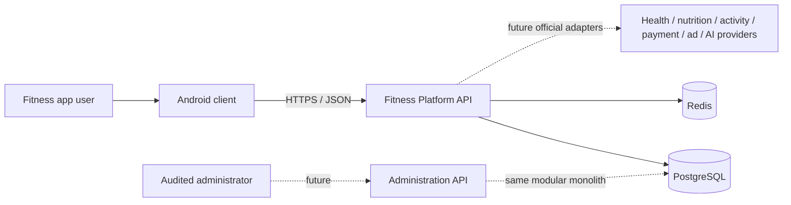
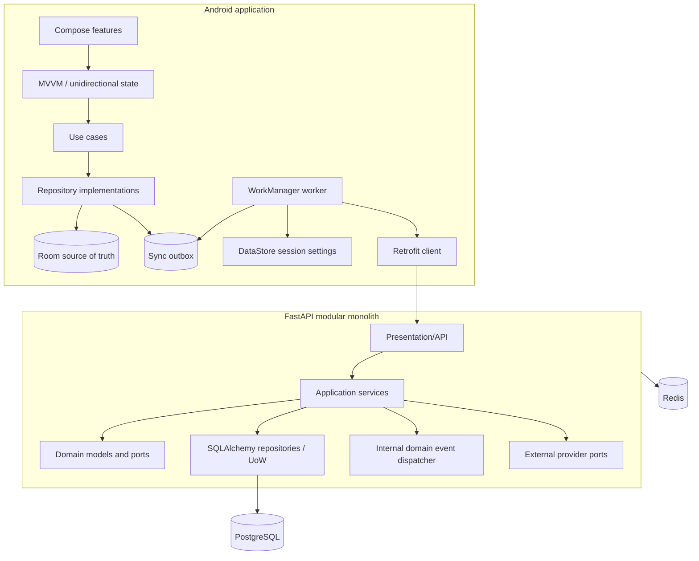
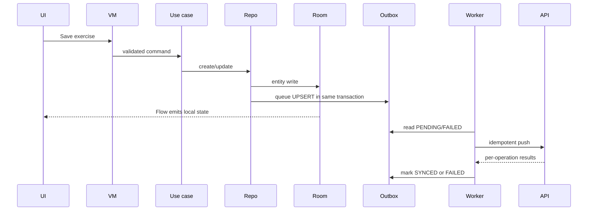
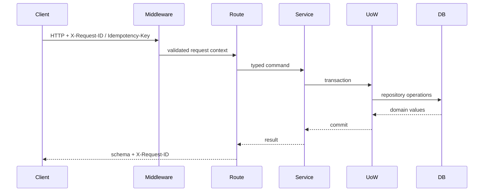

# Architecture

## 1. Scope and quality attributes

This scaffold establishes the technical foundation only. The implemented vertical slice is intentionally small, while module boundaries anticipate the larger product without coupling current code to speculative vendor APIs or reward rules.

Primary quality attributes:

1. **Offline resilience:** workouts and user-owned content remain writable without a network.
2. **Correctness and idempotency:** retries must not duplicate records, events or future rewards.
3. **Evolvability:** external services are ports; the backend begins as a modular monolith.
4. **Testability:** clocks, UUIDs, repositories and providers are replaceable.
5. **Privacy/security:** sensitive integrations are opt-in; server-authoritative values are future backend concerns.
6. **Operational simplicity:** one deployable backend until scale or team boundaries justify extraction.

## 2. System context



The current repository contains the Android client, backend API and local infrastructure. No production vendor connection is implemented.

## 3. Container view



## 4. Android architecture

### 4.1 Module strategy

The project avoids both extremes: a monolithic `app` module and one Gradle module per screen. The initial modules are:

| Module | Responsibility | May depend on |
|---|---|---|
| `app` | Application object, activity, composition root | feature, data, sync, Android cores |
| `feature:main` | Guest/profile/exercise/workout UI and ViewModel | domain, model |
| `domain` | Repository contracts and use cases | model only |
| `data` | Room repository implementations and event dispatcher | domain, database, model |
| `core:model` | Immutable domain-facing data and event types | Kotlin only |
| `core:database` | Room entities, DAOs, mappings and database | model |
| `core:datastore` | Guest-token and sync preferences | Android DataStore |
| `core:network` | Retrofit API and wire DTOs | model |
| `core:sync` | WorkManager outbox transport | database, network, datastore |
| `core:testing` | Fake clock, UUID and coroutine utilities | model |

Dependency direction is inward toward `domain`/`core:model`. Compose and Room types do not leak into domain contracts.

### 4.2 MVVM and state

`PlatformViewModel` exposes one immutable `StateFlow<PlatformUiState>`. UI actions invoke use cases; use cases validate input and call repository ports. The UI renders loading, success and error state from the flow. Navigation uses Compose Navigation and passes identifiers rather than mutable objects.

### 4.3 Local source of truth

Room is authoritative for implemented local entities. UI never waits for the backend before showing a successful local write. Profile, exercise/workout and outbox mutation are committed in one Room transaction.



### 4.4 Sync states and conflict plan

Supported states are `LOCAL_ONLY`, `PENDING`, `SYNCING`, `SYNCED`, `FAILED`, `CONFLICT`.

Current behavior is push-only UUID upsert. Planned conflict rules:

- Server timestamps and monotonic conflict versions determine whether an aggregate changed remotely.
- Append-only workout facts are merged by stable child UUID where possible.
- Profile/settings use field-aware last-write resolution with a visible conflict if both sides changed.
- Deletes use tombstones so an offline device cannot resurrect removed data silently.
- Server-authoritative rewards, purchases, entitlements and tournament/boss points are never merged from client values.
- Conflicts remain durable until a deterministic policy or explicit user choice resolves them.

## 5. Backend architecture

### 5.1 Modular monolith

The backend is one deployment and one database, but domain ownership is explicit. `fitness_platform.modules.catalog` is executable architecture metadata; a test rejects unknown or cyclic dependencies.

Implemented basis modules:

- `identity` and `user_profile`
- private `exercises`
- minimal `workout_execution`
- `security` foundation
- `integrations` ports/mocks

All other required future domains are catalogued as contract-only boundaries: onboarding, equipment, locations, planning, activity/steps, nutrition, measurements, health data, analytics, gamification, quests, streaks, boss events, groups, tournaments, social, moderation, notifications, commerce, advertising, administration and AI helper.

### 5.2 Layering

```text
domain/          entities, enums, events, repository/UoW ports
application/     orchestration, validation, transactions, idempotency
infrastructure/  SQLAlchemy models, repository adapters, Unit of Work
presentation/    FastAPI routes, dependencies and Pydantic wire schemas
providers/       external provider ports and deterministic mocks
core/            config, logs, request context, errors, DB/Redis bootstrapping
```

Rules:

- Domain code imports neither FastAPI nor SQLAlchemy.
- API routes do not contain business workflows.
- SQLAlchemy rows are mapped to domain values.
- Pydantic schemas are transport contracts, not persistence models.
- The application layer controls transactions through a Unit of Work.
- External vendor types remain outside domain models.

### 5.3 Request lifecycle



## 6. Domain events

The in-process dispatcher supports typed handlers, event IDs and timestamps. Backend events are also persisted to `outbox_events` where durable publication will later be required. Android has a lightweight local dispatcher for immediate local reactions.

Initial event vocabulary:

- `GuestProfileCreated`
- `ExerciseCreated`
- `WorkoutCreated`
- `WorkoutStarted`
- `WorkoutCompleted`
- `SyncOperationQueued`
- `SyncOperationCompleted`

`WorkoutCompleted` uses a deterministic ID derived from the workout ID. Repeating completion therefore cannot trigger the same local handler twice, and the backend outbox has a unique event identifier. Future XP/reward handlers must additionally use a reward-ledger uniqueness constraint.

## 7. Ports and adapters

Core provider ports:

```text
HealthDataProvider
NutritionProvider
ActivityProvider
BodyMeasurementProvider
AuthenticationProvider
PaymentProvider
AdvertisementProvider
NotificationProvider
IntegrityProvider
AiProvider
```

The backend includes deterministic mocks for health, nutrition, activity, body measurements and authentication. Production adapters must pass provider contract tests before registration. See `INTEGRATIONS.md`.

## 8. Long-term domain extension design

### Gamification and bosses

Gamification consumes verified domain facts, never arbitrary client XP. A future reward engine writes an append-only ledger keyed by source event and rule version. Daily/per-source caps and diminishing returns are configuration with audit history. Boss damage and tournament scores are projections over qualified events, not client counters.

### Social and moderation

Structured posts reference approved workout summaries. Moderation, reporting, blocking and privacy are separate boundaries. Health/body/nutrition facts default to private and are not automatically embedded into posts.

### Commerce and ads

Store products, purchase receipts, entitlements, virtual-currency transactions and rewarded-ad confirmations are separate records. Providers are adapters; entitlement decisions are server-side. No purchased cosmetic changes ranking logic.

### AI helper

AI is optional behind `AiProvider`, consent and feature flags. A local rule layer handles deterministic app help first. Health data is excluded unless the user explicitly selects it; prompts use minimized/pseudonymized context. The domain works with AI disabled.

### Security and anti-cheat

A future integrity adapter supplies evidence/risk signals. XP, currency, quest completion, boss damage, tournament points, purchases and ad rewards remain server-authoritative. Risk signals trigger staged review rather than an irreversible ban from one indicator.

## 9. Data ownership and consistency

- UUIDs are generated client-side for offline aggregates.
- All persisted server timestamps are UTC-aware.
- PostgreSQL enforces ownership and uniqueness constraints.
- `idempotency_records` binds a key to method/path/principal and stored response.
- `outbox_events` is append-only with unique event IDs.
- Redis is non-authoritative: cache/rate-limit loss must not corrupt canonical data.
- Personally sensitive future domains should use narrower tables and retention policies rather than a generic JSON profile blob.

## 10. Deployment evolution

The modular monolith remains preferred until evidence justifies separation. A module is a candidate service only when it has a clear ownership boundary, independent scaling/availability needs, stable contracts and an operational team capable of supporting it. Likely later candidates are notifications, provider ingestion and asynchronous analytics—not identity/workout transactions by default.
