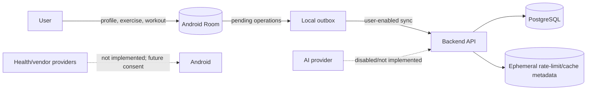

# Privacy by design

## Status and disclaimer

This is a technical privacy foundation, not legal advice. The scaffold currently stores a display name, private custom exercises and workouts. It does not implement production health, nutrition, body composition, social, ad, purchase or AI processing.

## Principles

- Optional onboarding; no sensitive body field is required for basic use.
- Local-first operation and data minimization.
- Private defaults for health/body/nutrition and user-created exercises.
- Purpose-specific consent, not one broad health switch.
- Source/provenance shown for imported records.
- Revocation and deletion are capabilities of every integration adapter.
- No health data for personalized advertising.
- AI disabled by default until explicit provider/data consent is recorded.
- Export and deletion are designed as domain workflows, not database scripts.

## Current data flow

## Data inventory

| Data | Current location | Default visibility | Purpose |
|---|---|---|---|
| Guest display name | Room, optional backend profile | private | local identity and sync ownership |
| Custom exercises/notes | Room, optional backend | private | user-defined training content |
| Workout title/status/notes | Room, optional backend | private | workout lifecycle |
| Guest token | Android DataStore; hash in backend | secret/private | development authentication |
| Request/idempotency metadata | backend | internal | reliability/security |
| Health/nutrition/body/social/purchase/AI data | not implemented | n/a | future separate consent |

## Permission matrix (planned)

| Capability | Android/platform permission | Product consent | Backend storage |
|---|---|---|---|
| Basic workout/custom exercise | none | terms/privacy acknowledgement | optional sync |
| Notifications | runtime notification permission where required | category opt-in | preference only |
| Steps/activities | granular Health Connect records | source/category consent | only selected normalized records |
| Weight/body composition | granular Health Connect records | explicit sensitive-data consent | separate protected domain |
| Nutrition/hydration | granular Health Connect records | explicit source/category consent | separate protected domain |
| Google sign-in | Credential Manager account chooser | account-link confirmation | identity token validation result, not Google password |
| Camera/QR | camera permission only when invoked | feature action | no image by default |
| AI helper | no platform permission | provider + data-category consent | minimized prompt/audit metadata only |
| Rewarded ads | consent framework where applicable | voluntary per view | verified completion, no health targeting |

No permission is requested merely because the app was installed.

## Consent records

Future auditable consent record fields:

- consent UUID, user UUID;
- purpose and data categories;
- provider/recipient;
- policy/version text hash;
- grant timestamp and source;
- withdrawal timestamp;
- optional expiry/region basis.

Withdrawal must stop future collection and enqueue provider/token revocation where possible. It does not silently delete legally required financial/audit records; those are minimized and retained under a documented rule.

## Export concept

A user export is an asynchronous, authenticated job producing machine-readable JSON/CSV plus a manifest describing schema versions, timestamps and source provenance. It includes profile, workouts, user-created exercises, settings and future selected domains. It excludes secrets, internal fraud signals about other users and third-party data the user is not entitled to receive. Download links are short-lived and audited.

## Deletion concept

1. Re-authenticate for a registered account; require a clear confirmation.
2. Revoke active sessions and provider tokens.
3. Stop ingestion, notifications, ads and AI processing.
4. Delete/anonymize user-owned profile, workouts, exercises and health data according to FK-safe domain jobs.
5. Remove social content or replace identity where legal/community integrity requires.
6. Retain only narrowly required purchase/security/audit records with restricted access and expiry.
7. propagate deletion to processors/adapters and record completion/failures;
8. provide user-visible status and retry failed downstream deletions.

Local guest deletion can clear Room/DataStore immediately because no account recovery exists.

## Retention baseline

- Active user-owned fitness records: until user deletion or user-configured retention.
- Guest sessions: expire automatically; revoked/expired rows purged after security window.
- Idempotency records: short operational period only.
- Rate-limit/cache data: minutes/hours, not a profile.
- Security/audit evidence: purpose-limited and tiered; define exact staging/production durations before launch.
- AI prompts/responses: no retention by default unless needed for the visible feature and explicitly disclosed.

## Privacy-safe social and gamification design

Body weight, body fat, calories, health records and exact location are never public defaults. Public boss/tournament contributions expose normalized/capped contribution, not raw step/health streams. Structured posts require explicit field selection. Blocking and deletion are enforced at query level.

## DSGVO technical checklist

- [x] Data inventory for current scaffold.
- [x] Local-first/minimization architecture.
- [x] Consent and provider-port extension model.
- [x] Export/deletion concepts.
- [x] Source/provenance fields planned.
- [ ] Controller/processor roles and legal bases reviewed by counsel.
- [ ] Complete records of processing and DPIA for health/community/AI features.
- [ ] Production retention schedule and deletion SLAs.
- [ ] Data-processing agreements and international transfer review.
- [ ] User-facing privacy notice and age/minor flow.
- [ ] Incident response and breach notification procedure.
- [ ] Accessibility/usability review of consent and withdrawal.
