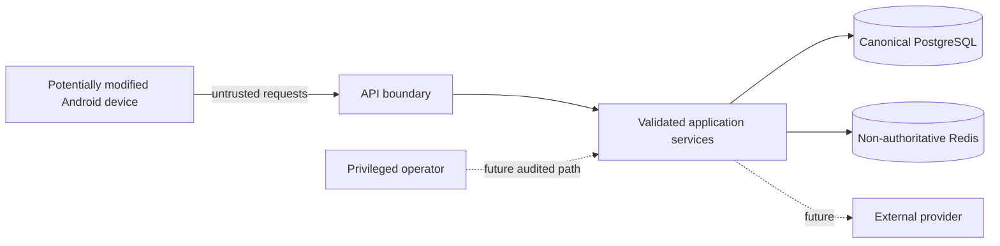

# Security foundation and threat model

## Scope

This document describes the scaffold security posture. It is not a claim of production readiness. The temporary guest-token flow, local HTTP emulator exception and absent Play Integrity implementation are explicit limitations.

## Trust boundaries

The Android client, local Room database, imported provider payloads and all request headers are untrusted. PostgreSQL is canonical for server-authoritative values.

## Current controls

- Environment-based configuration and `.env.example`; no committed secrets.
- Production startup rejects the development guest-token pepper.
- Random guest bearer tokens; only hashes are persisted.
- Strict Pydantic request schemas and application validation.
- SQLAlchemy parameterization and explicit ownership queries.
- Request IDs and structured logs without raw tokens.
- Controlled CORS allowlist and methods/headers.
- Redis-backed rate-limit seam with safe application fallback.
- Idempotency key request fingerprint and unique database constraints.
- UUID ownership checks and soft-delete rules.
- Safe error envelope without stack traces/SQL details.
- Request IDs use a 64-character ASCII allowlist; invalid values are replaced rather than reflected or logged.
- Unexpected errors return a generic envelope and log only bounded structured context/error type.
- Durable outbox delivery uses token-bound renewable leases, bounded retries and dead letters; stale workers cannot mutate a newer claim and handler failures cannot rewrite committed HTTP success.
- Dependency/secret scans in CI.
- Android release architecture expects R8/ProGuard and no embedded provider secrets.
- Android guest tokens and recovery secrets are random-IV AES/GCM ciphertext under a non-exportable Android Keystore key. Migration verifies encrypted reads before removing legacy plaintext preferences. Bearer rejection clears only the token. Rejected recovery proofs and missing, invalid or partial cipher/key state block recovery until an explicit identity reset; they never silently replace a server-known proof, expose secrets or delete Room data.
- Private-sync failures persisted in the outbox are bounded codes, never raw exception text that could contain credentials.

## Threat table

| Threat | Current mitigation | Remaining work |
|---|---|---|
| Manipulated API request | schemas, ownership checks, server-side state transitions | integrity evidence and risk scoring for sensitive future actions |
| Replay/double submit | idempotency keys, operation IDs, unique event IDs | nonce/request-content binding for purchases/rewards |
| Duplicate sync | UUID upsert, idempotency record | pull cursor, tombstones and conflict-version enforcement |
| Manipulated local DB/APK | local values treated as claims, not future rewards | Play Integrity, anomaly detection, signed sensitive responses |
| Stolen guest token | hashed storage, expiry/revocation fields | secure device storage, rotation, session UI, account recovery/linking |
| Mass access/DoS | rate-limit foundation, pagination | edge rate limiting, quotas, WAF, circuit breakers and load tests |
| Injection | typed schemas, ORM parameterization | SAST/DAST and provider payload fuzzing |
| Secret leakage | `.gitignore`, env abstraction, gitleaks | managed secret store, rotation runbooks, environment isolation |
| Sensitive logs | structured event fields and no raw bearer logging | automated log redaction tests and retention controls |
| Malicious provider payload | provider normalization boundary | signature validation, schema/version limits, quarantine queue |
| Purchase/ad fraud | provider ports only | server receipt/callback verification and unique ledgers |
| XP/step farming | no reward implementation yet | server-authoritative rule engine, caps, provenance and anomaly review |

## Server-authoritative future values

The following must never be accepted as final client values: XP, level, currency balance, quest completion, boss damage, tournament/leaderboard score, entitlements, purchase state, ad rewards and paid streak freezes. Clients submit source events/evidence; the backend validates and writes append-only ledgers.

## Anti-cheat extension points

`IntegrityProvider` will normalize Play Integrity evidence and future risk signals. Sensitive requests should include request content binding, freshness, request UUID and verified principal. Root/emulator/hooking indicators are risk signals only, not an automatic permanent ban.

Planned response ladder:

1. mark event/risk evidence;
2. withhold only the disputed reward;
3. request additional validation;
4. inform the user;
5. allow appeal;
6. restrict only with strong, reviewable evidence.

Feature flags and a kill switch must disable abused reward paths without disabling basic local fitness tracking.

## Android token and transport plan

- Guest bearer and recovery credentials use Android Keystore-backed encrypted storage; DataStore retains only non-secret installation, consent and credential-state metadata.
- Before production, add user-visible session/reset UX, revocation and account-link recovery around the current blocked-credential contract.
- Production traffic is HTTPS only.
- The manifest permits cleartext solely for emulator `10.0.2.2`/localhost local development.
- Certificate pinning, if adopted, requires backup pins and remote rotation; a brittle single pin is worse than platform trust.
- Credential Manager performs Google credential acquisition; backend validates the Google token and issues platform sessions.

## Build and container scanning

The backend Dockerfile uses a digest-pinned Python 3.13 slim base and separate build/runtime
stages. The runtime contains the locked production virtual environment and Alembic files, but no
tests, dev extras, compiler, uv binary or build cache, and runs as the non-root `fitness` user.

CI scans two distinct targets: the checked-out filesystem/dependencies and the loaded
`fitness-platform-backend:ci` runtime image. Fixed HIGH/CRITICAL findings fail. All findings,
including unfixed/deferred ones, are retained as SARIF artifacts without a permanent ignorelist.
On 2026-07-13 Trivy 0.66.0 reported zero fixed HIGH/CRITICAL findings and 20 Debian 13.5
HIGH/CRITICAL findings without an available fixed version (including Perl, util-linux, ncurses,
gzip and ACL packages). This is a visible upstream base-image blocker, not a green all-findings
claim; the pinned digest must be reviewed when Debian/Python publish fixes.

## Password architecture (prepared, not implemented)

Future email login uses a modern password hash such as Argon2id, per-user salt, optional server-side pepper, email verification, reset-token hashing, rate limits and account-enumeration-resistant responses. Passwords never transit to logs or provider adapters.

## Security review checklist before staging

- Replace guest-token development flow or isolate it behind a non-production flag.
- Configure managed secrets and rotate all local defaults.
- Enforce HTTPS and strict staging CORS.
- Add production PostgreSQL/Redis TLS and least-privilege credentials.
- Add session rotation/revocation and secure Android storage.
- Add SAST, DAST and SBOM review; keep the implemented filesystem/image Trivy gates current.
- Threat-model each new health, social, purchase, reward and AI slice.
- Add audit retention and privileged-action approval rules.
- Run abuse, rate-limit, fuzz and restore tests.

## Reporting

Do not open a public issue containing a live secret or exploitable personal-data path. A private security contact/process must be defined before public release.
