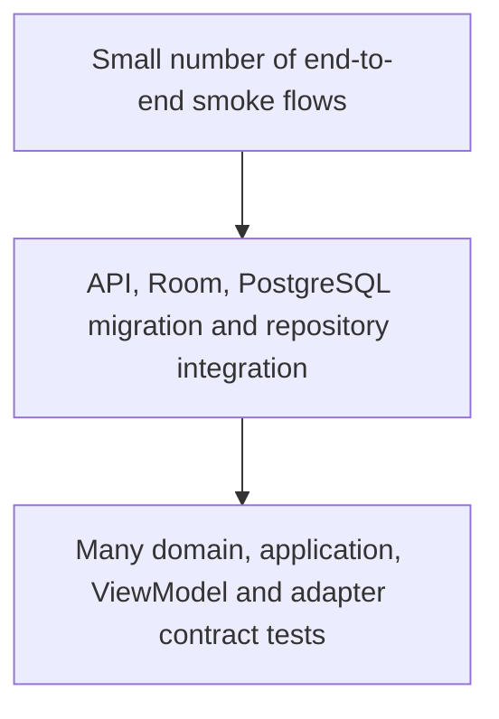

# Testing strategy

## Goals

Tests protect domain invariants and integration seams, not implementation trivia. Time, UUIDs and providers are deterministic. A test that depends on public internet, wall-clock timing or a real vendor account is not part of the default suite.

## Test pyramid



## Naming and structure

- Python: `test_<behavior>.py`; test name describes outcome, not method name.
- Kotlin: backtick behavior names or `givenWhenThen` names.
- Arrange/Act/Assert sections are separated when a test is not self-evident.
- One logical behavior per test; parameterize equivalent cases.
- Test fixtures are minimal and explicitly marked demo/test data.

## Backend tests

Current suite covers:

- guest session/profile creation and repeated idempotent request;
- exercise create, validation, update, delete and idempotency;
- workout create/start/complete;
- `WorkoutCompleted` persisted exactly once;
- sync push;
- internal event dispatcher;
- post-commit HTTP semantics and durable outbox claim-token/heartbeat/lost-claim/retry/dead-letter behavior on SQLite and PostgreSQL;
- bounded request IDs and generic redacted `500` envelopes;
- module dependency graph;
- provider contracts and deterministic mocks;
- Alembic migration on an empty database.

Commands:

```bash
cd backend
uv sync --extra dev --frozen
uv run pytest
uv run pytest -m contract
uv run pytest --cov-report=html
```

Fast tests use isolated SQLite. CI additionally applies the Alembic migration to PostgreSQL. Repository behavior that is PostgreSQL-specific must receive a `@pytest.mark.integration` test against a disposable database/container.

## Android tests

Gate E/E.1/E.2 adds JVM coverage for secret-store concurrency and token/all-clear separation,
bearer recovery policy, terminal recovery rejection, explicit blocked-to-ready reset, reset failure,
post-reset enqueue ordering, owner-scoped consent release and stale-owner finalization. Room
instrumentation sources cover schema 4→5 cursor initialization, transaction rollback/commit
boundaries, claim release and success/failure/conflict rejection after another worker reclaims a
lease. Keystore instrumentation sources cover missing aliases, partial cipher pairs, corrupt
ciphertext, alias deletion and repeatable reset. CI and the local emulator-independent gate compile
database, datastore, sync, data and app Android-test sources; execution still requires a suitable
API-36 device/AVD.

Test layers:

- **Use-case tests:** validation and orchestration against fakes.
- **ViewModel tests:** loading/success/error state with test dispatchers.
- **Room instrumentation tests:** persistence after database reopen, CRUD, relationships and outbox.
- **Repository instrumentation tests:** conflict snapshots and atomic keep-local/take-server/manual-merge transactions.
- **Repository/event tests:** atomic write/outbox behavior and domain-event idempotence.
- **Compose instrumentation:** guest creation and navigation smoke path.
- **WorkManager tests:** Robolectric worker tests cover bearer renewal, recovery rejection/no-loop behavior and consent release; Android runtime remains required for platform adapter execution.

Commands:

```bash
cd android
./gradlew test
./gradlew :core:database:compileDebugAndroidTestKotlin \
  :core:datastore:compileDebugAndroidTestKotlin \
  :core:sync:compileDebugAndroidTestKotlin \
  :data:compileDebugAndroidTestKotlin \
  :app:compileDebugAndroidTestKotlin
./gradlew connectedProjectAndroidTest # only modules with AndroidTest sources
./gradlew lintDebug assembleDebug
```

For the Windows-hosted emulator from WSL, use the controlled direct-ADB workflow instead of a
root `connectedDebugAndroidTest` run:

```bash
make android-connected-test
# or: ANDROID_SERIAL=emulator-5556 ./scripts/android-connected-tests.sh data
```

It requires exactly one device (or an explicit `ANDROID_SERIAL`), builds only `core:database`,
`data` and `app`, writes raw logs to `android/build/connected-test-results/`, parses successful
test counts and times out after 180 seconds per runner. API 36 with Google APIs/x86_64 is the
project baseline. The currently installed Windows emulator image is API 37 preview and is not a
valid substitute for acceptance verification.

`core:testing` provides `FakeClock`, `FakeUuidProvider`, deterministic test values and `MainDispatcherRule`.

## Fixtures and builders

- Prefer builders/factories over global mutable fixtures.
- Default values must be valid and visibly synthetic.
- A test changes only fields relevant to the behavior.
- Database tests create an isolated schema/database and clean it afterward.
- No test token, email or body/health value may resemble production data.

## Mock versus fake

- **Fake:** working in-memory repository/provider with deterministic behavior; preferred for application tests.
- **Mock:** verifies a narrow interaction when output/state cannot express the behavior; use sparingly.
- **Stub:** fixed response for protocol edge cases.
- Production adapters must share a contract test suite with deterministic mocks.

## Time, UUID and coroutines

- Inject `Clock` and `UuidProvider`; never assert against `now()` or random output directly.
- Use `kotlinx-coroutines-test`, virtual time and a main-dispatcher rule.
- Python async tests use `pytest-asyncio` and no arbitrary sleeps.
- Event IDs for semantically once-only events are deterministic or protected by unique storage constraints.

## Provider contract tests

Each provider contract should verify:

1. stable normalized identifiers and provenance;
2. deterministic paging/cursors;
3. timestamp/time-zone normalization;
4. duplicate handling;
5. permission/consent failures;
6. deletion/change semantics;
7. transient versus permanent errors;
8. no provider credential leakage.

Mocks must pass the same normalization contract as future official adapters.

## End-to-end basis

Target journey:

```text
create local guest
-> create custom exercise
-> create/start/complete workout
-> queue outbox
-> push to backend
-> verify backend entity and event
```

Current automation covers both sides up to the network boundary and provides `scripts/smoke_test.py` for a running backend. A full emulator-to-Docker test is deliberately a later slice because it could not be executed reliably in the generator environment.

## Coverage

- Backend configured floor: 70% overall, with high coverage expected in domain/application code.
- New reward, purchase, entitlement, moderation and integrity logic should approach full branch coverage.
- Generated/configuration code is excluded where coverage would be artificial.
- Android coverage reporting should be added with the next full sync slice; tests are required before a numeric gate is introduced.

## CI behavior

CI fails on formatting, lint, type errors, test failures, migration drift, Android lint/build failure, secret findings, dependency audit failure, Docker build failure or fixed HIGH/CRITICAL Trivy findings. Filesystem/dependency and loaded runtime-image scans are separate. Unfixed HIGH/CRITICAL findings do not silently disappear: SARIF reports are uploaded for review. No check is documented as successful unless it actually ran in the relevant environment.

Source handoff archives are produced from Git-tracked, explicitly filtered paths:

```bash
make source-archive
```

The command validates sorted safe ZIP entries and prints the file count and SHA-256. Repeated runs
from the same index must produce the same digest. Secret/local/generated paths and Gradle
distributions are rejected; the verified wrapper JAR is the sole binary allowlist entry.

## Catalog verification

Backend coverage includes immutable no-op/conflict identities, duplicate and unknown relations,
unsafe licenses, review/publication rules, older imports, removal, failed staging/activation,
explicit rollback, literal wildcard filters, 500+ item snapshots, private/public separation and
PostgreSQL concurrent imports/activations. Migration upgrade/check/downgrade/re-upgrade runs on
fresh SQLite and PostgreSQL databases.

Android JVM tests verify canonical snapshot hashing and rejection of tampered, partial or invalid
relationships. Room/repository instrumentation sources cover persistence, migration 2→3, seed
idempotency, combined filters, atomic failure preservation and invalid-refresh cache retention.
The emulator-independent gate compiles those sources; connected execution still requires the
stable API-36 AVD described below.

`make doctor` warns for a missing Windows stable API-36 AVD; `make doctor-connected` is strict. Install with `sdkmanager.bat "system-images;android-36;google_apis;x86_64"`, then `avdmanager.bat create avd -n Momentum_API_36 -k "system-images;android-36;google_apis;x86_64"`.
