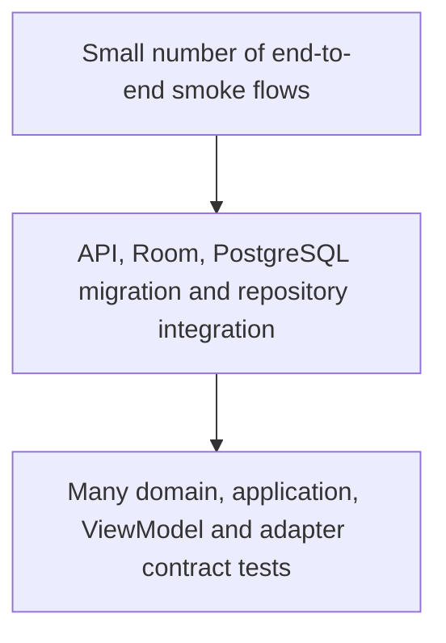

# Testing strategy

## Goals

Tests protect domain invariants and integration seams, not implementation trivia. Time, UUIDs and providers are deterministic. A test that depends on public internet, wall-clock timing or a real vendor account is not part of the default suite.

## Test pyramid



## Naming and structure

- Python: `test_<behavior>.py`; test name describes outcome, not method name.
- Kotlin: backtick behavior names or `givenWhenThen` names.
- Arrange/Act/Assert sections are separated when a test is not self-evident.
- One logical behavior per test; parameterize equivalent cases.
- Test fixtures are minimal and explicitly marked demo/test data.

## Backend tests

Current suite covers:

- guest session/profile creation and repeated idempotent request;
- exercise create, validation, update, delete and idempotency;
- workout create/start/complete;
- `WorkoutCompleted` persisted exactly once;
- sync push;
- internal event dispatcher;
- module dependency graph;
- provider contracts and deterministic mocks;
- Alembic migration on an empty database.

Commands:

```bash
cd backend
uv sync --extra dev --frozen
uv run pytest
uv run pytest -m contract
uv run pytest --cov-report=html
```

Fast tests use isolated SQLite. CI additionally applies the Alembic migration to PostgreSQL. Repository behavior that is PostgreSQL-specific must receive a `@pytest.mark.integration` test against a disposable database/container.

## Android tests

Test layers:

- **Use-case tests:** validation and orchestration against fakes.
- **ViewModel tests:** loading/success/error state with test dispatchers.
- **Room instrumentation tests:** persistence after database reopen, CRUD, relationships and outbox.
- **Repository/event tests:** atomic write/outbox behavior and domain-event idempotence.
- **Compose instrumentation:** guest creation and navigation smoke path.
- **WorkManager tests:** worker retry and status transitions are the next sync slice.

Commands:

```bash
cd android
./gradlew test
./gradlew connectedDebugAndroidTest   # emulator/device required
./gradlew lintDebug assembleDebug
```

`core:testing` provides `FakeClock`, `FakeUuidProvider`, deterministic test values and `MainDispatcherRule`.

## Fixtures and builders

- Prefer builders/factories over global mutable fixtures.
- Default values must be valid and visibly synthetic.
- A test changes only fields relevant to the behavior.
- Database tests create an isolated schema/database and clean it afterward.
- No test token, email or body/health value may resemble production data.

## Mock versus fake

- **Fake:** working in-memory repository/provider with deterministic behavior; preferred for application tests.
- **Mock:** verifies a narrow interaction when output/state cannot express the behavior; use sparingly.
- **Stub:** fixed response for protocol edge cases.
- Production adapters must share a contract test suite with deterministic mocks.

## Time, UUID and coroutines

- Inject `Clock` and `UuidProvider`; never assert against `now()` or random output directly.
- Use `kotlinx-coroutines-test`, virtual time and a main-dispatcher rule.
- Python async tests use `pytest-asyncio` and no arbitrary sleeps.
- Event IDs for semantically once-only events are deterministic or protected by unique storage constraints.

## Provider contract tests

Each provider contract should verify:

1. stable normalized identifiers and provenance;
2. deterministic paging/cursors;
3. timestamp/time-zone normalization;
4. duplicate handling;
5. permission/consent failures;
6. deletion/change semantics;
7. transient versus permanent errors;
8. no provider credential leakage.

Mocks must pass the same normalization contract as future official adapters.

## End-to-end basis

Target journey:

```text
create local guest
-> create custom exercise
-> create/start/complete workout
-> queue outbox
-> push to backend
-> verify backend entity and event
```

Current automation covers both sides up to the network boundary and provides `scripts/smoke_test.py` for a running backend. A full emulator-to-Docker test is deliberately a later slice because it could not be executed reliably in the generator environment.

## Coverage

- Backend configured floor: 70% overall, with high coverage expected in domain/application code.
- New reward, purchase, entitlement, moderation and integrity logic should approach full branch coverage.
- Generated/configuration code is excluded where coverage would be artificial.
- Android coverage reporting should be added with the next full sync slice; tests are required before a numeric gate is introduced.

## CI behavior

CI fails on formatting, lint, type errors, test failures, migration drift, Android lint/build failure, secret findings, dependency audit failure or Docker build failure. No check is documented as successful unless it actually ran in the relevant environment.
